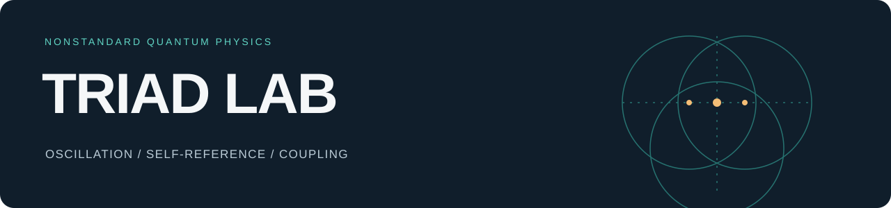

<p align="center"></p>

**English** · [Português](docs/pt-BR/README.md)

# A living laboratory

**Explore relations, memory and emergent structures — with code, data and results side by side.**

TRIAD Lab brings together independent series of numerical experiments by Leonardo Andujar. Each catalog entry connects a question to its available implementation and records. The lab grows through new series and runs while preserving its existing records.

**[Explore experiments](experiments/README.md) · [Run locally](docs/en/getting-started.md) · [Browse the gallery](docs/en/gallery.md) · [Contribute](docs/en/contributing.md)**

## Explore the lab

| Series | What it explores | Path |
|---|---|---|
| **Entre** | Coupled oscillators, relational memory and continuous layers | [4 experiments](experiments/entre-01-observer/README.md) |
| **Bravais 3D** | Complex fields, spatial geometry and spectral structure | [3 experiments](experiments/bravais-01-field/README.md) |
| **T research archive** | 39 runs, the QM sequence and explorations of fields, geometry and continuity | [7 reading paths](collections/t-archive/README.md) |


*Preserved original figure. Existing images retain their Portuguese labels.*

## Choose your entry point

- **Read:** open the [catalog](experiments/README.md); each page connects a question to code, data and images.
- **Run:** follow the [local guide](docs/en/getting-started.md), starting with post-processing a saved state.
- **Extend:** use the [experiment template](templates/experiment/README.md) to record a new investigation.
- **Translate:** follow the [language guide](docs/en/languages.md); English is the editorial base, Portuguese is the first translation.

## How the lab is organized

```text
collections/       Historical collections, indexes and provenance
experiments/       Catalog + experiment pages; new experiment folders grow here
docs/en/           English reading, running and contribution guides
docs/pt-BR/        Equivalent Portuguese guides
templates/         Starting points for experiments and run records
entre/             Original Portuguese scripts, data and recorded figures
bravais/           Original Portuguese scripts, saved state and figures
en/                Existing English scripts and data
```

Historical paths remain valid. New experiments use a shared implementation and documentation per language; existing translated scripts are preserved. [Conventions and growth](docs/en/contributing.md).

## Continuity

Original scripts, configurations and results have been preserved. Check their hashes with:

```sh
shasum -a 256 -c docs/archive/SHA256SUMS
# T archive (after git lfs pull):
shasum -a 256 -c collections/t-archive/SHA256SUMS
```

[Next steps](docs/en/roadmap.md) · [Organization history](CHANGELOG.md) · [Original record](docs/archive/README.md)
