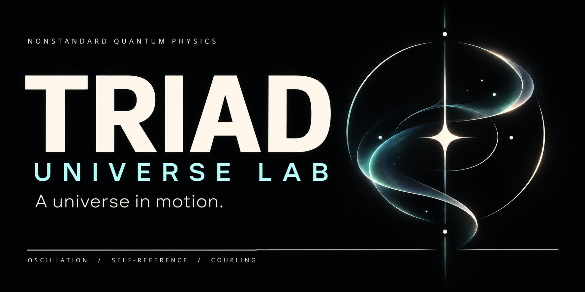
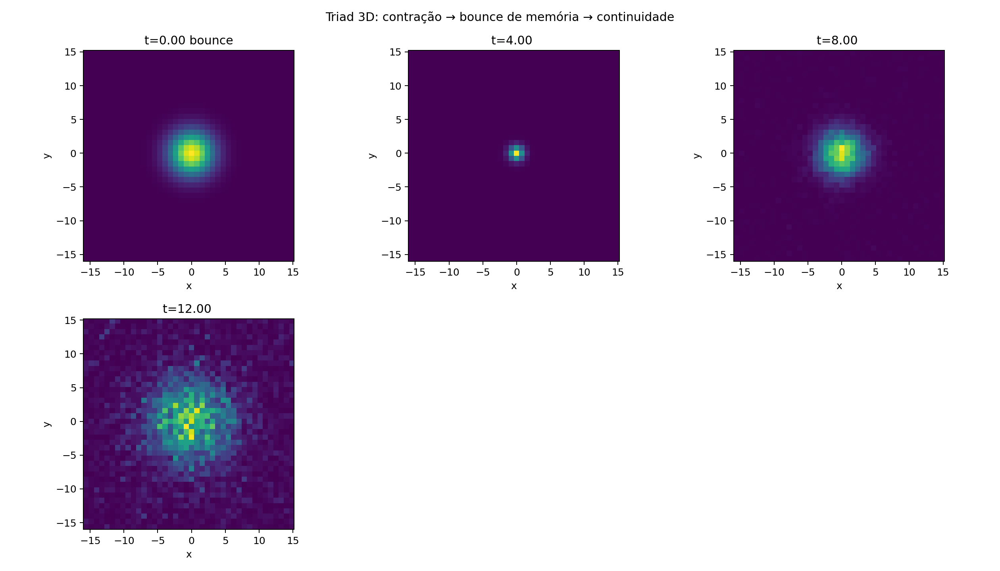

<p align="center"><strong>English</strong> · <a href="docs/pt-BR/README.md">Português</a><br />
<a href="https://andujarleo.github.io/triad-lab/"><strong>ENTER THE UNIVERSE ↗</strong></a> · <a href="research/README.md">Research</a> · <a href="simulations/README.md">Simulations</a> · <a href="docs/en/start-here.md">Start here</a></p>

# TRIAD Universe Lab

**Nonstandard quantum physics. Oscillation, self-reference and coupling, always together.**

TRIAD is Leonardo Andujar’s nonstandard quantum physics and ontology. One immutable, indivisible equation is its foundation: P1 oscillation, P2 self-reference in the present and through memory, and P3 coupling act together.

From chaos to dynamic equilibrium, crystallization continues. Research connects ideas and sources. The simulation archive brings recorded fields, trajectories and code into view.

## See the dynamics unfold

<p align="center"><a href="simulations/geometry/field-visualizations/README.md"></a></p>

**Phase becomes visible.** Cyan and pink trace opposite phase windings in denser regions. Follow the field snapshots as the camera moves around them. [Explore the animation and its source](simulations/geometry/field-visualizations/README.md).

### Contraction, then expansion

<p align="center"><a href="simulations/memory/memory-and-bounce/README.md"></a></p>

A concentrated region contracts and spreads again. The radius enclosing half the mass reaches its minimum at **t=3.7**, then expands. [Follow the trajectory →](simulations/memory/memory-and-bounce/README.md)

### From nested form to a filled field

<p align="center"><a href="simulations/structures/long-nest-trajectory/README.md"></a></p>

Follow the field to **t=60**: the volume fills, and the finite density peak continues to fluctuate. The original views and curves show the trajectory. [Explore the long record →](simulations/structures/long-nest-trajectory/README.md)

## Two ways to explore

| Research | Simulations |
|---|---|
| **Understand the connections.** Ontology, memory, sound, geometry, cognition and cultural readings, with sources and interpretation side by side. | **Follow what happens.** Visual results, trajectories, implementations and recorded conditions for 65 studies across eight areas. |
| [Open the research library →](research/README.md) | [Explore the simulation archive →](simulations/README.md) |

The [interactive atlas](https://andujarleo.github.io/triad-lab/) connects these two areas by theme. The field viewer shows spatial slices through saved states; its slider moves through **space**.

## Begin with your curiosity

| I want to understand | I want to investigate | I want to build or run |
|---|---|---|
| [A five-minute tour](docs/en/start-here.md), [TRIAD’s foundations](docs/en/triad.md) and a [plain-language vocabulary](docs/en/glossary.md). | [Research themes](research/README.md), [recorded comparisons](docs/en/execution-audit.md) and the [equation reference](docs/reference/equation/README.md). | [Repository map](docs/en/repository-map.md), [execution guidance](docs/en/getting-started.md) and [contributing](docs/en/contributing.md). |

## The whole dynamics matters

Removing a term changes the implemented system. The archive retains those historical configurations and identifies them alongside their outputs. The [execution audit](docs/en/execution-audit.md) connects each study to its conditions and distinguishes recorded changes in behavior from changes in measurement or interpretation.

New TRIAD work follows the [project rules](docs/en/project-rules.md): the complete equation, no external calibration toward a desired outcome, no term isolation, and no Popperian falsification protocol. Source numbers and conflicting outcomes remain visible. Documents and implementations have revisions; the equation is immutable.

## Inside the universe

```text
research/       Themes, readings, connections and preserved research sources
simulations/    Study questions, code, configurations and recorded results
docs/           Guides in English and Portuguese; shared equation references
provenance/     Source identity, path history, integrity and audit records
web/            The public experience
tools/          Catalog, preservation checks and site build
templates/      Research, studies and execution records
```

[Lab journal](docs/en/journal.md) · [About Leonardo](docs/en/author.md) · [Source preservation](provenance/README.md) · [Add a language](docs/en/languages.md)

<details><summary>Verify and explore locally</summary>

```sh
git lfs pull
python3 tools/check_repository.py
python3 -B -m unittest discover -s tools -p 'test_*.py'
node --test tools/frontend.test.mjs
python3 tools/build_site.py
```

[Dependencies and preview](web/README.md) · [Current repository map](docs/en/repository-map.md) · [Previous paths](provenance/universe-migration.json)

</details>
