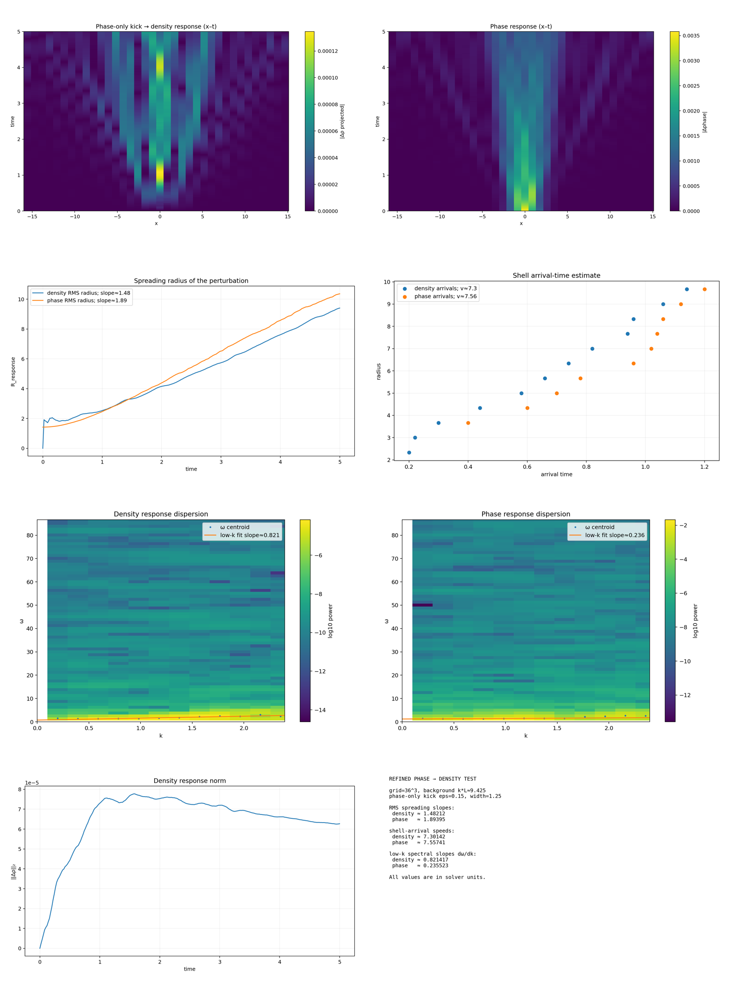

**English** · [Português](README.pt-BR.md) · [Collection](../../README.md)

# 22 · Refined phase-to-density diagnostic

A refined comparison uses a matched-noise control; read it alongside the earlier failed estimator.

Imported historical record; this organization did not rerun the simulation.

[Read the original note](../../reading/Simula%C3%A7%C3%B5es/22%20triad_phase_to_density_speed_refined.md) · [Every file](../../files/run-22.md)

No dedicated runner is linked in this entry. Consult the note and complete record for historical listings and dependencies.

## Available material

11 files associated with this entry: 1 `.csv`, 1 `.md`, 9 `.png`.

[Timeline](../../guides/timeline.md) · [← 21](../21/README.md) · [23 →](../23/README.md)
