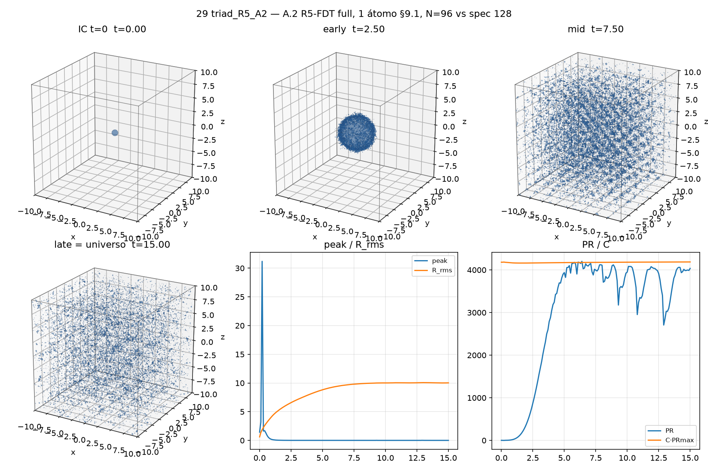

[English](README.md) · **Português** · [Acervo](../../README.pt-BR.md)

# 29 · R5 com amplitude 0,2

Run gaussiano N96, seed 42, nos parâmetros R5/FDT declarados; picos finitos no intervalo registrado.

Registro histórico importado; esta organização não reexecutou a simulação.

[Ler a nota original](../../reading/Simula%C3%A7%C3%B5es/29%20triad_R5_A2.md) · [Todos os arquivos](../../files/run-29.md)

[Script preservado](../../source/Fontes/run_R5_A2.py) · [Dependências e portabilidade](../../provenance/dependencies.pt-BR.md)

## Material disponível

10 arquivos associados à ficha: 2 `.csv`, 1 `.json`, 1 `.md`, 6 `.png`.

[Cronologia](../../guides/timeline.pt-BR.md) · [← 28](../28/README.pt-BR.md) · [30 →](../30/README.pt-BR.md)
