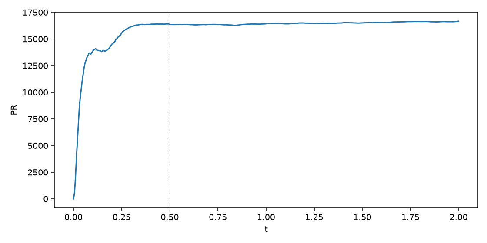

[English](README.md) · **Português** · [Acervo](../../README.pt-BR.md)

# 37 · Um bolso no campo

Bolso gaussiano plantado em um campo em evolução; há diagnósticos de identidade e memória.

Registro histórico importado; esta organização não reexecutou a simulação.

[Ler a nota original](../../reading/Simula%C3%A7%C3%B5es/37%20bolso_no_universo.md) · [Todos os arquivos](../../files/run-37.md)

[Script preservado](../../source/Fontes/run_bolso_37.py) · [Dependências e portabilidade](../../provenance/dependencies.pt-BR.md)

## Material disponível

5 arquivos associados à ficha: 1 `.csv`, 1 `.json`, 1 `.md`, 2 `.png`.

[Cronologia](../../guides/timeline.pt-BR.md) · [← 36](../36/README.pt-BR.md) · [38 →](../38/README.pt-BR.md)
