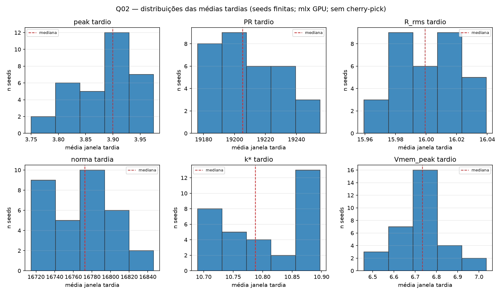

[English](README.md) · **Português** · [Acervo](../../README.pt-BR.md)

# Q02 · Ensemble com 32 seeds

Ensemble MLX com as duas versões do protocolo preservadas. A decisão QM registrada é INCONCLUSIVE.

Leia a sequência: protocolo → configuração → dados brutos → análise. As classificações abaixo pertencem ao registro histórico; não houve nova execução.

- [PROTOCOL.md](../../reading/QM/Q02_ensemble/PROTOCOL.md)
- [PROTOCOL_v2.md](../../reading/QM/Q02_ensemble/PROTOCOL_v2.md)
- [Q02.md](../../reading/QM/Q02_ensemble/Q02.md)
- [analysis.md](../../reading/QM/Q02_ensemble/analysis.md)
- [config.json](../../source/QM/Q02_ensemble/config.json)
- [result.json](../../source/QM/Q02_ensemble/result.json)
- [seeds.txt](../../source/QM/Q02_ensemble/seeds.txt)

[Todos os arquivos](../../files/q02.md) · [Dependências](../../provenance/dependencies.pt-BR.md)

