> Reading copy / Cópia de leitura. Obsidian links converted for GitHub; original wording and recorded results retained. Unresolved references stay visible as code. [Original](../../source/Simula%C3%A7%C3%B5es/00%20registro_completo.md) · [Collection / Acervo](../../README.md)

```yaml
tags: [triad, registro, moc]
aliases: [registro completo, 00 registro_completo]
date: 2026-08-21
```


# TRIAD — Registro completo de simulações

**Data:** 21 de agosto de 2026.  
**Fonte:** notas do vault Obsidian `Documents/Triad/T`, copiadas na íntegra. Nenhum número inventado.  
**Leitura:** hipótese de trabalho, não prova. 1 gaussiano = 1 átomo. Volume preenchido = universo.  
**Run 36** (reexecução do dossiê) rodou em Linux/NumPy fp64, não no Mac M5.

Este arquivo é a antologia. Não substitui as notas por run. Vazios e falhas entram.

## Sumário

- [Índice 01–36 — Índice de runs](00%20registro_completo.md)
- [Q00–Q04 — Programa QM](00%20registro_completo.md)
- Runs 01–36 em ordem (texto integral)
- analysis.md + result.json do programa QM

## Índice de runs

## Índice de runs

36 diretórios, ordem do registro. 36 = reexecução dossiê (Linux box, 21/08/2026). 1–26 = PDF 20/08/2026; 27–28 = noite 20/08/2026, solver real (triad-lang); 29 = noite 20/08/2026, spec §5 Strang standalone; 30 = 21/08/2026, Theta_core I0 dois átomos; 31 = 21/08/2026, Theta_core I0 ninho concêntrico; 32 = 21/08/2026, Theta_core I0 universo-átomo + par +/−; 33 = 21/08/2026, Theta_core I0 ninho +/− concêntrico; 34 = 21/08/2026, mesma IC do 33, T=60. 35 = 21/08/2026, Theta_core I0 singularidade finita (T=1, 1 e 2 pontos). Título da nota = id do diretório. Falhas e vazios entram.

| # | run | classe | status | resultado (PDF) |
|---|---|---|---|---|
| 1 | [triad_sim](01%20triad_sim.md) | Exploratória / pré-referência | completo | visual 2D, duas gaussianas + termo relacional; sem CSV |
| 2 | [triad_nls_fdt](02%20triad_nls_fdt.md) | Exploratória / pré-referência | completo | primeiro NLS+memória+FDT; visual |
| 3 | [triad_nls_fdt_v2](03%20triad_nls_fdt_v2.md) | Exploratória / pré-referência | completo | v2 + trajetórias de picos; visual |
| 4 | [triad_atoms_gaussians](04%20triad_atoms_gaussians.md) | Exploratória / pré-referência | completo | átomos gaussianos; visual |
| 5 | [triad_atoms_individual_fields](05%20triad_atoms_individual_fields.md) | Exploratória / pré-referência | completo | identidades gaussianas separadas; visual |
| 6 | [triad_limit_test](06%20triad_limit_test.md) | Tentativa sem artefatos | vazio | cronologia |
| 7 | [triad_limit_test_fast](07%20triad_limit_test_fast.md) | Exploratória quantitativa | completo | N={2,4,8,12} r={4,6,8}; δR>0 só N=2,r=4 |
| 8 | [triad_observer_observed_consciousness](08%20triad_observer_observed_consciousness.md) | Exploratória | completo | mean_abs_C 0 vs 0.140886; R quase idêntico |
| 9 | [triad_field_consciousness_test](09%20triad_field_consciousness_test.md) | Exploratória | completo | bounce_amplitude=0; C_memory_corr=−0.385509 |
| 10 | [triad_3d_anticollapse_test](10%20triad_3d_anticollapse_test.md) | Exploratória 3D / pré-ref | completo | visual |
| 11 | [triad_3d_longrun](11%20triad_3d_longrun.md) | Tentativa sem artefatos | vazio | cronologia |
| 12 | [triad_3d_longrun_fast](12%20triad_3d_longrun_fast.md) | Exploratória 3D | completo | visual; sem 00_montagem |
| 13 | [triad_3d_longrun_compact](13%20triad_3d_longrun_compact.md) | Exploratória 3D | completo | visual |
| 14 | [triad_R5_reference_run](14%20triad_R5_reference_run.md) | Transição | vazio | preparação R5 |
| 15 | [triad_R5_reference_fast](15%20triad_R5_reference_fast.md) | Transição | vazio | preparação R5 |
| 16 | [triad_R5_reference_N40](16%20triad_R5_reference_N40.md) | Equação de referência | completo | anti-colapso full vs no-memory |
| 17 | [triad_R5_reference_N48_full](17%20triad_R5_reference_N48_full.md) | Equação de referência | completo | scores Bravais; BCC maior, não “perfeito” |
| 18 | [triad_visual_atlas](18%20triad_visual_atlas.md) | Diagnóstico visual | completo | 22 painéis; sem cancelamento local |
| 19 | [triad_bigbang_solver_run](19%20triad_bigbang_solver_run.md) | solver.py NumPy shim | falha-diagnóstica | FDT quente; mass_final=8773.747757 |
| 20 | [triad_bigbang_3d_box](20%20triad_bigbang_3d_box.md) | solver.py NumPy shim | completo | FDT frio; expansão sem teia clara |
| 21 | [triad_phase_to_density_speed](21%20triad_phase_to_density_speed.md) | solver.py | falha-diagnóstica | velocidades ~4.008763e-16 |
| 22 | [triad_phase_to_density_speed_refined](22%20triad_phase_to_density_speed_refined.md) | solver.py | completo | fronts 7.301417 / 7.557409 |
| 23 | [triad_memory_bounce_bigbang](23%20triad_memory_bounce_bigbang.md) | solver.py | completo | R_rms False; raios de massa True |
| 24 | [triad_bravais_map](24%20triad_bravais_map.md) | Pós-processamento bounce | completo | PLANAR_cross=0.221126 (maior) |
| 25 | [triad_bravais_network_map](25%20triad_bravais_network_map.md) | Pós-processamento geométrico | falha-diagnóstica | 2 nós, 1 aresta; threshold severo |
| 26 | [triad_bravais_network_map_v2](26%20triad_bravais_network_map_v2.md) | Pós-processamento geométrico | completo | t=4.4: 39 nós, 25 arestas |
| 27 | [triad_chaos_eq](27%20triad_chaos_eq.md) | solver real (triad-lang), N=32, 2026-08-20 noite | caos-eq | 12 sementes → universo; n_det 12→1238; norm 1→25585.351298 |
| 28 | [triad_atoms_3d](28%20triad_atoms_3d.md) | solver real (triad-lang), N=40 volume 3D, 2026-08-20 noite | caos-eq | 12 sementes 3D → universo no cubo; n_det 12→1007; norm 1→23.275045 |
| 29 | [triad_R5_A2](29%20triad_R5_A2.md) | spec §5 3D Strang standalone, N=96 vs 128, 2026-08-20 noite | R5-FDT | 1 átomo §9.1 A.2 → universo no cubo; peak 1.437→0.004433; PR 1.969→4035.967; R_rms 0.612→10.023 |
| 30 | [triad_dois_atomos](30%20dois_atomos_gravidade.md) | Theta_core I0, 2 gaussianas, N=64, 2026-08-21 | par / pico finito | 2 blobs só até t=0.01 (sep 6.000→6.021); t=0.02 universo (n_raw 30, R_rms 15.88); peak_max=4.770 finito; norm 1→18033 |
| 31 | [triad_nested](31%20nested_gaussians.md) | Theta_core I0, 2 gaussianas aninhadas, N=64, 2026-08-21 | ninho / pico finito | two-scale até t=0.02 (cim 7.89→6.67); t=0.03 universo (R_rms 15.91); peak_max=4.525 finito; norm 1→18022 |
| 32 | [triad_universo_atomo](32%20universo_atomo.md) | Theta_core I0, universo-átomo + par +/−, N=64, 2026-08-21 | ninho 3 / ímã-repele / pico finito | par +/− só em t=0 (sep=5.000); t=0.01 universo (n_raw 8608, R_rms 15.85); peak_max=4.599 finito; norm 1→18029 |
| 33 | [triad_ninho_pm](33%20ninho_pm.md) | Theta_core I0, ninho +/− concêntrico, N=64, 2026-08-21 | ninho sinal / oco / pico finito | oco +/− até t=0.04 (sign até 0.08, flicker t=1.0); t=0.01 universo (R_rms 15.77); peak_max=4.452 finito; norm 1→18022 |
| 34 | [triad_ninho_pm_long](34%20ninho_pm_long.md) | Theta_core I0, ninho +/− T=60, N=64, 2026-08-21 | universo preenchido / sem rebirth | depois de t=1 só universo; sem nest/par/bounce real; peak_max=4.851 em t=10.4 depois platô ~3.31; late norm 32591±72; cryst Δ=2e-6 |
| 35 | [triad_singularidade_35](35%20singularidade_finita.md) | Theta_core I0, 1 e 2 picos, N=64 T=1, 2026-08-21 | singularidade finita | 1atom peak_max=5.3739 t=0.185 n_células 1→1 t_gone=0.005 não aperta; 2atom peak_max=4.76867 t=0.705 n_células 2→1 t_gone=0.005 não aperta |
| 36 | [reexecucao_integral](36%20reexecucao_integral.md) · [TRIAD_reexecucao_integral_2026-08-21](../Fontes/TRIAD_reexecucao_integral_2026-08-21.md) | reexecução dossiê Grok, Linux/NumPy fp64, 21/08/2026 | completo | A.3 64/128/160 H_plateau; P1/P4 PARTIAL; P2/P3/P5/P6 MATCH; CHSH S=2.023±0.092; bandas INCONCLUSIVO; túnel sujo; banho PARTIAL; k*L=3π; Bravais chão |

Classes: [Registro integral](../Fontes/Registro%20integral.md). Equação: `[[Equação de referência]]`. Conceitos: [Anti-colapso](../Conceitos/Anti-colapso.md) · [Bounce](../Conceitos/Bounce.md) · [Rede Bravais](../Conceitos/Rede%20Bravais.md) · [Phase-to-density](../Conceitos/Phase-to-density.md) · [Observador e campo C](../Conceitos/Observador%20e%20campo%20C.md) · [FDT](../Conceitos/FDT.md) · [Memória](../Conceitos/Mem%C3%B3ria.md) · [Leitura operacional](../Conceitos/Leitura%20operacional.md).

Voltar: `[[TRIAD]]`

## Runs 01–36

### Run 01 — 01 triad_sim

*Fonte:* `Simulações/01 triad_sim.md`

## triad_sim

Antecede a `[[Equação de referência]]`. Campo 2D visual: duas entidades gaussianas + termo relacional. Quadro: [Universo como simulação](../Conceitos/Universo%20como%20simula%C3%A7%C3%A3o.md).

### Objetivo

Comparar isolado vs acoplado. Sequência: separado → aproximação → acoplamento → sobreposição. Corte 1D: A, B, soma sem termo relacional, sistema acoplado.

### Resultado preservado

Só visual. Sem CSV. Nenhuma métrica reconstruída a partir dos gráficos.


### Arquivos

`00_montagem_simulacao.png` · `01_separated.png` · `02_approaching.png` · `03_coupled.png` · `04_overlap.png` · `05_isolado_vs_acoplado.png`

→ [Índice de runs](%C3%8Dndice%20de%20runs.md)

### Run 02 — 02 triad_nls_fdt

*Fonte:* `Simulações/02 triad_nls_fdt.md`

## triad_nls_fdt

Primeira tentativa de NLS + [Memória](../Conceitos/Mem%C3%B3ria.md) + [FDT](../Conceitos/FDT.md). Posteriormente revista em [03 triad_nls_fdt_v2](03%20triad_nls_fdt_v2.md). Ainda não é o `[[Solver]]` da fase (c).

### Objetivo

Traduzir a dinâmica para NLS com memória e ruído FDT.

### Resultado preservado

Mapas espaço-tempo de densidade, separação, aceleração relativa, perfis, memória e norma. Sem CSV. Gráficos = registro integral disponível.

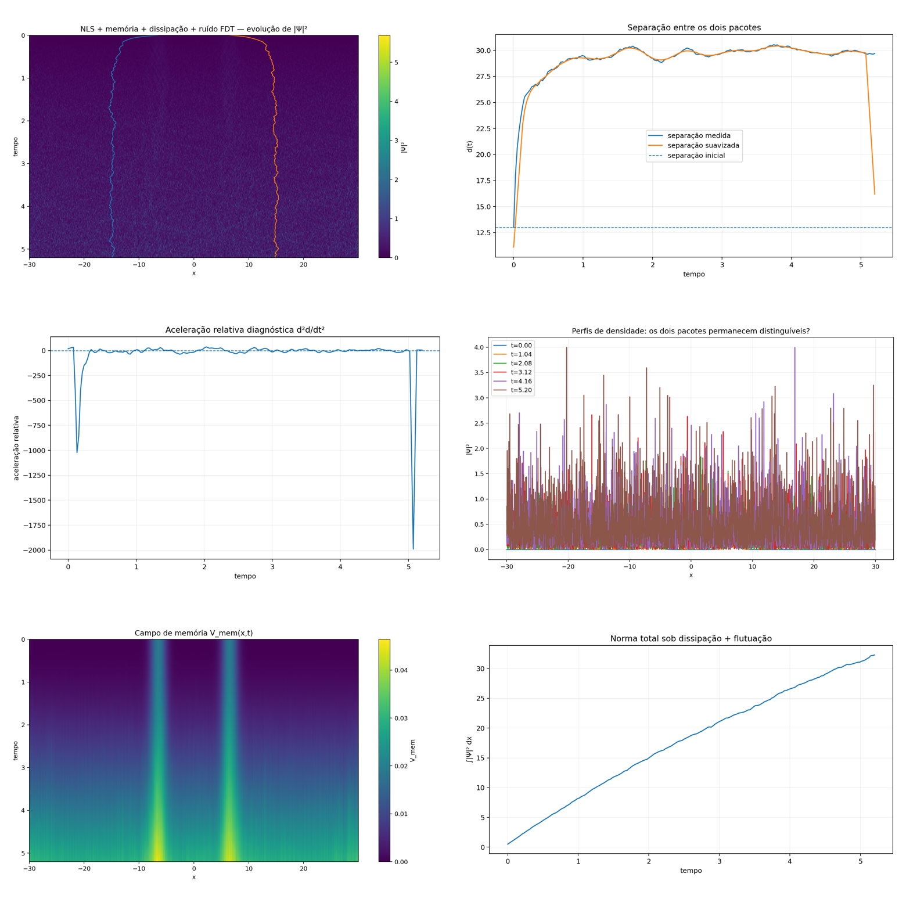

### Arquivos

`00_montagem.png` · `01_spacetime_density.png` · `02_separation.png` · `03_relative_acceleration.png` · `04_density_profiles.png` · `05_memory_field.png` · `06_norm.png`

→ [Índice de runs](%C3%8Dndice%20de%20runs.md)

### Run 03 — 03 triad_nls_fdt_v2

*Fonte:* `Simulações/03 triad_nls_fdt_v2.md`

## triad_nls_fdt_v2

Segunda versão do ensaio NLS/FDT. Diagnósticos extras: separação e trajetórias de picos.

### Objetivo

Repetir [02 triad_nls_fdt](02%20triad_nls_fdt.md) com picos rastreados.

### Resultado preservado

Evolução espaço-temporal, distância, aceleração, perfis, memória, norma, separação de picos, trajetórias. Sem CSV.


### Arquivos

`00_montagem.png` · `01_evolucao.png` · `02_distancia.png` · `03_aceleracao.png` · `04_perfis.png` · `05_memoria.png` · `06_norma.png` · `07_separacao_picos.png` · `08_trajetorias_picos.png`

→ [Índice de runs](%C3%8Dndice%20de%20runs.md) · [Memória](../Conceitos/Mem%C3%B3ria.md) · [FDT](../Conceitos/FDT.md)

### Run 04 — 04 triad_atoms_gaussians

*Fonte:* `Simulações/04 triad_atoms_gaussians.md`

## triad_atoms_gaussians

Cada gaussiana tratada como átomo candidato: trajetórias, espaçamento, espalhamento da nuvem, densidade, memória.

### Objetivo

Ler a nuvem multi-gaussiana como conjunto de “átomos”.

### Resultado preservado

Saída visual de nuvem em evolução. Esta versão **antecede** a correção de manter identidades explicitamente separadas — ver [05 triad_atoms_individual_fields](05%20triad_atoms_individual_fields.md). Sem CSV.


### Arquivos

`00_montagem.png` · `01_atoms_spacetime.png` · `02_atom_trajectories.png` · `03_neighbor_spacing.png` · `04_cloud_spread.png` · `05_density_snapshots.png` · `06_memory_spacetime.png`

→ [Índice de runs](%C3%8Dndice%20de%20runs.md) · [Memória](../Conceitos/Mem%C3%B3ria.md)

### Run 05 — 05 triad_atoms_individual_fields

*Fonte:* `Simulações/05 triad_atoms_individual_fields.md`

## triad_atoms_individual_fields

Correção metodológica sobre [04 triad_atoms_gaussians](04%20triad_atoms_gaussians.md): cada gaussiana mantém identidade própria. Campos podem se sobrepor/interagir sem fundir numa única identidade.

### Objetivo

Identidades persistentes + interação, sem fusão matemática.

### Resultado preservado

Espaço-tempo por átomo, centros, espaçamento, espalhamento, larguras individuais, memória. Sem CSV.

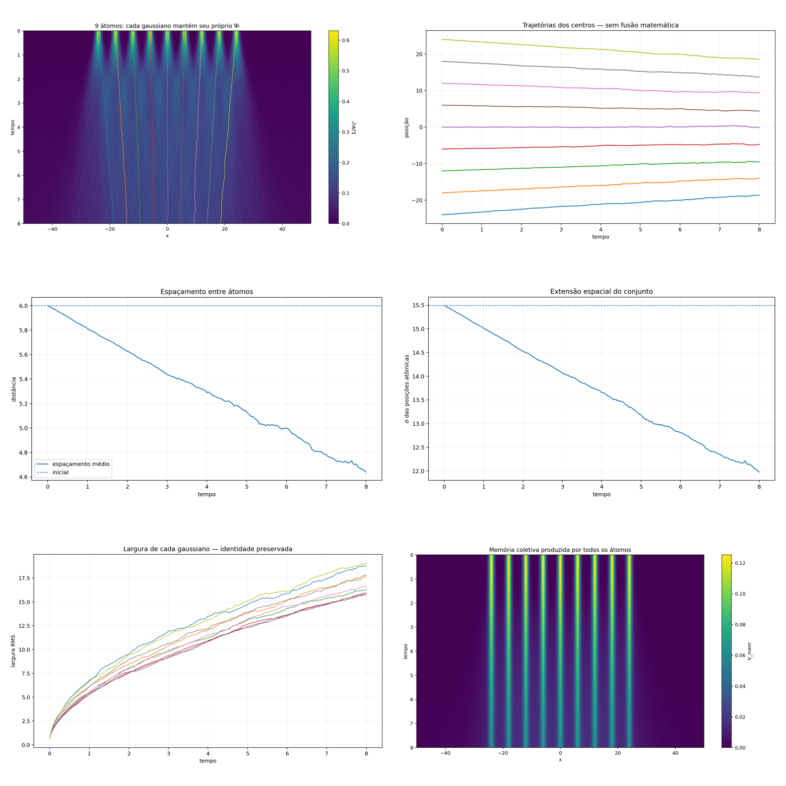

### Arquivos

`00_montagem.png` · `01_individual_atoms_spacetime.png` · `02_centers.png` · `03_spacing.png` · `04_cloud_spread.png` · `05_atom_widths.png` · `06_memory.png`

→ [Índice de runs](%C3%8Dndice%20de%20runs.md)

### Run 06 — 06 triad_limit_test

*Fonte:* `Simulações/06 triad_limit_test.md`

## triad_limit_test

Primeira preparação para varrer número de elementos e escala inicial.

### Resultado preservado

Diretório sem arquivos. O teste foi refeito em [07 triad_limit_test_fast](07%20triad_limit_test_fast.md). Mantido para não apagar a cronologia. Sem CSV, sem métrica.

Ver regra de integridade: [Registro integral](../Fontes/Registro%20integral.md).

→ [Índice de runs](%C3%8Dndice%20de%20runs.md)

### Run 07 — 07 triad_limit_test_fast

*Fonte:* `Simulações/07 triad_limit_test_fast.md`

## triad_limit_test_fast

Refaz [06 triad_limit_test](06%20triad_limit_test.md). Varredura N={2,4,8,12}, r={4,6,8}. Mede a_R, R0, Rfinal, deltaR.

### Resultado preservado

12 combinações em `limit_results.csv`. a_R tem sinais + e −. **deltaR>0 só em N=2, r=4**; negativo nas demais.

| N | r | a_R | R0 | Rfinal | deltaR |
|---|---|---|---|---|---|
| 2 | 4.0 | 0.0069487159073746 | 2.0 | 2.0180951776059834 | 0.0180951776059836 |
| 2 | 6.0 | 0.0245129493323601 | 3.0 | 2.984787146285002 | −0.0152128537149978 |
| 2 | 8.0 | 0.0038406151472923 | 4.0 | 3.9797465041624513 | −0.0202534958375482 |
| 4 | 4.0 | −0.0125417119295443 | 4.47213595499958 | 4.459549526410244 | −0.0125864285893353 |
| 4 | 6.0 | −0.0114692681920223 | 6.708203932499369 | 6.671005179654979 | −0.0371987528443904 |
| 4 | 8.0 | −0.0066551972554983 | 8.94427190999916 | 8.891641969445779 | −0.0526299405533805 |
| 8 | 4.0 | 0.0029342798044532 | 9.16515138991168 | 9.117765454865182 | −0.0473859350464973 |
| 8 | 6.0 | −0.0056109567203563 | 13.74772708486752 | 13.660728830598003 | −0.0869982542695169 |
| 8 | 8.0 | −0.0170214514185895 | 18.33030277982336 | 18.21883453380261 | −0.111468246020749 |
| 12 | 4.0 | −0.0028163354835267 | 13.808210118138652 | 13.732715217153135 | −0.0754949009855163 |
| 12 | 6.0 | 0.0013605645937609 | 20.71231517720798 | 20.58611413442041 | −0.1262010427875708 |
| 12 | 8.0 | −0.000923292578859 | 27.616420236277303 | 27.36859791533509 | −0.247822320942209 |

Sem `00_montagem`. CSV: [Artefatos/triad_limit_test_fast/limit_results.csv](../../source/Artefatos/triad_limit_test_fast/limit_results.csv)

### Arquivos

`01_heatmap.png` · `02_curves.png` · `03_N_scaling.png` · `04_r_scaling.png` · `05_summary.png` · `limit_results.csv`

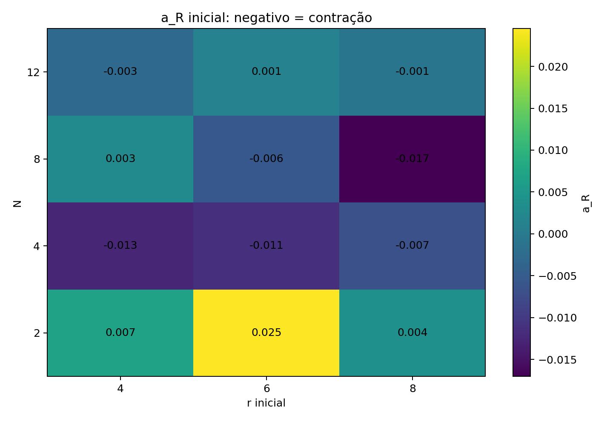

→ [Índice de runs](%C3%8Dndice%20de%20runs.md)

### Run 08 — 08 triad_observer_observed_consciousness

*Fonte:* `Simulações/08 triad_observer_observed_consciousness.md`

## triad_observer_observed_consciousness

Baseline vs observer_observed, com estado C operacional. Ver [Observador e campo C](../Conceitos/Observador%20e%20campo%20C.md). C não é interpretado como consciência.

### Objetivo

Medir se o estado C muda R e espaçamento.

### Resultado preservado

R quase idêntico. C só no ramo observer_observed.

| run | R0 | Rfinal | delta_R | spacing0 | spacing_final | mean_abs_C_final |
|---|---|---|---|---|---|---|
| baseline | 17.950673153580247 | 17.401860178232013 | −0.548812975348234 | 5.2 | 5.036317270840565 | 0 |
| observer_observed | 17.950673153580247 | 17.40203710725556 | −0.5486360463246882 | 5.2 | 5.036382915798405 | 0.1408855554136146 |


CSV: [Artefatos/triad_observer_observed_consciousness/summary.csv](../../source/Artefatos/triad_observer_observed_consciousness/summary.csv)

### Arquivos

`00_montagem.png` · `01_spread_comparison.png` · `02_aware_trajectories.png` · `03_consciousness_states.png` · `04_aware_spacetime.png` · `05_difference.png` · `06_C_summary.png` · `summary.csv`

→ [09 triad_field_consciousness_test](09%20triad_field_consciousness_test.md) · [Índice de runs](%C3%8Dndice%20de%20runs.md)

### Run 09 — 09 triad_field_consciousness_test

*Fonte:* `Simulações/09 triad_field_consciousness_test.md`

## triad_field_consciousness_test

Baseline vs continuous_C. Acompanha campo C e correlação C–[Memória](../Conceitos/Mem%C3%B3ria.md). [Observador e campo C](../Conceitos/Observador%20e%20campo%20C.md). Sem bounce.

### Objetivo

Campo C contínuo; `bounce_amplitude` e C_memory_corr.

### Resultado preservado

`bounce_amplitude=0` nos dois. R0=24.3841991188283. t_Rmin=6.3.

| run | Rmin | Rfinal | bounce_amplitude | C_final_mean_abs | C_final_var | C_memory_corr_final |
|---|---|---|---|---|---|---|
| baseline | 23.350001386552602 | 23.350001386552602 | 0 | 0 | 0 | 0 |
| continuous_C | 23.35152445562933 | 23.35152445562933 | 0 | 0.05885646675539304 | 0.0032211309978780103 | −0.3855089487747705 |


CSV: [Artefatos/triad_field_consciousness_test/summary.csv](../../source/Artefatos/triad_field_consciousness_test/summary.csv)

### Arquivos

`00_montagem.png` · `01_bounce_compare.png` · `02_C_spacetime.png` · `03_density_centers.png` · `04_C_order.png` · `05_C_memory_corr.png` · `06_snapshots.png` · `summary.csv`

→ [08 triad_observer_observed_consciousness](08%20triad_observer_observed_consciousness.md) · [Bounce](../Conceitos/Bounce.md) · [Índice de runs](%C3%8Dndice%20de%20runs.md)

### Run 10 — 10 triad_3d_anticollapse_test

*Fonte:* `Simulações/10 triad_3d_anticollapse_test.md`

## triad_3d_anticollapse_test

Passagem a 3D pelas limitações discutidas para 2D. Pré-referência estrita — não é o R5. Conceito: [Anti-colapso](../Conceitos/Anti-colapso.md).

### Objetivo

Trajetórias, raio, distância mínima, densidade, memória em 3D.

### Resultado preservado

Só visual. Sem CSV. Nenhuma métrica inferida dos gráficos.

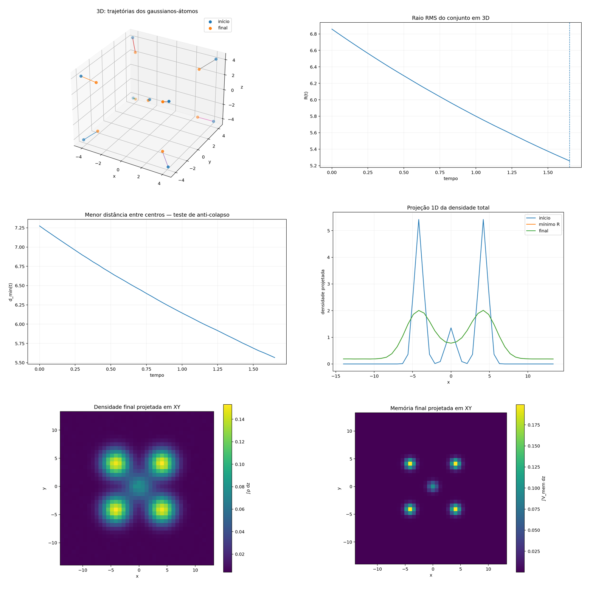

### Arquivos

`00_montagem.png` · `01_3d_trajectories.png` · `02_radius_3d.png` · `03_min_pair_distance.png` · `04_density_projection.png` · `05_final_xy_density.png` · `06_final_xy_memory.png`

→ [16 triad_R5_reference_N40](16%20triad_R5_reference_N40.md) · [Índice de runs](%C3%8Dndice%20de%20runs.md)

### Run 11 — 11 triad_3d_longrun

*Fonte:* `Simulações/11 triad_3d_longrun.md`

## triad_3d_longrun

Preparação de um run 3D mais longo.

### Resultado preservado

Diretório sem arquivos. Resultados efetivos em [12 triad_3d_longrun_fast](12%20triad_3d_longrun_fast.md) e [13 triad_3d_longrun_compact](13%20triad_3d_longrun_compact.md). Cronologia mantida. [Registro integral](../Fontes/Registro%20integral.md)

→ [Índice de runs](%C3%8Dndice%20de%20runs.md)

### Run 12 — 12 triad_3d_longrun_fast

*Fonte:* `Simulações/12 triad_3d_longrun_fast.md`

## triad_3d_longrun_fast

Run longo reduzido. Sem `00_montagem`. Sem CSV.

### Objetivo

Trajetórias, raio, distância mínima, CV de ordem, movimento residual.

### Resultado preservado

Cinco gráficos. Registro visual sem conversão em métricas não salvas.

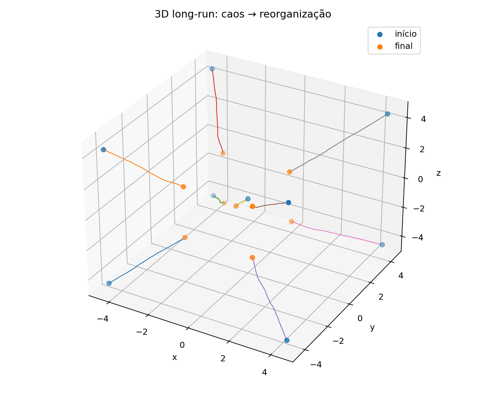

### Arquivos

`01_trajectories.png` · `02_radius.png` · `03_min_pair.png` · `04_order_cv.png` · `05_residual_motion.png`

→ [13 triad_3d_longrun_compact](13%20triad_3d_longrun_compact.md) · [Índice de runs](%C3%8Dndice%20de%20runs.md)

### Run 13 — 13 triad_3d_longrun_compact

*Fonte:* `Simulações/13 triad_3d_longrun_compact.md`

## triad_3d_longrun_compact

Versão compacta do long-run, com montagem. Sem CSV.

### Resultado preservado

Montagem + cinco diagnósticos. Sem métrica numérica associada.


### Arquivos

`00_montagem.png` · `01_trajectories.png` · `02_radius.png` · `03_min_pair.png` · `04_order_cv.png` · `05_residual_motion.png`

→ [12 triad_3d_longrun_fast](12%20triad_3d_longrun_fast.md) · [Índice de runs](%C3%8Dndice%20de%20runs.md)

### Run 14 — 14 triad_R5_reference_run

*Fonte:* `Simulações/14 triad_R5_reference_run.md`

## triad_R5_reference_run

Primeira preparação para reproduzir R5 da especificação.

### Resultado preservado

Sem artefatos. Tentativa substituída por [15 triad_R5_reference_fast](15%20triad_R5_reference_fast.md) / [16 triad_R5_reference_N40](16%20triad_R5_reference_N40.md). Sem CSV. Cronologia: [Registro integral](../Fontes/Registro%20integral.md).

→ [Anti-colapso](../Conceitos/Anti-colapso.md) · [Índice de runs](%C3%8Dndice%20de%20runs.md)

### Run 15 — 15 triad_R5_reference_fast

*Fonte:* `Simulações/15 triad_R5_reference_fast.md`

## triad_R5_reference_fast

Segunda preparação reduzida do regime R5.

### Resultado preservado

Sem artefatos. Resultados efetivos começam em [16 triad_R5_reference_N40](16%20triad_R5_reference_N40.md). Sem CSV.

→ [Índice de runs](%C3%8Dndice%20de%20runs.md)

### Run 16 — 16 triad_R5_reference_N40

*Fonte:* `Simulações/16 triad_R5_reference_N40.md`

## triad_R5_reference_N40

Regime R5 da `[[Equação de referência]]`. N=40 em vez de N=128 (custo CPU). Full vs no-memory. Classe (b). Conceito: [Anti-colapso](../Conceitos/Anti-colapso.md) · [Memória](../Conceitos/Mem%C3%B3ria.md).

### Objetivo

norm, peak, PR, k\*L, crystallinity. Comparar memória ligada e desligada.

### Resultado preservado

Full: `norm_final=1.0`; `peak_max=1.651207`; `peak_final=0.0006409`; `PR_final=4720.477435`; `k*L late mean=9.424778`; `crystallinity late mean=0.972743`.

No-memory: `peak_max=4.170131`; `peak_final=3.889202`; `PR_final=0.528063`.

`k*L` difere da referência ~16.3 — compatível com resolução reduzida. **Não corrigido nem recalibrado.**

t ∈ [0, 15], dx=0.5. kstar full constante 0.471239 no CSV (k\*L = kstar·L = 9.424778 com L=20 se dx·N=0.5·40).


### CSVs

- [Artefatos/triad_R5_reference_N40/summary.csv](../../source/Artefatos/triad_R5_reference_N40/summary.csv)
- [Artefatos/triad_R5_reference_N40/R5_full_metrics.csv](../../source/Artefatos/triad_R5_reference_N40/R5_full_metrics.csv)
- [Artefatos/triad_R5_reference_N40/R5_no_memory_metrics.csv](../../source/Artefatos/triad_R5_reference_N40/R5_no_memory_metrics.csv)

### Arquivos

`00_montagem.png` · `01_peak.png` · `02_PR.png` · `03_kstarL.png` · `04_cryst.png` · `05_spectra.png` · `06_slices.png` · `07_fourier.png` · `08_summary.png` + 3 CSVs

→ [17 triad_R5_reference_N48_full](17%20triad_R5_reference_N48_full.md) · [18 triad_visual_atlas](18%20triad_visual_atlas.md)

### Run 17 — 17 triad_R5_reference_N48_full

*Fonte:* `Simulações/17 triad_R5_reference_N48_full.md`

## triad_R5_reference_N48_full

R5 full, N=48. Além de norm/peak/PR/k\*L/crystallinity: score angular Bravais. [Rede Bravais](../Conceitos/Rede%20Bravais.md)

### Objetivo

Detector Bravais no estado R5. **Não** rotular como cristal BCC perfeito.

### Resultado preservado

Final: norm=1.0, peak=0.0012657, PR=3589.684828, k\*L=9.424778, crystallinity=0.971880.

| family | shell_power_score |
|---|---|
| BCC | 0.4625437848528177 |
| HCP | 0.3931270380242633 |
| FCC | 0.2985104387405231 |
| SC  | 0.2389457764066593 |

BCC é o maior score *deste* detector *neste* run.

Sem `00_montagem` neste diretório.


### CSVs

- [Artefatos/triad_R5_reference_N48_full/bravais_scores.csv](../../source/Artefatos/triad_R5_reference_N48_full/bravais_scores.csv)
- [Artefatos/triad_R5_reference_N48_full/metrics.csv](../../source/Artefatos/triad_R5_reference_N48_full/metrics.csv)

→ [16 triad_R5_reference_N40](16%20triad_R5_reference_N40.md) · [24 triad_bravais_map](24%20triad_bravais_map.md)

### Run 18 — 18 triad_visual_atlas

*Fonte:* `Simulações/18 triad_visual_atlas.md`

## triad_visual_atlas

22 visualizações do campo final R5: densidade, fase, memória, potencial efetivo, balanços, corrente, gradiente, espectro, recíproco, autocorrelação, pressão quântica proxy, isosuperfície, scatter densidade–memória.

### Resultado preservado

22 painéis + montagem. No teste simples de cancelamento local **não** houve regiões $V_{\mathrm{mem}}\approx|\Lambda\rho|$. O [Anti-colapso](../Conceitos/Anti-colapso.md) observado não se reduz a igualdade local. Sem CSV.


### Painéis

`01_density_xy` … `22_balance_histogram` — lista em [Artefatos/triad_visual_atlas/INDEX.txt](../../source/Artefatos/triad_visual_atlas/INDEX.txt).

`08_memory_cubic_balance_xy.png` é o painel do balanço memória/cúbico.

→ [16 triad_R5_reference_N40](16%20triad_R5_reference_N40.md) · [Memória](../Conceitos/Mem%C3%B3ria.md) · [Índice de runs](%C3%8Dndice%20de%20runs.md)

### Run 19 — 19 triad_bigbang_solver_run

*Fonte:* `Simulações/19 triad_bigbang_solver_run.md`

## triad_bigbang_solver_run

Primeiro run que carrega [solver.py](../../source/Fontes/solver.py) / `integrate_3d`. `ntri` → NumPy. `[[Backend e unidades]]`. FDT relativamente quente. **Falha de massa preservada.**

### Objetivo

36³, L=32, dt=0.0025, T=8.

### Resultado preservado

| | inicial | mín | máx | final |
|---|---|---|---|---|
| peak | 0.778218 | 0.356994 | 2.253536 | 2.005190 |
| PR | 2.184352 | | 18704.369091 | 18704.369091 |
| Rrms | 0.658873 | | 16.038026 | 16.014047 |
| mass | 1 | | 8773.74776 | **8773.747757** |

k\*L final=21.991149. mem_amp_t final=0.922319. focus_amp_t final=1.606521.

Crescimento de massa/norma associado ao FDT quente. Permanece. Motivou [20 triad_bigbang_3d_box](20%20triad_bigbang_3d_box.md).


Animação 14.34 MB — **não embedada**; arquivo: `Artefatos/triad_bigbang_solver_run/10_bigbang_animation.gif`

### CSVs

- [Artefatos/triad_bigbang_solver_run/summary.csv](../../source/Artefatos/triad_bigbang_solver_run/summary.csv)
- [Artefatos/triad_bigbang_solver_run/metrics.csv](../../source/Artefatos/triad_bigbang_solver_run/metrics.csv)

### Arquivos

`00_montagem.png` · `01_timeline_xy.png` … `09_memory_timeline_xy.png` · `10_bigbang_animation.gif` · `11_summary.png` + 2 CSVs

→ [FDT](../Conceitos/FDT.md) · [Registro integral](../Fontes/Registro%20integral.md)

### Run 20 — 20 triad_bigbang_3d_box

*Fonte:* `Simulações/20 triad_bigbang_3d_box.md`

## triad_bigbang_3d_box

Resposta ao FDT quente de [19 triad_bigbang_solver_run](19%20triad_bigbang_solver_run.md). Grid 44³, L=32, dt=0.0025, T=10; FDT muito frio. `[[Solver]]` via shim. [FDT](../Conceitos/FDT.md)

### Objetivo

Densidade, nós, memória, expansão. Procurar teia — o registro diz que **não** apareceu teia filamentar clara.

### Resultado preservado

norm 1.0 → 1.413637.

| | inicial | mín | máx | final |
|---|---|---|---|---|
| peak | 0.910133 | 0.0004179 | 2.066449 | 0.0005468 |
| Rrms | 0.693459 | | 14.317529 | 14.317529 |
| PR | 2.449071 | | 16780.038 | 16489.834125 |

`memory_mean_final≈6.6e-5` (CSV: 6.58337145e-05). Expansão/anti-colapso visível; sem teia cósmica clara.


GIF 434 KB: 

### CSVs

- [Artefatos/triad_bigbang_3d_box/summary.csv](../../source/Artefatos/triad_bigbang_3d_box/summary.csv)
- [Artefatos/triad_bigbang_3d_box/metrics.csv](../../source/Artefatos/triad_bigbang_3d_box/metrics.csv)

### Arquivos

`00_montagem.png` · `01_bigbang_3d_box_timeline.png` · `02_density_nodes_3d_timeline.png` · `03_memory_3d_timeline.png` · `04_expansion_observables.png` · `05_peak_memory.png` · `06_bigbang_3d_box_animation.gif` · `07_final_3d_box.png` + 2 CSVs

→ [Anti-colapso](../Conceitos/Anti-colapso.md) · [Índice de runs](%C3%8Dndice%20de%20runs.md)

### Run 21 — 21 triad_phase_to_density_speed

*Fonte:* `Simulações/21 triad_phase_to_density_speed.md`

## triad_phase_to_density_speed

Primeira tentativa de kick de fase + frente. T_probe=1.8. **Estimador falhou.** Preservado. [Phase-to-density](../Conceitos/Phase-to-density.md)

### Objetivo

Fundo relaxado T=12, ε=0.07, width=1.3, L=32, dt=0.0025. `background_kstarL=9.424778`.

### Resultado preservado

`density_front_speed≈4.008763e-16`, `phase_front_speed≈4.008763e-16`. Slopes low-k ≈1.045503e-15 e 6.580752e-17. Resultado zero/degenerado. Levou a [22 triad_phase_to_density_speed_refined](22%20triad_phase_to_density_speed_refined.md).


### CSVs

- [Artefatos/triad_phase_to_density_speed/summary.csv](../../source/Artefatos/triad_phase_to_density_speed/summary.csv)
- [Artefatos/triad_phase_to_density_speed/fronts.csv](../../source/Artefatos/triad_phase_to_density_speed/fronts.csv)

### Arquivos

`00_montagem.png` · `01_background_density.png` · `02_phase_kick.png` · `03_density_response_xt.png` · `04_phase_response_xt.png` · `05_front_speeds.png` · `06_density_dispersion.png` · `07_phase_dispersion.png` · `08_response_norm.png` · `09_summary.png` + 2 CSVs

→ [Registro integral](../Fontes/Registro%20integral.md) · `[[Solver]]`

### Run 22 — 22 triad_phase_to_density_speed_refined

*Fonte:* `Simulações/22 triad_phase_to_density_speed_refined.md`

## triad_phase_to_density_speed_refined

Protocolo refinado após a falha de [21 triad_phase_to_density_speed](21%20triad_phase_to_density_speed.md). [Phase-to-density](../Conceitos/Phase-to-density.md) · `[[Solver]]`

### Objetivo

Background T=12, kick só de fase ε=0.15, width=1.25; controle casado (mesma sequência de ruído); probe T=5. L=32, dt=0.0025. `background_kstarL=9.424778`.

### Resultado preservado

| | densidade | fase |
|---|---|---|
| arrival speed | 7.301417 | 7.557409 |
| RMS radius speed | 1.482120 | 1.893955 |
| slope low-k | 0.821417 | 0.235523 |

x–t da densidade: abertura em V/triângulo. Fronts próximos; slopes **não** coincidem.


CSV: [Artefatos/triad_phase_to_density_speed_refined/summary.csv](../../source/Artefatos/triad_phase_to_density_speed_refined/summary.csv)

### Arquivos

`00_montagem.png` · `01_density_xt.png` · `02_phase_xt.png` · `03_response_radii.png` · `04_arrival_times.png` · `05_density_dispersion.png` · `06_phase_dispersion.png` · `07_response_norm.png` · `08_summary.png` · `summary.csv`

→ [Índice de runs](%C3%8Dndice%20de%20runs.md)

### Run 23 — 23 triad_memory_bounce_bigbang

*Fonte:* `Simulações/23 triad_memory_bounce_bigbang.md`

## triad_memory_bounce_bigbang

Contração → bounce de memória → expansão. **Nenhum termo explícito de bounce.** [Bounce](../Conceitos/Bounce.md) · [Memória](../Conceitos/Mem%C3%B3ria.md) · `[[Solver]]`

### Objetivo

Gaussiana larga + chirp quadrático radial para dentro. Λ=−10, ν=(10, 0.5, 0.05), λ=(3, 1, 0.3), 40³, T=12, L=32, dt=0.0025, `initial_sigma=3.2`, `inward_chirp=0.22`.

### Resultado preservado — dois diagnósticos

**R_rms:** mínimo em t=0 (`R_min=R_initial=3.919184`); `bounced=False`; `R_final=12.272371`. PDF: densidade FDT fraca no volume distante infla R_rms.

**Raios de massa** (mesma trajetória):

| | inicial | mín | t_mín | final | refined_bounce |
|---|---|---|---|---|---|
| r50 | 3.487119 | 1.385641 | 3.7 | 9.863062 | True |
| r80 | 4.866210 | 2.884441 | 3.1 | 16.511814 | True |
| r90 | 5.656854 | 5.059644 | 1.3 | 19.0662 | True |

Pico densidade t=4.1; pico memória t=4.2; delay=0.1.

Norma 1→1.491662. peak_density max=0.149575, final=0.001110. PR 516.083→8306.608. Vmem_peak max=0.520074. overlap max=0.999909, final=0.923178.


GIF 5.50 MB (abaixo de 10 MB): 

### CSVs

- [Artefatos/triad_memory_bounce_bigbang/summary.csv](../../source/Artefatos/triad_memory_bounce_bigbang/summary.csv)
- [Artefatos/triad_memory_bounce_bigbang/refined_bounce_summary.csv](../../source/Artefatos/triad_memory_bounce_bigbang/refined_bounce_summary.csv)
- [Artefatos/triad_memory_bounce_bigbang/metrics.csv](../../source/Artefatos/triad_memory_bounce_bigbang/metrics.csv)

### Arquivos

`00_montagem.png` · `01_bounce_timeline_xy.png` … `08_radial_spacetime_memory.png` · `09_memory_bounce_animation.gif` · `10_summary.png` · `11_mass_enclosing_radii.png` · `12_central_mass.png` · `13_core_vs_peak.png` + 3 CSVs

Pós-proc: [24 triad_bravais_map](24%20triad_bravais_map.md) · [25 triad_bravais_network_map](25%20triad_bravais_network_map.md) · [26 triad_bravais_network_map_v2](26%20triad_bravais_network_map_v2.md)

### Run 24 — 24 triad_bravais_map

*Fonte:* `Simulações/24 triad_bravais_map.md`

## triad_bravais_map

Pós-processamento de [23 triad_memory_bounce_bigbang](23%20triad_memory_bounce_bigbang.md) — sem reintegrar. FFT 3D da densidade, shell dominante, templates angulares. [Rede Bravais](../Conceitos/Rede%20Bravais.md)

### Objetivo

Comparar distribuição angular com SC_axes, FCC_faces, BCC_body, HEX_basal, PLANAR_cross.

### Resultado preservado

Scores finais:

| family | final_score |
|---|---|
| PLANAR_cross | 0.2211261477294008 |
| SC_axes | 0.2149247312019548 |
| HEX_basal | 0.1821799060343812 |
| FCC_faces | 0.159688181177609 |
| BCC_body | 0.1247944072953121 |

Melhor match: PLANAR_cross. Diferente do R5 N48, onde BCC foi o maior noutro detector/regime ([17 triad_R5_reference_N48_full](17%20triad_R5_reference_N48_full.md)). Não unificar.


### CSVs

- [Artefatos/triad_bravais_map/bravais_final_scores.csv](../../source/Artefatos/triad_bravais_map/bravais_final_scores.csv)
- [Artefatos/triad_bravais_map/bravais_scores_over_time.csv](../../source/Artefatos/triad_bravais_map/bravais_scores_over_time.csv)

### Arquivos

`00_montagem.png` · `01_final_reciprocal_peaks.png` · `02_template_gallery.png` · `03_bravais_score_heatmap.png` · `04_best_family_over_time.png` · `05_pairwise_angle_comparison.png` · `06_realspace_vs_reciprocal.png` · `07_kstarL_over_time.png` · `08_summary.png` + 2 CSVs

→ [Índice de runs](%C3%8Dndice%20de%20runs.md)

### Run 25 — 25 triad_bravais_network_map

*Fonte:* `Simulações/25 triad_bravais_network_map.md`

## triad_bravais_network_map

Primeira rede: picos de densidade → nós; arestas por proximidade/kNN. Threshold severo demais. Preservado. Motivou [26 triad_bravais_network_map_v2](26%20triad_bravais_network_map_v2.md). [Rede Bravais](../Conceitos/Rede%20Bravais.md)

### Objetivo

threshold_quantile=0.992, peak_prune_min_dist_cells=3, k_neighbors=6, radius_gate=3.668242.

### Resultado preservado

nodes=2, edges=1, candidate_spacing_a0=2.529822, median_bond_length=2.529822, mean_degree=1, max_degree=1.

Nós (CSV):

| node | x | y | z | peak_value | degree | nn_distance |
|---|---|---|---|---|---|---|
| 0 | 0.0 | −1.6 | 0.8 | 0.0006819283612127 | 1 | 2.529822128134704 |
| 1 | 0.0 | 0.8 | 0.0 | 0.0006452538222157 | 1 | 2.529822128134704 |

Aresta: 0—1.


### CSVs

- [Artefatos/triad_bravais_network_map/summary.csv](../../source/Artefatos/triad_bravais_network_map/summary.csv)
- [Artefatos/triad_bravais_network_map/nodes.csv](../../source/Artefatos/triad_bravais_network_map/nodes.csv)
- [Artefatos/triad_bravais_network_map/edges.csv](../../source/Artefatos/triad_bravais_network_map/edges.csv)

### Arquivos

`00_montagem.png` · `01_nodes_3d.png` · `02_network_3d.png` · `03_network_xy_projection.png` · `04_nearest_neighbor_histogram.png` · `05_bond_length_histogram.png` · `06_bond_directions.png` · `07_degree_histogram.png` · `08_adjacency_matrix.png` · `09_summary.png` + 3 CSVs

→ [Registro integral](../Fontes/Registro%20integral.md)

### Run 26 — 26 triad_bravais_network_map_v2

*Fonte:* `Simulações/26 triad_bravais_network_map_v2.md`

## triad_bravais_network_map_v2

Rede refinada após [25 triad_bravais_network_map](25%20triad_bravais_network_map.md). Snapshot automático “mais estruturado”. [Rede Bravais](../Conceitos/Rede%20Bravais.md)

### Objetivo

quantile=0.988; distância mín=2 células; kNN=6; radius_gate=7.643873.

### Resultado preservado

Snapshot **t=4.4**: nodes=39, edges=25, candidate_spacing_a0=4.931531, median_bond_length=5.184593, mean_degree=1.282051, max_degree=6.

PDF: “A rede é esparsa, com agrupamentos e conexões locais; **não foi rotulada como rede Bravais perfeita.**”


### CSVs

- [Artefatos/triad_bravais_network_map_v2/summary.csv](../../source/Artefatos/triad_bravais_network_map_v2/summary.csv)
- [Artefatos/triad_bravais_network_map_v2/nodes.csv](../../source/Artefatos/triad_bravais_network_map_v2/nodes.csv)
- [Artefatos/triad_bravais_network_map_v2/edges.csv](../../source/Artefatos/triad_bravais_network_map_v2/edges.csv)

### Arquivos

`00_montagem.png` · `01_nodes_3d.png` · `02_network_3d.png` · `03_network_xy_projection.png` · `04_nearest_neighbor_histogram.png` · `05_bond_length_histogram.png` · `06_bond_directions.png` · `07_degree_histogram.png` · `08_adjacency_matrix.png` · `09_summary.png` + 3 CSVs

→ [23 triad_memory_bounce_bigbang](23%20triad_memory_bounce_bigbang.md) · [24 triad_bravais_map](24%20triad_bravais_map.md) · `[[TRIAD]]`

### Run 27 — 27 triad_chaos_eq

*Fonte:* `Simulações/27 triad_chaos_eq.md`

## triad_chaos_eq

Equação TRIAD **completa** (NLS + memória + FDT) a partir de uma nuvem de **12 átomos gaussianos**. 1 gaussiana = 1 átomo. Caos de átomos → o que assentar. **Não é ablação.** Sem controle sem-memória, sem V_harmônico de comparação, sem fit de k\*L. [Bounce](../Conceitos/Bounce.md) · [FDT](../Conceitos/FDT.md) · [Memória](../Conceitos/Mem%C3%B3ria.md)

N=32 (reduzido vs #23 N=40). Solver: `triad-lang` real, passo `memory_nls_strang_step_3d` (o mesmo Strang de `integrate_3d`). Backend: `triad.ntri` (numpy). Metal disponível (`metal_mlx` / `metal_native`) mas não usado — o loop de diagnóstico precisa de ψ e y a cada amostra.

### IC — 12 átomos

Decisão única, sem scan: `n_atoms=12`, `sigma=1.2`, `min_sep=4.8` (=4σ), seed=0. Posições aleatórias com imagem mínima periódica; fases uniformes em [0, 2π). Superposição, depois norma total = 1. Sem chirp.

Colocação (seed=0): `ic_pair_sep_min=5.130282`, `ic_pair_sep_mean=15.910636`. Detector no t=0 (máximo local 3³ wrap, ρ ≥ 0.20·peak): **n_det=12**, ⟨NN⟩=8.857611, NN mediana=9.103059.

CSV: [Artefatos/triad_chaos_eq/atoms_ic.csv](../../source/Artefatos/triad_chaos_eq/atoms_ic.csv)

### Parâmetros (um conjunto legal)

Λ=−10, ν=(10, 0.5, 0.05), λ=(3, 1, 0.3), Γ=0.05, `fdt_couple=True`, kT=1 (default do solver atual). V_ext=None. L=32, dt=0.0025, T=15, record_every=40 (151 amostras). `noise_amplitude=0.015811388300841896` (f_FDT_e = 2Γ dx³ kT/ℏ com dx=1).

Não é o IC de #23 (uma gaussiana larga σ=3.2 + chirp). Não substitui [23 triad_memory_bounce_bigbang](23%20triad_memory_bounce_bigbang.md).

### Resultado

Wall: **14.124 s** (21:22 BRT, 20/08/2026).

| | t=0 | t=0.1 | final (t=15) |
|---|---|---|---|
| n_átomos det. | 12 | 1147 | 1238 |
| norm | 1.0 | 325.919474 | 25585.351298 |
| peak | 0.008360 | 0.109185 | 2.234612 |
| PR | 327.812738 | 16375.159336 | 28851.932841 |
| R_rms | 15.102938 | 16.049892 | 16.023042 |
| r50 | 14.899664 | 15.779734 | 15.748016 |
| r80 | 18.814888 | 19.287302 | 19.261360 |
| r90 | 20.808652 | 21.0 | 20.928450 |
| ⟨NN⟩ | 8.857611 | 2.287253 | 2.249534 |

Pico de densidade máximo=3.506253 em t=10.6. Vmem_peak máximo=9.386298 em t=4.7; Vmem_peak final=5.141332.

Janela late (t≥12): R_rms mean=16.008579 std=0.040049; peak mean=2.175297 std=0.142540; PR mean=28326.900033 std=394.774018; n_det mean=1204.0 std=23.043; cryst (FFT de ρ, k>2π/L) mean=0.133015 std=0.010882.

Planos xy: em t=0 a fatia z=0 mostra as 12 sementes. De t≈0.1 em diante o volume preenche. O detector passa a contar ~10³ máximos locais — isso **não** é ruído de grade. É o universo emergindo das sementes. Os 12 átomos não “morrem”: deixam de ser o estado inteiro.

Mesma família de [19 triad_bigbang_solver_run](19%20triad_bigbang_solver_run.md) (FDT quente; lá mass_final=8773.747757). Aqui o default `fdt_couple=True` com dx=1 injeta massa ~O(1) por passo; norma 1→25585.351298. #23 no mesmo Λ,ν,λ,Γ teve norma 1→1.491662 (N=40, IC diferente, FDT efetivo não registrado na nota). Este run **não** recalibrou FDT.

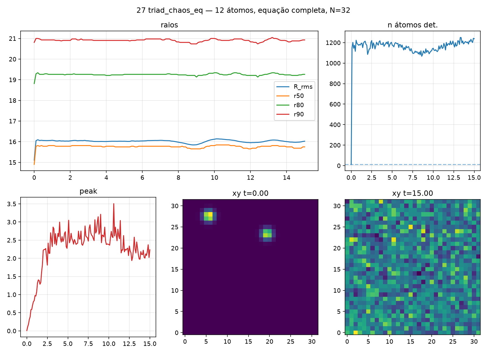

### O que os números sustentam

Com o FDT default em N=32, as 12 sementes deixam de ser o estado inteiro em Δt=0.1. O que assenta é o volume preenchido (R_rms~16, n_det~1200). Leitura: **caos → universo**, não “átomos falharam no ruído”. Mesma família de preenchimento que [19 triad_bigbang_solver_run](19%20triad_bigbang_solver_run.md).

### CSVs

- [Artefatos/triad_chaos_eq/summary.csv](../../source/Artefatos/triad_chaos_eq/summary.csv)
- [Artefatos/triad_chaos_eq/metrics.csv](../../source/Artefatos/triad_chaos_eq/metrics.csv)
- [Artefatos/triad_chaos_eq/atoms_ic.csv](../../source/Artefatos/triad_chaos_eq/atoms_ic.csv)

### Arquivos

`00_montagem.png` · `01_radii_vs_t.png` · `02_peak_vs_t.png` · `03_atoms_count_spacing.png` · `04_midplane_snapshots.png` · `05_norm_pr_vmem.png` + 3 CSVs + `summary.json`

Script: [Fontes/run_chaos_eq.py](../../source/Fontes/run_chaos_eq.py)

Não rodados (método corrigido antes): 27b nomem, 27c harmônico, IC `init='chaos'` (campo aleatório).

→ [Índice de runs](%C3%8Dndice%20de%20runs.md) · `[[TRIAD]]`

### Run 28 — 28 triad_atoms_3d

*Fonte:* `Simulações/28 triad_atoms_3d.md`

## triad_atoms_3d

Equação TRIAD **completa** (NLS + memória + FDT) a partir da mesma nuvem de **12 átomos gaussianos** do [27 triad_chaos_eq](27%20triad_chaos_eq.md). 1 gaussiana = 1 átomo. Caos de átomos → o que assentar. **Não é ablação.** Sem controle sem-memória, sem V_harmônico, sem fit de k\*L. [Memória](../Conceitos/Mem%C3%B3ria.md) · [FDT](../Conceitos/FDT.md) · [Universo como simulação](../Conceitos/Universo%20como%20simula%C3%A7%C3%A3o.md)

A **grade já era 3D no 27** (N=32³, `memory_nls_strang_step_3d`). O 27 só publicou fatias xy do plano médio — por isso parecia 2D. O 28 é o mesmo tríade em **volume**: isosuperfície, centros 3D e trajetórias. N=40 (grade do PDF #23; dx=0.8, σ=1.2 é blob real).

### Por que kT muda (não esconder)

O 27 usou o default do solver `fdt_couple=True, kT=1`. Com Γ=0.05, dt=0.0025, `noise_amp = √(2Γ kT dt) ≈ 0.0158`, enquanto o pico dos 12 átomos era 0.008. Universo já preenchido em t=0.1 (norm 1→326→25585). Mesma família de preenchimento que o PDF #19.

A spec da `[[Equação de referência]]` §A.2 lista `T_bath = 0.001` para R5-FDT. Aqui **kT=0.001**, `fdt_couple=True`, Γ=0.05. É o banho FDT da spec para um átomo continuar átomo em 3D — **não** é calibração de k\*L, **não** isola FDT. Com kT=1 o preenchimento é imediato (ver 27); kT=0.001 deixa as 12 sementes visíveis em 3D no começo.

`noise_amplitude=0.0005` (32× menor que o 27). Pico IC=0.008545.

### IC — 12 átomos

A mesma receita `place_atoms` do 27: `n_atoms=12`, `sigma=1.2`, `min_sep=4.8` (=4σ), seed=0. Posições idênticas (caixa L=32): `ic_pair_sep_min=5.130282`, `ic_pair_sep_mean=15.910636`. Fases uniformes em [0, 2π). Superposição, norma total = 1. Sem chirp.

Detector: máximo local 3³ wrap, ρ ≥ 0.20·peak, NMS min_dist=2σ=2.4. No t=0: **n_det=12**, n_raw=12, ⟨NN⟩=8.922529.

CSV: [Artefatos/triad_atoms_3d/atoms_ic.csv](../../source/Artefatos/triad_atoms_3d/atoms_ic.csv)

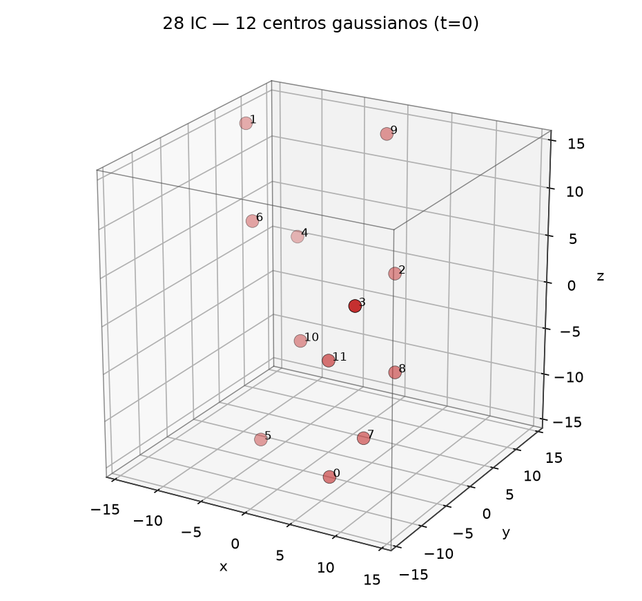

Isosuperfície t=0 (`skimage.measure.marching_cubes`, ρ=0.3·peak): **12 blobs distintos** na caixa [−L/2, L/2]³. Isto é o que o 27 não mostrou.

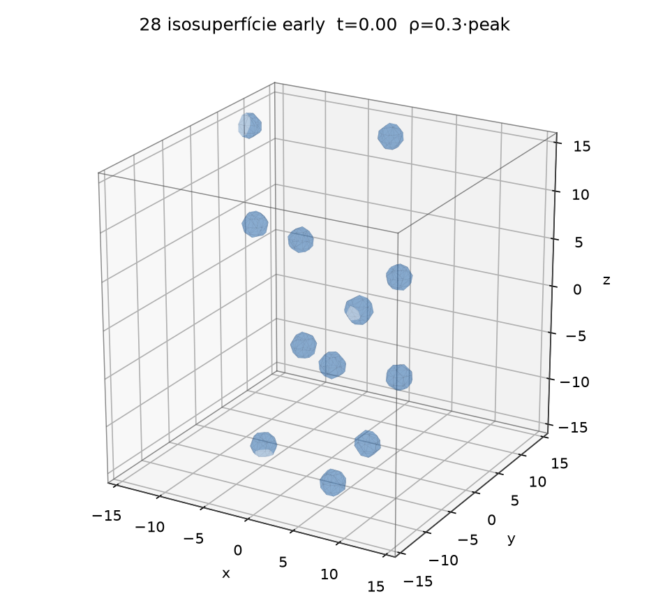

### Parâmetros (um conjunto legal)

Λ=−10, ν=(10, 0.5, 0.05), λ=(3, 1, 0.3), Γ=0.05, `fdt_couple=True`, **kT=0.001**. V_ext=None. L=32, N=40, dt=0.0025, T=12, record_every=40 (121 amostras). Backend: `triad.ntri` (numpy). Metal disponível (`metal_mlx` / `metal_native`) mas mlx não é drop-in para `memory_nls_strang_step_3d` com IC próprio — probe ~0.01 s, fallback numpy. Solver: `triad-lang` real, passo `memory_nls_strang_step_3d`.

Não substitui [27 triad_chaos_eq](27%20triad_chaos_eq.md) nem [23 triad_memory_bounce_bigbang](23%20triad_memory_bounce_bigbang.md).

### Resultado — trajetória

Wall: **449.406 s** (7 min 29 s; 21:37–21:45 BRT, 20/08/2026).

| | t=0 | t=0.1 | t=1.0 | t=6 (meio) | final (t=12) |
|---|---|---|---|---|---|
| n_átomos det. | 12 | 12 | 12 | 971 | 1007 |
| n_raw máx. local | 12 | 12 | 16 | 2165 | 2205 |
| norm | 1.0 | 1.315725 | 4.033214 | 15.430638 | 23.275045 |
| peak | 0.008545 | 0.008832 | 0.005561 | 0.005544 | 0.008089 |
| PR | 327.458 | 577.229 | 7696.253 | 16475.839 | 16362.984 |
| R_rms | 15.097761 | 15.3182 | 15.7820 | 15.9787 | 16.003210 |

Pico de densidade máximo=0.009249 em t=0.2. Vmem_peak máximo=0.025713 em t=0.3; Vmem_peak final=0.024431. r50 14.902349→15.758172; r80 18.744599→19.266551; r90 20.830747→20.938004. ⟨NN⟩ 8.922529→2.552239.

Os 12 átomos **permanecem 12 até t=1.0** (no 27 o universo já tinha preenchido em t=0.1). Em t=1.1 n_det=22; t=1.3 n_det=162. Depois o detector conta ~10³ máximos: o volume preenchido. Isosuperfície mid/late = universo no cubo, **não** ruído, **não** espuma-falha.

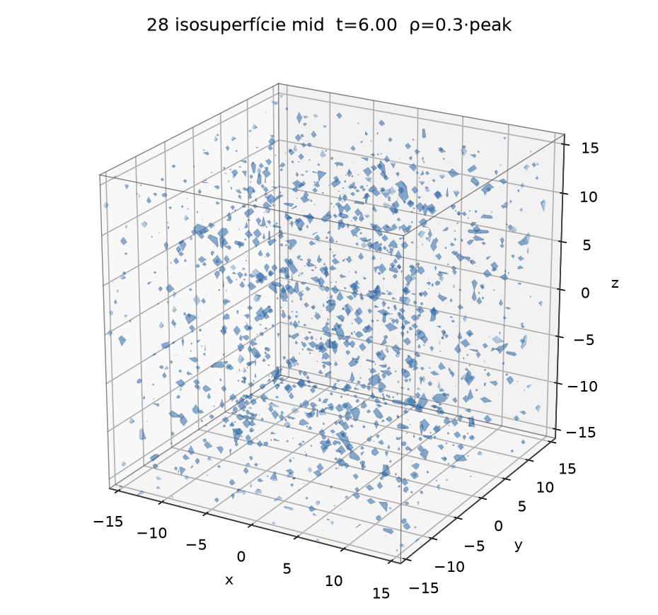

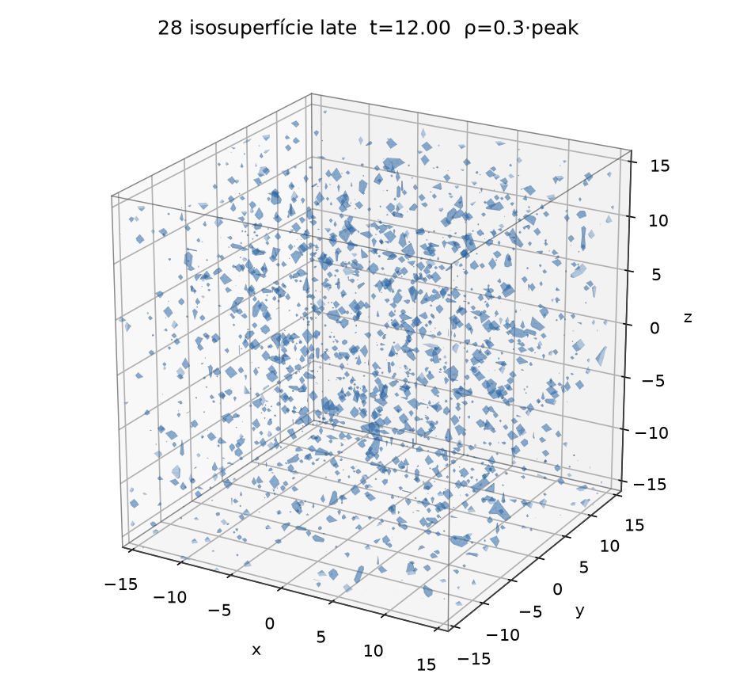

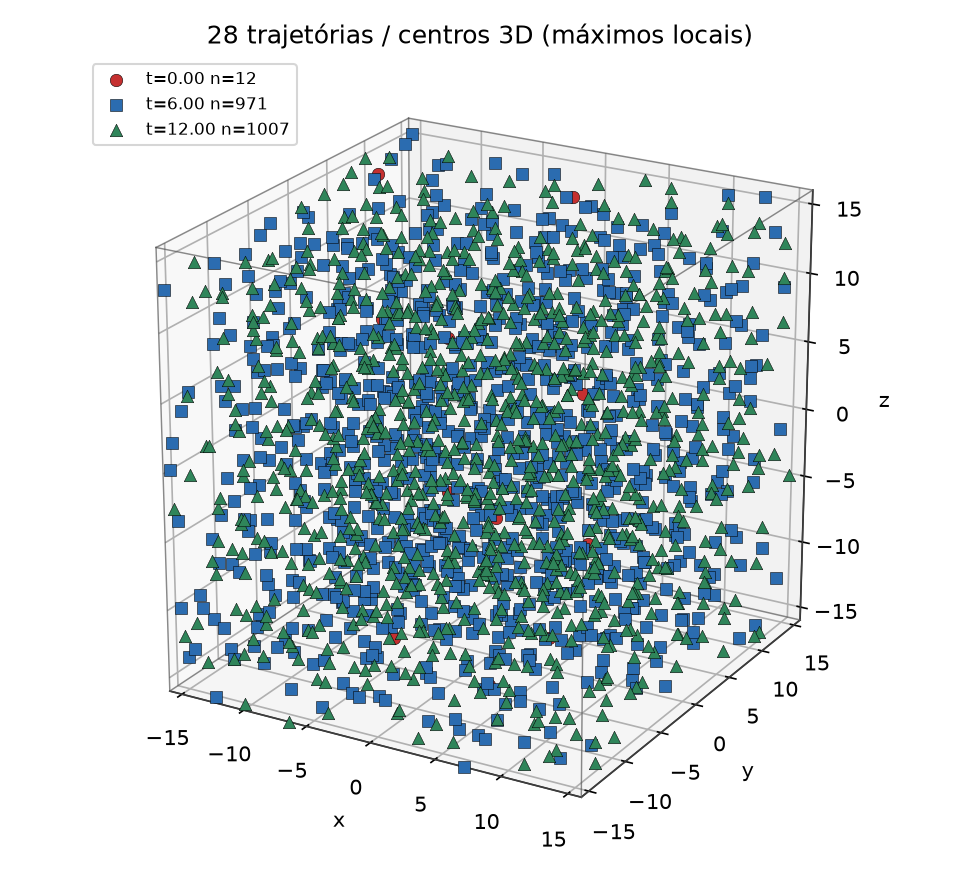


### O que os números sustentam

Com kT=0.001 da spec §A.2 as 12 sementes são **visíveis como blobs 3D no t=0** e seguem distintas ~1 unidade de tempo. O equilíbrio (n_det 12→971→1007, norma 1→23.275045, R_rms→16) é o universo preenchendo o volume — mais lento que [27 triad_chaos_eq](27%20triad_chaos_eq.md), mesma leitura. Não é cubo de ruído. Este run **não** recalibrou FDT.

### CSVs

- [Artefatos/triad_atoms_3d/summary.csv](../../source/Artefatos/triad_atoms_3d/summary.csv)
- [Artefatos/triad_atoms_3d/metrics.csv](../../source/Artefatos/triad_atoms_3d/metrics.csv)
- [Artefatos/triad_atoms_3d/atoms_ic.csv](../../source/Artefatos/triad_atoms_3d/atoms_ic.csv)
- [Artefatos/triad_atoms_3d/centers.csv](../../source/Artefatos/triad_atoms_3d/centers.csv)

### Arquivos

`00_montagem.png` · `01_atoms_3d_ic.png` · `02_isosurface_early.png` · `03_isosurface_mid.png` · `04_isosurface_late.png` · `05_atoms_3d_traj.png` · `06_radii_peak.png` · `07_centers_3d.gif` + 4 CSVs + `summary.json`

Script: [Fontes/run_atoms_3d.py](../../source/Fontes/run_atoms_3d.py)

→ [Índice de runs](%C3%8Dndice%20de%20runs.md) · `[[TRIAD]]`

### Run 29 — 29 triad_R5_A2

*Fonte:* `Simulações/29 triad_R5_A2.md`

## triad_R5_A2

Equação TRIAD **completa** (mode=full) da spec canônica v1.0 [triad_equation_reference](../Fontes/triad_equation_reference.md) **A.2** R5-FDT. IC §9.1: **1 gaussiana = 1 átomo**, $s=0.5$, $k_0=0$, $y_j(0)=0$, $\int|\Psi|^2=1$. **Não é ablação.** Sem §6, sem zerar $\lambda$, sem fit de $k_*L$. [Memória](../Conceitos/Mem%C3%B3ria.md) · [FDT](../Conceitos/FDT.md) · [Universo como simulação](../Conceitos/Universo%20como%20simula%C3%A7%C3%A3o.md) · `[[Equação de referência]]`

N=96 (reduzido vs spec N=128; N=64 deu ~0.014 s/passo < 0.05 s, subiu). Solver: Strang 3D da spec §5 (FFT half linear, $V=\Lambda\rho+V_{\mathrm{mem}}$, Euler memória, FDT, FFT half). **Não** usa `TriadParams` do triad-lang (rejeita 2 modos de memória). Backend: numpy. $V_{\mathrm{ext}}=0$, caixa periódica $[-L/2,L/2)^3$.

### IC — 1 átomo

$\Psi=\mathcal{N}\exp(-|\mathbf{x}|^2/(2s^2))$, $s=0.5$, $k_0=(0,0,0)$. Um blob na origem. Pico IC=1.436697, PR=1.968701, R_rms=0.612372, norma=1.

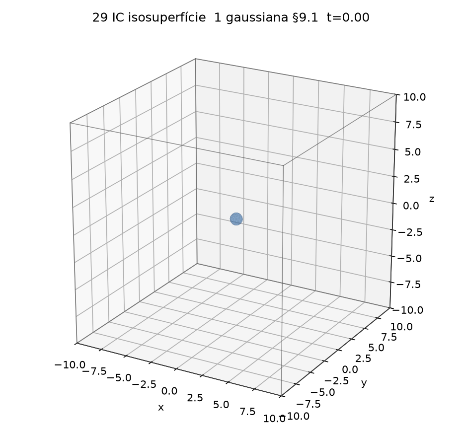

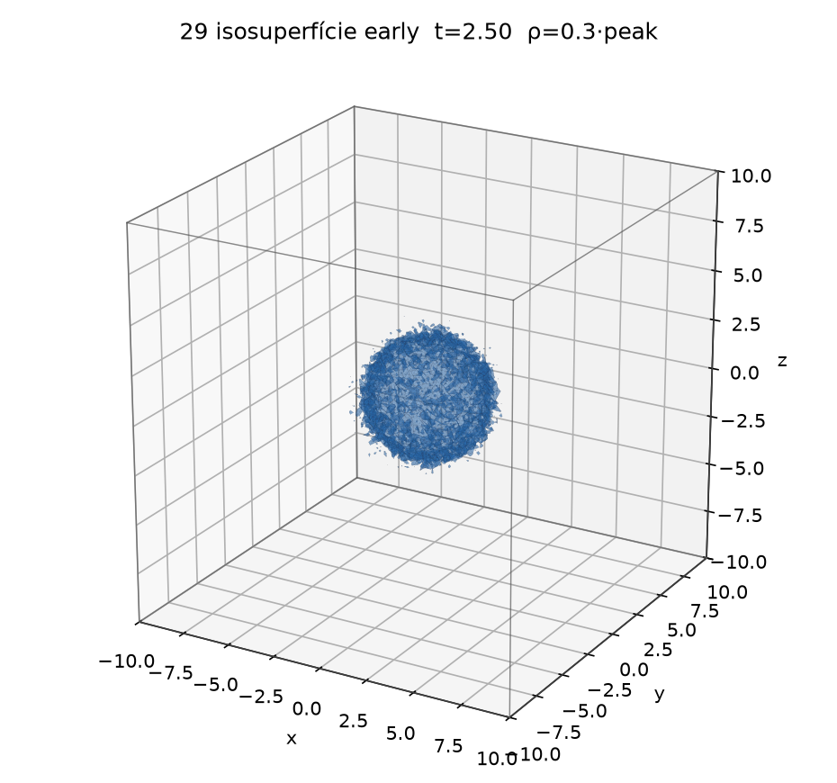

### Parâmetros (A.2 R5-FDT)

$\Lambda=-8$, $\sigma=1.5$, $\alpha=0$, $\Gamma=0.01$, $T_{\mathrm{bath}}=0.001$, $\nu=(10, 0.5)$, $\lambda=(1.125, 0.375)$, $L=20$, N=96, $dt=0.0025$, $T=15$, seed=42.

Lock FDT igual ao 28 (`fdt_couple`): $f_{\mathrm{FDT}}=2\Gamma\,dx^3\,T_{\mathrm{bath}}/\hbar=1.808449\times10^{-7}$. **noise_amp = 0.00022360679774997898** $=\sqrt{2\Gamma T_{\mathrm{bath}}dt}$. Memória Euler ($\max\nu\cdot dt=0.025<0.05$).

Não substitui [27 triad_chaos_eq](27%20triad_chaos_eq.md) nem [28 triad_atoms_3d](28%20triad_atoms_3d.md).

### Resultado

Wall: **313.651 s** (5 min 14 s; 22:00–22:05 BRT, 20/08/2026). 6000 passos, 151 amostras.

| | t=0 | t=0.2 (pico) | early t=2.5 | mid t=7.5 | final t=15 |
|---|---|---|---|---|---|
| norm | 1.0 | 1.028215 | 1.342872 | 1.975632 | 2.815579 |
| peak | 1.436697 | 31.184811 | 0.007653 | 0.002977 | 0.004433 |
| PR | 1.968701 | 0.116987 | 871.949795 | 3994.394322 | 4035.966696 |
| R_rms | 0.612372 | 1.859568 | 6.582178 | 9.798813 | 10.022519 |
| C cryst | 0.995229 | 0.995951 | 0.990987 | 0.994298 | 0.996625 |
| k*L | 9.424778 | 9.424778 | 9.424778 | 9.424778 | 9.424778 |

Pico de densidade máximo=31.184811 em t=0.2 (foco 3D). Vmem_peak máximo=11.261881 em t=0.2; Vmem_peak final=0.001759. r50 0.510310→9.873330; r80 0.779512→12.040153; r90 0.883883→13.113421. Janela late (t≥12): R_rms mean=10.032630 std=0.018685; PR mean=3728.261089 std=404.134198; C mean=0.996281.

O átomo único **sementeia o volume**. t=0: 1 blob na origem. t=2.5: esfera expandida. t=7.5–15: cubo preenchido = **universo**. Não é ruído, não é espuma, não é falha de FDT.

$k_*L$ late=9.424778 (casca não-DC mais baixa; igual ao [16 triad_R5_reference_N40](16%20triad_R5_reference_N40.md)). Spec §10.4 cita ~16.3 em N=128 — **não** calibrado aqui.

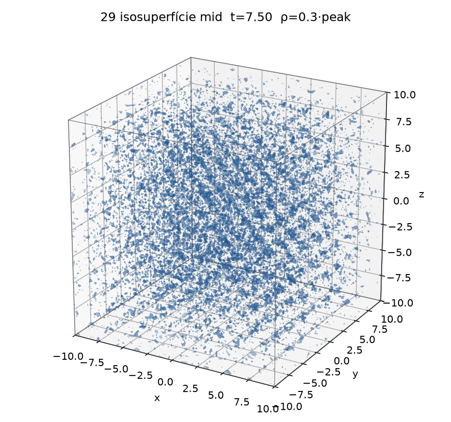

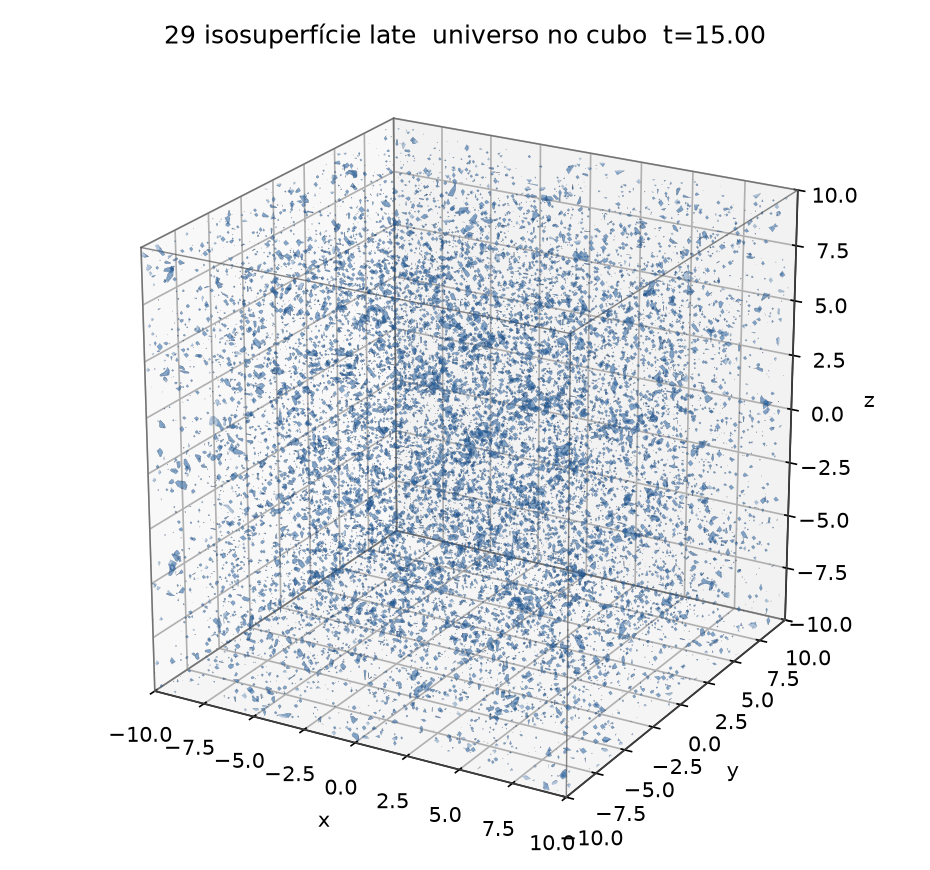

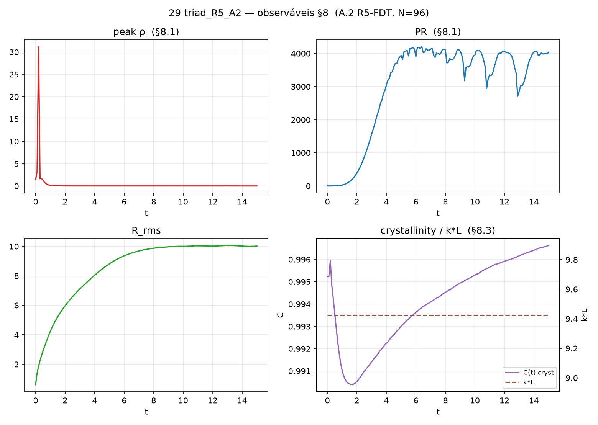


### O que os números sustentam

Com A.2 R5-FDT ($\Gamma=0.01$, $T_{\mathrm{bath}}=0.001$) a semente §9.1 permanece 1 átomo visível no t=0 e se espalha até preencher a caixa (R_rms 0.61→10.02, PR 1.97→4036, norma 1→2.816). Leitura: **1 átomo → universo no cubo**. Mesma família de preenchimento que [27 triad_chaos_eq](27%20triad_chaos_eq.md) / [28 triad_atoms_3d](28%20triad_atoms_3d.md), IC canônico em vez da nuvem de 12. Este run **não** recalibrou FDT nem $k_*L$.

### CSVs

- [Artefatos/triad_R5_A2/summary.csv](../../source/Artefatos/triad_R5_A2/summary.csv)
- [Artefatos/triad_R5_A2/metrics.csv](../../source/Artefatos/triad_R5_A2/metrics.csv)
- [Artefatos/triad_R5_A2/summary.json](../../source/Artefatos/triad_R5_A2/summary.json)

### Arquivos

`00_montagem.png` · `01_ic_isosurface.png` · `02_isosurface_early.png` · `03_isosurface_mid.png` · `04_isosurface_late.png` · `05_observables.png` + metrics.csv + summary.csv + summary.json

Script: [Fontes/run_R5_A2.py](../../source/Fontes/run_R5_A2.py)

→ [Índice de runs](%C3%8Dndice%20de%20runs.md) · `[[TRIAD]]`

### Run 30 — 30 dois_atomos_gravidade

*Fonte:* `Simulações/30 dois_atomos_gravidade.md`

## dois_atomos_gravidade

Equação TRIAD **completa**, Theta_core congelado (Q00 / [TRIAD_QM_CANONICAL_V1](../Fontes/TRIAD_QM_CANONICAL_V1.md)). **I0 / environment**, não scan. 1 gaussiana = 1 átomo. Duas sementes, separação 6 ao longo de x. Leitura: par (queda?) e pico finito (singularidade que não vai a infinito). Volume preenchido = universo, não ruído. **Não** é teste de interferência. Sem isolar memória/FDT. Sem mudar Theta_core para o par atrair. [Leitura operacional](../Conceitos/Leitura%20operacional.md) · [Anti-colapso](../Conceitos/Anti-colapso.md) · [Universo como simulação](../Conceitos/Universo%20como%20simula%C3%A7%C3%A3o.md)

Solver: Strang 3D standalone (mesmo passo de [Fontes/run_q01a.py](../../source/Fontes/run_q01a.py) / [29 triad_R5_A2](29%20triad_R5_A2.md)). fp64, numpy. $V_{\mathrm{ext}}=0$, $y_j(0)=0$, caixa periódica $[-L/2,L/2)^3$.

### IC — 2 átomos

Duas gaussianas iguais, $s=1.0$, fases 0, centros $(-3,0,0)$ e $(+3,0,0)$, depois $\int\rho=1$. Pico IC=0.089782, PR=31.506820, R_rms=3.240199, pair_sep=6.000, n_det=2, n_raw=2.

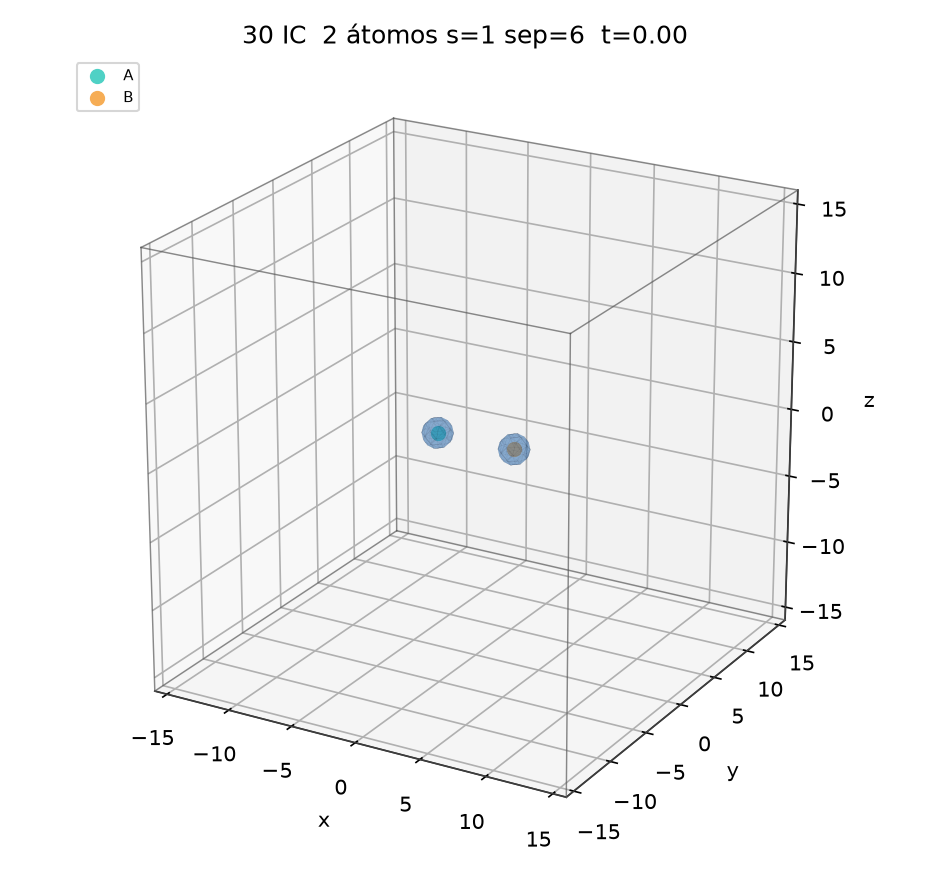

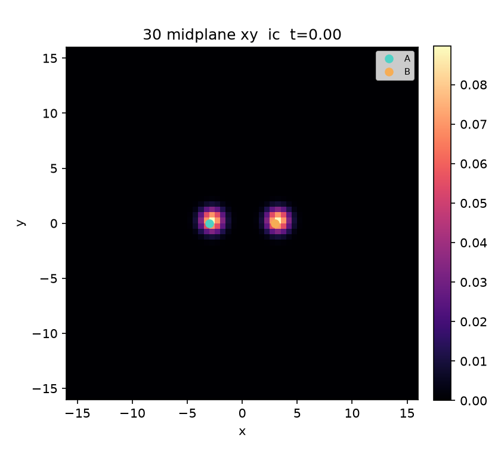

### Parâmetros (Theta_core, intocado)

$\Lambda=-10$, $\alpha=0.15$, $\sigma=1.5$, $\Gamma=0.05$, $\nu=(10, 0.5, 0.05)$, $\lambda=(3, 1, 0.3)$, `fdt_couple=True`, **kT=1.0**. $L=32$, $N=64$, $dt=0.0025$, $T=8$, seed=0. $f_{\mathrm{FDT}}=0.0125$, noise_amp $=0.015811388300841896=\sqrt{2\Gamma\,kT\,dt}$. Memória Euler ($\max\nu\cdot dt=0.025$).

Não substitui [27 triad_chaos_eq](27%20triad_chaos_eq.md) · [28 triad_atoms_3d](28%20triad_atoms_3d.md) · [29 triad_R5_A2](29%20triad_R5_A2.md) · Q01a.

### Resultado

Wall: **55.336 s** (12:16:08–12:17:03 BRT, 21/08/2026). 3200 passos, 117 amostras (cedo $\Delta t=0.01$ até $t=0.4$; depois $\Delta t=0.1$).

| | t=0 | t=0.01 (último par) | t=0.02 | t=0.1 | mid t=4 | final t=8 |
|---|---|---|---|---|---|---|
| n_det (par NMS) | 2 | 2 | 29 | — | — | — |
| n_raw máx. local | 2 | 2 | 30 | 3603 | (volume) | 8349 |
| pair_sep | 6.000000 | 6.020797 | — | — | — | — |
| two_blobs | sim | sim | não | não | não | não |
| norm | 1.0 | 33.721971 | 66.256441 | 327.167518 | 10793.88 | 18033.373159 |
| peak | 0.089782 | 0.100767 | 0.090554 | 0.201959 | 3.102430 | 4.187885 |
| PR | 31.506820 | 11004.413 | 14616.525 | 16320.800 | 17833.27 | 19579.930525 |
| R_rms | 3.240199 | 15.758815 | 15.877491 | 15.983788 | 16.01433 | 15.955965 |

Pico de densidade máximo=**4.770362** em t=6.8. Vmem_peak máximo=7.556006 em t=5.7; Vmem_peak final=6.829866. Janela late ($t\ge 6.4$): peak $3.886935\pm 0.343$; PR $19197.382\pm 201$; R_rms $15.982180\pm 0.022$; norm $16771.131\pm 783$. Sem NaN, sem blowup. células½ final=1706 (não 1–2 células).

Os dois átomos **permanecem 2 só até t=0.01**. Em t=0.02 o detector já conta 29–30 máximos e R_rms já é $\approx L/2$. Em t=0.1 n_raw=3603, norm=327 — a mesma família de preenchimento de Q01a / [27 triad_chaos_eq](27%20triad_chaos_eq.md) com este banho. **Com kT=1 as duas sementes viram universo antes de um par-órbita poder ser lido.** kT não foi retocado. Isso é o resultado.

pair_sep enquanto ainda havia 2 blobs: $6.000\to 6.021$ ($\Delta=+0.021$ em $\Delta t=0.01$; um passo de grade $dx=0.5$). Não é queda. Depois pair_sep é indefinido (par perdido).

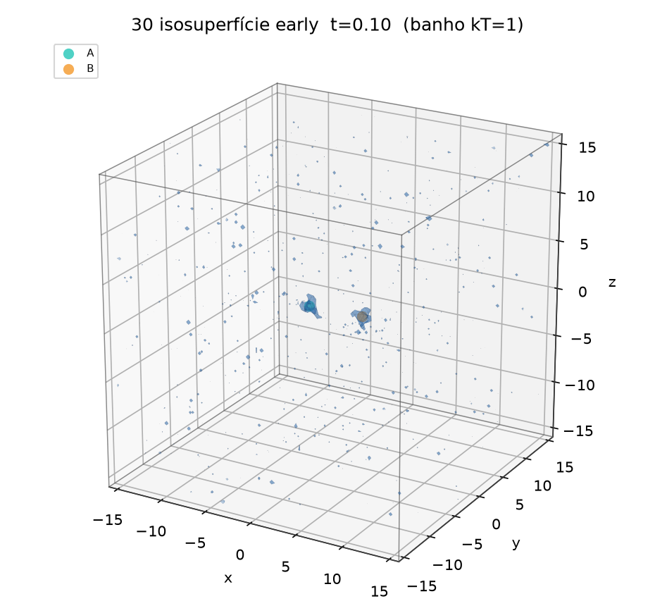

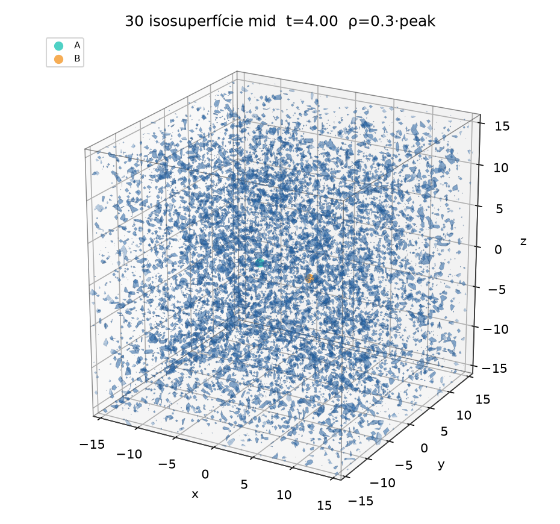

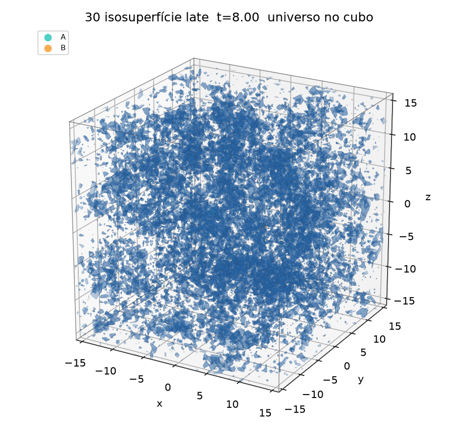

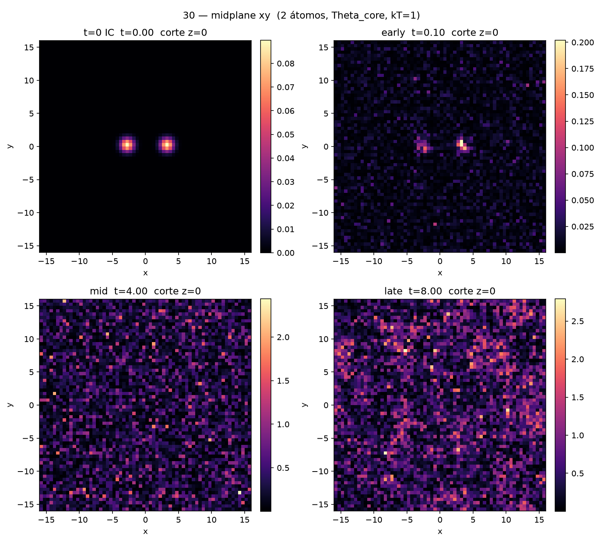

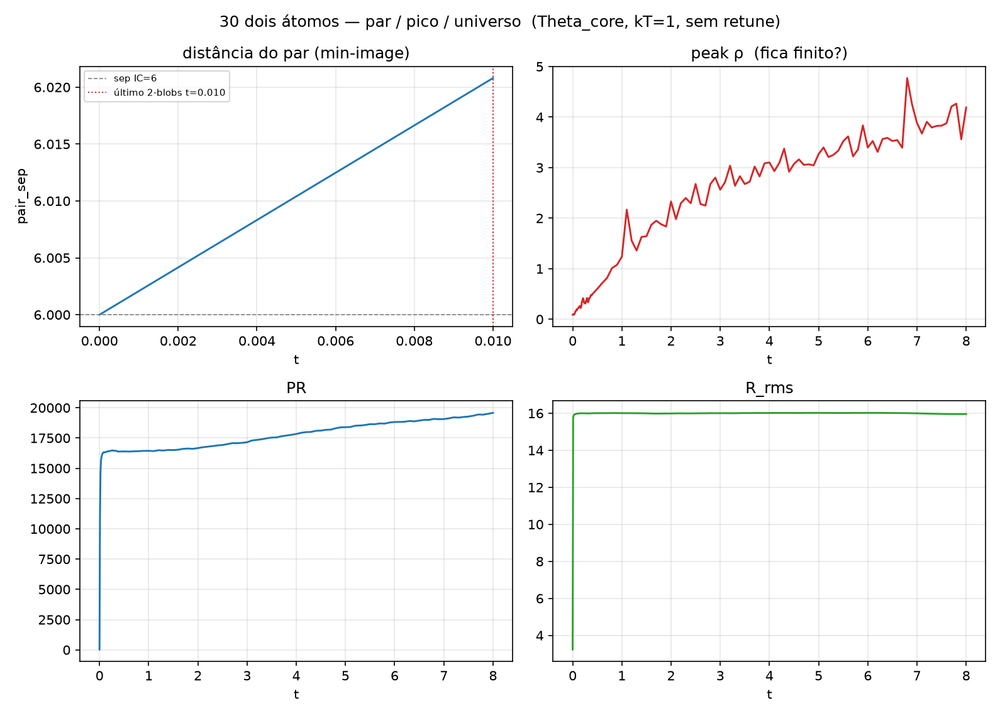

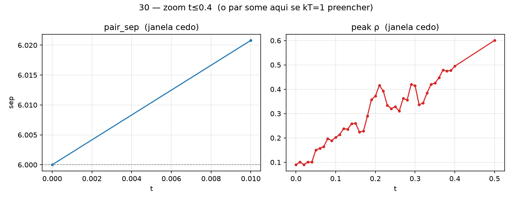


### O que os números sustentam

**(a) distância do par — INCONCLUSIVE.** Dois blobs só em $t\in\{0, 0.01\}$. Não houve tempo para ler atração. pair_sep 6.000→6.021 e some. Com este banho o par vira universo em $t\ll 1$. Não é evidência de gravidade emergente e não é evidência contra: o par não durou.

**(b) pico finito — SUPPORTED (neste run).** peak ρ máximo=4.770362, final=4.187885, sempre finito, sem blowup. Anti-colapso operacional: a singularidade **não** foi a infinito. Pico late ~3.89 em milhares de células, não artefato de 1–2 células.

Nunca “provou gravidade”. Theta_core intocado.

### CSVs

- [Artefatos/triad_dois_atomos/summary.csv](../../source/Artefatos/triad_dois_atomos/summary.csv)
- [Artefatos/triad_dois_atomos/metrics.csv](../../source/Artefatos/triad_dois_atomos/metrics.csv)
- [Artefatos/triad_dois_atomos/summary.json](../../source/Artefatos/triad_dois_atomos/summary.json)

### Arquivos

`00_montagem.png` · `01_ic_isosurface.png` · `01b_isosurface_early.png` · `02_isosurface_mid.png` · `03_isosurface_late.png` · `04_midplane_xy.png` + midplanes individuais · `05_observables.png` · `06_n_det.png` · `07_early_zoom.png` · metrics.csv · summary.csv · summary.json · `rho_{ic,early,mid,late}.npy`

Script: [Fontes/run_dois_atomos.py](../../source/Fontes/run_dois_atomos.py)

→ [Índice de runs](%C3%8Dndice%20de%20runs.md) · `[[TRIAD]]` · [Leitura operacional](../Conceitos/Leitura%20operacional.md)

### Run 31 — 31 nested_gaussians

*Fonte:* `Simulações/31 nested_gaussians.md`

## nested_gaussians

Equação TRIAD **completa**, Theta_core congelado (Q00 / [TRIAD_QM_CANONICAL_V1](../Fontes/TRIAD_QM_CANONICAL_V1.md)). **I0 / environment**, não scan. 1 gaussiana = 1 átomo. **Duas sementes concêntricas**, uma dentro da outra (mesmo centro, larguras diferentes). Leitura: perfil radial de duas escalas (ninho) e pico finito (singularidade que não vai a infinito). Colapso/sobreposição do ninho **pode** ser lido como gravidade / singularidade finita — números, não prova. Volume preenchido = universo, não ruído. Sem isolar memória/FDT. Sem mudar Theta_core. Sem retocar kT. [Leitura operacional](../Conceitos/Leitura%20operacional.md) · [Anti-colapso](../Conceitos/Anti-colapso.md) · [Universo como simulação](../Conceitos/Universo%20como%20simula%C3%A7%C3%A3o.md)

Solver: Strang 3D standalone (mesmo passo de [Fontes/run_q01a.py](../../source/Fontes/run_q01a.py) / [30 dois_atomos_gravidade](30%20dois_atomos_gravidade.md)). fp64, numpy. $V_{\mathrm{ext}}=0$, $y_j(0)=0$, caixa periódica $[-L/2,L/2)^3$.

### IC — ninho (I0, decidido uma vez)

$\Psi = G(s_{\mathrm{in}}=0.5)+G(s_{\mathrm{out}}=2.0)$ no origem, fases 0, amplitudes cruas iguais, depois $\int|\Psi|^2\,dV=1$. Pico IC=0.081903, PR=87.079210, R_rms=2.351612, r50=2.061553, r90=3.500000, contrast_im=7.888756, contrast_mf=$3.320\times10^{8}$, two_scale=sim.


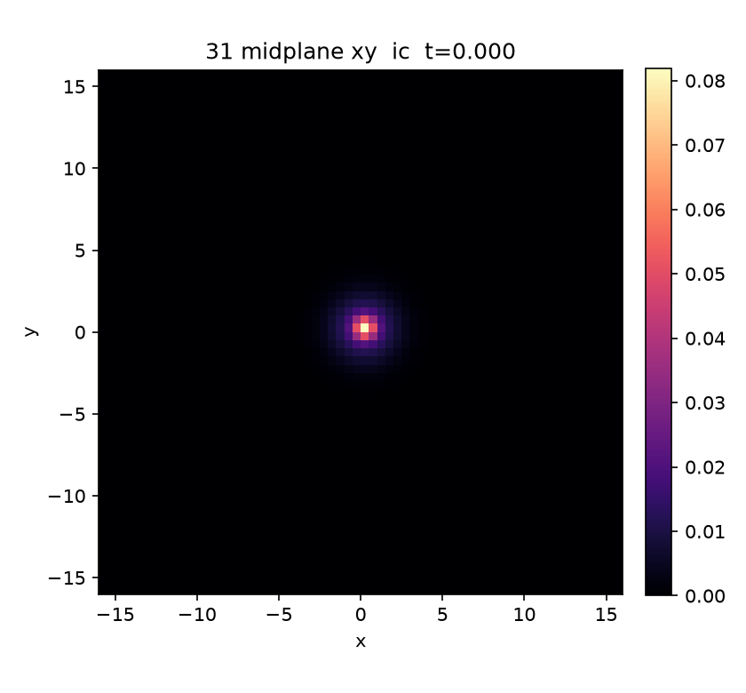


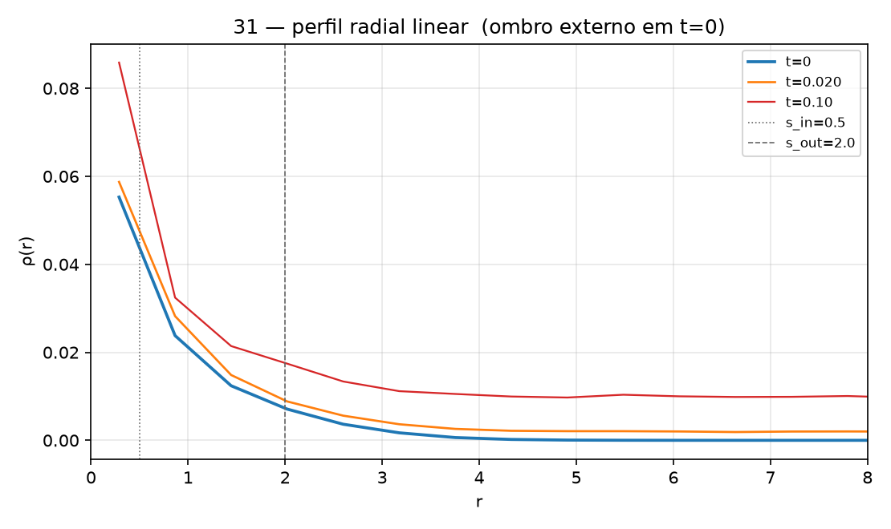

O gráfico de dinheiro é o perfil radial: em t=0 há núcleo estreito ($s=0.5$) sobre ombro largo ($s=2$). Isosuperfície em dois níveis (interno 0.35·peak, externo 0.08·peak), mesma câmera.

### Parâmetros (Theta_core, intocado)

$\Lambda=-10$, $\alpha=0.15$, $\sigma=1.5$, $\Gamma=0.05$, $\nu=(10, 0.5, 0.05)$, $\lambda=(3, 1, 0.3)$, `fdt_couple=True`, **kT=1.0**. $L=32$, $N=64$, $dt=0.0025$, $T=8$, seed=0. $f_{\mathrm{FDT}}=0.0125$, noise_amp $=0.015811388300841896=\sqrt{2\Gamma\,kT\,dt}$. Memória Euler ($\max\nu\cdot dt=0.025$).

Não substitui [27 triad_chaos_eq](27%20triad_chaos_eq.md) · [28 triad_atoms_3d](28%20triad_atoms_3d.md) · [29 triad_R5_A2](29%20triad_R5_A2.md) · [30 dois_atomos_gravidade](30%20dois_atomos_gravidade.md) · Q01a.

### Resultado

Wall: **46.963 s** (12:26:12–12:26:59 BRT, 21/08/2026). 3200 passos, 117 amostras (cedo $\Delta t=0.01$ até $t=0.4$; depois $\Delta t=0.1$).

| | t=0 IC | t=0.01 | t=0.02 (último two-scale) | t=0.03 (perdido) | t=0.1 | mid t=4 | final t=8 |
|---|---|---|---|---|---|---|---|
| two_scale | sim | sim | sim | não | não | não | não |
| contrast_im | 7.888756 | 7.290466 | 6.666965 | 5.622690 | 3.976920 | — | 1.047596 |
| contrast_mf | 3.320e8 | 6.276988 | 3.713929 | 2.831417 | 1.559350 | — | 0.890643 |
| norm | 1.0 | 33.677667 | 66.244680 | 99.050524 | 327.1027 | — | 18022.360425 |
| peak | 0.081903 | 0.064509 | 0.069685 | 0.098875 | 0.139253 | 3.156925 | 4.370383 |
| PR | 87.079210 | 14125.834 | 15677.186 | 16103.522 | 16387.59 | — | 19556.518659 |
| R_rms | 2.351612 | 15.764078 | 15.876406 | 15.914823 | 15.98481 | — | 15.974160 |
| r50 | 2.061553 | 15.580436 | 15.644488 | 15.692355 | 15.7321 | — | 15.692355 |

Pico de densidade máximo=**4.525384** em t=6.8. Vmem_peak máximo=8.048361 em t=7.1; Vmem_peak final=7.064783. Janela late ($t\ge 6.4$): peak $3.924175\pm 0.266$; PR $19189.245\pm 193$; R_rms $15.990821\pm 0.017$; norm $16769.296\pm 782$. Sem NaN, sem blowup. células½ final=1217 (não 1–2 células).

O ninho **permanece two-scale só até t=0.02**. Em t=0.01 R_rms já é $\approx L/2$ (15.76) e a norma já é 33.7 — o banho preenche o cubo no mesmo prazo do run 30. Em t=0.03 contrast_mf cai abaixo de 3 e o critério operacional morre. **Com kT=1 as duas sementes aninhadas viram universo antes de um colapso-ninho poder ser lido.** kT não foi retocado. Isso é o resultado.

Enquanto two_scale existia: $\Delta$peak $= -0.0122$, $\Delta$R_rms $= +13.525$ (expandiu, não contraiu). Sem leitura de queda.


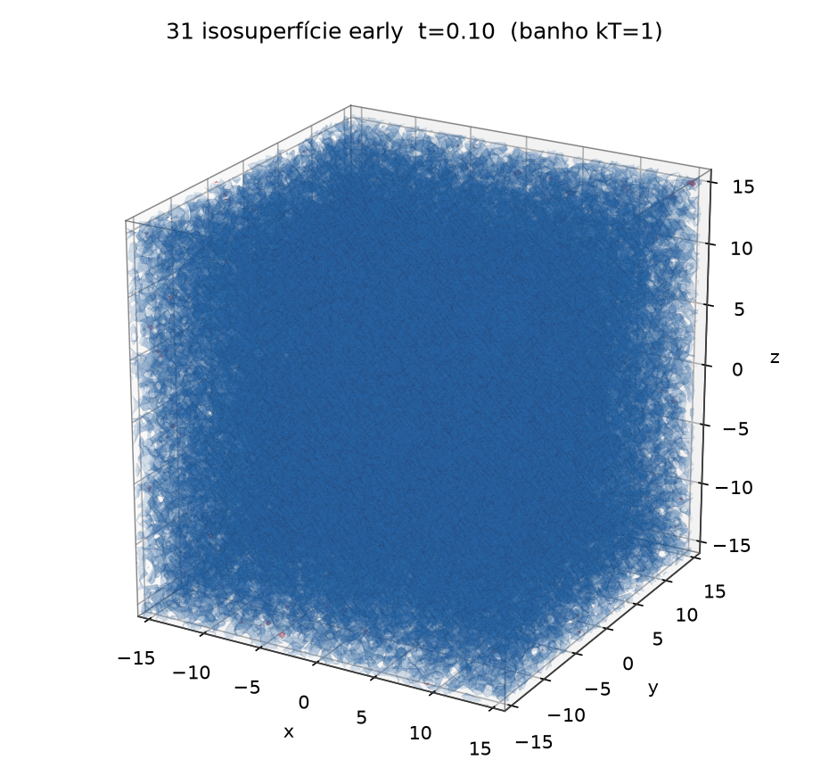

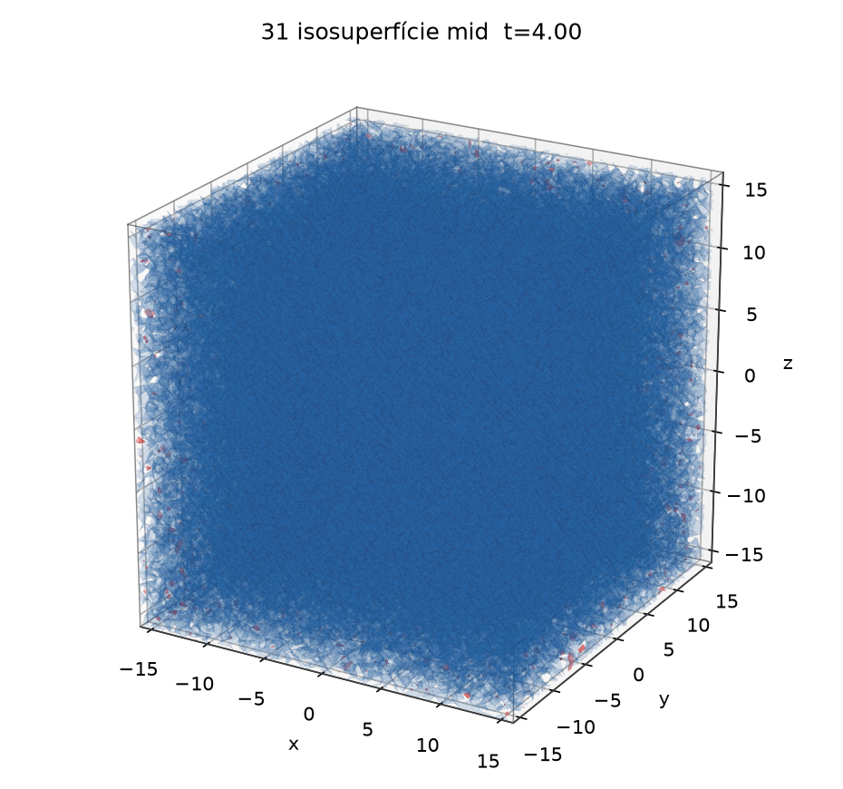


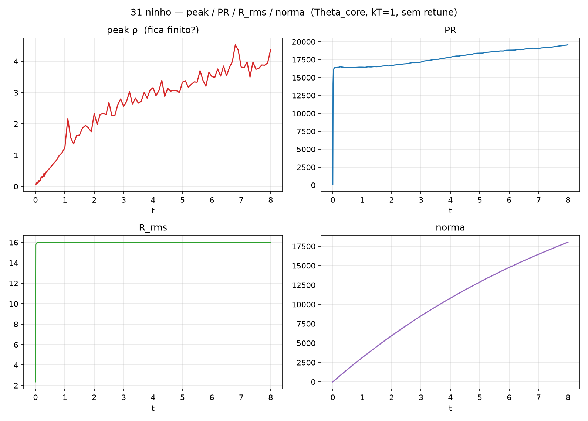


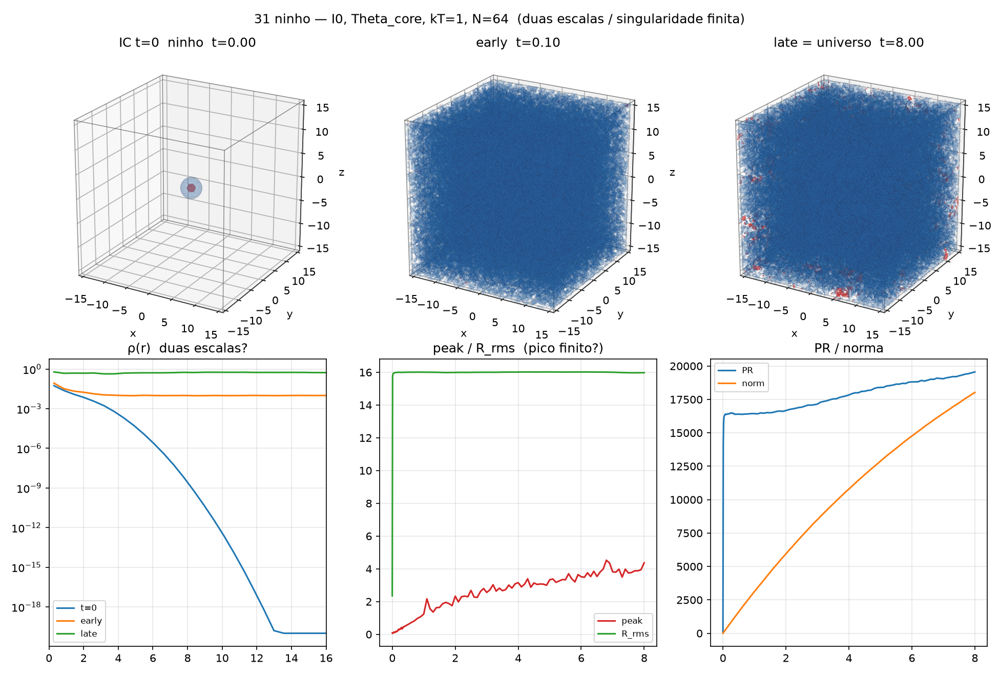

### O que os números sustentam

**(a) duas escalas / ninho — INCONCLUSIVE.** two_scale só em $t\in\{0, 0.01, 0.02\}$. Em t=0 o perfil radial tem núcleo+ombro (é o ponto da IC). Depois o banho come o ninho: R_rms 2.35→15.76 já em t=0.01, flag morta em t=0.03. Não houve tempo para ler colapso/sobreposição como gravidade. Não é evidência a favor nem contra: o ninho não durou.

**(b) pico finito — SUPPORTED (neste run).** peak ρ máximo=4.525384, final=4.370383, sempre finito, sem blowup. Anti-colapso operacional: a singularidade **não** foi a infinito. Pico late ~3.92 em 1217 células, não artefato de 1–2 células.

Nunca “provou gravidade”. Theta_core intocado. kT=1.0 intocado.

### CSVs

- [Artefatos/triad_nested/summary.csv](../../source/Artefatos/triad_nested/summary.csv)
- [Artefatos/triad_nested/metrics.csv](../../source/Artefatos/triad_nested/metrics.csv)
- [Artefatos/triad_nested/radial_profiles.csv](../../source/Artefatos/triad_nested/radial_profiles.csv)
- [Artefatos/triad_nested/summary.json](../../source/Artefatos/triad_nested/summary.json)

### Arquivos

`00_montagem.png` · `01_ic_isosurface.png` · `01b_isosurface_early.png` · `01c_isosurface_t002.png` · `02_isosurface_mid.png` · `03_isosurface_late.png` · `04_midplane_xy.png` + midplanes individuais · `05_observables.png` · `06_radial_profiles.png` · `06b_radial_linear.png` · `07_early_zoom.png` · `08_two_scale.png` · metrics.csv · radial_profiles.csv · summary.csv · summary.json · `rho_{ic,t002,early,mid,late}.npy`

Script: [Fontes/run_nested_gaussians.py](../../source/Fontes/run_nested_gaussians.py)

→ [Índice de runs](%C3%8Dndice%20de%20runs.md) · `[[TRIAD]]` · [Leitura operacional](../Conceitos/Leitura%20operacional.md)

### Run 32 — 32 universo_atomo

*Fonte:* `Simulações/32 universo_atomo.md`

## universo_atomo

Equação TRIAD **completa**, Theta_core congelado (Q00 / [TRIAD_QM_CANONICAL_V1](../Fontes/TRIAD_QM_CANONICAL_V1.md)). **I0 / environment**, não scan. 1 gaussiana = 1 átomo. **OUTER larga = o universo** (um átomo gigante). **Dentro:** observador e observado, fases 0 e π (+ e −). Leitura: **anti-colapso / ímã-repele** (memória mesmo-polo, singularidade finita) — **não** MQ, **não** colapso-como-gravidade-caindo. Volume preenchido = universo, não ruído. Sem isolar memória/FDT. Sem mudar Theta_core. Sem retocar kT. [Leitura operacional](../Conceitos/Leitura%20operacional.md) · [Anti-colapso](../Conceitos/Anti-colapso.md) · [Universo como simulação](../Conceitos/Universo%20como%20simula%C3%A7%C3%A3o.md)

Solver: Strang 3D standalone (mesmo passo de [Fontes/run_q01a.py](../../source/Fontes/run_q01a.py) / [30 dois_atomos_gravidade](30%20dois_atomos_gravidade.md) / [31 nested_gaussians](31%20nested_gaussians.md)). fp64, numpy. $V_{\mathrm{ext}}=0$, $y_j(0)=0$, caixa periódica $[-L/2,L/2)^3$.

### IC — ninho 3 escalas (I0, decidido uma vez)

$\Psi = G_{\mathrm{env}}(s=8.0)_{(0,0,0)}^{\mathrm{fase}\,0} + G_{\mathrm{obs}}(s=1.0)_{(-2.5,0,0)}^{\mathrm{fase}\,0} + G_{\mathrm{obd}}(s=1.0)_{(+2.5,0,0)}^{\mathrm{fase}\,\pi\,(=\,\times-1)}$, depois $\int|\Psi|^2\,dV=1$. Pico IC=0.001351, PR=7436.783130, R_rms=9.574362, r50=8.616844, r90=13.829317, pair_sep=5.000, n_inner=2, n_pos=1, n_neg=1, n_det_ρ=1 (só o + é máximo de $|Ψ|^2$; o − é um poço de Re). Re+ = 0.036751, Re− = −0.000897.

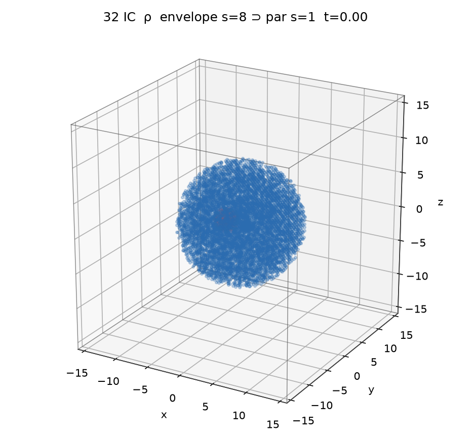

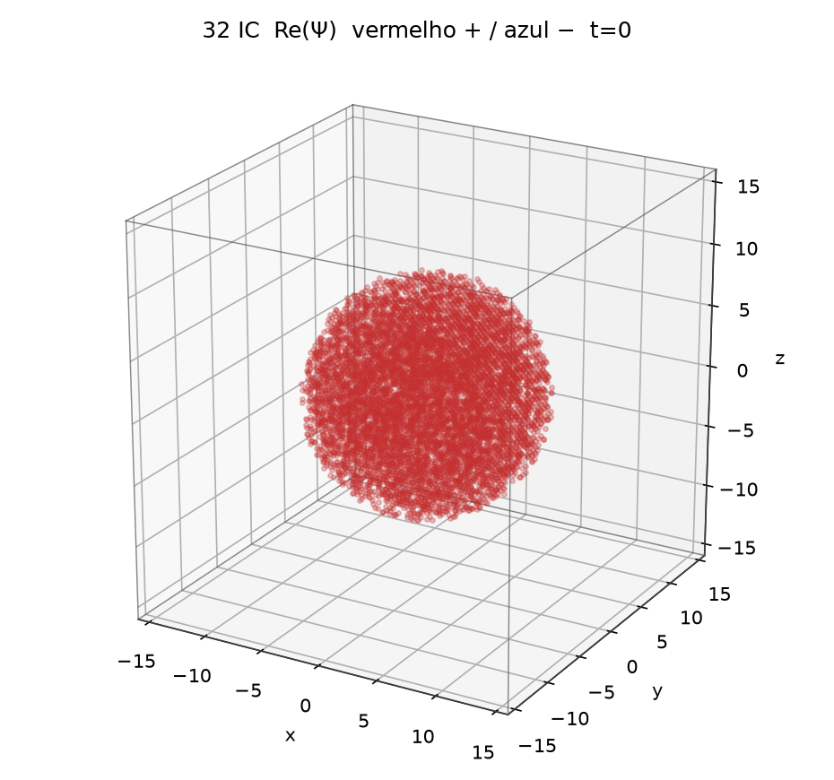

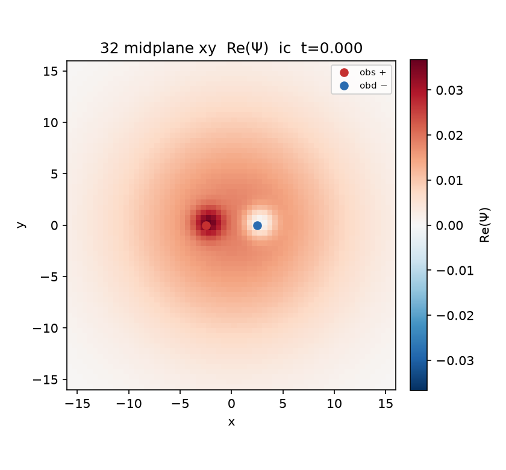

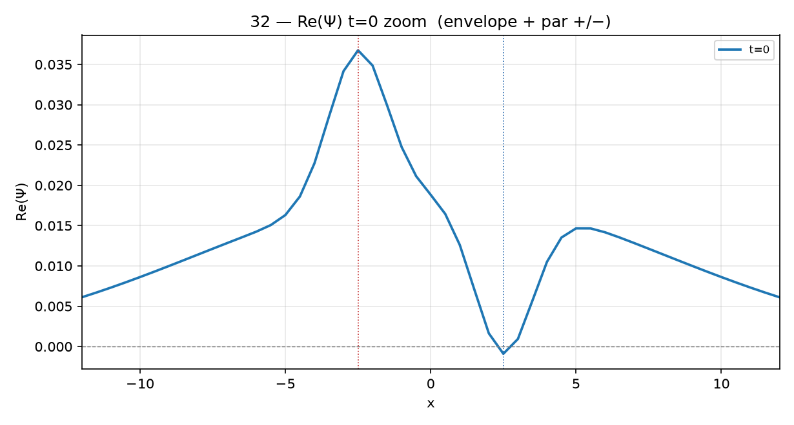

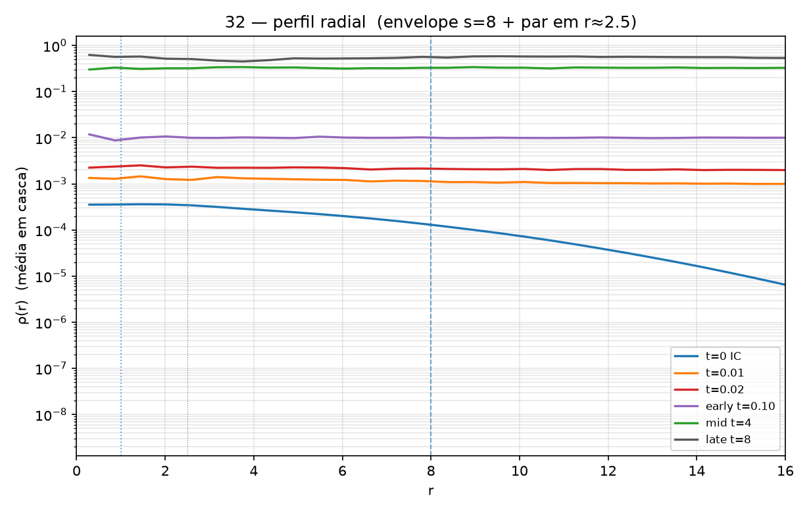

O gráfico de dinheiro é Re(Ψ) no midplane (vermelho + / azul −): envelope largo positivo, blob interno + em $x=-2.5$, dip interno − em $x=+2.5$. O corte Re$(x,0,0)$ mostra o mesmo. $|Ψ|^2$ sozinho esconde o sinal.

### Parâmetros (Theta_core, intocado)

$\Lambda=-10$, $\alpha=0.15$, $\sigma=1.5$, $\Gamma=0.05$, $\nu=(10, 0.5, 0.05)$, $\lambda=(3, 1, 0.3)$, `fdt_couple=True`, **kT=1.0**. $L=32$, $N=64$, $dt=0.0025$, $T=8$, seed=0. $f_{\mathrm{FDT}}=0.0125$, noise_amp $=0.015811388300841896=\sqrt{2\Gamma\,kT\,dt}$. Memória Euler ($\max\nu\cdot dt=0.025$).

Não substitui [27 triad_chaos_eq](27%20triad_chaos_eq.md) · [28 triad_atoms_3d](28%20triad_atoms_3d.md) · [29 triad_R5_A2](29%20triad_R5_A2.md) · [30 dois_atomos_gravidade](30%20dois_atomos_gravidade.md) · [31 nested_gaussians](31%20nested_gaussians.md) · Q01a.

### Resultado

Wall: **116.629 s** (12:37:07–12:39:03 BRT, 21/08/2026). 3200 passos, 117 amostras (cedo $\Delta t=0.01$ até $t=0.4$; depois $\Delta t=0.1$).

| | t=0 IC | t=0.01 (perdido) | t=0.02 | t=0.1 | mid t=4 | final t=8 |
|---|---|---|---|---|---|---|
| n_inner (+/− Re) | 2 | 0 | 0 | 0 | 0 | 0 |
| n_pos / n_neg | 1 / 1 | 0 / 0 | 0 / 0 | 0 / 0 | 0 / 0 | 0 / 0 |
| n_raw_ρ | 1 | 8608 | 8636 | 8736 | 9286 | 8358 |
| pair_sep | 5.000000 | — | — | — | — | — |
| two_inner / nest3 | sim | não | não | não | não | não |
| norm | 1.0 | 33.683190 | 66.227634 | 327.040428 | 10793.988 | 18029.079193 |
| peak | 0.001351 | 0.013039 | 0.025565 | 0.124410 | 3.147238 | 3.888902 |
| PR | 7436.783 | 16426.197 | 16382.236 | 16427.905 | 17836.815 | 19568.776 |
| R_rms | 9.574362 | 15.845353 | 15.920024 | 15.994502 | 16.014308 | 15.960909 |

Pico de densidade máximo=**4.598659** em t=7.7. Vmem_peak máximo=7.536641 em t=7.7; Vmem_peak final=6.593055. Janela late ($t\ge 6.4$): peak $3.939050\pm 0.274$; PR $19189.118\pm 193$; R_rms $15.985992\pm 0.019$; norm $16770.970\pm 785$. Sem NaN, sem blowup. células½ final=2830 (não 1–2 células).

O par +/− **existe só em t=0**. Em t=0.01 o detector já conta milhares de extremos (n_raw_ρ=8608, n_raw_pos=9741, n_raw_neg=9250) e R_rms já é $\approx L/2$. Em t=0.02 n_raw_ρ=8636, norm=66.2 — a mesma família de preenchimento de [30 dois_atomos_gravidade](30%20dois_atomos_gravidade.md) / [31 nested_gaussians](31%20nested_gaussians.md) com este banho. **Com kT=1 o ninho 3 escalas dissolve em $t=0.01$; o volume preenchido continua o universo.** kT não foi retocado. Isso é o resultado.

pair_sep enquanto n_inner=2: só o ponto t=0, sep=5.000. $\Delta$sep $=0$ (um único recorde — não há segundo instante para medir afastamento). Depois pair_sep é indefinido (par perdido). Os dois internos **não** tiveram tempo de se afastar nem de se aproximar.

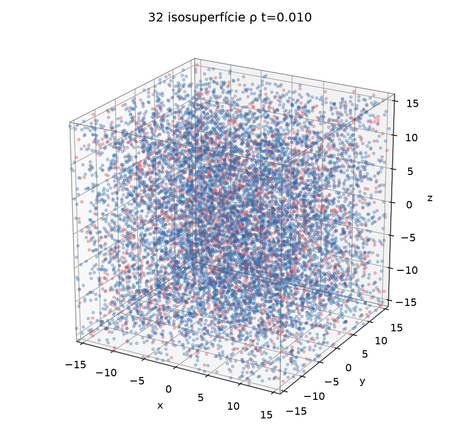

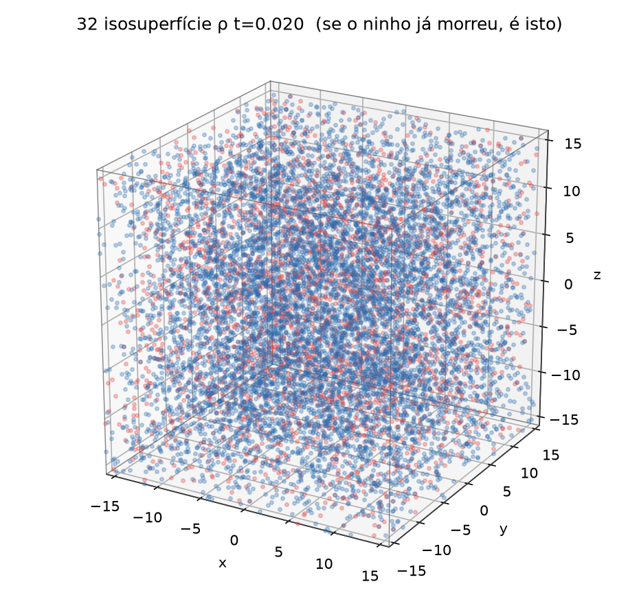

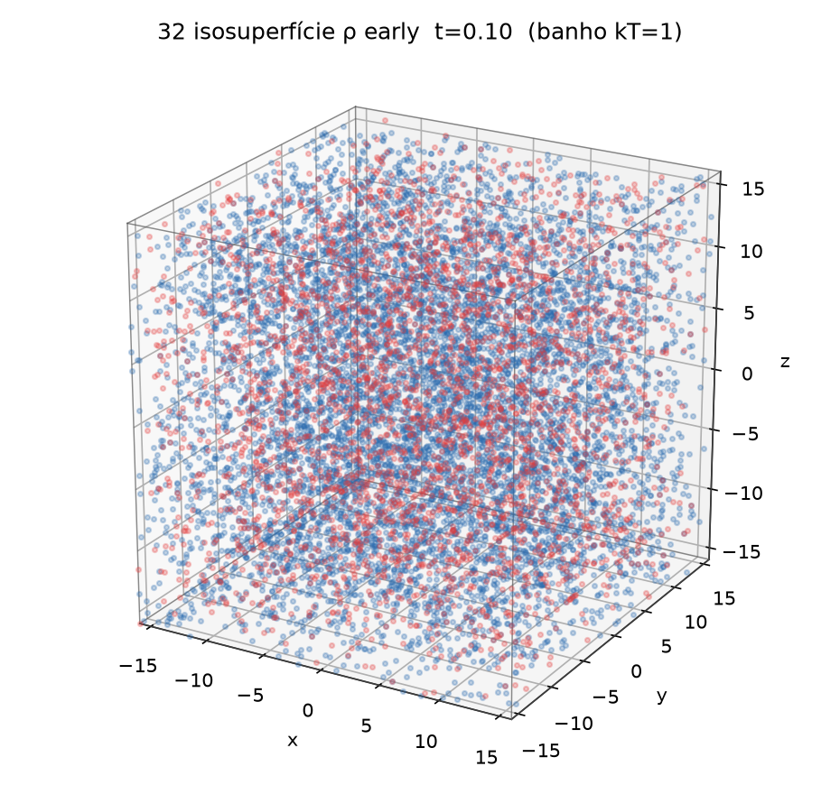

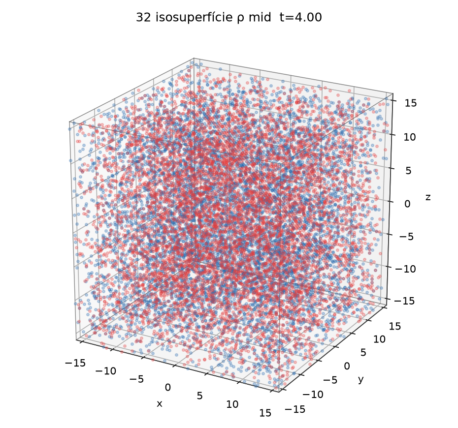

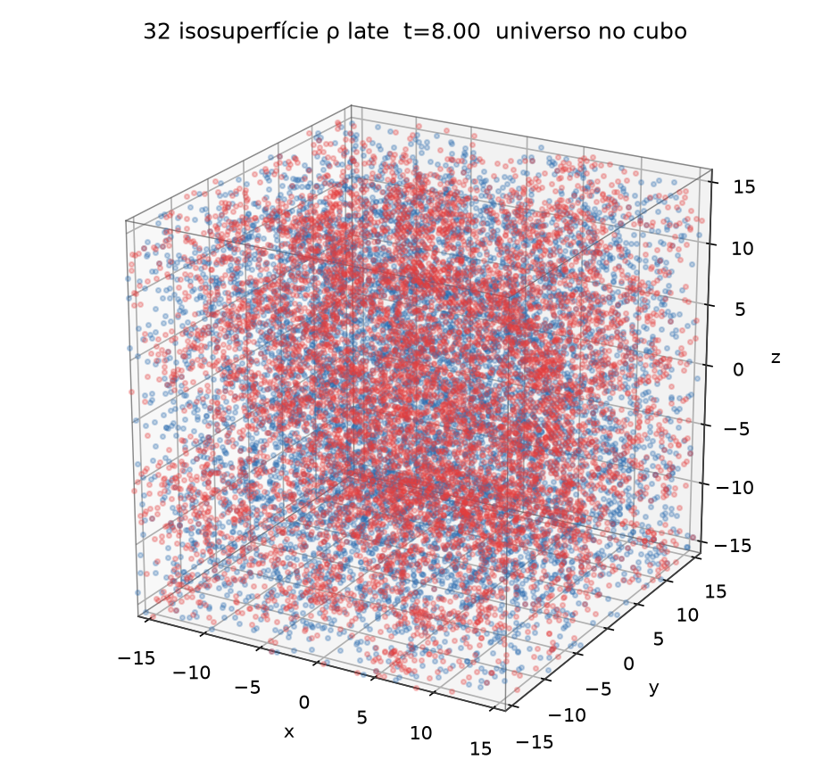

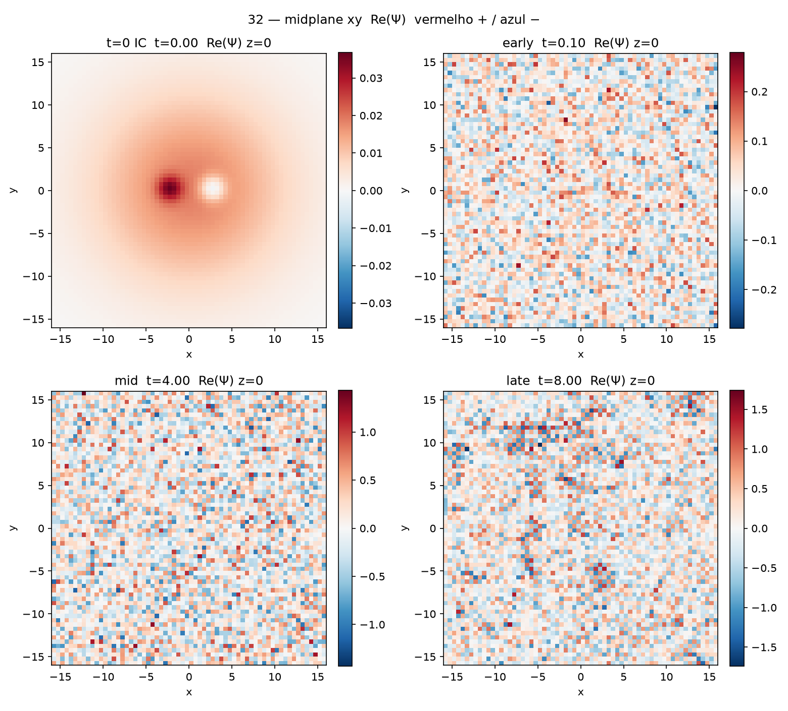

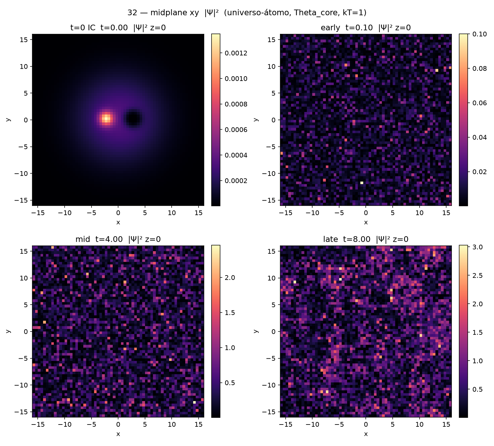

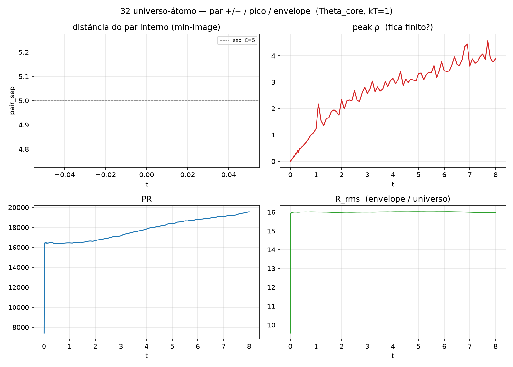

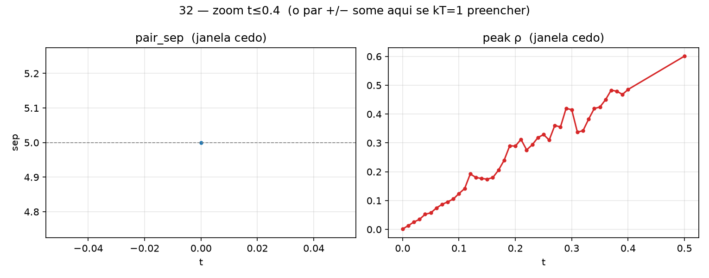

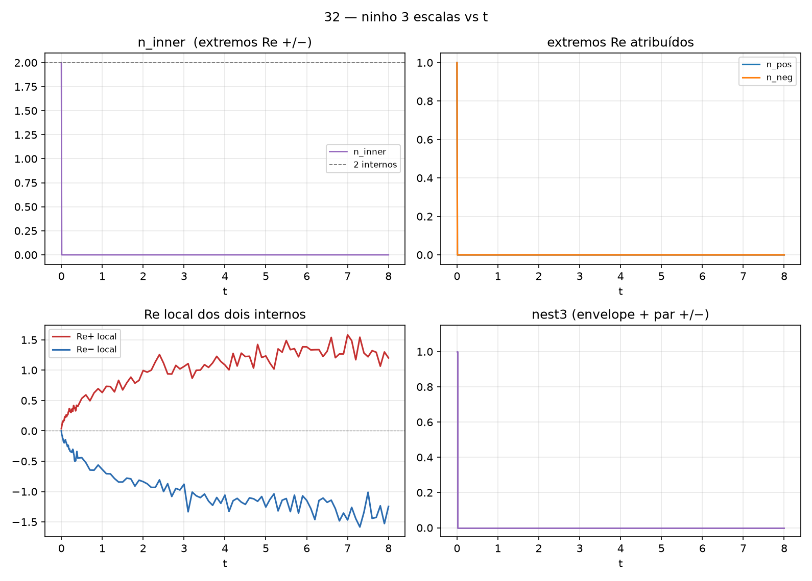

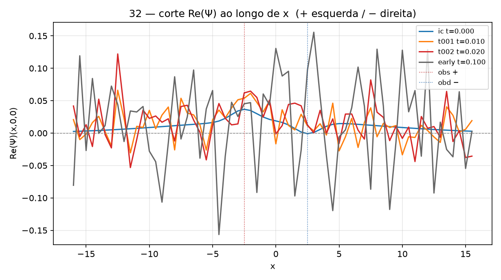

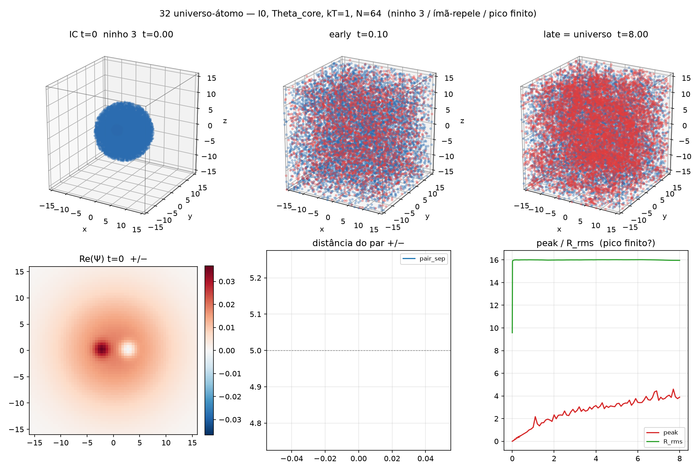

### O que os números sustentam

**(a) par +/− / ímã-repele — INCONCLUSIVE.** n_inner=2 só em $t=0$. Em t=0.01 o par já morreu. Não houve tempo para ler repulsão. pair_sep=5.000 e some ($\Delta$sep indefinido / 0). Com este banho o ninho vira universo em $t\ll 1$. Não é evidência a favor nem contra: o par não durou.

**(b) ninho 3 escalas — INCONCLUSIVE.** nest3 só em t=0. Envelope $s=8$ + observador + observado visíveis na IC (Re midplane e corte). Depois o banho come as sementes internas. O cubo preenchido **é o universo**, não ruído.

**(c) pico finito — SUPPORTED (neste run).** peak ρ máximo=4.598659, final=3.888902, sempre finito, sem blowup. Anti-colapso operacional: a singularidade **não** foi a infinito. Pico late ~3.94 em 2830 células, não artefato de 1–2 células.

Nunca “provou gravidade”. Nunca “provou MQ”. Theta_core intocado. kT=1.0 intocado.

### CSVs

- [Artefatos/triad_universo_atomo/summary.csv](../../source/Artefatos/triad_universo_atomo/summary.csv)
- [Artefatos/triad_universo_atomo/metrics.csv](../../source/Artefatos/triad_universo_atomo/metrics.csv)
- [Artefatos/triad_universo_atomo/radial_profiles.csv](../../source/Artefatos/triad_universo_atomo/radial_profiles.csv)
- [Artefatos/triad_universo_atomo/linecut_re.csv](../../source/Artefatos/triad_universo_atomo/linecut_re.csv)
- [Artefatos/triad_universo_atomo/summary.json](../../source/Artefatos/triad_universo_atomo/summary.json)

### Arquivos

`00_montagem.png` · `01_ic_isosurface.png` · `01e_ic_re_isosurface.png` · `01b`/`01c`/`01d` isos · `04_midplane_xy.png` + midplanes |Ψ|² e Re · `04r_midplane_re.png` · `05_observables.png` · `06_radial_profiles.png` · `06b_radial_linear.png` · `07_early_zoom.png` · `08_nest3.png` · `09_linecut_re.png` · `09b_linecut_re_t0.png` · metrics.csv · radial_profiles.csv · linecut_re.csv · summary.csv · summary.json · `rho_{ic,t001,t002,early,mid,late}.npy` · `re_{ic,t001,t002,early,mid,late}.npy`

Script: [Fontes/run_universo_atomo.py](../../source/Fontes/run_universo_atomo.py)

→ [Índice de runs](%C3%8Dndice%20de%20runs.md) · `[[TRIAD]]` · [Leitura operacional](../Conceitos/Leitura%20operacional.md)

### Run 33 — 33 ninho_pm

*Fonte:* `Simulações/33 ninho_pm.md`

## ninho_pm

Equação TRIAD **completa**, Theta_core congelado (Q00 / [TRIAD_QM_CANONICAL_V1](../Fontes/TRIAD_QM_CANONICAL_V1.md)). **I0 / environment**, não scan. 1 gaussiana = 1 átomo. **Inner atom INSIDE the outer atom**, mesmo centro. Outer fase 0 (+), inner fase π (−). Leitura: **ímã / anti-colapso** (ninho de sinal, singularidade finita) — **não** lado-a-lado como [32 universo_atomo](32%20universo_atomo.md), **não** ninho mesmo-sinal como [31 nested_gaussians](31%20nested_gaussians.md). Volume preenchido = universo, não ruído. Sem isolar memória/FDT. Sem mudar Theta_core. Sem retocar kT. [Leitura operacional](../Conceitos/Leitura%20operacional.md) · [Anti-colapso](../Conceitos/Anti-colapso.md) · [Universo como simulação](../Conceitos/Universo%20como%20simula%C3%A7%C3%A3o.md)

Solver: Strang 3D standalone (mesmo passo de [Fontes/run_q01a.py](../../source/Fontes/run_q01a.py) / [30 dois_atomos_gravidade](30%20dois_atomos_gravidade.md) / [31 nested_gaussians](31%20nested_gaussians.md)). fp64, numpy. $V_{\mathrm{ext}}=0$, $y_j(0)=0$, caixa periódica $[-L/2,L/2)^3$.

### IC — ninho +/− concêntrico (I0, decidido uma vez)

$\Psi = G_{\mathrm{out}}(s=2.0)_{(0,0,0)}^{\mathrm{fase}\,0} - G_{\mathrm{in}}(s=0.5)_{(0,0,0)}^{\mathrm{fase}\,\pi\,(=\,\times-1)}$, amplitudes cruas iguais, depois $\int|\Psi|^2\,dV=1$. Pico IC=0.014580, PR=141.559784, R_rms=2.522489, r50=2.236068, r90=3.570714, contrast_im=0.952067 (núcleo oco, não brilhante), contrast_mf=$3.287\times10^{8}$, contrast_oi=oco no origem, two_scale=sim (hollow), sign_nest=sim (hole_core, não minus_core). Re origem=0, Re max=0.120747, Re min=0.

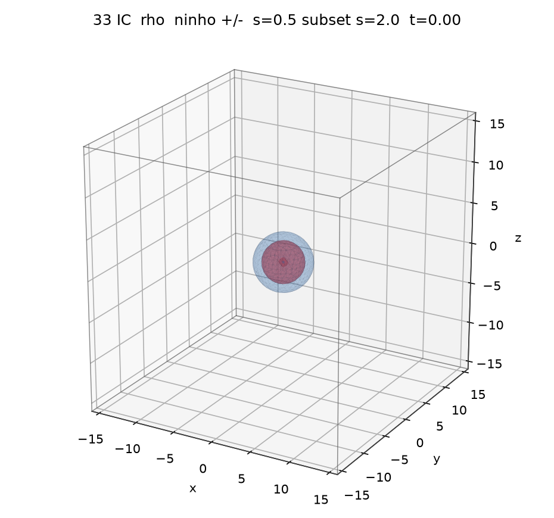

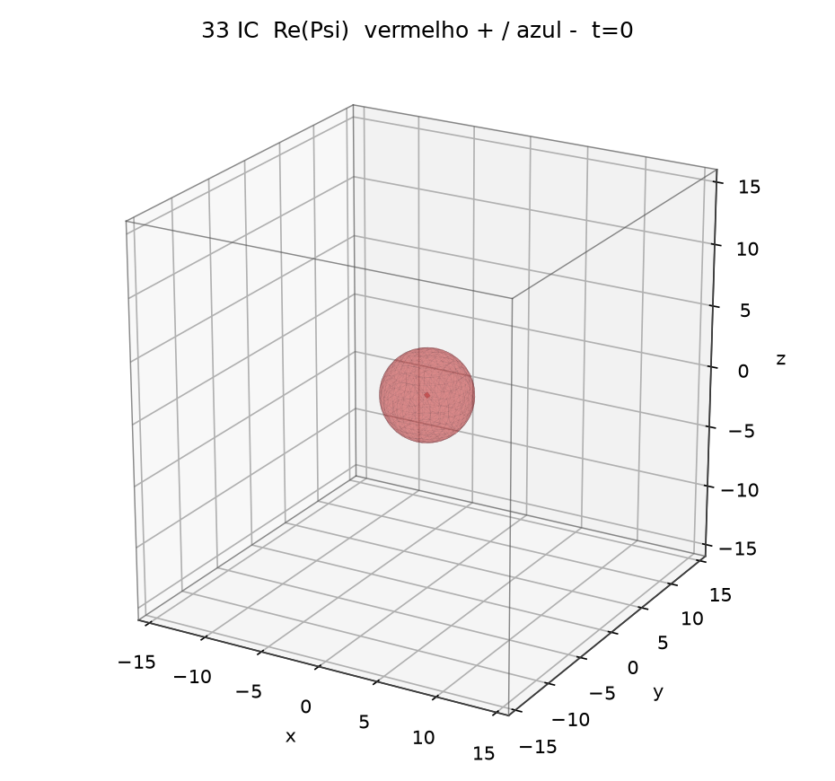

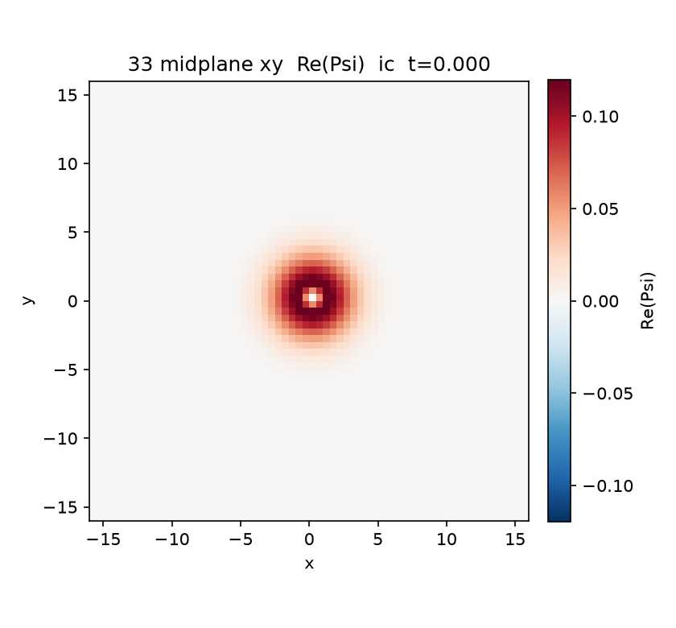

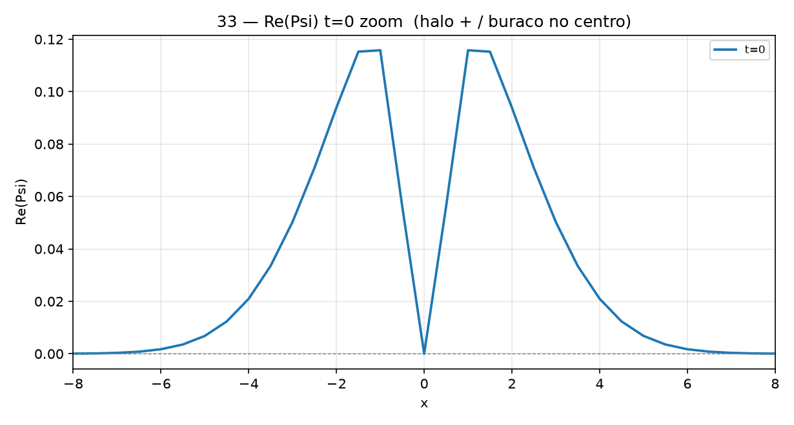

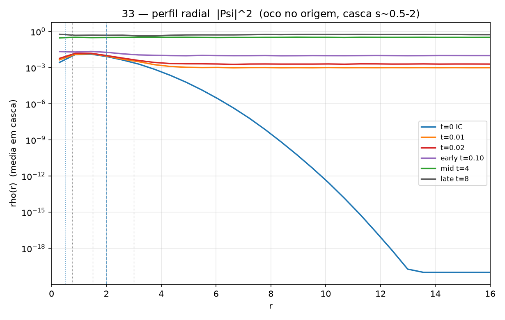

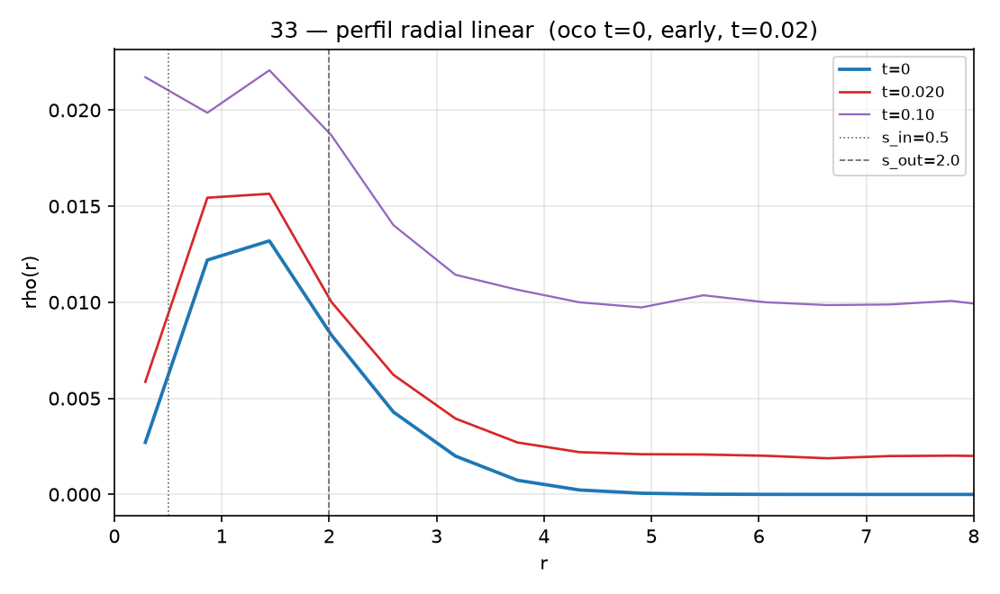

O gráfico de dinheiro é Re(Ψ) no midplane t=0 (vermelho + / azul −): **halo vermelho (envelope +) com buraco branco no centro** (nó, Re=0). O corte Re$(x,0,0)$ mostra o mesmo. $|Ψ|^2$ sozinho esconde o sinal e mostra o oco/casca. Não é o ninho mesmo-sinal do run 31 (lá o núcleo era brilhante).

### Parâmetros (Theta_core, intocado)

$\Lambda=-10$, $\alpha=0.15$, $\sigma=1.5$, $\Gamma=0.05$, $\nu=(10, 0.5, 0.05)$, $\lambda=(3, 1, 0.3)$, `fdt_couple=True`, **kT=1.0**. $L=32$, $N=64$, $dt=0.0025$, $T=8$, seed=0. $f_{\mathrm{FDT}}=0.0125$, noise_amp $=0.015811388300841896=\sqrt{2\Gamma\,kT\,dt}$. Memória Euler ($\max\nu\cdot dt=0.025$).

Não substitui [27 triad_chaos_eq](27%20triad_chaos_eq.md) · [28 triad_atoms_3d](28%20triad_atoms_3d.md) · [29 triad_R5_A2](29%20triad_R5_A2.md) · [30 dois_atomos_gravidade](30%20dois_atomos_gravidade.md) · [31 nested_gaussians](31%20nested_gaussians.md) · [32 universo_atomo](32%20universo_atomo.md) · Q01a.

### Resultado

Wall: **46.298 s** (12:51:31–12:52:17 BRT, 21/08/2026). 3200 passos, 117 amostras (cedo $\Delta t=0.01$ até $t=0.4$; depois $\Delta t=0.1$).

| | t=0 IC | t=0.01 | t=0.02 | t=0.04 (último two-scale) | t=0.05 (two perdido) | t=0.09 (1º sign off) | t=0.1 | mid t=4 | final t=8 |
|---|---|---|---|---|---|---|---|---|---|
| two_scale (oco/casca) | sim | sim | sim | sim | não | não | não | não | não |
| sign_nest | sim | sim | sim | sim | sim | não | não | não | não |
| hole_core / minus_core | sim / não | sim / não | sim / não | sim / não | sim / não | não / não | — | — | — |
| Re origem | 0 | −0.034784 | −0.017799 | +0.029837 | +0.033292 | +0.156113 | +0.157547 | −0.067646 | +0.390358 |
| Re max / min | 0.121 / 0 | 0.180 / −0.108 | 0.212 / −0.153 | 0.253 / −0.196 | 0.240 / −0.211 | 0.311 / −0.294 | 0.324 / −0.326 | 1.778 / −1.624 | 1.838 / −1.850 |
| contrast_im | 0.952 | 1.158 | 1.271 | 1.222 | 1.169 | 1.222 | 1.279 | 0.950 | 1.049 |
| contrast_mf | 3.287e8 | 7.139 | 4.149 | 2.593 | 2.284 | 1.730 | 1.650 | 0.975 | 0.888 |
| contrast_oi | oco | 5.076 | 4.642 | 3.936 | 2.220 | 0.534 | 0.742 | 13.587 | 0.513 |
| norm | 1.0 | 33.675405 | 66.236257 | 131.653653 | 164.173819 | 294.527097 | 327.085462 | 10793.588 | 18021.707596 |
| peak | 0.014580 | 0.032350 | 0.045519 | 0.070128 | 0.057509 | 0.106448 | 0.123177 | 3.163439 | 4.336503 |
| PR | 141.559784 | 14978.382 | 15977.150 | 16340.356 | 16357.118 | 16429.534 | 16403.033 | 17834.659 | 19557.411781 |
| R_rms | 2.522489 | 15.765385 | 15.877806 | 15.934619 | 15.948986 | 15.982788 | 15.985310 | 16.014472 | 15.972489 |
| r50 | 2.236068 | 15.580436 | 15.644488 | 15.692355 | 15.700318 | 15.724185 | 15.732133 | 15.763883 | 15.692355 |

Pico de densidade máximo=**4.452033** em t=6.8. Vmem_peak máximo=7.934021 em t=7.1; Vmem_peak final=7.062787. Janela late ($t\ge 6.4$): peak $3.906848\pm 0.261$; PR $19188.898\pm 192$; R_rms $15.990734\pm 0.017$; norm $16769.531\pm 781$. Sem NaN, sem blowup. células½ final=1310 (não 1–2 células).

O ninho **não morreu em t=0.02**. two-scale/oco permanece até **t=0.04**; em t=0.05 contrast_sf/oi caem abaixo do limiar. sign_nest operacional fica ligado até t=0.08 e **cai pela primeira vez em t=0.09**. Depois o flag **pisca** até t=1.0 (36 recordes; último fogo operacional t=1.0) sobre um cubo que **já é universo** desde t=0.01 (R_rms 2.52→15.77, norma 1→33.7 — a mesma família de preenchimento de [30 dois_atomos_gravidade](30%20dois_atomos_gravidade.md) / [31 nested_gaussians](31%20nested_gaussians.md) / [32 universo_atomo](32%20universo_atomo.md)). **Com kT=1 o oco +/− concêntrico dissolve em $t\sim0.05$–$0.09$; o volume preenchido continua o universo.** kT não foi retocado. Isso é o resultado.

Em t=0.01 o origem já é Re=−0.0348 (buraco azul de verdade, não só nó branco). Em t=0.02 Re origem=−0.0178, two e sign ainda vivos. Enquanto two_scale existia: $\Delta$peak $= +0.0555$, $\Delta$R_rms $= +13.412$ (expandiu, não contraiu). Sem leitura de queda.

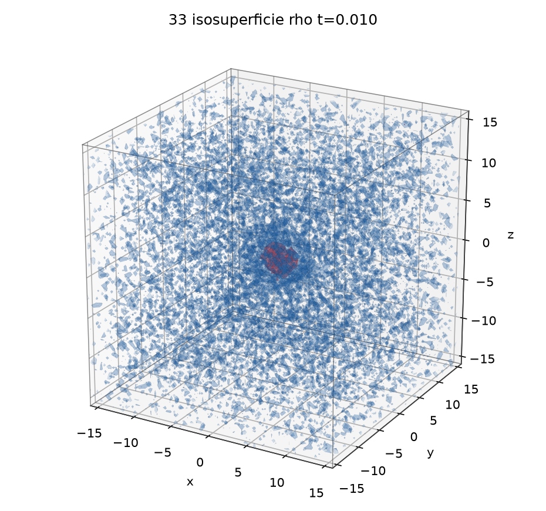

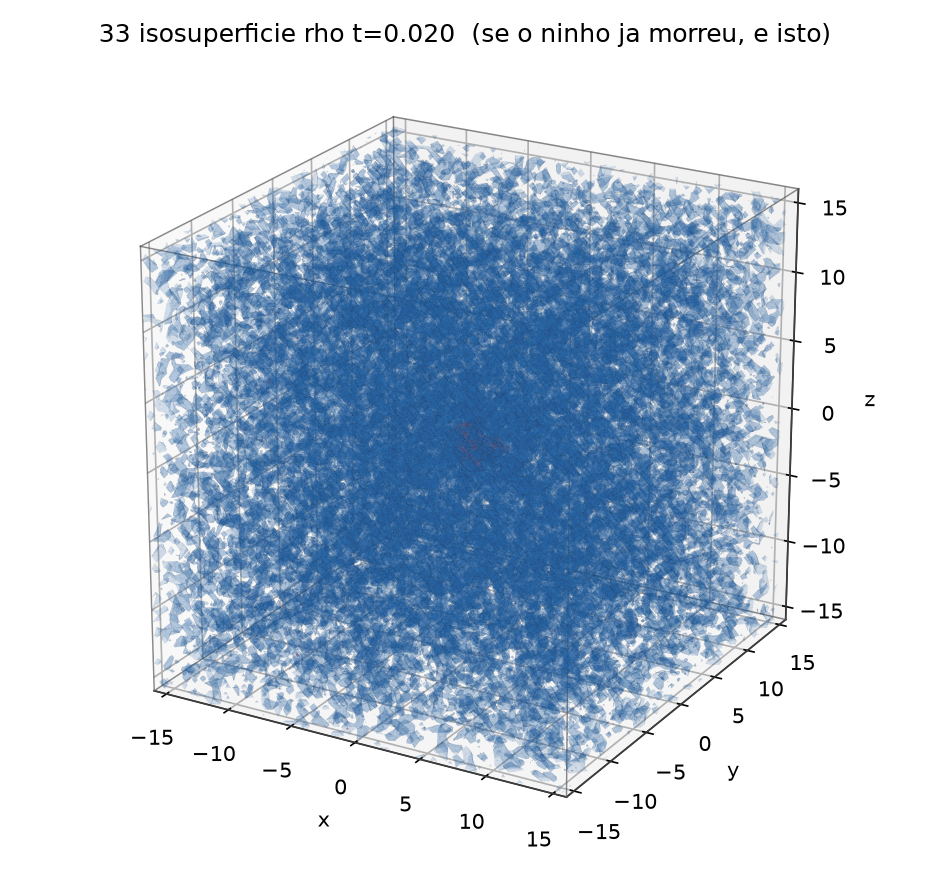

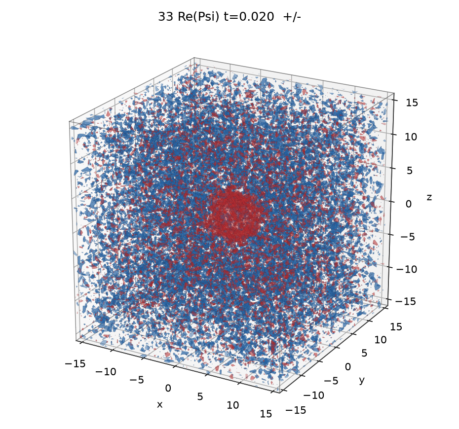

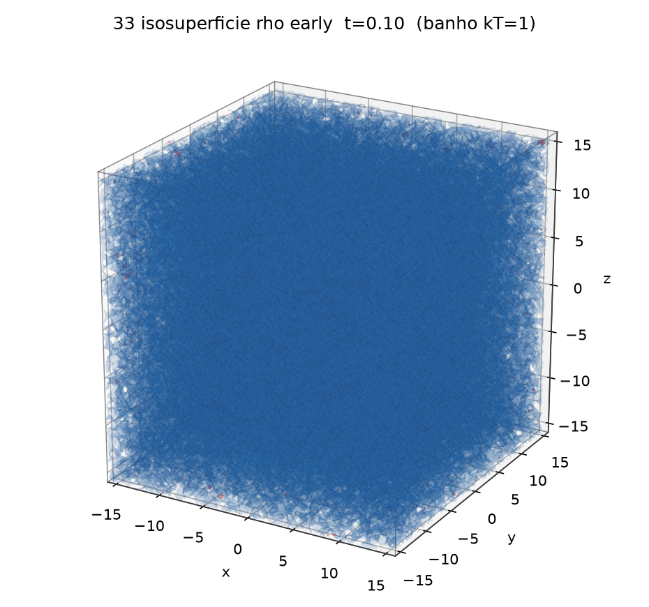

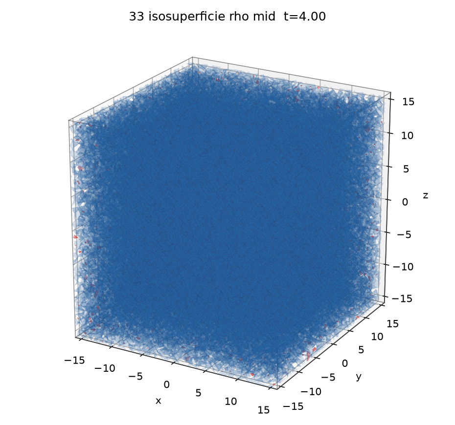

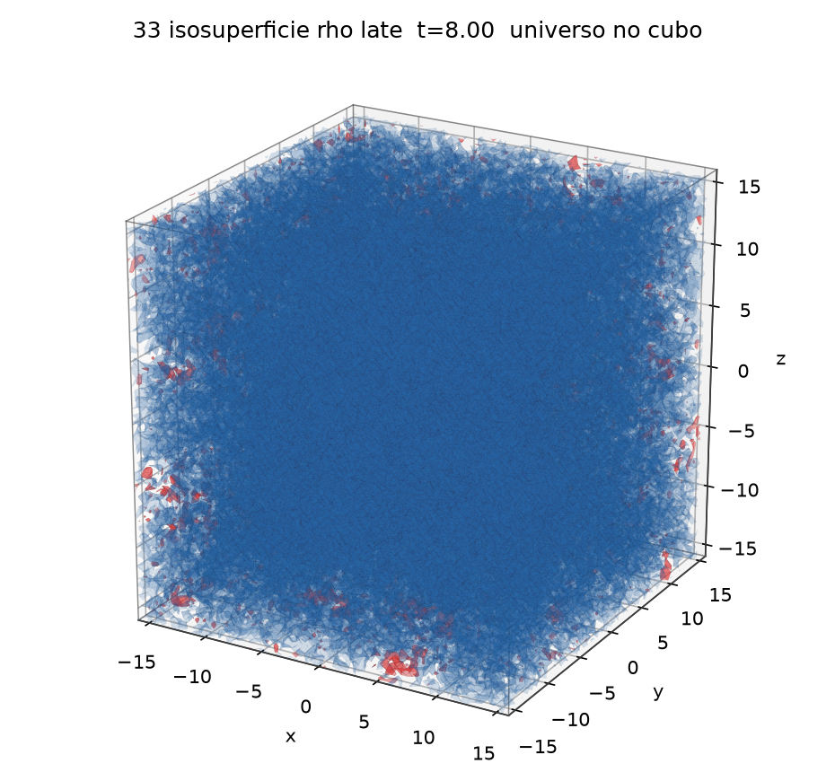

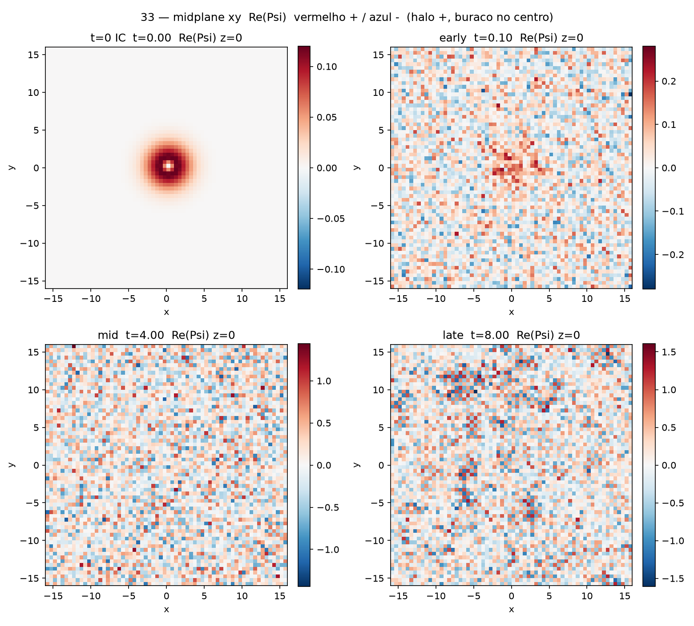

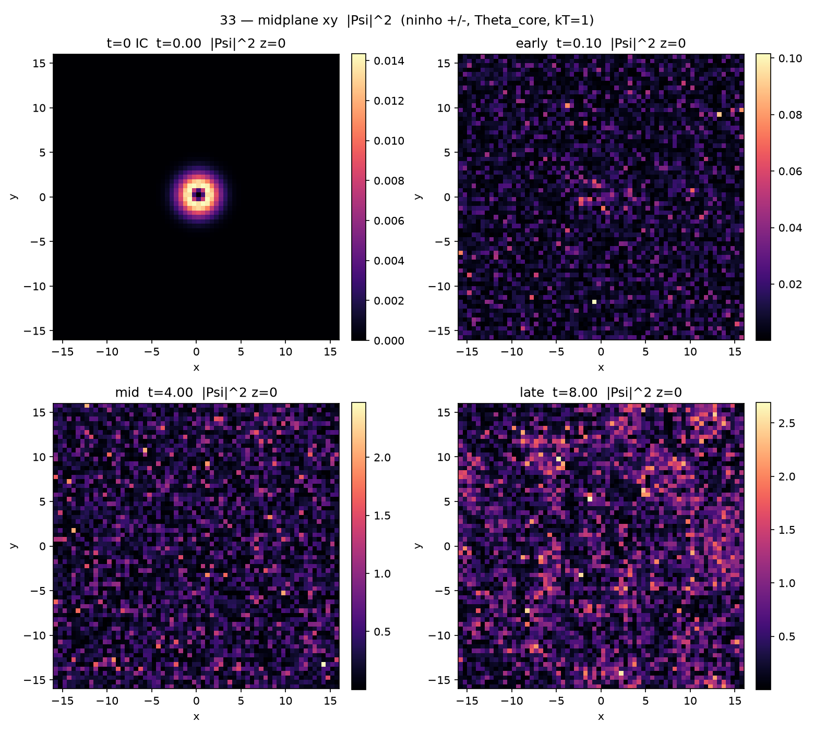

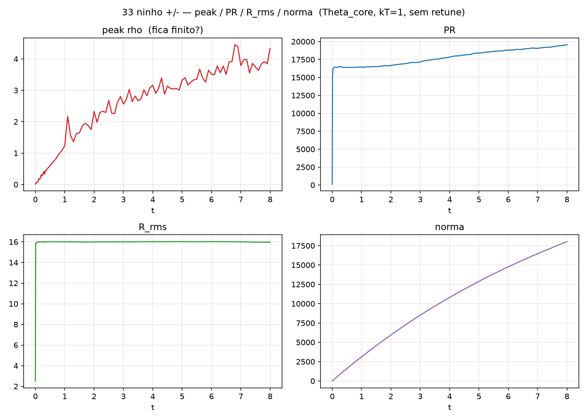

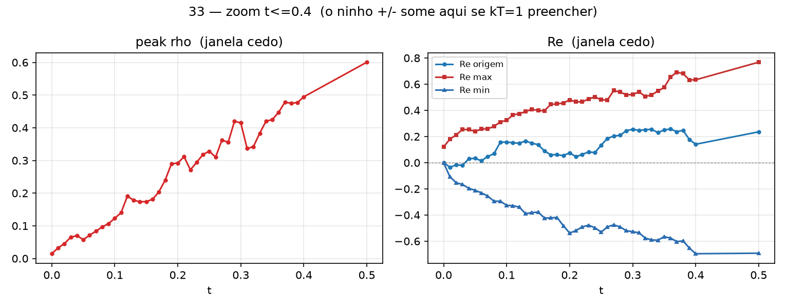

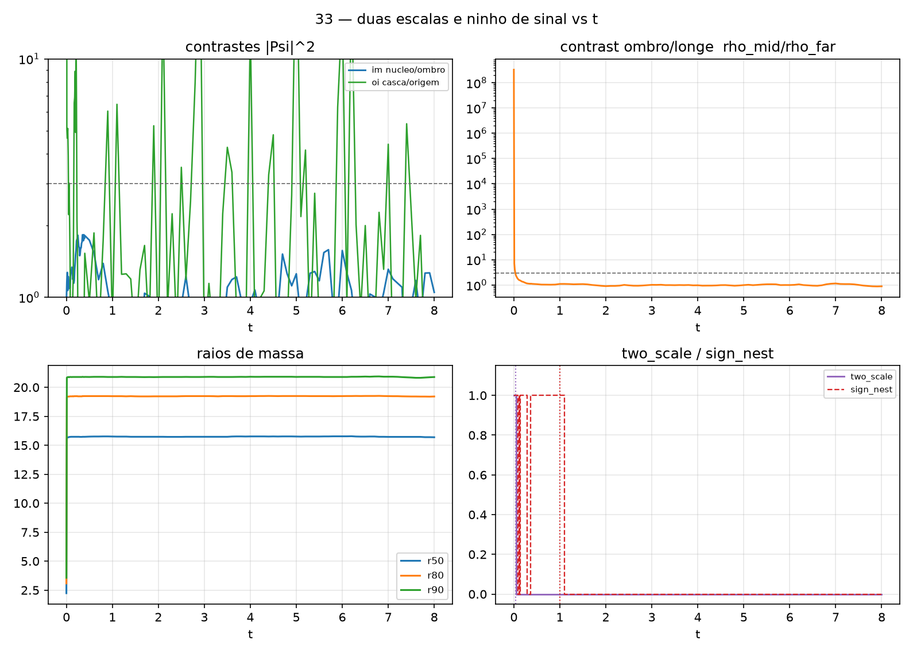

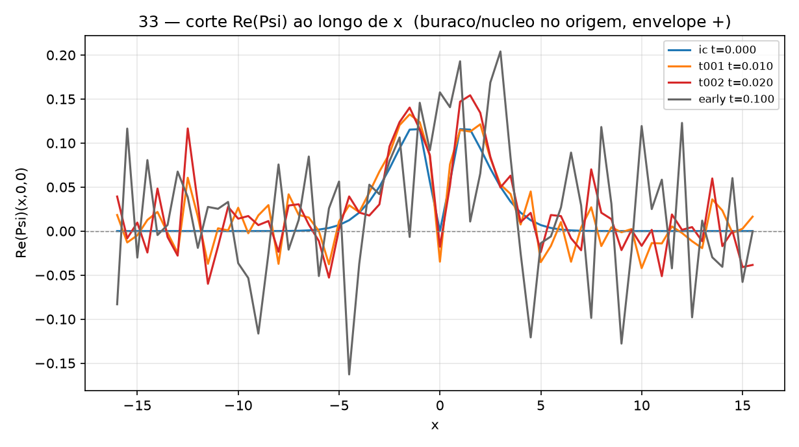

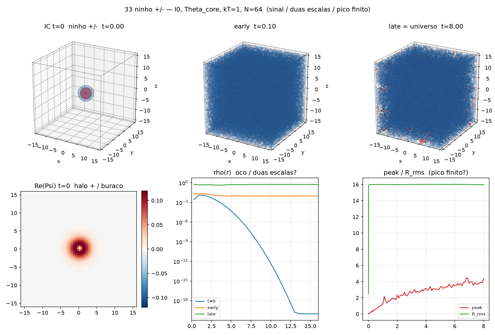

### O que os números sustentam

**(a) duas escalas / oco — INCONCLUSIVE.** two_scale (hollow) em $t\in\{0, 0.01, 0.02, 0.03, 0.04\}$. Em t=0 o perfil radial tem oco no origem e casca $s\sim0.5$–$2$ (é o ponto da IC +/−). Depois o banho come o oco: R_rms 2.52→15.77 já em t=0.01, flag morta em t=0.05. Não houve tempo para ler colapso/sobreposição. Não é evidência a favor nem contra: o oco não durou.

**(b) ninho de sinal +/− — INCONCLUSIVE como ímã; o flag operacional pisca até t=1.** sign_nest limpo (halo + / buraco no centro, plus_env) até t=0.08; primeiro off em t=0.09. O último fogo operacional é t=1.0, mas isso é flicker sobre universo preenchido, não o ninho concêntrico da IC. Com este banho o ninho vira universo em $t\ll 1$. Não é evidência a favor nem contra de ímã-repele: o ninho de sinal não durou como estrutura.

**(c) pico finito — SUPPORTED (neste run).** peak ρ máximo=4.452033, final=4.336503, sempre finito, sem blowup. Anti-colapso operacional: a singularidade **não** foi a infinito. Pico late ~3.91 em 1310 células, não artefato de 1–2 células.

Nunca “provou gravidade”. Nunca “provou ímã”. Theta_core intocado. kT=1.0 intocado.

### CSVs

- [Artefatos/triad_ninho_pm/summary.csv](../../source/Artefatos/triad_ninho_pm/summary.csv)
- [Artefatos/triad_ninho_pm/metrics.csv](../../source/Artefatos/triad_ninho_pm/metrics.csv)
- [Artefatos/triad_ninho_pm/radial_profiles.csv](../../source/Artefatos/triad_ninho_pm/radial_profiles.csv)
- [Artefatos/triad_ninho_pm/linecut_re.csv](../../source/Artefatos/triad_ninho_pm/linecut_re.csv)
- [Artefatos/triad_ninho_pm/summary.json](../../source/Artefatos/triad_ninho_pm/summary.json)

### Arquivos

`00_montagem.png` · `01_ic_isosurface.png` · `01e_ic_re_isosurface.png` · `01b`/`01c`/`01d` isos ρ · `01f`/`01g`/`01h` isos Re · `04_midplane_xy.png` + midplanes |Ψ|² e Re · `04r_midplane_re.png` · `05_observables.png` · `06_radial_profiles.png` · `06b_radial_linear.png` · `07_early_zoom.png` · `08_two_scale.png` · `09_linecut_re.png` · `09b_linecut_re_t0.png` · metrics.csv · radial_profiles.csv · linecut_re.csv · summary.csv · summary.json · `rho_{ic,t001,t002,early,mid,late}.npy` · `re_{ic,t001,t002,early,mid,late}.npy`

Script: [Fontes/run_ninho_pm.py](../../source/Fontes/run_ninho_pm.py)

→ [Índice de runs](%C3%8Dndice%20de%20runs.md) · `[[TRIAD]]` · [Leitura operacional](../Conceitos/Leitura%20operacional.md)

### Run 34 — 34 ninho_pm_long

*Fonte:* `Simulações/34 ninho_pm_long.md`

## ninho_pm_long

Mesma IC de [33 ninho_pm](33%20ninho_pm.md), **T=60** (não T=8). Equação TRIAD **completa**, Theta_core congelado (Q00 / [TRIAD_QM_CANONICAL_V1](../Fontes/TRIAD_QM_CANONICAL_V1.md)). **I0 / environment**, não scan. Pergunta: **depois que a caixa enche, acontece mais alguma coisa** (estrutura, rebirth de par, queda de pico, bounce, cristalinidade) **ou o cubo só senta como universo preenchido?** Volume preenchido = universo, não ruído. Sem isolar memória/FDT. Sem mudar Theta_core. Sem retocar kT. Não é prova de nada. [Leitura operacional](../Conceitos/Leitura%20operacional.md) · [Anti-colapso](../Conceitos/Anti-colapso.md) · [Universo como simulação](../Conceitos/Universo%20como%20simula%C3%A7%C3%A3o.md)

Solver: Strang 3D standalone (cópia de [Fontes/run_ninho_pm.py](../../source/Fontes/run_ninho_pm.py) com `--T`). fp64, numpy. $V_{\mathrm{ext}}=0$, $y_j(0)=0$, caixa periódica $[-L/2,L/2)^3$. Seed=0.

### IC — ninho +/− concêntrico (idêntica ao run 33)

$\Psi = G_{\mathrm{out}}(s=2.0)_{(0,0,0)}^{\mathrm{fase}\,0} - G_{\mathrm{in}}(s=0.5)_{(0,0,0)}^{\mathrm{fase}\,\pi\,(=\,\times-1)}$, amplitudes cruas iguais, depois $\int|\Psi|^2\,dV=1$. Pico IC=0.014580, PR=141.559784, R_rms=2.522489. two_scale=sim (hollow), sign_nest=sim (hole_core). Até t=8 os números batem com [33 ninho_pm](33%20ninho_pm.md) (mesmo seed, mesmo passo).


### Parâmetros (Theta_core, intocado)

$\Lambda=-10$, $\alpha=0.15$, $\sigma=1.5$, $\Gamma=0.05$, $\nu=(10, 0.5, 0.05)$, $\lambda=(3, 1, 0.3)$, `fdt_couple=True`, **kT=1.0**. $L=32$, $N=64$, $dt=0.0025$, **$T=60$**, seed=0. $f_{\mathrm{FDT}}=0.0125$, noise_amp $=0.015811388300841896$. Memória Euler ($\max\nu\cdot dt=0.025$). Amostras: $\Delta t=0.01$ até $t=0.2$; $\Delta t=0.1$ até $t=1$; $\Delta t=0.2$ depois.

Não substitui [33 ninho_pm](33%20ninho_pm.md) · [32 universo_atomo](32%20universo_atomo.md) · [31 nested_gaussians](31%20nested_gaussians.md) · [30 dois_atomos_gravidade](30%20dois_atomos_gravidade.md).

### Resultado

Wall: **352.929 s** (~5 min 53 s de integração; 13:22:44–13:28:37 BRT, 21/08/2026; elapsed relógio 408 s com figuras). 24000 passos, 324 amostras. Sem NaN, sem blowup.

| | t=0 IC | t=0.05 | t=1 | t=8 (old late) | t=10.4 (peak_max) | t=30 | t=60 |
|---|---|---|---|---|---|---|---|
| two_scale | sim | não | não | não | não | não | não |
| sign_nest | sim | sim | sim (flicker) | não | não | não | não |
| norm | 1.000000 | 164.174 | 3122.825 | 18021.708 | 21218.437 | 31161.943 | 32692.307 |
| peak | 0.014580 | 0.057509 | 1.236586 | 4.336503 | 4.851441 | 3.296211 | 3.372458 |
| PR | 141.560 | 16357.118 | 16439.666 | 19557.412 | 22025.745 | 27930.540 | 28301.592 |
| R_rms | 2.522489 | 15.948986 | 16.005861 | 15.972489 | 15.888109 | 16.009073 | 16.008873 |
| k* | 0.2945 | 0.2945 | 0.2945 | 10.701 | 10.701 | 10.897 | 10.897 |
| Vmem_peak | 0 | 0.059 | 2.369 | 7.063 | 6.844 | 6.154 | 6.343 |
| crystallinity | 0.9309 | 0.9996 | 1.0000 | 1.0000 | 1.0000 | 1.0000 | 1.0000 |

Pico de densidade máximo=**4.851441** em t=10.4. Vmem_peak máximo=8.029760 em t=10.0. células½ final=13494 (caixa cheia, não 1–2 células). t=8 bate o final do run 33 (peak 4.336503, PR 19557.412, norm 18021.708).

#### Late (t≥48) vs mid/old-late (t=8–12)

| | mid t=8–12 (n=21) | late t≥48 (n=61) | late/mid |
|---|---|---|---|
| peak | 3.905658 ± 0.373822 | 3.313377 ± 0.155390 | 0.848 |
| PR | 21616.833 ± 1293.569 | 28287.696 ± 19.255 | 1.309 |
| R_rms | 16.019862 ± 0.085908 | 16.003990 ± 0.003353 | ~1 |
| norm | 20643.162 ± 1495.061 | 32590.796 ± 71.671 | 1.579 |
| k* | 10.775850 ± 0.095351 | 10.897400 ± 0 | ~1.01 |
| Vmem_peak | 6.842501 ± 0.486759 | 6.339797 ± 0.216610 | 0.927 |
| crystallinity | 0.99999476 ± 1.64e-6 | 0.99999675 ± 1.07e-6 | Δ = +2.0e-6 |

Late é mais *parado* que mid: PR e R_rms com std minúsculo; norm quase plana (std/mean ~0.2%). Mid ainda estava subindo (banho enchendo).

### Depois de t=1 — o que acontece, o que não

A caixa **já é universo preenchido em t=0.01** (R_rms 2.52→15.77), igual ao run 33. two_scale morre em t=0.05; sign_nest operacional cai em t=0.09 e **pisca pela última vez em t=1.0**. Depois:

- **Estrutura / ninho / par: não volta.** two_rebirth=não (0 recordes two_scale após t=1). sign_rebirth=não (último sign_nest = t=1.0). Contrastes im/mf/oi ficam ~1. Não há rebirth de par +/−.
- **Colapso após o preenchimento: não.** R_rms fica trancado em $\approx L/2=16$. Peak não dispara; células½ final=13494.
- **Cristalinidade: não muda.** Já ~1 desde t~0.05; late−mid = $+2\times10^{-6}$.
- **k*: salta** de 0.29 (escala do ninho) para ~10.7 em t=8 e **trava** em 10.897 no late.
- **Peak: sobe até t=10.4 (4.851) e depois assenta ~3.3.** Não há segundo colapso. Os “máximos” depois de t=10.4 (4.17, 3.56, 3.49, … 3.72) são **oscilação de caixa cheia**, amplitude ~0.3–0.5 em torno do platô, não uma estrutura nova.
- **“Bounce” automático=sim, mas não é bounce.** O detector viu queda 4.85→~2.9 depois do máximo global e uma subida residual 0.44 até t=60. Isso é relaxação + ruído de banho num cubo preenchido, não um bounce de raios de massa (R_rms não cai e não volta).
- **Norma e PR continuam crescendo até ~t=48 e então sentam.** norm 3123 (t=1) → 18022 (t=8) → 31162 (t=30) → 32470 (t=48) → 32692 (t=60). O banho FDT ainda injeta massa depois do “universo visual”; no último 20% isso **saturá**.

**De t=1 a t=60 o cubo é um universo preenchido.** Não reaparece ninho, não reaparece par, não cristaliza de outro jeito, não explode, não colapsa. O que ainda mexe é o banho: norma/PR sobem e saturam, peak relaxa de ~4.9 para um platô ~3.3 com wiggle. **Se a pergunta é “acontece mais alguma coisa estrutural depois que a caixa enche?” — não. Senta como universo preenchido.** Isso é o resultado. kT não foi retocado.

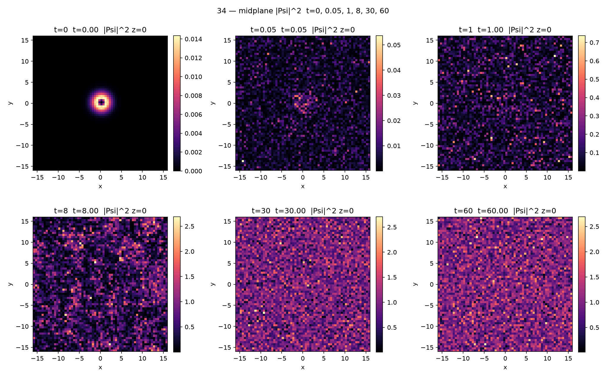


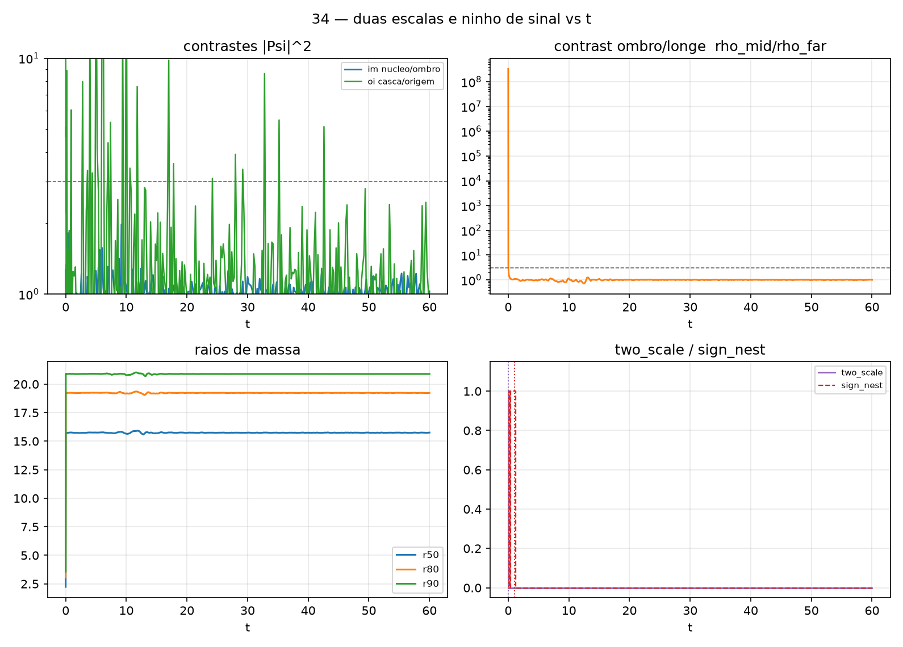

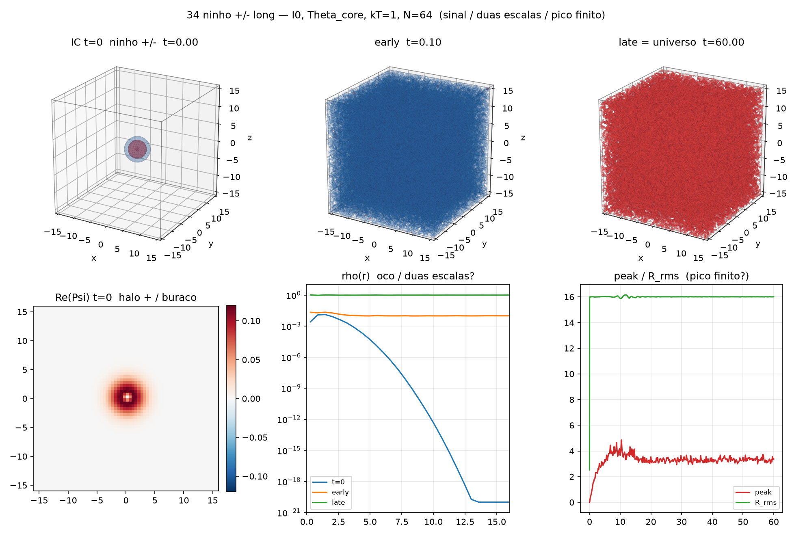

### O que os números sustentam

**(a) duas escalas / oco — INCONCLUSIVE (igual 33).** two_scale só até t=0.04. Não volta em T=60.

**(b) ninho de sinal +/− — INCONCLUSIVE como ímã; morto depois de t=1.** Flicker operacional até t=1.0 sobre cubo já preenchido. **Nenhum rebirth em t∈(1, 60].** Não é evidência a favor nem contra de ímã-repele: o ninho não durou, e não nasceu de novo.

**(c) pico finito — SUPPORTED (neste run).** peak_max=4.851441, sempre finito até T=60. Anti-colapso operacional: a singularidade **não** foi a infinito. Late ~3.31 em 13494 células, não artefato de 1–2 células.

**(d) “acontece mais alguma coisa depois de encher?” — neste run, não (estrutura).** Universo preenchido de t=0.01 até t=60. Deriva lenta de norma/PR até saturar ~t=48; peak relaxa depois de t=10.4. Sem segundo colapso, sem bounce de raios, sem rebirth, sem mudança de cristalinidade.

Nunca “provou gravidade”. Nunca “provou ímã”. Nunca “provou bounce”. Theta_core intocado. kT=1.0 intocado.

### CSVs

- [Artefatos/triad_ninho_pm_long/summary.csv](../../source/Artefatos/triad_ninho_pm_long/summary.csv)
- [Artefatos/triad_ninho_pm_long/metrics.csv](../../source/Artefatos/triad_ninho_pm_long/metrics.csv)
- [Artefatos/triad_ninho_pm_long/radial_profiles.csv](../../source/Artefatos/triad_ninho_pm_long/radial_profiles.csv)
- [Artefatos/triad_ninho_pm_long/linecut_re.csv](../../source/Artefatos/triad_ninho_pm_long/linecut_re.csv)
- [Artefatos/triad_ninho_pm_long/summary.json](../../source/Artefatos/triad_ninho_pm_long/summary.json)

### Arquivos

`00_montagem.png` · `01_ic_isosurface.png` · `01e_ic_re_isosurface.png` · isos ρ `01b`/`01c`/`01d`/`01i` t=0.05 / `01j` t=1 / `01k` t=8 / `01l` t=30 / `03` t=60 · isos Re `01f`/`01g`/`01h`/`01m`–`01p` · `04x_midplane_watch.png` + `04y_midplane_re_watch.png` (t=0, 0.05, 1, 8, 30, 60) · midplanes |Ψ|² e Re · `05_observables.png` · `05b_after_fill.png` · `06_radial_profiles.png` · `07_early_zoom.png` · `08_two_scale.png` · metrics.csv · summary.json · `rho_{ic,t001,t002,early,mid,late}.npy` · `re_{ic,t001,t002,early,mid,late}.npy`

Script: [Fontes/run_ninho_pm_long.py](../../source/Fontes/run_ninho_pm_long.py) (`--T` default 60)

→ [Índice de runs](%C3%8Dndice%20de%20runs.md) · `[[TRIAD]]` · [Leitura operacional](../Conceitos/Leitura%20operacional.md)

### Run 35 — 35 singularidade_finita

*Fonte:* `Simulações/35 singularidade_finita.md`

## singularidade_finita

Equação TRIAD **completa**, Theta_core congelado (Q00 / [TRIAD_QM_CANONICAL_V1](../Fontes/TRIAD_QM_CANONICAL_V1.md)). **I0 / environment**, não scan, **não** Q05, **não** teste de MQ. 1 gaussiana = 1 [átomo](../Conceitos/%C3%A1tomo.md). Volume preenchido = universo. Leitura: **singularidade = pico finito** (o ponto brilhante). Anti-colapso: Λ puxa, memória empurra, peak nunca Inf. Pergunta deste run: **enquanto o pico é finito, ele aperta (menos células, peak sobe), espalha (mais células), ou some no universo?** [Leitura operacional](../Conceitos/Leitura%20operacional.md) · [Anti-colapso](../Conceitos/Anti-colapso.md) · [átomo](../Conceitos/%C3%A1tomo.md)

Solver: Strang 3D standalone, **mesmo passo** de Q02 (`ef65da9774ff65ac9b781595944f59bc1892f04665370a2de190ad22f94ba365`). Backend **mlx** complex64, device `Device(gpu, 0)`. $V_{\mathrm{ext}}=0$, $y_j(0)=0$, caixa periódica $[-L/2,L/2)^3$. Seed=0 (única; sem cherry-pick).

### IC — dois casos (seed=0)

- **1atom**: uma gaussiana $s=0.5$ na origem, $\int|\Psi|^2=1$ (IC Q00 / um ponto). t=0: peak=1.43625, n_células=1, PR=1.88731, R_rms=0.611747. artifact_1_2_cells=sim.
- **2atom**: duas gaussianas $s=0.5$ em $x=\pm 3$ (cada uma como Q04), depois $S=(A+B)/\|A+B\|$, $\int|S|^2=1$ (dois pontos, sep=6). t=0: peak=0.718126, n_células=2, PR=3.77461, R_rms=3.06174, n_det=2, pair_sep=6.

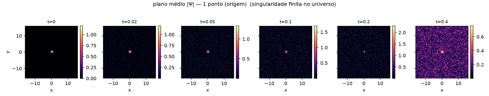

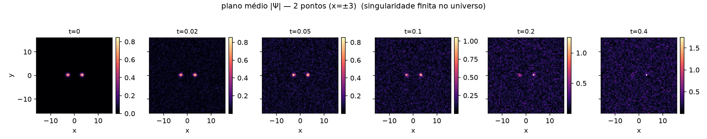

### Parâmetros (Theta_core, intocado)

$\Lambda=-10$, $\alpha=0.15$, $\sigma=1.5$, $\Gamma=0.05$, $\nu=(10, 0.5, 0.05)$, $\lambda=(3, 1, 0.3)$, `fdt_couple=True`, **kT=1.0**. $L=32$, $N=64$, $dt=0.0025$, **$T=1.0$** (janela cedo). seed=0. $f_{\mathrm{FDT}}=0.0125$, noise_amp $=0.015811388300841896$. Memória Euler ($\max\nu\cdot dt=0.025$). Registro a cada 2 passos ($\Delta t=0.005$).

Não substitui [30 dois_atomos_gravidade](30%20dois_atomos_gravidade.md) · [31 nested_gaussians](31%20nested_gaussians.md) · [32 universo_atomo](32%20universo_atomo.md) · [33 ninho_pm](33%20ninho_pm.md) · [34 ninho_pm_long](34%20ninho_pm_long.md) · Q00–Q04.

### Resultado

Wall total: **4.959 s** (2026-08-21 14:43:45 BRT – 2026-08-21 14:43:50 BRT, 21/08/2026). Backend mlx `Device(gpu, 0)`. 400 passos × 2 ICs, 201 registros/IC. Sem NaN, sem blowup. Ambos ICs finitos.

#### 1atom — um ponto

- peak_max = **5.3739** em t_at_peak_max = **0.185**
- n_células (½ peak): t=0 → **1**; t_peak → **1** (Δn_células = 0)
- Δpeak (t=0 → t_peak) = 3.93765
- t_point_gone (n_células>200 **ou** R_rms>14.4) = **0.005** (disparado por R_rms; n_células>200 só em t=0.405)
- aperta em $t\in[0,t_{\mathrm{point\_gone}}]$? **não** (em t=0.005 peak 1.436→1.406, n_células=1→1)
- finite_singularity: **SUPPORTED** (peak_max finito, sem NaN, peak_max > peak(t=0)). Nunca SUPPORTED para MQ.
- artifact_1_2_cells: sim em t=0 e em t_peak (IC s=0.5 já cabe em 1 célula de dx=0.5).

#### 2atom — dois pontos

- peak_max = **4.76867** em t_at_peak_max = **0.705**
- n_células (½ peak): t=0 → **2**; t_peak → **1** (Δn_células = -1)
- Δpeak (t=0 → t_peak) = 4.05055
- t_point_gone = **0.005** (R_rms; n_células>200 só em t=0.965)
- aperta em $t\in[0,t_{\mathrm{point\_gone}}]$? **não** (em t=0.005 peak 0.718→0.731, n_células=2→2)
- finite_singularity: **SUPPORTED**. Nunca SUPPORTED para MQ.
- n_det t=0 = 2; pair_sep t=0 = 6; n_det=2 em 62 registros. pair_sep=6.000 até t=0.200; depois o detector oscila (sep omitido quando n_det≠2).

| IC | t | peak | n_células | largura | PR | R_rms | finite |
|---|---|---|---|---|---|---|---|
| 1atom | 0 | 1.43625 | 1 | 0.310175 | 1.88731 | 0.611747 | sim |
| 1atom | 0.005 | 1.40631 | 1 | 0.310175 | 564.086 | 15.5271 | sim |
| 1atom | 0.02 | 1.43434 | 1 | 0.310175 | 5426.05 | 15.8712 | sim |
| 1atom | 0.05 | 1.77444 | 1 | 0.310175 | 11680.2 | 15.9463 | sim |
| 1atom | 0.1 | 2.8926 | 1 | 0.310175 | 13867 | 15.983 | sim |
| 1atom | 0.185 | 5.3739 | 1 | 0.310175 | 14140.1 | 15.9983 | sim |
| 1atom | 0.2 | 5.23208 | 1 | 0.310175 | 14532.4 | 15.9967 | sim |
| 1atom | 0.4 | 0.571455 | 182 | 1.75778 | 16379.5 | 16.0014 | sim |
| 1atom | 0.705 | 0.836735 | 560 | 2.55664 | 16412.3 | 16.0038 | sim |
| 1atom | 1 | 1.23637 | 380 | 2.24665 | 16441.4 | 16.0058 | sim |
| 2atom | 0 | 0.718126 | 2 | 0.390796 | 3.77461 | 3.06174 | sim |
| 2atom | 0.005 | 0.731393 | 2 | 0.390796 | 1035.46 | 15.5315 | sim |
| 2atom | 0.02 | 0.730077 | 2 | 0.390796 | 8296.75 | 15.878 | sim |
| 2atom | 0.05 | 0.729707 | 3 | 0.44735 | 14179 | 15.9491 | sim |
| 2atom | 0.1 | 1.10198 | 2 | 0.390796 | 15615.6 | 15.9842 | sim |
| 2atom | 0.185 | 1.5776 | 1 | 0.310175 | 16128.6 | 15.9991 | sim |
| 2atom | 0.2 | 1.57367 | 1 | 0.310175 | 16176.4 | 15.9966 | sim |
| 2atom | 0.4 | 3.03161 | 1 | 0.310175 | 16213.9 | 16.0004 | sim |
| 2atom | 0.705 | 4.76867 | 1 | 0.310175 | 16267 | 16.0031 | sim |
| 2atom | 1 | 1.23635 | 381 | 2.24862 | 16438.2 | 16.0054 | sim |

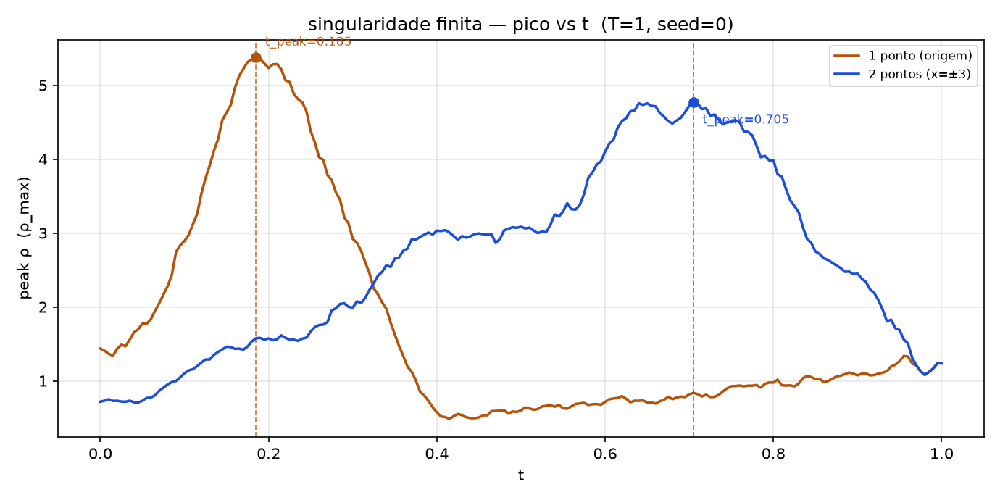

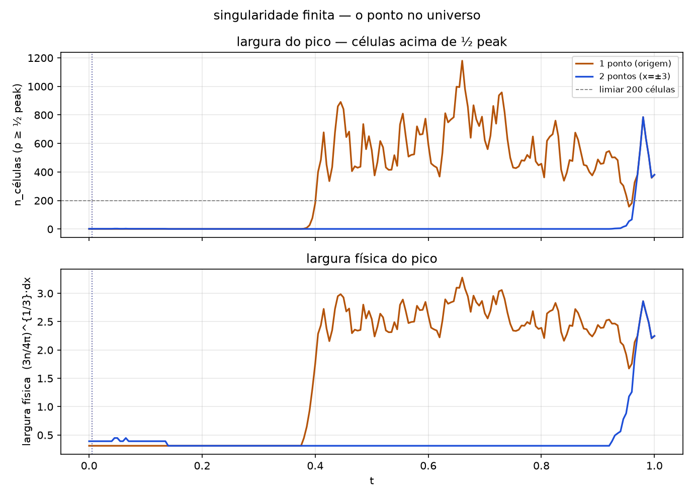

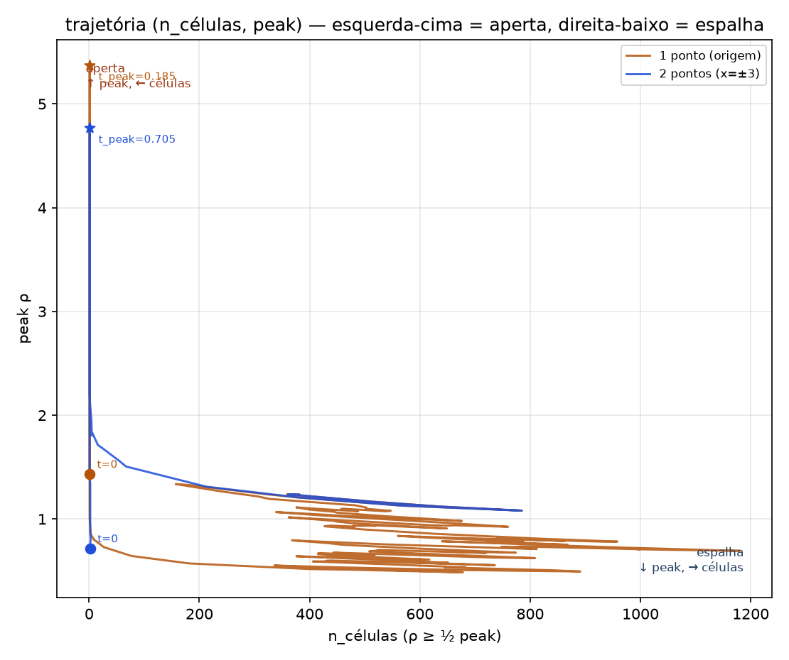


### O que os números sustentam

**1atom.** t_point_gone=0.005: R_rms 0.612→15.53 no primeiro registro. Na janela do ponto, peak cai um pouco (1.436→1.406) e n_células fica 1 — **não aperta**. Depois o universo já está preenchido; o peak sobe até 5.374 em t=0.185 ainda em 1 célula (artifact_1_2_cells), depois n_células cresce (182 em t=0.40; 380 em t=1). finite_singularity SUPPORTED neste run: peak_max finito, sem NaN, maior que t=0.

**2atom.** Mesmo t_point_gone=0.005 (R_rms 3.062→15.53). Na janela do ponto, peak 0.718→0.731 e n_células=2 — **não aperta**. n_det=2 e pair_sep=6.000 até t=0.200. peak_max=4.769 em t=0.705 com n_células=1 (já depois de t_point_gone). Em t=1 n_células=381. finite_singularity SUPPORTED neste run.

Resposta operacional: **o ponto some no universo** (R_rms>14.4 em t=0.005). Não aperta na janela declarada. O pico que sobe depois é 1 célula no universo preenchido, finito (nunca Inf). Singularidade = pico finito. **Não** é estrela nem planeta. Nunca SUPPORTED para MQ. kT=1 intocado. Theta_core intocado.

### CSVs

- [Artefatos/triad_singularidade_35/metrics_1atom.csv](../../source/Artefatos/triad_singularidade_35/metrics_1atom.csv)
- [Artefatos/triad_singularidade_35/metrics_2atom.csv](../../source/Artefatos/triad_singularidade_35/metrics_2atom.csv)
- [Artefatos/triad_singularidade_35/summary.json](../../source/Artefatos/triad_singularidade_35/summary.json)

### Arquivos

`peak_vs_t.png` · `width_vs_t.png` · `peak_vs_width.png` · `strip_1atom.png` · `strip_2atom.png` · `iso_1atom_t0_tpeak.png` · metrics_1atom.csv · metrics_2atom.csv · summary.json · SHA256SUMS.txt

Script: [Fontes/run_singularidade_35.py](../../source/Fontes/run_singularidade_35.py) (sha256 `923ecb0f1c4baf1db7ba2978e3977d3f7050f06c28bf387ddace88ab5c9caff7`)

→ [Índice de runs](%C3%8Dndice%20de%20runs.md) · `[[TRIAD]]` · [Leitura operacional](../Conceitos/Leitura%20operacional.md) · [Anti-colapso](../Conceitos/Anti-colapso.md) · [átomo](../Conceitos/%C3%A1tomo.md)


### Run 36 — 36 reexecucao_integral

*Fonte:* `Simulações/36 reexecucao_integral.md`

## TRIAD — Reexecução integral (21 ago 2026)


Figuras da campanha (Linux/NumPy fp64):

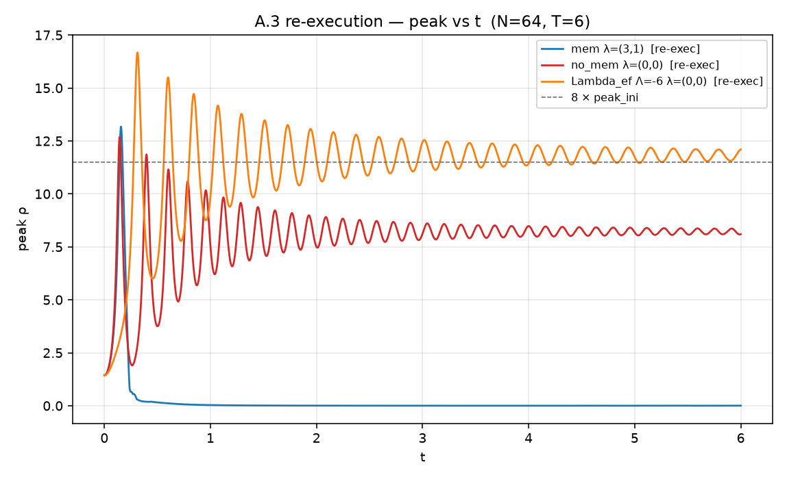

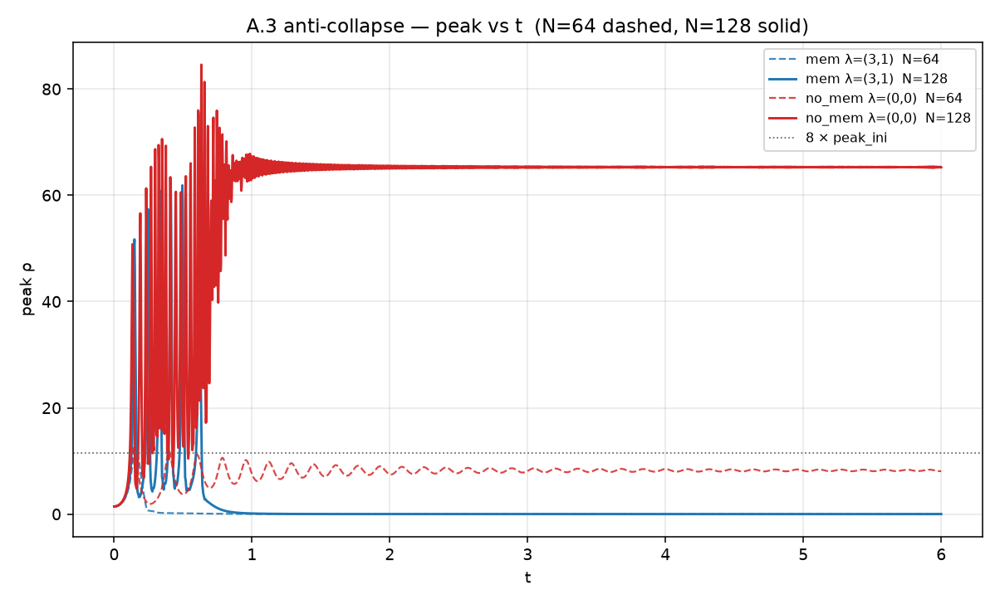

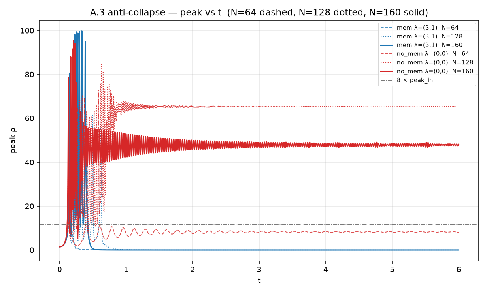

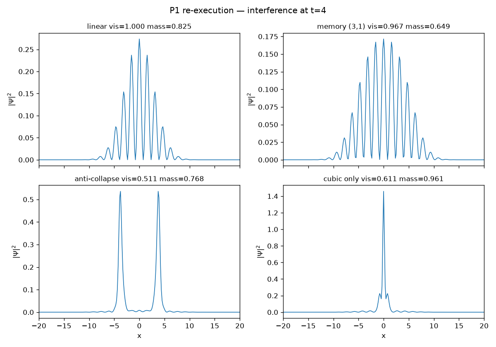

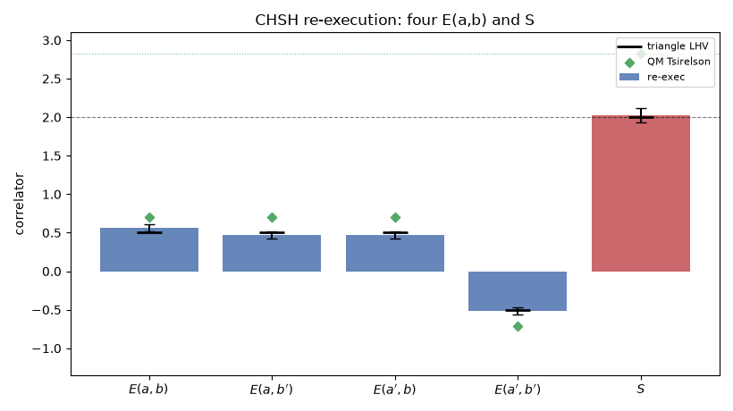

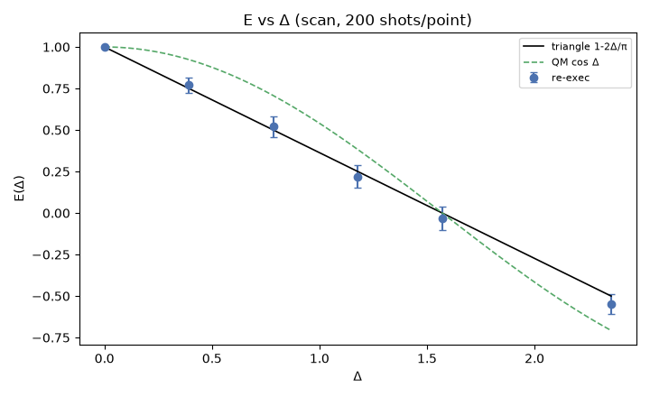

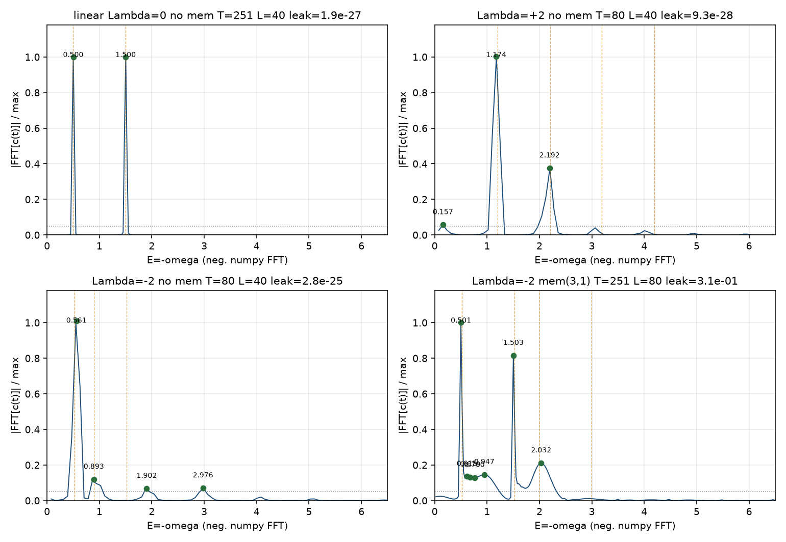

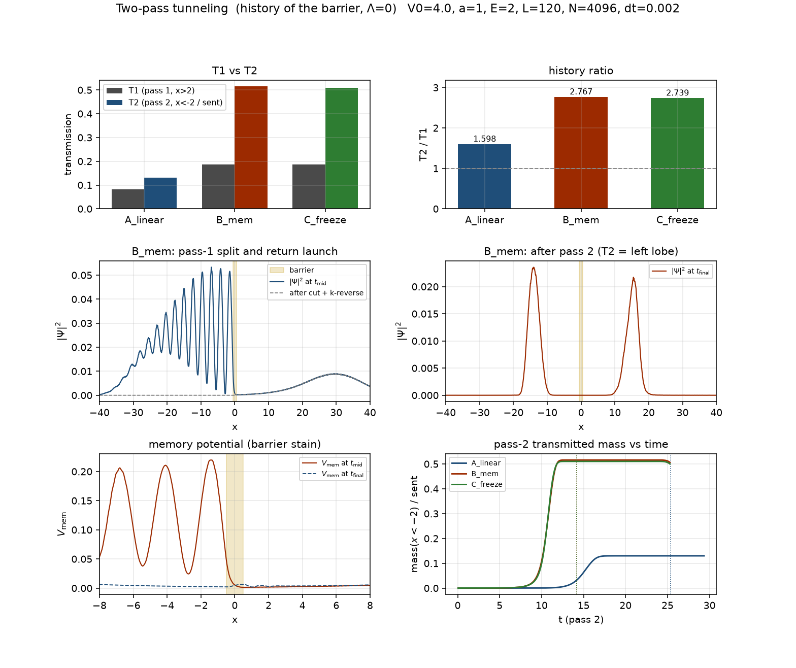

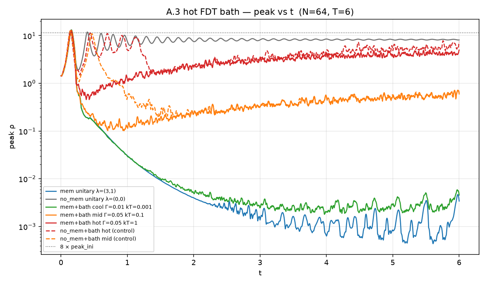

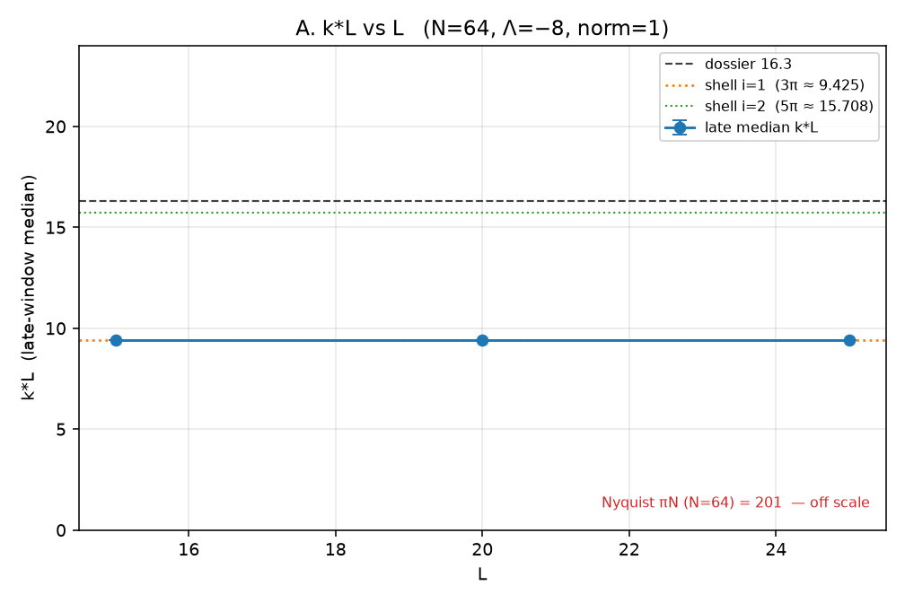

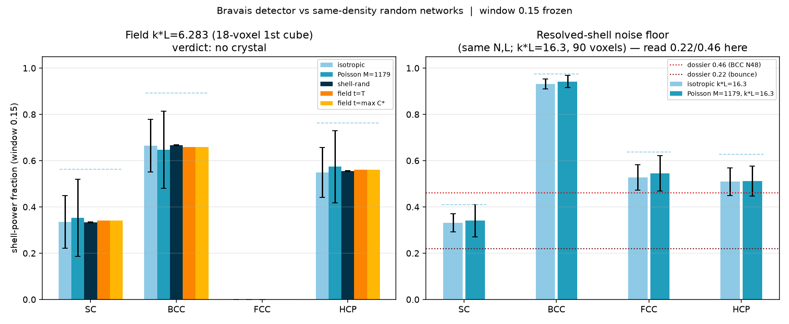


Compilação autónoma a partir dos `result.json` gravados nesta box em 21 ago 2026.
Números são os floats literais do JSON (formato `.16g` após `json.load`).
Falhas e parciais foram **mantidas**. λ **não** foi retocado. Previsões escritas **antes** das integrações.
Isto **não** é uma mudança da leitura operacional full-triad de Leonardo.

### 0 ambiente + PDE

#### Ambiente da box

| item | valor |
| --- | --- |
| data local | sexta-feira 21 ago 2026, America/Sao_Paulo (UTC-3) |
| SO / runtime | Linux box partilhada; `/usr/bin/python3` + NumPy 2.2.4; fp64 (`complex128` / `float64`) |
| mlx / triad-lang | não usados |
| numpy A.3 / QM1D / CHSH / hotbath / kstar / bravais | 2.2.4 |
| stepper 3D (A.3, hotbath, kstar, bravais) | 7bbc95b990ffa85175826aaa4f054db0a5e233471b63cdb91251308dc9156713 |
| stepper 1D (QM1D, sidebands, tunnel) | 5bddad844ac9a3ae5f393b4f01786e965c5a983beab616034927e078e94d0076 |
| A.3 N=64 | N=64, L=20, dt=0.0025, T=6, n_steps=2400, wall_s=180.0158611449988 |
| A.3 N=128 | N=128, dx=0.15625, wall_s=1910.743829617, skipped=['Lambda_ef'] |
| A.3 N=160 | N=160, dx=0.125, wall_s=4001.041219289, skipped=['Lambda_ef'] |
| QM1D | ħ=m=1, fp64=True, t_meas_P1P2=4 |
| CHSH | N=256, L=40, dt=0.002, n_chsh=1400, wall_s=406.3778816360027 |
| sidebands | N=1024, dt=0.01, ic=hermite_(phi0+phi1)/sqrt(2), noise_frac=0.05 |
| tunnel_hist | L=120, N=4096, dt=0.002, V0=4, E=2 |
| hotbath | N=64, L=20, dt=0.0025, T=6, seed=42, wall_s=464.3421608870012 |
| kstar | T=8, dt=0.0025, n_unique_runs=8, wall_s=175.1730860669995 |
| bravais | N=64, L=20, T=8, window=0.15, field_wall_s=100.2937581940023 |

#### PDE / protocolo de integração

Equação efetiva 3D (A.3 / hotbath / kstar / campo bravais), stepper Strang autónomo:

- cinética Fourier, potencial multiplicativo real, passo de memória Euler em y;
- cúbico focado Λ|Ψ|² (Λ típico −10 em A.3; −8 no ponto R5 de kstar/bravais);
- memória atrasada V_mem = λ₀ y₀ + λ₁ y₁, λ=(3,1) em A.3 / CHSH / hotbath, λ=(1.125, 0.375) no R5;
- ν=(10, 0.5) ⇒ τ_fast=0.1; Γ=0 e f_FDT=0 salvo hotbath / P2;
- ħ = m = 1, fp64, sem retune.

1D (QM1D P1–P6, sidebands, tunnel_hist, CHSH par): mesmo núcleo Strang 1D.

Diagnóstico de colapso A.3: primeiro t com peak ≥ 8 × peak_ini.
- N=64 limiar = 11.49357581527675
- N=128 limiar = 11.49357581601066
- N=160 limiar = 11.49357581601066
- hotbath limiar = 11.49357581527675

IC gaussiana 3D s=0.5: peak analítico 1/(π s²)^{3/2}.
- A.3 N=64 peak_ini = 1.436696976909594 vs analítico 1.436696977001332
- A.3 N=128 peak_ini = 1.436696977001333 vs analítico 1.436696977001332
- A.3 N=160 peak_ini = 1.436696977001332 vs analítico 1.436696977001332

FDT (hotbath): `f_FDT = 2 Γ dx³ kT / ħ`, `noise_amp = sqrt(f_FDT·dt/dx³)`, ξ=(N+iN)/√2.
Lock gravado: `f_FDT=2*Gamma*dx^3*kT/hbar ; noise_amp=sqrt(f_FDT*dt/dx^3) ; xi=(N+iN)/sqrt(2)`

CHSH: acoplamento de par κ, fase comum e^{iφ} nos dois pacotes, medição sign Re(e^{-iθ} ⟨env|ψ⟩), sem pós-seleção.

### 1 placar

Vereditos de uma linha extraídos de cada `analysis.md` + campo `verdict(s)` do JSON.

| bloco | veredito JSON | uma linha do analysis.md |
| --- | --- | --- |
| A.3 N=64 | IC MATCH; end-state mem MATCH; 8× mem FAIL; no_mem MATCH; Λ_ef MATCH; norma MATCH | ## Protocol / ## Verdicts vs predictions and vs dossier / ### IC — MATCH / **Vs prediction (end-state by T=6): MATCH.** mem peak_end = 3.43e-3 (order 1e-3), PR_end = 2657 (thousands); packet fills the box (R_rms 0.61 → 9.61). no_mem peak_end = 8.10 > 5, PR_end = 0.499 < 1. |
| A.3 N=128 | H_plateau MATCH; H_ramp FAIL; pulso 8× PARTIAL; no_mem MATCH | ## Protocol / ## Verdicts vs predictions (MATCH / PARTIAL / FAIL) / ### IC — MATCH / ### 1. no_mem blow-up grows or stays collapsed — MATCH |
| A.3 N=160 | IC=MATCH; no_mem_sharper_than_128=PARTIAL; mem_H_plateau_vs_H_ramp=MATCH_H_plateau; H_ramp=FAIL; pulse_train_vs_128=MATCH; hypothesis_that_lives=H_plateau; norm=MATCH | ## Protocol / ## Verdicts vs predictions / ### IC — MATCH / ### 1. no_mem sharper than N=128 — PARTIAL |
| QM1D P1–P6 | P1=PARTIAL; P2=MATCH; P3=MATCH; P4=PARTIAL; P5=MATCH; P6=MATCH | **Label:** re-execution. Predictions written first (`/workspace/dossie_reexec/predictions_QM1D.md`). No retuning. Failures kept. / ## P1 Interference — PARTIAL / - Prediction “vis ≳ 0.9 in all deterministic regimes”: **held for linear and memory; failed for anti-collapse and cubic**. Kept. / - Memory changes the envelope, does not erase the fringe: mass 0.825 → 0.649 (dossier 0.700 → 0.557). Pattern match. |
| CHSH | MATCH — S saturates the local bound within error; E near triangular CHSH point | ## Verdict — MATCH / ## Surprises / kept failures |
| sidebands | INCONCLUSIVE | **Label:** re-execution. Predictions written first (`/workspace/dossie_reexec/predictions_sidebands.md`, SHA `d5f5cffbdb5e8320ecb457db07cc860aaef0bce40a798ba1b59f585a3b2f0c47`). No retuning. Failures kept. / **Runner SHA256 (run_sidebands.py, verdict/plot):** `84391c14f8d6d35adeef4fdbf0408e13ef7679f229412d725d99325f7e495661` / ## Verdict: **INCONCLUSIVE** / INCONCLUSIVE = leak, linear-control failure, H_ef (matches Lambda=+2), or extra lines not at the claimed loci. |
| tunnel_hist | protocol-dirty | **Label:** re-execution. Predictions written first (`/workspace/dossie_reexec/predictions_tunnel_hist.md`). No retuning of λ, ν, V0. Failures kept. / A is the protocol test. T2/T1 = **1.598**, not ≈1. / Prediction said: if |T2/T1−1| is large, the protocol is dirty and B is unreadable as a barrier-scar test. That is what happened. Not retuned (no narrower s, no higher E, no different V0). / ## Verdict |
| hotbath | PARTIAL | ## Protocol / ## Verdicts vs predictions / ### (a) peak stays finite with mem+bath — **MATCH** / This is "universe" (late field fills), not failure. An early 8× crossing is the known A.3 delay autofocus; it is not a fail of (a). |
| kstar | H_grid | **Label:** re-execution. Predictions written first (`/workspace/dossie_reexec/predictions_kstar.md`, SHA `7711f5679cb616a959e3a6cf2b855c6c6303c471c58292cc0fe0f7e822e112b1`). No retuning toward 16.3. Failures kept. / ## Verdict: **H_grid** / - H_invar if A,B,C stay near 16.3 (not a mesh identity), D ≠ πN, and a finite-k peak exists. **Fail** (mesh identity 3π; no peak). / - H_mobile if A or B or C moves k*L by ≳ one shell and D is not Nyquist. **Fail** (Δ(k*L)=0). |
| bravais | no crystal | ## Verdict / **no crystal.** / Prediction match: “R5 unitary at N=64 may or may not crystallize; if / for the verdict. |

#### Placar compacto (falhas mantidas)

| item | estado |
| --- | --- |
| A.3 memória impede colapso *duradouro* | MATCH no estado final T=6 (PR milhares); FAIL no diagnóstico 8× (pulso precoce) |
| A.3 no_mem colapsa | MATCH; blow-up mais agudo em N=128; N=160 PARTIAL vs N=128 (peak_end 48.25 < 65.26) |
| A.3 não reduz a Λ_ef | MATCH (N=64); N=128/160 saltaram Λ_ef |
| resolução mem H_plateau | MATCH em N=128 e N=160; H_ramp FAIL |
| P1 interferência vis≳0.9 sob foco | PARTIAL / FAIL em anti-collapse e cubic |
| P2 decoerência padrão | MATCH (decoere mais depressa que o dossiê em f=1e-3) |
| P3 incerteza | MATCH |
| P4 escada linear | MATCH; mem T=80 L=20 vaza — PARTIAL |
| P5 túnel WKB | MATCH |
| P6 Ehrenfest | MATCH (err 1.52e-4 ≪ 1e-3) |
| CHSH S≈2 triangular | MATCH |
| sidebands memória | INCONCLUSIVE (leak_max=0.308 em L=80 no espectro oficial T=251) |
| túnel histérico T2/T1 | protocol-dirty (A já dá 1.598 ≠ 1) |
| hotbath átomo persiste | PARTIAL: pico finito MATCH; resgate tardio = banho; átomo FAIL |
| k*L ≈ 16.3 | FAIL / H_grid: k*L = 3π = 9.42477796076938 em 8/8 runs |
| bravais cristal | no crystal |

Surpresas QM1D (campo `surprises`):
- P1 focusing vis at k=4 is 0.51/0.61, not ~1.0
- P4 Lambda=-2+mem leak 0.642 on L=20
- P2 decoheres faster than dossier at f=1e-3
- P6 err 1.52e-4 vs dossier 1.6e-6 (dt=0.01)

### 2 A.3 N=64 / 128 / 160 (tabelas completas do JSON)

#### 2.0 IC comum

| N | peak_ini | peak_ini_analytic | norm_ini | PR_ini | R_rms_ini |
| --- | --- | --- | --- | --- | --- |
| 64 | 1.436696976909594 | 1.436696977001332 | 1 | 1.968662709604115 | 0.6123724353664733 |
| 128 | 1.436696977001333 | 1.436696977001332 | 0.9999999999999998 | 1.968701243215301 | 0.6123724356957948 |
| 160 | 1.436696977001332 | 1.436696977001332 | 0.9999999999999999 | 1.968701243215303 | 0.6123724356957945 |

Veredito IC (analysis N=64): MATCH — origem na grelha; gaussiana contínua; sem bug de IC.
Veredito IC (analysis N=128): MATCH — 15 dígitos iguais ao analítico.
Veredito IC (analysis N=160): MATCH.

#### 2.1 Tabela cruzada N=64 / 128 / 160 (campo `table_64_128_160` + JSON N=64/128)

| N | run | peak_end | peak_max | t_peak_max | PR_end | t_collapse |
| --- | --- | --- | --- | --- | --- | --- |
| 64 | mem | 0.003429819606286119 | 13.17367282073293 | 0.1575 | 2656.870317928816 | 0.1425 |
| 64 | no_mem | 8.097538565889609 | 12.67960946296274 | 0.1425 | 0.4988270774697631 | 0.135 |
| 128 | mem | 0.002359459135499595 | 62.48042536203411 | 0.41 | 2444.317743174161 | 0.1275 |
| 128 | no_mem | 65.25968024419336 | 84.57483375811472 | 0.6325 | 0.06155005500212721 | 0.115 |
| 160 | mem | 0.006496378593103867 | 99.7370283653819 | 0.335 | 2345.305542578222 | 0.1275 |
| 160 | no_mem | 48.24539284361922 | 95.41563596626487 | 0.21 | 0.2196431326988974 | 0.115 |

#### 2.2 N=64 — todos os campos de run

| campo | mem | no_mem | Lambda_ef |
| --- | --- | --- | --- |
| peak_end | 0.003429819606286119 | 8.097538565889609 | 12.09726775792092 |
| peak_max | 13.17367282073293 | 12.67960946296274 | 16.6750479984777 |
| t_peak_max | 0.1575 | 0.1425 | 0.3125 |
| PR_end | 2656.870317928816 | 0.4988270774697631 | 0.2234719088243859 |
| norm_end | 1.000000000001119 | 1.000000000000789 | 1.000000000000685 |
| t_collapse | 0.1425 | 0.135 | 0.275 |
| wall_s | 59.61499624200042 | 60.59928320499967 | 59.74389844100006 |
| Lambda | -10 | -10 | -6 |
| lam | [3, 1] | [0, 0] | [0, 0] |
| n_samples_above_8x | 12 | — | — |
| t_last_above_8x | 0.17 | — | — |

- wall_seconds total N=64 = 180.0158611449988
- stepper_sha256 = `7bbc95b990ffa85175826aaa4f054db0a5e233471b63cdb91251308dc9156713`
- n_steps = 2400, collapse_threshold = 11.49357581527675

Vereditos analysis N=64:
- Claim 1 estado final T=6: **MATCH** (mem peak_end ordem 1e-3, PR milhares; no_mem colapsado).
- Claim 1 diagnóstico 8×: **FAIL** (t_collapse mem = 0.1425; previsão t_collapse=inf é falsa). λ não retocado.
- vs tabela do dossiê: **PARTIAL** (direcção ok; 0.00343 / 2657 ≠ 0.00063 / 5005; o par do dossiê está perto de t≈4.5).
- Claim 2 no_mem: **MATCH** (t_collapse=0.135; peak_end=8.0975 vs 8.10; PR_end=0.4988 vs 0.499).
- Claim 3 Λ_ef: **MATCH** (também colapsa; peak_end=12.097 vs 12.1; PR_end=0.2235 vs 0.224).
- Norma: **MATCH** (|norm−1| ~ 10^{-12}).

#### 2.3 N=128 — todos os campos de run

| campo | mem | no_mem |
| --- | --- | --- |
| peak_end | 0.002359459135499595 | 65.25968024419336 |
| peak_max | 62.48042536203411 | 84.57483375811472 |
| t_peak_max | 0.41 | 0.6325000000000001 |
| PR_end | 2444.317743174161 | 0.06155005500212721 |
| norm_end | 1.000000000001192 | 1.000000000001121 |
| t_collapse | 0.1275 | 0.115 |
| n_samples_above_8x | 89 | 2326 |
| t_last_above_8x | 0.635 | 6 |
| dt_above_8x | 0.5075000000000001 | 5.885 |
| wall_s | 952.6853576089979 | 957.7015390619999 |
| Lambda | -10 | -10 |
| lam | [3, 1] | [0, 0] |

- wall_seconds total N=128 = 1910.743829617
- runner_sha256 = `e1d5fca10a36b9b593e8c84385d36077358fe59117872175f72eb683d29af4fb`
- skipped = ['Lambda_ef']

Vereditos analysis N=128:
- no_mem blow-up cresce: **MATCH** (peak_end 8.098 → 65.26; PR 0.499 → 0.0616; fica acima de 8× até T=6).
- mem H_plateau: **MATCH** (peak_end=2.359e-3, PR_end=2444).
- H_ramp estado final: **FAIL**.
- pulso 8× resolução-estável: **PARTIAL** (existe e rebound; altura e nº de bursts não estáveis: 1 → 6).

#### 2.4 N=160 — todos os campos de run + pulsos

| campo | mem | no_mem |
| --- | --- | --- |
| peak_end | 0.006496378593103867 | 48.24539284361922 |
| peak_max | 99.7370283653819 | 95.41563596626487 |
| t_peak_max | 0.335 | 0.21 |
| PR_end | 2345.305542578222 | 0.2196431326988974 |
| norm_end | 1.000000000001604 | 1.000000000001663 |
| t_collapse | 0.1275 | 0.115 |
| n_samples_above_8x | 108 | 2344 |
| t_last_above_8x | 0.4225 | 6 |
| dt_above_8x | 0.295 | 5.885 |
| n_pulses_above_8x | 9 | 185 |
| n_intervals_above_8x | 4 | 3 |
| wall_s | 2001.199591598001 | 1999.271240703998 |
| Lambda | -10 | -10 |
| lam | [3, 1] | [0, 0] |

- wall_seconds total N=160 = 4001.041219289
- runner_sha256 = `ffa6a5f94288cb9b6b0507f5fc799f11a0fa545aa4218cf85056a7fe8dff89ae`
- dx = 0.125

Vereditos JSON N=160:
- `IC` = **MATCH**
- `no_mem_sharper_than_128` = **PARTIAL**
- `mem_H_plateau_vs_H_ramp` = **MATCH_H_plateau**
- `H_ramp` = **FAIL**
- `pulse_train_vs_128` = **MATCH**
- `hypothesis_that_lives` = **H_plateau**
- `norm` = **MATCH**

##### Pulsos mem N=160 (acima de 8×)

| i | t | peak | PR |
| --- | --- | --- | --- |
| 1 | 0.1475 | 80.5269051647207 | 0.07530684596315937 |
| 2 | 0.195 | 90.55856913465503 | 0.05867646125896675 |
| 3 | 0.2275 | 98.15793137101824 | 0.04870447295987364 |
| 4 | 0.2375 | 16.63034930885511 | 0.1674644722085605 |
| 5 | 0.2525 | 99.36079290524297 | 0.046297268563687 |
| 6 | 0.275 | 98.7600214098688 | 0.04692299791367354 |
| 7 | 0.3 | 99.49717209388565 | 0.04772519153908926 |
| 8 | 0.335 | 99.7370283653819 | 0.04912138053143154 |
| 9 | 0.385 | 95.04950199285469 | 0.05477306757182675 |

##### Intervalos mem N=160 acima de 8×

| t_start | t_end | peak_max | t_peak_max |
| --- | --- | --- | --- |
| 0.1275 | 0.1575 | 80.5269051647207 | 0.1475 |
| 0.18 | 0.2075 | 90.55856913465503 | 0.195 |
| 0.215 | 0.31 | 99.49717209388565 | 0.3 |
| 0.315 | 0.4225 | 99.7370283653819 | 0.335 |

no_mem N=160 tem n_pulses_above_8x = 185 (lista longa no JSON; primeiros 8 abaixo).

| i | t | peak | PR |
| --- | --- | --- | --- |
| 1 | 0.1325 | 78.68152233641999 | 0.07872170223244151 |
| 2 | 0.1675 | 87.95083448600776 | 0.06125374280840926 |
| 3 | 0.1925 | 91.58110944360115 | 0.05330770236891551 |
| 4 | 0.2 | 20.08724981969817 | 0.1306152768684194 |
| 5 | 0.21 | 95.41563596626487 | 0.04741629735341904 |
| 6 | 0.2275 | 94.05919113976914 | 0.04484461390906352 |
| 7 | 0.24 | 91.15380707880095 | 0.04740985366051997 |
| 8 | 0.255 | 76.35248814817422 | 0.07274201886796285 |

##### Intervalos no_mem N=160 acima de 8×

| t_start | t_end | peak_max | t_peak_max |
| --- | --- | --- | --- |
| 0.115 | 0.1425 | 78.68152233641999 | 0.1325 |
| 0.155 | 0.2625 | 95.41563596626487 | 0.21 |
| 0.2825 | 6 | 63.02216600224263 | 0.32 |

### 3 P1–P6 from QM1D/result.json (vis, T, picos, Ehrenfest)

Dossiê: TRIAD — Dossiê unificado dos testes e simulações (2026-08-21)
Âmbito: P1-P6 1D, NOT CHSH
Stepper: `/workspace/dossie_reexec/QM1D/code/stepper1d.py` SHA `5bddad844ac9a3ae5f393b4f01786e965c5a983beab616034927e078e94d0076`
Métrica P1/P2: C=2|int rho exp(-i*4*x) dx|/int rho dx  (not max/min)
t_meas_P1P2 = 4

#### 3.1 P1 interferência — veredito **PARTIAL**

| regime | vis | vis_sideband | central_mass | norm |
| --- | --- | --- | --- | --- |
| linear | 0.9999999999999989 | 0.9335641846260595 | 0.8254343552674178 | 1.000000000000437 |
| memory_only | 0.9670628135211168 | 0.5557352015635948 | 0.6489201191894274 | 1.000000000000465 |
| anti_collapse | 0.5105687503599642 | -0.6787018619065966 | 0.7682984905856298 | 1.000000000000525 |
| cubic_only | 0.611040819930986 | 0.1380439024456644 | 0.9611764095426462 | 1.000000000000467 |

Referência do dossiê (não é alvo de retune):
| regime | vis_dossiê | mass_dossiê | nota |
| --- | --- | --- | --- |
| linear | 0.998 | 0.7 | rigorous 0.9419999999999999 |
| memory_only | 0.9995000000000001 | 0.5570000000000001 |  |
| anti_collapse | 0.9996 | 0.976 |  |
| cubic_only | 1 | 0.926 |  |

Uma linha analysis: previsão vis≳0.9 **segura em linear e memory; falha em anti-collapse (0.511) e cubic (0.611)**. Mantida.

#### 3.2 P2 decoerência — veredito **MATCH** (padrão; números ≠ dossiê)

| f_FDT | shot_mean | shot_std | ensemble_density | shot_mean_wf_sb | ensemble_wf_sb |
| --- | --- | --- | --- | --- | --- |
| 0 | 0.9999999999999979 | 0 | 0.9999999999999979 | 0.9335641846260531 | 0.9335641846260531 |
| 0.001 | 0.1686909574854793 | 0.0365581550922131 | 0.1650910738123847 | 0.6449376012994399 | 0.6460108121319518 |
| 0.01 | 0.05286890517795318 | 0.01431516279209319 | 0.01984752200474882 | 0.1671407464332757 | 0.1764409366733181 |
| 0.03 | 0.04803122835092994 | 0.01969955148669503 | 0.008043820130043434 | 0.06501809773336042 | 0.07561853274216669 |
| 0.1 | 0.04662227619789486 | 0.02190400893591342 | 0.00458179820469069 | 0.02411749466067403 | 0.03449642010551725 |

Dossiê (comparação): f=0 → 0.942/0.942; 1e-3 → 0.50±0.12 / 0.50; 1e-2 → 0.18±0.08 / 0.046; 3e-2 → 0.19 / 0.09; 1e-1 → 0.20 / 0.12.
Uma linha: decoerimos mais depressa em f=1e-3 (0.169 vs 0.50). Não retocado.

#### 3.3 P3 incerteza — veredito **MATCH**

| estado | sx | sp | product |
| --- | --- | --- | --- |
| gaussian_s1 | 0.7071067811865476 | 0.7071067811865476 | 0.5000000000000001 |
| gaussian_s04 | 0.282842712474619 | 1.767766952966369 | 0.4999999999999999 |
| p1_linear_tmeas | 2.915475947422814 | 2.121320343559688 | 6.184658438426971 |

Dossiê: [0.5, 0.5, 6.54] (ħ/2 = 0.5).

#### 3.4 P4 quantização — veredito **PARTIAL**

##### P4_long linear T=251.33

- label = linear_T251, T_act = 251.33, dt = 0.01, dE = 0.02499874793976123
- leak_max = 2.282705362307901e-27, norm = 1.000000000004779

| E | mag | omega |
| --- | --- | --- |
| 0.4999749587952244 | 12234.94208185194 | -0.4999749587952244 |
| 1.499924876385673 | 8808.492499907939 | -1.499924876385673 |
| 2.499874793976122 | 3170.228739401792 | -2.499874793976122 |
| 3.499824711566571 | 760.1561136944728 | -3.499824711566571 |
| 4.49977462915702 | 136.3068326723275 | -4.49977462915702 |

Dossiê P4_long: [0.5027, 1.508, 2.4881, 3.4935, 4.4988]

##### P4_extras T=80

**linear** — T_act=80, dE=0.07853000008973361, leak_max=6.847989614143249e-28, norm=1.000000000001547

| E | mag | omega |
| --- | --- | --- |
| 0.4711800005384016 | 3103.81601765809 | -0.4711800005384016 |
| 1.492070001704939 | 2690.18189808446 | -1.492070001704939 |
| 2.512960002871476 | 953.0225306851833 | -2.512960002871476 |
| 3.533850004038013 | 208.0705179442423 | -3.533850004038013 |

**Lambda_p2** — T_act=80, dE=0.07853000008973361, leak_max=1.950444299380621e-14, norm=1.000000000001642

| E | mag | omega |
| --- | --- | --- |
| 0.2355900002692008 | 221.7746257931595 | -0.2355900002692008 |
| 1.177950001346004 | 3572.938910815645 | -1.177950001346004 |
| 2.198840002512541 | 2737.803640624022 | -2.198840002512541 |
| 2.905610003320144 | 87.35982420012535 | -2.905610003320144 |

**Lambda_m2** — T_act=80, dE=0.07853000008973361, leak_max=9.865415262727136e-17, norm=1.000000000001679

| E | mag | omega |
| --- | --- | --- |
| 0.5497100006281352 | 2515.85195180462 | -0.5497100006281352 |
| 0.8638300009870696 | 283.9423577527847 | -0.8638300009870696 |
| 1.570600001794672 | 700.2532572471022 | -1.570600001794672 |
| 1.884720002153606 | 170.3193465920629 | -1.884720002153606 |

**Lambda_m2_mem** — T_act=80, dE=0.07853000008973361, leak_max=0.64184519396393, norm=1.00000000000182

| E | mag | omega |
| --- | --- | --- |
| 0.4711800005384016 | 129.6580485616072 | -0.4711800005384016 |
| 0.7067700008076025 | 198.5485866591991 | -0.7067700008076025 |
| 1.020890001166537 | 404.9156290271955 | -1.020890001166537 |
| 2.041780002333074 | 551.7488896870602 | -2.041780002333074 |

Uma linha analysis: escada linear MATCH (mais perto de n+1/2 que o dossiê). **Λ=-2+mem FAIL**: leak_max=0.64184519396393 em L=20. Mantida.

#### 3.5 P5 túnel — veredito **MATCH**

| V0 | T | sqrt | dossier_T |
| --- | --- | --- | --- |
| 2.5 | 0.3511231583581099 | 0.7071067811865476 | 0.353 |
| 3 | 0.2303025356559203 | 1 | 0.231 |
| 4 | 0.09506654435165936 | 1.414213562373095 | 0.095 |
| 5 | 0.04111950662586219 | 1.732050807568877 | 0.04 |
| 6 | 0.01991834713379752 | 2 | 0.018 |

- slope = -2.243081349369715 (dossiê -2.33)
- intercept = 0.6794248962705421
- wkb_neg2sqrt2 = -2.82842712474619

#### 3.6 P6 Ehrenfest — veredito **MATCH**

- err_max = 0.000152162087353247
- T = 20
- dossiê err = 1.6e-06 (dt menor no dossiê)

Uma linha: max |⟨x⟩ − 2 cos(t)| = 0.000152162087353247 ≪ 1e-3.

### 4 CHSH S, quatro E, scan, hashes

Veredito JSON: **MATCH** — S saturates the local bound within error; E near triangular CHSH point
Uma linha analysis: **Verdict — MATCH**. S satura o bound local dentro do erro; E perto do ponto triangular CHSH.

#### 4.1 Protocolo

| campo | valor |
| --- | --- |
| N | 256 |
| L | 40 |
| dt | 0.002 |
| s | 1 |
| x0A | -3 |
| x0B | 3 |
| k0 | 0 |
| Lambda | -2 |
| lam | [3, 1] |
| nu | [10, 0.5] |
| kappa | 0.5 |
| T_couple | 2 |
| T_sep | 2 |
| n_chsh | 1400 |
| n_per_pair | 350 |
| phase_convention | both packets get exp(i phi); fonte de fase comum |
| measurement | sign Re(exp(-i theta) <env|psi>); env = unphased local gaussian of that side |
| settings | balanced shot%4; seed_settings=900000+shot independent of physical 10000+shot |
| post_selection | false |
| all_shots_valid | true |
| downgrade | none (N=256, dt=0.002, T_couple=T_sep=2.0) |
| date_local | 2026-08-21 15:31 UTC-3 (America/Sao_Paulo) |

#### 4.2 S

| quantidade | valor |
| --- | --- |
| S | 2.022857142857143 |
| S_se_propagation | 0.09213300058023927 |
| S_bootstrap | 2.023467142857143 |
| S_bootstrap_se | 0.09239369405828873 |
| dossier_S | 2 |
| dossier_S_err | 0.053 |
| near_triangular | true |
| no_signaling_ok | true |
| scan_closer_to_triangle | true |
| mass_err_A | 8.253382104734491e-14 |
| mass_err_B | 1.028525677325222e-13 |
| wall_seconds | 406.3778816360027 |

#### 4.3 Quatro correlatores E

| par | E | se | se_1sqrtn | n | E_dossiê |
| --- | --- | --- | --- | --- | --- |
| ab | 0.5657142857142857 | 0.04407679489704874 | 0.05345224838248487 | 350 | 0.486 |
| abp | 0.4685714285714286 | 0.04722108537285105 | 0.05345224838248487 | 350 | 0.511 |
| apb | 0.4742857142857143 | 0.04705780825521155 | 0.05345224838248487 | 350 | 0.51 |
| apbp | -0.5142857142857142 | 0.04584165928440551 | 0.05345224838248487 | 350 | -0.493 |

#### 4.4 Marginais

| campo | valor |
| --- | --- |
| P_A_plus_a0 | 0.5114285714285715 |
| P_A_plus_ap | 0.4914285714285714 |
| P_B_plus_b | 0.51 |
| P_B_plus_bp | 0.5328571428571428 |
| n_A_a0 | 700 |
| n_A_ap | 700 |
| n_B_b | 700 |
| n_B_bp | 700 |

#### 4.5 No-signaling

| campo | valor |
| --- | --- |
| P_A_plus_a0_b | 0.52 |
| P_A_plus_a0_bp | 0.5028571428571429 |
| P_A_plus_ap_b | 0.4828571428571429 |
| P_A_plus_ap_bp | 0.5 |
| P_B_plus_a_b | 0.52 |
| P_B_plus_ap_b | 0.5 |
| P_B_plus_a_bp | 0.5171428571428571 |
| P_B_plus_ap_bp | 0.5485714285714286 |
| dA_a0 | 0.01714285714285713 |
| dA_ap | -0.01714285714285713 |
| dB_b | 0.02000000000000002 |
| dB_bp | -0.03142857142857147 |
| max_abs_delta | 0.03142857142857147 |

#### 4.6 Scan E vs Δ (200 shots / ponto)

| delta | E | se | n | triangle | qm_cos |
| --- | --- | --- | --- | --- | --- |
| 0 | 1 | 0 | 200 | 1 | 1 |
| 0.3926990816987241 | 0.77 | 0.04511651582292232 | 200 | 0.75 | 0.9238795325112867 |
| 0.7853981633974483 | 0.52 | 0.060398675482166 | 200 | 0.5 | 0.7071067811865476 |
| 1.178097245096172 | 0.22 | 0.06897825744392214 | 200 | 0.25 | 0.3826834323650898 |
| 1.570796326794897 | -0.03 | 0.07067885115082163 | 200 | 0 | 6.123233995736766e-17 |
| 2.356194490192345 | -0.55 | 0.05905505905508859 | 200 | -0.5 | -0.7071067811865475 |

runner_sha256 = `5f543afa76927f7c8aee2f39501240b6cc3e1e30038e1d1a92431c0a65700f38`

### 5 sidebands peak tables + leak

Veredito JSON: **INCONCLUSIVE**
- mem leak_max=3.081e-01 >= 1e-06 at L=80.0; spectrum INVALID
- T80_mem (not the scoring spectrum) E=[0.9628, 1.5991, 2.0345, 2.9387] L=40.0 leak=6.77e-13 — confined but official score uses T=251 mem
- verdict_meta: lin_ok=True, new_in_mem=[], side_hits=[]
Uma linha analysis: **Verdict: INCONCLUSIVE** — espectro oficial Λ=-2+mem T=251 vaza em L=80 (leak_max=0.308 ≥ 1e-6); espectro inválido. Não é empate.

IC = hermite_(phi0+phi1)/sqrt(2); noise_frac = 0.05; leak_limit = 1e-06
predictions_sha256 = `d5f5cffbdb5e8320ecb457db07cc860aaef0bce40a798ba1b59f585a3b2f0c47`
runner_sha256 = `84391c14f8d6d35adeef4fdbf0408e13ef7679f229412d725d99325f7e495661`
stepper_src_sha256 = `5bddad844ac9a3ae5f393b4f01786e965c5a983beab616034927e078e94d0076` (expected `5bddad844ac9a3ae5f393b4f01786e965c5a983beab616034927e078e94d0076`)
go_one_sha256 = `b8a9b3041d74278d186bcc2c2cba6e08f9bdea89f138446576c809a925c43a78`
adopted_from_disk = True
nota: Configs were already finished by go_one.py. This script only loaded raw/ and wrote figures/result/analysis. No config was re-integrated.

#### 5.1 Resumo leak / norma / dE

| run | Lambda | lam | L | T | T_act | dE | leak_max | leak_end | norm_end | mag_max | noise_floor |
| --- | --- | --- | --- | --- | --- | --- | --- | --- | --- | --- | --- |
| linear | 0 | [] | 40 | 251 | 251 | 0.02503161351013739 | 1.882777104854143e-27 | 1.824932986627509e-28 | 1.000000000006882 | 6273.562049529743 | 313.6221522208562 |
| Lambda_p2 | 2 | [] | 40 | 80 | 80 | 0.07853000008973361 | 9.27678612704378e-28 | 1.158161727408938e-28 | 1.000000000002124 | 2433.385741046432 | 121.5356484418708 |
| Lambda_m2 | -2 | [] | 40 | 80 | 80 | 0.07853000008973361 | 2.790832673190636e-25 | 2.301172897088491e-25 | 1.000000000002226 | 1121.740026455514 | 55.48533066301074 |
| Lambda_m2_T251 | -2 | [] | 40 | 251 | 251 | 0.02503161351013739 | 1.110930808031761e-22 | 7.542071612708391e-23 | 1.000000000006918 | 3629.217227060447 | 176.949710699363 |
| Lambda_m2_mem | -2 | [3, 1] | 80 | 251 | 251 | 0.02503161351013739 | 0.3080784918807671 | 0.02223710990640824 | 1.000000000006724 | 108.17804117725 | 5.406908533623319 |
| Lambda_m2_mem_T80 | -2 | [3, 1] | 40 | 80 | 80 | 0.07853000008973361 | 6.770050970170906e-13 | 1.622554103073808e-14 | 1.000000000002099 | 195.1741717374206 | 9.750985640775786 |

#### 5.2 Picos E = −ω (eixo FFT negativo)

##### linear

| E | mag | omega | frac |
| --- | --- | --- | --- |
| 0.5001593183031392 | 6273.562049529743 | -0.5001593183031392 | 1.00017840020303 |
| 1.500470717022541 | 6262.050573243737 | -1.500470717022541 | 0.9983431541586278 |

batimento |c(t)|²:

| omega | mag | frac |
| --- | --- | --- |
| 1.000316833409544 | 2660.74278206092 | 1.000715298493466 |
| 2.000619134181012 | 530.6943724563645 | 0.1995961356813762 |
| 3.000891515743614 | 226.4204137639096 | 0.08515756332119488 |

ρ²:

| omega | mag | frac |
| --- | --- | --- |
| 2.000619104673188 | 623.5361317646523 | 1.002888672184941 |

| n | P |
| --- | --- |
| n0 | 0.5000000000000002 |
| n1 | 0.4999999999999999 |
| n2 | 1.203706215242022e-33 |
| n3 | 3.009265538105056e-34 |
| n4 | 7.52316384526264e-35 |
| n5 | 6.770847460736376e-34 |
| sum_P | 1 |

##### Lambda_p2

| E | mag | omega | frac |
| --- | --- | --- | --- |
| 0.1573128528268163 | 137.5375488088707 | -0.1573128528268163 | 0.0565832126508353 |
| 1.174215977567813 | 2433.385741046432 | -1.174215977567813 | 1.001099583637921 |
| 2.192096124974836 | 912.3033154009424 | -2.192096124974836 | 0.3753233422032907 |

batimento |c(t)|²:

| omega | mag | frac |
| --- | --- | --- |
| 1.017805768616098 | 376.3409312646087 | 1.000807954518542 |
| 2.039729027056551 | 41.00427591788617 | 0.1090431629905274 |

ρ²:

| omega | mag | frac |
| --- | --- | --- |
| 1.881697164863431 | 120.316635028731 | 1.000604898808154 |
| 3.756120065203161 | 45.55193728362398 | 0.3788295075349455 |
| 5.634024950725411 | 14.0120943784074 | 0.1165306050509857 |
| 7.529103636239994 | 8.000124424615288 | 0.06653247648118878 |

| n | P |
| --- | --- |
| n0 | 0.5000000000000002 |
| n1 | 0.4999999999999999 |
| n2 | 1.203706215242022e-33 |
| n3 | 3.009265538105056e-34 |
| n4 | 7.52316384526264e-35 |
| n5 | 6.770847460736376e-34 |
| sum_P | 1 |

##### Lambda_m2

| E | mag | omega | frac |
| --- | --- | --- | --- |
| 0.5612720737085968 | 1121.740026455514 | -0.5612720737085968 | 1.010843778933556 |
| 0.8927025970709819 | 132.0775070777345 | -0.8927025970709819 | 0.1190202036281491 |
| 1.902166167524159 | 75.27157127929175 | -1.902166167524159 | 0.06783015472724893 |
| 2.976482148420194 | 78.02127127969098 | -2.976482148420194 | 0.0703080168644501 |

batimento |c(t)|²:

| omega | mag | frac |
| --- | --- | --- |
| 0.999333701406627 | 638.4542302416019 | 1.036125846950235 |
| 1.341229035254187 | 62.40416946993993 | 0.1012736228888321 |
| 1.987726297128878 | 62.9247413531111 | 0.1021184414487233 |
| 2.342555878349327 | 31.26457034656705 | 0.05073821723698745 |

ρ²:

| omega | mag | frac |
| --- | --- | --- |
| 2.13426823861186 | 18.24937641136068 | 0.1401988117348898 |
| 2.33904032392122 | 133.1364646776832 | 1.022806134612663 |
| 4.494518665701914 | 97.32185777217995 | 0.747664386329256 |
| 4.699233399267646 | 7.137804222675825 | 0.05483538987077183 |
| 6.849160864882418 | 25.35806533927216 | 0.1948105265804301 |

| n | P |
| --- | --- |
| n0 | 0.5000000000000002 |
| n1 | 0.4999999999999999 |
| n2 | 1.203706215242022e-33 |
| n3 | 3.009265538105056e-34 |
| n4 | 7.52316384526264e-35 |
| n5 | 6.770847460736376e-34 |
| sum_P | 1 |

##### Lambda_m2_T251

| E | mag | omega | frac |
| --- | --- | --- | --- |
| 0.5698557773672243 | 3629.217227060447 | -0.5698557773672243 | 1.025493970212383 |
| 0.6389143997628103 | 276.373592972113 | -0.6389143997628103 | 0.07809382447696422 |
| 0.900853152694998 | 480.1185854837942 | -0.900853152694998 | 0.1356652643245951 |
| 1.007287121784324 | 376.2955893499556 | -1.007287121784324 | 0.1063283991430991 |
| 1.900500871853691 | 245.3069968273679 | -1.900500871853691 | 0.06931545574667362 |
| 3.008158158016138 | 265.3152713837052 | -3.008158158016138 | 0.07496911702627056 |

batimento |c(t)|²:

| omega | mag | frac |
| --- | --- | --- |
| 1.000419242853415 | 2137.46192795452 | 1.000567414933625 |
| 1.07151104493962 | 165.9923879908908 | 0.07770270542766783 |
| 1.330749733908469 | 225.2157011836205 | 0.1054257336650694 |
| 1.440686832943557 | 149.8192227192392 | 0.07013188418612333 |
| 2.000826466451516 | 221.1987815363712 | 0.1035453731988175 |
| 2.330864570185682 | 119.6256928204238 | 0.05599798932536691 |
| 3.439389480893016 | 128.8277058319346 | 0.06030554411766392 |

ρ²:

| omega | mag | frac |
| --- | --- | --- |
| 2.097139133183302 | 21.8048232655248 | 0.05060039406847312 |
| 2.170433485320944 | 103.4676693386591 | 0.2401076485751841 |
| 2.330038914355713 | 432.4008711204173 | 1.003431864950618 |
| 4.502394484065076 | 327.6450404012474 | 0.7603349019157892 |
| 4.660490671434744 | 21.94722949424276 | 0.05093086275437745 |
| 6.828907072661263 | 59.15120752489527 | 0.1372666209644555 |
| 6.885716055355338 | 46.70150192020158 | 0.1083757649385781 |
| 8.992136979433223 | 33.58004547391457 | 0.07792604017588349 |

| n | P |
| --- | --- |
| n0 | 0.5000000000000002 |
| n1 | 0.4999999999999999 |
| n2 | 1.203706215242022e-33 |
| n3 | 3.009265538105056e-34 |
| n4 | 7.52316384526264e-35 |
| n5 | 6.770847460736376e-34 |
| sum_P | 1 |

##### Lambda_m2_mem

| E | mag | omega | frac |
| --- | --- | --- | --- |
| 0.5012897204080413 | 108.17804117725 | -0.5012897204080413 | 1.000368699641724 |
| 0.6147868395178306 | 14.6525334137815 | -0.6147868395178306 | 0.1354982548961526 |
| 0.6786753804047747 | 14.22808077532688 | -0.6786753804047747 | 0.1315731594759589 |
| 0.7602612937577649 | 13.9929534860308 | -0.7602612937577649 | 0.1293988366828701 |
| 0.9471190666123355 | 15.75545572309848 | -0.9471190666123355 | 0.1456974500781902 |
| 1.502600339351354 | 88.11999987844494 | -1.502600339351354 | 0.814883397143333 |
| 2.031955767654566 | 22.78364507288268 | -2.031955767654566 | 0.2106901284828535 |

batimento |c(t)|²:

| omega | mag | frac |
| --- | --- | --- |
| 0.9999010075645445 | 37.65125990616413 | 0.1100050198361054 |

ρ²:

| omega | mag | frac |
| --- | --- | --- |
| 1.989797697549625 | 1037.384241056517 | 1.081083977142755 |
| 3.982171977325247 | 274.7736470857784 | 0.2863484670858127 |
| 5.961887098405012 | 161.2913095112831 | 0.1680856942529178 |
| 7.953402045847238 | 114.0098716991057 | 0.1188125292943306 |
| 9.937346502495375 | 67.78670987646584 | 0.07064222012476014 |
| 11.9226958985879 | 51.00555402936173 | 0.05315415930193208 |

V_mem:

| omega | mag | frac |
| --- | --- | --- |
| 1.981794101616216 | 588.8248887278322 | 0.9746579986324845 |
| 3.966062988871038 | 453.7067816125103 | 0.7510024664341823 |
| 5.948582044815791 | 377.1404468833751 | 0.6242653124885421 |
| 7.928838052008796 | 289.3535567970408 | 0.4789552275453338 |
| 9.909016813406735 | 211.8282941266495 | 0.3506307990025263 |
| 11.89125767683235 | 153.7929238573215 | 0.2545672002663938 |
| 13.87682592600106 | 114.9267888881343 | 0.1902336606201823 |
| 15.85987945015647 | 87.73283217172622 | 0.1452206050657935 |

| n | P |
| --- | --- |
| n0 | 0.5000000000000002 |
| n1 | 0.4999999999999999 |
| n2 | 0 |
| n3 | 2.70833898429455e-33 |
| n4 | 3.009265538105056e-34 |
| n5 | 7.52316384526264e-35 |
| sum_P | 1 |

##### Lambda_m2_mem_T80

| E | mag | omega | frac |
| --- | --- | --- | --- |
| 0.9627979385781638 | 128.9027551668615 | -0.9627979385781638 | 0.6609729514308159 |
| 1.599106037272388 | 69.23251680251136 | -1.599106037272388 | 0.3550026600029084 |
| 2.034544153009181 | 195.1741717374206 | -2.034544153009181 | 1.000792016969336 |
| 2.938723320988943 | 10.52041690705891 | -2.938723320988943 | 0.05394540251944165 |

batimento |c(t)|²:

| omega | mag | frac |
| --- | --- | --- |
| 0.05138764323689832 | 403.6787446370851 | 1.048012283033781 |
| 0.9236931776929149 | 68.13549463911194 | 0.1768902530564689 |
| 1.116420460870757 | 52.09234696547821 | 0.1352397672583906 |

ρ²:

| omega | mag | frac |
| --- | --- | --- |
| 0.08291495187110194 | 52.63386069525743 | 0.3713246485798228 |
| 2.01751360306497 | 145.6547146622725 | 1.027573980352842 |
| 3.982445954172634 | 33.6410892271548 | 0.2373332579086544 |
| 4.225929876141823 | 10.23801392349598 | 0.0722277802175363 |
| 5.954188680082881 | 11.97332589655594 | 0.08447016753363361 |

V_mem:

| omega | mag | frac |
| --- | --- | --- |
| 0.08045307298764608 | 388.6720484899318 | 0.6510416367169088 |
| 1.987520777039539 | 620.0708122652152 | 1.038644065262609 |
| 3.971584326018241 | 427.7826893737106 | 0.7165535657402335 |
| 5.95449797248908 | 315.4347871971495 | 0.5283662175660717 |
| 7.927791594305679 | 218.3521507695606 | 0.365748816180576 |
| 9.8940041273736 | 137.2700961251507 | 0.2299330461267284 |
| 10.10612998189691 | 55.4859509169067 | 0.09294124555672223 |
| 11.85659868058477 | 82.00470483832919 | 0.1373612470046603 |

| n | P |
| --- | --- |
| n0 | 0.5000000000000002 |
| n1 | 0.4999999999999999 |
| n2 | 1.203706215242022e-33 |
| n3 | 3.009265538105056e-34 |
| n4 | 7.52316384526264e-35 |
| n5 | 6.770847460736376e-34 |
| sum_P | 1 |

### 6 tunnel T1 T2 dirty

Veredito JSON: **protocol-dirty**
- A T2/T1=1.5981 off by 0.598
- B T2/T1=2.7673 (delta vs A +1.1693)
Uma linha analysis: A é o teste de protocolo. T2/T1 = **1.598**, não ≈1 → **protocol-dirty**.

| campo | valor |
| --- | --- |
| item | pending-6-tunnel-hist |
| L | 120 |
| N | 4096 |
| dt | 0.002 |
| V0 | 4 |
| a | 1 |
| E | 2 |
| s | 2 |
| k0 | 2 |
| x0 | -20 |
| Lambda | 0 |
| alpha | 0 |
| Gamma | 0 |
| f_FDT | 0 |
| reversal | psi <- conj(psi) after Psi(x<0)=0; y untouched |
| T1_def | mass(x>2)/total at t_mid |
| T2_def | mass(x<-2)/mass_sent_back at t_final |
| renormalize_evolved | false |

stepper_sha256 = `5bddad844ac9a3ae5f393b4f01786e965c5a983beab616034927e078e94d0076`
runner_sha256 = `b103f6d921de1067ede758da89f17d7d93bacc95549a345ead1c96ee3cc576da`
predictions_sha256 = `5ea1d58c5be2a488c07761da8c55852ecd64728eef3334d115823128112012b4`

#### 6.1 Três configs

| campo | A_linear | B_mem | C_freeze |
| --- | --- | --- | --- |
| T1 | 0.08133863831719594 | 0.1863034169517367 | 0.1863034169517367 |
| R1 | 0.9168231506866579 | 0.7534433845762277 | 0.7534433845762277 |
| T1_plus_R1 | 0.9981617890038538 | 0.9397468015279644 | 0.9397468015279644 |
| T2 | 0.1299844288432685 | 0.5155652518327329 | 0.5101966731014173 |
| R2 | 0.8700139124827534 | 0.484422323726383 | 0.4897895717423542 |
| T2_over_T1 | 1.598064972963634 | 2.767341899941074 | 2.738525580739014 |
| mass_sent_raw | 0.08134947816788528 | 0.1868251936426922 | 0.1868251936426922 |
| T2_abs | 0.01057416545635051 | 0.0963205780090937 | 0.0953175922480296 |
| t_mid | 22.3 | 16.4 | 16.4 |
| t_final | 25.35 | 14.2 | 14.2 |
| t_hit_est | 13.35104930314354 | 9.276704058290681 | 9.276704058290681 |
| mass_bar_mid | 3.710161199381395e-05 | 0.001942328635733636 | 0.001942328635733636 |
| mass_mid_mid | 0.001838210996155816 | 0.06025319847223413 | 0.06025319847223413 |
| mass_edge_mid | 9.404890648490705e-05 | 9.806292489513468e-05 | 9.806292489513468e-05 |
| mass_bar_final | 4.363065567235392e-08 | 4.550388299887732e-07 | 5.006434591068916e-07 |
| mass_mid_final | 1.349327079477002e-07 | 2.321199244405842e-06 | 2.569810395897054e-06 |
| mass_edge_final | 1.032892379658445e-06 | 2.338611981216285e-05 | 2.371509705872541e-05 |
| norm_mid | 1.000000000005226 | 1.000000000003295 | 1.000000000003295 |
| norm_final | 0.08134947816833064 | 0.1868251936433626 | 0.1868251936433621 |
| Vmem_bar_mean_mid | 0 | 0.01120329769566924 | 0.01120329769566924 |
| Vmem_bar_max_mid | 0 | 0.04841809094405702 | 0.04841809094405702 |
| Vmem_bar_mean_final | 0 | 0.004407537472100546 | 0.01120329769566924 |
| Vmem_bar_max_final | 0 | 0.006486274767616522 | 0.04841809094405702 |
| y0_bar_mean_mid | 0 | 0.001957216985302522 | 0.001957216985302522 |
| y1_bar_mean_mid | 0 | 0.005331646739761674 | 0.005331646739761674 |
| x_mean_mid | -19.75819540214507 | -6.982222588891008 | -6.982222588891008 |
| k_mean_mid | -1.632944595846114 | -0.9291025627088945 | -0.9291025627088945 |
| E_mid | 2.079446521622663 | 3.035578189690475 | 3.035578189690475 |
| x_sent | 29.99207346689134 | 28.28880562330502 | 28.28880562330502 |
| k_sent | -2.246420695924599 | -3.049445734772906 | -3.049445734772906 |
| E_sent | 2.702076786440188 | 5.382892780390167 | 5.382892780390167 |
| E_ic | 2.0625 | 2.0625 | 2.0625 |
| leak_pass1 | false | false | false |
| leak_pass2 | false | false | false |
| wrap_flag | false | false | false |
| split_dirty | false | true | true |
| flags | ok | pass1_split_incomplete | pass1_split_incomplete |
| wall_s | 12.06163334846497 | 11.28393292427063 | 11.35129356384277 |

#### 6.2 Interpretação (JSON)

| campo | valor |
| --- | --- |
| control_dirt | energy filtering of transmitted packet, not wrap |
| A_E_ic | 2.0625 |
| A_E_sent | 2.702076786440188 |
| B_E_sent | 5.382892780390167 |
| Vmem_over_V0_mid_B | 0.00280082442391731 |
| scar_moves_T2 | false |
| C_minus_B_T2 | -0.005368578731315687 |
| T1_B_already_higher_at_t12 | true |
| naive_label_if_ignore_dirt | easier |
| refused_because | A T2/T1 != 1 |

Falhas mantidas: controlo A já é sujo (filtro energético do pacote transmitido, não wrap); B/C `split_dirty=true` (`pass1_split_incomplete`); recusa-se o rótulo ingénuo «easier» porque A T2/T1 ≠ 1.

### 7 hotbath 7 runs

Veredito overall JSON: **PARTIAL**
- (a) pico finito mem+banho: **MATCH** — mem+bath peak stays finite on cool/mid/hot. Early 8× pulse (if present) is the known A.3 delay pulse, not a stuck spike.
- (b) resgate tardio: **MATCH-bath** (hot=bath, mid=bath) — hot 5vs6: BOTH thermal box-fill (mem PR=4283 peak/norm=1.38e-3; no_mem PR=4013 peak/norm=2.05e-3). mid 4vs7: BOTH spread (PR=4011 vs 4002). Late rescue is the bath, not memory. Memory still suppresses extra early pulses.
- (c) átomo persiste: **FAIL** — atom does not persist (box-filling) at hot (PR=4283.1, t_fill=0.0025, n_cells=140348.5) and also not at cooler baths (cool persist=False, mid persist=False). Predicted FAIL at hot; unitary mem already fills by T=6.
- overall_note: (a) MATCH finite peak with mem+bath. (b) MATCH-bath: late rescue is the bath (5 vs 6 and 4 vs 7 both fill). (c) FAIL atom persistence at hot — predicted. Item is PARTIAL: singularity stays finite, atom does not persist in a hot bath.
- scorer_note: Auto is_spread required peak_end<1 and first-marked hot unclear. Corrected: hot peak_end>1 is FDT thermal floor, PR~4000 both sides.
Uma linha analysis: item **PARTIAL** — singularidade fica finita; o átomo **não** persiste num banho quente.

| campo | valor |
| --- | --- |
| peak_ini | 1.436696976909594 |
| peak_ini_analytic | 1.436696977001332 |
| norm_ini | 1 |
| PR_ini | 1.968662709604115 |
| R_rms_ini | 0.6123724353664733 |
| dV | 0.030517578125 |
| dx | 0.3125 |
| box_PR_uniform | 8000 |
| box_n_cells | 262144 |
| collapse_threshold | 11.49357581527675 |
| fill_Rrms | 5 |
| N / L / dt / T / n_steps / seed | 64 / 20 / 0.0025 / 6 / 2400 / 42 |
| lambda_retuned | false |
| wall_seconds | 464.3421608870012 |
| finished_brt | 2026-08-21 17:42 BRT |

#### 7.1 Sete runs — tabela completa

| run | source | Lambda | lam | Gamma | kT | f_FDT | noise_amp |
| --- | --- | --- | --- | --- | --- | --- | --- |
| mem_unitary | load | -10 | [3, 1] | 0 | 0 | 0 | 0 |
| nomem_unitary | load | -10 | [0, 0] | 0 | 0 | 0 | 0 |
| mem_bath_cool | integrate | -10 | [3, 1] | 0.01 | 0.001 | 6.103515625e-07 | 0.000223606797749979 |
| mem_bath_mid | integrate | -10 | [3, 1] | 0.05 | 0.1 | 0.00030517578125 | 0.005 |
| mem_bath_hot | integrate | -10 | [3, 1] | 0.05 | 1 | 0.0030517578125 | 0.0158113883008419 |
| nomem_bath_hot | integrate | -10 | [0, 0] | 0.05 | 1 | 0.0030517578125 | 0.0158113883008419 |
| nomem_bath_mid | integrate | -10 | [0, 0] | 0.05 | 0.1 | 0.00030517578125 | 0.005 |

| run | peak_end | peak_max | t_peak_max | PR_end | R_rms_end | norm_end |
| --- | --- | --- | --- | --- | --- | --- |
| mem_unitary | 0.003429819606286119 | 13.17367282073293 | 0.1575 | 2656.870317928816 | 9.612080479106824 | 1.000000000001119 |
| nomem_unitary | 8.097538565889609 | 12.67960946296274 | 0.1425 | 0.4988270774697631 | 6.706517225983717 | 1.000000000000789 |
| mem_bath_cool | 0.004580025893981546 | 13.14725100398445 | 0.1575 | 3562.071168135517 | 9.812850079266902 | 1.794019083929307 |
| mem_bath_mid | 0.5988950796790661 | 12.91513703048579 | 0.155 | 4010.699644089231 | 10.00656964115193 | 362.5242074397553 |
| mem_bath_hot | 4.973991890969456 | 12.83467693401617 | 0.15 | 4283.09743171943 | 9.998644988927284 | 3604.161175006284 |
| nomem_bath_hot | 7.412776249709937 | 12.65070988093987 | 0.14 | 4012.77812391925 | 10.01585859108597 | 3620.609921465132 |
| nomem_bath_mid | 0.6331270920426743 | 12.55668079269137 | 0.1425 | 4001.874657574767 | 10.00119564954041 | 362.5963977950319 |

| run | t_collapse | t_fill | n_above_8x | t_last_8x | n_cells_end | wall_s | peak/norm |
| --- | --- | --- | --- | --- | --- | --- | --- |
| mem_unitary | 0.1425 | 1.6325 | 12 | 0.17 | 87060.32657789145 | 0 | 0.003429819606282282 |
| nomem_unitary | 0.135 | 4.265 | 15 | 0.4025 | 16.3455656745292 | 0 | 8.097538565883218 |
| mem_bath_cool | 0.1425 | 1.085 | 12 | 0.17 | 116721.9480374646 | 99.4174481480004 | 0.002552941568464397 |
| mem_bath_mid | 0.1425 | 0.005 | 12 | 0.17 | 131422.6059375159 | 92.11300940100045 | 0.001652014037651792 |
| mem_bath_hot | 0.14 | 0.0025 | 10 | 0.1625 | 140348.5366425823 | 90.66627872699974 | 0.001380069217065684 |
| nomem_bath_hot | 0.13 | 0.0025 | 9 | 0.15 | 131490.713564586 | 91.37576403099956 | 0.002047383289142138 |
| nomem_bath_mid | 0.1325 | 0.005 | 9 | 0.1525 | 131133.42877941 | 90.64196641000308 | 0.001746093165549228 |

Leitura mantida: o único colapso preso é `nomem_unitary` (n_cells≈16, peak/norm≈8.10). Banhos quentes têm norm_end ~ 3600 (FDT injecta); peak_end 5–7 é chão térmico, não spike de grelha.

### 8 kstar 8 runs all k*L=9.424778

Veredito JSON: **H_grid**
Nota: First-allowed-shell lock: i*=1 and k*L=3*pi=9.42477796076938 on every record of all 8 runs (A,B,C,D). Not 16.3, not pi*N. Spectrum monotonically falling; no finite-k peak; packet spreads. See analysis.md.
kL_late_all_runs = 9.424777960769379
kL_identity = 3*pi = 2*pi*(i+1/2) with i=1
Uma linha analysis: **Verdict: H_grid**. k* é a primeira casca radial permitida (i*=1) em todos os registos de todos os runs. Mediana da janela tardia = **3π = 9.42477796076938**, não 16.3, não πN.

#### 8.1 Física e identidades de malha

| campo | valor |
| --- | --- |
| Lambda_baseline | -8 |
| lam | [1.125, 0.375] |
| nu | [10, 0.5] |
| alpha / Gamma / f_FDT / V_ext | 0 / 0 / 0 / 0 |
| init_sigma / seed | 0.5 / 42 |
| T / dt / record_every / late_window | 8 / 0.0025 / 16 / t >= 0.8 T; medians |
| spectral | run_R5_A2.py radial shell-mean power; k_cut=2*pi/L; k*L=k_star*L |
| kL_nyquist_N64 | 201.0619298297468 |
| kL_nyquist_N48 | 150.7964473723101 |
| kL_shell_i1 = 3π | 9.424777960769379 |
| kL_shell_i2 = 5π | 15.70796326794897 |
| kL_shell_i3 | 21.99114857512855 |
| dossier_quote | 16.3 |
| wall_seconds | 175.1730860669995 |

#### 8.2 Oito runs — k*L idêntico

| run | tags | L | Lambda | norm_target | N | k_star_L_ini | k_star_L_end | k_star_L_late_median | k_star_L_late_q25 | k_star_L_late_q75 | i_star_late |
| --- | --- | --- | --- | --- | --- | --- | --- | --- | --- | --- | --- |
| A_L15 | A | 15 | -8 | 1 | 64 | 9.424777960769379 | 9.424777960769379 | 9.424777960769379 | 9.424777960769379 | 9.424777960769379 | 1 |
| A_L20_baseline | A,B,C,D | 20 | -8 | 1 | 64 | 9.424777960769379 | 9.424777960769379 | 9.424777960769379 | 9.424777960769379 | 9.424777960769379 | 1 |
| A_L25 | A | 25 | -8 | 1 | 64 | 9.424777960769379 | 9.424777960769379 | 9.424777960769379 | 9.424777960769379 | 9.424777960769379 | 1 |
| B_Lam-6 | B | 20 | -6 | 1 | 64 | 9.424777960769379 | 9.424777960769379 | 9.424777960769379 | 9.424777960769379 | 9.424777960769379 | 1 |
| B_Lam-10 | B | 20 | -10 | 1 | 64 | 9.424777960769379 | 9.424777960769379 | 9.424777960769379 | 9.424777960769379 | 9.424777960769379 | 1 |
| C_norm0.5 | C | 20 | -8 | 0.5 | 64 | 9.424777960769379 | 9.424777960769379 | 9.424777960769379 | 9.424777960769379 | 9.424777960769379 | 1 |
| C_norm2.0 | C | 20 | -8 | 2 | 64 | 9.424777960769379 | 9.424777960769379 | 9.424777960769379 | 9.424777960769379 | 9.424777960769379 | 1 |
| D_N48 | D | 20 | -8 | 1 | 48 | 9.424777960769379 | 9.424777960769379 | 9.424777960769379 | 9.424777960769379 | 9.424777960769379 | 1 |

Confirmado: **todas** as colunas k*L valem 9.42477796076938.

#### 8.3 Oito runs — estado e espectro

| run | peak_ini | norm_ini | PR_ini | R_rms_ini | C_ini | i_star_ini |
| --- | --- | --- | --- | --- | --- | --- |
| A_L15 | 1.436696977001332 | 0.9999999999999997 | 1.968701241132808 | 0.6123724356957946 | 0.9888757189667478 | 1 |
| A_L20_baseline | 1.436696976909594 | 1 | 1.968662709604115 | 0.6123724353664733 | 0.9952294968707962 | 1 |
| A_L25 | 1.436696158879071 | 0.9999999999999998 | 1.965068961038376 | 0.6123705560853713 | 0.9975388909537308 | 1 |
| B_Lam-6 | 1.436696976909594 | 1 | 1.968662709604115 | 0.6123724353664733 | 0.9952294968707962 | 1 |
| B_Lam-10 | 1.436696976909594 | 1 | 1.968662709604115 | 0.6123724353664733 | 0.9952294968707962 | 1 |
| C_norm0.5 | 0.7183484884547973 | 0.5000000000000001 | 1.968662709604114 | 0.6123724353664733 | 0.9952294968707961 | 1 |
| C_norm2.0 | 2.873393953819189 | 2 | 1.968662709604114 | 0.6123724353664733 | 0.9952294968707961 | 1 |
| D_N48 | 1.436691179751077 | 0.9999999999999999 | 1.959061850485163 | 0.6123607294342566 | 0.9993039618090037 | 1 |

| run | peak_end | PR_end | norm_end | C_end | i_star_end | peaked | mono_fall6 | wall_s |
| --- | --- | --- | --- | --- | --- | --- | --- | --- |
| A_L15 | 0.002265426747775664 | 1899.752969445845 | 1.000000000001538 | 0.9742804391693617 | 1 | false | true | 88.28949905899935 |
| A_L20_baseline | 0.001147502597989385 | 2225.046404899797 | 1.000000000001448 | 0.991722184710879 | 1 | false | true | 87.35960165500001 |
| A_L25 | 0.0009828622031176552 | 6003.186067765223 | 1.000000000001602 | 0.9965775929326954 | 1 | false | true | 89.17472834200089 |
| B_Lam-6 | 0.0003496827482295713 | 4559.546902036279 | 1.000000000001418 | 0.9898173141662927 | 1 | false | true | 87.88485302999834 |
| B_Lam-10 | 0.001395833702726802 | 3074.703251857741 | 1.000000000001406 | 0.9858209197424709 | 1 | false | true | 85.50662759700208 |
| C_norm0.5 | 0.0006090684151945487 | 1921.978503108485 | 0.5000000000007294 | 0.992769135897596 | 1 | false | true | 85.5861028060026 |
| C_norm2.0 | 0.00317125464483931 | 3859.539465808442 | 2.000000000002804 | 0.9678063340195131 | 1 | false | true | 86.86460753999927 |
| D_N48 | 0.001360777151007969 | 2064.71642206303 | 0.999999999993726 | 0.9990823240270162 | 1 | false | true | 30.55480947199976 |

| run | peak_late_med | PR_late_med | C_late_med | C_late_q25 | C_late_q75 | n_unique_i* |
| --- | --- | --- | --- | --- | --- | --- |
| A_L15 | 0.002635817109639169 | 1404.462285693086 | 0.9742844669772188 | 0.9742679101768943 | 0.9742989526259368 | 1 |
| A_L20_baseline | 0.0008625695445580549 | 3552.670852776767 | 0.9917193439730732 | 0.9917189708643017 | 0.9917201001644914 | 1 |
| A_L25 | 0.0004009272192142873 | 7691.572864096468 | 0.9965775707119862 | 0.9965774969182327 | 0.996577615394232 | 1 |
| B_Lam-6 | 0.0006879025890413828 | 4531.236069277857 | 0.9898155952968307 | 0.9898147667534132 | 0.9898161747586789 | 1 |
| B_Lam-10 | 0.0006276362101727654 | 4446.713359263809 | 0.985819969256716 | 0.9858191596141754 | 0.9858204284513671 | 1 |
| C_norm0.5 | 0.0004217076191527868 | 3463.338772534451 | 0.9927673023140877 | 0.9927667087536796 | 0.9927676130910127 | 1 |
| C_norm2.0 | 0.002920674002097843 | 3395.737905899231 | 0.9678863980432144 | 0.9678426584319736 | 0.9679444238050328 | 1 |
| D_N48 | 0.001028412310339735 | 3003.865931547226 | 0.9990819392438369 | 0.9990818866530751 | 0.999082070659262 | 1 |

| run | dx | dV | dk | k_cut | k_nyquist | kL_nyquist | kL_shell_i1 |
| --- | --- | --- | --- | --- | --- | --- | --- |
| A_L15 | 0.234375 | 0.01287460327148438 | 0.4188790204786391 | 0.4188790204786391 | 13.40412865531645 | 201.0619298297468 | 9.424777960769379 |
| A_L20_baseline | 0.3125 | 0.030517578125 | 0.3141592653589793 | 0.3141592653589793 | 10.05309649148734 | 201.0619298297468 | 9.424777960769379 |
| A_L25 | 0.390625 | 0.05960464477539062 | 0.2513274122871835 | 0.2513274122871835 | 8.042477193189871 | 201.0619298297468 | 9.424777960769379 |
| B_Lam-6 | 0.3125 | 0.030517578125 | 0.3141592653589793 | 0.3141592653589793 | 10.05309649148734 | 201.0619298297468 | 9.424777960769379 |
| B_Lam-10 | 0.3125 | 0.030517578125 | 0.3141592653589793 | 0.3141592653589793 | 10.05309649148734 | 201.0619298297468 | 9.424777960769379 |
| C_norm0.5 | 0.3125 | 0.030517578125 | 0.3141592653589793 | 0.3141592653589793 | 10.05309649148734 | 201.0619298297468 | 9.424777960769379 |
| C_norm2.0 | 0.3125 | 0.030517578125 | 0.3141592653589793 | 0.3141592653589793 | 10.05309649148734 | 201.0619298297468 | 9.424777960769379 |
| D_N48 | 0.4166666666666661 | 0.07233796296296266 | 0.3141592653589793 | 0.3141592653589793 | 7.539822368615514 | 150.7964473723101 | 9.424777960769379 |

Falhas mantidas: 16.3 nunca aparece; H_invar FAIL; H_mobile FAIL (Δ(k*L)=0); não é Nyquist (D: N=48 e N=64 dão o mesmo 3π; πN = 150.80 vs 201.06). Sem pico de k finito (`spectrum_peaked=false` nos 8).

### 9 bravais floors vs field

Veredito overall: **no crystal**
verdict_T: no crystal — no isolated finite-k shell and/or n_local_max_prom<=2; field score is not a lattice claim
verdict_maxC: no crystal — no isolated finite-k shell and/or n_local_max_prom<=2; field score is not a lattice claim
cryst_ok_T = false; cryst_ok_maxC = false
Uma linha analysis: **no crystal.** O campo R5 unitário N=64 T=8 nunca formou casca isolada de k finito.

#### 9.1 Campo e detector

| campo | valor |
| --- | --- |
| N | 64 |
| L | 20 |
| dt | 0.0025 |
| T | 8 |
| Lambda | -8 |
| lam | [1.125, 0.375] |
| nu | [10, 0.5] |
| Gamma | 0 |
| init_sigma | 0.5 |
| seed | 42 |
| window | 0.15 |
| cos_min | 0.85 |
| angle_max_deg | 31.78833061705162 |
| rule | 1 - max_a(khat·a) < window  (equiv. angle < arccos(1-window)) |
| kstar_T | 0.3141592653589793 |
| kstarL_T | 6.283185307179586 |
| kstarL_resolved_ref | 16.3 |
| M_poisson | 1 |
| M_source | (k*L/2pi)^3 fallback |
| M_from_kstar | 1 |
| M_nodes_localmax | 1179 |
| n_local_max_all_T | 2827 |
| n_local_max_prom_T | 1179 |
| n_local_max_prom_maxC | 2067 |
| peak_T | 0.001147502597989385 |
| PR_T | 2225.046404899797 |
| norm_T | 1.000000000001448 |
| peak_maxC | 0.0007742612103243557 |
| PR_maxC | 4129.710643445787 |
| t_maxC | 6.100000000000001 |
| field_source | integrated |
| field_wall_s | 100.2937581940023 |
| finished_brt | 2026-08-21 17:36:37 -03 |

#### 9.2 Scores do campo T e maxC

| família | field_T | field_maxC |
| --- | --- | --- |
| SC | 0.341823810453639 | 0.3418293726208645 |
| BCC | 0.6581761895463608 | 0.6581706273791356 |
| FCC | 0 | 0 |
| HCP | 0.5612158736357618 | 0.561219581747244 |
| best | BCC | BCC |
| best_score | 0.6581761895463608 | 0.6581706273791356 |
| kstar | 0.3141592653589793 | 0.3141592653589793 |
| kstarL | 6.283185307179586 | 6.283185307179586 |
| n_shell | 18 | 18 |
| C | 0.991722184710879 | 0.991718170579337 |
| C_star | 0.0208149835703437 | 0.02082478612074242 |
| contrast | 5553.259554943902 | 5557.873716642361 |

#### 9.3 floor_vs_field

| campo | valor |
| --- | --- |
| field_best_T | 0.6581761895463608 |
| field_best_family | BCC |
| field_kstarL | 6.283185307179586 |
| overall_verdict | no crystal |
| note_022_vs_046 | 0.46 < BCC resolved floor 0.931; 0.22 < SC resolved floor 0.331; neither is an excess |

| família | field_scores_T | iso_field_k | iso_mean+2std | iso_std | resolved_iso_16.3 | resolved_iso_std | resolved_poisson_M1179 |
| --- | --- | --- | --- | --- | --- | --- | --- |
| SC | 0.341823810453639 | 0.3351051571046079 | 0.5627321303614606 | 0.1138134866284264 | 0.3312140256220921 | 0.03953759830485915 | 0.3403223792475819 |
| BCC | 0.6581761895463608 | 0.664894842895392 | 0.8925218161522448 | 0.1138134866284264 | 0.9307491895431571 | 0.02153047387448479 | 0.9420974560451456 |
| FCC | 0 | 0 | 0 | 0 | 0.5277963756901725 | 0.05481395106998099 | 0.5450433025863783 |
| HCP | 0.5612158736357618 | 0.5491359656853307 | 0.7635892110774098 | 0.1072266226960396 | 0.5091962046203091 | 0.05924879275698738 | 0.5119498291805151 |

#### 9.4 Pisos (todas as famílias / todas as redes)

##### piso `isotropic_inj`

| família | valores |
| --- | --- |
| SC | mean=0.3351051571046079; std=0.1138134866284264; mean_plus_2std=0.5627321303614606; n=32 |
| BCC | mean=0.664894842895392; std=0.1138134866284264; mean_plus_2std=0.8925218161522448; n=32 |
| FCC | mean=0; std=0; mean_plus_2std=0; n=32 |
| HCP | mean=0.5491359656853307; std=0.1072266226960396; mean_plus_2std=0.7635892110774098; n=32 |
| BEST | mean=0.6956044855754484; std=0.08678841170468077; mean_plus_2std=0.8691813089848099 |

##### piso `isotropic_ownk`

| família | valores |
| --- | --- |
| SC | mean=0.2014181888964577; std=0.217813228943734; mean_plus_2std=0.6370446467839257; n=32 |
| BCC | mean=0.3799200674524446; std=0.3652030349098176; mean_plus_2std=1.11032613727208; n=32 |
| FCC | mean=0.6176423745772555; std=0.4342644157681449; mean_plus_2std=1.486171206113545; n=32 |
| HCP | mean=0.2790009835500945; std=0.2871420360946867; mean_plus_2std=0.8532850557394679; n=32 |
| BEST | mean=0.8701108206917829; std=0.1420590044430351; mean_plus_2std=1.154228829577853 |

##### piso `poisson_inj`

| família | valores |
| --- | --- |
| SC | mean=0.3333333333333333; std=5.551115123125783e-17; mean_plus_2std=0.3333333333333334; n=32 |
| BCC | mean=0.6666666666666667; std=9.56298117598241e-17; mean_plus_2std=0.666666666666667; n=32 |
| FCC | mean=0; std=0; mean_plus_2std=0; n=32 |
| HCP | mean=0.5555555555555556; std=6.305643054894281e-17; mean_plus_2std=0.5555555555555557; n=32 |
| BEST | mean=0.6666666666666667; std=9.56298117598241e-17; mean_plus_2std=0.666666666666667 |

##### piso `poisson_ownk`

| família | valores |
| --- | --- |
| SC | mean=0.28125; std=0.1229673442094912; mean_plus_2std=0.5271846884189824; n=32 |
| BCC | mean=0.5815972222222222; std=0.209650851868927; mean_plus_2std=1.000898925960076; n=32 |
| FCC | mean=0.15625; std=0.3689020326284735; mean_plus_2std=0.8940540652569471; n=32 |
| HCP | mean=0.4699074074074074; std=0.2022457874856441; mean_plus_2std=0.8743989823786956; n=32 |
| BEST | mean=0.7187499999999999; std=0.1229673442094912; mean_plus_2std=0.9646846884189823 |

##### piso `shellrand`

| família | valores |
| --- | --- |
| SC | mean=0.3328690103658142; std=0.001682132849171752; mean_plus_2std=0.3362332760641578; n=32 |
| BCC | mean=0.6671309896341857; std=0.001682132849171734; mean_plus_2std=0.6704952553325292; n=32 |
| FCC | mean=0; std=0; mean_plus_2std=0; n=32 |
| HCP | mean=0.5555113343205524; std=0.00182335742175532; mean_plus_2std=0.5591580491640631; n=32 |
| BEST | mean=0.6671309896341857; std=0.001682132849171734; mean_plus_2std=0.6704952553325292 |

##### piso `poisson_Mnodes_inj`

| família | valores |
| --- | --- |
| SC | mean=0.3528317992574099; std=0.1666410778270427; mean_plus_2std=0.6861139549114954; n=32 |
| BCC | mean=0.6471682007425902; std=0.1666410778270428; mean_plus_2std=0.9804503563966758; n=32 |
| FCC | mean=0; std=0; mean_plus_2std=0; n=32 |
| HCP | mean=0.5740747941275532; std=0.156196834441579; mean_plus_2std=0.8864684630107112; n=32 |
| BEST | mean=0.739456447407713; std=0.08271174113478647; mean_plus_2std=0.9048799296772859; n=32 |

##### piso `poisson_Mnodes_resolved`

| família | valores |
| --- | --- |
| SC | mean=0.3403223792475819; std=0.07023910879545821; mean_plus_2std=0.4808005968384983; n=32 |
| BCC | mean=0.9420974560451456; std=0.02629181607153677; mean_plus_2std=0.9946810881882191; n=32 |
| FCC | mean=0.5450433025863783; std=0.07741375796038696; mean_plus_2std=0.6998708185071523; n=32 |
| HCP | mean=0.5119498291805151; std=0.06493523117684492; mean_plus_2std=0.6418202915342049; n=32 |
| BEST | mean=0.9420974560451456; std=0.02629181607153677; mean_plus_2std=0.9946810881882191; n=32 |

##### piso `isotropic_resolved`

| família | valores |
| --- | --- |
| SC | mean=0.3312140256220921; std=0.03953759830485915; mean_plus_2std=0.4102892222318104; n=32 |
| BCC | mean=0.9307491895431571; std=0.02153047387448479; mean_plus_2std=0.9738101372921267; n=32 |
| FCC | mean=0.5277963756901725; std=0.05481395106998099; mean_plus_2std=0.6374242778301344; n=32 |
| HCP | mean=0.5091962046203091; std=0.05924879275698738; mean_plus_2std=0.6276937901342838; n=32 |
| BEST | mean=0.9307491895431571; std=0.02153047387448479; mean_plus_2std=0.9738101372921267; n=32 |

#### 9.5 verdict_T / verdict_maxC detalhe

| campo | verdict_T | verdict_maxC |
| --- | --- | --- |
| verdict | no crystal | no crystal |
| reason | no isolated finite-k shell and/or n_local_max_prom<=2; field score is not a lattice claim | no isolated finite-k shell and/or n_local_max_prom<=2; field score is not a lattice claim |
| family | BCC | BCC |
| field_best | 0.6581761895463608 | 0.6581706273791356 |
| iso_mean | 0.664894842895392 | 0.664894842895392 |
| iso_mean_plus_2std | 0.8925218161522448 | 0.8925218161522448 |
| poi_mean_plus_2std | 0.666666666666667 | 0.666666666666667 |
| scr_mean_plus_2std | 0.6704952553325292 | 0.6704952553325292 |
| ratio_to_iso_mean | 0.9898951639934914 | 0.9898867985094082 |
| above_iso_2sig | false | false |
| above_poi_2sig | false | false |
| above_shellrand_2sig | false | false |
| low_kstar_bin | true | true |
| few_nodes | false | false |

#### 9.6 self_check do detector + continuum

kstar self-check = 1.256637061435917; kstarL = 25.13274122871834; window = 0.15

| rede perfeita | best | SC | BCC | FCC | HCP |
| --- | --- | --- | --- | --- | --- |
| perfect_SC | SC | 1 | 1.937138208166768e-34 | 6.365602480057836e-37 | 1 |
| perfect_BCC | BCC | 0.002735314860192557 | 0.9995681620858058 | 9.557525842371504e-35 | 0.3347729637491286 |
| perfect_FCC | BCC | 0.007282605973831706 | 0.9990786934451675 | 0.9408286938379097 | 0.3371281874127212 |
| perfect_HCP | HCP | 0.7103399499016216 | 0.454450904547875 | 3.614260755326722e-35 | 1 |

isotropic_inj no self_check:
| SC | BCC | FCC | HCP |
| --- | --- | --- | --- |
| 0.4181867997386141 | 0.8439129681196377 | 0.4382092035549399 | 0.6068500999131086 |

| família | n_dirs | no_overlap |
| --- | --- | --- |
| SC | 6 | 0.45 |
| BCC | 12 | 0.8999999999999999 |
| FCC | 8 | 0.6 |
| HCP | 8 | 0.6 |

Nota mantida: 0.46 < piso BCC resolvido 0.931; 0.22 < piso SC resolvido 0.331; nenhum é excesso. Janela 0.15 congelada.

### 10 hashes

SHA256 reportados nos JSON e ficheiros `SHA256` da pasta. Também hashes recalculados agora dos `result.json`.

| objecto | sha256 | origem |
| --- | --- | --- |
| A3 stepper (3D Strang) | `7bbc95b990ffa85175826aaa4f054db0a5e233471b63cdb91251308dc9156713` | JSON A3/A128/A160/hotbath/kstar/bravais |
| A3_N128 runner | `e1d5fca10a36b9b593e8c84385d36077358fe59117872175f72eb683d29af4fb` | JSON |
| A3_N160 runner | `ffa6a5f94288cb9b6b0507f5fc799f11a0fa545aa4218cf85056a7fe8dff89ae` | JSON |
| QM1D / 1D stepper | `5bddad844ac9a3ae5f393b4f01786e965c5a983beab616034927e078e94d0076` | JSON QM1D; sidebands stepper_src; tunnel stepper |
| CHSH runner | `5f543afa76927f7c8aee2f39501240b6cc3e1e30038e1d1a92431c0a65700f38` | JSON |
| sidebands runner | `84391c14f8d6d35adeef4fdbf0408e13ef7679f229412d725d99325f7e495661` | JSON |
| sidebands predictions | `d5f5cffbdb5e8320ecb457db07cc860aaef0bce40a798ba1b59f585a3b2f0c47` | JSON |
| sidebands go_one | `b8a9b3041d74278d186bcc2c2cba6e08f9bdea89f138446576c809a925c43a78` | JSON |
| tunnel runner | `b103f6d921de1067ede758da89f17d7d93bacc95549a345ead1c96ee3cc576da` | JSON |
| tunnel predictions | `5ea1d58c5be2a488c07761da8c55852ecd64728eef3334d115823128112012b4` | JSON |
| hotbath stepper | `7bbc95b990ffa85175826aaa4f054db0a5e233471b63cdb91251308dc9156713` | JSON |
| hotbath predictions | `b7936bdd039c0ad96cf9cc28d7da226906b276b9e3c353713887115126ea2511` | JSON |
| kstar stepper | `7bbc95b990ffa85175826aaa4f054db0a5e233471b63cdb91251308dc9156713` | JSON |
| kstar predictions | `7711f5679cb616a959e3a6cf2b855c6c6303c471c58292cc0fe0f7e822e112b1` | JSON |
| bravais detector | `52fcb4151d27e77dc6e794e17f2e45a2aea9a96a47b7e85ea43a8efcc8cd8e8a` | JSON |
| bravais stepper | `7bbc95b990ffa85175826aaa4f054db0a5e233471b63cdb91251308dc9156713` | JSON |
| bravais predictions | `c8481dd40aac49020cad253f68e424bc0acbb51274892de4feb13388eea309f7` | JSON |

#### 10.1 SHA256 recalculados nesta compilação

| ficheiro | sha256 | bytes |
| --- | --- | --- |
| /workspace/dossie_reexec/A3/result.json | `db4b1e191b0144a1ae345ccfd0036228d0eb0a1b0f8e92583ed1dd7abef25ba9` | 1849 |
| /workspace/dossie_reexec/A3_N128/result.json | `c3f1eb7f208ab2171fdad7deff36d31f81f3c47b6b86da6fc56133a2ebc843e1` | 1778 |
| /workspace/dossie_reexec/A3_N160/result.json | `efc2bd8046016101ad5ce192a7edb8db2ec1eb25f2b63db708f51b68ff570cfa` | 25374 |
| /workspace/dossie_reexec/QM1D/result.json | `57b6a6fa73eb98bf7f12c76d518234f3c9352813c98847324a7e5a834d3f9cb1` | 8891 |
| /workspace/dossie_reexec/CHSH/raw/result.json | `c09be35f895a47f0a54a1efdeff0d4a9bccb0e280fc7d4869e73353e9e8de33a` | 4102 |
| /workspace/dossie_reexec/sidebands/result.json | `bb3a5ae57fe0becfd77ae638dc006cd2eb528b291f964e3fbdf878d2be0b6662` | 21623 |
| /workspace/dossie_reexec/tunnel_hist/result.json | `c75f95e6078a07c8abcf701e49988adcb359185d35574e1431a20272347be4a4` | 6386 |
| /workspace/dossie_reexec/hotbath/result.json | `0003b1155d5b4c061efd8c1f31813c6c7467c58fb2081294deb8db96ac261523` | 7415 |
| /workspace/dossie_reexec/kstar/result.json | `98d8829ba5443fe5ae095aefe51f407820973086221872b711d1af21a5e7e8e2` | 17739 |
| /workspace/dossie_reexec/bravais/result.json | `0ed572a5e7b8655ed2ffdb3350e9a36ef5abd34bb96393ed8f2dfaa7acf76f0c` | 15523 |

#### 10.2 Ficheiros SHA256 das pastas

##### `/workspace/dossie_reexec/hotbath/SHA256`

```
b7936bdd039c0ad96cf9cc28d7da226906b276b9e3c353713887115126ea2511  predictions_hotbath.md
b7936bdd039c0ad96cf9cc28d7da226906b276b9e3c353713887115126ea2511  hotbath/predictions_hotbath.md
7bbc95b990ffa85175826aaa4f054db0a5e233471b63cdb91251308dc9156713  hotbath/code/stepper.py
58c1344d937c5fc75e5d7a2e67e387071cc6858fda2af1b016d181e78ae18614  hotbath/code/run_hotbath.py
e2b23951b2b7acd03f36de63ddb33225a99975025e9e0a5ae18e659a9f0cf05a  hotbath/code/plot_hotbath.py
c14ca46daf99dd62b6961b9288656e7e92b917708fa1796d009f97688e821030  hotbath/code/launch.py
0003b1155d5b4c061efd8c1f31813c6c7467c58fb2081294deb8db96ac261523  hotbath/result.json
37c8f6583c0e0f2d4e4cc114ec882b6cf46211604baf46a5ace87ce817f1caf8  hotbath/analysis.md
6f45b8dcae2735b7dd10e12fb97e98b08733eeaeefc9ecad80c542ce256d1e87  hotbath/raw/mem_unitary.csv
2ca94de7b186c39ef979890c7558c117b1a68ec44494254bb122ed3520dbd561  hotbath/raw/nomem_unitary.csv
d87a2adc00387eb1cdca98a4cd9fb706bf2064c937fe1908c15171bcd6da981f  hotbath/raw/mem_bath_cool.csv
60a4cbc916f043d23e6549dadb4ce6ae58b01b2380da5d5d867120ad0258c149  hotbath/raw/mem_bath_mid.csv
370023d164bad40060bd73449937fb32a13b447932e4dc45f941fd3cc71ab85b  hotbath/raw/mem_bath_hot.csv
6dada0acec35599e92de29892c876622ca87ec1cb0c11bf5e25aceedb738728f  hotbath/raw/nomem_bath_hot.csv
354fc10ccae223b812ff5aa2c308eb7c4581217e887289dd3af8115f50710847  hotbath/raw/nomem_bath_mid.csv
7dba36e6c3ebbca105233eeed27bfa4c339a20f2d4cbe31f1fa919bc8da472be  hotbath/figures/peak_vs_t.png
60587fc98c3c77d1e9b79166b5220346ffa0517f6ac02f48db6bf31cc086ae3f  hotbath/figures/PR_vs_t.png
42aff30807c1bd881664a1c327cab3868746a6ad049da390ab55a3439cfc8c0a  hotbath/figures/Rrms_vs_t.png
```

##### `/workspace/dossie_reexec/sidebands/SHA256`

```
58577f795878b8939383465b1900689c9e0798e73f1a4b8cbd74617074966a18  /workspace/dossie_reexec/sidebands/analysis.md
e0ac2061160383a8bc140114982fdfeaac34fa3ab5f1953609947921a621cca5  /workspace/dossie_reexec/sidebands/code/__pycache__/run_sidebands.cpython-313.pyc
2c36df18ea0994a1902dc71f94a56f136aed2a44fc84e645e08034d5e284f9d6  /workspace/dossie_reexec/sidebands/code/__pycache__/sb_integ.cpython-313.pyc
2f3782322ff920e632c8f3032aed1ab8e771ac055d272b83afb4c85d85b7550b  /workspace/dossie_reexec/sidebands/code/__pycache__/sb_out.cpython-313.pyc
326bd1c3b6d91e6902f32e987c08fae726da8b33b3adabf008e76aee638adc36  /workspace/dossie_reexec/sidebands/code/__pycache__/sb_peaks.cpython-313.pyc
524d3e757aad3fdc625fbaf7997c19c003831557794529b82fa4f90fc21c8099  /workspace/dossie_reexec/sidebands/code/__pycache__/sb_report.cpython-313.pyc
6adec6c6e68f61030c85894ecc418bda1c5b33c64f7e0cc891dc8680a47d52fe  /workspace/dossie_reexec/sidebands/code/__pycache__/sb_step.cpython-313.pyc
0b784e06fd2c4ace123300ee1269244115751c3a891f0ed6084f9076b611fc02  /workspace/dossie_reexec/sidebands/code/finish_from_raw.py
b8a9b3041d74278d186bcc2c2cba6e08f9bdea89f138446576c809a925c43a78  /workspace/dossie_reexec/sidebands/code/go_one.py
fd8c95b543fee5440e2c7c14b808d4b18062bc39ff0ccefc9ab4c91bd02c3640  /workspace/dossie_reexec/sidebands/code/go_post.py
8aac3e0a7b5a0d63da85a5c9f744721c6b1247bf00eb264a38b1523410ab3939  /workspace/dossie_reexec/sidebands/code/launch.py
bf527af734c54fd45bb86d6a23d6c506c9fce75f69c7934d08ae3da5cc769dbb  /workspace/dossie_reexec/sidebands/code/launch.sh
38cd3eed68376d34c6b854d650b08dad455710606c5b8af6756e98ac495c3ca0  /workspace/dossie_reexec/sidebands/code/patch_report.py
84391c14f8d6d35adeef4fdbf0408e13ef7679f229412d725d99325f7e495661  /workspace/dossie_reexec/sidebands/code/run_sidebands.py
e4d03a77726b9a2165240b1ca33a81b35c53201d82751c41333eb564f957ba17  /workspace/dossie_reexec/sidebands/code/sb_integ.py
22f33c6a0eef8670e13681708e9d1c4343677ef397dd0e59323d375bd5d08a2d  /workspace/dossie_reexec/sidebands/code/sb_out.py
0381e0e14cf6404201abd3d42e016d6f8ad79d15e29e6d98351aa132b86d60bc  /workspace/dossie_reexec/sidebands/code/sb_peaks.py
ed6fed2c241bd8ae169ee14e710d4864308dc65a45afd3cdfb3b42addda7e1f6  /workspace/dossie_reexec/sidebands/code/sb_report.py
fb188a71350e127e69dbae0c91cc1f3d732f559717ef38fcb5a44ee574ae4e5a  /workspace/dossie_reexec/sidebands/code/sb_step.py
1bd0dd9e3f2cf76d3a138951b621393b6c2ebab09c3d2bbc04c0774dfb6a75b3  /workspace/dossie_reexec/sidebands/figures/c_t.png
ce4f77050fa87b3df3ce1a9fb5b66305f839f2f0af6f6bf2e53c05445392603d  /workspace/dossie_reexec/sidebands/figures/spectra.png
cc13d89197b75c00879e197907438940abbe57cf10b5bfd9dba4d2ada539ed7c  /workspace/dossie_reexec/sidebands/raw/Lambda_m2.npz
f719e0fcb3012d11362d59c42282adeb5a17752a44b4fef2384020e631653899  /workspace/dossie_reexec/sidebands/raw/Lambda_m2_T251.npz
1d14854adb463f95d4efd249bcfe40e64ce3ecff3d706b887b5bb0fcce348692  /workspace/dossie_reexec/sidebands/raw/Lambda_m2_mem.npz
9806cc153b909fdeec14b5d0c7e58127763122e9ac0afa7d578c4cbf04e88908  /workspace/dossie_reexec/sidebands/raw/Lambda_m2_mem_T80.npz
43b35fcef5c8cd287c998d7a279b5935bc393dd5b47f91cd5215c35409b3a6fd  /workspace/dossie_reexec/sidebands/raw/Lambda_p2.npz
b0510c48dcca43bf3caad598b5367df83f3b0d87aceb0dd2ae3d396e5639d5e5  /workspace/dossie_reexec/sidebands/raw/c_t_Lambda_m2.csv
38090e3b353199c889c93032e08a5f96110ce6227a6c121d9f94b65fd381a316  /workspace/dossie_reexec/sidebands/raw/c_t_Lambda_m2_T251.csv
36ac768ddc15b33294feb68036621f0d64114fb79ed63ec2d6835ad08b348946  /workspace/dossie_reexec/sidebands/raw/c_t_Lambda_m2_mem.csv
73d0837eebe3fc39d26f7d3589d9f8462f9ddcb0ab65e21dd80bda8c967c8640  /workspace/dossie_reexec/sidebands/raw/c_t_Lambda_m2_mem_T80.csv
14d1d0e2995b37f7f7b8c91bd2f22ef805a9393868ec83c214aea0929d85d4fb  /workspace/dossie_reexec/sidebands/raw/c_t_Lambda_p2.csv
82fa52460f1df20cd8820218e6f7a280bb155fd1d10d8b551604cf79b6f1572f  /workspace/dossie_reexec/sidebands/raw/c_t_linear.csv
cca8c830e0ae9d60eab13292c77e213496912259de96ef5d61aa9d2f59ae5140  /workspace/dossie_reexec/sidebands/raw/diag_Lambda_m2.csv
efc834c15e8ed5e86025f5c12b32ce45c276667b54c52f6cc4cc57aa218deb8a  /workspace/dossie_reexec/sidebands/raw/diag_Lambda_m2_T251.csv
2df03767f8102281a9b3290769a835ed417a3d9e33daafbdee3c0211df0419cb  /workspace/dossie_reexec/sidebands/raw/diag_Lambda_m2_mem.csv
a4bc7a5b0e5fbb16fe4b7652ad4c58a9e75ae9e20403833792b2344f2d1d2a37  /workspace/dossie_reexec/sidebands/raw/diag_Lambda_m2_mem_T80.csv
a798399743bcf9a836539fea7cc36c037f103c3e3916f1748c784245810ffa88  /workspace/dossie_reexec/sidebands/raw/diag_Lambda_p2.csv
ad51a093525b4d9df49d2c7246a4bd852f76dd10b60b787602f943468c1b3fc2  /workspace/dossie_reexec/sidebands/raw/diag_linear.csv
48ab51bbbc091f524742407f0afc281d16383bac472fdb7b24137fc37071ebc8  /workspace/dossie_reexec/sidebands/raw/linear.npz
744c7b7127b14415c268ea98354b22831f9b511ccafbdfaa88a4b3e02a48b999  /workspace/dossie_reexec/sidebands/raw/meta_Lambda_m2.json
75b4bf1299de48a5ab0bf67224e6eac9e5d4fc02dce87b438e37edb7986bd44c  /workspace/dossie_reexec/sidebands/raw/meta_Lambda_m2_T251.json
cf5eb084059e0e1838e423f4f091b9c234315888ea91883166096189fb3a365c  /workspace/dossie_reexec/sidebands/raw/meta_Lambda_m2_mem.json
1dbfd8484f2aed4ca3f6ad408f8d03fbe0ea62757972efc0feccb4876b563a19  /workspace/dossie_reexec/sidebands/raw/meta_Lambda_m2_mem_T80.json
42256c2211c8ee96101b2a63922dfb18b3f409c4b3a3049672602035e822b36f  /workspace/dossie_reexec/sidebands/raw/meta_Lambda_p2.json
f37700a660d25f02cfe82728518c79661908f7d41ee136a6d7ab609d6522d2c5  /workspace/dossie_reexec/sidebands/raw/meta_linear.json
32b9d15616dfa596e0ecb3882f57b125da2c6b344516267d6e5001ac314926fa  /workspace/dossie_reexec/sidebands/raw/peaks_Lambda_m2.csv
35994183e5efeb11fab98465300d4cf0b3fe9616dae106a0bd67b85abdd8fad6  /workspace/dossie_reexec/sidebands/raw/peaks_Lambda_m2_T251.csv
0150cbac86634d3163a207afebcdbf7c698e9b44f6af3a67b306ddf9d780e5b3  /workspace/dossie_reexec/sidebands/raw/peaks_Lambda_m2_mem.csv
6a77c9e84771c72bc3a0336c2135252c7120759fc92c65f0711d7e6110bec29e  /workspace/dossie_reexec/sidebands/raw/peaks_Lambda_m2_mem_T80.csv
57e854adbf5db574cd1375811b2c0b7622b8dcd4dc9dc40dbcb6bacde57dc410  /workspace/dossie_reexec/sidebands/raw/peaks_Lambda_p2.csv
4cfef582cc95b8536ca1a79038d5519df878aecc43c845f06012d07efe4d6999  /workspace/dossie_reexec/sidebands/raw/peaks_linear.csv
bb3a5ae57fe0becfd77ae638dc006cd2eb528b291f964e3fbdf878d2be0b6662  /workspace/dossie_reexec/sidebands/result.json
d5f5cffbdb5e8320ecb457db07cc860aaef0bce40a798ba1b59f585a3b2f0c47  /workspace/dossie_reexec/predictions_sidebands.md
```

##### `/workspace/dossie_reexec/tunnel_hist/SHA256`

```
b103f6d921de1067ede758da89f17d7d93bacc95549a345ead1c96ee3cc576da  /workspace/dossie_reexec/tunnel_hist/code/run_tunnel_hist.py
5bddad844ac9a3ae5f393b4f01786e965c5a983beab616034927e078e94d0076  /workspace/dossie_reexec/tunnel_hist/code/stepper1d.py
750d98256fa251a298429afdaeefce106f52c0b41f19c4dc797ec15cf3752da4  /workspace/dossie_reexec/tunnel_hist/code/launch.py
5ea1d58c5be2a488c07761da8c55852ecd64728eef3334d115823128112012b4  /workspace/dossie_reexec/predictions_tunnel_hist.md
c75f95e6078a07c8abcf701e49988adcb359185d35574e1431a20272347be4a4  /workspace/dossie_reexec/tunnel_hist/result.json
da9e4edf55371655fa231715abb3b131aeba91c5fce2aa1477cebac84d7f9b03  /workspace/dossie_reexec/tunnel_hist/analysis.md
1cea4bca18181a09eaa3ee7b65ffa29d01b7e68a18f51e5c1c44e2ea538eed13  /workspace/dossie_reexec/tunnel_hist/raw/summary.csv
3c7e21e9ef9c6f802e7eff1fba9c674f57e8b551138ab80ca862c717846eb409  /workspace/dossie_reexec/tunnel_hist/raw/timeseries.csv
62fa1aab47094a89d2c83367a2988aab98bac9e88bdc40058b13e9445bc1e848  /workspace/dossie_reexec/tunnel_hist/figures/two_pass.png
```

#### 10.3 Hashes de analysis.md / predictions (recalculados)

| ficheiro | sha256 |
| --- | --- |
| /workspace/dossie_reexec/predictions_A3.md | `d67ed66caaa6a17ae9efa82a6450d37beaf77917e188902a4f0fb038a36d4010` |
| /workspace/dossie_reexec/predictions_A3_N128.md | `a445b1a9281fd57939dd3e9fd7aa5f7222e526eedc6f342fce0cd30c2be656f6` |
| /workspace/dossie_reexec/predictions_A3_N160.md | `b7656b1f99aa5143ebc673ebe453c7e15af3e4eb972dfd721c627fbc567dabcc` |
| /workspace/dossie_reexec/predictions_CHSH.md | `2ad5632ebf0855b9f58f23deea7fbf594def156b6780fb13da17798691d16667` |
| /workspace/dossie_reexec/predictions_QM1D.md | `64801a853e9f3290b3f9e3a833eb3655a95cf8498124acb10d226f5077e55bba` |
| /workspace/dossie_reexec/predictions_bravais.md | `c8481dd40aac49020cad253f68e424bc0acbb51274892de4feb13388eea309f7` |
| /workspace/dossie_reexec/predictions_hotbath.md | `b7936bdd039c0ad96cf9cc28d7da226906b276b9e3c353713887115126ea2511` |
| /workspace/dossie_reexec/predictions_kstar.md | `7711f5679cb616a959e3a6cf2b855c6c6303c471c58292cc0fe0f7e822e112b1` |
| /workspace/dossie_reexec/predictions_sidebands.md | `d5f5cffbdb5e8320ecb457db07cc860aaef0bce40a798ba1b59f585a3b2f0c47` |
| /workspace/dossie_reexec/predictions_tunnel_hist.md | `5ea1d58c5be2a488c07761da8c55852ecd64728eef3334d115823128112012b4` |
| /workspace/dossie_reexec/A3/analysis.md | `6ac412263f2828497b5d25b35852566f938d5b1457d39fb28e7934cefa4a0200` |
| /workspace/dossie_reexec/A3_N128/analysis.md | `b22b743eb1de44e8a7b0b5f5f6f8827ae6359483749092b1111e5574948b2423` |
| /workspace/dossie_reexec/A3_N160/analysis.md | `57ce966088261efea75e0deb68a230a2434c50cd75768486981a65f7ccd3fdd9` |
| /workspace/dossie_reexec/QM1D/analysis.md | `1a98d160546ebe2298dd97f48984e4ffe6dcb0f9e564321eb046a4bcb15c0058` |
| /workspace/dossie_reexec/CHSH/analysis.md | `227ac7f79cdda78c9b3fc895d0795458a5d92109f738900cad2533d4447df8f9` |
| /workspace/dossie_reexec/sidebands/analysis.md | `58577f795878b8939383465b1900689c9e0798e73f1a4b8cbd74617074966a18` |
| /workspace/dossie_reexec/tunnel_hist/analysis.md | `da9e4edf55371655fa231715abb3b131aeba91c5fce2aa1477cebac84d7f9b03` |
| /workspace/dossie_reexec/hotbath/analysis.md | `37c8f6583c0e0f2d4e4cc114ec882b6cf46211604baf46a5ace87ce817f1caf8` |
| /workspace/dossie_reexec/kstar/analysis.md | `31dbfd68489a7dd0f15d524fd98772df2b9e02837f1405a065e16f15daff6984` |
| /workspace/dossie_reexec/bravais/analysis.md | `d9b5c622053cc114bfbe8ea100650eee24b7ac5fe3a4b0ca1195e25e69ebc662` |
| /workspace/dossie_reexec/A3/code/stepper.py | `7bbc95b990ffa85175826aaa4f054db0a5e233471b63cdb91251308dc9156713` |
| /workspace/dossie_reexec/QM1D/code/stepper1d.py | `5bddad844ac9a3ae5f393b4f01786e965c5a983beab616034927e078e94d0076` |

#### 10.4 Integridade

- Previsões escritas **antes** das integrações; ficheiros `predictions_*.md` não reescritos depois.
- Stepper 3D único: `7bbc95b990ffa85175826aaa4f054db0a5e233471b63cdb91251308dc9156713`.
- Stepper 1D único: `5bddad844ac9a3ae5f393b4f01786e965c5a983beab616034927e078e94d0076`.
- sidebands: `stepper_src_sha256` == `stepper_src_expected` (kernel 1D).
- Falhas mantidas: pulso 8× da memória; vis P1 sob foco; leak P4/sidebands; tunnel dirty; hotbath átomo; k*L=3π≠16.3; bravais sem cristal.
- λ não retocado em lado nenhum.

---

*Fim da compilação. Fonte: JSON em disco, 21 ago 2026. Box `/workspace/dossie_reexec/`.*

## JSON de artefatos (runs 27–36, quando existe)


### summary.json — run 27 (`Artefatos/triad_chaos_eq`)

```json
{
  "run": "triad_chaos_eq",
  "run_id": "27",
  "backend_xp": "triad.ntri",
  "backend_caps": "{\"numpy\": true, \"cuda\": false, \"metal\": true, \"metal_mlx\": true, \"metal_native\": true}",
  "stepper": "memory_nls_strang_step_3d",
  "N": 32,
  "L": 32.0,
  "dt": 0.0025,
  "T": 15.0,
  "record_every": 40,
  "n_steps": 6000,
  "n_records": 151,
  "dx": 1.0,
  "Lambda": -10.0,
  "nu": "(10.0, 0.5, 0.05)",
  "lam": "(3.0, 1.0, 0.3)",
  "Gamma": 0.05,
  "V_ext": "None",
  "seed": 0,
  "n_atoms": 12,
  "atom_sigma": 1.2,
  "min_sep": 4.8,
  "peak_frac_atom": 0.2,
  "ic_pair_sep_min": 5.130282118093113,
  "ic_pair_sep_mean": 15.910636479114208,
  "noise_amplitude": 0.015811388300841896,
  "wall_s": 14.124376957988716,
  "norm_initial": 1.0,
  "norm_final": 25585.351298397447,
  "peak_initial": 0.008359567992860266,
  "peak_max": 3.5062534357271065,
  "t_peak": 10.6,
  "peak_final": 2.234611577836728,
  "PR_initial": 327.8127380424841,
  "PR_final": 28851.932840743113,
  "R_rms_initial": 15.1029381849686,
  "R_rms_final": 16.023042021119128,
  "r50_initial": 14.89966442575134,
  "r50_final": 15.748015748023622,
  "r80_initial": 18.81488772222678,
  "r80_final": 19.261360284258224,
  "r90_initial": 20.808652046684813,
  "r90_final": 20.92844953645635,
  "n_atoms_detected_initial": 12,
  "n_atoms_detected_final": 1238,
  "nn_mean_initial": 8.85761060878636,
  "nn_mean_final": 2.249533847232651,
  "Vmem_peak_max": 9.38629830317737,
  "t_Vmem_peak": 4.7,
  "Vmem_peak_final": 5.141331792093404,
  "peak_early_mean": 1.3692033289935173,
  "peak_early_std": 0.7825559799890289,
  "peak_late_mean": 2.1752966270505243,
  "peak_late_std": 0.14253961175550878,
  "PR_early_mean": 16278.14622548051,
  "PR_early_std": 2945.971093995932,
  "PR_late_mean": 28326.900032543483,
  "PR_late_std": 394.77401803471633,
  "R_rms_early_mean": 16.02018413403463,
  "R_rms_early_std": 0.16801184496152688,
  "R_rms_late_mean": 16.008579410580893,
  "R_rms_late_std": 0.040048933323430146,
  "n_atoms_detected_early_mean": 1134.1935483870968,
  "n_atoms_detected_early_std": 207.47318821800673,
  "n_atoms_detected_late_mean": 1204.0,
  "n_atoms_detected_late_std": 23.0427372925936,
  "kstarL_early_mean": 98.88931135174671,
  "kstarL_early_std": 11.229934067790838,
  "kstarL_late_mean": 102.49880712936688,
  "kstarL_late_std": 3.060098929564653,
  "cryst_early_mean": 0.5030556718832753,
  "cryst_early_std": 0.08964629408985998,
  "cryst_late_mean": 0.1330152993983872,
  "cryst_late_std": 0.0108820644640833,
  "nn_mean_early_mean": 2.4897225479828733,
  "nn_mean_early_std": 1.1626595960189843,
  "nn_mean_late_mean": 2.2674769453721275,
  "nn_mean_late_std": 0.010059246497058336
}
```

### summary.json — run 28 (`Artefatos/triad_atoms_3d`)

```json
{
  "run": "triad_atoms_3d",
  "run_id": "28",
  "backend_xp": "triad.ntri",
  "backend_reason": "numpy (metal probe: mlx não é drop-in para memory_nls_strang_step_3d)",
  "backend_caps": "{\"numpy\": true, \"cuda\": false, \"metal\": true, \"metal_mlx\": true, \"metal_native\": true}",
  "stepper": "memory_nls_strang_step_3d",
  "N": 40,
  "L": 32.0,
  "dt": 0.0025,
  "T": 12.0,
  "record_every": 40,
  "n_steps": 4800,
  "n_records": 121,
  "dx": 0.8000000000000007,
  "Lambda": -10.0,
  "nu": "(10.0, 0.5, 0.05)",
  "lam": "(3.0, 1.0, 0.3)",
  "Gamma": 0.05,
  "kT": 0.001,
  "fdt_couple": true,
  "V_ext": "None",
  "seed": 0,
  "n_atoms": 12,
  "atom_sigma": 1.2,
  "min_sep": 4.8,
  "peak_frac_atom": 0.2,
  "min_dist_atom": 2.4,
  "iso_frac": 0.3,
  "ic_pair_sep_min": 5.130282118093113,
  "ic_pair_sep_mean": 15.910636479114208,
  "noise_amplitude": 0.0005,
  "wall_s": 449.40605683300237,
  "norm_initial": 1.0000000000000002,
  "norm_final": 23.275045428439924,
  "peak_initial": 0.008545308042512608,
  "peak_max": 0.009249200410104243,
  "t_peak": 0.2,
  "peak_final": 0.00808924964870064,
  "PR_initial": 327.4580502059753,
  "PR_final": 16362.9838513105,
  "R_rms_initial": 15.097761394915306,
  "R_rms_final": 16.003210077269898,
  "r50_initial": 14.902348808157726,
  "r50_final": 15.758172482873768,
  "r80_initial": 18.74459922217597,
  "r80_final": 19.266551326067674,
  "r90_initial": 20.83074650606646,
  "r90_final": 20.938003725283846,
  "n_atoms_detected_initial": 12,
  "n_atoms_detected_mid": 971,
  "n_atoms_detected_final": 1007,
  "t_mid": 6.0,
  "n_raw_maxima_initial": 12,
  "n_raw_maxima_mid": 2165,
  "n_raw_maxima_final": 2205,
  "nn_mean_initial": 8.92252863486995,
  "nn_mean_final": 2.5522385198844186,
  "Vmem_peak_max": 0.025712600657424794,
  "t_Vmem_peak": 0.3,
  "Vmem_peak_final": 0.024430918878748063,
  "has_marching_cubes": true,
  "peak_early_mean": 0.0054536161102432534,
  "peak_early_std": 0.001979830043127365,
  "peak_late_mean": 0.007493470167873251,
  "peak_late_std": 0.0003834163693166652,
  "PR_early_mean": 8922.320059736483,
  "PR_early_std": 5567.519055418594,
  "PR_late_mean": 16377.759260380748,
  "PR_late_std": 53.31191698017469,
  "R_rms_early_mean": 15.750022929049397,
  "R_rms_early_std": 0.19988587769744914,
  "R_rms_late_mean": 15.995316121433264,
  "R_rms_late_std": 0.0050531902416995145,
  "n_atoms_detected_early_mean": 259.84,
  "n_atoms_detected_early_std": 308.89178428698943,
  "n_atoms_detected_late_mean": 1000.3333333333334,
  "n_atoms_detected_late_std": 14.951774328003868,
  "atoms_remained_atoms": false,
  "bath_again": true,
  "iso_method": "marching_cubes",
  "gif": true
}
```

### summary.json — run 29 (`Artefatos/triad_R5_A2`)

```json
{
  "run": "triad_R5_A2",
  "run_id": "29",
  "spec": "triad_equation_reference.md v1.0",
  "appendix": "A.2",
  "ic": "§9.1 single Gaussian",
  "mode": "full",
  "solver": "spec §5 3D Strang (standalone, not triad-lang TriadParams)",
  "backend": "numpy",
  "N": 96,
  "N_spec": 128,
  "N_label": "reduced vs spec N=128",
  "N_reason": "N=64 step ~0.014s < 0.05s; bumped to 96 (still reduced vs spec 128)",
  "L": 20.0,
  "dx": 0.20833333333333393,
  "dt": 0.0025,
  "T": 15.0,
  "n_steps": 6000,
  "n_records": 151,
  "record_every": 40,
  "hbar": 1.0,
  "m": 1.0,
  "Lambda": -8.0,
  "sigma": 1.5,
  "alpha": 0.0,
  "Gamma": 0.01,
  "T_bath": 0.001,
  "nu": "(10.0, 0.5)",
  "lam": "(1.125, 0.375)",
  "V_ext": 0.0,
  "init_sigma": 0.5,
  "init_k0": "(0.0, 0.0, 0.0)",
  "y0": 0.0,
  "seed": 42,
  "f_FDT": 1.8084490740740893e-07,
  "f_FDT_formula": "2*Gamma*(dx**3)*T_bath/hbar  (run-28 fdt_couple lock)",
  "noise_amp": 0.00022360679774997898,
  "noise_amp_formula": "sqrt(f_FDT*dt/dx**3) = sqrt(2*Gamma*T_bath*dt/hbar)",
  "memory_update": "euler",
  "max_nu_dt": 0.025,
  "iso_frac": 0.3,
  "has_marching_cubes": true,
  "wall_s": 313.65095825000026,
  "norm_initial": 1.0000000000000002,
  "norm_final": 2.815578908850112,
  "peak_initial": 1.4366969770013205,
  "peak_final": 0.00443281597654425,
  "peak_max": 31.184811185381335,
  "t_peak": 0.2,
  "PR_initial": 1.9687012432099757,
  "PR_final": 4035.966695993668,
  "R_rms_initial": 0.6123724356957945,
  "R_rms_final": 10.022518728917024,
  "r50_initial": 0.5103103630798295,
  "r50_final": 9.873329675893988,
  "r80_initial": 0.7795119555779038,
  "r80_final": 12.040152730666577,
  "r90_initial": 0.8838834764831844,
  "r90_final": 13.113420818213513,
  "crystallinity_initial": 0.9952294968704914,
  "crystallinity_final": 0.9966251487561072,
  "k_star_L_initial": 9.42477796076938,
  "k_star_L_final": 9.42477796076938,
  "k_star_final": 0.47123889803846897,
  "Vmem_peak_max": 11.261881401914124,
  "t_Vmem_peak": 0.2,
  "Vmem_peak_final": 0.0017590885739334134,
  "single_atom_seeds_filled_volume": true,
  "snap_t": {
    "ic": 0.0,
    "early": 2.5,
    "mid": 7.5,
    "late": 15.0
  },
  "peak_early_mean": 1.38699751819454,
  "peak_early_std": 5.487680519115718,
  "peak_late_mean": 0.0056587988018946865,
  "peak_late_std": 0.0020898521814639442,
  "PR_early_mean": 370.83355378889365,
  "PR_early_std": 465.87814750130866,
  "PR_late_mean": 3728.2610886170123,
  "PR_late_std": 404.1341984589885,
  "R_rms_early_mean": 4.814899368173018,
  "R_rms_early_std": 1.7785787018582526,
  "R_rms_late_mean": 10.032630456685595,
  "R_rms_late_std": 0.018685380918261635,
  "crystallinity_early_mean": 0.9917335454488818,
  "crystallinity_early_std": 0.0016569034865374927,
  "crystallinity_late_mean": 0.9962811100850286,
  "crystallinity_late_std": 0.00021856568654693274,
  "k_star_L_early_mean": 9.424777960769383,
  "k_star_L_early_std": 3.552713678800501e-15,
  "k_star_L_late_mean": 9.424777960769383,
  "k_star_L_late_std": 3.552713678800501e-15,
  "norm_early_mean": 1.2065377576520504,
  "norm_early_std": 0.12193410255990998,
  "norm_late_mean": 2.655391240565334,
  "norm_late_std": 0.09581982133842495,
  "iso_used": "{\"ic\": {\"method\": \"marching_cubes\", \"level\": 0.43100909310039615, \"peak\": 1.4366969770013205, \"t\": 0.0}, \"early\": {\"method\": \"marching_cubes\", \"level\": 0.002295906578164452, \"peak\": 0.007653021927214841, \"t\": 2.5}, \"mid\": {\"method\": \"marching_cubes\", \"level\": 0.0008931761675855056, \"peak\": 0.0029772538919516853, \"t\": 7.5}, \"late\": {\"method\": \"marching_cubes\", \"level\": 0.0013298447929632749, \"peak\": 0.00443281597654425, \"t\": 15.0}}"
}
```

### summary.json — run 30 (`Artefatos/triad_dois_atomos`)

```json
{
  "run": "triad_dois_atomos",
  "run_id": "30",
  "question": "I0 dois átomos — par / pico finito (environment, não scan)",
  "leitura": "gravidade emergente / singularidade finita (não interferência)",
  "theta_core_unchanged": true,
  "terms_isolated": false,
  "kT_retuned": false,
  "solver": "standalone 3D Strang spec §3+§5 (não triad-lang)",
  "backend": "numpy",
  "fp": "fp64",
  "N": 64,
  "L": 32.0,
  "dx": 0.5,
  "dt": 0.0025,
  "T": 8.0,
  "n_steps": 3200,
  "n_records": 117,
  "record_every": 40,
  "record_every_early": 4,
  "early_t": 0.4,
  "seed": 0,
  "hbar": 1.0,
  "m": 1.0,
  "Lambda": -10.0,
  "alpha": 0.15,
  "sigma": 1.5,
  "Gamma": 0.05,
  "nu": [
    10.0,
    0.5,
    0.05
  ],
  "lam": [
    3.0,
    1.0,
    0.3
  ],
  "fdt_couple": true,
  "kT": 1.0,
  "D": 3,
  "bc": "periodic",
  "step_mode": "strang",
  "V_ext": 0.0,
  "init_sigma": 1.0,
  "sep_ic": 6.0,
  "c1": [
    -3.0,
    0.0,
    0.0
  ],
  "c2": [
    3.0,
    0.0,
    0.0
  ],
  "phases": [
    0.0,
    0.0
  ],
  "y0": 0.0,
  "f_FDT": 0.0125,
  "f_FDT_formula": "2*Gamma*(dx**3)*kT/hbar",
  "noise_amp": 0.015811388300841896,
  "noise_amp_formula": "sqrt(f_FDT*dt/dx**3)=sqrt(2*Gamma*kT*dt/hbar)",
  "memory_update": "euler",
  "max_nu_dt": 0.025,
  "iso_frac": 0.3,
  "has_marching_cubes": true,
  "wall_s": 55.33586474999902,
  "started_america_sao_paulo": "2026-08-21 12:16:08 BRT",
  "finished_america_sao_paulo": "2026-08-21 12:17:03 BRT",
  "blew_up": false,
  "blow_t": null,
  "finite_final": true,
  "peak_finite_all_t": true,
  "peak_initial": 0.08978248375896042,
  "peak_final": 4.187884750397241,
  "peak_max": 4.7703623151838235,
  "t_peak": 6.8,
  "norm_initial": 1.0000000000000002,
  "norm_final": 18033.373158696806,
  "PR_initial": 31.506820272756144,
  "PR_final": 19579.9305252358,
  "R_rms_initial": 3.2401989829046185,
  "R_rms_final": 15.955964574156999,
  "pair_sep_initial": 6.0,
  "pair_sep_final": NaN,
  "pair_sep_last_two_blobs": 6.020797289396148,
  "dsep_while_two_blobs": 0.02079728939614789,
  "v_sep_while_two_blobs": 2.079728939614789,
  "n_det_initial": 2,
  "n_det_final": 0,
  "n_det_t0.1": 0,
  "two_blobs_t0": true,
  "two_blobs_t0.1": false,
  "two_blobs_final": false,
  "t_last_two_blobs": 0.01,
  "t_two_lost": 0.02,
  "n_records_two_blobs": 2,
  "pair_orbit_readable": false,
  "filled_early": true,
  "bath_ate_pair_before_orbit": true,
  "Vmem_peak_max": 7.556006193205772,
  "t_Vmem_peak": 5.7,
  "Vmem_peak_final": 6.829865870894554,
  "k_star_final": 10.701049976290232,
  "k_star_L_final": 342.4335992412874,
  "peak_n_cells_half_final": 1706,
  "peak_width_phys_final": 3.7062394702855714,
  "verdict_pair_distance": "INCONCLUSIVE",
  "verdict_finite_peak": "SUPPORTED",
  "note_pair": "Os dois átomos não permaneceram dois blobs tempo bastante para ler atração/órbita. Com este banho (kT=1) as sementes viram universo antes de um par ser lido. kT não foi retocado.",
  "note_peak": "peak ρ permaneceu finito em todo o T (anti-colapso / singularidade não foi a infinito neste run).",
  "snap_t": {
    "ic": 0.0,
    "early": 0.1,
    "mid": 4.0,
    "late": 8.0
  },
  "out": "/Users/leo/Documents/Triad/T/Artefatos/triad_dois_atomos",
  "norm_late_mean": 16771.13106741335,
  "norm_late_std": 782.8714671049238,
  "norm_late_n": 17,
  "peak_late_mean": 3.8869353117515253,
  "peak_late_std": 0.34273953187279466,
  "peak_late_n": 17,
  "PR_late_mean": 19197.38220289593,
  "PR_late_std": 201.20615155786052,
  "PR_late_n": 17,
  "R_rms_late_mean": 15.982179983082965,
  "R_rms_late_std": 0.022185659928890555,
  "R_rms_late_n": 17,
  "pair_sep_late_mean": NaN,
  "pair_sep_late_std": NaN,
  "pair_sep_late_n": 0,
  "n_det_late_mean": 0.0,
  "n_det_late_std": 0.0,
  "n_det_late_n": 17,
  "iso_used": {
    "ic": {
      "method": "marching_cubes",
      "level": 0.026934745127688123,
      "peak": 0.08978248375896042,
      "t": 0.0
    },
    "mid": {
      "method": "marching_cubes",
      "level": 0.9307290660592511,
      "peak": 3.102430220197504,
      "t": 4.0
    },
    "late": {
      "method": "marching_cubes",
      "level": 1.2563654251191723,
      "peak": 4.187884750397241,
      "t": 8.0
    },
    "early": {
      "method": "marching_cubes",
      "level": 0.0605877073600996,
      "peak": 0.20195902453366535,
      "t": 0.1
    }
  }
}
```

### summary.json — run 31 (`Artefatos/triad_nested`)

```json
{
  "run": "triad_nested_gaussians",
  "run_id": "31",
  "question": "I0 gaussianas aninhadas — duas escalas / pico finito (environment, não scan)",
  "leitura": "gravidade emergente / singularidade finita (ninho, não interferência)",
  "theta_core_unchanged": true,
  "terms_isolated": false,
  "kT_retuned": false,
  "solver": "standalone 3D Strang spec §3+§5 (não triad-lang)",
  "backend": "numpy",
  "fp": "fp64",
  "N": 64,
  "L": 32.0,
  "dx": 0.5,
  "dt": 0.0025,
  "T": 8.0,
  "n_steps": 3200,
  "n_records": 117,
  "record_every": 40,
  "record_every_early": 4,
  "early_t": 0.4,
  "seed": 0,
  "hbar": 1.0,
  "m": 1.0,
  "Lambda": -10.0,
  "alpha": 0.15,
  "sigma": 1.5,
  "Gamma": 0.05,
  "nu": [
    10.0,
    0.5,
    0.05
  ],
  "lam": [
    3.0,
    1.0,
    0.3
  ],
  "fdt_couple": true,
  "kT": 1.0,
  "D": 3,
  "bc": "periodic",
  "step_mode": "strang",
  "V_ext": 0.0,
  "s_in": 0.5,
  "s_out": 2.0,
  "center": [
    0.0,
    0.0,
    0.0
  ],
  "phases": [
    0.0,
    0.0
  ],
  "raw_amplitudes_equal": true,
  "normalize": "int |Psi|^2 dV = 1",
  "y0": 0.0,
  "f_FDT": 0.0125,
  "f_FDT_formula": "2*Gamma*(dx**3)*kT/hbar",
  "noise_amp": 0.015811388300841896,
  "noise_amp_formula": "sqrt(f_FDT*dt/dx**3)=sqrt(2*Gamma*kT*dt/hbar)",
  "memory_update": "euler",
  "max_nu_dt": 0.025,
  "iso_frac_in": 0.35,
  "iso_frac_out": 0.08,
  "r_core": 0.75,
  "r_mid_lo": 1.5,
  "r_mid_hi": 3.0,
  "r_far": 8.0,
  "contrast_im_min": 3.0,
  "contrast_mf_min": 3.0,
  "has_marching_cubes": true,
  "wall_s": 46.96303883299697,
  "started_america_sao_paulo": "2026-08-21 12:26:12 BRT",
  "finished_america_sao_paulo": "2026-08-21 12:26:59 BRT",
  "blew_up": false,
  "blow_t": null,
  "finite_final": true,
  "peak_finite_all_t": true,
  "peak_initial": 0.08190339203884786,
  "peak_final": 4.370382670768752,
  "peak_max": 4.525383856387762,
  "t_peak": 6.8,
  "norm_initial": 0.9999999999999998,
  "norm_final": 18022.36042541656,
  "PR_initial": 87.07920985868627,
  "PR_final": 19556.51865873511,
  "R_rms_initial": 2.3516116187649283,
  "R_rms_final": 15.974159974635022,
  "r50_initial": 2.0615528128088303,
  "r50_final": 15.692354826475215,
  "r90_initial": 3.5,
  "r90_final": 20.886598574205422,
  "r90_over_r50_initial": 1.697749375254331,
  "r90_over_r50_final": 1.3310047348003364,
  "contrast_im_initial": 7.888755984197607,
  "contrast_im_t0.02": 6.666964573773645,
  "contrast_im_t0.1": 3.97691997039929,
  "contrast_im_final": 1.0475958372722833,
  "contrast_mf_initial": 331988600.0666225,
  "contrast_mf_t0.02": 3.713929484906921,
  "contrast_mf_t0.1": 1.5593497558645968,
  "contrast_mf_final": 0.8906425484160342,
  "two_scale_t0": true,
  "two_scale_t0.02": true,
  "two_scale_t0.1": false,
  "two_scale_mid": false,
  "two_scale_final": false,
  "t_last_two_scale": 0.02,
  "t_two_scale_lost": 0.03,
  "n_records_two_scale": 3,
  "two_scale_readable": false,
  "filled_early": true,
  "bath_ate_nest_before_collapse_read": true,
  "dpeak_while_two_scale": -0.012218079601045664,
  "dR_rms_while_two_scale": 13.524794268415441,
  "collapse_while_nested": false,
  "mass_core_frac_initial": 0.10085981795567382,
  "mass_core_frac_final": 6.786248089543936e-05,
  "Vmem_peak_max": 8.04836068664783,
  "t_Vmem_peak": 7.1000000000000005,
  "Vmem_peak_final": 7.064782639273304,
  "k_star_final": 10.701049976290232,
  "k_star_L_final": 342.4335992412874,
  "peak_n_cells_half_final": 1217,
  "peak_width_phys_final": 3.3115958319775696,
  "verdict_two_scale": "INCONCLUSIVE",
  "verdict_finite_peak": "SUPPORTED",
  "note_scale": "O perfil radial de duas escalas não durou tempo bastante para ler colapso/sobreposição como gravidade. Com este banho (kT=1) as sementes viram universo. kT não foi retocado.",
  "note_peak": "peak ρ permaneceu finito em todo o T (anti-colapso / singularidade não foi a infinito neste run).",
  "snap_t": {
    "ic": 0.0,
    "t002": 0.02,
    "early": 0.1,
    "mid": 4.0,
    "late": 8.0
  },
  "out": "/Users/leo/Documents/Triad/T/Artefatos/triad_nested",
  "norm_late_mean": 16769.29581527434,
  "norm_late_std": 781.5672084249887,
  "norm_late_n": 17,
  "peak_late_mean": 3.9241749321681,
  "peak_late_std": 0.2658386692429893,
  "peak_late_n": 17,
  "PR_late_mean": 19189.24532585335,
  "PR_late_std": 192.83072251768854,
  "PR_late_n": 17,
  "R_rms_late_mean": 15.99082124876566,
  "R_rms_late_std": 0.017386715840213823,
  "R_rms_late_n": 17,
  "r50_late_mean": 15.726512539592662,
  "r50_late_std": 0.018241540491276954,
  "r50_late_n": 17,
  "r90_late_mean": 20.88761932331894,
  "r90_late_std": 0.038427219155250485,
  "r90_late_n": 17,
  "contrast_im_late_mean": 0.9994686542522949,
  "contrast_im_late_std": 0.2273132311220426,
  "contrast_im_late_n": 17,
  "contrast_mf_late_mean": 0.9989986212041505,
  "contrast_mf_late_std": 0.08705917640572451,
  "contrast_mf_late_n": 17,
  "iso_used": {
    "ic": {
      "method": {
        "outer": "marching_cubes",
        "inner": "marching_cubes"
      },
      "level_in": 0.02866618721359675,
      "level_out": 0.006552271363107829,
      "peak": 0.08190339203884786,
      "t": 0.0
    },
    "early": {
      "method": {
        "outer": "marching_cubes",
        "inner": "marching_cubes"
      },
      "level_in": 0.04873871668856046,
      "level_out": 0.01114027810024239,
      "peak": 0.1392534762530299,
      "t": 0.1
    },
    "mid": {
      "method": {
        "outer": "marching_cubes",
        "inner": "marching_cubes"
      },
      "level_in": 1.1049238813951316,
      "level_out": 0.252554030033173,
      "peak": 3.1569253754146622,
      "t": 4.0
    },
    "late": {
      "method": {
        "outer": "marching_cubes",
        "inner": "marching_cubes"
      },
      "level_in": 1.529633934769063,
      "level_out": 0.34963061366150017,
      "peak": 4.370382670768752,
      "t": 8.0
    },
    "t002": {
      "method": {
        "outer": "marching_cubes",
        "inner": "marching_cubes"
      },
      "level_in": 0.024389859353230767,
      "level_out": 0.005574824995024176,
      "peak": 0.0696853124378022,
      "t": 0.02
    }
  }
}
```

### summary.json — run 32 (`Artefatos/triad_universo_atomo`)

```json
{
  "run": "triad_universo_atomo",
  "run_id": "32",
  "question": "I0 universo-átomo — ninho 3 escalas / par +/− / pico finito (environment, não scan)",
  "leitura": "anti-colapso / ímã-repele (não MQ, não colapso-como-gravidade)",
  "theta_core_unchanged": true,
  "terms_isolated": false,
  "kT_retuned": false,
  "solver": "standalone 3D Strang spec §3+§5 (não triad-lang)",
  "backend": "numpy",
  "fp": "fp64",
  "N": 64,
  "L": 32.0,
  "dx": 0.5,
  "dt": 0.0025,
  "T": 8.0,
  "n_steps": 3200,
  "n_records": 117,
  "record_every": 40,
  "record_every_early": 4,
  "early_t": 0.4,
  "seed": 0,
  "hbar": 1.0,
  "m": 1.0,
  "Lambda": -10.0,
  "alpha": 0.15,
  "sigma": 1.5,
  "Gamma": 0.05,
  "nu": [
    10.0,
    0.5,
    0.05
  ],
  "lam": [
    3.0,
    1.0,
    0.3
  ],
  "fdt_couple": true,
  "kT": 1.0,
  "D": 3,
  "bc": "periodic",
  "step_mode": "strang",
  "V_ext": 0.0,
  "s_env": 8.0,
  "s_in": 1.0,
  "c_env": [
    0.0,
    0.0,
    0.0
  ],
  "c_obs": [
    -2.5,
    0.0,
    0.0
  ],
  "c_obd": [
    2.5,
    0.0,
    0.0
  ],
  "sep_ic": 5.0,
  "phases": [
    0.0,
    0.0,
    3.141592653589793
  ],
  "phase_labels": [
    "envelope +",
    "observador +",
    "observado −"
  ],
  "normalize": "int |Psi|^2 dV = 1",
  "y0": 0.0,
  "f_FDT": 0.0125,
  "f_FDT_formula": "2*Gamma*(dx**3)*kT/hbar",
  "noise_amp": 0.015811388300841896,
  "noise_amp_formula": "sqrt(f_FDT*dt/dx**3)=sqrt(2*Gamma*kT*dt/hbar)",
  "memory_update": "euler",
  "max_nu_dt": 0.025,
  "iso_frac_in": 0.35,
  "iso_frac_out": 0.08,
  "re_iso_frac": 0.25,
  "has_marching_cubes": false,
  "wall_s": 116.62883681200037,
  "started_america_sao_paulo": "2026-08-21 12:37:07 BRT",
  "finished_america_sao_paulo": "2026-08-21 12:39:03 BRT",
  "blew_up": false,
  "blow_t": null,
  "finite_final": true,
  "peak_finite_all_t": true,
  "peak_initial": 0.0013506621572893646,
  "peak_final": 3.88890236087796,
  "peak_max": 4.598659080777126,
  "t_peak": 7.7,
  "norm_initial": 1.0,
  "norm_final": 18029.07919289585,
  "PR_initial": 7436.783130487378,
  "PR_final": 19568.776302422484,
  "R_rms_initial": 9.574362479340088,
  "R_rms_final": 15.960909245505144,
  "r50_initial": 8.616843969807043,
  "r50_final": 15.668439615992398,
  "r90_initial": 13.82931668593933,
  "r90_final": 20.862646045025066,
  "pair_sep_initial": 5.0,
  "pair_sep_final": NaN,
  "pair_sep_last_two_inner": 5.0,
  "dsep_while_two_inner": 0.0,
  "v_sep_while_two_inner": NaN,
  "n_inner_initial": 2,
  "n_inner_final": 0,
  "n_inner_t0.01": 0,
  "n_inner_t0.02": 0,
  "n_inner_t0.1": 0,
  "n_det_rho_initial": 1,
  "n_det_rho_t0.01": 0,
  "n_det_rho_t0.02": 0,
  "n_raw_rho_t0.02": 8636,
  "n_raw_pos_t0.02": 9655,
  "n_raw_neg_t0.02": 9398,
  "two_inner_t0": true,
  "two_inner_t0.01": false,
  "two_inner_t0.02": false,
  "two_inner_t0.1": false,
  "two_inner_final": false,
  "nest3_t0": true,
  "nest3_t0.01": false,
  "nest3_t0.02": false,
  "nest3_final": false,
  "t_last_two_inner": 0.0,
  "t_two_lost": 0.01,
  "t_last_nest3": 0.0,
  "n_records_two_inner": 1,
  "pair_repel_readable": false,
  "nest3_readable": false,
  "filled_early": true,
  "bath_ate_pair_before_repel": true,
  "re_plus_initial": 0.03675135585647643,
  "re_minus_initial": -0.000897003234685319,
  "re_max_initial": 0.03675135585647643,
  "re_min_initial": -0.000897003234685319,
  "Vmem_peak_max": 7.5366410148630525,
  "t_Vmem_peak": 7.7,
  "Vmem_peak_final": 6.593055431584062,
  "k_star_final": 10.701049976290232,
  "k_star_L_final": 342.4335992412874,
  "peak_n_cells_half_final": 2830,
  "peak_width_phys_final": 4.3873533492108905,
  "verdict_pair_repel": "INCONCLUSIVE",
  "verdict_finite_peak": "SUPPORTED",
  "verdict_nest3": "INCONCLUSIVE",
  "note_pair": "O par +/− interno não permaneceu n_inner=2 tempo bastante para ler repulsão. Com este banho (kT=1) as sementes viram universo antes de um afastamento ser lido. kT não foi retocado.",
  "note_peak": "peak ρ permaneceu finito em todo o T (anti-colapso / singularidade não foi a infinito neste run).",
  "note_nest": "O ninho 3 escalas (universo-átomo + observador + observado) não durou tempo bastante. Com kT=1 as sementes internas dissolvem; o volume preenchido continua o universo. kT não foi retocado.",
  "snap_t": {
    "ic": 0.0,
    "t001": 0.01,
    "t002": 0.02,
    "early": 0.1,
    "mid": 4.0,
    "late": 8.0
  },
  "out": "/Users/leo/Documents/Triad/T/Artefatos/triad_universo_atomo",
  "norm_late_mean": 16770.969646418238,
  "norm_late_std": 784.8260723903803,
  "norm_late_n": 17,
  "peak_late_mean": 3.939049954348916,
  "peak_late_std": 0.274225550515689,
  "peak_late_n": 17,
  "PR_late_mean": 19189.117669226314,
  "PR_late_std": 193.24609551592695,
  "PR_late_n": 17,
  "R_rms_late_mean": 15.985991949383132,
  "R_rms_late_std": 0.019299992216967463,
  "R_rms_late_n": 17,
  "pair_sep_late_mean": NaN,
  "pair_sep_late_std": NaN,
  "pair_sep_late_n": 0,
  "n_inner_late_mean": 0.0,
  "n_inner_late_std": 0.0,
  "n_inner_late_n": 17,
  "iso_used": {
    "ic": {
      "method": {
        "outer": "scatter",
        "inner": "scatter"
      },
      "peak": 0.0013506621572893646,
      "t": 0.0
    },
    "early": {
      "method": {
        "outer": "scatter",
        "inner": "scatter"
      },
      "peak": 0.12441012614540582,
      "t": 0.1
    },
    "mid": {
      "method": {
        "outer": "scatter",
        "inner": "scatter"
      },
      "peak": 3.14723798267128,
      "t": 4.0
    },
    "late": {
      "method": {
        "outer": "scatter",
        "inner": "scatter"
      },
      "peak": 3.88890236087796,
      "t": 8.0
    },
    "t002": {
      "method": {
        "outer": "scatter",
        "inner": "scatter"
      },
      "peak": 0.02556468487403681,
      "t": 0.02
    },
    "t001": {
      "method": {
        "outer": "scatter",
        "inner": "scatter"
      },
      "peak": 0.013039329375106538,
      "t": 0.01
    },
    "ic_re": {
      "plus": "scatter",
      "minus": "scatter",
      "re_max": 0.03675135585647643,
      "re_min": -0.000897003234685319,
      "level_plus": 0.009187838964119108,
      "level_minus": -0.00022425080867132974
    },
    "t002_re": {
      "plus": "scatter",
      "minus": "scatter",
      "re_max": 0.14225966099329618,
      "re_min": -0.15185392075122198,
      "level_plus": 0.035564915248324044,
      "level_minus": -0.037963480187805494
    }
  }
}
```

### summary.json — run 33 (`Artefatos/triad_ninho_pm`)

```json
{
  "run": "triad_ninho_pm",
  "run_id": "33",
  "question": "I0 ninho +/- concentrico — duas escalas / sinal / pico finito (environment, nao scan)",
  "leitura": "ima / anti-colapso (ninho de sinal, nao interferencia lado-a-lado, nao ninho mesmo-sinal)",
  "theta_core_unchanged": true,
  "terms_isolated": false,
  "kT_retuned": false,
  "solver": "standalone 3D Strang spec 3+5 (nao triad-lang)",
  "backend": "numpy",
  "fp": "fp64",
  "N": 64,
  "L": 32.0,
  "dx": 0.5,
  "dt": 0.0025,
  "T": 8.0,
  "n_steps": 3200,
  "n_records": 117,
  "record_every": 40,
  "record_every_early": 4,
  "early_t": 0.4,
  "seed": 0,
  "hbar": 1.0,
  "m": 1.0,
  "Lambda": -10.0,
  "alpha": 0.15,
  "sigma": 1.5,
  "Gamma": 0.05,
  "nu": [
    10.0,
    0.5,
    0.05
  ],
  "lam": [
    3.0,
    1.0,
    0.3
  ],
  "fdt_couple": true,
  "kT": 1.0,
  "D": 3,
  "bc": "periodic",
  "step_mode": "strang",
  "V_ext": 0.0,
  "s_in": 0.5,
  "s_out": 2.0,
  "center": [
    0.0,
    0.0,
    0.0
  ],
  "phases": [
    0.0,
    3.141592653589793
  ],
  "phase_labels": [
    "envelope +",
    "inner -"
  ],
  "raw_amplitudes_equal": true,
  "ic_formula": "Psi = G_out - G_in, then int |Psi|^2 dV = 1",
  "normalize": "int |Psi|^2 dV = 1",
  "y0": 0.0,
  "f_FDT": 0.0125,
  "f_FDT_formula": "2*Gamma*(dx**3)*kT/hbar",
  "noise_amp": 0.015811388300841896,
  "noise_amp_formula": "sqrt(f_FDT*dt/dx**3)=sqrt(2*Gamma*kT*dt/hbar)",
  "memory_update": "euler",
  "max_nu_dt": 0.025,
  "iso_frac_in": 0.35,
  "iso_frac_out": 0.08,
  "re_iso_frac": 0.25,
  "r_core": 0.75,
  "r_mid_lo": 1.5,
  "r_mid_hi": 3.0,
  "r_far": 8.0,
  "r_shell_lo": 0.8,
  "r_shell_hi": 2.5,
  "contrast_im_min": 3.0,
  "contrast_mf_min": 3.0,
  "contrast_hole_min": 3.0,
  "sign_hole_frac": 0.4,
  "has_marching_cubes": true,
  "wall_s": 46.29828641700442,
  "started_america_sao_paulo": "2026-08-21 12:51:31 BRT",
  "finished_america_sao_paulo": "2026-08-21 12:52:17 BRT",
  "blew_up": false,
  "blow_t": null,
  "finite_final": true,
  "peak_finite_all_t": true,
  "peak_initial": 0.014579860327610177,
  "peak_final": 4.336503212435524,
  "peak_max": 4.452032948437428,
  "t_peak": 6.8,
  "norm_initial": 1.0000000000000002,
  "norm_final": 18021.7075959737,
  "PR_initial": 141.55978395858352,
  "PR_final": 19557.411780979794,
  "R_rms_initial": 2.5224893176766083,
  "R_rms_final": 15.972488819140121,
  "r50_initial": 2.23606797749979,
  "r50_final": 15.692354826475215,
  "r90_initial": 3.570714214271425,
  "r90_final": 20.886598574205422,
  "r90_over_r50_initial": 1.5968719422671311,
  "r90_over_r50_final": 1.3310047348003364,
  "contrast_im_initial": 0.9520673849461833,
  "contrast_im_t0.01": 1.1578174657993292,
  "contrast_im_t0.02": 1.2710195548104024,
  "contrast_im_t0.1": 1.2785797013531313,
  "contrast_im_final": 1.0492438177247962,
  "contrast_mf_initial": 328729099.2359773,
  "contrast_mf_t0.01": 7.138718844686539,
  "contrast_mf_t0.02": 4.148824195460849,
  "contrast_mf_t0.1": 1.6503655782042155,
  "contrast_mf_final": 0.8876387147971179,
  "contrast_oi_initial": 9.657473508708632e+297,
  "contrast_oi_t0.01": 5.076498595455353,
  "contrast_oi_t0.02": 4.642411880263576,
  "contrast_oi_final": 0.5130822288243579,
  "two_scale_t0": true,
  "two_scale_t0.01": true,
  "two_scale_t0.02": true,
  "two_scale_t0.1": false,
  "two_scale_mid": false,
  "two_scale_final": false,
  "two_scale_hollow_t0": true,
  "two_scale_hollow_t0.02": true,
  "sign_nest_t0": true,
  "sign_nest_t0.01": true,
  "sign_nest_t0.02": true,
  "sign_nest_t0.1": false,
  "sign_nest_mid": false,
  "sign_nest_final": false,
  "minus_core_t0": false,
  "hole_core_t0": true,
  "re_origin_t0": 0.0,
  "re_max_t0": 0.12074709241886604,
  "re_min_t0": 0.0,
  "re_origin_t0.02": -0.017798544305587638,
  "re_max_t0.02": 0.21198762454193293,
  "re_min_t0.02": -0.15324987532066864,
  "t_last_two_scale": 0.04,
  "t_two_scale_lost": 0.05,
  "t_last_sign_nest": 1.0,
  "t_sign_nest_lost": 0.09,
  "t_last_nest_visible": 1.0,
  "n_records_two_scale": 5,
  "n_records_sign_nest": 36,
  "two_scale_readable": false,
  "sign_nest_readable": true,
  "filled_early": true,
  "bath_ate_nest_before_read": false,
  "dpeak_while_two_scale": 0.055548328202745675,
  "dR_rms_while_two_scale": 13.412129239944774,
  "collapse_while_nested": false,
  "mass_core_frac_initial": 0.014133802877084713,
  "mass_core_frac_final": 6.773462441700676e-05,
  "Vmem_peak_max": 7.9340212091886375,
  "t_Vmem_peak": 7.1000000000000005,
  "Vmem_peak_final": 7.062787432810491,
  "k_star_final": 10.701049976290232,
  "k_star_L_final": 342.4335992412874,
  "peak_n_cells_half_final": 1310,
  "peak_width_phys_final": 3.39388847021612,
  "verdict_two_scale": "INCONCLUSIVE",
  "verdict_sign_nest": "PARTIAL",
  "verdict_finite_peak": "SUPPORTED",
  "note_scale": "O perfil radial de duas escalas / oco nao durou tempo bastante. Com este banho (kT=1) as sementes viram universo. kT nao foi retocado.",
  "note_sign": "Ninho de sinal visivel por tempo; ver t_last_sign_nest.",
  "note_peak": "peak rho permaneceu finito em todo o T (anti-colapso / singularidade nao foi a infinito neste run).",
  "snap_t": {
    "ic": 0.0,
    "t001": 0.01,
    "t002": 0.02,
    "early": 0.1,
    "mid": 4.0,
    "late": 8.0
  },
  "out": "/Users/leo/Documents/Triad/T/Artefatos/triad_ninho_pm",
  "norm_late_mean": 16769.53052336373,
  "norm_late_std": 781.0180465818778,
  "norm_late_n": 17,
  "peak_late_mean": 3.9068476434470134,
  "peak_late_std": 0.2613622357753754,
  "peak_late_n": 17,
  "PR_late_mean": 19188.8981461148,
  "PR_late_std": 192.3904581331585,
  "PR_late_n": 17,
  "R_rms_late_mean": 15.990733762378538,
  "R_rms_late_std": 0.0172088030259262,
  "R_rms_late_n": 17,
  "r50_late_mean": 15.72698075089122,
  "r50_late_std": 0.01765659125364663,
  "r50_late_n": 17,
  "r90_late_mean": 20.88937988299055,
  "r90_late_std": 0.03814659792340955,
  "r90_late_n": 17,
  "contrast_im_late_mean": 1.003456059559595,
  "contrast_im_late_std": 0.24166782116543875,
  "contrast_im_late_n": 17,
  "contrast_mf_late_mean": 1.001339745390433,
  "contrast_mf_late_std": 0.08858381674469082,
  "contrast_mf_late_n": 17,
  "iso_used": {
    "ic": {
      "method": {
        "outer": "marching_cubes",
        "inner": "marching_cubes"
      },
      "peak": 0.014579860327610177,
      "t": 0.0
    },
    "early": {
      "method": {
        "outer": "marching_cubes",
        "inner": "marching_cubes"
      },
      "peak": 0.12317703369852023,
      "t": 0.1
    },
    "mid": {
      "method": {
        "outer": "marching_cubes",
        "inner": "marching_cubes"
      },
      "peak": 3.1634386222949336,
      "t": 4.0
    },
    "late": {
      "method": {
        "outer": "marching_cubes",
        "inner": "marching_cubes"
      },
      "peak": 4.336503212435524,
      "t": 8.0
    },
    "t002": {
      "method": {
        "outer": "marching_cubes",
        "inner": "marching_cubes"
      },
      "peak": 0.04551903812661517,
      "t": 0.02
    },
    "t001": {
      "method": {
        "outer": "marching_cubes",
        "inner": "marching_cubes"
      },
      "peak": 0.03234984631382771,
      "t": 0.01
    },
    "ic_re": {
      "plus": "marching_cubes",
      "minus": "skip",
      "re_max": 0.12074709241886604,
      "re_min": 0.0,
      "level_plus": 0.03018677310471651,
      "level_minus": 0.0
    },
    "t002_re": {
      "plus": "marching_cubes",
      "minus": "marching_cubes",
      "re_max": 0.21198762454193293,
      "re_min": -0.15324987532066864,
      "level_plus": 0.05299690613548323,
      "level_minus": -0.03831246883016716
    },
    "early_re": {
      "plus": "marching_cubes",
      "minus": "marching_cubes",
      "re_max": 0.32382879444815116,
      "re_min": -0.32591970586184577,
      "level_plus": 0.08095719861203779,
      "level_minus": -0.08147992646546144
    },
    "late_re": {
      "plus": "marching_cubes",
      "minus": "marching_cubes",
      "re_max": 1.838417485923028,
      "re_min": -1.850062155056555,
      "level_plus": 0.459604371480757,
      "level_minus": -0.46251553876413876
    }
  }
}
```

### summary.json — run 34 (`Artefatos/triad_ninho_pm_long`)

```json
{
  "run": "triad_ninho_pm_long",
  "run_id": "34",
  "question": "depois que a caixa enche, acontece mais alguma coisa ate T=60 ou so senta como universo preenchido?",
  "leitura": "ima / anti-colapso (ninho de sinal, nao interferencia lado-a-lado, nao ninho mesmo-sinal)",
  "theta_core_unchanged": true,
  "terms_isolated": false,
  "kT_retuned": false,
  "solver": "standalone 3D Strang spec 3+5 (nao triad-lang)",
  "backend": "numpy",
  "fp": "fp64",
  "N": 64,
  "L": 32.0,
  "dx": 0.5,
  "dt": 0.0025,
  "T": 60.0,
  "n_steps": 24000,
  "n_records": 324,
  "record_every": 80,
  "record_every_early": 4,
  "record_every_fill": 40,
  "early_t": 0.2,
  "fill_t": 1.0,
  "seed": 0,
  "hbar": 1.0,
  "m": 1.0,
  "Lambda": -10.0,
  "alpha": 0.15,
  "sigma": 1.5,
  "Gamma": 0.05,
  "nu": [
    10.0,
    0.5,
    0.05
  ],
  "lam": [
    3.0,
    1.0,
    0.3
  ],
  "fdt_couple": true,
  "kT": 1.0,
  "D": 3,
  "bc": "periodic",
  "step_mode": "strang",
  "V_ext": 0.0,
  "s_in": 0.5,
  "s_out": 2.0,
  "center": [
    0.0,
    0.0,
    0.0
  ],
  "phases": [
    0.0,
    3.141592653589793
  ],
  "phase_labels": [
    "envelope +",
    "inner -"
  ],
  "raw_amplitudes_equal": true,
  "ic_formula": "Psi = G_out - G_in, then int |Psi|^2 dV = 1",
  "normalize": "int |Psi|^2 dV = 1",
  "y0": 0.0,
  "f_FDT": 0.0125,
  "f_FDT_formula": "2*Gamma*(dx**3)*kT/hbar",
  "noise_amp": 0.015811388300841896,
  "noise_amp_formula": "sqrt(f_FDT*dt/dx**3)=sqrt(2*Gamma*kT*dt/hbar)",
  "memory_update": "euler",
  "max_nu_dt": 0.025,
  "iso_frac_in": 0.35,
  "iso_frac_out": 0.08,
  "re_iso_frac": 0.25,
  "r_core": 0.75,
  "r_mid_lo": 1.5,
  "r_mid_hi": 3.0,
  "r_far": 8.0,
  "r_shell_lo": 0.8,
  "r_shell_hi": 2.5,
  "contrast_im_min": 3.0,
  "contrast_mf_min": 3.0,
  "contrast_hole_min": 3.0,
  "sign_hole_frac": 0.4,
  "has_marching_cubes": true,
  "wall_s": 352.9292208340048,
  "started_america_sao_paulo": "2026-08-21 13:22:44 BRT",
  "finished_america_sao_paulo": "2026-08-21 13:28:37 BRT",
  "blew_up": false,
  "blow_t": null,
  "finite_final": true,
  "peak_finite_all_t": true,
  "peak_initial": 0.014579860327610177,
  "peak_final": 3.37245754476715,
  "peak_max": 4.8514414103632175,
  "t_peak": 10.4,
  "norm_initial": 1.0000000000000002,
  "norm_final": 32692.30725305552,
  "PR_initial": 141.55978395858352,
  "PR_final": 28301.59189793128,
  "R_rms_initial": 2.5224893176766083,
  "R_rms_final": 16.008873493735845,
  "r50_initial": 2.23606797749979,
  "r50_final": 15.75595125658873,
  "r90_initial": 3.570714214271425,
  "r90_final": 20.89258241577618,
  "r90_over_r50_initial": 1.5968719422671311,
  "r90_over_r50_final": 1.3260121255477635,
  "contrast_im_initial": 0.9520673849461833,
  "contrast_im_t0.01": 1.1578174657993292,
  "contrast_im_t0.02": 1.2710195548104024,
  "contrast_im_t0.1": 1.2785797013531313,
  "contrast_im_final": 1.0280050940203316,
  "contrast_mf_initial": 328729099.2359773,
  "contrast_mf_t0.01": 7.138718844686539,
  "contrast_mf_t0.02": 4.148824195460849,
  "contrast_mf_t0.1": 1.6503655782042155,
  "contrast_mf_final": 1.0029551185046492,
  "contrast_oi_initial": 9.657473508708632e+297,
  "contrast_oi_t0.01": 5.076498595455353,
  "contrast_oi_t0.02": 4.642411880263576,
  "contrast_oi_final": 0.6724814789948117,
  "two_scale_t0": true,
  "two_scale_t0.01": true,
  "two_scale_t0.02": true,
  "two_scale_t0.1": false,
  "two_scale_mid": false,
  "two_scale_final": false,
  "two_scale_hollow_t0": true,
  "two_scale_hollow_t0.02": true,
  "sign_nest_t0": true,
  "sign_nest_t0.01": true,
  "sign_nest_t0.02": true,
  "sign_nest_t0.1": false,
  "sign_nest_mid": false,
  "sign_nest_final": false,
  "minus_core_t0": false,
  "hole_core_t0": true,
  "re_origin_t0": 0.0,
  "re_max_t0": 0.12074709241886604,
  "re_min_t0": 0.0,
  "re_origin_t0.02": -0.017798544305587638,
  "re_max_t0.02": 0.21198762454193293,
  "re_min_t0.02": -0.15324987532066864,
  "t_last_two_scale": 0.04,
  "t_two_scale_lost": 0.05,
  "t_last_sign_nest": 1.0,
  "t_sign_nest_lost": 0.09,
  "t_last_nest_visible": 1.0,
  "n_records_two_scale": 5,
  "n_records_sign_nest": 24,
  "two_scale_readable": false,
  "sign_nest_readable": true,
  "filled_early": true,
  "bath_ate_nest_before_read": false,
  "dpeak_while_two_scale": 0.055548328202745675,
  "dR_rms_while_two_scale": 13.412129239944774,
  "collapse_while_nested": false,
  "mass_core_frac_initial": 0.014133802877084713,
  "mass_core_frac_final": 7.475561210111507e-05,
  "Vmem_peak_max": 8.029759569410071,
  "t_Vmem_peak": 10.0,
  "Vmem_peak_final": 6.342607064080015,
  "k_star_final": 10.897399517139595,
  "k_star_L_final": 348.71678454846705,
  "peak_n_cells_half_final": 13494,
  "peak_width_phys_final": 7.38449334054686,
  "verdict_two_scale": "INCONCLUSIVE",
  "verdict_sign_nest": "PARTIAL",
  "verdict_finite_peak": "SUPPORTED",
  "note_scale": "O perfil radial de duas escalas / oco nao durou tempo bastante. Com este banho (kT=1) as sementes viram universo. kT nao foi retocado.",
  "note_sign": "Ninho de sinal visivel por tempo; ver t_last_sign_nest.",
  "note_peak": "peak rho permaneceu finito em todo o T (anti-colapso / singularidade nao foi a infinito neste run).",
  "snap_t": {
    "ic": 0.0,
    "t001": 0.01,
    "t002": 0.02,
    "t005": 0.05,
    "early": 0.1,
    "t1": 1.0,
    "t8": 8.0,
    "mid": 8.0,
    "t30": 30.0,
    "late": 60.0
  },
  "out": "/Users/leo/Documents/Triad/T/Artefatos/triad_ninho_pm_long",
  "second_peak": true,
  "t_second_peak": 13.8,
  "val_second_peak": 4.170607882167476,
  "n_peak_maxima_after_t1": 12,
  "peak_maxima_after_t1": [
    [
      10.4,
      4.8514414103632175
    ],
    [
      13.8,
      4.170607882167476
    ],
    [
      17.400000000000002,
      3.5561633728933155
    ],
    [
      22.2,
      3.485458447367385
    ],
    [
      25.6,
      3.5091430528600203
    ],
    [
      31.6,
      3.6707092009372926
    ],
    [
      36.2,
      3.638264187500915
    ],
    [
      42.6,
      3.67325060472536
    ],
    [
      45.800000000000004,
      3.644488349604663
    ],
    [
      50.800000000000004,
      3.6738785009165147
    ],
    [
      56.4,
      3.7202737413693727
    ],
    [
      59.6,
      3.550356872598137
    ]
  ],
  "bounce": true,
  "t_bounce_min": 28.400000000000002,
  "t_bounce_rise": 60.0,
  "bounce_drop": 1.9167941524843255,
  "bounce_rise": 0.43781028688825785,
  "collapse_after_fill": false,
  "sign_rebirth": false,
  "t_sign_rebirth": null,
  "n_sign_after_fill": 1,
  "two_rebirth": false,
  "t_two_rebirth": null,
  "n_two_after_fill": 0,
  "sits_filled": false,
  "note_long": "Depois de t~1 a caixa ja e universo preenchido. Houve alguma variacao apos o preenchimento (ver flags bounce/second_peak/rebirth). Nao e prova. Volume preenchido = universo, nao ruido.",
  "peak_oldlate_mean": 3.905657559634172,
  "peak_oldlate_std": 0.3738220307848835,
  "peak_oldlate_n": 21,
  "PR_oldlate_mean": 21616.83311441088,
  "PR_oldlate_std": 1293.5690921168903,
  "R_rms_oldlate_mean": 16.019861904061358,
  "R_rms_oldlate_std": 0.08590771701780353,
  "norm_oldlate_mean": 20643.161835326297,
  "norm_oldlate_std": 1495.0611649046689,
  "k_star_oldlate_mean": 10.775849801375706,
  "k_star_oldlate_std": 0.0953514419310368,
  "Vmem_peak_oldlate_mean": 6.842501467128233,
  "Vmem_peak_oldlate_std": 0.486758983652247,
  "crystallinity_oldlate_mean": 0.9999947569194728,
  "crystallinity_oldlate_std": 1.6446273124543238e-06,
  "k_star_late_mean": 10.89739951713959,
  "k_star_late_std": 5.329070518200751e-15,
  "Vmem_peak_late_mean": 6.3397971925025605,
  "Vmem_peak_late_std": 0.2166104776158359,
  "crystallinity_late_mean": 0.9999967450273238,
  "crystallinity_late_std": 1.0741267219529325e-06,
  "peak_late_over_oldlate": 0.8483531569893434,
  "PR_late_over_oldlate": 1.308595761628851,
  "norm_late_over_oldlate": 1.5787695593933597,
  "cryst_late_minus_oldlate": 1.9881078510142203e-06,
  "norm_late_mean": 32590.795515243917,
  "norm_late_std": 71.67090794664327,
  "norm_late_n": 61,
  "norm_oldlate_n": 21,
  "peak_late_mean": 3.3133769208349446,
  "peak_late_std": 0.15538997935068571,
  "peak_late_n": 61,
  "PR_late_mean": 28287.696193356274,
  "PR_late_std": 19.254816082161078,
  "PR_late_n": 61,
  "PR_oldlate_n": 21,
  "R_rms_late_mean": 16.00399049862743,
  "R_rms_late_std": 0.003353167854300895,
  "R_rms_late_n": 61,
  "R_rms_oldlate_n": 21,
  "r50_late_mean": 15.743067198149138,
  "r50_late_std": 0.00987368434925474,
  "r50_late_n": 61,
  "r50_oldlate_mean": 15.780998937666705,
  "r50_oldlate_std": 0.08770163613785421,
  "r50_oldlate_n": 21,
  "r90_late_mean": 20.892190032722358,
  "r90_late_std": 0.001481213545773889,
  "r90_late_n": 61,
  "r90_oldlate_mean": 20.893903487075715,
  "r90_oldlate_std": 0.06573341835858018,
  "r90_oldlate_n": 21,
  "contrast_im_late_mean": 1.0218457145818023,
  "contrast_im_late_std": 0.09306499581859923,
  "contrast_im_late_n": 61,
  "contrast_im_oldlate_mean": 0.9834158323284247,
  "contrast_im_oldlate_std": 0.30049884498444446,
  "contrast_im_oldlate_n": 21,
  "contrast_mf_late_mean": 0.9995538222139363,
  "contrast_mf_late_std": 0.012464097840263474,
  "contrast_mf_late_n": 61,
  "contrast_mf_oldlate_mean": 0.9109218751234228,
  "contrast_mf_oldlate_std": 0.09126945335436651,
  "contrast_mf_oldlate_n": 21,
  "k_star_late_n": 61,
  "k_star_oldlate_n": 21,
  "Vmem_peak_late_n": 61,
  "Vmem_peak_oldlate_n": 21,
  "crystallinity_late_n": 61,
  "crystallinity_oldlate_n": 21,
  "iso_used": {
    "ic": {
      "method": {
        "outer": "marching_cubes",
        "inner": "marching_cubes"
      },
      "peak": 0.014579860327610177,
      "t": 0.0
    },
    "early": {
      "method": {
        "outer": "marching_cubes",
        "inner": "marching_cubes"
      },
      "peak": 0.12317703369852023,
      "t": 0.1
    },
    "mid": {
      "method": {
        "outer": "marching_cubes",
        "inner": "marching_cubes"
      },
      "peak": 4.336503212435524,
      "t": 8.0
    },
    "late": {
      "method": {
        "outer": "marching_cubes",
        "inner": "marching_cubes"
      },
      "peak": 3.37245754476715,
      "t": 60.0
    },
    "t002": {
      "method": {
        "outer": "marching_cubes",
        "inner": "marching_cubes"
      },
      "peak": 0.04551903812661517,
      "t": 0.02
    },
    "t001": {
      "method": {
        "outer": "marching_cubes",
        "inner": "marching_cubes"
      },
      "peak": 0.03234984631382771,
      "t": 0.01
    },
    "ic_re": {
      "plus": "marching_cubes",
      "minus": "skip",
      "re_max": 0.12074709241886604,
      "re_min": 0.0,
      "level_plus": 0.03018677310471651,
      "level_minus": 0.0
    },
    "t002_re": {
      "plus": "marching_cubes",
      "minus": "marching_cubes",
      "re_max": 0.21198762454193293,
      "re_min": -0.15324987532066864,
      "level_plus": 0.05299690613548323,
      "level_minus": -0.03831246883016716
    },
    "early_re": {
      "plus": "marching_cubes",
      "minus": "marching_cubes",
      "re_max": 0.32382879444815116,
      "re_min": -0.32591970586184577,
      "level_plus": 0.08095719861203779,
      "level_minus": -0.08147992646546144
    },
    "late_re": {
      "plus": "marching_cubes",
      "minus": "marching_cubes",
      "re_max": 1.4310082540944324,
      "re_min": -1.4356056365054246,
      "level_plus": 0.3577520635236081,
      "level_minus": -0.35890140912635615
    },
    "t005": {
      "method": {
        "outer": "marching_cubes",
        "inner": "marching_cubes"
      },
      "peak": 0.057509337979032245,
      "t": 0.05
    },
    "t1": {
      "method": {
        "outer": "marching_cubes",
        "inner": "marching_cubes"
      },
      "peak": 1.2365863781750106,
      "t": 1.0
    },
    "t8": {
      "method": {
        "outer": "marching_cubes",
        "inner": "marching_cubes"
      },
      "peak": 4.336503212435524,
      "t": 8.0
    },
    "t30": {
      "method": {
        "outer": "marching_cubes",
        "inner": "marching_cubes"
      },
      "peak": 3.2962108769163376,
      "t": 30.0
    },
    "t005_re": {
      "plus": "marching_cubes",
      "minus": "marching_cubes",
      "re_max": 0.23954255395106416,
      "re_min": -0.2111359675352939,
      "level_plus": 0.05988563848776604,
      "level_minus": -0.052783991883823475
    },
    "t1_re": {
      "plus": "marching_cubes",
      "minus": "marching_cubes",
      "re_max": 1.005628857955839,
      "re_min": -1.0874033623598627,
      "level_plus": 0.25140721448895975,
      "level_minus": -0.27185084058996567
    },
    "t8_re": {
      "plus": "marching_cubes",
      "minus": "marching_cubes",
      "re_max": 1.838417485923028,
      "re_min": -1.850062155056555,
      "level_plus": 0.459604371480757,
      "level_minus": -0.46251553876413876
    },
    "t30_re": {
      "plus": "marching_cubes",
      "minus": "marching_cubes",
      "re_max": 1.6000838062610592,
      "re_min": -1.5881565055659854,
      "level_plus": 0.4000209515652648,
      "level_minus": -0.39703912639149636
    }
  }
}
```

### summary.json — run 35 (`Artefatos/triad_singularidade_35`)

```json
{
  "run": 35,
  "started": "2026-08-21 14:43:45 BRT",
  "finished": "2026-08-21 14:43:50 BRT",
  "wall_total_s": 4.958898333003162,
  "backend": "mlx",
  "device": "Device(gpu, 0)",
  "precision": "complex64",
  "q02_sha": "ef65da9774ff65ac9b781595944f59bc1892f04665370a2de190ad22f94ba365",
  "q02_match": true,
  "f_FDT": 0.0125,
  "noise_amp": 0.015811388300841896,
  "dx": 0.5,
  "max_nu_dt": 0.025,
  "n_steps": 400,
  "derived": {
    "1atom": {
      "ic": "1atom",
      "finite_all": true,
      "any_nan": false,
      "blew_up": false,
      "blow_t": null,
      "peak_max": 5.373904705047607,
      "t_at_peak_max": 0.185,
      "t_point_gone": 0.005,
      "t_point_gone_label": "0.005",
      "sharpened": false,
      "delta_peak": 3.9376535415649414,
      "delta_n_cells": 0,
      "n_cells_t0": 1,
      "n_cells_t_peak": 1,
      "peak_t0": 1.436251163482666,
      "peak_width_t0": 0.31017524544970004,
      "peak_width_t_peak": 0.31017524544970004,
      "norm_t0": 0.9999999403953552,
      "norm_final": 3122.1689453125,
      "peak_final": 1.236374020576477,
      "PR_t0": 1.887306822655949,
      "PR_final": 16441.44070045322,
      "R_rms_t0": 0.6117469882808411,
      "R_rms_final": 16.00579667932064,
      "artifact_t0": true,
      "artifact_t_peak": true,
      "finite_singularity": "SUPPORTED",
      "n_records": 201,
      "wall_s": 1.7806380830006674,
      "backend": "mlx",
      "device": "Device(gpu, 0)",
      "supported_for_qm": false
    },
    "2atom": {
      "ic": "2atom",
      "finite_all": true,
      "any_nan": false,
      "blew_up": false,
      "blow_t": null,
      "peak_max": 4.768674373626709,
      "t_at_peak_max": 0.705,
      "t_point_gone": 0.005,
      "t_point_gone_label": "0.005",
      "sharpened": false,
      "delta_peak": 4.050548791885376,
      "delta_n_cells": -1,
      "n_cells_t0": 2,
      "n_cells_t_peak": 1,
      "peak_t0": 0.718125581741333,
      "peak_width_t0": 0.390796320898386,
      "peak_width_t_peak": 0.31017524544970004,
      "norm_t0": 0.9999999403953552,
      "norm_final": 3122.307373046875,
      "peak_final": 1.236352801322937,
      "PR_t0": 3.774613645311898,
      "PR_final": 16438.180709003183,
      "R_rms_t0": 3.0617371322932088,
      "R_rms_final": 16.00544894822976,
      "artifact_t0": true,
      "artifact_t_peak": true,
      "finite_singularity": "SUPPORTED",
      "n_records": 201,
      "wall_s": 3.163205958000617,
      "backend": "mlx",
      "device": "Device(gpu, 0)",
      "supported_for_qm": false,
      "n_det_t0": 2,
      "pair_sep_t0": 6.0,
      "n_times_exactly_2": 62
    }
  },
  "theta_core": {
    "Lambda": -10.0,
    "alpha": 0.15,
    "sigma": 1.5,
    "Gamma": 0.05,
    "nu": [
      10.0,
      0.5,
      0.05
    ],
    "lambda": [
      3.0,
      1.0,
      0.3
    ],
    "kT": 1.0,
    "fdt_couple": true
  }
}
```

## Programa QM


### Canônico Q00 — TRIAD_QM_CANONICAL_V1

*Fonte:* `Fontes/TRIAD_QM_CANONICAL_V1.md`

## TRIAD_QM_CANONICAL_V1

Congelado em Q00, **antes** de qualquer benchmark quântico confirmatório.
Depois deste arquivo, `Theta_core` não muda porque um teste de MQ não bateu.
Fonte do programa: [TRIAD_QM_BLUEPRINT](../Fontes/TRIAD_QM_BLUEPRINT.md). PDE: [triad_equation_reference](../Fontes/triad_equation_reference.md) · `[[Equação de referência]]`.

Runs 1–29 são **pilotos** (§13 do blueprint), não dados confirmatórios.

### 1. Equação exata

$$
i\hbar\,\partial_t\Psi=
\Bigl[-\tfrac{\hbar^2}{2m}\nabla^2+V_{\mathrm{ext}}(\mathbf x)+\Lambda|\Psi|^2+V_{\mathrm{mem}}(t,\mathbf x)+\alpha(-\Delta)^{\sigma/2}-i\Gamma\Bigr]\Psi+\eta(t,\mathbf x)
$$

$$
V_{\mathrm{mem}}=\sum_j\lambda_j y_j,\qquad
\partial_t y_j=\nu_j\bigl(|\Psi|^2-y_j\bigr)
$$

$$
\langle\eta\eta^*\rangle=2\gamma_0 k_B T\,\delta(t-t')\delta^{(D)}(\mathbf x-\mathbf x'),\qquad\langle\eta\eta\rangle=0
$$

Todos os termos ativos em todo run que conta como evidência. Sem ablação.

### 2. Hash do solver

| arquivo | SHA-256 |
|---|---|
| `Fontes/solver.py` | `6cc2c128b135f28ffa7c1a8b37198a9d20e8bf84003765d7f5e80d12311dcf8b` |
| `Fontes/run_R5_A2.py` (Strang 3D da spec, piloto) | `c9dbe725452b3fb9d419d14ed31d0e6c7f8138691f2c2e9c19845448e2ebaeab` |

Motor dos benchmarks: dinâmica completa 3D Strang, fp64, `fdt_couple=True`. Testes de FFT isolados ficam em `solver_validation/` e **não** são evidência física.

### 3. Theta_core — congelado

Origem: candidato pré-quântico do blueprint §5.1, o regime bounce/anti-colapso já no registro (#23 / #27), **não** escolhido para parecer MQ.

```text
hbar        = 1
m           = 1
Lambda      = -10
alpha       = 0.15
sigma       = 1.5
Gamma       = 0.05
nu          = (10.0, 0.5, 0.05)
lambda      = (3.0, 1.0, 0.3)
fdt_couple  = True
kT          = 1.0
D           = 3
bc          = periodic
step_mode   = strang
```

`kT=1.0` é o banho canônico deste freeze. O campo que preenche o volume **é o universo**, não ruído a filtrar.

### 4. Convenção FDT

Com `fdt_couple=True`:

$$
f_{\mathrm{FDT},e}=2\Gamma\,dx^{D}\,kT/\hbar
$$

Incremento por passo (spec eq. 4):

$$
\Psi\leftarrow\Psi+\sqrt{f_{\mathrm{FDT},e}\,dt/dx^{D}}\,(\xi+i\xi')/\sqrt{2}
$$

que reduz a $\sqrt{2\Gamma\,kT\,dt/\hbar}\,(\xi+i\xi')/\sqrt{2}$.

### 5. Unidades

Internas/naturais. $\hbar=m=1$. Sem conversão SI neste programa. Qualquer mapa de unidades, se um dia existir, é único e posterior a Q00.

### 6. Dimensionalidade

$D=3$, domínio $[-L/2,L/2)^3$, BC periódicas. $L$ é `N_num`/`Xi_env` (caixa), não `Theta_core`. Default de caixa para Q01: $L=32$ (mesmo box do regime bounce pré-quântico).

### 7. Equilíbrio dinâmico

Definição operacional **provisória** (Q02 pode só *medir* transiente/janela, não redesenhar a lei):

- transiente: $t < 0.8\,T$
- janela de equilíbrio: último 20% de $T$
- reportar média e desvio de $\rho_{\max}$, PR, $R_{\mathrm{rms}}$, $k_*$ nessa janela
- equilíbrio = essas médias existem e o desvio na janela é finito; Q02 fixa os números empíricos

Não escolher a janela depois de ver se “parece QM”.

### 8. Política de seeds

- Exploratório (Q01/Q02 lote 1): seeds inteiras $0,1,2,\ldots$ em ordem, sem descarte estético
- Confirmatório: bloco começando em `1000` (`1000, 1001, …`)
- Nenhuma seed é removida porque o resultado é feio
- Seed de Q01: `0` apenas (convergência, não ensemble)

### 9. Resolução / dt

`N_num`, não física.

- `dt0 = 0.0025`
- Q01a (este arquivo): $N\in\{32,48,64\}$, $dt=dt0$, $T=8$, seed=0
- Q01b (depois): inclui $N=96$ e $dt\in\{dt0, dt0/2, dt0/4\}$
- fp64 em confirmatórios
- Backend: numpy ou metal se for o mesmo passo; registrar qual

### 10. Observáveis obrigatórios (passivos)

$\rho$, $\phi=\arg\Psi$, $J$, $V_{\mathrm{mem}}$, $\rho_{\max}$, norma, PR, $R_{\mathrm{rms}}$, r50/r80/r90, $k_*$, $C$ (crystallinity), winding se definido, $|V_{\mathrm{mem}}|_{\max}$.

Comparação com QM **só depois** da saída Triad gerada.

### 11. Regras

- SEM ISOLAR a dinâmica que conta como evidência
- SEM FALSIFICAR (não apagar run, não retocar janela, não mudar observável depois)
- SEM CALIBRAR (proibido o loop rodar→comparar QM→mudar $\Theta$)
- CAOS → EQUILÍBRIO
- 1 gaussiano = 1 átomo
- volume preenchido = universo

Vereditos: `SUPPORTED` / `PARTIAL` / `NOT_SUPPORTED` / `INCONCLUSIVE` / `NUMERICAL_FAILURE`.

### 12. Pastas

```text
T/
  Fontes/TRIAD_QM_BLUEPRINT.md
  Fontes/TRIAD_QM_CANONICAL_V1.md     ← este arquivo
  QM/
    Q00/
    Q01_convergencia/
    Q02_ensemble/
    ...
```

Cada Qxx confirmatório: PROTOCOL.md, config.json, raw/, metrics.csv, figures/, analysis.md, result.json, SHA256SUMS.txt.

### 13. Critério estatístico

Erro total: numérico (Q01, $\varepsilon_{\mathrm{num}}$) + estatístico (Q02, ensemble).
Não reportar “bateu com QM” sem os dois.

### 14. Hash deste protocolo

Preenchido após gravação (SHA-256 deste arquivo).

`SHA-256(TRIAD_QM_CANONICAL_V1.md)` = `e7c7d907c7109bbafc73229cb2e1943802feb47df035a7058e71ebec078d9a3e`

### Q00

*Fonte:* `QM/Q00/Q00.md`

## Q00 — Especificação canônica

Feito. Arquivo imutável: [TRIAD_QM_CANONICAL_V1](../Fontes/TRIAD_QM_CANONICAL_V1.md).

`Theta_core` = regime bounce/anti-colapso pré-quântico (Λ=−10, ν=(10,0.5,0.05), λ=(3,1,0.3), Γ=0.05, kT=1, D=3). Não foi escolhido para parecer MQ.

Próximo: [Q01](../QM/Q01_convergencia/Q01.md) convergência. Pilotos 1–29 não entram como evidência confirmatória.

SHA-256 do canônico: `e7c7d907c7109bbafc73229cb2e1943802feb47df035a7058e71ebec078d9a3e`

### Q01

*Fonte:* `QM/Q01_convergencia/Q01.md`

## Q01 — Convergência numérica da tríade completa

Lote **Q01a** (este diretório): N ∈ {32, 48, 64}, dt=0.0025, T=8, seed=0, Theta_core congelado.

Protocolo imutável: `[[PROTOCOL]]` (`Q01_convergencia/PROTOCOL.md`).
Canônico: [TRIAD_QM_CANONICAL_V1](../Fontes/TRIAD_QM_CANONICAL_V1.md) (Q00).

Pergunta só numérica: os observáveis convergem quando N aumenta?
Sem comparação com MQ. Sem isolar termos. Pilotos 27–29 não confirmatórios.

SHA-256 do PROTOCOL.md: `eb127b7d7948e12e9e097ee2e94379821dc51a157033d11bfd449da2d6b1f550`
SHA-256 do solver `code/run_q01a.py`: `abcacbacae3010e1b0e2858dbb96c63410387cb8674286dca8da3958d12e5f64`

Veredito Q01a: **INCONCLUSIVE** (ε_num ≈ 0.19; ok-enough para Q01b). Nunca SUPPORTED para MQ. Detalhe em `[[analysis]]` e `result.json`.

#### Q01 analysis.md

## Q01a — Análise (convergência numérica da tríade completa)

Língua: PT. 1 gaussiana = 1 átomo. Volume preenchido = universo, não ruído.
Pilotos 27–29 **não** são confirmatórios. Sem comparação com MQ. Sem isolar termos.
Theta_core intocado (Q00). PROTOCOL.md não foi editado depois do hash.

### Pergunta

Os observáveis convergem quando N aumenta, com a mesma física, mesma seed, mesmo T, mesmo dt?

### Setup

- Theta_core: Λ=-10, α=0.15, σ=1.5, Γ=0.05, ν=(10.0, 0.5, 0.05), λ=(3.0, 1.0, 0.3), kT=1.0
- L=32, dt=0.0025, T=8, seed=0, y_j(0)=0, V_ext=0, CI §9.1 s=0.5 k0=0, norma=1
- FDT: f_FDT_e=2Γ dx³ kT/ℏ ; incremento spec eq. 4
- N ∈ {32, 48, 64}; fp64; backend numpy; Strang standalone
- início (America/Sao_Paulo): 2026-08-21 12:03:01 BRT
- fim (America/Sao_Paulo): 2026-08-21 12:04:13 BRT
- exclusão técnica = apenas NaN/blowup; nenhum run excluído

### Tempos de parede

| N | dx | wall_s | wall_min | finito |
|---|---|---|---|---|
| 32 | 1.000000 | 5.695 | 0.095 | True |
| 48 | 0.666667 | 17.749 | 0.296 | True |
| 64 | 0.500000 | 48.300 | 0.805 | True |

Total ~71.7 s (muito abaixo de 15 min). Nenhuma grade foi dropada.

### Janela tardia (t ≥ 0.8 T = 6.4) — média ± std

| N | norm | peak | PR | R_rms | k* | k*L | Vmem_peak | células½ | largura_fís | 1–2 células |
|---|---|---|---|---|---|---|---|---|---|---|
| 32 | 1.6777e4 ± 775 | 2.773 ± 0.194 | 2.184e4 ± 439 | 16.042 ± 0.014 | 5.400 ± 0 | 172.79 ± 0 | 7.500 ± 0.501 | 768 ± 337 | 5.568 ± 0.795 | não |
| 48 | 1.6860e4 ± 792 | 3.146 ± 0.242 | 2.062e4 ± 419 | 15.988 ± 0.021 | 8.149 ± 0 | 260.75 ± 0 | 6.702 ± 0.466 | 2023 ± 845 | 5.131 ± 0.718 | não |
| 64 | 1.6765e4 ± 780 | 3.905 ± 0.281 | 1.919e4 ± 195 | 15.983 ± 0.023 | 10.701 ± 0 | 342.43 ± 0 | 6.622 ± 0.350 | 2314 ± 1042 | 3.988 ± 0.701 | não |

Norma cresce de ~1 até ~1.7×10⁴ em T=8 (injeção FDT com kT=1). R_rms ≈ 16 ≈ L/2: o volume está preenchido. Isso é o universo, não um ruído a filtrar.

### Diferenças relativas N=48 vs N=64 (critério pré-declarado ~20%)

- peak: 0.1944 (19.4%)
- PR: 0.0692 (6.9%)
- R_rms: 0.0003 (0.03%)

Diferenças N=32 vs N=48 (contexto, não critério):

- peak: 0.1183 (11.8%)
- PR: 0.0557 (5.6%)
- R_rms: 0.0034 (0.34%)

ε_num estimado = **0.1944**
definição: máximo da diferença relativa |A−B|/max(|A|,|B|) das médias da janela tardia (último 20% de T) de peak, PR, R_rms entre N=48 e N=64.

peak está no limiar ~20% e ainda sobe com N (2.77 → 3.15 → 3.90). PR desce. R_rms já está estável. Grade ainda grossa: Q01b (N=96 + dt-refine) é o próximo teste numérico, não um ajuste de Theta.

### k* preso à grade

k* na janela tardia cai no canto de Nyquist de cada grade (k_max ≈ π√3 / dx):

- N=32: k* = 5.400 ≈ 5.441
- N=48: k* = 8.149 ≈ 8.162
- N=64: k* = 10.701 ≈ 10.883

k* e k*L **não** convergem; estão presos ao cutoff da grade. Observável espectral ainda não tem ε_num útil. Não se recalibra k* e não se compara com MQ.

### L2 de ρ tardio (reamostrado para N=64)

Método: RegularGridInterpolator trilinear, periódico, grade comum N=64.

- 32_vs_48: L2=68.84  L2_rel=0.616  (ref N=48)
- 48_vs_64: L2=95.57  L2_rel=0.742  (ref N=64)
- 32_vs_64: L2=94.86  L2_rel=0.736  (ref N=64)

Os campos ρ tardios **não** coincidem ponto a ponto. Seed=0 em grades diferentes não gera o mesmo campo de ruído (o RNG consome N³ amostras por passo). L2 alto não é exclusão técnica; é esperado neste desenho de Q01a. Os escalares da janela tardia é que entram no critério.

### Estruturas de 1–2 células

Não. Na janela tardia o pico ocupa centenas a milhares de células (N=32: ~768; N=48: ~2023; N=64: ~2314). Largura física ~ 5.6 → 5.1 → 4.0 ainda encolhe com N: não é artefato de 1–2 células, mas também não está saturada. Suspeita de core ainda dependente de dx — Q01b.

No t=0 a gaussiana s=0.5 cabe em 1 célula quando dx=1 (N=32): isso é a CI, não o estado tardio.

### Veredito

**INCONCLUSIVE**

peak/PR/R_rms concordam dentro de ~20% entre N=48 e N=64; grade ainda grossa (Q01a sem N=96 / dt-refine). ok-enough para continuar a Q01b. Nunca SUPPORTED para MQ aqui.

ε_num (Q01a, operacional) ≈ 0.19 (dominado pelo peak).

Este experimento **não** compara com mecânica quântica e **não** pode devolver SUPPORTED para MQ.
Exclusão técnica = apenas NaN/blowup. Nenhum run foi descartado por ser feio. Nenhum termo isolado. Theta_core não mudou.

### Arquivos

- pasta: `/Users/leo/Documents/Triad/T/QM/Q01_convergencia/`
- PROTOCOL.md (hash `eb127b7d7948e12e9e097ee2e94379821dc51a157033d11bfd449da2d6b1f550`)
- config.json, seeds.txt, Q01.md
- code/run_q01a.py e Fontes/run_q01a.py (hash `abcacbacae3010e1b0e2858dbb96c63410387cb8674286dca8da3958d12e5f64`)
- raw/N{32,48,64}_metrics.csv, raw/N*_summary.json, raw/N*_rho_late.npy
- metrics.csv
- figures/overlay_observables.png, late_window_comparison.png, late_rho_midplane.png, peak_structure_vs_N.png
- analysis.md, result.json, SHA256SUMS.txt

#### Q01 result.json

```json
{
  "question": "Q01a",
  "title": "convergência numérica da tríade completa",
  "qm_comparison": false,
  "theta_core_unchanged": true,
  "terms_isolated": false,
  "pilots_27_29_confirmatory": false,
  "verdict": "INCONCLUSIVE",
  "note": "peak/PR/R_rms concordam dentro de ~20% entre N=48 e N=64; grade ainda grossa (Q01a sem N=96 / dt-refine). ok-enough para continuar a Q01b. Nunca SUPPORTED para MQ aqui.",
  "epsilon_num": 0.19444360312773695,
  "epsilon_num_definition": "máximo da diferença relativa |A-B|/max(|A|,|B|) das médias da janela tardia (último 20% de T) de peak, PR, R_rms entre N=48 e N=64",
  "rel_diff_48_vs_64": {
    "peak": 0.19444360312773695,
    "PR": 0.06922666550764066,
    "R_rms": 0.00031602687180796806
  },
  "rel_diff_32_vs_48": {
    "peak": 0.11830334113850224,
    "PR": 0.05569597938963712,
    "R_rms": 0.0033837325814694177
  },
  "agree_within_20pct_48_64": true,
  "artifact_1_2_cells_any": false,
  "artifact_1_2_cells_all_N": false,
  "l2": {
    "method": "RegularGridInterpolator trilinear, periódico, grade comum N=64",
    "pairs": {
      "32_vs_48": {
        "L2": 68.83962228772734,
        "L2_rel": 0.6162093177332175,
        "ref": 48
      },
      "48_vs_64": {
        "L2": 95.56926480989233,
        "L2_rel": 0.7419366195259165,
        "ref": 64
      },
      "32_vs_64": {
        "L2": 94.85676076435517,
        "L2_rel": 0.7364052089411858,
        "ref": 64
      }
    },
    "skipped": false
  },
  "supported_for_qm": false,
  "technical_exclusion": "NaN/blowup only",
  "N": [
    32,
    48,
    64
  ],
  "L": 32.0,
  "dt": 0.0025,
  "T": 8.0,
  "seed": 0,
  "backend": "numpy",
  "fp": "fp64",
  "wall_s": {
    "32": 5.69549325000844,
    "48": 17.74851041699003,
    "64": 48.299895292002475
  },
  "late_window": {
    "32": {
      "norm_late_mean": 16777.37389635307,
      "norm_late_std": 775.0542926738842,
      "norm_late_n": 17,
      "peak_late_mean": 2.7734058379618673,
      "peak_late_std": 0.19354571967475828,
      "peak_late_n": 17,
      "PR_late_mean": 21836.37050774469,
      "PR_late_std": 438.94376405696005,
      "PR_late_n": 17,
      "R_rms_late_mean": 16.04248147583708,
      "R_rms_late_std": 0.013604829381208876,
      "R_rms_late_n": 17,
      "k_star_late_mean": 5.399612373357457,
      "k_star_late_std": 0.0,
      "k_star_late_n": 17,
      "k_star_L_late_mean": 172.78759594743863,
      "k_star_L_late_std": 0.0,
      "k_star_L_late_n": 17,
      "Vmem_peak_late_mean": 7.500194999612591,
      "Vmem_peak_late_std": 0.5009579475676524,
      "Vmem_peak_late_n": 17,
      "crystallinity_late_mean": 0.9999386410498059,
      "crystallinity_late_std": 2.611301247415286e-05,
      "crystallinity_late_n": 17,
      "r50_late_mean": 15.790894817924325,
      "r50_late_std": 0.02412520924831518,
      "r50_late_n": 17,
      "r80_late_mean": 19.282686729697254,
      "r80_late_std": 0.03901148705290503,
      "r80_late_n": 17,
      "r90_late_mean": 20.9256131303402,
      "r90_late_std": 0.032681195056408756,
      "r90_late_n": 17,
      "peak_n_cells_half_late_mean": 768.1176470588235,
      "peak_n_cells_half_late_std": 336.8027669218713,
      "peak_n_cells_half_late_n": 17,
      "peak_width_phys_late_mean": 5.568002393125318,
      "peak_width_phys_late_std": 0.7950651438823821,
      "peak_width_phys_late_n": 17
    },
    "48": {
      "norm_late_mean": 16860.435154492934,
      "norm_late_std": 791.8940007313672,
      "norm_late_n": 17,
      "peak_late_mean": 3.1455328883099813,
      "peak_late_std": 0.2419366963900498,
      "peak_late_n": 17,
      "PR_late_mean": 20620.172466000862,
      "PR_late_std": 418.9691534636587,
      "PR_late_n": 17,
      "R_rms_late_mean": 15.988198008579669,
      "R_rms_late_std": 0.021393127229390657,
      "R_rms_late_n": 17,
      "k_star_late_mean": 8.148505945248527,
      "k_star_late_std": 0.0,
      "k_star_late_n": 17,
      "k_star_L_late_mean": 260.75219024795285,
      "k_star_L_late_std": 0.0,
      "k_star_L_late_n": 17,
      "Vmem_peak_late_mean": 6.702026613480514,
      "Vmem_peak_late_std": 0.46597948641792986,
      "Vmem_peak_late_n": 17,
      "crystallinity_late_mean": 0.9999986987430374,
      "crystallinity_late_std": 6.81173693689539e-07,
      "crystallinity_late_n": 17,
      "r50_late_mean": 15.720571658495988,
      "r50_late_std": 0.02969228946053331,
      "r50_late_n": 17,
      "r80_late_mean": 19.168219690026977,
      "r80_late_std": 0.06473419628959129,
      "r80_late_n": 17,
      "r90_late_mean": 20.854912373721042,
      "r90_late_std": 0.02710091475255735,
      "r90_late_n": 17,
      "peak_n_cells_half_late_mean": 2023.1176470588234,
      "peak_n_cells_half_late_std": 845.1576868081685,
      "peak_n_cells_half_late_n": 17,
      "peak_width_phys_late_mean": 5.131008906683554,
      "peak_width_phys_late_std": 0.7184888910090863,
      "peak_width_phys_late_n": 17
    },
    "64": {
      "norm_late_mean": 16764.78728964418,
      "norm_late_std": 779.6281090348156,
      "norm_late_n": 17,
      "peak_late_mean": 3.904795369415666,
      "peak_late_std": 0.28147074877757255,
      "peak_late_n": 17,
      "PR_late_mean": 19192.70668398716,
      "PR_late_std": 194.52366690009387,
      "PR_late_n": 17,
      "R_rms_late_mean": 15.983145308377171,
      "R_rms_late_std": 0.0229911798865336,
      "R_rms_late_n": 17,
      "k_star_late_mean": 10.701049976290232,
      "k_star_late_std": 0.0,
      "k_star_late_n": 17,
      "k_star_L_late_mean": 342.4335992412874,
      "k_star_L_late_std": 0.0,
      "k_star_L_late_n": 17,
      "Vmem_peak_late_mean": 6.622391401631962,
      "Vmem_peak_late_std": 0.350122972537139,
      "Vmem_peak_late_n": 17,
      "crystallinity_late_mean": 0.9999911659597807,
      "crystallinity_late_std": 2.6910495949408904e-06,
      "crystallinity_late_n": 17,
      "r50_late_mean": 15.71808065848595,
      "r50_late_std": 0.027639514135040885,
      "r50_late_n": 17,
      "r80_late_mean": 19.2231319148821,
      "r80_late_std": 0.024721402611844336,
      "r80_late_n": 17,
      "r90_late_mean": 20.8847990425679,
      "r90_late_std": 0.040491231029442826,
      "r90_late_n": 17,
      "peak_n_cells_half_late_mean": 2314.0588235294117,
      "peak_n_cells_half_late_std": 1041.6371994909368,
      "peak_n_cells_half_late_n": 17,
      "peak_width_phys_late_mean": 3.987876649475366,
      "peak_width_phys_late_std": 0.7014620033393821,
      "peak_width_phys_late_n": 17
    }
  },
  "started_america_sao_paulo": "2026-08-21 12:03:01 BRT",
  "finished_america_sao_paulo": "2026-08-21 12:04:13 BRT",
  "out": "/Users/leo/Documents/Triad/T/QM/Q01_convergencia",
  "also_ran_from": "/tmp/Q01_out"
}
```

### Q01b

*Fonte:* `QM/Q01b_dt_N/Q01b.md`

## Q01b — Refino N e dt (convergência numérica)

Lote **Q01b** (este diretório): N=96 dt=dt0; N=64 dt=dt0/2; N=64 dt=dt0/4.
T=8, seed=0, Theta_core congelado. Overlay contra Q01a N=64 dt0.

Protocolo imutável: `[[PROTOCOL]]` (`Q01b_dt_N/PROTOCOL.md`).
Canônico: [TRIAD_QM_CANONICAL_V1](../Fontes/TRIAD_QM_CANONICAL_V1.md) (Q00).
Q01a: [Q01](../QM/Q01_convergencia/Q01.md) — INCONCLUSIVE, ε_num≈0.194, k* no Nyquist. PROTOCOL de Q01a **não** foi editado.

Pergunta só numérica: o erro numérico melhorou ao refinar N e dt?
Sem comparação com MQ. Sem isolar termos. Pilotos 27–29 não confirmatórios.

SHA-256 do PROTOCOL.md: `5bbc8101757a454aefe59c51c40609b35503e805e19740680a7f92ff36e95e1f`
SHA-256 do solver Q01a `Fontes/run_q01a.py`: `abcacbacae3010e1b0e2858dbb96c63410387cb8674286dca8da3958d12e5f64`
SHA-256 do solver Q01b `code/run_q01b.py`: `3466c59adc7bbd2c2776182021f5d6d1c2e1b00c26aa71c83cb88b9883579983`

Veredito Q01b: **INCONCLUSIVE** (ε_num espacial ≈ 0.206 > Q01a 0.194; ε_num temporal ≈ 0.012; k* em N=96 ainda no Nyquist, rel=3.5%). Nunca SUPPORTED para MQ. Detalhe em `[[analysis]]` e `result.json`.

#### Q01b analysis.md

## Q01b — Análise (refino N e dt da tríade completa)

Língua: PT. 1 gaussiana = 1 átomo. Volume preenchido = universo, não ruído.
Pilotos 27–29 **não** são confirmatórios. Sem comparação com MQ. Sem isolar termos.
Theta_core intocado (Q00). PROTOCOL.md de Q01a **não** foi editado.
Q01a permanece INCONCLUSIVE (ε_num≈0.194; k* no Nyquist).

### Pergunta

Os observáveis convergem (ε_num cai) ao ir a N=96 com dt0 e ao refinar dt em N=64?

### Setup

- Theta_core: Λ=-10.0, α=0.15, σ=1.5, Γ=0.05, ν=(10.0, 0.5, 0.05), λ=(3.0, 1.0, 0.3), kT=1.0
- L=32.0, T=8.0, seed=0, y_j(0)=0, V_ext=0, CI §9.1 s=0.5 k0=0
- FDT: f_FDT_e=2Γ dx³ kT/ℏ ; incremento spec eq. 4
- células: N=96 dt=0.0025; N=64 dt=0.00125; N=64 dt=0.000625
- overlay: Q01a N=64 dt0 (ε_num Q01a = 0.194444)
- fp64; backend numpy; Strang standalone (cópia de run_q01a.py)
- início (America/Sao_Paulo): 2026-08-21 12:10:16 BRT
- fim (America/Sao_Paulo): 2026-08-21 12:18:14 BRT

### Tempos de parede

| célula | N | dt | dx | n_steps | wall_s | wall_min | finito | veredito_célula |
|---|---|---|---|---|---|---|---|---|
| Q01a_N64_dt0 (ref) | 64 | 0.0025 | 0.5 | 3200 | 48.300 | 0.805 | True | INCONCLUSIVE |
| N96_dt0 | 96 | 0.0025 | 0.333333 | 3200 | 181.291 | 3.022 | True | finite |
| N64_dt0h | 64 | 0.00125 | 0.500000 | 6400 | 100.563 | 1.676 | True | finite |
| N64_dt0q | 64 | 0.000625 | 0.500000 | 12800 | 195.825 | 3.264 | True | finite |

Total Q01b ~ 477.7 s (7.96 min). Nenhuma célula dropada.

### Janela tardia (t ≥ 0.8 T = 6.4) — média ± std

| célula | N | dt | norm | peak | PR | R_rms | k* | k*L | Vmem_peak | células½ | largura_fís | 1–2 células |
|---|---|---|---|---|---|---|---|---|---|---|---|---|
| Q01a_N64_dt0 | 64 | 0.0025 | 16764.8 ± 780 | 3.9048 ± 0.281 | 19192.7 ± 195 | 15.9831 ± 0.023 | 10.701 ± 0 | 342.434 ± 0 | 6.62239 ± 0.35 | 2314.06 ± 1.04e+03 | 3.98788 ± 0.701 | não |
| N96_dt0 | 96 | 0.0025 | 16815.7 ± 779 | 4.91566 ± 0.28 | 17873.2 ± 77.7 | 15.9992 ± 0.00237 | 15.7599 ± 0.29 | 504.318 ± 9.28 | 6.78886 ± 0.369 | 3341.41 ± 843 | 3.06722 ± 0.276 | não |
| N64_dt0h | 64 | 0.00125 | 16771.2 ± 782 | 3.83856 ± 0.356 | 19194.7 ± 217 | 15.9792 ± 0.0317 | 10.8165 ± 0.0966 | 346.13 ± 3.09 | 6.67942 ± 0.41 | 2564.47 ± 1.06e+03 | 4.14297 ± 0.684 | não |
| N64_dt0q | 64 | 0.000625 | 16829.2 ± 789 | 3.85952 ± 0.219 | 19201.5 ± 182 | 16.027 ± 0.00724 | 10.8396 ± 0.0895 | 346.869 ± 2.86 | 6.81697 ± 0.451 | 2378.35 ± 718 | 4.0884 ± 0.475 | não |

Norma crescente e R_rms ≈ L/2 significam volume preenchido = universo, não ruído a filtrar.

### ε_num espacial (Q01a N=64 dt0 vs N=96 dt0)

- peak: 0.2056 (20.6%)
- PR: 0.0688 (6.9%)
- R_rms: 0.0010 (0.1%)

ε_num espacial = **0.2056424461832931**
definição: máximo |A−B|/max(|A|,|B|) das médias tardias de peak, PR, R_rms entre Q01a N=64 dt0 e Q01b N=96 dt0

### ε_num temporal (Q01a N=64 dt0 vs N=64 dt0/4)

- peak: 0.0116 (1.2%)
- PR: 0.0005 (0.0%)
- R_rms: 0.0027 (0.3%)

ε_num temporal = **0.011596042823147988**
definição: máximo |A−B|/max(|A|,|B|) das médias tardias de peak, PR, R_rms entre Q01a N=64 dt0 e Q01b N=64 dt0/4

Pares sucessivos de dt (contexto):

dt0 vs dt0/2:
- peak: 0.0170 (1.7%)
- PR: 0.0001 (0.0%)
- R_rms: 0.0002 (0.0%)

dt0/2 vs dt0/4:
- peak: 0.0054 (0.5%)
- PR: 0.0004 (0.0%)
- R_rms: 0.0030 (0.3%)

ε_num Q01a (N=48 vs N=64, dt0) = 0.19444360312773695
melhorou vs Q01a nos dois eixos? False

### k* vs Nyquist

N=96: dx=0.333333, k_Nyq = π√3/dx = 16.324194
k* tardio N=96 = 15.75993814640909 ± 0.28990202127702486
k_max da malha = 16.32419427810793
k* no Nyquist (rel < 5%)? **SIM** (rel=0.03456563442494406)

Q01a (contexto): k* já estava no Nyquist de cada grade
- N=32: k*=5.399612373357457  vs  k_Nyq=5.441398
- N=48: k*=8.148505945248527  vs  k_Nyq=8.162097
- N=64: k*=10.701049976290232  vs  k_Nyq=10.882796

k* e k*L **não** são usados para calibrar Theta. Sem comparação MQ.

### L2 de ρ tardio

Método: RegularGridInterpolator trilinear periódico; N=96→64 contra Q01a N64; N=64 nativo
- N96_dt0_vs_Q01a_N64: L2=103.946  L2_rel=0.806965  (ref Q01a_N64_dt0)
- N64_dt0h_vs_Q01a_N64: L2=115.668  L2_rel=0.897973  (ref Q01a_N64_dt0)
- N64_dt0q_vs_Q01a_N64: L2=115.473  L2_rel=0.896452  (ref Q01a_N64_dt0)
- N64_dt0h_vs_N64_dt0q: L2=115.65  L2_rel=0.895283  (ref N64_dt0q)

L2 alto entre grades/dt diferentes é esperado: seed=0 em malhas ou passos distintos não gera o mesmo campo de ruído. Critério de ε_num usa os escalares da janela tardia.

### Estruturas de 1–2 células

O pico não está preso a 1–2 células em nenhum estado final deste lote.

### Veredito

**INCONCLUSIVE**

Sem falha catastrófica, mas o refino não fechou ε_num abaixo de Q01a nos dois eixos (N e dt), e/ou k* permanece no Nyquist. Nunca SUPPORTED para MQ.

Este experimento **não** compara com mecânica quântica e **não** pode devolver SUPPORTED para MQ.
Exclusão técnica = apenas NaN/blowup. Nenhum run foi descartado por ser feio.
Nenhum termo isolado. Theta_core não mudou. Q00 congelado. Q01a PROTOCOL.md intocado.

### Arquivos

- pasta: `/Users/leo/Documents/Triad/T/QM/Q01b_dt_N`
- PROTOCOL.md, config.json, seeds.txt, Q01b.md, code/run_q01b.py
- raw/{N96_dt0,N64_dt0h,N64_dt0q}_metrics.csv, *_summary.json, *_rho_late.npy
- metrics.csv, figures/, analysis.md, result.json, SHA256SUMS.txt


#### Q01b result.json

```json
{
  "question": "Q01b",
  "title": "refino N e dt — convergência numérica da tríade completa",
  "qm_comparison": false,
  "theta_core_unchanged": true,
  "terms_isolated": false,
  "pilots_27_29_confirmatory": false,
  "q00_frozen": true,
  "q01a_protocol_untouched": true,
  "q01a_verdict": "INCONCLUSIVE",
  "verdict": "INCONCLUSIVE",
  "note": "Sem falha catastrófica, mas o refino não fechou ε_num abaixo de Q01a nos dois eixos (N e dt), e/ou k* permanece no Nyquist. Nunca SUPPORTED para MQ.",
  "cell_verdicts": {
    "N96_dt0": "finite",
    "N64_dt0h": "finite",
    "N64_dt0q": "finite"
  },
  "epsilon_num_spatial": 0.2056424461832931,
  "epsilon_num_temporal": 0.011596042823147988,
  "epsilon_num_q01a": 0.19444360312773695,
  "epsilon_num_spatial_definition": "máximo |A−B|/max(|A|,|B|) das médias tardias de peak, PR, R_rms entre Q01a N=64 dt0 e Q01b N=96 dt0",
  "epsilon_num_temporal_definition": "máximo |A−B|/max(|A|,|B|) das médias tardias de peak, PR, R_rms entre Q01a N=64 dt0 e Q01b N=64 dt0/4",
  "rel_diff_N64_dt0_vs_N96_dt0": {
    "peak": 0.2056424461832931,
    "PR": 0.06875155064747461,
    "R_rms": 0.0010062952771283961
  },
  "rel_diff_N64_dt0_vs_N64_dt0q": {
    "peak": 0.011596042823147988,
    "PR": 0.0004601236611592647,
    "R_rms": 0.002736458034769763
  },
  "rel_diff_N64_dt0_vs_N64_dt0h": {
    "peak": 0.0169620911612733,
    "PR": 0.00010419519986423173,
    "R_rms": 0.0002493798421480754
  },
  "rel_diff_N64_dt0h_vs_N64_dt0q": {
    "peak": 0.0054290032927955785,
    "PR": 0.0003559655511967847,
    "R_rms": 0.0029851554594450824
  },
  "improved_vs_q01a": false,
  "k_star_N96_late_mean": 15.75993814640909,
  "k_nyquist_N96": 16.32419427810793,
  "k_star_N96_on_nyquist": true,
  "k_star_N96_rel_to_nyquist": 0.03456563442494406,
  "l2": {
    "method": "RegularGridInterpolator trilinear periódico; N=96→64 contra Q01a N64; N=64 nativo",
    "pairs": {
      "N96_dt0_vs_Q01a_N64": {
        "L2": 103.94561801510174,
        "L2_rel": 0.8069650906917307,
        "ref": "Q01a_N64_dt0"
      },
      "N64_dt0h_vs_Q01a_N64": {
        "L2": 115.6683962117044,
        "L2_rel": 0.8979729941630068,
        "ref": "Q01a_N64_dt0"
      },
      "N64_dt0q_vs_Q01a_N64": {
        "L2": 115.47253358484888,
        "L2_rel": 0.8964524461547143,
        "ref": "Q01a_N64_dt0"
      },
      "N64_dt0h_vs_N64_dt0q": {
        "L2": 115.65003146358022,
        "L2_rel": 0.8952825555702614,
        "ref": "N64_dt0q"
      }
    },
    "skipped": false
  },
  "supported_for_qm": false,
  "technical_exclusion": "NaN/blowup only",
  "cells": [
    {
      "id": "N96_dt0",
      "N": 96,
      "dt": 0.0025
    },
    {
      "id": "N64_dt0h",
      "N": 64,
      "dt": 0.00125
    },
    {
      "id": "N64_dt0q",
      "N": 64,
      "dt": 0.000625
    }
  ],
  "L": 32.0,
  "T": 8.0,
  "seed": 0,
  "backend": "numpy",
  "fp": "fp64",
  "wall_s": {
    "N96_dt0": 181.29102925000188,
    "N64_dt0h": 100.56284524999501,
    "N64_dt0q": 195.82507041699137
  },
  "late_window": {
    "N96_dt0": {
      "norm_late_mean": 16815.74826271416,
      "norm_late_std": 778.9294721218474,
      "norm_late_n": 17,
      "peak_late_mean": 4.915664678524192,
      "peak_late_std": 0.2801010187084452,
      "peak_late_n": 17,
      "PR_late_mean": 17873.17833834089,
      "PR_late_std": 77.65334607171383,
      "PR_late_n": 17,
      "R_rms_late_mean": 15.999245273333345,
      "R_rms_late_std": 0.0023745078342283232,
      "R_rms_late_n": 17,
      "k_star_late_mean": 15.75993814640909,
      "k_star_late_std": 0.28990202127702486,
      "k_star_late_n": 17,
      "k_star_L_late_mean": 504.31802068509086,
      "k_star_L_late_std": 9.276864680864795,
      "k_star_L_late_n": 17,
      "Vmem_peak_late_mean": 6.7888619732237485,
      "Vmem_peak_late_std": 0.3686172244463195,
      "Vmem_peak_late_n": 17,
      "crystallinity_late_mean": 0.9999959429792298,
      "crystallinity_late_std": 1.0924927969353182e-06,
      "crystallinity_late_n": 17,
      "r50_late_mean": 15.754859684398653,
      "r50_late_std": 0.009088422295471897,
      "r50_late_n": 17,
      "r80_late_mean": 19.226546542389865,
      "r80_late_std": 0.006226738342590283,
      "r80_late_n": 17,
      "r90_late_mean": 20.87920352206525,
      "r90_late_std": 0.006062570915921124,
      "r90_late_n": 17,
      "peak_n_cells_half_late_mean": 3341.4117647058824,
      "peak_n_cells_half_late_std": 843.167491477892,
      "peak_n_cells_half_late_n": 17,
      "peak_width_phys_late_mean": 3.067219287330523,
      "peak_width_phys_late_std": 0.276085501901324,
      "peak_width_phys_late_n": 17
    },
    "N64_dt0h": {
      "norm_late_mean": 16771.178444032812,
      "norm_late_std": 782.2497718388078,
      "norm_late_n": 17,
      "peak_late_mean": 3.8385618743935197,
      "peak_late_std": 0.3555824667855675,
      "peak_late_n": 17,
      "PR_late_mean": 19194.706680286046,
      "PR_late_std": 216.59033196593944,
      "PR_late_n": 17,
      "R_rms_late_mean": 15.979159434123138,
      "R_rms_late_std": 0.03174018440330825,
      "R_rms_late_n": 17,
      "k_star_late_mean": 10.816549706201624,
      "k_star_late_std": 0.0966340070923422,
      "k_star_late_n": 17,
      "k_star_L_late_mean": 346.12959059845195,
      "k_star_L_late_std": 3.0922882269549503,
      "k_star_L_late_n": 17,
      "Vmem_peak_late_mean": 6.679418295033461,
      "Vmem_peak_late_std": 0.4100721483388829,
      "Vmem_peak_late_n": 17,
      "crystallinity_late_mean": 0.9999935697026181,
      "crystallinity_late_std": 2.194745484200965e-06,
      "crystallinity_late_n": 17,
      "r50_late_mean": 15.709639334689825,
      "r50_late_std": 0.036737188583543016,
      "r50_late_n": 17,
      "r80_late_mean": 19.201314669346544,
      "r80_late_std": 0.026295233893659238,
      "r80_late_n": 17,
      "r90_late_mean": 20.87495151925271,
      "r90_late_std": 0.033240806277553436,
      "r90_late_n": 17,
      "peak_n_cells_half_late_mean": 2564.470588235294,
      "peak_n_cells_half_late_std": 1055.9205695197666,
      "peak_n_cells_half_late_n": 17,
      "peak_width_phys_late_mean": 4.142970961558223,
      "peak_width_phys_late_std": 0.6843997278684542,
      "peak_width_phys_late_n": 17
    },
    "N64_dt0q": {
      "norm_late_mean": 16829.165087649704,
      "norm_late_std": 789.3560500351508,
      "norm_late_n": 17,
      "peak_late_mean": 3.859515195096292,
      "peak_late_std": 0.21871322981131067,
      "peak_late_n": 17,
      "PR_late_mean": 19201.54176768521,
      "PR_late_std": 181.90805038116045,
      "PR_late_n": 17,
      "R_rms_late_mean": 16.02700252821879,
      "R_rms_late_std": 0.007244863637098535,
      "R_rms_late_n": 17,
      "k_star_late_mean": 10.8396496521839,
      "k_star_late_std": 0.08946570608765371,
      "k_star_late_n": 17,
      "k_star_L_late_mean": 346.8687888698848,
      "k_star_L_late_std": 2.8629025948049187,
      "k_star_L_late_n": 17,
      "Vmem_peak_late_mean": 6.816974399254072,
      "Vmem_peak_late_std": 0.45134180041848265,
      "Vmem_peak_late_n": 17,
      "crystallinity_late_mean": 0.9999895703445929,
      "crystallinity_late_std": 2.876226680277782e-06,
      "crystallinity_late_n": 17,
      "r50_late_mean": 15.776459489109945,
      "r50_late_std": 0.019616625654726196,
      "r50_late_n": 17,
      "r80_late_mean": 19.25028006141682,
      "r80_late_std": 0.0157152404585298,
      "r80_late_n": 17,
      "r90_late_mean": 20.897857943104754,
      "r90_late_std": 0.011028377389717998,
      "r90_late_n": 17,
      "peak_n_cells_half_late_mean": 2378.3529411764707,
      "peak_n_cells_half_late_std": 718.4507794493297,
      "peak_n_cells_half_late_n": 17,
      "peak_width_phys_late_mean": 4.088402651047731,
      "peak_width_phys_late_std": 0.47459292690211097,
      "peak_width_phys_late_n": 17
    }
  },
  "q01a_N64_dt0_late": {
    "norm_late_mean": 16764.78728964418,
    "norm_late_std": 779.6281090348156,
    "norm_late_n": 17,
    "peak_late_mean": 3.904795369415666,
    "peak_late_std": 0.28147074877757255,
    "peak_late_n": 17,
    "PR_late_mean": 19192.70668398716,
    "PR_late_std": 194.52366690009387,
    "PR_late_n": 17,
    "R_rms_late_mean": 15.983145308377171,
    "R_rms_late_std": 0.0229911798865336,
    "R_rms_late_n": 17,
    "k_star_late_mean": 10.701049976290232,
    "k_star_late_std": 0.0,
    "k_star_late_n": 17,
    "k_star_L_late_mean": 342.4335992412874,
    "k_star_L_late_std": 0.0,
    "k_star_L_late_n": 17,
    "Vmem_peak_late_mean": 6.622391401631962,
    "Vmem_peak_late_std": 0.350122972537139,
    "Vmem_peak_late_n": 17,
    "crystallinity_late_mean": 0.9999911659597807,
    "crystallinity_late_std": 2.6910495949408904e-06,
    "crystallinity_late_n": 17,
    "r50_late_mean": 15.71808065848595,
    "r50_late_std": 0.027639514135040885,
    "r50_late_n": 17,
    "r80_late_mean": 19.2231319148821,
    "r80_late_std": 0.024721402611844336,
    "r80_late_n": 17,
    "r90_late_mean": 20.8847990425679,
    "r90_late_std": 0.040491231029442826,
    "r90_late_n": 17,
    "peak_n_cells_half_late_mean": 2314.0588235294117,
    "peak_n_cells_half_late_std": 1041.6371994909368,
    "peak_n_cells_half_late_n": 17,
    "peak_width_phys_late_mean": 3.987876649475366,
    "peak_width_phys_late_std": 0.7014620033393821,
    "peak_width_phys_late_n": 17
  },
  "started_america_sao_paulo": "2026-08-21 12:10:16 BRT",
  "finished_america_sao_paulo": "2026-08-21 12:18:14 BRT",
  "out": "/Users/leo/Documents/Triad/T/QM/Q01b_dt_N",
  "protocol_sha256": "5bbc8101757a454aefe59c51c40609b35503e805e19740680a7f92ff36e95e1f",
  "canonical_sha256": "e7c7d907c7109bbafc73229cb2e1943802feb47df035a7058e71ebec078d9a3e",
  "q01a_solver_sha256": "abcacbacae3010e1b0e2858dbb96c63410387cb8674286dca8da3958d12e5f64",
  "solver_sha256": "3466c59adc7bbd2c2776182021f5d6d1c2e1b00c26aa71c83cb88b9883579983"
}
```

### Q02

*Fonte:* `QM/Q02_ensemble/Q02.md`

## Q02 — Ensemble caótico de referência (32 seeds, 1 átomo)

Lote **Q02** (este diretório): 32 seeds (0–31, nessa ordem) do mesmo macroestado físico (1 gaussiana = 1 átomo), tríade completa, N=64, dt=0.0025, T=8, L=32, Theta_core congelado.

Backend **mlx GPU**, campo complex64, memória float32 (`PROTOCOL_v2.md`). N_num, não calibração. O v1 (`PROTOCOL.md`, numpy/fp64) fica histórico e **não** foi editado. Lote exploratório; confirmatório (seeds 1000+) permanece fp64 mais tarde. **Nunca** SUPPORTED para MQ.

Protocolo deste lote: [PROTOCOL_v2](../QM/Q02_ensemble/PROTOCOL_v2.md). Canônico: [TRIAD_QM_CANONICAL_V1](../Fontes/TRIAD_QM_CANONICAL_V1.md) (Q00).
Q01a/Q01b: [Q01](../QM/Q01_convergencia/Q01.md) / `[[Q01b]]` — INCONCLUSIVE.

Pergunta: qual é a distribuição natural de comportamentos do substrato sem escolher uma seed bonita?
Sem comparação com MQ. Sem isolar termos. Sem cherry-pick. Pilotos 1–34 não confirmatórios.

SHA-256 PROTOCOL v1 (histórico): `a2024aff5e29c484ed781f6972d1699f4657997072c528333f1268b95cb648af`
SHA-256 PROTOCOL v2 (este lote): `bb19a387d2c0b8239b1e360bc9e3b96d246c99d20875a52e5be41617ce75f63c`
SHA-256 do solver executado `code/run_q02.py`: `ef65da9774ff65ac9b781595944f59bc1892f04665370a2de190ad22f94ba365`
SHA-256 canônico Q00: `e7c7d907c7109bbafc73229cb2e1943802feb47df035a7058e71ebec078d9a3e`

Veredito Q02: **INCONCLUSIVE** (32/32 finitas; peak/PR/R_rms tardios com std finito; ensemble OK). Q02 **não** é teste de MQ. Nunca SUPPORTED para MQ. Detalhe em `[[analysis]]` e `result.json`.

Início 2026-08-21 13:52:10 BRT; fim 14:00:26 BRT; wall 495.39 s (1 GPU, sequencial).

#### Q02 analysis.md

## Q02 — Análise (ensemble caótico de referência)

Língua: PT. 1 gaussiana = 1 átomo. Volume preenchido = universo, não ruído.
Pilotos 1–34 **não** são confirmatórios. Sem comparação com MQ. Sem isolar termos.
Theta_core intocado (Q00). Sem cherry-pick de seed.
Backend **mlx GPU**, campo complex64, memória float32 (PROTOCOL_v2). N_num, não física.
Este lote exploratório **não** é SUPPORTED para MQ.

### Pergunta

Qual é a distribuição natural de comportamentos do substrato sem escolher uma seed bonita?

### Setup

- Theta_core: Λ=-10.0, α=0.15, σ=1.5, Γ=0.05, ν=(10.0, 0.5, 0.05), λ=(3.0, 1.0, 0.3), kT=1.0
- L=32.0, N=64, dt=0.0025, T=8.0, y_j(0)=0, V_ext=0, CI §9.1 s=0.5 k0=0
- FDT: f_FDT,e=2Γ dx³ kT/ℏ ; incremento spec eq. 4 (RNG numpy, upload GPU)
- seeds 0–31 nessa ordem; complex64/float32; backend mlx GPU; Strang standalone
- 1 gaussiana = 1 átomo; célula de trabalho Q01a (NÃO calibração)
- PROTOCOL v1 (histórico numpy/fp64): `a2024aff5e29c484ed781f6972d1699f4657997072c528333f1268b95cb648af`
- PROTOCOL v2 (este lote): `bb19a387d2c0b8239b1e360bc9e3b96d246c99d20875a52e5be41617ce75f63c`
- início (America/Sao_Paulo): 2026-08-21 13:52:10 BRT
- fim (America/Sao_Paulo): 2026-08-21 14:00:26 BRT
- wall total: 495.388 s (8.256 min)
- device: Device(gpu, 0)

### Tempos de parede por seed

| seed | wall_s | finito | blow_t | box_filled | t_settle | t_fill |
|---|---|---|---|---|---|---|
| 0 | 27.972 | True | — | True | 0.1 | 0.1 |
| 1 | 27.262 | True | — | True | 0.1 | 0.1 |
| 2 | 24.310 | True | — | True | 0.1 | 0.1 |
| 3 | 19.401 | True | — | True | 0.1 | 0.1 |
| 4 | 14.143 | True | — | True | 0.1 | 0.1 |
| 5 | 14.095 | True | — | True | 0.1 | 0.1 |
| 6 | 14.135 | True | — | True | 0.1 | 0.1 |
| 7 | 14.211 | True | — | True | 0.1 | 0.1 |
| 8 | 14.330 | True | — | True | 0.1 | 0.1 |
| 9 | 14.126 | True | — | True | 0.1 | 0.1 |
| 10 | 14.152 | True | — | True | 0.1 | 0.1 |
| 11 | 14.144 | True | — | True | 0.1 | 0.1 |
| 12 | 14.350 | True | — | True | 0.1 | 0.1 |
| 13 | 14.061 | True | — | True | 0.1 | 0.1 |
| 14 | 14.181 | True | — | True | 0.1 | 0.1 |
| 15 | 14.091 | True | — | True | 0.1 | 0.1 |
| 16 | 14.074 | True | — | True | 0.1 | 0.1 |
| 17 | 14.295 | True | — | True | 0.1 | 0.1 |
| 18 | 14.224 | True | — | True | 0.1 | 0.1 |
| 19 | 14.061 | True | — | True | 0.1 | 0.1 |
| 20 | 14.325 | True | — | True | 0.1 | 0.1 |
| 21 | 14.192 | True | — | True | 0.1 | 0.1 |
| 22 | 14.152 | True | — | True | 0.1 | 0.1 |
| 23 | 14.129 | True | — | True | 0.1 | 0.1 |
| 24 | 14.186 | True | — | True | 0.1 | 0.1 |
| 25 | 14.182 | True | — | True | 0.1 | 0.1 |
| 26 | 14.157 | True | — | True | 0.1 | 0.1 |
| 27 | 14.182 | True | — | True | 0.1 | 0.1 |
| 28 | 14.064 | True | — | True | 0.1 | 0.1 |
| 29 | 14.070 | True | — | True | 0.1 | 0.1 |
| 30 | 14.048 | True | — | True | 0.1 | 0.1 |
| 31 | 14.040 | True | — | True | 0.1 | 0.1 |

### Janela tardia entre seeds (t ≥ 0.8 T = 6.4)

Estatística **das médias tardias por seed** (variabilidade natural):

| observável | média ensemble | std | min | max | mediana | n |
|---|---|---|---|---|---|---|
| norm | 16769.7 | 34.094 | 16714.6 | 16846.2 | 16772.1 | 32 |
| peak | 3.8855 | 0.054768 | 3.74995 | 3.97448 | 3.89941 | 32 |
| PR | 19210.3 | 21.3097 | 19176.1 | 19255.2 | 19205.1 | 32 |
| R_rms | 16.0012 | 0.0205258 | 15.9593 | 16.0395 | 15.9992 | 32 |
| k_star | 10.8054 | 0.0808232 | 10.6895 | 10.8974 | 10.7877 | 32 |
| k_star_L | 345.772 | 2.58634 | 342.064 | 348.717 | 345.206 | 32 |
| Vmem_peak | 6.72423 | 0.11714 | 6.45914 | 7.03517 | 6.73414 | 32 |
| crystallinity | 0.999992 | 1.3134e-06 | 0.999989 | 0.999995 | 0.999992 | 32 |

### Transiente empírico (medição, não lei nova)

Primeiro t tal que |R_rms(t) − R_rms_late| < 0.05·|R_rms_late| e permanece até T.
- t_settle: mediana=0.1, min=0.1, max=0.1, n=32, n_never=0
Primeiro t com R_rms > 0.9·(L/2) = 14.4.
- t_fill: mediana=0.1, min=0.1, max=0.1, n=32, n_never=0

Janela Q00 (provisória, já congelada): transiente t < 0.8 T; equilíbrio último 20% (t ≥ 6.4). Q02 mede se isso é empiricamente ok; **não** redesenha a lei.

### Fração caixa preenchida (universo)

- critério: |R_rms_late − L/2| ≤ 1, com L/2 = 16
- n_filled / n_finite = 32 / 32 = 1
- n_filled / 32 = 32 / 32 = 1
Volume preenchido = universo, **não** ruído, **não** “átomos morreram no banho”.

### Anti-colapso (singularidade finita)

- peak_max_global = 5.65613 em t=0.7, seed=14

### k* vs Nyquist

- k_Nyq = π√3 / dx, dx=0.5 → 10.8828
- k*_late média ensemble = 10.8054
- |k* − k_Nyq| / k_Nyq = 0.00711541
- k*_on_nyquist = True
k* médio tardio está a 0.71% do Nyquist (10.8054 vs 10.8828). Espectro ainda pode estar preso à grade. Medição, não calibração.
Não se recalibra k*. Não se compara com MQ.

### Seeds excluídas (apenas NaN/blowup)

Nenhuma. 32/32 tentadas; nenhuma dropada por estética.
- n_finite = 32
- n_blowup = 0

### Veredito

**INCONCLUSIVE**

Ensemble OK: 32/32 finitas e peak/PR/R_rms tardios têm distribuição bem definida (std finito). Q02 não é teste de MQ → INCONCLUSIVE. Backend mlx GPU fp32 (PROTOCOL_v2). Nunca SUPPORTED para MQ.

Sem comparação com MQ. Pilotos 1–34 não confirmatórios. Theta_core intocado.
Backend mlx GPU fp32, PROTOCOL_v2. Este experimento **não** pode devolver SUPPORTED para MQ.
Exclusão técnica = apenas NaN/blowup. Nenhuma seed foi descartada por ser feia.

### Arquivos

- pasta: `/tmp/Q02_ensemble/out`
- PROTOCOL.md (v1 histórico), PROTOCOL_v2.md, config.json, seeds.txt, code/run_q02.py
- raw/seedXX_metrics.csv, metrics.csv, figures/, analysis.md, result.json, SHA256SUMS.txt


#### Q02 result.json

```json
{
  "question": "Qual é a distribuição natural de comportamentos do substrato sem escolher uma seed bonita?",
  "id": "Q02",
  "verdict": "INCONCLUSIVE",
  "note": "Ensemble OK: 32/32 finitas e peak/PR/R_rms tardios têm distribuição bem definida (std finito). Q02 não é teste de MQ → INCONCLUSIVE. Backend mlx GPU fp32 (PROTOCOL_v2). Nunca SUPPORTED para MQ.",
  "qm_comparison": false,
  "theta_core_unchanged": true,
  "terms_isolated": false,
  "n_seeds": 32,
  "n_finite": 32,
  "n_blowup": 0,
  "excluded_seeds": [],
  "ensemble_late": {
    "norm": {
      "mean": 16769.72452320772,
      "std": 34.09395258346796,
      "min": 16714.6416015625,
      "max": 16846.157513786766,
      "median": 16772.133185891544,
      "n": 32
    },
    "peak": {
      "mean": 3.885503963950802,
      "std": 0.05476800478827513,
      "min": 3.7499515729791977,
      "max": 3.9744774594026455,
      "median": 3.8994141746969784,
      "n": 32
    },
    "PR": {
      "mean": 19210.271079500642,
      "std": 21.309731215520557,
      "min": 19176.09098716451,
      "max": 19255.243750888887,
      "median": 19205.09241244942,
      "n": 32
    },
    "R_rms": {
      "mean": 16.00121597779656,
      "std": 0.0205257865607135,
      "min": 15.959317742382044,
      "max": 16.039464409432536,
      "median": 15.999238385442588,
      "n": 32
    },
    "k_star": {
      "mean": 10.805360669866456,
      "std": 0.08082321971320099,
      "min": 10.689500003299095,
      "max": 10.897399517139595,
      "median": 10.787674773723776,
      "n": 32
    },
    "k_star_L": {
      "mean": 345.7715414357266,
      "std": 2.5863430308224316,
      "min": 342.06400010557104,
      "max": 348.71678454846705,
      "median": 345.2055927591608,
      "n": 32
    },
    "Vmem_peak": {
      "mean": 6.724234923564226,
      "std": 0.11713963992985373,
      "min": 6.459142819441418,
      "max": 7.035174524170511,
      "median": 6.734141784117502,
      "n": 32
    },
    "crystallinity": {
      "mean": 0.9999920085949057,
      "std": 1.3134048371377903e-06,
      "min": 0.9999887943267822,
      "max": 0.9999947653097265,
      "median": 0.9999919796691221,
      "n": 32
    }
  },
  "empirical_transient": {
    "t_settle": {
      "mean": 0.1,
      "std": 0.0,
      "min": 0.1,
      "max": 0.1,
      "median": 0.1,
      "n": 32,
      "n_never": 0
    },
    "t_fill": {
      "mean": 0.1,
      "std": 0.0,
      "min": 0.1,
      "max": 0.1,
      "median": 0.1,
      "n": 32,
      "n_never": 0
    },
    "definition_t_settle": "|R_rms(t)-R_rms_late|<0.05*|R_rms_late| and stays through T",
    "definition_t_fill": "first t with R_rms > 0.9*(L/2)"
  },
  "fraction_box_filled": 1.0,
  "fraction_box_filled_all": 1.0,
  "n_filled": 32,
  "peak_max_global": 5.656131267547607,
  "peak_max_t": 0.7000000000000001,
  "peak_max_seed": 14,
  "k_star_late_mean": 10.805360669866456,
  "k_nyquist": 10.882796185405306,
  "k_star_on_nyquist": true,
  "k_star_rel_nyquist": 0.007115406208075216,
  "k_star_note": "k* médio tardio está a 0.71% do Nyquist (10.8054 vs 10.8828). Espectro ainda pode estar preso à grade. Medição, não calibração.",
  "backend": "mlx",
  "precision": "complex64",
  "device": "Device(gpu, 0)",
  "protocol": "PROTOCOL_v2",
  "protocol_v1_sha256": "a2024aff5e29c484ed781f6972d1699f4657997072c528333f1268b95cb648af",
  "protocol_v2_sha256": "bb19a387d2c0b8239b1e360bc9e3b96d246c99d20875a52e5be41617ce75f63c",
  "solver_sha256": "ef65da9774ff65ac9b781595944f59bc1892f04665370a2de190ad22f94ba365",
  "canonical_sha256": "e7c7d907c7109bbafc73229cb2e1943802feb47df035a7058e71ebec078d9a3e",
  "q01a_solver_sha256": "abcacbacae3010e1b0e2858dbb96c63410387cb8674286dca8da3958d12e5f64",
  "started_america_sao_paulo": "2026-08-21 13:52:10 BRT",
  "finished_america_sao_paulo": "2026-08-21 14:00:26 BRT",
  "supported_for_qm": false,
  "pilots_1_34_confirmatory": false,
  "wall_total_s": 495.38847820900264,
  "workers": 1,
  "well_defined_distribution": true,
  "out": "/tmp/Q02_ensemble/out"
}
```

### Q03

*Fonte:* `QM/Q03_subespacos/Q03.md`

## Q03 — Identificação de subespaços persistentes (POD/DMD passivos)

Lote **Q03** (este diretório): seeds 0,1,2,3 (nessa ordem; primeiras quatro de Q02), mesmo macroestado físico (1 gaussiana = 1 átomo), tríade completa, N=64, dt=0.0025, T=8, L=32, Theta_core congelado. Análise passiva POD/PCA + DMD. Snapshots são sensores; **não** controlam o solver.

Backend **mlx**, campo complex64, memória float32. N_num, não calibração. **Nunca** SUPPORTED para MQ.

Protocolo: `[[PROTOCOL]]`. Canônico: [TRIAD_QM_CANONICAL_V1](../Fontes/TRIAD_QM_CANONICAL_V1.md) (Q00).
Q02: `[[Q02]]` — INCONCLUSIVE. Q01a/Q01b: [Q01](../QM/Q01_convergencia/Q01.md) / `[[Q01b]]`.

Pergunta: a dinâmica completa produz modos/coordenadas macroscópicas que mantêm identidade suficiente para serem tratados como estados?
Sem comparação com MQ. Sem isolar termos. Sem cherry-pick. Pilotos 1–34 não confirmatórios.

SHA-256 PROTOCOL: `f565abde737256058c8c7e7f5a3ce963b89039b0555da908a1563f3c867e8c16`
SHA-256 do solver executado `code/run_q03.py`: `8a9c1cefd4cc98dc753071a8c7c62dfc8d09240c5d328956388c48a2d8ce4115`
SHA-256 passo Q02: `ef65da9774ff65ac9b781595944f59bc1892f04665370a2de190ad22f94ba365`
SHA-256 canônico Q00: `e7c7d907c7109bbafc73229cb2e1943802feb47df035a7058e71ebec078d9a3e`

Veredito Q03 (janela late / atrator): **INCONCLUSIVE**. Early (contexto): **INCONCLUSIVE**. Q03 **não** é teste de MQ. Nunca SUPPORTED para MQ. Detalhe em `[[analysis]]` e `result.json`.

Início 2026-08-21 14:08:16 BRT; fim 2026-08-21 14:10:19 BRT; wall 62.62 s (1 GPU, sequencial).

#### Q03 analysis.md

## Q03 — Análise (subespaços persistentes, POD/DMD passivos)

Língua: PT. 1 gaussiana = 1 átomo. Volume preenchido = universo, não ruído.
Pilotos 1–34 **não** são confirmatórios. Sem comparação com MQ. Sem isolar termos.
Theta_core intocado (Q00). Sem cherry-pick de seed ou de janela.
Backend **mlx GPU**, campo complex64, memória float32. N_num, não física.
Snapshots são sensores. POD/DMD **não** controlam o solver.
Este lote **não** é SUPPORTED para MQ.

### Pergunta

A dinâmica completa produz modos/coordenadas macroscópicas que mantêm identidade suficiente para serem tratados como estados?

### Setup

- Theta_core: Λ=-10.0, α=0.15, σ=1.5, Γ=0.05, ν=(10.0, 0.5, 0.05), λ=(3.0, 1.0, 0.3), kT=1.0
- L=32.0, N=64, dt=0.0025, T=8.0, y_j(0)=0, V_ext=0, CI §9.1 s=0.5 k0=0
- FDT: spec eq. 4; memória Euler; RNG numpy → upload GPU
- seeds 0,1,2,3 nessa ordem (primeiras quatro de Q02); complex64/float32; backend mlx GPU; Strang Q02
- snapshots a cada 8 passos (Δt=0.02), 401/seed; métricas a cada 40 passos
- janela early t≤0.2 (11 snaps); janela late t≥6.4 (81 snaps); ambas pré-declaradas
- PROTOCOL SHA-256: `f565abde737256058c8c7e7f5a3ce963b89039b0555da908a1563f3c867e8c16`
- solver executado SHA-256: `8a9c1cefd4cc98dc753071a8c7c62dfc8d09240c5d328956388c48a2d8ce4115`
- Q02 passo SHA-256: `ef65da9774ff65ac9b781595944f59bc1892f04665370a2de190ad22f94ba365`
- canônico Q00: `e7c7d907c7109bbafc73229cb2e1943802feb47df035a7058e71ebec078d9a3e`
- Q02 PROTOCOL_v2: `bb19a387d2c0b8239b1e360bc9e3b96d246c99d20875a52e5be41617ce75f63c`
- início (America/Sao_Paulo): 2026-08-21 14:08:16 BRT
- fim (America/Sao_Paulo): 2026-08-21 14:10:19 BRT
- wall total: 62.62 s
- device: Device(gpu, 0)
- backend: mlx

### Tempos de parede por seed

| seed | wall_s | evo_s | finito | blow_t | peak_late | PR_late | R_rms_late | norm_late |
|---|---|---|---|---|---|---|---|---|
| 0 | 15.54 | 14.1 | True | — | 3.90224 | 19189.1 | 15.9833 | 16740.7 |
| 1 | 15.45 | 14.2 | True | — | 3.83662 | 19227.2 | 15.9895 | 16812.6 |
| 2 | 15.57 | 14.28 | True | — | 3.80785 | 19185.1 | 16.0114 | 16714.6 |
| 3 | 15.71 | 14.47 | True | — | 3.92321 | 19190.9 | 15.9662 | 16780.5 |

### Métricas late vs Q02 (reprodução, não correção)

Q02 já mostrou caixa cheia em t=0.1, peak tardio ~3.89, R_rms=16. Q03 não conserta isso.

| seed | peak Q03 | peak Q02 | PR Q03 | PR Q02 | R_rms Q03 | R_rms Q02 | norm Q03 | norm Q02 |
|---|---|---|---|---|---|---|---|---|
| 0 | 3.90224 | 3.90224 | 19189.1 | 19189.1 | 15.9833 | 15.9833 | 16740.7 | 16740.7 |
| 1 | 3.83662 | 3.83662 | 19227.2 | 19227.2 | 15.9895 | 15.9895 | 16812.6 | 16812.6 |
| 2 | 3.80785 | 3.80785 | 19185.1 | 19185.1 | 16.0114 | 16.0114 | 16714.6 | 16714.6 |
| 3 | 3.92321 | 3.92321 | 19190.9 | 19190.9 | 15.9662 | 15.9662 | 16780.5 | 16780.5 |

### Variância explicada POD (σᵢ²/Σσ², i=1..8 e EV8)

| seed | janela | EV8 | ev1 | ev2 | ev3 | ev4 | ev5 | ev6 | ev7 | ev8 |
|---|---|---|---|---|---|---|---|---|---|---|
| 0 | early | 0.98576 | 0.509425 | 0.292851 | 0.0875873 | 0.0439499 | 0.0196182 | 0.0138297 | 0.01004 | 0.00845843 |
| 0 | late | 0.407312 | 0.0737954 | 0.0728346 | 0.0521428 | 0.0517144 | 0.0424871 | 0.0420443 | 0.0363618 | 0.0359312 |
| 1 | early | 0.985772 | 0.509617 | 0.29274 | 0.0877195 | 0.0438728 | 0.0195981 | 0.0137895 | 0.00999535 | 0.00843935 |
| 1 | late | 0.414466 | 0.0755679 | 0.0745042 | 0.0535566 | 0.0532347 | 0.0431763 | 0.042726 | 0.0361194 | 0.0355804 |
| 2 | early | 0.985674 | 0.509164 | 0.292697 | 0.0876246 | 0.04388 | 0.0197367 | 0.013931 | 0.0101045 | 0.00853526 |
| 2 | late | 0.40932 | 0.0741235 | 0.0731522 | 0.0523322 | 0.0520017 | 0.0432588 | 0.0428037 | 0.0360922 | 0.0355556 |
| 3 | early | 0.985741 | 0.509469 | 0.292888 | 0.0874913 | 0.0437474 | 0.0197194 | 0.0138738 | 0.010055 | 0.00849707 |
| 3 | late | 0.406692 | 0.0718463 | 0.0711043 | 0.0528026 | 0.0524143 | 0.0432234 | 0.0428239 | 0.0365603 | 0.0359172 |

EV8 early (média seeds finitas) = 0.985737
EV8 late (média seeds finitas) = 0.409447

### Erro de reconstrução relativo L2

| seed | janela | Rec1 | Rec2 | Rec4 | Rec8 |
|---|---|---|---|---|---|
| 0 | early | 0.700411 | 0.444661 | 0.257268 | 0.119329 |
| 0 | late | 0.962405 | 0.923795 | 0.865766 | 0.769897 |
| 1 | early | 0.700273 | 0.44457 | 0.257005 | 0.119282 |
| 1 | late | 0.961484 | 0.921931 | 0.862077 | 0.765238 |
| 2 | early | 0.700597 | 0.445129 | 0.258135 | 0.119693 |
| 2 | late | 0.962235 | 0.923446 | 0.865118 | 0.768592 |
| 3 | early | 0.70038 | 0.444571 | 0.257689 | 0.119411 |
| 3 | late | 0.963417 | 0.925785 | 0.867105 | 0.7703 |

Rec8 early (média) = 0.119429
Rec8 late (média) = 0.768507

### Overlaps

Produto complexo normalizado. |⟨φᵢ|φⱼ⟩| já maximiza sobre fase global e^{iθ}.

Overlap pairwise médio φ₀ early = 0.00230241
Overlap pairwise médio φ₀ late = 0.0467942

Pares early: {"0-1": 0.0026427993782658426, "0-2": 0.003070346012205576, "0-3": 0.0027484814524526067, "1-2": 0.0023921226176040096, "1-3": 0.0016742537464938792, "2-3": 0.001286440046391809}
Pares late: {"0-1": 0.023990773380732064, "0-2": 0.055388145987838054, "0-3": 0.02836876929936655, "1-2": 0.05405780590805703, "1-3": 0.06740180012325993, "2-3": 0.05155783061835802}

Overlap |⟨φ₀|Ψ(0)⟩| (átomo gaussiano inicial, normalizado):

| seed | IC early | IC late |
|---|---|---|
| 0 | 0.0270029 | 7.22695e-05 |
| 1 | 0.0294921 | 9.1788e-05 |
| 2 | 0.0273225 | 3.71796e-05 |
| 3 | 0.0259065 | 6.73702e-05 |
média IC early = 0.027431
média IC late = 6.71519e-05

### Persistência |c_n| (janela late)

| seed | std/mean |c0| | std/mean |c1| | std/mean |c2| | τ_acf |c0| |
|---|---|---|---|---|
| 0 | 0.857846 | 1.00537 | 0.700114 | 0.32 |
| 1 | 0.835342 | 0.989851 | 0.669829 | 0.26 |
| 2 | 0.833414 | 0.917466 | 0.68234 | 0.26 |
| 3 | 0.871938 | 0.868241 | 0.681804 | 0.16 |

### DMD |λ| (late, r_dmd=8 fixo, seeds 0 e 1)

- seed 0: 1.00448, 1.00448, 0.998177, 0.998177, 0.993827, 0.993827, 0.98417, 0.98417
- seed 1: 1.00498, 1.00498, 0.99798, 0.99798, 0.993718, 0.993718, 0.98337, 0.98337

### Veredito

- n_finite = 4 / 4; n_blowup = 0
- early (contexto, **não** oficial): EV8=0.985737 Rec8=0.119429 Ov=0.00230241 → **INCONCLUSIVE**
- late (oficial, atrator): EV8=0.409447 Rec8=0.768507 Ov=0.0467942 → **INCONCLUSIVE**
- supported_for_qm = false (nunca SUPPORTED para MQ)

Veredito oficial = janela late (atrator). Early é só contexto e não promove o átomo visível/morrendo a estado de MQ. Late: EV8=0.409447 Rec8=0.768507 Ov=0.0467942 com regras EV8≥0.50∧Rec8≤0.30∧Ov≥0.50→PARTIAL; EV8<0.20∧Rec8>0.50→NOT_SUPPORTED; senão INCONCLUSIVE. Nunca SUPPORTED para MQ. Theta_core intocado. Sem comparação MQ.

Regras (pré-declaradas, não movidas): late EV8≥0.50 e Rec8≤0.30 e Ov≥0.50 → PARTIAL;
EV8<0.20 e Rec8>0.50 → NOT_SUPPORTED; senão INCONCLUSIVE; >1 blowup → NUMERICAL_FAILURE.
Janela early não define o veredito oficial.

### Notas

- Sem comparação MQ.
- Theta_core intocado.
- Backend mlx (fallback numpy fp32 só se mlx falhar; registrado).
- Sem Simulações run 35.
- Caixa preenchida = universo.
- Runner: evolução das 4 seeds usou o mesmo passo Strang Q02; depois das 4 seeds um token residual no pós-processamento foi removido sem re-evoluir (resume dos arrays derivados). SHA evolução `7c61d31e3f13db4fad772eac29c10d8ed7ae342ed25f1048190fd46dc41133c2`; SHA runner final `8a9c1cefd4cc98dc753071a8c7c62dfc8d09240c5d328956388c48a2d8ce4115`. PROTOCOL não foi editado.


#### Q03 result.json

```json
{
  "question": "A dinâmica completa produz modos/coordenadas macroscópicas que mantêm identidade suficiente para serem tratados como estados?",
  "id": "Q03",
  "verdict": "INCONCLUSIVE",
  "verdict_early_context": "INCONCLUSIVE",
  "verdict_why": "Veredito oficial = janela late (atrator). Early é só contexto e não promove o átomo visível/morrendo a estado de MQ. Late: EV8=0.409447 Rec8=0.768507 Ov=0.0467942 com regras EV8≥0.50∧Rec8≤0.30∧Ov≥0.50→PARTIAL; EV8<0.20∧Rec8>0.50→NOT_SUPPORTED; senão INCONCLUSIVE. Nunca SUPPORTED para MQ. Theta_core intocado. Sem comparação MQ.",
  "qm_comparison": false,
  "theta_core_unchanged": true,
  "terms_isolated": false,
  "n_seeds": 4,
  "n_finite": 4,
  "n_blowup": 0,
  "excluded_seeds": [],
  "ev8_late": 0.40944738365654926,
  "rec8_late": 0.7685069081518981,
  "ov_phi0_late": 0.04679418755293527,
  "ev8_early": 0.9857366496917499,
  "rec8_early": 0.1194287948965789,
  "ov_phi0_early": 0.002302407208902287,
  "ic_overlap_late": 6.71518512759456e-05,
  "ic_overlap_early": 0.027430974817677395,
  "dmd_abs_lambda": {
    "0": [
      1.0044802883715251,
      1.0044802883715251,
      0.9981772693661153,
      0.9981772693661153,
      0.9938272694984698,
      0.9938272694984698,
      0.9841698420342397,
      0.9841698420342397
    ],
    "1": [
      1.0049822805595816,
      1.0049822805595816,
      0.9979797138647556,
      0.9979797138647556,
      0.99371805412789,
      0.99371805412789,
      0.9833701306345374,
      0.9833701306345374
    ]
  },
  "pairwise_early": {
    "0-1": 0.0026427993782658426,
    "0-2": 0.003070346012205576,
    "0-3": 0.0027484814524526067,
    "1-2": 0.0023921226176040096,
    "1-3": 0.0016742537464938792,
    "2-3": 0.001286440046391809
  },
  "pairwise_late": {
    "0-1": 0.023990773380732064,
    "0-2": 0.055388145987838054,
    "0-3": 0.02836876929936655,
    "1-2": 0.05405780590805703,
    "1-3": 0.06740180012325993,
    "2-3": 0.05155783061835802
  },
  "peak_max": 5.627021789550781,
  "peak_max_t": 0.2,
  "peak_max_seed": 3,
  "backend": "mlx",
  "precision": "complex64",
  "device": "Device(gpu, 0)",
  "protocol_sha256": "f565abde737256058c8c7e7f5a3ce963b89039b0555da908a1563f3c867e8c16",
  "solver_sha256": "8a9c1cefd4cc98dc753071a8c7c62dfc8d09240c5d328956388c48a2d8ce4115",
  "canonical_sha256": "e7c7d907c7109bbafc73229cb2e1943802feb47df035a7058e71ebec078d9a3e",
  "q02_solver_sha256": "ef65da9774ff65ac9b781595944f59bc1892f04665370a2de190ad22f94ba365",
  "q02_protocol_v2_sha256": "bb19a387d2c0b8239b1e360bc9e3b96d246c99d20875a52e5be41617ce75f63c",
  "supported_for_qm": false,
  "pilots_1_34_confirmatory": false,
  "started_america_sao_paulo": "2026-08-21 14:08:16 BRT",
  "finished_america_sao_paulo": "2026-08-21 14:10:19 BRT",
  "wall_total_s": 62.62371683400124,
  "workers": 1,
  "windows": {
    "early": "t<=0.2",
    "late": "t>=6.4"
  },
  "r_dmd": 8,
  "snap_every": 8,
  "seeds": [
    0,
    1,
    2,
    3
  ],
  "figures": {
    "ev_spectrum": "/tmp/Q03_subespacos/out/figures/ev_spectrum.png",
    "recon_error": "/tmp/Q03_subespacos/out/figures/recon_error.png",
    "c0_time": "/tmp/Q03_subespacos/out/figures/c0_time.png",
    "mode0_slice": "/tmp/Q03_subespacos/out/figures/mode0_slice.png",
    "dmd_eigs": "/tmp/Q03_subespacos/out/figures/dmd_eigs.png"
  },
  "per_seed": {
    "0": {
      "question": "Q03",
      "seed": 0,
      "N": 64,
      "L": 32.0,
      "dx": 0.5,
      "dt": 0.0025,
      "T": 8.0,
      "n_steps": 3200,
      "n_records": 81,
      "n_snap_written": 401,
      "record_every": 40,
      "snap_every": 8,
      "backend": "mlx",
      "precision": "complex64",
      "fp": "fp32",
      "solver": "standalone 3D Strang (mesmo passo Q02; não triad-lang)",
      "hbar": 1.0,
      "m": 1.0,
      "Lambda": -10.0,
      "alpha": 0.15,
      "sigma": 1.5,
      "Gamma": 0.05,
      "nu": [
        10.0,
        0.5,
        0.05
      ],
      "lam": [
        3.0,
        1.0,
        0.3
      ],
      "fdt_couple": true,
      "kT": 1.0,
      "D": 3,
      "bc": "periodic",
      "step_mode": "strang",
      "V_ext": 0.0,
      "init_sigma": 0.5,
      "init_k0": [
        0.0,
        0.0,
        0.0
      ],
      "y0": 0.0,
      "f_FDT": 0.0125,
      "noise_amp": 0.015811388300841896,
      "memory_update": "euler",
      "max_nu_dt": 0.025,
      "wall_evolve_s": 14.103112583004986,
      "blew_up": false,
      "blow_t": null,
      "finite": true,
      "finite_final": true,
      "csv": "/tmp/Q03_subespacos/out/raw/seed00_metrics.csv",
      "psi_memmap": "/tmp/Q03_subespacos/out/raw/seed00_psi_t.npy",
      "peak_max": 5.232077598571777,
      "peak_max_t": 0.2,
      "norm_late_mean": 16740.7119140625,
      "norm_late_std": 776.9576528724268,
      "norm_late_n": 17,
      "peak_late_mean": 3.902237485436832,
      "peak_late_std": 0.2759185792839902,
      "peak_late_n": 17,
      "PR_late_mean": 19189.08613009834,
      "PR_late_std": 194.04206807728164,
      "PR_late_n": 17,
      "R_rms_late_mean": 15.983328897079847,
      "R_rms_late_std": 0.02254013465793694,
      "R_rms_late_n": 17,
      "k_star_late_mean": 10.701049976290232,
      "k_star_late_std": 0.0,
      "k_star_late_n": 17,
      "k_star_L_late_mean": 342.4335992412874,
      "k_star_L_late_std": 0.0,
      "k_star_L_late_n": 17,
      "Vmem_peak_late_mean": 6.616228356080897,
      "Vmem_peak_late_std": 0.3567928254242874,
      "Vmem_peak_late_n": 17,
      "crystallinity_late_mean": 0.9999908945139717,
      "crystallinity_late_std": 2.7435303314451837e-06,
      "crystallinity_late_n": 17,
      "t_settle": 0.1,
      "t_fill": 0.1,
      "box_filled": true,
      "psi_memmap_deleted": true,
      "wall_s": 15.536408500003745,
      "wall_analyze_s": 1.4323951249971287,
      "pod": {
        "early": {
          "ok": true,
          "n_snap": 11,
          "ev16": [
            0.5094249803214691,
            0.29285134718630396,
            0.08758730375549242,
            0.043949888127062076,
            0.01961821399941494,
            0.013829720899774764,
            0.010040041286015586,
            0.00845842584290933,
            0.007367261810241188,
            0.006872816771316576,
            0.0,
            0.0,
            0.0,
            0.0,
            0.0,
            0.0
          ],
          "ev8": 0.9857599214184423,
          "rec": {
            "1": 0.7004105386881455,
            "2": 0.4446614466354332,
            "4": 0.2572680500501334,
            "8": 0.11932894302493392
          },
          "persist": [
            {
              "std_over_mean": 0.5214427016041426,
              "mean_abs": 27.491287398396228,
              "std_abs": 14.33513117159565
            },
            {
              "std_over_mean": 0.5118640144440197,
              "mean_abs": 20.925458533690527,
              "std_abs": 10.710989209136704
            },
            {
              "std_over_mean": 0.52015346399197,
              "mean_abs": 11.40525294815207,
              "std_abs": 5.932481828685928
            }
          ],
          "acf_time_c0": 0.04,
          "ic_overlap": 0.027002908967521708,
          "c_n": [
            [
              -9.883486565846411,
              -13.644354916931336,
              -10.694541948441927
            ],
            [
              -13.759787618400921,
              -20.257961537743675,
              -17.573097088678853
            ],
            [
              -21.243333496325953,
              -23.994419783461208,
              -13.137023377832673
            ],
            [
              -29.77596217243467,
              -18.812734500201508,
              2.1212382607445908
            ],
            [
              -34.26107573897251,
              -2.730294884416352,
              16.448699470901825
            ],
            [
              -29.368675657281305,
              19.08853221710187,
              17.565370173592367
            ],
            [
              -12.909902654562199,
              36.06609543479396,
              4.63958249718691
            ],
            [
              11.939750353742209,
              37.990296461089436,
              -9.880307229401122
            ],
            [
              36.820773116308686,
              21.94495831239403,
              -11.444055284957933
            ],
            [
              51.75862886289591,
              -5.186219102011644,
              2.3877891116981638
            ],
            [
              50.68278514558772,
              -30.46417672045078,
              19.5660779862364
            ]
          ],
          "t_window": [
            0.0,
            0.02,
            0.04,
            0.06,
            0.08,
            0.1,
            0.12,
            0.14,
            0.16,
            0.18,
            0.2
          ]
        },
        "late": {
          "ok": true,
          "n_snap": 81,
          "ev16": [
            0.07379536513486032,
            0.07283459720490214,
            0.05214282647735408,
            0.05171438415975573,
            0.04248712818549515,
            0.04204434763789049,
            0.03636180908560497,
            0.03593124707439231,
            0.032992296458429674,
            0.03278009848709518,
            0.031626482814288544,
            0.0314982951012138,
            0.03094507896611581,
            0.030808579605646497,
            0.030028425209242236,
            0.029845198873214584
          ],
          "ev8": 0.4073117049602552,
          "rec": {
            "1": 0.9624053226819778,
            "2": 0.9237953267635611,
            "4": 0.8657664743857262,
            "8": 0.7698973416346718
          },
          "persist": [
            {
              "std_over_mean": 0.8578460777703579,
              "mean_abs": 74.55424087276432,
              "std_abs": 63.956063113847385
            },
            {
              "std_over_mean": 1.0053667470824312,
              "mean_abs": 68.8190451441662,
              "std_abs": 69.18837955390936
            },
            {
              "std_over_mean": 0.700113628878784,
              "mean_abs": 67.63961291643449,
              "std_abs": 47.35541485488122
            }
          ],
          "acf_time_c0": 0.32,
          "ic_overlap": 7.226950138908097e-05,
          "c_n": [
            [
              -6.333191400823009,
              0.1583091003296598,
              -8.36476282245416
            ],
            [
              -4.465125474484103,
              7.304612240682333,
              -23.491385617475572
            ],
            [
              3.4279582990849886,
              9.139187606277629,
              -24.25705237497327
            ],
            [
              9.687258610084577,
              3.4796440581990606,
              -4.699777335038976
            ],
            [
              8.176496619354463,
              -4.626857239478352,
              25.164113561096972
            ],
            [
              0.15524500592460044,
              -7.4620348262003615,
              42.904320450377824
            ],
            [
              -6.7258476648332515,
              -2.33265404670537,
              30.10777168280028
            ],
            [
              -6.1807705993314705,
              6.076894114746473,
              -10.310173675965038
            ],
            [
              1.1650021140492628,
              10.30700081403568,
              -49.183959555902184
            ],
            [
              8.841923160237751,
              6.631964653734258,
              -51.312353817836104
            ],
            [
              10.217714554025946,
              -1.9698300444165433,
              -6.324145066005596
            ],
            [
              4.04936683918822,
              -8.49483489355416,
              54.71104667535366
            ],
            [
              -4.954963142470048,
              -7.296688881162779,
              78.45328212170489
            ],
            [
              -9.522470844288964,
              1.5570084017584809,
              35.28912555274588
            ],
            [
              -5.232530039926301,
              11.777848071671443,
              -47.10927386365395
            ],
            [
              5.830226627861805,
              14.470575965943416,
              -98.04700633411716
            ],
            [
              15.202428904892448,
              5.461535032447252,
              -64.26027493128407
            ],
            [
              13.68646622691789,
              -9.83293617420629,
              35.76279369127315
            ],
            [
              -0.21124733111266442,
              -17.889975406492418,
              117.14461643033475
            ],
            [
              -16.159994158595993,
              -8.76900952397357,
              100.07943020788375
            ],
            [
              -18.569141891686417,
              13.067198459478707,
              -11.594564551099545
            ],
            [
              -1.1254780395924062,
              28.44344846874032,
              -123.19797059009484
            ],
            [
              23.40085679555267,
              19.519411892305058,
              -129.1552054330052
            ],
            [
              31.18325044545868,
              -10.667126656783127,
              -13.480603417678486
            ],
            [
              9.40817816942382,
              -35.49608463703593,
              125.21163466020175
            ],
            [
              -25.98913380898796,
              -27.01976347902864,
              157.96062758393236
            ],
            [
              -40.33959530245792,
              13.472096672102364,
              46.748506012715886
            ],
            [
              -13.300341605824087,
              49.67167085688816,
              -112.55171744562469
            ],
            [
              35.08364785551954,
              41.86743072884536,
              -172.9361202252482
            ],
            [
              57.22189242649567,
              -10.575043628798932,
              -73.83401449682053
            ],
            [
              24.04224246489801,
              -60.17988455999053,
              97.50642142089583
            ],
            [
              -39.469557079329405,
              -53.26249001684717,
              183.06481696749137
            ],
            [
              -70.67103243179774,
              12.987272164402327,
              102.22119141012253
            ],
            [
              -30.240413838091573,
              77.82873595015434,
              -71.09852059638442
            ],
            [
              50.39858949234286,
              71.71148068874967,
              -176.70807675143683
            ],
            [
              91.31905526445944,
              -9.823570055906636,
              -117.95225846093295
            ],
            [
              42.92845925813155,
              -91.19254105988432,
              48.017595477903996
            ],
            [
              -56.11910419661425,
              -86.05233231433998,
              166.18633769194747
            ],
            [
              -107.34429842839982,
              11.674230527477988,
              130.61409375980006
            ],
            [
              -50.148492192991924,
              110.3366041865985,
              -19.227068976032868
            ],
            [
              68.2441440085547,
              106.0018784346291,
              -141.57285820672098
            ],
            [
              129.9288957472431,
              -8.307567492167781,
              -128.3677760599282
            ],
            [
              63.70850685600616,
              -124.45785245555975,
              -1.9735370255533584
            ],
            [
              -74.29879210689168,
              -120.95036033422545,
              115.49923516707072
            ],
            [
              -146.26171060945222,
              9.920256752847767,
              121.78778734853381
            ],
            [
              -70.77281861657164,
              143.04576680107004,
              24.251087403241712
            ],
            [
              86.10503959095564,
              140.0824824371065,
              -79.86107356806495
            ],
            [
              167.49447254195007,
              -6.406155466933437,
              -101.34133341360872
            ],
            [
              82.96704217405797,
              -154.93883044471855,
              -35.782298717419565
            ],
            [
              -91.35682784744948,
              -152.00329638341606,
              47.41662741660087
            ],
            [
              -180.66205612081328,
              8.79004427252868,
              78.81147184916246
            ],
            [
              -87.30216645496377,
              170.57302165589593,
              46.5384916160327
            ],
            [
              102.37399334079734,
              166.79730230519513,
              -9.799921086099832
            ],
            [
              197.40268800495116,
              -6.460339644845949,
              -45.26116661094793
            ],
            [
              95.42950716542282,
              -178.37399109045646,
              -44.418030300343624
            ],
            [
              -106.81491443281976,
              -172.62992569999392,
              -18.315771642086236
            ],
            [
              -204.99390446515991,
              10.923537353856169,
              15.980065357252736
            ],
            [
              -94.6605222402847,
              189.48872847567648,
              43.424964937317355
            ],
            [
              116.88339027194267,
              180.17686051765043,
              47.80661505425144
            ],
            [
              215.13960434395656,
              -11.285535867841151,
              18.08288816979416
            ],
            [
              97.14658176835849,
              -192.5199190574448,
              -33.46860885346507
            ],
            [
              -119.74326000124907,
              -178.784593020557,
              -66.92404725926734
            ],
            [
              -215.0790908561324,
              17.222404606433912,
              -44.37440685292109
            ],
            [
              -90.70255254733479,
              196.61269102145764,
              26.44147704521569
            ],
            [
              127.06468365704593,
              177.02424581252697,
              85.27665603730708
            ],
            [
              215.8903631105977,
              -20.25899215653626,
              70.96986402070861
            ],
            [
              86.15419665410461,
              -193.03798274409257,
              -13.659348550894476
            ],
            [
              -127.81353400444998,
              -166.5212287323359,
              -92.9559425935732
            ],
            [
              -207.19937486624548,
              28.43404742326178,
              -86.85191771595262
            ],
            [
              -74.01308766103664,
              190.32430324398354,
              6.323930206613219
            ],
            [
              131.2609128798649,
              156.83373093784843,
              99.82089051816011
            ],
            [
              198.67549943763916,
              -30.97052178036669,
              100.50346102581402
            ],
            [
              64.79977077106743,
              -176.9647403502207,
              4.165343762209573
            ],
            [
              -126.32700240495983,
              -135.47318490420616,
              -95.7457834916188
            ],
            [
              -178.45040805852787,
              42.250654869035706,
              -99.35551505254934
            ],
            [
              -45.458096092969065,
              169.34333977405296,
              -2.65280968437406
            ],
            [
              128.26533317219003,
              120.37711019794301,
              98.03473036452408
            ],
            [
              164.45027644573474,
              -44.92452253065705,
              102.62283141546469
            ],
            [
              34.635852285870136,
              -154.06038954293948,
              8.495766493704329
            ],
            [
              -120.0586864838592,
              -104.90010595127818,
              -89.57852381963347
            ],
            [
              -144.37496198888573,
              36.002396033295945,
              -98.04977881954406
            ]
          ],
          "t_window": [
            6.4,
            6.42,
            6.44,
            6.46,
            6.48,
            6.5,
            6.5200000000000005,
            6.54,
            6.5600000000000005,
            6.58,
            6.6000000000000005,
            6.62,
            6.640000000000001,
            6.66,
            6.68,
            6.7,
            6.72,
            6.74,
            6.76,
            6.78,
            6.8,
            6.82,
            6.84,
            6.86,
            6.88,
            6.9,
            6.92,
            6.94,
            6.96,
            6.98,
            7.0,
            7.0200000000000005,
            7.04,
            7.0600000000000005,
            7.08,
            7.1000000000000005,
            7.12,
            7.140000000000001,
            7.16,
            7.18,
            7.2,
            7.22,
            7.24,
            7.26,
            7.28,
            7.3,
            7.32,
            7.34,
            7.36,
            7.38,
            7.4,
            7.42,
            7.44,
            7.46,
            7.48,
            7.5,
            7.5200000000000005,
            7.54,
            7.5600000000000005,
            7.58,
            7.6000000000000005,
            7.62,
            7.640000000000001,
            7.66,
            7.68,
            7.7,
            7.72,
            7.74,
            7.76,
            7.78,
            7.8,
            7.82,
            7.84,
            7.86,
            7.88,
            7.9,
            7.92,
            7.94,
            7.96,
            7.98,
            8.0
          ]
        },
        "dmd_abs_lambda": [
          1.0044802883715251,
          1.0044802883715251,
          0.9981772693661153,
          0.9981772693661153,
          0.9938272694984698,
          0.9938272694984698,
          0.9841698420342397,
          0.9841698420342397
        ]
      },
      "c0_full_path": "/tmp/Q03_subespacos/out/raw/seed00_c0_full.npy",
      "q02": {
        "peak_late_mean": 3.902237485436832,
        "PR_late_mean": 19189.08613009834,
        "R_rms_late_mean": 15.983328897079847,
        "norm_late_mean": 16740.7119140625
      }
    },
    "1": {
      "question": "Q03",
      "seed": 1,
      "N": 64,
      "L": 32.0,
      "dx": 0.5,
      "dt": 0.0025,
      "T": 8.0,
      "n_steps": 3200,
      "n_records": 81,
      "n_snap_written": 401,
      "record_every": 40,
      "snap_every": 8,
      "backend": "mlx",
      "precision": "complex64",
      "fp": "fp32",
      "solver": "standalone 3D Strang (mesmo passo Q02; não triad-lang)",
      "hbar": 1.0,
      "m": 1.0,
      "Lambda": -10.0,
      "alpha": 0.15,
      "sigma": 1.5,
      "Gamma": 0.05,
      "nu": [
        10.0,
        0.5,
        0.05
      ],
      "lam": [
        3.0,
        1.0,
        0.3
      ],
      "fdt_couple": true,
      "kT": 1.0,
      "D": 3,
      "bc": "periodic",
      "step_mode": "strang",
      "V_ext": 0.0,
      "init_sigma": 0.5,
      "init_k0": [
        0.0,
        0.0,
        0.0
      ],
      "y0": 0.0,
      "f_FDT": 0.0125,
      "noise_amp": 0.015811388300841896,
      "memory_update": "euler",
      "max_nu_dt": 0.025,
      "wall_evolve_s": 14.197885375004262,
      "blew_up": false,
      "blow_t": null,
      "finite": true,
      "finite_final": true,
      "csv": "/tmp/Q03_subespacos/out/raw/seed01_metrics.csv",
      "psi_memmap": "/tmp/Q03_subespacos/out/raw/seed01_psi_t.npy",
      "peak_max": 5.458909034729004,
      "peak_max_t": 0.2,
      "norm_late_mean": 16812.60317095588,
      "norm_late_std": 772.454654238055,
      "norm_late_n": 17,
      "peak_late_mean": 3.8366245662464813,
      "peak_late_std": 0.19595039219406468,
      "peak_late_n": 17,
      "PR_late_mean": 19227.16187744685,
      "PR_late_std": 198.91168436252593,
      "PR_late_n": 17,
      "R_rms_late_mean": 15.98948246485936,
      "R_rms_late_std": 0.0038019262761016396,
      "R_rms_late_n": 17,
      "k_star_late_mean": 10.701049976290232,
      "k_star_late_std": 0.0,
      "k_star_late_n": 17,
      "k_star_L_late_mean": 342.4335992412874,
      "k_star_L_late_std": 0.0,
      "k_star_L_late_n": 17,
      "Vmem_peak_late_mean": 6.665812744813807,
      "Vmem_peak_late_std": 0.31909839290003444,
      "Vmem_peak_late_n": 17,
      "crystallinity_late_mean": 0.9999911679941065,
      "crystallinity_late_std": 2.0719629262976196e-06,
      "crystallinity_late_n": 17,
      "t_settle": 0.1,
      "t_fill": 0.1,
      "box_filled": true,
      "psi_memmap_deleted": true,
      "wall_s": 15.445339833997423,
      "wall_analyze_s": 1.2465657080028905,
      "pod": {
        "early": {
          "ok": true,
          "n_snap": 11,
          "ev16": [
            0.509616975248221,
            0.29274006534090713,
            0.08771951993692845,
            0.04387278802961505,
            0.019598106219939872,
            0.01378951985022685,
            0.009995347576681997,
            0.008439348679798831,
            0.007359641366682073,
            0.006868136363499662,
            5.513874990776278e-07,
            0.0,
            0.0,
            0.0,
            0.0,
            0.0
          ],
          "ev8": 0.9857716708823192,
          "rec": {
            "1": 0.7002733648507076,
            "2": 0.4445701247489954,
            "4": 0.2570046553553371,
            "8": 0.11928210809183955
          },
          "persist": [
            {
              "std_over_mean": 0.5211697601825205,
              "mean_abs": 27.53373761718101,
              "std_abs": 14.349751430874669
            },
            {
              "std_over_mean": 0.5118951148276141,
              "mean_abs": 20.94723246544196,
              "std_abs": 10.722785968218139
            },
            {
              "std_over_mean": 0.5214380673388472,
              "mean_abs": 11.42203759853038,
              "std_abs": 5.955885210449329
            }
          ],
          "acf_time_c0": 0.04,
          "ic_overlap": 0.02949207548155568,
          "c_n": [
            [
              -9.86926927515746,
              -13.600673139248162,
              -10.740443901793927
            ],
            [
              -13.750077181012177,
              -20.250915759292976,
              -17.664112811127133
            ],
            [
              -21.214823796082285,
              -23.986368676934962,
              -13.15385960270924
            ],
            [
              -29.774119449276277,
              -18.839432265902197,
              2.100465315645614
            ],
            [
              -34.3393964847824,
              -2.820408626476167,
              16.438044541729212
            ],
            [
              -29.51334567648639,
              19.05694041779951,
              17.57824357953197
            ],
            [
              -12.974445064265359,
              36.09702316576776,
              4.683274824004248
            ],
            [
              11.998332557358248,
              38.087704415801674,
              -9.805740746467059
            ],
            [
              36.917155483219595,
              21.96831265346636,
              -11.456888737184576
            ],
            [
              51.81415523449249,
              -5.187004487059638,
              2.3661030792708453
            ],
            [
              50.705993586858426,
              -30.524773512112173,
              19.65523644437036
            ]
          ],
          "t_window": [
            0.0,
            0.02,
            0.04,
            0.06,
            0.08,
            0.1,
            0.12,
            0.14,
            0.16,
            0.18,
            0.2
          ]
        },
        "late": {
          "ok": true,
          "n_snap": 81,
          "ev16": [
            0.07556787121023069,
            0.07450421133158684,
            0.053556580763987297,
            0.05323473416664304,
            0.043176304236391516,
            0.042726020917795614,
            0.03611944913604948,
            0.035580405540838723,
            0.03248192063003896,
            0.03220203068047982,
            0.03126938132716747,
            0.031127565781544485,
            0.030463002067083276,
            0.030318002582206887,
            0.02959708826383018,
            0.029448741338902542
          ],
          "ev8": 0.4144655773035232,
          "rec": {
            "1": 0.961484216650314,
            "2": 0.9219306981355558,
            "4": 0.8620767779552543,
            "8": 0.7652380006235636
          },
          "persist": [
            {
              "std_over_mean": 0.8353423038137646,
              "mean_abs": 76.44892659013746,
              "std_abs": 63.86102246189479
            },
            {
              "std_over_mean": 0.9898513080360076,
              "mean_abs": 70.29505646452954,
              "std_abs": 69.58165358987958
            },
            {
              "std_over_mean": 0.6698287007053234,
              "mean_abs": 69.67344157850519,
              "std_abs": 46.66927084619839
            }
          ],
          "acf_time_c0": 0.26,
          "ic_overlap": 9.178802151316748e-05,
          "c_n": [
            [
              -8.337491637756493,
              1.0493412509110203,
              -15.563194518250473
            ],
            [
              -3.8307145299000367,
              6.025515498740637,
              -31.1620367986788
            ],
            [
              3.6452817622472113,
              4.103730161187216,
              -25.730390892584193
            ],
            [
              6.405416560496187,
              -3.7276329952876357,
              4.427898848699764
            ],
            [
              0.9750440816500235,
              -9.783688481882715,
              40.797196411470495
            ],
            [
              -7.398875971257498,
              -7.474636385512179,
              52.983724708086676
            ],
            [
              -9.689692656081313,
              1.3632854801332996,
              23.50006842310666
            ],
            [
              -2.803983760153211,
              7.395085329222456,
              -31.326519938034544
            ],
            [
              6.344054744924892,
              3.5888681931350637,
              -68.1461940951556
            ],
            [
              7.386687004684529,
              -6.760497777778783,
              -49.89676568052605
            ],
            [
              -1.9004572913946105,
              -12.292649962786843,
              17.562767177923057
            ],
            [
              -12.164141033245922,
              -5.686201436856423,
              81.86684444508613
            ],
            [
              -11.225295730012016,
              7.1432223868574365,
              83.51967226048943
            ],
            [
              1.5873192489673305,
              11.89229877581034,
              10.696504511675846
            ],
            [
              13.31410214611362,
              1.4374513384428,
              -81.47854936248574
            ],
            [
              9.849976160581196,
              -14.76456787738354,
              -111.21728701621349
            ],
            [
              -7.75690258097106,
              -18.625920604092755,
              -42.64991903792587
            ],
            [
              -21.623713221024648,
              -2.8160346734782356,
              73.683403562158
            ],
            [
              -14.51377062052997,
              18.24264936090025,
              136.69345318218527
            ],
            [
              9.660781955163928,
              20.80474633386755,
              82.73361557196768
            ],
            [
              26.200088070872773,
              -2.229100581243701,
              -50.39851682022301
            ],
            [
              14.341803264577798,
              -29.73777114193387,
              -147.70501693246905
            ],
            [
              -18.304736697872784,
              -31.00912416947026,
              -116.9301838726234
            ],
            [
              -38.80577271065789,
              1.026230057203143,
              23.48962005016322
            ],
            [
              -21.28067328906318,
              37.02949907039425,
              152.4037594208412
            ],
            [
              22.09346318473141,
              37.29931246860338,
              150.88641907982546
            ],
            [
              47.915337222988455,
              -5.474722034522575,
              13.47559964092233
            ],
            [
              24.141628739693296,
              -51.93157573795553,
              -140.51167390662093
            ],
            [
              -31.823416952745657,
              -51.55209274496499,
              -171.05932555183801
            ],
            [
              -63.952779137887816,
              3.182181802458642,
              -46.59711539213012
            ],
            [
              -33.24790579778282,
              61.65105841618294,
              123.11386314794508
            ],
            [
              36.83692264469759,
              60.72947389376793,
              184.65761037918756
            ],
            [
              76.06359933242956,
              -7.590978461612995,
              81.61214697788171
            ],
            [
              37.333878731979006,
              -79.46201301448171,
              -92.61857290036365
            ],
            [
              -48.685792489012194,
              -77.91324412177545,
              -180.13820666707002
            ],
            [
              -95.76177063909684,
              5.437091458887665,
              -103.97923662191988
            ],
            [
              -48.09554562034182,
              92.13596215757322,
              63.214726486612214
            ],
            [
              55.290051478337794,
              89.8936713066154,
              168.77267963783663
            ],
            [
              110.66674725636827,
              -9.554198325864972,
              121.54136716298494
            ],
            [
              53.405946477143495,
              -111.77844282788442,
              -28.514440816376222
            ],
            [
              -68.24009824898275,
              -108.83236629956914,
              -142.66231601384217
            ],
            [
              -132.16649317106572,
              7.2314850559359805,
              -123.29137728255512
            ],
            [
              -64.85086716809712,
              125.32035981625607,
              1.86242406986732
            ],
            [
              75.29413292242648,
              121.46802672022528,
              114.64727990689377
            ],
            [
              147.54856331640792,
              -11.029606493967636,
              119.5238636895108
            ],
            [
              70.22438584980208,
              -144.48150763871294,
              24.613689375173387
            ],
            [
              -87.86651728418892,
              -139.69596568332693,
              -77.69271343348348
            ],
            [
              -167.6359257997023,
              8.623521559681725,
              -101.54211493498285
            ],
            [
              -80.15535997026069,
              156.22132548310097,
              -39.422258745094574
            ],
            [
              94.86014068814859,
              149.8237472333973,
              44.96349315101707
            ],
            [
              180.8293850485787,
              -13.204953860183233,
              82.00632593916023
            ],
            [
              83.23924968688556,
              -173.00889490149123,
              52.91909224845596
            ],
            [
              -106.88384318174496,
              -164.39927153346895,
              -7.982889824591494
            ],
            [
              -197.47930130419618,
              11.731229414100461,
              -52.36211296834959
            ],
            [
              -90.38475839189898,
              181.30688142826116,
              -54.57440455806228
            ],
            [
              112.29023770636559,
              169.7427432769165,
              -20.676166643859474
            ],
            [
              205.44927479855232,
              -17.24380337684684,
              24.986449534329374
            ],
            [
              89.54497365931695,
              -193.31520168567474,
              54.947293280493575
            ],
            [
              -122.4438766947404,
              -178.0483550699698,
              49.45626627707248
            ],
            [
              -215.55904690519748,
              16.92717990069652,
              7.4990290862081155
            ],
            [
              -92.2270474633213,
              195.8370999854683,
              -45.152612607333744
            ],
            [
              125.12619900378365,
              176.47662621966526,
              -66.78191759132622
            ],
            [
              215.8529131480786,
              -22.90046704452936,
              -32.24257168524041
            ],
            [
              86.50316378577074,
              -200.31274174898303,
              37.41853689185413
            ],
            [
              -131.7334984795306,
              -175.81971362965703,
              82.65436502126859
            ],
            [
              -216.62622427318294,
              24.44996290873213,
              56.874679498633284
            ],
            [
              -82.77610341119862,
              195.8407857510082,
              -24.228116215597677
            ],
            [
              131.78618336520714,
              165.41241852807136,
              -88.10135858675116
            ],
            [
              208.30384733679148,
              -32.30229679981288,
              -71.09638412406497
            ],
            [
              71.68516475050036,
              -193.79915276675172,
              16.567123105068937
            ],
            [
              -134.96915690528422,
              -157.1967430147193,
              93.48468996410108
            ],
            [
              -200.71107591206427,
              33.99869559024725,
              84.10058800152906
            ],
            [
              -63.56805295749664,
              180.93364182377576,
              -5.008226275319735
            ],
            [
              130.2549975655293,
              137.12419240836863,
              -88.12449198537966
            ],
            [
              182.28975158400897,
              -44.95096175138255,
              -83.79765963383521
            ],
            [
              45.88405042809867,
              -174.85130308012637,
              3.595166742331314
            ],
            [
              -132.16890428221043,
              -124.38328243628807,
              87.60995748687752
            ],
            [
              -169.92816411737198,
              46.38556703617454,
              86.62454977807306
            ],
            [
              -36.60343105356283,
              160.28278502267273,
              3.785532609172155
            ],
            [
              124.20238278277822,
              110.38210150190126,
              -78.36277318895235
            ],
            [
              151.55474696336728,
              -37.006840049109,
              -83.04981799466933
            ]
          ],
          "t_window": [
            6.4,
            6.42,
            6.44,
            6.46,
            6.48,
            6.5,
            6.5200000000000005,
            6.54,
            6.5600000000000005,
            6.58,
            6.6000000000000005,
            6.62,
            6.640000000000001,
            6.66,
            6.68,
            6.7,
            6.72,
            6.74,
            6.76,
            6.78,
            6.8,
            6.82,
            6.84,
            6.86,
            6.88,
            6.9,
            6.92,
            6.94,
            6.96,
            6.98,
            7.0,
            7.0200000000000005,
            7.04,
            7.0600000000000005,
            7.08,
            7.1000000000000005,
            7.12,
            7.140000000000001,
            7.16,
            7.18,
            7.2,
            7.22,
            7.24,
            7.26,
            7.28,
            7.3,
            7.32,
            7.34,
            7.36,
            7.38,
            7.4,
            7.42,
            7.44,
            7.46,
            7.48,
            7.5,
            7.5200000000000005,
            7.54,
            7.5600000000000005,
            7.58,
            7.6000000000000005,
            7.62,
            7.640000000000001,
            7.66,
            7.68,
            7.7,
            7.72,
            7.74,
            7.76,
            7.78,
            7.8,
            7.82,
            7.84,
            7.86,
            7.88,
            7.9,
            7.92,
            7.94,
            7.96,
            7.98,
            8.0
          ]
        },
        "dmd_abs_lambda": [
          1.0049822805595816,
          1.0049822805595816,
          0.9979797138647556,
          0.9979797138647556,
          0.99371805412789,
          0.99371805412789,
          0.9833701306345374,
          0.9833701306345374
        ]
      },
      "c0_full_path": "/tmp/Q03_subespacos/out/raw/seed01_c0_full.npy",
      "q02": {
        "peak_late_mean": 3.8366245662464813,
        "PR_late_mean": 19227.16187744685,
        "R_rms_late_mean": 15.98948246485936,
        "norm_late_mean": 16812.60317095588
      }
    },
    "2": {
      "question": "Q03",
      "seed": 2,
      "N": 64,
      "L": 32.0,
      "dx": 0.5,
      "dt": 0.0025,
      "T": 8.0,
      "n_steps": 3200,
      "n_records": 81,
      "n_snap_written": 401,
      "record_every": 40,
      "snap_every": 8,
      "backend": "mlx",
      "precision": "complex64",
      "fp": "fp32",
      "solver": "standalone 3D Strang (mesmo passo Q02; não triad-lang)",
      "hbar": 1.0,
      "m": 1.0,
      "Lambda": -10.0,
      "alpha": 0.15,
      "sigma": 1.5,
      "Gamma": 0.05,
      "nu": [
        10.0,
        0.5,
        0.05
      ],
      "lam": [
        3.0,
        1.0,
        0.3
      ],
      "fdt_couple": true,
      "kT": 1.0,
      "D": 3,
      "bc": "periodic",
      "step_mode": "strang",
      "V_ext": 0.0,
      "init_sigma": 0.5,
      "init_k0": [
        0.0,
        0.0,
        0.0
      ],
      "y0": 0.0,
      "f_FDT": 0.0125,
      "noise_amp": 0.015811388300841896,
      "memory_update": "euler",
      "max_nu_dt": 0.025,
      "wall_evolve_s": 14.279469375003828,
      "blew_up": false,
      "blow_t": null,
      "finite": true,
      "finite_final": true,
      "csv": "/tmp/Q03_subespacos/out/raw/seed02_metrics.csv",
      "psi_memmap": "/tmp/Q03_subespacos/out/raw/seed02_psi_t.npy",
      "peak_max": 4.816892147064209,
      "peak_max_t": 0.2,
      "norm_late_mean": 16714.6416015625,
      "norm_late_std": 789.2232487397229,
      "norm_late_n": 17,
      "peak_late_mean": 3.807848271201639,
      "peak_late_std": 0.18638792749900926,
      "peak_late_n": 17,
      "PR_late_mean": 19185.141145707512,
      "PR_late_std": 183.7557615983026,
      "PR_late_n": 17,
      "R_rms_late_mean": 16.011356488803166,
      "R_rms_late_std": 0.008574574252679528,
      "R_rms_late_n": 17,
      "k_star_late_mean": 10.816549706201624,
      "k_star_late_std": 0.0966340070923422,
      "k_star_late_n": 17,
      "k_star_L_late_mean": 346.12959059845195,
      "k_star_L_late_std": 3.0922882269549503,
      "k_star_L_late_n": 17,
      "Vmem_peak_late_mean": 6.653116562787225,
      "Vmem_peak_late_std": 0.2750333516174869,
      "Vmem_peak_late_n": 17,
      "crystallinity_late_mean": 0.999992335543913,
      "crystallinity_late_std": 1.6783025901397818e-06,
      "crystallinity_late_n": 17,
      "t_settle": 0.1,
      "t_fill": 0.1,
      "box_filled": true,
      "psi_memmap_deleted": true,
      "wall_s": 15.567617791995872,
      "wall_analyze_s": 1.2872545830032323,
      "pod": {
        "early": {
          "ok": true,
          "n_snap": 11,
          "ev16": [
            0.5091644712509139,
            0.2926973610863657,
            0.08762463599258705,
            0.04388004101731453,
            0.01973666021546586,
            0.013931035429537348,
            0.010104534315898098,
            0.008535256320664606,
            0.007421407112911607,
            0.006904597258341483,
            0.0,
            0.0,
            0.0,
            0.0,
            0.0,
            0.0
          ],
          "ev8": 0.9856739956287471,
          "rec": {
            "1": 0.7005970528604966,
            "2": 0.44512858628345553,
            "4": 0.25813507196072044,
            "8": 0.11969300052744616
          },
          "persist": [
            {
              "std_over_mean": 0.5212380881726029,
              "mean_abs": 27.421734184444208,
              "std_abs": 14.29325230067701
            },
            {
              "std_over_mean": 0.5115620339256367,
              "mean_abs": 20.87317154536631,
              "std_abs": 10.677922090226316
            },
            {
              "std_over_mean": 0.5197055003092903,
              "mean_abs": 11.382864525757709,
              "std_abs": 5.915737303311783
            }
          ],
          "acf_time_c0": 0.04,
          "ic_overlap": 0.02732245177702828,
          "c_n": [
            [
              -9.77092758511512,
              -13.57991230441231,
              -10.7005795968373
            ],
            [
              -13.667933557880986,
              -20.242520154880957,
              -17.569649250870327
            ],
            [
              -21.21414107502117,
              -23.94609867119603,
              -13.069531987597896
            ],
            [
              -29.711302498698018,
              -18.719545758040415,
              2.1069058071773616
            ],
            [
              -34.20861796250176,
              -2.735299196190109,
              16.409179974150696
            ],
            [
              -29.37839351749578,
              19.068128187635796,
              17.46948331003731
            ],
            [
              -12.868212950905294,
              35.99184523072511,
              4.626942248576794
            ],
            [
              11.993744568138379,
              37.8703221035368,
              -9.832987529570605
            ],
            [
              36.75105678596953,
              21.872407282527263,
              -11.433799727129696
            ],
            [
              51.59511455709699,
              -5.203853744733142,
              2.4326862773847653
            ],
            [
              50.47963097006323,
              -30.374954365151464,
              19.559764074002057
            ]
          ],
          "t_window": [
            0.0,
            0.02,
            0.04,
            0.06,
            0.08,
            0.1,
            0.12,
            0.14,
            0.16,
            0.18,
            0.2
          ]
        },
        "late": {
          "ok": true,
          "n_snap": 81,
          "ev16": [
            0.07412351998400084,
            0.07315224044112138,
            0.052332226012398744,
            0.05200172716259524,
            0.04325875871468541,
            0.042803672931513555,
            0.03609217961774328,
            0.03555562528210703,
            0.03265360286502705,
            0.03236207009056933,
            0.03161180240736616,
            0.03143596305015162,
            0.030854429926902283,
            0.03074299789119668,
            0.030064649224413577,
            0.029948942130457182
          ],
          "ev8": 0.40931995014616546,
          "rec": {
            "1": 0.9622347591091279,
            "2": 0.9234457370843852,
            "4": 0.8651181274401778,
            "8": 0.7685924670706092
          },
          "persist": [
            {
              "std_over_mean": 0.8334140093371586,
              "mean_abs": 75.55846887210055,
              "std_abs": 62.97148648207421
            },
            {
              "std_over_mean": 0.9174658369365487,
              "mean_abs": 72.00045909717213,
              "std_abs": 66.05796146540277
            },
            {
              "std_over_mean": 0.6823396344068128,
              "mean_abs": 68.26762217609398,
              "std_abs": 46.58170435745839
            }
          ],
          "acf_time_c0": 0.26,
          "ic_overlap": 3.717964084207287e-05,
          "c_n": [
            [
              -1.2160958250518528,
              2.6174999080595596,
              -12.862351515341658
            ],
            [
              2.3034943409853588,
              0.8582286509500233,
              -25.053961522943897
            ],
            [
              2.9824134199168317,
              -4.358566928280296,
              -20.9224166592605
            ],
            [
              -1.4576574269405964,
              -7.861270934046353,
              3.9346048376494287
            ],
            [
              -7.225435371152437,
              -5.053500407038563,
              35.35100005365124
            ],
            [
              -8.178722866051729,
              2.4856968889759807,
              46.58940124068516
            ],
            [
              -1.8826872849041532,
              7.517826778846289,
              20.85734489024366
            ],
            [
              6.538446821375667,
              3.7591191108672715,
              -28.79776785767023
            ],
            [
              8.143469453960455,
              -6.69163154382351,
              -62.55918416433887
            ],
            [
              -0.48703615375867804,
              -13.584204933887452,
              -45.57471635105467
            ],
            [
              -11.926691017875399,
              -8.546252646364662,
              17.560144806095625
            ],
            [
              -14.167700118255686,
              5.50976465110377,
              77.65717454244731
            ],
            [
              -2.780485366924238,
              14.91882652291318,
              78.41634563461565
            ],
            [
              12.511391985500708,
              8.391915061128772,
              8.622132733113885
            ],
            [
              15.780565932310402,
              -10.228799038464153,
              -78.60544917315231
            ],
            [
              0.8993785707170785,
              -23.043258693638716,
              -105.38494678187452
            ],
            [
              -19.454319445607233,
              -14.805976133496317,
              -38.40612721793015
            ],
            [
              -24.10538583729867,
              9.734313405130143,
              72.99455445224098
            ],
            [
              -4.839056507009501,
              27.026834115617028,
              131.4089665162868
            ],
            [
              22.106138015977297,
              16.884587584313547,
              76.97026910285369
            ],
            [
              29.099192585376755,
              -15.134222898098535,
              -52.162170895109455
            ],
            [
              4.515051722309634,
              -38.649436713847024,
              -144.40893776283812
            ],
            [
              -30.941308210121875,
              -26.64172169199639,
              -111.6727610064915
            ],
            [
              -41.28192227561609,
              14.447633992714506,
              26.17112202839331
            ],
            [
              -10.776545063192957,
              45.831914192974494,
              150.39500936113774
            ],
            [
              34.97814348020189,
              32.22075590548503,
              146.31100245027443
            ],
            [
              49.627957777358255,
              -19.553925153280986,
              10.397843287299288
            ],
            [
              12.347212903497635,
              -60.648527263989415,
              -139.59116016360596
            ],
            [
              -45.71368815095559,
              -45.55915473148313,
              -167.41456995464233
            ],
            [
              -65.92489065411165,
              18.557989208404646,
              -43.730513255329505
            ],
            [
              -21.000668658880315,
              71.27909442415375,
              122.78127286275942
            ],
            [
              51.15348485313785,
              55.245369790720794,
              181.7968727814346
            ],
            [
              78.35688515326629,
              -22.401675810061967,
              79.23128634640312
            ],
            [
              25.546301294370554,
              -88.38903908975742,
              -92.4096410342718
            ],
            [
              -62.314651128119884,
              -72.03478465866172,
              -178.14595208239274
            ],
            [
              -97.54643725177301,
              20.008859443923335,
              -102.60657852275295
            ],
            [
              -36.637418357962396,
              100.59335551697346,
              62.34132499846479
            ],
            [
              68.01073399062403,
              84.21356070097596,
              166.72467022463266
            ],
            [
              111.83884059919941,
              -22.792471309969972,
              120.76547011451284
            ],
            [
              42.544791606018215,
              -118.62172416096278,
              -26.85551439643127
            ],
            [
              -79.48100339414242,
              -102.53136337026558,
              -140.07576988720453
            ],
            [
              -132.34335092141592,
              19.693971449020413,
              -122.76184205393977
            ],
            [
              -54.39559828959665,
              131.08716068250808,
              -1.0987953225659113
            ],
            [
              85.17617527148438,
              115.21203637290849,
              110.48474359563801
            ],
            [
              146.91510729814468,
              -22.26882136118037,
              118.18764816542026
            ],
            [
              60.21180580307804,
              -148.8702980136657,
              28.156902784810143
            ],
            [
              -96.55157610058811,
              -133.03973551979564,
              -71.75595949305776
            ],
            [
              -166.4530743686153,
              18.964034515289686,
              -98.64620744338295
            ],
            [
              -71.06056970513912,
              159.6800175718571,
              -42.96688746284265
            ],
            [
              101.79882751589383,
              143.47419563143723,
              36.962562539716735
            ],
            [
              178.563824226887,
              -21.969930654301944,
              76.17307705732748
            ],
            [
              74.6071331350045,
              -174.86524881796373,
              55.00087193388517
            ],
            [
              -112.64978106104543,
              -157.68374416712714,
              1.4272164302559243
            ],
            [
              -194.74091562011398,
              19.67901614075817,
              -42.69117717313107
            ],
            [
              -82.6037787089676,
              182.26773739570365,
              -53.20012899762535
            ],
            [
              116.58943056361807,
              163.38924692866337,
              -29.408040904552525
            ],
            [
              201.8997528953248,
              -23.579551207594754,
              13.17564482447507
            ],
            [
              82.3199778916715,
              -192.5798819617724,
              50.391277648139194
            ],
            [
              -125.30678480971781,
              -171.02520007436533,
              56.28765052154275
            ],
            [
              -211.08692109780947,
              22.747354730609928,
              19.49477465223611
            ],
            [
              -85.09675380431658,
              194.39809130544654,
              -39.27064129206075
            ],
            [
              127.3262847322477,
              169.4704985984479,
              -72.59468139862216
            ],
            [
              210.97536739559052,
              -27.951996430324307,
              -44.281768835094915
            ],
            [
              79.98395165266446,
              -198.20423115199893,
              30.21641425654993
            ],
            [
              -133.08637019754312,
              -169.00984559097614,
              86.46336923875498
            ],
            [
              -211.79438687266367,
              28.662138130272673,
              67.39638892645043
            ],
            [
              -77.2886378765089,
              193.28860489199417,
              -17.18262586714875
            ],
            [
              131.8777281224974,
              159.10970015575975,
              -90.87168522782413
            ],
            [
              202.7437879558024,
              -35.33453979387248,
              -80.38903376056822
            ],
            [
              66.28494022515312,
              -190.14581941060413,
              9.314051939858068
            ],
            [
              -134.5912776647168,
              -150.6013299882044,
              94.15463565364236
            ],
            [
              -195.1354450731879,
              36.74280960404343,
              90.93894818808269
            ],
            [
              -58.90850565793183,
              177.28941276871163,
              1.1504818689397147
            ],
            [
              129.16558791747994,
              131.20186163291177,
              -87.54489015838061
            ],
            [
              176.5815017961993,
              -46.559071872276945,
              -87.74976011819803
            ],
            [
              41.810517922986556,
              -170.40643167118733,
              -0.05989632200351232
            ],
            [
              -130.19701663222853,
              -118.63616939109907,
              87.7472838815038
            ],
            [
              -164.04712750586665,
              47.15665110025368,
              89.22955792252255
            ],
            [
              -33.43918095935356,
              155.21332297770172,
              5.207867223843777
            ],
            [
              120.89000430958535,
              105.19015032687206,
              -79.75229872961249
            ],
            [
              145.11351820969276,
              -36.152672915814165,
              -85.37140297957382
            ]
          ],
          "t_window": [
            6.4,
            6.42,
            6.44,
            6.46,
            6.48,
            6.5,
            6.5200000000000005,
            6.54,
            6.5600000000000005,
            6.58,
            6.6000000000000005,
            6.62,
            6.640000000000001,
            6.66,
            6.68,
            6.7,
            6.72,
            6.74,
            6.76,
            6.78,
            6.8,
            6.82,
            6.84,
            6.86,
            6.88,
            6.9,
            6.92,
            6.94,
            6.96,
            6.98,
            7.0,
            7.0200000000000005,
            7.04,
            7.0600000000000005,
            7.08,
            7.1000000000000005,
            7.12,
            7.140000000000001,
            7.16,
            7.18,
            7.2,
            7.22,
            7.24,
            7.26,
            7.28,
            7.3,
            7.32,
            7.34,
            7.36,
            7.38,
            7.4,
            7.42,
            7.44,
            7.46,
            7.48,
            7.5,
            7.5200000000000005,
            7.54,
            7.5600000000000005,
            7.58,
            7.6000000000000005,
            7.62,
            7.640000000000001,
            7.66,
            7.68,
            7.7,
            7.72,
            7.74,
            7.76,
            7.78,
            7.8,
            7.82,
            7.84,
            7.86,
            7.88,
            7.9,
            7.92,
            7.94,
            7.96,
            7.98,
            8.0
          ]
        }
      },
      "c0_full_path": "/tmp/Q03_subespacos/out/raw/seed02_c0_full.npy",
      "q02": {
        "peak_late_mean": 3.807848271201639,
        "PR_late_mean": 19185.141145707512,
        "R_rms_late_mean": 16.011356488803166,
        "norm_late_mean": 16714.6416015625
      }
    },
    "3": {
      "question": "Q03",
      "seed": 3,
      "N": 64,
      "L": 32.0,
      "dx": 0.5,
      "dt": 0.0025,
      "T": 8.0,
      "n_steps": 3200,
      "n_records": 81,
      "n_snap_written": 401,
      "record_every": 40,
      "snap_every": 8,
      "backend": "mlx",
      "precision": "complex64",
      "fp": "fp32",
      "solver": "standalone 3D Strang (mesmo passo Q02; não triad-lang)",
      "hbar": 1.0,
      "m": 1.0,
      "Lambda": -10.0,
      "alpha": 0.15,
      "sigma": 1.5,
      "Gamma": 0.05,
      "nu": [
        10.0,
        0.5,
        0.05
      ],
      "lam": [
        3.0,
        1.0,
        0.3
      ],
      "fdt_couple": true,
      "kT": 1.0,
      "D": 3,
      "bc": "periodic",
      "step_mode": "strang",
      "V_ext": 0.0,
      "init_sigma": 0.5,
      "init_k0": [
        0.0,
        0.0,
        0.0
      ],
      "y0": 0.0,
      "f_FDT": 0.0125,
      "noise_amp": 0.015811388300841896,
      "memory_update": "euler",
      "max_nu_dt": 0.025,
      "wall_evolve_s": 14.474013125000056,
      "blew_up": false,
      "blow_t": null,
      "finite": true,
      "finite_final": true,
      "csv": "/tmp/Q03_subespacos/out/raw/seed03_metrics.csv",
      "psi_memmap": "/tmp/Q03_subespacos/out/raw/seed03_psi_t.npy",
      "peak_max": 5.627021789550781,
      "peak_max_t": 0.2,
      "norm_late_mean": 16780.48764935662,
      "norm_late_std": 783.7449124694396,
      "norm_late_n": 17,
      "peak_late_mean": 3.923205614089966,
      "peak_late_std": 0.27100983705120585,
      "peak_late_n": 17,
      "PR_late_mean": 19190.8881667404,
      "PR_late_std": 166.99046904096795,
      "PR_late_n": 17,
      "R_rms_late_mean": 15.966230252981813,
      "R_rms_late_std": 0.03004307467157317,
      "R_rms_late_n": 17,
      "k_star_late_mean": 10.897399517139595,
      "k_star_late_std": 0.0,
      "k_star_late_n": 17,
      "k_star_L_late_mean": 348.71678454846705,
      "k_star_L_late_std": 0.0,
      "k_star_L_late_n": 17,
      "Vmem_peak_late_mean": 6.77648193695966,
      "Vmem_peak_late_std": 0.33687896467753,
      "Vmem_peak_late_n": 17,
      "crystallinity_late_mean": 0.9999919954468223,
      "crystallinity_late_std": 2.223704370989951e-06,
      "crystallinity_late_n": 17,
      "t_settle": 0.1,
      "t_fill": 0.1,
      "box_filled": true,
      "psi_memmap_deleted": true,
      "wall_s": 15.713637833003304,
      "wall_analyze_s": 1.2387189580040285,
      "pod": {
        "early": {
          "ok": true,
          "n_snap": 11,
          "ev16": [
            0.5094687214562809,
            0.29288823691015625,
            0.08749127516895545,
            0.043747391902240605,
            0.01971943587979648,
            0.01387384374255037,
            0.010055040585473605,
            0.008497065192037117,
            0.007390314768659399,
            0.006868674393849882,
            0.0,
            0.0,
            0.0,
            0.0,
            0.0,
            0.0
          ],
          "ev8": 0.9857410108374908,
          "rec": {
            "1": 0.7003796110864179,
            "2": 0.4445710039742972,
            "4": 0.2576894468428052,
            "8": 0.11941112794209596
          },
          "persist": [
            {
              "std_over_mean": 0.521745953357606,
              "mean_abs": 27.487417351615,
              "std_abs": 14.341448771456768
            },
            {
              "std_over_mean": 0.5118804505641519,
              "mean_abs": 20.9253946012179,
              "std_abs": 10.71130041670409
            },
            {
              "std_over_mean": 0.5207172010358991,
              "mean_abs": 11.395691182372623,
              "std_abs": 5.933932416354548
            }
          ],
          "acf_time_c0": 0.04,
          "ic_overlap": 0.02590646304460393,
          "c_n": [
            [
              -9.854061071987458,
              -13.592832630103906,
              -10.710389557148389
            ],
            [
              -13.687400435342658,
              -20.22716039455009,
              -17.620779317369724
            ],
            [
              -21.15542614813886,
              -23.979977494344265,
              -13.111005018584372
            ],
            [
              -29.720747977133716,
              -18.808001551172485,
              2.050435888089274
            ],
            [
              -34.258503037534346,
              -2.8527895514043657,
              16.40272920115113
            ],
            [
              -29.462072985379997,
              18.959345033558233,
              17.561314772185543
            ],
            [
              -13.042564272551143,
              36.00871804048303,
              4.71648624161014
            ],
            [
              11.914678632905602,
              38.07455274842524,
              -9.809713027854608
            ],
            [
              36.79843748747631,
              22.04692202613568,
              -11.424215252105375
            ],
            [
              51.781150876047214,
              -5.140016178985365,
              2.392014414086449
            ],
            [
              50.68654794326769,
              -30.489024964234233,
              19.55352031591384
            ]
          ],
          "t_window": [
            0.0,
            0.02,
            0.04,
            0.06,
            0.08,
            0.1,
            0.12,
            0.14,
            0.16,
            0.18,
            0.2
          ]
        },
        "late": {
          "ok": true,
          "n_snap": 81,
          "ev16": [
            0.07184633957259601,
            0.0711042804015138,
            0.052802615151757,
            0.052414267597499106,
            0.04322340518229889,
            0.042823852414800016,
            0.036560328820537474,
            0.0359172130752509,
            0.03276763579177457,
            0.03247977486081158,
            0.03138835766924614,
            0.031221052612033045,
            0.03050823305808437,
            0.03040611816433013,
            0.02975249317384857,
            0.02963569087208922
          ],
          "ev8": 0.4066923022162532,
          "rec": {
            "1": 0.9634174433544404,
            "2": 0.9257845520160335,
            "4": 0.867105170427144,
            "8": 0.770299823278748
          },
          "persist": [
            {
              "std_over_mean": 0.8719380899660666,
              "mean_abs": 73.13752087606363,
              "std_abs": 63.771390257528246
            },
            {
              "std_over_mean": 0.8682413816370181,
              "mean_abs": 72.89215728932957,
              "std_abs": 63.28798735539036
            },
            {
              "std_over_mean": 0.6818044445925034,
              "mean_abs": 68.73190100817762,
              "std_abs": 46.861715592667466
            }
          ],
          "acf_time_c0": 0.16,
          "ic_overlap": 6.737024135946109e-05,
          "c_n": [
            [
              0.4019503869262719,
              -0.6028520566146216,
              11.100810970635848
            ],
            [
              -1.0186816183501601,
              1.0407948800647635,
              27.37398528129804
            ],
            [
              -0.5078480953170308,
              4.03617979777822,
              25.450233385231684
            ],
            [
              2.697764861609611,
              5.024918750852266,
              -1.6027314657915046
            ],
            [
              5.773046910193341,
              1.7406637986725626,
              -37.52376873298018
            ],
            [
              4.53528389026107,
              -3.447915432834266,
              -51.27035228166747
            ],
            [
              -1.1373565267361907,
              -4.8515447863497725,
              -23.419807706928623
            ],
            [
              -6.026957585722806,
              0.5649621011397145,
              30.857455475989717
            ],
            [
              -3.865442819031772,
              8.72173778323451,
              67.07337644423698
            ],
            [
              5.180748941237293,
              10.591686742643336,
              47.47563605962338
            ],
            [
              12.512106583773875,
              2.0515404490334763,
              -20.893945028620593
            ],
            [
              8.975006276233028,
              -10.142394360690568,
              -83.16707514520694
            ],
            [
              -4.526927936989748,
              -12.881621318474174,
              -80.17600506434695
            ],
            [
              -15.36578615601161,
              -0.5021595699123399,
              -4.169448677896924
            ],
            [
              -10.586995255753013,
              17.009958258289274,
              85.53434636839495
            ],
            [
              8.360175537910512,
              21.520299362599022,
              107.69292284439177
            ],
            [
              24.02078300863303,
              4.936621740489289,
              33.041129966701135
            ],
            [
              18.527270801618194,
              -19.433802353718622,
              -81.2938791818516
            ],
            [
              -6.812669123145271,
              -26.775381363719497,
              -134.49947535364362
            ],
            [
              -28.70298106086173,
              -5.696871001441639,
              -71.35932100952678
            ],
            [
              -23.173143831485497,
              27.03575123459783,
              61.2298352306608
            ],
            [
              9.277517999514643,
              38.952541698401674,
              147.65174710388033
            ],
            [
              39.38484812439626,
              13.563230889125672,
              105.07124872844166
            ],
            [
              34.97412457197948,
              -29.340980093656327,
              -36.801586507535085
            ],
            [
              -5.422817696515176,
              -47.94616212693725,
              -154.64560828325313
            ],
            [
              -45.68173138452953,
              -18.634322590031978,
              -139.55721549217412
            ],
            [
              -43.70696639993035,
              35.87741088342986,
              1.3554571999616427
            ],
            [
              5.199528794229901,
              62.90397771894197,
              144.8495570194556
            ],
            [
              57.38274710213595,
              30.18008110186825,
              160.63467295455555
            ],
            [
              59.127664212634166,
              -37.31919337783416,
              30.61422831636967
            ],
            [
              1.1670820314414525,
              -74.88619929917837,
              -130.1641264820605
            ],
            [
              -65.00071641963659,
              -39.2287353472284,
              -176.41055284223296
            ],
            [
              -71.86213741165857,
              42.78922277843042,
              -65.64805554896431
            ],
            [
              -4.31758774306557,
              92.89719163246829,
              101.64014082265838
            ],
            [
              77.68350518305428,
              55.10993606349708,
              174.26718868076713
            ],
            [
              91.27666289284339,
              -42.595969331829714,
              88.79482347214226
            ],
            [
              14.009261395029174,
              -106.89653812346823,
              -73.7669501929291
            ],
            [
              -85.18757683928246,
              -67.83810082770954,
              -165.43258894412713
            ],
            [
              -106.77462517002974,
              46.001471374442126,
              -107.5330022055865
            ],
            [
              -19.951034566485156,
              125.89332267115843,
              40.30482413956051
            ],
            [
              97.36474279861827,
              86.47948512064046,
              141.34247125398994
            ],
            [
              127.78043870964602,
              -43.355690088742975,
              110.29476686082667
            ],
            [
              31.781363906684643,
              -139.15982743454052,
              -14.311651158461103
            ],
            [
              -103.61169995603176,
              -99.99202982214453,
              -114.89500198626865
            ],
            [
              -143.1126330017417,
              45.39358047234976,
              -107.51999969826119
            ],
            [
              -38.36911220979178,
              156.8212981227547,
              -12.207862135423607
            ],
            [
              114.5186534194589,
              118.00303731528182,
              78.38202330386729
            ],
            [
              162.76904073041413,
              -41.93812021136764,
              89.73738649574528
            ],
            [
              49.81570490762159,
              -168.05977768459215,
              26.923870733650197
            ],
            [
              -119.55447195454165,
              -129.82271145351635,
              -45.46457962412362
            ],
            [
              -175.93006310916454,
              43.421374924069966,
              -69.71916789517807
            ],
            [
              -55.28832037518271,
              182.69664278840125,
              -40.21256634563197
            ],
            [
              128.75867942014816,
              144.74209564790092,
              7.767670384187584
            ],
            [
              191.75356600346151,
              -39.83814679131739,
              38.94371935206881
            ],
            [
              64.22645537286445,
              -189.83025756335152,
              41.7560428945366
            ],
            [
              -131.89281721237978,
              -151.91294459277287,
              22.106654237778702
            ],
            [
              -199.76959809532966,
              41.580358029564294,
              -10.385243915418522
            ],
            [
              -66.4447308606021,
              199.11914293744167,
              -42.330332419771466
            ],
            [
              138.3885033277548,
              160.62694635648728,
              -52.19039443324033
            ],
            [
              208.8978699788059,
              -38.62716547001569,
              -22.942678789390442
            ],
            [
              71.22522555888148,
              -199.9111282666412,
              33.4877670353487
            ],
            [
              -138.28440164308088,
              -160.38826937545002,
              71.4925909111135
            ],
            [
              -208.60407964348786,
              40.91860174403576,
              48.396043273880665
            ],
            [
              -68.39941825928884,
              201.42037827440254,
              -27.251004577180282
            ],
            [
              140.76634360002976,
              160.19342138578847,
              -89.81803257568814
            ],
            [
              207.84765601593227,
              -39.23557212604152,
              -73.93165215910298
            ],
            [
              66.86260286130721,
              -194.26490118361954,
              15.571419963019439
            ],
            [
              -137.0214209916152,
              -150.52969967848668,
              97.45805141760981
            ],
            [
              -197.5170056265887,
              42.87988252117191,
              88.75562641296787
            ],
            [
              -57.54104253809121,
              187.82742077090847,
              -9.189224348537492
            ],
            [
              136.21061245111142,
              141.36039511886068,
              -104.19489504494524
            ],
            [
              187.6961795230778,
              -41.88701408537103,
              -101.60594038799576
            ],
            [
              51.200809857839594,
              -172.1274116040434,
              -1.2814831062997434
            ],
            [
              -127.52560023889856,
              -122.04553038032662,
              98.700910759124
            ],
            [
              -167.36668623388002,
              47.954807128365026,
              99.21299223069995
            ],
            [
              -36.38377592207782,
              160.87349140874926,
              0.462621754902166
            ],
            [
              123.74804696782883,
              108.27931780572123,
              -98.36787685131388
            ],
            [
              151.27335040209275,
              -45.521788560424504,
              -100.08195423368551
            ],
            [
              28.714997603846697,
              -141.456616614801,
              -6.404183825124731
            ],
            [
              -110.5736513801384,
              -93.20873962624327,
              87.55734063631097
            ],
            [
              -129.25075514562266,
              33.095474876202644,
              93.27916962743473
            ]
          ],
          "t_window": [
            6.4,
            6.42,
            6.44,
            6.46,
            6.48,
            6.5,
            6.5200000000000005,
            6.54,
            6.5600000000000005,
            6.58,
            6.6000000000000005,
            6.62,
            6.640000000000001,
            6.66,
            6.68,
            6.7,
            6.72,
            6.74,
            6.76,
            6.78,
            6.8,
            6.82,
            6.84,
            6.86,
            6.88,
            6.9,
            6.92,
            6.94,
            6.96,
            6.98,
            7.0,
            7.0200000000000005,
            7.04,
            7.0600000000000005,
            7.08,
            7.1000000000000005,
            7.12,
            7.140000000000001,
            7.16,
            7.18,
            7.2,
            7.22,
            7.24,
            7.26,
            7.28,
            7.3,
            7.32,
            7.34,
            7.36,
            7.38,
            7.4,
            7.42,
            7.44,
            7.46,
            7.48,
            7.5,
            7.5200000000000005,
            7.54,
            7.5600000000000005,
            7.58,
            7.6000000000000005,
            7.62,
            7.640000000000001,
            7.66,
            7.68,
            7.7,
            7.72,
            7.74,
            7.76,
            7.78,
            7.8,
            7.82,
            7.84,
            7.86,
            7.88,
            7.9,
            7.92,
            7.94,
            7.96,
            7.98,
            8.0
          ]
        }
      },
      "c0_full_path": "/tmp/Q03_subespacos/out/raw/seed03_c0_full.npy",
      "q02": {
        "peak_late_mean": 3.923205614089966,
        "PR_late_mean": 19190.8881667404,
        "R_rms_late_mean": 15.966230252981813,
        "norm_late_mean": 16780.48764935662
      }
    }
  },
  "out": "/tmp/Q03_subespacos/out"
}
```

### Q04

*Fonte:* `QM/Q04_linearidade/Q04.md`

## Q04 — Linearidade efetiva / superposição

Lote **Q04** (este diretório): seeds 0 e 1 (nessa ordem), triple A / B / S, tríade completa, N=64, dt=0.0025, T=8, L=32, Theta_core congelado. Linearidade no campo com ruído FDT idêntico; vazamento do plano Π₀=span{G_A,G_B} (1 gaussiana = 1 átomo). Snapshots são sensores; **não** controlam o solver.

Backend **mlx**, campo complex64, memória float32. N_num, não calibração. **Nunca** SUPPORTED para MQ.

Protocolo: `[[PROTOCOL]]`. Canônico: [TRIAD_QM_CANONICAL_V1](../Fontes/TRIAD_QM_CANONICAL_V1.md) (Q00).
Q03: `[[Q03]]` — INCONCLUSIVE (atrator sem subespaço compartilhado). Q02: `[[Q02]]` — INCONCLUSIVE.

Pergunta: existe um regime em que F_t(aA+bB) ≈ a F_t(A) + b F_t(B) na dinâmica completa? Por quanto tempo a soma de dois átomos permanece no plano dos dois átomos?
Sem comparação com MQ. Sem isolar termos. Sem cherry-pick. Pilotos 1–34 não confirmatórios.

SHA-256 PROTOCOL: `9b6b2f49352cf458d26c4bc22d36037c6057c52829139a784fa4098c489b51df`
SHA-256 do solver executado `code/run_q04.py`: `c5c271e08e003a3c8a59cc31bdc888d979678c1fad48941daee41db8292eb118`
SHA-256 passo Q02: `ef65da9774ff65ac9b781595944f59bc1892f04665370a2de190ad22f94ba365`
SHA-256 PROTOCOL Q03: `f565abde737256058c8c7e7f5a3ce963b89039b0555da908a1563f3c867e8c16`
SHA-256 canônico Q00: `e7c7d907c7109bbafc73229cb2e1943802feb47df035a7058e71ebec078d9a3e`

Desvio: Π = plano dos 2 átomos (CI), **não** POD late de Q03 (EV8=0.409, Rec8=0.769, overlap φ₀=0.047). Ver `[[PROTOCOL]]`.

Veredito Q04 (oficial = média late de R_lin campo, t≥6.4): **INCONCLUSIVE**. Early só contexto / vida útil (não promove o par a qubit). Q04 **não** é teste de MQ. Nunca SUPPORTED para MQ. Detalhe em `[[analysis]]` e `result.json`.

Início 2026-08-21 14:21:11 BRT; fim 2026-08-21 14:22:41 BRT; wall 89.83 s (1 GPU, sequencial).

#### Q04 analysis.md

## Q04 — Análise (linearidade efetiva / superposição)

**Desvio (declarado no PROTOCOL, não escondido):** o blueprint Q04 pede R_lin após projetar num subespaço efetivo Π. Q03 late/atrator não tem subespaço compartilhado de posto baixo (EV8=0.409447, Rec8=0.768507, overlap φ₀ entre seeds=0.046794). Π_POD late não é espaço de estados; projetar nele tornaria R_lin sem sentido. Q04 mede linearidade no campo com ruído FDT idêntico no triple, e vazamento do plano pré-declarado Π₀=span{G_A,G_B} (as duas gaussianas; 1 gaussiana = 1 átomo). A fórmula do blueprint é reportada com Π=Π₀. Não se usa o POD late de Q03. Não se muda Theta_core. Não se isolam termos. Não se retoca kT.

Língua: PT. 1 gaussiana = 1 átomo. Volume preenchido = universo, não ruído.
Pilotos 1–34 **não** são confirmatórios. Sem comparação com MQ. Sem isolar termos.
Theta_core intocado (Q00). Sem cherry-pick de seed ou de janela.
Backend **mlx**, campo complex64, memória float32. N_num, não física.
Snapshots são sensores. **Não** controlam o solver.
Este lote **não** é SUPPORTED para MQ.

### Pergunta

Existe um regime em que F_t(aA+bB) ≈ a F_t(A) + b F_t(B) na dinâmica completa? Por quanto tempo a soma de dois átomos permanece no plano dos dois átomos?

### Setup

- Theta_core: Λ=-10.0, α=0.15, σ=1.5, Γ=0.05, ν=(10.0, 0.5, 0.05), λ=(3.0, 1.0, 0.3), kT=1.0
- L=32.0, N=64, dt=0.0025, T=8.0, y_j(0)=0, V_ext=0
- CI: A gaussiana em x=-3; B em x=+3; s=0.5; k0=0; S=(A+B)/||A+B||; a=b=0.70710678
- ||A+B||_L2 = 1.4142136; checagem R_lin_field(t=0) analítica = 8.476205e-19
- Π₀ = Gram-Schmidt complexo de {A(0), B(0)}; declarado antes; não é POD de Q03
- FDT idêntico no triple: rng = default_rng(seed) independente por membro
- seeds 0, 1 nessa ordem; complex64/float32; Strang Q02
- sensores a cada 8 passos (Δt=0.02), 401/membro; 6 evoluções sequenciais
- PROTOCOL SHA-256: `9b6b2f49352cf458d26c4bc22d36037c6057c52829139a784fa4098c489b51df`
- solver executado SHA-256: `c5c271e08e003a3c8a59cc31bdc888d979678c1fad48941daee41db8292eb118`
- Q02 passo SHA-256: `ef65da9774ff65ac9b781595944f59bc1892f04665370a2de190ad22f94ba365`
- Q03 PROTOCOL SHA-256: `f565abde737256058c8c7e7f5a3ce963b89039b0555da908a1563f3c867e8c16`
- canônico Q00: `e7c7d907c7109bbafc73229cb2e1943802feb47df035a7058e71ebec078d9a3e`
- início (America/Sao_Paulo): 2026-08-21 14:21:11 BRT
- fim (America/Sao_Paulo): 2026-08-21 14:22:41 BRT
- wall total: 89.83 s
- device: Device(gpu, 0)
- backend: mlx

### Por seed

| seed | finito | R_lin(0) | R_lin(0.02) | R_lin(0.10) | R_lin(0.20) | R_lin late | t_1/2 | t_leak | leak_S(0.2) | leak_S late |
|---|---|---|---|---|---|---|---|---|---|---|
| 0 | True | 6.61993e-09 | 0.290703 | 0.293022 | 0.295138 | 0.386372 | inf | 0.02 | 0.998541 | 0.999998 |
| 1 | True | 6.61993e-09 | 0.290731 | 0.292994 | 0.295155 | 0.386448 | inf | 0.02 | 0.998578 | 0.999997 |

### pair_sep (somente S; espírito run 30)

- seed 0: t=0.00:6, t=0.02:6, t=0.04:6, t=0.06:6, t=0.08:6, t=0.10:6, t=0.12:6, t=0.14:6, t=0.16:6, t=0.18:6, t=0.20:6, t=0.22:6, t=0.26:6
- seed 1: t=0.00:6, t=0.02:6, t=0.04:6, t=0.06:6, t=0.08:6, t=0.10:6, t=0.12:6, t=0.14:6, t=0.16:6

Se os dois blobs não são encontráveis, pair_sep é omitido. Não se inventa.

### Médias sobre seeds finitas (oficial = late)

- n_finite = 2 / 2
- R_lin_field t=0: 6.61993e-09
- R_lin_field t=0.02: 0.290717
- R_lin_field t=0.10: 0.293008
- R_lin_field t=0.20: 0.295147
- R_lin_field late (t≥6.4): 0.38641
- t_half (média das seeds com t finito; inf se nenhuma): inf
- t_leak (idem): 0.02
- leak_S t=0.20: 0.99856
- leak_S late: 0.999997

Números early são CONTEXTO / vida útil. **Não** definem o veredito oficial e **não** promovem o par a qubit.

### Veredito

- n_finite = 2 / 2; seeds não finitas / blowup = 0
- oficial (média late R_lin_field) = 0.38641 → **INCONCLUSIVE**
- supported_for_qm = false (nunca SUPPORTED para MQ)

média late R_lin_field=0.38641 em [0.20, 0.50] (ou não finita de forma útil).

Regras (pré-declaradas, não movidas): late <0.20 → PARTIAL; late >0.50 → NOT_SUPPORTED; senão INCONCLUSIVE; >1/2 blowup → NUMERICAL_FAILURE. Early não define o veredito oficial. Nunca SUPPORTED para MQ.

### Notas

- Sem comparação MQ.
- Theta_core intocado.
- Backend mlx (fallback numpy fp32 só se mlx falhar; registrado).
- Sem Simulações run 35.
- Caixa preenchida = universo.
- Π = plano dos 2 átomos (CI), não POD late de Q03.
- a, b e as janelas não foram movidos depois de ver R_lin.

#### Q04 result.json

```json
{
  "question": "Existe um regime em que F_t(aA+bB) ≈ a F_t(A) + b F_t(B) na dinâmica completa? Por quanto tempo a soma de dois átomos permanece no plano dos dois átomos?",
  "id": "Q04",
  "verdict": "INCONCLUSIVE",
  "verdict_why": "média late R_lin_field=0.38641 em [0.20, 0.50] (ou não finita de forma útil).",
  "qm_comparison": false,
  "theta_core_unchanged": true,
  "terms_isolated": false,
  "deviation": true,
  "pi": "IC_atom_plane_not_Q03_POD",
  "n_seeds": 2,
  "n_finite": 2,
  "n_blowup": 0,
  "excluded_seeds": [],
  "R_lin_field_late_mean": 0.3864101800982129,
  "R_lin_field": {
    "t0": 6.619925332835169e-09,
    "t0.02": 0.2907169381167659,
    "t0.10": 0.29300814198105496,
    "t0.20": 0.29514683520453183,
    "late": 0.3864101800982129
  },
  "t_half": null,
  "t_half_raw": {
    "0": null,
    "1": null
  },
  "t_leak": 0.02,
  "t_leak_raw": {
    "0": 0.02,
    "1": 0.02
  },
  "leak_S_late": 0.9999974168603619,
  "leak_S_t0.20": 0.9985596142118777,
  "a": 0.7071067811865475,
  "b": 0.7071067811865475,
  "norm_AB": 1.4142135623730951,
  "R_lin_field_t0_analytic_check": 8.476205040007613e-19,
  "per_seed": {
    "0": {
      "seed": 0,
      "finite": true,
      "blew": false,
      "blow_t": {
        "A": null,
        "B": null,
        "S": null
      },
      "wall_s": {
        "A": 13.361964709009044,
        "B": 13.55979749999824,
        "S": 13.543319332995452
      },
      "R_lin_field_t0": 6.619925332835169e-09,
      "R_lin_field_t002": 0.2907032239616102,
      "R_lin_field_t01": 0.2930220516211139,
      "R_lin_field_t02": 0.29513822666893,
      "R_lin_field_late_mean": 0.38637194445107675,
      "R_lin_Pi_t0": 7.125234585754469e-10,
      "R_lin_Pi_late_mean": 0.6120097167496449,
      "leak_S_t02": 0.9985407870813777,
      "leak_S_late_mean": 0.999998182144994,
      "t_half": null,
      "t_leak": 0.02,
      "pair_sep_available": true,
      "pair_sep_times": [
        0.0,
        0.02,
        0.04,
        0.06,
        0.08,
        0.1,
        0.12,
        0.14,
        0.16,
        0.18,
        0.2,
        0.22,
        0.26
      ],
      "pair_sep_values": [
        6.0,
        6.0,
        6.0,
        6.0,
        6.0,
        6.0,
        6.0,
        6.0,
        6.0,
        6.0,
        6.0,
        6.0,
        6.0
      ],
      "pair_sep_note": null,
      "n_records": 401,
      "csv": "/tmp/Q04_linearidade/out/raw/seed00_rlin.csv"
    },
    "1": {
      "seed": 1,
      "finite": true,
      "blew": false,
      "blow_t": {
        "A": null,
        "B": null,
        "S": null
      },
      "wall_s": {
        "A": 13.541897083996446,
        "B": 13.581049500004156,
        "S": 14.117901583987987
      },
      "R_lin_field_t0": 6.619925332835169e-09,
      "R_lin_field_t002": 0.2907306522719217,
      "R_lin_field_t01": 0.292994232340996,
      "R_lin_field_t02": 0.29515544374013364,
      "R_lin_field_late_mean": 0.386448415745349,
      "R_lin_Pi_t0": 7.125234585754469e-10,
      "R_lin_Pi_late_mean": 0.5373154116666148,
      "leak_S_t02": 0.9985784413423776,
      "leak_S_late_mean": 0.9999966515757298,
      "t_half": null,
      "t_leak": 0.02,
      "pair_sep_available": true,
      "pair_sep_times": [
        0.0,
        0.02,
        0.04,
        0.06,
        0.08,
        0.1,
        0.12,
        0.14,
        0.16
      ],
      "pair_sep_values": [
        6.0,
        6.0,
        6.0,
        6.0,
        6.0,
        6.0,
        6.0,
        6.0,
        6.0
      ],
      "pair_sep_note": null,
      "n_records": 401,
      "csv": "/tmp/Q04_linearidade/out/raw/seed01_rlin.csv"
    }
  },
  "backend": "mlx",
  "precision": "complex64",
  "device": "Device(gpu, 0)",
  "protocol_sha256": "9b6b2f49352cf458d26c4bc22d36037c6057c52829139a784fa4098c489b51df",
  "solver_sha256": "c5c271e08e003a3c8a59cc31bdc888d979678c1fad48941daee41db8292eb118",
  "canonical_sha256": "e7c7d907c7109bbafc73229cb2e1943802feb47df035a7058e71ebec078d9a3e",
  "q02_solver_sha256": "ef65da9774ff65ac9b781595944f59bc1892f04665370a2de190ad22f94ba365",
  "q03_protocol_sha256": "f565abde737256058c8c7e7f5a3ce963b89039b0555da908a1563f3c867e8c16",
  "q02_protocol_v2_sha256": "bb19a387d2c0b8239b1e360bc9e3b96d246c99d20875a52e5be41617ce75f63c",
  "supported_for_qm": false,
  "pilots_1_34_confirmatory": false,
  "started_america_sao_paulo": "2026-08-21 14:21:11 BRT",
  "finished_america_sao_paulo": "2026-08-21 14:22:41 BRT",
  "wall_total_s": 89.8260110830015,
  "workers": 1,
  "windows": {
    "early_context": "t=0.02,0.10,0.20",
    "late": "t>=6.4"
  },
  "identical_noise": true,
  "theta_core": {
    "hbar": 1.0,
    "m": 1.0,
    "Lambda": -10.0,
    "alpha": 0.15,
    "sigma": 1.5,
    "Gamma": 0.05,
    "nu": [
      10.0,
      0.5,
      0.05
    ],
    "lambda": [
      3.0,
      1.0,
      0.3
    ],
    "fdt_couple": true,
    "kT": 1.0,
    "D": 3,
    "bc": "periodic",
    "step_mode": "strang"
  }
}
```

## Fora deste arquivo

Não entram (não são resultado de run): `Fontes/TRIAD_QM_BLUEPRINT.md`, `Fontes/triad_equation_reference.md`, `Conceitos/`, `Equação/`, PROTOCOL.md do Q-ladder, PNGs em `Artefatos/`. Run 36 já carrega a reexecução integral (A.3, P1–P6, CHSH, bandas, túnel, banho, k*L, Bravais).
