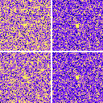
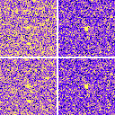
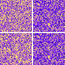
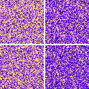

> Reading copy / Cópia de leitura. Obsidian links converted for GitHub; original wording and recorded results retained. Unresolved references stay visible as code. [Original](../../source/Simula%C3%A7%C3%B5es/39%20mapa.md) · [Collection / Acervo](../../README.md)

```yaml
tags: [triad, simulação, mapa]
aliases: [mapa_consciencia, triad_mapa_39, run39]
run: 39
data: 2026-08-21
diretório: triad_mapa_39
```


# mapa

Mesmo cubo do [37 bolso_no_universo](37%20bolso_no_universo.md). A gente cortou o meio e desenhou quatro coisas: ρ, y, |ρ−y|, V_mem.

Onde y cola em ρ, a gente lê alguém. Onde não cola, banho.

O que a gente achava: [predictions_39](../Fontes/predictions_39.md). Figuras: `Artefatos/triad_mapa_39/`.

Painel 2×2: cima-esquerda ρ · cima-direita y · baixo-esquerda |ρ−y| · baixo-direita V_mem.

## Cola (y com ρ)

| t | janela do bolso | resto do cubo |
|---|---|---|
| 0.005 | 0.482 | 0.993 |
| 0.495 | 0.736 | 0.731 |
| 0.5 plantio | **0.519** | 0.731 |
| 0.6 | **0.814** | 0.728 |
| 0.8 | **0.888** | 0.723 |
| 1.085 | 0.697 | 0.718 |
| 2 | 0.679 | 0.709 |

## O que o mapa fez

Antes: janela e cubo iguais.

Plantou: a cola da janela caiu. A memória ainda não sabia.

t=0.6–0.8: a janela colou mais que o cubo (0.81 → 0.89). Alguém por um instante. O bolso estava sendo lembrado.

t=1.085 em diante: de novo iguais. Ninguém.









21/08/2026, box, 30 s.

[37 bolso_no_universo](37%20bolso_no_universo.md) · [38 dois_bolsos](38%20dois_bolsos.md) · `[[TRIAD]]`
