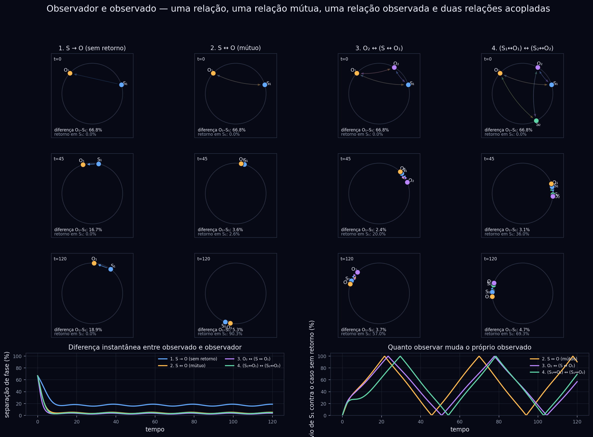

[Lab](../../README.md) · **English** · [Português](../pt-BR/gallery.md)

# Figures with context

Six entry points using original figures. Captions help you read each image; internal labels retain their original language. Colors in different figures do not necessarily use the same scale.

## Change the connection, change the dynamics

Read across the four connection patterns, then down through time. Dots mark oscillator phases; arrows show the direction of influence. Compare the lower curves with the corresponding column.

[Context, code and all files](../../experiments/relations/observer/README.md)

## Watch density organize

Six recorded slices show a changing 3D field. Bright regions mark larger density within the plotted scale. The labels are recorded steps, not elapsed seconds.

[Context, code and all files](../../experiments/geometry/field-3d/README.md)

## Trace the denser regions

Three views show 24 extracted density threads for the chosen top-3% threshold. These curves depend on the extraction rule; they are a way to inspect this saved field.

[Context, code and all files](../../experiments/geometry/string-analysis/README.md)

## Compare histories under one rule

Read the scenario columns and follow their rows through time. The lower diagnostics track phase displacement and filter separation. The “life filter” is the model’s name for a mechanism, not a biological measurement.

[Context, code and all files](../../experiments/relations/life-filter/README.md)

## Follow the changing scales

Time runs across the recorded interval; radial shells separate spatial frequencies. Color represents log10 power. Moving bands reveal redistribution across scales; this alone does not establish a permanent crystal.

[Context, code and all files](../../experiments/memory/passive-memory-dynamics/README.md)

## Check sensitivity to the time step

The horizontal axis changes the integration step; the curves compare normalized diagnostics at N=64. Read this alongside the complete protocol: the historical convergence classification remains INCONCLUSIVE.

[Context, code and all files](../../experiments/quantum/resolution-and-time-step/README.md)

[Explore the eight areas](../../experiments/README.md) · [Glossary](glossary.md)
