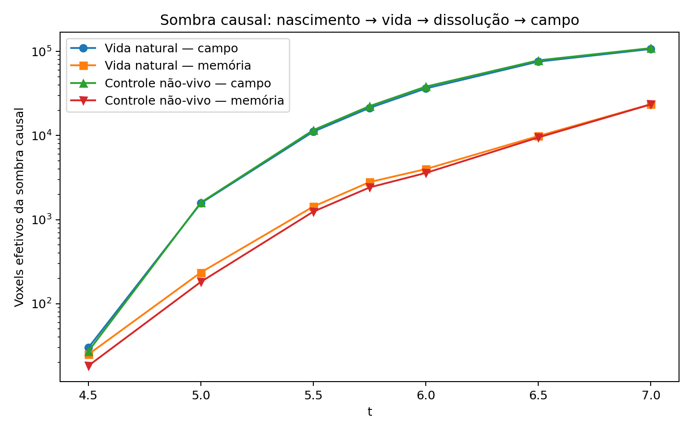

**English** · [Português](../../pt-BR/topics/causal-continuity.md) · [Collection](../history.md)

# Causal continuity

The historical `triad_soul_hypothesis` bundle applies small field probes, follows traces after a structure ends and compares matched background controls. Its hypothesis vocabulary (“soul/aura”) is preserved in the sources; this guide follows the procedure and recorded result.

[Read the original report](../../../experiments/continuity/causal-traces/notes/causal-continuity-report.md) · [Every file](../../../experiments/continuity/causal-traces/FILES.md)

The report finds causal field continuity in the controls too. It does not establish it as exclusive to life or as a demonstration of souls or reincarnation. The scripts reference an external `triad_rebuild_rules/run64` trajectory that was not supplied in this ZIP.

[Dependencies and portability](../../../provenance/t-archive/dependencies.md)

The controls and criteria above describe this historical report. They do not prescribe a term-removal protocol for new TRIAD work. The [project rules](../project-rules.md) keep the complete dynamics together.
