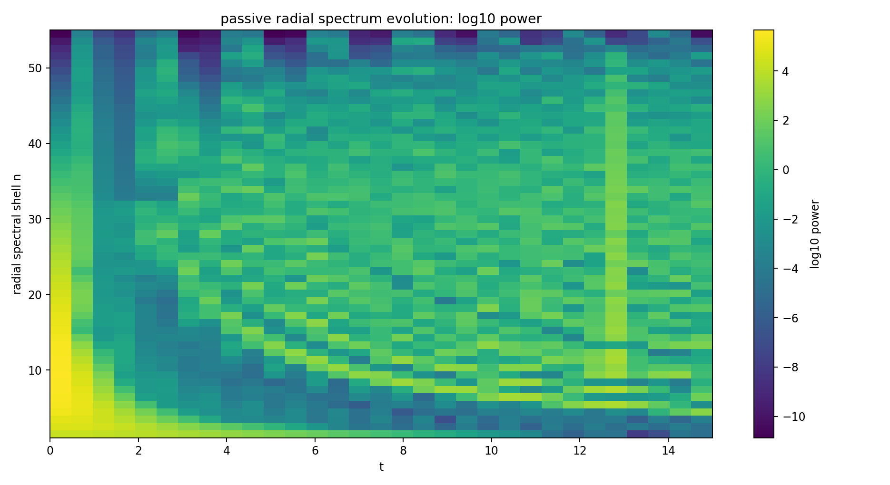

**English** · [Português](../../pt-BR/topics/passive-r5.md) · [Collection](../history.md)

# Passive R5

An N64, L=20, dt=0.0025, T=15 run with Λ=−8, ν=(10, 0.5), λ=(1.125, 0.375), Γ=0 and FDT=0. These parameters belong to this bundle and should not be confused with Theta_core. The report describes periodic structure whose scale migrates over time. Snapshots, checkpoints, post-hoc analysis and two sensitivity branches are supplied.

This is an archived bath-off setup. It is retained with its exact configuration, not presented as a new TRIAD execution under the complete-equation rule. Its evolving structures are read over time, without imposing a fixed crystal as the target. [Project rules](../project-rules.md).

[Read the original report](../../../experiments/memory/passive-memory-dynamics/notes/passive-memory-report.md) · [Every file](../../../experiments/memory/passive-memory-dynamics/FILES.md)

The report records a final norm near 1. The short twin-trajectory test does not establish a positive Lyapunov exponent; a longer run remains a historical open item.

[Dependencies and portability](../../../provenance/t-archive/dependencies.md)
