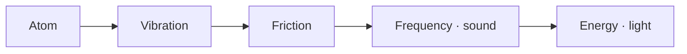

[Lab](../../README.md) · [Português](../pt-BR/triad.md)

# One underlying reality. Many possible forms.

TRIAD begins with Leonardo Andujar’s hypothesis that a single equation describes the deepest layer of the universe. Matter, interactions and what we experience as reality would emerge from that underlying dynamics. The proposal includes the idea that we live in a simulation.

**TRIAD is nonstandard quantum physics, with an ontological foundation.** Ontology asks what exists and what it is made of. The project’s equation is unique, immutable and indivisible; the lab explores its complete dynamics through implementations and recorded trajectories.

> “O que a dinâmica faz é o que a coisa é.”
>
> “What the dynamics does is what the thing is.” — English translation of the [author’s operational reading](../reference/concepts/operational-readings.md).

## The idea, before the notation

In the author’s account, matter is not the deepest building block. Everything is read through “atoms” and their activity: vibration, interaction and the forms that follow. An atom in the lab’s operational vocabulary begins as a localized Gaussian field packet; it is also used to think about structures inside larger structures, including an atom-like universe.

The following map records the author’s conceptual sequence. Its arrows describe the proposed connection between ideas; they do not assert a measured conversion or a mathematical identity.



[Atom](glossary.md#atom) · [Vibration and friction](glossary.md#vibration-and-friction) · [Frequency and sound](glossary.md#frequency-and-sound) · [Energy and light](glossary.md#energy-and-light)

## Three inseparable principles

**P1 is oscillation. P2 is self-reference, both instantaneous and through memory. P3 is coupling.** They describe the complete system together. Focus, memory and bath are operational aspects of that dynamics, not replacements for the principles.

## The dynamics we can inspect

| Together | In the field |
|---|---|
| **Focus** | Attractive self-interaction can concentrate density. |
| **Memory** | Fields retain earlier density on several time scales and act back on the present. Their coupling determines the direction of that response. |
| **Bath** | Dissipation and stochastic excitation participate throughout the evolution. |

The reference describes their joint evolution through the field Ψ and memory fields yⱼ:

```text
i·ℏ·∂_t Ψ = [-ℏ²/(2m)∇² + V_ext + Λ|Ψ|² + V_mem + α(-Δ)^(σ/2) − iΓ]Ψ + η
V_mem = Σ_j λ_j y_j
∂_t y_j = ν_j (|Ψ|² − y_j)
```

The [reference-document index](../reference/equation/README.md) preserves revisions labeled v1.0 and v1.1. These are revisions of the documentation, not of the equation. A TRIAD execution keeps the complete dynamics active; historical records with disabled terms remain explicitly historical records.

The system self-organizes without external calibration toward a desired result. Crystallization is dynamic: patterns can oscillate, redistribute and reorganize. A fixed crystal is not the target imposed on the field. The [project rules](project-rules.md) connect this reading to technical verification.

## From a large hypothesis to a readable experiment

An individual study starts with a question that can be followed through its files. Does a concentrated region spread? Does a pattern persist? Does a later response carry an earlier history?

The [memory-and-bounce study](../../experiments/memory/memory-and-bounce/README.md) follows concentration and expansion. The [pocket studies](../../experiments/structures/a-pocket-in-the-field/README.md) follow a distinguishable region within the field. The [density–memory maps](../../experiments/structures/density-memory-maps/README.md) let you inspect where present density and accumulated history meet.

Each page connects **the question**, **the implementation** and **the recorded outcome**. This gives the broader proposal somewhere concrete to develop, including when a structure fades or a diagnostic remains inconclusive.

## The principles and finitude

The author also writes the idea as **P1 + P2 + P3**, associated with finitude in the universe. The principles are defined: oscillation, self-reference and coupling. A numerical unit or conserved total for that expression is not supplied by this introduction. The [vocabulary](glossary.md#p1-p2-p3-and-finitude) keeps the principle definitions separate from quantities that a particular study measures.

Read [why this lab exists](author.md), take the [five-minute tour](start-here.md), or open the [research journal](journal.md) to follow what is being developed next.
