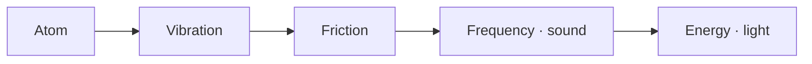

[Lab](../../README.md) · [Português](../pt-BR/triad.md)

# One underlying reality. Many possible forms.

TRIAD begins with Leonardo Andujar’s hypothesis that a single equation describes the deepest layer of the universe. Matter, interactions and what we experience as reality would emerge from that underlying dynamics. The proposal includes the idea that we live in a simulation.

This is the starting point of an independent lab in **nonstandard quantum physics and ontology**. Ontology asks what exists and what it is made of. TRIAD approaches that question through a field that evolves, carries its history and responds to that history.

> “O que a dinâmica faz é o que a coisa é.”
>
> “What the dynamics does is what the thing is.” — English translation of the [author’s operational reading](../reference/concepts/operational-readings.md).

## The idea, before the notation

In the author’s account, matter is not the deepest building block. Everything is read through “atoms” and their activity: vibration, interaction and the forms that follow. An atom in the lab’s operational vocabulary begins as a localized Gaussian field packet; it is also used to think about structures inside larger structures, including an atom-like universe.

The following map records the author’s conceptual sequence. Its arrows describe the proposed connection between ideas; they do not assert a measured conversion or a mathematical identity.



[Atom](glossary.md#atom) · [Vibration and friction](glossary.md#vibration-and-friction) · [Frequency and sound](glossary.md#frequency-and-sound) · [Energy and light](glossary.md#energy-and-light)

## The dynamics we can inspect

| Together | In the field |
|---|---|
| **Focus** | Attractive self-interaction can concentrate density. |
| **Memory** | Fields retain earlier density on several time scales and act back on the present. Their coupling determines the direction of that response. |
| **Bath** | Dissipation and stochastic excitation participate throughout the evolution. |

The reference describes their joint evolution through the field Ψ and memory fields yⱼ:

```text
i·ℏ·∂_t Ψ = [-ℏ²/(2m)∇² + V_ext + Λ|Ψ|² + V_mem + α(-Δ)^(σ/2) − iΓ]Ψ + η
V_mem = Σ_j λ_j y_j
∂_t y_j = ν_j (|Ψ|² − y_j)
```

The [current reference, version 1.1](../reference/equation/README.md), states the rule of the complete equation. New work under that edition keeps the dynamics together, with memory and bath active. Historical studies retain the parameters and implementations with which they were recorded.

## From a large hypothesis to a readable experiment

An individual study starts with a question that can be followed through its files. Does a concentrated region spread? Does a pattern persist? Does a later response carry an earlier history?

The [memory-and-bounce study](../../experiments/memory/memory-and-bounce/README.md) follows concentration and expansion. The [pocket studies](../../experiments/structures/a-pocket-in-the-field/README.md) follow a distinguishable region within the field. The [density–memory maps](../../experiments/structures/density-memory-maps/README.md) let you inspect where present density and accumulated history meet.

Each page connects **the question**, **the implementation** and **the recorded outcome**. This gives the broader proposal somewhere concrete to develop, including when a structure fades or a diagnostic remains inconclusive.

## A vocabulary still taking shape

The author also writes the idea as **P1 + P2 + P3**, associated with a finite amount of something in the universe. The current reference names **P2 as memory** and **P3 as bath**. It does not define P1 or the quantity being summed. Those definitions remain open in the [vocabulary](glossary.md#p1-p2-p3-and-finitude); the lab does not assign them an invented unit or conservation law.

Read [why this lab exists](author.md), take the [five-minute tour](start-here.md), or open the [research journal](journal.md) to follow what is being developed next.
