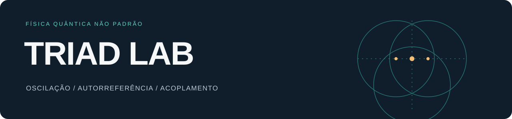

<p align="center">
  <a href="../../README.md">English</a> · <strong>Português</strong>
  <br />
  <a href="https://andujarleo.github.io/triad-lab/?lang=pt-BR"><strong>ENTRE NO LAB ↗</strong></a> · <a href="triad.md">A proposta</a> · <a href="journal.md">Diário do lab</a>
</p>

# E se uma equação fosse a base da realidade?

**A TRIAD é física quântica não padrão, com fundamento ontológico.** Criado por Leonardo Andujar, este lab independente e vivo explora sua hipótese de que o universo tem uma equação de base e de que a realidade seja uma simulação.

O projeto parte de **oscilação (P1), autorreferência (P2) e acoplamento (P3)**. Sua equação é **única, imutável e indivisível**. Foco, memória e banho participam da dinâmica completa: um campo evolui, carrega sua história e responde a ela. O lab acompanha as formas e interações que se auto-organizam.

<p align="center">
  <a href="../../simulations/geometry/field-visualizations/README.pt-BR.md">
    
  </a>
</p>

**Um campo visto por dentro.** Ciano e rosa marcam voltas de fase em sentidos opostos nas regiões densas. Este é um quadro original registrado, com seus rótulos preservados. [Veja a animação](../../simulations/geometry/field-visualizations/results/figures/cordas-fase-vivas.gif) · [Siga a imagem até sua origem](../../simulations/geometry/field-visualizations/README.pt-BR.md).

**65 estudos · 8 áreas · imagens, código e dados originais · inglês + português**

## Escolha sua entrada

| Conhecer a ideia | Explorar o lab | Examinar o trabalho |
|---|---|---|
| A hipótese, seu mapa conceitual e as palavras no sentido próprio da TRIAD. | Um atlas visual com busca e cortes interativos de campos salvos. | Equação, implementações, parâmetros e resultados registrados. |
| [Comece pela visita de cinco minutos →](start-here.md) | [Abra o lab interativo →](https://andujarleo.github.io/triad-lab/?lang=pt-BR) | [Leia o guia técnico →](research-guide.md) |

O visualizador interativo lê estados finais preservados. Seu controle percorre o **espaço**, e cada visualização leva aos dados originais.

## Três perguntas para começar

| O que vem depois da concentração? | Uma região pode manter sua identidade? | Até onde a memória acompanha a densidade? |
|---|---|---|
|  |  |  |
| Acompanhe concentração, resposta da memória e expansão. O registro preserva dois diagnósticos de raio que discordam. | Acompanhe um bolsão gaussiano inserido no campo e os diagnósticos de sua identidade enquanto o campo muda. | Compare densidade e memória acumulada. O alinhamento registrado é transitório. |
| [Memória e bounce →](../../simulations/memory/memory-and-bounce/README.pt-BR.md) | [Um bolsão no campo →](../../simulations/structures/a-pocket-in-the-field/README.pt-BR.md) | [Mapas de densidade e memória →](../../simulations/structures/density-memory-maps/README.pt-BR.md) |

## Uma pergunta ampla, um acervo que cresce

A ambição é explorar muitos fenômenos por meio de simulações e publicar o caminho percorrido. Cada estudo conecta sua pergunta às notas, ao código, às configurações e aos resultados disponíveis. Tentativas históricas, resultados parciais e perguntas em aberto continuam fazendo parte desse caminho.

[Relações](../../simulations/relations/README.pt-BR.md) · [Geometria](../../simulations/geometry/README.pt-BR.md) · [Memória](../../simulations/memory/README.pt-BR.md) · [Estruturas](../../simulations/structures/README.pt-BR.md) · [Sinais](../../simulations/signals/README.pt-BR.md) · [Diagnósticos do campo](../../simulations/field-diagnostics/README.pt-BR.md) · [Continuidade](../../simulations/continuity/README.pt-BR.md) · [Validação](../../simulations/numerical-checks/README.pt-BR.md)

O [histórico da documentação de referência](../reference/equation/README.md) preserva documentos identificados como v1.0 e v1.1; esses rótulos indicam revisões da escrita, não equações diferentes. Implementações e resultados históricos mantêm suas configurações próprias. As [regras do projeto](project-rules.md) explicam a dinâmica completa, a auto-organização sem calibração externa para obter um resultado escolhido e as checagens técnicas do lab.

[Por que Leonardo criou o lab](author.md) · [Vocabulário da TRIAD](glossary.md) · [Diário de pesquisa](journal.md) · [Contribua](contributing.md) · [Mais idiomas](languages.md)

<details>
<summary>Executar, verificar e navegar no repositório</summary>

[Guia de execução histórica](getting-started.md) · [Mapa do repositório](repository-map.md) · [Código do site e prévia local](../../web/README.md) · [Proveniência](../../provenance/README.md)

```sh
git lfs pull
python3 tools/check_repository.py
```

As pastas dos estudos usam nomes descritivos. Cada **FILES.md** conecta os materiais associados, e o catálogo preserva suas associações originais.

</details>
