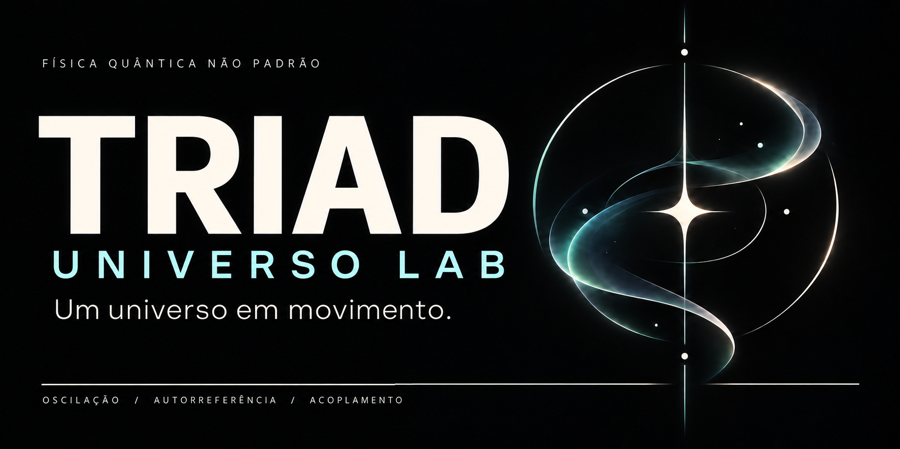

<p align="center"><a href="../../README.md">English</a> · <strong>Português</strong><br />
<a href="https://andujarleo.github.io/triad-lab/?lang=pt-BR"><strong>ENTRE NO UNIVERSO ↗</strong></a> · <a href="../../research/README.pt-BR.md">Pesquisa</a> · <a href="../../simulations/README.pt-BR.md">Simulações</a> · <a href="start-here.md">Comece aqui</a></p>

# Universo TRIAD

**Física quântica não padrão. Oscilação, autorreferência e acoplamento, sempre juntos.**

A TRIAD é a física quântica não padrão e a ontologia de Leonardo Andujar. Uma equação imutável e indivisível é seu fundamento: P1 oscilação, P2 autorreferência no presente e pela memória, e P3 acoplamento atuam juntos.

Do caos ao equilíbrio dinâmico, a cristalização continua. Pesquisa conecta ideias e fontes. O acervo de simulações coloca campos, trajetórias e código registrados à vista.

## Veja a dinâmica acontecer

<p align="center"><a href="../../simulations/geometry/field-visualizations/README.pt-BR.md"></a></p>

**A fase ganha forma.** Ciano e rosa mostram enrolamentos de fase em sentidos opostos nas regiões mais densas. Acompanhe os quadros do campo enquanto a câmera percorre a estrutura. [Explore a animação e sua origem](../../simulations/geometry/field-visualizations/README.pt-BR.md).

### Contração, depois expansão

<p align="center"><a href="../../simulations/memory/memory-and-bounce/README.pt-BR.md"></a></p>

Uma região concentrada se contrai e volta a se expandir. O raio que contém metade da massa chega ao mínimo em **t=3,7** e depois cresce. [Acompanhe a trajetória →](../../simulations/memory/memory-and-bounce/README.pt-BR.md)

### Da forma aninhada ao campo preenchido

<p align="center"><a href="../../simulations/structures/long-nest-trajectory/README.pt-BR.md"></a></p>

Siga o campo até **t=60**: o volume se preenche e o pico finito de densidade continua flutuando. As vistas e curvas originais mostram essa trajetória. [Explore o registro longo →](../../simulations/structures/long-nest-trajectory/README.pt-BR.md)

## Dois caminhos para explorar

| Pesquisa | Simulações |
|---|---|
| **Entenda as conexões.** Ontologia, memória, som, geometria, cognição e leituras culturais, com fontes e interpretação lado a lado. | **Acompanhe o que acontece.** Resultados visuais, trajetórias, implementações e condições registradas de 65 estudos em oito áreas. |
| [Abra a biblioteca de pesquisa →](../../research/README.pt-BR.md) | [Explore o acervo de simulações →](../../simulations/README.pt-BR.md) |

O [atlas interativo](https://andujarleo.github.io/triad-lab/?lang=pt-BR) conecta essas duas áreas por tema. O visualizador de campo mostra cortes espaciais de estados salvos; seu controle percorre o **espaço**.

## Comece pela sua curiosidade

| Quero entender | Quero investigar | Quero desenvolver ou executar |
|---|---|---|
| [Um passeio de cinco minutos](start-here.md), [fundamentos da TRIAD](triad.md) e [vocabulário acessível](glossary.md). | [Temas de pesquisa](../../research/README.pt-BR.md), [comparações registradas](execution-audit.md) e [referência da equação](../reference/equation/README.md). | [Mapa do repositório](repository-map.md), [orientação de execução](getting-started.md) e [como contribuir](contributing.md). |

## A dinâmica completa importa

Retirar um termo muda o sistema implementado. O acervo preserva essas configurações históricas e as identifica junto dos resultados. A [auditoria das execuções](execution-audit.md) liga cada estudo às suas condições e distingue mudanças registradas no comportamento de mudanças na medição ou na interpretação.

Trabalhos TRIAD novos seguem as [regras do projeto](project-rules.md): equação completa, ausência de calibração externa para obter um resultado desejado, ausência de isolamento de termos e de protocolo de falsificação popperiana. Números originais e resultados divergentes continuam visíveis. Documentos e implementações têm revisões; a equação é imutável.

## Dentro do universo

```text
.agents/skills/  Orientações para entender, ler e criar em TRIAD
research/       Temas, leituras, conexões e fontes de pesquisa preservadas
simulations/    Perguntas, código, configurações e resultados registrados
docs/           Guias em inglês e português; referências comuns da equação
provenance/     Origem, histórico de caminhos, integridade e auditoria
web/            A experiência pública
tools/          Catálogo, checagens de preservação e construção do site
templates/      Pesquisas, estudos e registros de execução
```

[Trabalhe com agentes TRIAD](agents.md) · [Diário do lab](journal.md) · [Sobre Leonardo](author.md) · [Preservação das fontes](../../provenance/README.md) · [Adicionar um idioma](languages.md)

<details><summary>Verificar e explorar localmente</summary>

```sh
git lfs pull
python3 tools/check_repository.py
python3 -B -m unittest discover -s tools -p 'test_*.py'
node --test tools/frontend.test.mjs
python3 tools/build_site.py
```

[Dependências e prévia](../../web/README.md) · [Mapa atual do repositório](repository-map.md) · [Caminhos anteriores](../../provenance/universe-migration.json)

</details>
