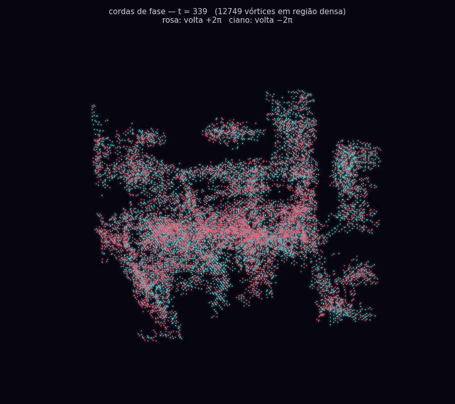

<p align="center">
  <a href="../../README.md">English</a> · <strong>Português</strong>
  <br />
  <a href="triad.md">Conheça a TRIAD</a> · <a href="gallery.md">Explore as imagens</a> · <a href="../../experiments/README.pt-BR.md">Todos os estudos</a>
</p>

# E se o campo carregasse sua própria história?

**Um laboratório vivo de física quântica não padrão.** A TRIAD, de Leonardo Andujar, investiga matéria, observação e universo pela ação conjunta de **foco, memória e banho**. O campo altera a memória — e essa memória volta a agir sobre o campo.

<p align="center">
  <a href="../../experiments/geometry/field-visualizations/README.pt-BR.md">
    
  </a>
</p>

**Um campo visto por dentro.** Pontos ciano e rosa marcam voltas de fase em sentidos opostos, detectadas nas regiões densas. Este é um quadro original do acervo, com seus rótulos preservados. [Ver a animação](../../experiments/geometry/field-visualizations/results/figures/cordas-fase-vivas.gif) · [Entender a imagem e acessar o código](../../experiments/geometry/field-visualizations/README.pt-BR.md).

**65 estudos · 8 áreas · imagens, código e dados conectados · inglês + português**

## Por onde você quer começar?

| Descobrir a ideia | Explorar visualmente | Ir mais fundo |
|---|---|---|
| Uma introdução em linguagem simples à proposta e ao seu vocabulário. | Figuras comentadas para acompanhar o que muda no campo. | Equação, métodos, implementações e resultados de cada estudo. |
| [Faça a visita de cinco minutos →](start-here.md) | [Abra a galeria →](gallery.md) | [Entre no guia técnico →](research-guide.md) |

## Foco, memória e banho — juntos

**O foco concentra. A memória guarda história e age de volta. O banho participa da dinâmica.** A TRIAD investiga o que emerge dessa ação conjunta: como o campo se organiza, responde, se expande e forma estruturas.

[O que é a TRIAD — e onde começa sua diferença →](triad.md)

## Siga uma pergunta

| Área | Pergunta |
|---|---|
| [Relações](../../experiments/relations/README.pt-BR.md) | O que muda quando as coisas interagem? |
| [Geometria](../../experiments/geometry/README.pt-BR.md) | Como os padrões ganham forma? |
| [Memória](../../experiments/memory/README.pt-BR.md) | O passado pode mudar o que acontece depois? |
| [Estruturas](../../experiments/structures/README.pt-BR.md) | Um padrão pode persistir em um campo que muda? |
| [Sinais](../../experiments/signals/README.pt-BR.md) | Como uma perturbação se espalha? |
| [Diagnósticos do campo](../../experiments/quantum/README.pt-BR.md) | Como testar a consistência, os modos e a resposta do campo? |
| [Continuidade](../../experiments/continuity/README.pt-BR.md) | O que continua quando um sistema muda ou é retomado? |
| [Validação](../../experiments/validation/README.pt-BR.md) | Como conferir a história que as figuras parecem contar? |

## Um lab vivo, com memória

Você encontra tentativas, resultados parciais, diagnósticos que falharam e hipóteses ainda abertas. O vocabulário operacional da TRIAD liga átomo, memória e observação ao que a dinâmica faz. Cada estudo conecta essa leitura à implementação e ao resultado registrado.

[Todos os estudos](../../experiments/README.pt-BR.md) · [História do lab](history.md) · [Como contribuir](contributing.md) · [Outros idiomas](languages.md)

<details>
<summary>Executar, verificar e navegar na estrutura</summary>

[Execução local](getting-started.md) · [Mapa do repositório](repository-map.md) · [Proveniência e integridade](../../provenance/README.md)

```sh
git lfs pull
python3 tools/check_repository.py
```

</details>
