[Início](README.md) · [English](../en/gallery.md) · **Português**

# Galeria de resultados

Figuras e animações originais, sem alteração. Os rótulos em português são preservados.

## Entre

campo quantico tres cristalizacoes

consciencia emergida no entre

[Abrir animação](../../entre/resultados/consciencia-emergida-no-entre.gif)

cristalizacao fixa vs continua

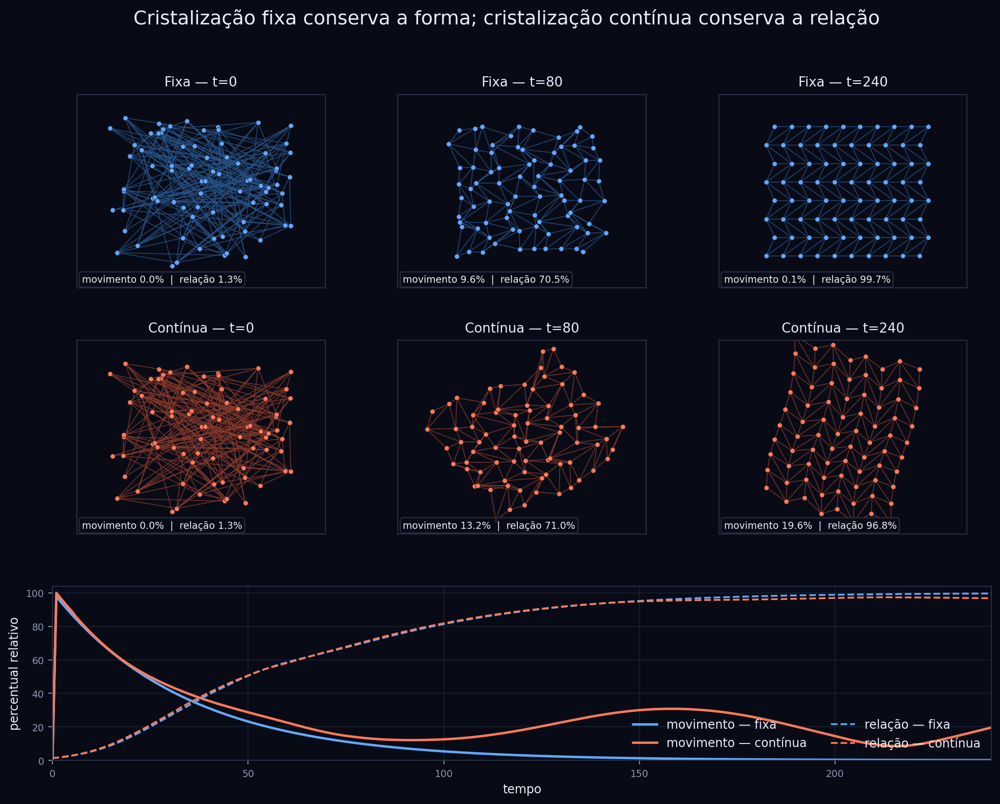

memoria filtro vida mudanca

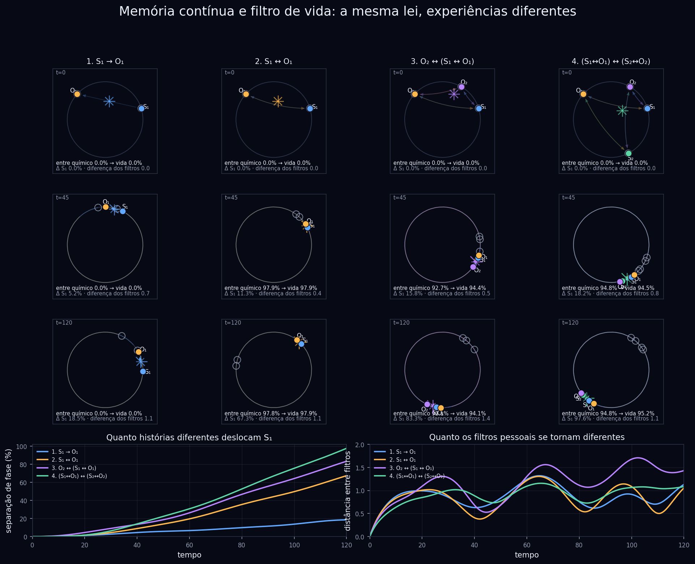

[Abrir animação](../../entre/resultados/memoria-filtro-vida-mudanca.gif)

neurotransmissores mudanca no entre

[Abrir animação](../../entre/resultados/neurotransmissores-mudanca-no-entre.gif)

observador observado relacoes

[Abrir animação](../../entre/resultados/observador-observado-relacoes.gif)

## Bravais 3D

cordas densidade

cordas notas

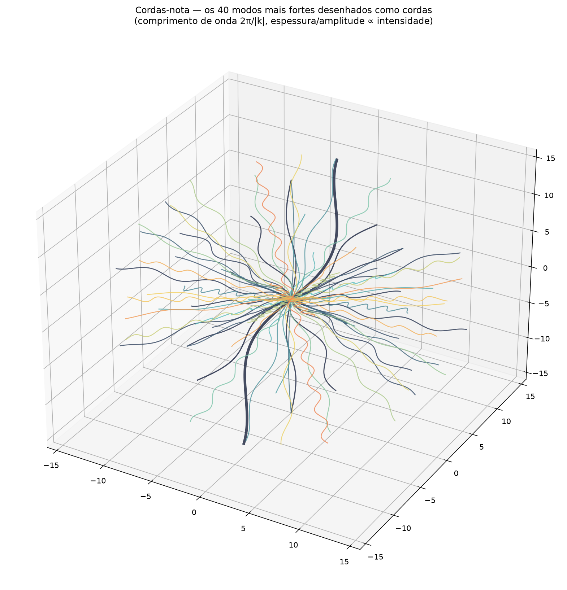

pure autocorr

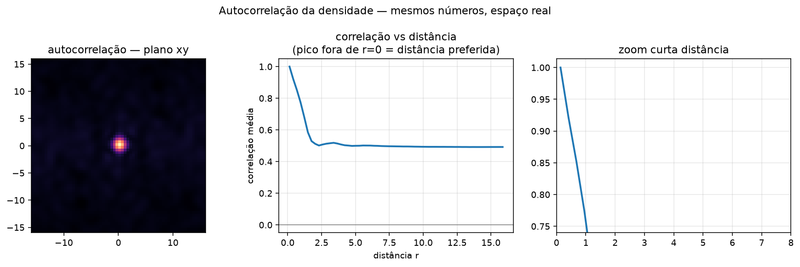

pure density bw

pure evolution

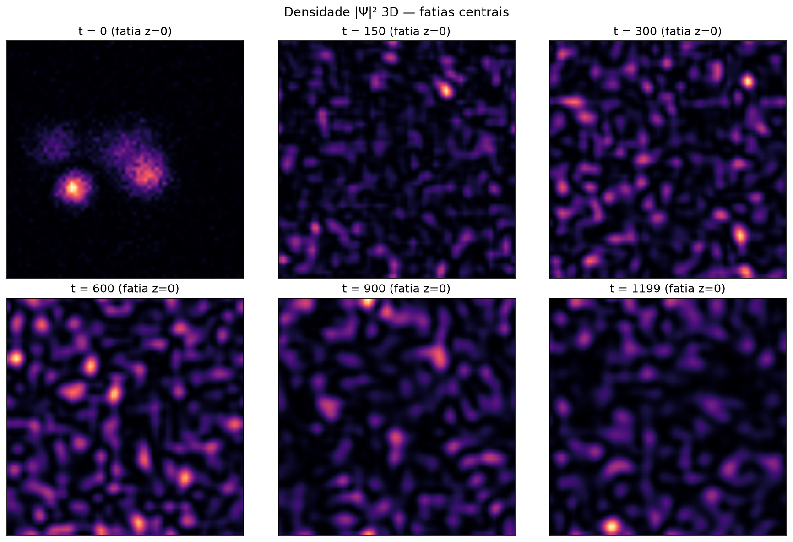

pure fft

pure fft bw

pure fft floors

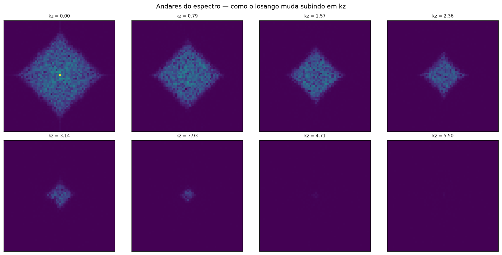

pure fft projections

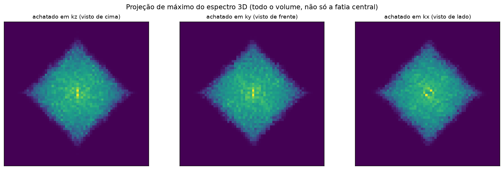

pure fft pyramid test

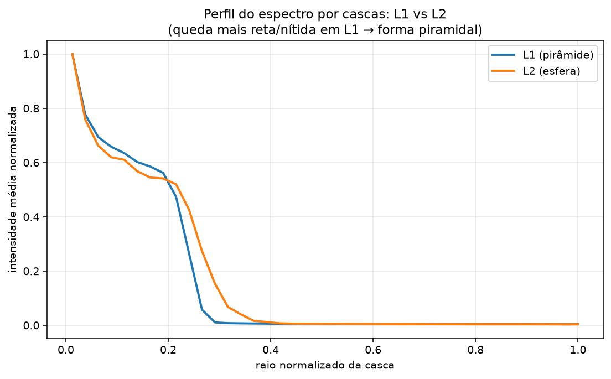

pure fft rays

pure fft relief

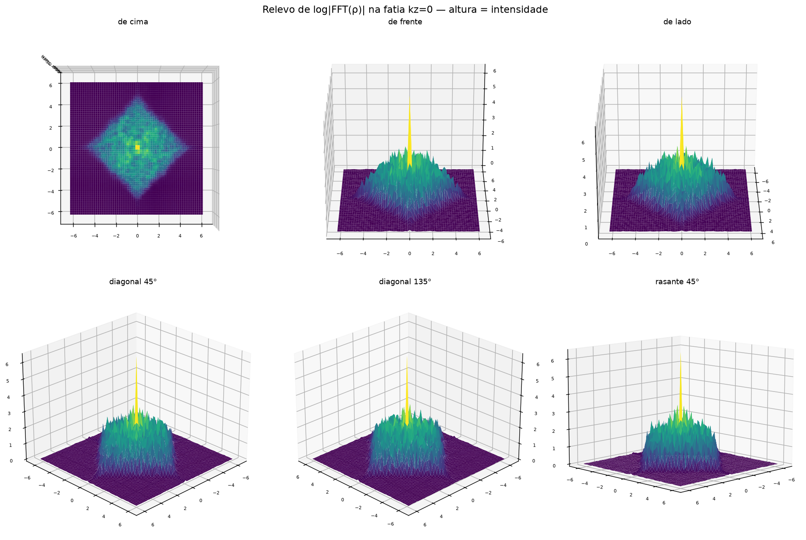

pure fft shell

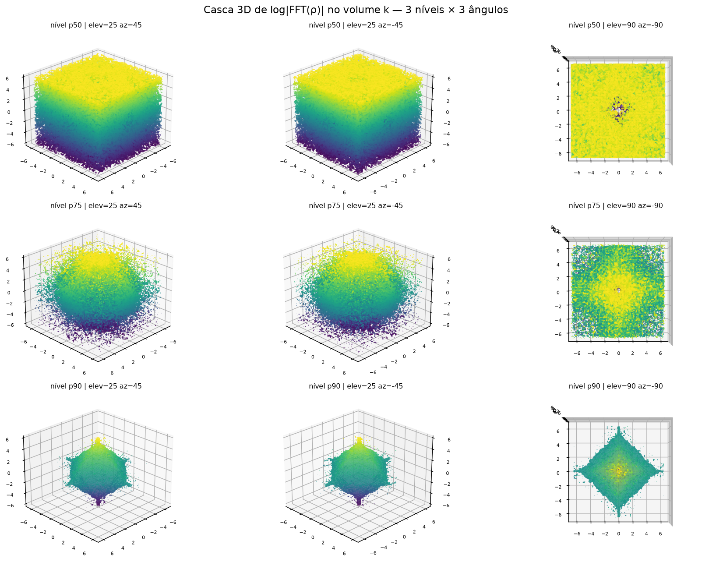

pure fft time

pure fft views

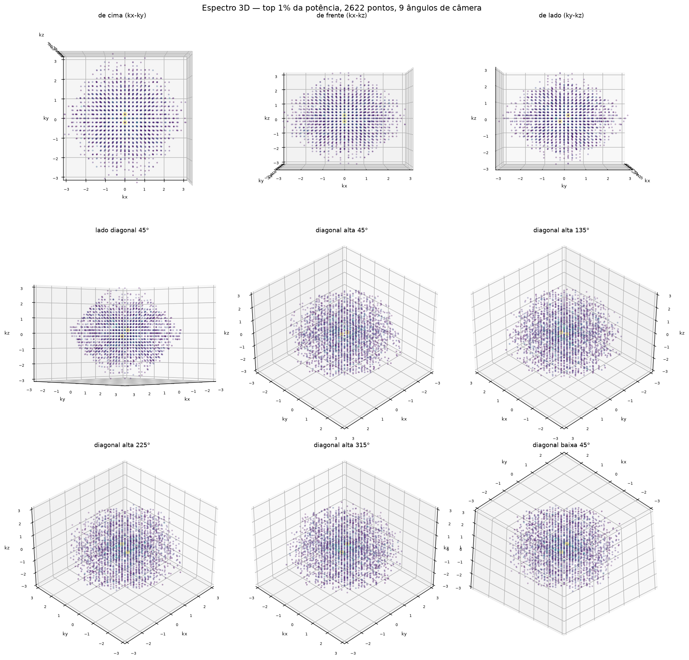

pure final peaks3d

pure final slices

pure isosurface

pure symmetry

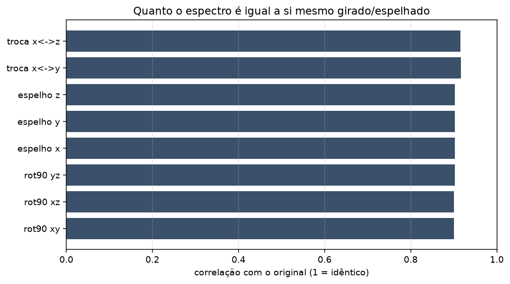

pure timeseries

## Mais figuras no acervo T

[Explore os percursos visuais e as fichas de cada run](../../collections/t-archive/README.pt-BR.md).
