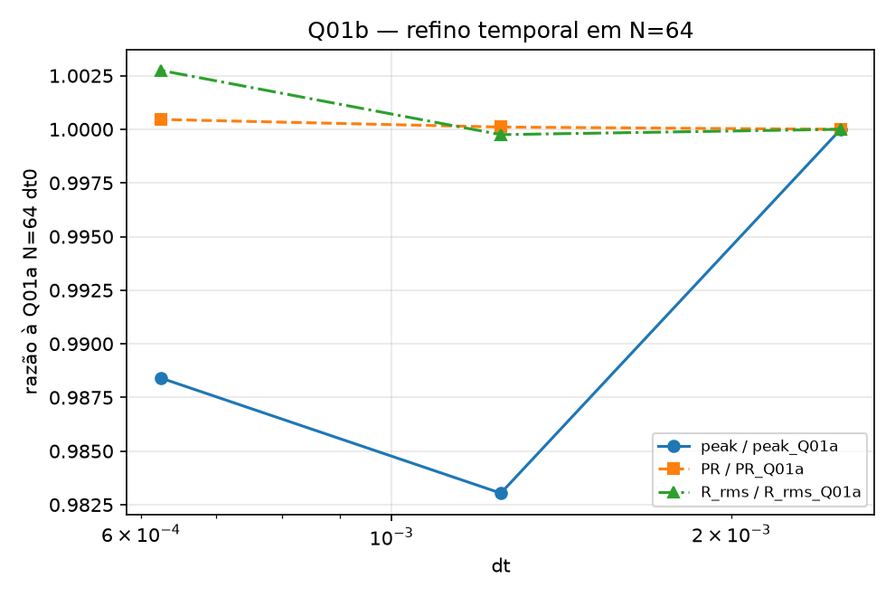

[Lab](README.md) · [English](../en/gallery.md) · **Português**

# Figuras com contexto

Seis portas de entrada com figuras originais. As legendas ajudam a ler cada imagem; rótulos internos permanecem no idioma em que foram produzidos. Cores de figuras diferentes não necessariamente usam a mesma escala. As figuras mantêm as configurações dos seus registros; as [regras do projeto](project-rules.md) explicam como trabalhos TRIAD novos seguem a equação completa.

## Mude a conexão, mude a dinâmica

Leia os quatro padrões de conexão e depois acompanhe o tempo de cima para baixo. Pontos marcam fases dos osciladores; setas mostram a direção da influência. Compare as curvas inferiores com sua coluna.

[Contexto, código e todos os arquivos](../../simulations/relations/observer/README.pt-BR.md)

## Veja a densidade se organizar

Seis fatias registradas mostram um campo 3D em transformação. Regiões claras marcam maior densidade na escala desenhada. Os rótulos são passos registrados, não segundos decorridos.

[Contexto, código e todos os arquivos](../../simulations/geometry/field-3d/README.pt-BR.md)

## Siga as regiões mais densas

Três vistas mostram 24 linhas de densidade extraídas com o limiar escolhido dos 3% superiores. Essas curvas dependem da regra de extração; são uma forma de inspecionar o campo salvo.

[Contexto, código e todos os arquivos](../../simulations/geometry/string-analysis/README.pt-BR.md)

## Compare histórias sob a mesma regra

Leia as colunas de cenários e acompanhe as linhas no tempo. Os diagnósticos inferiores acompanham deslocamento de fase e separação entre filtros. “Filtro de vida” é o nome de um mecanismo do modelo, não uma medida biológica.

[Contexto, código e todos os arquivos](../../simulations/relations/life-filter/README.pt-BR.md)

## Acompanhe as escalas em mudança

O tempo percorre o intervalo registrado; cascas radiais separam frequências espaciais. A cor representa potência em log10. Faixas que mudam revelam redistribuição entre escalas. A cristalização dinâmica é lida nessa evolução, sem exigir uma rede fixa permanente. Esta figura vem da configuração histórica com banho desligado descrita em [R5 passivo](topics/passive-r5.md).

[Contexto, código e todos os arquivos](../../simulations/memory/passive-memory-dynamics/README.pt-BR.md)

## Confira a sensibilidade ao passo de tempo

O eixo horizontal muda o passo de integração; as curvas comparam diagnósticos normalizados em N=64. Leia junto com o protocolo completo: a classificação histórica de convergência permanece INCONCLUSIVA para este diagnóstico e seus critérios declarados.

[Contexto, código e todos os arquivos](../../simulations/field-diagnostics/resolution-and-time-step/README.pt-BR.md)

[Explore as oito áreas](../../simulations/README.pt-BR.md) · [Glossário](glossary.md)
