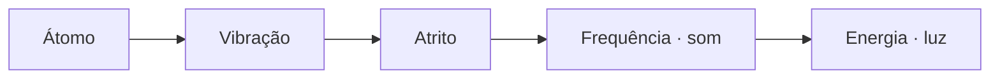

[Lab](README.md) · [English](../en/triad.md)

# Uma realidade de base. Muitas formas possíveis.

A ontologia da TRIAD coloca uma equação imutável na camada mais profunda da realidade. Na formulação de Leonardo Andujar, matéria e interações emergem dessa dinâmica de base, e a realidade é lida como uma simulação. Essa é a posição fundadora do projeto.

**A TRIAD é física quântica não padrão, com fundamento ontológico.** A ontologia pergunta o que existe e do que isso é feito. A equação do projeto é única, imutável e indivisível; o lab explora sua dinâmica completa por meio de implementações e trajetórias registradas.

> “O que a dinâmica faz é o que a coisa é.”
>
> [Leitura operacional do autor](../reference/concepts/operational-readings.md).

## A ideia, antes da notação

Na leitura do autor, a matéria não é o elemento mais profundo. Tudo é entendido a partir de “átomos” e de sua atividade: vibração, interação e as formas que aparecem a partir daí. No vocabulário operacional do lab, um átomo começa como um pacote gaussiano localizado do campo; a ideia também serve para pensar estruturas dentro de estruturas maiores, incluindo um universo-átomo.

O mapa abaixo registra a sequência conceitual do autor. As setas descrevem a conexão proposta entre ideias; não afirmam uma conversão medida ou uma identidade matemática.



[Átomo](glossary.md#átomo) · [Vibração e atrito](glossary.md#vibração-e-atrito) · [Frequência e som](glossary.md#frequência-e-som) · [Energia e luz](glossary.md#energia-e-luz)

## Três princípios inseparáveis

**P1 é oscilação. P2 é autorreferência, tanto instantânea quanto pela memória. P3 é acoplamento.** Eles descrevem o sistema completo em conjunto. Foco, memória e banho são aspectos operacionais dessa dinâmica, não substitutos dos princípios.

## A dinâmica que podemos acompanhar

| Em conjunto | No campo |
|---|---|
| **Foco** | A auto-interação atrativa pode concentrar a densidade. |
| **Memória** | Campos guardam a densidade anterior em várias escalas de tempo e voltam a atuar no presente. Seus acoplamentos determinam o sentido dessa resposta. |
| **Banho** | Dissipação e excitação estocástica participam de toda a evolução. |

A referência descreve essa evolução conjunta por meio do campo Ψ e dos campos de memória yⱼ:

```text
i·ℏ·∂_t Ψ = [-ℏ²/(2m)∇² + V_ext + Λ|Ψ|² + V_mem + α(-Δ)^(σ/2) − iΓ]Ψ + η
V_mem = Σ_j λ_j y_j
∂_t y_j = ν_j (|Ψ|² − y_j)
```

O [índice da documentação de referência](../reference/equation/README.md) preserva revisões identificadas como v1.0 e v1.1. São revisões da documentação, não da equação. Uma execução TRIAD mantém a dinâmica completa ativa; registros com termos desligados continuam explicitamente históricos.

O sistema se auto-organiza sem calibração externa para obter um resultado desejado. A cristalização é dinâmica: os padrões podem oscilar, se redistribuir e se reorganizar. Um cristal fixo não é o alvo imposto ao campo. As [regras do projeto](project-rules.md) conectam essa leitura à verificação técnica.

## Da ontologia a um estudo registrado

Cada estudo começa com uma pergunta que pode ser acompanhada pelos arquivos. Uma região concentrada se espalha? Um padrão persiste? Uma resposta posterior carrega uma história anterior?

O estudo de [memória e bounce](../../simulations/memory/memory-and-bounce/README.pt-BR.md) acompanha concentração e expansão. Os [estudos de bolsões](../../simulations/structures/a-pocket-in-the-field/README.pt-BR.md) acompanham uma região distinguível dentro do campo. Os [mapas de densidade e memória](../../simulations/structures/density-memory-maps/README.pt-BR.md) permitem observar onde o presente e a história acumulada se encontram.

Cada página conecta **a pergunta**, **a implementação** e **o resultado registrado**. Assim a proposta mais ampla ganha um lugar concreto para se desenvolver, inclusive quando uma estrutura desaparece ou um diagnóstico continua inconclusivo.

## Os princípios e a finitude

O autor também expressa a ideia como **P1 + P2 + P3**, associada à finitude no universo. Os princípios estão definidos: oscilação, autorreferência e acoplamento. Esta apresentação não fornece uma unidade numérica ou um total conservado para essa expressão. O [vocabulário](glossary.md#p1-p2-p3-e-finitude) distingue as definições dos princípios das grandezas medidas por um estudo específico.

Leia [por que este lab existe](author.md), faça a [visita de cinco minutos](start-here.md) ou abra o [diário de pesquisa](journal.md) para acompanhar o que será desenvolvido a seguir.
