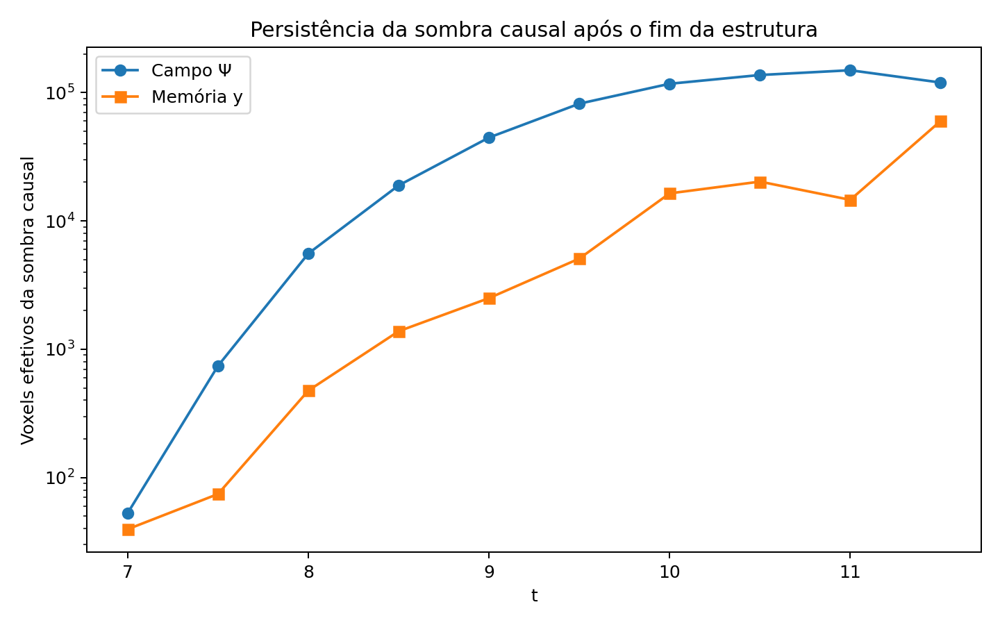

[Lab](../../../README.md) · **English** · [Português](README.pt-BR.md)

[Continuity](../README.md) · [Glossary](../../../docs/en/glossary.md)

# Following causal traces

**Which traces remain after the source changes?**

The original report tests a “soul” hypothesis but finds field continuity in controls too. The evidence does not isolate a life-specific effect. Required triad_rebuild_rules/run64 inputs were not supplied.

- [causal-continuity-report.md](notes/causal-continuity-report.md)

## Files and execution context

[Complete material index](FILES.md) · [Research guide](../../../docs/en/research-guide.md)

This page organizes historical records. Code availability does not guarantee a complete execution environment. Paths embedded in source code were preserved; check dependencies before adapting a run.

[Dependencies and missing inputs](../../../provenance/t-archive/dependencies.md)

[Context and diagnostics](../../../docs/en/topics/causal-continuity.md)
