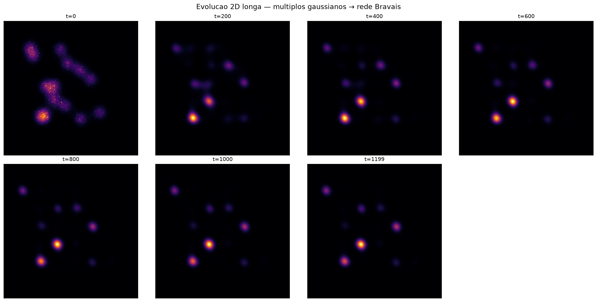

[Lab](../../../docs/pt-BR/README.md) · [English](README.md) · **Português**

[Geometria](../README.pt-BR.md) · [Glossário](../../../docs/pt-BR/glossary.md)

# Comparação entre 2D e 3D

**O que muda entre 2D e 3D?**

Um script de execução longa e diagnósticos registrados exploram campos em duas e três dimensões. Leia os parâmetros antes de comparar os grupos de resultados.

## Arquivos e condições de execução

[Índice completo dos materiais](FILES.md) · [Guia técnico](../../../docs/pt-BR/research-guide.md)

Esta página organiza registros históricos. A presença de código não garante um ambiente completo de execução. Caminhos embutidos no código foram preservados; consulte as dependências antes de adaptar uma execução.

[Dependências e entradas ausentes](../../../provenance/t-archive/dependencies.pt-BR.md)
