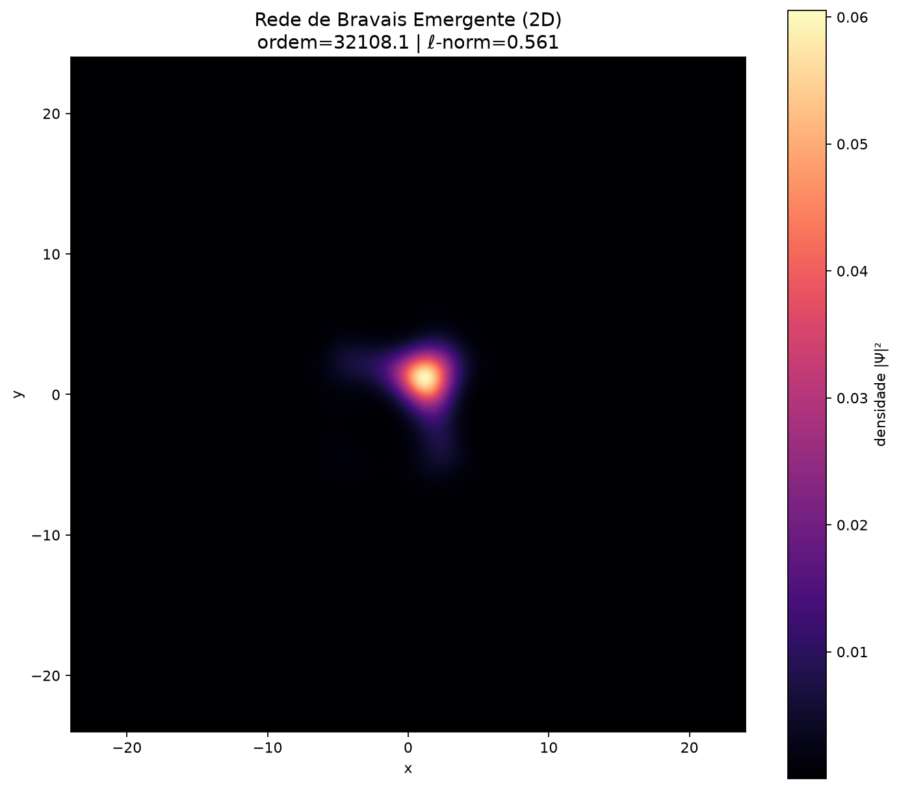

[Lab](../../../README.md) · **English** · [Português](README.pt-BR.md)

[Geometry](../README.md) · [Glossary](../../../docs/en/glossary.md)

# 2D field explorations

**How does a field organize itself in two dimensions?**

Four distinct implementations explore coupled evolution and initial conditions on a 2D grid. They are separate experiments, not interchangeable versions of one validated configuration.

## Files and execution context

[Complete material index](FILES.md) · [Research guide](../../../docs/en/research-guide.md)

This page organizes historical records. Code availability does not guarantee a complete execution environment. Paths embedded in source code were preserved; check dependencies before adapting a run.

[Dependencies and missing inputs](../../../provenance/t-archive/dependencies.md)
