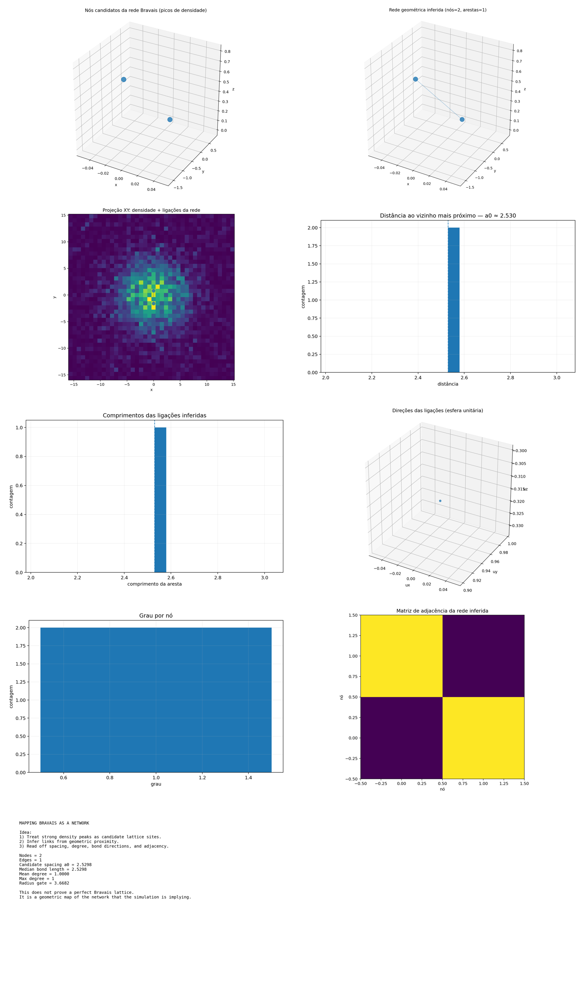

# triad_bravais_network_map

Primeira rede: picos de densidade → nós; arestas por proximidade/kNN. Threshold severo demais. Preservado. Motivou [26 triad_bravais_network_map_v2](../../refined-geometric-network/notes/original-record.md). [Rede Bravais](../../../../docs/reference/concepts/bravais-lattice.md)

## Objetivo

threshold_quantile=0.992, peak_prune_min_dist_cells=3, k_neighbors=6, radius_gate=3.668242.

## Resultado preservado

nodes=2, edges=1, candidate_spacing_a0=2.529822, median_bond_length=2.529822, mean_degree=1, max_degree=1.

Nós (CSV):

| node | x | y | z | peak_value | degree | nn_distance |
|---|---|---|---|---|---|---|
| 0 | 0.0 | −1.6 | 0.8 | 0.0006819283612127 | 1 | 2.529822128134704 |
| 1 | 0.0 | 0.8 | 0.0 | 0.0006452538222157 | 1 | 2.529822128134704 |

Aresta: 0—1.

## CSVs

- [Artefatos/triad_bravais_network_map/summary.csv](../results/data/summary.csv)
- [Artefatos/triad_bravais_network_map/nodes.csv](../results/data/nodes.csv)
- [Artefatos/triad_bravais_network_map/edges.csv](../results/data/edges.csv)

## Arquivos

`00_montagem.png` · `01_nodes_3d.png` · `02_network_3d.png` · `03_network_xy_projection.png` · `04_nearest_neighbor_histogram.png` · `05_bond_length_histogram.png` · `06_bond_directions.png` · `07_degree_histogram.png` · `08_adjacency_matrix.png` · `09_summary.png` + 3 CSVs

→ [Registro integral](../../../../docs/reference/records/registro-integral.md)
