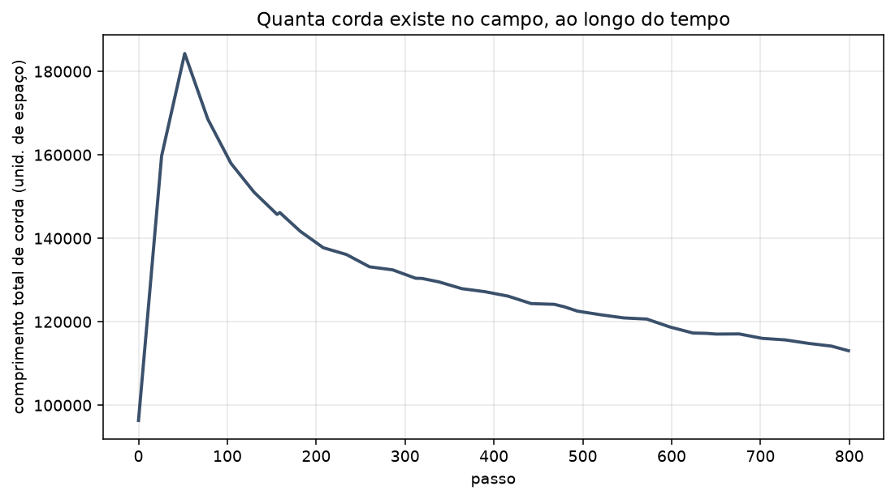

[Lab](../../../docs/pt-BR/README.md) · [English](README.md) · **Português**

[Geometria](../README.pt-BR.md) · [Glossário](../../../docs/pt-BR/glossary.md)

# Cordas e vibração

**Como curvas extraídas do campo mudam no tempo?**

Dois scripts de análise e figuras registradas examinam cordas e vibração. “Corda” nomeia uma extração numérica neste lab; não é evidência da teoria física de cordas.

## Arquivos e condições de execução

[Índice completo dos materiais](FILES.md) · [Guia técnico](../../../docs/pt-BR/research-guide.md)

Esta página organiza registros históricos. A presença de código não garante um ambiente completo de execução. Caminhos embutidos no código foram preservados; consulte as dependências antes de adaptar uma execução.

[Dependências e entradas ausentes](../../../provenance/t-archive/dependencies.pt-BR.md)
