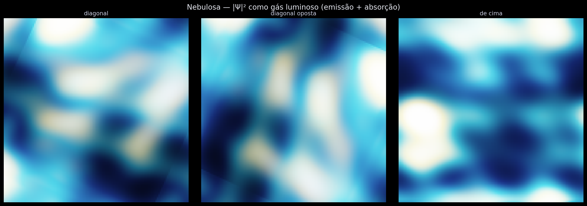

[Lab](../../../README.md) · **English** · [Português](README.pt-BR.md)

[Geometry](../README.md) · [Glossary](../../../docs/en/glossary.md) · [Project rules](../../../docs/en/project-rules.md)

# Additional visual comparisons

**What do these additional field images show?**

Visual records retained from the supplied material. Their exact generating run has not been established; compare the captions and provenance before connecting them to a numerical claim.

## Files and execution context

[Complete material index](FILES.md) · [Research guide](../../../docs/en/research-guide.md)

The files retain their recorded implementation and conditions. Read the [implementation audit](../../../docs/maintenance/author-rules-audit.md) for documented differences and the dependency record below before preparing a new execution.

[Dependencies and missing inputs](../../../provenance/t-archive/dependencies.md)
