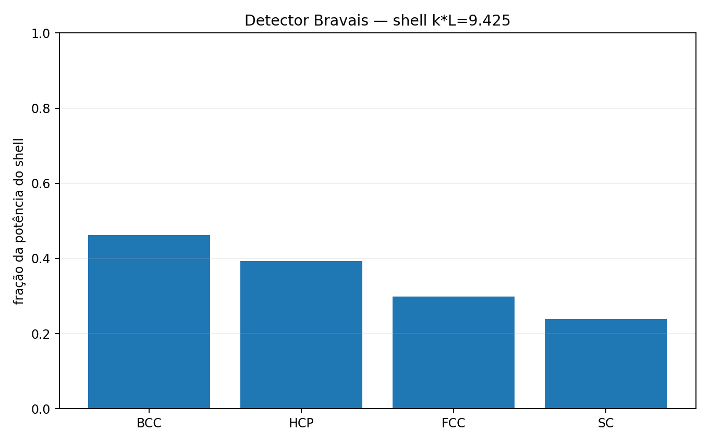

[Lab](../../../README.md) · **English** · [Português](README.pt-BR.md)

[Memory](../README.md) · [Glossary](../../../docs/en/glossary.md)

# Memory at resolution 48

Reference-stage structure diagnostics; template scores are measurements, not a perfect-crystal label.

Imported historical record; this organization did not rerun the simulation.

[Read the original note](notes/original-record.md) · [Every file](FILES.md)

No dedicated runner is linked in this entry. Consult the note and complete record for historical listings and dependencies.

## Available material

4 files associated with this entry: 2 `.csv`, 1 `.md`, 1 `.png`.

[Timeline](../../../docs/en/topics/timeline.md) · [← 16](../memory-grid-40/README.md) · [18 →](../../geometry/visual-atlas/README.md)

## Files and execution context

[Complete material index](FILES.md) · [Research guide](../../../docs/en/research-guide.md)

This page organizes historical records. Code availability does not guarantee a complete execution environment. Paths embedded in source code were preserved; check dependencies before adapting a run.

[Dependencies and missing inputs](../../../provenance/t-archive/dependencies.md)
