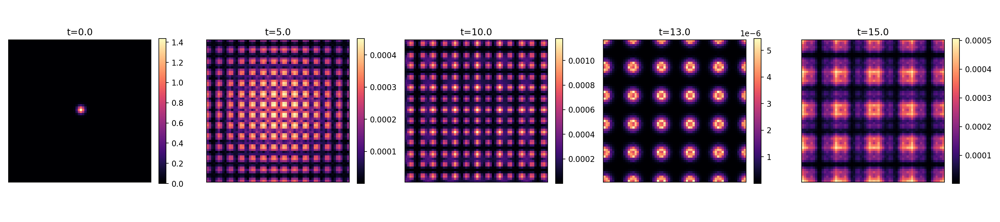

[Lab](../../../README.md) · **English** · [Português](README.pt-BR.md)

[Memory](../README.md) · [Glossary](../../../docs/en/glossary.md) · [Project rules](../../../docs/en/project-rules.md)

# Passive memory dynamics

**How does memory participate in continuing spatial reorganization?**

The report describes dynamic crystallization through recurring shifts of scale. The recorded norm remains near one. Its twin-trajectory estimate covers only the recorded short interval.

- [passive-memory-report.md](notes/passive-memory-report.md)

## Files and execution context

[Complete material index](FILES.md) · [Research guide](../../../docs/en/research-guide.md)

The files retain their recorded implementation and conditions. Read the [implementation audit](../../../docs/maintenance/author-rules-audit.md) for documented differences and the dependency record below before preparing a new execution.

[Dependencies and missing inputs](../../../provenance/t-archive/dependencies.md)

[Context and diagnostics](../../../docs/en/topics/passive-r5.md)

## Implementation notes

The preserved runner and configuration set `alpha=0`, `Gamma=0`, `f_FDT=0` and use two memory fields. The update loop has no stochastic increment. Read its recorded dynamic crystallization within those actual conditions; this file is not an implementation with every term active. [Source, line 23](code/simulate_passive_memory.py).

[Full static audit and source references](../../../docs/maintenance/author-rules-audit.md).
