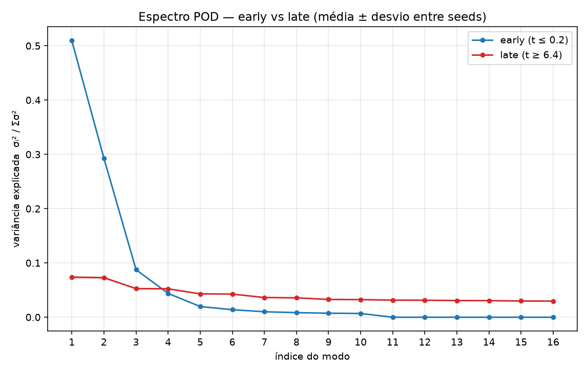

[Lab](../../../docs/pt-BR/README.md) · [English](README.md) · **Português**

[Diagnósticos do campo](../README.pt-BR.md) · [Glossário](../../../docs/pt-BR/glossary.md)

# Modos e subespaços do campo

POD/PCA e DMD examinam janelas iniciais e tardias em quatro seeds. O registro não estabelece um atrator compartilhado de baixa dimensão.

Leia a sequência: protocolo → configuração → dados brutos → análise. As classificações abaixo pertencem ao registro histórico; não houve nova execução.

- [protocol.md](notes/protocol.md)
- [mode-analysis-record.md](notes/mode-analysis-record.md)
- [analysis.md](notes/analysis.md)
- [config.json](configuration/config.json)
- [result.json](results/data/result.json)

[Todos os arquivos](FILES.md) · [Dependências](../../../provenance/t-archive/dependencies.pt-BR.md)

## Arquivos e condições de execução

[Índice completo dos materiais](FILES.md) · [Guia técnico](../../../docs/pt-BR/research-guide.md)

Esta página organiza registros históricos. A presença de código não garante um ambiente completo de execução. Caminhos embutidos no código foram preservados; consulte as dependências antes de adaptar uma execução.

[Dependências e entradas ausentes](../../../provenance/t-archive/dependencies.pt-BR.md)
