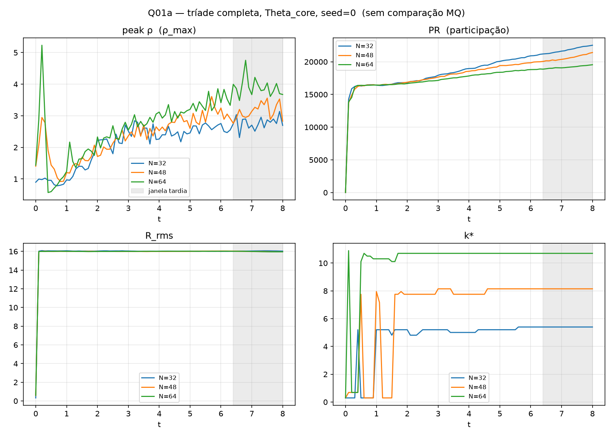

[Lab](../../../docs/pt-BR/README.md) · [English](README.md) · **Português**

[Diagnósticos do campo](../README.pt-BR.md) · [Glossário](../../../docs/pt-BR/glossary.md) · [Regras do projeto](../../../docs/pt-BR/project-rules.md)

# Convergência espacial

N32/N48/N64 com passo temporal fixo. A decisão de convergência registrada é INCONCLUSIVE.

Leia a sequência: protocolo → configuração → dados brutos → análise. As classificações abaixo pertencem ao registro histórico; não houve nova execução.

- [protocol.md](notes/protocol.md)
- [convergence-record.md](notes/convergence-record.md)
- [analysis.md](notes/analysis.md)
- [config.json](configuration/config.json)
- [result.json](results/data/result.json)
- [seeds.txt](../resolution-and-time-step/configuration/seeds.txt)

[Todos os arquivos](FILES.md) · [Dependências](../../../provenance/t-archive/dependencies.pt-BR.md)

## Arquivos e condições de execução

[Índice completo dos materiais](FILES.md) · [Guia técnico](../../../docs/pt-BR/research-guide.md)

Os arquivos mantêm a implementação e as condições registradas. Consulte a [auditoria das implementações](../../../docs/maintenance/author-rules-audit.md#português) para as diferenças documentadas e o registro de dependências abaixo antes de preparar uma nova execução.

[Dependências e entradas ausentes](../../../provenance/t-archive/dependencies.pt-BR.md)

## Notas da implementação

O runner inspecionado mantém coeficientes instantâneo, fracionário, de memória e de banho não nulos, com três taxas de memória e `V_ext=0`. O veredito numérico registrado continua ligado à grade, ao passo temporal e ao diagnóstico declarados. Esta é uma inspeção estática, não uma nova execução. [Fonte, linha 34](code/measure_spatial_convergence.py).

[Auditoria estática completa e referências das fontes](../../../docs/maintenance/author-rules-audit.md).
