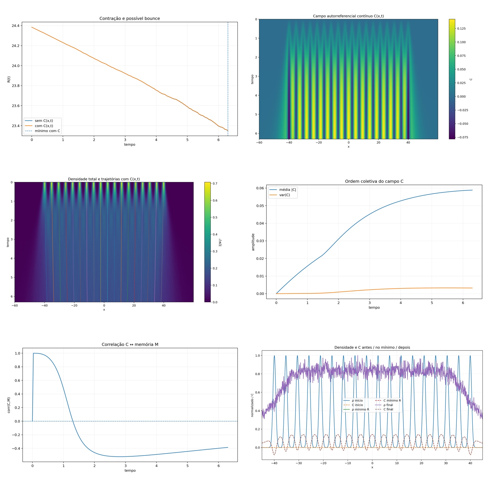

# triad_field_consciousness_test

Baseline vs continuous_C. Acompanha campo C e correlação C–[Memória](../../../../docs/reference/concepts/memory.md). [Observador e campo C](../../../../docs/reference/concepts/observer-and-c-field.md). Sem bounce.

## Objetivo

Campo C contínuo; `bounce_amplitude` e C_memory_corr.

## Resultado preservado

`bounce_amplitude=0` nos dois. R0=24.3841991188283. t_Rmin=6.3.

| run | Rmin | Rfinal | bounce_amplitude | C_final_mean_abs | C_final_var | C_memory_corr_final |
|---|---|---|---|---|---|---|
| baseline | 23.350001386552602 | 23.350001386552602 | 0 | 0 | 0 | 0 |
| continuous_C | 23.35152445562933 | 23.35152445562933 | 0 | 0.05885646675539304 | 0.0032211309978780103 | −0.3855089487747705 |

CSV: [Artefatos/triad_field_consciousness_test/summary.csv](../results/data/summary.csv)

## Arquivos

`00_montagem.png` · `01_bounce_compare.png` · `02_C_spacetime.png` · `03_density_centers.png` · `04_C_order.png` · `05_C_memory_corr.png` · `06_snapshots.png` · `summary.csv`

→ [08 triad_observer_observed_consciousness](../../observer-and-observed/notes/original-record.md) · [Bounce](../../../../docs/reference/concepts/bounce.md) · [Índice de runs](../../../../docs/reference/records/indice-de-runs.md)
