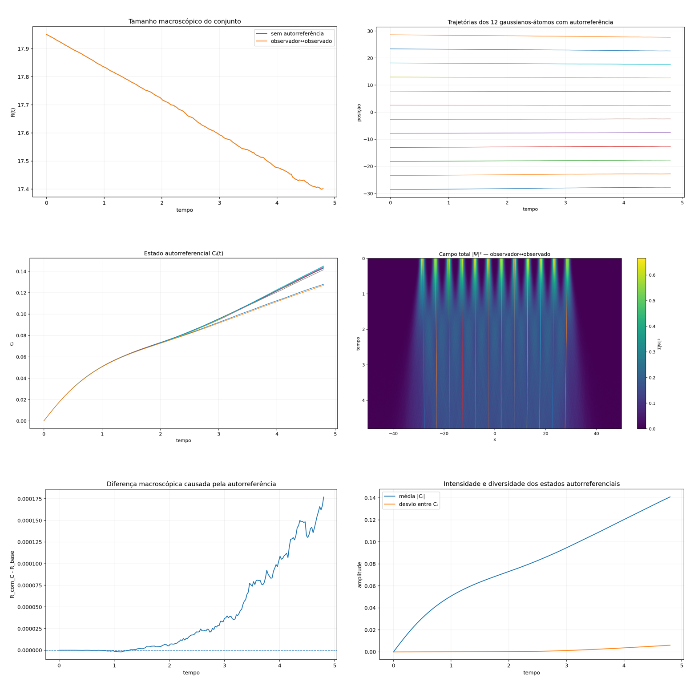

[Lab](../../../README.md) · **English** · [Português](README.pt-BR.md)

[Relations](../README.md) · [Glossary](../../../docs/en/glossary.md) · [Project rules](../../../docs/en/project-rules.md)

# Observer relations in a field

An operational C measure is explored through observer/observed relations.

Imported historical record; this organization did not rerun the simulation.

[Read the original note](notes/original-record.md) · [Every file](FILES.md)

No dedicated runner is linked in this entry. Consult the note and complete record for historical listings and dependencies.

## Available material

9 files associated with this entry: 1 `.csv`, 1 `.md`, 7 `.png`.

[Timeline](../../../docs/en/topics/timeline.md) · [← 07](../../signals/fast-limit-sweep/README.md) · [09 →](../continuous-relational-field/README.md)

## Files and execution context

[Complete material index](FILES.md) · [Research guide](../../../docs/en/research-guide.md)

The files retain their recorded implementation and conditions. Read the [implementation audit](../../../docs/maintenance/author-rules-audit.md) for documented differences and the dependency record below before preparing a new execution.

[Dependencies and missing inputs](../../../provenance/t-archive/dependencies.md)
