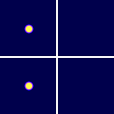

[Lab](../../../README.md) · **English** · [Português](README.pt-BR.md)

[Structures](../README.md) · [Glossary](../../../docs/en/glossary.md)

# Density–memory maps

Snapshots connect density, memory, residual and memory potential; the reported alignment is transient.

Imported historical record; this organization did not rerun the simulation.

[Read the original note](notes/original-record.md) · [Every file](FILES.md)

[Preserved runner](code/simulate_density_memory_maps.py) · [Dependencies and portability](../../../provenance/t-archive/dependencies.md)

## Available material

43 files associated with this entry: 1 `.csv`, 1 `.json`, 1 `.md`, 40 `.png`.

[Timeline](../../../docs/en/topics/timeline.md) · [← 38](../two-pockets/README.md)

## Files and execution context

[Complete material index](FILES.md) · [Research guide](../../../docs/en/research-guide.md)

This page organizes historical records. Code availability does not guarantee a complete execution environment. Paths embedded in source code were preserved; check dependencies before adapting a run.

[Dependencies and missing inputs](../../../provenance/t-archive/dependencies.md)
