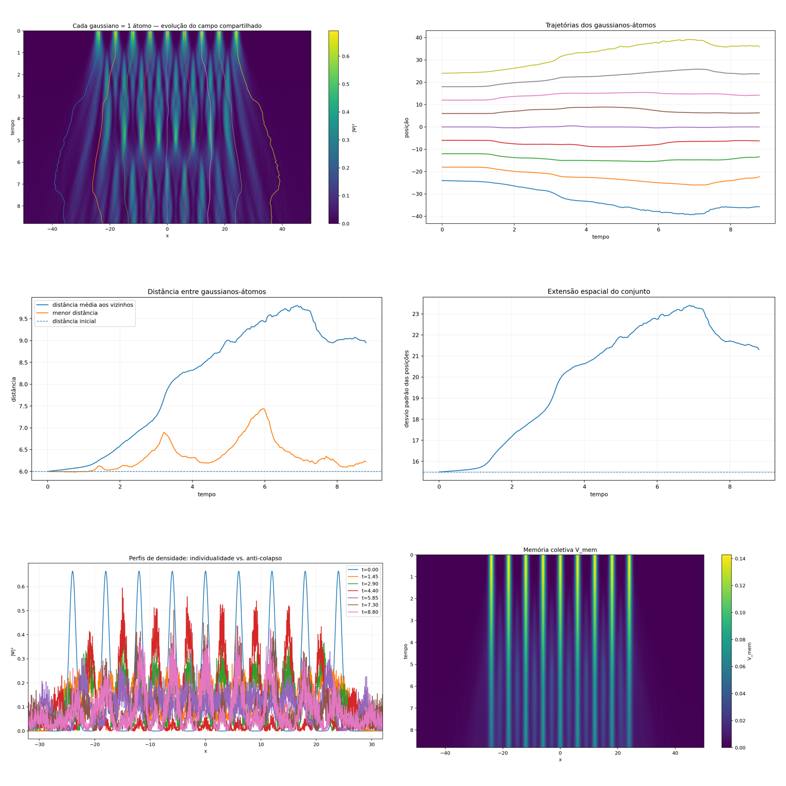

# triad_atoms_gaussians

Cada gaussiana tratada como átomo candidato: trajetórias, espaçamento, espalhamento da nuvem, densidade, memória.

## Objetivo

Ler a nuvem multi-gaussiana como conjunto de “átomos”.

## Resultado preservado

Saída visual de nuvem em evolução. Esta versão **antecede** a correção de manter identidades explicitamente separadas — ver [05 triad_atoms_individual_fields](../../individual-fields/notes/original-record.md). Sem CSV.

## Arquivos

`00_montagem.png` · `01_atoms_spacetime.png` · `02_atom_trajectories.png` · `03_neighbor_spacing.png` · `04_cloud_spread.png` · `05_density_snapshots.png` · `06_memory_spacetime.png`

→ [Índice de runs](../../../../docs/reference/records/indice-de-runs.md) · [Memória](../../../../docs/reference/concepts/memory.md)
