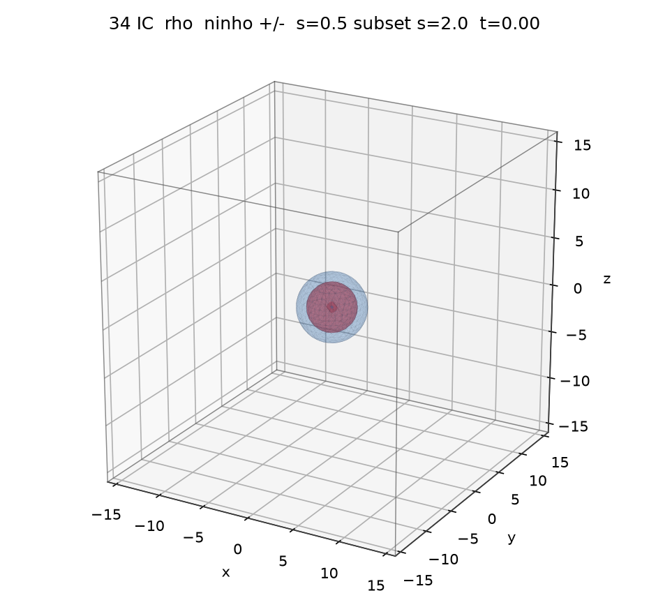
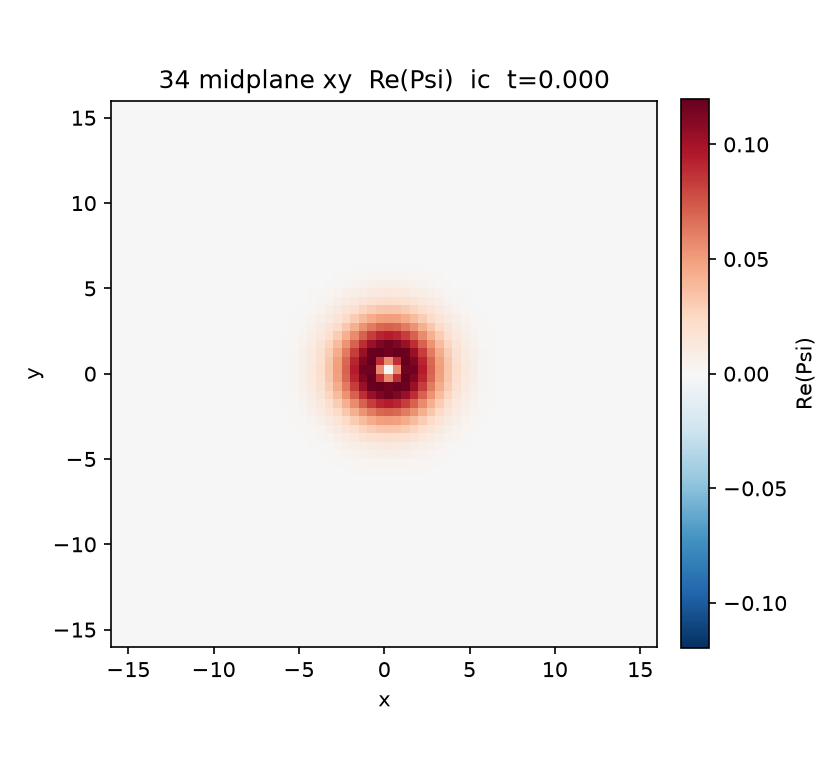
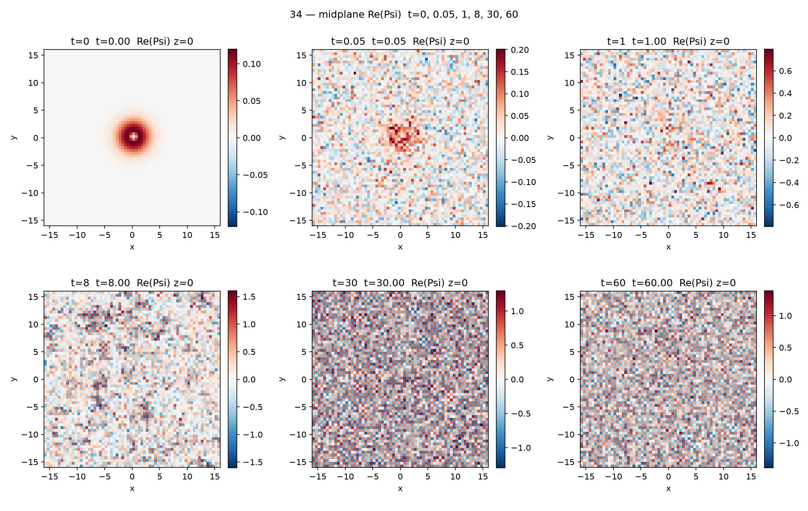
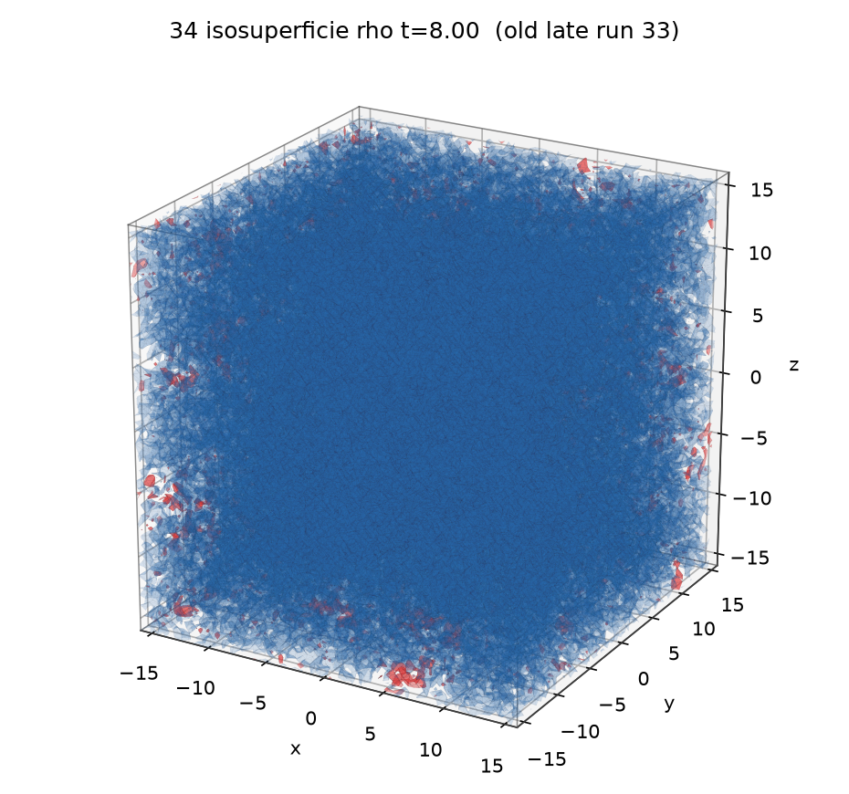
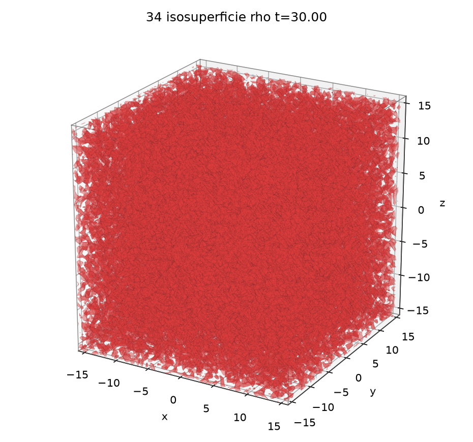
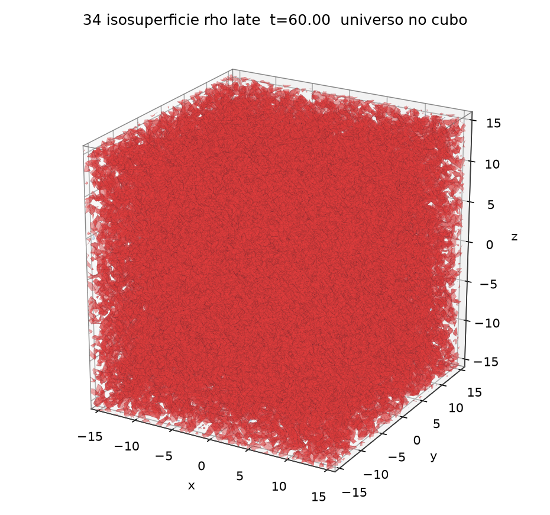
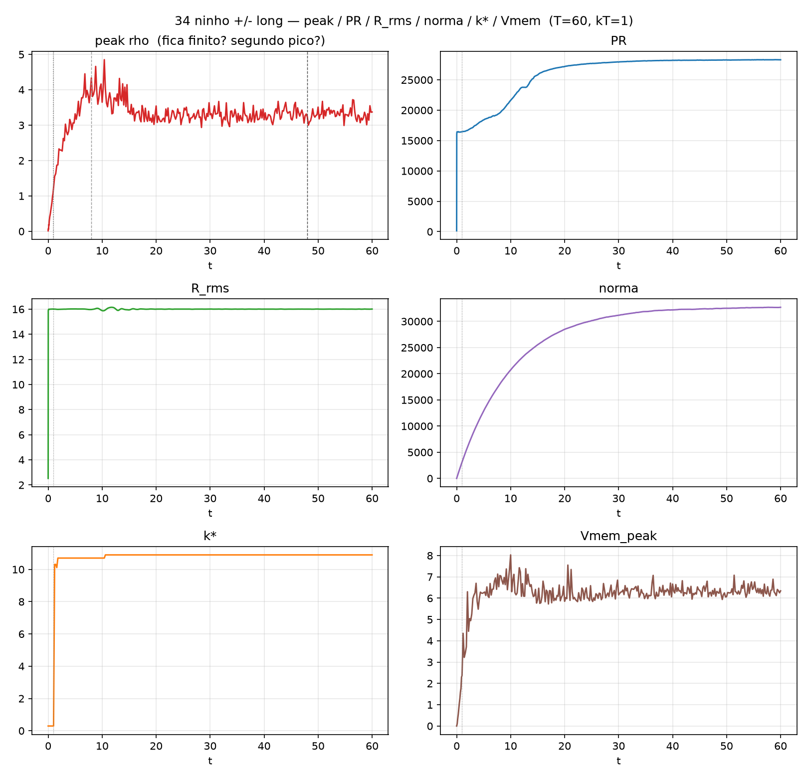
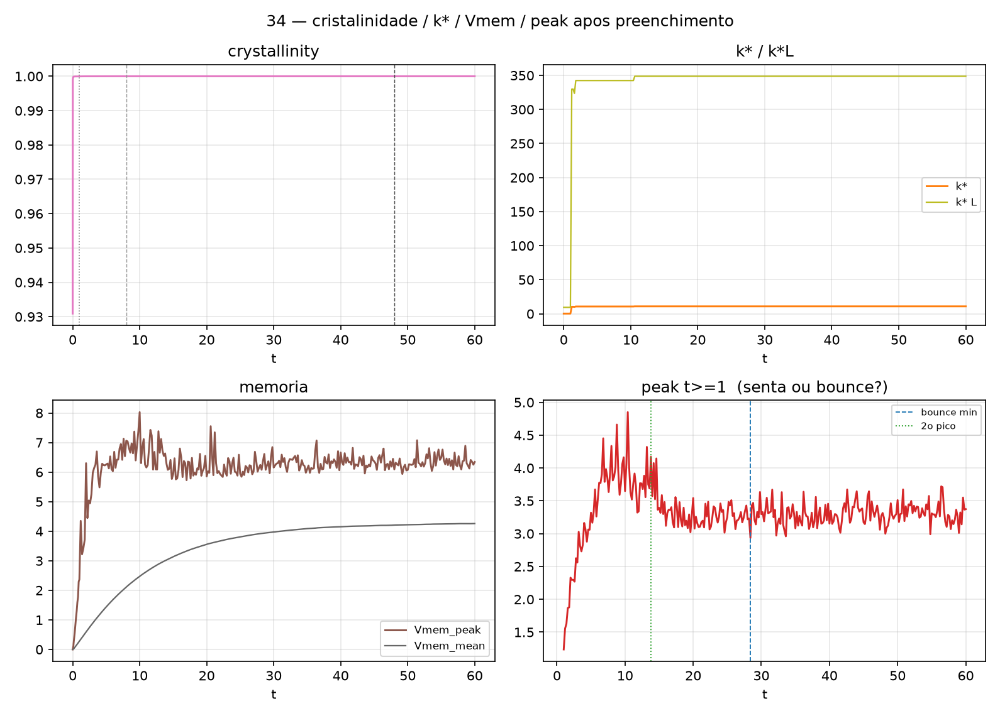

# ninho_pm_long

Mesma IC de [33 ninho_pm](../../concentric-positive-negative-nest/notes/original-record.md), **T=60** (não T=8). Equação TRIAD **completa**, Theta_core congelado (Q00 / [TRIAD_QM_CANONICAL_V1](../../../../docs/reference/records/triad-qm-canonical-v1.md)). **I0 / environment**, não scan. Pergunta: **depois que a caixa enche, acontece mais alguma coisa** (estrutura, rebirth de par, queda de pico, bounce, cristalinidade) **ou o cubo só senta como universo preenchido?** Volume preenchido = universo, não ruído. Sem isolar memória/FDT. Sem mudar Theta_core. Sem retocar kT. Não é prova de nada. [Leitura operacional](../../../../docs/reference/concepts/operational-readings.md) · [Anti-colapso](../../../../docs/reference/concepts/anti-collapse.md) · [Universo como simulação](../../../../docs/reference/concepts/universe-as-simulation.md)

Solver: Strang 3D standalone (cópia de [Fontes/run_ninho_pm.py](../../concentric-positive-negative-nest/code/simulate_signed_gaussian_nest.py) com `--T`). fp64, numpy. $V_{\mathrm{ext}}=0$, $y_j(0)=0$, caixa periódica $[-L/2,L/2)^3$. Seed=0.

## IC — ninho +/− concêntrico (idêntica ao run 33)

$\Psi = G_{\mathrm{out}}(s=2.0)_{(0,0,0)}^{\mathrm{fase}\,0} - G_{\mathrm{in}}(s=0.5)_{(0,0,0)}^{\mathrm{fase}\,\pi\,(=\,\times-1)}$, amplitudes cruas iguais, depois $\int|\Psi|^2\,dV=1$. Pico IC=0.014580, PR=141.559784, R_rms=2.522489. two_scale=sim (hollow), sign_nest=sim (hole_core). Até t=8 os números batem com [33 ninho_pm](../../concentric-positive-negative-nest/notes/original-record.md) (mesmo seed, mesmo passo).

## Parâmetros (Theta_core, intocado)

$\Lambda=-10$, $\alpha=0.15$, $\sigma=1.5$, $\Gamma=0.05$, $\nu=(10, 0.5, 0.05)$, $\lambda=(3, 1, 0.3)$, `fdt_couple=True`, **kT=1.0**. $L=32$, $N=64$, $dt=0.0025$, **$T=60$**, seed=0. $f_{\mathrm{FDT}}=0.0125$, noise_amp $=0.015811388300841896$. Memória Euler ($\max\nu\cdot dt=0.025$). Amostras: $\Delta t=0.01$ até $t=0.2$; $\Delta t=0.1$ até $t=1$; $\Delta t=0.2$ depois.

Não substitui [33 ninho_pm](../../concentric-positive-negative-nest/notes/original-record.md) · [32 universo_atomo](../../atom-inside-a-larger-gaussian/notes/original-record.md) · [31 nested_gaussians](../../nested-positive-gaussians/notes/original-record.md) · [30 dois_atomos_gravidade](../../two-atoms/notes/original-record.md).

## Resultado

Wall: **352.929 s** (~5 min 53 s de integração; 13:22:44–13:28:37 BRT, 21/08/2026; elapsed relógio 408 s com figuras). 24000 passos, 324 amostras. Sem NaN, sem blowup.

| | t=0 IC | t=0.05 | t=1 | t=8 (old late) | t=10.4 (peak_max) | t=30 | t=60 |
|---|---|---|---|---|---|---|---|
| two_scale | sim | não | não | não | não | não | não |
| sign_nest | sim | sim | sim (flicker) | não | não | não | não |
| norm | 1.000000 | 164.174 | 3122.825 | 18021.708 | 21218.437 | 31161.943 | 32692.307 |
| peak | 0.014580 | 0.057509 | 1.236586 | 4.336503 | 4.851441 | 3.296211 | 3.372458 |
| PR | 141.560 | 16357.118 | 16439.666 | 19557.412 | 22025.745 | 27930.540 | 28301.592 |
| R_rms | 2.522489 | 15.948986 | 16.005861 | 15.972489 | 15.888109 | 16.009073 | 16.008873 |
| k* | 0.2945 | 0.2945 | 0.2945 | 10.701 | 10.701 | 10.897 | 10.897 |
| Vmem_peak | 0 | 0.059 | 2.369 | 7.063 | 6.844 | 6.154 | 6.343 |
| crystallinity | 0.9309 | 0.9996 | 1.0000 | 1.0000 | 1.0000 | 1.0000 | 1.0000 |

Pico de densidade máximo=**4.851441** em t=10.4. Vmem_peak máximo=8.029760 em t=10.0. células½ final=13494 (caixa cheia, não 1–2 células). t=8 bate o final do run 33 (peak 4.336503, PR 19557.412, norm 18021.708).

### Late (t≥48) vs mid/old-late (t=8–12)

| | mid t=8–12 (n=21) | late t≥48 (n=61) | late/mid |
|---|---|---|---|
| peak | 3.905658 ± 0.373822 | 3.313377 ± 0.155390 | 0.848 |
| PR | 21616.833 ± 1293.569 | 28287.696 ± 19.255 | 1.309 |
| R_rms | 16.019862 ± 0.085908 | 16.003990 ± 0.003353 | ~1 |
| norm | 20643.162 ± 1495.061 | 32590.796 ± 71.671 | 1.579 |
| k* | 10.775850 ± 0.095351 | 10.897400 ± 0 | ~1.01 |
| Vmem_peak | 6.842501 ± 0.486759 | 6.339797 ± 0.216610 | 0.927 |
| crystallinity | 0.99999476 ± 1.64e-6 | 0.99999675 ± 1.07e-6 | Δ = +2.0e-6 |

Late é mais *parado* que mid: PR e R_rms com std minúsculo; norm quase plana (std/mean ~0.2%). Mid ainda estava subindo (banho enchendo).

## Depois de t=1 — o que acontece, o que não

A caixa **já é universo preenchido em t=0.01** (R_rms 2.52→15.77), igual ao run 33. two_scale morre em t=0.05; sign_nest operacional cai em t=0.09 e **pisca pela última vez em t=1.0**. Depois:

- **Estrutura / ninho / par: não volta.** two_rebirth=não (0 recordes two_scale após t=1). sign_rebirth=não (último sign_nest = t=1.0). Contrastes im/mf/oi ficam ~1. Não há rebirth de par +/−.
- **Colapso após o preenchimento: não.** R_rms fica trancado em $\approx L/2=16$. Peak não dispara; células½ final=13494.
- **Cristalinidade: não muda.** Já ~1 desde t~0.05; late−mid = $+2\times10^{-6}$.
- **k*: salta** de 0.29 (escala do ninho) para ~10.7 em t=8 e **trava** em 10.897 no late.
- **Peak: sobe até t=10.4 (4.851) e depois assenta ~3.3.** Não há segundo colapso. Os “máximos” depois de t=10.4 (4.17, 3.56, 3.49, … 3.72) são **oscilação de caixa cheia**, amplitude ~0.3–0.5 em torno do platô, não uma estrutura nova.
- **“Bounce” automático=sim, mas não é bounce.** O detector viu queda 4.85→~2.9 depois do máximo global e uma subida residual 0.44 até t=60. Isso é relaxação + ruído de banho num cubo preenchido, não um bounce de raios de massa (R_rms não cai e não volta).
- **Norma e PR continuam crescendo até ~t=48 e então sentam.** norm 3123 (t=1) → 18022 (t=8) → 31162 (t=30) → 32470 (t=48) → 32692 (t=60). O banho FDT ainda injeta massa depois do “universo visual”; no último 20% isso **saturá**.

**De t=1 a t=60 o cubo é um universo preenchido.** Não reaparece ninho, não reaparece par, não cristaliza de outro jeito, não explode, não colapsa. O que ainda mexe é o banho: norma/PR sobem e saturam, peak relaxa de ~4.9 para um platô ~3.3 com wiggle. **Se a pergunta é “acontece mais alguma coisa estrutural depois que a caixa enche?” — não. Senta como universo preenchido.** Isso é o resultado. kT não foi retocado.

## O que os números sustentam

**(a) duas escalas / oco — INCONCLUSIVE (igual 33).** two_scale só até t=0.04. Não volta em T=60.

**(b) ninho de sinal +/− — INCONCLUSIVE como ímã; morto depois de t=1.** Flicker operacional até t=1.0 sobre cubo já preenchido. **Nenhum rebirth em t∈(1, 60].** Não é evidência a favor nem contra de ímã-repele: o ninho não durou, e não nasceu de novo.

**(c) pico finito — SUPPORTED (neste run).** peak_max=4.851441, sempre finito até T=60. Anti-colapso operacional: a singularidade **não** foi a infinito. Late ~3.31 em 13494 células, não artefato de 1–2 células.

**(d) “acontece mais alguma coisa depois de encher?” — neste run, não (estrutura).** Universo preenchido de t=0.01 até t=60. Deriva lenta de norma/PR até saturar ~t=48; peak relaxa depois de t=10.4. Sem segundo colapso, sem bounce de raios, sem rebirth, sem mudança de cristalinidade.

Nunca “provou gravidade”. Nunca “provou ímã”. Nunca “provou bounce”. Theta_core intocado. kT=1.0 intocado.

## CSVs

- [Artefatos/triad_ninho_pm_long/summary.csv](../results/data/summary.csv)
- [Artefatos/triad_ninho_pm_long/metrics.csv](../results/data/metrics.csv)
- [Artefatos/triad_ninho_pm_long/radial_profiles.csv](../results/data/radial_profiles.csv)
- [Artefatos/triad_ninho_pm_long/linecut_re.csv](../results/data/linecut_re.csv)
- [Artefatos/triad_ninho_pm_long/summary.json](../results/data/summary.json)

## Arquivos

`00_montagem.png` · `01_ic_isosurface.png` · `01e_ic_re_isosurface.png` · isos ρ `01b`/`01c`/`01d`/`01i` t=0.05 / `01j` t=1 / `01k` t=8 / `01l` t=30 / `03` t=60 · isos Re `01f`/`01g`/`01h`/`01m`–`01p` · `04x_midplane_watch.png` + `04y_midplane_re_watch.png` (t=0, 0.05, 1, 8, 30, 60) · midplanes |Ψ|² e Re · `05_observables.png` · `05b_after_fill.png` · `06_radial_profiles.png` · `07_early_zoom.png` · `08_two_scale.png` · metrics.csv · summary.json · `rho_{ic,t001,t002,early,mid,late}.npy` · `re_{ic,t001,t002,early,mid,late}.npy`

Script: [Fontes/run_ninho_pm_long.py](../code/simulate_long_gaussian_nest.py) (`--T` default 60)

→ [Índice de runs](../../../../docs/reference/records/indice-de-runs.md) · `[[TRIAD]]` · [Leitura operacional](../../../../docs/reference/concepts/operational-readings.md)
