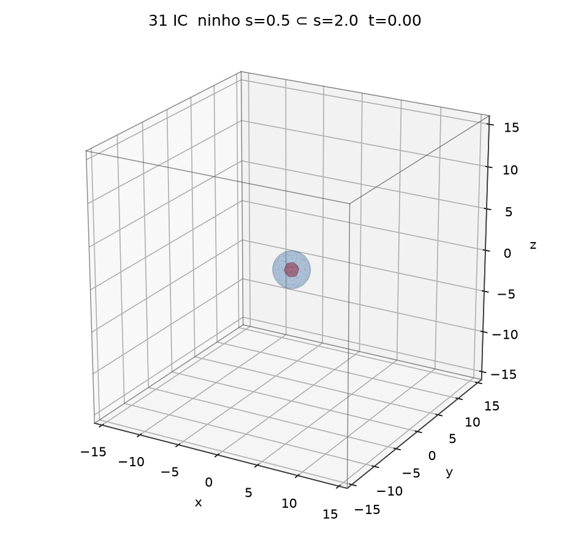
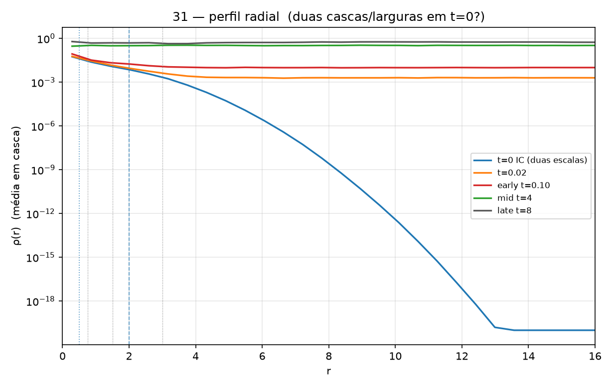
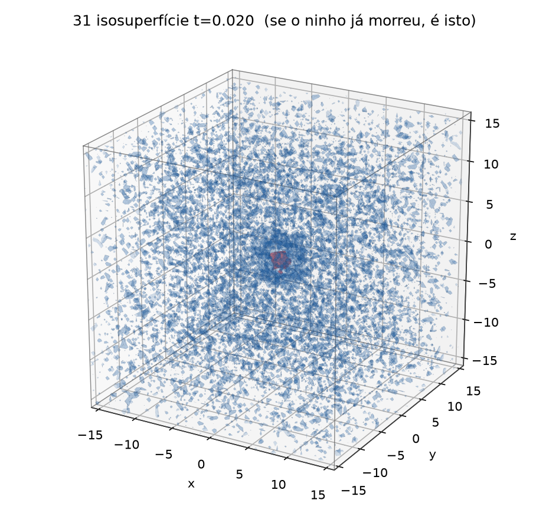
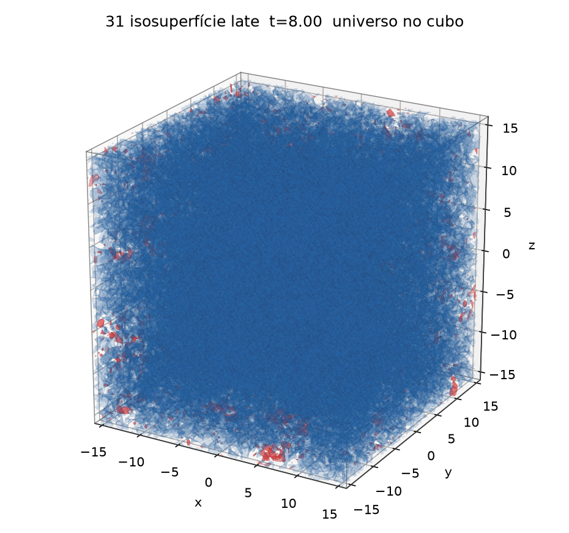
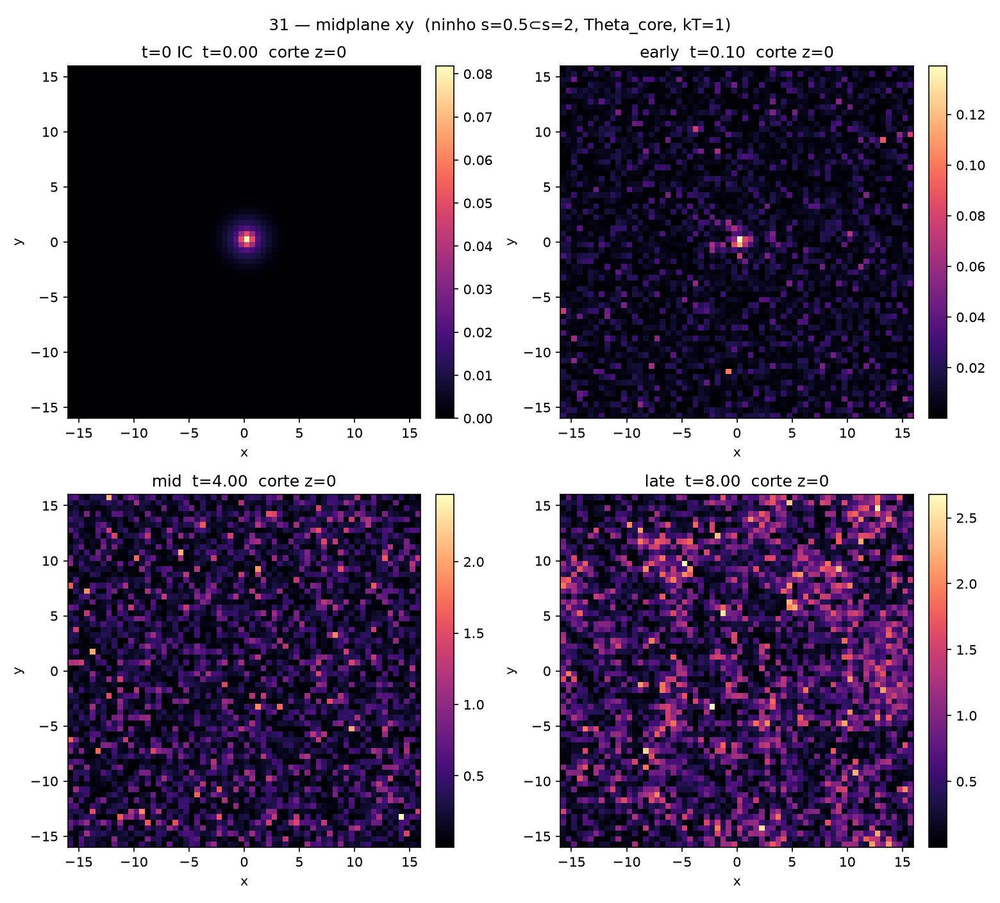
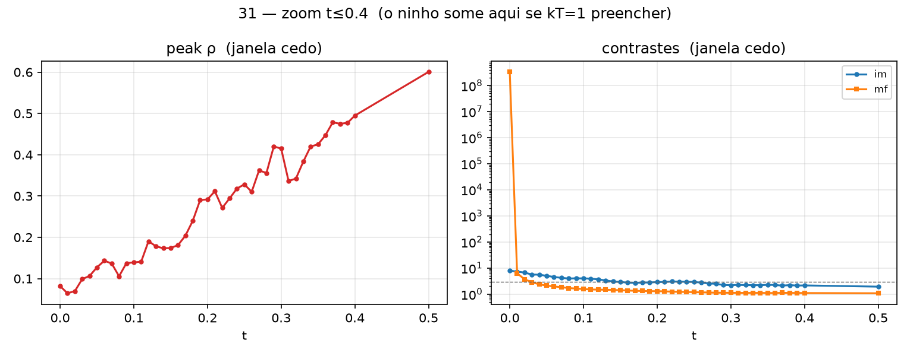
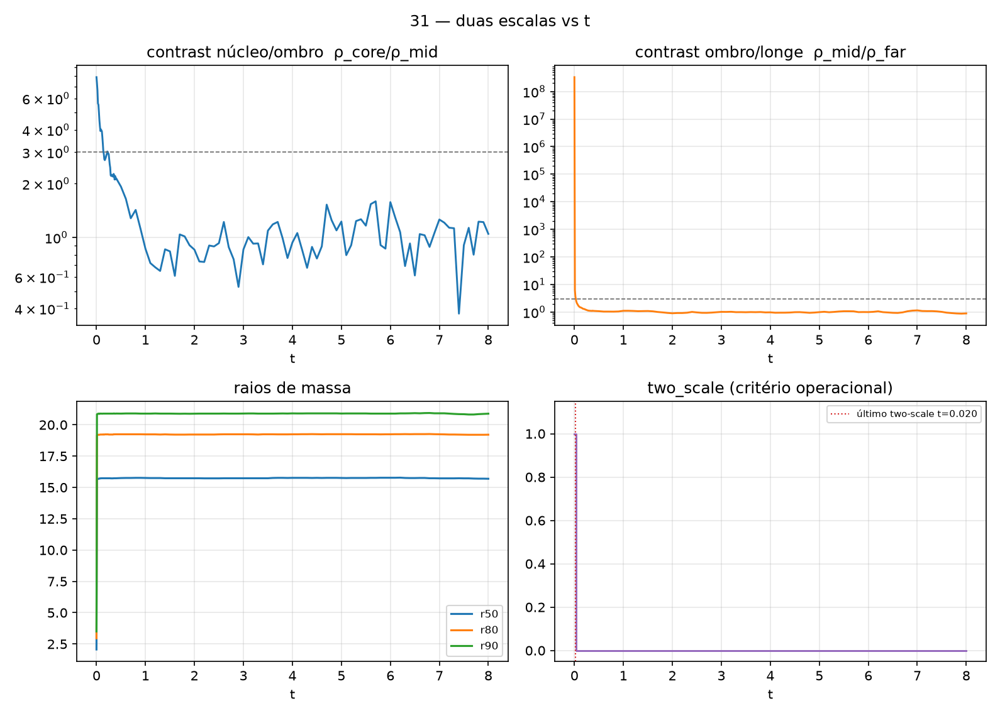

# nested_gaussians

Equação TRIAD **completa**, Theta_core congelado (Q00 / [TRIAD_QM_CANONICAL_V1](../../../../docs/reference/records/triad-qm-canonical-v1.md)). **I0 / environment**, não scan. 1 gaussiana = 1 átomo. **Duas sementes concêntricas**, uma dentro da outra (mesmo centro, larguras diferentes). Leitura: perfil radial de duas escalas (ninho) e pico finito (singularidade que não vai a infinito). Colapso/sobreposição do ninho **pode** ser lido como gravidade / singularidade finita — números, não prova. Volume preenchido = universo, não ruído. Sem isolar memória/FDT. Sem mudar Theta_core. Sem retocar kT. [Leitura operacional](../../../../docs/reference/concepts/operational-readings.md) · [Anti-colapso](../../../../docs/reference/concepts/anti-collapse.md) · [Universo como simulação](../../../../docs/reference/concepts/universe-as-simulation.md)

Solver: Strang 3D standalone (mesmo passo de [Fontes/run_q01a.py](../../../quantum/spatial-convergence/code/measure_spatial_convergence.py) / [30 dois_atomos_gravidade](../../two-atoms/notes/original-record.md)). fp64, numpy. $V_{\mathrm{ext}}=0$, $y_j(0)=0$, caixa periódica $[-L/2,L/2)^3$.

## IC — ninho (I0, decidido uma vez)

$\Psi = G(s_{\mathrm{in}}=0.5)+G(s_{\mathrm{out}}=2.0)$ no origem, fases 0, amplitudes cruas iguais, depois $\int|\Psi|^2\,dV=1$. Pico IC=0.081903, PR=87.079210, R_rms=2.351612, r50=2.061553, r90=3.500000, contrast_im=7.888756, contrast_mf=$3.320\times10^{8}$, two_scale=sim.

O gráfico de dinheiro é o perfil radial: em t=0 há núcleo estreito ($s=0.5$) sobre ombro largo ($s=2$). Isosuperfície em dois níveis (interno 0.35·peak, externo 0.08·peak), mesma câmera.

## Parâmetros (Theta_core, intocado)

$\Lambda=-10$, $\alpha=0.15$, $\sigma=1.5$, $\Gamma=0.05$, $\nu=(10, 0.5, 0.05)$, $\lambda=(3, 1, 0.3)$, `fdt_couple=True`, **kT=1.0**. $L=32$, $N=64$, $dt=0.0025$, $T=8$, seed=0. $f_{\mathrm{FDT}}=0.0125$, noise_amp $=0.015811388300841896=\sqrt{2\Gamma\,kT\,dt}$. Memória Euler ($\max\nu\cdot dt=0.025$).

Não substitui [27 triad_chaos_eq](../../twelve-atoms-full-field/notes/original-record.md) · [28 triad_atoms_3d](../../3d-atom-trajectories/notes/original-record.md) · [29 triad_R5_A2](../../../memory/memory-small-amplitude/notes/original-record.md) · [30 dois_atomos_gravidade](../../two-atoms/notes/original-record.md) · Q01a.

## Resultado

Wall: **46.963 s** (12:26:12–12:26:59 BRT, 21/08/2026). 3200 passos, 117 amostras (cedo $\Delta t=0.01$ até $t=0.4$; depois $\Delta t=0.1$).

| | t=0 IC | t=0.01 | t=0.02 (último two-scale) | t=0.03 (perdido) | t=0.1 | mid t=4 | final t=8 |
|---|---|---|---|---|---|---|---|
| two_scale | sim | sim | sim | não | não | não | não |
| contrast_im | 7.888756 | 7.290466 | 6.666965 | 5.622690 | 3.976920 | — | 1.047596 |
| contrast_mf | 3.320e8 | 6.276988 | 3.713929 | 2.831417 | 1.559350 | — | 0.890643 |
| norm | 1.0 | 33.677667 | 66.244680 | 99.050524 | 327.1027 | — | 18022.360425 |
| peak | 0.081903 | 0.064509 | 0.069685 | 0.098875 | 0.139253 | 3.156925 | 4.370383 |
| PR | 87.079210 | 14125.834 | 15677.186 | 16103.522 | 16387.59 | — | 19556.518659 |
| R_rms | 2.351612 | 15.764078 | 15.876406 | 15.914823 | 15.98481 | — | 15.974160 |
| r50 | 2.061553 | 15.580436 | 15.644488 | 15.692355 | 15.7321 | — | 15.692355 |

Pico de densidade máximo=**4.525384** em t=6.8. Vmem_peak máximo=8.048361 em t=7.1; Vmem_peak final=7.064783. Janela late ($t\ge 6.4$): peak $3.924175\pm 0.266$; PR $19189.245\pm 193$; R_rms $15.990821\pm 0.017$; norm $16769.296\pm 782$. Sem NaN, sem blowup. células½ final=1217 (não 1–2 células).

O ninho **permanece two-scale só até t=0.02**. Em t=0.01 R_rms já é $\approx L/2$ (15.76) e a norma já é 33.7 — o banho preenche o cubo no mesmo prazo do run 30. Em t=0.03 contrast_mf cai abaixo de 3 e o critério operacional morre. **Com kT=1 as duas sementes aninhadas viram universo antes de um colapso-ninho poder ser lido.** kT não foi retocado. Isso é o resultado.

Enquanto two_scale existia: $\Delta$peak $= -0.0122$, $\Delta$R_rms $= +13.525$ (expandiu, não contraiu). Sem leitura de queda.

## O que os números sustentam

**(a) duas escalas / ninho — INCONCLUSIVE.** two_scale só em $t\in\{0, 0.01, 0.02\}$. Em t=0 o perfil radial tem núcleo+ombro (é o ponto da IC). Depois o banho come o ninho: R_rms 2.35→15.76 já em t=0.01, flag morta em t=0.03. Não houve tempo para ler colapso/sobreposição como gravidade. Não é evidência a favor nem contra: o ninho não durou.

**(b) pico finito — SUPPORTED (neste run).** peak ρ máximo=4.525384, final=4.370383, sempre finito, sem blowup. Anti-colapso operacional: a singularidade **não** foi a infinito. Pico late ~3.92 em 1217 células, não artefato de 1–2 células.

Nunca “provou gravidade”. Theta_core intocado. kT=1.0 intocado.

## CSVs

- [Artefatos/triad_nested/summary.csv](../results/data/summary.csv)
- [Artefatos/triad_nested/metrics.csv](../results/data/metrics.csv)
- [Artefatos/triad_nested/radial_profiles.csv](../results/data/radial_profiles.csv)
- [Artefatos/triad_nested/summary.json](../results/data/summary.json)

## Arquivos

`00_montagem.png` · `01_ic_isosurface.png` · `01b_isosurface_early.png` · `01c_isosurface_t002.png` · `02_isosurface_mid.png` · `03_isosurface_late.png` · `04_midplane_xy.png` + midplanes individuais · `05_observables.png` · `06_radial_profiles.png` · `06b_radial_linear.png` · `07_early_zoom.png` · `08_two_scale.png` · metrics.csv · radial_profiles.csv · summary.csv · summary.json · `rho_{ic,t002,early,mid,late}.npy`

Script: [Fontes/run_nested_gaussians.py](../code/simulate_nested_gaussians.py)

→ [Índice de runs](../../../../docs/reference/records/indice-de-runs.md) · `[[TRIAD]]` · [Leitura operacional](../../../../docs/reference/concepts/operational-readings.md)
