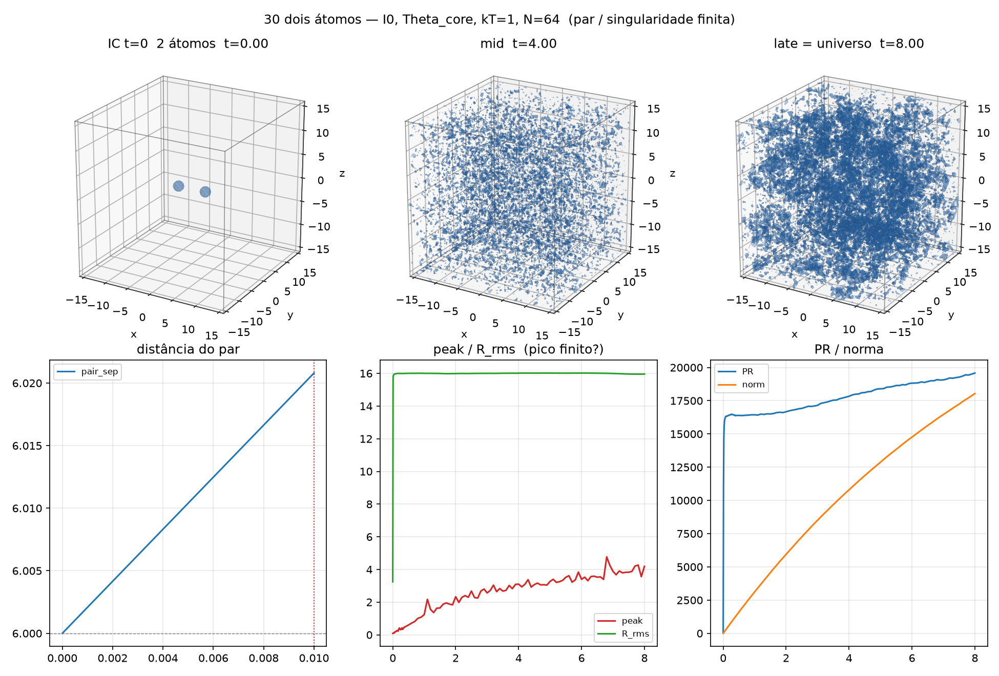

[Lab](../../../README.md) · **English** · [Português](README.pt-BR.md)

[Structures](../README.md) · [Glossary](../../../docs/en/glossary.md) · [Project rules](../../../docs/en/project-rules.md)

# Two atoms

A two-atom Theta_core setup; separate-pair detection is lost early in the recorded trajectory.

Imported historical record; this organization did not rerun the simulation.

[Read the original note](notes/original-record.md) · [Every file](FILES.md)

[Preserved runner](code/simulate_two_atoms.py) · [Dependencies and portability](../../../provenance/t-archive/dependencies.md)

## Available material

22 files associated with this entry: 2 `.csv`, 1 `.json`, 1 `.md`, 4 `.npy`, 13 `.png`, 1 `.txt`.

[Timeline](../../../docs/en/topics/timeline.md) · [← 29](../../memory/memory-small-amplitude/README.md) · [31 →](../nested-positive-gaussians/README.md)

## Files and execution context

[Complete material index](FILES.md) · [Research guide](../../../docs/en/research-guide.md)

The files retain their recorded implementation and conditions. Read the [implementation audit](../../../docs/maintenance/author-rules-audit.md) for documented differences and the dependency record below before preparing a new execution.

[Dependencies and missing inputs](../../../provenance/t-archive/dependencies.md)
