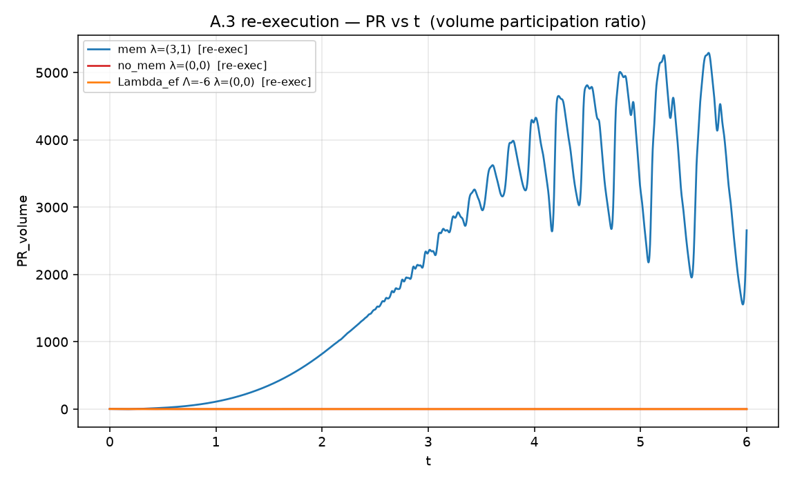

[Lab](../../../docs/pt-BR/README.md) · [English](README.md) · **Português**

[Validação](../README.pt-BR.md) · [Glossário](../../../docs/pt-BR/glossary.md)

# Dossiê de reexecução em dez partes

Dossiê registrado com refinamentos A3, QM1D, CHSH, sidebands, banho quente, histórico de tunelamento, k-star e Bravais.

Registro histórico importado; esta organização não reexecutou a simulação.

[Ler a nota original](notes/original-record.md) · [Todos os arquivos](FILES.md)

Esta ficha remete às listagens e dependências do registro histórico; não há um script de execução dedicado associado a ela.

## Material disponível

122 arquivos associados à ficha: 56 `.csv`, 20 `.json`, 23 `.md`, 22 `.png`, 1 `.txt`.

### Estudos do dossiê

- [A3](notes/memory-collapse-grid-64/analysis.md)
- [A3_N128](notes/memory-collapse-grid-128/analysis.md)
- [A3_N160](notes/memory-collapse-grid-160/analysis.md)
- [QM1D](notes/one-dimensional-quantum-tests/analysis.md)
- [CHSH](notes/bell-correlation-test/analysis.md)
- [sidebands](notes/memory-and-spectral-sidebands/analysis.md)
- [hotbath](notes/thermal-noise-and-collapse/analysis.md)
- [tunnel_hist](notes/barrier-memory-and-tunneling/analysis.md)
- [kstar](notes/dominant-spatial-scale/analysis.md)
- [bravais](notes/lattice-detector-calibration/analysis.md)

[Cronologia](../../../docs/pt-BR/topics/timeline.md) · [← 35](../../structures/finite-peak-early-window/README.pt-BR.md) · [37 →](../../structures/a-pocket-in-the-field/README.pt-BR.md)

## Arquivos e condições de execução

[Índice completo dos materiais](FILES.md) · [Guia técnico](../../../docs/pt-BR/research-guide.md)

Esta página organiza registros históricos. A presença de código não garante um ambiente completo de execução. Caminhos embutidos no código foram preservados; consulte as dependências antes de adaptar uma execução.

[Dependências e entradas ausentes](../../../provenance/t-archive/dependencies.pt-BR.md)
