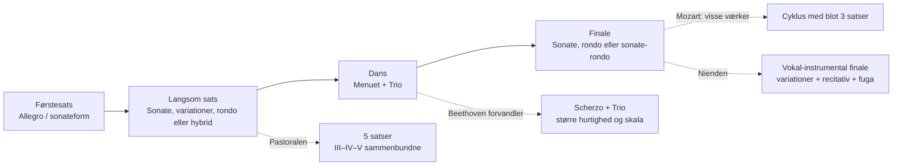
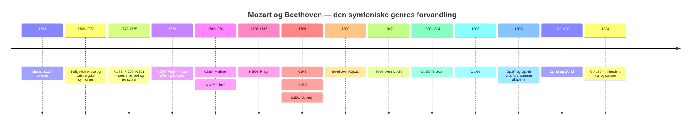
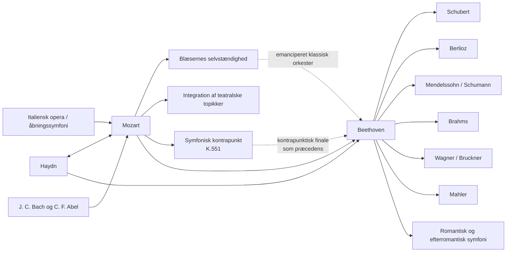

<!-- Translation of: research/sources/author-supplied/beethoven-mozart-symphonic-form.md; source commit: 304d75ed6ff646d311fd9df8b4e2db0d4dee277a -->
# Beethoven og Mozart: katalog, form, historie, reception og arv efter symfonierne

## Resumé

**Wolfgang Amadeus Mozarts** og **Ludwig van Beethovens** symfoniske baner tilhører samme historiske bue, men repræsenterer forskellige øjeblikke i symfoniens konsolidering. Mozart fulgte praktisk talt hele genrens forvandling, fra den korte italienske symfoni i tre satser og operaouverturen i 1760'erne til den store wienske koncertsymfoni i 1780'erne. Beethoven overtog fra Haydn og Mozart en allerede højt sofistikeret genre og opbyggede den på ny omkring monumental skala, dramatisk kontinuitet, intensiv motivisk bearbejdelse, ekspansive kodaer, langsigtede tonale konflikter og til sidst indførelsen af den menneskelige stemme i Nienden. Selve Mozarteumstiftelsen beskriver Mozarts udvikling fra et oprindeligt standardiseret orkester — to oboer, to horn og strygere, med trompeter/pauker ved festlige lejligheder — til en bredere wiensk sats, med fløjte, klarinetter og fagotter stadig mere selvstændige. citeturn20view2turn25search0

Der findes en grundlæggende asymmetri mellem katalogerne. **Beethoven skrev ni nummererede og autentiske symfonier**, svarende til Opp. 21, 36, 55, 60, 67, 68, 92, 93 og 125. citeturn22search1 For Mozart er "41 symfonier" en historisk konvention, ikke ækvivalenten til et moderne kritisk katalog. De gamle nr. 2 og 3 er ikke af Mozart; nr. 37 er i alt væsentligt Michael Haydns symfoni MH 334, hvortil Mozart føjede indledende materiale; desuden findes autentiske symfonier uden traditionelt nummer, symfoniske versioner af ouverturer og serenader, værker af tvivlsom autenticitet og tabte symfonier. Den nye **Köchel-Verzeichnis**, udgivet i 2024 — den første fuldstændige nyudgave siden 1964 — opdaterede dateringer, kilder og attribueringer i lyset af nyere forskning. citeturn6search0turn7view0turn13search0turn25search2

Formanalysen viser en forskel i betoning, ikke en enkel modsætning mellem "melodisk Mozart" og "motivisk Beethoven". Mozart kan arbejde med ekstraordinær motivisk økonomi — frem for alt i symfonierne nr. 40 og 41 — men tenderer mod at bygge store former gennem **pluralitet af topikker, karakterkontraster, dialog mellem instrumentfamilier, kontrapunkt og omtydning af operagestik**. Beethoven driver en minimal celles evne til at generere struktur længere: det paradigmatiske eksempel er Femmeren, hvor en rytmisk figur på fire toner gennemsyrer forskellige tematiske funktioner og indføjer sig i en global bane fra c-mol til C-dur. *Eroicaen*, Femmeren, Pastoralen og Nienden udvider selve definitionen af den symfoniske cyklus. Nyere studier insisterer imidlertid på, at den beethovenske revolution må forstås som en forvandling af paradigmer, som allerede fandtes hos Haydn og Mozart, ikke som skabelse ex nihilo. citeturn17search6turn17search10

Hos Mozart er tre store vendepunkter særligt tydelige: **symfoni nr. 25 i g-mol, K. 183**, med kontrapunktisk intensitet og exceptionelt mørk orkestrering; **"Paris", K. 297**, tænkt til en stor offentlig koncert og et orkester, som omfattede klarinetter; og sekvensen **"Haffner"–"Linz"–"Prag"–nr. 39–40–"Jupiter"**, hvor skala, blæserselvstændighed, kromatik og kontrapunktisk integration når et nyt niveau. Mozarts brev af 9. juli 1778 bekræfter både den enorme publikumssucces for "Paris" og kontroversen om dens Andante, som af direktør Joseph Legros blev anset for overdrevent modulatorisk; Mozart skrev en anden version af satsen. citeturn30view0turn31view0

Hos Beethoven danner de ni værker en særligt afslørende sekvens: Etteren leger endnu bevidst med haydnske-mozartske forventninger; Toeren udvider skala og retorik; Treeren forandrer radikalt proportioner og kodaens funktion; Fireren forfiner ambiguitet og humor; Femmeren skaber en tidligere uden sidestykke cyklisk kontinuitet; Sekseren omvandler cyklussen til fem programmatiske "scener"; Syveren gør rytmen til strukturerende princip; Otteren genbesøger ironisk 1700-talsmodeller; og Nienden forvandler symfonien til en instrumental-vokal syntese. Beethoven-Haus' historiske sider dokumenterer disse geneser, uropførelser og revisioner ud fra autografer, skitser, førstudgaver og samtidige kilder. citeturn4search0turn3search0turn4search1turn4search3turn3search2turn3search3turn5search0

Til kritiske studier er de sikreste editoriske referencer **Neue Mozart-Ausgabe (NMA), serie IV, gruppe 11**, med dens ti symfonibind og kritiske rapporter, og for Beethoven både de af **Neue Beethoven-Gesamtausgabe** afledede, af Henle udgivne partiturer og den kritiske urtekst-udgave af **Jonathan Del Mar** for Bärenreiter. citeturn10search3turn22search0turn22search1 I indspilninger vinder et sammenlignende studium ved at stille historisk informerede opførelser ved siden af den store moderne symfoniske tradition: for Mozart er Trevor Pinnock/The English Concert en fuldstændig HIP-reference; for Beethoven tilbyder John Eliot Gardiner/Orchestre Révolutionnaire et Romantique og Nikolaus Harnoncourt/Chamber Orchestra of Europe to forskellige måder at nytænke artikulation, størrelse, balance og retorik på i lyset af historisk forskning. citeturn23search1turn23search6turn23search2turn23search23

## Omfang, kilder, terminologi og attribueringsproblemer

**Katalogkriterium.** For Beethoven er "fuldstændigt symfonikatalog" entydigt: ni fuldførte og nummererede symfonier. For Mozart skelner denne rapport fire lag: de 41 værker i den traditionelle nummerering; yderligere værker, som indgår i NMA's symfoniske serie; symfoniske versioner afledt af operaer eller serenader; samt uægte, tvivlsomme, fragmentariske eller tabte værker. NMA fordeler Mozarts symfonier på ti bind i serie IV/11, udgivet blandt andre af Gerhard Allroggen, Wilhelm Fischer, Hermann Beck, Christoph-Hellmut Mahling, Friedrich Schnapp, Günter Haußwald, László Somfai og H. C. Robbins Landon. citeturn10search3turn10search0turn10search1turn10search2turn11search0turn11search1turn11search2turn12search0turn12search1

**Köchel mod opus.** Nummeret **K. eller KV** (*Köchel-Verzeichnis*) er den normale musikvidenskabelige identifikator for Mozarts værker. Udtrykket "opus" udgør intet systematisk Mozartkatalog: visse historiske udgaver tildelte udgivne samlinger editoriske opustal, men de har ikke den funktion, som opustal har hos Beethoven. Derfor angives "Op." i Mozarttabellen som **ikke anvendelig**. Den online-Köchel, som Mozarteumstiftelsen for tiden gengiver, stammer fra den nye udgave af 2024 og kan give videre eller andre dateringer end dem, sjette oplag befæstede; K. 183 er for eksempel i dag officielt dateret inden for et spænd fra marts 1773 til maj 1775, skønt ældre litteratur vanligvis placerer den specifikt i efteråret 1773. citeturn7view0turn25search3

**Autenticitetsstatus.** Den gamle symfoni nr. 3, historisk K. 18, er nu katalogiseret som **KV Anh. A 51**, et bekræftet værk af **Carl Friedrich Abel**, ikke af Mozart. citeturn13search0 Nr. 2, K. 17/Anh. C 11.02, tilhører heller ikke Mozarts autentiske korpus og attribueres i moderne bibliografi til Leopold Mozart. Den gamle nr. 37, K. 444/425a, er for tiden katalogiseret som **KV Anh. A 53 / MH 334**, en symfoni af Michael Haydn med Mozarts medvirken. citeturn16search0turn25search2 K. 84 er et eksempel på et tilfælde, som af den nye Köchel endnu udtrykkeligt klassificeres som af **"tvivlsom autenticitet"**; gamle kilder attribuerer det vekselvis til Wolfgang, Leopold Mozart og Dittersdorf. citeturn25search1

**Form.** Termer som "sonateform" bruges her analytisk. I 1760'ernes symfonier kan "sonateform" være anakronistisk, dersom der dermed forstås 1800-tallets skolemodel. I mange førstesatser er det mere præcist at tale om **binær sonateform eller tidlig sonate**, hvor eksposition, rekapitulation og gennemføring endnu ikke ejer de proportioner og funktioner, som vi finder i 1780'erne. Symfoniens egen historie viser en overgang fra italienske ouverturemodeller og binære strukturer til en stadig mere differentieret organisation af de fire satser. Den moderne litteratur om den klassiske symfoni betoner netop denne historiske pluralitet. citeturn17search4turn17search8

**Orkestrering.** I Mozarts tidlige symfonier er den typiske kerne strygere, to oboer og to horn; trompeter og pauker forekommer frem for alt i festlige værker. Ved hoffet i Salzburg kunne fløjtenister og oboister være samme musikere, en faktor, som bidrager til at forklare, hvorfor fløjter og oboer ikke altid forekommer samtidigt. I Wienperioden bliver klarinetter og fagotter selvstændige stemmer i langt højere grad. citeturn25search0turn20view2 Beethoven begynder inden for denne klassiske verden, men omvandler successivt horn, trompeter, pauker og træblæsere til formale aktører, kulminerende i Femmerens, Sekserens og Niendens klanglige udvidelser.

Flowdiagrammet nedenfor sammenfatter **en arketype**, ikke en stiv regel:

Denne formale genealogi modsvarer det historiske billede, som NMA dokumenterer for Mozart og de kritiske kilder til Beethovens ni symfonier. citeturn10search0turn10search1turn12search1turn4search3turn5search0

## Katalog, kronologi, uropførelser og dokumentariske kilder

**Katalogtabel — Beethoven.**

| Symfoni | Toneart | Komposition | Katalog | Uropførelse / første kendte opførelse | Medvirkende og noter |
|---|---|---:|---|---|---|
| Nr. 1 | C-dur | 1799–1800 | **Op. 21** | 2. apr. 1800, Hofburgtheater/Burgtheater, Wien | Akademi arrangeret af Beethoven; programmet omfattede Mozart, Haydn, en klaverkoncert og Beethovens septet. citeturn4search0 |
| Nr. 2 | D-dur | 1800–1802 | **Op. 36** | 5. apr. 1803, Theater an der Wien | Første sikkert dokumenterede offentlige opførelse, i et beethovensk akademi; mulig tidligere privat opførelse. citeturn3search0 |
| Nr. 3 "Eroica" | Es-dur | 1803–1804 | **Op. 55** | privat for Lobkowitz, 1804; offentlig 7. apr. 1805, Theater an der Wien | Lobkowitz' orkester ved de første opførelser; definitiv dedikation til fyrst Lobkowitz. citeturn4search1turn2search5turn2search17 |
| Nr. 4 | B-dur | 1806 | **Op. 60** | sandsynligvis marts 1807, palæet Lobkowitz, Wien | Privat opførelse knyttet til huset Lobkowitz; dedikeret til grev Franz von Oppersdorff. citeturn3search1 |
| Nr. 5 | c-mol | 1804–1808 | **Op. 67** | 22. dec. 1808, Theater an der Wien | Beethoven dirigerede det berømte, cirka fire timer lange akademi; improviseret orkester og vanskelige forhold. citeturn2search0turn4search2 |
| Nr. 6 "Pastoral" | F-dur | 1807–1808 | **Op. 68** | 22. dec. 1808, Theater an der Wien | Samme akademi som Femmeren; i programmet blev Pastoralen præsenteret før symfonien i c-mol. citeturn4search3turn2search0 |
| Nr. 7 | A-dur | 1811–1812 | **Op. 92** | 8. dec. 1813, Universitetet i Wien | Velgørenhedskoncert dirigeret af Beethoven, sammen med *Wellingtons sejr*; stor succes. citeturn3search2 |
| Nr. 8 | F-dur | 1812 | **Op. 93** | 27. feb. 1814, Redoutensaal, Wien | Beethoven dirigerede; programmet omfattede også Syveren og *Wellingtons sejr*. citeturn3search3 |
| Nr. 9 | d-mol | 1822–1824; skitser siden 1815 | **Op. 125** | 7. maj 1824, Kärntnertortheater, Wien | Michael Umlauf udøvede den effektive ledelse, mens Beethoven forblev på scenen; Henriette Sontag, Caroline Unger, Anton Haizinger og Joseph Seipelt dannede solokvartetten. citeturn5search0turn2search19 |

Dateringen af Toeren fortjener en korrigering af en meget udbredt biografisk fortælling: Beethoven-Haus betoner, at en væsentlig del af værket allerede var tænkt før det berømte Heiligenstadt-testamente, hvilket gør det forenklet at tolke dets overstrømmende livsglæde som et direkte "svar" på krisen i 1802. citeturn3search0 Syveren er på sin side dokumenteret gennem autografen med "1812 Aug. 13" og blev uropført i Napoleonskrigenes kontekst, ved et velgørenhedsarrangement. citeturn3search2

**Katalogtabel — Mozart, historisk nummerering 1 til 41.** "—" ved uropførelse betyder, at en specifik førsteopførelse ikke lader sig genvinde dokumentarisk med sikkerhed; dette er særligt almindeligt for Salzburgværkerne, hvoraf mange blev skrevet til hofbrug uden individuel uropførelsesdokumentation. citeturn25search0

| Historisk nr. | Toneart | Omtrentlig / aktuel dato | Köchel | Op. | Uropførelse eller identificerbar førsteopførelse | Status |
|---|---|---|---|---|---|---|
| 1 | Es | 1764 | **K. 16** | — | London, 21. feb. 1765 | autentisk. citeturn10search0turn21search16 |
| 2 | B | ca. 1765 | **K. 17 / Anh. C 11.02** | — | — | **uægte; attribueret til Leopold Mozart**. citeturn16search0turn16search4 |
| 3 | Es | 1764 | **K. 18; nu Anh. A 51** | — | værk af Abel | **Carl Friedrich Abel**, ikke Mozart. citeturn13search0 |
| 4 | D | 1765 | **K. 19** | — | — | autentisk. citeturn10search0 |
| 5 | B | 1765 | **K. 22** | — | formentlig Haagperioden; eksakt uropførelse usikker | autentisk. citeturn10search0 |
| 6 | F | 1767 | **K. 43** | — | — | autentisk. citeturn10search0 |
| 7 | D | 1768 | **K. 45** | — | — | autentisk. citeturn10search0 |
| 8 | D | 1768 | **K. 48** | — | — | autentisk. citeturn10search0 |
| 9 | C | ca. 1769–72 | **K. 73 / 75a** | — | — | autentisk; historisk kronologi revideret. citeturn10search0 |
| 10 | G | 1770 | **K. 74** | — | — | autentisk. citeturn10search1 |
| 11 | D | 1770 | **K. 84 / 73q** | — | — | **tvivlsom autenticitet**. citeturn25search1 |
| 12 | G | 1771 | **K. 110 / 75b** | — | — | autentisk. citeturn10search1 |
| 13 | F | 1771 | **K. 112** | — | — | autentisk. citeturn10search1 |
| 14 | A | 30. dec. 1771 | **K. 114** | — | — | autentisk; officiel autografdato. citeturn25search0 |
| 15 | G | 1772 | **K. 124** | — | — | autentisk. citeturn10search1 |
| 16 | C | 1772 | **K. 128** | — | — | autentisk. citeturn10search2 |
| 17 | G | 1772 | **K. 129** | — | — | autentisk. citeturn10search2 |
| 18 | F | 1772 | **K. 130** | — | — | autentisk. citeturn10search2 |
| 19 | Es | 1772 | **K. 132** | — | — | autentisk; alternativer til den langsomme sats bevaret. citeturn10search2 |
| 20 | D | 1772 | **K. 133** | — | — | autentisk. citeturn10search2 |
| 21 | A | 1772 | **K. 134** | — | — | autentisk. citeturn10search2 |
| 22 | C | 1773 | **K. 162** | — | — | autentisk. citeturn11search0 |
| 23 | D | traditionelt 1773; aktuel katalog tillader videre spænd | **K. 181** | — | — | autentisk. citeturn14search3 |
| 24 | B | 1773 | **K. 182** | — | — | autentisk. citeturn11search0 |
| 25 | g-mol | traditionelt 1773; nu: marts 1773–maj 1775 | **K. 183 / 173dB** | — | — | autentisk; 4 horn. citeturn25search3 |
| 26 | Es | 1773 | **K. 184 / 161a** | — | — | autentisk. citeturn11search0 |
| 27 | G | ca. 1773 | **K. 199 / 161b** | — | — | autentisk. citeturn11search0 |
| 28 | C | ca. 1773–75 | **K. 200 / 189k** | — | — | autentisk; gammel dato på autografen problematisk. citeturn25search4 |
| 29 | A | 1774 | **K. 201 / 186a** | — | — | autentisk. citeturn11search1 |
| 30 | D | 1774 | **K. 202 / 186b** | — | — | autentisk. citeturn11search1 |
| 31 "Paris" | D | juni 1778 | **K. 297 / 300a** | — | **18. juni 1778, Concert Spirituel, Tuilerierne, Paris** | autentisk; Concert Spirituels orkester; Joseph Legros ledede institutionen. citeturn21search13turn30view0 |
| 32 | G | 26. apr. 1779 | **K. 318** | — | — | autentisk; kontinuerlig struktur i tre afsnit. citeturn11search2turn17search20 |
| 33 | B | 1779; senere revisioner | **K. 319** | — | — | autentisk. citeturn11search2 |
| 34 | C | 1780 | **K. 338** | — | — | autentisk; tre satser. citeturn11search2 |
| 35 "Haffner" | D | 1782; revideret 1783 | **K. 385** | — | **23. marts 1783, Burgtheater, Wien** | Mozart dirigerede sit akademi; ophav i festmusik for familien Haffner. citeturn27search21turn27search17turn27search32 |
| 36 "Linz" | C | 30. okt.–begyndelsen af nov. 1783 | **K. 425** | — | **4. nov. 1783, Linz teater** | hastigt skrevet til en af grev Thun annonceret koncert. citeturn31view1turn27search8 |
| 37 | G | ca. 1783–84 | gamle **K. 444/425a; nu Anh. A 53 / MH 334** | — | version i forbindelse med Linzopholdet | **Michael Haydn; Mozarts bidrag i indledningen**. citeturn25search2turn27search8 |
| 38 "Prag" | D | 6. dec. 1786 | **K. 504** | — | **19. jan. 1787, Prag, teater dengang forbundet med National-/Stænderteatret** | Mozart ledede koncerten. citeturn27search6turn27search10 |
| 39 | Es | **26. juni 1788** | **K. 543** | — | specifik uropførelse **ikke sikkert identificeret** | autentisk. citeturn14search2turn28search9 |
| 40 | g-mol | **25. juli 1788**; senere version med klarinetter | **K. 550** | — | usikker privat uropførelse; dokumenterbare/sandsynlige opførelser 1791 | autentisk, to versioner. citeturn14search0turn28search16 |
| 41 "Jupiter" | C | **10. aug. 1788** | **K. 551** | — | specifik uropførelse ikke bevaret | autentisk; Mozarts sidste symfoni. citeturn20view2turn28search9 |

"Paris" udgør det bedst dokumenterede tilfælde af umiddelbar reception blandt Mozarts førwienske symfonier. Familiekorrespondancen noterer succesen ved Concert Spirituel; Leopold lykønskede udtrykkeligt sin søn, og Mozart skrev, at værket var blevet modtaget "usammenligneligt godt". Samme brev viser, at Mozart tænkte strategisk om offentlige effekter, det parisiske publikums forventninger og tilmed erstatningen af den langsomme sats. citeturn31view2turn31view0

Genesen til "Linz" er ligeledes exceptionelt veldokumenteret. 31. oktober 1783 skrev Mozart til Leopold, at grev Thun havde annonceret en koncert til 4. november, og at han, siden han ikke havde taget nogen symfoni med sig, arbejdede "med fuld fart" på en ny. Brevet er primærevidens for kompositionens ekstraordinært komprimerede omstændigheder. citeturn30view1turn31view1

**Relevante yderligere symfonier og versioner uden for serien 1–41.**

| Værk | Toneart | Omtrentlig dato | Kritisk situation |
|---|---|---:|---|
| K. Anh. 223 / 19a | F | ca. 1765 | indgår i NMA blandt de tidlige symfonier. citeturn10search0 |
| K. Anh. 221 / 45a, "Gamle Lambach" | G | ca. 1766 | traderet i NMA; historisk genstand for attribueringsdebat. citeturn10search0 |
| K. Anh. 214 / 45b | B | ca. 1768 | problematisk attribuering; kritisk optaget i NMA. citeturn10search0 |
| K. 75 | F | ca. 1771 | traditionel nr. 42; autenticitet omstridt. citeturn10search1turn16search4 |
| K. 76 / 42a | F | 1760'erne | traditionel nr. 43; attribuering omstridt. citeturn10search0turn16search4 |
| K. 81 / 73l | D | 1770 | traditionel nr. 44; attribuering omstridt. citeturn10search1 |
| K. 95 / 73n | D | ca. 1770 | traditionel nr. 45; attribuering omstridt. citeturn10search1 |
| K. 96 / 111b | C | ca. 1771 | traditionel nr. 46; attribuering omstridt. citeturn10search1 |
| K. 97 / 73m | D | ca. 1770 | traditionel nr. 47; attribuering omstridt. citeturn10search1 |
| K. 111 + K. 120 / 111a | D | 1771 | symfonisk version knyttet til ouverturen til *Ascanio in Alba*; traditionel nr. 48. citeturn10search1 |
| Ouverture K. 126 + K. 161/163 | D | 1772 | symfonisk version knyttet til *Il sogno di Scipione*; kendt som nr. 50. citeturn10search2 |
| Ouverture K. 196 + K. 121 / 207a | D | 1774–75 | symfonisk version dannet af ouverture + finale. citeturn11search1 |
| Ouverture K. 208 + K. 102 / 213c | C | 1775 | **ufullstændig** symfonisk version knyttet til *Il re pastore*. citeturn11search1 |
| Symfonisk version af K. 204 / 213a | D | 1775 | serenadereduktion. citeturn9view1 |
| Symfonisk version af K. 250 / 248b, "Haffnerserenade" | D | 1776 | serenadereduktion; det oprindelige festværk blev spillet for familien Haffner 21. juli 1776. citeturn14search4turn9view1 |
| Symfonisk version af K. 320, "Posthorn" | D | 1779 | serenadereduktion. citeturn9view1 |
| K. 409 | C | tidligt 1780'erne | isoleret symfonisk menuet, **ingen fuldstændig symfoni**. citeturn12search2 |
| K. Anh. 220 / 16a, "Odense" | a-mol | historisk attribueret til den unge Mozart | stærkt problematisk autenticitet; må forblive uden for den sikre kerne. citeturn16search4 |
| K. Anh. 216 / 74g | B | usikker | traditionel nr. 54; tvivlsom. citeturn16search4 |
| K. Anh. 214 / 45b | B | usikker | traditionel nr. 55; tvivlsom. citeturn16search4 |
| K. 98 / Anh. C 11.04 | F | usikker | traditionel nr. 56; tvivlsom/uægte attribuering. citeturn16search4 |

Der findes også henvisninger til **tabte symfonier** — deriblandt K. 19b og diverse gamle poster i Köchels appendikser — hvortil der ikke findes tilstrækkeligt materiale til en fuldstændig formanalyse. Selve det officielle katalog noterer, at Mozart skulle have skrevet omkring femten symfonier under den store Europarejse 1763–66, og at flere gik tabt. citeturn20view2turn16search0

**Syntetisk tidslinje:**

Kronologien viser, at den "klassiske symfoni" ikke er en frossen model: mellem K. 16 og K. 551 gennemløber Mozart mere end to årtier med institutionelle og stilistiske forandringer, mens Beethoven på blot omkring fireogtyve år omvandler denne arv til en genre med stadig større æstetisk ambition. citeturn20view2turn4search0turn5search0

## Formal anatomi og sats-for-sats-analyse

I dette afsnit betyder "SF" **sonateform**; "bin./son." betegner en binærform, hvis logik allerede foregriber sonateprocedurer; "T–D" betyder bevægelse fra tonika til dominant og "T–rel." den typiske gang til paralleldur i molværker. Identificeringerne er analytiske læsninger af de kritiske partiturer; klassiske satser tillader ofte mere end én forsvarlig formtydning. NMA leverer den kritiske grundtekst for Mozart og Henle/Bärenreiter-udgaverne den moderne ækvivalent for Beethoven. citeturn10search3turn22search0turn22search1

**Beethoven, symfoni nr. 1 i C-dur, Op. 21.** Førstesatsen begynder med et bevidst desorienterende *Adagio molto*: i stedet for straks at bekræfte C-dur projicerer Beethoven harmonier, som lyder som dominanter til naboregioner, frem for alt en dominant til F, og forlænger dermed nægtelsen af tonikaen. *Allegro con brio* etablerer til sidst C-dur og bruger en sonateform af haydnsk profil, men med større dynamisk aggressivitet, skalaer og blæseraccentuering. Gennemføringen fragmenterer cellerne og udforsker modulerende sekvenser før genvindelsen af tonikaen. **II, Andante cantabile con moto**, i F-dur, er en lyrisk sonate, hvor imitation og let kontrapunkt sameksisterer med diskret integrerede trompeter og pauker — usædvanlig besætning for det konventionelle billede af en "delikat langsom sats". **III, Menuetto: Allegro molto e vivace**, nominelt en menuet, er funktionelt et scherzo: for hurtig, synkoperet og energetisk for ustabil til den traditionelle aristokratiske dans. **IV** begynder med en langsom indledningsspøg, hvor C-skalaen afsløres tone for tone; *Allegro molto e vivace* omvandler gestussen til en sonatefinale af haydnsk hurtighed og humor. Værket forlader altså ikke Haydn og Mozart: det gør kundskaben om dette vokabularium til betingelsen for at forstyrre lytterens forventninger. citeturn4search0turn22search9

**Symfoni nr. 2 i D-dur, Op. 36.** **I, Adagio molto – Allegro con brio**, udvider betragteligt den langsomme indledning, med udflykter til molvarianten, kromatik og akkorder af ambig funktion før den overstrømmende SF i D. Gennemføring og koda overskrider allerede Etterens gængse proportioner; kodaen ophører med at være blot bekræftelse og begynder at deltage i bearbejdelsen. **II, Larghetto, A-dur**, er en udstrakt lyrisk sonateform: lange udsmykkede fraser sameksisterer med imitation og en højst differentieret træblæserpalet. **III hedder udtrykkeligt Scherzo**, hvilket konsoliderer erstatningen af menuetten i den beethovenske symfonicyklus; pludselige kontraster i dynamik og register er konstitutive for formen. **IV, Allegro molto**, fødes af et abrupt, næsten grotesk motiv, som fungerer som tilbagevendende signal; formen blander sonate- og rondoegenskaber og kulminerer i en ekstraordinært lang koda, som foregriber den strukturelle betydning, kodaen vil få i *Eroicaen*. citeturn3search0turn22search5

**Symfoni nr. 3 i Es-dur, Op. 55, "Eroica".** **I, Allegro con brio**, eliminerer den langsomme indledning: to fortissimo Es-akkorder starter umiddelbart et tema bygget på tonikaens arpeggio. Næsten med det samme destabiliserer imidlertid et toneartsfremmed cis det harmoniske felt. Ekspositionen indeholder ikke blot "tema 1/tema 2", men et net af tematiske grupper, synkoperede rytmer og metriske konflikter. Gennemføringen er kolossal: den fragmenterer celler, skaber dissonanskæder og præsenterer berømt nyt materiale i e-mol. Den berømte tilsyneladende "for tidlige" hornindsats nær rekapitulationen intensiverer den temporale ambiguitet. Kodaen fungerer som en **anden gennemføring** og opbygger materialet på ny i stedet for blot at slutte. **II, Marcia funebre: Adagio assai**, i c-mol, forener march-, rondo- og ternær/variationel arkitektur; episoder i C-dur og fugerede afsnit omvandler marchen til en kollektiv proces af klage og genopbygning. **III, Scherzo**, erstatter definitivt menuettens selskabelighed med hurtighed, overraskelse og spænding; Trioen giver **tre horn** spektakulær prominens, en signifikant udvidelse af sektionen. **IV** er en syntese af variation, fuga og finallogik over materiale, som Beethoven allerede havde brugt i *Prometeus' skabninger* og andre stykker: den begynder fra temaets bas, før den præsenterer dets melodiske overflade, og underkaster det kontrapunktiske og lyriske forvandlinger. Den afgørende innovation er ikke blot "varighed": det er omvandringen af hele cyklussen til et stort dimensioneret dramatisk argument. citeturn4search1turn17search6turn22search11

**Symfoni nr. 4 i B-dur, Op. 60.** **I** begynder med et *Adagio*, hvis fortyndede tekstur og oprindeligt dystre forløb får B-durstonikaen til at fremstå som fjern; eksplosionen af *Allegro vivace* opløser denne suspension og indleder en ekstraordinært bevægelig SF bygget på skalaer, arpeggioer og rytmiske forskydninger. **II, Adagio i Es**, er struktureret af en punkteret akkompagnementsrytme, som bliver lige så vigtig som melodierne; klarinet og andre træblæsere vinder stærk tematisk personlighed. **III, Allegro vivace**, er et udvidet femdelt scherzo — scherzo–trio–scherzo–trio–scherzo — en procedure, som Beethoven vil genbruge i Syveren. **IV, Allegro ma non troppo**, er et sekstendels-*perpetuum mobile*: strygernes virtuositet punkteres af komiske blæserindkast, deriblandt det berømte fagotøjeblik. Fireren demonstrerer, at beethovensk innovation ikke er ensbetydende med gigantisme: her ligger den i ambiguitet, rytme, hurtighed og ironi. citeturn3search1

**Symfoni nr. 5 i c-mol, Op. 67.** I **I, Allegro con brio**, må kort-kort-kort-lang-cellen ikke forstås blot som et "tema": den er en **rytmisk generator**, som gennemløber overledninger, akkompagnement, tutti og koda. Ekspositionen udgår fra c-mol og styrer mod Es-dur; gennemføringen reducerer teksturen til stadig mindre fragmenter. I rekapitulationen suspenderer en uventet, næsten kadensagtig obosolo midlertidigt drivet. Kodaen overtager igen gennemføringsfunktion. **II, Andante con moto, As-dur**, alternerer to tematiske komplekser i en proces af **dobbeltvariationer**; fanfareepisoder i C-dur begynder at foregribe finalens triumftoneart. **III, Allegro, c-mol**, forvandler rytmisk førstesatsens celle i hornene; trioen er fugeret og energisk. Ved tilbagekomsten reduceres scherzoen til et genfærd i *pianissimo*, og en lang dominant leder **uden afbrydelse** til finalen. **IV, Allegro, C-dur**, lægger piccolo, kontrafagot og basuner til orkestermassen; forvandlingen fra c-mol til C-dur bliver samtidig en formal og klanglig begivenhed. Et minde om scherzoen før rekapitulationen etablerer sand cyklisk erindring. Femmeren er derfor mindre en bogstavelig fortælling om "skæbnen" end en ekstraordinær studie i motivisk integration, kontinuitet mellem satserne og globalt dimensioneret tonalitet. citeturn4search2turn17search3

**Symfoni nr. 6 i F-dur, Op. 68, "Pastoral".** Beethoven forsyner de fem satser med titler og betoner, at det snarere handler om følelsesudtryk end bogstavelig maling. **I, "Opvågnen af glade følelser ved ankomsten til landet"**, er en SF i F-dur, hvis nyhed ligger i ekstensive gentagelser af små moduler, lange stabile harmoniske felter og subdominantisk/plagal betoning; målet er mindre teleologisk konflikt end en følelse af varighed. **II, "Scene ved bækken", B-dur**, holder en bølgeformig figur i sammensat meter under træblæsermelodier; til sidst identificerer Beethoven udtrykkeligt nattergal, vagtel og gøg i fløjte, obo og klarinet. **III, "Lystigt lag af landsfolk"**, er et scherzo, hvor accentdeformationer og en karikatur af et landsbyorkester erstatter menuettens elegance. Uden konventionel kadence afbrydes festen af **IV, "Tordenvejr", f-mol**, en næsten helt processuel sats: tremoloer, kromatik, formindskede septakkorder, pauker, piccolo og basuner skaber kontinuerlig intensivering. Tordenvejret opløses direkte i **V, "Hyrdernes sang; glade og taknemlige følelser efter stormen"**, i F-dur, en hybrid af rondo, sonate og pastoralhymne, domineret af plagale kadencer og et koralagtigt tema. De tre sidste satser danner en uafbrudt følge, et vigtigt præcedens for romantiske programmatiske cykler. citeturn4search3turn17search3

**Symfoni nr. 7 i A-dur, Op. 92.** **I, Poco sostenuto – Vivace**, ejer en af Beethovens største langsomme indledninger: opstigende skalaer og holdte akkorder leder gennem regioner som C og F, før en repeteret tone bliver pulsen i *Vivace* i 6/8. Den følgende SF styres af en obsessiv punkteret figur. **II, Allegretto, a-mol**, begynder med en akkord og et rytmisk ostinat, hvis tilbagekomst bærer variationer, kontrapunktisk overlejring og en episode i A-dur; stemmernes progression skaber en næsten arkitektonisk akkumulationsproces. **III, Presto**, stiller scherzoen i F-dur, en i forhold til A uventet toneart; trioen i D-dur høres to gange og skaber igen en femdelt form. **IV, Allegro con brio**, i A-dur, driver rytmisk gentagelse, synkoper og ostinater til en næsten fysisk grad; dens lange koda intensiverer dominant og repeteret bas før opløsningen. Adornos senere bemærkning om, at Syveren skulle være "symfonien par excellence", citeres af Beethoven-Haus som et indeks over dens kritiske fortuna. citeturn3search2turn17search7

**Symfoni nr. 8 i F-dur, Op. 93.** **I, Allegro vivace e con brio**, træder direkte ind i F-dur, men dens tilsyneladende "klassiske normalitet" undergraves af forskudte accenter, falske metriske hierarkier og en uproportionelt kraftfuld koda. **II, Allegretto scherzando, B-dur**, erstatter den langsomme sats med en rytmisk miniature bygget på blæserpulser; traditionen, som direkte knytter den til Mälzels metronom, må behandles med forsigtighed, da anekdoten er senere og problematisk. **III, Tempo di Menuetto**, er en bevidst arkaiserende menuet, langsom og tung sammenlignet med beethovenske scherzoer. **IV, Allegro vivace**, danner den strukturelle humors højdepunkt: et mod F-dur voldsomt fremmed cis vender tilbage som harmonisk problem; i den immense koda udforsker Beethoven dets omtydning og fjerne udflugter før den finale bekræftelse af tonikaen. Otteren er blot overfladisk "bagstræberisk": den er en metakritik af klassiske procedurer. citeturn3search3

**Symfoni nr. 9 i d-mol, Op. 125.** **I, Allegro ma non troppo, un poco maestoso**, begynder ikke med en færdig melodi, men med åbne kvinter og fragmenter, som synes at stige op af det ubestemte, til de krystalliserer d-mol; sonateformen omvandler denne "fødsel" til et rekurrent princip, og gennemføring/koda ekspanderer materialet voldsomt. **II, Molto vivace**, stiller scherzoen før den langsomme sats; det fugerede tema i d-mol og paukeeksplosionerne balanceres af en trio i D-dur, hurtigere og pastoral. **III, Adagio molto e cantabile, B-dur**, bearbejder to hovedområder/ideer gennem ornamental variation og ekspansion, inklusive kontraster i D-dur og fanfareepisoder. **IV** begynder med en eksplosiv dissonans og instrumentale recitativer af celli og kontrabasser, som "tilbageviser" reminiscenser af de tre foregående satser. Først da træder, i D-dur, den enkle melodi til "Ode til glæden" frem, først i strygerbasserne; derpå følger instrumentale variationer, barytonens indtræden, kor, "tyrkisk" march med slagtøj, fuga, højtidelig episode over "Seid umschlungen, Millionen", kontrapunktisk kombination af ideerne og en enorm koda. Innovationen er ikke blot "at bruge kor": den består i, at selve finalen får lov at dramatisere den rent instrumentale symfonis utilstrækkelighed og bygge en ny form af recitativ, variation, march, fuga, hymne og symfonisk klanglighed. citeturn5search0turn22search7

**Mozart — kompakt analyse af det nummererede korpus.** Toneartsfølgerne nedenfor fortætter forløbet sats for sats; i flere tidlige værker er "tidlig sonate" bevidst at foretrække frem for en stiv skolemæssig læsning. Titler og satsorganisation er dokumenteret gennem NMA's symfoniske bind. citeturn10search0turn10search1turn10search2turn11search0turn11search1turn11search2turn12search0turn12search1

| Symfoni | Sats for sats og formal læsning | Orkestrering, motiver og innovation |
|---|---|---|
| **Nr. 1, K.16** | I Es, *Molto allegro*, bin./son.; II c-mol, *Andante*, binær; III Es, *Presto*, hurtig binærform/tidlig sonate. | Strygere + oboer/horn. Den langsomme sats' gang til parallelmol fører uventet tyngde ind i et barnligt Londonværk; stærk indflydelse fra J. C. Bach/Abel-miljøet. citeturn10search0 |
| **Nr. 2, K.17** | Traditionel struktur i B, men **må ikke analyseres som Mozart**. | Attribueringen til Mozart er tilbagevist; den består blot af historiografiske grunde. citeturn16search0 |
| **Nr. 3, gamle K.18** | Hurtig–langsom–hurtig-cyklus i Es; galant idiom og tematisk transparens. | Det er en symfoni af **C. F. Abel**, kopieret af den unge Mozart. Dens interesse ligger netop i at vise en af de modeller, drengen studerede. citeturn13search0 |
| **Nr. 4, K.19** | I D, Allegro, bin./son.; II G, Andante; III D, Presto. | Tre satser og enkle harmoniske trajektorier T–D/T–SD, typiske for den første Londonperiode. citeturn10search0 |
| **Nr. 5, K.22** | I B; II Es; III B. Hurtig–langsom–hurtig-format. | Stærkere periodiserede fraser og orkestrale svar; assimilering af Europarejsens internationale stil. citeturn10search0 |
| **Nr. 6, K.43** | I F, tidlig SF; II C, Andante; III F, Menuet/Trio; IV F, Allegro. | Antagelsen af fire satser fører værket nærmere den østrigsk-tyske model; menuetten bliver del af cyklussen. citeturn10search0 |
| **Nr. 7, K.45** | D–G–D–D; Allegro / Andante / Menuet / Allegro. | Festlighed i D-dur, fanfarer og klare kadencer; ligevægt mellem italiensk og wiensk. citeturn10search0 |
| **Nr. 8, K.48** | D–G–D–D, fire satser. | Stærkt ceremoniel profil; kontraster af tutti/stryger- og blæserlag. citeturn10search0 |
| **Nr. 9, K.73** | C–F–C–C; fire satser. | Festlig Salzburgmodel; kadencer og sekvenser vinder større bredde. citeturn10search0 |
| **Nr. 10, K.74** | G, langsomt/subdominantisk afsnit forbundet med cyklussen, hurtig tilbagekomst i G. | Særligt nær relation til den italienske ouverture og til sammenbundne satser. citeturn10search1 |
| **Nr. 11, K.84** | D–G–D, tre satser. | Troligt mozartsk idiom, men modsigende tradering hindrer sikker attribuering. citeturn25search1 |
| **Nr. 12, K.110** | G–C–G–G. | Fire satser; inderstemmer og bratsch vinder vægt over for de første modellers continuobas. citeturn10search1 |
| **Nr. 13, K.112** | F–B–F–F. | Større motivisk energi i tutti'erne, med klar modsætning mellem strygerperioder og blæserforstærkninger. citeturn10search1 |
| **Nr. 14, K.114** | A–D–A–A. | Rummeligere værk; mere aktivt indre kontrapunkt. Aktuelle Köchel daterer den præcist til 30. dec. 1771. citeturn25search0 |
| **Nr. 15, K.124** | G–C–G–G. | Salzburgsk syntese mellem ouvertureglans og høvisk menuet. citeturn10search1 |
| **Nr. 16, K.128** | C–G–C, tre satser. | Tilbagegang til det italienske format; kompakte, stærkt kadencerende hurtige ydersatser. citeturn10search2 |
| **Nr. 17, K.129** | G–C–G, tre satser. | Agil tekstur og større differentiering af den anden tematiske gruppe. citeturn10search2 |
| **Nr. 18, K.130** | F–B–F–F. | Fire satser; udstrækning og blæsersats viser allerede afstanden fra foregående tiårs miniaturer. citeturn10search2 |
| **Nr. 19, K.132** | Es–B–Es–Es; alternativ version af langsomme sats bevaret. | Eksistensen af alternative satser gør værket særligt vigtigt for studiet af revision og karaktervalg. citeturn10search2 |
| **Nr. 20, K.133** | D–A–D–D. | D-durglans, med større selvstændighed hos inderstemmerne og dynamisk kontrast. citeturn10search2 |
| **Nr. 21, K.134** | A–D–A–A. | Raffineret tekstur, mindre afhængighed af ren ceremoniel effekt. citeturn10search2 |
| **Nr. 22, K.162** | C–F–C, tre satser. | Kompakt, teatralsk og nær operaouverturens gestus. citeturn11search0 |
| **Nr. 23, K.181** | D–G–D, tre afsnit/satser af teatralsk impuls. | Hurtig gestisk kontinuitet; aktuelle Köchel giver en videre dato end den gamle kronologi. citeturn14search3 |
| **Nr. 24, K.182** | B–Es–B, tre satser. | Galant klarhed forenet med større tuttikraft. citeturn11search0 |
| **Nr. 25, K.183** | I g-mol, SF; II Es, langsom i udvidet SF/binærform; III g-mol, Menuet, Trio i G-dur; IV g-mol, SF. | To oboer, to fagotter, **fire horn** og strygere; synkoper, spring, tremoloer, kontrapunkt og dynamik forlener usædvanlig tyngde. citeturn25search3 |
| **Nr. 26, K.184** | Es – c-mol – Es, tre sammenbundne eller nært beslægtede satser. | Teaterouverturens dramaturgi; den langsomme sats i c-mol formørker det tonale centrum radikalt. citeturn11search0 |
| **Nr. 27, K.199** | G–D–G. | Let fremtoning, men tematisk bearbejdelse og inderstemmer mere fleksible end i de første symfonier. citeturn11search0 |
| **Nr. 28, K.200** | C–F–C–C. | I kilderne tilgængelige trompeter og ceremoniel karakter; voksende interaktion mellem fanfare og lyrik. citeturn25search4 |
| **Nr. 29, K.201** | I A, SF; II D, Andante; III A, Menuet; IV A, SF i 6/8. | En af de første modne symfonier: kontrapunkt, imitation og motiver vender tilbage under forskellige funktioner; finalen forener dans og gennemføring. citeturn11search1 |
| **Nr. 30, K.202** | D–A–D–D. | Større rytmisk energi og ekspansion af den firsatsige form; glans endnu forbundet med Salzburgkonteksten. citeturn11search1 |
| **Nr. 31, K.297 "Paris"** | I D, monumental SF; II G, Andante — to versioner; III D, Allegro/SF. | Fløjter, oboer, **klarinetter**, fagotter, horn, trompeter, pauker og strygere: eksempelløs skala hos Mozart. Indledningstutti og *piano–forte*-kontraster udnytter bevidst det parisiske publikum. citeturn21search13turn31view0 |
| **Nr. 32, K.318** | Allegro spiritoso i G → kontrasterende Andante → tilbagekomst af indledningstempoet i G, uden normal separat cyklus. | Hybrid af ouverture og symfoni, som koncentrerer eksposition, langsom kontrast og hurtig tilbagekomst i en kontinuerlig bue. citeturn11search2turn17search20 |
| **Nr. 33, K.319** | B–Es–B–B. | Kammermusikalsk blæserbalance og større bearbejdelse af overledningerne; cyklussen blev revideret. citeturn11search2 |
| **Nr. 34, K.338** | I C, SF; II F, Andante di molto; III C, hurtig finale; **ingen menuet**. | Koncentreret og brillant; kontrasten mellem ydre grandezza og indre lyrik foregriber Wientiåret. citeturn11search2 |
| **Nr. 35, K.385 "Haffner"** | I D, SF; II G, Andante; III D, Menuet/Trio; IV D, Presto. | Det indledende unisonomotiv dominerer I; til den symfoniske version udvidede Mozart blæserne. Finale af *buffa*-energi; Mozart bad om, at den skulle spilles så hurtigt som muligt. citeturn27search25turn27search17 |
| **Nr. 36, K.425 "Linz"** | I Adagio–Allegro spiritoso, C, SF; II F, Andante/SF; III C, Menuet; IV C, Presto/SF. | Første stort dimensionerede langsomme indledning i en moden Mozart-symfoni; "højtidelig" kromatik og retorik fører værket nærmere Haydn. citeturn12search3turn27search20 |
| **Nr. 37, K.444/Anh.A53** | Struktur i alt væsentligt af Michael Haydn i G, med mozartsk indledningsbidrag. | Må ikke bruges som eksempel på "Mozarts symfoniske stil" uden forfatterkvalifikation. citeturn25search2 |
| **Nr. 38, K.504 "Prag"** | I D, **Adagio–Allegro**, SF; II G, Andante/SF; III D, Presto/SF. | Ingen menuet, men større skala end mange firsatsige symfonier. Kontrapunktisk tæthed, synkoper og næsten operamæssig blæserbehandling. citeturn12search0turn17search5 |
| **Nr. 39, K.543** | I Es, Adagio–Allegro, SF; II As, Andante con moto; III Es, Menuet; IV Es, Allegro/SF. | **Ingen oboer**: fløjte, klarinetter og fagotter skaber et særligt blødt timbre. Menuettrioen gør klarinetten til protagonist af *Ländler*-karakter. citeturn14search2turn12search1 |
| **Nr. 40, K.550** | I g-mol, SF; II Es, Andante/SF; III g-mol, Menuet, Trio G; IV g-mol, SF. | I's optakter og "suk" fragmenteres uophørligt; finalen skaber ekstrem kromatisk instabilitet. Der findes versioner med og uden to klarinetter. citeturn14search0turn12search1 |
| **Nr. 41, K.551 "Jupiter"** | I C, Allegro vivace/SF; II F, Andante cantabile/SF; III C, Menuet; IV C, Molto allegro: SF + omvendeligt kontrapunkt/fugato. | Finale bygget af flere motiver, deriblandt **C–D–F–E**, kontrapunktisk kombinerede i kodaen; syntese af "lærd" stil og symfonisk retorik. citeturn20view2turn17search1 |

Visse værker fortjener udvidelse ud over tabellen.

I **K. 183** er tonearten g-mol ikke blot en kode for "sorg". Førstesatsen henter energi fra synkoper, unisoni, tremoloer og spring, mens fire horn forstørrer den harmoniske masse. Modsætningen g-mol–B-dur i ekspositionen følger tonika-parallelmønsteret, men Mozart får tilbagekomsten til mol til at fremstå som strukturelt nødvendig gennem rytmisk insistens. Menuetten opgiver dansens socialt lette karakter og antager kontrapunktisk tyngde; Trioen i G-dur tilbyder et af få dekompressionsrum. Den aktuelle officielle besætning bekræfter to oboer, to fagotter, to hornpar og strygere. citeturn25search3

**K. 201** er et afgørende punkt, eftersom raffinementet ikke beror på orkestral kraft. Åbningen virker næsten kammermusikalsk; imitation mellem violinerne, stemmeføring og små cellers tilbagekomst skaber kontinuitet. I 6/8-finalen hindrer jagt/dans-topikken ingen alvorlig kontrapunktisk gennemføring. Værket demonstrerer, hvorfor billedet af Mozart som komponist af uafhængige temaer og Beethoven som gennemføringens eneste mester er historisk inadækvat. citeturn11search1turn17search4

**"Paris", K. 297**, er en udtrykkeligt ud fra det offentlige rum orienteret komposition. Dens åbning udnytter *premier coup d'archet* — det store tuttiets koordinerede anslag — og det enorme blæserapparat. Mozart var sig bevidst applausforventningen under værket og kommenterer den i sine breve; efter førstesatsens succes skrev han videre, at finalen begyndte blødt for at forberede en tuttiindsats, som kunne overraske publikummet. Concert Spirituel-dokumentationen gør K. 297 til et exceptionelt laboratorium for at forbinde form, effekt og koncertsociologi. citeturn21search13turn17search24turn31view0

**"Haffner", K. 385**, viser den omvendte proces: oprindeligt festlig/serenadeagtig musik, nytænkt til koncerten. Mozart strøg materiale fra den oprindelige form og forstærkede ved forberedelsen af værket til Wien ydersatsernes instrumentering med fløjter og klarinetter. I førstesatsen vender den store åbningsgestus i oktaver tilbage obsessivt i forskellige kontekster; gennemføringen beror ikke på vanlig vis af et kontrasterende lyrisk "andet tema". Akademiet 23. marts 1783 begyndte formentlig med de tre første satser og sluttede med finalen, således at symfonien indrammede hele koncerten. citeturn27search17turn27search25

I **"Linz", K. 425**, omvandler den langsomme indledning et på korteste tid skrevet værk til en symfoni af exceptionelt bred retorik. Kromatisk harmonik og punkterede rytmer skaber højtidelighed, før Allegroen i C-dur bekræfter den festlige karakter. Andanten i F-dur integrerer usædvanlig tekstur og tæthed; den afsluttende Presto forlægger teatralsk livlighed i en rigorøs sonateform. At værket blev til mellem koncertens annoncering og 4. november 1783, støttes direkte af Mozarts brev. citeturn31view1turn27search8

**"Prag", K. 504**, er et produktivt formalt paradoks: blot tre satser, men større dimension og kompleksitet end mange firsatsige symfonier. Den store Adagioindledning etablerer et felt af kromatisk spænding; Allegroen bruger synkoper, imitatoriske indsatser og stemmeoverlejring, ofte med et drive, som minder om teatersatsen i *Le nozze di Figaro*. Elaine Sisman har vist, hvordan genre, gestus og mening interagerer i værket og dermed destabiliseret ideen om, at dets "indhold" lader sig reducere til en enkelt følelse. citeturn17search5turn12search0

I de **sidste tre symfonier**, komponeret mellem 26. juni og 10. august 1788, synes Mozart at udforske tre næsten komplementære løsninger på det symfoniske problem: nr. 39 privilegerer klanglig varme og klarinetter; nr. 40 koncentrerer kromatik og uro i g-mol; nr. 41 kulminerer i kontrapunktisk integration. Der findes ingen fast evidens for den gamle fortælling om, at Mozart skulle have skrevet dem som et "testamente" allerede i foregribelse af døden. Opførelseshistorien i hans levetid er selv delvis obskur: kilderne tillader blot med større sikkerhed at hævde opførelser af K. 550, mens andre koncertprogrammer nævner "en stor symfoni" uden tilstrækkelig identifikation. citeturn27search11turn28search9turn28search16

I **finalen til "Jupiter"** bliver distinktionen mellem sonateform og fuga inadækvat, dersom den tages som et alternativ. Mozart skriver ikke enkelt "en fuga": han disponerer flere subjekter og motiver inden for en sonatearkitektur, bruger omvendeligt kontrapunkt, imitation og fugerede episoder og reserverer til kodaen en ekstraordinær simultan kombination af materialet. Litteraturen om den "lærde stil" og det sublime betoner netop denne fusion af kontrapunktisk teknik med symfonisk teleologi, som skulle blive et referencepunkt for Beethoven og 1800-tallet. citeturn17search1turn17search0

**Partiturer og faksimiler som akkompagnement til analysen.** De på IMSLP tilgængelige historiske udgaver er meget nyttige for sammenlignende læsning, men **erstatter ingen moderne kritisk udgave**:

[IMSLP — Mozart, liste over symfonier og historiske nummereringer](https://imslp.org/wiki/Template:Symphonies_(Mozart,_Wolfgang_Amadeus))

[IMSLP — Mozart, symfoni nr. 40 i g-mol, K. 550](https://imslp.org/wiki/Symphony_No.40_in_G_minor%2C_K.550_(Mozart%2C_Wolfgang_Amadeus))

[IMSLP — Mozart, symfoni nr. 41 i C-dur, K. 551](https://imslp.org/wiki/Symphony_No.41_in_C_major%2C_K.551_(Mozart%2C_Wolfgang_Amadeus))

[IMSLP — Beethoven, symfoni nr. 5, Op. 67](https://imslp.org/wiki/Symphony_No.5%2C_Op.67_(Beethoven%2C_Ludwig_van))

[IMSLP — Beethoven, symfoni nr. 9, Op. 125](https://imslp.org/wiki/Symphony_No.9%2C_Op.125_(Beethoven%2C_Ludwig_van))

NMA reproducerer også kilder og varianter. Et særligt lærerigt eksempel er det faksimile, som er bevaret i den kritiske udgave af den af serenaden K. 320 afledede symfoniske version, hvor kildens orkestrale notation kan observeres direkte. citeturn9view2

## Sammenligning, historisk reception og indflydelse

**Sammenligningstabel over centrale karakteristika.**

| Værk / gruppe | Form og skala | Motiv/gennemføring | Harmonik | Orkestrering | Afgørende innovation |
|---|---|---|---|---|---|
| Mozart K.16–K.48 | 3–4 satser; binærform/tidlig sonate | korte celler, periodicitet | T–D og nær subdominant | oboer, horn, strygere | hurtig international assimilering. citeturn10search0 |
| Mozart K.110–K.134 | stabilere 3–4 satser | mere imitation og kontinuitet | endnu konsis modulation | blæsere integreret i tuttiet | konsolidering af Salzburgstilen. citeturn10search1turn10search2 |
| Mozart K.183 | 4 satser | synkoper, pregnante rytmer | g-mol ↔ parallel; kromatik | 4 horn + fagotter | ny "symfonisk" intensitet. citeturn25search3 |
| Mozart K.201 | 4 satser | kontrapunkt og motivisk økonomi | klassiske relationer subtilt bearbejdet | relativt let orkester | dybde uden gigantisme. citeturn11search1 |
| Mozart K.297 | 3 satser | gestik tænkt til offentlig effekt | udvidet modulation, frem for alt i langsomme sats | enorm blæsersektion, klarinetter | tilpasning til Pariskoncerten. citeturn21search13turn31view0 |
| Mozart K.318 | kontinuerlig bue | strukturel tematisk tilbagekomst | kontrast G–subdominantregion–G | teatralsk | ouverture/symfoni-fusion. citeturn11search2 |
| Mozart K.385 | 4 satser | åbningsgestussen dominerer I; teatralsk finale | diatonisk klarhed + gennemføring | blæsere forstærket i revisionen | forvandling af festmusik til koncertsymfoni. citeturn27search25 |
| Mozart K.425 | 4 satser | større Allegroskala | kromatisk indledning → C-dur | trompeter/pauker, selvstændige blæsere | første store modne langsomme indledning. citeturn27search20 |
| Mozart K.504 | 3 monumentale satser | kontrapunkt og synkopering | intensiv ekspressiv kromatik | dialogiserende træblæsere | tre satser med "stor symfoni"-tyngde. citeturn17search5 |
| Mozart K.543 | 4 | tematisk multiplicitet | kromatik under lysende overflade | klarinetter, **ingen oboer** | orkesterfarve som formprincip. citeturn14search2 |
| Mozart K.550 | 4 | fragmentering af optakter | g-mol, kromatik, fjerne regioner | to versioner, anden med klarinetter | integration af harmonisk og motivisk uro. citeturn14search0 |
| Mozart K.551 | 4 | fem kombinerbare ideer | C/F og kompleks tonal kontrapunkt | fuldt festapparat | sonate + "lærd stil" i finalen. citeturn20view2turn17search1 |
| Beethoven Op.21 | 4 | aggressivere celler | indledningen undgår tonikaen | meget nærværende blæsere | eksplicit subversion af det klassiske. citeturn4search0 |
| Beethoven Op.36 | 4 | større gennemføring/koda | udvidet modulation | dynamisk ekspansion | nominelt scherzo og større skala. citeturn3search0 |
| Beethoven Op.55 | 4, monumental | kontinuerlig forvandling | dissonans og fjerne regioner | 3 horn | koda som anden gennemføring. citeturn4search1 |
| Beethoven Op.60 | 4 | ironi og *perpetuum mobile* | tonalt ambig indledning | højst individualiserede træblæsersoloer | femdelt scherzo. citeturn3search1 |
| Beethoven Op.67 | 4, satserne III–IV forbundne | næsten ubiquitær rytmisk celle | bue c-mol → C-dur | basuner, piccolo, kontrafagot i finalen | cyklisk og tonal integration. citeturn4search2 |
| Beethoven Op.68 | **5** | repetitive/figurative moduler | stabilitet/plagalitet + kromatisk storm | "fugle", basuner/piccolo i stormen | program og kontinuerlige satser III–V. citeturn4search3 |
| Beethoven Op.92 | 4 | rytme som globalt princip | dristige mediant/subdominant-relationer | rytmiske masser + træblæsere | rytmisk organisations supremati. citeturn3search2 |
| Beethoven Op.93 | 4 | metrisk humor | disruptivt cis i finalen | bevidst klassisk tekstur | parodi/refleksion over den klassiske stil. citeturn3search3 |
| Beethoven Op.125 | 4, vokal finale | cyklisk rekapitulation + variationer/fuga | d-mol → D-dur | udvidet orkester + solister + kor | omdefinition af symfoniens grænser. citeturn5search0 |

**Stil og motiver.** Mozart opretholder normalt et større antal sameksisterende topikker: march, *buffa*-opera, kantabilitet, jagt, dans, "lærd" kontrapunkt. Enhed fødes af måden, disse topikker sættes i dialog på. Beethoven tenderer mod at gøre cellernes **funktionelle forvandling** mere eksplicit: materiale, som oprindeligt er tema, kan blive akkompagnement, overledning, ostinat eller kodaelement. Forskellen er imidlertid gradvis. K. 550 fragmenterer kontinuerligt sin optaktige celle, og K. 551 underkaster diverse motiver en kontrapunktisk kombination lige så rigorøs som enhver demonstration af beethovensk tematisk enhed. Den analytiske litteratur om "Jupiter" betoner netop, at dens koda forandrer den retrospektive perception af hele finalen. citeturn17search1turn17search0

**Gennemføring og koda.** Hos Mozart kan gennemføringen være kompakt og højst modulatorisk, men rekapitulationen er ofte det rum, hvor relationen mellem topikkerne skrives om. Beethoven giver kodaen ekstraordinær vægt: i *Eroicaen*, Femmeren og Otteren nærmer den sig en anden gennemføring, i stand til at indføre nye kriser eller omformulere tidligere. Dette er en af grundene til, at analyser, som blot måler "eksposition–gennemføring–rekapitulation", undervurderer den beethovenske innovation. citeturn17search6turn17search10

**Harmonik.** Mozart bruger ofte kromatik som ekspressiv intensivering og stemmeføring: de langsomme satser i K. 504, K. 550 og K. 551 er i denne forstand særligt rige. Beethoven betoner oftere **langt anlagte tonale trajektorier**: i Femmeren gennemløber konflikten c-mol/C-dur cyklussen; i Nienden indgår d-mol og D-dur i en lige så omfattende forvandling. Forskellen er ikke, at Mozart skulle være "diatonisk" og Beethoven "kromatisk", men at Beethoven ofte dramatiserer relationen mellem tonearter som cyklussens globale hukommelse. citeturn17search3turn5search0

**Orkestrering.** Mozart var afgørende for træblæsernes emancipation. Nr. 39 er praktisk talt en demonstration af, hvordan man udelukker oboerne og bygger en hel identitet omkring fløjte, klarinetter og fagotter; nr. 40 eksisterer i revideret version med klarinetter; "Paris" udnytter et for hans tidligere repertoire exceptionelt stort orkester. citeturn14search2turn14search0turn21search13 Beethoven arver denne træblæserselvstændighed og lægger et stadig mere **strukturelt brug af timbret** til: tre horn i *Eroicaen*; basuners, piccolos og kontrafagots indtræden i øjeblikket for Femmerens tonale sejr; lignende ressourcer i Sekserens storm; stemmer og enormt apparat i Niendens finale. citeturn4search1turn4search2turn4search3turn5search0

**Mozartreception.** De fleste Salzburgsymfonier cirkulerede ikke bredt i hans levetid, hvorfor det ville være anakronistisk at forestille sig en allerede i 1700-tallet eksisterende "kanon af de 41 symfonier". citeturn25search0 "Paris" var derimod bevidst tænkt til en international offentlig institution og fik dokumenteret applaus. citeturn31view0turn31view2 "Haffner" blev en succes ved Mozarts wienkoncert i 1783. citeturn27search21turn27search32 "Prag" blev knyttet til Mozarts ekstraordinære reception i byen og til *Le nozze di Figaro*s lokale popularitet. citeturn27search6turn27search10

I løbet af 1800-tallet fik de sidste symfonier stadig mere status af kanoniske autonome værker. "Jupiter" blev særligt værdsat som en syntese af det "sublime" og kontrapunktisk teknik, mens K. 550 kom til at høres efter romantiske kategorier af tragedie, uro og interioritet. Neal Zaslaws og Elaine Sismans forskning var central for at forskyde diskussionen fra forenklede emotionelle biografier til institutionel kontekst, opførelsespraksis, kilder, retorik og receptionshistorie. citeturn28search1turn17search0turn17search5

**Beethovenreception.** **E. T. A. Hoffmanns anmeldelse af Femmeren**, publiceret i 1810 i *Allgemeine musikalische Zeitung* og senere omformet, blev en grundtekst for romantisk musikæstetik: Beethoven repræsenterer herefter musikkens instrumentale evne til at suggerere en verden hinsides det verbalt forestillbare. Marta Kawanos studie på portugisisk viser betydningen af denne anmeldelse for formeringen af det romantiske begreb instrumental autonomi. citeturn18search3

*Eroicaen* blev gradvis, frem for alt i løbet af 1800-tallet, forvandlet til et epokedelende landemærke. Moderne studier relativiserer imidlertid denne fortælling: det "heroiske" vokabularium eksisterede allerede i den tidligere symfoniske diskurs, og Mozart og Haydn havde frembragt modeller af grandezza, sublimitet og instrumentalt drama. *Eroicaen* opfinder ikke hver komponent, men forandrer radikalt deres skala og strukturelle relation. citeturn17search6turn17search14

Syveren fik i 1813 en ekstraordinær umiddelbar reception og blev hurtigt populær; Otteren, langt ironiskere og strukturelt ambiguere, blev historisk overskygget af sine naboer Syveren og Nienden. citeturn3search2turn3search3 Nienden erhvervede en status, som overstiger den strengt musikalske historie: den blev model for ideen om symfonien som filosofisk og kollektivt udsagn og provokerede desuden et centralt problem for 1800-tallet — **hvordan skriver man en symfoni efter Beethoven uden simpelthen at imitere Beethoven?** Tyngden af denne arv forklarer både Berlioz', Bruckners og Mahlers symfoniske ekspansion og den hos Brahms fornemmebare formale angst. Beethovenbibliografien forstår denne proces som del af symfoniens forvandling til 1800-tallets koncertkulturs privilegerede genre. citeturn17search10turn22search5

**Relationer og indflydelser:**

Abels nærvær i diagrammet er særligt konkret: det engang "Mozarts symfoni nr. 3" kaldte værk er i virkeligheden en Abelsymfoni, som Mozart kopierede, og viser materielt, hvordan den unge komponist lærte gennem appropriering og studium af modeller. citeturn13search0 NMA og Köchel demonstrerer også gennemtrængeligheden mellem genrer hos Mozart — ouverturer omvandlede til symfonier og serenader reducerede til koncert — hvilket problematiserer enhver historie ifølge hvilken symfonien fra begyndelsen skulle have været en autonom og "absolut" genre. citeturn10search1turn10search2turn9view1

I Brasilien importerede allerede konstruktionen af koncertrepertoiret den kanoniske Mozart–Beethoven-centralitet i den europæiske tradition. Nyere brasilianske studier om universalisme og kanon påpeger, hvordan denne centralitet historisk blev konstrueret og institutionaliseret, ikke simpelthen var det automatiske resultat af en "tidløs" værdi. citeturn18search16 Samtidig demonstrerer den brasilianske litteratur om Hoffmann og Beethoven samt om Mozart/Haydn eksistensen af en musikvidenskabelig produktion på portugisisk, i stand til kritisk at dialogisere med den anglofone og germanske bibliografi. citeturn18search3turn18search0

## Kritiske udgaver, historisk informeret opførelse og indspilninger til studium

For **Mozart** er den fundamentale tekstreference **Neue Mozart-Ausgabe, serie IV, gruppe 11, *Sinfonien***. Bindene må ikke behandles blot som "rene partiturer": deres varianter, forord og kritiske rapporter er væsentlige, når der findes alternative versioner, daterings- eller besætningsproblemer. K. 132 bevarer for eksempel et alternativ til den langsomme sats; K. 297 har alternative langsomme satser; K. 550 eksisterer i to orkestreringer. citeturn10search2turn11search1turn12search1

| Udgave | Anbefalet brug | Hvorfor |
|---|---|---|
| **Neue Mozart-Ausgabe IV/11, bind 1–10** | forskning, analyse, kildesammenligning | officiel kritisk-videnskabelig udgave; dækker symfonier, versioner og varianter. citeturn10search3 |
| **Köchel-Verzeichnis 2024 / Mozarteum** | datering, autenticitet, kilder, besætning | integrerer den moderne revision af attribueringer og kronologi; første helt nye Köchel siden 1964. citeturn7view0 |
| **Bärenreiter/NMA-opførelsesmateriale** | prøve og opførelse | holder direkte relation til NMA's kritiske tekst. citeturn10search3 |
| **IMSLP, gamle udgaver** | historisk sammenligning og fri læsning | ekscellent tilgangsressource, men må ved relevante tekstvarianter ikke sejre over NMA. citeturn16search4 |

For **Beethoven** findes to særligt nyttige moderne udgavefamilier. Udgaven af **Jonathan Del Mar for Bärenreiter**, først udgivet 1996 til 2000, blev bygget som en kritisk urtekst-udgave af de ni symfonier; forlaget selv noterer, at Nienden i 1997 indledte projektet, og at de øvrige blev udgivet derefter. citeturn22search2turn22search18 Henle udgiver urtekststudiepartiturer bygget på teksten i **Beethovens samlede udgave / Neue Beethoven-Gesamtausgabe**, med forskellige udgivere afhængigt af værk. citeturn22search1turn22search3

| Udgave | Anbefalet brug | Anmærkning |
|---|---|---|
| **Bärenreiter, Jonathan Del Mar** | dirigering, opførelse, artikulations/dynamik-sammenligning | en af de mest indflydelsesrige kritiske urtekst-udgaver i senere årtier. citeturn22search0turn22search2 |
| **Henle Urtext / Neue Beethoven-Gesamtausgabe** | analyse og forskning | lommepartiturer bygget på den nye samlede udgave, med editorisk apparat og forord. citeturn22search1turn22search9 |
| **Gesamtausgabens kritiske rapporter** | avancerede filologiske beslutninger | nødvendige for varianter, korrigeringer og konflikter mellem autograf, stemmer, reviderede kopier og førstudgaver. citeturn22search3turn22search7 |

Den af brugeren foretrukne udgave var **uspecificeret**; derfor er anbefalingen til akademisk analyse at konfrontere mindst NMA/Köchel for Mozart og Del Mar/Henle-NGA for Beethoven, i stedet for dogmatisk at vælge blot én editorisk linje.

Den **historisk informerede opførelse (HIP)** er særligt lærerig i disse værker, eftersom den forandrer variable, som berører formperceptionen: kortere artikulation, naturhorns- og naturtrompetansats, skindpauker, anden balance mellem strygere og blæsere, mindre kontinuerligt vibrato, nøje iagttagelse af repriser og omvurdering af tempi. Der findes imidlertid ingen enkelt "autentisk klang": orkesterstørrelse, continuo hos Mozart, vibratomængde, realisering af dynamik og tydning af metriske angivelser forbliver spørgsmål om evidens og skøn. Betydningen af Zaslaws bog ligger netop i at integrere kontekst, reception og opførelsespraksis, i stedet for at behandle HIP som en blot regelsamling. citeturn28search1

**Mozart — prioriterede indspilninger til studium.**

**Trevor Pinnock / The English Concert — *The Symphonies*, Archiv Produktion.** Det er den første anbefaling til en systematisk HIP-læsning, eftersom den tillader at sammenligne praktisk talt hele den symfoniske udvikling inden for en koherent interpretatorisk æstetik: historiske instrumenter, klare ansatser, kontrapunktisk transparens og livlige danserytmer. Deutsche Grammophon/Archiv holder den fuldstændige indspilning i sit digitale katalog. citeturn23search1turn23search13 Til studium lønner det sig særligt at høre K. 183, 201, 297, 385, 425, 504, 543, 550 og 551 ved siden af NMA.

**Christopher Hogwood / Academy of Ancient Music.** Den historiske fuldstændige indspilning danner et andet referencepunkt for den første store HIP-generation; den er særligt nyttig for at fornemme, hvordan beslutninger om ensemblestørrelse, reprise, artikulation og bas forandrer de tidlige symfonier, som i senere symfoniske traditioner ofte lyder tunge. Som metodologisk kontrol er den mere værdifuld, når den sammenlignes, ikke taget som "definitiv rekonstruktion".

**Nikolaus Harnoncourt i Mozart.** Hans læsninger med moderne eller hybride historisk informerede orkestre er nyttige som kontrapunkt til den rent "lette" tilgang: Harnoncourt betoner retorik, dissonans, attakker og inderstemmeartikulation og får K. 550 og K. 551 til at lyde mindre som klassisk porcelæn og mere som dramatisk diskurs. Betydningen af hans anvendelse af HIP-principper på moderne orkestre anerkendes af Warner selv i dokumentationen af hans karriere. citeturn23search11

Til en **sammenligning med den mellemeuropæiske efterkrigstidige symfoniske tradition** er indspilninger af Karl Böhm med Berlinerfilharmonikerne pædagogisk nyttige: ikke fordi de repræsenterede "den sande tekst", men fordi de tillader at høre legato, strygermasser, vibrato og fraseproportioner, som dominerede en væsentlig del af 1900-tallets indspillede reception. Deutsche Grammophons katalog bevarer hans symfoniske Mozart som en vigtig del af denne tradition. citeturn23search16

**Beethoven — prioriterede indspilninger til studium.**

**John Eliot Gardiner / Orchestre Révolutionnaire et Romantique — fuldstændig indspilning.** Til at studere Beethoven gennem HIP-linsen er den formentlig den mest effektive reference: historiske instrumenter, naturhorn og naturtrompeter, energiske tempi, pregnant artikulation og stærk eksponering af inderstemmerne. Deutsche Grammophon/Archiv dokumenterer den fuldstændige indspilning og specifikke udgaver af 3–4, 5–6 og 7–8. citeturn23search6turn23search21turn23search9turn23search3 Hør særligt, hvordan overgangen III–IV i Femmeren forandres, når bassen bliver transparentere, og naturmessingen træder ind i finalen.

**Nikolaus Harnoncourt / Chamber Orchestra of Europe — fuldstændig indspilning.** Her er interessen en anden: overvejende moderne instrumenter, men en dybt af retorik og historisk praksis informeret tilgang. Den i 1991 gjorte fuldstændige indspilning fik ifølge Warner i 1992 *Gramophone*-priserne *Orchestral* og *Recording of the Year*. citeturn23search23turn23search2 Den er særligt produktiv til sammenligning med Gardiner: Harnoncourt bevarer en større moderne symfonisk krop, mens han sætter spørgsmålstegn ved konventionel artikulation, frasering og balance.

**Herbert von Karajan / Berliner Philharmoniker, 1960'ernes cyklus.** Som dokument over den moderne tradition af høj orkestral homogenitet tilbyder den den nødvendige kontrast: tætte strygere, lange linjer, i en klangmasse integreret messing og pulskontinuitet. For en dirigerings- eller analysestuderende ligger værdien netop i at høre, hvor meget samme partitur kan bygge en anden perceptiv arkitektur.

**Roger Norrington / London Classical Players** er lige vigtig i den beethovenske HIP's historie for sit systematiske forsøg på at tage metronomangivelser, klassisk artikulation og restringeret vibrato alvorligt. Han må studeres komparativt: spørgsmålet om Beethovens metronomer vækker fortsat debat og løses ikke ved simpelthen at identificere "hurtigere" med "mere autentisk".

En særligt effektiv lyttesekvens ville være at høre **Mozart K. 551, Beethoven 1, Beethoven 3, Beethoven 5 og Beethoven 9** i hver sin HIP- og moderne tydning. Den pædagogiske gevinst er umiddelbar: man fornemmer, hvordan tonelængder, stryger/blæser-balance og artikulation kan synliggøre eller skjule motiviske relationer, som i partituret forbliver identiske.

## Annoteret bibliografi, primærkilder og forskningsressourcer

**Internationale Stiftung Mozarteum. *Köchel-Verzeichnis*, nyudgave, 2024; onlineversion.** Det er den første ressource, som skal konsulteres for **autenticitet, datering, kilder, besætning og aktuel nummerering**. Nyudgaven er den første fuldstændige rekonstruktion af kataloget siden 1964 og korrigerer diverse traditionelle kronologier. citeturn6search0turn7view0  
[Online-Köchelkatalog](https://kv.mozarteum.at/en/)

**Mozart, Wolfgang Amadeus. *Neue Mozart-Ausgabe*, serie IV, gruppe 11: *Sinfonien*, bind 1–10. Kassel: Bärenreiter.** Uundværlig kritisk kilde. Bindene dækker fra K. 16 til K. 551, inklusive varianter, symfoniske versioner af ouverturer/serenader og problematiske attribueringstilfælde. De kritiske rapporter må konsulteres, når som helst divergens råder mellem autograf, kopier og førstudgaver. citeturn10search3turn10search0turn10search1turn10search2turn11search0turn11search1turn11search2turn12search0turn12search1

**Mozart, Wolfgang Amadeus. Breve og dokumenter, Digital Mozart Edition.** Dette er den vigtigste narrative primærkilde for symfoniernes genese og reception. Brevet af 9. juli 1778 beskriver succesen for "Paris", reaktionerne på Andanten og relationen til Joseph Legros; brevet af 31. oktober 1783 noterer i realtid den hastige komposition af "Linz". citeturn30view0turn31view0turn30view1turn31view1

**Zaslaw, Neal. *Mozart's Symphonies: Context, Performance Practice, Reception*. Oxford: Clarendon Press, 1989.** Formentlig den enkeltvis vigtigste monografi for forskning med nøjagtigt denne rapports omfang. Dens fortjeneste er at forene værkshistorie, kilder, besætning, opførelsesomstændigheder, historisk praksis og reception; den samtidige akademiske reception beskrev den som pionerarbejde over det symfoniske samlingsværk. citeturn28search1turn17search0

**Sisman, Elaine. *Mozart: The "Jupiter" Symphony*. Cambridge University Press.** Central studie af K. 551, som artikulerer historisk kontekst, det sublime, struktur, fraserytme, retorik og reception. Monografiens organisation viser, at "Jupiter" behandles ikke blot som et kontrapunktisk stykke, men som et integralt historisk-æstetisk problem. citeturn17search0turn28search0

**Sisman, Elaine. "Genre, Gesture, and Meaning in Mozart's 'Prague' Symphony". I *Mozart Studies 2*.** Et af de vigtigste analytiske arbejder om K. 504. Særligt værdifuldt for at overvinde den udelukkende "formalistiske" læsning og forstå, hvordan gestik, genrer og kulturelle forventninger bærer mening inden for den symfoniske form. citeturn17search5

**Range, Martin. "The 'Effective Passage' in Mozart's Paris Symphony". *Eighteenth-Century Music*.** Specialiseret studie af relationen mellem effekt, publikum og teknik i K. 297; må læses sammen med Mozarts breve om Concert Spirituel. citeturn17search24turn31view0

**Keefe, Simon P. *Mozart in Vienna: The Final Decade*. Cambridge University Press, 2017.** Væsentlig for at kontekstualisere K. 385, 425, 504 og de tre sidste symfonier i Wiens koncertøkonomi. Særligt vigtig for spørgsmålet om de **ukendte uropførelser af K. 543, 550 og 551**, da den omhyggeligt skelner dokumentarisk evidens fra formodning. citeturn28search9turn28search15

**Abert, Hermann. *W. A. Mozart*, udg. Cliff Eisen, overs. Stewart Spencer. Yale University Press.** Stor historisk-stilistisk biografi, i dag bedst brugt i dialog med Zaslaw, Keefe og Köchel 2024, eftersom diverse kronologiske og attributive konklusioner i den gamle tradition er revideret. Nyere litteratur citerer den fremdeles som en vigtig historiografisk reference. citeturn28search3

**Monteiro, Eduardo. "O espírito de Mozart pelas mãos de Haydn". *Estudos Avançados*, USP, 2020.** En kilde på portugisisk, særligt nyttig for at tænke Mozart–Haydn-relationen og det klassiske univers uden at reducere komponisterne til stilistiske karikaturer. citeturn18search0

**Beethoven-Haus Bonn, digital værk- og kildekatalog.** For hver symfoni samler Beethoven-Haus kronologi, genese, dedikationer, autografer, skitser, førstudgaver og uropførelsesinformation. For denne rapport var det den primære institutionelle kilde for de ni symfonier. citeturn4search0turn3search0turn4search1turn3search1turn4search2turn4search3turn3search2turn3search3turn5search0

**Beethoven, Ludwig van. *The Nine Symphonies*, udg. Jonathan Del Mar. Bärenreiter Urtext.** En af de fundamentale moderne editoriske referencer. Del Mar indledte serien med Nienden, udgivet i 1997, og fuldførte de øvrige symfonier i løbet af følgende år; udgaven konfronterer kritisk de forskellige kilder i stedet for automatisk at perpetuere læsarter fra 1800-talsudgaver. citeturn22search0turn22search2turn22search18

**Beethoven, Ludwig van. *The Symphonies*, Henle Urtext, bygget på Beethovens samlede udgave.** De ni studiepartiturer omfatter tilsammen mere end tusind sider og bruger teksten i den moderne samlede udgave, med udgivere som Jens Dufner, Bathia Churgin, Beate Angelika Kraus, Armin Raab og Ernst Herttrich. Særligt nyttig til analytisk lommelæsning og filologisk konsultation. citeturn22search1turn22search3

**Hoffmann, E. T. A. Anmeldelse af Beethovens femte symfoni, *Allgemeine musikalische Zeitung*, 1810.** Afgørende primærkilde for den romantiske Beethovenreception. Må ikke læses blot som "koncertanmeldelse", men som dokument over instrumentalmusikkens forvandling til en filosofisk-æstetisk kategori. For brasilianske læsere er Kawanos diskussion en særligt nyttig indgang. citeturn18search3

**Kawano, Marta. "E. T. A. Hoffmann e a música instrumental de Beethoven". *Literatura e Sociedade*, USP, 2012.** Blandt de portugisisksprogede kilder i denne oversigt en af de mest relevante. Den forklarer genesen og omformningerne af Hoffmanns tekst og relaterer Femmeren til det romantiske begreb instrumentalmusik. citeturn18search3

**Marx, Adolf Bernhard. Skrifter om Beethoven og *Eroicaen*, 1800-tallet.** Afgørende primærkilde for at forstå, hvordan Treeren blev forvandlet til paradigmet for en "ny æra". Moderne forskning viser *Eroicaen*s centralitet i Marx' tænkning og problematiserer samtidig hans historiske teleologi. citeturn17search14turn17search6

**Burnham, Scott. *Beethoven Hero*. Princeton University Press.** Indflydelsesrigt studie af konstruktionen af Beethovens såkaldte heroiske stil. Må stilles ved siden af senere forskning, som relativiserer læsningen af *Eroicaen* som absolut brud og genvinder dens forgængere i 1700-tallet. citeturn17search6

**Bonds, Mark Evan, og litteratur om beethovensk narration/form.** Tilgangen, som tænker symfonien som argument, proces og narrativ strategi, er særligt nyttig for *Eroicaen*, Femmeren og Nienden, hvor musikalsk mening beror på hukommelsen om tidligere begivenheder og kodaernes ekstraordinært ekspanderede funktion. *Cambridge Companion to the Symphony* syntetiserer vigtige tråde af denne forskning. citeturn17search10

**Rivera, Benito V. og studier af rytmisk organisation i Syveren.** Specialiseret forskning demonstrerer, hvordan tilsyneladende lokale beslutninger om rytme, taktopløsning og formal proportion påvirker makrostrukturen i Op. 92; et nyttigt antidot mod den vage idé om, at Syveren simpelthen er en "dansens apoteose". citeturn17search7

**Sammenlignende studie af Femmeren og Sekseren i litteratur fra University of California Press.** Særligt vigtigt for at vise, at de begge i 1808 samuropførte værker deler kompositoriske procedurer, selv når deres ekspressive verdener synes modsatte. Dette hjælper til at erstatte den forenklede opposition "Femmeren = drama / Sekseren = beskrivelse" med en analyse af fælles strukturelle processer. citeturn17search3

**Rosen, Charles. *The Classical Style: Haydn, Mozart, Beethoven*.** Forbliver uundværlig for at forstå den af de tre komponister delte tonale og formale grammatik, men må kompletteres med senere forskning om topikker, opførelsespraksis, kilder og socialhistorie. Dens store nytte for dette emne er at vise, at Beethovens innovationer først bliver fuldt læsbare, når vi præcist forstår det klassiske system, som Mozart og Haydn fuldendte.

**IMSLP.** Exceptionelt repository for førstudgaver, historiske udgaver og frie partiturer i anvendelige jurisdiktioner. Det anbefales til at følge indspilninger og sammenligne udgavetraditioner, men ikke til alene at løse problemer om autenticitet, version eller variant. Dertil må Köchel/NMA og de kritiske urtekst-udgaver sejre. citeturn16search4turn22search0

Den vigtigste historiografiske konklusion er, at der **ikke findes nogen enkeltlinje "Mozart → Beethoven"**. Mozart absorberede J. C. Bach, Abel, italienske, østrigske og franske stiler, Haydn og operapraksis; Beethoven arvede både denne plurale Mozart og Haydn, gammel kontrapunkt, fransk opera og Wiens revolutionære offentlige kultur. Det, som forbinder deres symfonier, er en proces af genrens voksende evne til at bære hukommelse, kontrast, gennemføring og mening i stor dimension. Springet mellem K. 16 og K. 551 er allerede ekstraordinært; det følgende spring mellem Beethovens etter og nier forandrer ikke blot den symfoniske sats, men selve den kulturelle plads, som 1800-tallet skulle tildele symfonien. citeturn20view2turn17search1turn17search6turn17search10
