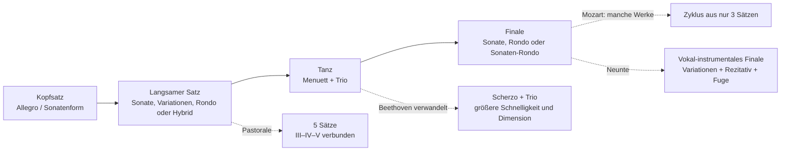
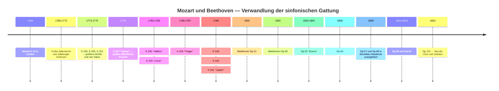
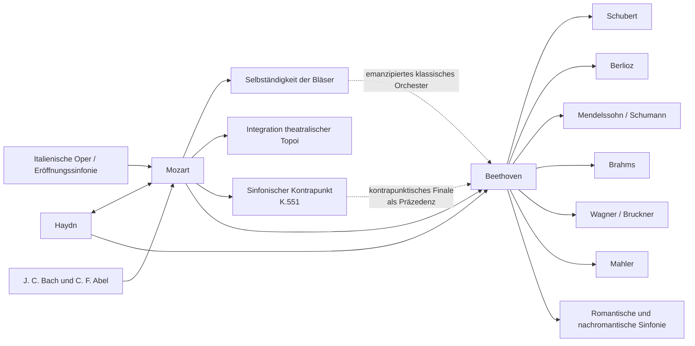

<!-- Translation of: research/sources/author-supplied/beethoven-mozart-symphonic-form.md; source commit: 304d75ed6ff646d311fd9df8b4e2db0d4dee277a -->
# Beethoven und Mozart: Katalog, Form, Geschichte, Rezeption und Vermächtnis der Sinfonien

## Zusammenfassung

Die sinfonischen Werdegänge von **Wolfgang Amadeus Mozart** und **Ludwig van Beethoven** gehören demselben historischen Bogen an, repräsentieren jedoch unterschiedliche Momente in der Konsolidierung der Sinfonie. Mozart begleitete praktisch die gesamte Verwandlung der Gattung, von der kurzen dreisätzigen italienischen Sinfonie und der Opernouvertüre der 1760er Jahre bis zur großen Wiener Konzertsinfonie der 1780er Jahre. Beethoven übernahm von Haydn und Mozart eine bereits hochgradig differenzierte Gattung und baute sie um monumentale Dimension, dramatische Kontinuität, intensive motivische Arbeit, expansive Koden, lang angelegte tonale Konflikte und schließlich die Einbeziehung der menschlichen Stimme in der Neunten neu auf. Die Internationale Stiftung Mozarteum selbst beschreibt Mozarts Entwicklung von einem anfänglich standardisierten Orchester — zwei Oboen, zwei Hörner und Streicher, bei festlichen Anlässen mit Trompeten/Pauken — hin zu einem breiteren Wiener Satz, in dem Flöte, Klarinetten und Fagotte zunehmend selbständig werden. citeturn20view2turn25search0

Zwischen den Katalogen besteht eine grundlegende Asymmetrie. **Beethoven schrieb neun nummerierte und authentische Sinfonien**, entsprechend den Opp. 21, 36, 55, 60, 67, 68, 92, 93 und 125. citeturn22search1 Für Mozart ist „41 Sinfonien" eine historische Konvention, nicht das Äquivalent eines modernen kritischen Katalogs. Die alten Nrn. 2 und 3 stammen nicht von Mozart; Nr. 37 ist im Wesentlichen Michael Haydns Sinfonie MH 334, zu der Mozart einleitendes Material hinzufügte; darüber hinaus gibt es authentische Sinfonien ohne traditionelle Nummer, sinfonische Fassungen von Ouvertüren und Serenaden, Werke zweifelhafter Authentizität sowie verschollene Sinfonien. Das neue **Köchel-Verzeichnis**, erschienen 2024 — die erste vollständige Neuausgabe seit 1964 — hat Datierungen, Quellen und Zuschreibungen im Lichte neuerer Forschung aktualisiert. citeturn6search0turn7view0turn13search0turn25search2

Die Formanalyse zeigt einen Unterschied der Gewichtung, nicht einen einfachen Gegensatz zwischen „melodischem Mozart" und „motivischem Beethoven". Mozart kann mit außerordentlicher motivischer Ökonomie arbeiten — vor allem in den Sinfonien Nrn. 40 und 41 —, neigt jedoch dazu, große Formen durch **Pluralität der Topoi, Charakterkontraste, Dialog zwischen Instrumentenfamilien, Kontrapunkt und Umdeutung opernhafter Gesten** zu bauen. Beethoven treibt die Fähigkeit einer minimalen Zelle, Struktur zu erzeugen, weiter: Das paradigmatische Beispiel ist die Fünfte, in der eine rhythmische Figur aus vier Noten verschiedene thematische Funktionen durchdringt und sich in eine globale Trajektorie von c-Moll nach C-Dur einfügt. Die *Eroica*, die Fünfte, die Pastorale und die Neunte erweitern die Definition des sinfonischen Zyklus selbst. Neuere Studien betonen jedoch, dass die Beethovensche Revolution als Transformation bereits bei Haydn und Mozart vorhandener Paradigmen zu verstehen ist, nicht als Schöpfung ex nihilo. citeturn17search6turn17search10

Bei Mozart sind drei große Wendepunkte besonders deutlich: die **Sinfonie Nr. 25 in g-Moll, K. 183**, mit kontrapunktischer Intensität und außergewöhnlich dunkler Orchestrierung; die **„Pariser", K. 297**, konzipiert für ein großes öffentliches Konzert und ein Orchester, das Klarinetten einschloss; und die Folge **„Haffner"–„Linzer"–„Prager"–Nr. 39–40–„Jupiter"**, in der Dimension, Bläser-Selbständigkeit, Chromatik und kontrapunktische Integration ein neues Niveau erreichen. Mozarts Brief vom 9. Juli 1778 bestätigt sowohl den enormen Publikumserfolg der „Pariser" als auch die Kontroverse um ihr Andante, das vom Direktor Joseph Legros als übermäßig modulierend empfunden wurde; Mozart schrieb eine zweite Fassung des Satzes. citeturn30view0turn31view0

Bei Beethoven bilden die neun Werke eine besonders aufschlussreiche Folge: Die Erste spielt noch bewusst mit Haydn-Mozartschen Erwartungen; die Zweite erweitert Dimension und Rhetorik; die Dritte verändert Proportionen und Funktion der Koda radikal; die Vierte verfeinert Ambiguität und Humor; die Fünfte erzeugt beispiellose zyklische Kontinuität; die Sechste verwandelt den Zyklus in fünf programmatische „Szenen"; die Siebte macht den Rhythmus zum strukturierenden Prinzip; die Achte besucht ironisch Modelle des 18. Jahrhunderts erneut; und die Neunte verwandelt die Sinfonie in eine instrumental-vokale Synthese. Die historischen Seiten des Beethoven-Hauses dokumentieren diese Genesen, Uraufführungen und Revisionen anhand von Autographen, Skizzen, Erstausgaben und zeitgenössischen Quellen. citeturn4search0turn3search0turn4search1turn4search3turn3search2turn3search3turn5search0

Für das kritische Studium sind die sichersten editorischen Referenzen die **Neue Mozart-Ausgabe (NMA), Serie IV, Werkgruppe 11**, mit ihren zehn Sinfoniebänden und Kritischen Berichten, sowie für Beethoven sowohl die aus der **Neuen Beethoven-Gesamtausgabe** abgeleiteten, bei Henle erschienenen Partituren als auch die kritische Urtext-Ausgabe von **Jonathan Del Mar** für Bärenreiter. citeturn10search3turn22search0turn22search1 Bei Einspielungen profitiert eine vergleichende Studie davon, historisch informierte Aufführungen neben die große moderne sinfonische Tradition zu stellen: Für Mozart ist Trevor Pinnock/The English Concert eine vollständige HIP-Referenz; für Beethoven bieten John Eliot Gardiner/Orchestre Révolutionnaire et Romantique und Nikolaus Harnoncourt/Chamber Orchestra of Europe zwei unterschiedliche Wege, Artikulation, Größe, Balance und Rhetorik im Lichte historischer Forschung neu zu denken. citeturn23search1turn23search6turn23search2turn23search23

## Umfang, Quellen, Terminologie und Zuschreibungsprobleme

**Katalogkriterium.** Für Beethoven ist „vollständiger Sinfonienkatalog" eindeutig: neun vollendete und nummerierte Sinfonien. Für Mozart trennt dieser Bericht vier Schichten: die 41 Werke der traditionellen Nummerierung; zusätzliche, in die sinfonische Reihe der NMA aufgenommene Werke; sinfonische Fassungen, die aus Opern oder Serenaden abgeleitet sind; sowie unechte, zweifelhafte, fragmentarische oder verschollene Werke. Die NMA verteilt Mozarts Sinfonien auf zehn Bände der Serie IV/11, herausgegeben unter anderem von Gerhard Allroggen, Wilhelm Fischer, Hermann Beck, Christoph-Hellmut Mahling, Friedrich Schnapp, Günter Haußwald, László Somfai und H. C. Robbins Landon. citeturn10search3turn10search0turn10search1turn10search2turn11search0turn11search1turn11search2turn12search0turn12search1

**Köchel versus Opus.** Die Nummer **K. bzw. KV** (*Köchel-Verzeichnis*) ist der normale musikwissenschaftliche Identifikator von Mozarts Werken. Der Ausdruck „Opus" bildet keinen systematischen Mozart-Katalog: Manche historische Ausgaben wiesen veröffentlichten Sammlungen editorische Opuszahlen zu, doch haben sie nicht die Funktion, die Op.-Nummern bei Beethoven haben. Daher erscheint „Op." in der Mozart-Tabelle als **nicht anwendbar**. Der derzeit von der Stiftung Mozarteum abgebildete Online-Köchel leitet sich aus der neuen Ausgabe von 2024 ab und kann breitere oder andere Daten liefern als die von der sechsten Auflage festgeschriebenen; K. 183 etwa ist heute offiziell in einer Spanne von März 1773 bis Mai 1775 datiert, obwohl die ältere Literatur es gewöhnlich gezielt in den Herbst 1773 setzt. citeturn7view0turn25search3

**Authentizitätsstatus.** Die alte Sinfonie Nr. 3, historisch K. 18, ist heute als **KV Anh. A 51** katalogisiert, ein beglaubigtes Werk von **Carl Friedrich Abel**, nicht von Mozart. citeturn13search0 Nr. 2, K. 17/Anh. C 11.02, gehört ebenfalls nicht zum authentischen Mozart-Korpus und wird in der modernen Bibliographie Leopold Mozart zugeschrieben. Die alte Nr. 37, K. 444/425a, ist derzeit als **KV Anh. A 53 / MH 334** katalogisiert, eine Sinfonie Michael Haydns unter Mozarts Mitwirkung. citeturn16search0turn25search2 K. 84 ist ein Beispiel für einen Fall, der vom neuen Köchel noch ausdrücklich als von **„zweifelhafter Authentizität"** klassifiziert wird; alte Quellen schreiben es abwechselnd Wolfgang, Leopold Mozart und Dittersdorf zu. citeturn25search1

**Form.** Begriffe wie „Sonatenform" werden hier analytisch verwendet. In den Sinfonien der 1760er Jahre kann „Sonatenform" anachronistisch sein, wenn darunter das Schulmodell des 19. Jahrhunderts verstanden wird. In vielen Kopfsätzen ist es präziser, von **binärer Sonatenform oder früher Sonate** zu sprechen, in der Exposition, Reprise und Durchführung noch nicht die Proportionen und Funktionen besitzen, die wir in den 1780er Jahren finden. Die Geschichte der Sinfonie selbst zeigt einen Übergang von italienischen Ouvertürenmodellen und binären Strukturen zu einer zunehmend differenzierten Organisation der vier Sätze. Die moderne Literatur zur klassischen Sinfonie betont gerade diese historische Pluralität. citeturn17search4turn17search8

**Orchestrierung.** In Mozarts frühen Sinfonien ist der typische Kern Streicher, zwei Oboen und zwei Hörner; Trompeten und Pauken erscheinen vor allem in festlichen Werken. Am Salzburger Hof konnten Flötisten und Oboisten dieselben Musiker sein, ein Faktor, der mit erklärt, warum Flöten und Oboen nicht immer gleichzeitig erscheinen. In der Wiener Zeit werden Klarinetten und Fagotte in weit höherem Maße selbständige Stimmen. citeturn25search0turn20view2 Beethoven beginnt innerhalb dieser klassischen Welt, verwandelt Hörner, Trompeten, Pauken und Holzbläser jedoch fortschreitend in formale Akteure, kulminierend in den klanglichen Erweiterungen der Fünften, Sechsten und Neunten.

Das folgende Flussdiagramm fasst **einen Archetyp** zusammen, keine starre Regel:

Diese formale Genealogie entspricht dem historischen Bild, das die NMA für Mozart und die kritischen Quellen der neun Beethovenschen Sinfonien dokumentieren. citeturn10search0turn10search1turn12search1turn4search3turn5search0

## Katalog, Chronologie, Uraufführungen und dokumentarische Quellen

**Katalogtabelle — Beethoven.**

| Sinfonie | Tonart | Komposition | Katalog | Uraufführung / erste bekannte Aufführung | Ausführende und Anmerkungen |
|---|---|---:|---|---|---|
| Nr. 1 | C-Dur | 1799–1800 | **Op. 21** | 2. Apr. 1800, Hofburgtheater/Burgtheater, Wien | Von Beethoven veranstaltete Akademie; das Programm umfasste Mozart, Haydn, ein Klavierkonzert und Beethovens Septett. citeturn4search0 |
| Nr. 2 | D-Dur | 1800–1802 | **Op. 36** | 5. Apr. 1803, Theater an der Wien | Erste sicher dokumentierte öffentliche Aufführung, in einer Beethovenschen Akademie; mögliche frühere private Aufführung. citeturn3search0 |
| Nr. 3 „Eroica" | Es-Dur | 1803–1804 | **Op. 55** | privat für Lobkowitz, 1804; öffentlich 7. Apr. 1805, Theater an der Wien | Lobkowitzsches Orchester bei den ersten Aufführungen; endgültige Widmung an Fürst Lobkowitz. citeturn4search1turn2search5turn2search17 |
| Nr. 4 | B-Dur | 1806 | **Op. 60** | vermutlich März 1807, Palais Lobkowitz, Wien | Private Aufführung im Umfeld des Hauses Lobkowitz; gewidmet Graf Franz von Oppersdorff. citeturn3search1 |
| Nr. 5 | c-Moll | 1804–1808 | **Op. 67** | 22. Dez. 1808, Theater an der Wien | Beethoven dirigierte die berühmte, etwa vierstündige Akademie; improvisiertes Orchester und schwierige Bedingungen. citeturn2search0turn4search2 |
| Nr. 6 „Pastorale" | F-Dur | 1807–1808 | **Op. 68** | 22. Dez. 1808, Theater an der Wien | Dieselbe Akademie wie die Fünfte; im Programm wurde die Pastorale vor der Sinfonie in c-Moll präsentiert. citeturn4search3turn2search0 |
| Nr. 7 | A-Dur | 1811–1812 | **Op. 92** | 8. Dez. 1813, Universität Wien | Von Beethoven dirigiertes Benefizkonzert, zusammen mit *Wellingtons Sieg*; großer Erfolg. citeturn3search2 |
| Nr. 8 | F-Dur | 1812 | **Op. 93** | 27. Feb. 1814, Redoutensaal, Wien | Beethoven dirigierte; das Programm umfasste auch die Siebte und *Wellingtons Sieg*. citeturn3search3 |
| Nr. 9 | d-Moll | 1822–1824; Skizzen seit 1815 | **Op. 125** | 7. Mai 1824, Kärntnertortheater, Wien | Michael Umlauf übte die effektive Leitung aus, während Beethoven auf der Bühne blieb; Henriette Sontag, Caroline Unger, Anton Haizinger und Joseph Seipelt bildeten das Soloquartett. citeturn5search0turn2search19 |

Die Datierung der Zweiten verdient eine Korrektur einer sehr verbreiteten biographischen Erzählung: Das Beethoven-Haus betont, dass ein erheblicher Teil des Werks bereits vor dem berühmten Heiligenstädter Testament konzipiert war, was es simplistisch macht, seine Ausgelassenheit als direkte „Antwort" auf die Krise von 1802 zu deuten. citeturn3search0 Die Siebte wiederum ist durch das Autograph mit „1812 Aug. 13" dokumentiert und wurde im Kontext der Napoleonischen Kriege in einer Benefizveranstaltung uraufgeführt. citeturn3search2

**Katalogtabelle — Mozart, historische Nummerierung 1 bis 41.** „—" bei Uraufführung bedeutet, dass eine spezifische Erstaufführung dokumentarisch nicht mit Sicherheit rekonstruierbar ist; dies ist besonders bei den Salzburger Werken üblich, von denen viele für den höfischen Gebrauch ohne individuelle Uraufführungsdokumentation geschrieben wurden. citeturn25search0

| Historische Nr. | Tonart | Ungefähres / aktuelles Datum | Köchel | Op. | Uraufführung oder identifizierbare Erstaufführung | Status |
|---|---|---|---|---|---|---|
| 1 | Es | 1764 | **K. 16** | — | London, 21. Feb. 1765 | authentisch. citeturn10search0turn21search16 |
| 2 | B | um 1765 | **K. 17 / Anh. C 11.02** | — | — | **unecht; Leopold Mozart zugeschrieben**. citeturn16search0turn16search4 |
| 3 | Es | 1764 | **K. 18; heute Anh. A 51** | — | Werk von Abel | **Carl Friedrich Abel**, nicht Mozart. citeturn13search0 |
| 4 | D | 1765 | **K. 19** | — | — | authentisch. citeturn10search0 |
| 5 | B | 1765 | **K. 22** | — | vermutlich Haager Zeit; genaue Uraufführung ungewiss | authentisch. citeturn10search0 |
| 6 | F | 1767 | **K. 43** | — | — | authentisch. citeturn10search0 |
| 7 | D | 1768 | **K. 45** | — | — | authentisch. citeturn10search0 |
| 8 | D | 1768 | **K. 48** | — | — | authentisch. citeturn10search0 |
| 9 | C | um 1769–72 | **K. 73 / 75a** | — | — | authentisch; historische Chronologie revidiert. citeturn10search0 |
| 10 | G | 1770 | **K. 74** | — | — | authentisch. citeturn10search1 |
| 11 | D | 1770 | **K. 84 / 73q** | — | — | **zweifelhafte Authentizität**. citeturn25search1 |
| 12 | G | 1771 | **K. 110 / 75b** | — | — | authentisch. citeturn10search1 |
| 13 | F | 1771 | **K. 112** | — | — | authentisch. citeturn10search1 |
| 14 | A | 30. Dez. 1771 | **K. 114** | — | — | authentisch; offizielles Autographdatum. citeturn25search0 |
| 15 | G | 1772 | **K. 124** | — | — | authentisch. citeturn10search1 |
| 16 | C | 1772 | **K. 128** | — | — | authentisch. citeturn10search2 |
| 17 | G | 1772 | **K. 129** | — | — | authentisch. citeturn10search2 |
| 18 | F | 1772 | **K. 130** | — | — | authentisch. citeturn10search2 |
| 19 | Es | 1772 | **K. 132** | — | — | authentisch; Alternativen für den langsamen Satz erhalten. citeturn10search2 |
| 20 | D | 1772 | **K. 133** | — | — | authentisch. citeturn10search2 |
| 21 | A | 1772 | **K. 134** | — | — | authentisch. citeturn10search2 |
| 22 | C | 1773 | **K. 162** | — | — | authentisch. citeturn11search0 |
| 23 | D | traditionell 1773; aktueller Katalog lässt breitere Spanne zu | **K. 181** | — | — | authentisch. citeturn14search3 |
| 24 | B | 1773 | **K. 182** | — | — | authentisch. citeturn11search0 |
| 25 | g-Moll | traditionell 1773; heute: März 1773–Mai 1775 | **K. 183 / 173dB** | — | — | authentisch; 4 Hörner. citeturn25search3 |
| 26 | Es | 1773 | **K. 184 / 161a** | — | — | authentisch. citeturn11search0 |
| 27 | G | um 1773 | **K. 199 / 161b** | — | — | authentisch. citeturn11search0 |
| 28 | C | um 1773–75 | **K. 200 / 189k** | — | — | authentisch; altes Datum auf dem Autograph problematisch. citeturn25search4 |
| 29 | A | 1774 | **K. 201 / 186a** | — | — | authentisch. citeturn11search1 |
| 30 | D | 1774 | **K. 202 / 186b** | — | — | authentisch. citeturn11search1 |
| 31 „Pariser" | D | Juni 1778 | **K. 297 / 300a** | — | **18. Juni 1778, Concert Spirituel, Tuilerien, Paris** | authentisch; Orchester des Concert Spirituel; Joseph Legros leitete die Institution. citeturn21search13turn30view0 |
| 32 | G | 26. Apr. 1779 | **K. 318** | — | — | authentisch; kontinuierliche Struktur in drei Abschnitten. citeturn11search2turn17search20 |
| 33 | B | 1779; spätere Revisionen | **K. 319** | — | — | authentisch. citeturn11search2 |
| 34 | C | 1780 | **K. 338** | — | — | authentisch; drei Sätze. citeturn11search2 |
| 35 „Haffner" | D | 1782; revidiert 1783 | **K. 385** | — | **23. März 1783, Burgtheater, Wien** | Mozart dirigierte seine Akademie; Ursprung in Festmusik für die Familie Haffner. citeturn27search21turn27search17turn27search32 |
| 36 „Linzer" | C | 30. Okt.–Anfang Nov. 1783 | **K. 425** | — | **4. Nov. 1783, Linzer Theater** | hastig geschrieben für ein von Graf Thun angekündigtes Konzert. citeturn31view1turn27search8 |
| 37 | G | um 1783–84 | alte **K. 444/425a; heute Anh. A 53 / MH 334** | — | Fassung im Zusammenhang mit dem Linzer Aufenthalt | **Michael Haydn; Mozarts Beitrag in der Einleitung**. citeturn25search2turn27search8 |
| 38 „Prager" | D | 6. Dez. 1786 | **K. 504** | — | **19. Jan. 1787, Prag, damals mit dem National-/Ständetheater verbundenes Theater** | Mozart leitete das Konzert. citeturn27search6turn27search10 |
| 39 | Es | **26. Juni 1788** | **K. 543** | — | spezifische Uraufführung **nicht sicher identifiziert** | authentisch. citeturn14search2turn28search9 |
| 40 | g-Moll | **25. Juli 1788**; spätere Fassung mit Klarinetten | **K. 550** | — | ungewisse private Uraufführung; dokumentierbare/wahrscheinliche Aufführungen 1791 | authentisch, zwei Fassungen. citeturn14search0turn28search16 |
| 41 „Jupiter" | C | **10. Aug. 1788** | **K. 551** | — | spezifische Uraufführung nicht überliefert | authentisch; Mozarts letzte Sinfonie. citeturn20view2turn28search9 |

Die „Pariser" bildet den bestdokumentierten Fall unmittelbarer Rezeption unter Mozarts vor-Wiener Sinfonien. Die Familienkorrespondenz verzeichnet den Erfolg beim Concert Spirituel; Leopold beglückwünschte seinen Sohn ausdrücklich, und Mozart schrieb, das Werk sei „unvergleichlich gut" aufgenommen worden. Derselbe Brief zeigt, dass Mozart strategisch über öffentliche Effekte, Erwartungen des Pariser Publikums und sogar die Ersetzung des langsamen Satzes nachdachte. citeturn31view2turn31view0

Die Genese der „Linzer" ist ebenso außergewöhnlich gut dokumentiert. Am 31. Oktober 1783 schrieb Mozart an Leopold, Graf Thun habe ein Konzert für den 4. November angekündigt und, da er keine Sinfonie mitgebracht habe, arbeite er „mit voller Geschwindigkeit" an einer neuen. Der Brief ist Primärevidenz für die außerordentlich komprimierten Umstände der Komposition. citeturn30view1turn31view1

**Relevante zusätzliche Sinfonien und Fassungen außerhalb der Reihe 1–41.**

| Werk | Tonart | Ungefähres Datum | Kritische Situation |
|---|---|---:|---|
| K. Anh. 223 / 19a | F | um 1765 | in der NMA unter den frühen Sinfonien enthalten. citeturn10search0 |
| K. Anh. 221 / 45a, „Alte Lambacher" | G | um 1766 | in der NMA überliefert; historisch Gegenstand attributiver Debatte. citeturn10search0 |
| K. Anh. 214 / 45b | B | um 1768 | problematische Zuschreibung; kritisch in der NMA enthalten. citeturn10search0 |
| K. 75 | F | um 1771 | traditionelle Nr. 42; Authentizität umstritten. citeturn10search1turn16search4 |
| K. 76 / 42a | F | 1760er | traditionelle Nr. 43; Zuschreibung umstritten. citeturn10search0turn16search4 |
| K. 81 / 73l | D | 1770 | traditionelle Nr. 44; Zuschreibung umstritten. citeturn10search1 |
| K. 95 / 73n | D | um 1770 | traditionelle Nr. 45; Zuschreibung umstritten. citeturn10search1 |
| K. 96 / 111b | C | um 1771 | traditionelle Nr. 46; Zuschreibung umstritten. citeturn10search1 |
| K. 97 / 73m | D | um 1770 | traditionelle Nr. 47; Zuschreibung umstritten. citeturn10search1 |
| K. 111 + K. 120 / 111a | D | 1771 | sinfonische Fassung im Zusammenhang mit der Ouvertüre zu *Ascanio in Alba*; traditionelle Nr. 48. citeturn10search1 |
| Ouvertüre K. 126 + K. 161/163 | D | 1772 | sinfonische Fassung im Zusammenhang mit *Il sogno di Scipione*; bekannt als Nr. 50. citeturn10search2 |
| Ouvertüre K. 196 + K. 121 / 207a | D | 1774–75 | sinfonische Fassung aus Ouvertüre + Finale. citeturn11search1 |
| Ouvertüre K. 208 + K. 102 / 213c | C | 1775 | **unvollständige** sinfonische Fassung im Zusammenhang mit *Il re pastore*. citeturn11search1 |
| Sinfonische Fassung von K. 204 / 213a | D | 1775 | Serenaden-Reduktion. citeturn9view1 |
| Sinfonische Fassung von K. 250 / 248b, „Haffner-Serenade" | D | 1776 | Serenaden-Reduktion; das ursprüngliche Festwerk wurde am 21. Juli 1776 für die Haffners gespielt. citeturn14search4turn9view1 |
| Sinfonische Fassung von K. 320, „Posthorn" | D | 1779 | Serenaden-Reduktion. citeturn9view1 |
| K. 409 | C | frühe 1780er | isoliertes sinfonisches Menuett, **keine vollständige Sinfonie**. citeturn12search2 |
| K. Anh. 220 / 16a, „Odense" | a-Moll | historisch dem jungen Mozart zugeschrieben | stark problematische Authentizität; muss außerhalb des sicheren Kerns bleiben. citeturn16search4 |
| K. Anh. 216 / 74g | B | ungewiss | traditionelle Nr. 54; zweifelhaft. citeturn16search4 |
| K. Anh. 214 / 45b | B | ungewiss | traditionelle Nr. 55; zweifelhaft. citeturn16search4 |
| K. 98 / Anh. C 11.04 | F | ungewiss | traditionelle Nr. 56; zweifelhafte/unechte Zuschreibung. citeturn16search4 |

Es gibt auch Hinweise auf **verschollene Sinfonien** — darunter K. 19b und verschiedene alte Posten der Köchel-Anhänge —, für die nicht genügend Material für eine vollständige Formanalyse vorliegt. Der offizielle Katalog selbst vermerkt, Mozart habe während der großen Europareise 1763–66 etwa fünfzehn Sinfonien geschrieben und mehrere seien verloren gegangen. citeturn20view2turn16search0

**Synthetische Zeitleiste:**

Die Chronologie zeigt, dass die „klassische Sinfonie" kein erstarrtes Modell ist: Zwischen K. 16 und K. 551 durchläuft Mozart mehr als zwei Jahrzehnte institutioneller und stilistischer Veränderungen, während Beethoven in nur etwa vierundzwanzig Jahren dieses Erbe in eine Gattung immer größeren ästhetischen Anspruchs verwandelt. citeturn20view2turn4search0turn5search0

## Formale Anatomie und Satz-für-Satz-Analyse

In diesem Abschnitt bedeutet „SF" **Sonatenform**; „bin./son." bezeichnet eine binäre Form, deren Logik bereits Sonatenverfahren vorwegnimmt; „T–D" bedeutet Bewegung von der Tonika zur Dominante und „T–rel." den typischen Gang zur parallelen Durtonart in Moll-Werken. Die Identifikationen sind analytische Lesarten der kritischen Partituren; klassische Sätze lassen häufig mehr als eine vertretbare Formdeutung zu. Die NMA liefert den kritischen Basistext für Mozart und die Henle/Bärenreiter-Ausgaben das moderne Äquivalent für Beethoven. citeturn10search3turn22search0turn22search1

**Beethoven, Sinfonie Nr. 1 in C-Dur, Op. 21.** Der Kopfsatz beginnt mit einem absichtlich desorientierenden *Adagio molto*: Statt C-Dur sofort zu bekräftigen, projiziert Beethoven Harmonien, die wie Dominanten benachbarter Regionen klingen, vor allem eine Dominante von F, und verlängert so die Verweigerung der Tonika. Das *Allegro con brio* etabliert schließlich C-Dur und verwendet eine Sonatenform Haydnschen Profils, jedoch mit größerer dynamischer Aggressivität, Skalen und Bläserakzentuierung. Die Durchführung fragmentiert die Zellen und erkundet modulierende Sequenzen vor der Wiedergewinnung der Tonika. Der **II., Andante cantabile con moto**, in F-Dur, ist eine lyrische Sonate, in der Imitation und leichter Kontrapunkt mit dezent integrierten Trompeten und Pauken koexistieren — ungewöhnliche Instrumentierung für das konventionelle Bild eines „zarten langsamen Satzes". Der **III., Menuetto: Allegro molto e vivace**, nominell ein Menuett, ist funktional ein Scherzo: zu schnell, synkopiert und energetisch zu instabil für den traditionellen aristokratischen Tanz. Der **IV.** beginnt mit einem Einleitungsscherz in langsamem Tempo, in dem die C-Skala Note für Note enthüllt wird; das *Allegro molto e vivace* verwandelt die Geste in ein Sonatenfinale Haydnscher Schnelligkeit und Heiterkeit. Das Werk verlässt Haydn und Mozart also nicht: Es macht die Kenntnis dieses Vokabulars zur Bedingung dafür, die Erwartungen des Hörers zu stören. citeturn4search0turn22search9

**Sinfonie Nr. 2 in D-Dur, Op. 36.** Der **I., Adagio molto – Allegro con brio**, erweitert die langsame Einleitung beträchtlich, mit Ausflügen in die Mollvariante, Chromatik und Akkorden ambiger Funktion vor der ausgelassenen SF in D. Durchführung und Koda überschreiten bereits die üblichen Proportionen der Ersten; die Koda hört auf, bloße Bestätigung zu sein, und beginnt an der Verarbeitung teilzunehmen. Der **II., Larghetto, A-Dur**, ist eine ausgedehnte lyrische Sonatenform: Lange verzierte Phrasen koexistieren mit Imitation und einer hochdifferenzierten Holzbläserpalette. Der **III. heißt ausdrücklich Scherzo** und konsolidiert die Ersetzung des Menuetts im Beethovenschen Sinfoniezyklus; plötzliche Kontraste von Dynamik und Register sind konstitutiv für die Form. Der **IV., Allegro molto**, wird aus einem abrupten, fast grotesken Motiv geboren, das als wiederkehrendes Signal fungiert; die Form mischt Sonaten- und Rondoeigenschaften und kulminiert in einer außerordentlich langen Koda, die die strukturelle Bedeutung vorwegnimmt, die die Koda in der *Eroica* haben wird. citeturn3search0turn22search5

**Sinfonie Nr. 3 in Es-Dur, Op. 55, „Eroica".** Der **I., Allegro con brio**, eliminiert die langsame Einleitung: Zwei fortissimo Es-Akkorde starten unmittelbar ein Thema auf Basis des Tonika-Arpeggios. Fast sogleich destabilisiert jedoch ein tonartfremdes Cis das harmonische Feld. Die Exposition enthält nicht nur „Thema 1/Thema 2", sondern ein Netz thematischer Gruppen, synkopierter Rhythmen und metrischer Konflikte. Die Durchführung ist kolossal: Sie fragmentiert Zellen, schafft Dissonanzketten und präsentiert berühmtes neues Material in e-Moll. Der berühmte scheinbar „verfrühte" Horneinsatz nahe der Reprise intensiviert die zeitliche Ambiguität. Die Koda fungiert als **zweite Durchführung** und baut das Material neu auf, statt bloß zu schließen. Der **II., Marcia funebre: Adagio assai**, in c-Moll, verbindet Marsch-, Rondo- und ternäre/variationelle Architektur; Episoden in C-Dur und fugierte Abschnitte verwandeln den Marsch in einen kollektiven Prozess von Klage und Wiederaufbau. Der **III., Scherzo**, ersetzt die Geselligkeit des Menuetts endgültig durch Schnelligkeit, Überraschung und Spannung; das Trio gibt **drei Hörnern** spektakuläre Prominenz, eine signifikante Erweiterung der Sektion. Der **IV.** ist eine Synthese aus Variation, Fuge und Finallogik über Material, das Beethoven bereits in *Die Geschöpfe des Prometheus* und anderen Stücken verwendet hatte: Er beginnt vom Bass des Themas aus, bevor er dessen melodische Oberfläche präsentiert, und unterzieht es kontrapunktischen und lyrischen Verwandlungen. Die entscheidende Innovation ist nicht nur „Dauer": Es ist die Verwandlung des gesamten Zyklus in ein groß dimensioniertes dramatisches Argument. citeturn4search1turn17search6turn22search11

**Sinfonie Nr. 4 in B-Dur, Op. 60.** Der **I.** beginnt mit einem *Adagio*, dessen ausgedünnte Textur und anfänglich düsterer Verlauf die B-Dur-Tonika fern erscheinen lassen; die Explosion des *Allegro vivace* löst diese Suspension und beginnt eine außerordentlich mobile SF auf Basis von Skalen, Arpeggien und rhythmischen Verschiebungen. Der **II., Adagio in Es**, ist durch einen punktierten Begleitrhythmus strukturiert, der so wichtig wird wie die Melodien; Klarinette und andere Holzbläser gewinnen starke thematische Persönlichkeit. Der **III., Allegro vivace**, ist ein erweitertes fünfteiliges Scherzo — Scherzo–Trio–Scherzo–Trio–Scherzo —, ein Verfahren, das Beethoven in der Siebten wiederverwenden wird. Der **IV., Allegro ma non troppo**, ist ein Sechzehntel-*perpetuum mobile*: Die Virtuosität der Streicher wird von komischen Bläsereinwürfen punktiert, darunter der berühmte Fagottmoment. Die Vierte demonstriert, dass Beethovensche Innovation nicht Gigantismus gleichkommt: Hier liegt sie in Ambiguität, Rhythmus, Schnelligkeit und Ironie. citeturn3search1

**Sinfonie Nr. 5 in c-Moll, Op. 67.** Im **I., Allegro con brio**, darf die kurz-kurz-kurz-lang-Zelle nicht nur als „Thema" verstanden werden: Sie ist ein **rhythmischer Generator**, der Überleitungen, Begleitung, Tutti und Koda durchzieht. Die Exposition geht von c-Moll aus und steuert Es-Dur an; die Durchführung reduziert die Textur auf immer kleinere Fragmente. In der Reprise suspendiert ein unerwartetes, fast kadenzartiges Oboensolo vorübergehend den Drive. Die Koda übernimmt erneut Durchführungsfunktion. Der **II., Andante con moto, As-Dur**, alterniert zwei thematische Komplexe in einem Prozess von **Doppelvariationen**; Fanfarenepisoden in C-Dur beginnen die triumphale Tonart des Finales vorwegzunehmen. Der **III., Allegro, c-Moll**, verwandelt die Zelle des Kopfsatzes rhythmisch in den Hörnern; das Trio ist fugiert und energisch. Bei der Rückkehr wird das Scherzo zu einem Geist in *pianissimo* reduziert, und eine lange Dominante führt **ohne Unterbrechung** ins Finale. Der **IV., Allegro, C-Dur**, fügt der Orchestermasse Piccolo, Kontrafagott und Posaunen hinzu; die Verwandlung von c-Moll nach C-Dur wird gleichzeitig zu einem formalen und klanglichen Ereignis. Eine Erinnerung an das Scherzo vor der Reprise etabliert wahre zyklische Erinnerung. Die Fünfte ist daher weniger eine wörtliche Erzählung vom „Schicksal" als eine außerordentliche Studie motivischer Integration, Kontinuität zwischen den Sätzen und global dimensionierter Tonalität. citeturn4search2turn17search3

**Sinfonie Nr. 6 in F-Dur, Op. 68, „Pastorale".** Beethoven versieht die fünf Sätze mit Titeln und betont, es handle sich mehr um Gefühlsausdruck als um wörtliche Malerei. Der **I., „Erwachen heiterer Empfindungen bei der Ankunft auf dem Lande"**, ist eine SF in F-Dur, deren Neuheit in extensiven Wiederholungen kleiner Module, langen stabilen harmonischen Feldern und subdominantisch-plagalem Nachdruck liegt; das Ziel ist weniger teleologischer Konflikt als ein Gefühl des Verweilens. Der **II., „Szene am Bach", B-Dur**, hält eine wogende Figur in zusammengesetztem Metrum unter Holzbläsermelodien; am Ende identifiziert Beethoven ausdrücklich Nachtigall, Wachtel und Kuckuck in Flöte, Oboe und Klarinette. Der **III., „Lustiges Zusammensein der Landleute"**, ist ein Scherzo, in dem Akzentdeformationen und eine Karikatur einer Dorfkapelle die Eleganz des Menuetts ersetzen. Ohne konventionelle Kadenz wird das Fest vom **IV., „Gewitter", f-Moll**, unterbrochen, einem fast gänzlich prozessualen Satz: Tremoli, Chromatik, verminderte Septakkorde, Pauken, Piccolo und Posaunen schaffen kontinuierliche Intensivierung. Das Gewitter löst sich direkt in den **V., „Hirtengesang; frohe und dankbare Gefühle nach dem Sturm"**, in F-Dur, ein Hybrid aus Rondo, Sonate und Pastoralhymnus, dominiert von plagalen Kadenzen und einem choralartigen Thema. Die letzten drei Sätze bilden eine ununterbrochene Folge, ein wichtiger Präzedenzfall für romantische programmatische Zyklen. citeturn4search3turn17search3

**Sinfonie Nr. 7 in A-Dur, Op. 92.** Der **I., Poco sostenuto – Vivace**, besitzt eine von Beethovens größten langsamen Einleitungen: Aufsteigende Skalen und gehaltene Akkorde führen durch Regionen wie C und F, bevor eine repetierte Note zum Puls des *Vivace* im 6/8 wird. Die folgende SF wird von einer obsessiven punktierten Figur regiert. Der **II., Allegretto, a-Moll**, beginnt mit einem Akkord und einem rhythmischen Ostinato, dessen Rekurrenz Variationen, kontrapunktische Überlagerung und eine Episode in A-Dur trägt; die Progression der Stimmen schafft einen fast architektonischen Akkumulationsprozess. Der **III., Presto**, stellt das Scherzo nach F-Dur, eine im Verhältnis zu A unerwartete Tonart; das Trio in D-Dur erklingt zweimal und erzeugt erneut eine fünfteilige Form. Der **IV., Allegro con brio**, in A-Dur, treibt rhythmische Wiederholung, Synkopen und Ostinati zu einem fast physischen Grad; seine lange Koda intensiviert Dominante und repetierten Bass vor der Auflösung. Adornos spätere Bemerkung, die Siebte sei die „Sinfonie par excellence", wird vom Beethoven-Haus als Index ihrer kritischen Fortune zitiert. citeturn3search2turn17search7

**Sinfonie Nr. 8 in F-Dur, Op. 93.** Der **I., Allegro vivace e con brio**, tritt direkt in F-Dur ein, doch seine scheinbare „klassische Normalität" wird durch versetzte Akzente, falsche metrische Hierarchien und eine unverhältnismäßig kraftvolle Koda untergraben. Der **II., Allegretto scherzando, B-Dur**, ersetzt den langsamen Satz durch eine rhythmische Miniatur auf Basis von Bläserpulsen; die Tradition, die ihn direkt mit Mälzels Metronom verknüpft, ist mit Vorsicht zu behandeln, da die Anekdote später und problematisch ist. Der **III., Tempo di Menuetto**, ist ein absichtlich archaisierendes Menuett, langsam und schwer im Vergleich zu Beethovenschen Scherzi. Der **IV., Allegro vivace**, bildet den Gipfel strukturellen Humors: Ein F-Dur gewaltsam fremdes Cis kehrt als harmonisches Problem wieder; in der immensen Koda erkundet Beethoven seine Umdeutung und entlegene Ausflüge vor der finalen Bekräftigung der Tonika. Die Achte ist nur oberflächlich „rückwärtsgewandt": Sie ist eine Metakritik klassischer Verfahren. citeturn3search3

**Sinfonie Nr. 9 in d-Moll, Op. 125.** Der **I., Allegro ma non troppo, un poco maestoso**, beginnt nicht mit einer fertigen Melodie, sondern mit offenen Quinten und Fragmenten, die aus dem Unbestimmten aufzutauchen scheinen, bis sie d-Moll kristallisieren; die Sonatenform verwandelt diese „Geburt" in ein rekurrentes Prinzip, und Durchführung/Koda expandieren das Material gewaltsam. Der **II., Molto vivace**, stellt das Scherzo vor den langsamen Satz; das fugierte Thema in d-Moll und die Paukenexplosionen werden durch ein Trio in D-Dur, schneller und pastoral, ausbalanciert. Der **III., Adagio molto e cantabile, B-Dur**, arbeitet zwei Hauptbereiche/Ideen durch ornamentale Variation und Expansion, einschließlich Kontrasten in D-Dur und Fanfarenepisoden. Der **IV.** beginnt mit einer explosiven Dissonanz und instrumentalen Rezitativen von Celli und Kontrabässen, die Reminiszenzen an die drei vorangegangenen Sätze „zurückweisen". Erst dann tritt, in D-Dur, die einfache Melodie der „Ode an die Freude" hervor, zunächst in den Streichbässen; es folgen instrumentale Variationen, der Eintritt des Baritons, Chor, „türkischer" Marsch mit Schlagwerk, Fuge, feierliche Episode über „Seid umschlungen, Millionen", kontrapunktische Kombination der Ideen und eine enorme Koda. Die Innovation ist nicht nur „einen Chor zu verwenden": Sie besteht darin, das Finale selbst die Unzulänglichkeit der rein instrumentalen Sinfonie dramatisieren zu lassen und aus Rezitativ, Variation, Marsch, Fuge, Hymnus und sinfonischer Klanglichkeit eine neue Form zu bauen. citeturn5search0turn22search7

**Mozart — kompakte Analyse des nummerierten Korpus.** Die folgenden Tonartfolgen verdichten den Satz-für-Satz-Verlauf; bei mehreren frühen Werken ist „frühe Sonate" bewusst einer starren schulischen Lesart vorzuziehen. Titel und Satzorganisation sind durch die sinfonischen Bände der NMA dokumentiert. citeturn10search0turn10search1turn10search2turn11search0turn11search1turn11search2turn12search0turn12search1

| Sinfonie | Satz für Satz und formale Lesart | Orchestrierung, Motive und Innovation |
|---|---|---|
| **Nr. 1, K.16** | I Es, *Molto allegro*, bin./son.; II c-Moll, *Andante*, binär; III Es, *Presto*, schnelle Binärform/frühe Sonate. | Streicher + Oboen/Hörner. Der Gang des langsamen Satzes in die parallele Molltonart bringt unerwartete Schwere in ein kindliches Londoner Werk; starker Einfluss des Umfelds J. C. Bach/Abel. citeturn10search0 |
| **Nr. 2, K.17** | Traditionelle Struktur in B, darf aber **nicht als Mozart analysiert werden**. | Die Zuschreibung an Mozart ist zurückgewiesen; sie bleibt nur aus historiographischen Gründen. citeturn16search0 |
| **Nr. 3, alte K.18** | Schnell–langsam–schnell-Zyklus in Es; galanter Stil und thematische Transparenz. | Es ist eine Sinfonie von **C. F. Abel**, vom jungen Mozart kopiert. Ihr Interesse liegt gerade darin, eines der Modelle zu zeigen, die der Knabe studierte. citeturn13search0 |
| **Nr. 4, K.19** | I D, Allegro, bin./son.; II G, Andante; III D, Presto. | Drei Sätze und einfache harmonische Trajektorien T–D/T–SD, typisch für die erste Londoner Zeit. citeturn10search0 |
| **Nr. 5, K.22** | I B; II Es; III B. Schnell–langsam–schnell-Format. | Stärker periodisierte Phrasen und orchestrale Antworten; Assimilation des internationalen Stils der Europareise. citeturn10search0 |
| **Nr. 6, K.43** | I F, frühe SF; II C, Andante; III F, Menuett/Trio; IV F, Allegro. | Die Annahme von vier Sätzen rückt das Werk näher an das austro-deutsche Modell; das Menuett wird Teil des Zyklus. citeturn10search0 |
| **Nr. 7, K.45** | D–G–D–D; Allegro / Andante / Menuett / Allegro. | Festlichkeit in D-Dur, Fanfaren und klare Kadenzen; Gleichgewicht zwischen Italienischem und Wienerischem. citeturn10search0 |
| **Nr. 8, K.48** | D–G–D–D, vier Sätze. | Stark zeremonielles Profil; Kontraste von Tutti/Streicher-Bläser-Schichten. citeturn10search0 |
| **Nr. 9, K.73** | C–F–C–C; vier Sätze. | Festliches Salzburger Modell; Kadenzen und Sequenzen gewinnen größere Breite. citeturn10search0 |
| **Nr. 10, K.74** | G, langsamer/subdominantischer mit dem Zyklus verbundener Abschnitt, schnelle Rückkehr in G. | Besonders enge Beziehung zur italienischen Ouvertüre und zu verbundenen Sätzen. citeturn10search1 |
| **Nr. 11, K.84** | D–G–D, drei Sätze. | Plausibel Mozartischer Stil, doch widersprüchliche Überlieferung verhindert sichere Zuschreibung. citeturn25search1 |
| **Nr. 12, K.110** | G–C–G–G. | Vier Sätze; Innenstimmen und Bratsche gewinnen Gewicht gegenüber dem Continuobass der ersten Modelle. citeturn10search1 |
| **Nr. 13, K.112** | F–B–F–F. | Größere motivische Energie in den Tutti, mit klarem Gegensatz zwischen Streicherperioden und Bläserverstärkungen. citeturn10search1 |
| **Nr. 14, K.114** | A–D–A–A. | Räumlicheres Werk; aktiverer innerer Kontrapunkt. Der aktuelle Köchel datiert sie präzise auf den 30. Dez. 1771. citeturn25search0 |
| **Nr. 15, K.124** | G–C–G–G. | Salzburger Synthese zwischen Ouvertürenglanz und höfischem Menuett. citeturn10search1 |
| **Nr. 16, K.128** | C–G–C, drei Sätze. | Rückkehr zum italienischen Format; kompakte, stark kadenzielle schnelle Ecksätze. citeturn10search2 |
| **Nr. 17, K.129** | G–C–G, drei Sätze. | Agile Textur und größere Differenzierung der zweiten thematischen Gruppe. citeturn10search2 |
| **Nr. 18, K.130** | F–B–F–F. | Vier Sätze; Ausdehnung und Bläsersatz zeigen bereits die Entfernung von den Miniaturen des vorangegangenen Jahrzehnts. citeturn10search2 |
| **Nr. 19, K.132** | Es–B–Es–Es; alternative Fassung des langsamen Satzes erhalten. | Die Existenz alternativer Sätze macht das Werk besonders wichtig für das Studium von Revision und Charakterwahl. citeturn10search2 |
| **Nr. 20, K.133** | D–A–D–D. | D-Dur-Glanz, mit größerer Selbständigkeit der Innenstimmen und dynamischem Kontrast. citeturn10search2 |
| **Nr. 21, K.134** | A–D–A–A. | Raffinierte Textur, geringere Abhängigkeit vom rein zeremoniellen Effekt. citeturn10search2 |
| **Nr. 22, K.162** | C–F–C, drei Sätze. | Kompakt, theatralisch und der Geste der Opernouvertüre nahe. citeturn11search0 |
| **Nr. 23, K.181** | D–G–D, drei Abschnitte/Sätze theatralischen Impulses. | Schnelle gestische Kontinuität; der aktuelle Köchel gibt ein breiteres Datum als die alte Chronologie. citeturn14search3 |
| **Nr. 24, K.182** | B–Es–B, drei Sätze. | Galante Klarheit verbunden mit größerer Tuttikraft. citeturn11search0 |
| **Nr. 25, K.183** | I g-Moll, SF; II Es, langsam in erweiterter SF/Binärform; III g-Moll, Menuett, Trio in G-Dur; IV g-Moll, SF. | Zwei Oboen, zwei Fagotte, **vier Hörner** und Streicher; Synkopen, Sprünge, Tremoli, Kontrapunkt und Dynamik verleihen ungewöhnliches Gewicht. citeturn25search3 |
| **Nr. 26, K.184** | Es – c-Moll – Es, drei verbundene oder eng verwandte Sätze. | Dramaturgie der Theaterouvertüre; der langsame Satz in c-Moll verdunkelt das tonale Zentrum radikal. citeturn11search0 |
| **Nr. 27, K.199** | G–D–G. | Leichtes Erscheinungsbild, doch thematische Verarbeitung und Innenstimmen flexibler als in den ersten Sinfonien. citeturn11search0 |
| **Nr. 28, K.200** | C–F–C–C. | In den Quellen verfügbare Trompeten und zeremonieller Charakter; wachsende Interaktion zwischen Fanfare und Lyrik. citeturn25search4 |
| **Nr. 29, K.201** | I A, SF; II D, Andante; III A, Menuett; IV A, SF im 6/8. | Eine der ersten reifen Sinfonien: Kontrapunkt, Imitation und Motive erscheinen unter verschiedenen Funktionen wieder; das Finale vereint Tanz und Durchführung. citeturn11search1 |
| **Nr. 30, K.202** | D–A–D–D. | Größere rhythmische Energie und Expansion der viersätzigen Form; Glanz noch mit dem Salzburger Kontext verbunden. citeturn11search1 |
| **Nr. 31, K.297 „Pariser"** | I D, monumentale SF; II G, Andante — zwei Fassungen; III D, Allegro/SF. | Flöten, Oboen, **Klarinetten**, Fagotte, Hörner, Trompeten, Pauken und Streicher: beispiellose Dimension bei Mozart. Eröffnungstutti und *piano–forte*-Kontraste nutzen das Pariser Publikum bewusst aus. citeturn21search13turn31view0 |
| **Nr. 32, K.318** | Allegro spiritoso in G → kontrastierendes Andante → Rückkehr des Anfangstempos in G, ohne normalen separaten Zyklus. | Hybrid aus Ouvertüre und Sinfonie, der Exposition, langsamen Kontrast und schnelle Rückkehr in einem kontinuierlichen Bogen konzentriert. citeturn11search2turn17search20 |
| **Nr. 33, K.319** | B–Es–B–B. | Kammermusikalisches Bläsergleichgewicht und größere Verarbeitung der Überleitungen; der Zyklus wurde revidiert. citeturn11search2 |
| **Nr. 34, K.338** | I C, SF; II F, Andante di molto; III C, schnelles Finale; **kein Menuett**. | Konzentriert und brillant; der Kontrast zwischen äußerer Grandezza und innerer Lyrik nimmt das Wiener Jahrzehnt vorweg. citeturn11search2 |
| **Nr. 35, K.385 „Haffner"** | I D, SF; II G, Andante; III D, Menuett/Trio; IV D, Presto. | Das eröffnende Unisonomotiv dominiert I; für die sinfonische Fassung erweiterte Mozart die Bläser. Finale von *buffa*-Energie; Mozart bat, es so schnell wie möglich zu spielen. citeturn27search25turn27search17 |
| **Nr. 36, K.425 „Linzer"** | I Adagio–Allegro spiritoso, C, SF; II F, Andante/SF; III C, Menuett; IV C, Presto/SF. | Erste groß dimensionierte langsame Einleitung in einer reifen Mozart-Sinfonie; „feierliche" Chromatik und Rhetorik rücken das Werk näher an Haydn. citeturn12search3turn27search20 |
| **Nr. 37, K.444/Anh.A53** | Struktur im Wesentlichen von Michael Haydn in G, mit Mozartischem Einleitungsbeitrag. | Darf nicht ohne Autorqualifikation als Beispiel für „Mozarts sinfonischen Stil" verwendet werden. citeturn25search2 |
| **Nr. 38, K.504 „Prager"** | I D, **Adagio–Allegro**, SF; II G, Andante/SF; III D, Presto/SF. | Kein Menuett, doch größere Dimension als viele viersätzige Sinfonien. Kontrapunktische Dichte, Synkopen und fast opernhafte Bläserbehandlung. citeturn12search0turn17search5 |
| **Nr. 39, K.543** | I Es, Adagio–Allegro, SF; II As, Andante con moto; III Es, Menuett; IV Es, Allegro/SF. | **Keine Oboen**: Flöte, Klarinetten und Fagotte erzeugen ein besonders weiches Timbre. Das Menuett-Trio macht die Klarinette zur Protagonistin von *Ländler*-Charakter. citeturn14search2turn12search1 |
| **Nr. 40, K.550** | I g-Moll, SF; II Es, Andante/SF; III g-Moll, Menuett, Trio G; IV g-Moll, SF. | Auftakte und „Seufzer" von I werden unablässig fragmentiert; das Finale erzeugt extreme chromatische Instabilität. Es existieren Fassungen mit und ohne zwei Klarinetten. citeturn14search0turn12search1 |
| **Nr. 41, K.551 „Jupiter"** | I C, Allegro vivace/SF; II F, Andante cantabile/SF; III C, Menuett; IV C, Molto allegro: SF + umkehrbarer Kontrapunkt/Fugato. | Finale aus mehreren Motiven gebaut, darunter **C–D–F–E**, in der Koda kontrapunktisch kombiniert; Synthese von „gelehrtem" Stil und sinfonischer Rhetorik. citeturn20view2turn17search1 |

Manche Werke verdienen eine über die Tabelle hinausgehende Erweiterung.

In **K. 183** ist die Tonart g-Moll nicht bloß ein Code für „Traurigkeit". Der Kopfsatz bezieht Energie aus Synkopen, Unisoni, Tremoli und Sprüngen, während vier Hörner die harmonische Masse vergrößern. Der Gegensatz g-Moll–B-Dur in der Exposition folgt dem Tonika-Parallele-Muster, doch Mozart lässt die Rückkehr nach Moll durch rhythmische Insistenz strukturell notwendig erscheinen. Das Menuett gibt den gesellschaftlich leichten Charakter des Tanzes auf und nimmt kontrapunktisches Gewicht an; das Trio in G-Dur bietet einen der wenigen Dekompressionsräume. Die aktuelle offizielle Besetzung bestätigt zwei Oboen, zwei Fagotte, zwei Hornpaare und Streicher. citeturn25search3

**K. 201** ist ein entscheidender Punkt, weil die Raffiniertheit nicht von orchestraler Kraft abhängt. Die Eröffnung wirkt fast kammermusikalisch; Imitation zwischen den Violinen, Stimmführung und das Wiedererscheinen kleiner Zellen schaffen Kontinuität. Im 6/8-Finale verhindert der Jagd/Tanz-Topos keine ernsthaft kontrapunktische Durchführung. Das Werk demonstriert, warum das Bild von Mozart als Komponist unabhängiger Themen und Beethoven als alleinigem Meister der Durchführung historisch inadäquat ist. citeturn11search1turn17search4

Die **„Pariser", K. 297**, ist eine ausdrücklich vom öffentlichen Raum her orientierte Komposition. Ihre Eröffnung nutzt den *premier coup d'archet* — den koordinierten Einschlag des großen Tutti — und den enormen Bläserapparat. Mozart war sich der Applausserwartung während des Werks bewusst und kommentiert sie in seinen Briefen; nach dem Erfolg des Kopfsatzes schrieb er weiter, das Finale beginne leise, um einen Tutti-Einsatz vorzubereiten, der das Publikum überraschen könne. Die Dokumentation des Concert Spirituel macht K. 297 zu einem außergewöhnlichen Laboratorium, um Form, Effekt und Konzertsoziologie zu verbinden. citeturn21search13turn17search24turn31view0

Die **„Haffner", K. 385**, zeigt den umgekehrten Prozess: ursprünglich festliche/serenadenhafte Musik, für das Konzert neu konzipiert. Mozart strich Material der ursprünglichen Form und verstärkte bei der Vorbereitung des Werks für Wien die Instrumentierung der Ecksätze mit Flöten und Klarinetten. Im Kopfsatz erscheint die große Eröffnungsgeste in Oktaven obsessiv in verschiedenen Kontexten wieder; die Durchführung hängt nicht in der üblichen Weise von einem kontrastierenden lyrischen „zweiten Thema" ab. Die Akademie vom 23. März 1783 begann vermutlich mit den ersten drei Sätzen und endete mit dem Finale, sodass die Sinfonie das gesamte Konzert rahmte. citeturn27search17turn27search25

In der **„Linzer", K. 425**, verwandelt die langsame Einleitung ein in kürzester Zeit geschriebenes Werk in eine Sinfonie von außergewöhnlich breiter Rhetorik. Chromatische Harmonik und punktierte Rhythmen schaffen Feierlichkeit, bevor das Allegro in C-Dur den festlichen Charakter bekräftigt. Das Andante in F-Dur integriert ungewöhnliche Textur und Dichte; das abschließende Presto verlagert theatralische Lebendigkeit in eine rigorose Sonatenform. Dass das Werk zwischen der Ankündigung des Konzerts und dem 4. November 1783 entstand, wird durch Mozarts Brief direkt gestützt. citeturn31view1turn27search8

Die **„Prager", K. 504**, ist ein produktives formales Paradox: nur drei Sätze, doch größere Dimension und Komplexität als viele viersätzige Sinfonien. Die große Adagio-Einleitung etabliert ein Feld chromatischer Spannung; das Allegro verwendet Synkopen, imitatorische Einsätze und Stimmenüberlagerung, häufig mit einem Drive, der an den Theatersatz von *Le nozze di Figaro* erinnert. Elaine Sisman hat gezeigt, wie Gattung, Geste und Bedeutung in dem Werk interagieren, und damit die Idee destabilisiert, sein „Inhalt" lasse sich auf eine einzige Emotion reduzieren. citeturn17search5turn12search0

In den **letzten drei Sinfonien**, komponiert zwischen dem 26. Juni und dem 10. August 1788, scheint Mozart drei fast komplementäre Lösungen des sinfonischen Problems zu erkunden: Nr. 39 privilegiert klangliche Wärme und Klarinetten; Nr. 40 konzentriert Chromatik und Unruhe in g-Moll; Nr. 41 kulminiert in kontrapunktischer Integration. Es gibt keine feste Evidenz für die alte Erzählung, Mozart habe sie als „Testament" bereits im Vorgriff auf den Tod geschrieben. Die Aufführungsgeschichte zu seinen Lebzeiten ist selbst teilweise obskur: Die Quellen erlauben nur für K. 550 sicherer Aufführungen zu behaupten, während andere Konzertprogramme „eine große Sinfonie" ohne hinreichende Identifikation erwähnen. citeturn27search11turn28search9turn28search16

Im **Finale der „Jupiter"** wird die Unterscheidung zwischen Sonatenform und Fuge inadäquat, wenn man sie als Alternative nimmt. Mozart schreibt nicht einfach „eine Fuge": Er disponiert mehrere Subjekte und Motive innerhalb einer Sonatenarchitektur, verwendet umkehrbaren Kontrapunkt, Imitation und fugierte Episoden und reserviert für die Koda eine außerordentliche simultane Kombination des Materials. Die Literatur zum „gelehrten Stil" und zum Erhabenen betont gerade diese Fusion kontrapunktischer Technik mit sinfonischer Teleologie, die für Beethoven und das 19. Jahrhundert zum Referenzpunkt werden sollte. citeturn17search1turn17search0

**Partituren und Faksimiles zur Begleitung der Analyse.** Die auf IMSLP zugänglichen historischen Ausgaben sind für die vergleichende Lektüre sehr nützlich, **ersetzen jedoch keine moderne kritische Ausgabe**:

[IMSLP — Mozart, Liste der Sinfonien und historische Nummerierungen](https://imslp.org/wiki/Template:Symphonies_(Mozart,_Wolfgang_Amadeus))

[IMSLP — Mozart, Sinfonie Nr. 40 in g-Moll, K. 550](https://imslp.org/wiki/Symphony_No.40_in_G_minor%2C_K.550_(Mozart%2C_Wolfgang_Amadeus))

[IMSLP — Mozart, Sinfonie Nr. 41 in C-Dur, K. 551](https://imslp.org/wiki/Symphony_No.41_in_C_major%2C_K.551_(Mozart%2C_Wolfgang_Amadeus))

[IMSLP — Beethoven, Sinfonie Nr. 5, Op. 67](https://imslp.org/wiki/Symphony_No.5%2C_Op.67_(Beethoven%2C_Ludwig_van))

[IMSLP — Beethoven, Sinfonie Nr. 9, Op. 125](https://imslp.org/wiki/Symphony_No.9%2C_Op.125_(Beethoven%2C_Ludwig_van))

Die NMA reproduziert auch Quellen und Varianten. Ein besonders lehrreiches Beispiel ist das in der kritischen Ausgabe der aus der Serenade K. 320 abgeleiteten sinfonischen Fassung bewahrte Faksimile, in dem die orchestrale Notation der Quelle direkt beobachtet werden kann. citeturn9view2

## Vergleich, historische Rezeption und Einfluss

**Vergleichstabelle zentraler Charakteristika.**

| Werk / Gruppe | Form und Dimension | Motiv/Durchführung | Harmonik | Orchestrierung | Entscheidende Innovation |
|---|---|---|---|---|---|
| Mozart K.16–K.48 | 3–4 Sätze; Binärform/frühe Sonate | kurze Zellen, Periodizität | T–D und nahe Subdominante | Oboen, Hörner, Streicher | rasche internationale Assimilation. citeturn10search0 |
| Mozart K.110–K.134 | stabilere 3–4 Sätze | mehr Imitation und Kontinuität | noch konzise Modulation | Bläser ins Tutti integriert | Konsolidierung des Salzburger Stils. citeturn10search1turn10search2 |
| Mozart K.183 | 4 Sätze | Synkopen, prägnante Rhythmen | g-Moll ↔ Parallele; Chromatik | 4 Hörner + Fagotte | neue „sinfonische" Intensität. citeturn25search3 |
| Mozart K.201 | 4 Sätze | Kontrapunkt und motivische Ökonomie | klassische Relationen subtil verarbeitet | relativ leichtes Orchester | Tiefe ohne Gigantismus. citeturn11search1 |
| Mozart K.297 | 3 Sätze | Gesten für öffentliche Wirkung konzipiert | erweiterte Modulation, vor allem im langsamen Satz | enormer Bläserapparat, Klarinetten | Anpassung an das Pariser Konzert. citeturn21search13turn31view0 |
| Mozart K.318 | kontinuierlicher Bogen | strukturelle thematische Rückkehr | Kontrast G–Subdominantregion–G | theatralisch | Ouvertüren/Sinfonie-Fusion. citeturn11search2 |
| Mozart K.385 | 4 Sätze | Eröffnungsgeste dominiert I; theatralisches Finale | diatonische Klarheit + Durchführung | Bläser in der Revision verstärkt | Verwandlung von Festmusik in Konzertsinfonie. citeturn27search25 |
| Mozart K.425 | 4 Sätze | größere Allegro-Dimension | chromatische Einleitung → C-Dur | Trompeten/Pauken, selbständige Bläser | erste große reife langsame Einleitung. citeturn27search20 |
| Mozart K.504 | 3 monumentale Sätze | Kontrapunkt und Synkopierung | intensive expressive Chromatik | dialogisierende Holzbläser | drei Sätze mit Gewicht „großer Sinfonie". citeturn17search5 |
| Mozart K.543 | 4 | thematische Multiplizität | Chromatik unter leuchtender Oberfläche | Klarinetten, **keine Oboen** | Orchesterfarbe als Formprinzip. citeturn14search2 |
| Mozart K.550 | 4 | Fragmentierung von Auftakten | g-Moll, Chromatik, entlegene Regionen | zwei Fassungen, zweite mit Klarinetten | Integration harmonischer und motivischer Unruhe. citeturn14search0 |
| Mozart K.551 | 4 | fünf kombinierbare Ideen | C/F und komplexer tonaler Kontrapunkt | voller Festapparat | Sonate + „gelehrter Stil" im Finale. citeturn20view2turn17search1 |
| Beethoven Op.21 | 4 | aggressivere Zellen | Einleitung meidet die Tonika | sehr präsente Bläser | explizite Subversion des Klassischen. citeturn4search0 |
| Beethoven Op.36 | 4 | größere Durchführung/Koda | erweiterte Modulation | dynamische Expansion | nominelles Scherzo und größere Dimension. citeturn3search0 |
| Beethoven Op.55 | 4, monumental | kontinuierliche Verwandlung | Dissonanz und entlegene Regionen | 3 Hörner | Koda als zweite Durchführung. citeturn4search1 |
| Beethoven Op.60 | 4 | Ironie und *perpetuum mobile* | tonal ambige Einleitung | hochindividualisierte Holzbläsersoli | fünfteiliges Scherzo. citeturn3search1 |
| Beethoven Op.67 | 4, Sätze III–IV verbunden | fast ubiquitäre rhythmische Zelle | Bogen c-Moll → C-Dur | Posaunen, Piccolo, Kontrafagott im Finale | zyklische und tonale Integration. citeturn4search2 |
| Beethoven Op.68 | **5** | repetitive/figurative Module | Stabilität/Plagalität + chromatischer Sturm | „Vögel", Posaunen/Piccolo im Sturm | Programm und kontinuierliche Sätze III–V. citeturn4search3 |
| Beethoven Op.92 | 4 | Rhythmus als globales Prinzip | kühne Mediant/Subdominant-Beziehungen | rhythmische Massen + Holzbläser | Suprematie rhythmischer Organisation. citeturn3search2 |
| Beethoven Op.93 | 4 | metrischer Humor | disruptives Cis im Finale | absichtlich klassische Textur | Parodie/Reflexion über den klassischen Stil. citeturn3search3 |
| Beethoven Op.125 | 4, vokales Finale | zyklische Rekapitulation + Variationen/Fuge | d-Moll → D-Dur | erweitertes Orchester + Solisten + Chor | Neudefinition der Sinfoniegrenzen. citeturn5search0 |

**Stil und Motive.** Mozart hält normalerweise eine größere Zahl koexistierender Topoi aufrecht: Marsch, *buffa*-Oper, Kantabilität, Jagd, Tanz, „gelehrter" Kontrapunkt. Einheit entsteht aus der Weise, wie diese Topoi in Dialog versetzt werden. Beethoven neigt dazu, die **funktionale Verwandlung von Zellen** expliziter zu machen: Material, das zunächst Thema ist, kann Begleitung, Überleitung, Ostinato oder Kodaelement werden. Der Unterschied ist jedoch graduell. K. 550 fragmentiert kontinuierlich seine auftaktige Zelle, und K. 551 unterzieht verschiedene Motive einer kontrapunktischen Kombination, so rigoros wie jede Demonstration Beethovenscher thematischer Einheit. Die analytische Literatur zur „Jupiter" betont gerade, dass ihre Koda die retrospektive Wahrnehmung des gesamten Finales verändert. citeturn17search1turn17search0

**Durchführung und Koda.** Bei Mozart kann die Durchführung kompakt und hochmodulatorisch sein, doch die Reprise ist häufig der Raum, in dem die Relation zwischen den Topoi umgeschrieben wird. Beethoven gibt der Koda außerordentliches Gewicht: In der *Eroica*, der Fünften und der Achten nähert sie sich einer zweiten Durchführung, fähig, neue Krisen einzuführen oder frühere umzuformulieren. Dies ist einer der Gründe, warum Analysen, die nur „Exposition–Durchführung–Reprise" messen, die Beethovensche Innovation unterschätzen. citeturn17search6turn17search10

**Harmonik.** Mozart setzt Chromatik oft als expressive Intensivierung und Stimmführung ein: Die langsamen Sätze von K. 504, K. 550 und K. 551 sind in diesem Sinne besonders reich. Beethoven betont häufiger **lang angelegte tonale Trajektorien**: In der Fünften durchzieht der Konflikt c-Moll/C-Dur den Zyklus; in der Neunten sind d-Moll und D-Dur in eine ebenso umfassende Verwandlung einbezogen. Der Unterschied ist nicht, dass Mozart „diatonisch" und Beethoven „chromatisch" wäre, sondern dass Beethoven die Relation zwischen Tonarten häufig als globales Gedächtnis des Zyklus dramatisiert. citeturn17search3turn5search0

**Orchestrierung.** Mozart war entscheidend für die Emanzipation der Holzbläser. Nr. 39 ist praktisch eine Demonstration, wie man die Oboen ausschließt und eine ganze Identität um Flöte, Klarinetten und Fagotte baut; Nr. 40 existiert in revidierter Fassung mit Klarinetten; die „Pariser" nutzt ein für sein früheres Repertoire außergewöhnlich großes Orchester. citeturn14search2turn14search0turn21search13 Beethoven erbt diese Holzbläser-Selbständigkeit und fügt einen zunehmend **strukturellen Gebrauch des Timbres** hinzu: drei Hörner in der *Eroica*; Eintritt von Posaunen, Piccolo und Kontrafagott im Moment des tonalen Sieges der Fünften; ähnliche Ressourcen im Sturm der Sechsten; Stimmen und enormer Apparat im Finale der Neunten. citeturn4search1turn4search2turn4search3turn5search0

**Mozart-Rezeption.** Die meisten Salzburger Sinfonien zirkulierten zu seinen Lebzeiten nicht breit, weshalb es anachronistisch wäre, sich einen bereits im 18. Jahrhundert existierenden „Kanon der 41 Sinfonien" vorzustellen. citeturn25search0 Die „Pariser" hingegen war bewusst für eine internationale öffentliche Institution konzipiert und erhielt dokumentierten Applaus. citeturn31view0turn31view2 Die „Haffner" war ein Erfolg bei Mozarts Wiener Konzert 1783. citeturn27search21turn27search32 Die „Prager" wurde mit Mozarts außerordentlicher Rezeption in der Stadt und der lokalen Popularität von *Le nozze di Figaro* verknüpft. citeturn27search6turn27search10

Im 19. Jahrhundert erhielten die letzten Sinfonien zunehmend den Status kanonischer autonomer Werke. Die „Jupiter" wurde besonders als Synthese des „Erhabenen" und kontrapunktischer Technik geschätzt, während K. 550 nach romantischen Kategorien von Tragik, Unruhe und Innerlichkeit gehört wurde. Die Forschung von Neal Zaslaw und Elaine Sisman war zentral dafür, die Diskussion von simplistischen emotionalen Biographien auf institutionellen Kontext, Aufführungspraxis, Quellen, Rhetorik und Rezeptionsgeschichte zu verlagern. citeturn28search1turn17search0turn17search5

**Beethoven-Rezeption.** **E. T. A. Hoffmanns Rezension der Fünften**, 1810 in der *Allgemeinen musikalischen Zeitung* erschienen und später umgeformt, wurde zu einem Gründungstext romantischer Musikästhetik: Beethoven repräsentiert fortan die instrumentale Fähigkeit der Musik, eine Welt jenseits des verbal Darstellbaren zu suggerieren. Marta Kawanos Studie in portugiesischer Sprache zeigt die Bedeutung dieser Rezension für die Formierung des romantischen Begriffs instrumentaler Autonomie. citeturn18search3

Die *Eroica* wurde allmählich, vor allem im 19. Jahrhundert, in eine epochenteilende Landmarke verwandelt. Moderne Studien relativieren diese Erzählung jedoch: Das „heroische" Vokabular existierte bereits im früheren sinfonischen Diskurs, und Mozart und Haydn hatten Modelle von Grandezza, Erhabenheit und instrumentalem Drama hervorgebracht. Die *Eroica* erfindet nicht jede Komponente, sondern verändert deren Dimension und strukturelle Relation radikal. citeturn17search6turn17search14

Die Siebte hatte 1813 eine außerordentliche unmittelbare Rezeption und wurde schnell populär; die Achte, weit ironischer und strukturell ambiger, wurde historisch von ihren Nachbarinnen Siebte und Neunte überschattet. citeturn3search2turn3search3 Die Neunte erwarb einen Status, der die strikt musikalische Geschichte übersteigt: Sie wurde zum Modell für die Idee der Sinfonie als philosophische und kollektive Aussage und provozierte darüber hinaus ein zentrales Problem für das 19. Jahrhundert — **wie schreibt man eine Sinfonie nach Beethoven, ohne Beethoven einfach zu imitieren?** Das Gewicht dieses Vermächtnisses erklärt sowohl die sinfonische Expansion von Berlioz, Bruckner und Mahler als auch die bei Brahms spürbare formale Angst. Die Beethoven-Bibliographie versteht diesen Prozess als Teil der Verwandlung der Sinfonie in die privilegierte Gattung der Konzertkultur des 19. Jahrhunderts. citeturn17search10turn22search5

**Beziehungen und Einflüsse:**

Die Präsenz Abels im Diagramm ist besonders konkret: Das einst „Mozarts Sinfonie Nr. 3" genannte Werk ist in Wirklichkeit eine Abel-Sinfonie, die Mozart kopierte, und zeigt materiell, wie der junge Komponist durch Aneignung und Studium von Modellen lernte. citeturn13search0 NMA und Köchel demonstrieren auch die Durchlässigkeit zwischen Gattungen bei Mozart — in Sinfonien verwandelte Ouvertüren und fürs Konzert reduzierte Serenaden —, was jede Geschichte problematisiert, wonach die Sinfonie von Anfang an eine autonome und „absolute" Gattung gewesen wäre. citeturn10search1turn10search2turn9view1

In Brasilien importierte schon die Konstruktion des Konzertrepertoires die kanonische Mozart–Beethoven-Zentralität der europäischen Tradition. Neuere brasilianische Studien zu Universalismus und Kanon weisen darauf hin, wie diese Zentralität historisch konstruiert und institutionalisiert wurde, nicht einfach das automatische Resultat eines „zeitlosen" Wertes war. citeturn18search16 Zugleich demonstriert die brasilianische Literatur zu Hoffmann und Beethoven sowie zu Mozart/Haydn die Existenz einer musikwissenschaftlichen Produktion in portugiesischer Sprache, die fähig ist, kritisch mit der anglophonen und germanischen Bibliographie zu dialogisieren. citeturn18search3turn18search0

## Kritische Ausgaben, historisch informierte Aufführung und Einspielungen zum Studium

Für **Mozart** ist die fundamentale Textreferenz die **Neue Mozart-Ausgabe, Serie IV, Werkgruppe 11, *Sinfonien***. Die Bände dürfen nicht bloß als „saubere Partituren" behandelt werden: Ihre Varianten, Vorworte und Kritischen Berichte sind wesentlich, wenn es alternative Fassungen, Datierungs- oder Besetzungsprobleme gibt. K. 132 etwa bewahrt eine Alternative zum langsamen Satz; K. 297 hat alternative langsame Sätze; K. 550 existiert in zwei Orchestrierungen. citeturn10search2turn11search1turn12search1

| Ausgabe | Empfohlene Verwendung | Warum |
|---|---|---|
| **Neue Mozart-Ausgabe IV/11, Bde. 1–10** | Forschung, Analyse, Quellenvergleich | offizielle kritisch-wissenschaftliche Ausgabe; deckt Sinfonien, Fassungen und Varianten ab. citeturn10search3 |
| **Köchel-Verzeichnis 2024 / Mozarteum** | Datierung, Authentizität, Quellen, Besetzung | integriert die moderne Revision von Zuschreibungen und Chronologie; erster vollständig neuer Köchel seit 1964. citeturn7view0 |
| **Bärenreiter/NMA-Aufführungsmaterial** | Probe und Aufführung | hält direkte Beziehung zum kritischen NMA-Text. citeturn10search3 |
| **IMSLP, alte Ausgaben** | historischer Vergleich und freie Lektüre | exzellente Zugangsressource, darf aber bei relevanten Textvarianten nicht über die NMA obsiegen. citeturn16search4 |

Für **Beethoven** gibt es zwei besonders nützliche moderne Editionsfamilien. Die Ausgabe von **Jonathan Del Mar für Bärenreiter**, zunächst 1996 bis 2000 erschienen, wurde als kritische Urtext-Ausgabe der neun Sinfonien gebaut; der Verlag selbst verzeichnet, dass die Neunte 1997 das Projekt begann und die übrigen danach erschienen. citeturn22search2turn22search18 Henle veröffentlicht Urtext-Studienpartituren auf Basis des Textes der **Beethoven-Gesamtausgabe / Neuen Beethoven-Gesamtausgabe**, mit je nach Werk verschiedenen Herausgebern. citeturn22search1turn22search3

| Ausgabe | Empfohlene Verwendung | Anmerkung |
|---|---|---|
| **Bärenreiter, Jonathan Del Mar** | Dirigieren, Aufführung, Artikulations/Dynamik-Vergleich | eine der einflussreichsten kritischen Urtext-Ausgaben der jüngeren Jahrzehnte. citeturn22search0turn22search2 |
| **Henle Urtext / Neue Beethoven-Gesamtausgabe** | Analyse und Forschung | Taschenpartituren auf Basis der neuen Gesamtausgabe, mit editorischem Apparat und Vorworten. citeturn22search1turn22search9 |
| **Kritische Berichte der Gesamtausgabe** | fortgeschrittene philologische Entscheidungen | notwendig für Varianten, Korrekturen und Konflikte zwischen Autograph, Stimmen, revidierten Kopien und Erstausgaben. citeturn22search3turn22search7 |

Die vom Nutzer bevorzugte Ausgabe war **nicht spezifiziert**; daher ist für die akademische Analyse die Empfehlung, mindestens NMA/Köchel für Mozart und Del Mar/Henle-NGA für Beethoven zu konfrontieren, statt dogmatisch nur eine editorische Linie zu wählen.

Die **historisch informierte Aufführung (HIP)** ist bei diesen Werken besonders lehrreich, weil sie Variablen verändert, die die Formwahrnehmung betreffen: kürzere Artikulation, Naturhorn- und Naturtrompeten-Ansprache, Fellpauken, anderes Gleichgewicht zwischen Streichern und Bläsern, weniger kontinuierliches Vibrato, sorgfältige Beachtung von Wiederholungen und Neubewertung der Tempi. Es gibt jedoch keinen einzigen „authentischen Klang": Orchestergröße, Continuo bei Mozart, Vibratomenge, Realisierung der Dynamik und Interpretation metrischer Angaben bleiben Fragen von Evidenz und Urteil. Die Bedeutung von Zaslaws Buch liegt gerade darin, Kontext, Rezeption und Aufführungspraxis zu integrieren, statt HIP als bloße Regelsammlung zu behandeln. citeturn28search1

**Mozart — vorrangige Einspielungen zum Studium.**

**Trevor Pinnock / The English Concert — *The Symphonies*, Archiv Produktion.** Es ist die erste Empfehlung für eine systematische HIP-Lektüre, weil sie erlaubt, praktisch die gesamte sinfonische Entwicklung innerhalb einer kohärenten interpretatorischen Ästhetik zu vergleichen: historische Instrumente, klare Ansprache, kontrapunktische Transparenz und lebendige Tanzrhythmen. Deutsche Grammophon/Archiv hält die Gesamtaufnahme in ihrem digitalen Katalog. citeturn23search1turn23search13 Zum Studium lohnt es sich besonders, K. 183, 201, 297, 385, 425, 504, 543, 550 und 551 neben der NMA zu hören.

**Christopher Hogwood / Academy of Ancient Music.** Die historische Gesamtaufnahme bildet einen weiteren Referenzpunkt der ersten großen HIP-Generation; sie ist besonders nützlich, um wahrzunehmen, wie Entscheidungen über Ensemblegröße, Wiederholung, Artikulation und Bass die frühen Sinfonien verändern, die in späteren sinfonischen Traditionen häufig schwer klingen. Als methodologische Kontrolle ist sie wertvoller, wenn verglichen, nicht als „definitive Rekonstruktion" genommen.

**Nikolaus Harnoncourt bei Mozart.** Seine Lesarten mit modernen oder hybriden historisch informierten Orchestern sind nützlich als Kontrapunkt zum rein „leichten" Zugang: Harnoncourt betont Rhetorik, Dissonanz, Attacken und Innenstimmen-Artikulation und lässt K. 550 und K. 551 weniger wie klassisches Porzellan und mehr wie dramatischen Diskurs klingen. Die Bedeutung seiner Anwendung von HIP-Prinzipien auf moderne Orchester wird von Warner selbst in der Dokumentation seiner Karriere anerkannt. citeturn23search11

Für einen **Vergleich mit der mitteleuropäischen nachkriegszeitlichen sinfonischen Tradition** sind Einspielungen von Karl Böhm mit den Berliner Philharmonikern pädagogisch nützlich: nicht weil sie „den wahren Text" repräsentierten, sondern weil sie erlauben, Legato, Streichermassen, Vibrato und Phrasenproportionen zu hören, die einen erheblichen Teil der aufgenommenen Rezeption des 20. Jahrhunderts dominierten. Der Katalog der Deutschen Grammophon bewahrt seinen sinfonischen Mozart als wichtigen Teil dieser Tradition. citeturn23search16

**Beethoven — vorrangige Einspielungen zum Studium.**

**John Eliot Gardiner / Orchestre Révolutionnaire et Romantique — Gesamtaufnahme.** Um Beethoven durch die HIP-Linse zu studieren, ist sie wahrscheinlich die effizienteste Referenz: historische Instrumente, Naturhörner und Naturtrompeten, energische Tempi, prägnante Artikulation und starke Exposition der Innenstimmen. Deutsche Grammophon/Archiv dokumentiert die Gesamtaufnahme und spezifische Ausgaben von 3–4, 5–6 und 7–8. citeturn23search6turn23search21turn23search9turn23search3 Man höre besonders, wie sich der Übergang III–IV der Fünften verändert, wenn der Bass transparenter wird und die Naturblechbläser im Finale eintreten.

**Nikolaus Harnoncourt / Chamber Orchestra of Europe — Gesamtaufnahme.** Hier ist das Interesse ein anderes: vorwiegend moderne Instrumente, aber ein tief von Rhetorik und historischer Praxis informierter Zugang. Die 1991 gemachte Gesamtaufnahme erhielt laut Warner 1992 die *Gramophone*-Preise *Orchestral* und *Recording of the Year*. citeturn23search23turn23search2 Sie ist besonders produktiv für den Vergleich mit Gardiner: Harnoncourt bewahrt einen größeren modernen sinfonischen Körper, während er konventionelle Artikulation, Phrasierung und Balance befragt.

**Herbert von Karajan / Berliner Philharmoniker, Zyklus der 1960er Jahre.** Als Dokument der modernen Tradition hoher orchestraler Homogenität bietet er den notwendigen Kontrast: dichte Streicher, lange Linien, in eine Klangmasse integriertes Blech und Puls-Kontinuität. Für einen Dirigier- oder Analysestudenten liegt der Wert gerade darin zu hören, wie sehr dieselbe Partitur eine andere perzeptive Architektur bauen kann.

**Roger Norrington / London Classical Players** ist ebenso wichtig in der Geschichte der Beethovenschen HIP für seinen systematischen Versuch, Metronomangaben, klassische Artikulation und restringiertes Vibrato ernst zu nehmen. Er muss vergleichend studiert werden: Die Frage von Beethovens Metronomen wirft weiterhin Debatten auf und löst sich nicht dadurch, einfach „schneller" mit „authentischer" zu identifizieren.

Eine besonders effiziente Hörfolge wäre, **Mozart K. 551, Beethoven 1, Beethoven 3, Beethoven 5 und Beethoven 9** in je einer HIP- und einer modernen Interpretation zu hören. Der pädagogische Gewinn ist unmittelbar: Man nimmt wahr, wie Notendauern, Streicher/Bläser-Balance und Artikulation motivische Relationen sichtbar machen oder verbergen können, die in der Partitur identisch bleiben.

## Annotierte Bibliographie, Primärquellen und Forschungsressourcen

**Internationale Stiftung Mozarteum. *Köchel-Verzeichnis*, Neuausgabe, 2024; Online-Version.** Es ist die erste Ressource, die für **Authentizität, Datierung, Quellen, Besetzung und aktuelle Nummerierung** zu konsultieren ist. Die Neuausgabe ist die erste vollständige Rekonstruktion des Katalogs seit 1964 und korrigiert verschiedene traditionelle Chronologien. citeturn6search0turn7view0  
[Online-Köchel-Katalog](https://kv.mozarteum.at/en/)

**Mozart, Wolfgang Amadeus. *Neue Mozart-Ausgabe*, Serie IV, Werkgruppe 11: *Sinfonien*, Bde. 1–10. Kassel: Bärenreiter.** Unentbehrliche kritische Quelle. Die Bände decken von K. 16 bis K. 551 ab, einschließlich Varianten, sinfonischer Fassungen von Ouvertüren/Serenaden und problematischer Zuschreibungsfälle. Die Kritischen Berichte müssen konsultiert werden, wann immer Divergenz zwischen Autograph, Kopien und Erstausgaben besteht. citeturn10search3turn10search0turn10search1turn10search2turn11search0turn11search1turn11search2turn12search0turn12search1

**Mozart, Wolfgang Amadeus. Briefe und Dokumente, Digital Mozart Edition.** Dies ist die wichtigste narrative Primärquelle für Genese und Rezeption der Sinfonien. Der Brief vom 9. Juli 1778 beschreibt den Erfolg der „Pariser", die Reaktionen auf das Andante und die Beziehung zu Joseph Legros; der Brief vom 31. Oktober 1783 verzeichnet in Echtzeit die hastige Komposition der „Linzer". citeturn30view0turn31view0turn30view1turn31view1

**Zaslaw, Neal. *Mozart's Symphonies: Context, Performance Practice, Reception*. Oxford: Clarendon Press, 1989.** Vermutlich die einzelne wichtigste Monographie für Forschung mit genau dem Umfang dieses Berichts. Ihr Verdienst ist, Werkgeschichte, Quellen, Besetzung, Aufführungsumstände, historische Praxis und Rezeption zu verbinden; die zeitgenössische akademische Rezeption beschrieb sie als Pionierarbeit über das sinfonische Gesamtwerk. citeturn28search1turn17search0

**Sisman, Elaine. *Mozart: The "Jupiter" Symphony*. Cambridge University Press.** Zentrale Studie zu K. 551, die historischen Kontext, das Erhabene, Struktur, Phrasenrhythmus, Rhetorik und Rezeption artikuliert. Die Organisation der Monographie zeigt, dass die „Jupiter" nicht nur als kontrapunktisches Stück, sondern als integrales historisch-ästhetisches Problem behandelt wird. citeturn17search0turn28search0

**Sisman, Elaine. „Genre, Gesture, and Meaning in Mozart's 'Prague' Symphony". In *Mozart Studies 2*.** Eine der wichtigsten analytischen Arbeiten zu K. 504. Besonders wertvoll, um die ausschließlich „formalistische" Lesart zu überwinden und zu verstehen, wie Gesten, Gattungen und kulturelle Erwartungen Bedeutung innerhalb der sinfonischen Form tragen. citeturn17search5

**Range, Martin. „The 'Effective Passage' in Mozart's Paris Symphony". *Eighteenth-Century Music*.** Spezialisierte Studie zur Relation zwischen Effekt, Publikum und Technik in K. 297; muss zusammen mit Mozarts Briefen über das Concert Spirituel gelesen werden. citeturn17search24turn31view0

**Keefe, Simon P. *Mozart in Vienna: The Final Decade*. Cambridge University Press, 2017.** Wesentlich, um K. 385, 425, 504 und die letzten drei Sinfonien in der Wiener Konzertökonomie zu kontextualisieren. Besonders wichtig für die Frage der **unbekannten Uraufführungen von K. 543, 550 und 551**, da sie dokumentarische Evidenz sorgfältig von Vermutung unterscheidet. citeturn28search9turn28search15

**Abert, Hermann. *W. A. Mozart*, hg. Cliff Eisen, übers. Stewart Spencer. Yale University Press.** Große historisch-stilistische Biographie, heute am besten im Dialog mit Zaslaw, Keefe und dem Köchel 2024 zu verwenden, weil verschiedene chronologische und attributive Schlussfolgerungen der alten Tradition revidiert wurden. Die neuere Literatur zitiert sie weiterhin als wichtige historiographische Referenz. citeturn28search3

**Monteiro, Eduardo. „O espírito de Mozart pelas mãos de Haydn". *Estudos Avançados*, USP, 2020.** Eine Quelle in portugiesischer Sprache, besonders nützlich, um die Mozart–Haydn-Beziehung und das klassische Universum zu denken, ohne die Komponisten auf stilistische Karikaturen zu reduzieren. citeturn18search0

**Beethoven-Haus Bonn, digitaler Werk- und Quellenkatalog.** Für jede Sinfonie versammelt das Beethoven-Haus Chronologie, Genese, Widmungen, Autographe, Skizzen, Erstausgaben und Uraufführungsinformationen. Für diesen Bericht war es die primäre institutionelle Quelle für die neun Sinfonien. citeturn4search0turn3search0turn4search1turn3search1turn4search2turn4search3turn3search2turn3search3turn5search0

**Beethoven, Ludwig van. *The Nine Symphonies*, hg. Jonathan Del Mar. Bärenreiter Urtext.** Eine der fundamentalen modernen editorischen Referenzen. Del Mar begann die Reihe mit der Neunten, erschienen 1997, und vollendete die übrigen Sinfonien in den folgenden Jahren; die Ausgabe konfrontiert die verschiedenen Quellen kritisch, statt Lesarten von Ausgaben des 19. Jahrhunderts automatisch zu perpetuieren. citeturn22search0turn22search2turn22search18

**Beethoven, Ludwig van. *The Symphonies*, Henle Urtext, auf Basis der Beethoven-Gesamtausgabe.** Die neun Studienpartituren umfassen insgesamt mehr als tausend Seiten und verwenden den Text der modernen Gesamtausgabe, mit Herausgebern wie Jens Dufner, Bathia Churgin, Beate Angelika Kraus, Armin Raab und Ernst Herttrich. Besonders nützlich für analytische Taschenlektüre und philologische Konsultation. citeturn22search1turn22search3

**Hoffmann, E. T. A. Rezension von Beethovens Fünfter Sinfonie, *Allgemeine musikalische Zeitung*, 1810.** Entscheidende Primärquelle der romantischen Beethoven-Rezeption. Darf nicht nur als „Konzertrezension" gelesen werden, sondern als Dokument der Verwandlung der Instrumentalmusik in eine philosophisch-ästhetische Kategorie. Für brasilianische Leser ist Kawanos Diskussion ein besonders nützlicher Einstieg. citeturn18search3

**Kawano, Marta. „E. T. A. Hoffmann e a música instrumental de Beethoven". *Literatura e Sociedade*, USP, 2012.** Unter den portugiesischsprachigen Quellen dieser Erhebung eine der relevantesten. Sie erklärt Genese und Umformungen von Hoffmanns Text und bezieht die Fünfte auf den romantischen Begriff der Instrumentalmusik. citeturn18search3

**Marx, Adolf Bernhard. Schriften zu Beethoven und zur *Eroica*, 19. Jahrhundert.** Entscheidende Primärquelle, um zu verstehen, wie die Dritte in das Paradigma einer „neuen Ära" verwandelt wurde. Die moderne Forschung zeigt die Zentralität der *Eroica* in Marx' Denken und problematisiert zugleich seine historische Teleologie. citeturn17search14turn17search6

**Burnham, Scott. *Beethoven Hero*. Princeton University Press.** Einflussreiche Studie zur Konstruktion von Beethovens sogenanntem heroischem Stil. Muss neben spätere Forschung gestellt werden, die die Lesart der *Eroica* als absoluten Bruch relativiert und ihre Vorläufer im 18. Jahrhundert zurückgewinnt. citeturn17search6

**Bonds, Mark Evan, und Literatur zu Beethovenscher Narration/Form.** Der Zugang, der die Sinfonie als Argument, Prozess und narrative Strategie denkt, ist besonders nützlich für die *Eroica*, die Fünfte und die Neunte, in denen musikalische Bedeutung vom Gedächtnis früherer Ereignisse und der außerordentlich expandierten Funktion der Koden abhängt. Der *Cambridge Companion to the Symphony* synthetisiert wichtige Stränge dieser Forschung. citeturn17search10

**Rivera, Benito V. und Studien zur rhythmischen Organisation in der Siebten.** Spezialisierte Forschung demonstriert, wie scheinbar lokale Entscheidungen von Rhythmus, Taktaufhebung und formaler Proportion die Makrostruktur von Op. 92 beeinflussen; ein nützliches Antidot gegen die vage Idee, die Siebte sei einfach eine „Apotheose des Tanzes". citeturn17search7

**Vergleichende Studie der Fünften und Sechsten in Literatur von University of California Press.** Besonders wichtig, um zu zeigen, dass die beiden 1808 gemeinsam uraufgeführten Werke kompositorische Verfahren teilen, selbst wenn ihre expressiven Welten gegensätzlich scheinen. Dies hilft, die simplistische Opposition „Fünfte = Drama / Sechste = Beschreibung" durch eine Analyse gemeinsamer struktureller Prozesse zu ersetzen. citeturn17search3

**Rosen, Charles. *The Classical Style: Haydn, Mozart, Beethoven*.** Bleibt unentbehrlich, um die von den drei Komponisten geteilte tonale und formale Grammatik zu verstehen, muss jedoch durch spätere Forschung zu Topoi, Aufführungspraktiken, Quellen und Sozialgeschichte ergänzt werden. Seine große Nützlichkeit für dieses Thema ist zu zeigen, dass Beethovens Innovationen erst voll lesbar werden, wenn wir das klassische System, das Mozart und Haydn perfektionierten, präzise verstehen.

**IMSLP.** Außergewöhnliches Repositorium für Erstausgaben, historische Ausgaben und gemeinfreie Partituren in anwendbaren Jurisdiktionen. Es wird empfohlen, um Einspielungen zu verfolgen und Editionstraditionen zu vergleichen, aber nicht, um allein Probleme von Authentizität, Fassung oder Variante zu lösen. Dafür müssen Köchel/NMA und die kritischen Urtext-Ausgaben obsiegen. citeturn16search4turn22search0

Die wichtigste historiographische Schlussfolgerung ist, dass es **keine einzelne Linie „Mozart → Beethoven" gibt**. Mozart absorbierte J. C. Bach, Abel, italienische, österreichische und französische Stile, Haydn und Opernpraktiken; Beethoven erbte sowohl diesen pluralen Mozart als auch Haydn, alten Kontrapunkt, französische Oper und die revolutionäre öffentliche Kultur Wiens. Was ihre Sinfonien verbindet, ist ein Prozess der wachsenden Fähigkeit der Gattung, Gedächtnis, Kontrast, Durchführung und Bedeutung in großer Dimension zu tragen. Der Sprung zwischen K. 16 und K. 551 ist bereits außerordentlich; der nachfolgende Sprung zwischen Beethovens Erster und Neunter verändert nicht nur den sinfonischen Satz, sondern den kulturellen Ort selbst, den das 19. Jahrhundert der Sinfonie zuweisen sollte. citeturn20view2turn17search1turn17search6turn17search10