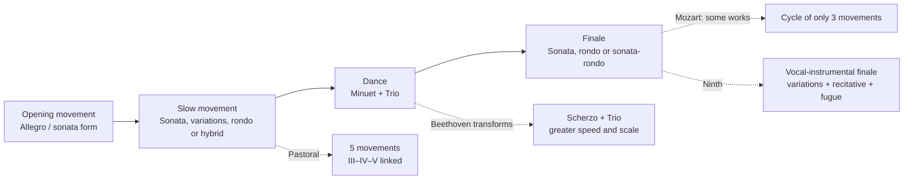
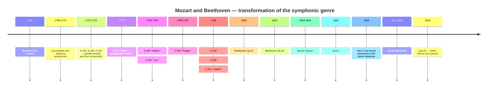
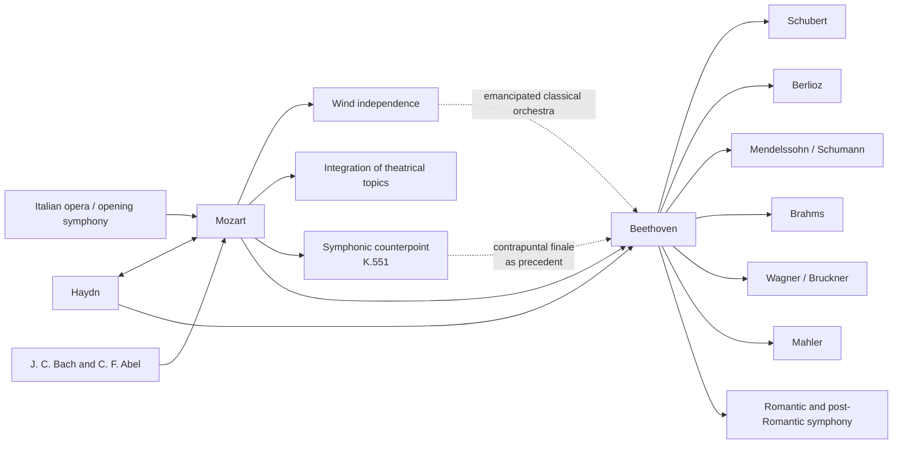

<!-- Translation of: research/sources/author-supplied/beethoven-mozart-symphonic-form.md; source commit: 304d75ed6ff646d311fd9df8b4e2db0d4dee277a -->
# Beethoven and Mozart: catalogue, form, history, reception and legacy of the symphonies

## Executive summary

The symphonic trajectories of **Wolfgang Amadeus Mozart** and **Ludwig van Beethoven** belong to the same historical arc, but represent different moments in the consolidation of the symphony. Mozart accompanied practically the entire transformation of the genre, from the brief three-movement Italian symphony and the operatic overture of the 1760s to the grand Viennese concert symphony of the 1780s. Beethoven received from Haydn and Mozart an already highly sophisticated genre and rebuilt it around monumental scale, dramatic continuity, intensive motivic development, expansive codas, long-range tonal conflicts and, finally, the incorporation of the human voice in the Ninth. The Mozarteum Foundation itself describes Mozart's evolution from an initial standardized orchestra — two oboes, two horns and strings, with trumpets/timpani on festive occasions — to a broader Viennese writing, with flute, clarinets and bassoons increasingly independent. citeturn20view2turn25search0

There is a fundamental asymmetry between the catalogues. **Beethoven wrote nine numbered and authentic symphonies**, corresponding to Opp. 21, 36, 55, 60, 67, 68, 92, 93 and 125. citeturn22search1 For Mozart, "41 symphonies" is a historical convention, not the equivalent of a modern critical catalogue. The old Nos. 2 and 3 are not by Mozart; No. 37 is essentially Michael Haydn's Symphony MH 334, to which Mozart added introductory material; moreover, there are authentic symphonies without traditional number, symphonic versions of overtures and serenades, works of doubtful authenticity and lost symphonies. The new **Köchel-Verzeichnis**, published in 2024 — the first complete new edition since 1964 — updated dates, sources and attributions in light of recent research. citeturn6search0turn7view0turn13search0turn25search2

Formal analysis shows a difference of emphasis, not a simple opposition between "melodic Mozart" and "motivic Beethoven". Mozart can work with extraordinary motivic economy — above all in Symphonies Nos. 40 and 41 — but tends to build large forms through **plurality of topics, contrasts of character, dialogue between instrumental families, counterpoint and reinterpretation of operatic gestures**. Beethoven takes further the capacity of a minimal cell to generate structure: the paradigmatic example is the Fifth, in which a four-note rhythmic figure permeates different thematic functions and inserts itself into a global trajectory from C minor to C major. The *Eroica*, the Fifth, the Pastoral and the Ninth expand the very definition of the symphonic cycle. Recent studies insist, however, that the Beethovenian revolution must be understood as a transformation of paradigms already existing in Haydn and Mozart, not as creation ex nihilo. citeturn17search6turn17search10

In Mozart, three major turning points are particularly clear: **Symphony No. 25 in G minor, K. 183**, with contrapuntal intensity and exceptionally dark orchestration; the **"Paris", K. 297**, conceived for a grand public concert and an orchestra that included clarinets; and the sequence **"Haffner"–"Linz"–"Prague"–No. 39–40–"Jupiter"**, in which scale, wind independence, chromaticism and contrapuntal integration reach a new level. Mozart's letter of 9 July 1778 confirms both the enormous public success of the "Paris" and the controversy over its Andante, considered excessively modulatory by the director Joseph Legros; Mozart wrote a second version of the movement. citeturn30view0turn31view0

In Beethoven, the nine works form a particularly revealing sequence: the First still plays consciously with Haydnesque-Mozartian expectations; the Second expands scale and rhetoric; the Third radically alters proportions and the function of the coda; the Fourth refines ambiguity and humour; the Fifth produces unprecedented cyclic continuity; the Sixth converts the cycle into five programmatic "scenes"; the Seventh makes rhythm the structuring principle; the Eighth revisits, ironically, 18th-century models; and the Ninth transforms the symphony into an instrumental-vocal synthesis. The Beethoven-Haus historical pages document these geneses, premieres and revisions from autographs, sketches, first editions and contemporary sources. citeturn4search0turn3search0turn4search1turn4search3turn3search2turn3search3turn5search0

For critical study, the safest editorial references are the **Neue Mozart-Ausgabe (NMA), Series IV, group 11**, with its ten volumes of symphonies and critical reports, and, for Beethoven, both the scores derived from the **Neue Beethoven-Gesamtausgabe** published by Henle and the critical-Urtext edition by **Jonathan Del Mar** for Bärenreiter. citeturn10search3turn22search0turn22search1 In recordings, a comparative study benefits from placing historically informed performances alongside the grand modern symphonic tradition: for Mozart, Trevor Pinnock/The English Concert is a complete HIP reference; for Beethoven, John Eliot Gardiner/Orchestre Révolutionnaire et Romantique and Nikolaus Harnoncourt/Chamber Orchestra of Europe offer two different ways of rethinking articulation, size, balance and rhetoric in light of historical research. citeturn23search1turn23search6turn23search2turn23search23

## Scope, sources, terminology and attribution problems

**Catalogue criterion.** For Beethoven, "complete catalogue of symphonies" is unambiguous: nine finished and numbered symphonies. For Mozart, this report separates four layers: the 41 works of the traditional numbering; additional works included in the NMA symphonic series; symphonic versions derived from operas or serenades; and spurious, doubtful, fragmentary or lost works. The NMA distributes Mozart's symphonies across ten volumes of Series IV/11, edited, among others, by Gerhard Allroggen, Wilhelm Fischer, Hermann Beck, Christoph-Hellmut Mahling, Friedrich Schnapp, Günter Haußwald, László Somfai and H. C. Robbins Landon. citeturn10search3turn10search0turn10search1turn10search2turn11search0turn11search1turn11search2turn12search0turn12search1

**Köchel versus opus.** The number **K. or KV** (*Köchel-Verzeichnis*) is the normal musicological identifier of Mozart's works. The expression "opus" does not constitute a systematic catalogue of Mozart: some historical editions assigned editorial opus numbers to published sets, but they do not have the function that Op. numbers have in Beethoven. Therefore, in the Mozart table, "Op." appears as **not applicable**. The online Köchel currently reflected by the Mozarteum Foundation derives from the new 2024 edition and may supply broader or different dates than those enshrined by the sixth edition; K. 183, for example, is today officially dated within a range from March 1773 to May 1775, although older literature usually places it specifically in the autumn of 1773. citeturn7view0turn25search3

**Authenticity status.** The old Symphony No. 3, historically K. 18, is now catalogued as **KV Anh. A 51**, an authenticated work by **Carl Friedrich Abel**, not by Mozart. citeturn13search0 No. 2, K. 17/Anh. C 11.02, also does not belong to Mozart's authentic corpus and is attributed to Leopold Mozart in modern bibliography. The old No. 37, K. 444/425a, is currently catalogued as **KV Anh. A 53 / MH 334**, a symphony by Michael Haydn with Mozart's participation. citeturn16search0turn25search2 K. 84 is an example of a case still explicitly classified by the new Köchel as of **"doubtful authenticity"**; old sources attribute it alternately to Wolfgang, Leopold Mozart and Dittersdorf. citeturn25search1

**Form.** Terms such as "sonata form" are used here analytically. In the symphonies of the 1760s, saying "sonata form" can be anachronistic if understood as the 19th-century school model. In many first movements it is more precise to speak of **binary sonata form or early sonata**, in which exposition, recapitulation and development do not yet possess the proportions and functions we find in the 1780s. The very history of the symphony shows a passage from Italian overture models and binary structures to an increasingly differentiated organization of the four movements. Modern literature on the classical symphony emphasizes precisely this historical plurality. citeturn17search4turn17search8

**Orchestration.** In Mozart's early symphonies, the typical core is strings, two oboes and two horns; trumpets and timpani appear above all in festive works. At the Salzburg court, flautists and oboists could be the same musicians, a factor that helps explain why flutes and oboes do not always appear simultaneously. In the Viennese period, clarinets and bassoons become independent voices to a much greater degree. citeturn25search0turn20view2 Beethoven begins within this classical world, but progressively converts horns, trumpets, timpani and woodwinds into formal agents, culminating in the timbral expansions of the Fifth, Sixth and Ninth.

The flowchart below summarizes **an archetype**, not a rigid rule:

This formal genealogy corresponds to the historical picture documented by the NMA for Mozart and by the critical sources of Beethoven's nine symphonies. citeturn10search0turn10search1turn12search1turn4search3turn5search0

## Catalogue, chronology, premieres and documentary sources

**Catalogue table — Beethoven.**

| Symphony | Key | Composition | Catalogue | Premiere / first known performance | Performers and notes |
|---|---|---:|---|---|---|
| No. 1 | C major | 1799–1800 | **Op. 21** | 2 Apr. 1800, Hofburgtheater/Burgtheater, Vienna | Akademie organized by Beethoven; programme included Mozart, Haydn, a piano concerto and Beethoven's Septet. citeturn4search0 |
| No. 2 | D major | 1800–1802 | **Op. 36** | 5 Apr. 1803, Theater an der Wien | First securely documented public performance, in a Beethoven Akademie; possible earlier private performance. citeturn3search0 |
| No. 3 "Eroica" | E♭ major | 1803–1804 | **Op. 55** | private for Lobkowitz, 1804; public 7 Apr. 1805, Theater an der Wien | Lobkowitz's orchestra in the first performances; definitive dedication to Prince Lobkowitz. citeturn4search1turn2search5turn2search17 |
| No. 4 | B♭ major | 1806 | **Op. 60** | probably Mar. 1807, Lobkowitz palace, Vienna | Private performance associated with the Lobkowitz household; dedicated to Count Franz von Oppersdorff. citeturn3search1 |
| No. 5 | C minor | 1804–1808 | **Op. 67** | 22 Dec. 1808, Theater an der Wien | Beethoven conducted the famous Akademie of approximately four hours; makeshift orchestra and difficult conditions. citeturn2search0turn4search2 |
| No. 6 "Pastoral" | F major | 1807–1808 | **Op. 68** | 22 Dec. 1808, Theater an der Wien | Same Akademie as the Fifth; in the programme, the Pastoral was presented before the Symphony in C minor. citeturn4search3turn2search0 |
| No. 7 | A major | 1811–1812 | **Op. 92** | 8 Dec. 1813, University of Vienna | Benefit concert conducted by Beethoven, together with *Wellington's Victory*; great success. citeturn3search2 |
| No. 8 | F major | 1812 | **Op. 93** | 27 Feb. 1814, Redoutensaal, Vienna | Beethoven conducted; programme also included the Seventh and *Wellington's Victory*. citeturn3search3 |
| No. 9 | D minor | 1822–1824; sketches since 1815 | **Op. 125** | 7 May 1824, Kärntnertortheater, Vienna | Michael Umlauf exercised effective direction while Beethoven remained on stage; Henriette Sontag, Caroline Unger, Anton Haizinger and Joseph Seipelt formed the solo quartet. citeturn5search0turn2search19 |

The dating of the Second deserves a correction to a very widespread biographical narrative: the Beethoven-Haus stresses that a substantial portion of the work was already conceived before the famous Heiligenstadt Testament, which makes it simplistic to interpret its exuberance as a direct "response" to the crisis of 1802. citeturn3search0 The Seventh, in turn, is documented by the autograph with "1812 Aug. 13" and premiered in the context of the Napoleonic Wars, in a benefit event. citeturn3search2

**Catalogue table — Mozart, historical numbering 1 to 41.** "—" under premiere means that a specific first presentation is not documentarily recoverable with certainty; this is particularly common in the Salzburg works, many of which were written for court use without individual premiere documentation. citeturn25search0

| Historical No. | Key | Approximate / current date | Köchel | Op. | Premiere or identifiable first performance | Status |
|---|---|---|---|---|---|---|
| 1 | E♭ | 1764 | **K. 16** | — | London, 21 Feb. 1765 | authentic. citeturn10search0turn21search16 |
| 2 | B♭ | c. 1765 | **K. 17 / Anh. C 11.02** | — | — | **spurious; attributed to Leopold Mozart**. citeturn16search0turn16search4 |
| 3 | E♭ | 1764 | **K. 18; now Anh. A 51** | — | work by Abel | **Carl Friedrich Abel**, not Mozart. citeturn13search0 |
| 4 | D | 1765 | **K. 19** | — | — | authentic. citeturn10search0 |
| 5 | B♭ | 1765 | **K. 22** | — | probably The Hague period; exact premiere uncertain | authentic. citeturn10search0 |
| 6 | F | 1767 | **K. 43** | — | — | authentic. citeturn10search0 |
| 7 | D | 1768 | **K. 45** | — | — | authentic. citeturn10search0 |
| 8 | D | 1768 | **K. 48** | — | — | authentic. citeturn10search0 |
| 9 | C | c. 1769–72 | **K. 73 / 75a** | — | — | authentic; historical chronology revised. citeturn10search0 |
| 10 | G | 1770 | **K. 74** | — | — | authentic. citeturn10search1 |
| 11 | D | 1770 | **K. 84 / 73q** | — | — | **doubtful authenticity**. citeturn25search1 |
| 12 | G | 1771 | **K. 110 / 75b** | — | — | authentic. citeturn10search1 |
| 13 | F | 1771 | **K. 112** | — | — | authentic. citeturn10search1 |
| 14 | A | 30 Dec. 1771 | **K. 114** | — | — | authentic; official autograph date. citeturn25search0 |
| 15 | G | 1772 | **K. 124** | — | — | authentic. citeturn10search1 |
| 16 | C | 1772 | **K. 128** | — | — | authentic. citeturn10search2 |
| 17 | G | 1772 | **K. 129** | — | — | authentic. citeturn10search2 |
| 18 | F | 1772 | **K. 130** | — | — | authentic. citeturn10search2 |
| 19 | E♭ | 1772 | **K. 132** | — | — | authentic; alternatives for the slow movement survive. citeturn10search2 |
| 20 | D | 1772 | **K. 133** | — | — | authentic. citeturn10search2 |
| 21 | A | 1772 | **K. 134** | — | — | authentic. citeturn10search2 |
| 22 | C | 1773 | **K. 162** | — | — | authentic. citeturn11search0 |
| 23 | D | traditionally 1773; current catalogue admits broader range | **K. 181** | — | — | authentic. citeturn14search3 |
| 24 | B♭ | 1773 | **K. 182** | — | — | authentic. citeturn11search0 |
| 25 | G minor | traditionally 1773; now: Mar. 1773–May 1775 | **K. 183 / 173dB** | — | — | authentic; 4 horns. citeturn25search3 |
| 26 | E♭ | 1773 | **K. 184 / 161a** | — | — | authentic. citeturn11search0 |
| 27 | G | c. 1773 | **K. 199 / 161b** | — | — | authentic. citeturn11search0 |
| 28 | C | c. 1773–75 | **K. 200 / 189k** | — | — | authentic; old date on the autograph presents problems. citeturn25search4 |
| 29 | A | 1774 | **K. 201 / 186a** | — | — | authentic. citeturn11search1 |
| 30 | D | 1774 | **K. 202 / 186b** | — | — | authentic. citeturn11search1 |
| 31 "Paris" | D | June 1778 | **K. 297 / 300a** | — | **18 June 1778, Concert Spirituel, Tuileries, Paris** | authentic; Concert Spirituel orchestra; Joseph Legros directed the institution. citeturn21search13turn30view0 |
| 32 | G | 26 Apr. 1779 | **K. 318** | — | — | authentic; continuous structure in three sections. citeturn11search2turn17search20 |
| 33 | B♭ | 1779; later revisions | **K. 319** | — | — | authentic. citeturn11search2 |
| 34 | C | 1780 | **K. 338** | — | — | authentic; three movements. citeturn11search2 |
| 35 "Haffner" | D | 1782; revised 1783 | **K. 385** | — | **23 Mar. 1783, Burgtheater, Vienna** | Mozart conducted his Akademie; origin in festive music for the Haffner family. citeturn27search21turn27search17turn27search32 |
| 36 "Linz" | C | 30 Oct.–early Nov. 1783 | **K. 425** | — | **4 Nov. 1783, Linz theatre** | hastily written for a concert announced by Count Thun. citeturn31view1turn27search8 |
| 37 | G | c. 1783–84 | old **K. 444/425a; now Anh. A 53 / MH 334** | — | version related to the Linz stay | **Michael Haydn; Mozart's contribution in the introduction**. citeturn25search2turn27search8 |
| 38 "Prague" | D | 6 Dec. 1786 | **K. 504** | — | **19 Jan. 1787, Prague, theatre then associated with the National/Estates Theatre** | Mozart led the concert. citeturn27search6turn27search10 |
| 39 | E♭ | **26 June 1788** | **K. 543** | — | specific premiere **not securely identified** | authentic. citeturn14search2turn28search9 |
| 40 | G minor | **25 July 1788**; later version with clarinets | **K. 550** | — | uncertain private premiere; documentable/probable performances in 1791 | authentic, two versions. citeturn14search0turn28search16 |
| 41 "Jupiter" | C | **10 Aug. 1788** | **K. 551** | — | specific premiere not preserved | authentic; Mozart's last symphony. citeturn20view2turn28search9 |

The "Paris" constitutes the best-documented case of immediate reception among Mozart's pre-Vienna symphonies. The family correspondence records the success at the Concert Spirituel; Leopold expressly congratulated his son, and Mozart wrote that the work had been received "incomparably well". The same letter shows that Mozart thought strategically about public effects, Parisian audience expectations and even the replacement of the slow movement. citeturn31view2turn31view0

The genesis of the "Linz" is equally exceptionally well documented. On 31 October 1783 Mozart wrote to Leopold that Count Thun had announced a concert for 4 November and, as he had brought no symphony with him, he was working "at full speed" on a new one. The letter is primary evidence for the extraordinarily compressed circumstances of the composition. citeturn30view1turn31view1

**Relevant additional symphonies and versions outside the 1–41 series.**

| Work | Key | Approximate date | Critical situation |
|---|---|---:|---|
| K. Anh. 223 / 19a | F | c. 1765 | included in the NMA among the early symphonies. citeturn10search0 |
| K. Anh. 221 / 45a, "Old Lambach" | G | c. 1766 | transmitted in the NMA; historically the object of attributive debate. citeturn10search0 |
| K. Anh. 214 / 45b | B♭ | c. 1768 | problematic attribution; critically included in the NMA. citeturn10search0 |
| K. 75 | F | c. 1771 | traditional No. 42; authenticity disputed. citeturn10search1turn16search4 |
| K. 76 / 42a | F | 1760s | traditional No. 43; attribution disputed. citeturn10search0turn16search4 |
| K. 81 / 73l | D | 1770 | traditional No. 44; attribution disputed. citeturn10search1 |
| K. 95 / 73n | D | c. 1770 | traditional No. 45; attribution disputed. citeturn10search1 |
| K. 96 / 111b | C | c. 1771 | traditional No. 46; attribution disputed. citeturn10search1 |
| K. 97 / 73m | D | c. 1770 | traditional No. 47; attribution disputed. citeturn10search1 |
| K. 111 + K. 120 / 111a | D | 1771 | symphonic version linked to the overture of *Ascanio in Alba*; traditional No. 48. citeturn10search1 |
| Overture K. 126 + K. 161/163 | D | 1772 | symphonic version associated with *Il sogno di Scipione*; known as No. 50. citeturn10search2 |
| Overture K. 196 + K. 121 / 207a | D | 1774–75 | symphonic version formed by overture + finale. citeturn11search1 |
| Overture K. 208 + K. 102 / 213c | C | 1775 | **incomplete** symphonic version associated with *Il re pastore*. citeturn11search1 |
| Symphonic version of K. 204 / 213a | D | 1775 | serenade reduction. citeturn9view1 |
| Symphonic version of K. 250 / 248b, "Haffner Serenade" | D | 1776 | serenade reduction; the original festive work was played for the Haffners on 21 July 1776. citeturn14search4turn9view1 |
| Symphonic version of K. 320, "Posthorn" | D | 1779 | serenade reduction. citeturn9view1 |
| K. 409 | C | early 1780s | isolated symphonic minuet, **not a complete symphony**. citeturn12search2 |
| K. Anh. 220 / 16a, "Odense" | A minor | historically attributed to the young Mozart | strongly problematic authenticity; must remain outside the safe core. citeturn16search4 |
| K. Anh. 216 / 74g | B♭ | uncertain | traditional No. 54; doubtful. citeturn16search4 |
| K. Anh. 214 / 45b | B♭ | uncertain | traditional No. 55; doubtful. citeturn16search4 |
| K. 98 / Anh. C 11.04 | F | uncertain | traditional No. 56; doubtful/spurious attribution. citeturn16search4 |

There are also references to **lost symphonies** — including K. 19b and various old items from the Köchel appendices — for which there is not enough material for a complete formal analysis. The official catalogue itself notes that Mozart would have written about fifteen symphonies during the great European journey of 1763–66 and that several were lost. citeturn20view2turn16search0

**Synthetic timeline:**

The chronology shows that the "classical symphony" is not a frozen model: between K. 16 and K. 551 Mozart traverses more than two decades of institutional and stylistic changes, while Beethoven, in only about twenty-four years, converts this legacy into a genre of ever-greater aesthetic ambition. citeturn20view2turn4search0turn5search0

## Formal anatomy and movement-by-movement analysis

Throughout this section, "SF" means **sonata form**; "bin./son." indicates a binary form whose logic already anticipates sonata procedures; "T–D" means movement from the tonic to the dominant, and "T–rel." the typical passage to the relative major in works in a minor key. The identifications are analytical readings of the critical scores; classical movements frequently admit more than one defensible formal interpretation. The NMA supplies the base critical text for Mozart and the Henle/Bärenreiter editions the modern equivalent for Beethoven. citeturn10search3turn22search0turn22search1

**Beethoven, Symphony No. 1 in C major, Op. 21.** The first movement begins with a deliberately disorienting *Adagio molto*: instead of immediately affirming C major, Beethoven projects harmonies that sound like dominants of neighbouring regions, above all a dominant of F, prolonging the refusal of the tonic. The *Allegro con brio* finally establishes C major and uses a Haydnesque-profile sonata form, but with greater dynamic aggression, scales and wind accentuation. The development fragments the cells and explores modulating sequences before the recovery of the tonic. The **II, Andante cantabile con moto**, in F major, is a lyrical sonata in which imitation and light counterpoint coexist with discreetly integrated trumpets and timpani — unusual instrumentation for the conventional image of a "delicate slow movement". The **III, Menuetto: Allegro molto e vivace**, nominally a minuet, is functionally a scherzo: too fast, syncopated and energetically unstable for the traditional aristocratic dance. The **IV** begins with a slow-introduction joke in which the C scale is revealed note by note; the *Allegro molto e vivace* converts the gesture into a sonata finale of Haydnesque speed and humour. The work, therefore, does not abandon Haydn and Mozart: it makes knowledge of this vocabulary the condition for disturbing the listener's expectations. citeturn4search0turn22search9

**Symphony No. 2 in D major, Op. 36.** The **I, Adagio molto – Allegro con brio**, considerably expands the slow introduction, with excursions into the minor mode, chromaticism and chords of ambiguous function before the exuberant SF in D. The development and coda already exceed the common proportions of the First; the coda ceases to be simple confirmation and begins to participate in the elaboration. The **II, Larghetto, A major**, is an extensive lyrical sonata form: long ornamented phrases coexist with imitation and a highly differentiated woodwind palette. The **III is explicitly called Scherzo**, consolidating the replacement of the minuet in the Beethovenian symphonic cycle; sudden contrasts of dynamics and register are constitutive of the form. The **IV, Allegro molto**, is born from an abrupt, almost grotesque motif that functions as a recurring signal; the form mixes sonata and rondo characteristics and culminates in an extraordinarily long coda, anticipating the structural importance the coda will have in the *Eroica*. citeturn3search0turn22search5

**Symphony No. 3 in E♭ major, Op. 55, "Eroica".** The **I, Allegro con brio**, eliminates the slow introduction: two fortissimo E♭ chords immediately launch a theme based on the tonic arpeggio. Almost at once, however, a C♯ foreign to the key destabilizes the harmonic field. The exposition contains not only "theme 1/theme 2", but a network of thematic groups, syncopated rhythms and metric conflicts. The development is colossal: it fragments cells, creates chains of dissonances and presents famous new material in E minor. The famous apparently "premature" horn entry near the recapitulation intensifies temporal ambiguity. The coda functions as a **second development**, rebuilding the material instead of simply closing. The **II, Marcia funebre: Adagio assai**, in C minor, combines march, rondo and ternary/variational architecture; episodes in C major and fugal sections convert the march into a collective process of lament and rebuilding. The **III, Scherzo**, definitively replaces the sociability of the minuet with speed, surprise and tension; the Trio gives spectacular prominence to **three horns**, a significant expansion of the section. The **IV** is a synthesis of variation, fugue and finale logic on material Beethoven had already used in *The Creatures of Prometheus* and other pieces: it begins from the theme's bass before presenting its melodic surface and subjects it to contrapuntal and lyrical transformations. The decisive innovation is not only "duration": it is the conversion of the entire cycle into a large-scale dramatic argument. citeturn4search1turn17search6turn22search11

**Symphony No. 4 in B♭ major, Op. 60.** The **I** begins with an *Adagio* whose rarefied texture and initially sombre course make the B♭ tonic seem distant; the explosion of the *Allegro vivace* resolves this suspension and begins an extraordinarily mobile SF, based on scales, arpeggios and rhythmic displacements. The **II, Adagio in E♭**, is structured by a dotted accompanimental rhythm that becomes as important as the melodies; clarinet and other woodwinds acquire strong thematic personality. The **III, Allegro vivace**, is an expanded five-part scherzo — scherzo–trio–scherzo–trio–scherzo — a procedure Beethoven will reuse in the Seventh. The **IV, Allegro ma non troppo**, is a semiquaver *perpetuum mobile*: the strings' virtuosity is punctuated by comic wind interventions, including the famous bassoon moment. The Fourth demonstrates that Beethovenian innovation does not equal gigantism: here it lies in ambiguity, rhythm, speed and irony. citeturn3search1

**Symphony No. 5 in C minor, Op. 67.** In the **I, Allegro con brio**, the short-short-short-long cell must not be understood only as a "theme": it is a **rhythmic generator** that traverses transitions, accompaniment, tuttis and coda. The exposition departs from C minor and heads to E♭ major; the development reduces the texture to ever-smaller fragments. In the recapitulation, an unexpected almost cadenza-like oboe solo temporarily suspends the drive. The coda again assumes a developmental function. The **II, Andante con moto, A♭ major**, alternates two thematic complexes in a process of **double variations**; fanfare episodes in C major begin to anticipate the triumphal key of the finale. The **III, Allegro, C minor**, rhythmically transforms the first movement's cell in the horns; the trio is fugal and energetic. On returning, the scherzo is reduced to a ghost in *pianissimo*, and a long dominant leads **without interruption** to the finale. The **IV, Allegro, C major**, adds piccolo, contrabassoon and trombones to the orchestral mass; the transformation from C minor to C major becomes a formal and timbral event simultaneously. A recollection of the scherzo before the recapitulation establishes true cyclic memory. The Fifth is, therefore, less a literal narrative of "fate" than an extraordinary study in motivic integration, continuity between movements and global-scale tonality. citeturn4search2turn17search3

**Symphony No. 6 in F major, Op. 68, "Pastoral".** Beethoven supplies titles to the five movements and insists it is more an expression of feelings than literal painting. The **I, "Awakening of cheerful feelings on arriving in the countryside"**, is an SF in F major whose novelty lies in extensive repetitions of small modules, long stable harmonic fields and subdominant/plagal emphasis; the goal is less teleological conflict than a sensation of permanence. The **II, "Scene by the brook", B♭ major**, keeps an undulating figure in compound metre under woodwind melodies; at the end, Beethoven explicitly identifies nightingale, quail and cuckoo in flute, oboe and clarinet. The **III, "Merry gathering of country folk"**, is a scherzo in which accent deformations and a caricature of a village band replace the minuet's elegance. Without a conventional cadence, the feast is interrupted by the **IV, "Storm", F minor**, an almost entirely processual movement: tremolos, chromaticism, diminished sevenths, timpani, piccolo and trombones create continuous intensification. The storm dissolves directly into the **V, "Shepherds' song; cheerful and thankful feelings after the storm"**, in F major, a hybrid of rondo, sonata and pastoral hymn, dominated by plagal cadences and a chorale-like theme. The last three movements form an uninterrupted sequence, an important precedent for Romantic programmatic cycles. citeturn4search3turn17search3

**Symphony No. 7 in A major, Op. 92.** The **I, Poco sostenuto – Vivace**, has one of Beethoven's largest slow introductions: ascending scales and sustained chords lead through regions such as C and F before a repeated note turns into the pulse of the *Vivace* in 6/8. The SF that follows is governed by an obsessive dotted figure. The **II, Allegretto, A minor**, begins with a chord and a rhythmic ostinato whose recurrence sustains variations, contrapuntal overlay and an episode in A major; the progression of the voices creates an almost architectural accumulation process. The **III, Presto**, places the scherzo in F major, an unexpected key in relation to A; the trio in D major is heard twice, again producing a five-part form. The **IV, Allegro con brio**, in A major, takes rhythmic repetition, syncopations and ostinatos to an almost physical degree; its long coda intensifies the dominant and the repeated bass before resolution. Adorno's later observation that the Seventh would be the "symphony par excellence" is cited by the Beethoven-Haus as an index of its critical fortune. citeturn3search2turn17search7

**Symphony No. 8 in F major, Op. 93.** The **I, Allegro vivace e con brio**, enters directly into F major, but its apparent "classical normality" is undermined by displaced accents, false metric hierarchies and a disproportionately vigorous coda. The **II, Allegretto scherzando, B♭ major**, replaces the slow movement with a rhythmic miniature based on wind pulses; the tradition linking it directly to Mälzel's metronome must be treated with caution, since the anecdote is later and problematic. The **III, Tempo di Menuetto**, is a deliberately archaizing minuet, slow and heavy compared with Beethovenian scherzi. The **IV, Allegro vivace**, constitutes the apex of structural humour: a violently C♯ foreign to F major reappears as a harmonic problem; in the immense coda, Beethoven explores its reinterpretation and remote excursions before the final affirmation of the tonic. The Eighth is "retrograde" only superficially: it is a metacritique of classical procedures. citeturn3search3

**Symphony No. 9 in D minor, Op. 125.** The **I, Allegro ma non troppo, un poco maestoso**, begins not with a finished melody, but with open fifths and fragments that seem to emerge from the indeterminate until crystallizing D minor; sonata form converts this "birth" into a recurring principle, and development/coda violently expand the material. The **II, Molto vivace**, places the scherzo before the slow movement; the fugal theme in D minor and the timpani explosions are counterbalanced by a Trio in D major, swifter and pastoral. The **III, Adagio molto e cantabile, B♭ major**, works two main areas/ideas through ornamental variation and expansion, including contrasts in D major and fanfare episodes. The **IV** begins with an explosive dissonance and instrumental recitatives of cellos and double basses that "reject" reminiscences of the three previous movements. Only then emerges, in D major, the simple melody of the "Ode to Joy", initially in the string basses; instrumental variations, the baritone's entry, chorus, "Turkish" march with percussion, fugue, solemn episode on "Seid umschlungen, Millionen", contrapuntal combination of ideas and an enormous coda follow. The innovation is not only "using a chorus": it is making the finale itself dramatize the insufficiency of the purely instrumental symphony and build a new form from recitative, variation, march, fugue, hymn and symphonic sonority. citeturn5search0turn22search7

**Mozart — compact analysis of the numbered corpus.** The key sequences below condense the movement-by-movement course; in several early works, "early sonata" is deliberately preferable to a rigid school reading. The titles and movement organization are documented by the NMA symphonic volumes. citeturn10search0turn10search1turn10search2turn11search0turn11search1turn11search2turn12search0turn12search1

| Symphony | Movement-by-movement and formal reading | Orchestration, motifs and innovation |
|---|---|---|
| **No. 1, K.16** | I E♭, *Molto allegro*, bin./son.; II C minor, *Andante*, binary; III E♭, *Presto*, fast-binary/early sonata. | Strings + oboes/horns. The slow movement's move to the relative minor introduces unexpected gravity in a childish London work; strong influence of the J. C. Bach/Abel environment. citeturn10search0 |
| **No. 2, K.17** | Traditional structure in B♭, but **must not be analysed as Mozart**. | The attribution to Mozart is rejected; it remains only for historiographical reasons. citeturn16search0 |
| **No. 3, old K.18** | Fast–slow–fast cycle in E♭; galant idiom and thematic transparency. | It is a symphony by **C. F. Abel**, copied by the young Mozart. Its interest lies precisely in showing one of the models the boy studied. citeturn13search0 |
| **No. 4, K.19** | I D, Allegro, bin./son.; II G, Andante; III D, Presto. | Three movements and simple T–D/T–SD harmonic trajectories, typical of the first London period. citeturn10search0 |
| **No. 5, K.22** | I B♭; II E♭; III B♭. Fast–slow–fast format. | More markedly periodic phrases and orchestral responses; assimilation of the international style of the European journey. citeturn10search0 |
| **No. 6, K.43** | I F, early SF; II C, Andante; III F, Menuetto/Trio; IV F, Allegro. | The adoption of four movements brings the work closer to the Austro-German model; the minuet becomes part of the cycle. citeturn10search0 |
| **No. 7, K.45** | D–G–D–D; Allegro / Andante / Menuetto / Allegro. | Festivity in D major, fanfares and clear cadences; balance between Italian and Viennese. citeturn10search0 |
| **No. 8, K.48** | D–G–D–D, four movements. | Strong ceremonial profile; tutti/string-and-wind-layer contrasts. citeturn10search0 |
| **No. 9, K.73** | C–F–C–C; four movements. | Festive Salzburg model; cadences and sequences gain greater breadth. citeturn10search0 |
| **No. 10, K.74** | G, slow/subdominant section associated with the cycle, fast return in G. | Particularly close relation to the Italian overture and to linked movements. citeturn10search1 |
| **No. 11, K.84** | D–G–D, three movements. | Plausibly Mozartian idiom, but contradictory transmission prevents secure attribution. citeturn25search1 |
| **No. 12, K.110** | G–C–G–G. | Four movements; inner lines and viola gain weight relative to the continuo bass of the first models. citeturn10search1 |
| **No. 13, K.112** | F–B♭–F–F. | Greater motivic energy in the tuttis, with clear opposition between string periods and wind reinforcements. citeturn10search1 |
| **No. 14, K.114** | A–D–A–A. | More spacious work; more active inner counterpoint. The current Köchel dates it precisely to 30 Dec. 1771. citeturn25search0 |
| **No. 15, K.124** | G–C–G–G. | Salzburg synthesis between overture brilliance and courtly minuet. citeturn10search1 |
| **No. 16, K.128** | C–G–C, three movements. | Return to the Italian format; compact, strongly cadential outer fast movements. citeturn10search2 |
| **No. 17, K.129** | G–C–G, three movements. | Agile texture and greater differentiation of the second thematic group. citeturn10search2 |
| **No. 18, K.130** | F–B♭–F–F. | Four movements; extent and wind writing already indicate departure from the previous decade's miniatures. citeturn10search2 |
| **No. 19, K.132** | E♭–B♭–E♭–E♭; alternative slow-movement version preserved. | The existence of alternative movements makes the work particularly important for studying revision and choice of character. citeturn10search2 |
| **No. 20, K.133** | D–A–D–D. | D-major brilliance, with greater independence of inner parts and dynamic contrast. citeturn10search2 |
| **No. 21, K.134** | A–D–A–A. | Refined texture, less dependence on pure ceremonial effect. citeturn10search2 |
| **No. 22, K.162** | C–F–C, three movements. | Compact, theatrical and close to the operatic overture gesture. citeturn11search0 |
| **No. 23, K.181** | D–G–D, three sections/movements of theatrical impulse. | Fast gestural continuity; the current Köchel gives a broader date than the old chronology. citeturn14search3 |
| **No. 24, K.182** | B♭–E♭–B♭, three movements. | Galant clarity combined with greater tutti force. citeturn11search0 |
| **No. 25, K.183** | I G minor, SF; II E♭, slow in expanded SF/binary; III G minor, Menuetto, Trio in G major; IV G minor, SF. | Two oboes, two bassoons, **four horns** and strings; syncopations, leaps, tremolos, counterpoint and dynamics confer unusual weight. citeturn25search3 |
| **No. 26, K.184** | E♭ – C minor – E♭, three linked or closely related movements. | Theatrical overture dramaturgy; the slow movement in C minor radically darkens the tonal centre. citeturn11search0 |
| **No. 27, K.199** | G–D–G. | Light appearance, but thematic elaboration and inner lines more flexible than in the first symphonies. citeturn11search0 |
| **No. 28, K.200** | C–F–C–C. | Trumpets available in the sources and ceremonial character; growing interaction between fanfare and lyricism. citeturn25search4 |
| **No. 29, K.201** | I A, SF; II D, Andante; III A, Menuetto; IV A, SF in 6/8. | One of the first mature symphonies: counterpoint, imitation and motifs reappear under different functions; finale unites dance and development. citeturn11search1 |
| **No. 30, K.202** | D–A–D–D. | Greater rhythmic energy and expansion of the four-movement form; brilliance still associated with the Salzburg context. citeturn11search1 |
| **No. 31, K.297 "Paris"** | I D, monumental SF; II G, Andante — two versions; III D, Allegro/SF. | Flutes, oboes, **clarinets**, bassoons, horns, trumpets, timpani and strings: unprecedented scale in Mozart. Opening tutti and *piano–forte* contrasts deliberately exploit the Parisian public. citeturn21search13turn31view0 |
| **No. 32, K.318** | Allegro spiritoso in G → contrasting Andante → return of the initial tempo in G, without a normal separate cycle. | Hybrid of overture and symphony, concentrating exposition, slow contrast and fast return in a continuous arc. citeturn11search2turn17search20 |
| **No. 33, K.319** | B♭–E♭–B♭–B♭. | Chamber-like wind balance and greater elaboration of transitions; the cycle was revised. citeturn11search2 |
| **No. 34, K.338** | I C, SF; II F, Andante di molto; III C, fast finale; **no minuet**. | Concentrated and brilliant; the contrast between outer grandeur and lyrical interior anticipates the Viennese decade. citeturn11search2 |
| **No. 35, K.385 "Haffner"** | I D, SF; II G, Andante; III D, Menuetto/Trio; IV D, Presto. | The opening unison motif dominates I; for the symphonic version Mozart expanded winds. Finale of *buffa* energy; Mozart asked for it to be played as fast as possible. citeturn27search25turn27search17 |
| **No. 36, K.425 "Linz"** | I Adagio–Allegro spiritoso, C, SF; II F, Andante/SF; III C, Menuetto; IV C, Presto/SF. | First large-scale slow introduction in a mature Mozart symphony; "solemn" chromaticism and rhetoric bring the work closer to Haydn. citeturn12search3turn27search20 |
| **No. 37, K.444/Anh.A53** | Structure essentially by Michael Haydn in G, with Mozartian introductory contribution. | Must not be used as an example of "Mozart's symphonic style" without authorial qualification. citeturn25search2 |
| **No. 38, K.504 "Prague"** | I D, **Adagio–Allegro**, SF; II G, Andante/SF; III D, Presto/SF. | No minuet, but larger in scale than many four-movement symphonies. Contrapuntal density, syncopations and almost operatic wind treatment. citeturn12search0turn17search5 |
| **No. 39, K.543** | I E♭, Adagio–Allegro, SF; II A♭, Andante con moto; III E♭, Menuetto; IV E♭, Allegro/SF. | **No oboes**: flute, clarinets and bassoons produce an especially soft timbre. Minuet Trio turns the clarinet into a *Ländler*-character protagonist. citeturn14search2turn12search1 |
| **No. 40, K.550** | I G minor, SF; II E♭, Andante/SF; III G minor, Menuetto, Trio G; IV G minor, SF. | Anacruses and "sighs" of I are incessantly fragmented; the finale produces extreme chromatic instability. Versions exist with and without two clarinets. citeturn14search0turn12search1 |
| **No. 41, K.551 "Jupiter"** | I C, Allegro vivace/SF; II F, Andante cantabile/SF; III C, Menuetto; IV C, Molto allegro: SF + invertible counterpoint/fugato. | Finale built from several motifs, among them **C–D–F–E**, contrapuntally combined in the coda; synthesis of "learned" style and symphonic rhetoric. citeturn20view2turn17search1 |

Some works deserve expansion beyond the table.

In **K. 183**, the G-minor key is not merely a code for "sadness". The first movement derives energy from syncopations, unisons, tremolos and leaps, while four horns increase the harmonic mass. The G minor–B♭ major opposition in the exposition follows the tonic–relative pattern, but Mozart makes the return to the minor seem structurally necessary through rhythmic insistence. The minuet abandons the socially light character of the dance and assumes contrapuntal weight; the Trio in G major offers one of the few spaces of decompression. The current official instrumentation confirms two oboes, two bassoons, two pairs of horns and strings. citeturn25search3

**K. 201** is a decisive point because refinement does not depend on orchestral force. The opening seems almost chamber-like; imitation between violins, voice leading and the reappearance of small cells create continuity. In the 6/8 finale, the hunt/dance topic does not prevent a seriously contrapuntal development. The work demonstrates why the image of Mozart as a composer of independent themes and Beethoven as the sole master of development is historically inadequate. citeturn11search1turn17search4

The **"Paris", K. 297**, is a composition explicitly oriented by public space. Its opening exploits the *premier coup d'archet* — the coordinated impact of the grand tutti — and the enormous wind apparatus. Mozart was aware of the expectation of applause during the work and comments on it in his letters; after the success of the first movement, he further wrote that the finale began softly so as to prepare a tutti entry capable of surprising the public. The Concert Spirituel documentation makes K. 297 an exceptional laboratory for relating form, effect and concert sociology. citeturn21search13turn17search24turn31view0

The **"Haffner", K. 385**, shows the reverse process: originally festive/serenade-like music reconceived for the concert. Mozart removed material from the original form and, in preparing the work for Vienna, reinforced the outer movements' instrumentation with flutes and clarinets. In the first movement, the grand opening gesture in octaves obsessively reappears in different contexts; the development does not depend on a contrasting lyrical "second theme" in the usual way. The Akademie of 23 March 1783 probably began with the first three movements and ended with the finale, framing the entire concert with the symphony. citeturn27search17turn27search25

In the **"Linz", K. 425**, the slow introduction converts a work written in the shortest time into a symphony of exceptionally broad rhetoric. Chromatic harmony and dotted rhythms create solemnity before the Allegro in C major affirms the festive character. The Andante in F major incorporates unusual texture and density; the final Presto relocates theatrical vivacity within a rigorous sonata form. The fact that the work was produced between the concert's announcement and 4 November 1783 is directly supported by Mozart's letter. citeturn31view1turn27search8

The **"Prague", K. 504**, is a productive formal paradox: only three movements, yet greater dimension and complexity than many four-movement symphonies. The grand Adagio introduction establishes a field of chromatic tension; the Allegro uses syncopations, imitative entries and voice overlapping, frequently with a drive recalling the theatrical writing of *Le nozze di Figaro*. Elaine Sisman demonstrated how genre, gesture and meaning interact in the work, destabilizing the idea that its "content" can be reduced to a single emotion. citeturn17search5turn12search0

In the **last three symphonies**, composed between 26 June and 10 August 1788, Mozart seems to explore three almost complementary solutions to the symphonic problem: No. 39 privileges timbral warmth and clarinets; No. 40 concentrates chromaticism and restlessness in G minor; No. 41 culminates in contrapuntal integration. There is no firm evidence for the old narrative that Mozart would have written them as a "testament" already anticipating death. The performance history in his lifetime is itself partly obscure: the sources only allow more securely asserting performances of K. 550, while other concert programmes mention "a grand symphony" without sufficient identification. citeturn27search11turn28search9turn28search16

In the **"Jupiter" finale**, the distinction between sonata form and fugue becomes inadequate if taken as an alternative. Mozart does not simply write "a fugue": he disposes multiple subjects and motifs within a sonata architecture, uses invertible counterpoint, imitation and fugal episodes and reserves for the coda an extraordinary simultaneous combination of the material. Literature on the "learned style" and the sublime stresses precisely this fusion of contrapuntal technique with symphonic teleology, which would become a reference point for Beethoven and the 19th century. citeturn17search1turn17search0

**Scores and facsimiles to accompany the analysis.** The historical editions accessible on IMSLP are very useful for comparative reading, although they **do not replace a modern critical edition**:

[IMSLP — Mozart, list of symphonies and historical numberings](https://imslp.org/wiki/Template:Symphonies_(Mozart,_Wolfgang_Amadeus))

[IMSLP — Mozart, Symphony No. 40 in G minor, K. 550](https://imslp.org/wiki/Symphony_No.40_in_G_minor%2C_K.550_(Mozart%2C_Wolfgang_Amadeus))

[IMSLP — Mozart, Symphony No. 41 in C major, K. 551](https://imslp.org/wiki/Symphony_No.41_in_C_major%2C_K.551_(Mozart%2C_Wolfgang_Amadeus))

[IMSLP — Beethoven, Symphony No. 5, Op. 67](https://imslp.org/wiki/Symphony_No.5%2C_Op.67_(Beethoven%2C_Ludwig_van))

[IMSLP — Beethoven, Symphony No. 9, Op. 125](https://imslp.org/wiki/Symphony_No.9%2C_Op.125_(Beethoven%2C_Ludwig_van))

The NMA also reproduces sources and variants. A particularly instructive example is the facsimile preserved in the critical edition of the symphonic version derived from the Serenade K. 320, in which the source's orchestral notation can be directly observed. citeturn9view2

## Comparison, historical reception and influence

**Comparative table of central characteristics.**

| Work / group | Form and scale | Motif/development | Harmony | Orchestration | Decisive innovation |
|---|---|---|---|---|---|
| Mozart K.16–K.48 | 3–4 movements; binary/early sonata | short cells, periodicity | T–D and close subdominant | oboes, horns, strings | rapid international assimilation. citeturn10search0 |
| Mozart K.110–K.134 | more stable 3–4 movements | more imitation and continuity | still concise modulation | winds integrated into the tutti | consolidation of the Salzburg style. citeturn10search1turn10search2 |
| Mozart K.183 | 4 movements | syncopations, incisive rhythms | G minor ↔ relative; chromaticism | 4 horns + bassoons | new "symphonic" intensity. citeturn25search3 |
| Mozart K.201 | 4 movements | counterpoint and motivic economy | classical relations worked with subtlety | relatively light orchestra | depth without gigantism. citeturn11search1 |
| Mozart K.297 | 3 movements | gestures conceived for public effect | expanded modulation, above all in the slow movement | enormous wind section, clarinets | adaptation to the Parisian concert. citeturn21search13turn31view0 |
| Mozart K.318 | continuous arc | structural thematic return | contrast G–subdominant region–G | theatrical | overture/symphony fusion. citeturn11search2 |
| Mozart K.385 | 4 movements | opening gesture dominates I; theatrical finale | diatonic clarity + development | winds reinforced in the revision | transformation of festive music into concert symphony. citeturn27search25 |
| Mozart K.425 | 4 movements | greater Allegro scale | chromatic introduction → C major | trumpets/timpani, independent winds | first great mature slow introduction. citeturn27search20 |
| Mozart K.504 | 3 monumental movements | counterpoint and syncopation | intense expressive chromaticism | dialoguing woodwinds | three movements with "grand symphony" weight. citeturn17search5 |
| Mozart K.543 | 4 | thematic multiplicity | chromaticism under luminous surface | clarinets, **no oboes** | orchestral colour as formal principle. citeturn14search2 |
| Mozart K.550 | 4 | fragmentation of anacruses | G minor, chromaticism, remote regions | two versions, second with clarinets | integration of harmonic and motivic restlessness. citeturn14search0 |
| Mozart K.551 | 4 | five combinable ideas | C/F and complex tonal counterpoint | full festive apparatus | sonata + "learned style" in the finale. citeturn20view2turn17search1 |
| Beethoven Op.21 | 4 | more aggressive cells | introduction avoids the tonic | very present winds | explicit subversion of the classical. citeturn4search0 |
| Beethoven Op.36 | 4 | greater development/coda | expanded modulation | dynamic expansion | nominal scherzo and greater scale. citeturn3search0 |
| Beethoven Op.55 | 4, monumental | continuous transformation | dissonance and remote regions | 3 horns | coda as second development. citeturn4search1 |
| Beethoven Op.60 | 4 | irony and *perpetuum mobile* | tonally ambiguous introduction | highly individualized woodwind solos | five-part scherzo. citeturn3search1 |
| Beethoven Op.67 | 4, movements III–IV joined | almost ubiquitous rhythmic cell | C minor → C major arc | trombones, piccolo, contrabassoon in the finale | cyclic and tonal integration. citeturn4search2 |
| Beethoven Op.68 | **5** | repetitive/figurative modules | stability/plagality + chromatic storm | "birds", trombones/piccolo in the storm | programme and continuous III–V movements. citeturn4search3 |
| Beethoven Op.92 | 4 | rhythm as global principle | bold mediant/subdominant relations | rhythmic masses + woodwinds | supremacy of rhythmic organization. citeturn3search2 |
| Beethoven Op.93 | 4 | metric humour | disruptive C♯ in the finale | deliberately classical texture | parody/reflection on the classical style. citeturn3search3 |
| Beethoven Op.125 | 4, vocal finale | cyclic recapitulation + variations/fugue | D minor → D major | expanded orchestra + soloists + chorus | redefinition of the symphony's boundaries. citeturn5search0 |

**Style and motifs.** Mozart normally maintains a greater number of coexisting topics: march, *buffa* opera, cantabile style, hunt, dance, "learned" counterpoint. Unity is born from the way these topics are placed in dialogue. Beethoven tends to make more explicit the **functional transformation of cells**: material that is initially a theme can become accompaniment, transition, ostinato or coda element. The difference, however, is one of degree. K. 550 continuously fragments its anacrustic cell and K. 551 subjects various motifs to contrapuntal combination as rigorous as any demonstration of Beethovenian thematic unity. Analytical literature on the "Jupiter" stresses precisely that its coda alters the retrospective perception of the entire finale. citeturn17search1turn17search0

**Development and coda.** In Mozart, the development can be compact and highly modulatory, but the recapitulation is frequently the space in which the relation between topics is rewritten. Beethoven gives extraordinary weight to the coda: in the *Eroica*, Fifth and Eighth, it approaches a second development, capable of introducing new crises or reformulating earlier ones. This is one of the reasons why analyses measuring only "exposition–development–recapitulation" underestimate Beethovenian innovation. citeturn17search6turn17search10

**Harmony.** Mozart often employs chromaticism as expressive intensification and voice leading: the slow movements of K. 504, K. 550 and K. 551 are particularly rich in this sense. Beethoven more frequently emphasizes **long-range tonal trajectories**: in the Fifth, the C minor/C major conflict traverses the cycle; in the Ninth, D minor and D major are involved in an equally comprehensive transformation. The difference is not that Mozart is "diatonic" and Beethoven "chromatic", but that Beethoven frequently dramatizes the relation between keys as the cycle's global memory. citeturn17search3turn5search0

**Orchestration.** Mozart was decisive in the emancipation of the woodwinds. No. 39 is practically a demonstration of how to exclude the oboes and build an entire identity around flute, clarinets and bassoons; No. 40 exists in a revised version with clarinets; the "Paris" exploits an exceptionally large orchestra for his earlier repertoire. citeturn14search2turn14search0turn21search13 Beethoven inherits this woodwind independence and adds an increasingly **structural use of timbre**: three horns in the *Eroica*; entry of trombones, piccolo and contrabassoon at the moment of the Fifth's tonal victory; similar resources in the Sixth's storm; voices and enormous apparatus in the Ninth's finale. citeturn4search1turn4search2turn4search3turn5search0

**Mozart reception.** Most of the Salzburg symphonies did not circulate widely during his lifetime, which is why it would be anachronistic to imagine a "canon of the 41 symphonies" already existing in the 18th century. citeturn25search0 The "Paris", by contrast, was deliberately conceived for an international public institution and obtained documented applause. citeturn31view0turn31view2 The "Haffner" was a success at Mozart's 1783 Viennese concert. citeturn27search21turn27search32 The "Prague" became linked to Mozart's extraordinary reception in the city and to the local popularity of *Le nozze di Figaro*. citeturn27search6turn27search10

In the 19th century, the last symphonies increasingly received the status of canonical autonomous works. The "Jupiter" was especially valued as a synthesis of the "sublime" and contrapuntal technique, while K. 550 came to be heard according to Romantic categories of tragedy, restlessness and interiority. The research of Neal Zaslaw and Elaine Sisman was central to shifting the discussion from simplistic emotional biographies to institutional context, performance practice, sources, rhetoric and reception history. citeturn28search1turn17search0turn17search5

**Beethoven reception.** **E. T. A. Hoffmann's review of the Fifth**, published in 1810 in the *Allgemeine musikalische Zeitung* and later reformulated, became a founding text of Romantic musical aesthetics: Beethoven comes to represent music's instrumental capacity to suggest a world beyond the verbally representable. Marta Kawano's study in Portuguese shows the importance of this review for the formation of the Romantic concept of instrumental autonomy. citeturn18search3

The *Eroica* was gradually transformed, above all in the 19th century, into a period-dividing landmark. Modern studies, however, relativize this narrative: the "heroic" vocabulary already existed in earlier symphonic discourse, and Mozart and Haydn had produced models of grandeur, sublimity and instrumental drama. The *Eroica* does not invent each component, but radically alters their scale and structural relation. citeturn17search6turn17search14

The Seventh had an extraordinary immediate reception in 1813 and quickly became popular; the Eighth, much more ironic and structurally ambiguous, was historically overshadowed by its Seventh and Ninth neighbours. citeturn3search2turn3search3 The Ninth acquired a status exceeding strictly musical history: it became a model for the idea of the symphony as philosophical and collective statement, besides provoking a central problem for the 19th century — **how to write a symphony after Beethoven without simply imitating Beethoven?** The weight of this legacy explains both the symphonic expansion of Berlioz, Bruckner and Mahler and the formal anxiety perceptible in Brahms. The Beethoven bibliography understands this process as part of the transformation of the symphony into the privileged genre of 19th-century concert culture. citeturn17search10turn22search5

**Relations and influences:**

The presence of Abel in the diagram is particularly concrete: the work once called "Mozart's Symphony No. 3" is in reality an Abel symphony that Mozart copied, materially showing how the young composer learned through appropriation and study of models. citeturn13search0 The NMA and the Köchel also demonstrate the permeability between genres in Mozart — overtures converted into symphonies and serenades reduced for concert —, which problematizes any history according to which the symphony would have been from the start an autonomous and "absolute" genre. citeturn10search1turn10search2turn9view1

In Brazil, the very construction of the concert repertoire imported the canonical Mozart–Beethoven centrality of the European tradition. Recent Brazilian studies on universalism and canon point out how this centrality was historically constructed and institutionalized, not simply the automatic result of a "timeless" value. citeturn18search16 At the same time, the Brazilian literature on Hoffmann and Beethoven and on Mozart/Haydn demonstrates the existence of a musicological production in Portuguese capable of critically dialoguing with the Anglophone and Germanic bibliography. citeturn18search3turn18search0

## Critical editions, historically informed performance and recordings for study

For **Mozart**, the fundamental textual reference is the **Neue Mozart-Ausgabe, Series IV, group 11, *Sinfonien***. The volumes must not be treated merely as "clean scores": their variants, prefaces and critical reports are essential when there are alternative versions, dating or instrumentation problems. K. 132, for example, preserves a slow-movement alternative; K. 297 has alternative slow movements; K. 550 exists in two orchestrations. citeturn10search2turn11search1turn12search1

| Edition | Recommended use | Why |
|---|---|---|
| **Neue Mozart-Ausgabe IV/11, volumes 1–10** | research, analysis, source comparison | official critical-scholarly edition; covers symphonies, versions and variants. citeturn10search3 |
| **Köchel-Verzeichnis 2024 / Mozarteum** | dating, authenticity, sources, instrumentation | incorporates modern revision of attributions and chronology; first completely new Köchel since 1964. citeturn7view0 |
| **Bärenreiter/NMA performance material** | rehearsal and performance | keeps a direct relation to the NMA critical text. citeturn10search3 |
| **IMSLP, old editions** | historical comparison and free reading | excellent access resource, but must not prevail over the NMA when there are relevant textual variants. citeturn16search4 |

For **Beethoven**, there are two especially useful modern editorial families. The edition by **Jonathan Del Mar for Bärenreiter**, initially published between 1996 and 2000, was built as a critical-Urtext edition of the nine symphonies; the publisher itself records that the Ninth began the project in 1997 and that the others were published afterwards. citeturn22search2turn22search18 Henle publishes Urtext study scores based on the text of the **Beethoven Complete Edition / Neue Beethoven-Gesamtausgabe**, with different editors according to the work. citeturn22search1turn22search3

| Edition | Recommended use | Note |
|---|---|---|
| **Bärenreiter, Jonathan Del Mar** | conducting, performance, articulation/dynamics comparison | one of the most influential critical-Urtext editions of recent decades. citeturn22search0turn22search2 |
| **Henle Urtext / Neue Beethoven-Gesamtausgabe** | analysis and research | pocket scores based on the new complete edition, with editorial apparatus and prefaces. citeturn22search1turn22search9 |
| **Gesamtausgabe critical reports** | advanced philological decisions | necessary for variants, corrections and conflicts between autograph, parts, revised copies and first editions. citeturn22search3turn22search7 |

The edition preferred by the user was **unspecified**; therefore, for academic analysis, the recommendation is to confront at least NMA/Köchel for Mozart and Del Mar/Henle-NGA for Beethoven, rather than dogmatically choosing only one editorial line.

**Historically informed performance (HIP)** is especially instructive in these works because it alters variables affecting formal perception: shorter articulation, natural horn and trumpet attacks, skin timpani, different balance between strings and winds, less continuous vibrato, careful observance of repeats and reconsideration of tempi. There is, however, no single "authentic sonority": orchestra size, continuo in Mozart, amount of vibrato, realization of dynamics and interpretation of metric indications remain questions of evidence and judgement. The importance of Zaslaw's book lies precisely in integrating context, reception and performance practice, instead of treating HIP as a simple collection of rules. citeturn28search1

**Mozart — priority recordings for study.**

**Trevor Pinnock / The English Concert — *The Symphonies*, Archiv Produktion.** It is the first recommendation for a systematic HIP reading because it allows comparing practically the entire symphonic development within a coherent interpretative aesthetic: period instruments, clear attacks, contrapuntal transparency and lively dance rhythms. Deutsche Grammophon/Archiv keeps the complete set in its digital catalogue. citeturn23search1turn23search13 For study, it is worth hearing especially K. 183, 201, 297, 385, 425, 504, 543, 550 and 551 alongside the NMA.

**Christopher Hogwood / Academy of Ancient Music.** The historical complete set constitutes another reference point of the first great HIP generation; it is especially useful for perceiving how decisions about ensemble size, repetition, articulation and bass alter the early symphonies, which frequently sound heavy in later symphonic traditions. As a methodological control, it is more valuable when compared, not taken as "definitive reconstitution".

**Nikolaus Harnoncourt in Mozart.** His readings with modern or hybrid historically informed orchestras are useful as a counterpoint to the purely "light" approach: Harnoncourt emphasizes rhetoric, dissonance, attacks and inner-voice articulation, making K. 550 and K. 551 sound less like classical porcelain and more like dramatic discourse. The importance of his application of HIP principles to modern orchestras is recognized by Warner itself in the documentation of his career. citeturn23search11

For a **comparison with the Central European post-war symphonic tradition**, recordings by Karl Böhm with the Berlin Philharmonic are pedagogically useful: not because they represent "the true text", but because they allow hearing the legato, string masses, vibrato and phrase proportions that dominated a substantial part of 20th-century recorded reception. The Deutsche Grammophon catalogue preserves his symphonic Mozart as an important part of this tradition. citeturn23search16

**Beethoven — priority recordings for study.**

**John Eliot Gardiner / Orchestre Révolutionnaire et Romantique — complete set.** For studying Beethoven through the HIP lens, it is probably the most efficient reference: period instruments, natural horns and trumpets, energetic tempi, incisive articulation and strong exposure of inner voices. Deutsche Grammophon/Archiv documents the complete set and specific editions of 3–4, 5–6 and 7–8. citeturn23search6turn23search21turn23search9turn23search3 Listen especially to how the Fifth's III–IV transition changes when the bass is more transparent and the natural brass enter in the finale.

**Nikolaus Harnoncourt / Chamber Orchestra of Europe — complete set.** Here the interest is different: predominantly modern instruments, but an approach deeply informed by rhetoric and historical practice. The complete recording made in 1991 received the *Orchestral* and *Recording of the Year* awards from *Gramophone* in 1992, according to Warner. citeturn23search23turn23search2 It is especially productive for comparing with Gardiner: Harnoncourt preserves a greater modern symphonic body while questioning conventional articulation, phrasing and balance.

**Herbert von Karajan / Berliner Philharmoniker, 1960s cycle.** As a document of the modern tradition of high orchestral homogeneity, it offers the necessary contrast: dense strings, long lines, brass integrated into a timbral mass and continuity of pulse. For a conducting or analysis student, the value lies precisely in hearing how much the same score can build another perceptive architecture.

**Roger Norrington / London Classical Players** is equally important in the history of Beethovenian HIP for his systematic attempt to take metronome indications, classical articulation and restricted vibrato seriously. He must be studied comparatively: the question of Beethoven's metronomes continues to raise debate and is not resolved by simply identifying "faster" with "more authentic".

A particularly efficient listening sequence would be to hear **Mozart K. 551, Beethoven 1, Beethoven 3, Beethoven 5 and Beethoven 9** in one HIP and one modern interpretation. The pedagogical gain is immediate: one perceives how note durations, strings/winds balance and articulation can make visible or hide motivic relations that remain identical in the score.

## Annotated bibliography, primary sources and research resources

**Internationale Stiftung Mozarteum. *Köchel-Verzeichnis*, new edition, 2024; online version.** It is the first resource to consult for **authenticity, dating, sources, instrumentation and current numbering**. The new edition is the first complete reconstruction of the catalogue since 1964 and corrects various traditional chronologies. citeturn6search0turn7view0  
[Online Köchel catalogue](https://kv.mozarteum.at/en/)

**Mozart, Wolfgang Amadeus. *Neue Mozart-Ausgabe*, Series IV, group 11: *Sinfonien*, vols. 1–10. Kassel: Bärenreiter.** Indispensable critical source. The volumes cover from K. 16 to K. 551, including variants, symphonic versions of overtures/serenades and problematic attributive cases. The critical reports must be consulted whenever there is divergence between autograph, copies and first editions. citeturn10search3turn10search0turn10search1turn10search2turn11search0turn11search1turn11search2turn12search0turn12search1

**Mozart, Wolfgang Amadeus. Letters and documents, Digital Mozart Edition.** This is the main narrative primary source for the symphonies' genesis and reception. The letter of 9 July 1778 describes the success of the "Paris", the reactions to the Andante and the relation with Joseph Legros; the letter of 31 October 1783 records, in real time, the hurried composition of the "Linz". citeturn30view0turn31view0turn30view1turn31view1

**Zaslaw, Neal. *Mozart's Symphonies: Context, Performance Practice, Reception*. Oxford: Clarendon Press, 1989.** Probably the single most important monograph for research with exactly this report's scope. Its merit is combining the works' history, sources, instrumentation, performance circumstances, historical practice and reception; contemporary academic reception described it as pioneering work on the symphonic set. citeturn28search1turn17search0

**Sisman, Elaine. *Mozart: The "Jupiter" Symphony*. Cambridge University Press.** Central study of K. 551, articulating historical context, the sublime, structure, phrase rhythm, rhetoric and reception. The monograph's organization shows that the "Jupiter" is treated not only as a contrapuntal piece, but as an integral historical-aesthetic problem. citeturn17search0turn28search0

**Sisman, Elaine. "Genre, Gesture, and Meaning in Mozart's 'Prague' Symphony". In *Mozart Studies 2*.** One of the most important analytical works on K. 504. Particularly valuable for overcoming the exclusively "formalist" reading and understanding how gestures, genres and cultural expectations carry meaning within symphonic form. citeturn17search5

**Range, Martin. "The 'Effective Passage' in Mozart's Paris Symphony". *Eighteenth-Century Music*.** Specialized study of the relation between effect, audience and technique in K. 297; must be read together with Mozart's letters on the Concert Spirituel. citeturn17search24turn31view0

**Keefe, Simon P. *Mozart in Vienna: The Final Decade*. Cambridge University Press, 2017.** Essential for contextualizing K. 385, 425, 504 and the last three symphonies in the Viennese concert economy. It is especially important for the question of the **unknown premieres of K. 543, 550 and 551**, since it carefully distinguishes documentary evidence from conjecture. citeturn28search9turn28search15

**Abert, Hermann. *W. A. Mozart*, ed. Cliff Eisen, trans. Stewart Spencer. Yale University Press.** Grand historical-stylistic biography, today best used in dialogue with Zaslaw, Keefe and the 2024 Köchel, because various chronological and attributive conclusions of the old tradition were revised. Recent literature continues to cite it as an important historiographical reference. citeturn28search3

**Monteiro, Eduardo. "O espírito de Mozart pelas mãos de Haydn". *Estudos Avançados*, USP, 2020.** A source in Portuguese particularly useful for thinking about the Mozart–Haydn relation and the classical universe without reducing the composers to stylistic caricatures. citeturn18search0

**Beethoven-Haus Bonn, digital catalogue of works and sources.** For each symphony, the Beethoven-Haus brings together chronology, genesis, dedications, autographs, sketches, first editions and premiere information. For this report, it was the primary institutional source for the nine symphonies. citeturn4search0turn3search0turn4search1turn3search1turn4search2turn4search3turn3search2turn3search3turn5search0

**Beethoven, Ludwig van. *The Nine Symphonies*, ed. Jonathan Del Mar. Bärenreiter Urtext.** One of the fundamental modern editorial references. Del Mar began the series with the Ninth, published in 1997, and completed the remaining symphonies in the following years; the edition critically confronts the different sources instead of automatically perpetuating readings from 19th-century editions. citeturn22search0turn22search2turn22search18

**Beethoven, Ludwig van. *The Symphonies*, Henle Urtext, based on the Beethoven Complete Edition.** The nine study scores total more than a thousand pages and use the text of the modern complete edition, with editors such as Jens Dufner, Bathia Churgin, Beate Angelika Kraus, Armin Raab and Ernst Herttrich. Particularly useful for pocket analytical reading and philological consultation. citeturn22search1turn22search3

**Hoffmann, E. T. A. Review of Beethoven's Fifth Symphony, *Allgemeine musikalische Zeitung*, 1810.** Decisive primary source of Beethoven's Romantic reception. It must not be read only as a "concert review", but as a document of the transformation of instrumental music into a philosophical-aesthetic category. For Brazilian readers, Kawano's discussion is an especially useful entry point. citeturn18search3

**Kawano, Marta. "E. T. A. Hoffmann e a música instrumental de Beethoven". *Literatura e Sociedade*, USP, 2012.** Among the Portuguese-language sources of this survey, one of the most relevant. It explains the genesis and reformulations of Hoffmann's text and relates the Fifth to the Romantic concept of instrumental music. citeturn18search3

**Marx, Adolf Bernhard. Writings on Beethoven and the *Eroica*, 19th century.** Crucial primary source for understanding how the Third was transformed into the paradigm of a "new era". Modern research shows the centrality of the *Eroica* in Marx's thought and, simultaneously, problematizes his historical teleology. citeturn17search14turn17search6

**Burnham, Scott. *Beethoven Hero*. Princeton University Press.** Influential study of the construction of Beethoven's so-called heroic style. It must be placed alongside later research relativizing the reading of the *Eroica* as absolute rupture and recovering its 18th-century antecedents. citeturn17search6

**Bonds, Mark Evan, and literature on Beethovenian narrative/form.** The approach thinking the symphony as argument, process and narrative strategy is particularly useful for the *Eroica*, Fifth and Ninth, in which musical meaning depends on the memory of earlier events and the extraordinarily expanded function of the codas. The *Cambridge Companion to the Symphony* synthesizes important strands of this research. citeturn17search10

**Rivera, Benito V. and studies of rhythmic organization in the Seventh.** Specialized research demonstrates how apparently local decisions of rhythm, bar cancellation and formal proportion affect the macrostructure of Op. 92; it is a useful antidote against the vague idea that the Seventh is simply an "apotheosis of dance". citeturn17search7

**Comparative study of the Fifth and Sixth in University of California Press literature.** Particularly important for showing that the two works premiered together in 1808 share compositional procedures even when their expressive worlds seem opposite. This helps replace the simplistic opposition "Fifth = drama / Sixth = description" with an analysis of common structural processes. citeturn17search3

**Rosen, Charles. *The Classical Style: Haydn, Mozart, Beethoven*.** Remains indispensable for understanding the tonal and formal grammar shared by the three composers, although it must be complemented by later research on topics, performance practices, sources and social history. Its great usefulness for this topic is showing that Beethoven's innovations only become fully legible when we precisely understand the classical system that Mozart and Haydn perfected.

**IMSLP.** Exceptional repository for first editions, historical editions and public-domain scores in applicable jurisdictions. It is recommended for following recordings and comparing editorial traditions, but not for resolving alone problems of authenticity, version or variant. For that, Köchel/NMA and the critical-Urtext editions must prevail. citeturn16search4turn22search0

The most important historiographical conclusion is that **there is no single "Mozart → Beethoven" line**. Mozart absorbed J. C. Bach, Abel, Italian, Austrian and French styles, Haydn and operatic practices; Beethoven inherited both this plural Mozart and Haydn, old counterpoint, French opera and the revolutionary public culture of Vienna. What connects their symphonies is a process of the genre's growing capacity to sustain memory, contrast, development and meaning on a large scale. The leap between K. 16 and K. 551 is already extraordinary; the subsequent leap between Beethoven's First and Ninth changes not only symphonic writing, but the very cultural place the 19th century would assign to the symphony. citeturn20view2turn17search1turn17search6turn17search10
