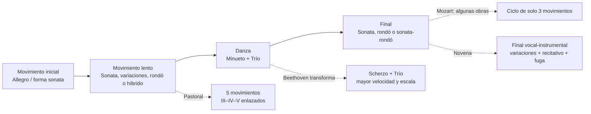
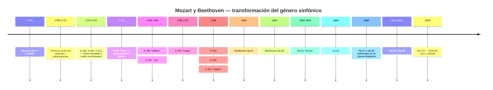
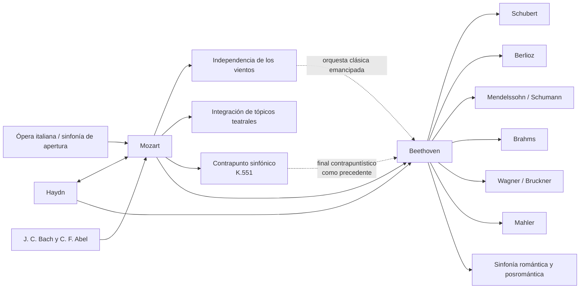

<!-- Translation of: research/sources/author-supplied/beethoven-mozart-symphonic-form.md; source commit: 304d75ed6ff646d311fd9df8b4e2db0d4dee277a -->
# Beethoven y Mozart: catálogo, forma, historia, recepción y legado de las sinfonías

## Resumen ejecutivo

Las trayectorias sinfónicas de **Wolfgang Amadeus Mozart** y **Ludwig van Beethoven** pertenecen al mismo arco histórico, pero representan momentos distintos en la consolidación de la sinfonía. Mozart acompañó prácticamente toda la transformación del género, desde la breve sinfonía italiana en tres movimientos y la obertura operística de la década de 1760 hasta la gran sinfonía vienesa de concierto de la década de 1780. Beethoven recibió de Haydn y Mozart un género ya muy sofisticado y lo reconstruyó en torno a la escala monumental, la continuidad dramática, el desarrollo motívico intensivo, las codas expansivas, los conflictos tonales a largo plazo y, finalmente, la incorporación de la voz humana en la Novena. La propia Fundación Mozarteum describe la evolución de Mozart desde una orquesta inicial estandarizada —dos oboes, dos trompas y cuerdas, con trompetas/timbales en ocasiones festivas— hasta una escritura vienesa más amplia, con flauta, clarinetes y fagotes cada vez más independientes. citeturn20view2turn25search0

Existe una asimetría fundamental entre los catálogos. **Beethoven escribió nueve sinfonías numeradas y auténticas**, correspondientes a los Opp. 21, 36, 55, 60, 67, 68, 92, 93 y 125. citeturn22search1 Para Mozart, «41 sinfonías» es una convención histórica, no el equivalente de un catálogo crítico moderno. Las antiguas núms. 2 y 3 no son de Mozart; la núm. 37 es esencialmente la Sinfonía MH 334 de Michael Haydn, a la que Mozart añadió material introductorio; además, hay sinfonías auténticas sin número tradicional, versiones sinfónicas de oberturas y serenatas, obras de autenticidad dudosa y sinfonías perdidas. El nuevo **Köchel-Verzeichnis**, publicado en 2024 —la primera edición nueva completa desde 1964— actualizó fechas, fuentes y atribuciones a la luz de investigaciones recientes. citeturn6search0turn7view0turn13search0turn25search2

El análisis formal muestra una diferencia de énfasis, no una simple oposición entre «Mozart melódico» y «Beethoven motívico». Mozart puede trabajar con una extraordinaria economía motívica —sobre todo en las Sinfonías núms. 40 y 41— pero tiende a construir las grandes formas mediante **pluralidad de tópicos, contrastes de carácter, diálogo entre familias instrumentales, contrapunto y reinterpretación de gestos operísticos**. Beethoven lleva más lejos la capacidad de una célula mínima para generar estructura: el ejemplo paradigmático es la Quinta, en la que una figura rítmica de cuatro notas impregna distintas funciones temáticas y se inserta en una trayectoria global de do menor a do mayor. La *Eroica*, la Quinta, la Pastoral y la Novena expanden la propia definición del ciclo sinfónico. Estudios recientes insisten, sin embargo, en que la revolución beethoveniana debe entenderse como transformación de paradigmas ya existentes en Haydn y Mozart, no como creación ex nihilo. citeturn17search6turn17search10

En Mozart, tres grandes puntos de inflexión son especialmente claros: la **Sinfonía núm. 25 en sol menor, K. 183**, con intensidad contrapuntística y una orquestación excepcionalmente oscura; la **«París», K. 297**, concebida para un gran concierto público y una orquesta que incluía clarinetes; y la secuencia **«Haffner»–«Linz»–«Praga»–núm. 39–40–«Júpiter»**, en la que la escala, la independencia de los vientos, el cromatismo y la integración contrapuntística alcanzan un nuevo nivel. La carta de Mozart del 9 de julio de 1778 confirma tanto el enorme éxito público de la «París» como la controversia sobre su Andante, considerado excesivamente modulatorio por el director Joseph Legros; Mozart escribió una segunda versión del movimiento. citeturn30view0turn31view0

En Beethoven, las nueve obras forman una secuencia especialmente reveladora: la Primera aún juega conscientemente con las expectativas haydnianas-mozartianas; la Segunda expande la escala y la retórica; la Tercera altera radicalmente las proporciones y la función de la coda; la Cuarta refina la ambigüedad y el humor; la Quinta produce una continuidad cíclica sin precedentes; la Sexta convierte el ciclo en cinco «escenas» programáticas; la Séptima hace del ritmo el principio estructurante; la Octava revisita, irónicamente, modelos del siglo XVIII; y la Novena transforma la sinfonía en una síntesis instrumental-vocal. Las páginas históricas de la Beethoven-Haus documentan estas génesis, estrenos y revisiones a partir de autógrafos, bocetos, primeras ediciones y fuentes contemporáneas. citeturn4search0turn3search0turn4search1turn4search3turn3search2turn3search3turn5search0

Para el estudio crítico, las referencias editoriales más seguras son la **Neue Mozart-Ausgabe (NMA), Serie IV, grupo 11**, con sus diez volúmenes de sinfonías e informes críticos, y, para Beethoven, tanto las partituras derivadas de la **Neue Beethoven-Gesamtausgabe** publicadas por Henle como la edición crítica-Urtext de **Jonathan Del Mar** para Bärenreiter. citeturn10search3turn22search0turn22search1 En grabaciones, un estudio comparativo se beneficia de colocar las interpretaciones históricamente informadas junto a la gran tradición sinfónica moderna: para Mozart, Trevor Pinnock/The English Concert es una referencia HIP integral; para Beethoven, John Eliot Gardiner/Orchestre Révolutionnaire et Romantique y Nikolaus Harnoncourt/Chamber Orchestra of Europe ofrecen dos modos distintos de repensar articulación, tamaño, equilibrio y retórica a la luz de la investigación histórica. citeturn23search1turn23search6turn23search2turn23search23

## Alcance, fuentes, terminología y problemas de atribución

**Criterio de catálogo.** Para Beethoven, «catálogo completo de sinfonías» es inequívoco: nueve sinfonías terminadas y numeradas. Para Mozart, este informe separa cuatro capas: las 41 obras de la numeración tradicional; obras adicionales incluidas en la serie sinfónica de la NMA; versiones sinfónicas derivadas de óperas o serenatas; y obras espurias, dudosas, fragmentarias o perdidas. La NMA distribuye las sinfonías de Mozart en diez volúmenes de la Serie IV/11, editados, entre otros, por Gerhard Allroggen, Wilhelm Fischer, Hermann Beck, Christoph-Hellmut Mahling, Friedrich Schnapp, Günter Haußwald, László Somfai y H. C. Robbins Landon. citeturn10search3turn10search0turn10search1turn10search2turn11search0turn11search1turn11search2turn12search0turn12search1

**Köchel frente a opus.** El número **K. o KV** (*Köchel-Verzeichnis*) es el identificador musicológico normal de las obras de Mozart. La expresión «opus» no constituye un catálogo sistemático de Mozart: algunas ediciones históricas asignaron números de opus editoriales a conjuntos publicados, pero no tienen la función que los números de Op. tienen en Beethoven. Por tanto, en la tabla de Mozart, «Op.» aparece como **no aplicable**. El Köchel en línea actualmente reflejado por la Fundación Mozarteum deriva de la nueva edición de 2024 y puede ofrecer fechas más amplias o distintas de las consagradas por la sexta edición; K. 183, por ejemplo, hoy está oficialmente datado dentro de un intervalo de marzo de 1773 a mayo de 1775, aunque la literatura anterior suele situarlo específicamente en el otoño de 1773. citeturn7view0turn25search3

**Estatuto de autenticidad.** La antigua Sinfonía núm. 3, históricamente K. 18, está hoy catalogada como **KV Anh. A 51**, obra autenticada de **Carl Friedrich Abel**, no de Mozart. citeturn13search0 La núm. 2, K. 17/Anh. C 11.02, tampoco pertenece al corpus auténtico de Mozart y se atribuye a Leopold Mozart en la bibliografía moderna. La antigua núm. 37, K. 444/425a, está actualmente catalogada como **KV Anh. A 53 / MH 334**, sinfonía de Michael Haydn con participación de Mozart. citeturn16search0turn25search2 K. 84 es un ejemplo de caso aún clasificado explícitamente por el nuevo Köchel como de autenticidad **«dudosa»**; las fuentes antiguas lo atribuyen alternativamente a Wolfgang, a Leopold Mozart y a Dittersdorf. citeturn25search1

**Forma.** Términos como «forma sonata» se usan aquí analíticamente. En las sinfonías de la década de 1760, decir «forma sonata» puede ser anacrónico si se entiende como el modelo escolar del siglo XIX. En muchos primeros movimientos es más preciso hablar de **forma sonata binaria o sonata temprana**, en la que exposición, reexposición y desarrollo aún no poseen las proporciones y funciones que encontramos en la década de 1780. La propia historia de la sinfonía muestra un paso de modelos de obertura italiana y estructuras binarias a una organización cada vez más diferenciada de los cuatro movimientos. La literatura moderna sobre la sinfonía clásica enfatiza precisamente esta pluralidad histórica. citeturn17search4turn17search8

**Orquestación.** En las primeras sinfonías de Mozart, el núcleo típico es cuerdas, dos oboes y dos trompas; trompetas y timbales aparecen sobre todo en obras festivas. En la corte de Salzburgo, flautistas y oboístas podían ser los mismos músicos, factor que ayuda a explicar por qué flautas y oboes no siempre aparecen simultáneamente. En el período vienés, clarinetes y fagotes se convierten en voces independientes en un grado mucho mayor. citeturn25search0turn20view2 Beethoven comienza dentro de este mundo clásico, pero progresivamente convierte trompas, trompetas, timbales y maderas en agentes formales, culminando en las expansiones tímbricas de la Quinta, la Sexta y la Novena.

El diagrama de flujo siguiente resume **un arquetipo**, no una regla rígida:

Esta genealogía formal corresponde al panorama histórico documentado por la NMA para Mozart y por las fuentes críticas de las nueve sinfonías de Beethoven. citeturn10search0turn10search1turn12search1turn4search3turn5search0

## Catálogo, cronología, estrenos y fuentes documentales

**Tabla de catálogo — Beethoven.**

| Sinfonía | Tonalidad | Composición | Catálogo | Estreno / primera interpretación conocida | Intérpretes y notas |
|---|---|---:|---|---|---|
| Núm. 1 | Do mayor | 1799–1800 | **Op. 21** | 2 abr. 1800, Hofburgtheater/Burgtheater, Viena | Akademie organizada por Beethoven; el programa incluía a Mozart, Haydn, un concierto para piano y el Septeto de Beethoven. citeturn4search0 |
| Núm. 2 | Re mayor | 1800–1802 | **Op. 36** | 5 abr. 1803, Theater an der Wien | Primera interpretación pública documentada con seguridad, en una Akademie de Beethoven; posible interpretación privada anterior. citeturn3search0 |
| Núm. 3 «Eroica» | Mi♭ mayor | 1803–1804 | **Op. 55** | privada para Lobkowitz, 1804; pública 7 abr. 1805, Theater an der Wien | Orquesta de Lobkowitz en las primeras interpretaciones; dedicatoria definitiva al príncipe Lobkowitz. citeturn4search1turn2search5turn2search17 |
| Núm. 4 | Si♭ mayor | 1806 | **Op. 60** | probablemente mar. 1807, palacio Lobkowitz, Viena | Interpretación privada vinculada a la casa Lobkowitz; dedicada al conde Franz von Oppersdorff. citeturn3search1 |
| Núm. 5 | Do menor | 1804–1808 | **Op. 67** | 22 dic. 1808, Theater an der Wien | Beethoven dirigió la famosa Akademie de unas cuatro horas; orquesta improvisada y condiciones difíciles. citeturn2search0turn4search2 |
| Núm. 6 «Pastoral» | Fa mayor | 1807–1808 | **Op. 68** | 22 dic. 1808, Theater an der Wien | Misma Akademie que la Quinta; en el programa, la Pastoral se presentó antes de la Sinfonía en do menor. citeturn4search3turn2search0 |
| Núm. 7 | La mayor | 1811–1812 | **Op. 92** | 8 dic. 1813, Universidad de Viena | Concierto benéfico dirigido por Beethoven, junto con *La victoria de Wellington*; gran éxito. citeturn3search2 |
| Núm. 8 | Fa mayor | 1812 | **Op. 93** | 27 feb. 1814, Redoutensaal, Viena | Beethoven dirigió; el programa incluía también la Séptima y *La victoria de Wellington*. citeturn3search3 |
| Núm. 9 | Re menor | 1822–1824; bocetos desde 1815 | **Op. 125** | 7 may. 1824, Kärntnertortheater, Viena | Michael Umlauf ejerció la dirección efectiva mientras Beethoven permanecía en escena; Henriette Sontag, Caroline Unger, Anton Haizinger y Joseph Seipelt formaron el cuarteto solista. citeturn5search0turn2search19 |

La datación de la Segunda merece una corrección a una narrativa biográfica muy difundida: la Beethoven-Haus subraya que una parte sustancial de la obra ya estaba concebida antes del famoso Testamento de Heiligenstadt, lo que hace simplista interpretar su exuberancia como «respuesta» directa a la crisis de 1802. citeturn3search0 La Séptima, a su vez, está documentada por el autógrafo con «1812 Aug. 13» y se estrenó en el contexto de las guerras napoleónicas, en un acto benéfico. citeturn3search2

**Tabla de catálogo — Mozart, numeración histórica 1 a 41.** «—» en estreno significa que no se puede recuperar documentalmente con certeza una primera presentación específica; esto es especialmente común en las obras salzburguesas, muchas de las cuales se escribieron para uso cortesano sin documentación individual de estreno. citeturn25search0

| Núm. histórico | Tonalidad | Fecha aproximada / actual | Köchel | Op. | Estreno o primera interpretación identificable | Estatuto |
|---|---|---|---|---|---|---|
| 1 | Mi♭ | 1764 | **K. 16** | — | Londres, 21 feb. 1765 | auténtica. citeturn10search0turn21search16 |
| 2 | Si♭ | c. 1765 | **K. 17 / Anh. C 11.02** | — | — | **espuria; atribuida a Leopold Mozart**. citeturn16search0turn16search4 |
| 3 | Mi♭ | 1764 | **K. 18; hoy Anh. A 51** | — | obra de Abel | **Carl Friedrich Abel**, no Mozart. citeturn13search0 |
| 4 | Re | 1765 | **K. 19** | — | — | auténtica. citeturn10search0 |
| 5 | Si♭ | 1765 | **K. 22** | — | probablemente período de La Haya; estreno exacto incierto | auténtica. citeturn10search0 |
| 6 | Fa | 1767 | **K. 43** | — | — | auténtica. citeturn10search0 |
| 7 | Re | 1768 | **K. 45** | — | — | auténtica. citeturn10search0 |
| 8 | Re | 1768 | **K. 48** | — | — | auténtica. citeturn10search0 |
| 9 | Do | c. 1769–72 | **K. 73 / 75a** | — | — | auténtica; cronología histórica revisada. citeturn10search0 |
| 10 | Sol | 1770 | **K. 74** | — | — | auténtica. citeturn10search1 |
| 11 | Re | 1770 | **K. 84 / 73q** | — | — | **autenticidad dudosa**. citeturn25search1 |
| 12 | Sol | 1771 | **K. 110 / 75b** | — | — | auténtica. citeturn10search1 |
| 13 | Fa | 1771 | **K. 112** | — | — | auténtica. citeturn10search1 |
| 14 | La | 30 dic. 1771 | **K. 114** | — | — | auténtica; fecha oficial del autógrafo. citeturn25search0 |
| 15 | Sol | 1772 | **K. 124** | — | — | auténtica. citeturn10search1 |
| 16 | Do | 1772 | **K. 128** | — | — | auténtica. citeturn10search2 |
| 17 | Sol | 1772 | **K. 129** | — | — | auténtica. citeturn10search2 |
| 18 | Fa | 1772 | **K. 130** | — | — | auténtica. citeturn10search2 |
| 19 | Mi♭ | 1772 | **K. 132** | — | — | auténtica; se conservan alternativas para el movimiento lento. citeturn10search2 |
| 20 | Re | 1772 | **K. 133** | — | — | auténtica. citeturn10search2 |
| 21 | La | 1772 | **K. 134** | — | — | auténtica. citeturn10search2 |
| 22 | Do | 1773 | **K. 162** | — | — | auténtica. citeturn11search0 |
| 23 | Re | tradicionalmente 1773; el catálogo actual admite un intervalo más amplio | **K. 181** | — | — | auténtica. citeturn14search3 |
| 24 | Si♭ | 1773 | **K. 182** | — | — | auténtica. citeturn11search0 |
| 25 | Sol menor | tradicionalmente 1773; hoy: mar. 1773–may. 1775 | **K. 183 / 173dB** | — | — | auténtica; 4 trompas. citeturn25search3 |
| 26 | Mi♭ | 1773 | **K. 184 / 161a** | — | — | auténtica. citeturn11search0 |
| 27 | Sol | c. 1773 | **K. 199 / 161b** | — | — | auténtica. citeturn11search0 |
| 28 | Do | c. 1773–75 | **K. 200 / 189k** | — | — | auténtica; la fecha antigua del autógrafo presenta problemas. citeturn25search4 |
| 29 | La | 1774 | **K. 201 / 186a** | — | — | auténtica. citeturn11search1 |
| 30 | Re | 1774 | **K. 202 / 186b** | — | — | auténtica. citeturn11search1 |
| 31 «París» | Re | junio 1778 | **K. 297 / 300a** | — | **18 jun. 1778, Concert Spirituel, Tullerías, París** | auténtica; orquesta del Concert Spirituel; Joseph Legros dirigía la institución. citeturn21search13turn30view0 |
| 32 | Sol | 26 abr. 1779 | **K. 318** | — | — | auténtica; estructura continua en tres secciones. citeturn11search2turn17search20 |
| 33 | Si♭ | 1779; revisiones posteriores | **K. 319** | — | — | auténtica. citeturn11search2 |
| 34 | Do | 1780 | **K. 338** | — | — | auténtica; tres movimientos. citeturn11search2 |
| 35 «Haffner» | Re | 1782; revisada 1783 | **K. 385** | — | **23 mar. 1783, Burgtheater, Viena** | Mozart dirigió su Akademie; origen en música festiva para la familia Haffner. citeturn27search21turn27search17turn27search32 |
| 36 «Linz» | Do | 30 oct.–principios nov. 1783 | **K. 425** | — | **4 nov. 1783, teatro de Linz** | escrita apresuradamente para un concierto anunciado por el conde Thun. citeturn31view1turn27search8 |
| 37 | Sol | c. 1783–84 | antigua **K. 444/425a; hoy Anh. A 53 / MH 334** | — | versión relacionada con la estancia en Linz | **Michael Haydn; contribución de Mozart en la introducción**. citeturn25search2turn27search8 |
| 38 «Praga» | Re | 6 dic. 1786 | **K. 504** | — | **19 ene. 1787, Praga, teatro entonces asociado al Teatro Nacional/de los Estados** | Mozart dirigió el concierto. citeturn27search6turn27search10 |
| 39 | Mi♭ | **26 jun. 1788** | **K. 543** | — | estreno específico **no identificado con seguridad** | auténtica. citeturn14search2turn28search9 |
| 40 | Sol menor | **25 jul. 1788**; versión posterior con clarinetes | **K. 550** | — | incierto estreno privado; interpretaciones documentables/probables en 1791 | auténtica, dos versiones. citeturn14search0turn28search16 |
| 41 «Júpiter» | Do | **10 ago. 1788** | **K. 551** | — | estreno específico no conservado | auténtica; última sinfonía de Mozart. citeturn20view2turn28search9 |

La «París» constituye el caso mejor documentado de recepción inmediata entre las sinfonías de Mozart anteriores a Viena. La correspondencia familiar registra el éxito en el Concert Spirituel; Leopold felicitó expresamente a su hijo, y Mozart escribió que la obra había sido recibida «incomparablemente bien». La misma carta muestra que Mozart pensaba estratégicamente sobre los efectos públicos, las expectativas del público parisino e incluso la sustitución del movimiento lento. citeturn31view2turn31view0

La génesis de la «Linz» está igualmente documentada de forma excepcional. El 31 de octubre de 1783 Mozart escribió a Leopold que el conde Thun había anunciado un concierto para el 4 de noviembre y, como no había llevado consigo ninguna sinfonía, estaba trabajando «a toda velocidad» en una nueva. La carta es evidencia primaria de las circunstancias extraordinariamente comprimidas de la composición. citeturn30view1turn31view1

**Sinfonías y versiones adicionales relevantes fuera de la serie 1–41.**

| Obra | Tonalidad | Fecha aproximada | Situación crítica |
|---|---|---:|---|
| K. Anh. 223 / 19a | Fa | c. 1765 | incluida en la NMA entre las primeras sinfonías. citeturn10search0 |
| K. Anh. 221 / 45a, «Old Lambach» | Sol | c. 1766 | transmitida en la NMA; históricamente objeto de debate atributivo. citeturn10search0 |
| K. Anh. 214 / 45b | Si♭ | c. 1768 | atribución problemática; incluida críticamente en la NMA. citeturn10search0 |
| K. 75 | Fa | c. 1771 | tradicional núm. 42; autenticidad discutida. citeturn10search1turn16search4 |
| K. 76 / 42a | Fa | década de 1760 | tradicional núm. 43; atribución discutida. citeturn10search0turn16search4 |
| K. 81 / 73l | Re | 1770 | tradicional núm. 44; atribución discutida. citeturn10search1 |
| K. 95 / 73n | Re | c. 1770 | tradicional núm. 45; atribución discutida. citeturn10search1 |
| K. 96 / 111b | Do | c. 1771 | tradicional núm. 46; atribución discutida. citeturn10search1 |
| K. 97 / 73m | Re | c. 1770 | tradicional núm. 47; atribución discutida. citeturn10search1 |
| K. 111 + K. 120 / 111a | Re | 1771 | versión sinfónica vinculada a la obertura de *Ascanio in Alba*; tradicional núm. 48. citeturn10search1 |
| Obertura K. 126 + K. 161/163 | Re | 1772 | versión sinfónica asociada a *Il sogno di Scipione*; conocida como núm. 50. citeturn10search2 |
| Obertura K. 196 + K. 121 / 207a | Re | 1774–75 | versión sinfónica formada por obertura + final. citeturn11search1 |
| Obertura K. 208 + K. 102 / 213c | Do | 1775 | versión sinfónica **incompleta** asociada a *Il re pastore*. citeturn11search1 |
| Versión sinfónica de K. 204 / 213a | Re | 1775 | reducción de serenata. citeturn9view1 |
| Versión sinfónica de K. 250 / 248b, «Serenata Haffner» | Re | 1776 | reducción de serenata; la obra festiva original se tocó para los Haffner el 21 de julio de 1776. citeturn14search4turn9view1 |
| Versión sinfónica de K. 320, «Posthorn» | Re | 1779 | reducción de serenata. citeturn9view1 |
| K. 409 | Do | principios de la década de 1780 | minueto sinfónico aislado, **no una sinfonía completa**. citeturn12search2 |
| K. Anh. 220 / 16a, «Odense» | La menor | históricamente atribuida al joven Mozart | autenticidad fuertemente problemática; debe quedar fuera del núcleo seguro. citeturn16search4 |
| K. Anh. 216 / 74g | Si♭ | incierta | tradicional núm. 54; dudosa. citeturn16search4 |
| K. Anh. 214 / 45b | Si♭ | incierta | tradicional núm. 55; dudosa. citeturn16search4 |
| K. 98 / Anh. C 11.04 | Fa | incierta | tradicional núm. 56; atribución dudosa/espuria. citeturn16search4 |

También hay referencias a **sinfonías perdidas** —incluidas K. 19b y varios ítems antiguos de los apéndices de Köchel— para las que no hay material suficiente para un análisis formal completo. El propio catálogo oficial señala que Mozart habría escrito unas quince sinfonías durante el gran viaje europeo de 1763–66 y que varias se perdieron. citeturn20view2turn16search0

**Cronología sintética:**

La cronología muestra que la «sinfonía clásica» no es un modelo congelado: entre K. 16 y K. 551 Mozart atraviesa más de dos décadas de cambios institucionales y estilísticos, mientras que Beethoven, en solo unos veinticuatro años, convierte este legado en un género de ambición estética cada vez mayor. citeturn20view2turn4search0turn5search0

## Anatomía formal y análisis movimiento por movimiento

A lo largo de esta sección, «SF» significa **forma sonata**; «bin./son.» indica una forma binaria cuya lógica ya anticipa procedimientos de sonata; «T–D» significa movimiento de la tónica a la dominante, y «T–rel.» el paso típico a la relativa mayor en obras en tonalidad menor. Las identificaciones son lecturas analíticas de las partituras críticas; los movimientos clásicos admiten con frecuencia más de una interpretación formal defendible. La NMA suministra el texto crítico base para Mozart y las ediciones Henle/Bärenreiter el equivalente moderno para Beethoven. citeturn10search3turn22search0turn22search1

**Beethoven, Sinfonía núm. 1 en do mayor, Op. 21.** El primer movimiento comienza con un *Adagio molto* deliberadamente desorientador: en lugar de afirmar inmediatamente do mayor, Beethoven proyecta armonías que suenan como dominantes de regiones vecinas, sobre todo una dominante de fa, prolongando la negativa de la tónica. El *Allegro con brio* establece finalmente do mayor y utiliza una forma sonata de perfil haydniano, pero con mayor agresividad dinámica, escalas y acentuación de los vientos. El desarrollo fragmenta las células y explora secuencias modulatorias antes de la recuperación de la tónica. El **II, Andante cantabile con moto**, en fa mayor, es una sonata lírica en la que la imitación y el contrapunto ligero coexisten con trompetas y timbales discretamente integrados —instrumentación inusual para la imagen convencional de un «movimiento lento delicado»—. El **III, Menuetto: Allegro molto e vivace**, nominalmente un minueto, es funcionalmente un scherzo: demasiado rápido, sincopado y energéticamente inestable para la danza aristocrática tradicional. El **IV** comienza con una broma de introducción lenta en la que la escala de do se revela nota por nota; el *Allegro molto e vivace* convierte el gesto en un final de sonata de velocidad y humor haydnianos. La obra, por tanto, no abandona a Haydn y Mozart: hace del conocimiento de este vocabulario la condición para perturbar las expectativas del oyente. citeturn4search0turn22search9

**Sinfonía núm. 2 en re mayor, Op. 36.** El **I, Adagio molto – Allegro con brio**, expande considerablemente la introducción lenta, con excursiones al modo menor, cromatismo y acordes de función ambigua antes de la exuberante SF en re. El desarrollo y la coda ya superan las proporciones comunes de la Primera; la coda deja de ser simple confirmación y comienza a participar en la elaboración. El **II, Larghetto, la mayor**, es una extensa forma sonata lírica: largas frases ornamentadas coexisten con imitación y una paleta de maderas muy diferenciada. El **III se llama explícitamente Scherzo**, consolidando la sustitución del minueto en el ciclo sinfónico beethoveniano; los contrastes súbitos de dinámica y registro son constitutivos de la forma. El **IV, Allegro molto**, nace de un motivo abrupto, casi grotesco, que funciona como señal recurrente; la forma mezcla características de sonata y rondó y culmina en una coda extraordinariamente larga, anticipando la importancia estructural que la coda tendrá en la *Eroica*. citeturn3search0turn22search5

**Sinfonía núm. 3 en mi♭ mayor, Op. 55, «Eroica».** El **I, Allegro con brio**, elimina la introducción lenta: dos acordes fortissimo de mi♭ lanzan inmediatamente un tema basado en el arpegio de la tónica. Casi enseguida, sin embargo, un do♯ ajeno a la tonalidad desestabiliza el campo armónico. La exposición contiene no solo «tema 1/tema 2», sino una red de grupos temáticos, ritmos sincopados y conflictos métricos. El desarrollo es colosal: fragmenta células, crea cadenas de disonancias y presenta famoso material nuevo en mi menor. La famosa entrada de trompa aparentemente «prematura» cerca de la reexposición intensifica la ambigüedad temporal. La coda funciona como un **segundo desarrollo**, reconstruyendo el material en lugar de simplemente cerrar. El **II, Marcia funebre: Adagio assai**, en do menor, combina marcha, rondó y arquitectura ternaria/variacional; episodios en do mayor y secciones fugadas convierten la marcha en un proceso colectivo de lamento y reconstrucción. El **III, Scherzo**, sustituye definitivamente la sociabilidad del minueto por velocidad, sorpresa y tensión; el Trío da espectacular protagonismo a **tres trompas**, una expansión significativa de la sección. El **IV** es una síntesis de variación, fuga y lógica de final sobre material que Beethoven ya había usado en *Las criaturas de Prometeo* y otras piezas: comienza desde el bajo del tema antes de presentar su superficie melódica y lo somete a transformaciones contrapuntísticas y líricas. La innovación decisiva no es solo la «duración»: es la conversión de todo el ciclo en un gran argumento dramático. citeturn4search1turn17search6turn22search11

**Sinfonía núm. 4 en si♭ mayor, Op. 60.** El **I** comienza con un *Adagio* cuya textura enrarecida y curso inicialmente sombrío hacen que la tónica de si♭ parezca distante; la explosión del *Allegro vivace* resuelve esta suspensión e inicia una SF extraordinariamente móvil, basada en escalas, arpegios y desplazamientos rítmicos. El **II, Adagio en mi♭**, está estructurado por un ritmo de acompañamiento con puntillo que se vuelve tan importante como las melodías; el clarinete y otras maderas adquieren fuerte personalidad temática. El **III, Allegro vivace**, es un scherzo expandido en cinco partes —scherzo–trío–scherzo–trío–scherzo— procedimiento que Beethoven reutilizará en la Séptima. El **IV, Allegro ma non troppo**, es un *perpetuum mobile* de semicorcheas: el virtuosismo de las cuerdas es puntuado por cómicas intervenciones de los vientos, incluido el famoso momento del fagot. La Cuarta demuestra que la innovación beethoveniana no equivale a gigantismo: aquí reside en la ambigüedad, el ritmo, la velocidad y la ironía. citeturn3search1

**Sinfonía núm. 5 en do menor, Op. 67.** En el **I, Allegro con brio**, la célula corto-corto-corto-largo no debe entenderse solo como un «tema»: es un **generador rítmico** que atraviesa transiciones, acompañamiento, tuttis y coda. La exposición parte de do menor y se dirige a mi♭ mayor; el desarrollo reduce la textura a fragmentos cada vez más pequeños. En la reexposición, un inesperado solo de oboe casi cadencial suspende temporalmente el impulso. La coda asume de nuevo una función de desarrollo. El **II, Andante con moto, la♭ mayor**, alterna dos complejos temáticos en un proceso de **dobles variaciones**; episodios de fanfarria en do mayor comienzan a anticipar la tonalidad triunfal del final. El **III, Allegro, do menor**, transforma rítmicamente la célula del primer movimiento en las trompas; el trío es fugado y enérgico. Al regresar, el scherzo se reduce a un fantasma en *pianissimo*, y una larga dominante conduce **sin interrupción** al final. El **IV, Allegro, do mayor**, añade flautín, contrafagot y trombones a la masa orquestal; la transformación de do menor a do mayor se convierte en un acontecimiento formal y tímbrico a la vez. Un recuerdo del scherzo antes de la reexposición establece verdadera memoria cíclica. La Quinta es, por tanto, menos una narrativa literal del «destino» que un extraordinario estudio de integración motívica, continuidad entre movimientos y tonalidad a escala global. citeturn4search2turn17search3

**Sinfonía núm. 6 en fa mayor, Op. 68, «Pastoral».** Beethoven pone títulos a los cinco movimientos e insiste en que es más una expresión de sentimientos que pintura literal. El **I, «Despertar de sentimientos alegres al llegar al campo»**, es una SF en fa mayor cuya novedad reside en extensas repeticiones de pequeños módulos, largos campos armónicos estables y énfasis en la subdominante/plagal; el objetivo es menos el conflicto teleológico que una sensación de permanencia. El **II, «Escena junto al arroyo», si♭ mayor**, mantiene una figura ondulante en compás compuesto bajo melodías de las maderas; al final, Beethoven identifica explícitamente ruiseñor, codorniz y cuco en flauta, oboe y clarinete. El **III, «Alegre reunión de campesinos»**, es un scherzo en el que deformaciones de acento y una caricatura de banda aldeana sustituyen la elegancia del minueto. Sin cadencia convencional, la fiesta es interrumpida por el **IV, «Tormenta», fa menor**, un movimiento casi enteramente procesual: trémolos, cromatismo, séptimas disminuidas, timbales, flautín y trombones crean intensificación continua. La tormenta se disuelve directamente en el **V, «Canto de los pastores; sentimientos alegres y agradecidos tras la tormenta»**, en fa mayor, híbrido de rondó, sonata e himno pastoral, dominado por cadencias plagales y un tema de carácter coral. Los tres últimos movimientos forman una secuencia ininterrumpida, importante precedente de los ciclos programáticos románticos. citeturn4search3turn17search3

**Sinfonía núm. 7 en la mayor, Op. 92.** El **I, Poco sostenuto – Vivace**, tiene una de las introducciones lentas más grandes de Beethoven: escalas ascendentes y acordes sostenidos conducen por regiones como do y fa antes de que una nota repetida se convierta en el pulso del *Vivace* en 6/8. La SF que sigue está gobernada por una obsesiva figura con puntillo. El **II, Allegretto, la menor**, comienza con un acorde y un ostinato rítmico cuya recurrencia sostiene variaciones, superposición contrapuntística y un episodio en la mayor; la progresión de las voces crea un proceso de acumulación casi arquitectónico. El **III, Presto**, coloca el scherzo en fa mayor, tonalidad inesperada en relación con la; el trío en re mayor se escucha dos veces, produciendo de nuevo una forma en cinco partes. El **IV, Allegro con brio**, en la mayor, lleva la repetición rítmica, las sincopaciones y los ostinatos a un grado casi físico; su larga coda intensifica la dominante y el bajo repetido antes de la resolución. La posterior observación de Adorno de que la Séptima sería la «sinfonía por excelencia» es citada por la Beethoven-Haus como índice de su fortuna crítica. citeturn3search2turn17search7

**Sinfonía núm. 8 en fa mayor, Op. 93.** El **I, Allegro vivace e con brio**, entra directamente en fa mayor, pero su aparente «normalidad clásica» es socavada por acentos desplazados, falsas jerarquías métricas y una coda desproporcionadamente vigorosa. El **II, Allegretto scherzando, si♭ mayor**, sustituye el movimiento lento por una miniatura rítmica basada en pulsos de los vientos; la tradición que lo vincula directamente al metrónomo de Mälzel debe tratarse con cautela, pues la anécdota es posterior y problemática. El **III, Tempo di Menuetto**, es un minueto deliberadamente arcaizante, lento y pesado comparado con los scherzi beethovenianos. El **IV, Allegro vivace**, constituye el ápice del humor estructural: un do♯ violentamente ajeno a fa mayor reaparece como problema armónico; en la inmensa coda, Beethoven explora su reinterpretación y excursiones remotas antes de la afirmación final de la tónica. La Octava es «retrógrada» solo superficialmente: es una metacrítica de los procedimientos clásicos. citeturn3search3

**Sinfonía núm. 9 en re menor, Op. 125.** El **I, Allegro ma non troppo, un poco maestoso**, comienza no con una melodía acabada, sino con quintas abiertas y fragmentos que parecen emerger de lo indeterminado hasta cristalizar re menor; la forma sonata convierte este «nacimiento» en principio recurrente, y desarrollo/coda expanden violentamente el material. El **II, Molto vivace**, coloca el scherzo antes del movimiento lento; el tema fugado en re menor y las explosiones de timbales son contrabalanceados por un Trío en re mayor, más veloz y pastoral. El **III, Adagio molto e cantabile, si♭ mayor**, trabaja dos áreas/ideas principales mediante variación ornamental y expansión, incluidos contrastes en re mayor y episodios de fanfarria. El **IV** comienza con una disonancia explosiva y recitativos instrumentales de violonchelos y contrabajos que «rechazan» reminiscencias de los tres movimientos anteriores. Solo entonces emerge, en re mayor, la sencilla melodía de la «Oda a la Alegría», inicialmente en los bajos de cuerda; siguen variaciones instrumentales, la entrada del barítono, coro, marcha «turca» con percusión, fuga, episodio solemne sobre «Seid umschlungen, Millionen», combinación contrapuntística de ideas y una enorme coda. La innovación no es solo «usar un coro»: es hacer que el propio final dramatice la insuficiencia de la sinfonía puramente instrumental y construya una nueva forma a partir de recitativo, variación, marcha, fuga, himno y sonoridad sinfónica. citeturn5search0turn22search7

**Mozart — análisis compacto del corpus numerado.** Las secuencias de tonalidades siguientes condensan el curso movimiento por movimiento; en varias obras tempranas, «sonata temprana» es deliberadamente preferible a una rígida lectura escolar. Los títulos y la organización de movimientos están documentados por los volúmenes sinfónicos de la NMA. citeturn10search0turn10search1turn10search2turn11search0turn11search1turn11search2turn12search0turn12search1

| Sinfonía | Movimiento por movimiento y lectura formal | Orquestación, motivos e innovación |
|---|---|---|
| **Núm. 1, K.16** | I Mi♭, *Molto allegro*, bin./son.; II Do menor, *Andante*, binario; III Mi♭, *Presto*, binario rápido/sonata temprana. | Cuerdas + oboes/trompas. El paso del movimiento lento a la relativa menor introduce gravedad inesperada en una obra londinense infantil; fuerte influencia del ambiente J. C. Bach/Abel. citeturn10search0 |
| **Núm. 2, K.17** | Estructura tradicional en si♭, pero **no debe analizarse como Mozart**. | La atribución a Mozart está rechazada; permanece solo por razones historiográficas. citeturn16search0 |
| **Núm. 3, antigua K.18** | Ciclo rápido–lento–rápido en mi♭; idioma galante y transparencia temática. | Es una sinfonía de **C. F. Abel**, copiada por el joven Mozart. Su interés reside precisamente en mostrar uno de los modelos que el niño estudió. citeturn13search0 |
| **Núm. 4, K.19** | I Re, Allegro, bin./son.; II Sol, Andante; III Re, Presto. | Tres movimientos y simples trayectorias armónicas T–D/T–SD, típicas del primer período londinense. citeturn10search0 |
| **Núm. 5, K.22** | I Si♭; II Mi♭; III Si♭. Formato rápido–lento–rápido. | Frases más marcadamente periódicas y respuestas orquestales; asimilación del estilo internacional del viaje europeo. citeturn10search0 |
| **Núm. 6, K.43** | I Fa, SF temprana; II Do, Andante; III Fa, Menuetto/Trío; IV Fa, Allegro. | La adopción de cuatro movimientos acerca la obra al modelo austro-alemán; el minueto pasa a formar parte del ciclo. citeturn10search0 |
| **Núm. 7, K.45** | Re–Sol–Re–Re; Allegro / Andante / Menuetto / Allegro. | Festividad en re mayor, fanfarrias y cadencias claras; equilibrio entre lo italiano y lo vienés. citeturn10search0 |
| **Núm. 8, K.48** | Re–Sol–Re–Re, cuatro movimientos. | Fuerte perfil ceremonial; contrastes de tutti/capas de cuerdas y vientos. citeturn10search0 |
| **Núm. 9, K.73** | Do–Fa–Do–Do; cuatro movimientos. | Modelo salzburgués festivo; cadencias y secuencias ganan mayor amplitud. citeturn10search0 |
| **Núm. 10, K.74** | Sol, sección lenta/subdominante asociada al ciclo, retorno rápido en sol. | Relación especialmente estrecha con la obertura italiana y con movimientos enlazados. citeturn10search1 |
| **Núm. 11, K.84** | Re–Sol–Re, tres movimientos. | Idioma plausiblemente mozartiano, pero la transmisión contradictoria impide atribución segura. citeturn25search1 |
| **Núm. 12, K.110** | Sol–Do–Sol–Sol. | Cuatro movimientos; las líneas internas y la viola ganan peso respecto al bajo continuo de los primeros modelos. citeturn10search1 |
| **Núm. 13, K.112** | Fa–Si♭–Fa–Fa. | Mayor energía motívica en los tuttis, con clara oposición entre períodos de cuerdas y refuerzos de vientos. citeturn10search1 |
| **Núm. 14, K.114** | La–Re–La–La. | Obra más espaciosa; contrapunto interno más activo. El Köchel actual la data precisamente el 30 dic. 1771. citeturn25search0 |
| **Núm. 15, K.124** | Sol–Do–Sol–Sol. | Síntesis salzburguesa entre brillantez de obertura y minueto cortesano. citeturn10search1 |
| **Núm. 16, K.128** | Do–Sol–Do, tres movimientos. | Retorno al formato italiano; movimientos rápidos externos compactos, fuertemente cadenciales. citeturn10search2 |
| **Núm. 17, K.129** | Sol–Do–Sol, tres movimientos. | Textura ágil y mayor diferenciación del segundo grupo temático. citeturn10search2 |
| **Núm. 18, K.130** | Fa–Si♭–Fa–Fa. | Cuatro movimientos; extensión y escritura de vientos ya indican alejamiento de las miniaturas de la década anterior. citeturn10search2 |
| **Núm. 19, K.132** | Mi♭–Si♭–Mi♭–Mi♭; se conserva versión alternativa del movimiento lento. | La existencia de movimientos alternativos hace la obra especialmente importante para estudiar revisión y elección de carácter. citeturn10search2 |
| **Núm. 20, K.133** | Re–La–Re–Re. | Brillantez en re mayor, con mayor independencia de las partes internas y contraste dinámico. citeturn10search2 |
| **Núm. 21, K.134** | La–Re–La–La. | Textura refinada, menor dependencia del puro efecto ceremonial. citeturn10search2 |
| **Núm. 22, K.162** | Do–Fa–Do, tres movimientos. | Compacta, teatral y cercana al gesto de obertura operística. citeturn11search0 |
| **Núm. 23, K.181** | Re–Sol–Re, tres secciones/movimientos de impulso teatral. | Continuidad gestual rápida; el Köchel actual da una fecha más amplia que la cronología antigua. citeturn14search3 |
| **Núm. 24, K.182** | Si♭–Mi♭–Si♭, tres movimientos. | Claridad galante combinada con mayor fuerza de tutti. citeturn11search0 |
| **Núm. 25, K.183** | I Sol menor, SF; II Mi♭, lento en SF/binario expandido; III Sol menor, Menuetto, Trío en sol mayor; IV Sol menor, SF. | Dos oboes, dos fagotes, **cuatro trompas** y cuerdas; sincopaciones, saltos, trémolos, contrapunto y dinámica confieren peso inusual. citeturn25search3 |
| **Núm. 26, K.184** | Mi♭ – Do menor – Mi♭, tres movimientos enlazados o estrechamente relacionados. | Dramaturgia de obertura teatral; el movimiento lento en do menor oscurece radicalmente el centro tonal. citeturn11search0 |
| **Núm. 27, K.199** | Sol–Re–Sol. | Apariencia ligera, pero elaboración temática y líneas internas más flexibles que en las primeras sinfonías. citeturn11search0 |
| **Núm. 28, K.200** | Do–Fa–Do–Do. | Trompetas disponibles en las fuentes y carácter ceremonial; creciente interacción entre fanfarria y lirismo. citeturn25search4 |
| **Núm. 29, K.201** | I La, SF; II Re, Andante; III La, Menuetto; IV La, SF en 6/8. | Una de las primeras sinfonías maduras: contrapunto, imitación y motivos reaparecen bajo distintas funciones; el final une danza y desarrollo. citeturn11search1 |
| **Núm. 30, K.202** | Re–La–Re–Re. | Mayor energía rítmica y expansión de la forma en cuatro movimientos; brillantez aún asociada al contexto salzburgués. citeturn11search1 |
| **Núm. 31, K.297 «París»** | I Re, SF monumental; II Sol, Andante — dos versiones; III Re, Allegro/SF. | Flautas, oboes, **clarinetes**, fagotes, trompas, trompetas, timbales y cuerdas: escala sin precedentes en Mozart. Tutti inicial y contrastes *piano–forte* explotan deliberadamente al público parisino. citeturn21search13turn31view0 |
| **Núm. 32, K.318** | Allegro spiritoso en sol → Andante contrastante → retorno del tempo inicial en sol, sin ciclo normal separado. | Híbrido de obertura y sinfonía, concentrando exposición, contraste lento y retorno rápido en un arco continuo. citeturn11search2turn17search20 |
| **Núm. 33, K.319** | Si♭–Mi♭–Si♭–Si♭. | Equilibrio camerístico de vientos y mayor elaboración de transiciones; el ciclo fue revisado. citeturn11search2 |
| **Núm. 34, K.338** | I Do, SF; II Fa, Andante di molto; III Do, final rápido; **sin minueto**. | Concentrada y brillante; el contraste entre grandeza externa y lirismo interior anticipa la década vienesa. citeturn11search2 |
| **Núm. 35, K.385 «Haffner»** | I Re, SF; II Sol, Andante; III Re, Menuetto/Trío; IV Re, Presto. | El motivo de unísono inicial domina I; para la versión sinfónica Mozart amplió los vientos. Final de energía *buffa*; Mozart pidió que se tocara lo más rápido posible. citeturn27search25turn27search17 |
| **Núm. 36, K.425 «Linz»** | I Adagio–Allegro spiritoso, Do, SF; II Fa, Andante/SF; III Do, Menuetto; IV Do, Presto/SF. | Primera introducción lenta a gran escala en una sinfonía madura de Mozart; cromatismo y retórica «solemnes» acercan la obra a Haydn. citeturn12search3turn27search20 |
| **Núm. 37, K.444/Anh.A53** | Estructura esencialmente de Michael Haydn en sol, con contribución introductoria mozartiana. | No debe usarse como ejemplo del «estilo sinfónico de Mozart» sin cualificación autoral. citeturn25search2 |
| **Núm. 38, K.504 «Praga»** | I Re, **Adagio–Allegro**, SF; II Sol, Andante/SF; III Re, Presto/SF. | Sin minueto, pero de mayor escala que muchas sinfonías en cuatro movimientos. Densidad contrapuntística, sincopaciones y tratamiento de vientos casi operístico. citeturn12search0turn17search5 |
| **Núm. 39, K.543** | I Mi♭, Adagio–Allegro, SF; II La♭, Andante con moto; III Mi♭, Menuetto; IV Mi♭, Allegro/SF. | **Sin oboes**: flauta, clarinetes y fagotes producen un timbre especialmente suave. El Trío del minueto convierte al clarinete en protagonista de carácter *Ländler*. citeturn14search2turn12search1 |
| **Núm. 40, K.550** | I Sol menor, SF; II Mi♭, Andante/SF; III Sol menor, Menuetto, Trío Sol; IV Sol menor, SF. | Anacrusas y «suspiros» de I se fragmentan incesantemente; el final produce extrema inestabilidad cromática. Existen versiones con y sin dos clarinetes. citeturn14search0turn12search1 |
| **Núm. 41, K.551 «Júpiter»** | I Do, Allegro vivace/SF; II Fa, Andante cantabile/SF; III Do, Menuetto; IV Do, Molto allegro: SF + contrapunto invertible/fugato. | Final construido a partir de varios motivos, entre ellos **Do–Re–Fa–Mi**, combinados contrapuntísticamente en la coda; síntesis de estilo «docto» y retórica sinfónica. citeturn20view2turn17search1 |

Algunas obras merecen expansión más allá de la tabla.

En **K. 183**, la tonalidad de sol menor no es meramente un código de «tristeza». El primer movimiento deriva energía de sincopaciones, unísonos, trémolos y saltos, mientras cuatro trompas aumentan la masa armónica. La oposición sol menor–si♭ mayor en la exposición sigue el patrón tónica–relativa, pero Mozart hace que el retorno al menor parezca estructuralmente necesario mediante la insistencia rítmica. El minueto abandona el carácter socialmente ligero de la danza y asume peso contrapuntístico; el Trío en sol mayor ofrece uno de los pocos espacios de descompresión. La instrumentación oficial actual confirma dos oboes, dos fagotes, dos pares de trompas y cuerdas. citeturn25search3

**K. 201** es un punto decisivo porque el refinamiento no depende de la fuerza orquestal. La apertura parece casi camerística; la imitación entre violines, la conducción de voces y la reaparición de pequeñas células crean continuidad. En el final en 6/8, el tópico de caza/danza no impide un desarrollo seriamente contrapuntístico. La obra demuestra por qué la imagen de Mozart como compositor de temas independientes y Beethoven como único maestro del desarrollo es históricamente inadecuada. citeturn11search1turn17search4

La **«París», K. 297**, es una composición explícitamente orientada por el espacio público. Su apertura explota el *premier coup d'archet* —el impacto coordinado del gran tutti— y el enorme aparato de vientos. Mozart era consciente de la expectativa de aplausos durante la obra y lo comenta en sus cartas; tras el éxito del primer movimiento, escribió además que el final comenzaba suavemente para preparar una entrada del tutti capaz de sorprender al público. La documentación del Concert Spirituel hace de K. 297 un laboratorio excepcional para relacionar forma, efecto y sociología del concierto. citeturn21search13turn17search24turn31view0

La **«Haffner», K. 385**, muestra el proceso inverso: música originalmente festiva/de serenata reconcebida para el concierto. Mozart eliminó material de la forma original y, al preparar la obra para Viena, reforzó la instrumentación de los movimientos externos con flautas y clarinetes. En el primer movimiento, el gran gesto inicial en octavas reaparece obsesivamente en distintos contextos; el desarrollo no depende de un contrastante «segundo tema» lírico de la manera habitual. La Akademie del 23 de marzo de 1783 probablemente comenzó con los tres primeros movimientos y terminó con el final, enmarcando todo el concierto con la sinfonía. citeturn27search17turn27search25

En la **«Linz», K. 425**, la introducción lenta convierte una obra escrita en el tiempo más breve en una sinfonía de retórica excepcionalmente amplia. La armonía cromática y los ritmos con puntillo crean solemnidad antes de que el Allegro en do mayor afirme el carácter festivo. El Andante en fa mayor incorpora textura y densidad inusuales; el Presto final reubica la vivacidad teatral dentro de una rigurosa forma sonata. Que la obra se produjera entre el anuncio del concierto y el 4 de noviembre de 1783 está directamente respaldado por la carta de Mozart. citeturn31view1turn27search8

La **«Praga», K. 504**, es una productiva paradoja formal: solo tres movimientos, pero mayor dimensión y complejidad que muchas sinfonías en cuatro movimientos. La gran introducción Adagio establece un campo de tensión cromática; el Allegro usa sincopaciones, entradas imitativas y superposición de voces, con frecuencia con un impulso que recuerda la escritura teatral de *Le nozze di Figaro*. Elaine Sisman demostró cómo género, gesto y significado interactúan en la obra, desestabilizando la idea de que su «contenido» pueda reducirse a una sola emoción. citeturn17search5turn12search0

En las **tres últimas sinfonías**, compuestas entre el 26 de junio y el 10 de agosto de 1788, Mozart parece explorar tres soluciones casi complementarias al problema sinfónico: la núm. 39 privilegia la calidez tímbrica y los clarinetes; la núm. 40 concentra cromatismo e inquietud en sol menor; la núm. 41 culmina en integración contrapuntística. No hay evidencia firme para la vieja narrativa de que Mozart las habría escrito como «testamento» anticipando ya la muerte. La propia historia de interpretación en vida es en parte oscura: las fuentes solo permiten afirmar con más seguridad interpretaciones de K. 550, mientras otros programas de concierto mencionan «una gran sinfonía» sin identificación suficiente. citeturn27search11turn28search9turn28search16

En el **final de la «Júpiter»**, la distinción entre forma sonata y fuga se vuelve inadecuada si se toma como alternativa. Mozart no escribe simplemente «una fuga»: dispone múltiples sujetos y motivos dentro de una arquitectura de sonata, usa contrapunto invertible, imitación y episodios fugados y reserva para la coda una extraordinaria combinación simultánea del material. La literatura sobre el estilo «docto» y lo sublime subraya precisamente esta fusión de técnica contrapuntística con teleología sinfónica, que se convertiría en punto de referencia para Beethoven y el siglo XIX. citeturn17search1turn17search0

**Partituras y facsímiles para acompañar el análisis.** Las ediciones históricas accesibles en IMSLP son muy útiles para la lectura comparativa, aunque **no sustituyen una edición crítica moderna**:

[IMSLP — Mozart, lista de sinfonías y numeraciones históricas](https://imslp.org/wiki/Template:Symphonies_(Mozart,_Wolfgang_Amadeus))

[IMSLP — Mozart, Sinfonía núm. 40 en sol menor, K. 550](https://imslp.org/wiki/Symphony_No.40_in_G_minor%2C_K.550_(Mozart%2C_Wolfgang_Amadeus))

[IMSLP — Mozart, Sinfonía núm. 41 en do mayor, K. 551](https://imslp.org/wiki/Symphony_No.41_in_C_major%2C_K.551_(Mozart%2C_Wolfgang_Amadeus))

[IMSLP — Beethoven, Sinfonía núm. 5, Op. 67](https://imslp.org/wiki/Symphony_No.5%2C_Op.67_(Beethoven%2C_Ludwig_van))

[IMSLP — Beethoven, Sinfonía núm. 9, Op. 125](https://imslp.org/wiki/Symphony_No.9%2C_Op.125_(Beethoven%2C_Ludwig_van))

La NMA también reproduce fuentes y variantes. Un ejemplo especialmente instructivo es el facsímil conservado en la edición crítica de la versión sinfónica derivada de la Serenata K. 320, en el que puede observarse directamente la notación orquestal de la fuente. citeturn9view2

## Comparación, recepción histórica e influencia

**Tabla comparativa de características centrales.**

| Obra / grupo | Forma y escala | Motivo/desarrollo | Armonía | Orquestación | Innovación decisiva |
|---|---|---|---|---|---|
| Mozart K.16–K.48 | 3–4 movimientos; sonata binaria/temprana | células cortas, periodicidad | T–D y subdominante cercana | oboes, trompas, cuerdas | rápida asimilación internacional. citeturn10search0 |
| Mozart K.110–K.134 | 3–4 movimientos más estables | más imitación y continuidad | modulación aún concisa | vientos integrados en el tutti | consolidación del estilo salzburgués. citeturn10search1turn10search2 |
| Mozart K.183 | 4 movimientos | sincopaciones, ritmos incisivos | Sol menor ↔ relativa; cromatismo | 4 trompas + fagotes | nueva intensidad «sinfónica». citeturn25search3 |
| Mozart K.201 | 4 movimientos | contrapunto y economía motívica | relaciones clásicas trabajadas con sutileza | orquesta relativamente ligera | profundidad sin gigantismo. citeturn11search1 |
| Mozart K.297 | 3 movimientos | gestos concebidos para el efecto público | modulación expandida, sobre todo en el movimiento lento | enorme sección de vientos, clarinetes | adaptación al concierto parisino. citeturn21search13turn31view0 |
| Mozart K.318 | arco continuo | retorno temático estructural | contraste Sol–región subdominante–Sol | teatral | fusión obertura/sinfonía. citeturn11search2 |
| Mozart K.385 | 4 movimientos | el gesto inicial domina I; final teatral | claridad diatónica + desarrollo | vientos reforzados en la revisión | transformación de música festiva en sinfonía de concierto. citeturn27search25 |
| Mozart K.425 | 4 movimientos | mayor escala del Allegro | introducción cromática → Do mayor | trompetas/timbales, vientos independientes | primera gran introducción lenta madura. citeturn27search20 |
| Mozart K.504 | 3 movimientos monumentales | contrapunto y sincopación | intenso cromatismo expresivo | maderas dialogantes | tres movimientos con peso de «gran sinfonía». citeturn17search5 |
| Mozart K.543 | 4 | multiplicidad temática | cromatismo bajo superficie luminosa | clarinetes, **sin oboes** | color orquestal como principio formal. citeturn14search2 |
| Mozart K.550 | 4 | fragmentación de anacrusas | Sol menor, cromatismo, regiones remotas | dos versiones, segunda con clarinetes | integración de inquietud armónica y motívica. citeturn14search0 |
| Mozart K.551 | 4 | cinco ideas combinables | Do/Fa y complejo contrapunto tonal | pleno aparato festivo | sonata + estilo «docto» en el final. citeturn20view2turn17search1 |
| Beethoven Op.21 | 4 | células más agresivas | la introducción evita la tónica | vientos muy presentes | subversión explícita de lo clásico. citeturn4search0 |
| Beethoven Op.36 | 4 | mayor desarrollo/coda | modulación expandida | expansión dinámica | scherzo nominal y mayor escala. citeturn3search0 |
| Beethoven Op.55 | 4, monumental | transformación continua | disonancia y regiones remotas | 3 trompas | coda como segundo desarrollo. citeturn4search1 |
| Beethoven Op.60 | 4 | ironía y *perpetuum mobile* | introducción tonalmente ambigua | solos de maderas muy individualizados | scherzo en cinco partes. citeturn3search1 |
| Beethoven Op.67 | 4, movimientos III–IV unidos | célula rítmica casi ubicua | arco Do menor → Do mayor | trombones, flautín, contrafagot en el final | integración cíclica y tonal. citeturn4search2 |
| Beethoven Op.68 | **5** | módulos repetitivos/figurativos | estabilidad/plagalidad + tormenta cromática | «pájaros», trombones/flautín en la tormenta | programa y movimientos III–V continuos. citeturn4search3 |
| Beethoven Op.92 | 4 | ritmo como principio global | audaces relaciones de mediantes/subdominantes | masas rítmicas + maderas | supremacía de la organización rítmica. citeturn3search2 |
| Beethoven Op.93 | 4 | humor métrico | do♯ disruptivo en el final | textura deliberadamente clásica | parodia/reflexión sobre el estilo clásico. citeturn3search3 |
| Beethoven Op.125 | 4, final vocal | recapitulación cíclica + variaciones/fuga | Re menor → Re mayor | orquesta expandida + solistas + coro | redefinición de los límites de la sinfonía. citeturn5search0 |

**Estilo y motivos.** Mozart mantiene normalmente un mayor número de tópicos coexistentes: marcha, ópera *buffa*, estilo cantabile, caza, danza, contrapunto «docto». La unidad nace del modo en que estos tópicos se ponen en diálogo. Beethoven tiende a hacer más explícita la **transformación funcional de las células**: material que inicialmente es tema puede convertirse en acompañamiento, transición, ostinato o elemento de coda. La diferencia, sin embargo, es de grado. K. 550 fragmenta continuamente su célula anacrúsica y K. 551 somete varios motivos a combinación contrapuntística tan rigurosa como cualquier demostración de unidad temática beethoveniana. La literatura analítica sobre la «Júpiter» subraya precisamente que su coda altera la percepción retrospectiva de todo el final. citeturn17search1turn17search0

**Desarrollo y coda.** En Mozart, el desarrollo puede ser compacto y muy modulatorio, pero la reexposición es con frecuencia el espacio en que se reescribe la relación entre tópicos. Beethoven da un peso extraordinario a la coda: en la *Eroica*, la Quinta y la Octava, se acerca a un segundo desarrollo, capaz de introducir nuevas crisis o reformular las anteriores. Esta es una de las razones por las que los análisis que miden solo «exposición–desarrollo–reexposición» subestiman la innovación beethoveniana. citeturn17search6turn17search10

**Armonía.** Mozart emplea a menudo el cromatismo como intensificación expresiva y conducción de voces: los movimientos lentos de K. 504, K. 550 y K. 551 son particularmente ricos en este sentido. Beethoven enfatiza con más frecuencia **trayectorias tonales a largo plazo**: en la Quinta, el conflicto do menor/do mayor atraviesa el ciclo; en la Novena, re menor y re mayor participan en una transformación igualmente comprehensiva. La diferencia no es que Mozart sea «diatónico» y Beethoven «cromático», sino que Beethoven dramatiza con frecuencia la relación entre tonalidades como memoria global del ciclo. citeturn17search3turn5search0

**Orquestación.** Mozart fue decisivo en la emancipación de las maderas. La núm. 39 es prácticamente una demostración de cómo excluir los oboes y construir una identidad entera en torno a flauta, clarinetes y fagotes; la núm. 40 existe en versión revisada con clarinetes; la «París» explota una orquesta excepcionalmente grande para su repertorio anterior. citeturn14search2turn14search0turn21search13 Beethoven hereda esta independencia de las maderas y añade un uso cada vez más **estructural del timbre**: tres trompas en la *Eroica*; entrada de trombones, flautín y contrafagot en el momento de la victoria tonal de la Quinta; recursos similares en la tormenta de la Sexta; voces y enorme aparato en el final de la Novena. citeturn4search1turn4search2turn4search3turn5search0

**Recepción de Mozart.** La mayoría de las sinfonías salzburguesas no circuló ampliamente en vida, por lo que sería anacrónico imaginar un «canon de las 41 sinfonías» ya existente en el siglo XVIII. citeturn25search0 La «París», en cambio, fue deliberadamente concebida para una institución pública internacional y obtuvo aplausos documentados. citeturn31view0turn31view2 La «Haffner» fue un éxito en el concierto vienés de Mozart de 1783. citeturn27search21turn27search32 La «Praga» quedó vinculada a la extraordinaria recepción de Mozart en la ciudad y a la popularidad local de *Le nozze di Figaro*. citeturn27search6turn27search10

En el siglo XIX, las últimas sinfonías recibieron cada vez más el estatuto de obras autónomas canónicas. La «Júpiter» fue especialmente valorada como síntesis de lo «sublime» y la técnica contrapuntística, mientras K. 550 pasó a escucharse según categorías románticas de tragedia, inquietud e interioridad. La investigación de Neal Zaslaw y Elaine Sisman fue central para desplazar la discusión de simplistas biografías emocionales al contexto institucional, la práctica interpretativa, las fuentes, la retórica y la historia de la recepción. citeturn28search1turn17search0turn17search5

**Recepción de Beethoven.** La **reseña de E. T. A. Hoffmann sobre la Quinta**, publicada en 1810 en la *Allgemeine musikalische Zeitung* y posteriormente reformulada, se convirtió en texto fundacional de la estética musical romántica: Beethoven pasa a representar la capacidad instrumental de la música para sugerir un mundo más allá de lo verbalmente representable. El estudio de Marta Kawano en portugués muestra la importancia de esta reseña para la formación del concepto romántico de autonomía instrumental. citeturn18search3

La *Eroica* fue gradualmente transformada, sobre todo en el siglo XIX, en hito divisor de épocas. Los estudios modernos, sin embargo, relativizan esta narrativa: el vocabulario «heroico» ya existía en el discurso sinfónico anterior, y Mozart y Haydn habían producido modelos de grandeza, sublimidad y drama instrumental. La *Eroica* no inventa cada componente, sino que altera radicalmente su escala y relación estructural. citeturn17search6turn17search14

La Séptima tuvo una extraordinaria recepción inmediata en 1813 y rápidamente se hizo popular; la Octava, mucho más irónica y estructuralmente ambigua, quedó históricamente eclipsada por sus vecinas Séptima y Novena. citeturn3search2turn3search3 La Novena adquirió un estatuto que excede la historia estrictamente musical: se convirtió en modelo de la idea de sinfonía como declaración filosófica y colectiva, además de provocar un problema central para el siglo XIX —**¿cómo escribir una sinfonía después de Beethoven sin simplemente imitar a Beethoven?**— El peso de este legado explica tanto la expansión sinfónica de Berlioz, Bruckner y Mahler como la ansiedad formal perceptible en Brahms. La bibliografía beethoveniana entiende este proceso como parte de la transformación de la sinfonía en el género privilegiado de la cultura de concierto del siglo XIX. citeturn17search10turn22search5

**Relaciones e influencias:**

La presencia de Abel en el diagrama es particularmente concreta: la obra antaño llamada «Sinfonía núm. 3 de Mozart» es en realidad una sinfonía de Abel que Mozart copió, mostrando materialmente cómo el joven compositor aprendía mediante apropiación y estudio de modelos. citeturn13search0 La NMA y el Köchel también demuestran la permeabilidad entre géneros en Mozart —oberturas convertidas en sinfonías y serenatas reducidas para concierto—, lo que problematiza cualquier historia según la cual la sinfonía habría sido desde el inicio un género autónomo y «absoluto». citeturn10search1turn10search2turn9view1

En Brasil, la propia construcción del repertorio de concierto importó la centralidad canónica Mozart–Beethoven de la tradición europea. Estudios brasileños recientes sobre universalismo y canon señalan cómo esta centralidad fue históricamente construida e institucionalizada, no simplemente el resultado automático de un valor «atemporal». citeturn18search16 Al mismo tiempo, la literatura brasileña sobre Hoffmann y Beethoven y sobre Mozart/Haydn demuestra la existencia de una producción musicológica en portugués capaz de dialogar críticamente con la bibliografía anglófona y germánica. citeturn18search3turn18search0

## Ediciones críticas, interpretación históricamente informada y grabaciones para el estudio

Para **Mozart**, la referencia textual fundamental es la **Neue Mozart-Ausgabe, Serie IV, grupo 11, *Sinfonien***. Los volúmenes no deben tratarse meramente como «partituras limpias»: sus variantes, prefacios e informes críticos son esenciales cuando hay versiones alternativas, problemas de datación o instrumentación. K. 132, por ejemplo, conserva una alternativa de movimiento lento; K. 297 tiene movimientos lentos alternativos; K. 550 existe en dos orquestaciones. citeturn10search2turn11search1turn12search1

| Edición | Uso recomendado | Por qué |
|---|---|---|
| **Neue Mozart-Ausgabe IV/11, vols. 1–10** | investigación, análisis, comparación de fuentes | edición crítico-académica oficial; cubre sinfonías, versiones y variantes. citeturn10search3 |
| **Köchel-Verzeichnis 2024 / Mozarteum** | datación, autenticidad, fuentes, instrumentación | incorpora la revisión moderna de atribuciones y cronología; primer Köchel completamente nuevo desde 1964. citeturn7view0 |
| **Material de interpretación Bärenreiter/NMA** | ensayo e interpretación | mantiene relación directa con el texto crítico de la NMA. citeturn10search3 |
| **IMSLP, ediciones antiguas** | comparación histórica y lectura libre | excelente recurso de acceso, pero no debe prevalecer sobre la NMA cuando hay variantes textuales relevantes. citeturn16search4 |

Para **Beethoven**, hay dos familias editoriales modernas especialmente útiles. La edición de **Jonathan Del Mar para Bärenreiter**, inicialmente publicada entre 1996 y 2000, se construyó como edición crítica-Urtext de las nueve sinfonías; la propia editorial registra que la Novena inició el proyecto en 1997 y que las demás se publicaron después. citeturn22search2turn22search18 Henle publica partituras de estudio Urtext basadas en el texto de la **Edición Completa de Beethoven / Neue Beethoven-Gesamtausgabe**, con distintos editores según la obra. citeturn22search1turn22search3

| Edición | Uso recomendado | Nota |
|---|---|---|
| **Bärenreiter, Jonathan Del Mar** | dirección, interpretación, comparación de articulación/dinámica | una de las ediciones crítica-Urtext más influyentes de las últimas décadas. citeturn22search0turn22search2 |
| **Henle Urtext / Neue Beethoven-Gesamtausgabe** | análisis e investigación | partituras de bolsillo basadas en la nueva edición completa, con aparato editorial y prefacios. citeturn22search1turn22search9 |
| **Informes críticos de la Gesamtausgabe** | decisiones filológicas avanzadas | necesarios para variantes, correcciones y conflictos entre autógrafo, partes, copias revisadas y primeras ediciones. citeturn22search3turn22search7 |

La edición preferida por el usuario estaba **sin especificar**; por tanto, para el análisis académico, la recomendación es confrontar al menos NMA/Köchel para Mozart y Del Mar/Henle-NGA para Beethoven, en lugar de elegir dogmáticamente una sola línea editorial.

La **interpretación históricamente informada (HIP)** es especialmente instructiva en estas obras porque altera variables que afectan la percepción formal: articulación más breve, ataques de trompa y trompeta naturales, timbales de piel, distinto equilibrio entre cuerdas y vientos, vibrato menos continuo, observancia cuidadosa de repeticiones y reconsideración de tempi. No hay, sin embargo, una única «sonoridad auténtica»: tamaño de orquesta, continuo en Mozart, cantidad de vibrato, realización de dinámicas e interpretación de indicaciones métricas siguen siendo cuestiones de evidencia y juicio. La importancia del libro de Zaslaw reside precisamente en integrar contexto, recepción y práctica interpretativa, en lugar de tratar la HIP como simple colección de reglas. citeturn28search1

**Mozart — grabaciones prioritarias para el estudio.**

**Trevor Pinnock / The English Concert — *The Symphonies*, Archiv Produktion.** Es la primera recomendación para una lectura HIP sistemática porque permite comparar prácticamente todo el desarrollo sinfónico dentro de una estética interpretativa coherente: instrumentos de época, ataques claros, transparencia contrapuntística y ritmos de danza vivos. Deutsche Grammophon/Archiv mantiene el conjunto completo en su catálogo digital. citeturn23search1turn23search13 Para el estudio, conviene escuchar especialmente K. 183, 201, 297, 385, 425, 504, 543, 550 y 551 junto a la NMA.

**Christopher Hogwood / Academy of Ancient Music.** El conjunto completo histórico constituye otro punto de referencia de la primera gran generación HIP; es especialmente útil para percibir cómo decisiones sobre tamaño de conjunto, repetición, articulación y bajo alteran las primeras sinfonías, que con frecuencia suenan pesadas en tradiciones sinfónicas posteriores. Como control metodológico, es más valioso cuando se compara, no tomado como «reconstitución definitiva».

**Nikolaus Harnoncourt en Mozart.** Sus lecturas con orquestas modernas o híbridas históricamente informadas son útiles como contrapunto al enfoque puramente «ligero»: Harnoncourt enfatiza retórica, disonancia, ataques y articulación de voces internas, haciendo que K. 550 y K. 551 suenen menos como porcelana clásica y más como discurso dramático. La importancia de su aplicación de principios HIP a orquestas modernas es reconocida por la propia Warner en la documentación de su carrera. citeturn23search11

Para una **comparación con la tradición sinfónica centroeuropea de posguerra**, las grabaciones de Karl Böhm con la Filarmónica de Berlín son pedagógicamente útiles: no porque representen «el verdadero texto», sino porque permiten escuchar el legato, las masas de cuerdas, el vibrato y las proporciones de frase que dominaron buena parte de la recepción grabada del siglo XX. El catálogo de Deutsche Grammophon conserva su Mozart sinfónico como parte importante de esta tradición. citeturn23search16

**Beethoven — grabaciones prioritarias para el estudio.**

**John Eliot Gardiner / Orchestre Révolutionnaire et Romantique — conjunto completo.** Para estudiar a Beethoven con lente HIP, es probablemente la referencia más eficiente: instrumentos de época, trompas y trompetas naturales, tempi enérgicos, articulación incisiva y fuerte exposición de voces internas. Deutsche Grammophon/Archiv documenta el conjunto completo y ediciones específicas de 3–4, 5–6 y 7–8. citeturn23search6turn23search21turn23search9turn23search3 Escúchese especialmente cómo cambia la transición III–IV de la Quinta cuando el bajo es más transparente y los metales naturales entran en el final.

**Nikolaus Harnoncourt / Chamber Orchestra of Europe — conjunto completo.** Aquí el interés es distinto: instrumentos predominantemente modernos, pero un enfoque profundamente informado por la retórica y la práctica histórica. La grabación completa realizada en 1991 recibió los premios *Orchestral* y *Recording of the Year* de *Gramophone* en 1992, según Warner. citeturn23search23turn23search2 Es especialmente productiva para comparar con Gardiner: Harnoncourt conserva mayor cuerpo sinfónico moderno mientras cuestiona articulación, fraseo y equilibrio convencionales.

**Herbert von Karajan / Berliner Philharmoniker, ciclo de la década de 1960.** Como documento de la tradición moderna de alta homogeneidad orquestal, ofrece el contraste necesario: cuerdas densas, líneas largas, metales integrados en una masa tímbrica y continuidad de pulso. Para un estudiante de dirección o análisis, el valor reside precisamente en escuchar cuánto puede la misma partitura construir otra arquitectura perceptiva.

**Roger Norrington / London Classical Players** es igualmente importante en la historia de la HIP beethoveniana por su intento sistemático de tomar en serio las indicaciones de metrónomo, la articulación clásica y el vibrato restringido. Debe estudiarse comparativamente: la cuestión de los metrónomos de Beethoven sigue suscitando debate y no se resuelve identificando simplemente «más rápido» con «más auténtico».

Una secuencia de escucha especialmente eficiente sería escuchar **Mozart K. 551, Beethoven 1, Beethoven 3, Beethoven 5 y Beethoven 9** en una interpretación HIP y una moderna. La ganancia pedagógica es inmediata: se percibe cómo duraciones de notas, equilibrio cuerdas/vientos y articulación pueden hacer visibles u ocultar relaciones motívicas que permanecen idénticas en la partitura.

## Bibliografía anotada, fuentes primarias y recursos de investigación

**Internationale Stiftung Mozarteum. *Köchel-Verzeichnis*, nueva edición, 2024; versión en línea.** Es el primer recurso a consultar para **autenticidad, datación, fuentes, instrumentación y numeración actual**. La nueva edición es la primera reconstrucción completa del catálogo desde 1964 y corrige varias cronologías tradicionales. citeturn6search0turn7view0  
[Catálogo Köchel en línea](https://kv.mozarteum.at/en/)

**Mozart, Wolfgang Amadeus. *Neue Mozart-Ausgabe*, Serie IV, grupo 11: *Sinfonien*, vols. 1–10. Kassel: Bärenreiter.** Fuente crítica indispensable. Los volúmenes cubren desde K. 16 hasta K. 551, incluidas variantes, versiones sinfónicas de oberturas/serenatas y casos atributivos problemáticos. Los informes críticos deben consultarse siempre que haya divergencia entre autógrafo, copias y primeras ediciones. citeturn10search3turn10search0turn10search1turn10search2turn11search0turn11search1turn11search2turn12search0turn12search1

**Mozart, Wolfgang Amadeus. Cartas y documentos, Digital Mozart Edition.** Esta es la principal fuente primaria narrativa para la génesis y recepción de las sinfonías. La carta del 9 de julio de 1778 describe el éxito de la «París», las reacciones al Andante y la relación con Joseph Legros; la carta del 31 de octubre de 1783 registra, en tiempo real, la apresurada composición de la «Linz». citeturn30view0turn31view0turn30view1turn31view1

**Zaslaw, Neal. *Mozart's Symphonies: Context, Performance Practice, Reception*. Oxford: Clarendon Press, 1989.** Probablemente la monografía individual más importante para la investigación con exactamente el alcance de este informe. Su mérito es combinar historia de las obras, fuentes, instrumentación, circunstancias de interpretación, práctica histórica y recepción; la recepción académica contemporánea la describió como obra pionera sobre el conjunto sinfónico. citeturn28search1turn17search0

**Sisman, Elaine. *Mozart: The "Jupiter" Symphony*. Cambridge University Press.** Estudio central de K. 551, que articula contexto histórico, lo sublime, estructura, ritmo de frase, retórica y recepción. La organización de la monografía muestra que la «Júpiter» se trata no solo como pieza contrapuntística, sino como problema histórico-estético integral. citeturn17search0turn28search0

**Sisman, Elaine. «Genre, Gesture, and Meaning in Mozart's 'Prague' Symphony». En *Mozart Studies 2*.** Uno de los trabajos analíticos más importantes sobre K. 504. Particularmente valioso para superar la lectura exclusivamente «formalista» y entender cómo gestos, géneros y expectativas culturales portan significado dentro de la forma sinfónica. citeturn17search5

**Range, Martin. «The 'Effective Passage' in Mozart's Paris Symphony». *Eighteenth-Century Music*.** Estudio especializado de la relación entre efecto, público y técnica en K. 297; debe leerse junto con las cartas de Mozart sobre el Concert Spirituel. citeturn17search24turn31view0

**Keefe, Simon P. *Mozart in Vienna: The Final Decade*. Cambridge University Press, 2017.** Esencial para contextualizar K. 385, 425, 504 y las tres últimas sinfonías en la economía vienesa del concierto. Es especialmente importante para la cuestión de los **estrenos desconocidos de K. 543, 550 y 551**, pues distingue cuidadosamente evidencia documental de conjetura. citeturn28search9turn28search15

**Abert, Hermann. *W. A. Mozart*, ed. Cliff Eisen, trad. Stewart Spencer. Yale University Press.** Gran biografía histórico-estilística, hoy mejor usada en diálogo con Zaslaw, Keefe y el Köchel de 2024, porque varias conclusiones cronológicas y atributivas de la antigua tradición fueron revisadas. La literatura reciente sigue citándola como importante referencia historiográfica. citeturn28search3

**Monteiro, Eduardo. «O espírito de Mozart pelas mãos de Haydn». *Estudos Avançados*, USP, 2020.** Fuente en portugués particularmente útil para pensar la relación Mozart–Haydn y el universo clásico sin reducir a los compositores a caricaturas estilísticas. citeturn18search0

**Beethoven-Haus Bonn, catálogo digital de obras y fuentes.** Para cada sinfonía, la Beethoven-Haus reúne cronología, génesis, dedicatorias, autógrafos, bocetos, primeras ediciones e información de estreno. Para este informe, fue la fuente institucional primaria para las nueve sinfonías. citeturn4search0turn3search0turn4search1turn3search1turn4search2turn4search3turn3search2turn3search3turn5search0

**Beethoven, Ludwig van. *The Nine Symphonies*, ed. Jonathan Del Mar. Bärenreiter Urtext.** Una de las referencias editoriales modernas fundamentales. Del Mar inició la serie con la Novena, publicada en 1997, y completó las restantes sinfonías en los años siguientes; la edición confronta críticamente las distintas fuentes en lugar de perpetuar automáticamente lecturas de ediciones del siglo XIX. citeturn22search0turn22search2turn22search18

**Beethoven, Ludwig van. *The Symphonies*, Henle Urtext, basada en la Edición Completa de Beethoven.** Las nueve partituras de estudio totalizan más de mil páginas y usan el texto de la edición completa moderna, con editores como Jens Dufner, Bathia Churgin, Beate Angelika Kraus, Armin Raab y Ernst Herttrich. Particularmente útil para lectura analítica de bolsillo y consulta filológica. citeturn22search1turn22search3

**Hoffmann, E. T. A. Reseña de la Quinta Sinfonía de Beethoven, *Allgemeine musikalische Zeitung*, 1810.** Fuente primaria decisiva de la recepción romántica de Beethoven. No debe leerse solo como «crítica de concierto», sino como documento de la transformación de la música instrumental en categoría filosófico-estética. Para lectores brasileños, la discusión de Kawano es un punto de entrada especialmente útil. citeturn18search3

**Kawano, Marta. «E. T. A. Hoffmann e a música instrumental de Beethoven». *Literatura e Sociedade*, USP, 2012.** Entre las fuentes en portugués de este relevamiento, una de las más relevantes. Explica la génesis y reformulaciones del texto de Hoffmann y relaciona la Quinta con el concepto romántico de música instrumental. citeturn18search3

**Marx, Adolf Bernhard. Escritos sobre Beethoven y la *Eroica*, siglo XIX.** Fuente primaria crucial para entender cómo la Tercera se transformó en paradigma de una «nueva era». La investigación moderna muestra la centralidad de la *Eroica* en el pensamiento de Marx y, simultáneamente, problematiza su teleología histórica. citeturn17search14turn17search6

**Burnham, Scott. *Beethoven Hero*. Princeton University Press.** Influyente estudio de la construcción del llamado estilo heroico de Beethoven. Debe colocarse junto a investigaciones posteriores que relativizan la lectura de la *Eroica* como ruptura absoluta y recuperan sus antecedentes dieciochescos. citeturn17search6

**Bonds, Mark Evan, y literatura sobre narrativa/forma beethoveniana.** El enfoque que piensa la sinfonía como argumento, proceso y estrategia narrativa es particularmente útil para la *Eroica*, la Quinta y la Novena, en las que el significado musical depende de la memoria de acontecimientos anteriores y de la función extraordinariamente expandida de las codas. El *Cambridge Companion to the Symphony* sintetiza importantes vertientes de esta investigación. citeturn17search10

**Rivera, Benito V. y estudios de organización rítmica en la Séptima.** La investigación especializada demuestra cómo decisiones aparentemente locales de ritmo, cancelación de compás y proporción formal afectan la macroestructura del Op. 92; es un antídoto útil contra la vaga idea de que la Séptima es simplemente una «apoteosis de la danza». citeturn17search7

**Estudio comparativo de la Quinta y la Sexta en literatura de University of California Press.** Particularmente importante para mostrar que las dos obras estrenadas juntas en 1808 comparten procedimientos compositivos aun cuando sus mundos expresivos parecen opuestos. Esto ayuda a sustituir la simplista oposición «Quinta = drama / Sexta = descripción» por un análisis de procesos estructurales comunes. citeturn17search3

**Rosen, Charles. *The Classical Style: Haydn, Mozart, Beethoven*.** Sigue siendo indispensable para entender la gramática tonal y formal compartida por los tres compositores, aunque debe complementarse con investigación posterior sobre tópicos, prácticas interpretativas, fuentes e historia social. Su gran utilidad para este tema es mostrar que las innovaciones de Beethoven solo se vuelven plenamente legibles cuando entendemos con precisión el sistema clásico que Mozart y Haydn perfeccionaron.

**IMSLP.** Excepcional repositorio de primeras ediciones, ediciones históricas y partituras de dominio público en las jurisdicciones aplicables. Se recomienda para seguir grabaciones y comparar tradiciones editoriales, pero no para resolver por sí solo problemas de autenticidad, versión o variante. Para eso, deben prevalecer Köchel/NMA y las ediciones crítica-Urtext. citeturn16search4turn22search0

La conclusión historiográfica más importante es que **no existe una única línea «Mozart → Beethoven»**. Mozart absorbió a J. C. Bach, Abel, estilos italianos, austríacos y franceses, Haydn y prácticas operísticas; Beethoven heredó tanto a este Mozart plural como a Haydn, el antiguo contrapunto, la ópera francesa y la cultura pública revolucionaria de Viena. Lo que conecta sus sinfonías es un proceso de creciente capacidad del género para sostener memoria, contraste, desarrollo y significado a gran escala. El salto entre K. 16 y K. 551 ya es extraordinario; el salto posterior entre la Primera y la Novena de Beethoven cambia no solo la escritura sinfónica, sino el propio lugar cultural que el siglo XIX asignaría a la sinfonía. citeturn20view2turn17search1turn17search6turn17search10
