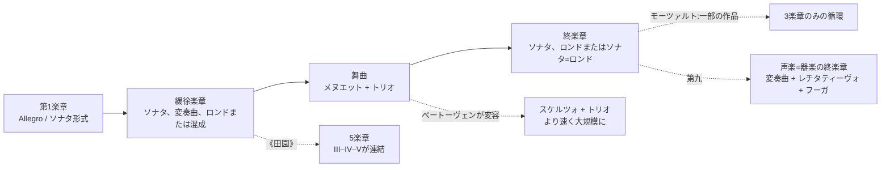
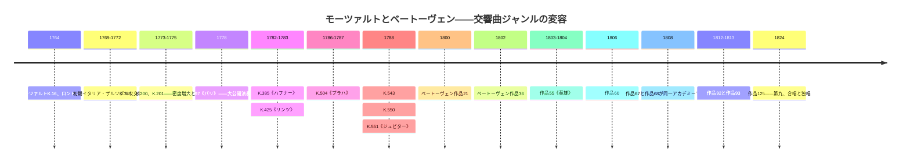
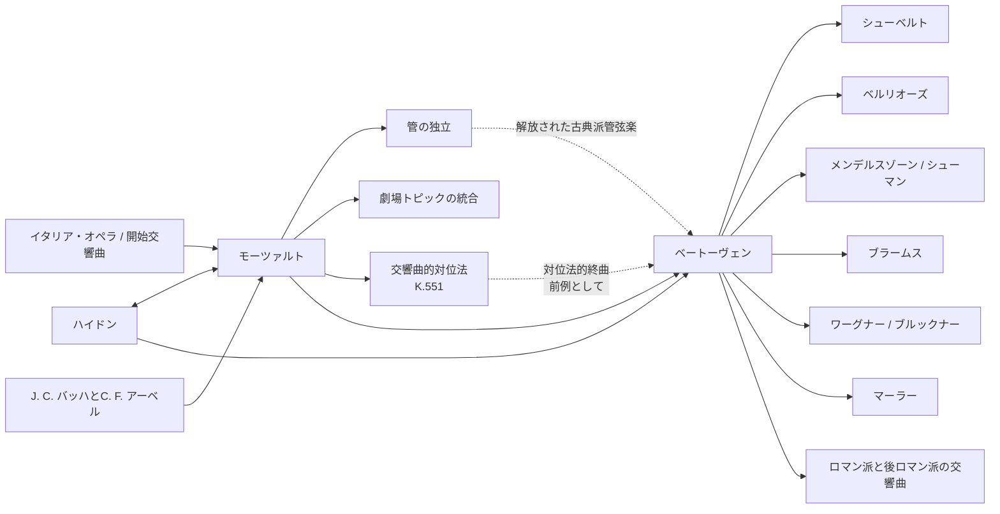

<!-- Translation of: research/sources/author-supplied/beethoven-mozart-symphonic-form.md; source commit: 304d75ed6ff646d311fd9df8b4e2db0d4dee277a -->
# ベートーヴェンとモーツァルト:交響曲のカタログ、形式、歴史、受容と遺産

## 要旨

**ヴォルフガング・アマデウス・モーツァルト**と**ルートヴィヒ・ヴァン・ベートーヴェン**の交響曲の軌跡は同じ歴史的弧に属するが、交響曲というジャンルの確立における異なる時点を表している。モーツァルトは、1760年代の短い3楽章のイタリア風交響曲やオペラ序曲から1780年代の壮大なウィーンの演奏会用交響曲まで、このジャンルの変容のほぼ全体に立ち会った。ベートーヴェンはハイドンとモーツァルトからすでに高度に洗練されたジャンルを受け継ぎ、記念碑的な規模、劇的な連続性、集中的な動機展開、拡張されたコーダ、長期的な調的葛藤、そして最終的には第九における人声の導入を中心にそれを再構築した。モーツァルテウム財団自身も、初期の標準化された管弦楽——2本のオーボエ、2本のホルンと弦楽器、祝祭的な機会にはトランペット/ティンパニ——から、フルート、クラリネット、ファゴットがますます独立する幅広いウィーン様式の書法へのモーツァルトの進化を記述している。citeturn20view2turn25search0

両カタログの間には根本的な非対称性がある。**ベートーヴェンは番号付きの真作交響曲を9曲書いた**。作品21、36、55、60、67、68、92、93、125に対応する。citeturn22search1モーツァルトにとって「41の交響曲」は歴史的慣習であり、現代の批判カタログと等価ではない。旧第2番と第3番はモーツァルトの作ではない。第37番は本質的にはミヒャエル・ハイドンの交響曲MH 334であり、モーツァルトが導入部素材を加えたものである。さらに、伝統的番号を持たない真作交響曲、序曲やセレナードの交響曲版、真偽の疑わしい作品、失われた交響曲がある。2024年に刊行された新しい**ケッヘル目録**——1964年以来初の完全な新版——は、近年の研究に照らして日付、資料、帰属を更新した。citeturn6search0turn7view0turn13search0turn25search2

形式分析が示すのは強調点の違いであり、「旋律のモーツァルト」と「動機のベートーヴェン」という単純な対立ではない。モーツァルトは——とりわけ交響曲第40番と第41番において——並外れた動機経済で書くことができるが、**多様なトピック、性格の対照、楽器群間の対話、対位法、オペラ的ジェスチャーの再解釈**によって大きな形式を構築する傾向がある。ベートーヴェンは最小の細胞が構造を生成する能力をさらに推し進める。その典型例は第五交響曲であり、4音のリズム動機が異なる主題機能に浸透し、ハ短調からハ長調への全体的軌跡の中に組み込まれる。《英雄》、第五、《田園》、第九は交響曲循環そのものの定義を拡張する。ただし近年の研究は、ベートーヴェン的革命はハイドンとモーツァルトにすでに存在したパラダイムの変容として理解されるべきであり、無からの創造ではないと強調する。citeturn17search6turn17search10

モーツァルトにおいては3つの大きな転換点がとりわけ明確である。**ト短調交響曲第25番K. 183**——対位法的強度と例外的に暗い管弦楽法を持つ。**《パリ》K. 297**——大規模な公開演奏会とクラリネットを含む管弦楽のために構想された。そして**《ハフナー》–《リンツ》–《プラハ》–第39番–第40番–《ジュピター》**の連なり——規模、管楽器の独立性、半音階法、対位法的統合が新たな水準に達する。1778年7月9日付のモーツァルトの手紙は、《パリ》の巨大な公的成功と、そのアンダンテをめぐる論争——支配人ジョゼフ・ルグロが過度に転調的と見なした——の双方を裏づけている。モーツァルトはこの楽章の第2稿を書いた。citeturn30view0turn31view0

ベートーヴェンにおいては9作品がとりわけ啓示的な連なりをなす。第一はハイドン=モーツァルト的期待と意識的に戯れる。第二は規模と修辞を拡張する。第三はプロポーションとコーダの機能を根本的に変える。第四は多義性と諧謔を洗練させる。第五は前例のない循環的連続性を生む。第六は循環を5つの標題的「情景」に変える。第七はリズムを構造原理とする。第八は皮肉を込めて18世紀のモデルを再訪する。そして第九は交響曲を器楽=声楽の総合へと変容させる。ベートーヴェン・ハウスの歴史ページは、自筆譜、スケッチ、初版、同時代資料に基づいてこれらの成立、初演、改訂を記録している。citeturn4search0turn3search0turn4search1turn4search3turn3search2turn3search3turn5search0

批判的研究のためには、最も安全な校訂参照資料は、10巻の交響曲と批判報告を含む**新モーツァルト全集(NMA)第IV篇第11群**と、ベートーヴェンについてはヘンレ社刊の**新ベートーヴェン全集**由来の譜面およびベーレンライター社の**ジョナサン・デル・マール**による批判=原典版の双方である。citeturn10search3turn22search0turn22search1録音では、歴史的知識に基づく演奏を壮大な現代交響曲伝統と並べて比較研究することが有益である。モーツァルトではトレヴァー・ピノック/イングリッシュ・コンサートが完全なHIP参照資料であり、ベートーヴェンではジョン・エリオット・ガーディナー/レヴォリュショネール・エ・ロマンティック管弦楽団とニコラウス・アーノンクール/ヨーロッパ室内管弦楽団が、歴史研究に照らしてアーティキュレーション、規模、バランス、修辞を再考する2つの異なる道を示している。citeturn23search1turn23search6turn23search2turn23search23

## 範囲、資料、用語と帰属問題

**カタログ基準。**ベートーヴェンにとって「交響曲全カタログ」は曖昧さがない。完成され番号付けされた9つの交響曲である。モーツァルトについては本報告は4つの層を区別する。伝統的番号付けの41作品。NMA交響曲篇に含まれる追加作品。オペラやセレナードに由来する交響曲版。そして偽作、疑作、断片、失われた作品である。NMAはモーツァルトの交響曲を第IV篇/11の10巻に配分し、ゲアハルト・アロッゲン、ヴィルヘルム・フィッシャー、ヘルマン・ベック、クリストフ=ヘルムート・マーリング、フリードリヒ・シュナップ、ギュンター・ハウスヴァルト、ラースロー・ショムファイ、H. C. ロビンズ・ランドンらが編集した。citeturn10search3turn10search0turn10search1turn10search2turn11search0turn11search1turn11search2turn12search0turn12search1

**ケッヘル対作品番号。**番号**K.またはKV**(ケッヘル目録)はモーツァルト作品の通常の音楽学的識別子である。「作品」という表現はモーツァルトの体系的カタログを構成しない。歴史的出版譜の中には出版された曲集に編集上の作品番号を付したものもあるが、ベートーヴェンにおける作品番号の機能を持たない。したがってモーツァルトの表では「作品」は**該当なし**と表示される。モーツァルテウム財団が現在反映しているオンライン・ケッヘルは2024年の新版に由来し、第6版で定着したものより幅広いまたは異なる日付を示すことがある。たとえばK. 183は今日公式には1773年3月から1775年5月までの範囲に位置づけられているが、旧来の文献は通常1773年秋に特定して置く。citeturn7view0turn25search3

**真偽状態。**かつての交響曲第3番、歴史的K. 18は、現在**KV Anh. A 51**として目録化され、モーツァルトではなく**カール・フリードリヒ・アーベル**の認証作品である。citeturn13search0第2番K. 17/Anh. C 11.02もモーツァルトの真作群に属さず、現代文献ではレオポルト・モーツァルトに帰属される。旧第37番K. 444/425aは現在**KV Anh. A 53 / MH 334**として目録化され、モーツァルトの関与を含むミヒャエル・ハイドンの交響曲である。citeturn16search0turn25search2K. 84は新ケッヘルが明示的に**「真偽疑わしい」**と分類し続けている事例であり、旧資料はヴォルフガング、レオポルト・モーツァルト、ディッタースドルフに交互に帰属する。citeturn25search1

**形式。**「ソナタ形式」などの用語はここでは分析的に用いられる。1760年代の交響曲において「ソナタ形式」と言うことは、19世紀の学校モデルとして理解されるなら時代錯誤となりうる。多くの第1楽章では**二部ソナタ形式または初期ソナタ**と呼ぶ方が精密であり、提示部、再現部、展開部は1780年代に見られるプロポーションと機能をまだ持たない。交響曲の歴史自体が、イタリア風序曲モデルと二部構造から、4楽章のますます分化した組織への移行を示す。古典派交響曲の現代文献はまさにこの歴史的多元性を強調する。citeturn17search4turn17search8

**管弦楽法。**初期モーツァルト交響曲では典型的核は弦楽器、2本のオーボエ、2本のホルンであり、トランペットとティンパニはとりわけ祝祭的作品に現れる。ザルツブルク宮廷ではフルート奏者とオーボエ奏者は同一の奏者でありうるため、フルートとオーボエが常に同時に現れない理由の説明に役立つ。ウィーン時代にはクラリネットとファゴットがはるかに大きな程度で独立した声部となる。citeturn25search0turn20view2ベートーヴェンはこの古典的世界から出発するが、ホルン、トランペット、ティンパニ、木管を徐々に形式の能動者へと変え、第五、第六、第九の音色拡張に至る。

以下のフローチャートは**典型**を要約するものであり、固定的な規則ではない。

この形式の系譜は、モーツァルトについてはNMAが、ベートーヴェンの9つの交響曲については批判資料が記録する歴史像に対応する。citeturn10search0turn10search1turn12search1turn4search3turn5search0

## カタログ、年表、初演と記録資料

**カタログ表——ベートーヴェン。**

| 交響曲 | 調 | 作曲 | カタログ | 初演/最初の既知の演奏 | 奏者と注記 |
|---|---|---:|---|---|---|
| 第1番 | ハ長調 | 1799–1800 | **作品21** | 1800年4月2日、ウィーン、ホーフブルク劇場/ブルク劇場 | ベートーヴェン主催のアカデミー。曲目はモーツァルト、ハイドン、ピアノ協奏曲、ベートーヴェンの七重奏曲を含む。citeturn4search0 |
| 第2番 | ニ長調 | 1800–1802 | **作品36** | 1803年4月5日、アン・デア・ウィーン劇場 | ベートーヴェンのアカデミーにおける最初に確実に記録された公開演奏。それ以前の私的演奏の可能性あり。citeturn3search0 |
| 第3番《英雄》 | 変ホ長調 | 1803–1804 | **作品55** | ロブコヴィッツ邸私演1804年。公開は1805年4月7日、アン・デア・ウィーン劇場 | 初演時はロブコヴィッツの管弦楽。ロブコヴィッツ侯への確定的献呈。citeturn4search1turn2search5turn2search17 |
| 第4番 | 変ロ長調 | 1806 | **作品60** | おそらく1807年3月、ウィーン、ロブコヴィッツ宮殿 | ロブコヴィッツ家関連の私演。オパースドルフ伯フランツ・フォン・オパースドルフへの献呈。citeturn3search1 |
| 第5番 | ハ短調 | 1804–1808 | **作品67** | 1808年12月22日、アン・デア・ウィーン劇場 | ベートーヴェン指揮の約4時間の有名なアカデミー。急造の管弦楽と困難な条件。citeturn2search0turn4search2 |
| 第6番《田園》 | ヘ長調 | 1807–1808 | **作品68** | 1808年12月22日、アン・デア・ウィーン劇場 | 第五と同じアカデミー。曲目では《田園》はハ短調交響曲の前に置かれた。citeturn4search3turn2search0 |
| 第7番 | イ長調 | 1811–1812 | **作品92** | 1813年12月8日、ウィーン大学 | ベートーヴェン指揮の慈善演奏会。《ウェリントンの勝利》と併演。大成功。citeturn3search2 |
| 第8番 | ヘ長調 | 1812 | **作品93** | 1814年2月27日、ウィーン、レドゥーテンザール | ベートーヴェン指揮。曲目は第七と《ウェリントンの勝利》も含む。citeturn3search3 |
| 第9番 | ニ短調 | 1822–1824。スケッチは1815年以来 | **作品125** | 1824年5月7日、ウィーン、ケルントナートーア劇場 | ミヒャエル・ウムラウフが実質指揮しベートーヴェンは舞台上に残った。独唱四重奏はヘンリエッテ・ゾンターク、カロリーネ・ウンガー、アントン・ハイジンガー、ヨーゼフ・ザイペルト。citeturn5search0turn2search19 |

第二の作曲年代は、きわめて広く流布した伝記的物語への修正を要する。ベートーヴェン・ハウスは、作品の実質的部分が有名なハイリゲンシュタットの遺書より前にすでに構想されていたと強調する。そのため、その快活さを1802年の危機への直接的「応答」と解釈するのは単純にすぎる。citeturn3search0第七は自筆譜に「1812年8月13日」と記録され、ナポレオン戦争下の慈善行事で初演された。citeturn3search2

**カタログ表——モーツァルト、伝統的番号1から41。**初演欄の「——」は特定の初提示が記録的に確実には復元できないことを意味する。これは宮廷用に書かれ個別の初演記録を持たないザルツブルク作品に特によく見られる。citeturn25search0

| 伝統番号 | 調 | 概略/現在の日付 | ケッヘル | 作品 | 初演または同定可能な初回演奏 | 状態 |
|---|---|---|---|---|---|---|
| 1 | 変ホ | 1764 | **K. 16** | —— | 1765年2月21日、ロンドン | 真作。citeturn10search0turn21search16 |
| 2 | 変ロ | 1765年頃 | **K. 17 / Anh. C 11.02** | —— | —— | **偽作。レオポルト・モーツァルトに帰属**。citeturn16search0turn16search4 |
| 3 | 変ホ | 1764 | **K. 18。現Anh. A 51** | —— | アーベルの作品 | モーツァルトではなく**カール・フリードリヒ・アーベル**。citeturn13search0 |
| 4 | ニ | 1765 | **K. 19** | —— | —— | 真作。citeturn10search0 |
| 5 | 変ロ | 1765 | **K. 22** | —— | おそらくハーグ時代。正確な初演は不確実 | 真作。citeturn10search0 |
| 6 | ヘ | 1767 | **K. 43** | —— | —— | 真作。citeturn10search0 |
| 7 | ニ | 1768 | **K. 45** | —— | —— | 真作。citeturn10search0 |
| 8 | ニ | 1768 | **K. 48** | —— | —— | 真作。citeturn10search0 |
| 9 | ハ | 1769–72年頃 | **K. 73 / 75a** | —— | —— | 真作。歴史的年表は改訂。citeturn10search0 |
| 10 | ト | 1770 | **K. 74** | —— | —— | 真作。citeturn10search1 |
| 11 | ニ | 1770 | **K. 84 / 73q** | —— | —— | **真偽疑わしい**。citeturn25search1 |
| 12 | ト | 1771 | **K. 110 / 75b** | —— | —— | 真作。citeturn10search1 |
| 13 | ヘ | 1771 | **K. 112** | —— | —— | 真作。citeturn10search1 |
| 14 | イ | 1771年12月30日 | **K. 114** | —— | —— | 真作。公式自筆譜日付。citeturn25search0 |
| 15 | ト | 1772 | **K. 124** | —— | —— | 真作。citeturn10search1 |
| 16 | ハ | 1772 | **K. 128** | —— | —— | 真作。citeturn10search2 |
| 17 | ト | 1772 | **K. 129** | —— | —— | 真作。citeturn10search2 |
| 18 | ヘ | 1772 | **K. 130** | —— | —— | 真作。citeturn10search2 |
| 19 | 変ホ | 1772 | **K. 132** | —— | —— | 真作。緩徐楽章の代案が現存。citeturn10search2 |
| 20 | ニ | 1772 | **K. 133** | —— | —— | 真作。citeturn10search2 |
| 21 | イ | 1772 | **K. 134** | —— | —— | 真作。citeturn10search2 |
| 22 | ハ | 1773 | **K. 162** | —— | —— | 真作。citeturn11search0 |
| 23 | ニ | 伝統的には1773。現カタログはより幅広い範囲を許容 | **K. 181** | —— | —— | 真作。citeturn14search3 |
| 24 | 変ロ | 1773 | **K. 182** | —— | —— | 真作。citeturn11search0 |
| 25 | ト短調 | 伝統的には1773。現:1773年3月–1775年5月 | **K. 183 / 173dB** | —— | —— | 真作。ホルン4本。citeturn25search3 |
| 26 | 変ホ | 1773 | **K. 184 / 161a** | —— | —— | 真作。citeturn11search0 |
| 27 | ト | 1773年頃 | **K. 199 / 161b** | —— | —— | 真作。citeturn11search0 |
| 28 | ハ | 1773–75年頃 | **K. 200 / 189k** | —— | —— | 真作。自筆譜の旧日付に問題あり。citeturn25search4 |
| 29 | イ | 1774 | **K. 201 / 186a** | —— | —— | 真作。citeturn11search1 |
| 30 | ニ | 1774 | **K. 202 / 186b** | —— | —— | 真作。citeturn11search1 |
| 31《パリ》 | ニ | 1778年6月 | **K. 297 / 300a** | —— | **1778年6月18日、パリ、テュイルリー、コンセール・スピリチュエル** | 真作。コンセール・スピリチュエル管弦楽。ジョゼフ・ルグロが機関を指揮。citeturn21search13turn30view0 |
| 32 | ト | 1779年4月26日 | **K. 318** | —— | —— | 真作。3部からなる連続構造。citeturn11search2turn17search20 |
| 33 | 変ロ | 1779。後の改訂あり | **K. 319** | —— | —— | 真作。citeturn11search2 |
| 34 | ハ | 1780 | **K. 338** | —— | —— | 真作。3楽章。citeturn11search2 |
| 35《ハフナー》 | ニ | 1782。1783年改訂 | **K. 385** | —— | **1783年3月23日、ウィーン、ブルク劇場** | モーツァルトがアカデミーを指揮。ハフナー家の祝祭音楽に由来。citeturn27search21turn27search17turn27search32 |
| 36《リンツ》 | ハ | 1783年10月30日–11月初旬 | **K. 425** | —— | **1783年11月4日、リンツ劇場** | トゥーン伯爵が告知した演奏会のための急造。citeturn31view1turn27search8 |
| 37 | ト | 1783–84年頃 | 旧**K. 444/425a。現Anh. A 53 / MH 334** | —— | リンツ滞在関連の版 | **ミヒャエル・ハイドン。導入部にモーツァルトの関与**。citeturn25search2turn27search8 |
| 38《プラハ》 | ニ | 1786年12月6日 | **K. 504** | —— | **1787年1月19日、プラハ、当時国民劇場/エステート劇場関連の劇場** | モーツァルトが演奏会を主導。citeturn27search6turn27search10 |
| 39 | 変ホ | **1788年6月26日** | **K. 543** | —— | 特定の初演は**確実に同定されず** | 真作。citeturn14search2turn28search9 |
| 40 | ト短調 | **1788年7月25日**。クラリネット入り後版あり | **K. 550** | —— | 不確実な私的初演。1791年の記録可能/蓋然的演奏あり | 真作、2版あり。citeturn14search0turn28search16 |
| 41《ジュピター》 | ハ | **1788年8月10日** | **K. 551** | —— | 特定の初演は伝承されず | 真作。モーツァルト最後の交響曲。citeturn20view2turn28search9 |

《パリ》はウィーン以前のモーツァルト交響曲の中で同時代受容が最もよく記録された事例である。家族書簡はコンセール・スピリチュエルでの成功を記録する。レオポルトは息子を明示的に祝福し、モーツァルトは作品が「比べようもなくよく」受け入れられたと書いた。同じ手紙は、モーツァルトが公的効果、パリの聴衆の期待、緩徐楽章の差し替えまでも戦略的に考えていたことを示す。citeturn31view2turn31view0

《リンツ》の成立も同様に例外的によく記録されている。1783年10月31日、モーツァルトはレオポルトに、トゥーン伯爵が11月4日の演奏会を告知し、交響曲を持参していなかったため新作を「全速力で」書いていると伝えた。この手紙は作曲の並外れて圧縮された状況の一次証拠である。citeturn30view1turn31view1

**1–41番外の関連する追加交響曲と版。**

| 作品 | 調 | 概略日付 | 批判状況 |
|---|---|---:|---|
| K. Anh. 223 / 19a | ヘ | 1765年頃 | 初期交響曲としてNMAに収録。citeturn10search0 |
| K. Anh. 221 / 45a《旧ランバッハ》 | ト | 1766年頃 | NMAに伝承。歴史的に帰属論争の対象。citeturn10search0 |
| K. Anh. 214 / 45b | 変ロ | 1768年頃 | 帰属に問題あり。NMAに批判収録。citeturn10search0 |
| K. 75 | ヘ | 1771年頃 | 伝統的第42番。真偽に論争あり。citeturn10search1turn16search4 |
| K. 76 / 42a | ヘ | 1760年代 | 伝統的第43番。帰属に論争あり。citeturn10search0turn16search4 |
| K. 81 / 73l | ニ | 1770 | 伝統的第44番。帰属に論争あり。citeturn10search1 |
| K. 95 / 73n | ニ | 1770年頃 | 伝統的第45番。帰属に論争あり。citeturn10search1 |
| K. 96 / 111b | ハ | 1771年頃 | 伝統的第46番。帰属に論争あり。citeturn10search1 |
| K. 97 / 73m | ニ | 1770年頃 | 伝統的第47番。帰属に論争あり。citeturn10search1 |
| K. 111 + K. 120 / 111a | ニ | 1771 | 《アルバのアスカーニョ》序曲関連の交響曲版。伝統的第48番。citeturn10search1 |
| 序曲K. 126 + K. 161/163 | ニ | 1772 | 《シピオーネの夢》関連の交響曲版。第50番として知られる。citeturn10search2 |
| 序曲K. 196 + K. 121 / 207a | ニ | 1774–75 | 序曲+終曲からなる交響曲版。citeturn11search1 |
| 序曲K. 208 + K. 102 / 213c | ハ | 1775 | 《羊飼いの王》関連の**不完全な**交響曲版。citeturn11search1 |
| K. 204 / 213aの交響曲版 | ニ | 1775 | セレナードの縮約。citeturn9view1 |
| K. 250 / 248b《ハフナー・セレナード》の交響曲版 | ニ | 1776 | セレナードの縮約。原祝祭曲は1776年7月21日にハフナー家のために演奏された。citeturn14search4turn9view1 |
| K. 320《ポストホルン》の交響曲版 | ニ | 1779 | セレナードの縮約。citeturn9view1 |
| K. 409 | ハ | 1780年代初頭 | 孤立した交響曲的メヌエット。**完全な交響曲ではない**。citeturn12search2 |
| K. Anh. 220 / 16a《オーデンセ》 | イ短調 | 歴史的に若きモーツァルトに帰属 | 真偽に強い問題あり。安全な核の外に置くべき。citeturn16search4 |
| K. Anh. 216 / 74g | 変ロ | 不確実 | 伝統的第54番。疑わしい。citeturn16search4 |
| K. Anh. 214 / 45b | 変ロ | 不確実 | 伝統的第55番。疑わしい。citeturn16search4 |
| K. 98 / Anh. C 11.04 | ヘ | 不確実 | 伝統的第56番。疑わしい/偽の帰属。citeturn16search4 |

**失われた交響曲**——K. 19bやケッヘル付録の旧項目各点を含む——への言及もあり、完全な形式分析に足る素材がない。公式カタログ自身も、モーツァルトが1763–66年の大ヨーロッパ旅行中に約15の交響曲を書き、そのいくつかが失われたと記す。citeturn20view2turn16search0

**総合年表:**

年表が示すのは「古典派交響曲」が凍結したモデルではないことである。K. 16からK. 551にかけてモーツァルトは20年超の制度的・様式的変化を横断し、ベートーヴェンはわずか約24年でこの遺産をますます大きな美的野心のジャンルへと変える。citeturn20view2turn4search0turn5search0

## 形式の解剖学と楽章別分析

本節を通じて「SF」は**ソナタ形式**を意味する。「bin./son.」は論理がすでにソナタ手続きを先取りする二部形式を示す。「T–D」は主調から属調への動き、「T–rel.」は短調作品における典型的な平行長調への移行を意味する。同定は批判譜の分析的読解であり、古典派楽章はしばしば複数の擁護可能な形式解釈を許す。NMAがモーツァルトの基本批判テクストを提供し、ヘンレ/ベーレンライター版がベートーヴェンの現代的等価物である。citeturn10search3turn22search0turn22search1

**ベートーヴェン、ハ長調交響曲第1番作品21。**第1楽章は意図的に方向感覚を失わせる*Adagio molto*で始まる。ハ長調を直ちに肯定する代わりに、ベートーヴェンは隣接領域の属和声のように響く和声——とりわけヘの属和音——を投射し、主調の拒否を延長する。*Allegro con brio*がついにハ長調を確立し、ハイドン的輪郭のソナタ形式を用いるが、より大きな力動的攻撃性、音階、管楽器のアクセントを伴う。展開部は細胞を断片化し、主調回復の前に転調的連鎖を探る。**第II楽章Andante cantabile con moto**ヘ長調は、模倣と軽い対位法が、控えめに統合されたトランペットとティンパニ——「繊細な緩徐楽章」の慣習像には異例の楽器法——と共存する叙情的ソナタである。**第III楽章Menuetto: Allegro molto e vivace**は名目上メヌエットだが機能的にはスケルツォである。速すぎ、シンコペーションし、伝統的貴族舞曲にはエネルギー的に不安定である。**第IV楽章**はハの音階を1音ずつ明かす緩徐導入の冗談で始まる。*Allegro molto e vivace*はこの身振りをハイドン的速度と諧謔のソナタ終曲へと変える。ゆえにこの作品はハイドンとモーツァルトを捨てない。この語彙の知識を聴き手の期待を攪乱する条件とするのである。citeturn4search0turn22search9

**ニ長調交響曲第2番作品36。****第I楽章Adagio molto – Allegro con brio**は緩徐導入をかなり拡張し、快活なニ長のSFの前に短調への逸脱、半音階法、機能多義的和音を置く。展開部とコーダはすでに第一の一般的プロポーションを超える。コーダは単なる確証であることをやめ、練り上げに参加し始める。**第II楽章Larghettoイ長調**は広大な叙情的ソナタ形式である。長く装飾されたフレーズが模倣と高度に分化した木管パレットと共存する。**第III楽章は明示的にScherzoと呼ばれる**。ベートーヴェン交響曲循環におけるメヌエットの置換を確定する。力動と音域の突発的対照が形式を構成する。**第IV楽章Allegro molto**は、反復信号として機能する唐突でほとんどグロテスクな動機から生まれる。形式はソナタとロンドの性格を混合し、並外れて長いコーダに至る。《英雄》におけるコーダの構造的重要性を先取りする。citeturn3search0turn22search5

**変ホ長調交響曲第3番作品55《英雄》。****第I楽章Allegro con brio**は緩徐導入を排する。2つのフォルティッシモの変ホ和音が主調分散和音に基づく主題を直ちに発射する。だがほぼ同時に、調外の嬰ハが和声野を不安定化する。提示部は「第1主題/第2主題」だけでなく、主題群の網目、シンコペーション・リズム、拍節葛藤を含む。展開部は巨大量である。細胞を断片化し、不協和の連鎖を作り、ホ短調の有名な新素材を提示する。再現部近くの有名な見かけ上「早すぎる」ホルン進入は時間的多義性を強める。コーダは**第2の展開部**として機能し、単に閉じるのではなく素材を再構築する。**第II楽章Marcia funebre: Adagio assai**ハ短調は、行進曲、ロンド、3部/変奏構造を結合する。ハ長調の挿話とフーガ的部分が行進曲を嘆きと再建の集団的過程へと変える。**第III楽章Scherzo**はメヌエットの社交性を速度、驚き、緊張で確定的に置換する。トリオは**3本のホルン**を華々しく前面に出し、この部門の有意な拡張である。**第IV楽章**は、ベートーヴェンが《プロメテウスの創造物》他で既用した素材上の変奏曲、フーガ、終曲論理の総合である。旋律表面の提示に先立ち主題のバスから始まり、対位法的・叙情的変容を施す。決定的革新は「長さ」だけではない。全循環を大規模劇的論証へと変えることである。citeturn4search1turn17search6turn22search11

**変ロ長調交響曲第4番作品60。****第I楽章**は希薄なテクスチュアと当初陰鬱な経過を持つ*Adagio*で始まり、変ロ主調を遠く感じさせる。*Allegro vivace*の爆発がこの宙吊りを解消し、音階、分散和音、リズム転位に基づく並外れて機動的なSFを始める。**第II楽章変ホ長調Adagio**は、旋律と同等に重要となる付点伴奏リズムで構造化される。クラリネット他木管が強い主題的人格を得る。**第III楽章Allegro vivace**は拡張された5部スケルツォ——スケルツォ–トリオ–スケルツォ–トリオ–スケルツォ——であり、ベートーヴェンが第七で再用する手続きである。**第IV楽章Allegro ma non troppo**は16分音符の*perpetuum mobile*である。弦の妙技は、有名なファゴットの瞬間を含む喜劇的管楽器介入で句読される。第四はベートーヴェン的革新が巨大主義と等価でないことを示す。ここでは多義性、リズム、速度、皮肉にある。citeturn3search1

**ハ短調交響曲第5番作品67。****第I楽章Allegro con brio**において短短短長の細胞は「主題」としてのみ理解されてはならない。移行、伴奏、トゥッティ、コーダを横断する**リズム生成子**である。提示部はハ短調を出て変ホ長調へ向かう。展開部はテクスチュアをますます小さい断片へ縮減する。再現部では、予期せぬほぼカデンツァ的なオーボエ独奏が推進を一時宙吊りにする。コーダは再び展開機能を担う。**第II楽章Andante con moto変イ長調**は2つの主題複合体を**二重変奏曲**の過程で交替させる。ハ長調のファンファーレ挿話は終曲の凱旋調を先取りし始める。**第III楽章Allegroハ短調**はホルンにおいて第1楽章細胞をリズム変容させる。トリオはフーガ的で精力的である。再帰時スケルツォは*ピアニッシモ*の亡霊に縮小され、長い属和音が**中断なく**終曲へ導く。**第IV楽章Allegroハ長調**は管弦楽量にピッコロ、コントラファゴット、トロンボーンを加える。ハ短調からハ長調への変容は形式と音色の同時的事件となる。再現部前のスケルツォ回想が真の循環記憶を確立する。ゆえに第五は「運命」の文字通りの物語というより、動機統合、楽章間連続、全体的規模の調性の並外れた研究である。citeturn4search2turn17search3

**ヘ長調交響曲第6番作品68《田園》。**ベートーヴェンは5楽章に表題を付し、文字通りの描写より感情の表現であることを強調する。**第I楽章「田舎に着いたときの陽気な気分の目覚め」**はヘ長調のSFであり、新しさは小モジュールの広範な反復、長く安定した和声野、下属/変格強調にある。目的は目的論的葛藤より永続感覚である。**第II楽章「小川のほとりの情景」変ロ長調**は、木管旋律の下に複合拍子の波動形を保つ。末尾でベートーヴェンはフルート、オーボエ、クラリネットにナイチンゲール、ウズラ、カッコウを明示的に同定する。**第III楽章「田舎の人々の陽気な集い」**は、アクセント変形と村楽団のカリカチュアがメヌエットの優雅に代わるスケルツォである。慣習的終止なしに宴は**第IV楽章「嵐」ヘ短調**に中断される。ほぼ完全に過程的な楽章である。トレモロ、半音階法、減七和音、ティンパニ、ピッコロ、トロンボーンが連続的強度化を作る。嵐は直接**第V楽章「嵐の後の羊飼いの歌。陽気で感謝の気分」**ヘ長調に溶ける。ロンド、ソナタ、田園賛歌の混成であり、変格終止とコラール的主題に支配される。後半3楽章は中断のない連なりをなし、ロマン派標題循環の重要な先例である。citeturn4search3turn17search3

**イ長調交響曲第7番作品92。****第I楽章Poco sostenuto – Vivace**はベートーヴェン最大級の緩徐導入を持つ。上行音階と持続和音がハやヘなどの領域を経て、反復音が6/8の*Vivace*の脈動に変わる。続くSFは執拗な付点形に支配される。**第II楽章Allegrettoイ短調**は和音とリズム・オスティナートで始まり、その反復が変奏、対位法的重層、イ長調挿話を支える。声部の進行はほぼ建築的な集積過程を作る。**第III楽章Presto**はスケルツォをヘ長調——イ長調に対して予期せぬ調——に置く。ニ長調のトリオは2度聴かれ、再び5部形式を生む。**第IV楽章Allegro con brio**イ長調はリズム反復、シンコペーション、オスティナートをほぼ身体的な程度に至らせる。長いコーダは解決の前に属和音と反復バスを強める。第七を「交響曲中の交響曲」とする後のアドルノの所見は、その批評的運命の指標としてベートーヴェン・ハウスに引用される。citeturn3search2turn17search7

**ヘ長調交響曲第8番作品93。****第I楽章Allegro vivace e con brio**は直接ヘ長調に入るが、その見かけの「古典的正常性」は転位アクセント、偽の拍節階層、不釣り合いに精力的コーダに掘り崩される。**第II楽章Allegretto scherzando変ロ長調**は管楽器パルスに基づくリズム小品で緩徐楽章に代える。メルツェルのメトロノームへの直接的結びつけの伝承は慎重に扱うべきであり、逸話は後代のもので問題含みである。**第III楽章Tempo di Menuetto**は意図的に古風なメヌエットであり、ベートーヴェンのスケルツィに比べ遅く重い。**第IV楽章Allegro vivace**は構造諧謔の頂点である。ヘ長調に異質な暴力的嬰ハが和声問題として再現する。巨大なコーダでベートーヴェンはその再解釈と遠隔逸脱を探ってから主調の最終肯定に至る。第八が「逆行的」なのは表面的にすぎない。古典派手続きのメタ批判である。citeturn3search3

**ニ短調交響曲第9番作品125。****第I楽章Allegro ma non troppo, un poco maestoso**は完成旋律ではなく、開放五度と断片で始まる。不定から現れるかに見え、ニ短調に結晶するまで続く。ソナタ形式はこの「誕生」を反復原理に変え、展開部/コーダは素材を暴力的に拡張する。**第II楽章Molto vivace**は緩徐楽章の前にスケルツォを置く。ニ短調のフーガ主題とティンパニ爆発は、より速く田園的なニ長調トリオと均衡する。**第III楽章Adagio molto e cantabile変ロ長調**は2つの主要領域/楽想を装飾変奏と拡張で扱い、ニ長調の対照とファンファーレ挿話を含む。**第IV楽章**は爆発的不協和と、先行3楽章の回想を「拒絶する」チェロ・コントラバスの器楽レチタティーヴォで始まる。その後に初めてニ長調で「歓喜の歌」の単純旋律が現れる。最初は弦バスにおいてである。器楽変奏、バリトン進入、合唱、打楽器つき「トルコ風」行進曲、フーガ、「Seid umschlungen, Millionen」の厳粛挿話、楽想の対位法的結合、巨大コーダが続く。革新は「合唱を使う」ことだけではない。終曲自体が純器楽交響曲の不十分さを劇化し、レチタティーヴォ、変奏曲、行進曲、フーガ、賛歌、交響的響きから新形式を構築することである。citeturn5search0turn22search7

**モーツァルト——番号付き作品群の簡潔分析。**以下の調連なりは楽章別経過を凝縮する。いくつかの初期作品では硬直した学校読解より「初期ソナタ」が意図的に好ましい。表題と楽章組織はNMA交響曲巻に記録される。citeturn10search0turn10search1turn10search2turn11search0turn11search1turn11search2turn12search0turn12search1

| 交響曲 | 楽章別と形式読解 | 管弦楽法、動機と革新 |
|---|---|---|
| **第1番K.16** | I変ホ*Molto allegro*、bin./son.。IIハ短調*Andante*、二部。III変ホ*Presto*、快速二部/初期ソナタ。 | 弦+オーボエ/ホルン。緩徐楽章の平行短調への動きは幼いロンドン作品に予期せぬ重力を導入する。J. C. バッハ/アーベル環境の強い影響。citeturn10search0 |
| **第2番K.17** | 変ロの伝統構造だが、**モーツァルトとして分析してはならない**。 | モーツァルト帰属は否定される。歴史記述的理由でのみ残る。citeturn16search0 |
| **第3番、旧K.18** | 変ホの快–緩–快循環。ギャラント様式と主題透明性。 | 若きモーツァルトが筆写した**C. F. アーベル**の交響曲である。その関心はまさに少年が学んだモデルの一つを示すことにある。citeturn13search0 |
| **第4番K.19** | IニAllegro、bin./son.。IIトAndante。IIIニPresto。 | 3楽章と単純なT–D/T–SD和声軌跡。最初期ロンドン様式に典型的。citeturn10search0 |
| **第5番K.22** | I変ロ。II変ホ。III変ロ。快–緩–快形式。 | より著しく周期的なフレーズと管弦楽応答。ヨーロッパ旅行の国際様式の同化。citeturn10search0 |
| **第6番K.43** | Iヘ初期SF。IIハAndante。IIIヘMenuetto/Trio。IVヘAllegro。 | 4楽章採用が作品をオーストリア=ドイツ・モデルに近づける。メヌエットが循環の一部となる。citeturn10search0 |
| **第7番K.45** | ニ–ト–ニ–ニ。Allegro / Andante / Menuetto / Allegro。 | ニ長調の祝祭性、ファンファーレ、明瞭な終止。イタリアとウィーンの均衡。citeturn10search0 |
| **第8番K.48** | ニ–ト–ニ–ニ、4楽章。 | 強い儀礼的性格。トゥッティ/弦と管の層の対照。citeturn10search0 |
| **第9番K.73** | ハ–ヘ–ハ–ハ。4楽章。 | 祝祭的ザルツブルク・モデル。終止と連鎖がより大きな幅を得る。citeturn10search0 |
| **第10番K.74** | ト、循環関連の緩徐/下属部分、トでの快速回帰。 | イタリア序曲および連結楽章とのとりわけ緊密な関係。citeturn10search1 |
| **第11番K.84** | ニ–ト–ニ、3楽章。 | もっともらしいモーツァルト的語法だが、矛盾する伝承が確実な帰属を妨げる。citeturn25search1 |
| **第12番K.110** | ト–ハ–ト–ト。 | 4楽章。内声とヴィオラが最初期モデルの通奏低音に対して重みを得る。citeturn10search1 |
| **第13番K.112** | ヘ–変ロ–ヘ–ヘ。 | トゥッティにおけるより大きな動機エネルギー。弦の楽節と管の補強の明瞭な対立を伴う。citeturn10search1 |
| **第14番K.114** | イ–ニ–イ–イ。 | より広々とした作品。より活動的な内声対位法。現ケッヘルは1771年12月30日に精密に位置づける。citeturn25search0 |
| **第15番K.124** | ト–ハ–ト–ト。 | 序曲の華やかさと宮廷メヌエットのザルツブルク的総合。citeturn10search1 |
| **第16番K.128** | ハ–ト–ハ、3楽章。 | イタリア形式への回帰。簡潔で強く終止的な外側快速楽章。citeturn10search2 |
| **第17番K.129** | ト–ハ–ト、3楽章。 | 敏捷なテクスチュアと第2主題群のより大きな分化。citeturn10search2 |
| **第18番K.130** | ヘ–変ロ–ヘ–ヘ。 | 4楽章。規模と管楽器書法はすでに前10年の小品からの離脱を示す。citeturn10search2 |
| **第19番K.132** | 変ホ–変ロ–変ホ–変ホ。緩徐楽章代案版が現存。 | 代案楽章の存在が、改訂と性格選択の研究にとって作品をとりわけ重要にする。citeturn10search2 |
| **第20番K.133** | ニ–イ–ニ–ニ。 | ニ長調の華やかさ。内声のより大きな独立と力動対照を伴う。citeturn10search2 |
| **第21番K.134** | イ–ニ–イ–イ。 | 洗練されたテクスチュア。純儀礼効果への依存が少ない。citeturn10search2 |
| **第22番K.162** | ハ–ヘ–ハ、3楽章。 | 簡潔、劇的でオペラ序曲の身振りに近い。citeturn11search0 |
| **第23番K.181** | ニ–ト–ニ、劇的推進の3部/3楽章。 | 快速の身振り連続。現ケッヘルは旧年表より幅広い日付を与える。citeturn14search3 |
| **第24番K.182** | 変ロ–変ホ–変ロ、3楽章。 | ギャラントな明瞭さとより大きなトゥッティ力の結合。citeturn11search0 |
| **第25番K.183** | Iト短調SF。II変ホ、拡張SF/二部の緩徐。IIIト短調Menuetto、トリオはト長調。IVト短調SF。 | オーボエ2、ファゴット2、**ホルン4本**、弦。シンコペーション、跳躍、トレモロ、対位法、力動が異例の重みを与える。citeturn25search3 |
| **第26番K.184** | 変ホ–ハ短調–変ホ、連結または緊密関連の3楽章。 | 劇場序曲の劇作法。ハ短調の緩徐楽章が調中心を根本的に暗くする。citeturn11search0 |
| **第27番K.199** | ト–ニ–ト。 | 軽い外観だが、主題練り上げと内声は最初期交響曲より柔軟。citeturn11search0 |
| **第28番K.200** | ハ–ヘ–ハ–ハ。 | 資料にトランペットあり、儀礼的性格。ファンファーレと抒情の増大する相互作用。citeturn25search4 |
| **第29番K.201** | IイSF。IIニAndante。IIIイMenuetto。IVイ6/8のSF。 | 最初期の成熟交響曲の一つ。対位法、模倣、動機が異なる機能の下に再現する。終曲は舞曲と展開を統合する。citeturn11search1 |
| **第30番K.202** | ニ–イ–ニ–ニ。 | より大きなリズム・エネルギーと4楽章形式の拡張。華やかさはなおザルツブルク文脈と結びつく。citeturn11search1 |
| **第31番K.297《パリ》** | Iニ、記念碑的SF。IIトAndante——2版あり。IIIニAllegro/SF。 | フルート、オーボエ、**クラリネット**、ファゴット、ホルン、トランペット、ティンパニ、弦。モーツァルトに前例のない規模。開始トゥッティと*ピアノ–フォルテ*対照はパリの公衆を意図的に利用する。citeturn21search13turn31view0 |
| **第32番K.318** | トのAllegro spiritoso→対照的Andante→通常の分離循環なしにトの初めのテンポへ回帰。 | 序曲と交響曲の混成。提示、緩徐対照、快速回帰を連続弧に集中させる。citeturn11search2turn17search20 |
| **第33番K.319** | 変ロ–変ホ–変ロ–変ロ。 | 室内楽的管バランスと移行のより大きな練り上げ。循環は改訂された。citeturn11search2 |
| **第34番K.338** | IハSF。IIヘAndante di molto。IIIハ快速終曲。**メヌエットなし**。 | 集中され華やか。外側の壮大と内側抒情の対照はウィーンの10年を先取りする。citeturn11search2 |
| **第35番K.385《ハフナー》** | IニSF。IIトAndante。IIIニMenuetto/Trio。IVニPresto。 | 開始ユニゾン動機がIを支配する。交響曲版のためにモーツァルトは管を拡張した。*ブッファ*的エネルギーの終曲。モーツァルトはできるだけ速く弾くよう求めた。citeturn27search25turn27search17 |
| **第36番K.425《リンツ》** | I Adagio–Allegro spiritosoハSF。IIヘAndante/SF。IIIハMenuetto。IVハPresto/SF。 | 成熟モーツァルト交響曲初の大規模緩徐導入。「厳粛な」半音階法と修辞が作品をハイドンに近づける。citeturn12search3turn27search20 |
| **第37番K.444/Anh.A53** | モーツァルト的導入寄与を伴う、基本的にミヒャエル・ハイドンによるト長の構造。 | 作者限定なしに「モーツァルトの交響曲様式」の例として用いてはならない。citeturn25search2 |
| **第38番K.504《プラハ》** | Iニ**Adagio–Allegro** SF。IIトAndante/SF。IIIニPresto/SF。 | メヌエットはないが多くの4楽章交響曲より大規模。対位法的密度、シンコペーション、ほぼオペラ的な管扱い。citeturn12search0turn17search5 |
| **第39番K.543** | I変ホAdagio–Allegro SF。II変イAndante con moto。III変ホMenuetto。IV変ホAllegro/SF。 | **オーボエなし**。フルート、クラリネット、ファゴットがとりわけ柔らかい音色を生む。メヌエットのトリオはクラリネットを*レントラー*性格の主役に変える。citeturn14search2turn12search1 |
| **第40番K.550** | Iト短調SF。II変ホAndante/SF。IIIト短調Menuetto、トリオはト長調。IVト短調SF。 | Iのアナクルーシスと「溜息」は絶えず断片化される。終曲は極端な半音階不安定を生む。クラリネット2本あり/なしの版が存在する。citeturn14search0turn12search1 |
| **第41番K.551《ジュピター》** | IハAllegro vivace/SF。IIヘAndante cantabile/SF。IIIハMenuetto。IVハMolto allegro: SF+転回可能対位法/フガート。 | 終曲は**ハ–ニ–ヘ–ホ**を含むいくつかの動機から構築され、コーダで対位法的に結合される。「学識」様式と交響曲修辞の総合。citeturn20view2turn17search1 |

いくつかの作品は表を超えた拡張に値する。

**K. 183**においてト短調は単なる「悲しみ」の符号ではない。第1楽章はシンコペーション、ユニゾン、トレモロ、跳躍からエネルギーを引き出し、4本のホルンが和声量を増す。提示部におけるト短調–変ロ長調対立は主調–平行調パターンに従うが、モーツァルトはリズム固執によって短調への回帰を構造的に必然に見せる。メヌエットは舞曲の社交的軽さを捨て対位法的重みを担う。ト長調のトリオは数少ない減圧空間のひとつである。現公式楽器編成はオーボエ2、ファゴット2、ホルン2対、弦を確認する。citeturn25search3

**K. 201**は決定的時点である。洗練が管弦楽力に依存しないからである。開始はほぼ室内楽的に見える。ヴァイオリン間の模倣、声部進行、小細胞の再現が連続を作る。6/8の終曲では狩猟/舞曲トピックは真剣に対位法的な展開を妨げない。この作品は、モーツァルトを独立主題の作曲家、ベートーヴェンを展開の唯一の巨匠とする像が歴史的に不適切な理由を示す。citeturn11search1turn17search4

**《パリ》K. 297**は公的空間に明示的に方向づけられた作曲である。開始は*premier coup d'archet*——大トゥッティの協調衝撃——と巨大な管装置を利用する。モーツァルトは作品中の拍手期待を意識し書簡で論じる。第1楽章の成功の後、さらに終曲は公衆を驚かせうるトゥッティ進入を準備するため静かに始めたと書いた。コンセール・スピリチュエル記録はK. 297を形式、効果、演奏会社会学の関連づけの例外的実験場とする。citeturn21search13turn17search24turn31view0

**《ハフナー》K. 385**は逆の過程を示す。本来祝祭的/セレナード的音楽が演奏会用に再構想された。モーツァルトは原形から素材を除去し、ウィーン用準備において外側楽章の楽器編成をフルートとクラリネットで補強した。第1楽章ではオクターヴの壮大な開始身振りが異なる文脈に執拗に再現する。展開部は通常の意味での対照的抒情「第2主題」に依存しない。1783年3月23日のアカデミーはおそらく最初の3楽章で始まり終曲で終わり、演奏会全体を交響曲で枠づけた。citeturn27search17turn27search25

**《リンツ》K. 425**では緩徐導入が最短時間で書かれた作品を並外れて広い修辞の交響曲に変える。半音階和声と付点リズムが厳粛を作り、ハ長調Allegroが祝祭性格を肯定する前に置かれる。ヘ長調Andanteは異例のテクスチュアと密度を組み込む。最終Prestoは劇的快活を厳密なソナタ形式内に再配置する。演奏会告知から1783年11月4日までの間に作品が生み出された事実はモーツァルトの手紙に直接裏づけられる。citeturn31view1turn27search8

**《プラハ》K. 504**は生産的な形式逆説である。わずか3楽章だが多くの4楽章交響曲より大きな規模と複雑さを持つ。壮大なAdagio導入は半音階緊張の野を確立する。Allegroはシンコペーション、模倣進入、声部重層を用い、しばしば《フィガロの結婚》の劇的書法を想起させる推進を持つ。イレイン・シスマンはジャンル、身振り、意味がいかに作品中で相互作用するかを示し、その「内容」が単一感情に縮約できるとの考えを不安定化した。citeturn17search5turn12search0

1788年6月26日から8月10日の間に作曲された**最後の3つの交響曲**において、モーツァルトは交響曲問題へのほぼ相補的な3つの解を探るかに見える。第39番は音色的温かさとクラリネットを特権化する。第40番は半音階法と不安をト短調に集中させる。第41番は対位法的統合に到達する。モーツァルトが死を予期する「遺言」として書いたとする旧物語には確たる証拠がない。生前の演奏史自体部分的に不明瞭である。資料がより確実に主張できるのはK. 550の演奏のみであり、他の演奏会曲目は「大交響曲」と十分な同定なしに記す。citeturn27search11turn28search9turn28search16

**《ジュピター》終曲**においてソナタ形式とフーガの区別は二者択一として捉えるなら不適切となる。モーツァルトは単に「フーガ」を書くのではない。複数の主題と動機をソナタ構造内に配置し、転回可能対位法、模倣、フーガ挿話を用い、コーダに素材の並外れた同時結合を留保する。「学識様式」と崇高についての文献はまさに対位法技法と交響曲目的論のこの融合を強調し、それはベートーヴェンと19世紀の参照点となる。citeturn17search1turn17search0

**分析に伴うべき譜面とファクシミリ。**IMSLPで利用できる歴史的出版譜は比較読みにきわめて有用だが、**現代批判版に代わるものではない**。

[IMSLP——モーツァルト、交響曲と歴史的番号付けの一覧](https://imslp.org/wiki/Template:Symphonies_(Mozart,_Wolfgang_Amadeus))

[IMSLP——モーツァルト、ト短調交響曲第40番K. 550](https://imslp.org/wiki/Symphony_No.40_in_G_minor%2C_K.550_(Mozart%2C_Wolfgang_Amadeus))

[IMSLP——モーツァルト、ハ長調交響曲第41番K. 551](https://imslp.org/wiki/Symphony_No.41_in_C_major%2C_K.551_(Mozart%2C_Wolfgang_Amadeus))

[IMSLP——ベートーヴェン、交響曲第5番作品67](https://imslp.org/wiki/Symphony_No.5%2C_Op.67_(Beethoven%2C_Ludwig_van))

[IMSLP——ベートーヴェン、交響曲第9番作品125](https://imslp.org/wiki/Symphony_No.9%2C_Op.125_(Beethoven%2C_Ludwig_van))

NMAは資料と異版も複製する。とりわけ教示的な例は、セレナードK. 320由来の交響曲版の批判版に保存されるファクシミリであり、資料の管弦楽記譜を直接観察できる。citeturn9view2

## 比較、歴史的受容と影響

**中心的性格の比較表。**

| 作品/群 | 形式と規模 | 動機/展開 | 和声 | 管弦楽法 | 決定的革新 |
|---|---|---|---|---|---|
| モーツァルトK.16–K.48 | 3–4楽章。二部/初期ソナタ | 短細胞、周期性 | T–Dと近接下属 | オーボエ、ホルン、弦 | 急速な国際的同化。citeturn10search0 |
| モーツァルトK.110–K.134 | より安定した3–4楽章 | より多くの模倣と連続 | なお簡潔な転調 | トゥッティに統合された管 | ザルツブルク様式の確立。citeturn10search1turn10search2 |
| モーツァルトK.183 | 4楽章 | シンコペーション、切れ味あるリズム | ト短調↔平行調。半音階法 | ホルン4本+ファゴット | 新しい「交響曲的」強度。citeturn25search3 |
| モーツァルトK.201 | 4楽章 | 対位法と動機経済 | 微妙に扱われた古典派関係 | 比較的軽い管弦楽 | 巨大主義なき深度。citeturn11search1 |
| モーツァルトK.297 | 3楽章 | 公的効果のために構想された身振り | 拡張された転調、とりわけ緩徐楽章で | 巨大な管部門、クラリネット | パリ演奏会への適応。citeturn21search13turn31view0 |
| モーツァルトK.318 | 連続弧 | 構造的主題回帰 | ト–下属領域–トの対照 | 劇的 | 序曲/交響曲融合。citeturn11search2 |
| モーツァルトK.385 | 4楽章 | 開始身振りがIを支配。劇的終曲 | 全音階明瞭さ+展開 | 改訂で補強された管 | 祝祭音楽の演奏会交響曲への変容。citeturn27search25 |
| モーツァルトK.425 | 4楽章 | より大きなAllegro規模 | 半音階導入→ハ長調 | トランペット/ティンパニ、独立管 | 初の大成熟緩徐導入。citeturn27search20 |
| モーツァルトK.504 | 3つの記念碑的楽章 | 対位法とシンコペーション | 強烈な表情的半音階法 | 対話する木管 | 「大交響曲」の重みを持つ3楽章。citeturn17search5 |
| モーツァルトK.543 | 4 | 主題多様性 | 光明表面下の半音階法 | クラリネット、**オーボエなし** | 形式原理としての管弦楽色彩。citeturn14search2 |
| モーツァルトK.550 | 4 | アナクルーシスの断片化 | ト短調、半音階法、遠隔領域 | 2版あり、第2版はクラリネットつき | 和声と動機の不安の統合。citeturn14search0 |
| モーツァルトK.551 | 4 | 結合可能な5つの楽想 | ハ/ヘと複雑な調対位法 | 完全な祝祭装置 | 終曲のソナタ+「学識様式」。citeturn20view2turn17search1 |
| ベートーヴェン作品21 | 4 | より攻撃的な細胞 | 導入は主調を避ける | きわめて存在感ある管 | 古典派の明示的転覆。citeturn4search0 |
| ベートーヴェン作品36 | 4 | より大きな展開/コーダ | 拡張された転調 | 力動的拡張 | 名目的スケルツォとより大きな規模。citeturn3search0 |
| ベートーヴェン作品55 | 4、記念碑的 | 連続的変容 | 不協和と遠隔領域 | ホルン3本 | 第2の展開部としてのコーダ。citeturn4search1 |
| ベートーヴェン作品60 | 4 | 皮肉と*perpetuum mobile* | 調的に多義的な導入 | 高度に個性化された木管独奏 | 5部スケルツォ。citeturn3search1 |
| ベートーヴェン作品67 | 4、III–IV楽章連結 | ほぼ遍在するリズム細胞 | ハ短調→ハ長調の弧 | 終曲にトロンボーン、ピッコロ、コントラファゴット | 循環と調の統合。citeturn4search2 |
| ベートーヴェン作品68 | **5** | 反復的/音型的モジュール | 安定性/変格性+半音階的嵐 | 「鳥」、嵐にトロンボーン/ピッコロ | 標題と連続するIII–V楽章。citeturn4search3 |
| ベートーヴェン作品92 | 4 | 全体的原理としてのリズム | 大胆な媒介/下属関係 | リズム量+木管 | リズム組織の覇権。citeturn3search2 |
| ベートーヴェン作品93 | 4 | 拍節諧謔 | 終曲の破壊的な嬰ハ | 意図的に古典的なテクスチュア | 古典派様式のパロディ/反省。citeturn3search3 |
| ベートーヴェン作品125 | 4、声楽終曲 | 循環的回想+変奏曲/フーガ | ニ短調→ニ長調 | 拡張管弦楽+独唱+合唱 | 交響曲境界の再定義。citeturn5search0 |

**様式と動機。**モーツァルトは通常より多くの共存トピックを維持する。行進曲、*ブッファ*・オペラ、カンタービレ様式、狩猟、舞曲、「学識」対位法である。統一はこれらトピックの対話配置から生まれる。ベートーヴェンは細胞の**機能変容**をより明示する傾向がある。当初主題だった素材は伴奏、移行、オスティナート、コーダ要素になりうる。だが違いは程度である。K. 550はアナクルーシス細胞を絶えず断片化し、K. 551は諸動機をベートーヴェン的主題統一のいかなる論証にも劣らぬ厳密さで対位法的結合に付す。「ジュピター」の分析文献はまさにそのコーダが終曲全体の回顧的知覚を変えると強調する。citeturn17search1turn17search0

**展開とコーダ。**モーツァルトでは展開部は簡潔で高度に転調的でありうるが、再現部はしばしばトピック間関係が書き換えられる空間である。ベートーヴェンはコーダに並外れた重みを与える。《英雄》、第五、第八では第2の展開部に近づき、新たな危機を導入し、あるいは以前のものを再定式化しうる。「提示–展開–再現」のみを測る分析がベートーヴェン的革新を過小評価する理由のひとつである。citeturn17search6turn17search10

**和声。**モーツァルトはしばしば半音階法を表情強化と声部進行として用いる。K. 504、K. 550、K. 551の緩徐楽章はこの意味でとりわけ豊かである。ベートーヴェンはより頻繁に**長期的調軌跡**を強調する。第五ではハ短調/ハ長調葛藤が循環を横断する。第九ではニ短調とニ長調が等しく包括的な変容に関与する。違いはモーツァルトが「全音階的」でベートーヴェンが「半音階的」だということではなく、ベートーヴェンがしばしば調間関係を循環の全体的記憶として劇化することである。citeturn17search3turn5search0

**管弦楽法。**モーツァルトは木管の解放において決定的だった。第39番はオーボエを排しフルート、クラリネット、ファゴットを中心に全体的個性を構築する方法の事実上の実演である。第40番はクラリネット入り改訂版が存在する。《パリ》は彼のそれまでのレパートリーには例外的規模の管弦楽を活用する。citeturn14search2turn14search0turn21search13ベートーヴェンはこの木管独立を受け継ぎ、ますます**構造的な音色使用**を加える。《英雄》の3本のホルン。第五の調的勝利の瞬間におけるトロンボーン、ピッコロ、コントラファゴットの進入。第六の嵐における同様の資源。第九終曲における声と巨大装置。citeturn4search1turn4search2turn4search3turn5search0

**モーツァルト受容。**ザルツブルク交響曲の多くは生前に広く流通しなかった。そのため18世紀にすでに存在した「41交響曲のカノン」を想像するのは時代錯誤である。citeturn25search0《パリ》は対照的に国際的公的機関のために意図的に構想され、記録された拍手を得た。citeturn31view0turn31view2《ハフナー》はモーツァルトの1783年ウィーン演奏会で成功した。citeturn27search21turn27search32《プラハ》は同市におけるモーツァルトの並外れた受容と《フィガロの結婚》の地元人気に結びついた。citeturn27search6turn27search10

19世紀には最後の交響曲群がますます規範的自律作品の地位を得た。《ジュピター》は「崇高」と対位法技法の総合としてとりわけ評価され、K. 550は悲劇、不安、内面性のロマン派範疇に従って聴かれるようになった。ニール・ザスローとイレイン・シスマンの研究は、議論を単純な感情的伝記から制度的文脈、演奏慣習、資料、修辞、受容史へ移す中心となった。citeturn28search1turn17search0turn17search5

**ベートーヴェン受容。**1810年に*Allgemeine musikalische Zeitung*に発表され後に改稿された**E. T. A. ホフマンの第五評**は、ロマン派音楽美学の基礎テクストとなった。ベートーヴェンは言語的に表象可能なものを越えた世界を示唆する音楽の器楽能力を代表するようになる。ポルトガル語によるマルタ・カヴァーノの研究は、器楽自律のロマン派概念形成におけるこの評の重要性を示す。citeturn18search3

《英雄》は徐々に、とりわけ19世紀に時代区分の標識へと変容した。だが現代研究はこの物語を相対化する。「英雄的」語彙はすでに以前の交響曲言説に存在し、モーツァルトとハイドンは壮大、崇高、器楽劇のモデルを生み出していた。《英雄》は各要素を発明するのではなく、その規模と構造関係を根本的に変える。citeturn17search6turn17search14

第七は1813年に並外れた即時受容を得て速やかに人気となった。第八ははるかに皮肉で構造的に多義的であり、歴史的に第七と第九の隣人に覆われた。citeturn3search2turn3search3第九は厳密な音楽史を超える地位を得た。交響曲を哲学的・集団的陳述とする考えのモデルとなり、19世紀の中心的問題——**ベートーヴェンを単に模倣せずにベートーヴェンの後に交響曲を書くにはどうするか**——を惹起したほかである。この遺産の重みはベルリオーズ、ブルックナー、マーラーの交響曲拡張とブラームスに知覚可能な形式不安の双方を説明する。ベートーヴェン文献はこの過程を交響曲の19世紀演奏会文化の特権ジャンルへの変容の一部として理解する。citeturn17search10turn22search5

**関係と影響:**

図におけるアーベルの存在はとりわけ具体的である。かつて「モーツァルトの交響曲第3番」と呼ばれた作品は実はモーツァルトが筆写したアーベルの交響曲であり、若い作曲家がモデル摂取と研究を通じて学んだことを物的に示す。citeturn13search0NMAとケッヘルもモーツァルトにおけるジャンル間透過性——交響曲に転換された序曲と演奏会用に縮約されたセレナード——を示し、交響曲が当初から自律的「絶対的」ジャンルだったとするいかなる歴史も問題化する。citeturn10search1turn10search2turn9view1

ブラジルでは演奏会レパートリー構築自体が欧州伝統の規範的モーツァルト=ベートーヴェン中心性を輸入した。普遍主義とカノンについての近年のブラジル研究は、この中心性が歴史的に構築・制度化されたことを指摘する。単なる「無時間的」価値の自動結果ではない。citeturn18search16同時にホフマンとベートーヴェン、モーツァルト/ハイドンについてのブラジル文献は、英語圏・ドイツ語圏文献と批判的に対話しうるポルトガル語音楽学生産の存在を示す。citeturn18search3turn18search0

## 批判版、歴史的知識に基づく演奏と研究用録音

**モーツァルト**については基本的テクスト参照資料は**新モーツァルト全集第IV篇第11群《Sinfonien》**である。各巻は単なる「清浄譜」として扱ってはならない。代案版、年代、楽器編成問題がある場合、その異版、序文、批判報告が必須である。たとえばK. 132は緩徐楽章代案を保存する。K. 297は代案緩徐楽章を持つ。K. 550は2つの管弦楽法で存在する。citeturn10search2turn11search1turn12search1

| 版 | 推奨用途 | 理由 |
|---|---|---|
| **新モーツァルト全集IV/11、第1–10巻** | 研究、分析、資料比較 | 公式批判学術版。交響曲、版、異版を収める。citeturn10search3 |
| **ケッヘル目録2024/モーツァルテウム** | 年代、真偽、資料、楽器編成 | 帰属と年表の現代的改訂を組み込む。1964年以来初の完全新ケッヘル。citeturn7view0 |
| **ベーレンライター/NMA演奏譜** | 稽古と演奏 | NMA批判テクストとの直接関係を保つ。citeturn10search3 |
| **IMSLP、旧版** | 歴史的比較と自由な読み | 優れたアクセス資源だが、関連テクスト異版がある場合NMAに優越しない。citeturn16search4 |

**ベートーヴェン**についてはとりわけ有用な現代校訂2系統がある。**ベーレンライター社のジョナサン・デル・マール**版は1996–2000年に当初刊行され、9交響曲の批判=原典版として構築された。出版社自身、第九が1997年に企画を開始し他が後に刊行されたと記録する。citeturn22search2turn22search18ヘンレ社は**ベートーヴェン全集/新ベートーヴェン全集**テクストに基づく原典研究譜を刊行し、作品により編集者が異なる。citeturn22search1turn22search3

| 版 | 推奨用途 | 注記 |
|---|---|---|
| **ベーレンライター、ジョナサン・デル・マール** | 指揮、演奏、アーティキュレーション/力動比較 | 近年数十年で最も影響力ある批判=原典版の一つ。citeturn22search0turn22search2 |
| **ヘンレ原典版/新ベートーヴェン全集** | 分析と研究 | 新全集に基づくポケット譜。校訂報告と序文つき。citeturn22search1turn22search9 |
| **全集批判報告** | 高度な文献学的決定 | 自筆譜、パート譜、改訂写譜、初版間の異版、訂正、抵触に必須。citeturn22search3turn22search7 |

利用者の好む版は**特定されず**。したがって学術分析には、単一校訂系統のみを独断的に選ぶのではなく、少なくともモーツァルトはNMA/ケッヘル、ベートーヴェンはデル・マール/ヘンレ-NGAを突き合わせることが推奨される。

**歴史的知識に基づく演奏(HIP)**は形式知覚に影響する変数を変えるため、これら作品できわめて教示的である。短いアーティキュレーション、ナチュラル・ホルンとトランペットのアタック、皮ティンパニ、弦と管の異なるバランス、あまり連続的でないヴィブラート、反復の注意深い遵守、テンポの再考である。だが単一の「真正な響き」はない。管弦楽規模、モーツァルトの通奏低音、ヴィブラート量、力動実現、拍節指示の解釈は証拠と判断の問題のままである。ザスローの著書の重要性はまさに文脈、受容、演奏慣習の統合にあり、HIPを単なる規則集として扱わないことである。citeturn28search1

**モーツァルト——研究用優先録音。**

**トレヴァー・ピノック/イングリッシュ・コンサート——《交響曲集》、アルヒーフ・プロダクション。**一貫した解釈美学の中で事実上全交響曲展開を比較できるため、体系的HIP読みの第一推奨である。ピリオド楽器、明瞭なアタック、対位法的透明性、快活な舞曲リズムである。ドイツ・グラモフォン/アルヒーフは全集をデジタル・カタログに保つ。citeturn23search1turn23search13研究にはNMAと並べてK. 183、201、297、385、425、504、543、550、551を聴く価値がある。

**クリストファー・ホグウッド/エンシェント音楽アカデミー。**歴史的全集は第1世代HIPのもう一つの参照点をなす。アンサンブル規模、反復、アーティキュレーション、低音の決定が初期交響曲をいかに変えるかの知覚にとりわけ有用であり、これらは後代交響曲伝統ではしばしば重く響く。方法論的統制として、比較されるときより価値があり、「確定的復元」として受け取られるのではない。

**モーツァルトにおけるニコラウス・アーノンクール。**現代または混成の歴史的知識に基づく管弦楽との読みは、純粋に「軽い」手法への対位として有用である。アーノンクールは修辞、不協和、アタック、内声アーティキュレーションを強調し、K. 550とK. 551を古典的磁器らしくなく劇的言説らしく響かせる。現代管弦楽へのHIP原理適用の重要性はワーナー自身がその経歴記録で認める。citeturn23search11

**中欧戦後交響曲伝統との比較**には、カール・ベーム/ベルリン・フィルハーモニーの録音が教育的に有用である。「真のテクスト」を表すからではなく、20世紀録音受容の実質部分を支配したレガート、弦量、ヴィブラート、フレーズ・プロポーションを聴かせるからである。ドイツ・グラモフォンのカタログはその交響曲的モーツァルトをこの伝統の重要部分として保存する。citeturn23search16

**ベートーヴェン——研究用優先録音。**

**ジョン・エリオット・ガーディナー/レヴォリュショネール・エ・ロマンティック管弦楽団——全集。**HIPレンズを通じたベートーヴェン研究にはおそらく最も効率的な参照資料である。ピリオド楽器、ナチュラル・ホルンとトランペット、精力的テンポ、切れ味あるアーティキュレーション、内声の強い露出である。ドイツ・グラモフォン/アルヒーフは全集と3–4、5–6、7–8の個別版を記録する。citeturn23search6turn23search21turn23search9turn23search3低音がより透明でナチュラル金管が終曲に進入するとき、第五のIII–IV移行がいかに変わるかをとりわけ聴くべきである。

**ニコラウス・アーノンクール/ヨーロッパ室内管弦楽団——全集。**ここでは関心が異なる。主に現代楽器だが、修辞と歴史的慣習に深く知識づけられた手法である。1991年録音の全集はワーナーによれば1992年に*グラモフォン*誌の*Orchestral*賞と*Recording of the Year*賞を受けた。citeturn23search23turn23search2ガーディナーとの比較にとりわけ生産的である。アーノンクールは慣習的アーティキュレーション、フレージング、バランスを問いながら、より大きな現代交響曲的身体を保存する。

**ヘルベルト・フォン・カラヤン/ベルリン・フィルハーモニー、1960年代チクルス。**高度な管弦楽均質性の現代伝統の記録として必要な対照を提供する。密度ある弦、長い線、音色量に統合された金管、脈動の連続である。指揮・分析学生にとって価値はまさに、同じ譜面がいかに別の知覚建築を構築しうるかを聴くことにある。

**ロジャー・ノリントン/ロンドン・クラシカル・プレイヤーズ**はメトロノーム指示、古典的アーティキュレーション、制限されたヴィブラートを真剣に受け取る体系的試みにより、ベートーヴェンHIP史上等しく重要である。比較的に研究されるべきである。ベートーヴェンのメトロノーム問題は論争を喚起し続け、「速い」と「より真正」を単純に同一視して解決されるものではない。

とりわけ効率的な聴取順序は、**モーツァルトK. 551、ベートーヴェン1、ベートーヴェン3、ベートーヴェン5、ベートーヴェン9**をHIPと現代の各1演奏で聴くことである。教育的利得は即時的である。音符持続、弦/管バランス、アーティキュレーションが、譜面では同一のままの動機關連をいかに可視化し、あるいは隠蔽するかが知覚される。

## 注釈書誌、一次資料と研究資源

**国際モーツァルテウム財団。《ケッヘル目録》新版、2024。オンライン版。****真偽、年代、資料、楽器編成、現行番号**の相談の第一資源である。新版は1964年以来初のカタログ完全再構築であり、諸伝統年表を訂正する。citeturn6search0turn7view0  
[オンライン・ケッヘル・カタログ](https://kv.mozarteum.at/en/)

**モーツァルト、ヴォルフガング・アマデウス。《新モーツァルト全集》第IV篇第11群《Sinfonien》第1–10巻。カッセル、ベーレンライター。**不可欠な批判資料。各巻はK. 16からK. 551を収め、異版、序曲/セレナードの交響曲版、問題ある帰属事例を含む。自筆譜、写譜、初版間に乖離がある場合、批判報告に相談すべきである。citeturn10search3turn10search0turn10search1turn10search2turn11search0turn11search1turn11search2turn12search0turn12search1

**モーツァルト、ヴォルフガング・アマデウス。書簡と記録、デジタル・モーツァルト版。**交響曲の成立と受容の主要な物語的一次資料である。1778年7月9日書簡は《パリ》の成功、Andanteへの反応、ジョゼフ・ルグロとの関係を記述する。1783年10月31日書簡は《リンツ》の急造作曲をリアルタイムで記録する。citeturn30view0turn31view0turn30view1turn31view1

**ザスロー、ニール。《Mozart's Symphonies: Context, Performance Practice, Reception》。オックスフォード、クラレンドン・プレス、1989。**まさに本報告の範囲の研究にとっておそらく単独最重要のモノグラフである。その功績は作品史、資料、楽器編成、演奏状況、歴史的慣習、受容の結合にある。現代学術受容はそれを交響曲集についての先駆的業績と記述した。citeturn28search1turn17search0

**シスマン、イレイン。《Mozart: The "Jupiter" Symphony》。ケンブリッジ大学出版局。**K. 551の中心的究明であり、歴史的文脈、崇高、構造、フレーズ・リズム、修辞、受容を接合する。モノグラフの組織は「ジュピター」が対位法的小品としてのみならず統合的歴史=美学問題として扱われることを示す。citeturn17search0turn28search0

**シスマン、イレイン。"Genre, Gesture, and Meaning in Mozart's 'Prague' Symphony"。《Mozart Studies 2》所収。**K. 504についての最重要分析業績の一つである。専ら「形式主義的」読みの克服と、身振り、ジャンル、文化的期待が交響曲形式内でいかに意味を担うかの理解にとりわけ価値がある。citeturn17search5

**レインジ、マーティン。"The 'Effective Passage' in Mozart's Paris Symphony"。《Eighteenth-Century Music》。**K. 297における効果、聴衆、技法の関係の専門研究。コンセール・スピリチュエルについてのモーツァルト書簡と併読すべきである。citeturn17search24turn31view0

**キーフ、サイモン P.《Mozart in Vienna: The Final Decade》。ケンブリッジ大学出版局、2017。**ウィーン演奏会経済におけるK. 385、425、504と最後の3交響曲の文脈化に必須である。記録証拠と推測を注意深く区別するため、**K. 543、550、551の未知の初演**問題にとりわけ重要である。citeturn28search9turn28search15

**アーベルト、ヘルマン。《W. A. Mozart》、クリフ・アイゼン編、スチュアート・スペンサー訳。イェール大学出版局。**壮大な歴史=様式伝記であり、旧伝統の諸年代・帰属結論が改訂されたため、今日ザスロー、キーフ、2024年ケッヘルとの対話で最良に用いられる。近年の文献は重要な歴史記述的参照資料として引用し続ける。citeturn28search3

**モンテイロ、エドゥアルド。"O espírito de Mozart pelas mãos de Haydn"。《Estudos Avançados》、USP、2020。**作曲家を様式的カリカチュアに縮小せずにモーツァルト=ハイドン関係と古典派宇宙を考えるのにとりわけ有用なポルトガル語資料である。citeturn18search0

**ベートーヴェン・ハウス・ボン、作品・資料デジタル・カタログ。**各交響曲につきベートーヴェン・ハウスは年表、成立、献呈、自筆譜、スケッチ、初版、初演情報を集める。本報告には9交響曲の主要な制度資料だった。citeturn4search0turn3search0turn4search1turn3search1turn4search2turn4search3turn3search2turn3search3turn5search0

**ベートーヴェン、ルートヴィヒ・ヴァン。《The Nine Symphonies》、ジョナサン・デル・マール編。ベーレンライター原典版。**基本的現代校訂参照資料の一つである。デル・マールは1997年刊の第九で叢書を開始し、残りの交響曲を翌年以降に完成させた。この版は19世紀版の読みを自動的に永続させるのではなく諸資料を批判的に突き合わせる。citeturn22search0turn22search2turn22search18

**ベートーヴェン、ルートヴィヒ・ヴァン。《The Symphonies》、ヘンレ原典版、ベートーヴェン全集に基づく。**9つの研究譜は計千頁超であり、イェンス・ドゥフナー、バティア・チャーギン、ベアーテ・アンゲリカ・クラウス、アルミン・ラープ、エルンスト・ヘルトリッヒらの編集で現代全集テクストを用いる。ポケット分析読みと文献学的相談にとりわけ有用である。citeturn22search1turn22search3

**ホフマン、E. T. A. ベートーヴェン第五評、《Allgemeine musikalische Zeitung》、1810。**ベートーヴェンのロマン派受容の決定的一次資料である。「演奏会評」としてのみ読むべきではなく、器楽を哲学=美学範疇へ変容させる記録として読むべきである。ブラジルの読者にはカヴァーノの論考がとりわけ有用な入口である。citeturn18search3

**カヴァーノ、マルタ。"E. T. A. Hoffmann e a música instrumental de Beethoven"。《Literatura e Sociedade》、USP、2012。**本調査のポルトガル語資料の中で最も適切な一つである。ホフマン・テクストの成立と改稿を説明し、第五を器楽のロマン派概念に関係づける。citeturn18search3

**マルクス、アドルフ・ベルンハルト。ベートーヴェンと《英雄》についての著作、19世紀。**第三がいかに「新時代」の範例へ変容したかの理解の枢要な一次資料である。現代研究はマルクス思想における《英雄》の中心性を示すと同時に、その歴史目的論を問題化する。citeturn17search14turn17search6

**バーナム、スコット。《Beethoven Hero》。プリンストン大学出版局。**ベートーヴェンのいわゆる英雄様式の構築の影響力ある研究である。《英雄》を絶対断絶とする読みを相対化し、その18世紀前件を回復する後続研究と並置すべきである。citeturn17search6

**ボンズ、マーク・エヴァン、およびベートーヴェン的物語/形式の文献。**交響曲を論証、過程、物語戦略として考える手法は《英雄》、第五、第九にとりわけ有用であり、音楽的意味は先行事件の記憶とコーダの並外れて拡張された機能に依存する。《Cambridge Companion to the Symphony》はこの研究の重要な諸潮流を総合する。citeturn17search10

**リヴェラ、ベニート V. および第七のリズム組織研究。**専門研究は、リズム、小節消去、形式均衡の見かけ上局所的決定がいかに作品92の巨視構造に影響するかを示す。第七が単に「舞曲の神格化」だとする漠然たる考えへの有用な解毒剤である。citeturn17search7

**カリフォルニア大学出版局文献における第五と第六の比較研究。**1808年に同時初演された2作品が、表情世界が見かけ上対立しても作曲手続きを共有することの提示にとりわけ重要である。「第五=劇/第六=描写」の単純対立を共通構造過程の分析に置き換える助けとなる。citeturn17search3

**ローゼン、チャールズ。《The Classical Style: Haydn, Mozart, Beethoven》。**3作曲家が共有する調的・形式文法の理解に今も不可欠だが、トピック、演奏慣習、資料、社会史の後続研究で補うべきである。この主題への大きな有用性は、モーツァルトとハイドンが完成させた古典派体系を精密に理解して初めてベートーヴェンの革新が十全に判読可能になると示すことにある。

**IMSLP。**適用法域における初版、歴史版、パブリック・ドメイン譜の例外的宝庫である。録音追跡と校訂伝統比較に推奨されるが、真偽、版、異版の問題の単独解決には適さない。そのためにはケッヘル/NMAと批判=原典版が優越すべきである。citeturn16search4turn22search0

最も重要な歴史記述的結論は**単一の「モーツァルト→ベートーヴェン」線はない**ことである。モーツァルトはJ. C. バッハ、アーベル、イタリア、オーストリア、フランス様式、ハイドン、オペラ慣習を吸収した。ベートーヴェンはこの複数的モーツァルトとハイドン、古い対位法、フランス・オペラ、ウィーンの革命的公的文化の双方を受け継いだ。その交響曲を結ぶのは、記憶、対照、展開、意味を大規模に支えるジャンルの増大する能力の過程である。K. 16とK. 551の間の跳躍はすでに並外れている。ベートーヴェンの第一と第九の間の続く跳躍は交響曲書法だけでなく、19世紀が交響曲に割り当てる文化的地位自体を変える。citeturn20view2turn17search1turn17search6turn17search10
