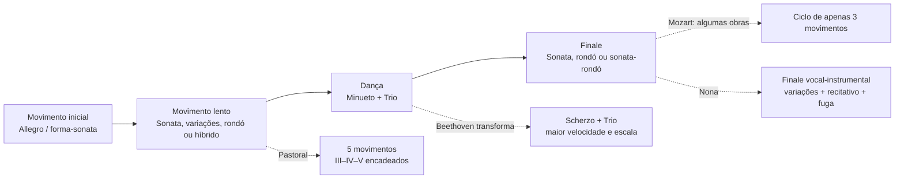
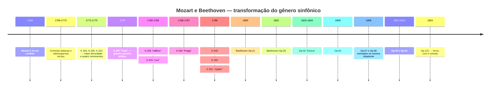
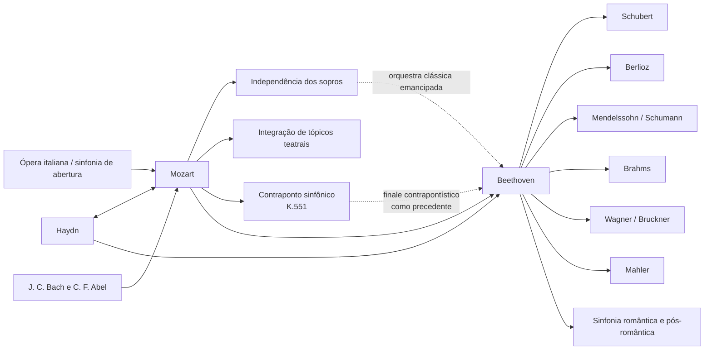

# Beethoven e Mozart: catálogo, forma, história, recepção e legado das sinfonias

## Resumo executivo

As trajetórias sinfônicas de **Wolfgang Amadeus Mozart** e **Ludwig van Beethoven** pertencem ao mesmo arco histórico, mas representam momentos diferentes da consolidação da sinfonia. Mozart acompanhou praticamente toda a transformação do gênero, da breve sinfonia italiana em três movimentos e da abertura operística dos anos 1760 à grande sinfonia de concerto vienense dos anos 1780. Beethoven recebeu de Haydn e Mozart um gênero já altamente sofisticado e o reconstruiu em torno de escala monumental, continuidade dramática, desenvolvimento motívico intensivo, codas expansivas, conflitos tonais de longo alcance e, finalmente, a incorporação da voz humana na Nona. A própria Fundação Mozarteum descreve a evolução de Mozart de uma orquestra inicial padronizada — dois oboés, duas trompas e cordas, com trompetes/tímpanos em ocasiões festivas — para uma escrita vienense mais ampla, com flauta, clarinetes e fagotes cada vez mais independentes. citeturn20view2turn25search0

Há uma assimetria fundamental entre os catálogos. **Beethoven escreveu nove sinfonias numeradas e autênticas**, correspondentes aos opp. 21, 36, 55, 60, 67, 68, 92, 93 e 125. citeturn22search1 Para Mozart, “41 sinfonias” é uma convenção histórica, não o equivalente de um catálogo crítico moderno. As antigas n.º 2 e 3 não são de Mozart; a n.º 37 é essencialmente a Sinfonia MH 334 de Michael Haydn, à qual Mozart acrescentou material introdutório; além disso, existem sinfonias autênticas sem número tradicional, versões sinfônicas de aberturas e serenatas, obras de autenticidade duvidosa e sinfonias perdidas. O novo **Köchel-Verzeichnis**, publicado em 2024 — primeira nova edição integral desde 1964 — atualizou datas, fontes e atribuições à luz da pesquisa recente. citeturn6search0turn7view0turn13search0turn25search2

A análise formal mostra uma diferença de ênfase, não uma oposição simples entre “Mozart melódico” e “Beethoven motívico”. Mozart pode trabalhar com extraordinária economia motívica — sobretudo nas Sinfonias n.º 40 e 41 — mas tende a construir grandes formas por **pluralidade de tópicos, contrastes de caráter, diálogo entre famílias instrumentais, contraponto e reinterpretação de gestos operísticos**. Beethoven leva mais longe a capacidade de uma célula mínima gerar estrutura: o exemplo paradigmático é a Quinta, em que uma figura rítmica de quatro notas permeia diferentes funções temáticas e se insere numa trajetória global de dó menor para dó maior. A *Eroica*, a Quinta, a Pastoral e a Nona ampliam a própria definição de ciclo sinfônico. Estudos recentes insistem, contudo, que a revolução beethoveniana deve ser entendida como transformação de paradigmas já existentes em Haydn e Mozart, e não como criação ex nihilo. citeturn17search6turn17search10

Em Mozart, três grandes pontos de inflexão são particularmente nítidos: a **Sinfonia n.º 25 em sol menor, K. 183**, com intensidade contrapontística e orquestração excepcionalmente escura; a **“Paris”, K. 297**, concebida para um grande concerto público e uma orquestra que incluía clarinetes; e a sequência **“Haffner”–“Linz”–“Praga”–n.º 39–40–“Júpiter”**, em que escala, independência dos sopros, cromatismo e integração contrapontística atingem um novo nível. A carta de Mozart de 9 de julho de 1778 confirma tanto o enorme êxito público da “Paris” quanto a controvérsia sobre seu Andante, considerado excessivamente modulante pelo diretor Joseph Legros; Mozart escreveu uma segunda versão do movimento. citeturn30view0turn31view0

Em Beethoven, as nove obras formam uma sequência particularmente reveladora: a Primeira ainda joga conscientemente com expectativas haydniano-mozartianas; a Segunda amplia escala e retórica; a Terceira altera radicalmente proporções e função da coda; a Quarta refina ambiguidade e humor; a Quinta produz continuidade cíclica inédita; a Sexta converte o ciclo em cinco “cenas” programáticas; a Sétima faz do ritmo o princípio estruturante; a Oitava revisita, ironicamente, modelos do século XVIII; e a Nona transforma a sinfonia em síntese instrumental-vocal. As páginas históricas do Beethoven-Haus documentam essas gêneses, estreias e revisões a partir de autógrafos, esboços, primeiras edições e fontes contemporâneas. citeturn4search0turn3search0turn4search1turn4search3turn3search2turn3search3turn5search0

Para estudo crítico, as referências editoriais mais seguras são a **Neue Mozart-Ausgabe (NMA), Série IV, grupo 11**, com seus dez volumes de sinfonias e relatórios críticos, e, para Beethoven, tanto as partituras derivadas da **Neue Beethoven-Gesamtausgabe** publicadas pela Henle quanto a edição crítico-Urtext de **Jonathan Del Mar** para a Bärenreiter. citeturn10search3turn22search0turn22search1 Em gravações, um estudo comparado se beneficia de colocar interpretações historicamente informadas ao lado da grande tradição sinfônica moderna: para Mozart, Trevor Pinnock/The English Concert é uma referência HIP integral; para Beethoven, John Eliot Gardiner/Orchestre Révolutionnaire et Romantique e Nikolaus Harnoncourt/Chamber Orchestra of Europe oferecem duas maneiras diferentes de repensar articulação, tamanho, equilíbrio e retórica à luz da pesquisa histórica. citeturn23search1turn23search6turn23search2turn23search23

## Escopo, fontes, terminologia e problemas de atribuição

**Critério de catálogo.** Para Beethoven, “catálogo completo de sinfonias” é inequívoco: nove sinfonias acabadas e numeradas. Para Mozart, este relatório separa quatro camadas: as 41 obras da numeração tradicional; obras adicionais incluídas na série sinfônica da NMA; versões sinfônicas derivadas de óperas ou serenatas; e obras espúrias, duvidosas, fragmentárias ou perdidas. A NMA distribui as sinfonias de Mozart por dez volumes da Série IV/11, editados, entre outros, por Gerhard Allroggen, Wilhelm Fischer, Hermann Beck, Christoph-Hellmut Mahling, Friedrich Schnapp, Günter Haußwald, László Somfai e H. C. Robbins Landon. citeturn10search3turn10search0turn10search1turn10search2turn11search0turn11search1turn11search2turn12search0turn12search1

**Köchel versus opus.** O número **K. ou KV** (*Köchel-Verzeichnis*) é o identificador musicológico normal das obras de Mozart. A expressão “opus” não constitui um catálogo sistemático de Mozart: algumas edições históricas atribuíram números de opus editoriais a conjuntos publicados, mas eles não têm a função que os números Op. têm em Beethoven. Portanto, na tabela de Mozart, “Op.” aparece como **não aplicável**. O Köchel online atualmente refletido pela Fundação Mozarteum deriva da nova edição de 2024 e pode fornecer datas mais amplas ou diferentes das consagradas pela sexta edição; K. 183, por exemplo, é hoje datada oficialmente em um intervalo de março de 1773 a maio de 1775, embora a literatura mais antiga costume situá-la especificamente no outono de 1773. citeturn7view0turn25search3

**Status de autenticidade.** A antiga Sinfonia n.º 3, historicamente K. 18, é agora catalogada como **KV Anh. A 51**, obra autenticada de **Carl Friedrich Abel**, não de Mozart. citeturn13search0 A n.º 2, K. 17/Anh. C 11.02, também não integra o corpus autêntico de Mozart e é atribuída a Leopold Mozart na bibliografia moderna. A antiga n.º 37, K. 444/425a, é atualmente catalogada como **KV Anh. A 53 / MH 334**, uma sinfonia de Michael Haydn com participação de Mozart. citeturn16search0turn25search2 A K. 84 é um exemplo de caso ainda explicitamente classificado pelo novo Köchel como **“autenticidade duvidosa”**; fontes antigas a atribuem alternadamente a Wolfgang, Leopold Mozart e Dittersdorf. citeturn25search1

**Forma.** Termos como “forma-sonata” são empregados aqui analiticamente. Nas sinfonias da década de 1760, dizer “forma-sonata” pode ser anacrônico se entendido como modelo escolar do século XIX. Em muitos primeiros movimentos é mais preciso falar em **forma binária de sonata ou sonata inicial**, na qual exposição, recapitulação e desenvolvimento ainda não possuem as proporções e funções que encontramos na década de 1780. A própria história da sinfonia mostra uma passagem de modelos de abertura italiana e estruturas binárias para uma organização cada vez mais diferenciada dos quatro movimentos. A literatura moderna sobre a sinfonia clássica enfatiza justamente essa pluralidade histórica. citeturn17search4turn17search8

**Orquestração.** Nas primeiras sinfonias de Mozart, o núcleo típico é cordas, dois oboés e duas trompas; trompetes e tímpanos aparecem sobretudo nas obras festivas. Na corte de Salzburgo, flautistas e oboístas podiam ser os mesmos músicos, fator que ajuda a explicar por que flautas e oboés nem sempre aparecem simultaneamente. No período vienense, clarinetes e fagotes tornam-se vozes independentes em grau muito maior. citeturn25search0turn20view2 Beethoven começa dentro desse mundo clássico, mas progressivamente converte trompas, trompetes, tímpanos e madeiras em agentes formais, culminando nas expansões de timbre da Quinta, Sexta e Nona.

O fluxograma abaixo resume **um arquétipo**, não uma regra rígida:

Essa genealogia formal corresponde ao quadro histórico documentado pela NMA para Mozart e pelas fontes críticas das nove sinfonias de Beethoven. citeturn10search0turn10search1turn12search1turn4search3turn5search0

## Catálogo, cronologia, estreias e fontes documentais

**Tabela de catálogo — Beethoven.**

| Sinfonia | Tonalidade | Composição | Catálogo | Estreia / primeira execução conhecida | Intérpretes e observações |
|---|---|---:|---|---|---|
| n.º 1 | Dó maior | 1799–1800 | **Op. 21** | 2 abr. 1800, Hofburgtheater/Burgtheater, Viena | Akademie organizada por Beethoven; programa incluiu Mozart, Haydn, concerto para piano e Septeto de Beethoven. citeturn4search0 |
| n.º 2 | Ré maior | 1800–1802 | **Op. 36** | 5 abr. 1803, Theater an der Wien | Primeira execução pública seguramente documentada, em Akademie de Beethoven; possível execução privada anterior. citeturn3search0 |
| n.º 3 “Eroica” | Mi♭ maior | 1803–1804 | **Op. 55** | privada para Lobkowitz, 1804; pública 7 abr. 1805, Theater an der Wien | Orquestra de Lobkowitz nas primeiras apresentações; dedicação definitiva ao príncipe Lobkowitz. citeturn4search1turn2search5turn2search17 |
| n.º 4 | Si♭ maior | 1806 | **Op. 60** | provavelmente mar. 1807, palácio Lobkowitz, Viena | Execução privada associada à casa de Lobkowitz; dedicada ao conde Franz von Oppersdorff. citeturn3search1 |
| n.º 5 | Dó menor | 1804–1808 | **Op. 67** | 22 dez. 1808, Theater an der Wien | Beethoven dirigiu a célebre Akademie de aproximadamente quatro horas; orquestra circunstancial e condições difíceis. citeturn2search0turn4search2 |
| n.º 6 “Pastoral” | Fá maior | 1807–1808 | **Op. 68** | 22 dez. 1808, Theater an der Wien | Mesma Akademie da Quinta; no programa, a Pastoral foi apresentada antes da Sinfonia em dó menor. citeturn4search3turn2search0 |
| n.º 7 | Lá maior | 1811–1812 | **Op. 92** | 8 dez. 1813, Universidade de Viena | Concerto beneficente dirigido por Beethoven, juntamente com *Wellington’s Victory*; grande êxito. citeturn3search2 |
| n.º 8 | Fá maior | 1812 | **Op. 93** | 27 fev. 1814, Redoutensaal, Viena | Beethoven dirigiu; programa incluía também a Sétima e *Wellington’s Victory*. citeturn3search3 |
| n.º 9 | Ré menor | 1822–1824; esboços desde 1815 | **Op. 125** | 7 mai. 1824, Kärntnertortheater, Viena | Michael Umlauf exerceu a direção efetiva enquanto Beethoven permaneceu no palco; Henriette Sontag, Caroline Unger, Anton Haizinger e Joseph Seipelt integraram o quarteto solista. citeturn5search0turn2search19 |

A datação da Segunda merece uma correção a uma narrativa biográfica muito difundida: o Beethoven-Haus salienta que uma parcela substancial da obra já estava concebida antes do célebre Testamento de Heiligenstadt, o que torna simplista interpretar sua exuberância como “resposta” direta à crise de 1802. citeturn3search0 A Sétima, por sua vez, está documentada pelo autógrafo com “1812 Aug. 13” e estreou no contexto das guerras napoleônicas, em evento beneficente. citeturn3search2

**Tabela de catálogo — Mozart, numeração histórica de 1 a 41.** “—” em estreia significa que uma primeira apresentação específica não é documentalmente recuperável com segurança; isso é particularmente comum nas obras de Salzburgo, muitas das quais foram escritas para uso cortesão sem documentação individual de estreia. citeturn25search0

| N.º histórico | Tonalidade | Data aproximada / atual | Köchel | Op. | Estreia ou primeira execução identificável | Status |
|---|---|---|---|---|---|---|
| 1 | Mi♭ | 1764 | **K. 16** | — | Londres, 21 fev. 1765 | autêntica. citeturn10search0turn21search16 |
| 2 | Si♭ | c. 1765 | **K. 17 / Anh. C 11.02** | — | — | **espúria; atribuída a Leopold Mozart**. citeturn16search0turn16search4 |
| 3 | Mi♭ | 1764 | **K. 18; atual Anh. A 51** | — | obra de Abel | **Carl Friedrich Abel**, não Mozart. citeturn13search0 |
| 4 | Ré | 1765 | **K. 19** | — | — | autêntica. citeturn10search0 |
| 5 | Si♭ | 1765 | **K. 22** | — | provavelmente período Haia; estreia exata incerta | autêntica. citeturn10search0 |
| 6 | Fá | 1767 | **K. 43** | — | — | autêntica. citeturn10search0 |
| 7 | Ré | 1768 | **K. 45** | — | — | autêntica. citeturn10search0 |
| 8 | Ré | 1768 | **K. 48** | — | — | autêntica. citeturn10search0 |
| 9 | Dó | c. 1769–72 | **K. 73 / 75a** | — | — | autêntica; cronologia histórica revista. citeturn10search0 |
| 10 | Sol | 1770 | **K. 74** | — | — | autêntica. citeturn10search1 |
| 11 | Ré | 1770 | **K. 84 / 73q** | — | — | **autenticidade duvidosa**. citeturn25search1 |
| 12 | Sol | 1771 | **K. 110 / 75b** | — | — | autêntica. citeturn10search1 |
| 13 | Fá | 1771 | **K. 112** | — | — | autêntica. citeturn10search1 |
| 14 | Lá | 30 dez. 1771 | **K. 114** | — | — | autêntica; data autógrafa oficial. citeturn25search0 |
| 15 | Sol | 1772 | **K. 124** | — | — | autêntica. citeturn10search1 |
| 16 | Dó | 1772 | **K. 128** | — | — | autêntica. citeturn10search2 |
| 17 | Sol | 1772 | **K. 129** | — | — | autêntica. citeturn10search2 |
| 18 | Fá | 1772 | **K. 130** | — | — | autêntica. citeturn10search2 |
| 19 | Mi♭ | 1772 | **K. 132** | — | — | autêntica; sobreviveram alternativas para o movimento lento. citeturn10search2 |
| 20 | Ré | 1772 | **K. 133** | — | — | autêntica. citeturn10search2 |
| 21 | Lá | 1772 | **K. 134** | — | — | autêntica. citeturn10search2 |
| 22 | Dó | 1773 | **K. 162** | — | — | autêntica. citeturn11search0 |
| 23 | Ré | tradicionalmente 1773; catálogo atual admite intervalo mais amplo | **K. 181** | — | — | autêntica. citeturn14search3 |
| 24 | Si♭ | 1773 | **K. 182** | — | — | autêntica. citeturn11search0 |
| 25 | Sol menor | tradicionalmente 1773; atual: mar. 1773–mai. 1775 | **K. 183 / 173dB** | — | — | autêntica; 4 trompas. citeturn25search3 |
| 26 | Mi♭ | 1773 | **K. 184 / 161a** | — | — | autêntica. citeturn11search0 |
| 27 | Sol | c. 1773 | **K. 199 / 161b** | — | — | autêntica. citeturn11search0 |
| 28 | Dó | c. 1773–75 | **K. 200 / 189k** | — | — | autêntica; data antiga no autógrafo apresenta problemas. citeturn25search4 |
| 29 | Lá | 1774 | **K. 201 / 186a** | — | — | autêntica. citeturn11search1 |
| 30 | Ré | 1774 | **K. 202 / 186b** | — | — | autêntica. citeturn11search1 |
| 31 “Paris” | Ré | jun. 1778 | **K. 297 / 300a** | — | **18 jun. 1778, Concert Spirituel, Tuileries, Paris** | autêntica; orquestra do Concert Spirituel; Joseph Legros dirigia a instituição. citeturn21search13turn30view0 |
| 32 | Sol | 26 abr. 1779 | **K. 318** | — | — | autêntica; estrutura contínua em três seções. citeturn11search2turn17search20 |
| 33 | Si♭ | 1779; revisões posteriores | **K. 319** | — | — | autêntica. citeturn11search2 |
| 34 | Dó | 1780 | **K. 338** | — | — | autêntica; três movimentos. citeturn11search2 |
| 35 “Haffner” | Ré | 1782; revista 1783 | **K. 385** | — | **23 mar. 1783, Burgtheater, Viena** | Mozart dirigiu sua Akademie; origem em música festiva para a família Haffner. citeturn27search21turn27search17turn27search32 |
| 36 “Linz” | Dó | 30 out.–início nov. 1783 | **K. 425** | — | **4 nov. 1783, teatro de Linz** | escrita às pressas para concerto anunciado pelo conde Thun. citeturn31view1turn27search8 |
| 37 | Sol | c. 1783–84 | antiga **K. 444/425a; atual Anh. A 53 / MH 334** | — | versão relacionada à estadia de Linz | **Michael Haydn; contribuição de Mozart na introdução**. citeturn25search2turn27search8 |
| 38 “Praga” | Ré | 6 dez. 1786 | **K. 504** | — | **19 jan. 1787, Praga, teatro então associado ao National/Estates Theatre** | Mozart liderou o concerto. citeturn27search6turn27search10 |
| 39 | Mi♭ | **26 jun. 1788** | **K. 543** | — | estreia específica **não identificada com segurança** | autêntica. citeturn14search2turn28search9 |
| 40 | Sol menor | **25 jul. 1788**; versão com clarinetes posterior | **K. 550** | — | estreia privada incerta; apresentações documentáveis/prováveis em 1791 | autêntica, duas versões. citeturn14search0turn28search16 |
| 41 “Júpiter” | Dó | **10 ago. 1788** | **K. 551** | — | estreia específica não preservada | autêntica; última sinfonia de Mozart. citeturn20view2turn28search9 |

A “Paris” constitui o caso mais bem documentado de recepção imediata entre as sinfonias mozartianas anteriores a Viena. A correspondência familiar registra o êxito no Concert Spirituel; Leopold parabenizou o filho expressamente, e Mozart escreveu que a obra fora recebida “incomparavelmente bem”. A mesma carta mostra que Mozart pensava estrategicamente nos efeitos públicos, nas expectativas do público parisiense e até na substituição do movimento lento. citeturn31view2turn31view0

A gênese da “Linz” é igualmente excepcionalmente bem documentada. Em 31 de outubro de 1783 Mozart escreveu a Leopold que o conde Thun anunciara um concerto para 4 de novembro e, como ele não trouxera consigo nenhuma sinfonia, estava trabalhando “a toda velocidade” numa nova. A carta é evidência primária para as circunstâncias extraordinariamente comprimidas da composição. citeturn30view1turn31view1

**Sinfonias e versões adicionais relevantes fora da série 1–41.**

| Obra | Tonalidade | Data aproximada | Situação crítica |
|---|---|---:|---|
| K. Anh. 223 / 19a | Fá | c. 1765 | incluída na NMA entre as sinfonias iniciais. citeturn10search0 |
| K. Anh. 221 / 45a, “Old Lambach” | Sol | c. 1766 | transmitida na NMA; historicamente objeto de debate atributivo. citeturn10search0 |
| K. Anh. 214 / 45b | Si♭ | c. 1768 | atribuição problemática; incluída criticamente na NMA. citeturn10search0 |
| K. 75 | Fá | c. 1771 | tradicional n.º 42; autenticidade discutida. citeturn10search1turn16search4 |
| K. 76 / 42a | Fá | década de 1760 | tradicional n.º 43; atribuição discutida. citeturn10search0turn16search4 |
| K. 81 / 73l | Ré | 1770 | tradicional n.º 44; atribuição discutida. citeturn10search1 |
| K. 95 / 73n | Ré | c. 1770 | tradicional n.º 45; atribuição discutida. citeturn10search1 |
| K. 96 / 111b | Dó | c. 1771 | tradicional n.º 46; atribuição discutida. citeturn10search1 |
| K. 97 / 73m | Ré | c. 1770 | tradicional n.º 47; atribuição discutida. citeturn10search1 |
| K. 111 + K. 120 / 111a | Ré | 1771 | versão sinfônica ligada à abertura de *Ascanio in Alba*; tradicional n.º 48. citeturn10search1 |
| Abertura K. 126 + K. 161/163 | Ré | 1772 | versão sinfônica associada a *Il sogno di Scipione*; conhecida como n.º 50. citeturn10search2 |
| Abertura K. 196 + K. 121 / 207a | Ré | 1774–75 | versão sinfônica formada por abertura + finale. citeturn11search1 |
| Abertura K. 208 + K. 102 / 213c | Dó | 1775 | versão sinfônica **incompleta** associada a *Il re pastore*. citeturn11search1 |
| Versão sinfônica de K. 204 / 213a | Ré | 1775 | redução de serenata. citeturn9view1 |
| Versão sinfônica de K. 250 / 248b, “Haffner Serenade” | Ré | 1776 | redução de serenata; a obra festiva original foi tocada para os Haffner em 21 jul. 1776. citeturn14search4turn9view1 |
| Versão sinfônica de K. 320, “Posthorn” | Ré | 1779 | redução de serenata. citeturn9view1 |
| K. 409 | Dó | início dos anos 1780 | minueto sinfônico isolado, **não uma sinfonia completa**. citeturn12search2 |
| K. Anh. 220 / 16a, “Odense” | Lá menor | atribuída historicamente ao jovem Mozart | autenticidade fortemente problemática; deve permanecer fora do núcleo seguro. citeturn16search4 |
| K. Anh. 216 / 74g | Si♭ | incerta | tradicional n.º 54; duvidosa. citeturn16search4 |
| K. Anh. 214 / 45b | Si♭ | incerta | tradicional n.º 55; duvidosa. citeturn16search4 |
| K. 98 / Anh. C 11.04 | Fá | incerta | tradicional n.º 56; atribuição duvidosa/espúria. citeturn16search4 |

Há ainda referências a **sinfonias perdidas** — incluindo K. 19b e vários itens antigos dos anexos Köchel — para as quais não existe material suficiente para uma análise formal integral. O próprio catálogo oficial observa que Mozart teria escrito cerca de quinze sinfonias durante a grande viagem europeia de 1763–66 e que várias se perderam. citeturn20view2turn16search0

**Linha do tempo sintética:**

A cronologia mostra que a “sinfonia clássica” não é um modelo congelado: entre K. 16 e K. 551 Mozart atravessa mais de duas décadas de mudanças institucionais e estilísticas, enquanto Beethoven, em apenas cerca de vinte e quatro anos, converte esse legado em um gênero de ambição estética cada vez maior. citeturn20view2turn4search0turn5search0

## Anatomia formal e análise movimento por movimento

Em toda esta seção, “FS” significa **forma-sonata**; “bin./son.” indica uma forma binária cuja lógica já antecipa procedimentos de sonata; “T–D” significa movimento da tônica para a dominante, e “T–rel.” a passagem típica para a relativa maior em obras em tonalidade menor. As identificações são leituras analíticas das partituras críticas; movimentos clássicos frequentemente admitem mais de uma interpretação formal defensável. A NMA fornece o texto crítico de base para Mozart e as edições Henle/Bärenreiter o equivalente moderno para Beethoven. citeturn10search3turn22search0turn22search1

**Beethoven, Sinfonia n.º 1 em dó maior, Op. 21.** O primeiro movimento começa com um *Adagio molto* deliberadamente desorientador: em vez de afirmar imediatamente dó maior, Beethoven projeta harmonias que soam como dominantes de regiões vizinhas, sobretudo uma dominante de fá, prolongando a recusa da tônica. O *Allegro con brio* estabelece finalmente dó maior e usa uma forma-sonata de perfil haydniano, mas com maior agressividade dinâmica, escalas e acentuação dos sopros. O desenvolvimento fragmenta as células e explora sequências modulantes antes da recuperação da tônica. O **II, Andante cantabile con moto**, em fá maior, é uma sonata lírica em que imitação e contraponto leve convivem com trompetes e tímpanos integrados discretamente — instrumentação incomum para a imagem convencional de um “movimento lento delicado”. O **III, Menuetto: Allegro molto e vivace**, nominalmente minueto, é funcionalmente um scherzo: demasiado rápido, sincopado e energeticamente instável para a dança aristocrática tradicional. O **IV** começa com uma piada de introdução lenta em que a escala de dó é revelada nota por nota; o *Allegro molto e vivace* converte o gesto em finale de sonata de rapidez e humor haydnianos. A obra, portanto, não abandona Haydn e Mozart: ela faz do conhecimento desse vocabulário a condição para perturbar as expectativas do ouvinte. citeturn4search0turn22search9

**Sinfonia n.º 2 em ré maior, Op. 36.** O **I, Adagio molto – Allegro con brio**, amplia consideravelmente a introdução lenta, com excursões ao modo menor, cromatismo e acordes de função ambígua antes da exuberante FS em ré. O desenvolvimento e a coda já excedem as proporções comuns da Primeira; a coda deixa de ser simples confirmação e passa a participar da elaboração. O **II, Larghetto, lá maior**, é uma extensa forma-sonata lírica: frases longas e ornamentadas coexistem com imitação e uma paleta de madeiras muito diferenciada. O **III é explicitamente chamado Scherzo**, consolidando a substituição do minueto no ciclo sinfônico beethoveniano; contrastes súbitos de dinâmica e registro são constitutivos da forma. O **IV, Allegro molto**, nasce de um motivo abrupto, quase grotesco, que funciona como sinal recorrente; a forma mistura características de sonata e rondó e culmina numa coda extraordinariamente longa, antecipando a importância estrutural que a coda terá na *Eroica*. citeturn3search0turn22search5

**Sinfonia n.º 3 em mi♭ maior, Op. 55, “Eroica”.** O **I, Allegro con brio**, elimina a introdução lenta: dois acordes fortíssimos de mi♭ lançam imediatamente um tema baseado no arpejo da tônica. Quase de imediato, porém, um dó♯ estranho à tonalidade desestabiliza o campo harmônico. A exposição contém não apenas “tema 1/tema 2”, mas uma rede de grupos temáticos, ritmos sincopados e conflitos métricos. O desenvolvimento é colossal: fragmenta células, cria cadeias de dissonâncias e apresenta um célebre material novo em mi menor. A famosa entrada aparentemente “prematura” da trompa próximo à recapitulação intensifica a ambiguidade temporal. A coda funciona como **segundo desenvolvimento**, reconstruindo o material em vez de simplesmente encerrar. O **II, Marcia funebre: Adagio assai**, em dó menor, combina marcha, rondó e arquitetura ternária/variacional; episódios em dó maior e seções fugadas convertem a marcha em processo coletivo de lamento e reconstrução. O **III, Scherzo**, substitui definitivamente a sociabilidade do minueto por velocidade, surpresa e tensão; o Trio dá destaque espetacular a **três trompas**, ampliação significativa da seção. O **IV** é uma síntese de variação, fuga e lógica de finale sobre material já empregado por Beethoven em *As criaturas de Prometeu* e outras peças: começa pelo baixo do tema antes de apresentar sua superfície melódica e o submete a transformações contrapontísticas e líricas. A inovação decisiva não é apenas “duração”: é a conversão do ciclo inteiro em argumento dramático em grande escala. citeturn4search1turn17search6turn22search11

**Sinfonia n.º 4 em si♭ maior, Op. 60.** O **I** começa com um *Adagio* cuja textura rarefeita e percurso inicialmente sombrio fazem a tônica de si♭ parecer distante; a explosão do *Allegro vivace* resolve essa suspensão e inicia uma FS extraordinariamente móvel, baseada em escalas, arpejos e deslocamentos rítmicos. O **II, Adagio em mi♭**, é estruturado por um ritmo pontuado de acompanhamento que se torna tão importante quanto as melodias; clarinete e demais madeiras adquirem forte personalidade temática. O **III, Allegro vivace**, é um scherzo expandido de cinco partes — scherzo–trio–scherzo–trio–scherzo —, procedimento que Beethoven reutilizará na Sétima. O **IV, Allegro ma non troppo**, é um *perpetuum mobile* de semicolcheias: a virtuosidade das cordas é pontuada por intervenções cômicas dos sopros, incluindo o famoso momento do fagote. A Quarta demonstra que inovação beethoveniana não equivale a gigantismo: aqui ela reside em ambiguidade, ritmo, velocidade e ironia. citeturn3search1

**Sinfonia n.º 5 em dó menor, Op. 67.** No **I, Allegro con brio**, a célula curta-curta-curta-longa não deve ser entendida apenas como “tema”: ela é um **gerador rítmico** que atravessa transições, acompanhamento, tutti e coda. A exposição parte de dó menor e dirige-se a mi♭ maior; o desenvolvimento reduz a textura a fragmentos cada vez menores. Na recapitulação, um inesperado solo quase cadencial do oboé suspende temporariamente o impulso. A coda novamente assume função desenvolvimental. O **II, Andante con moto, lá♭ maior**, alterna dois complexos temáticos em processo de **duplas variações**; episódios de fanfarra em dó maior começam a antecipar a tonalidade triunfal do finale. O **III, Allegro, dó menor**, transforma ritmicamente a célula do primeiro movimento nas trompas; o trio é fugado e energético. Ao retornar, o scherzo é reduzido a um fantasma em *pianissimo*, e uma longa dominante conduz **sem interrupção** ao finale. O **IV, Allegro, dó maior**, acrescenta piccolo, contrafagote e trombones à massa orquestral; a transformação de dó menor em dó maior torna-se evento formal e timbrístico simultaneamente. Uma recordação do scherzo antes da recapitulação estabelece verdadeira memória cíclica. A Quinta é, portanto, menos uma narrativa literal de “destino” do que um extraordinário estudo de integração motívica, continuidade entre movimentos e tonalidade em escala global. citeturn4search2turn17search3

**Sinfonia n.º 6 em fá maior, Op. 68, “Pastoral”.** Beethoven fornece títulos aos cinco movimentos e insiste que se trata mais de expressão de sentimentos do que de pintura literal. O **I, “Despertar de sentimentos alegres ao chegar ao campo”**, é uma FS em fá maior cuja novidade reside em repetições extensas de pequenos módulos, longos campos harmônicos estáveis e ênfase subdominante/plagal; o objetivo é menos conflito teleológico que sensação de permanência. O **II, “Cena junto ao riacho”, si♭ maior**, mantém uma figura ondulante em compasso composto sob melodias das madeiras; ao fim, Beethoven identifica explicitamente rouxinol, codorna e cuco em flauta, oboé e clarinete. O **III, “Alegre reunião de camponeses”**, é um scherzo no qual deformações de acento e uma caricatura de banda rural substituem a elegância do minueto. Sem cadência convencional, a festa é interrompida pelo **IV, “Tempestade”, fá menor**, movimento quase inteiramente processual: tremolos, cromatismo, sétimas diminutas, tímpanos, piccolo e trombones criam uma intensificação contínua. A tempestade dissolve-se diretamente no **V, “Canto dos pastores; sentimentos alegres e agradecidos depois da tempestade”**, em fá maior, híbrido de rondó, sonata e hino pastoral, dominado por cadências plagais e um tema de caráter coral. Os três últimos movimentos formam uma sequência ininterrupta, importante precedente para ciclos programáticos românticos. citeturn4search3turn17search3

**Sinfonia n.º 7 em lá maior, Op. 92.** O **I, Poco sostenuto – Vivace**, possui uma das maiores introduções lentas de Beethoven: escalas ascendentes e acordes sustentados conduzem por regiões como dó e fá antes que uma nota repetida se transforme no pulso do *Vivace* em 6/8. A FS que segue é governada por uma figura pontuada obsessiva. O **II, Allegretto, lá menor**, começa com um acorde e um ostinato rítmico cuja recorrência sustenta variações, sobreposição contrapontística e um episódio em lá maior; a progressão das vozes cria um processo de acumulação quase arquitetônico. O **III, Presto**, situa o scherzo em fá maior, tonalidade inesperada em relação a lá; o trio em ré maior é ouvido duas vezes, produzindo novamente forma de cinco partes. O **IV, Allegro con brio**, em lá maior, leva repetição rítmica, síncopes e ostinatos a um grau quase físico; sua longa coda intensifica a dominante e o baixo repetido antes da resolução. A observação posterior de Adorno de que a Sétima seria a “sinfonia por excelência” é citada pelo Beethoven-Haus como índice de sua fortuna crítica. citeturn3search2turn17search7

**Sinfonia n.º 8 em fá maior, Op. 93.** O **I, Allegro vivace e con brio**, entra diretamente em fá maior, mas sua aparente “normalidade clássica” é minada por acentos deslocados, falsas hierarquias métricas e uma coda desproporcionalmente vigorosa. O **II, Allegretto scherzando, si♭ maior**, substitui o movimento lento por uma miniatura rítmica baseada em pulsos de sopros; a tradição que o ligava diretamente ao metrônomo de Mälzel deve ser tratada com cautela, pois a anedota é posterior e problemática. O **III, Tempo di Menuetto**, é um minueto deliberadamente arcaizante, lento e pesado em comparação com os scherzi beethovenianos. O **IV, Allegro vivace**, constitui o ápice do humor estrutural: uma nota de dó♯ violentamente estranha ao fá maior reaparece como problema harmônico; na imensa coda, Beethoven explora sua reinterpretação e excursões remotas antes da afirmação final da tônica. A Oitava é “retrógrada” apenas superficialmente: é uma metacrítica dos procedimentos clássicos. citeturn3search3

**Sinfonia n.º 9 em ré menor, Op. 125.** O **I, Allegro ma non troppo, un poco maestoso**, começa não com uma melodia acabada, mas com quintas abertas e fragmentos que parecem emergir do indeterminado até cristalizar o ré menor; a forma-sonata converte esse “nascimento” em princípio recorrente, e desenvolvimento/coda expandem violentamente o material. O **II, Molto vivace**, coloca o scherzo antes do movimento lento; o tema fugado em ré menor e as explosões dos tímpanos são contrabalançados por um Trio em ré maior, mais veloz e pastoral. O **III, Adagio molto e cantabile, si♭ maior**, trabalha duas áreas/ideias principais por variação ornamental e expansão, incluindo contrastes em ré maior e episódios de fanfarra. O **IV** começa com uma dissonância explosiva e recitativos instrumentais de violoncelos e contrabaixos que “rejeitam” reminiscências dos três movimentos anteriores. Só então surge, em ré maior, a melodia simples da “Ode à Alegria”, inicialmente nos baixos de cordas; sucedem-se variações instrumentais, entrada do barítono, coro, marcha “turca” com percussão, fuga, episódio solene sobre “Seid umschlungen, Millionen”, combinação contrapontística de ideias e uma enorme coda. A inovação não é apenas “usar um coro”: é fazer o próprio finale dramatizar a insuficiência da sinfonia puramente instrumental e construir uma nova forma a partir de recitativo, variação, marcha, fuga, hino e sonoridade sinfônica. citeturn5search0turn22search7

**Mozart — análise compacta do corpus numerado.** As sequências de tonalidades abaixo condensam o percurso movimento a movimento; em várias obras iniciais, “sonata inicial” é deliberadamente preferível a uma leitura escolar rígida. Os títulos e a organização dos movimentos são documentados pelos volumes sinfônicos da NMA. citeturn10search0turn10search1turn10search2turn11search0turn11search1turn11search2turn12search0turn12search1

| Sinfonia | Movimento por movimento e leitura formal | Orquestração, motivos e inovação |
|---|---|---|
| **n.º 1, K.16** | I Mi♭, *Molto allegro*, bin./son.; II dó menor, *Andante*, binário; III Mi♭, *Presto*, fast-binary/sonata inicial. | Cordas + oboés/trompas. A ida do movimento lento ao relativo menor introduz gravidade inesperada numa obra londrina infantil; forte influência do ambiente de J. C. Bach/Abel. citeturn10search0 |
| **n.º 2, K.17** | Estrutura tradicional em Si♭, mas **não deve ser analisada como Mozart**. | A atribuição a Mozart é rejeitada; permanece apenas por razão historiográfica. citeturn16search0 |
| **n.º 3, antiga K.18** | Ciclo rápido–lento–rápido em Mi♭; idioma galante e transparência temática. | É uma sinfonia de **C. F. Abel**, copiada pelo jovem Mozart. Seu interesse está justamente em mostrar um dos modelos que o menino estudou. citeturn13search0 |
| **n.º 4, K.19** | I Ré, Allegro, bin./son.; II Sol, Andante; III Ré, Presto. | Três movimentos e trajetórias harmônicas simples T–D/T–SD, típicas do primeiro período londrino. citeturn10search0 |
| **n.º 5, K.22** | I Si♭; II Mi♭; III Si♭. Formato rápido–lento–rápido. | Frases mais marcadamente periódicas e respostas orquestrais; assimilação do estilo internacional da viagem europeia. citeturn10search0 |
| **n.º 6, K.43** | I Fá, FS inicial; II Dó, Andante; III Fá, Menuetto/Trio; IV Fá, Allegro. | A adoção de quatro movimentos aproxima a obra do modelo austro-germânico; o minueto passa a integrar o ciclo. citeturn10search0 |
| **n.º 7, K.45** | Ré–Sol–Ré–Ré; Allegro / Andante / Menuetto / Allegro. | Festividade em ré maior, fanfarras e cadências claras; equilíbrio entre italiano e vienense. citeturn10search0 |
| **n.º 8, K.48** | Ré–Sol–Ré–Ré, quatro movimentos. | Forte perfil cerimonial; contrastes tutti/camadas de cordas e sopros. citeturn10search0 |
| **n.º 9, K.73** | Dó–Fá–Dó–Dó; quatro movimentos. | Modelo festivo salzburguês; cadências e sequências ganham maior amplitude. citeturn10search0 |
| **n.º 10, K.74** | Sol, seção lenta/subdominante associada ao ciclo, retorno rápido em Sol. | Relação particularmente próxima com a abertura italiana e com movimentos encadeados. citeturn10search1 |
| **n.º 11, K.84** | Ré–Sol–Ré, três movimentos. | Idioma plausivelmente mozartiano, mas a transmissão contraditória impede atribuição segura. citeturn25search1 |
| **n.º 12, K.110** | Sol–Dó–Sol–Sol. | Quatro movimentos; linhas internas e viola ganham peso em relação ao baixo contínuo dos primeiros modelos. citeturn10search1 |
| **n.º 13, K.112** | Fá–Si♭–Fá–Fá. | Maior energia motívica nos tuttis, com clara oposição entre períodos de cordas e reforços de sopros. citeturn10search1 |
| **n.º 14, K.114** | Lá–Ré–Lá–Lá. | Obra mais espaçosa; contraponto interno mais ativo. O Köchel atual data-a precisamente de 30 dez. 1771. citeturn25search0 |
| **n.º 15, K.124** | Sol–Dó–Sol–Sol. | Síntese salzburguesa entre brilho de abertura e minueto cortesão. citeturn10search1 |
| **n.º 16, K.128** | Dó–Sol–Dó, três movimentos. | Retorno ao formato italiano; rápidos externos compactos e fortemente cadenciais. citeturn10search2 |
| **n.º 17, K.129** | Sol–Dó–Sol, três movimentos. | Textura ágil e maior diferenciação do segundo grupo temático. citeturn10search2 |
| **n.º 18, K.130** | Fá–Si♭–Fá–Fá. | Quatro movimentos; extensão e escrita dos sopros já indicam afastamento das miniaturas da década anterior. citeturn10search2 |
| **n.º 19, K.132** | Mi♭–Si♭–Mi♭–Mi♭; versão alternativa do lento preservada. | A existência de movimentos alternativos torna a obra particularmente importante para estudar revisão e escolha de caráter. citeturn10search2 |
| **n.º 20, K.133** | Ré–Lá–Ré–Ré. | Brilho de ré maior, com maior independência das partes internas e contraste dinâmico. citeturn10search2 |
| **n.º 21, K.134** | Lá–Ré–Lá–Lá. | Textura refinada, menor dependência de puro efeito cerimonial. citeturn10search2 |
| **n.º 22, K.162** | Dó–Fá–Dó, três movimentos. | Compacta, teatral e próxima do gesto de abertura operística. citeturn11search0 |
| **n.º 23, K.181** | Ré–Sol–Ré, três seções/movimentos de impulso teatral. | Continuidade rápida e gestual; o Köchel atual fornece data mais ampla que a cronologia antiga. citeturn14search3 |
| **n.º 24, K.182** | Si♭–Mi♭–Si♭, três movimentos. | Clareza galante combinada a maior força dos tuttis. citeturn11search0 |
| **n.º 25, K.183** | I sol menor, FS; II Mi♭, lento em FS/binária expandida; III sol menor, Menuetto, Trio em Sol maior; IV sol menor, FS. | Dois oboés, dois fagotes, **quatro trompas** e cordas; síncopes, saltos, tremolos, contraponto e dinâmica conferem peso incomum. citeturn25search3 |
| **n.º 26, K.184** | Mi♭ – dó menor – Mi♭, três movimentos encadeados ou estreitamente relacionados. | Dramaturgia de abertura teatral; o lento em dó menor escurece radicalmente o centro tonal. citeturn11search0 |
| **n.º 27, K.199** | Sol–Ré–Sol. | Aparência leve, mas elaboração temática e linhas internas mais flexíveis que nas primeiras sinfonias. citeturn11search0 |
| **n.º 28, K.200** | Dó–Fá–Dó–Dó. | Trompetes disponíveis nas fontes e caráter cerimonial; interação crescente entre fanfarra e lirismo. citeturn25search4 |
| **n.º 29, K.201** | I Lá, FS; II Ré, Andante; III Lá, Menuetto; IV Lá, FS em 6/8. | Uma das primeiras sinfonias maduras: contraponto, imitação e motivos reaparecem sob funções diferentes; finale une dança e desenvolvimento. citeturn11search1 |
| **n.º 30, K.202** | Ré–Lá–Ré–Ré. | Maior energia rítmica e expansão da forma de quatro movimentos; brilho ainda associado ao contexto salzburguês. citeturn11search1 |
| **n.º 31, K.297 “Paris”** | I Ré, FS monumental; II Sol, Andante — duas versões; III Ré, Allegro/FS. | Flautas, oboés, **clarinetes**, fagotes, trompas, trompetes, tímpanos e cordas: escala inédita em Mozart. Tutti inicial e contrastes *piano–forte* exploram deliberadamente o público parisiense. citeturn21search13turn31view0 |
| **n.º 32, K.318** | Allegro spiritoso em Sol → Andante contrastante → retorno do tempo inicial em Sol, sem ciclo separado normal. | Híbrido de abertura e sinfonia, concentrando exposição, contraste lento e retorno rápido num arco contínuo. citeturn11search2turn17search20 |
| **n.º 33, K.319** | Si♭–Mi♭–Si♭–Si♭. | Equilíbrio camerístico dos sopros e maior elaboração das transições; o ciclo foi objeto de revisão. citeturn11search2 |
| **n.º 34, K.338** | I Dó, FS; II Fá, Andante di molto; III Dó, finale rápido; **sem minueto**. | Concentrada e brilhante; o contraste entre grandiosidade externa e interior lírico antecipa a década vienense. citeturn11search2 |
| **n.º 35, K.385 “Haffner”** | I Ré, FS; II Sol, Andante; III Ré, Menuetto/Trio; IV Ré, Presto. | O motivo inicial em uníssono domina o I; para a versão sinfônica Mozart ampliou sopros. Finale de energia *buffa*; Mozart pediu que fosse executado o mais rapidamente possível. citeturn27search25turn27search17 |
| **n.º 36, K.425 “Linz”** | I Adagio–Allegro spiritoso, Dó, FS; II Fá, Andante/FS; III Dó, Menuetto; IV Dó, Presto/FS. | Primeira introdução lenta de grande escala numa sinfonia mozartiana madura; cromatismo e retórica “solene” aproximam a obra de Haydn. citeturn12search3turn27search20 |
| **n.º 37, K.444/Anh.A53** | Estrutura essencialmente de Michael Haydn em Sol, com contribuição introdutória mozartiana. | Não deve ser usada como exemplo de “estilo sinfônico de Mozart” sem qualificação autoral. citeturn25search2 |
| **n.º 38, K.504 “Praga”** | I Ré, **Adagio–Allegro**, FS; II Sol, Andante/FS; III Ré, Presto/FS. | Sem minueto, mas de escala maior que muitas sinfonias em quatro movimentos. Densidade contrapontística, síncopes e tratamento quase operístico dos sopros. citeturn12search0turn17search5 |
| **n.º 39, K.543** | I Mi♭, Adagio–Allegro, FS; II Lá♭, Andante con moto; III Mi♭, Menuetto; IV Mi♭, Allegro/FS. | **Sem oboés**: flauta, clarinetes e fagotes produzem timbre especialmente macio. Trio do minueto transforma o clarinete em protagonista de caráter *Ländler*. citeturn14search2turn12search1 |
| **n.º 40, K.550** | I sol menor, FS; II Mi♭, Andante/FS; III sol menor, Menuetto, Trio Sol; IV sol menor, FS. | Anacruses e “suspiros” do I são incessantemente fragmentados; o finale produz extrema instabilidade cromática. Existem versões sem e com dois clarinetes. citeturn14search0turn12search1 |
| **n.º 41, K.551 “Júpiter”** | I Dó, Allegro vivace/FS; II Fá, Andante cantabile/FS; III Dó, Menuetto; IV Dó, Molto allegro: FS + contraponto invertível/fugato. | Finale construído a partir de vários motivos, entre eles **dó–ré–fá–mi**, combinados contrapontisticamente na coda; síntese de estilo “erudito” e retórica sinfônica. citeturn20view2turn17search1 |

Algumas obras merecem ampliação além da tabela.

Na **K. 183**, a tonalidade de sol menor não é apenas um código de “tristeza”. O primeiro movimento deriva energia de síncopes, uníssonos, tremolos e saltos, enquanto quatro trompas aumentam a massa harmônica. A oposição sol menor–si♭ maior na exposição segue o padrão tônica–relativa, mas Mozart faz o retorno ao menor parecer estruturalmente necessário por meio da insistência rítmica. O minueto abandona o caráter socialmente leve da dança e assume peso contrapontístico; o Trio em Sol maior oferece um dos poucos espaços de descompressão. A instrumentação oficial atual confirma dois oboés, dois fagotes, dois pares de trompas e cordas. citeturn25search3

A **K. 201** é um ponto decisivo porque o refinamento não depende de força orquestral. O início parece quase camerístico; imitação entre violinos, condução de vozes e reaparição de pequenas células criam continuidade. No finale em 6/8, a tópica de caça/dança não impede um desenvolvimento seriamente contrapontístico. A obra demonstra por que a imagem de Mozart como compositor de temas independentes e Beethoven como único mestre do desenvolvimento é historicamente inadequada. citeturn11search1turn17search4

A **“Paris”, K. 297**, é composição explicitamente orientada pelo espaço público. Sua abertura explora o *premier coup d’archet* — o impacto coordenado do grande tutti — e o enorme aparato de sopros. Mozart estava consciente da expectativa de aplausos durante a obra e comenta isso em suas cartas; depois do sucesso do primeiro movimento, escreveu ainda que o finale começava suavemente de modo a preparar uma entrada de tutti capaz de surpreender o público. A documentação do Concert Spirituel torna K. 297 um laboratório excepcional para relacionar forma, efeito e sociologia do concerto. citeturn21search13turn17search24turn31view0

A **“Haffner”, K. 385**, mostra o processo inverso: música originalmente festiva/serenatística é reconcebida para o concerto. Mozart removeu material da forma original e, ao preparar a obra para Viena, reforçou a instrumentação dos movimentos externos com flautas e clarinetes. No primeiro movimento, o grande gesto inicial em oitavas reaparece obsessivamente em diferentes contextos; o desenvolvimento não depende de um “segundo tema” lírico contrastante do modo habitual. A Akademie de 23 de março de 1783 iniciou-se provavelmente com os três primeiros movimentos e encerrou-se com o finale, enquadrando todo o concerto com a sinfonia. citeturn27search17turn27search25

Na **“Linz”, K. 425**, a introdução lenta converte uma obra escrita em prazo curtíssimo numa sinfonia de retórica excepcionalmente ampla. A harmonia cromática e os ritmos pontuados criam solenidade antes que o Allegro em dó maior afirme o caráter festivo. O Andante em fá maior incorpora textura e densidade incomuns; o Presto final recoloca a vivacidade teatral dentro de uma rigorosa forma-sonata. O fato de a obra ter sido produzida entre o anúncio do concerto e 4 de novembro de 1783 é sustentado diretamente pela carta de Mozart. citeturn31view1turn27search8

A **“Praga”, K. 504**, é um paradoxo formal produtivo: apenas três movimentos, porém dimensão e complexidade maiores que muitas sinfonias de quatro. A grande introdução Adagio estabelece um campo de tensão cromática; o Allegro utiliza síncopes, entradas imitativas e sobreposição de vozes, frequentemente com um impulso que recorda a escrita teatral de *Le nozze di Figaro*. Elaine Sisman demonstrou como gênero, gesto e significado interagem na obra, desestabilizando a ideia de que seu “conteúdo” possa ser reduzido a uma única emoção. citeturn17search5turn12search0

Nas **três últimas sinfonias**, compostas entre 26 de junho e 10 de agosto de 1788, Mozart parece explorar três soluções quase complementares para o problema sinfônico: a n.º 39 privilegia calor tímbrico e clarinetes; a n.º 40 concentra cromatismo e inquietação em sol menor; a n.º 41 culmina em integração contrapontística. Não há evidência firme para a antiga narrativa de que Mozart as teria escrito como um “testamento” já antecipando a morte. A própria história de execução em vida é parcialmente obscura: as fontes apenas permitem afirmar com mais segurança apresentações da K. 550, enquanto programas de outros concertos mencionam “uma grande sinfonia” sem identificação suficiente. citeturn27search11turn28search9turn28search16

No **finale da “Júpiter”**, a distinção entre forma-sonata e fuga torna-se inadequada se tomada como alternativa. Mozart não escreve simplesmente “uma fuga”: dispõe múltiplos sujeitos e motivos dentro de uma arquitetura de sonata, usa contraponto invertível, imitação e episódios fugados e reserva para a coda uma extraordinária combinação simultânea do material. A literatura sobre o “estilo erudito” e o sublime ressalta justamente essa fusão de técnica contrapontística com teleologia sinfônica, que se tornaria ponto de referência para Beethoven e para o século XIX. citeturn17search1turn17search0

**Partituras e fac-símiles para acompanhar a análise.** As edições históricas acessíveis no IMSLP são muito úteis para leitura comparativa, embora **não substituam uma edição crítica moderna**:

[IMSLP — Mozart, lista de sinfonias e numerações históricas](https://imslp.org/wiki/Template:Symphonies_(Mozart,_Wolfgang_Amadeus))

[IMSLP — Mozart, Sinfonia n.º 40 em sol menor, K. 550](https://imslp.org/wiki/Symphony_No.40_in_G_minor%2C_K.550_(Mozart%2C_Wolfgang_Amadeus))

[IMSLP — Mozart, Sinfonia n.º 41 em dó maior, K. 551](https://imslp.org/wiki/Symphony_No.41_in_C_major%2C_K.551_(Mozart%2C_Wolfgang_Amadeus))

[IMSLP — Beethoven, Sinfonia n.º 5, Op. 67](https://imslp.org/wiki/Symphony_No.5%2C_Op.67_(Beethoven%2C_Ludwig_van))

[IMSLP — Beethoven, Sinfonia n.º 9, Op. 125](https://imslp.org/wiki/Symphony_No.9%2C_Op.125_(Beethoven%2C_Ludwig_van))

A NMA também reproduz fontes e variantes. Um exemplo particularmente instrutivo é o fac-símile preservado na edição crítica da versão sinfônica derivada da Serenata K. 320, no qual se pode observar diretamente a notação orquestral da fonte. citeturn9view2

## Comparação, recepção histórica e influência

**Tabela comparativa de características centrais.**

| Obra / grupo | Forma e escala | Motivo/desenvolvimento | Harmonia | Orquestração | Inovação decisiva |
|---|---|---|---|---|---|
| Mozart K.16–K.48 | 3–4 movimentos; binária/sonata inicial | células curtas, periodicidade | T–D e subdominante próximas | oboés, trompas, cordas | assimilação internacional rápida. citeturn10search0 |
| Mozart K.110–K.134 | 3–4 movimentos mais estáveis | mais imitação e continuidade | modulação ainda concisa | sopros integrados ao tutti | consolidação do estilo salzburguês. citeturn10search1turn10search2 |
| Mozart K.183 | 4 movimentos | síncopes, ritmos incisivos | sol menor ↔ relativa; cromatismo | 4 trompas + fagotes | intensidade “sinfônica” nova. citeturn25search3 |
| Mozart K.201 | 4 movimentos | contraponto e economia motívica | relações clássicas trabalhadas com sutileza | orquestra relativamente leve | profundidade sem gigantismo. citeturn11search1 |
| Mozart K.297 | 3 movimentos | gestos concebidos para efeito público | modulação ampliada, sobretudo no lento | enorme seção de sopros, clarinetes | adaptação ao concerto parisiense. citeturn21search13turn31view0 |
| Mozart K.318 | arco contínuo | retorno temático estrutural | contraste Sol–região subdominante–Sol | teatral | fusão abertura/sinfonia. citeturn11search2 |
| Mozart K.385 | 4 movimentos | gesto inicial domina I; finale teatral | clareza diatônica + desenvolvimento | sopros reforçados na revisão | transformação de música festiva em sinfonia de concerto. citeturn27search25 |
| Mozart K.425 | 4 movimentos | maior escala do Allegro | introdução cromática → Dó maior | trompetes/tímpanos, sopros independentes | primeira grande introdução lenta madura. citeturn27search20 |
| Mozart K.504 | 3 movimentos monumentais | contraponto e síncope | cromatismo expressivo intenso | madeiras dialogantes | três movimentos com peso de “grande sinfonia”. citeturn17search5 |
| Mozart K.543 | 4 | multiplicidade temática | cromatismo sob superfície luminosa | clarinetes, **sem oboés** | cor orquestral como princípio formal. citeturn14search2 |
| Mozart K.550 | 4 | fragmentação de anacruses | sol menor, cromatismo, regiões remotas | duas versões, segunda com clarinetes | integração de inquietação harmônica e motívica. citeturn14search0 |
| Mozart K.551 | 4 | cinco ideias combináveis | Dó/Fá e contraponto tonal complexo | aparato festivo completo | sonata + “estilo erudito” no finale. citeturn20view2turn17search1 |
| Beethoven Op.21 | 4 | células mais agressivas | introdução evita a tônica | sopros muito presentes | subversão explícita do clássico. citeturn4search0 |
| Beethoven Op.36 | 4 | maior desenvolvimento/coda | modulação ampliada | expansão dinâmica | scherzo nominal e escala maior. citeturn3search0 |
| Beethoven Op.55 | 4, monumental | transformação contínua | dissonância e regiões remotas | 3 trompas | coda como segundo desenvolvimento. citeturn4search1 |
| Beethoven Op.60 | 4 | ironia e *perpetuum mobile* | introdução tonalmente ambígua | solo de madeiras altamente individualizado | scherzo de cinco partes. citeturn3search1 |
| Beethoven Op.67 | 4, movimentos III–IV unidos | célula rítmica quase ubíqua | arco dó menor → dó maior | trombones, piccolo, contrafagote no finale | integração cíclica e tonal. citeturn4search2 |
| Beethoven Op.68 | **5** | módulos repetitivos/figurativos | estabilidade/plagalidade + tempestade cromática | “pássaros”, trombones/piccolo na tempestade | programa e movimentos III–V contínuos. citeturn4search3 |
| Beethoven Op.92 | 4 | ritmo como princípio global | relações mediânticas/subdominantes ousadas | massas rítmicas + madeiras | supremacia da organização rítmica. citeturn3search2 |
| Beethoven Op.93 | 4 | humor métrico | dó♯ disruptivo no finale | textura deliberadamente clássica | paródia/reflexão sobre o estilo clássico. citeturn3search3 |
| Beethoven Op.125 | 4, finale vocal | recapitulação cíclica + variações/fuga | ré menor → ré maior | orquestra ampliada + solistas + coro | redefinição das fronteiras da sinfonia. citeturn5search0 |

**Estilo e motivos.** Mozart normalmente mantém maior número de tópicos coexistentes: marcha, ópera *buffa*, estilo cantabile, caça, dança, contraponto “erudito”. A unidade nasce do modo como esses tópicos são colocados em diálogo. Beethoven tende a tornar mais explícita a **transformação funcional de células**: o material que inicialmente é tema pode tornar-se acompanhamento, transição, ostinato ou elemento de coda. A diferença, porém, é de grau. K. 550 fragmenta continuamente sua célula anacrústica e K. 551 submete diversos motivos a combinação contrapontística tão rigorosa quanto qualquer demonstração de unidade temática beethoveniana. A literatura analítica sobre a “Júpiter” ressalta justamente que sua coda altera a percepção retrospectiva de todo o finale. citeturn17search1turn17search0

**Desenvolvimento e coda.** Em Mozart, o desenvolvimento pode ser compacto e altamente modulante, mas a recapitulação frequentemente é o espaço em que a relação entre tópicos é reescrita. Beethoven dá peso extraordinário à coda: na *Eroica*, Quinta e Oitava, ela se aproxima de um segundo desenvolvimento, capaz de introduzir novas crises ou reformular as anteriores. É uma das razões pelas quais análises que medem apenas “exposição–desenvolvimento–recapitulação” subestimam a inovação beethoveniana. citeturn17search6turn17search10

**Harmonia.** Mozart emprega cromatismo muitas vezes como intensificação expressiva e condução de vozes: os movimentos lentos de K. 504, K. 550 e K. 551 são particularmente ricos nesse sentido. Beethoven enfatiza com maior frequência **trajetórias tonais de longo alcance**: na Quinta, o conflito dó menor/dó maior atravessa o ciclo; na Nona, ré menor e ré maior estão envolvidos numa transformação igualmente abrangente. A diferença não é que Mozart seja “diatônico” e Beethoven “cromático”, mas que Beethoven frequentemente dramatiza a relação entre tonalidades como memória global do ciclo. citeturn17search3turn5search0

**Orquestração.** Mozart foi decisivo na emancipação das madeiras. A n.º 39 é praticamente uma demonstração de como excluir os oboés e construir uma identidade inteira em torno de flauta, clarinetes e fagotes; a n.º 40 existe em versão revista com clarinetes; a “Paris” explora uma orquestra excepcionalmente grande para seu repertório anterior. citeturn14search2turn14search0turn21search13 Beethoven herda essa independência das madeiras e acrescenta um uso cada vez mais **estrutural do timbre**: três trompas na *Eroica*; entrada de trombones, piccolo e contrafagote no momento da vitória tonal da Quinta; recursos semelhantes na tempestade da Sexta; vozes e enorme aparato no finale da Nona. citeturn4search1turn4search2turn4search3turn5search0

**Recepção de Mozart.** A maior parte das sinfonias de Salzburgo não circulou amplamente durante sua vida, razão pela qual seria anacrônico imaginar um “cânone das 41 sinfonias” já existente no século XVIII. citeturn25search0 A “Paris”, ao contrário, foi deliberadamente concebida para uma instituição pública internacional e obteve aplausos documentados. citeturn31view0turn31view2 A “Haffner” foi um sucesso no concerto vienense de Mozart em 1783. citeturn27search21turn27search32 A “Praga” se ligou à extraordinária recepção de Mozart na cidade e à popularidade local de *Le nozze di Figaro*. citeturn27search6turn27search10

No século XIX, as últimas sinfonias receberam cada vez mais um estatuto de obras autônomas canônicas. A “Júpiter” foi especialmente valorizada como síntese do “sublime” e da técnica contrapontística, enquanto a K. 550 passou a ser ouvida segundo categorias românticas de tragédia, inquietação e interioridade. A pesquisa de Neal Zaslaw e Elaine Sisman foi central para deslocar a discussão de biografias emocionais simplistas para contexto institucional, prática de execução, fontes, retórica e história da recepção. citeturn28search1turn17search0turn17search5

**Recepção de Beethoven.** A crítica de **E. T. A. Hoffmann à Quinta**, publicada em 1810 na *Allgemeine musikalische Zeitung* e reformulada posteriormente, tornou-se um texto fundador da estética musical romântica: Beethoven passa a representar a capacidade da música instrumental de sugerir um mundo além do representável verbalmente. O estudo em português de Marta Kawano mostra a importância dessa resenha para a formação do conceito romântico de autonomia instrumental. citeturn18search3

A *Eroica* foi gradualmente transformada, sobretudo no século XIX, em marco divisor de períodos. Estudos modernos, porém, relativizam essa narrativa: o vocabulário “heroico” já existia no discurso sinfônico anterior, e Mozart e Haydn haviam produzido modelos de grandiosidade, sublime e drama instrumental. A *Eroica* não inventa cada componente, mas altera radicalmente sua escala e relação estrutural. citeturn17search6turn17search14

A Sétima teve recepção imediata extraordinária em 1813 e tornou-se rapidamente popular; a Oitava, muito mais irônica e estruturalmente ambígua, foi historicamente ofuscada pelas vizinhas Sétima e Nona. citeturn3search2turn3search3 Já a Nona adquiriu um estatuto que excede a história estritamente musical: tornou-se modelo para a ideia de sinfonia como declaração filosófica e coletiva, além de provocar um problema central para o século XIX — **como escrever uma sinfonia depois de Beethoven sem simplesmente imitar Beethoven?** O peso dessa herança explica tanto a expansão sinfônica de Berlioz, Bruckner e Mahler quanto a ansiedade formal perceptível em Brahms. A bibliografia sobre Beethoven entende esse processo como parte da transformação da sinfonia em gênero privilegiado da cultura concertística do século XIX. citeturn17search10turn22search5

**Relações e influências:**

A presença de Abel no diagrama é particularmente concreta: a obra outrora chamada “Sinfonia n.º 3 de Mozart” é na realidade uma sinfonia de Abel que Mozart copiou, mostrando materialmente como o jovem compositor aprendia por apropriação e estudo de modelos. citeturn13search0 A NMA e o Köchel também demonstram a permeabilidade entre gêneros em Mozart — aberturas convertidas em sinfonias e serenatas reduzidas para concerto —, o que problematiza qualquer história segundo a qual a sinfonia teria sido desde o início um gênero autônomo e “absoluto”. citeturn10search1turn10search2turn9view1

No Brasil, a própria construção do repertório de concerto importou a centralidade canônica Mozart–Beethoven da tradição europeia. Estudos brasileiros recentes sobre universalismo e cânone apontam como essa centralidade foi historicamente construída e institucionalizada, não sendo simplesmente resultado automático de um valor “atemporal”. citeturn18search16 Ao mesmo tempo, a literatura brasileira sobre Hoffmann e Beethoven e sobre Mozart/Haydn demonstra a existência de uma produção musicológica em português capaz de dialogar criticamente com a bibliografia anglófona e germânica. citeturn18search3turn18search0

## Edições críticas, prática historicamente informada e gravações para estudo

Para **Mozart**, a referência textual fundamental é a **Neue Mozart-Ausgabe, Série IV, grupo 11, *Sinfonien***. Os volumes não devem ser tratados apenas como “partitura limpa”: suas variantes, prefácios e relatórios críticos são essenciais quando há versões alternativas, problemas de datação ou instrumentação. A K. 132, por exemplo, conserva alternativa de movimento lento; K. 297 possui movimentos lentos alternativos; K. 550 existe em duas orquestrações. citeturn10search2turn11search1turn12search1

| Edição | Uso recomendado | Por quê |
|---|---|---|
| **Neue Mozart-Ausgabe IV/11, volumes 1–10** | pesquisa, análise, comparação de fontes | edição crítico-científica oficial; cobre sinfonias, versões e variantes. citeturn10search3 |
| **Köchel-Verzeichnis 2024 / Mozarteum** | datação, autenticidade, fontes, instrumentação | incorpora revisão moderna de atribuições e cronologia; primeiro Köchel integralmente novo desde 1964. citeturn7view0 |
| **Bärenreiter/NMA performance material** | ensaio e execução | mantém relação direta com o texto crítico da NMA. citeturn10search3 |
| **IMSLP, edições antigas** | comparação histórica e leitura gratuita | excelente recurso de acesso, mas não deve prevalecer sobre NMA quando há variantes textuais relevantes. citeturn16search4 |

Para **Beethoven**, há duas grandes famílias editoriais modernas especialmente úteis. A edição de **Jonathan Del Mar para a Bärenreiter**, publicada inicialmente entre 1996 e 2000, foi construída como edição crítico-Urtext das nove sinfonias; a própria editora registra que a Nona iniciou o projeto em 1997 e que as demais foram publicadas em seguida. citeturn22search2turn22search18 A Henle publica partituras de estudo Urtext baseadas no texto da **Beethoven Complete Edition / Neue Beethoven-Gesamtausgabe**, com editores diferentes segundo a obra. citeturn22search1turn22search3

| Edição | Uso recomendado | Observação |
|---|---|---|
| **Bärenreiter, Jonathan Del Mar** | regência, performance, comparação de articulação/dinâmica | uma das edições crítico-Urtext mais influentes das últimas décadas. citeturn22search0turn22search2 |
| **Henle Urtext / Neue Beethoven-Gesamtausgabe** | análise e pesquisa | partituras de bolso baseadas na nova edição completa, com aparato e prefácios editoriais. citeturn22search1turn22search9 |
| **Relatórios críticos da Gesamtausgabe** | decisões filológicas avançadas | necessários para variantes, correções e conflitos entre autógrafo, partes, cópias revisadas e primeiras edições. citeturn22search3turn22search7 |

A edição preferida pelo usuário foi **não especificada**; portanto, para análise acadêmica, a recomendação é confrontar pelo menos NMA/Köchel para Mozart e Del Mar/Henle-NGA para Beethoven, em vez de escolher dogmaticamente apenas uma linha editorial.

A **prática historicamente informada (HIP)** é especialmente instrutiva nessas obras porque altera variáveis que afetam a percepção formal: articulação mais curta, ataques de trompas e trompetes naturais, tímpanos de pele, equilíbrio diferente entre cordas e sopros, vibrato menos contínuo, observação cuidadosa de repetições e reconsideração dos andamentos. Não existe, contudo, uma única “sonoridade autêntica”: tamanho de orquestra, contínuo em Mozart, quantidade de vibrato, realização das dinâmicas e interpretação das indicações métricas continuam sendo questões de evidência e julgamento. A importância do livro de Zaslaw está precisamente em integrar contexto, recepção e prática de execução, em vez de tratar HIP como simples coleção de regras. citeturn28search1

**Mozart — gravações prioritárias para estudo.**

**Trevor Pinnock / The English Concert — *The Symphonies*, Archiv Produktion.** É a primeira recomendação para uma leitura HIP sistemática porque permite comparar praticamente todo o desenvolvimento sinfônico dentro de uma estética interpretativa coerente: instrumentos históricos, ataques claros, transparência contrapontística e ritmos de dança vivos. A Deutsche Grammophon/Archiv mantém a integral em seu catálogo digital. citeturn23search1turn23search13 Para estudo, vale ouvir especialmente K. 183, 201, 297, 385, 425, 504, 543, 550 e 551 acompanhando a NMA.

**Christopher Hogwood / Academy of Ancient Music.** A integral histórica constitui outro ponto de referência da primeira grande geração HIP; é especialmente útil para perceber como decisões sobre tamanho do conjunto, repetição, articulação e baixo alteram as primeiras sinfonias, que frequentemente soam pesadas em tradições sinfônicas posteriores. Como controle metodológico, ela é mais valiosa quando comparada, não tomada como “reconstituição definitiva”.

**Nikolaus Harnoncourt em Mozart.** Suas leituras com orquestras modernas ou híbridas historicamente informadas são úteis como contraponto à abordagem puramente “leve”: Harnoncourt enfatiza retórica, dissonância, ataques e articulação das vozes internas, fazendo K. 550 e K. 551 soar menos como porcelana clássica e mais como discurso dramático. A importância de sua aplicação de princípios HIP a orquestras modernas é reconhecida pela própria Warner na documentação de sua carreira. citeturn23search11

Para uma **comparação com a tradição sinfônica centro-europeia do pós-guerra**, gravações de Karl Böhm com a Filarmônica de Berlim são pedagogicamente úteis: não por representarem “o texto verdadeiro”, mas porque permitem ouvir legato, massas de cordas, vibrato e proporções de frase que dominaram parte substancial da recepção discográfica do século XX. O catálogo da Deutsche Grammophon preserva seu Mozart sinfônico como parte importante dessa tradição. citeturn23search16

**Beethoven — gravações prioritárias para estudo.**

**John Eliot Gardiner / Orchestre Révolutionnaire et Romantique — integral.** Para estudar Beethoven através da ótica HIP, é provavelmente a referência mais eficiente: instrumentos de época, trompas e trompetes naturais, tempi enérgicos, articulação incisiva e forte exposição das vozes internas. A Deutsche Grammophon/Archiv documenta a integral e edições específicas de 3–4, 5–6 e 7–8. citeturn23search6turn23search21turn23search9turn23search3 Ouça particularmente como a transição III–IV da Quinta muda quando o baixo é mais transparente e os metais naturais entram no finale.

**Nikolaus Harnoncourt / Chamber Orchestra of Europe — integral.** Aqui o interesse é diferente: instrumentos predominantemente modernos, porém abordagem profundamente informada por retórica e prática histórica. A gravação integral realizada em 1991 recebeu os prêmios *Orchestral* e *Recording of the Year* da *Gramophone* em 1992, segundo a Warner. citeturn23search23turn23search2 É especialmente produtiva para comparar com Gardiner: Harnoncourt preserva maior corpo sinfônico moderno enquanto questiona articulação, fraseado e equilíbrio convencionais.

**Herbert von Karajan / Berliner Philharmoniker, ciclo dos anos 1960.** Como documento da tradição moderna de alta homogeneidade orquestral, oferece o contraste necessário: cordas densas, linhas longas, metais integrados numa massa timbrística e continuidade de pulso. Para estudante de regência ou análise, o valor está justamente em ouvir o quanto a mesma partitura pode construir outra arquitetura perceptiva.

**Roger Norrington / London Classical Players** é igualmente importante na história da HIP beethoveniana por sua tentativa sistemática de levar a sério indicações de metrônomo, articulação clássica e vibrato restrito. Deve ser estudado comparativamente: a questão dos metrônomos de Beethoven continua a suscitar debate e não se resolve pela simples identificação entre “mais rápido” e “mais autêntico”.

Uma sequência auditiva particularmente eficiente seria ouvir **Mozart K. 551, Beethoven 1, Beethoven 3, Beethoven 5 e Beethoven 9** em uma interpretação HIP e uma moderna. O ganho pedagógico é imediato: percebe-se como duração das notas, balanço de cordas/sopros e articulação podem tornar visíveis ou ocultar relações motívicas que permanecem idênticas na partitura.

## Bibliografia anotada, fontes primárias e recursos para pesquisa

**Internationale Stiftung Mozarteum. *Köchel-Verzeichnis*, nova edição, 2024; versão online.** É o primeiro recurso a consultar para **autenticidade, datação, fontes, instrumentação e numeração atual**. A nova edição é a primeira reconstrução integral do catálogo desde 1964 e corrige diversas cronologias tradicionais. citeturn6search0turn7view0  
[Catálogo Köchel online](https://kv.mozarteum.at/en/)

**Mozart, Wolfgang Amadeus. *Neue Mozart-Ausgabe*, Série IV, grupo 11: *Sinfonien*, vols. 1–10. Kassel: Bärenreiter.** Fonte crítica indispensável. Os volumes cobrem desde K. 16 até K. 551, incluindo variantes, versões sinfônicas de aberturas/serenatas e casos atributivos problemáticos. Os relatórios críticos devem ser consultados sempre que houver divergência entre autógrafo, cópias e primeiras edições. citeturn10search3turn10search0turn10search1turn10search2turn11search0turn11search1turn11search2turn12search0turn12search1

**Mozart, Wolfgang Amadeus. Cartas e documentos, Digital Mozart Edition.** Esta é a principal fonte primária narrativa para a gênese e recepção das sinfonias. A carta de 9 de julho de 1778 descreve o sucesso da “Paris”, as reações ao Andante e a relação com Joseph Legros; a carta de 31 de outubro de 1783 registra, em tempo real, a composição apressada da “Linz”. citeturn30view0turn31view0turn30view1turn31view1

**Zaslaw, Neal. *Mozart’s Symphonies: Context, Performance Practice, Reception*. Oxford: Clarendon Press, 1989.** Provavelmente a monografia única mais importante para uma pesquisa exatamente com o escopo deste relatório. Seu mérito é combinar história das obras, fontes, instrumentação, circunstâncias de performance, prática histórica e recepção; a recepção acadêmica contemporânea a descreveu como trabalho pioneiro sobre o conjunto sinfônico. citeturn28search1turn17search0

**Sisman, Elaine. *Mozart: The “Jupiter” Symphony*. Cambridge University Press.** Estudo central da K. 551, articulando contexto histórico, sublime, estrutura, ritmo de frase, retórica e recepção. A organização da monografia mostra que a “Júpiter” é tratada não apenas como peça contrapontística, mas como problema histórico-estético integral. citeturn17search0turn28search0

**Sisman, Elaine. “Genre, Gesture, and Meaning in Mozart’s ‘Prague’ Symphony”. Em *Mozart Studies 2*.** Um dos trabalhos analíticos mais importantes sobre a K. 504. Particularmente valioso para superar a leitura exclusivamente “formalista” e entender como gestos, gêneros e expectativas culturais carregam significado dentro da forma sinfônica. citeturn17search5

**Range, Martin. “The ‘Effective Passage’ in Mozart’s Paris Symphony”. *Eighteenth-Century Music*.** Estudo especializado na relação entre efeito, audiência e técnica na K. 297; deve ser lido junto com as cartas de Mozart sobre o Concert Spirituel. citeturn17search24turn31view0

**Keefe, Simon P. *Mozart in Vienna: The Final Decade*. Cambridge University Press, 2017.** Essencial para contextualizar K. 385, 425, 504 e as últimas três sinfonias na economia dos concertos vienenses. É especialmente importante para a questão das **estreias desconhecidas das K. 543, 550 e 551**, pois distingue cuidadosamente evidência documental de conjectura. citeturn28search9turn28search15

**Abert, Hermann. *W. A. Mozart*, ed. Cliff Eisen, trad. Stewart Spencer. Yale University Press.** Grande biografia histórico-estilística, hoje melhor usada em diálogo com Zaslaw, Keefe e o Köchel 2024, porque várias conclusões cronológicas e atributivas da tradição antiga foram revistas. A literatura recente continua a citá-la como referência historiográfica importante. citeturn28search3

**Monteiro, Eduardo. “O espírito de Mozart pelas mãos de Haydn”. *Estudos Avançados*, USP, 2020.** Fonte em português particularmente útil para pensar a relação Mozart–Haydn e o universo clássico sem reduzir os compositores a caricaturas estilísticas. citeturn18search0

**Beethoven-Haus Bonn, catálogo digital de obras e fontes.** Para cada sinfonia, o Beethoven-Haus reúne cronologia, gênese, dedicatórias, autógrafos, esboços, primeiras edições e informações de estreia. Para este relatório, foi a fonte institucional primária das nove sinfonias. citeturn4search0turn3search0turn4search1turn3search1turn4search2turn4search3turn3search2turn3search3turn5search0

**Beethoven, Ludwig van. *The Nine Symphonies*, ed. Jonathan Del Mar. Bärenreiter Urtext.** Uma das referências editoriais modernas fundamentais. Del Mar iniciou a série pela Nona, publicada em 1997, e completou as restantes sinfonias nos anos seguintes; a edição confronta criticamente as diferentes fontes em vez de perpetuar automaticamente leituras das edições do século XIX. citeturn22search0turn22search2turn22search18

**Beethoven, Ludwig van. *The Symphonies*, Henle Urtext, baseadas na Beethoven Complete Edition.** As nove partituras de estudo totalizam mais de mil páginas e utilizam o texto da edição completa moderna, com editores como Jens Dufner, Bathia Churgin, Beate Angelika Kraus, Armin Raab e Ernst Herttrich. Particularmente úteis para leitura analítica de bolso e consulta filológica. citeturn22search1turn22search3

**Hoffmann, E. T. A. Resenha da Quinta Sinfonia de Beethoven, *Allgemeine musikalische Zeitung*, 1810.** Fonte primária decisiva da recepção romântica de Beethoven. Não deve ser lida apenas como “crítica de concerto”, mas como documento da transformação da música instrumental em categoria filosófico-estética. Para leitores brasileiros, a discussão de Kawano é uma porta de entrada especialmente útil. citeturn18search3

**Kawano, Marta. “E. T. A. Hoffmann e a música instrumental de Beethoven”. *Literatura e Sociedade*, USP, 2012.** Entre as fontes em português deste levantamento, é uma das mais relevantes. Explica a gênese e as reformulações do texto de Hoffmann e relaciona a Quinta ao conceito romântico de música instrumental. citeturn18search3

**Marx, Adolf Bernhard. Escritos sobre Beethoven e a *Eroica*, século XIX.** Fonte primária crucial para entender como a Terceira foi transformada em paradigma de uma “nova era”. A pesquisa moderna mostra a centralidade da *Eroica* no pensamento de Marx e, simultaneamente, problematiza sua teleologia histórica. citeturn17search14turn17search6

**Burnham, Scott. *Beethoven Hero*. Princeton University Press.** Estudo influente da construção do chamado estilo heroico de Beethoven. Deve ser colocado ao lado da pesquisa posterior que relativiza a leitura da *Eroica* como ruptura absoluta e recupera seus antecedentes setecentistas. citeturn17search6

**Bonds, Mark Evan, e literatura sobre narrativa/forma beethoveniana.** A abordagem que pensa a sinfonia como argumento, processo e estratégia narrativa é particularmente útil para *Eroica*, Quinta e Nona, nas quais o sentido musical depende da memória de eventos anteriores e da função extraordinariamente ampliada das codas. A *Cambridge Companion to the Symphony* sintetiza importantes vertentes dessa pesquisa. citeturn17search10

**Rivera, Benito V. e estudos de organização rítmica na Sétima.** Pesquisa especializada demonstra como decisões aparentemente locais de ritmo, cancelamento de compassos e proporção formal afetam a macroestrutura da Op. 92; é um antídoto útil contra a ideia vaga de que a Sétima é simplesmente uma “apoteose da dança”. citeturn17search7

**Estudo comparativo da Quinta e da Sexta na literatura da University of California Press.** Particularmente importante por mostrar que as duas obras estreadas juntas em 1808 compartilham procedimentos composicionais mesmo quando seus mundos expressivos parecem opostos. Isso ajuda a substituir a oposição simplista “Quinta = drama / Sexta = descrição” por uma análise de processos estruturais comuns. citeturn17search3

**Rosen, Charles. *The Classical Style: Haydn, Mozart, Beethoven*.** Continua indispensável para compreender a gramática tonal e formal compartilhada pelos três compositores, embora deva ser complementado por pesquisa posterior sobre tópica, práticas performáticas, fontes e história social. Sua grande utilidade para este tema é mostrar que as inovações de Beethoven só se tornam plenamente legíveis quando entendemos com precisão o sistema clássico que Mozart e Haydn aperfeiçoaram.

**IMSLP.** Repositório excepcional para primeiras edições, edições históricas e partituras de domínio público em jurisdições aplicáveis. É recomendável para seguir gravações e comparar tradições editoriais, mas não para resolver sozinho problemas de autenticidade, versão ou variante. Para isso, devem prevalecer Köchel/NMA e as edições crítico-Urtext. citeturn16search4turn22search0

A conclusão historiográfica mais importante é que **não existe uma única linha “Mozart → Beethoven”**. Mozart absorveu J. C. Bach, Abel, estilos italianos, austríacos, franceses, Haydn e práticas operísticas; Beethoven herdou tanto esse Mozart plural quanto Haydn, contraponto antigo, ópera francesa e a cultura pública revolucionária de Viena. O que conecta suas sinfonias é um processo de crescente capacidade do gênero para sustentar memória, contraste, desenvolvimento e significado em larga escala. O salto entre K. 16 e K. 551 já é extraordinário; o salto subsequente entre a Primeira e a Nona de Beethoven muda não apenas a escrita sinfônica, mas o próprio lugar cultural que o século XIX atribuiria à sinfonia. citeturn20view2turn17search1turn17search6turn17search10