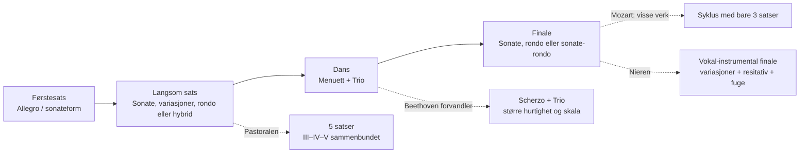
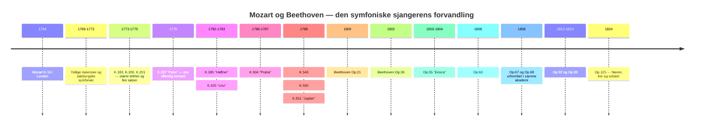
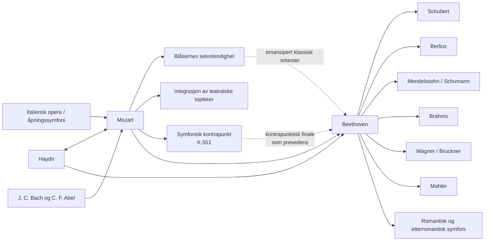

<!-- Translation of: research/sources/author-supplied/beethoven-mozart-symphonic-form.md; source commit: 304d75ed6ff646d311fd9df8b4e2db0d4dee277a -->
# Beethoven og Mozart: katalog, form, historie, resepsjon og arv etter symfoniene

## Sammendrag

De symfoniske banene til **Wolfgang Amadeus Mozart** og **Ludwig van Beethoven** tilhører samme historiske bue, men representerer ulike øyeblikk i symfoniens konsolidering. Mozart fulgte praktisk talt hele sjangerens forvandling, fra den korte italienske symfonien i tre satser og operaouverturen på 1760-tallet til den store wienske konsertsymfonien på 1780-tallet. Beethoven overtok fra Haydn og Mozart en allerede høyt sofistikert sjanger og bygde den opp på nytt rundt monumental skala, dramatisk kontinuitet, intensiv motivisk bearbeiding, ekspansive kodaer, langsiktige tonale konflikter og til slutt innføringen av den menneskelige stemmen i Nieren. Selve Mozarteumstiftelsen beskriver Mozarts utvikling fra et opprinnelig standardisert orkester — to oboer, to horn og strykere, med trompeter/pauker ved festlige anledninger — til en bredere wiensk sats, med fløyte, klarinetter og fagotter stadig mer selvstendige. citeturn20view2turn25search0

Det finnes en grunnleggende asymmetri mellom katalogene. **Beethoven skrev ni nummererte og autentiske symfonier**, tilsvarende Opp. 21, 36, 55, 60, 67, 68, 92, 93 og 125. citeturn22search1 For Mozart er «41 symfonier» en historisk konvensjon, ikke ekvivalenten til en moderne kritisk katalog. De gamle nr. 2 og 3 er ikke av Mozart; nr. 37 er i alt vesentlig Michael Haydns symfoni MH 334, som Mozart føyde til innledende materiale til; dessuten finnes autentiske symfonier uten tradisjonelt nummer, symfoniske versjoner av overtyrer og serenader, verk av tvilsom autentisitet og tapte symfonier. Den nye **Köchel-Verzeichnis**, utgitt i 2024 — den første fullstendige nyutgaven siden 1964 — oppdaterte dateringer, kilder og attribueringer i lys av nyere forskning. citeturn6search0turn7view0turn13search0turn25search2

Formanalysen viser en forskjell i betoning, ikke en enkel motsetning mellom «melodisk Mozart» og «motivisk Beethoven». Mozart kan arbeide med ekstraordinær motivisk økonomi — framfor alt i symfoniene nr. 40 og 41 — men tenderer mot å bygge store former gjennom **pluralitet av topikker, karakterkontraster, dialog mellom instrumentfamilier, kontrapunkt og omtolkning av operagester**. Beethoven driver en minimal celles evne til å generere struktur lenger: det paradigmatiske eksemplet er Femmeren, der en rytmisk figur på fire toner gjennomsyrer ulike tematiske funksjoner og innføyer seg i en global bane fra c-moll til C-dur. *Eroicaen*, Femmeren, Pastoralen og Nieren utvider selve definisjonen av den symfoniske syklusen. Nyere studier insisterer imidlertid på at den beethovenske revolusjonen må forstås som en forvandling av paradigmer som allerede fantes hos Haydn og Mozart, ikke som skapelse ex nihilo. citeturn17search6turn17search10

Hos Mozart er tre store vendepunkter særlig tydelige: **symfoni nr. 25 i g-moll, K. 183**, med kontrapunktisk intensitet og eksepsjonelt mørk orkestrering; **«Paris», K. 297**, tenkt for en stor offentlig konsert og et orkester som omfattet klarinetter; og sekvensen **«Haffner»–«Linz»–«Praha»–nr. 39–40–«Jupiter»**, der skala, blåsereselvstendighet, kromatikk og kontrapunktisk integrasjon når et nytt nivå. Mozarts brev av 9. juli 1778 bekrefter både den enorme publikumssuksessen for «Paris» og kontroversen om dens Andante, som av direktør Joseph Legros ble ansett som overdrevent modulatorisk; Mozart skrev en annen versjon av satsen. citeturn30view0turn31view0

Hos Beethoven danner de ni verkene en særlig avslørende sekvens: Føreren leker ennå bevisst med haydnske-mozartske forventninger; Toeren utvider skala og retorikk; Treeren forandrer radikalt proporsjoner og kodaens funksjon; Fireren forfiner ambiguitet og humor; Femmeren skaper en tidligere uten sidestykke syklisk kontinuitet; Sekseren omvandler syklusen til fem programmatiske «scener»; Sjuéren gjør rytmen til strukturerende prinsipp; Åtteren gjenbesøker ironisk 1700-tallsmodeller; og Nieren forvandler symfonien til en instrumental-vokal syntese. Beethoven-Haus' historiske sider dokumenterer disse genesene, urfremføringene og revisjonene ut fra autografer, skisser, førstutgaver og samtidige kilder. citeturn4search0turn3search0turn4search1turn4search3turn3search2turn3search3turn5search0

For kritiske studier er de sikreste editoriske referansene **Neue Mozart-Ausgabe (NMA), serie IV, gruppe 11**, med dens ti symfonibind og kritiske rapporter, og for Beethoven både de av **Neue Beethoven-Gesamtausgabe** avledede, av Henle utgitte partiturene og den kritiske urtekstutgaven av **Jonathan Del Mar** for Bärenreiter. citeturn10search3turn22search0turn22search1 I innspillinger vinner en sammenlignende studie på å stille historisk informerte fremføringer ved siden av den store moderne symfoniske tradisjonen: for Mozart er Trevor Pinnock/The English Concert en fullstendig HIP-referanse; for Beethoven tilbyr John Eliot Gardiner/Orchestre Révolutionnaire et Romantique og Nikolaus Harnoncourt/Chamber Orchestra of Europe to ulike måter å nytenke artikulasjon, størrelse, balanse og retorikk på i lys av historisk forskning. citeturn23search1turn23search6turn23search2turn23search23

## Omfang, kilder, terminologi og attribueringsproblemer

**Katalogkriterium.** For Beethoven er «fullstendig symfonikatalog» entydig: ni fullførte og nummererte symfonier. For Mozart skiller denne rapporten fire sjikt: de 41 verkene i den tradisjonelle nummereringen; ytterligere verk som inngår i NMAs symfoniske serie; symfoniske versjoner avledet av operaer eller serenader; samt uekte, tvilsomme, fragmentariske eller tapte verk. NMA fordeler Mozarts symfonier på ti bind i serie IV/11, utgitt blant andre av Gerhard Allroggen, Wilhelm Fischer, Hermann Beck, Christoph-Hellmut Mahling, Friedrich Schnapp, Günter Haußwald, László Somfai og H. C. Robbins Landon. citeturn10search3turn10search0turn10search1turn10search2turn11search0turn11search1turn11search2turn12search0turn12search1

**Köchel mot opus.** Nummeret **K. eller KV** (*Köchel-Verzeichnis*) er den normale musikkvitenskapelige identifikatoren for Mozarts verk. Uttrykket «opus» utgjør ingen systematisk Mozartkatalog: visse historiske utgaver tildelte utgitte samlinger editoriske opustall, men de har ikke den funksjonen som opustall har hos Beethoven. Derfor angis «Op.» i Mozarttabellen som **ikke anvendelig**. Den nett-Köchelen som Mozarteumstiftelsen for tiden gjengir, stammer fra den nye utgaven av 2024 og kan gi videre eller andre dateringer enn dem sjette opplag befestet; K. 183 er for eksempel i dag offisielt datert innen et spenn fra mars 1773 til mai 1775, selv om eldre litteratur vanligvis plasserer den spesifikt høsten 1773. citeturn7view0turn25search3

**Autentisitetsstatus.** Den gamle symfoni nr. 3, historisk K. 18, er nå katalogisert som **KV Anh. A 51**, et bekreftet verk av **Carl Friedrich Abel**, ikke av Mozart. citeturn13search0 Nr. 2, K. 17/Anh. C 11.02, tilhører heller ikke Mozarts autentiske korpus og attribueres i moderne bibliografi til Leopold Mozart. Den gamle nr. 37, K. 444/425a, er for tiden katalogisert som **KV Anh. A 53 / MH 334**, en symfoni av Michael Haydn med Mozarts medvirkning. citeturn16search0turn25search2 K. 84 er et eksempel på et tilfelle som av den nye Köchelen ennå uttrykkelig klassifiseres som av **«tvilsom autentisitet»**; gamle kilder attribuerer det vekselvis til Wolfgang, Leopold Mozart og Dittersdorf. citeturn25search1

**Form.** Termer som «sonateform» brukes her analytisk. I 1760-tallets symfonier kan «sonateform» være anakronistisk dersom det dermed forstås 1800-tallets skolemodell. I mange førstesatser er det mer presist å tale om **binær sonateform eller tidlig sonate**, der eksposisjon, rekapitulasjon og gjennomføring ennå ikke eier de proporsjonene og funksjonene som vi finner på 1780-tallet. Symfoniens egen historie viser en overgang fra italienske overtyremodeller og binære strukturer til en stadig mer differensiert organisasjon av de fire satsene. Den moderne litteraturen om den klassiske symfonien betoner nettopp denne historiske pluraliteten. citeturn17search4turn17search8

**Orkestrering.** I Mozarts tidlige symfonier er den typiske kjernen strykere, to oboer og to horn; trompeter og pauker forekommer framfor alt i festlige verk. Ved hoffet i Salzburg kunne fløytister og oboister være samme musikere, en faktor som bidrar til å forklare hvorfor fløyter og oboer ikke alltid forekommer samtidig. I Wienperioden blir klarinetter og fagotter selvstendige stemmer i langt høyere grad. citeturn25search0turn20view2 Beethoven begynner innen denne klassiske verdenen, men omvandler suksessivt horn, trompeter, pauker og treblås til formale aktører, kulminerende i Femmerens, Sekserens og Nierens klanglige utvidelser.

Flytskjemaet nedenfor sammenfatter **en arketyp**, ikke en stiv regel:

Denne formale genealogien motsvarer det historiske bildet som NMA dokumenterer for Mozart og de kritiske kildene til Beethovens ni symfonier. citeturn10search0turn10search1turn12search1turn4search3turn5search0

## Katalog, kronologi, urfremføringer og dokumentariske kilder

**Katalogtabell — Beethoven.**

| Symfoni | Toneart | Komposisjon | Katalog | Urfremføring / første kjente fremføring | Medvirkende og noter |
|---|---|---:|---|---|---|
| Nr. 1 | C-dur | 1799–1800 | **Op. 21** | 2. apr. 1800, Hofburgtheater/Burgtheater, Wien | Akademi arrangert av Beethoven; programmet omfattet Mozart, Haydn, en pianokonsert og Beethovens septett. citeturn4search0 |
| Nr. 2 | D-dur | 1800–1802 | **Op. 36** | 5. apr. 1803, Theater an der Wien | Første sikkert dokumenterte offentlige fremføring, i et beethovensk akademi; mulig tidligere privat fremføring. citeturn3search0 |
| Nr. 3 «Eroica» | Ess-dur | 1803–1804 | **Op. 55** | privat for Lobkowitz, 1804; offentlig 7. apr. 1805, Theater an der Wien | Lobkowitz' orkester ved de første fremføringene; definitiv dedikasjon til fyrst Lobkowitz. citeturn4search1turn2search5turn2search17 |
| Nr. 4 | B-dur | 1806 | **Op. 60** | sannsynligvis mars 1807, palasset Lobkowitz, Wien | Privat fremføring knyttet til huset Lobkowitz; dedisert til grev Franz von Oppersdorff. citeturn3search1 |
| Nr. 5 | c-moll | 1804–1808 | **Op. 67** | 22. des. 1808, Theater an der Wien | Beethoven dirigerte det berømte, cirka fire timer lange akademiet; improvisert orkester og vanskelige forhold. citeturn2search0turn4search2 |
| Nr. 6 «Pastoral» | F-dur | 1807–1808 | **Op. 68** | 22. des. 1808, Theater an der Wien | Samme akademi som Femmeren; i programmet ble Pastoralen presentert før symfonien i c-moll. citeturn4search3turn2search0 |
| Nr. 7 | A-dur | 1811–1812 | **Op. 92** | 8. des. 1813, Universitetet i Wien | Veldedighetskonsert dirigert av Beethoven, sammen med *Wellingtons seier*; stor suksess. citeturn3search2 |
| Nr. 8 | F-dur | 1812 | **Op. 93** | 27. feb. 1814, Redoutensaal, Wien | Beethoven dirigerte; programmet omfattet også Sjuéren og *Wellingtons seier*. citeturn3search3 |
| Nr. 9 | d-moll | 1822–1824; skisser siden 1815 | **Op. 125** | 7. mai 1824, Kärntnertortheater, Wien | Michael Umlauf utøvde den effektive ledelsen mens Beethoven ble værende på scenen; Henriette Sontag, Caroline Unger, Anton Haizinger og Joseph Seipelt dannet solokvartetten. citeturn5search0turn2search19 |

Dateringen av Toeren fortjener en korrigering av en meget utbredt biografisk fortelling: Beethoven-Haus betoner at en vesentlig del av verket allerede var tenkt før det berømte Heiligenstadttestamentet, noe som gjør det forenklet å tolke dets overstrømmende livsglede som et direkte «svar» på krisen i 1802. citeturn3search0 Sjuéren er på sin side dokumentert gjennom autografen med «1812 Aug. 13» og ble urfremført i Napoleonskrigenes kontekst, ved et veldedighetsarrangement. citeturn3search2

**Katalogtabell — Mozart, historisk nummerering 1 til 41.** «—» ved urfremføring betyr at en spesifikk førstefremføring ikke lar seg gjenvinne dokumentarisk med sikkerhet; dette er særlig vanlig for Salzburgverkene, hvorav mange ble skrevet for hoffbruk uten individuell urfremføringsdokumentasjon. citeturn25search0

| Historisk nr. | Toneart | Omtrentlig / aktuell dato | Köchel | Op. | Urfremføring eller identifiserbar førstefremføring | Status |
|---|---|---|---|---|---|---|
| 1 | Ess | 1764 | **K. 16** | — | London, 21. feb. 1765 | autentisk. citeturn10search0turn21search16 |
| 2 | B | ca. 1765 | **K. 17 / Anh. C 11.02** | — | — | **uekte; attribuert til Leopold Mozart**. citeturn16search0turn16search4 |
| 3 | Ess | 1764 | **K. 18; nå Anh. A 51** | — | verk av Abel | **Carl Friedrich Abel**, ikke Mozart. citeturn13search0 |
| 4 | D | 1765 | **K. 19** | — | — | autentisk. citeturn10search0 |
| 5 | B | 1765 | **K. 22** | — | trolig Haagperioden; eksakt urfremføring usikker | autentisk. citeturn10search0 |
| 6 | F | 1767 | **K. 43** | — | — | autentisk. citeturn10search0 |
| 7 | D | 1768 | **K. 45** | — | — | autentisk. citeturn10search0 |
| 8 | D | 1768 | **K. 48** | — | — | autentisk. citeturn10search0 |
| 9 | C | ca. 1769–72 | **K. 73 / 75a** | — | — | autentisk; historisk kronologi revidert. citeturn10search0 |
| 10 | G | 1770 | **K. 74** | — | — | autentisk. citeturn10search1 |
| 11 | D | 1770 | **K. 84 / 73q** | — | — | **tvilsom autentisitet**. citeturn25search1 |
| 12 | G | 1771 | **K. 110 / 75b** | — | — | autentisk. citeturn10search1 |
| 13 | F | 1771 | **K. 112** | — | — | autentisk. citeturn10search1 |
| 14 | A | 30. des. 1771 | **K. 114** | — | — | autentisk; offisiell autografdato. citeturn25search0 |
| 15 | G | 1772 | **K. 124** | — | — | autentisk. citeturn10search1 |
| 16 | C | 1772 | **K. 128** | — | — | autentisk. citeturn10search2 |
| 17 | G | 1772 | **K. 129** | — | — | autentisk. citeturn10search2 |
| 18 | F | 1772 | **K. 130** | — | — | autentisk. citeturn10search2 |
| 19 | Ess | 1772 | **K. 132** | — | — | autentisk; alternativer til den langsomme satsen bevart. citeturn10search2 |
| 20 | D | 1772 | **K. 133** | — | — | autentisk. citeturn10search2 |
| 21 | A | 1772 | **K. 134** | — | — | autentisk. citeturn10search2 |
| 22 | C | 1773 | **K. 162** | — | — | autentisk. citeturn11search0 |
| 23 | D | tradisjonelt 1773; aktuell katalog tillater videre spenn | **K. 181** | — | — | autentisk. citeturn14search3 |
| 24 | B | 1773 | **K. 182** | — | — | autentisk. citeturn11search0 |
| 25 | g-moll | tradisjonelt 1773; nå: mars 1773–mai 1775 | **K. 183 / 173dB** | — | — | autentisk; 4 horn. citeturn25search3 |
| 26 | Ess | 1773 | **K. 184 / 161a** | — | — | autentisk. citeturn11search0 |
| 27 | G | ca. 1773 | **K. 199 / 161b** | — | — | autentisk. citeturn11search0 |
| 28 | C | ca. 1773–75 | **K. 200 / 189k** | — | — | autentisk; gammel dato på autografen problematisk. citeturn25search4 |
| 29 | A | 1774 | **K. 201 / 186a** | — | — | autentisk. citeturn11search1 |
| 30 | D | 1774 | **K. 202 / 186b** | — | — | autentisk. citeturn11search1 |
| 31 «Paris» | D | juni 1778 | **K. 297 / 300a** | — | **18. juni 1778, Concert Spirituel, Tuileriene, Paris** | autentisk; Concert Spirituels orkester; Joseph Legros ledet institusjonen. citeturn21search13turn30view0 |
| 32 | G | 26. apr. 1779 | **K. 318** | — | — | autentisk; kontinuerlig struktur i tre avsnitt. citeturn11search2turn17search20 |
| 33 | B | 1779; senere revisjoner | **K. 319** | — | — | autentisk. citeturn11search2 |
| 34 | C | 1780 | **K. 338** | — | — | autentisk; tre satser. citeturn11search2 |
| 35 «Haffner» | D | 1782; revidert 1783 | **K. 385** | — | **23. mars 1783, Burgtheater, Wien** | Mozart dirigerte sitt akademi; opphav i festmusikk for familien Haffner. citeturn27search21turn27search17turn27search32 |
| 36 «Linz» | C | 30. okt.–begynnelsen av nov. 1783 | **K. 425** | — | **4. nov. 1783, Linz teater** | hastig skrevet for en av grev Thun annonsert konsert. citeturn31view1turn27search8 |
| 37 | G | ca. 1783–84 | gamle **K. 444/425a; nå Anh. A 53 / MH 334** | — | versjon i forbindelse med Linzoppholdet | **Michael Haydn; Mozarts bidrag i innledningen**. citeturn25search2turn27search8 |
| 38 «Praha» | D | 6. des. 1786 | **K. 504** | — | **19. jan. 1787, Praha, teater den gang forbundet med Nasjonal-/Stenderteateret** | Mozart ledet konserten. citeturn27search6turn27search10 |
| 39 | Ess | **26. juni 1788** | **K. 543** | — | spesifikk urfremføring **ikke sikkert identifisert** | autentisk. citeturn14search2turn28search9 |
| 40 | g-moll | **25. juli 1788**; senere versjon med klarinetter | **K. 550** | — | usikker privat urfremføring; dokumenterbare/sannsynlige fremføringer 1791 | autentisk, to versjoner. citeturn14search0turn28search16 |
| 41 «Jupiter» | C | **10. aug. 1788** | **K. 551** | — | spesifikk urfremføring ikke bevart | autentisk; Mozarts siste symfoni. citeturn20view2turn28search9 |

«Paris» utgjør det best dokumenterte tilfellet av umiddelbar resepsjon blant Mozarts førwienske symfonier. Familiekorrespondansen noterer suksessen ved Concert Spirituel; Leopold gratulerte uttrykkelig sin sønn, og Mozart skrev at verket var blitt mottatt «usammenlignbart godt». Samme brev viser at Mozart tenkte strategisk om offentlige effekter, det parisiske publikums forventninger og til og med erstatningen av den langsomme satsen. citeturn31view2turn31view0

Genesen til «Linz» er likeledes eksepsjonelt veldokumentert. 31. oktober 1783 skrev Mozart til Leopold at grev Thun hadde annonsert en konsert til 4. november og at han, siden han ikke hadde tatt med seg noen symfoni, arbeidet «med full fart» på en ny. Brevet er primærevidens for komposisjonens ekstraordinært komprimerte omstendigheter. citeturn30view1turn31view1

**Relevante ytterligere symfonier og versjoner utenfor serien 1–41.**

| Verk | Toneart | Omtrentlig dato | Kritisk situasjon |
|---|---|---:|---|
| K. Anh. 223 / 19a | F | ca. 1765 | inngår i NMA blant de tidlige symfoniene. citeturn10search0 |
| K. Anh. 221 / 45a, «Gamle Lambach» | G | ca. 1766 | tradert i NMA; historisk gjenstand for attribueringsdebatt. citeturn10search0 |
| K. Anh. 214 / 45b | B | ca. 1768 | problematisk attribuering; kritisk opptatt i NMA. citeturn10search0 |
| K. 75 | F | ca. 1771 | tradisjonell nr. 42; autentisitet omstridt. citeturn10search1turn16search4 |
| K. 76 / 42a | F | 1760-årene | tradisjonell nr. 43; attribuering omstridt. citeturn10search0turn16search4 |
| K. 81 / 73l | D | 1770 | tradisjonell nr. 44; attribuering omstridt. citeturn10search1 |
| K. 95 / 73n | D | ca. 1770 | tradisjonell nr. 45; attribuering omstridt. citeturn10search1 |
| K. 96 / 111b | C | ca. 1771 | tradisjonell nr. 46; attribuering omstridt. citeturn10search1 |
| K. 97 / 73m | D | ca. 1770 | tradisjonell nr. 47; attribuering omstridt. citeturn10search1 |
| K. 111 + K. 120 / 111a | D | 1771 | symfonisk versjon knyttet til overtyren til *Ascanio in Alba*; tradisjonell nr. 48. citeturn10search1 |
| Overtyre K. 126 + K. 161/163 | D | 1772 | symfonisk versjon knyttet til *Il sogno di Scipione*; kjent som nr. 50. citeturn10search2 |
| Overtyre K. 196 + K. 121 / 207a | D | 1774–75 | symfonisk versjon dannet av overtyre + finale. citeturn11search1 |
| Overtyre K. 208 + K. 102 / 213c | C | 1775 | **ufullstendig** symfonisk versjon knyttet til *Il re pastore*. citeturn11search1 |
| Symfonisk versjon av K. 204 / 213a | D | 1775 | serenadereduksjon. citeturn9view1 |
| Symfonisk versjon av K. 250 / 248b, «Haffnerserenade» | D | 1776 | serenadereduksjon; det opprinnelige festverket ble spilt for familien Haffner 21. juli 1776. citeturn14search4turn9view1 |
| Symfonisk versjon av K. 320, «Posthorn» | D | 1779 | serenadereduksjon. citeturn9view1 |
| K. 409 | C | tidlig 1780-tall | isolert symfonisk menuett, **ingen fullstendig symfoni**. citeturn12search2 |
| K. Anh. 220 / 16a, «Odense» | a-moll | historisk attribuert til den unge Mozart | sterkt problematisk autentisitet; må forbli utenfor den sikre kjernen. citeturn16search4 |
| K. Anh. 216 / 74g | B | usikker | tradisjonell nr. 54; tvilsom. citeturn16search4 |
| K. Anh. 214 / 45b | B | usikker | tradisjonell nr. 55; tvilsom. citeturn16search4 |
| K. 98 / Anh. C 11.04 | F | usikker | tradisjonell nr. 56; tvilsom/uekte attribuering. citeturn16search4 |

Det finnes også henvisninger til **tapte symfonier** — deriblant K. 19b og diverse gamle poster i Köchels appendikser — som det ikke finnes tilstrekkelig materiale til for en fullstendig formanalyse. Selve den offisielle katalogen noterer at Mozart skulle ha skrevet omkring femten symfonier under den store Europareisen 1763–66 og at flere gikk tapt. citeturn20view2turn16search0

**Syntetisk tidslinje:**

Kronologien viser at den «klassiske symfonien» ikke er en frossen modell: mellom K. 16 og K. 551 gjennomløper Mozart mer enn to tiår med institusjonelle og stilistiske forandringer, mens Beethoven på bare omkring tjuefire år omvandler denne arven til en sjanger med stadig større estetisk ambisjon. citeturn20view2turn4search0turn5search0

## Formal anatomi og sats-for-sats-analyse

I dette avsnittet betyr «SF» **sonateform**; «bin./son.» betegner en binærform hvis logikk allerede foregriper sonateprosedyrer; «T–D» betyr bevegelse fra tonika til dominant og «T–rel.» den typiske gangen til parallelldur i mollverk. Identifiseringene er analytiske lesninger av de kritiske partiturene; klassiske satser tillater ofte mer enn én forsvarbar formtolkning. NMA leverer den kritiske grunnteksten for Mozart og Henle/Bärenreiter-utgavene den moderne ekvivalenten for Beethoven. citeturn10search3turn22search0turn22search1

**Beethoven, symfoni nr. 1 i C-dur, Op. 21.** Førstesatsen begynner med et bevisst desorienterende *Adagio molto*: i stedet for straks å bekrefte C-dur projiserer Beethoven harmonier som lyder som dominanter til naboregioner, framfor alt en dominant til F, og forlenger dermed nektelsen av tonikaen. *Allegro con brio* etablerer til slutt C-dur og bruker en sonateform av haydnsk profil, men med større dynamisk aggressivitet, skalaer og blåseraksentuering. Gjennomføringen fragmenterer cellene og utforsker modulerende sekvenser før gjenvinningen av tonikaen. **II, Andante cantabile con moto**, i F-dur, er en lyrisk sonate der imitasjon og lett kontrapunkt sameksisterer med diskret integrerte trompeter og pauker — uvanlig besetning for det konvensjonelle bildet av en «delikat langsom sats». **III, Menuetto: Allegro molto e vivace**, nominelt en menuett, er funksjonelt et scherzo: for rask, synkopert og energetisk for ustabil for den tradisjonelle aristokratiske dansen. **IV** begynner med en langsom innledningsspøk der C-skalaen avsløres tone for tone; *Allegro molto e vivace* omvandler gesten til en sonatefinale av haydnsk hurtighet og humor. Verket forlater altså ikke Haydn og Mozart: det gjør kunnskapen om dette vokabularet til betingelsen for å forstyrre lytterens forventninger. citeturn4search0turn22search9

**Symfoni nr. 2 i D-dur, Op. 36.** **I, Adagio molto – Allegro con brio**, utvider betraktelig den langsomme innledningen, med utflykter til mollvarianten, kromatikk og akkorder av ambig funksjon før den overstrømmende SF-en i D. Gjennomføring og koda overskrider allerede Førerens gjengse proporsjoner; kodaen opphører å være blot bekreftelse og begynner å delta i bearbeidingen. **II, Larghetto, A-dur**, er en utstrakt lyrisk sonateform: lange utsmykkede fraser sameksisterer med imitasjon og en høyst differensiert treblåspalett. **III heter uttrykkelig Scherzo**, noe som konsoliderer erstatningen av menuetten i den beethovenske symfonisyklusen; plutselige kontraster i dynamikk og register er konstitutive for formen. **IV, Allegro molto**, fødes av et abrupt, nesten grotesk motiv som fungerer som tilbakevendende signal; formen blander sonate- og rondoegenskaper og kulminerer i en ekstraordinært lang koda, som foregriper den strukturelle betydningen kodaen vil få i *Eroicaen*. citeturn3search0turn22search5

**Symfoni nr. 3 i Ess-dur, Op. 55, «Eroica».** **I, Allegro con brio**, eliminerer den langsomme innledningen: to fortissimo Ess-akkorder starter umiddelbart et tema bygd på tonikaens arpeggio. Nesten med det samme destabiliserer imidlertid en toneartsfremmed ciss det harmoniske feltet. Eksposisjonen inneholder ikke bare «tema 1/tema 2», men et nett av tematiske grupper, synkoperte rytmer og metriske konflikter. Gjennomføringen er kolossal: den fragmenterer celler, skaper dissonansskjeder og presenterer berømt nytt materiale i e-moll. Den berømte tilsynelatende «for tidlige» horninnsatsen nær rekapitulasjonen intensiverer den temporale ambiguiteten. Kodaen fungerer som en **annen gjennomføring** og bygger opp materialet på nytt i stedet for blot å slutte. **II, Marcia funebre: Adagio assai**, i c-moll, forener marsj-, rondo- og ternær/variasjonell arkitektur; episoder i C-dur og fugerte avsnitt omvandler marsjen til en kollektiv prosess av klage og gjenoppbygging. **III, Scherzo**, erstatter definitivt menuettens selskapelighet med hurtighet, overraskelse og spenning; Trioen gir **tre horn** spektakulær prominens, en signifikant utvidelse av seksjonen. **IV** er en syntese av variasjon, fuge og finallogikk over materiale som Beethoven allerede hadde brukt i *Prometevs skapninger* og andre stykker: den begynner fra temaets bass før den presenterer dets melodiske overflate og underkaster det kontrapunktiske og lyriske forvandlinger. Den avgjørende innovasjonen er ikke bare «varighet»: det er omvandringen av hele syklusen til et stort dimensjonert dramatisk argument. citeturn4search1turn17search6turn22search11

**Symfoni nr. 4 i B-dur, Op. 60.** **I** begynner med et *Adagio* hvis fortynnede tekstur og opprinnelig dystre forløp får B-durstonikaen til å fremstå som fjern; eksplosjonen av *Allegro vivace* oppløser denne suspensjonen og innleder en ekstraordinært bevegelig SF bygd på skalaer, arpeggioer og rytmiske forskyvninger. **II, Adagio i Ess**, er strukturert av en punktert akkompagnementsrytme som blir like viktig som melodiene; klarinett og andre treblåsere vinner sterk tematisk personlighet. **III, Allegro vivace**, er et utvidet femdelt scherzo — scherzo–trio–scherzo–trio–scherzo — en prosedyre som Beethoven vil gjenbruke i Sjuéren. **IV, Allegro ma non troppo**, er et sekstendels-*perpetuum mobile*: strykernes virtuositet punkteres av komiske blåserinnkast, deriblant det berømte fagottøyeblikket. Fireren demonstrerer at beethovensk innovasjon ikke er ensbetydende med gigantisme: her ligger den i ambiguitet, rytme, hurtighet og ironi. citeturn3search1

**Symfoni nr. 5 i c-moll, Op. 67.** I **I, Allegro con brio**, må kort-kort-kort-lang-cellen ikke forstås bare som et «tema»: den er en **rytmisk generator** som gjennomløper overledninger, akkompagnement, tutti og koda. Eksposisjonen utgår fra c-moll og styrer mot Ess-dur; gjennomføringen reduserer teksturen til stadig mindre fragmenter. I rekapitulasjonen suspenderer en uventet, nesten kadensartet obosolo midlertidig drivet. Kodaen overtar igjen gjennomføringsfunksjon. **II, Andante con moto, Ass-dur**, alternerer to tematiske komplekser i en prosess av **dobbeltvariasjoner**; fanfareepisoder i C-dur begynner å foregripe finalens triumftoneart. **III, Allegro, c-moll**, forvandler rytmisk førstesatsens celle i hornene; trioen er fugert og energisk. Ved tilbakekomsten reduseres scherzoen til et gjenferd i *pianissimo*, og en lang dominant leder **uten avbrudd** til finalen. **IV, Allegro, C-dur**, legger piccolo, kontrafagott og tromboner til orkestermassen; forvandlingen fra c-moll til C-dur blir samtidig en formal og klanglig begivenhet. Et minne om scherzoen før rekapitulasjonen etablerer sann syklisk erindring. Femmeren er derfor mindre en bokstavelig fortelling om «skjebnen» enn en ekstraordinær studie i motivisk integrasjon, kontinuitet mellom satsene og globalt dimensjonert tonalitet. citeturn4search2turn17search3

**Symfoni nr. 6 i F-dur, Op. 68, «Pastoral».** Beethoven forsyner de fem satsene med titler og betoner at det snarere handler om følelsesuttrykk enn bokstavelig maling. **I, «Oppvåkning av glade følelser ved ankomsten til landet»**, er en SF i F-dur hvis nyhet ligger i ekstensive gjentakelser av små moduler, lange stabile harmoniske felter og subdominantisk/plagal betoning; målet er mindre teleologisk konflikt enn en følelse av varighet. **II, «Scene ved bekken», B-dur**, holder en bølgeformig figur i sammensatt meter under treblåsmelodier; til slutt identifiserer Beethoven uttrykkelig nattergal, vaktel og gjøk i fløyte, obo og klarinett. **III, «Lystig lag av landsfolk»**, er et scherzo der aksentdeformasjoner og en karikatur av et bygdekorps erstatter menuettens eleganse. Uten konvensjonell kadens avbrytes festen av **IV, «Tordenvær», f-moll**, en nesten helt prosessuell sats: tremoloer, kromatikk, forminskede septakkorder, pauker, piccolo og tromboner skaper kontinuerlig intensivering. Tordenværet oppløses direkte i **V, «Hyrdenes sang; glade og takknemlige følelser etter stormen»**, i F-dur, en hybrid av rondo, sonate og pastoralhymne, dominert av plagale kadenser og et koralartet tema. De tre siste satsene danner en uavbrutt følge, et viktig presedens for romantiske programmatiske sykler. citeturn4search3turn17search3

**Symfoni nr. 7 i A-dur, Op. 92.** **I, Poco sostenuto – Vivace**, eier en av Beethovens største langsomme innledninger: oppstigende skalaer og holdte akkorder leder gjennom regioner som C og F før en repetert tone blir pulsen i *Vivace* i 6/8. Den følgende SF-en styres av en obsessiv punktert figur. **II, Allegretto, a-moll**, begynner med en akkord og et rytmisk ostinat hvis tilbakekomst bærer variasjoner, kontrapunktisk overlagring og en episode i A-dur; stemmenes progresjon skaper en nesten arkitektonisk akkumulasjonsprosess. **III, Presto**, stiller scherzoen i F-dur, en i forhold til A uventet toneart; trioen i D-dur høres to ganger og skaper igjen en femdelt form. **IV, Allegro con brio**, i A-dur, driver rytmisk gjentakelse, synkoper og ostinater til en nesten fysisk grad; dens lange koda intensiverer dominant og repetert bass før oppløsningen. Adornos senere bemerkning om at Sjuéren skulle være «symfonien par excellence» siteres av Beethoven-Haus som en indeks over dens kritiske fortuna. citeturn3search2turn17search7

**Symfoni nr. 8 i F-dur, Op. 93.** **I, Allegro vivace e con brio**, trer direkte inn i F-dur, men dens tilsynelatende «klassiske normalitet» undergraves av forskjøvne aksenter, falske metriske hierarkier og en uproporsjonalt kraftfull koda. **II, Allegretto scherzando, B-dur**, erstatter den langsomme satsen med en rytmisk miniatyr bygd på blåserpulser; tradisjonen som direkte knytter den til Mälzels metronom må behandles med forsiktighet, da anekdoten er senere og problematisk. **III, Tempo di Menuetto**, er en bevisst arkaiserende menuett, langsom og tung sammenlignet med beethovenske scherzoer. **IV, Allegro vivace**, danner den strukturelle humorens høydepunkt: en mot F-dur voldsomt fremmed ciss vender tilbake som harmonisk problem; i den immense kodaen utforsker Beethoven dens omtolkning og fjerne utflykter før den finale bekreftelsen av tonikaen. Åtteren er bare overfladisk «bakstreversk»: den er en metakritikk av klassiske prosedyrer. citeturn3search3

**Symfoni nr. 9 i d-moll, Op. 125.** **I, Allegro ma non troppo, un poco maestoso**, begynner ikke med en ferdig melodi, men med åpne kvinter og fragmenter som synes å stige opp av det ubestemte til de krystalliserer d-moll; sonateformen omvandler denne «fødselen» til et rekurrent prinsipp, og gjennomføring/koda ekspanderer materialet voldsomt. **II, Molto vivace**, stiller scherzoen før den langsomme satsen; det fugerte temaet i d-moll og paukeeksplosjonene balanseres av en trio i D-dur, raskere og pastoral. **III, Adagio molto e cantabile, B-dur**, bearbeider to hovedområder/ideer gjennom ornamental variasjon og ekspansjon, inklusive kontraster i D-dur og fanfareepisoder. **IV** begynner med en eksplosiv dissonans og instrumentale resitativer av celli og kontrabasser som «tilbakeviser» reminisenser av de tre foregående satsene. Først da trer, i D-dur, den enkle melodien til «Ode til gleden» fram, først i strykerbassene; derpå følger instrumentale variasjoner, barytonens inntreden, kor, «tyrkisk» marsj med slagverk, fuge, høytidelig episode over «Seid umschlungen, Millionen», kontrapunktisk kombinasjon av ideene og en enorm koda. Innovasjonen er ikke bare «å bruke kor»: den består i at selve finalen får dramatisere den rent instrumentale symfoniens utilstrekkelighet og bygge en ny form av resitativ, variasjon, marsj, fuge, hymne og symfonisk klanglighet. citeturn5search0turn22search7

**Mozart — kompakt analyse av det nummererte korpuset.** Toneartsfølgene nedenfor fortetter forløpet sats for sats; i flere tidlige verk er «tidlig sonate» bevisst å foretrekke framfor en stiv skolemessig lesning. Titler og satsorganisasjon er dokumentert gjennom NMAs symfoniske bind. citeturn10search0turn10search1turn10search2turn11search0turn11search1turn11search2turn12search0turn12search1

| Symfoni | Sats for sats og formal lesning | Orkestrering, motiver og innovasjon |
|---|---|---|
| **Nr. 1, K.16** | I Ess, *Molto allegro*, bin./son.; II c-moll, *Andante*, binær; III Ess, *Presto*, rask binærform/tidlig sonate. | Strykere + oboer/horn. Den langsomme satsens gang til parallellmoll fører uventet tyngde inn i et barnslig Londonverk; sterk innflytelse fra J. C. Bach/Abel-miljøet. citeturn10search0 |
| **Nr. 2, K.17** | Tradisjonell struktur i B, men **må ikke analyseres som Mozart**. | Attribueringen til Mozart er tilbakevist; den består bare av historiografiske grunner. citeturn16search0 |
| **Nr. 3, gamle K.18** | Rask–langsom–rask-syklus i Ess; galant idiom og tematisk transparens. | Det er en symfoni av **C. F. Abel**, kopiert av den unge Mozart. Dens interesse ligger nettopp i å vise en av modellene gutten studerte. citeturn13search0 |
| **Nr. 4, K.19** | I D, Allegro, bin./son.; II G, Andante; III D, Presto. | Tre satser og enkle harmoniske trajektorier T–D/T–SD, typiske for den første Londonperioden. citeturn10search0 |
| **Nr. 5, K.22** | I B; II Ess; III B. Rask–langsom–rask-format. | Sterkere periodiserte fraser og orkestrale svar; assimilering av Europareisens internasjonale stil. citeturn10search0 |
| **Nr. 6, K.43** | I F, tidlig SF; II C, Andante; III F, Menuett/Trio; IV F, Allegro. | Antagelsen av fire satser fører verket nærmere den østerriksk-tyske modellen; menuetten blir del av syklusen. citeturn10search0 |
| **Nr. 7, K.45** | D–G–D–D; Allegro / Andante / Menuett / Allegro. | Festlighet i D-dur, fanfarer og klare kadenser; likevekt mellom italiensk og wiensk. citeturn10search0 |
| **Nr. 8, K.48** | D–G–D–D, fire satser. | Sterkt seremoniell profil; kontraster av tutti/stryker- og blåsersjikt. citeturn10search0 |
| **Nr. 9, K.73** | C–F–C–C; fire satser. | Festlig Salzburgmodell; kadenser og sekvenser vinner større bredde. citeturn10search0 |
| **Nr. 10, K.74** | G, langsomt/subdominantisk avsnitt forbundet med syklusen, rask tilbakekomst i G. | Særlig nær relasjon til den italienske overtyren og til sammenbundne satser. citeturn10search1 |
| **Nr. 11, K.84** | D–G–D, tre satser. | Trolig mozartsk idiom, men motsigende tradering hindrer sikker attribuering. citeturn25search1 |
| **Nr. 12, K.110** | G–C–G–G. | Fire satser; innerstemmer og bratsj vinner vekt overfor de første modellenes continuobass. citeturn10search1 |
| **Nr. 13, K.112** | F–B–F–F. | Større motivisk energi i tutti'ene, med klar motsetning mellom strykerperioder og blåserforsterkninger. citeturn10search1 |
| **Nr. 14, K.114** | A–D–A–A. | Rommeligere verk; mer aktivt indre kontrapunkt. Aktuelle Köchel daterer den presist til 30. des. 1771. citeturn25search0 |
| **Nr. 15, K.124** | G–C–G–G. | Salzburgsk syntese mellom overtyreglans og høvisk menuett. citeturn10search1 |
| **Nr. 16, K.128** | C–G–C, tre satser. | Tilbakegang til det italienske formatet; kompakte, sterkt kadenserende raske yttersatser. citeturn10search2 |
| **Nr. 17, K.129** | G–C–G, tre satser. | Agil tekstur og større differensiering av den annen tematiske gruppen. citeturn10search2 |
| **Nr. 18, K.130** | F–B–F–F. | Fire satser; utstrekning og blåsersats viser allerede avstanden fra foregående tiårs miniatyrer. citeturn10search2 |
| **Nr. 19, K.132** | Ess–B–Ess–Ess; alternativ versjon av langsomme satsen bevart. | Eksistensen av alternative satser gjør verket særlig viktig for studiet av revisjon og karaktervalg. citeturn10search2 |
| **Nr. 20, K.133** | D–A–D–D. | D-durglans, med større selvstendighet hos innerstemmene og dynamisk kontrast. citeturn10search2 |
| **Nr. 21, K.134** | A–D–A–A. | Raffinert tekstur, mindre avhengighet av ren seremoniell effekt. citeturn10search2 |
| **Nr. 22, K.162** | C–F–C, tre satser. | Kompakt, teatralsk og nær operaovertyrens gest. citeturn11search0 |
| **Nr. 23, K.181** | D–G–D, tre avsnitt/satser av teatralsk impuls. | Rask gestisk kontinuitet; aktuelle Köchel gir en videre dato enn den gamle kronologien. citeturn14search3 |
| **Nr. 24, K.182** | B–Ess–B, tre satser. | Galant klarhet forent med større tuttikraft. citeturn11search0 |
| **Nr. 25, K.183** | I g-moll, SF; II Ess, langsom i utvidet SF/binærform; III g-moll, Menuett, Trio i G-dur; IV g-moll, SF. | To oboer, to fagotter, **fire horn** og strykere; synkoper, sprang, tremoloer, kontrapunkt og dynamikk forlener uvanlig tyngde. citeturn25search3 |
| **Nr. 26, K.184** | Ess – c-moll – Ess, tre sammenbundne eller nært beslektede satser. | Teaterovertyrens dramaturgi; den langsomme satsen i c-moll formørker det tonale sentrumet radikalt. citeturn11search0 |
| **Nr. 27, K.199** | G–D–G. | Lett fremtoning, men tematisk bearbeiding og innerstemmer mer fleksible enn i de første symfoniene. citeturn11search0 |
| **Nr. 28, K.200** | C–F–C–C. | I kildene tilgjengelige trompeter og seremoniell karakter; voksende interaksjon mellom fanfare og lyrikk. citeturn25search4 |
| **Nr. 29, K.201** | I A, SF; II D, Andante; III A, Menuett; IV A, SF i 6/8. | En av de første modne symfoniene: kontrapunkt, imitasjon og motiver vender tilbake under ulike funksjoner; finalen forener dans og gjennomføring. citeturn11search1 |
| **Nr. 30, K.202** | D–A–D–D. | Større rytmisk energi og ekspansjon av den firsatsige formen; glans ennå forbundet med Salzburgkonteksten. citeturn11search1 |
| **Nr. 31, K.297 «Paris»** | I D, monumental SF; II G, Andante — to versjoner; III D, Allegro/SF. | Fløyter, oboer, **klarinetter**, fagotter, horn, trompeter, pauker og strykere: eksempelløs skala hos Mozart. Innledningstutti og *piano–forte*-kontraster utnytter bevisst det parisiske publikummet. citeturn21search13turn31view0 |
| **Nr. 32, K.318** | Allegro spiritoso i G → kontrasterende Andante → tilbakekomst av innledningstempoet i G, uten normal separat syklus. | Hybrid av overtyre og symfoni, som konsentrerer eksposisjon, langsom kontrast og rask tilbakekomst i en kontinuerlig bue. citeturn11search2turn17search20 |
| **Nr. 33, K.319** | B–Ess–B–B. | Kammermusikalsk blåserbalanse og større bearbeiding av overledningene; syklusen ble revidert. citeturn11search2 |
| **Nr. 34, K.338** | I C, SF; II F, Andante di molto; III C, rask finale; **ingen menuett**. | Konsentrert og briljant; kontrasten mellom ytre grandezza og indre lyrikk foregriper Wientiåret. citeturn11search2 |
| **Nr. 35, K.385 «Haffner»** | I D, SF; II G, Andante; III D, Menuett/Trio; IV D, Presto. | Det innledende unisonomotivet dominerer I; for den symfoniske versjonen utvidet Mozart blåserne. Finale av *buffa*-energi; Mozart bad om at den skulle spilles så raskt som mulig. citeturn27search25turn27search17 |
| **Nr. 36, K.425 «Linz»** | I Adagio–Allegro spiritoso, C, SF; II F, Andante/SF; III C, Menuett; IV C, Presto/SF. | Første stort dimensjonerte langsomme innledning i en moden Mozartsymfoni; «høytidelig» kromatikk og retorikk fører verket nærmere Haydn. citeturn12search3turn27search20 |
| **Nr. 37, K.444/Anh.A53** | Struktur i alt vesentlig av Michael Haydn i G, med mozartsk innledningsbidrag. | Må ikke brukes som eksempel på «Mozarts symfoniske stil» uten forfatterkvalifikasjon. citeturn25search2 |
| **Nr. 38, K.504 «Praha»** | I D, **Adagio–Allegro**, SF; II G, Andante/SF; III D, Presto/SF. | Ingen menuett, men større skala enn mange firsatsige symfonier. Kontrapunktisk tetthet, synkoper og nesten operamessig blåserbehandling. citeturn12search0turn17search5 |
| **Nr. 39, K.543** | I Ess, Adagio–Allegro, SF; II Ass, Andante con moto; III Ess, Menuett; IV Ess, Allegro/SF. | **Ingen oboer**: fløyte, klarinetter og fagotter skaper et særlig mykt timbre. Menuettrioen gjør klarinetten til protagonist av *Ländler*-karakter. citeturn14search2turn12search1 |
| **Nr. 40, K.550** | I g-moll, SF; II Ess, Andante/SF; III g-moll, Menuett, Trio G; IV g-moll, SF. | I's opptakter og «sukk» fragmenteres uopphørlig; finalen skaper ekstrem kromatisk instabilitet. Det finnes versjoner med og uten to klarinetter. citeturn14search0turn12search1 |
| **Nr. 41, K.551 «Jupiter»** | I C, Allegro vivace/SF; II F, Andante cantabile/SF; III C, Menuett; IV C, Molto allegro: SF + omvendbart kontrapunkt/fugato. | Finale bygd av flere motiver, deriblant **C–D–F–E**, kontrapunktisk kombinerte i kodaen; syntese av «lærd» stil og symfonisk retorikk. citeturn20view2turn17search1 |

Visse verk fortjener utvidelse utover tabellen.

I **K. 183** er tonearten g-moll ikke blot en kode for «sorg». Førstesatsen henter energi fra synkoper, unisoni, tremoloer og sprang, mens fire horn forstørrer den harmoniske massen. Motsetningen g-moll–B-dur i eksposisjonen følger tonika-parallellmønsteret, men Mozart får tilbakekomsten til moll til å fremstå som strukturelt nødvendig gjennom rytmisk insistens. Menuetten oppgir dansens sosialt lette karakter og antar kontrapunktisk tyngde; Trioen i G-dur tilbyr et av få dekompresjonsrom. Den aktuelle offisielle besetningen bekrefter to oboer, to fagotter, to hornpar og strykere. citeturn25search3

**K. 201** er et avgjørende punkt, ettersom raffinementet ikke beror på orkestral kraft. Åpningen virker nesten kammermusikalsk; imitasjon mellom fiolinene, stemmeføring og små cellers tilbakekomst skaper kontinuitet. I 6/8-finalen hindrer jakt/dans-topikken ingen alvorlig kontrapunktisk gjennomføring. Verket demonstrerer hvorfor bildet av Mozart som komponist av uavhengige temaer og Beethoven som gjennomføringens eneste mester er historisk inadekvat. citeturn11search1turn17search4

**«Paris», K. 297**, er en uttrykkelig ut fra det offentlige rommet orientert komposisjon. Dens åpning utnytter *premier coup d'archet* — det store tuttiets koordinerte anslag — og den enorme blåserapparatet. Mozart var seg bevisst applausforventningen under verket og kommenterer den i sine brev; etter førstesatsens suksess skrev han videre at finalen begynte mykt for å forberede en tuttiinnsats som kunne overraske publikummet. Concert Spirituel-dokumentasjonen gjør K. 297 til et eksepsjonelt laboratorium for å forbinde form, effekt og konsertsosiologi. citeturn21search13turn17search24turn31view0

**«Haffner», K. 385**, viser den omvendte prosessen: opprinnelig festlig/serenadeartet musikk, nytenkt for konserten. Mozart strøk materiale fra den opprinnelige formen og forsterket ved forberedelsen av verket for Wien yttersatsenes instrumentering med fløyter og klarinetter. I førstesatsen vender den store åpningsgesten i oktaver tilbake obsessivt i ulike kontekster; gjennomføringen beror ikke på vanlig måte av et kontrasterende lyrisk «annet tema». Akademiet 23. mars 1783 begynte trolig med de tre første satsene og sluttet med finalen, slik at symfonien innrammet hele konserten. citeturn27search17turn27search25

I **«Linz», K. 425**, omvandler den langsomme innledningen et på korteste tid skrevet verk til en symfoni av eksepsjonelt bred retorikk. Kromatisk harmonikk og punkterte rytmer skaper høytidelighet før Allegroen i C-dur bekrefter den festlige karakteren. Andanten i F-dur integrerer uvanlig tekstur og tetthet; den avsluttende Prestoen forlegger teatralsk livlighet i en rigorøs sonateform. At verket ble til mellom konsertens annonsering og 4. november 1783 støttes direkte av Mozarts brev. citeturn31view1turn27search8

**«Praha», K. 504**, er et produktivt formalt paradoks: bare tre satser, men større dimensjon og kompleksitet enn mange firsatsige symfonier. Den store Adagioinnledningen etablerer et felt av kromatisk spenning; Allegroen bruker synkoper, imitatoriske innsatser og stemmeoverlagring, ofte med et driv som minner om teatersatsen i *Le nozze di Figaro*. Elaine Sisman har vist hvordan sjanger, gest og mening interagerer i verket og dermed destabilisert ideen om at dets «innhold» lar seg redusere til en enkelt følelse. citeturn17search5turn12search0

I de **siste tre symfoniene**, komponert mellom 26. juni og 10. august 1788, synes Mozart å utforske tre nesten komplementære løsninger på det symfoniske problemet: nr. 39 privilegerer klanglig varme og klarinetter; nr. 40 konsentrerer kromatikk og uro i g-moll; nr. 41 kulminerer i kontrapunktisk integrasjon. Det finnes ingen fast evidens for den gamle fortellingen om at Mozart skulle ha skrevet dem som et «testamente» allerede i foregripelse av døden. Fremføringshistorien i hans levetid er selv delvis obskur: kildene tillater bare med større sikkerhet å hevde fremføringer av K. 550, mens andre konsertprogrammer nevner «en stor symfoni» uten tilstrekkelig identifikasjon. citeturn27search11turn28search9turn28search16

I **finalen til «Jupiter»** blir distinksjonen mellom sonateform og fuge inadekvat dersom den tas som et alternativ. Mozart skriver ikke enkelt «en fuge»: han disponerer flere subjekter og motiver innen en sonatearkitektur, bruker omvendbart kontrapunkt, imitasjon og fugerte episoder og reserverer for kodaen en ekstraordinær simultan kombinasjon av materialet. Litteraturen om den «lærde stilen» og det sublime betoner nettopp denne fusjonen av kontrapunktisk teknikk med symfonisk teleologi, som skulle bli et referansepunkt for Beethoven og 1800-tallet. citeturn17search1turn17search0

**Partiturer og faksimiler som akkompagnement til analysen.** De på IMSLP tilgjengelige historiske utgavene er meget nyttige for sammenlignende lesning, men **erstatter ingen moderne kritisk utgave**:

[IMSLP — Mozart, liste over symfonier og historiske nummereringer](https://imslp.org/wiki/Template:Symphonies_(Mozart,_Wolfgang_Amadeus))

[IMSLP — Mozart, symfoni nr. 40 i g-moll, K. 550](https://imslp.org/wiki/Symphony_No.40_in_G_minor%2C_K.550_(Mozart%2C_Wolfgang_Amadeus))

[IMSLP — Mozart, symfoni nr. 41 i C-dur, K. 551](https://imslp.org/wiki/Symphony_No.41_in_C_major%2C_K.551_(Mozart%2C_Wolfgang_Amadeus))

[IMSLP — Beethoven, symfoni nr. 5, Op. 67](https://imslp.org/wiki/Symphony_No.5%2C_Op.67_(Beethoven%2C_Ludwig_van))

[IMSLP — Beethoven, symfoni nr. 9, Op. 125](https://imslp.org/wiki/Symphony_No.9%2C_Op.125_(Beethoven%2C_Ludwig_van))

NMA reproduserer også kilder og varianter. Et særlig lærerikt eksempel er det faksimilet som er bevart i den kritiske utgaven av den av serenaden K. 320 avledede symfoniske versjonen, der kildens orkestrale notasjon kan observeres direkte. citeturn9view2

## Sammenligning, historisk resepsjon og innflytelse

**Sammenligningstabell over sentrale karakteristika.**

| Verk / gruppe | Form og skala | Motiv/gjennomføring | Harmonikk | Orkestrering | Avgjørende innovasjon |
|---|---|---|---|---|---|
| Mozart K.16–K.48 | 3–4 satser; binærform/tidlig sonate | korte celler, periodisitet | T–D og nær subdominant | oboer, horn, strykere | rask internasjonal assimilering. citeturn10search0 |
| Mozart K.110–K.134 | stabilere 3–4 satser | mer imitasjon og kontinuitet | ennå konsis modulasjon | blåsere integrert i tuttiet | konsolidering av Salzburgstilen. citeturn10search1turn10search2 |
| Mozart K.183 | 4 satser | synkoper, pregnante rytmer | g-moll ↔ parallell; kromatikk | 4 horn + fagotter | ny «symfonisk» intensitet. citeturn25search3 |
| Mozart K.201 | 4 satser | kontrapunkt og motivisk økonomi | klassiske relasjoner subtilt bearbeidet | relativt lett orkester | dybde uten gigantisme. citeturn11search1 |
| Mozart K.297 | 3 satser | gester tenkt for offentlig effekt | utvidet modulasjon, framfor alt i langsomme satsen | enorm blåsserseksjon, klarinetter | tilpasning til Pariskonserten. citeturn21search13turn31view0 |
| Mozart K.318 | kontinuerlig bue | strukturell tematisk tilbakekomst | kontrast G–subdominantregion–G | teatralsk | overtyre/symfoni-fusjon. citeturn11search2 |
| Mozart K.385 | 4 satser | åpningsgesten dominerer I; teatralsk finale | diatonisk klarhet + gjennomføring | blåsere forsterket i revisjonen | forvandling av festmusikk til konsertsymfoni. citeturn27search25 |
| Mozart K.425 | 4 satser | større Allegroskala | kromatisk innledning → C-dur | trompeter/pauker, selvstendige blåsere | første store modne langsomme innledning. citeturn27search20 |
| Mozart K.504 | 3 monumentale satser | kontrapunkt og synkopering | intensiv ekspressiv kromatikk | dialogiserende treblåsere | tre satser med «stor symfoni»-tyngde. citeturn17search5 |
| Mozart K.543 | 4 | tematisk multiplisitet | kromatikk under lysende overflate | klarinetter, **ingen oboer** | orkesterfarge som formprinsipp. citeturn14search2 |
| Mozart K.550 | 4 | fragmentering av opptakter | g-moll, kromatikk, fjerne regioner | to versjoner, annen med klarinetter | integrasjon av harmonisk og motivisk uro. citeturn14search0 |
| Mozart K.551 | 4 | fem kombinerbare ideer | C/F og kompleks tonal kontrapunkt | full festapparat | sonate + «lærd stil» i finalen. citeturn20view2turn17search1 |
| Beethoven Op.21 | 4 | aggressivere celler | innledningen unngår tonikaen | meget nærværende blåsere | eksplisitt subversjon av det klassiske. citeturn4search0 |
| Beethoven Op.36 | 4 | større gjennomføring/koda | utvidet modulasjon | dynamisk ekspansjon | nominelt scherzo og større skala. citeturn3search0 |
| Beethoven Op.55 | 4, monumental | kontinuerlig forvandling | dissonans og fjerne regioner | 3 horn | koda som annen gjennomføring. citeturn4search1 |
| Beethoven Op.60 | 4 | ironi og *perpetuum mobile* | tonalt ambig innledning | høyst individualiserte treblåsersoloer | femdelt scherzo. citeturn3search1 |
| Beethoven Op.67 | 4, satsene III–IV forbundet | nesten ubiquitær rytmisk celle | bue c-moll → C-dur | tromboner, piccolo, kontrafagott i finalen | syklisk og tonal integrasjon. citeturn4search2 |
| Beethoven Op.68 | **5** | repetitive/figurative moduler | stabilitet/plagalitet + kromatisk storm | «fugler», tromboner/piccolo i stormen | program og kontinuerlige satser III–V. citeturn4search3 |
| Beethoven Op.92 | 4 | rytme som globalt prinsipp | dristige mediant/subdominant-relasjoner | rytmiske masser + treblåsere | rytmisk organisasjons supremati. citeturn3search2 |
| Beethoven Op.93 | 4 | metrisk humor | disruptiv ciss i finalen | bevisst klassisk tekstur | parodi/refleksjon over den klassiske stilen. citeturn3search3 |
| Beethoven Op.125 | 4, vokal finale | syklisk rekapitulasjon + variasjoner/fuge | d-moll → D-dur | utvidet orkester + solister + kor | omdefinisjon av symfoniens grenser. citeturn5search0 |

**Stil og motiver.** Mozart opprettholder normalt et større antall sameksisterende topikker: marsj, *buffa*-opera, kantabilitet, jakt, dans, «lærd» kontrapunkt. Enhet fødes av måten disse topikkene settes i dialog på. Beethoven tenderer mot å gjøre cellenes **funksjonelle forvandling** mer eksplisitt: materiale som opprinnelig er tema kan bli akkompagnement, overledning, ostinat eller kodaelement. Forskjellen er imidlertid gradvis. K. 550 fragmenterer kontinuerlig sin opptaktige celle, og K. 551 underkaster diverse motiver en kontrapunktisk kombinasjon like rigorøs som enhver demonstrasjon av beethovensk tematisk enhet. Den analytiske litteraturen om «Jupiter» betoner nettopp at dens koda forandrer den retrospektive persepsjonen av hele finalen. citeturn17search1turn17search0

**Gjennomføring og koda.** Hos Mozart kan gjennomføringen være kompakt og høyst modulatorisk, men rekapitulasjonen er ofte det rommet der relasjonen mellom topikkene skrives om. Beethoven gir kodaen ekstraordinær vekt: i *Eroicaen*, Femmeren og Åtteren nærmer den seg en annen gjennomføring, i stand til å innføre nye kriser eller omformulere tidligere. Dette er en av grunnene til at analyser som bare måler «eksposisjon–gjennomføring–rekapitulasjon» undervurderer den beethovenske innovasjonen. citeturn17search6turn17search10

**Harmonikk.** Mozart bruker ofte kromatikk som ekspressiv intensivering og stemmeføring: de langsomme satsene i K. 504, K. 550 og K. 551 er i denne forstand særlig rike. Beethoven betoner oftere **langt anlagte tonale trajektorier**: i Femmeren gjennomløper konflikten c-moll/C-dur syklusen; i Nieren inngår d-moll og D-dur i en like omfattende forvandling. Forskjellen er ikke at Mozart skulle være «diatonisk» og Beethoven «kromatisk», men at Beethoven ofte dramatiserer relasjonen mellom tonearter som syklusens globale minne. citeturn17search3turn5search0

**Orkestrering.** Mozart var avgjørende for treblåsernes emansipasjon. Nr. 39 er praktisk talt en demonstrasjon av hvordan man utelukker oboene og bygger en hel identitet rundt fløyte, klarinetter og fagotter; nr. 40 eksisterer i revidert versjon med klarinetter; «Paris» utnytter et for hans tidligere repertoar eksepsjonelt stort orkester. citeturn14search2turn14search0turn21search13 Beethoven arver denne treblåserselvstendigheten og legger til et stadig mer **strukturelt bruk av timbret**: tre horn i *Eroicaen*; tromboners, piccolos og kontrafagotts inntreden i øyeblikket for Femmerens tonale seier; lignende ressurser i Sekserens storm; stemmer og enormt apparat i Nierens finale. citeturn4search1turn4search2turn4search3turn5search0

**Mozartresepsjon.** De fleste Salzburgsymfoniene sirkulerte ikke bredt i hans levetid, hvorfor det ville være anakronistisk å forestille seg en allerede på 1700-tallet eksisterende «kanon av de 41 symfoniene». citeturn25search0 «Paris» var derimot bevisst tenkt for en internasjonal offentlig institusjon og fikk dokumentert applaus. citeturn31view0turn31view2 «Haffner» ble en suksess ved Mozarts wienkonsert i 1783. citeturn27search21turn27search32 «Praha» ble knyttet til Mozarts ekstraordinære resepsjon i byen og til *Le nozze di Figaro*s lokale popularitet. citeturn27search6turn27search10

I løpet av 1800-tallet fikk de siste symfoniene stadig mer status av kanoniske autonome verk. «Jupiter» ble særlig verdsatt som en syntese av det «sublime» og kontrapunktisk teknikk, mens K. 550 kom til å høres etter romantiske kategorier av tragedie, uro og interioritet. Neal Zaslaws og Elaine Sismans forskning var sentral for å forskyve diskusjonen fra forenklede emosjonelle biografier til institusjonell kontekst, fremføringspraksis, kilder, retorikk og resepsjonshistorie. citeturn28search1turn17search0turn17search5

**Beethovenresepsjon.** **E. T. A. Hoffmanns anmeldelse av Femmeren**, publisert i 1810 i *Allgemeine musikalische Zeitung* og senere omformet, ble en grunntekst for romantisk musikkestetikk: Beethoven representerer heretter musikkens instrumentale evne til å suggerere en verden bortenfor det verbalt forestillbare. Marta Kawanos studie på portugisisk viser betydningen av denne anmeldelsen for formeringen av det romantiske begrepet instrumental autonomi. citeturn18search3

*Eroicaen* ble gradvis, framfor alt i løpet av 1800-tallet, forvandlet til et epokedelende landemerke. Moderne studier relativiserer imidlertid denne fortellingen: det «heroiske» vokabularet eksisterte allerede i den tidligere symfoniske diskursen, og Mozart og Haydn hadde frembrakt modeller av grandezza, sublimitet og instrumentalt drama. *Eroicaen* oppfinner ikke hver komponent, men forandrer radikalt deres skala og strukturelle relasjon. citeturn17search6turn17search14

Sjuéren fikk i 1813 en ekstraordinær umiddelbar resepsjon og ble raskt populær; Åtteren, langt ironiskere og strukturelt ambiguere, ble historisk overskygget av sine naboer Sjuéren og Nieren. citeturn3search2turn3search3 Nieren ervervet en status som overstiger den strengt musikalske historien: den ble modell for ideen om symfonien som filosofisk og kollektivt utsagn og provoserte dessuten et sentralt problem for 1800-tallet — **hvordan skriver man en symfoni etter Beethoven uten simpelthen å imitere Beethoven?** Tyngden av denne arven forklarer både Berlioz', Bruckners og Mahlers symfoniske ekspansjon og den hos Brahms fornemmebare formale angst. Beethovenbibliografien forstår denne prosessen som del av symfoniens forvandling til 1800-tallets konsertkulturs privilegerte sjanger. citeturn17search10turn22search5

**Relasjoner og innflytelser:**

Abels nærvær i diagrammet er særlig konkret: det en gang «Mozarts symfoni nr. 3» kalte verket er i virkeligheten en Abelsymfoni som Mozart kopierte, og viser materielt hvordan den unge komponisten lærte gjennom appropriering og studium av modeller. citeturn13search0 NMA og Köchel demonstrerer også gjennomtrengeligheten mellom sjangrer hos Mozart — overtyrer omvandlede til symfonier og serenader reduserte for konsert — noe som problematiserer enhver historie ifølge hvilken symfonien fra begynnelsen skulle ha vært en autonom og «absolutt» sjanger. citeturn10search1turn10search2turn9view1

I Brasil importerte allerede konstruksjonen av konsertrepertoaret den kanoniske Mozart–Beethoven-sentraliteten i den europeiske tradisjonen. Nyere brasilianske studier om universalisme og kanon påpeker hvordan denne sentraliteten historisk ble konstruert og institusjonalisert, ikke simpelthen var det automatiske resultatet av en «tidløs» verdi. citeturn18search16 Samtidig demonstrerer den brasilianske litteraturen om Hoffmann og Beethoven samt om Mozart/Haydn eksistensen av en musikkvitenskapelig produksjon på portugisisk, i stand til kritisk å dialogisere med den anglofone og germanske bibliografien. citeturn18search3turn18search0

## Kritiske utgaver, historisk informert fremføring og innspillinger til studium

For **Mozart** er den fundamentale tekstreferansen **Neue Mozart-Ausgabe, serie IV, gruppe 11, *Sinfonien***. Bindene må ikke behandles blot som «rene partiturer»: deres varianter, forord og kritiske rapporter er vesentlige når det finnes alternative versjoner, daterings- eller besetningsproblemer. K. 132 bevarer for eksempel et alternativ til den langsomme satsen; K. 297 har alternative langsomme satser; K. 550 eksisterer i to orkestreringer. citeturn10search2turn11search1turn12search1

| Utgave | Anbefalt bruk | Hvorfor |
|---|---|---|
| **Neue Mozart-Ausgabe IV/11, bind 1–10** | forskning, analyse, kildesammenligning | offisiell kritisk-vitenskapelig utgave; dekker symfonier, versjoner og varianter. citeturn10search3 |
| **Köchel-Verzeichnis 2024 / Mozarteum** | datering, autentisitet, kilder, besetning | integrerer den moderne revisjonen av attribueringer og kronologi; første helt nye Köchel siden 1964. citeturn7view0 |
| **Bärenreiter/NMA-fremføringsmateriale** | prøve og fremføring | holder direkte relasjon til NMAs kritiske tekst. citeturn10search3 |
| **IMSLP, gamle utgaver** | historisk sammenligning og fri lesning | eksellent tilgangsressurs, men må ved relevante tekstvarianter ikke seire over NMA. citeturn16search4 |

For **Beethoven** finnes to særlig nyttige moderne utgavefamilier. Utgaven av **Jonathan Del Mar for Bärenreiter**, først utgitt 1996 til 2000, ble bygd som en kritisk urtekstutgave av de ni symfoniene; forlaget selv noterer at Nieren i 1997 innledet prosjektet og at de øvrige ble utgitt deretter. citeturn22search2turn22search18 Henle utgir urtekststudiepartiturer bygd på teksten i **Beethovens samlede utgave / Neue Beethoven-Gesamtausgabe**, med ulike utgivere avhengig av verk. citeturn22search1turn22search3

| Utgave | Anbefalt bruk | Anmerkning |
|---|---|---|
| **Bärenreiter, Jonathan Del Mar** | dirigering, fremføring, artikulasjons/dynamikk-sammenligning | en av de mest innflytelsesrike kritiske urtekstutgavene i senere tiår. citeturn22search0turn22search2 |
| **Henle Urtext / Neue Beethoven-Gesamtausgabe** | analyse og forskning | lommepartiturer bygd på den nye samlede utgaven, med editorisk apparat og forord. citeturn22search1turn22search9 |
| **Gesamtausgabens kritiske rapporter** | avanserte filologiske beslutninger | nødvendige for varianter, korrigeringer og konflikter mellom autograf, stemmer, reviderte kopier og førstutgaver. citeturn22search3turn22search7 |

Den av brukeren foretrukne utgaven var **uspesifisert**; derfor er anbefalingen for akademisk analyse å konfrontere minst NMA/Köchel for Mozart og Del Mar/Henle-NGA for Beethoven, i stedet for dogmatisk å velge bare én editorisk linje.

Den **historisk informerte fremføringen (HIP)** er særlig lærerik i disse verkene, ettersom den forandrer variabler som berører formpersepsjonen: kortere artikulasjon, naturhorns- og naturtrompetansats, skinnpauker, annen balanse mellom strykere og blåsere, mindre kontinuerlig vibrato, nøye iakttakelse av repriser og omvurdering av tempi. Det finnes imidlertid ingen enkelt «autentisk klang»: orkesterstørrelse, continuo hos Mozart, vibratomengde, realisering av dynamikk og tolkning av metriske angivelser forblir spørsmål om evidens og skjønn. Betydningen av Zaslaws bok ligger nettopp i å integrere kontekst, resepsjon og fremføringspraksis, i stedet for å behandle HIP som en blot regelsamling. citeturn28search1

**Mozart — prioriterte innspillinger til studium.**

**Trevor Pinnock / The English Concert — *The Symphonies*, Archiv Produktion.** Det er den første anbefalingen for en systematisk HIP-lesning, ettersom den tillater å sammenligne praktisk talt hele den symfoniske utviklingen innen en koherent interpretatorisk estetikk: historiske instrumenter, klare ansatser, kontrapunktisk transparens og livlige danserytmer. Deutsche Grammophon/Archiv holder den fullstendige innspillingen i sin digitale katalog. citeturn23search1turn23search13 Til studium lønner det seg særlig å høre K. 183, 201, 297, 385, 425, 504, 543, 550 og 551 ved siden av NMA.

**Christopher Hogwood / Academy of Ancient Music.** Den historiske fullstendige innspillingen danner et annet referansepunkt for den første store HIP-generasjonen; den er særlig nyttig for å fornemme hvordan beslutninger om ensemblestørrelse, reprise, artikulasjon og bass forandrer de tidlige symfoniene, som i senere symfoniske tradisjoner ofte lyder tunge. Som metodologisk kontroll er den mer verdifull når den sammenlignes, ikke tatt som «definitiv rekonstruksjon».

**Nikolaus Harnoncourt i Mozart.** Hans lesninger med moderne eller hybride historisk informerte orkestre er nyttige som kontrapunkt til den rent «lette» tilnærmingen: Harnoncourt betoner retorikk, dissonans, attakker og innerstemmeartikulasjon og får K. 550 og K. 551 til å lyde mindre som klassisk porselen og mer som dramatisk diskurs. Betydningen av hans anvendelse av HIP-prinsipper på moderne orkestre anerkjennes av Warner selv i dokumentasjonen av hans karriere. citeturn23search11

For en **sammenligning med den mellemeuropeiske etterkrigstidlige symfoniske tradisjonen** er innspillinger av Karl Böhm med Berlinerfilharmonikerne pedagogisk nyttige: ikke fordi de representerte «den sanne teksten», men fordi de tillater å høre legato, strykermasser, vibrato og fraseproporsjoner som dominerte en vesentlig del av 1900-tallets innspilte resepsjon. Deutsche Grammophons katalog bevarer hans symfoniske Mozart som en viktig del av denne tradisjonen. citeturn23search16

**Beethoven — prioriterte innspillinger til studium.**

**John Eliot Gardiner / Orchestre Révolutionnaire et Romantique — fullstendig innspilling.** For å studere Beethoven gjennom HIP-linsen er den trolig den mest effektive referansen: historiske instrumenter, naturhorn og naturtrompeter, energiske tempi, pregnant artikulasjon og sterk eksponering av innerstemmene. Deutsche Grammophon/Archiv dokumenterer den fullstendige innspillingen og spesifikke utgaver av 3–4, 5–6 og 7–8. citeturn23search6turn23search21turn23search9turn23search3 Hør særlig hvordan overgangen III–IV i Femmeren forandres når bassen blir transparentere og naturmessingen trer inn i finalen.

**Nikolaus Harnoncourt / Chamber Orchestra of Europe — fullstendig innspilling.** Her er interessen en annen: overveiende moderne instrumenter, men en dypt av retorikk og historisk praksis informert tilnærming. Den i 1991 gjorde fullstendige innspillingen fikk ifølge Warner i 1992 *Gramophone*-prisene *Orchestral* og *Recording of the Year*. citeturn23search23turn23search2 Den er særlig produktiv til sammenligning med Gardiner: Harnoncourt bevarer en større moderne symfonisk kropp mens han setter spørsmålstegn ved konvensjonell artikulasjon, frasering og balanse.

**Herbert von Karajan / Berliner Philharmoniker, 1960-tallssyklusen.** Som dokument over den moderne tradisjonen av høy orkestral homogenitet tilbyr den den nødvendige kontrasten: tette strykere, lange linjer, i en klangmasse integrert messing og pulskontinuitet. For en dirigerings- eller analysestudent ligger verdien nettopp i å høre hvor meget samme partitur kan bygge en annen perseptiv arkitektur.

**Roger Norrington / London Classical Players** er like viktig i den beethovenske HIP-ens historie for sitt systematiske forsøk på å ta metronomangivelser, klassisk artikulasjon og restringeret vibrato på alvor. Han må studeres komparativt: spørsmålet om Beethovens metronomer vekker fortsatt debatt og løses ikke ved simpelthen å identifisere «raskere» med «mer autentisk».

En særlig effektiv lyttesekvens ville være å høre **Mozart K. 551, Beethoven 1, Beethoven 3, Beethoven 5 og Beethoven 9** i hver sin HIP- og moderne tolkning. Den pedagogiske gevinsten er umiddelbar: man fornemmer hvordan tonelengder, stryker/blåser-balanse og artikulasjon kan synliggjøre eller skjule motiviske relasjoner som i partituret forblir identiske.

## Annotert bibliografi, primærkilder og forskningsressurser

**Internationale Stiftung Mozarteum. *Köchel-Verzeichnis*, nyutgave, 2024; nettversjon.** Det er den første ressursen som skal konsulteres for **autentisitet, datering, kilder, besetning og aktuell nummerering**. Nyutgaven er den første fullstendige rekonstruksjonen av katalogen siden 1964 og korrigerer diverse tradisjonelle kronologier. citeturn6search0turn7view0  
[Nett-Köchelkatalog](https://kv.mozarteum.at/en/)

**Mozart, Wolfgang Amadeus. *Neue Mozart-Ausgabe*, serie IV, gruppe 11: *Sinfonien*, bind 1–10. Kassel: Bärenreiter.** Uunnværlig kritisk kilde. Bindene dekker fra K. 16 til K. 551, inklusive varianter, symfoniske versjoner av overtyrer/serenader og problematiske attribueringstilfeller. De kritiske rapportene må konsulteres nårhelst divergens råder mellom autograf, kopier og førstutgaver. citeturn10search3turn10search0turn10search1turn10search2turn11search0turn11search1turn11search2turn12search0turn12search1

**Mozart, Wolfgang Amadeus. Brev og dokumenter, Digital Mozart Edition.** Dette er den viktigste narrative primærkilden for symfonienes genese og resepsjon. Brevet av 9. juli 1778 beskriver suksessen for «Paris», reaksjonene på Andanten og relasjonen til Joseph Legros; brevet av 31. oktober 1783 noterer i sanntid den hastige komposisjonen av «Linz». citeturn30view0turn31view0turn30view1turn31view1

**Zaslaw, Neal. *Mozart's Symphonies: Context, Performance Practice, Reception*. Oxford: Clarendon Press, 1989.** Trolig den enkeltvis viktigste monografien for forskning med nøyaktig denne rapportens omfang. Dens fortjeneste er å forene verkhistorie, kilder, besetning, fremføringsomstendigheter, historisk praksis og resepsjon; den samtidige akademiske resepsjonen beskrev den som pionerarbeid over det symfoniske samlingsverket. citeturn28search1turn17search0

**Sisman, Elaine. *Mozart: The "Jupiter" Symphony*. Cambridge University Press.** Sentral studie av K. 551, som artikulerer historisk kontekst, det sublime, struktur, fraserytme, retorikk og resepsjon. Monografiens organisasjon viser at «Jupiter» behandles ikke bare som et kontrapunktisk stykke, men som et integralt historisk-estetisk problem. citeturn17search0turn28search0

**Sisman, Elaine. «Genre, Gesture, and Meaning in Mozart's 'Prague' Symphony». I *Mozart Studies 2*.** Et av de viktigste analytiske arbeidene om K. 504. Særlig verdifullt for å overvinne den utelukkende «formalistiske» lesningen og forstå hvordan gester, sjangrer og kulturelle forventninger bærer mening innen den symfoniske formen. citeturn17search5

**Range, Martin. «The 'Effective Passage' in Mozart's Paris Symphony». *Eighteenth-Century Music*.** Spesialisert studie av relasjonen mellom effekt, publikum og teknikk i K. 297; må leses sammen med Mozarts brev om Concert Spirituel. citeturn17search24turn31view0

**Keefe, Simon P. *Mozart in Vienna: The Final Decade*. Cambridge University Press, 2017.** Vesentlig for å kontekstualisere K. 385, 425, 504 og de tre siste symfoniene i Wiens konsertøkonomi. Særlig viktig for spørsmålet om de **ukjente urfremføringene av K. 543, 550 og 551**, da den omhyggelig skiller dokumentær evidens fra formodning. citeturn28search9turn28search15

**Abert, Hermann. *W. A. Mozart*, utg. Cliff Eisen, overs. Stewart Spencer. Yale University Press.** Stor historisk-stilistisk biografi, i dag best brukt i dialog med Zaslaw, Keefe og Köchel 2024, ettersom diverse kronologiske og attributive konklusjoner i den gamle tradisjonen er revidert. Nyere litteratur siterer den fremdeles som en viktig historiografisk referanse. citeturn28search3

**Monteiro, Eduardo. «O espírito de Mozart pelas mãos de Haydn». *Estudos Avançados*, USP, 2020.** En kilde på portugisisk, særlig nyttig for å tenke Mozart–Haydn-relasjonen og det klassiske universet uten å redusere komponistene til stilistiske karikaturer. citeturn18search0

**Beethoven-Haus Bonn, digital verk- og kildekatalog.** For hver symfoni samler Beethoven-Haus kronologi, genese, dedikasjoner, autografer, skisser, førstutgaver og urfremføringsinformasjon. For denne rapporten var det den primære institusjonelle kilden for de ni symfoniene. citeturn4search0turn3search0turn4search1turn3search1turn4search2turn4search3turn3search2turn3search3turn5search0

**Beethoven, Ludwig van. *The Nine Symphonies*, utg. Jonathan Del Mar. Bärenreiter Urtext.** En av de fundamentale moderne editoriske referansene. Del Mar innledet serien med Nieren, utgitt i 1997, og fullførte de øvrige symfoniene i løpet av følgende år; utgaven konfronterer kritisk de ulike kildene i stedet for automatisk å perpetuere lesarter fra 1800-tallsutgaver. citeturn22search0turn22search2turn22search18

**Beethoven, Ludwig van. *The Symphonies*, Henle Urtext, bygd på Beethovens samlede utgave.** De ni studiepartiturene omfatter til sammen mer enn tusen sider og bruker teksten i den moderne samlede utgaven, med utgivere som Jens Dufner, Bathia Churgin, Beate Angelika Kraus, Armin Raab og Ernst Herttrich. Særlig nyttig for analytisk lommeslesning og filologisk konsultasjon. citeturn22search1turn22search3

**Hoffmann, E. T. A. Anmeldelse av Beethovens femte symfoni, *Allgemeine musikalische Zeitung*, 1810.** Avgjørende primærkilde for den romantiske Beethovenresepsjonen. Må ikke leses bare som «konsertanmeldelse», men som dokument over instrumentalmusikkens forvandling til en filosofisk-estetisk kategori. For brasilianske lesere er Kawanos diskusjon en særlig nyttig inngang. citeturn18search3

**Kawano, Marta. «E. T. A. Hoffmann e a música instrumental de Beethoven». *Literatura e Sociedade*, USP, 2012.** Blant de portugisiskspråklige kildene i denne oversikten en av de mest relevante. Den forklarer genesen og omformingene av Hoffmanns tekst og relaterer Femmeren til det romantiske begrepet instrumentalmusikk. citeturn18search3

**Marx, Adolf Bernhard. Skrifter om Beethoven og *Eroicaen*, 1800-tallet.** Avgjørende primærkilde for å forstå hvordan Treeren ble forvandlet til paradigmet for en «ny æra». Moderne forskning viser *Eroicaen*s sentralitet i Marx' tenkning og problematiserer samtidig hans historiske teleologi. citeturn17search14turn17search6

**Burnham, Scott. *Beethoven Hero*. Princeton University Press.** Innflytelsesrik studie av konstruksjonen av Beethovens såkalte heroiske stil. Må stilles ved siden av senere forskning som relativiserer lesningen av *Eroicaen* som absolutt brudd og gjenvinner dens forgjengere på 1700-tallet. citeturn17search6

**Bonds, Mark Evan, og litteratur om beethovensk narrasjon/form.** Tilnærmingen som tenker symfonien som argument, prosess og narrativ strategi er særlig nyttig for *Eroicaen*, Femmeren og Nieren, der musikalsk mening beror på minnet om tidligere begivenheter og kodaenes ekstraordinært ekspanderte funksjon. *Cambridge Companion to the Symphony* syntetiserer viktige tråder av denne forskningen. citeturn17search10

**Rivera, Benito V. og studier av rytmisk organisasjon i Sjuéren.** Spesialisert forskning demonstrerer hvordan tilsynelatende lokale beslutninger om rytme, taktopphevelse og formal proporsjon påvirker makrostrukturen i Op. 92; et nyttig antidot mot den vage ideen om at Sjuéren simpelthen er en «dansens apoteose». citeturn17search7

**Sammenlignende studie av Femmeren og Sekseren i litteratur fra University of California Press.** Særlig viktig for å vise at de begge i 1808 samurfremførte verkene deler kompositoriske prosedyrer, selv når deres ekspressive verdener synes motsatte. Dette hjelper til å erstatte den forenklede opposisjonen «Femmeren = drama / Sekseren = beskrivelse» med en analyse av felles strukturelle prosesser. citeturn17search3

**Rosen, Charles. *The Classical Style: Haydn, Mozart, Beethoven*.** Forblir uunnværlig for å forstå den av de tre komponistene delte tonale og formale grammatikken, men må kompletteres med senere forskning om topikker, fremføringspraksis, kilder og sosialhistorie. Dens store nytte for dette emnet er å vise at Beethovens innovasjoner først blir fullt lesbare når vi presist forstår det klassiske systemet som Mozart og Haydn fullendte.

**IMSLP.** Eksepsjonelt repository for førstutgaver, historiske utgaver og frie partiturer i anvendbare jurisdiksjoner. Det anbefales for å følge innspillinger og sammenligne utgavetradisjoner, men ikke for alene å løse problemer om autentisitet, versjon eller variant. Dertil må Köchel/NMA og de kritiske urtekstutgavene seire. citeturn16search4turn22search0

Den viktigste historiografiske konklusjonen er at det **ikke finnes noen enkeltlinje «Mozart → Beethoven»**. Mozart absorberte J. C. Bach, Abel, italienske, østerrikske og franske stiler, Haydn og operapraksis; Beethoven arvet både denne plurale Mozart og Haydn, gammel kontrapunkt, fransk opera og Wiens revolusjonære offentlige kultur. Det som forbinder deres symfonier er en prosess av sjangerens voksende evne til å bære minne, kontrast, gjennomføring og mening i stor dimensjon. Spranget mellom K. 16 og K. 551 er allerede ekstraordinært; det følgende spranget mellom Beethovens enere og niere forandrer ikke bare den symfoniske satsen, men selve den kulturelle plassen som 1800-tallet skulle tildele symfonien. citeturn20view2turn17search1turn17search6turn17search10