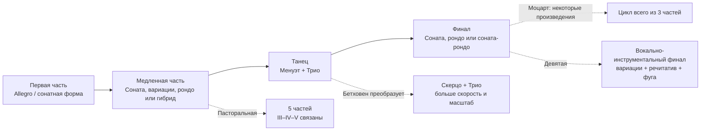
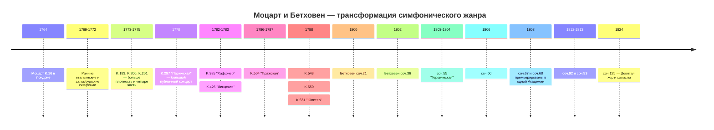
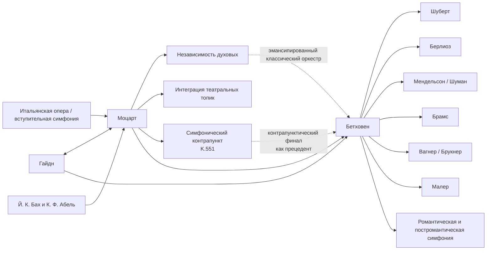

<!-- Translation of: research/sources/author-supplied/beethoven-mozart-symphonic-form.md; source commit: 304d75ed6ff646d311fd9df8b4e2db0d4dee277a -->
# Бетховен и Моцарт: каталог, форма, история, рецепция и наследие симфоний

## Резюме

Симфонические траектории **Вольфганга Амадея Моцарта** и **Людвига ван Бетховена** принадлежат одной исторической дуге, но представляют разные моменты в консолидации симфонии. Моцарт сопровождал практически всю трансформацию жанра, от краткой трёхчастной итальянской симфонии и оперной увертюры 1760-х до большой венской концертной симфонии 1780-х. Бетховен получил от Гайдна и Моцарта уже высоко утончённый жанр и перестроил его вокруг монументального масштаба, драматической непрерывности, интенсивной мотивной разработки, пространных код, дальних тональных конфликтов и, наконец, включения человеческого голоса в Девятой. Сам Моцартеум описывает эволюцию Моцарта от начального стандартизированного оркестра — два гобоя, две валторны и струнные, с трубами/литаврами в торжественных случаях — до более широкого венского письма, с флейтой, кларнетами и фаготами, всё более независимыми. citeturn20view2turn25search0

Существует фундаментальная асимметрия между каталогами. **Бетховен написал девять нумерованных и аутентичных симфоний**, соответствующих соч. 21, 36, 55, 60, 67, 68, 92, 93 и 125. citeturn22search1 Для Моцарта «41 симфония» — историческая конвенция, а не эквивалент современного критического каталога. Старые № 2 и № 3 — не Моцарта; № 37 — по существу Симфония MH 334 Михаэля Гайдна, к которой Моцарт добавил вступительный материал; более того, есть аутентичные симфонии без традиционного номера, симфонические версии увертюр и серенад, произведения сомнительной аутентичности и утраченные симфонии. Новый **Köchel-Verzeichnis**, опубликованный в 2024 году — первое полное новое издание с 1964 года, — обновил даты, источники и атрибуции в свете недавних исследований. citeturn6search0turn7view0turn13search0turn25search2

Формальный анализ показывает разницу акцентов, а не простую оппозицию между «мелодическим Моцартом» и «мотивным Бетховеном». Моцарт может работать с необычайной мотивной экономией — прежде всего в симфониях № 40 и № 41, — но склонен строить крупные формы через **множественность топик, контрасты характера, диалог между инструментальными семьями, контрапункт и реинтерпретацию оперных жестов**. Бетховен продвигает дальше способность минимальной ячейки генерировать структуру: парадигматический пример — Пятая, в которой четырёхнотная ритмическая фигура пронизывает разные тематические функции и вписывает себя в глобальную траекторию от до минора к до мажору. *Героическая*, Пятая, Пасторальная и Девятая расширяют само определение симфонического цикла. Недавние исследования настаивают, однако, что бетховенскую революцию надо понимать как трансформацию парадигм, уже существовавших у Гайдна и Моцарта, а не как творение ex nihilo. citeturn17search6turn17search10

У Моцарта три главных поворотных пункта особенно ясны: **Симфония № 25 соль минор, K. 183**, с контрапунктической интенсивностью и исключительно тёмной оркестровкой; **«Парижская», K. 297**, задуманной для большого публичного концерта и оркестра, включавшего кларнеты; и последовательность **«Хаффнер»–«Линцская»–«Пражская»–№ 39–40–«Юпитер»**, в которой масштаб, независимость духовых, хроматизм и контрапунктическая интеграция достигают нового уровня. Письмо Моцарта от 9 июля 1778 подтверждает и огромный публичный успех «Парижской», и полемику вокруг её Andante, сочтённого чрезмерно модуляционным директором Жозефом Легро; Моцарт написал вторую версию части. citeturn30view0turn31view0

У Бетховена девять произведений образуют особенно показательную последовательность: Первая всё ещё играет сознательно с гайдновско-моцартовскими ожиданиями; Вторая расширяет масштаб и риторику; Третья радикально меняет пропорции и функцию коды; Четвёртая утончает двусмысленность и юмор; Пятая создаёт беспрецедентную циклическую непрерывность; Шестая превращает цикл в пять программных «сцен»; Седьмая делает ритм структурообразующим принципом; Восьмая пересматривает, иронически, модели XVIII века; а Девятая преобразует симфонию в инструментально-вокальный синтез. Исторические страницы Бетховен-Хауса документируют эти генезисы, премьеры и ревизии по автографам, эскизам, первым изданиям и современным источникам. citeturn4search0turn3search0turn4search1turn4search3turn3search2turn3search3turn5search0

Для критического изучения надёжнейшими редакционными ориентирами являются **Neue Mozart-Ausgabe (NMA), серия IV, группа 11**, с десятью томами симфоний и критическими отчётами, и для Бетховена — и партитуры, основанные на **Neue Beethoven-Gesamtausgabe**, опубликованной Henle, и критическое уртекст-издание **Йонатана Дель Мара** для Bärenreiter. citeturn10search3turn22search0turn22search1 В записях сравнительное изучение выигрывает от сопоставления исторически информированных исполнений с большой современной симфонической традицией: для Моцарта Тревор Пиннок/Английский концерт — полная HIP-референция; для Бетховена Джон Элиот Гардинер/Революционно-романтический оркестр и Николаус Арнонкур/Камерный оркестр Европы предлагают два разных способа переосмысления артикуляции, размера, баланса и риторики в свете исторических исследований. citeturn23search1turn23search6turn23search2turn23search23

## Охват, источники, терминология и проблемы атрибуции

**Критерий каталога.** Для Бетховена «полный каталог симфоний» недвусмысленно: девять законченных и нумерованных симфоний. Для Моцарта этот отчёт разделяет четыре слоя: 41 произведение традиционной нумерации; дополнительные произведения, включённые в симфоническую серию NMA; симфонические версии, выведенные из опер или серенад; и подложные, сомнительные, фрагментарные или утраченные произведения. NMA распределяет симфонии Моцарта по десяти томам серии IV/11, под редакцией, среди прочих, Герхардом Алльроггеном, Вильгельмом Фишером, Германом Беком, Кристофом-Хельмутом Малингом, Фридрихом Шнаппом, Гюнтером Хаусвальдом, Ласло Шомфаи и Х. Ч. Роббинсом Лэндоном. citeturn10search3turn10search0turn10search1turn10search2turn11search0turn11search1turn11search2turn12search0turn12search1

**Кёхель против опуса.** Номер **K. или KV** (*Köchel-Verzeichnis*) — нормальный музыковедческий идентификатор произведений Моцарта. Выражение «опус» не составляет систематического каталога Моцарта: некоторые исторические издания присваивали редакционные номера опусов опубликованным сборникам, но они не несут функции, которую номера соч. несут у Бетховена. Therefore в таблице Моцарта «Соч.» указано как **неприменимо**. Онлайновый Кёхель, в настоящее время отражаемый Моцартеумом, происходит из нового издания 2024 года и может давать более широкие или иные даты, чем закреплённых шестым изданием; K. 183, например, сегодня официально датируется в диапазоне от марта 1773 до мая 1775, хотя старая литература обычно помещает её конкретно осенью 1773. citeturn7view0turn25search3

**Статус аутентичности.** Старая Симфония № 3, исторически K. 18, теперь каталогизирована как **KV Anh. A 51**, удостоверенное произведение **Карла Фридриха Абеля**, а не Моцарта. citeturn13search0 № 2, K. 17/Anh. C 11.02, также не принадлежит аутентичному корпусу Моцарта и приписывается Леопольду Моцарту в современной библиографии. Старый № 37, K. 444/425a, в настоящее время каталогизирован как **KV Anh. A 53 / MH 334**, симфония Михаэля Гайдна с участием Моцарта. citeturn16search0turn25search2 K. 84 — пример случая, всё ещё эксплицитно классифицирован новым Кёхелем как **«сомнительной аутентичности»**; старые источники приписывают её попеременно Вольфгангу, Леопольду Моцарту и Диттерсдорфу. citeturn25search1

**Форма.** Термины вроде «сонатная форма» употребляются здесь аналитически. В симфониях 1760-х говорить «сонатная форма» может быть анахроничным, если понимать как школьную модель XIX века. Во многих первых частях точнее говорить о **бинарной сонатной форме или ранней сонате**, в которой экспозиция, реприза и разработка ещё не обладают пропорциями и функциями, которые мы находим в 1780-х. Сама история симфонии показывает переход от моделей итальянской увертюры и бинарных структур к всё более дифференцированной организации четырёх частей. Современная литература о классической симфонии подчёркивает ровно эту историческую множественность. citeturn17search4turn17search8

**Оркестровка.** В ранних симфониях Моцарта типичное ядро — струнные, два гобоя и две валторны; трубы и литавры появляются прежде всего в праздничных произведениях. При зальцбургском дворе флейтисты и гобоисты могли быть теми же музыкантами, фактор, помогающий объяснить, почему флейты и гобои не всегда появляются одновременно. В венский период кларнеты и фаготы становятся независимыми голосами в гораздо большей степени. citeturn25search0turn20view2 Бетховен начинает внутри этого классического мира, но постепенно превращает валторны, трубы, литавры и деревянные духовые в формальных агентов, увенчиваясь тембровыми расширениями Пятой, Шестой и Девятой.

Блок-схема ниже обобщает **архетип**, а не жёсткое правило:

Эта формальная генеалогия соответствует исторической картине, задокументированной NMA для Моцарта и критическими источниками девяти симфоний Бетховена. citeturn10search0turn10search1turn12search1turn4search3turn5search0

## Каталог, хронология, премьеры и документальные источники

**Таблица каталога — Бетховен.**

| Симфония | Тональность | Сочинение | Каталог | Премьера / первое известное исполнение | Исполнители и примечания |
|---|---|---:|---|---|---|
| № 1 | до мажор | 1799–1800 | **Соч. 21** | 2 апр. 1800, Хофбургтеатр/Бургтеатр, Вена | Академия, организованная Бетховеном; программа включала Моцарта, Гайдна, фортепианный концерт и Септет Бетховена. citeturn4search0 |
| № 2 | ре мажор | 1800–1802 | **Соч. 36** | 5 апр. 1803, Театр ан дер Вин | Первое надёжно документированное публичное исполнение, в бетховенской Академии; возможное более раннее частное исполнение. citeturn3search0 |
| № 3 «Героическая» | ми-бемоль мажор | 1803–1804 | **Соч. 55** | частная для Лобковица, 1804; публичная 7 апр. 1805, Театр ан дер Вин | Оркестр Лобковица в первых исполнениях; окончательное посвящение князю Лобковицу. citeturn4search1turn2search5turn2search17 |
| № 4 | си-бемоль мажор | 1806 | **Соч. 60** | вероятно, март 1807, дворец Лобковица, Вена | Частное исполнение, связанное с домом Лобковица; посвящена графу Францу фон Опперсдорфу. citeturn3search1 |
| № 5 | до минор | 1804–1808 | **Соч. 67** | 22 дек. 1808, Театр ан дер Вин | Бетховен дирижировал знаменитой Академией примерно четырёх часов; наспех собранный оркестр и трудные условия. citeturn2search0turn4search2 |
| № 6 «Пасторальная» | фа мажор | 1807–1808 | **Соч. 68** | 22 дек. 1808, Театр ан дер Вин | Та же Академия, что Пятая; в программе Пасторальная представлена перед Симфонией до минор. citeturn4search3turn2search0 |
| № 7 | ля мажор | 1811–1812 | **Соч. 92** | 8 дек. 1813, Венский университет | Благотворительный концерт под управлением Бетховена, вместе с *Победой Веллингтона*; большой успех. citeturn3search2 |
| № 8 | фа мажор | 1812 | **Соч. 93** | 27 февр. 1814, Редутензаль, Вена | Бетховен дирижировал; программа также включала Седьмую и *Победу Веллингтона*. citeturn3search3 |
| № 9 | ре минор | 1822–1824; эскизы с 1815 | **Соч. 125** | 7 мая 1824, Кернтнертортеатр, Вена | Михаэль Умлауф осуществлял эффективное дирижирование, пока Бетховен оставался на сцене; Генриетта Зонтаг, Каролина Унгер, Антон Хайцингер и Йозеф Зайпельт составили сольный квартет. citeturn5search0turn2search19 |

Датировка Второй заслуживает коррекции очень распространённого биографического нарратива: Бетховен-Хаус подчёркивает, что значительная часть произведения уже задумана до знаменитого Хайлигенштадтского завещания, что делает упрощённым толковать её избыток энергии как прямой «ответ» на кризис 1802. citeturn3search0 Седьмая, в свою очередь, задокументирована автографом с «1812 Aug. 13» и премьерирована в контексте Наполеоновских войн, в благотворительном мероприятии. citeturn3search2

**Таблица каталога — Моцарт, историческая нумерация 1–41.** «—» под премьерой означает, что конкретное первое представление документально невосстановимо с уверенностью; это особенно обычно в зальцбургских произведениях, многие из которых написаны для придворного употребления без индивидуальной премьерной документации. citeturn25search0

| Ист. № | Тональность | Приблизит. / текущая дата | Кёхель | Соч. | Премьера или идентифицируемое первое исполнение | Статус |
|---|---|---|---|---|---|---|
| 1 | ми-бемоль | 1764 | **K. 16** | — | Лондон, 21 февр. 1765 | аутентична. citeturn10search0turn21search16 |
| 2 | си-бемоль | ок. 1765 | **K. 17 / Anh. C 11.02** | — | — | **подложна; приписывается Леопольду Моцарту**. citeturn16search0turn16search4 |
| 3 | ми-бемоль | 1764 | **K. 18; теперь Anh. A 51** | — | произведение Абеля | **Карл Фридрих Абель**, не Моцарт. citeturn13search0 |
| 4 | ре | 1765 | **K. 19** | — | — | аутентична. citeturn10search0 |
| 5 | си-бемоль | 1765 | **K. 22** | — | вероятно, гаагский период; точная премьера неясна | аутентична. citeturn10search0 |
| 6 | фа | 1767 | **K. 43** | — | — | аутентична. citeturn10search0 |
| 7 | ре | 1768 | **K. 45** | — | — | аутентична. citeturn10search0 |
| 8 | ре | 1768 | **K. 48** | — | — | аутентична. citeturn10search0 |
| 9 | до | ок. 1769–72 | **K. 73 / 75a** | — | — | аутентична; историческая хронология пересмотрена. citeturn10search0 |
| 10 | соль | 1770 | **K. 74** | — | — | аутентична. citeturn10search1 |
| 11 | ре | 1770 | **K. 84 / 73q** | — | — | **сомнительная аутентичность**. citeturn25search1 |
| 12 | соль | 1771 | **K. 110 / 75b** | — | — | аутентична. citeturn10search1 |
| 13 | фа | 1771 | **K. 112** | — | — | аутентична. citeturn10search1 |
| 14 | ля | 30 дек. 1771 | **K. 114** | — | — | аутентична; официальная автографная дата. citeturn25search0 |
| 15 | соль | 1772 | **K. 124** | — | — | аутентична. citeturn10search1 |
| 16 | до | 1772 | **K. 128** | — | — | аутентична. citeturn10search2 |
| 17 | соль | 1772 | **K. 129** | — | — | аутентична. citeturn10search2 |
| 18 | фа | 1772 | **K. 130** | — | — | аутентична. citeturn10search2 |
| 19 | ми-бемоль | 1772 | **K. 132** | — | — | аутентична; альтернативы для медленной части сохранились. citeturn10search2 |
| 20 | ре | 1772 | **K. 133** | — | — | аутентична. citeturn10search2 |
| 21 | ля | 1772 | **K. 134** | — | — | аутентична. citeturn10search2 |
| 22 | до | 1773 | **K. 162** | — | — | аутентична. citeturn11search0 |
| 23 | ре | традиционно 1773; текущий каталог допускает более широкий диапазон | **K. 181** | — | — | аутентична. citeturn14search3 |
| 24 | си-бемоль | 1773 | **K. 182** | — | — | аутентична. citeturn11search0 |
| 25 | соль минор | традиционно 1773; теперь: март 1773–май 1775 | **K. 183 / 173dB** | — | — | аутентична; 4 валторны. citeturn25search3 |
| 26 | ми-бемоль | 1773 | **K. 184 / 161a** | — | — | аутентична. citeturn11search0 |
| 27 | соль | ок. 1773 | **K. 199 / 161b** | — | — | аутентична. citeturn11search0 |
| 28 | до | ок. 1773–75 | **K. 200 / 189k** | — | — | аутентична; старая дата на автографе создаёт проблемы. citeturn25search4 |
| 29 | ля | 1774 | **K. 201 / 186a** | — | — | аутентична. citeturn11search1 |
| 30 | ре | 1774 | **K. 202 / 186b** | — | — | аутентична. citeturn11search1 |
| 31 «Парижская» | ре | июнь 1778 | **K. 297 / 300a** | — | **18 июня 1778, Концерт спиритюэль, Тюильри, Париж** | аутентична; оркестр Концерт спиритюэль; Жозеф Легро руководил институцией. citeturn21search13turn30view0 |
| 32 | соль | 26 апр. 1779 | **K. 318** | — | — | аутентична; непрерывная структура в трёх разделах. citeturn11search2turn17search20 |
| 33 | си-бемоль | 1779; поздние редакции | **K. 319** | — | — | аутентична. citeturn11search2 |
| 34 | до | 1780 | **K. 338** | — | — | аутентична; три части. citeturn11search2 |
| 35 «Хаффнер» | ре | 1782; переработана 1783 | **K. 385** | — | **23 марта 1783, Бургтеатр, Вена** | Моцарт дирижировал своей Академией; происхождение в праздничной музыке для семьи Хаффнер. citeturn27search21turn27search17turn27search32 |
| 36 «Линцская» | до | 30 окт.–нач. нояб. 1783 | **K. 425** | — | **4 нояб. 1783, театр Линца** | наспех написанная для концерта, объявленного графом Туном. citeturn31view1turn27search8 |
| 37 | соль | ок. 1783–84 | старый **K. 444/425a; теперь Anh. A 53 / MH 334** | — | версия, связанная с линцским пребыванием | **Михаэль Гайдн; вклад Моцарта во вступлении**. citeturn25search2turn27search8 |
| 38 «Пражская» | ре | 6 дек. 1786 | **K. 504** | — | **19 янв. 1787, Прага, театр, тогда связанный с Национальным/Сословным театром** | Моцарт руководил концертом. citeturn27search6turn27search10 |
| 39 | ми-бемоль | **26 июня 1788** | **K. 543** | — | конкретная премьера **надёжно не установлена** | аутентична. citeturn14search2turn28search9 |
| 40 | соль минор | **25 июля 1788**; поздняя версия с кларнетами | **K. 550** | — | неясная частная премьера; документируемые/вероятные исполнения в 1791 | аутентична, две версии. citeturn14search0turn28search16 |
| 41 «Юпитер» | до | **10 авг. 1788** | **K. 551** | — | конкретная премьера не сохранилась | аутентична; последняя симфония Моцарта. citeturn20view2turn28search9 |

«Парижская» составляет лучше всего документированный случай непосредственной рецепции среди довенских симфоний Моцарта. Семейная переписка фиксирует успех в Концерт спиритюэль; Леопольд прямо поздравил сына, а Моцарт писал, что произведение приняли «несравненно хорошо». То же письмо показывает, что Моцарт думал стратегически о публичных эффектах, ожиданиях парижской публики и даже о замене медленной части. citeturn31view2turn31view0

Генезис «Линцской» столь же исключительно хорошо документирован. 31 октября 1783 Моцарт писал Леопольду, что граф Тун объявил концерт на 4 ноября и, поскольку он не привёз с собой симфонии, он работает «на полной скорости» над новой. Письмо — первичное свидетельство чрезвычайно сжатых обстоятельств сочинения. citeturn30view1turn31view1

**Релевантные дополнительные симфонии и версии вне ряда 1–41.**

| Произведение | Тональность | Приблизит. дата | Критическая ситуация |
|---|---|---:|---|
| K. Anh. 223 / 19a | фа | ок. 1765 | включена в NMA среди ранних симфоний. citeturn10search0 |
| K. Anh. 221 / 45a, «Старый Ламбах» | соль | ок. 1766 | передана в NMA; исторически объект атрибуционного спора. citeturn10search0 |
| K. Anh. 214 / 45b | си-бемоль | ок. 1768 | проблематичная атрибуция; критически включена в NMA. citeturn10search0 |
| K. 75 | фа | ок. 1771 | традиционный № 42; аутентичность оспаривается. citeturn10search1turn16search4 |
| K. 76 / 42a | фа | 1760-е | традиционный № 43; атрибуция оспаривается. citeturn10search0turn16search4 |
| K. 81 / 73l | ре | 1770 | традиционный № 44; атрибуция оспаривается. citeturn10search1 |
| K. 95 / 73n | ре | ок. 1770 | традиционный № 45; атрибуция оспаривается. citeturn10search1 |
| K. 96 / 111b | до | ок. 1771 | традиционный № 46; атрибуция оспаривается. citeturn10search1 |
| K. 97 / 73m | ре | ок. 1770 | традиционный № 47; атрибуция оспаривается. citeturn10search1 |
| K. 111 + K. 120 / 111a | ре | 1771 | симфоническая версия, связанная с увертюрой *Ascanio in Alba*; традиционный № 48. citeturn10search1 |
| Увертюра K. 126 + K. 161/163 | ре | 1772 | симфоническая версия, связанная с *Il sogno di Scipione*; известная как № 50. citeturn10search2 |
| Увертюра K. 196 + K. 121 / 207a | ре | 1774–75 | симфоническая версия, образованная увертюрой + финалом. citeturn11search1 |
| Увертюра K. 208 + K. 102 / 213c | до | 1775 | **неполная** симфоническая версия, связанная с *Il re pastore*. citeturn11search1 |
| Симфоническая версия K. 204 / 213a | ре | 1775 | серенадная редукция. citeturn9view1 |
| Симфоническая версия K. 250 / 248b, «Хаффнер-серенада» | ре | 1776 | серенадная редукция; оригинальное праздничное произведение исполнено для Хаффнеров 21 июля 1776. citeturn14search4turn9view1 |
| Симфоническая версия K. 320, «Почтовая» | ре | 1779 | серенадная редукция. citeturn9view1 |
| K. 409 | до | нач. 1780-х | отдельный симфонический менуэт, **не полная симфония**. citeturn12search2 |
| K. Anh. 220 / 16a, «Оденсе» | ля минор | исторически приписываемая юному Моцарту | крайне проблематичная аутентичность; должна оставаться вне надёжного ядра. citeturn16search4 |
| K. Anh. 216 / 74g | си-бемоль | неясна | традиционный № 54; сомнительна. citeturn16search4 |
| K. Anh. 214 / 45b | си-бемоль | неясна | традиционный № 55; сомнительна. citeturn16search4 |
| K. 98 / Anh. C 11.04 | фа | неясна | традиционный № 56; сомнительная/ложная атрибуция. citeturn16search4 |

Есть также ссылки на **утраченные симфонии** — включая K. 19b и различные старые пункты из приложений Кёхеля, — для которых недостаточно материала для полного формального анализа. Сам официальный каталог отмечает, что Моцарт написал бы около пятнадцати симфоний во время большого европейского путешествия 1763–66 и что некоторые утрачены. citeturn20view2turn16search0

**Синтетическая линия времени:**

Хронология показывает, что «классическая симфония» — не застывшая модель: между K. 16 и K. 551 Моцарт проходит более двух десятилетий институциональных и стилистических изменений, тогда как Бетховен всего примерно за двадцать четыре года превращает это наследие в жанр всё больших эстетических амбиций. citeturn20view2turn4search0turn5search0

## Формальная анатомия и анализ по частям

По всему разделу «SF» означает **сонатную форму**; «bin./son.» обозначает бинарную форму, чья логика уже предвосхищает сонатные процедуры; «T–D» означает движение от тоники к доминанте, а «T–rel.» типичный переход к параллельному мажору в произведениях в минорной тональности. Идентификации — аналитические прочтения критических партитур; классические части часто допускают более одной защитимой формальной интерпретации. NMA даёт базовый критический текст для Моцарта, а издания Henle/Bärenreiter — современный эквивалент для Бетховена. citeturn10search3turn22search0turn22search1

**Бетховен, Симфония № 1 до мажор, соч. 21.** Первая часть начинается с намеренно дезориентирующего *Adagio molto*: вместо немедленного утверждения до мажора Бетховен проецирует гармонии, звучащие как доминанты соседних областей, прежде всего доминанту фа, продлевая отказ от тоники. *Allegro con brio* наконец утверждает до мажор и использует сонатную форму гайдновского профиля, но с большей динамической агрессией, гаммами и духовой акцентуацией. Разработка дробит ячейки и исследует модулирующие секвенции перед возвратом тоники. **II, Andante cantabile con moto**, фа мажор, — лирическая соната, в которой имитация и лёгкий контрапункт сосуществуют с деликатно интегрированными трубами и литаврами — необычная инструментовка для конвенционального образа «деликатной медленной части». **III, Menuetto: Allegro molto e vivace**, номинально менуэт, функционально скерцо: слишком быстрый, синкопированный и энергетически неустойчивый для традиционного аристократического танца. **IV** начинается с шутки медленного вступления, в которой гамма до раскрывается нота за нотой; *Allegro molto e vivace* превращает жест в сонатный финал гайдновских скорости и юмора. Произведение, следовательно, не оставляет Гайдна и Моцарта: оно делает знание этого словаря условием для нарушения ожиданий слушателя. citeturn4search0turn22search9

**Симфония № 2 ре мажор, соч. 36.** **I, Adagio molto – Allegro con brio**, значительно расширяет медленное вступление, с экскурсами в минорный лад, хроматизмом и аккордами неясной функции перед буйной SF ре. Разработка и кода уже превышают обычные пропорции Первой; кода перестаёт быть простым подтверждением и начинает участвовать в разработке. **II, Larghetto, ля мажор**, — обширная лирическая сонатная форма: длинные украшенные фразы сосуществуют с имитацией и высоко дифференцированной деревянно-духовой палитрой. **III явно названа Скерцо**, закрепляя замену менуэта в бетховенском симфоническом цикле; внезапные контрасты динамики и регистра конститутивны для формы. **IV, Allegro molto**, рождена из резкого, почти гротескного мотива, функционирующего как возвращающийся сигнал; форма смешивает сонатные и рондные черты и увенчивается необычайно длинной кодой, предвосхищая структурную важность, которую кода будет иметь в *Героической*. citeturn3search0turn22search5

**Симфония № 3 ми-бемоль мажор, соч. 55, «Героическая».** **I, Allegro con brio**, устраняет медленное вступление: два аккорда fortissimo ми-бемоль немедленно запускают тему, основанную на тоническом арпеджио. Почти сразу, однако, до-диез, чуждый тональности, дестабилизирует гармоническое поле. Экспозиция содержит не только «тему 1/тему 2», но сеть тематических групп, синкопированных ритмов и метрических конфликтов. Разработка колоссальна: она дробит ячейки, создаёт цепи диссонансов и представляет знаменитый новый материал ми минор. Знаменитое, видимо, «преждевременное» вступление валторны перед репризой усиливает временную двусмысленность. Кода функционирует как **вторая разработка**, перестраивая материал вместо простого закрытия. **II, Marcia funebre: Adagio assai**, до минор, сочетает марш, рондо и тернарную/вариационную архитектуру; эпизоды до мажор и фугальные разделы превращают марш в коллективный процесс плача и перестройки. **III, Скерцо**, окончательно заменяет общительность менуэта скоростью, неожиданностью и напряжением; Трио даёт эффектную выпуклость **трём валторнам**, значительное расширение раздела. **IV** — синтез вариации, фуги и финальной логики на материале, который Бетховен уже использовал в *Творениях Прометея* и других пьесах: он начинается от баса темы перед представлением её мелодической поверхности и подвергает её контрапунктическим и лирическим трансформациям. Решающее новшество — не только «продолжительность»: это превращение всего цикла в крупномасштабный драматический аргумент. citeturn4search1turn17search6turn22search11

**Симфония № 4 си-бемоль мажор, соч. 60.** **I** начинается с *Adagio*, чья разреженная фактура и поначалу мрачный ход делают тонику си-бемоль кажущейся далёкой; взрыв *Allegro vivace* разрешает эту приостановку и начинает необычайно подвижную SF, основанную на гаммах, арпеджио и ритмических смещениях. **II, Adagio ми-бемоль**, структурирована пунктирным аккомпанирующим ритмом, становящимся столь же важным, как мелодии; кларнет и другие деревянные духовые обретают сильную тематическую индивидуальность. **III, Allegro vivace**, — расширенное пятичастное скерцо — скерцо–трио–скерцо–трио–скерцо — приём, который Бетховен вновь использует в Седьмой. **IV, Allegro ma non troppo**, — шестнадцатое *perpetuum mobile*: виртуозность струнных перемежается комическими духовыми вмешательствами, включая знаменитый фаготный момент. Четвёртая показывает, что бетховенское новшество не равно гигантизму: здесь оно лежит в двусмысленности, ритме, скорости и иронии. citeturn3search1

**Симфония № 5 до минор, соч. 67.** В **I, Allegro con brio**, коротко-коротко-коротко-длинная ячейку не надо понимать только как «тему»: это **ритмический генератор**, проходящий переходы, аккомпанемент, тутти и коду. Экспозиция отходит от до минора и направляется к ми-бемоль мажору; разработка сводит фактуру до всё меньших фрагментов. В репризе неожиданное почти каденцеподобное соло гобоя временно приостанавливает напор. Кода вновь берёт на себя развивающую функцию. **II, Andante con moto, ля-бемоль мажор**, чередует два тематических комплекса в процессе **двойных вариаций**; фанфарные эпизоды до мажор начинают предвосхищать триумфальную тональность финала. **III, Allegro, до минор**, ритмически преобразует ячейку первой части в валторнах; трио фугально и энергично. По возвращении скерцо сведено к призраку в *pianissimo*, а длинная доминанта ведёт **без перерыва** к финалу. **IV, Allegro, до мажор**, добавляет пикколо, контрафагот и тромбоны к оркестровой массе; трансформация от до минора к до мажору становится формальным и тембровым событием одновременно. Воспоминание скерцо перед репризой устанавливает подлинную циклическую память. Пятая, следовательно, менее буквальный рассказ о «судьбе», чем необычайный этюд мотивной интеграции, непрерывности между частями и глобальномасштабной тональности. citeturn4search2turn17search3

**Симфония № 6 фа мажор, соч. 68, «Пасторальная».** Бетховен снабжает названиями пять частей и настаивает, что это скорее выражение чувств, чем буквальная живопись. **I, «Пробуждение весёлых чувств по прибытии в деревню»**, — SF фа мажор, чья новизна лежит в обширных повторениях малых модулей, длинных устойчивых гармонических полях и субдоминантовом/плагальном акценте; цель менее телеологический конфликт, чем ощущение постоянства. **II, «Сцена у ручья», си-бемоль мажор**, держит волнообразную фигуру в сложном метре под деревянно-духовыми мелодиями; в конце Бетховен явно обозначает соловья, перепела и кукушку во флейте, гобое и кларнете. **III, «Весёлое собрание поселян»**, — скерцо, в котором деформации акцентов и карикатура деревенского оркестра заменяют изящество менуэта. Без обычной каденции пир прерывается **IV, «Грозой», фа минор**, почти целиком процессуальной частью: тремоло, хроматизм, уменьшённые септаккорды, литавры, пикколо и тромбоны создают непрерывную интенсификацию. Гроза растворяется прямо в **V, «Песнь пастухов; весёлые и благодарные чувства после грозы»**, фа мажор, гибрид рондо, сонаты и пасторального гимна, с господством плагальных каденций и хоралоподобной темой. Последние три части образуют непрерывную последовательность — важный прецедент для романтических программных циклов. citeturn4search3turn17search3

**Симфония № 7 ля мажор, соч. 92.** **I, Poco sostenuto – Vivace**, имеет одно из самых больших медленных вступлений Бетховена: восходящие гаммы и выдержанные аккорды ведут через области вроде до и фа, прежде чем повторяемая нота превращается в пульс *Vivace* в 6/8. Следующая SF управляется навязчивой пунктирной фигурой. **II, Allegretto, ля минор**, начинается с аккорда и ритмического остинато, чьё возвращение поддерживает вариации, контрапунктическое наложение и эпизод ля мажор; движение голосов создаёт почти архитектурный процесс накопления. **III, Presto**, помещает скерцо в фа мажор, неожиданной тональности относительно ля; трио ре мажор слышно дважды, вновь создавая пятичастную форму. **IV, Allegro con brio**, ля мажор, доводит ритмическое повторение, синкопы и остинато до почти физической степени; её длинная кода усиливает доминанту и повторяемый бас перед разрешением. Позднейшее замечание Адорно, что Седьмая была бы «симфонией par excellence», цитируется Бетховен-Хаусом как показатель её критической судьбы. citeturn3search2turn17search7

**Симфония № 8 фа мажор, соч. 93.** **I, Allegro vivace e con brio**, вступает прямо в фа мажор, но её кажущаяся «классическая нормальность» подрывается смещёнными акцентами, ложными метрическими иерархиями и непропорционально энергичной кодой. **II, Allegretto scherzando, си-бемоль мажор**, заменяет медленную часть ритмической миниатюрой, основанной на духовых пульсациях; традицию, связывающую её прямо с метрономом Мельцеля, следует трактовать с осторожностью, поскольку анекдот поздний и проблематичен. **III, Tempo di Menuetto**, — намеренно архаизирующий менуэт, медленный и тяжёлый по сравнению с бетховенскими скерцо. **IV, Allegro vivace**, составляет вершину структурного юмора: неистовый до-диез, чуждый фа мажору, возвращается как гармоническая проблема; в огромной коде Бетховен исследует её реинтерпретацию и дальние экскурсы перед финальным утверждением тоники. Восьмая «ретроградна» лишь поверхностно: это метакритика классических процедур. citeturn3search3

**Симфония № 9 ре минор, соч. 125.** **I, Allegro ma non troppo, un poco maestoso**, начинается не с законченной мелодии, а с открытых квинт и фрагментов, будто возникающих из неопределённого до кристаллизации ре минора; сонатная форма превращает это «рождение» в возвращающийся принцип, а разработка/кода неистово расширяют материал. **II, Molto vivace**, помещает скерцо перед медленной частью; фугальная тема ре минор и взрывы литавр уравновешены Трио ре мажор, более стремительным и пасторальным. **III, Adagio molto e cantabile, си-бемоль мажор**, разрабатывает две главные сферы/идеи через орнаментальную вариацию и расширение, включая контрасты ре мажор и фанфарные эпизоды. **IV** начинается со взрывного диссонанса и инструментальными речитативами виолончелей и контрабасов, «отвергающих» воспоминания трёх предыдущих частей. Лишь затем возникает, ре мажор, простая мелодия «Оды к радости», поначалу в струнных басах; инструментальные вариации, вступление баритона, хор, «турецкий» марш с перкуссией, фуга, торжественный эпизод на «Seid umschlungen, Millionen», контрапунктическая комбинация идей и огромная кода следуют. Инновация — не только «использование хора»: она заставляет сам финал драматизировать недостаточность чисто инструментальной симфонии и строить новую форму из речитатива, вариации, марша, фуги, гимна и симфонической звучности. citeturn5search0turn22search7

**Моцарт — компактный анализ нумерованного корпуса.** Ключевые ряды ниже сгущают ход по частям; в некоторых ранних произведениях «ранняя соната» намеренно предпочтительнее жёсткого школьного прочтения. Названия и организация частей задокументированы симфоническими томами NMA. citeturn10search0turn10search1turn10search2turn11search0turn11search1turn11search2turn12search0turn12search1

| Симфония | По частям и формальное прочтение | Оркестровка, мотивы и инновация |
|---|---|---|
| **№ 1, K.16** | I ми-бемоль, *Molto allegro*, bin./son.; II до минор, *Andante*, бинарная; III ми-бемоль, *Presto*, быстрая-бинарная/ранняя соната. | Струнные + гобои/валторны. Ход медленной части к параллельному минору вносит неожиданную серьёзность в детское лондонское произведение; сильное влияние среды Й. К. Баха/Абеля. citeturn10search0 |
| **№ 2, K.17** | Традиционная структура си-бемоль, но **не должна анализироваться как Моцарт**. | Атрибуция Моцарту отвергнута; она сохраняется лишь по историографическим причинам. citeturn16search0 |
| **№ 3, старый K.18** | Цикл быстро–медленно–быстро ми-бемоль; галантный идиом и тематическая прозрачность. | Это симфония **К. Ф. Абеля**, переписанная юным Моцартом. Её интерес лежит ровно в показе одной из моделей, которые мальчик изучал. citeturn13search0 |
| **№ 4, K.19** | I ре, Allegro, bin./son.; II соль, Andante; III ре, Presto. | Три части и простые гармонические траектории T–D/T–SD, типичные первого лондонского периода. citeturn10search0 |
| **№ 5, K.22** | I си-бемоль; II ми-бемоль; III си-бемоль. Формат быстро–медленно–быстро. | Заметно более периодические фразы и оркестровые ответы; усвоение международного стиля европейского путешествия. citeturn10search0 |
| **№ 6, K.43** | I фа, ранняя SF; II до, Andante; III фа, Menuetto/Trio; IV фа, Allegro. | Принятие четырёх частей приближает произведение к австро-немецкой модели; менуэт становится частью цикла. citeturn10search0 |
| **№ 7, K.45** | ре–соль–ре–ре; Allegro / Andante / Menuetto / Allegro. | Праздничность ре мажор, фанфары и ясные каденции; баланс между итальянским и венским. citeturn10search0 |
| **№ 8, K.48** | ре–соль–ре–ре, четыре части. | Сильный церемониальный профиль; контрасты тутти/слоёв струнных и духовых. citeturn10search0 |
| **№ 9, K.73** | до–фа–до–до; четыре части. | Праздничная зальцбургская модель; каденции и секвенции обретают большую широту. citeturn10search0 |
| **№ 10, K.74** | соль, медленный/субдоминантовый раздел, связанный с циклом, быстрый возврат соль. | Особенно тесная связь с итальянской увертюрой и связанными частями. citeturn10search1 |
| **№ 11, K.84** | ре–соль–ре, три части. | Вероятно моцартовский идиом, но противоречивая передача мешает надёжной атрибуции. citeturn25search1 |
| **№ 12, K.110** | соль–до–соль–соль. | Четыре части; внутренние голоса и альт набирают вес относительно continuo-баса первых моделей. citeturn10search1 |
| **№ 13, K.112** | фа–си-бемоль–фа–фа. | Большая мотивная энергия в тутти, с ясной оппозицией между струнными периодами и духовыми подкреплениями. citeturn10search1 |
| **№ 14, K.114** | ля–ре–ля–ля. | Более просторное произведение; более активный внутренний контрапункт. Текущий Кёхель датирует её точно 30 дек. 1771. citeturn25search0 |
| **№ 15, K.124** | соль–до–соль–соль. | Зальцбургский синтез между блеском увертюры и придворным менуэтом. citeturn10search1 |
| **№ 16, K.128** | до–соль–до, три части. | Возврат к итальянскому формату; компактные, сильно каденционные крайние быстрые части. citeturn10search2 |
| **№ 17, K.129** | соль–до–соль, три части. | Подвижная фактура и большая дифференциация второй тематической группы. citeturn10search2 |
| **№ 18, K.130** | фа–си-бемоль–фа–фа. | Четыре части; протяжённость и духовое письмо уже указывают на отход от миниатюр предыдущего десятилетия. citeturn10search2 |
| **№ 19, K.132** | ми-бемоль–си-бемоль–ми-бемоль–ми-бемоль; альтернативная версия медленной части сохранена. | Существование альтернативных частей делает произведение особенно важным для изучения ревизии и выбора характера. citeturn10search2 |
| **№ 20, K.133** | ре–ля–ре–ре. | Блеск ре мажора, с большей независимостью внутренних партий и динамическим контрастом. citeturn10search2 |
| **№ 21, K.134** | ля–ре–ля–ля. | Утончённая фактура, меньшая зависимость от чисто церемониального эффекта. citeturn10search2 |
| **№ 22, K.162** | до–фа–до, три части. | Компактна, театральна и близка к жесту оперной увертюры. citeturn11search0 |
| **№ 23, K.181** | ре–соль–ре, три раздела/части театрального импульса. | Быстрая жестическая непрерывность; текущий Кёхель даёт более широкую дату, чем старая хронология. citeturn14search3 |
| **№ 24, K.182** | си-бемоль–ми-бемоль–си-бемоль, три части. | Галантная ясность, соединённая с большей силой тутти. citeturn11search0 |
| **№ 25, K.183** | I соль минор, SF; II ми-бемоль, медленная в расширенной SF/бинарной; III соль минор, Menuetto, Трио соль мажор; IV соль минор, SF. | Два гобоя, два фагота, **четыре валторны** и струнные; синкопы, скачки, тремоло, контрапункт и динамика сообщают необычный вес. citeturn25search3 |
| **№ 26, K.184** | ми-бемоль – до минор – ми-бемоль, три связанные или тесно соотнесённые части. | Театральная увертюрная драматургия; медленная часть до минор радикально затемняет тональный центр. citeturn11search0 |
| **№ 27, K.199** | соль–ре–соль. | Лёгкая внешность, но тематическая разработка и внутренние голоса более гибки, чем в первых симфониях. citeturn11search0 |
| **№ 28, K.200** | до–фа–до–до. | Трубы доступны в источниках и церемониальный характер; растущее взаимодействие между фанфарой и лиризмом. citeturn25search4 |
| **№ 29, K.201** | I ля, SF; II ре, Andante; III ля, Menuetto; IV ля, SF в 6/8. | Одна из первых зрелых симфоний: контрапункт, имитация и мотивы вновь появляются под разными функциями; финал соединяет танец и разработку. citeturn11search1 |
| **№ 30, K.202** | ре–ля–ре–ре. | Большая ритмическая энергия и расширение четырёхчастной формы; блеск всё ещё связан с зальцбургским контекстом. citeturn11search1 |
| **№ 31, K.297 «Парижская»** | I ре, монументальная SF; II соль, Andante — две версии; III ре, Allegro/SF. | Флейты, гобои, **кларнеты**, фаготы, валторны, трубы, литавры и струнные: беспрецедентный масштаб у Моцарта. Открывающее тутти и контрасты *piano–forte* намеренно используют парижскую публику. citeturn21search13turn31view0 |
| **№ 32, K.318** | Allegro spiritoso соль → контрастное Andante → возврат начального темпа соль, без нормального отдельного цикла. | Гибрид увертюры и симфонии, сосредоточивая экспозицию, медленный контраст и быстрый возврат в непрерывной дуге. citeturn11search2turn17search20 |
| **№ 33, K.319** | си-бемоль–ми-бемоль–си-бемоль–си-бемоль. | Камерный духовой баланс и большая разработка переходов; цикл переработан. citeturn11search2 |
| **№ 34, K.338** | I до, SF; II фа, Andante di molto; III до, быстрый финал; **без менуэта**. | Сосредоточена и блестяща; контраст между внешним великолепием и лирической внутренностью предвосхищает венское десятилетие. citeturn11search2 |
| **№ 35, K.385 «Хаффнер»** | I ре, SF; II соль, Andante; III ре, Menuetto/Trio; IV ре, Presto. | Открывающий унисонный мотив господствует в I; для симфонической версии Моцарт расширил духовые. Финал энергии *buffa*; Моцарт просил играть его как можно быстрее. citeturn27search25turn27search17 |
| **№ 36, K.425 «Линцская»** | I Adagio–Allegro spiritoso, до, SF; II фа, Andante/SF; III до, Menuetto; IV до, Presto/SF. | Первое крупномасштабное медленное вступление в зрелой симфонии Моцарта; «торжественные» хроматизм и риторика приближают произведение к Гайдну. citeturn12search3turn27search20 |
| **№ 37, K.444/Anh.A53** | Структура по существу Михаэля Гайдна соль, с моцартовским вступительным вкладом. | Не должна использоваться как пример «симфонического стиля Моцарта» без авторской оговорки. citeturn25search2 |
| **№ 38, K.504 «Пражская»** | I ре, **Adagio–Allegro**, SF; II соль, Andante/SF; III ре, Presto/SF. | Без менуэта, но крупнее по масштабу, чем многие четырёхчастные симфонии. Контрапунктическая плотность, синкопы и почти оперная духовая трактовка. citeturn12search0turn17search5 |
| **№ 39, K.543** | I ми-бемоль, Adagio–Allegro, SF; II ля-бемоль, Andante con moto; III ми-бемоль, Menuetto; IV ми-бемоль, Allegro/SF. | **Без гобоев**: флейта, кларнеты и фаготы создают особенно мягкий тембр. Трио менуэта превращает кларнет в главного героя характера *Ländler*. citeturn14search2turn12search1 |
| **№ 40, K.550** | I соль минор, SF; II ми-бемоль, Andante/SF; III соль минор, Menuetto, Трио соль; IV соль минор, SF. | Анакрузы и «вздохи» I беспрестанно дробятся; финал создаёт крайнюю хроматическую неустойчивость. Существуют версии с двумя кларнетами и без. citeturn14search0turn12search1 |
| **№ 41, K.551 «Юпитер»** | I до, Allegro vivace/SF; II фа, Andante cantabile/SF; III до, Menuetto; IV до, Molto allegro: SF + обратимый контрапункт/fugato. | Финал построен из нескольких мотивов, среди них **C–D–F–E**, контрапунктически соединённых в коде; синтез «учёного» стиля и симфонической риторики. citeturn20view2turn17search1 |

Некоторые произведения заслуживают расширения за пределы таблицы.

В **K. 183** тональность соль минор — не просто код «печали». Первая часть черпает энергию из синкоп, унисонов, тремоло и скачков, а четыре валторны увеличивают гармоническую массу. Оппозиция соль минор–си-бемоль мажор в экспозиции следует тонико-параллельному образцу, но Моцарт делает возврат к минору структурно необходимым через ритмическую настойчивость. Менуэт оставляет социально лёгкий характер танца и берёт на себя контрапунктический вес; Трио соль мажор предлагает одно из немногих пространств разрядки. Текущая официальная инструментовка подтверждает два гобоя, два фагота, две пары валторн и струнные. citeturn25search3

**K. 201** — решающий пункт, потому что утончённость не зависит от оркестровой силы. Открытие кажется почти камерным; имитация между скрипками, голосоведение и возвращение малых ячеек создают непрерывность. В финале 6/8 топика охоты/танца не мешает серьёзно контрапунктической разработке. Произведение показывает, почему образ Моцарта как композитора независимых тем, а Бетховена как единственного мастера разработки исторически неадекватен. citeturn11search1turn17search4

**«Парижская», K. 297**, — сочинение, явно ориентированное публичным пространством. Её открытие использует *premier coup d'archet* — скоординированный удар большого тутти — и огромный духовой аппарат. Моцарт осознавал ожидание аплодисментов во время произведения и комментирует это в письмах; после успеха первой части он далее писал, что финал начинался тихо, чтобы подготовить вступление тутти, способное удивить публику. Документация Концерт спиритюэль делает K. 297 исключительной лабораторией для связывания формы, эффекта и концертной социологии. citeturn21search13turn17search24turn31view0

**«Хаффнер», K. 385**, показывает обратный процесс: изначально праздничная/серенадоподобная музыка, переосмысленная для концерта. Моцарт убрал материал из оригинальной формы и, готовя произведение для Вены, усилил инструментовку крайних частей флейтами и кларнетами. В первой части большой открывающий жест в октавах навязчиво возвращается в разных контекстах; разработка не зависит от контрастной лирической «второй темы» обычным образом. Академия 23 марта 1783, вероятно, начиналась первыми тремя частями и заканчивалась финалом, обрамляя весь концерт симфонией. citeturn27search17turn27search25

В **«Линцской», K. 425**, медленное вступление превращает произведение, написанное в кратчайшее время, в симфонию исключительно широкой риторики. Хроматическая гармония и пунктирные ритмы создают торжественность, прежде чем Allegro до мажор утверждает праздничный характер. Andante фа мажор включает необычную фактуру и плотность; финальное Presto перемещает театральную живость внутрь строгой сонатной формы. Факт, что произведение создано между объявлением концерта и 4 ноября 1783, прямо подтверждён письмом Моцарта. citeturn31view1turn27search8

**«Пражская», K. 504**, — продуктивный формальный парадокс: всего три части, однако большие протяжённость и сложность, чем у многих четырёхчастных симфоний. Большое Adagio-вступление устанавливает поле хроматического напряжения; Allegro использует синкопы, имитационные вступления и наложение голосов, часто с напором, напоминающим театральное письмо *Свадьбы Фигаро*. Элейн Сисман показала, как жанр, жест и смысл взаимодействуют в произведении, дестабилизируя идею, что его «содержание» может сводиться к одной эмоции. citeturn17search5turn12search0

В **последних трёх симфониях**, сочинённых между 26 июня и 10 августа 1788, Моцарт, кажется, исследует три почти взаимодополняющих решения симфонической проблемы: № 39 отдаёт предпочтение тембровой теплоте и кларнетам; № 40 сосредоточивает хроматизм и беспокойство соль минора; № 41 увенчивается контрапунктической интеграцией. Нет твёрдых свидетельств старого нарратива, что Моцарт написал бы их как «завещание», уже предчувствуя смерть. История исполнения при его жизни сама отчасти неясна: источники позволяют более надёжно утверждать только исполнения K. 550, тогда как другие концертные программы упоминают «большую симфонию» без достаточной идентификации. citeturn27search11turn28search9turn28search16

В **финале «Юпитера»** различение между сонатной формой и фугой становится неадекватным, если брать как альтернативу. Моцарт не просто пишет «фугу»: он располагает множественные субъекты и мотивы внутри сонатной архитектуры, использует обратимый контрапункт, имитацию и фугальные эпизоды и приберегает для коды необычайную одновременную комбинацию материала. Литература об «учёном стиле» и возвышенном подчёркивает ровно это слияние контрапунктической техники с симфонической телеологией, которая стала бы точкой отсчёта для Бетховена и XIX века. citeturn17search1turn17search0

**Партитуры и факсимиле для сопровождения анализа.** Исторические издания, доступные на IMSLP, очень полезны для сравнительного чтения, хотя **не заменяют современного критического издания**:

[IMSLP — Моцарт, список симфоний и исторических нумераций](https://imslp.org/wiki/Template:Symphonies_(Mozart,_Wolfgang_Amadeus))

[IMSLP — Моцарт, Симфония № 40 соль минор, K. 550](https://imslp.org/wiki/Symphony_No.40_in_G_minor%2C_K.550_(Mozart%2C_Wolfgang_Amadeus))

[IMSLP — Моцарт, Симфония № 41 до мажор, K. 551](https://imslp.org/wiki/Symphony_No.41_in_C_major%2C_K.551_(Mozart%2C_Wolfgang_Amadeus))

[IMSLP — Бетховен, Симфония № 5, соч. 67](https://imslp.org/wiki/Symphony_No.5%2C_Op.67_(Beethoven%2C_Ludwig_van))

[IMSLP — Бетховен, Симфония № 9, соч. 125](https://imslp.org/wiki/Symphony_No.9%2C_Op.125_(Beethoven%2C_Ludwig_van))

NMA также воспроизводит источники и варианты. Особенно поучительный пример — факсимиле, сохранённое в критическом издании симфонической версии, выведенной из Серенады K. 320, в котором нотация оркестровки источника может непосредственно наблюдаться. citeturn9view2

## Сравнение, историческая рецепция и влияние

**Сравнительная таблица центральных характеристик.**

| Произведение / группа | Форма и масштаб | Мотив/разработка | Гармония | Оркестровка | Решающая инновация |
|---|---|---|---|---|---|
| Моцарт K.16–K.48 | 3–4 части; бинарная/ранняя соната | короткие ячейки, периодичность | T–D и близкая субдоминанта | гобои, валторны, струнные | быстрая международная ассимиляция. citeturn10search0 |
| Моцарт K.110–K.134 | более стабильные 3–4 части | больше имитации и непрерывности | всё ещё сжатая модуляция | духовые интегрированы в тутти | консолидация зальцбургского стиля. citeturn10search1turn10search2 |
| Моцарт K.183 | 4 части | синкопы, острые ритмы | соль минор ↔ параллельный; хроматизм | 4 валторны + фаготы | новая «симфоническая» интенсивность. citeturn25search3 |
| Моцарт K.201 | 4 части | контрапункт и мотивная экономия | классические отношения, проработанные с тонкостью | относительно лёгкий оркестр | глубина без гигантизма. citeturn11search1 |
| Моцарт K.297 | 3 части | жесты, задуманные для публичного эффекта | расширенная модуляция, прежде всего в медленной части | огромная духовая секция, кларнеты | адаптация к парижскому концерту. citeturn21search13turn31view0 |
| Моцарт K.318 | непрерывная дуга | структурный тематический возврат | контраст соль–субдоминантовая область–соль | театральна | слияние увертюры/симфонии. citeturn11search2 |
| Моцарт K.385 | 4 части | открывающий жест господствует в I; театральный финал | диатоническая ясность + разработка | духовые усилены в ревизии | трансформация праздничной музыки в концертную симфонию. citeturn27search25 |
| Моцарт K.425 | 4 части | больший масштаб Allegro | хроматическое вступление → до мажор | трубы/литавры, независимые духовые | первое большое зрелое медленное вступление. citeturn27search20 |
| Моцарт K.504 | 3 монументальные части | контрапункт и синкопа | интенсивный выразительный хроматизм | диалогующие деревянные духовые | три части с весом «большой симфонии». citeturn17search5 |
| Моцарт K.543 | 4 | тематическая множественность | хроматизм под светлой поверхностью | кларнеты, **без гобоев** | оркестровый колорит как формальный принцип. citeturn14search2 |
| Моцарт K.550 | 4 | фрагментация анакруз | соль минор, хроматизм, дальние области | две версии, вторая с кларнетами | интеграция гармонического и мотивного беспокойства. citeturn14search0 |
| Моцарт K.551 | 4 | пять комбинируемых идей | до/фа и сложный тональный контрапункт | полный праздничный аппарат | соната + «учёный стиль» в финале. citeturn20view2turn17search1 |
| Бетховен соч.21 | 4 | более агрессивные ячейки | вступление избегает тоники | очень присутствующие духовые | явный подрыв классического. citeturn4search0 |
| Бетховен соч.36 | 4 | большая разработка/кода | расширенная модуляция | динамическое расширение | номинальное скерцо и больший масштаб. citeturn3search0 |
| Бетховен соч.55 | 4, монументальна | непрерывная трансформация | диссонанс и дальние области | 3 валторны | кода как вторая разработка. citeturn4search1 |
| Бетховен соч.60 | 4 | ирония и *perpetuum mobile* | тонально двусмысленное вступление | высоко индивидуализированные деревянно-духовые соло | пятичастное скерцо. citeturn3search1 |
| Бетховен соч.67 | 4, части III–IV соединены | почти вездесущая ритмическая ячейка | дуга до минор → до мажор | тромбоны, пикколо, контрафагот в финале | циклическая и тональная интеграция. citeturn4search2 |
| Бетховен соч.68 | **5** | повторяющиеся/фигуративные модули | стабильность/плагальность + хроматическая гроза | «птицы», тромбоны/пикколо в грозе | программа и непрерывные части III–V. citeturn4search3 |
| Бетховен соч.92 | 4 | ритм как глобальный принцип | смелые медиантовые/субдоминантовые отношения | ритмические массы + деревянные духовые | верховенство ритмической организации. citeturn3search2 |
| Бетховен соч.93 | 4 | метрический юмор | подрывной до-диез в финале | намеренно классическая фактура | пародия/рефлексия о классическом стиле. citeturn3search3 |
| Бетховен соч.125 | 4, вокальный финал | циклическая реприза + вариации/фуга | ре минор → ре мажор | расширенный оркестр + солисты + хор | переопределение границ симфонии. citeturn5search0 |

**Стиль и мотивы.** Моцарт обычно поддерживает большее число сосуществующих топик: марш, опера *buffa*, стиль cantabile, охота, танец, «учёный» контрапункт. Единство рождается из способа, которым эти топики помещены в диалог. Бетховен склонен делать более явной **функциональную трансформацию ячеек**: материал, изначально тема, может становиться аккомпанементом, переходом, остинато или элементом коды. Разница, однако, в степени. K. 550 непрерывно дробит свою анакрустическую ячейку, а K. 551 подвергает различные мотивы контрапунктической комбинации столь же строгой, как любая демонстрация бетховенского тематического единства. Аналитическая литература о «Юпитере» подчёркивает ровно, что её кода меняет ретроспективное восприятие всего финала. citeturn17search1turn17search0

**Разработка и кода.** У Моцарта разработка может быть компактной и высоко модуляционной, но реприза часто пространство, в котором отношение между топиками переписывается. Бетховен придаёт необычайный вес коде: в *Героической*, Пятой и Восьмой она приближается ко второй разработке, способная вводя новые кризисы или переформулируя ранние. Это одна из причин, почему анализы, измеряющие только «экспозиция–разработка–реприза», недооценивают бетховенское новшество. citeturn17search6turn17search10

**Гармония.** Моцарт часто использует хроматизм как выразительную интенсификацию и голосоведение: медленные части K. 504, K. 550 и K. 551 особенно богаты в этом смысле. Бетховен чаще подчёркивает **дальние тональные траектории**: в Пятой конфликт до минор/до мажор проходит цикл; в Девятой ре минор и ре мажор вовлечены в столь же всестороннюю трансформацию. Разница не в том, что Моцарт «диатоничен», а Бетховен «хроматичен», а в том, что Бетховен часто драматизирует отношение между тональностями как глобальную память цикла. citeturn17search3turn5search0

**Оркестровка.** Моцарт был решающим в эмансипации деревянных духовых. № 39 практически демонстрация того, как исключить гобои и построить целую идентичность вокруг флейты, кларнетов и фаготов; № 40 существует в переработанной версии с кларнетами; «Парижская» эксплуатирует исключительно большой оркестр для его раннего репертуара. citeturn14search2turn14search0turn21search13 Бетховен наследует эту деревянно-духовую независимость и добавляет всё более **структурное использование тембра**: три валторны в *Героической*; вступление тромбонов, пикколо и контрафагота в момент тональной победы Пятой; подобные ресурсы в грозе Шестой; голоса и огромный аппарат в финале Девятой. citeturn4search1turn4search2turn4search3turn5search0

**Рецепция Моцарта.** Большинство зальцбургских симфоний не циркулировало широко при его жизни, поэтому было бы анахронично представлять «канон 41 симфонии», уже существовавший в XVIII веке. citeturn25search0 «Парижская», напротив, намеренно задумана для международного публичного института и получила задокументированные аплодисменты. citeturn31view0turn31view2 «Хаффнер» была успехом на венском концерте Моцарта 1783. citeturn27search21turn27search32 «Пражская» стала связана с необычайной рецепцией Моцарта в городе и с местной популярностью *Свадьбы Фигаро*. citeturn27search6turn27search10

В XIX веке последние симфонии всё больше получали статус канонических автономных произведений. «Юпитер» особенно ценился как синтез «возвышенного» и контрапунктической техники, тогда как K. 550 стали слышать согласно романтическим категориям трагедии, беспокойства и внутренности. Исследования Нила Заслоу и Элейн Сисман были центральными для сдвига дискуссии от упрощённых эмоциональных биографий к институциональному контексту, исполнительской практике, источникам, риторике и истории рецепции. citeturn28search1turn17search0turn17search5

**Рецепция Бетховена.** **Рецензия Э. Т. А. Гофмана на Пятую**, опубликованная в 1810 в *Allgemeine musikalische Zeitung* и позже переформулированная, стала основополагающим текстом романтической музыкальной эстетики: Бетховен начинает представлять инструментальную способность музыки намекать на мир за пределами вербально представимого. Исследование Марты Кавано на португальском показывает важность этой рецензии для формирования романтической концепции инструментальной автономии. citeturn18search3

*Героическая* постепенно трансформировалась, прежде всего в XIX веке, в рубеж эпох. Современные исследования, однако, релятивизируют этот нарратив: «героический» словарь уже существовал в раннем симфоническом дискурсе, а Моцарт и Гайдн создали модели величия, возвышенного и инструментальной драмы. *Героическая* не изобретает каждый компонент, но радикально меняет их масштаб и структурное отношение. citeturn17search6turn17search14

Седьмая имела необычайную непосредственную рецепцию в 1813 и быстро стала популярной; Восьмая, гораздо более ироничная и структурно двусмысленная, исторически затенена своими Седьмой и Девятой соседями. citeturn3search2turn3search3 Девятая приобрела статус, превышающий строго музыкальную историю: она стала моделью идеи симфонии как философского и коллективного высказывания, помимо провоцирования центральной проблемы для XIX века — **как писать симфонию после Бетховена, не просто имитируя Бетховена?** Вес этого наследия объясняет и симфоническое расширение Берлиоза, Брукнера и Малера, и формальную тревогу, ощутимую у Брамса. Бетховенская библиография понимает этот процесс как часть трансформации симфонии в привилегированный жанр концертной культуры XIX века. citeturn17search10turn22search5

**Связи и влияния:**

Присутствие Абеля в диаграмме особенно конкретно: произведение, когда-то названное «Симфонией № 3 Моцарта», в реальности симфония Абеля, которую Моцарт переписал, материально показывая, как юный композитор учился через присвоение и изучение моделей. citeturn13search0 NMA и Кёхель также демонстрируют проницаемость между жанрами у Моцарта — увертюры, превращённые в симфонии, и серенады, редуцированные для концерта, — что проблематизирует любую историю, согласно которой симфония была бы с начала автономным и «абсолютным» жанром. citeturn10search1turn10search2turn9view1

В Бразилии само построение концертного репертуара импортировало каноническую моцарто-бетховенскую центральность европейской традиции. Недавние бразильские исследования об универсализме и каноне указывают, как эта центральность исторически сконструирована и институционализирована, а не просто автоматический результат «вневременной» ценности. citeturn18search16 В то же время бразильская литература о Гофмане и Бетховене и о Моцарте/Гайдне демонстрирует существование музыковедческой продукции на португальском, способной критически вести диалог с англофонной и германской библиографией. citeturn18search3turn18search0

## Критические издания, исторически информированное исполнительство и записи для изучения

Для **Моцарта** фундаментальный текстуальный ориентир — **Neue Mozart-Ausgabe, серия IV, группа 11, *Sinfonien***. Тома не должны трактоваться просто как «чистые партитуры»: их варианты, предисловия и критические отчёты существенны, когда есть альтернативные версии, проблемы датировки или инструментовки. K. 132, например, сохраняет альтернативу медленной части; K. 297 имеет альтернативные медленные части; K. 550 существует в двух оркестровках. citeturn10search2turn11search1turn12search1

| Издание | Рекомендуемое использование | Почему |
|---|---|---|
| **Neue Mozart-Ausgabe IV/11, тома 1–10** | исследование, анализ, сравнение источников | официальное критико-научное издание; охватывает симфонии, версии и варианты. citeturn10search3 |
| **Köchel-Verzeichnis 2024 / Моцартеум** | датировка, аутентичность, источники, инструментовка | включает современную ревизию атрибуций и хронологии; первый полностью новый Кёхель с 1964. citeturn7view0 |
| **Bärenreiter/NMA исполнительский материал** | репетиция и исполнение | сохраняет прямую связь с критическим текстом NMA. citeturn10search3 |
| **IMSLP, старые издания** | историческое сравнение и свободное чтение | отличный ресурс доступа, но не должен превалировать над NMA, когда есть релевантные текстуальные варианты. citeturn16search4 |

Для **Бетховена** есть два особенно полезных современных редакционных семейства. Издание **Йонатана Дель Мара для Bärenreiter**, первоначально опубликованное между 1996 и 2000, построено как критическое уртекст-издание девяти симфоний; сам издатель фиксирует, что Девятая начала проект в 1997 и что остальные опубликованы после. citeturn22search2turn22search18 Henle публикует уртекст-партитуры для изучения, основанные на тексте **Бетховенского полного издания / Neue Beethoven-Gesamtausgabe**, с разными редакторами в зависимости от произведения. citeturn22search1turn22search3

| Издание | Рекомендуемое использование | Примечание |
|---|---|---|
| **Bärenreiter, Йонатан Дель Мар** | дирижирование, исполнение, сравнение артикуляции/динамики | одно из самых влиятельных критических уртекст-изданий последних десятилетий. citeturn22search0turn22search2 |
| **Henle Urtext / Neue Beethoven-Gesamtausgabe** | анализ и исследование | карманные партитуры, основанные на новом полном издании, с редакционным аппаратом и предисловиями. citeturn22search1turn22search9 |
| **Gesamtausgabe критические отчёты** | продвинутые филологические решения | необходимы для вариантов, исправлений и конфликтов между автографом, партиями, пересмотренными копиями и первыми изданиями. citeturn22search3turn22search7 |

Предпочитаемое пользователем издание **не указано**; поэтому для академического анализа рекомендация — сопоставлять как минимум NMA/Кёхель для Моцарта и Дель Мар/Henle-NGA для Бетховена, а не догматически выбирать только одну редакционную линию.

**Исторически информированное исполнительство (HIP)** особенно поучительно в этих произведениях, потому что меняет переменные, влияющие на формальное восприятие: более короткая артикуляция, атаки натуральной валторны и трубы, жильные литавры, иной баланс между струнными и духовыми, менее непрерывное вибрато, тщательное соблюдение повторов и пересмотр темпов. Однако нет единой «аутентичной звучности»: размер оркестра, continuo у Моцарта, количество вибрато, реализация динамики и интерпретация метрических указаний остаются вопросами свидетельств и суждения. Важность книги Заслоу лежит ровно в интеграции контекста, рецепции и исполнительской практики, вместо трактовки HIP как простой коллекции правил. citeturn28search1

**Моцарт — приоритетные записи для изучения.**

**Тревор Пиннок / Английский концерт — *Симфонии*, Archiv Produktion.** Это первая рекомендация для систематического HIP-прочтения, потому что позволяет сравнивать практически всё симфоническое развитие внутри когерентной интерпретационной эстетики: исторические инструменты, ясные атаки, контрапунктическая прозрачность и живые танцевальные ритмы. Deutsche Grammophon/Archiv сохраняет полный комплект в своём цифровом каталоге. citeturn23search1turn23search13 Для изучения стоит слушать особенно K. 183, 201, 297, 385, 425, 504, 543, 550 и 551 наряду с NMA.

**Кристофер Хогвуд / Академия старинной музыки.** Исторический полный комплект составляет другую точку отсчёта первого великого HIP-поколения; он особенно полезен для восприятия того, как решения о размере ансамбля, повторах, артикуляции и басе меняют ранние симфонии, которые часто звучат тяжело в поздних симфонических традициях. Как методологический контроль он более ценен при сравнении, а не воспринимаемый как «definitive reconstitution».

**Николаус Арнонкур в Моцарте.** Его прочтения с современными или гибридными исторически информированными оркестрами полезны как контрапункт чисто «лёгкому» подходу: Арнонкур подчёркивает риторику, диссонанс, атаки и артикуляцию внутренних голосов, заставляя K. 550 и K. 551 звучать меньше как классический фарфор и больше как драматический дискурс. Важность его применения HIP-принципов к современным оркестрам признана самим Warner в документации его карьеры. citeturn23search11

Для **сравнения с центральноевропейской послевоенной симфонической традицией** записи Карла Бёма с Берлинским филармоническим педагогически полезны: не потому что представляют «истинный текст», а потому что позволяют слышать легато, струнные массы, вибрато и пропорции фраз, доминировавшие в существенной части записанной рецепции XX века. Каталог Deutsche Grammophon сохраняет его симфонического Моцарта как важную часть этой традиции. citeturn23search16

**Бетховен — приоритетные записи для изучения.**

**Джон Элиот Гардинер / Революционно-романтический оркестр — полный комплект.** Для изучения Бетховена через HIP-линзу вероятно наиболее эффективный ориентир: исторические инструменты, натуральные валторны и трубы, энергичные темпы, острая артикуляция и сильное выявление внутренних голосов. Deutsche Grammophon/Archiv документирует полный комплект и отдельные издания 3–4, 5–6 и 7–8. citeturn23search6turn23search21turn23search9turn23search3 Слушайте особенно, как переход III–IV Пятой меняется, когда бас более прозрачен, а натуральные медные вступают в финале.

**Николаус Арнонкур / Камерный оркестр Европы — полный комплект.** Здесь интерес иной: преимущественно современные инструменты, но подход глубоко информирован риторикой и исторической практикой. Полная запись, сделанная в 1991, получила награды *Orchestral* и *Recording of the Year* от *Gramophone* в 1992, согласно Warner. citeturn23search23turn23search2 Она особенно продуктивна для сравнения с Гардинером: Арнонкур сохраняет больший современный симфонический корпус, ставя под вопрос конвенциональные артикуляцию, фразировку и баланс.

**Герберт фон Караян / Берлинский филармонический, цикл 1960-х.** Как документ современной традиции высокой оркестровой однородности он предлагает необходимый контраст: плотные струнные, длинные линии, медные, интегрированные в тембровую массу, и непрерывность пульса. Для студента дирижирования или анализа ценность лежит ровно в слышании того, насколько та же партитура может построить другую перцептивную архитектуру.

**Роджер Норрингтон / Лондонские классические игроки** равно важны в истории бетховенского HIP за систематическую попытку всерьёз отнестись к метрономным указаниям, классической артикуляции и ограниченному вибрато. Его следует изучать сравнительно: вопрос бетховенских метрономов продолжает вызывать дебаты и не решается простым отождествлением «быстрее» с «более аутентично».

Особенно эффективная последовательность прослушивания — слушать **Моцарта K. 551, Бетховена 1, Бетховена 3, Бетховена 5 и Бетховена 9** в одной HIP и одной современной интерпретации. Педагогический выигрыш непосредственен: воспринимаешь, как длительности нот, баланс струнных/духовых и артикуляция могут делать видимыми или скрывать мотивные отношения, остающиеся идентичными в партитуре.

## Аннотированная библиография, первичные источники и исследовательские ресурсы

**Internationale Stiftung Mozarteum. *Köchel-Verzeichnis*, новое издание, 2024; онлайн-версия.** Это первый ресурс для консультации по **аутентичности, датировке, источникам, инструментовке и текущей нумерации**. Новое издание — первая полная реконструкция каталога с 1964 и исправляет различные традиционные хронологии. citeturn6search0turn7view0  
[Онлайновый каталог Кёхеля](https://kv.mozarteum.at/en/)

**Моцарт, Вольфганг Амадей. *Neue Mozart-Ausgabe*, серия IV, группа 11: *Sinfonien*, тт. 1–10. Кассель: Bärenreiter.** Незаменимый критический источник. Тома охватывают от K. 16 до K. 551, включая варианты, симфонические версии увертюр/серенад и проблематичные атрибуционные случаи. К критическим отчётам следует обращаться, когда есть расхождение между автографом, копиями и первыми изданиями. citeturn10search3turn10search0turn10search1turn10search2turn11search0turn11search1turn11search2turn12search0turn12search1

**Моцарт, Вольфганг Амадей. Письма и документы, Digital Mozart Edition.** Это главный нарративный первичный источник для генезиса и рецепции симфоний. Письмо от 9 июля 1778 описывает успех «Парижской», реакции на Andante и отношение с Жозефом Легро; письмо от 31 октября 1783 фиксирует, в реальном времени, спешное сочинение «Линцской». citeturn30view0turn31view0turn30view1turn31view1

**Заслоу, Нил. *Mozart's Symphonies: Context, Performance Practice, Reception*. Оксфорд: Clarendon Press, 1989.** Вероятно важнейшая отдельная монография для исследования ровно с охватом этого отчёта. Её достоинство — сочетание истории произведений, источники, инструментовку, обстоятельства исполнения, историческую практику и рецепцию; современная академическая рецепция описала её как новаторскую работу о симфоническом комплекте. citeturn28search1turn17search0

**Сисман, Элейн. *Mozart: The "Jupiter" Symphony*. Cambridge University Press.** Центральное исследование K. 551, сочленяющее исторический контекст, возвышенное, структуру, ритм фраз, риторику и рецепцию. Организация монографии показывает, что «Юпитер» трактуется не только как контрапунктическая пьеса, но как интегральная историко-эстетическая проблема. citeturn17search0turn28search0

**Сисман, Элейн. "Genre, Gesture, and Meaning in Mozart's 'Prague' Symphony". В *Mozart Studies 2*.** Одна из самых важных аналитических работ о K. 504. Особенно ценна для преодоления исключительно «формалистского» прочтения и понимания того, как жесты, жанры и культурные ожидания несут смысл внутри симфонической формы. citeturn17search5

**Рейндж, Мартин. "The 'Effective Passage' in Mozart's Paris Symphony". *Eighteenth-Century Music*.** Специализированное исследование отношения между эффектом, аудиторией и техникой в K. 297; следует читать вместе с письмами Моцарта о Концерт спиритюэль. citeturn17search24turn31view0

**Киф, Саймон П. *Mozart in Vienna: The Final Decade*. Cambridge University Press, 2017.** Существенна для контекстуализации K. 385, 425, 504 и последних трёх симфоний в венской концертной экономике. Особенно важна для вопроса **неизвестных премьер K. 543, 550 и 551**, поскольку тщательно различает документальные свидетельства и гипотезы. citeturn28search9turn28search15

**Абер, Герман. *W. A. Mozart*, изд. Клиффа Айзена, пер. Стюарта Спенсера. Yale University Press.** Большая историко-стилистическая биография, сегодня наилучшим образом используемая в диалоге с Заслоу, Кифом и Кёхелем 2024, потому что различные хронологические и атрибуционные выводы старой традиции пересмотрены. Недавняя литература продолжает цитировать её как важную историографическую отсылку. citeturn28search3

**Монтейру, Эдуарду. "O espírito de Mozart pelas mãos de Haydn". *Estudos Avançados*, USP, 2020.** Источник на португальском, особенно полезный для размышления об отношении Моцарт–Гайдн и классической вселенной без сведения композиторов к стилистическим карикатурам. citeturn18search0

**Бетховен-Хаус Бонн, цифровой каталог произведений и источников.** Для каждой симфонии Бетховен-Хаус собирает вместе хронологию, генезис, посвящения, автографы, эскизы, первые издания и информацию о премьерах. Для этого отчёта он был первичным институциональным источником девяти симфоний. citeturn4search0turn3search0turn4search1turn3search1turn4search2turn4search3turn3search2turn3search3turn5search0

**Бетховен, Людвиг ван. *The Nine Symphonies*, изд. Йонатана Дель Мара. Bärenreiter Urtext.** Один из фундаментальных современных редакционных ориентиров. Дель Мар начал серию с Девятой, опубликованной в 1997, и завершил остальные симфонии в последующие годы; издание критически сопоставляет разные источники вместо автоматического увековечивания прочтений из изданий XIX века. citeturn22search0turn22search2turn22search18

**Бетховен, Людвиг ван. *The Symphonies*, Henle Urtext, основанные на Бетховенском полном издании.** Девять партитур для изучения общим объёмом более тысячи страниц, использующие текст современного полного издания, с редакторами вроде Йенса Дуфнера, Батии Чургин, Беате Ангелики Краус, Армина Рааба и Эрнста Херттриха. Особенно полезны для карманного аналитического чтения и филологической консультации. citeturn22search1turn22search3

**Гофман, Э. Т. А. Рецензия на Пятую симфонию Бетховена, *Allgemeine musikalische Zeitung*, 1810.** Решающий первичный источник романтической рецепции Бетховена. Её следует читать не только как «концертную рецензию», а как документ трансформации инструментальной музыки в философско-эстетическую категорию. Для бразильских читателей обсуждение Кавано — особенно полезная точка входа. citeturn18search3

**Кавано, Марта. "E. T. A. Hoffmann e a música instrumental de Beethoven". *Literatura e Sociedade*, USP, 2012.** Среди португалоязычных источников этого обзора один из самых релевантных. Она объясняет генезис и переформулировки текста Гофмана и связывает Пятую к романтической концепции инструментальной музыки. citeturn18search3

**Маркс, Адольф Бернхард. Сочинения о Бетховене и *Героической*, XIX век.** Ключевой первичный источник для понимания того, как Третья трансформировалась в парадигму «новой эры». Современные исследования показывают центральность *Героической* в мысли Маркса и одновременно проблематизируют его историческую телеологию. citeturn17search14turn17search6

**Бёрнем, Скотт. *Beethoven Hero*. Princeton University Press.** Влиятельное исследование конструкции так называемого героического стиля Бетховена. Его следует помещать рядом с поздними исследованиями, релятивизирующими прочтение *Героической* как абсолютного разрыва и восстанавливающими её антецеденты XVIII века. citeturn17search6

**Бондс, Марк Эван, и литература о бетховенском нарративе/форме.** Подход, мыслящий симфонию как аргумент, процесс и нарративную стратегию, особенно полезен для *Героической*, Пятой и Девятой, в которых музыкальный смысл зависит от памяти о более ранних событиях и необычайно расширенной функции код. *Cambridge Companion to the Symphony* синтезирует важные направления этого исследования. citeturn17search10

**Ривера, Бенито В. и исследования ритмической организации в Седьмой.** Специализированное исследование демонстрирует, как кажущиеся локальными решения ритма, отмены тактов и формальной пропорции влияют на макроструктуру соч. 92; это полезное противоядие против смутной идеи, что Седьмая просто «апофеоз танца». citeturn17search7

**Сравнительное изучение Пятой и Шестой в литературе University of California Press.** Особенно важно для показа того, что два произведения, премьерированные вместе в 1808, разделяют композиционные процедуры, даже когда их экспрессивные миры кажутся противоположными. Это помогает заменить упрощённую оппозицию «Пятая = драма / Шестая = описание» анализом общих структурных процессов. citeturn17search3

**Розен, Чарльз. *The Classical Style: Haydn, Mozart, Beethoven*.** Остаётся незаменимой для понимания тональной и формальной грамматики, разделяемой тремя композиторами, хотя должна дополняться поздними исследованиями топик, исполнительских практик, источников и социальной истории. Её большая полезность для этой темы — показ того, что инновации Бетховена становятся полностью читаемыми лишь тогда, когда мы точно понимаем классическую систему, которую Моцарт и Гайдн довели до совершенства.

**IMSLP.** Исключительный репозиторий первых изданий, исторических изданий и партитур общественного достояния в применимых юрисдикциях. Он рекомендуется для следования за записями и сравнения редакционных традиций, но не для самостоятельного решения проблем аутентичности, версии или варианта. Для этого Кёхель/NMA и критические уртекст-издания должны превалировать. citeturn16search4turn22search0

Важнейший историографический вывод — **нет единой линии «Моцарт → Бетховен»**. Моцарт впитал Й. К. Баха, Абеля, итальянские, австрийские и французские стили, Гайдна и оперные практики; Бетховен унаследовал и этого плюрального Моцарта, и Гайдна, старый контрапункт, французскую оперу и революционную публичную культуру Вены. Что связывает их симфонии — процесс растущей способности жанра поддерживать память, контраст, разработку и смысл в большом масштабе. Скачок между K. 16 и K. 551 уже необычаен; последующий скачок между Первой и Девятой Бетховена меняет не только симфоническое письмо, но само культурное место, которое XIX век отвёл бы симфонии. citeturn20view2turn17search1turn17search6turn17search10
