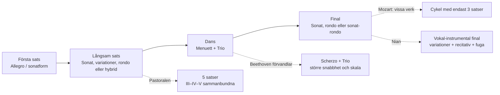
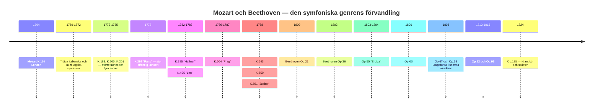
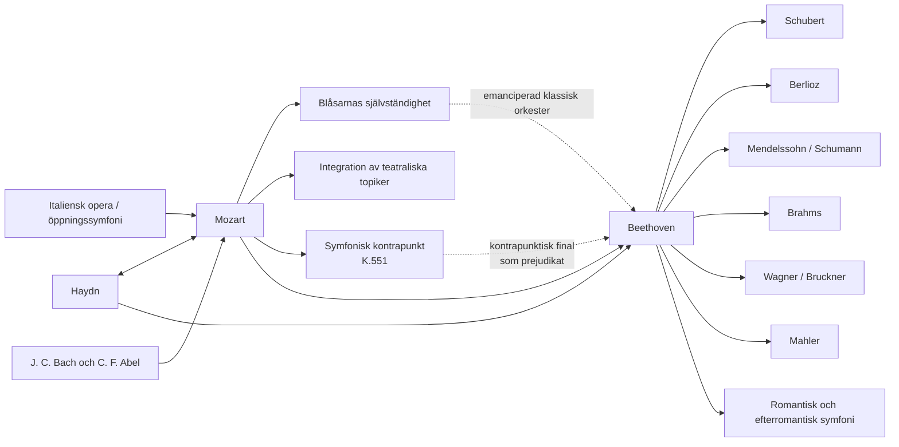

<!-- Translation of: research/sources/author-supplied/beethoven-mozart-symphonic-form.md; source commit: 304d75ed6ff646d311fd9df8b4e2db0d4dee277a -->
# Beethoven och Mozart: katalog, form, historia, reception och arv av symfonierna

## Sammanfattning

**Wolfgang Amadeus Mozarts** och **Ludwig van Beethovens** symfoniska banor tillhör samma historiska båge, men representerar olika ögonblick i symfonins konsolidering. Mozart följde praktiskt taget genrens hela förvandling, från den korta italienska symfonin i tre satser och operaouvertyren på 1760-talet till den stora wienska konsertsymfonin på 1780-talet. Beethoven övertog från Haydn och Mozart en redan högt sofistikerad genre och byggde upp den på nytt kring monumental skala, dramatisk kontinuitet, intensiv motivisk bearbetning, expansiva kodor, långsiktiga tonala konflikter och slutligen införandet av den mänskliga rösten i Nian. Själva Mozarteumstiftelsen beskriver Mozarts utveckling från en ursprungligen standardiserad orkester — två oboer, två horn och stråkar, med trumpeter/pukor vid festliga tillfällen — till en bredare wiensk sats, med flöjt, klarinetter och fagotter alltmer självständiga. citeturn20view2turn25search0

Det finns en grundläggande asymmetri mellan katalogerna. **Beethoven skrev nio numrerade och autentiska symfonier**, motsvarande Opp. 21, 36, 55, 60, 67, 68, 92, 93 och 125. citeturn22search1 För Mozart är "41 symfonier" en historisk konvention, inte motsvarigheten till en modern kritisk katalog. De gamla nr 2 och 3 är inte av Mozart; nr 37 är i allt väsentligt Michael Haydns symfoni MH 334, till vilken Mozart lade inledande material; dessutom finns autentiska symfonier utan traditionellt nummer, symfoniska versioner av uvertyrer och serenader, verk av tvivelaktig autenticitet och förlorade symfonier. Den nya **Köchel-Verzeichnis**, utgiven 2024 — den första fullständiga nyutgåvan sedan 1964 — uppdaterade dateringar, källor och attribueringar i ljuset av nyare forskning. citeturn6search0turn7view0turn13search0turn25search2

Formanalysen visar en skillnad i betoning, inte en enkel motsättning mellan "melodisk Mozart" och "motivisk Beethoven". Mozart kan arbeta med extraordinär motivisk ekonomi — framför allt i symfonierna nr 40 och 41 — men tenderar att bygga stora former genom **pluralitet av topiker, karaktärskontraster, dialog mellan instrumentfamiljer, kontrapunkt och omtolkning av operagester**. Beethoven driver en minimal cells förmåga att generera struktur längre: det paradigmatiska exemplet är Femman, där en rytmisk figur på fyra toner genomsyrar olika tematiska funktioner och infogar sig i en global bana från c-moll till C-dur. *Eroican*, Femman, Pastoralen och Nian utvidgar själva definitionen av den symfoniska cykeln. Nyare studier insisterar dock på att den beethovenska revolutionen måste förstås som en förvandling av paradigm som redan fanns hos Haydn och Mozart, inte som skapelse ex nihilo. citeturn17search6turn17search10

Hos Mozart är tre stora vändpunkter särskilt tydliga: **symfoni nr 25 i g-moll, K. 183**, med kontrapunktisk intensitet och exceptionellt mörk orkestrering; **"Paris", K. 297**, tänkt för en stor offentlig konsert och en orkester som innefattade klarinetter; och sekvensen **"Haffner"–"Linz"–"Prag"–nr 39–40–"Jupiter"**, där skala, blåsarsjälvständighet, kromatik och kontrapunktisk integration når en ny nivå. Mozarts brev av den 9 juli 1778 bekräftar både den enorma publika framgången för "Paris" och kontroversen om dess Andante, som av direktören Joseph Legros ansågs överdrivet modulatoriskt; Mozart skrev en andra version av satsen. citeturn30view0turn31view0

Hos Beethoven bildar de nio verken en särskilt avslöjande sekvens: Ettan leker ännu medvetet med haydnsk-mozartska förväntningar; Tvåan utvidgar skala och retorik; Trean förändrar radikalt proportioner och kodans funktion; Fyran förfinar ambiguitet och humor; Femman skapar en tidigare oöverträffad cyklisk kontinuitet; Sexan omvandlar cykeln till fem programmatiska "scener"; Sjuan gör rytmen till strukturerande princip; Åttan återbesöker ironiskt 1700-talsmodeller; och Nian förvandlar symfonin till en instrumental-vokal syntes. Beethoven-Haus historiska sidor dokumenterar dessa geneser, uruppföranden och revisioner utifrån autografer, skisser, förstautgåvor och samtida källor. citeturn4search0turn3search0turn4search1turn4search3turn3search2turn3search3turn5search0

För kritiska studier är de säkraste editoriska referenserna **Neue Mozart-Ausgabe (NMA), serie IV, grupp 11**, med dess tio symfonivolymer och kritiska rapporter, och för Beethoven både de ur **Neue Beethoven-Gesamtausgabe** härledda, av Henle utgivna partituren och den kritiska urtextutgåvan av **Jonathan Del Mar** för Bärenreiter. citeturn10search3turn22search0turn22search1 I inspelningar vinner en jämförande studie på att ställa historiskt informerade framföranden vid sidan av den stora moderna symfoniska traditionen: för Mozart är Trevor Pinnock/The English Concert en fullständig HIP-referens; för Beethoven erbjuder John Eliot Gardiner/Orchestre Révolutionnaire et Romantique och Nikolaus Harnoncourt/Chamber Orchestra of Europe två olika sätt att nytänka artikulation, storlek, balans och retorik i ljuset av historisk forskning. citeturn23search1turn23search6turn23search2turn23search23

## Omfång, källor, terminologi och attribueringsproblem

**Katalogkriterium.** För Beethoven är "fullständig symfonikatalog" entydigt: nio fullbordade och numrerade symfonier. För Mozart skiljer denna rapport fyra skikt: de 41 verken i den traditionella numreringen; ytterligare verk som ingår i NMA:s symfoniska serie; symfoniska versioner härledda ur operor eller serenader; samt oäkta, tvivelaktiga, fragmentariska eller förlorade verk. NMA fördelar Mozarts symfonier på tio volymer i serie IV/11, utgivna bland andra av Gerhard Allroggen, Wilhelm Fischer, Hermann Beck, Christoph-Hellmut Mahling, Friedrich Schnapp, Günter Haußwald, László Somfai och H. C. Robbins Landon. citeturn10search3turn10search0turn10search1turn10search2turn11search0turn11search1turn11search2turn12search0turn12search1

**Köchel mot opus.** Numret **K. eller KV** (*Köchel-Verzeichnis*) är den normala musikvetenskapliga identifieraren för Mozarts verk. Uttrycket "opus" utgör ingen systematisk Mozartkatalog: vissa historiska utgåvor tilldelade utgivna samlingar editoriska opustal, men de har inte den funktion som opustal har hos Beethoven. Därför anges "Op." i Mozarttabellen som **ej tillämpligt**. Den online-Köchel som Mozarteumstiftelsen för närvarande återger härrör ur den nya utgåvan 2024 och kan ge vidare eller andra dateringar än dem som den sjätte upplagan befäste; K. 183 är till exempel i dag officiellt daterad inom ett spann från mars 1773 till maj 1775, även om äldre litteratur vanligen placerar den specifikt hösten 1773. citeturn7view0turn25search3

**Autenticitetsstatus.** Den gamla symfoni nr 3, historiskt K. 18, är nu katalogiserad som **KV Anh. A 51**, ett bestyrkt verk av **Carl Friedrich Abel**, inte av Mozart. citeturn13search0 Nr 2, K. 17/Anh. C 11.02, tillhör inte heller Mozarts autentiska korpus och attribueras i modern bibliografi till Leopold Mozart. Den gamla nr 37, K. 444/425a, är för närvarande katalogiserad som **KV Anh. A 53 / MH 334**, en symfoni av Michael Haydn med Mozarts medverkan. citeturn16search0turn25search2 K. 84 är ett exempel på ett fall som av den nya Köchel ännu uttryckligen klassificeras som av **"tvivelaktig autenticitet"**; gamla källor attribuerar det omväxlande till Wolfgang, Leopold Mozart och Dittersdorf. citeturn25search1

**Form.** Termer som "sonatform" används här analytiskt. I 1760-talets symfonier kan "sonatform" vara anakronistiskt om därmed förstås 1800-talets skolmodell. I många förstasatser är det mer precist att tala om **binär sonatform eller tidig sonat**, där exposition, rekapitulation och genomföring ännu inte äger de proportioner och funktioner som vi finner på 1780-talet. Symfonins egen historia visar en övergång från italienska uvertyrmodeller och binära strukturer till en alltmer differentierad organisation av de fyra satserna. Den moderna litteraturen om den klassiska symfonin betonar just denna historiska pluralitet. citeturn17search4turn17search8

**Orkestrering.** I Mozarts tidiga symfonier är den typiska kärnan stråkar, två oboer och två horn; trumpeter och pukor förekommer framför allt i festliga verk. Vid hovet i Salzburg kunde flöjtister och oboister vara samma musiker, en faktor som bidrar till att förklara varför flöjter och oboer inte alltid förekommer samtidigt. Under Wienperioden blir klarinetter och fagotter självständiga stämmor i långt högre grad. citeturn25search0turn20view2 Beethoven börjar inom denna klassiska värld, men omvandlar successivt horn, trumpeter, pukor och träblås till formala aktörer, kulminerande i Femmans, Sexans och Nians klangliga utvidgningar.

Flödesschemat nedan sammanfattar **en arketyp**, inte en stel regel:

Denna formala genealogi motsvarar den historiska bild som NMA dokumenterar för Mozart och de kritiska källorna till Beethovens nio symfonier. citeturn10search0turn10search1turn12search1turn4search3turn5search0

## Katalog, kronologi, uruppföranden och dokumentära källor

**Katalogtabell — Beethoven.**

| Symfoni | Tonart | Komposition | Katalog | Uruppförande / första kända framförande | Medverkande och noter |
|---|---|---:|---|---|---|
| Nr 1 | C-dur | 1799–1800 | **Op. 21** | 2 apr. 1800, Hofburgtheater/Burgtheater, Wien | Akademi anordnad av Beethoven; programmet innefattade Mozart, Haydn, en pianokonsert och Beethovens septett. citeturn4search0 |
| Nr 2 | D-dur | 1800–1802 | **Op. 36** | 5 apr. 1803, Theater an der Wien | Första säkert dokumenterade offentliga framförande, i en beethovensk akademi; möjligt tidigare privat framförande. citeturn3search0 |
| Nr 3 "Eroica" | Ess-dur | 1803–1804 | **Op. 55** | privat för Lobkowitz, 1804; offentlig 7 apr. 1805, Theater an der Wien | Lobkowitzs orkester vid de första framförandena; definitiv dedikation till furst Lobkowitz. citeturn4search1turn2search5turn2search17 |
| Nr 4 | B-dur | 1806 | **Op. 60** | sannolikt mars 1807, palatset Lobkowitz, Wien | Privat framförande knutet till huset Lobkowitz; dedicerad till greve Franz von Oppersdorff. citeturn3search1 |
| Nr 5 | c-moll | 1804–1808 | **Op. 67** | 22 dec. 1808, Theater an der Wien | Beethoven dirigerade den berömda, cirka fyra timmar långa akademin; improviserad orkester och svåra förhållanden. citeturn2search0turn4search2 |
| Nr 6 "Pastoral" | F-dur | 1807–1808 | **Op. 68** | 22 dec. 1808, Theater an der Wien | Samma akademi som Femman; i programmet presenterades Pastoralen före symfonin i c-moll. citeturn4search3turn2search0 |
| Nr 7 | A-dur | 1811–1812 | **Op. 92** | 8 dec. 1813, Wiens universitet | Välgörenhetskonsert dirigerad av Beethoven, tillsammans med *Wellingtons seger*; stor framgång. citeturn3search2 |
| Nr 8 | F-dur | 1812 | **Op. 93** | 27 feb. 1814, Redoutensaal, Wien | Beethoven dirigerade; programmet innefattade även Sjuan och *Wellingtons seger*. citeturn3search3 |
| Nr 9 | d-moll | 1822–1824; skisser sedan 1815 | **Op. 125** | 7 maj 1824, Kärntnertortheater, Wien | Michael Umlauf utövade den effektiva ledningen medan Beethoven stannade på scenen; Henriette Sontag, Caroline Unger, Anton Haizinger och Joseph Seipelt bildade solokvartetten. citeturn5search0turn2search19 |

Dateringen av Tvåan förtjänar en korrigering av en mycket spridd biografisk berättelse: Beethoven-Haus betonar att en väsentlig del av verket redan var tänkt före det berömda Heiligenstadttestamentet, vilket gör det förenklat att tolka dess ysterhet som ett direkt "svar" på 1802 års kris. citeturn3search0 Sjuan är i sin tur dokumenterad genom autografen med "1812 Aug. 13" och uruppfördes i Napoleonkrigens kontext, vid ett välgörenhetsevenemang. citeturn3search2

**Katalogtabell — Mozart, historisk numrering 1 till 41.** "—" vid uruppförande betyder att ett specifikt första framförande inte kan återvinnas dokumentärt med säkerhet; detta är särskilt vanligt för Salzburgverken, av vilka många skrevs för hovbruk utan individuell uruppförandedokumentation. citeturn25search0

| Historiskt nr | Tonart | Ungefärligt / aktuellt datum | Köchel | Op. | Uruppförande eller identifierbart första framförande | Status |
|---|---|---|---|---|---|---|
| 1 | Ess | 1764 | **K. 16** | — | London, 21 feb. 1765 | autentisk. citeturn10search0turn21search16 |
| 2 | B | ca 1765 | **K. 17 / Anh. C 11.02** | — | — | **oäkta; attribuerad till Leopold Mozart**. citeturn16search0turn16search4 |
| 3 | Ess | 1764 | **K. 18; nu Anh. A 51** | — | verk av Abel | **Carl Friedrich Abel**, inte Mozart. citeturn13search0 |
| 4 | D | 1765 | **K. 19** | — | — | autentisk. citeturn10search0 |
| 5 | B | 1765 | **K. 22** | — | sannolikt Haagperioden; exakt uruppförande osäkert | autentisk. citeturn10search0 |
| 6 | F | 1767 | **K. 43** | — | — | autentisk. citeturn10search0 |
| 7 | D | 1768 | **K. 45** | — | — | autentisk. citeturn10search0 |
| 8 | D | 1768 | **K. 48** | — | — | autentisk. citeturn10search0 |
| 9 | C | ca 1769–72 | **K. 73 / 75a** | — | — | autentisk; historisk kronologi reviderad. citeturn10search0 |
| 10 | G | 1770 | **K. 74** | — | — | autentisk. citeturn10search1 |
| 11 | D | 1770 | **K. 84 / 73q** | — | — | **tvivelaktig autenticitet**. citeturn25search1 |
| 12 | G | 1771 | **K. 110 / 75b** | — | — | autentisk. citeturn10search1 |
| 13 | F | 1771 | **K. 112** | — | — | autentisk. citeturn10search1 |
| 14 | A | 30 dec. 1771 | **K. 114** | — | — | autentisk; officiellt autografdatum. citeturn25search0 |
| 15 | G | 1772 | **K. 124** | — | — | autentisk. citeturn10search1 |
| 16 | C | 1772 | **K. 128** | — | — | autentisk. citeturn10search2 |
| 17 | G | 1772 | **K. 129** | — | — | autentisk. citeturn10search2 |
| 18 | F | 1772 | **K. 130** | — | — | autentisk. citeturn10search2 |
| 19 | Ess | 1772 | **K. 132** | — | — | autentisk; alternativ till långsamma satsen bevarade. citeturn10search2 |
| 20 | D | 1772 | **K. 133** | — | — | autentisk. citeturn10search2 |
| 21 | A | 1772 | **K. 134** | — | — | autentisk. citeturn10search2 |
| 22 | C | 1773 | **K. 162** | — | — | autentisk. citeturn11search0 |
| 23 | D | traditionellt 1773; aktuell katalog medger vidare spann | **K. 181** | — | — | autentisk. citeturn14search3 |
| 24 | B | 1773 | **K. 182** | — | — | autentisk. citeturn11search0 |
| 25 | g-moll | traditionellt 1773; nu: mars 1773–maj 1775 | **K. 183 / 173dB** | — | — | autentisk; 4 horn. citeturn25search3 |
| 26 | Ess | 1773 | **K. 184 / 161a** | — | — | autentisk. citeturn11search0 |
| 27 | G | ca 1773 | **K. 199 / 161b** | — | — | autentisk. citeturn11search0 |
| 28 | C | ca 1773–75 | **K. 200 / 189k** | — | — | autentisk; gammalt datum på autografen problematiskt. citeturn25search4 |
| 29 | A | 1774 | **K. 201 / 186a** | — | — | autentisk. citeturn11search1 |
| 30 | D | 1774 | **K. 202 / 186b** | — | — | autentisk. citeturn11search1 |
| 31 "Paris" | D | juni 1778 | **K. 297 / 300a** | — | **18 juni 1778, Concert Spirituel, Tuilerierna, Paris** | autentisk; Concert Spirituels orkester; Joseph Legros ledde institutionen. citeturn21search13turn30view0 |
| 32 | G | 26 apr. 1779 | **K. 318** | — | — | autentisk; kontinuerlig struktur i tre avsnitt. citeturn11search2turn17search20 |
| 33 | B | 1779; senare revisioner | **K. 319** | — | — | autentisk. citeturn11search2 |
| 34 | C | 1780 | **K. 338** | — | — | autentisk; tre satser. citeturn11search2 |
| 35 "Haffner" | D | 1782; reviderad 1783 | **K. 385** | — | **23 mars 1783, Burgtheater, Wien** | Mozart dirigerade sin akademi; ursprung i festmusik för familjen Haffner. citeturn27search21turn27search17turn27search32 |
| 36 "Linz" | C | 30 okt.–början av nov. 1783 | **K. 425** | — | **4 nov. 1783, Linz teater** | hastigt skriven för en av greve Thun annonserad konsert. citeturn31view1turn27search8 |
| 37 | G | ca 1783–84 | gamla **K. 444/425a; nu Anh. A 53 / MH 334** | — | version i samband med Linzvistelsen | **Michael Haydn; Mozarts bidrag i inledningen**. citeturn25search2turn27search8 |
| 38 "Prag" | D | 6 dec. 1786 | **K. 504** | — | **19 jan. 1787, Prag, teater då förbunden med National-/Ståndsteatern** | Mozart ledde konserten. citeturn27search6turn27search10 |
| 39 | Ess | **26 juni 1788** | **K. 543** | — | specifikt uruppförande **ej säkert identifierat** | autentisk. citeturn14search2turn28search9 |
| 40 | g-moll | **25 juli 1788**; senare version med klarinetter | **K. 550** | — | osäkert privat uruppförande; dokumenterbara/sannolika framföranden 1791 | autentisk, två versioner. citeturn14search0turn28search16 |
| 41 "Jupiter" | C | **10 aug. 1788** | **K. 551** | — | specifikt uruppförande ej bevarat | autentisk; Mozarts sista symfoni. citeturn20view2turn28search9 |

"Paris" utgör det bäst dokumenterade fallet av omedelbar reception bland Mozarts förwienska symfonier. Familjekorrespondensen noterar framgången vid Concert Spirituel; Leopold gratulerade uttryckligen sin son, och Mozart skrev att verket mottagits "ojämförligt väl". Samma brev visar att Mozart tänkte strategiskt om offentliga effekter, den parisiska publikens förväntningar och till och med ersättandet av den långsamma satsen. citeturn31view2turn31view0

Genesen till "Linz" är likaledes exceptionellt väldokumenterad. Den 31 oktober 1783 skrev Mozart till Leopold att greve Thun annonserat en konsert till den 4 november och att han, eftersom han inte tagit med sig någon symfoni, arbetade "med full fart" på en ny. Brevet är primärevidens för kompositionens extraordinärt komprimerade omständigheter. citeturn30view1turn31view1

**Relevanta ytterligare symfonier och versioner utanför serien 1–41.**

| Verk | Tonart | Ungefärligt datum | Kritisk situation |
|---|---|---:|---|
| K. Anh. 223 / 19a | F | ca 1765 | ingår i NMA bland de tidiga symfonierna. citeturn10search0 |
| K. Anh. 221 / 45a, "Gamla Lambach" | G | ca 1766 | traderad i NMA; historiskt föremål för attribueringsdebatt. citeturn10search0 |
| K. Anh. 214 / 45b | B | ca 1768 | problematisk attribuering; kritiskt upptagen i NMA. citeturn10search0 |
| K. 75 | F | ca 1771 | traditionell nr 42; autenticitet omstridd. citeturn10search1turn16search4 |
| K. 76 / 42a | F | 1760-talet | traditionell nr 43; attribuering omstridd. citeturn10search0turn16search4 |
| K. 81 / 73l | D | 1770 | traditionell nr 44; attribuering omstridd. citeturn10search1 |
| K. 95 / 73n | D | ca 1770 | traditionell nr 45; attribuering omstridd. citeturn10search1 |
| K. 96 / 111b | C | ca 1771 | traditionell nr 46; attribuering omstridd. citeturn10search1 |
| K. 97 / 73m | D | ca 1770 | traditionell nr 47; attribuering omstridd. citeturn10search1 |
| K. 111 + K. 120 / 111a | D | 1771 | symfonisk version knuten till uvertyren till *Ascanio in Alba*; traditionell nr 48. citeturn10search1 |
| Uvertyr K. 126 + K. 161/163 | D | 1772 | symfonisk version knuten till *Il sogno di Scipione*; känd som nr 50. citeturn10search2 |
| Uvertyr K. 196 + K. 121 / 207a | D | 1774–75 | symfonisk version bildad av uvertyr + final. citeturn11search1 |
| Uvertyr K. 208 + K. 102 / 213c | C | 1775 | **ofullständig** symfonisk version knuten till *Il re pastore*. citeturn11search1 |
| Symfonisk version av K. 204 / 213a | D | 1775 | serenadreduktion. citeturn9view1 |
| Symfonisk version av K. 250 / 248b, "Haffnerserenad" | D | 1776 | serenadreduktion; det ursprungliga festverket spelades för familjen Haffner den 21 juli 1776. citeturn14search4turn9view1 |
| Symfonisk version av K. 320, "Posthorn" | D | 1779 | serenadreduktion. citeturn9view1 |
| K. 409 | C | tidigt 1780-tal | isolerad symfonisk menuett, **ingen fullständig symfoni**. citeturn12search2 |
| K. Anh. 220 / 16a, "Odense" | a-moll | historiskt attribuerad till den unge Mozart | starkt problematisk autenticitet; måste stanna utanför den säkra kärnan. citeturn16search4 |
| K. Anh. 216 / 74g | B | osäkert | traditionell nr 54; tvivelaktig. citeturn16search4 |
| K. Anh. 214 / 45b | B | osäkert | traditionell nr 55; tvivelaktig. citeturn16search4 |
| K. 98 / Anh. C 11.04 | F | osäkert | traditionell nr 56; tvivelaktig/oäkta attribuering. citeturn16search4 |

Det finns också hänvisningar till **förlorade symfonier** — däribland K. 19b och diverse gamla poster i Köchels bihang — för vilka det inte finns tillräckligt material för en fullständig formanalys. Själva den officiella katalogen noterar att Mozart skulle ha skrivit cirka femton symfonier under den stora Europaresan 1763–66 och att flera gick förlorade. citeturn20view2turn16search0

**Syntetisk tidslinje:**

Kronologin visar att den "klassiska symfonin" inte är en frusen modell: mellan K. 16 och K. 551 genomlöper Mozart mer än två decennier av institutionella och stilistiska förändringar, medan Beethoven på bara cirka tjugofyra år omvandlar detta arv till en genre med allt större estetisk ambition. citeturn20view2turn4search0turn5search0

## Formal anatomi och sats-för-sats-analys

I detta avsnitt betyder "SF" **sonatform**; "bin./son." betecknar en binärform vars logik redan föregriper sonatförfaranden; "T–D" betyder rörelse från tonika till dominant och "T–rel." den typiska gången till parallelldur i mollverk. Identifieringarna är analytiska läsningar av de kritiska partituren; klassiska satser medger ofta mer än en försvarbar formtolkning. NMA levererar den kritiska grundtexten för Mozart och Henle/Bärenreiter-utgåvorna den moderna motsvarigheten för Beethoven. citeturn10search3turn22search0turn22search1

**Beethoven, symfoni nr 1 i C-dur, Op. 21.** Förstasatsen börjar med ett avsiktligt desorienterande *Adagio molto*: i stället för att omedelbart bekräfta C-dur projicerar Beethoven harmonier som låter som dominanter till angränsande regioner, framför allt en dominant till F, och förlänger därmed vägran av tonikan. *Allegro con brio* etablerar slutligen C-dur och använder en sonatform av haydnsk profil, men med större dynamisk aggressivitet, skalor och blåsaccentuering. Genomföringen fragmenterar cellerna och utforskar modulerande sekvenser före återvinningen av tonikan. **II, Andante cantabile con moto**, i F-dur, är en lyrisk sonat där imitation och lätt kontrapunkt samexisterar med diskret integrerade trumpeter och pukor — ovanlig besättning för den konventionella bilden av en "delikat långsam sats". **III, Menuetto: Allegro molto e vivace**, nominellt en menuett, är funktionellt ett scherzo: för snabbt, synkoperat och energetiskt för instabilt för den traditionella aristokratiska dansen. **IV** börjar med ett långsamt inledningsskämt där C-skalan avslöjas ton för ton; *Allegro molto e vivace* omvandlar gesten till en sonatfinal av haydnsk snabbhet och humor. Verket överger alltså inte Haydn och Mozart: det gör kunskapen om detta vokabulär till villkoret för att störa lyssnarens förväntningar. citeturn4search0turn22search9

**Symfoni nr 2 i D-dur, Op. 36.** **I, Adagio molto – Allegro con brio**, utvidgar avsevärt den långsamma inledningen, med utflykter till mollvarianten, kromatik och ackord av ambig funktion före den ystra SF:n i D. Genomföring och koda överskrider redan Ettans gängse proportioner; kodan upphör att vara blott bekräftelse och börjar delta i bearbetningen. **II, Larghetto, A-dur**, är en utsträckt lyrisk sonatform: långa utsirade fraser samexisterar med imitation och en högst differentierad träblåspalett. **III heter uttryckligen Scherzo**, vilket konsoliderar ersättandet av menuetten i den beethovenska symfonicykeln; plötsliga kontraster i dynamik och register är konstitutiva för formen. **IV, Allegro molto**, föds ur ett abrupt, nästan groteskt motiv som fungerar som återkommande signal; formen blandar sonat- och rondoegenskaper och kulminerar i en extraordinärt lång koda, som föregriper den strukturella betydelse kodan kommer att få i *Eroican*. citeturn3search0turn22search5

**Symfoni nr 3 i Ess-dur, Op. 55, "Eroica".** **I, Allegro con brio**, eliminerar den långsamma inledningen: två fortissimo Ess-ackord startar omedelbart ett tema byggt på tonikans arpeggio. Nästan genast destabiliserar dock ett tonartsfrämmande ciss det harmoniska fältet. Expositionen innehåller inte bara "tema 1/tema 2", utan ett nät av tematiska grupper, synkoperade rytmer och metriska konflikter. Genomföringen är kolossal: den fragmenterar celler, skapar dissonanskedjor och presenterar berömt nytt material i e-moll. Den berömda skenbart "för tidiga" horninsatsen nära rekapitulationen intensifierar den temporala ambiguiteten. Kodan fungerar som en **andra genomföring** och bygger upp materialet på nytt i stället för att blott sluta. **II, Marcia funebre: Adagio assai**, i c-moll, förenar marsch-, rondo- och ternär/variationell arkitektur; episoder i C-dur och fugerade avsnitt omvandlar marschen till en kollektiv process av klagan och återuppbyggnad. **III, Scherzo**, ersätter definitivt menuettens sällskaplighet med snabbhet, överraskning och spänning; Trion ger **tre horn** spektakulär prominens, en signifikant utvidgning av sektionen. **IV** är en syntes av variation, fuga och finallogik över material som Beethoven redan använt i *Prometeus skapelser* och andra stycken: den börjar från temats bas innan den presenterar dess melodiska yta och underkastar det kontrapunktiska och lyriska förvandlingar. Den avgörande innovationen är inte bara "varaktighet": det är omvandlingen av hela cykeln till ett stort dimensionerat dramatiskt argument. citeturn4search1turn17search6turn22search11

**Symfoni nr 4 i B-dur, Op. 60.** **I** börjar med ett *Adagio* vars förtunnade textur och ursprungligen dystra förlopp får B-durstonikan att framstå som avlägsen; explosionen av *Allegro vivace* upplöser denna suspension och inleder en extraordinärt rörlig SF byggd på skalor, arpeggion och rytmiska förskjutningar. **II, Adagio i Ess**, är strukturerad av en punkterad ackompanjemangsrytm som blir lika viktig som melodierna; klarinett och andra träblåsare vinner stark tematisk personlighet. **III, Allegro vivace**, är ett utvidgat femdelat scherzo — scherzo–trio–scherzo–trio–scherzo — ett förfarande som Beethoven kommer att återanvända i Sjuan. **IV, Allegro ma non troppo**, är ett sextondels-*perpetuum mobile*: stråkarnas virtuositet punkteras av komiska blåsinkast, däribland det berömda fagottögonblicket. Fyran demonstrerar att beethovensk innovation inte är liktydigt med gigantism: här ligger den i ambiguitet, rytm, snabbhet och ironi. citeturn3search1

**Symfoni nr 5 i c-moll, Op. 67.** I **I, Allegro con brio**, får kort-kort-kort-lång-cellen inte förstås bara som ett "tema": den är en **rytmisk generator** som genomlöper överledningar, ackompanjemang, tutti och koda. Expositionen utgår från c-moll och styr mot Ess-dur; genomföringen reducerar texturen till allt mindre fragment. I rekapitulationen suspenderar ett oväntat, nästan kadensartat oboesolo tillfälligt drivet. Kodan övertar åter genomföringsfunktion. **II, Andante con moto, Ass-dur**, alternerar två tematiska komplex i en process av **dubbelvariationer**; fanfarepisoder i C-dur börjar föregripa finalens triumftonart. **III, Allegro, c-moll**, förvandlar rytmiskt förstasatsens cell i hornen; trion är fugerad och energisk. Vid återkomsten reduceras scherzot till en vålnad i *pianissimo*, och en lång dominant leder **utan avbrott** till finalen. **IV, Allegro, C-dur**, lägger piccolo, kontrafagott och tromboner till orkestermassan; förvandlingen från c-moll till C-dur blir samtidigt en formal och klanglig händelse. Ett minne av scherzot före rekapitulationen etablerar sann cyklisk hågkomst. Femman är därför mindre en bokstavlig berättelse om "ödet" än en extraordinär studie i motivisk integration, kontinuitet mellan satserna och globalt dimensionerad tonalitet. citeturn4search2turn17search3

**Symfoni nr 6 i F-dur, Op. 68, "Pastoral".** Beethoven förser de fem satserna med titlar och betonar att det snarare handlar om känslo-uttryck än bokstavlig målning. **I, "Uppvaknande av glada känslor vid ankomsten till landet"**, är en SF i F-dur vars nyhet ligger i extensiva upprepningar av små moduler, långa stabila harmoniska fält och subdominantisk/plagal betoning; målet är mindre teleologisk konflikt än en känsla av varaktighet. **II, "Scen vid bäcken", B-dur**, håller en vågformig figur i sammansatt meter under träblåsmelodier; i slutet identifierar Beethoven uttryckligen näktergal, vaktel och gök i flöjt, oboe och klarinett. **III, "Lustigt lag av landsfolk"**, är ett scherzo där accentdeformationer och en karikatyr av ett bykapell ersätter menuettens elegans. Utan konventionell kadens avbryts festen av **IV, "Åskväder", f-moll**, en nästan helt processuell sats: tremolon, kromatik, förminskade septackord, pukor, piccolo och tromboner skapar kontinuerlig intensifiering. Åskvädret upplöses direkt i **V, "Herdars sång; glada och tacksamma känslor efter stormen"**, i F-dur, en hybrid av rondo, sonat och pastoralhymn, dominerad av plagala kadenser och ett koralartat tema. De tre sista satserna bildar en oavbruten följd, ett viktigt prejudikat för romantiska programmatiska cykler. citeturn4search3turn17search3

**Symfoni nr 7 i A-dur, Op. 92.** **I, Poco sostenuto – Vivace**, äger en av Beethovens största långsamma inledningar: uppåtgående skalor och hållna ackord leder genom regioner som C och F innan en repeterad ton blir pulsen i *Vivace* i 6/8. Den följande SF:n styrs av en obsessiv punkterad figur. **II, Allegretto, a-moll**, börjar med ett ackord och ett rytmiskt ostinato vars återkomst bär variationer, kontrapunktisk överlagring och en episod i A-dur; stämmornas progression skapar en nästan arkitektonisk ackumulationsprocess. **III, Presto**, ställer scherzot i F-dur, en i förhållande till A oväntad tonart; trion i D-dur hörs två gånger och skapar åter en femdelad form. **IV, Allegro con brio**, i A-dur, driver rytmisk upprepning, synkoper och ostinati till en nästan fysisk grad; dess långa koda intensifierar dominant och repeterad bas före upplösningen. Adornos senare anmärkning att Sjuan skulle vara "symfonin par excellence" citeras av Beethoven-Haus som ett index över dess kritiska fortuna. citeturn3search2turn17search7

**Symfoni nr 8 i F-dur, Op. 93.** **I, Allegro vivace e con brio**, träder direkt in i F-dur, men dess skenbara "klassiska normalitet" undergrävs av förskjutna accenter, falska metriska hierarkier och en oproportionerligt kraftfull koda. **II, Allegretto scherzando, B-dur**, ersätter den långsamma satsen med en rytmisk miniatyr byggd på blåspulser; traditionen som direkt knyter den till Mälzels metronom måste behandlas med försiktighet, då anekdoten är senare och problematisk. **III, Tempo di Menuetto**, är en avsiktligt arkaiserande menuett, långsam och tung jämfört med beethovenska scherzon. **IV, Allegro vivace**, bildar den strukturella humorns höjdpunkt: ett mot F-dur våldsamt främmande ciss återkommer som harmoniskt problem; i den immensa kodan utforskar Beethoven dess omtolkning och avlägsna utflykter före den finala bekräftelsen av tonikan. Åttan är bara ytligt "bakåtsträvande": den är en metakritik av klassiska förfaranden. citeturn3search3

**Symfoni nr 9 i d-moll, Op. 125.** **I, Allegro ma non troppo, un poco maestoso**, börjar inte med en färdig melodi, utan med öppna kvinter och fragment som tycks stiga ur det obestämda tills de kristalliserar d-moll; sonatformen omvandlar denna "födelse" till en rekurrent princip, och genomföring/koda expanderar materialet våldsamt. **II, Molto vivace**, ställer scherzot före den långsamma satsen; det fugerade temat i d-moll och pukexplosionerna balanseras av en trio i D-dur, snabbare och pastoral. **III, Adagio molto e cantabile, B-dur**, bearbetar två huvudområden/idéer genom ornamental variation och expansion, inklusive kontraster i D-dur och fanfarepisoder. **IV** börjar med en explosiv dissonans och instrumentala recitativ av celli och kontrabasar som "tillbakavisar" reminiscenser av de tre föregående satserna. Först då träder, i D-dur, den enkla melodin till "Ode till glädjen" fram, först i stråkbasarna; därpå följer instrumentala variationer, barytonens inträde, kör, "turkisk" marsch med slagverk, fuga, högtidlig episod över "Seid umschlungen, Millionen", kontrapunktisk kombination av idéerna och en enorm koda. Innovationen är inte bara "att använda kör": den består i att själva finalen får dramatisera den rent instrumentala symfonins otillräcklighet och bygga en ny form ur recitativ, variation, marsch, fuga, hymn och symfonisk klanglighet. citeturn5search0turn22search7

**Mozart — kompakt analys av den numrerade korpusen.** Tonartsföljderna nedan förtätar förloppet sats för sats; i flera tidiga verk är "tidig sonat" medvetet att föredra framför en stel skolmässig läsning. Titlar och satsorganisation är dokumenterade genom NMA:s symfoniska volymer. citeturn10search0turn10search1turn10search2turn11search0turn11search1turn11search2turn12search0turn12search1

| Symfoni | Sats för sats och formal läsning | Orkestrering, motiv och innovation |
|---|---|---|
| **Nr 1, K.16** | I Ess, *Molto allegro*, bin./son.; II c-moll, *Andante*, binär; III Ess, *Presto*, snabb binärform/tidig sonat. | Stråkar + oboer/horn. Den långsamma satsens gång till parallellmoll för in oväntad tyngd i ett barnsligt Londonverk; starkt inflytande från J. C. Bach/Abel-miljön. citeturn10search0 |
| **Nr 2, K.17** | Traditionell struktur i B, men **får inte analyseras som Mozart**. | Attribueringen till Mozart är tillbakavisad; den kvarstår endast av historiografiska skäl. citeturn16search0 |
| **Nr 3, gamla K.18** | Snabb–långsam–snabb-cykel i Ess; galant idiom och tematisk transparens. | Det är en symfoni av **C. F. Abel**, kopierad av den unge Mozart. Dess intresse ligger just i att visa en av de modeller gossen studerade. citeturn13search0 |
| **Nr 4, K.19** | I D, Allegro, bin./son.; II G, Andante; III D, Presto. | Tre satser och enkla harmoniska trajektorier T–D/T–SD, typiska för den första Londonperioden. citeturn10search0 |
| **Nr 5, K.22** | I B; II Ess; III B. Snabb–långsam–snabb-format. | Starkare periodiserade fraser och orkestrala svar; assimilering av Europaresans internationella stil. citeturn10search0 |
| **Nr 6, K.43** | I F, tidig SF; II C, Andante; III F, Menuett/Trio; IV F, Allegro. | Antagandet av fyra satser för verket närmare den österrikisk-tyska modellen; menuetten blir del av cykeln. citeturn10search0 |
| **Nr 7, K.45** | D–G–D–D; Allegro / Andante / Menuett / Allegro. | Festlighet i D-dur, fanfarer och klara kadenser; jämvikt mellan italienskt och wienskt. citeturn10search0 |
| **Nr 8, K.48** | D–G–D–D, fyra satser. | Starkt ceremoniell profil; kontraster av tutti/stråk- och blåsskikt. citeturn10search0 |
| **Nr 9, K.73** | C–F–C–C; fyra satser. | Festlig Salzburgmodell; kadenser och sekvenser vinner större bredd. citeturn10search0 |
| **Nr 10, K.74** | G, långsamt/subdominantiskt avsnitt förbundet med cykeln, snabb återkomst i G. | Särskilt nära relation till den italienska uvertyren och till sammanbundna satser. citeturn10search1 |
| **Nr 11, K.84** | D–G–D, tre satser. | Troligen mozartskt idiom, men motsägelsefull tradering hindrar säker attribuering. citeturn25search1 |
| **Nr 12, K.110** | G–C–G–G. | Fyra satser; innerstämmor och viola vinner vikt gentemot de första modellernas continuobas. citeturn10search1 |
| **Nr 13, K.112** | F–B–F–F. | Större motivisk energi i tuttina, med klar motsättning mellan stråkperioder och blåsförstärkningar. citeturn10search1 |
| **Nr 14, K.114** | A–D–A–A. | Rymligare verk; aktivare inre kontrapunkt. Aktuella Köchel daterar den precist till 30 dec. 1771. citeturn25search0 |
| **Nr 15, K.124** | G–C–G–G. | Salzburgsk syntes mellan uvertyrglans och hövisk menuett. citeturn10search1 |
| **Nr 16, K.128** | C–G–C, tre satser. | Återgång till det italienska formatet; kompakta, starkt kadenserande snabba yttersatser. citeturn10search2 |
| **Nr 17, K.129** | G–C–G, tre satser. | Agil textur och större differentiering av den andra tematiska gruppen. citeturn10search2 |
| **Nr 18, K.130** | F–B–F–F. | Fyra satser; utsträckning och blåssats visar redan avståndet från föregående decenniums miniatyrer. citeturn10search2 |
| **Nr 19, K.132** | Ess–B–Ess–Ess; alternativ version av långsamma satsen bevarad. | Existensen av alternativa satser gör verket särskilt viktigt för studiet av revision och karaktärsval. citeturn10search2 |
| **Nr 20, K.133** | D–A–D–D. | D-durglans, med större självständighet hos innerstämmorna och dynamisk kontrast. citeturn10search2 |
| **Nr 21, K.134** | A–D–A–A. | Raffinerad textur, mindre beroende av ren ceremoniell effekt. citeturn10search2 |
| **Nr 22, K.162** | C–F–C, tre satser. | Kompakt, teatralisk och nära operauvertyrens gest. citeturn11search0 |
| **Nr 23, K.181** | D–G–D, tre avsnitt/satser av teatralisk impuls. | Snabb gestisk kontinuitet; aktuella Köchel ger ett vidare datum än den gamla kronologin. citeturn14search3 |
| **Nr 24, K.182** | B–Ess–B, tre satser. | Galant klarhet förenad med större tuttikraft. citeturn11search0 |
| **Nr 25, K.183** | I g-moll, SF; II Ess, långsam i utvidgad SF/binärform; III g-moll, Menuett, Trio i G-dur; IV g-moll, SF. | Två oboer, två fagotter, **fyra horn** och stråkar; synkoper, språng, tremolon, kontrapunkt och dynamik förlänar ovanlig tyngd. citeturn25search3 |
| **Nr 26, K.184** | Ess – c-moll – Ess, tre sammanbundna eller nära besläktade satser. | Teateruvertyrens dramaturgi; den långsamma satsen i c-moll förmörkar det tonala centrumet radikalt. citeturn11search0 |
| **Nr 27, K.199** | G–D–G. | Lätt framtoning, men tematisk bearbetning och innerstämmor flexiblare än i de första symfonierna. citeturn11search0 |
| **Nr 28, K.200** | C–F–C–C. | I källorna tillgängliga trumpeter och ceremoniell karaktär; växande interaktion mellan fanfar och lyrik. citeturn25search4 |
| **Nr 29, K.201** | I A, SF; II D, Andante; III A, Menuett; IV A, SF i 6/8. | En av de första mogna symfonierna: kontrapunkt, imitation och motiv återkommer under olika funktioner; finalen förenar dans och genomföring. citeturn11search1 |
| **Nr 30, K.202** | D–A–D–D. | Större rytmisk energi och expansion av den fyrsatsiga formen; glans ännu förbunden med Salzburgkontexten. citeturn11search1 |
| **Nr 31, K.297 "Paris"** | I D, monumental SF; II G, Andante — två versioner; III D, Allegro/SF. | Flöjter, oboer, **klarinetter**, fagotter, horn, trumpeter, pukor och stråkar: exempellös skala hos Mozart. Inledningstutti och *piano–forte*-kontraster utnyttjar medvetet den parisiska publiken. citeturn21search13turn31view0 |
| **Nr 32, K.318** | Allegro spiritoso i G → kontrasterande Andante → återkomst av inledningstempot i G, utan normal separat cykel. | Hybrid av uvertyr och symfoni, som koncentrerar exposition, långsam kontrast och snabb återkomst i en kontinuerlig båge. citeturn11search2turn17search20 |
| **Nr 33, K.319** | B–Ess–B–B. | Kammarmusikalisk blåsbalans och större bearbetning av överledningarna; cykeln reviderades. citeturn11search2 |
| **Nr 34, K.338** | I C, SF; II F, Andante di molto; III C, snabb final; **ingen menuett**. | Koncentrerad och briljant; kontrasten mellan yttre grandezza och inre lyrik föregriper Wiendecenniet. citeturn11search2 |
| **Nr 35, K.385 "Haffner"** | I D, SF; II G, Andante; III D, Menuett/Trio; IV D, Presto. | Det inledande unisonomotivet dominerar I; för den symfoniska versionen utvidgade Mozart blåsarna. Final av *buffa*-energi; Mozart bad att den skulle spelas så snabbt som möjligt. citeturn27search25turn27search17 |
| **Nr 36, K.425 "Linz"** | I Adagio–Allegro spiritoso, C, SF; II F, Andante/SF; III C, Menuett; IV C, Presto/SF. | Första stort dimensionerade långsamma inledning i en mogen Mozartsymfoni; "högtidlig" kromatik och retorik för verket närmare Haydn. citeturn12search3turn27search20 |
| **Nr 37, K.444/Anh.A53** | Struktur i allt väsentligt av Michael Haydn i G, med mozartskt inledningsbidrag. | Får inte användas som exempel på "Mozarts symfoniska stil" utan författarkvalifikation. citeturn25search2 |
| **Nr 38, K.504 "Prag"** | I D, **Adagio–Allegro**, SF; II G, Andante/SF; III D, Presto/SF. | Ingen menuett, men större skala än många fyrsatsiga symfonier. Kontrapunktisk täthet, synkoper och nästan operamässig blåsbehandling. citeturn12search0turn17search5 |
| **Nr 39, K.543** | I Ess, Adagio–Allegro, SF; II Ass, Andante con moto; III Ess, Menuett; IV Ess, Allegro/SF. | **Inga oboer**: flöjt, klarinetter och fagotter skapar ett särskilt mjukt timbre. Menuetttrion gör klarinetten till protagonist av *Ländler*-karaktär. citeturn14search2turn12search1 |
| **Nr 40, K.550** | I g-moll, SF; II Ess, Andante/SF; III g-moll, Menuett, Trio G; IV g-moll, SF. | I:s upptakter och "suckar" fragmenteras oupphörligt; finalen skapar extrem kromatisk instabilitet. Det finns versioner med och utan två klarinetter. citeturn14search0turn12search1 |
| **Nr 41, K.551 "Jupiter"** | I C, Allegro vivace/SF; II F, Andante cantabile/SF; III C, Menuett; IV C, Molto allegro: SF + omvändbar kontrapunkt/fugato. | Final byggd av flera motiv, däribland **C–D–F–E**, kontrapunktiskt kombinerade i kodan; syntes av "lärd" stil och symfonisk retorik. citeturn20view2turn17search1 |

Vissa verk förtjänar utvidgning bortom tabellen.

I **K. 183** är tonarten g-moll inte blott en kod för "sorg". Förstasatsen hämtar energi ur synkoper, unisoni, tremolon och språng, medan fyra horn förstorar den harmoniska massan. Motsättningen g-moll–B-dur i expositionen följer tonika-parallellmönstret, men Mozart får återkomsten till moll att framstå som strukturellt nödvändig genom rytmisk insistens. Menuetten överger dansens socialt lätta karaktär och antar kontrapunktisk tyngd; Trion i G-dur erbjuder ett av få dekompressionsrum. Den aktuella officiella besättningen bekräftar två oboer, två fagotter, två hornpar och stråkar. citeturn25search3

**K. 201** är en avgörande punkt, eftersom raffinemanget inte beror på orkestral kraft. Öppningen verkar nästan kammarmusikalisk; imitation mellan violinerna, stämföring och små cellers återkomst skapar kontinuitet. I 6/8-finalen hindrar jakt/dans-topiken ingen allvarligt kontrapunktisk genomföring. Verket demonstrerar varför bilden av Mozart som kompositör av oberoende teman och Beethoven som genomföringens ende mästare är historiskt inadekvat. citeturn11search1turn17search4

**"Paris", K. 297**, är en uttryckligen ur det offentliga rummet orienterad komposition. Dess öppning utnyttjar *premier coup d'archet* — det stora tuttits koordinerade anslag — och den enorma blåsapparaten. Mozart var medveten om applådförväntningen under verket och kommenterar den i sina brev; efter förstasatsens framgång skrev han vidare att finalen började mjukt för att förbereda en tuttiinsats som kunde överraska publiken. Concert Spirituel-dokumentationen gör K. 297 till ett exceptionellt laboratorium för att förbinda form, effekt och konsertsociologi. citeturn21search13turn17search24turn31view0

**"Haffner", K. 385**, visar den omvända processen: ursprungligen festlig/serenadartad musik, nytänkt för konserten. Mozart strök material ur den ursprungliga formen och förstärkte vid förberedelsen av verket för Wien yttersatsernas instrumentering med flöjter och klarinetter. I förstasatsen återkommer den stora öppningsgesten i oktaver obsessivt i olika kontexter; genomföringen beror inte på det vanliga sättet av ett kontrasterande lyriskt "andra tema". Akademin den 23 mars 1783 började sannolikt med de tre första satserna och slutade med finalen, så att symfonin inramade hela konserten. citeturn27search17turn27search25

I **"Linz", K. 425**, omvandlar den långsamma inledningen ett på kortast tid skrivet verk till en symfoni av exceptionellt bred retorik. Kromatisk harmonik och punkterade rytmer skapar högtidlighet innan Allegrot i C-dur bekräftar den festliga karaktären. Andantet i F-dur integrerar ovanlig textur och täthet; det avslutande Prestot förlägger teatralisk livlighet i en rigorös sonatform. Att verket tillkom mellan konsertens annonsering och den 4 november 1783 stöds direkt av Mozarts brev. citeturn31view1turn27search8

**"Prag", K. 504**, är ett produktivt formalt paradox: endast tre satser, men större dimension och komplexitet än många fyrsatsiga symfonier. Den stora Adagioinledningen etablerar ett fält av kromatisk spänning; Allegrot använder synkoper, imitatoriska insatser och stämlagring, ofta med ett driv som påminner om teatersatsen i *Le nozze di Figaro*. Elaine Sisman har visat hur genre, gest och mening interagerar i verket och därmed destabiliserat idén att dess "innehåll" låter sig reduceras till en enda känsla. citeturn17search5turn12search0

I de **sista tre symfonierna**, komponerade mellan den 26 juni och den 10 augusti 1788, tycks Mozart utforska tre nästan komplementära lösningar på det symfoniska problemet: nr 39 privilegierar klanglig värme och klarinetter; nr 40 koncentrerar kromatik och oro i g-moll; nr 41 kulminerar i kontrapunktisk integration. Det finns ingen fast evidens för den gamla berättelsen att Mozart skulle ha skrivit dem som ett "testamente" redan i föregripande av döden. Framförandehistorien under hans livstid är själv delvis obskyr: källorna tillåter endast att med större säkerhet hävda framföranden av K. 550, medan andra konsertprogram nämner "en stor symfoni" utan tillräcklig identifikation. citeturn27search11turn28search9turn28search16

I **finalen till "Jupiter"** blir distinktionen mellan sonatform och fuga inadekvat om den tas som ett alternativ. Mozart skriver inte enkelt "en fuga": han disponerar flera subjekt och motiv inom en sonatarkitektur, använder omvändbar kontrapunkt, imitation och fugerade episoder och reserverar för kodan en extraordinär simultan kombination av materialet. Litteraturen om den "lärda stilen" och det sublima betonar just denna fusion av kontrapunktisk teknik med symfonisk teleologi, som skulle bli en referenspunkt för Beethoven och 1800-talet. citeturn17search1turn17search0

**Partitur och faksimil som ackompanjemang till analysen.** De på IMSLP tillgängliga historiska utgåvorna är mycket nyttiga för jämförande läsning, men **ersätter ingen modern kritisk utgåva**:

[IMSLP — Mozart, lista över symfonier och historiska numreringar](https://imslp.org/wiki/Template:Symphonies_(Mozart,_Wolfgang_Amadeus))

[IMSLP — Mozart, symfoni nr 40 i g-moll, K. 550](https://imslp.org/wiki/Symphony_No.40_in_G_minor%2C_K.550_(Mozart%2C_Wolfgang_Amadeus))

[IMSLP — Mozart, symfoni nr 41 i C-dur, K. 551](https://imslp.org/wiki/Symphony_No.41_in_C_major%2C_K.551_(Mozart%2C_Wolfgang_Amadeus))

[IMSLP — Beethoven, symfoni nr 5, Op. 67](https://imslp.org/wiki/Symphony_No.5%2C_Op.67_(Beethoven%2C_Ludwig_van))

[IMSLP — Beethoven, symfoni nr 9, Op. 125](https://imslp.org/wiki/Symphony_No.9%2C_Op.125_(Beethoven%2C_Ludwig_van))

NMA reproducerar också källor och varianter. Ett särskilt lärorikt exempel är det faksimil som bevarats i den kritiska utgåvan av den ur serenaden K. 320 härledda symfoniska versionen, där källans orkestrala notation kan observeras direkt. citeturn9view2

## Jämförelse, historisk reception och inflytande

**Jämförelsetabell över centrala karakteristika.**

| Verk / grupp | Form och skala | Motiv/genomföring | Harmonik | Orkestrering | Avgörande innovation |
|---|---|---|---|---|---|
| Mozart K.16–K.48 | 3–4 satser; binärform/tidig sonat | korta celler, periodicitet | T–D och nära subdominant | oboer, horn, stråkar | snabb internationell assimilering. citeturn10search0 |
| Mozart K.110–K.134 | stabilare 3–4 satser | mer imitation och kontinuitet | ännu koncis modulation | blåsare integrerade i tuttit | konsolidering av Salzburgstilen. citeturn10search1turn10search2 |
| Mozart K.183 | 4 satser | synkoper, pregnanta rytmer | g-moll ↔ parallell; kromatik | 4 horn + fagotter | ny "symfonisk" intensitet. citeturn25search3 |
| Mozart K.201 | 4 satser | kontrapunkt och motivisk ekonomi | klassiska relationer subtilt bearbetade | relativt lätt orkester | djup utan gigantism. citeturn11search1 |
| Mozart K.297 | 3 satser | gester tänkta för offentlig effekt | utvidgad modulation, framför allt i långsamma satsen | enorm blåssektion, klarinetter | anpassning till Pariskonserten. citeturn21search13turn31view0 |
| Mozart K.318 | kontinuerlig båge | strukturell tematisk återkomst | kontrast G–subdominantregion–G | teatralisk | uvertyr/symfoni-fusion. citeturn11search2 |
| Mozart K.385 | 4 satser | öppningsgesten dominerar I; teatralisk final | diatonisk klarhet + genomföring | blåsare förstärkta i revisionen | förvandling av festmusik till konsertsymfoni. citeturn27search25 |
| Mozart K.425 | 4 satser | större Allegroskala | kromatisk inledning → C-dur | trumpeter/pukor, självständiga blåsare | första stora mogna långsamma inledning. citeturn27search20 |
| Mozart K.504 | 3 monumentala satser | kontrapunkt och synkopering | intensiv expressiv kromatik | dialogiserande träblåsare | tre satser med "stor symfoni"-tyngd. citeturn17search5 |
| Mozart K.543 | 4 | tematisk multiplicitet | kromatik under lysande yta | klarinetter, **inga oboer** | orkesterfärg som formprincip. citeturn14search2 |
| Mozart K.550 | 4 | fragmentering av upptakter | g-moll, kromatik, avlägsna regioner | två versioner, andra med klarinetter | integration av harmonisk och motivisk oro. citeturn14search0 |
| Mozart K.551 | 4 | fem kombinerbara idéer | C/F och komplex tonal kontrapunkt | full festapparat | sonat + "lärd stil" i finalen. citeturn20view2turn17search1 |
| Beethoven Op.21 | 4 | aggressivare celler | inledningen undviker tonikan | mycket närvarande blåsare | explicit subversion av det klassiska. citeturn4search0 |
| Beethoven Op.36 | 4 | större genomföring/koda | utvidgad modulation | dynamisk expansion | nominellt scherzo och större skala. citeturn3search0 |
| Beethoven Op.55 | 4, monumental | kontinuerlig förvandling | dissonans och avlägsna regioner | 3 horn | koda som andra genomföring. citeturn4search1 |
| Beethoven Op.60 | 4 | ironi och *perpetuum mobile* | tonalt ambig inledning | högst individualiserade träblåssolon | femdelat scherzo. citeturn3search1 |
| Beethoven Op.67 | 4, satserna III–IV förbundna | nästan ubikvitär rytmisk cell | båge c-moll → C-dur | tromboner, piccolo, kontrafagott i finalen | cyklisk och tonal integration. citeturn4search2 |
| Beethoven Op.68 | **5** | repetitiva/figurativa moduler | stabilitet/plagalitet + kromatisk storm | "fåglar", tromboner/piccolo i stormen | program och kontinuerliga satser III–V. citeturn4search3 |
| Beethoven Op.92 | 4 | rytm som global princip | djärva mediant/subdominant-relationer | rytmiska massor + träblåsare | rytmisk organisations supremati. citeturn3search2 |
| Beethoven Op.93 | 4 | metrisk humor | disruptivt ciss i finalen | avsiktligt klassisk textur | parodi/reflektion över den klassiska stilen. citeturn3search3 |
| Beethoven Op.125 | 4, vokal final | cyklisk rekapitulation + variationer/fuga | d-moll → D-dur | utvidgad orkester + solister + kör | omdefinition av symfonins gränser. citeturn5search0 |

**Stil och motiv.** Mozart upprätthåller normalt ett större antal samexisterande topiker: marsch, *buffa*-opera, kantabilitet, jakt, dans, "lärd" kontrapunkt. Enhet föds ur sättet varpå dessa topiker sätts i dialog. Beethoven tenderar att göra cellernas **funktionella förvandling** mer explicit: material som ursprungligen är tema kan bli ackompanjemang, överledning, ostinato eller kodaelement. Skillnaden är dock gradvis. K. 550 fragmenterar kontinuerligt sin upptaktiga cell, och K. 551 underkastar diverse motiv en kontrapunktisk kombination lika rigorös som varje demonstration av beethovensk tematisk enhet. Den analytiska litteraturen om "Jupiter" betonar just att dess koda förändrar den retrospektiva perceptionen av hela finalen. citeturn17search1turn17search0

**Genomföring och koda.** Hos Mozart kan genomföringen vara kompakt och högst modulatorisk, men rekapitulationen är ofta det rum där relationen mellan topikerna skrivs om. Beethoven ger kodan extraordinär vikt: i *Eroican*, Femman och Åttan närmar den sig en andra genomföring, kapabel att införa nya kriser eller omformulera tidigare. Detta är ett av skälen till att analyser som endast mäter "exposition–genomföring–rekapitulation" underskattar den beethovenska innovationen. citeturn17search6turn17search10

**Harmonik.** Mozart använder ofta kromatik som expressiv intensifiering och stämföring: de långsamma satserna i K. 504, K. 550 och K. 551 är i denna mening särskilt rika. Beethoven betonar oftare **långt anlagda tonala trajektorier**: i Femman genomlöper konflikten c-moll/C-dur cykeln; i Nian ingår d-moll och D-dur i en lika omfattande förvandling. Skillnaden är inte att Mozart skulle vara "diatonisk" och Beethoven "kromatisk", utan att Beethoven ofta dramatiserar relationen mellan tonarter som cykelns globala minne. citeturn17search3turn5search0

**Orkestrering.** Mozart var avgörande för träblåsarnas emancipation. Nr 39 är praktiskt taget en demonstration av hur man utesluter oboerna och bygger en hel identitet kring flöjt, klarinetter och fagotter; nr 40 existerar i reviderad version med klarinetter; "Paris" utnyttjar en för hans tidigare repertoar exceptionellt stor orkester. citeturn14search2turn14search0turn21search13 Beethoven ärver denna träblåssjälvständighet och lägger till ett alltmer **strukturellt bruk av timbren**: tre horn i *Eroican*; tromboners, piccolos och kontrafagotts inträde i ögonblicket för Femmans tonala seger; liknande resurser i Sexans storm; röster och enorm apparat i Nians final. citeturn4search1turn4search2turn4search3turn5search0

**Mozartreception.** De flesta Salzburgsymfonierna cirkulerade inte brett under hans livstid, varför det vore anakronistiskt att föreställa sig en redan på 1700-talet existerande "kanon av de 41 symfonierna". citeturn25search0 "Paris" var däremot medvetet tänkt för en internationell offentlig institution och fick dokumenterade applåder. citeturn31view0turn31view2 "Haffner" blev en framgång vid Mozarts wienkonsert 1783. citeturn27search21turn27search32 "Prag" knöts till Mozarts extraordinära reception i staden och till *Le nozze di Figaro*s lokala popularitet. citeturn27search6turn27search10

Under 1800-talet fick de sista symfonierna alltmer status av kanoniska autonoma verk. "Jupiter" värderades särskilt som en syntes av det "sublima" och kontrapunktisk teknik, medan K. 550 kom att höras enligt romantiska kategorier av tragedi, oro och interioritet. Neal Zaslaws och Elaine Sismans forskning var central för att förskjuta diskussionen från förenklade emotionella biografier till institutionell kontext, framförandepraxis, källor, retorik och receptionshistoria. citeturn28search1turn17search0turn17search5

**Beethovenreception.** **E. T. A. Hoffmanns recension av Femman**, publicerad 1810 i *Allgemeine musikalische Zeitung* och senare omformad, blev en grundtext för romantisk musikestetik: Beethoven representerar hädanefter musikens instrumentala förmåga att suggerera en värld bortom det verbalt föreställbara. Marta Kawanos studie på portugisiska visar betydelsen av denna recension för formeringen av det romantiska begreppet instrumental autonomi. citeturn18search3

*Eroican* förvandlades gradvis, framför allt under 1800-talet, till ett epokdelande landmärke. Moderna studier relativiserar dock denna berättelse: det "heroiska" vokabuläret existerade redan i den tidigare symfoniska diskursen, och Mozart och Haydn hade frambringat modeller av grandezza, sublimitet och instrumentalt drama. *Eroican* uppfinner inte varje komponent, utan förändrar radikalt deras skala och strukturella relation. citeturn17search6turn17search14

Sjuan fick 1813 en extraordinär omedelbar reception och blev snabbt populär; Åttan, långt ironiskare och strukturellt ambiguare, överskuggades historiskt av sina grannar Sjuan och Nian. citeturn3search2turn3search3 Nian förvärvade en status som överstiger den strikt musikaliska historien: den blev modell för idén om symfonin som filosofiskt och kollektivt utsaga och provocerade dessutom ett centralt problem för 1800-talet — **hur skriver man en symfoni efter Beethoven utan att enkelt imitera Beethoven?** Tyngden av detta arv förklarar både Berlioz', Bruckners och Mahlers symfoniska expansion och den hos Brahms förnimbara formala ängslan. Beethovenbibliografin förstår denna process som del av symfonins förvandling till 1800-talskonsertkulturens privilegierade genre. citeturn17search10turn22search5

**Relationer och inflytanden:**

Abels närvaro i diagrammet är särskilt konkret: det en gång "Mozarts symfoni nr 3" kallade verket är i verkligheten en Abelsymfoni som Mozart kopierade, och visar materiellt hur den unge kompositören lärde genom appropriering och studium av modeller. citeturn13search0 NMA och Köchel demonstrerar också genomsläppligheten mellan genrer hos Mozart — uvertyrer omvandlade till symfonier och serenader reducerade för konsert — vilket problematiserar varje historia enligt vilken symfonin från början skulle ha varit en autonom och "absolut" genre. citeturn10search1turn10search2turn9view1

I Brasilien importerade redan konstruktionen av konsertrepertoaren den kanoniska Mozart–Beethoven-centraliteten i den europeiska traditionen. Nyare brasilianska studier om universalism och kanon påpekar hur denna centralitet historiskt konstruerades och institutionaliserades, inte enkelt var det automatiska resultatet av ett "tidlöst" värde. citeturn18search16 Samtidigt demonstrerar den brasilianska litteraturen om Hoffmann och Beethoven samt om Mozart/Haydn existensen av en musikvetenskaplig produktion på portugisiska, kapabel att kritiskt dialogisera med den anglofona och germanska bibliografin. citeturn18search3turn18search0

## Kritiska utgåvor, historiskt informerat framförande och inspelningar för studium

För **Mozart** är den fundamentala textreferensen **Neue Mozart-Ausgabe, serie IV, grupp 11, *Sinfonien***. Volymerna får inte behandlas blott som "rena partitur": deras varianter, förord och kritiska rapporter är väsentliga när det finns alternativa versioner, daterings- eller besättningsproblem. K. 132 bevarar till exempel ett alternativ till den långsamma satsen; K. 297 har alternativa långsamma satser; K. 550 existerar i två orkestreringar. citeturn10search2turn11search1turn12search1

| Utgåva | Rekommenderad användning | Varför |
|---|---|---|
| **Neue Mozart-Ausgabe IV/11, vol. 1–10** | forskning, analys, källjämförelse | officiell kritisk-vetenskaplig utgåva; täcker symfonier, versioner och varianter. citeturn10search3 |
| **Köchel-Verzeichnis 2024 / Mozarteum** | datering, autenticitet, källor, besättning | integrerar den moderna revisionen av attribueringar och kronologi; första helt nya Köchel sedan 1964. citeturn7view0 |
| **Bärenreiter/NMA-framförandematerial** | repetition och framförande | håller direkt relation till NMA:s kritiska text. citeturn10search3 |
| **IMSLP, gamla utgåvor** | historisk jämförelse och fri läsning | excellent accessresurs, men får vid relevanta textvarianter inte segra över NMA. citeturn16search4 |

För **Beethoven** finns två särskilt nyttiga moderna editionsfamiljer. Utgåvan av **Jonathan Del Mar för Bärenreiter**, först utgiven 1996 till 2000, byggdes som en kritisk urtextutgåva av de nio symfonierna; förlaget självt noterar att Nian 1997 inledde projektet och att de övriga utgavs därefter. citeturn22search2turn22search18 Henle ger ut urtextstudiepartitur byggda på texten i **Beethovens samlade utgåva / Neue Beethoven-Gesamtausgabe**, med olika utgivare beroende på verk. citeturn22search1turn22search3

| Utgåva | Rekommenderad användning | Anmärkning |
|---|---|---|
| **Bärenreiter, Jonathan Del Mar** | dirigering, framförande, artikulations/dynamik-jämförelse | en av de mest inflytelserika kritiska urtextutgåvorna under senare decennier. citeturn22search0turn22search2 |
| **Henle Urtext / Neue Beethoven-Gesamtausgabe** | analys och forskning | fickpartitur byggda på den nya samlade utgåvan, med editorisk apparat och förord. citeturn22search1turn22search9 |
| **Gesamtausgabens kritiska rapporter** | avancerade filologiska beslut | nödvändiga för varianter, korrigeringar och konflikter mellan autograf, stämmor, reviderade kopior och förstautgåvor. citeturn22search3turn22search7 |

Den av användaren föredragna utgåvan var **ospecificerad**; därför är rekommendationen för akademisk analys att konfrontera minst NMA/Köchel för Mozart och Del Mar/Henle-NGA för Beethoven, i stället för att dogmatiskt välja endast en editorisk linje.

Det **historiskt informerade framförandet (HIP)** är särskilt lärorikt i dessa verk, eftersom det förändrar variabler som berör formperceptionen: kortare artikulation, naturhorns- och naturtrumpetsansats, skinntimpani, annan balans mellan stråkar och blåsare, mindre kontinuerligt vibrato, noggrant iakttagande av repriser och omvärdering av tempi. Det finns dock ingen enda "autentisk klang": orkesterstorlek, continuo hos Mozart, vibratomängd, realisering av dynamik och tolkning av metriska angivelser förblir frågor om evidens och omdöme. Betydelsen av Zaslaws bok ligger just i att integrera kontext, reception och framförandepraxis, i stället för att behandla HIP som en blott regelsamling. citeturn28search1

**Mozart — prioriterade inspelningar för studium.**

**Trevor Pinnock / The English Concert — *The Symphonies*, Archiv Produktion.** Det är den första rekommendationen för en systematisk HIP-läsning, eftersom den tillåter att jämföra praktiskt taget hela den symfoniska utvecklingen inom en koherent interpretatorisk estetik: historiska instrument, klara ansatser, kontrapunktisk transparens och livliga dansrytmer. Deutsche Grammophon/Archiv håller den fullständiga inspelningen i sin digitala katalog. citeturn23search1turn23search13 För studium lönar det sig särskilt att höra K. 183, 201, 297, 385, 425, 504, 543, 550 och 551 vid sidan av NMA.

**Christopher Hogwood / Academy of Ancient Music.** Den historiska fullständiga inspelningen bildar en annan referenspunkt för den första stora HIP-generationen; den är särskilt nyttig för att förnimma hur beslut om ensemblestorlek, repris, artikulation och bas förändrar de tidiga symfonierna, som i senare symfoniska traditioner ofta låter tunga. Som metodologisk kontroll är den värdefullare när den jämförs, inte tagen som "definitiv rekonstruktion".

**Nikolaus Harnoncourt i Mozart.** Hans läsningar med moderna eller hybrida historiskt informerade orkestrar är nyttiga som kontrapunkt till det rent "lätta" tillvägagångssättet: Harnoncourt betonar retorik, dissonans, attacker och innerstämmesartikulation och får K. 550 och K. 551 att låta mindre som klassiskt porslin och mer som dramatisk diskurs. Betydelsen av hans tillämpning av HIP-principer på moderna orkestrar erkänns av Warner självt i dokumentationen av hans karriär. citeturn23search11

För en **jämförelse med den mellaneuropeiska efterkrigstida symfoniska traditionen** är inspelningar av Karl Böhm med Berlinerfilharmonikerna pedagogiskt nyttiga: inte för att de representerade "den sanna texten", utan för att de tillåter att höra legato, stråkmassor, vibrato och frasproportioner som dominerade en väsentlig del av 1900-talets inspelade reception. Deutsche Grammophons katalog bevarar hans symfoniska Mozart som en viktig del av denna tradition. citeturn23search16

**Beethoven — prioriterade inspelningar för studium.**

**John Eliot Gardiner / Orchestre Révolutionnaire et Romantique — fullständig inspelning.** För att studera Beethoven genom HIP-linsen är den sannolikt den mest effektiva referensen: historiska instrument, naturhorn och naturtrumpeter, energiska tempi, pregnant artikulation och stark exponering av innerstämmorna. Deutsche Grammophon/Archiv dokumenterar den fullständiga inspelningen och specifika utgåvor av 3–4, 5–6 och 7–8. citeturn23search6turn23search21turn23search9turn23search3 Hör särskilt hur övergången III–IV i Femman förändras när basen blir transparentare och naturblecket träder in i finalen.

**Nikolaus Harnoncourt / Chamber Orchestra of Europe — fullständig inspelning.** Här är intresset ett annat: övervägande moderna instrument, men ett djupt av retorik och historisk praxis informerat tillvägagångssätt. Den 1991 gjorda fullständiga inspelningen fick enligt Warner 1992 *Gramophone*-priserna *Orchestral* och *Recording of the Year*. citeturn23search23turn23search2 Den är särskilt produktiv för jämförelse med Gardiner: Harnoncourt bevarar en större modern symfonisk kropp medan han ifrågasätter konventionell artikulation, frasering och balans.

**Herbert von Karajan / Berliner Philharmoniker, 1960-talscykeln.** Som dokument över den moderna traditionen av hög orkestral homogenitet erbjuder den den nödvändiga kontrasten: täta stråkar, långa linjer, i en klangmassa integrerat bleck och pulskontinuitet. För en dirigerings- eller analysstudent ligger värdet just i att höra hur mycket samma partitur kan bygga en annan perceptiv arkitektur.

**Roger Norrington / London Classical Players** är lika viktig i den beethovenska HIP:ns historia för sitt systematiska försök att ta metronomangivelser, klassisk artikulation och restringerat vibrato på allvar. Han måste studeras komparativt: frågan om Beethovens metronomer väcker fortsatt debatt och löses inte genom att enkelt identifiera "snabbare" med "mer autentiskt".

En särskilt effektiv lyssningssekvens vore att höra **Mozart K. 551, Beethoven 1, Beethoven 3, Beethoven 5 och Beethoven 9** i vardera en HIP- och en modern tolkning. Den pedagogiska vinsten är omedelbar: man förnimmer hur tondur, stråk/blås-balans och artikulation kan synliggöra eller dölja motiviska relationer som i partituret förblir identiska.

## Annoterad bibliografi, primärkällor och forskningsresurser

**Internationale Stiftung Mozarteum. *Köchel-Verzeichnis*, nyutgåva, 2024; onlineversion.** Det är den första resurs som ska konsulteras för **autenticitet, datering, källor, besättning och aktuell numrering**. Nyutgåvan är den första fullständiga rekonstruktionen av katalogen sedan 1964 och korrigerar diverse traditionella kronologier. citeturn6search0turn7view0  
[Online-Köchelkatalog](https://kv.mozarteum.at/en/)

**Mozart, Wolfgang Amadeus. *Neue Mozart-Ausgabe*, serie IV, grupp 11: *Sinfonien*, vol. 1–10. Kassel: Bärenreiter.** Oumbärlig kritisk källa. Volymerna täcker från K. 16 till K. 551, inklusive varianter, symfoniska versioner av uvertyrer/serenader och problematiska attribueringsfall. De kritiska rapporterna måste konsulteras närhelst divergens råder mellan autograf, kopior och förstautgåvor. citeturn10search3turn10search0turn10search1turn10search2turn11search0turn11search1turn11search2turn12search0turn12search1

**Mozart, Wolfgang Amadeus. Brev och dokument, Digital Mozart Edition.** Detta är den viktigaste narrativa primärkällan för symfoniernas genes och reception. Brevet av den 9 juli 1778 beskriver framgången för "Paris", reaktionerna på Andantet och relationen till Joseph Legros; brevet av den 31 oktober 1783 noterar i realtid den hastiga kompositionen av "Linz". citeturn30view0turn31view0turn30view1turn31view1

**Zaslaw, Neal. *Mozart's Symphonies: Context, Performance Practice, Reception*. Oxford: Clarendon Press, 1989.** Sannolikt den enskilt viktigaste monografin för forskning med exakt denna rapports omfång. Dess förtjänst är att förena verkhistoria, källor, besättning, framförandeomständigheter, historisk praxis och reception; den samtida akademiska receptionen beskrev den som pionjärarbete över det symfoniska samlingsverket. citeturn28search1turn17search0

**Sisman, Elaine. *Mozart: The "Jupiter" Symphony*. Cambridge University Press.** Central studie av K. 551, som artikulerar historisk kontext, det sublima, struktur, frasrytm, retorik och reception. Monografins organisation visar att "Jupiter" behandlas inte bara som ett kontrapunktiskt stycke, utan som ett integralt historisk-estetiskt problem. citeturn17search0turn28search0

**Sisman, Elaine. "Genre, Gesture, and Meaning in Mozart's 'Prague' Symphony". I *Mozart Studies 2*.** Ett av de viktigaste analytiska arbetena om K. 504. Särskilt värdefullt för att övervinna den uteslutande "formalistiska" läsningen och förstå hur gester, genrer och kulturella förväntningar bär mening inom den symfoniska formen. citeturn17search5

**Range, Martin. "The 'Effective Passage' in Mozart's Paris Symphony". *Eighteenth-Century Music*.** Specialiserad studie av relationen mellan effekt, publik och teknik i K. 297; måste läsas tillsammans med Mozarts brev om Concert Spirituel. citeturn17search24turn31view0

**Keefe, Simon P. *Mozart in Vienna: The Final Decade*. Cambridge University Press, 2017.** Väsentlig för att kontextualisera K. 385, 425, 504 och de tre sista symfonierna i Wiens koncertekonomi. Särskilt viktig för frågan om de **okända uruppförandena av K. 543, 550 och 551**, då den omsorgsfullt skiljer dokumentär evidens från förmodan. citeturn28search9turn28search15

**Abert, Hermann. *W. A. Mozart*, utg. Cliff Eisen, övers. Stewart Spencer. Yale University Press.** Stor historisk-stilistisk biografi, i dag bäst använd i dialog med Zaslaw, Keefe och Köchel 2024, eftersom diverse kronologiska och attributiva slutsatser i den gamla traditionen reviderats. Nyare litteratur citerar den alltjämt som en viktig historiografisk referens. citeturn28search3

**Monteiro, Eduardo. "O espírito de Mozart pelas mãos de Haydn". *Estudos Avançados*, USP, 2020.** En källa på portugisiska, särskilt nyttig för att tänka Mozart–Haydn-relationen och det klassiska universumet utan att reducera kompositörerna till stilistiska karikatyrer. citeturn18search0

**Beethoven-Haus Bonn, digital verk- och källkatalog.** För varje symfoni samlar Beethoven-Haus kronologi, genes, dedikationer, autografer, skisser, förstautgåvor och uruppförandeinformation. För denna rapport var det den primära institutionella källan för de nio symfonierna. citeturn4search0turn3search0turn4search1turn3search1turn4search2turn4search3turn3search2turn3search3turn5search0

**Beethoven, Ludwig van. *The Nine Symphonies*, utg. Jonathan Del Mar. Bärenreiter Urtext.** En av de fundamentala moderna editoriska referenserna. Del Mar inledde serien med Nian, utgiven 1997, och fullbordade de övriga symfonierna under följande år; utgåvan konfronterar kritiskt de olika källorna i stället för att automatiskt perpetuera läsarter ur 1800-talsutgåvor. citeturn22search0turn22search2turn22search18

**Beethoven, Ludwig van. *The Symphonies*, Henle Urtext, byggd på Beethovens samlade utgåva.** De nio studiepartituren omfattar sammanlagt mer än tusen sidor och använder texten i den moderna samlade utgåvan, med utgivare som Jens Dufner, Bathia Churgin, Beate Angelika Kraus, Armin Raab och Ernst Herttrich. Särskilt nyttig för analytisk fickläsning och filologisk konsultation. citeturn22search1turn22search3

**Hoffmann, E. T. A. Recension av Beethovens femte symfoni, *Allgemeine musikalische Zeitung*, 1810.** Avgörande primärkälla för den romantiska Beethovenreceptionen. Får inte läsas bara som "konsertrecension", utan som dokument över instrumentalmusikens förvandling till en filosofisk-estetisk kategori. För brasilianska läsare är Kawanos diskussion en särskilt nyttig ingång. citeturn18search3

**Kawano, Marta. "E. T. A. Hoffmann e a música instrumental de Beethoven". *Literatura e Sociedade*, USP, 2012.** Bland de portugisiskspråkiga källorna i denna översikt en av de mest relevanta. Den förklarar genesen och omformningarna av Hoffmanns text och relaterar Femman till det romantiska begreppet instrumentalmusik. citeturn18search3

**Marx, Adolf Bernhard. Skrifter om Beethoven och *Eroican*, 1800-talet.** Avgörande primärkälla för att förstå hur Trean förvandlades till paradigmet för en "ny era". Modern forskning visar *Eroican*s centralitet i Marx' tänkande och problematiserar samtidigt hans historiska teleologi. citeturn17search14turn17search6

**Burnham, Scott. *Beethoven Hero*. Princeton University Press.** Inflytelserik studie av konstruktionen av Beethovens så kallade heroiska stil. Måste ställas vid sidan av senare forskning som relativiserar läsningen av *Eroican* som absolut brott och återvinner dess föregångare på 1700-talet. citeturn17search6

**Bonds, Mark Evan, och litteratur om beethovensk narration/form.** Tillvägagångssättet som tänker symfonin som argument, process och narrativ strategi är särskilt nyttigt för *Eroican*, Femman och Nian, där musikalisk mening beror på minnet av tidigare händelser och kodornas extraordinärt expanderade funktion. *Cambridge Companion to the Symphony* syntetiserar viktiga stråk av denna forskning. citeturn17search10

**Rivera, Benito V. och studier av rytmisk organisation i Sjuan.** Specialiserad forskning demonstrerar hur skenbart lokala beslut om rytm, taktupphävning och formal proportion påverkar makrostrukturen i Op. 92; ett nyttigt antidot mot den vaga idén att Sjuan enkelt är en "dansens apoteos". citeturn17search7

**Jämförande studie av Femman och Sexan i litteratur från University of California Press.** Särskilt viktig för att visa att de båda 1808 samuruppförda verken delar kompositoriska förfaranden, även när deras expressiva världar tycks motsatta. Detta hjälper till att ersätta den förenklade oppositionen "Femman = drama / Sexan = beskrivning" med en analys av gemensamma strukturella processer. citeturn17search3

**Rosen, Charles. *The Classical Style: Haydn, Mozart, Beethoven*.** Förblir oumbärlig för att förstå den av de tre kompositörerna delade tonala och formala grammatiken, men måste kompletteras med senare forskning om topiker, framförandepraxis, källor och socialhistoria. Dess stora nytta för detta ämne är att visa att Beethovens innovationer först blir fullt läsbara när vi precist förstår det klassiska system som Mozart och Haydn fulländade.

**IMSLP.** Exceptionellt repositorium för förstautgåvor, historiska utgåvor och fria partitur i tillämpliga jurisdiktioner. Det rekommenderas för att följa inspelningar och jämföra editionstraditioner, men inte för att ensamt lösa problem om autenticitet, version eller variant. Därtill måste Köchel/NMA och de kritiska urtextutgåvorna segra. citeturn16search4turn22search0

Den viktigaste historiografiska slutsatsen är att det **inte finns någon enskild linje "Mozart → Beethoven"**. Mozart absorberade J. C. Bach, Abel, italienska, österrikiska och franska stilar, Haydn och operapraxis; Beethoven ärvde både denne plurale Mozart och Haydn, gammal kontrapunkt, fransk opera och Wiens revolutionära offentliga kultur. Vad som förbinder deras symfonier är en process av genrens växande förmåga att bära minne, kontrast, genomföring och mening i stor dimension. Språnget mellan K. 16 och K. 551 är redan extraordinärt; det följande språnget mellan Beethovens etta och nia förändrar inte bara den symfoniska satsen, utan själva den kulturella plats som 1800-talet skulle tilldela symfonin. citeturn20view2turn17search1turn17search6turn17search10
