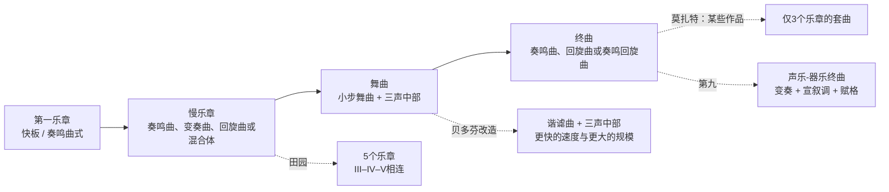
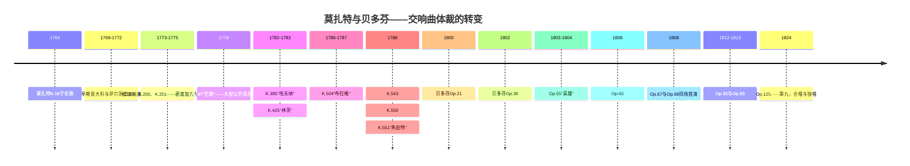
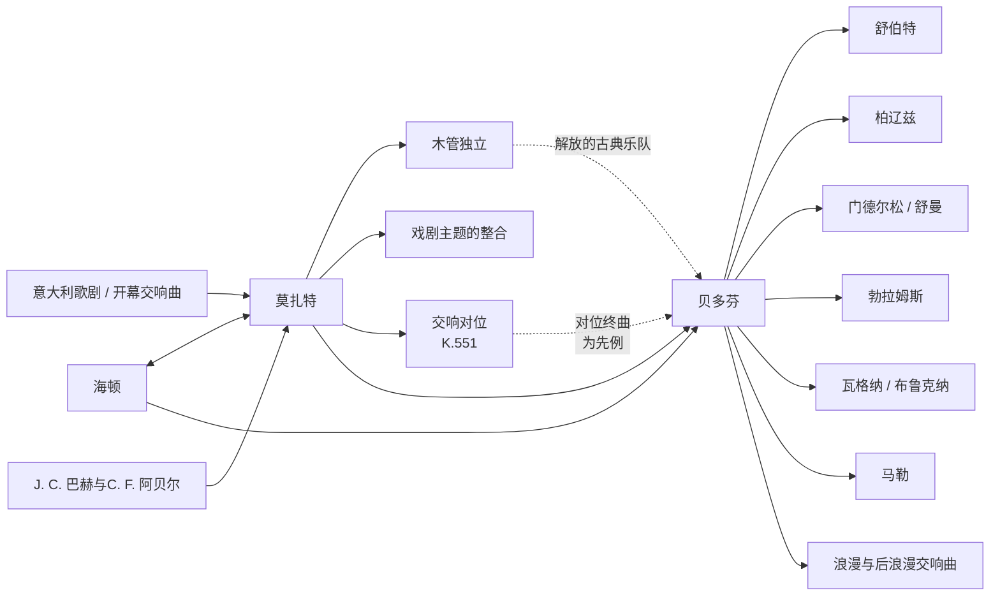

<!-- Translation of: research/sources/author-supplied/beethoven-mozart-symphonic-form.md; source commit: 304d75ed6ff646d311fd9df8b4e2db0d4dee277a -->
# 贝多芬与莫扎特：交响曲的目录、曲式、历史、接受与遗产

## 执行摘要

**沃尔夫冈·阿马德乌斯·莫扎特**与**路德维希·范·贝多芬**的交响曲轨迹属于同一历史弧线，但代表了交响曲确立过程中的不同时刻。莫扎特几乎伴随了该体裁的全部转变，从1760年代简短的三乐章意大利交响曲与歌剧序曲，到1780年代宏大的维也纳音乐会交响曲。贝多芬从海顿与莫扎特那里接过一个已高度精致的体裁，并围绕纪念碑性规模、戏剧连续性、集中的动机展开、扩展的尾声、长线条的调性冲突重建了它，最终在《第九》中纳入了人声。莫扎特基金会本身即描述了莫扎特从最初标准化的乐队——两支双簧管、两支圆号与弦乐，节庆场合加小号/定音鼓——演变为更宽广的维也纳写法，长笛、单簧管与巴松管日益独立。citeturn20view2turn25search0

两份目录之间存在根本的不对称。**贝多芬写了九部编号明确且真实无疑的交响曲**，对应于Opp. 21、36、55、60、67、68、92、93与125。citeturn22search1对莫扎特而言，"41部交响曲"是一个历史惯例，而非现代批判目录的等价物。旧编号第2与第3号并非莫扎特所作；第37号本质上是米夏埃尔·海顿的MH 334交响曲，莫扎特仅添加了引子材料；此外还有无传统编号的真实交响曲、源自序曲与小夜曲的交响曲版本、真伪存疑的作品以及已佚失的交响曲。新的**克歇尔目录（Köchel-Verzeichnis）**于2024年出版——这是自1964年以来第一次完整的全新版本——根据最新研究更新了年代、史料与归属。citeturn6search0turn7view0turn13search0turn25search2

曲式分析显示的是侧重点的差异，而非"旋律的莫扎特"与"动机的贝多芬"之间的简单对立。莫扎特能够以非凡的动机经济进行写作——尤其在第40与第41交响曲中——但倾向于通过**主题（topic）的多样性、性格对比、乐器族群之间的对话、对位以及歌剧手法的重新诠释**来构建大型曲式。贝多芬将最小细胞生成结构的能力推得更远：典范之例是《第五》，其中一个四音节奏型渗透于不同的主题功能之中，并嵌入从c小调到C大调的全局轨迹。《英雄》、《第五》、《田园》与《第九》扩展了交响曲套曲本身的定义。然而最新研究坚持认为，贝多芬革命应被理解为对海顿与莫扎特既有范式的改造，而非凭空创造。citeturn17search6turn17search10

在莫扎特处，三个重大转折点尤为清晰：**g小调第25交响曲，K. 183**，具有对位强度与异常阴暗的配器；**"巴黎"，K. 297**，为大型公开音乐会及包含单簧管的乐队而构思；以及**"哈夫纳"–"林茨"–"布拉格"–第39–40–"朱庇特"**序列，其中规模、木管独立性、半音体系与对位整合达到了新的水平。莫扎特1778年7月9日的信既证实了"巴黎"巨大的公开成功，也证实了关于其行板的争议——总监约瑟夫·勒格罗认为该乐章转调过度；莫扎特为该乐章写了第二个版本。citeturn30view0turn31view0

在贝多芬处，九部作品构成一个特别富有启示的序列：《第一》仍自觉地与海顿–莫扎特式的期待游戏；《第二》扩展了规模与修辞；《第三》彻底改变了比例与尾声的功能；《第四》提炼了含混与幽默；《第五》产生了前所未有的套曲连续性；《第六》将套曲变为五个标题性"场景"；《第七》使节奏成为结构原则；《第八》以反讽重访18世纪模式；而《第九》将交响曲变为器乐–声乐的综合。贝多芬之家的历史页面根据亲笔手稿、草稿、初版与同时代史料记录了这些作品的形成、首演与修订。citeturn4search0turn3search0turn4search1turn4search3turn3search2turn3search3turn5search0

对于批判性研读，最可靠的版本参考是**新莫扎特全集（NMA），第四系列，第11组**，及其十卷交响曲与批判报告；对贝多芬而言，则是亨乐出版的源自**新贝多芬全集（Neue Beethoven-Gesamtausgabe）**的乐谱，以及**乔纳森·德尔·马尔**为天鹅座（Bärenreiter）编辑的批判–原典版。citeturn10search3turn22search0turn22search1在录音方面，比较研究受益于将历史知情演奏置于宏大的现代交响传统之旁：对莫扎特，特雷沃·平诺克/英国协奏团是完整的HIP参考；对贝多芬，约翰·埃利奥特·加迪纳/革命浪漫乐团与尼古劳斯·哈农库特/欧洲室内乐团提供了在历史研究之光下重思奏法、规模、平衡与修辞的两种不同方式。citeturn23search1turn23search6turn23search2turn23search23

## 范围、史料、术语与归属问题

**目录标准。**对贝多芬而言，"完整交响曲目录"是明确的：九部完成且编号的交响曲。对莫扎特，本报告区分四个层面：传统编号的41部作品；NMA交响曲系列收录的附加作品；源自歌剧或小夜曲的交响曲版本；以及伪作、存疑、残篇或佚失作品。NMA将莫扎特交响曲分布于IV/11系列的十卷之中，编辑者包括格哈德·阿尔罗根、威廉·菲舍尔、赫尔曼·贝克、克里斯托夫-赫尔穆特·马林、弗里德里希·施纳普、京特·豪斯瓦尔德、拉兹洛·松法伊与H. C. 罗宾斯·兰登等人。citeturn10search3turn10search0turn10search1turn10search2turn11search0turn11search1turn11search2turn12search0turn12search1

**克歇尔对作品号。****K.或KV**号（*Köchel-Verzeichnis*）是莫扎特作品的常规音乐学标识。"作品号"一词不构成莫扎特的系统目录：某些历史版本曾为出版的曲集指定编辑性作品号，但它们不具有作品号在贝多芬处的功能。因此在莫扎特表中，"Op."栏记为**不适用**。莫扎特基金会目前呈现的在线克歇尔源自2024年新版，可能给出比第六版所确立者更宽或不同的年代；例如K. 183今日官方定年为1773年3月至1775年5月之间，而旧文献通常将其具体置于1773年秋季。citeturn7view0turn25search3

**真伪状态。**旧第3交响曲，历史上为K. 18，现编为**KV Anh. A 51**，是**卡尔·弗里德里希·阿贝尔**的确证作品，非莫扎特所作。citeturn13search0第2号，K. 17/Anh. C 11.02，亦不属于莫扎特真实作品集，现代书目将其归于利奥波德·莫扎特。旧第37号，K. 444/425a，现编为**KV Anh. A 53 / MH 334**，是米夏埃尔·海顿在莫扎特参与下写成的交响曲。citeturn16search0turn25search2K. 84是新克歇尔仍明确归类为**"真伪存疑"**之例；旧史料将其轮流归于沃尔夫冈、利奥波德·莫扎特与迪特斯多夫。citeturn25search1

**曲式。**"奏鸣曲式"等术语在此作分析性使用。在1760年代的交响曲中，若按19世纪学院模式理解，"奏鸣曲式"一说可能时代错置。在许多第一乐章中，更准确的说法是**二段奏鸣曲式或早期奏鸣曲**，其中呈示、再现与展开尚不具有我们在1780年代所见的比例与功能。交响曲自身的历史即显示了从意大利序曲模式与二段结构向日益分化的四乐章组织的过渡。关于古典交响曲的现代文献强调的正是这种历史多样性。citeturn17search4turn17search8

**配器。**在莫扎特早期交响曲中，典型核心是弦乐、两支双簧管与两支圆号；小号与定音鼓主要出现于节庆作品。在萨尔茨堡宫廷，长笛手与双簧管手可能是同一批乐手，这一因素有助于解释长笛与双簧管为何并非总是同时出现。在维也纳时期，单簧管与巴松管在远大得多的程度上成为独立声部。citeturn25search0turn20view2贝多芬起步于这个古典世界之内，但逐步将圆号、小号、定音鼓与木管变为曲式动因，终在《第五》、《第六》与《第九》中实现音色扩展的高峰。

下述流程图概括**一个原型**，而非僵硬的规则：

这一曲式谱系对应于NMA为莫扎特、贝多芬九部交响曲批判史料所记录的历史图景。citeturn10search0turn10search1turn12search1turn4search3turn5search0

## 目录、年表、首演与文献史料

**目录表——贝多芬。**

| 交响曲 | 调性 | 作曲时间 | 目录 | 首演 / 首见演出 | 演出者与注记 |
|---|---|---:|---|---|---|
| 第1号 | C大调 | 1799–1800 | **Op. 21** | 1800年4月2日，维也纳霍夫堡剧院/城堡剧院 | 贝多芬组织的学院音乐会；曲目包括莫扎特、海顿、一部钢琴协奏曲与贝多芬七重奏。citeturn4search0 |
| 第2号 | D大调 | 1800–1802 | **Op. 36** | 1803年4月5日，维也纳河畔剧院 | 首场确证的公开演出，在贝多芬学院音乐会上；可能有更早的私人演出。citeturn3search0 |
| 第3号"英雄" | 降E大调 | 1803–1804 | **Op. 55** | 1804年为洛布科维茨私人演出；1805年4月7日公开，维也纳河畔剧院 | 首演为洛布科维茨乐团；最终题献给洛布科维茨亲王。citeturn4search1turn2search5turn2search17 |
| 第4号 | 降B大调 | 1806 | **Op. 60** | 可能为1807年3月，维也纳洛布科维茨宫 | 与洛布科维茨府相关的私人演出；题献给弗朗茨·冯·奥珀斯多夫伯爵。citeturn3search1 |
| 第5号 | c小调 | 1804–1808 | **Op. 67** | 1808年12月22日，维也纳河畔剧院 | 贝多芬指挥了长约四小时的著名学院音乐会；临时乐团，条件艰难。citeturn2search0turn4search2 |
| 第6号"田园" | F大调 | 1807–1808 | **Op. 68** | 1808年12月22日，维也纳河畔剧院 | 与《第五》同一场学院音乐会；曲目单上《田园》排在c小调交响曲之前。citeturn4search3turn2search0 |
| 第7号 | A大调 | 1811–1812 | **Op. 92** | 1813年12月8日，维也纳大学 | 贝多芬指挥的义演音乐会，与《惠灵顿的胜利》同场；大获成功。citeturn3search2 |
| 第8号 | F大调 | 1812 | **Op. 93** | 1814年2月27日，维也纳红楼厅 | 贝多芬指挥；曲目亦包括《第七》与《惠灵顿的胜利》。citeturn3search3 |
| 第9号 | d小调 | 1822–1824；草稿始于1815 | **Op. 125** | 1824年5月7日，维也纳克恩特纳托尔剧院 | 米夏埃尔·乌姆劳夫实际指挥，贝多芬留在台上；亨丽埃特·松塔格、卡罗琳·翁格、安东·海青格与约瑟夫·赛佩尔特组成独唱四重唱。citeturn5search0turn2search19 |

《第二》的定年值得对一个广为流传的传记叙事作出修正：贝多芬之家强调，该作相当一部分在著名的《海利根施塔特遗嘱》之前即已构思，因此将其奔放解读为对1802年危机的直接"回应"是简单化的。citeturn3search0《第七》则由亲笔手稿"1812 Aug. 13"确证，在拿破仑战争背景下的义演活动中首演。citeturn3search2

**目录表——莫扎特，历史编号1至41。**首演栏的"—"表示无法以文献确证恢复某场具体的首演；这在萨尔茨堡作品中尤为常见，其中许多为宫廷使用而作，无单独的首演记录。citeturn25search0

| 历史编号 | 调性 | 近似 / 现行年代 | 克歇尔 | Op. | 首演或可辨识的首场演出 | 状态 |
|---|---|---|---|---|---|---|
| 1 | 降E | 1764 | **K. 16** | — | 1765年2月21日，伦敦 | 真作。citeturn10search0turn21search16 |
| 2 | 降B | 约1765 | **K. 17 / Anh. C 11.02** | — | — | **伪作；归于利奥波德·莫扎特**。citeturn16search0turn16search4 |
| 3 | 降E | 1764 | **K. 18；现为Anh. A 51** | — | 阿贝尔作品 | **卡尔·弗里德里希·阿贝尔**，非莫扎特。citeturn13search0 |
| 4 | D | 1765 | **K. 19** | — | — | 真作。citeturn10search0 |
| 5 | 降B | 1765 | **K. 22** | — | 可能为海牙时期；确切首演不详 | 真作。citeturn10search0 |
| 6 | F | 1767 | **K. 43** | — | — | 真作。citeturn10search0 |
| 7 | D | 1768 | **K. 45** | — | — | 真作。citeturn10search0 |
| 8 | D | 1768 | **K. 48** | — | — | 真作。citeturn10search0 |
| 9 | C | 约1769–72 | **K. 73 / 75a** | — | — | 真作；历史年表已修订。citeturn10search0 |
| 10 | G | 1770 | **K. 74** | — | — | 真作。citeturn10search1 |
| 11 | D | 1770 | **K. 84 / 73q** | — | — | **真伪存疑**。citeturn25search1 |
| 12 | G | 1771 | **K. 110 / 75b** | — | — | 真作。citeturn10search1 |
| 13 | F | 1771 | **K. 112** | — | — | 真作。citeturn10search1 |
| 14 | A | 1771年12月30日 | **K. 114** | — | — | 真作；官方亲笔年代。citeturn25search0 |
| 15 | G | 1772 | **K. 124** | — | — | 真作。citeturn10search1 |
| 16 | C | 1772 | **K. 128** | — | — | 真作。citeturn10search2 |
| 17 | G | 1772 | **K. 129** | — | — | 真作。citeturn10search2 |
| 18 | F | 1772 | **K. 130** | — | — | 真作。citeturn10search2 |
| 19 | 降E | 1772 | **K. 132** | — | — | 真作；慢乐章替代稿存世。citeturn10search2 |
| 20 | D | 1772 | **K. 133** | — | — | 真作。citeturn10search2 |
| 21 | A | 1772 | **K. 134** | — | — | 真作。citeturn10search2 |
| 22 | C | 1773 | **K. 162** | — | — | 真作。citeturn11search0 |
| 23 | D | 传统为1773；现行目录允许更宽范围 | **K. 181** | — | — | 真作。citeturn14search3 |
| 24 | 降B | 1773 | **K. 182** | — | — | 真作。citeturn11search0 |
| 25 | g小调 | 传统为1773；现为1773年3月–1775年5月 | **K. 183 / 173dB** | — | — | 真作；4支圆号。citeturn25search3 |
| 26 | 降E | 1773 | **K. 184 / 161a** | — | — | 真作。citeturn11search0 |
| 27 | G | 约1773 | **K. 199 / 161b** | — | — | 真作。citeturn11search0 |
| 28 | C | 约1773–75 | **K. 200 / 189k** | — | — | 真作；亲笔旧年代存疑。citeturn25search4 |
| 29 | A | 1774 | **K. 201 / 186a** | — | — | 真作。citeturn11search1 |
| 30 | D | 1774 | **K. 202 / 186b** | — | — | 真作。citeturn11search1 |
| 31"巴黎" | D | 1778年6月 | **K. 297 / 300a** | — | **1778年6月18日，巴黎杜乐丽宫灵魂音乐会** | 真作；灵魂音乐会乐团；约瑟夫·勒格罗主持该机构。citeturn21search13turn30view0 |
| 32 | G | 1779年4月26日 | **K. 318** | — | — | 真作；三段连续结构。citeturn11search2turn17search20 |
| 33 | 降B | 1779；后有修订 | **K. 319** | — | — | 真作。citeturn11search2 |
| 34 | C | 1780 | **K. 338** | — | — | 真作；三乐章。citeturn11search2 |
| 35"哈夫纳" | D | 1782；1783年修订 | **K. 385** | — | **1783年3月23日，维也纳城堡剧院** | 莫扎特指挥自己的学院音乐会；源于为哈夫纳家族的节庆音乐。citeturn27search21turn27search17turn27search32 |
| 36"林茨" | C | 1783年10月30日–11月初 | **K. 425** | — | **1783年11月4日，林茨剧院** | 为图恩伯爵宣布的音乐会仓促写成。citeturn31view1turn27search8 |
| 37 | G | 约1783–84 | 旧**K. 444/425a；现为Anh. A 53 / MH 334** | — | 与林茨逗留相关的版本 | **米夏埃尔·海顿；莫扎特参与引子**。citeturn25search2turn27search8 |
| 38"布拉格" | D | 1786年12月6日 | **K. 504** | — | **1787年1月19日，布拉格，当时与民族/等级剧院相关的剧场** | 莫扎特领衔音乐会。citeturn27search6turn27search10 |
| 39 | 降E | **1788年6月26日** | **K. 543** | — | 具体首演**未能确证** | 真作。citeturn14search2turn28search9 |
| 40 | g小调 | **1788年7月25日**；后有单簧管版本 | **K. 550** | — | 私人首演不详；1791年有可记录/可能的演出 | 真作，两版本。citeturn14search0turn28search16 |
| 41"朱庇特" | C | **1788年8月10日** | **K. 551** | — | 具体首演无存 | 真作；莫扎特最后的交响曲。citeturn20view2turn28search9 |

"巴黎"构成莫扎特维也纳之前交响曲中即时接受记录最完备的个案。家书记录了在灵魂音乐会的成功；利奥波德明确祝贺了儿子，莫扎特写道该作受到"无与伦比的好评"。同一封信显示莫扎特对公开效果、巴黎听众期待乃至慢乐章的替换作战略性思考。citeturn31view2turn31view0

"林茨"的形成过程同样记录得异常完备。1783年10月31日莫扎特致信利奥波德，称图恩伯爵已宣布11月4日的音乐会，因未随身携带交响曲，正"全速"赶写一部新作。该信是作曲环境极度压缩的一手证据。citeturn30view1turn31view1

**1–41系列之外相关的附加交响曲与版本。**

| 作品 | 调性 | 近似年代 | 批判状况 |
|---|---|---:|---|
| K. Anh. 223 / 19a | F | 约1765 | NMA收于早期交响曲中。citeturn10search0 |
| K. Anh. 221 / 45a，"旧兰巴赫" | G | 约1766 | NMA传承；历史上曾为归属争论对象。citeturn10search0 |
| K. Anh. 214 / 45b | 降B | 约1768 | 归属成问题；NMA批判收录。citeturn10search0 |
| K. 75 | F | 约1771 | 传统第42号；真伪有争议。citeturn10search1turn16search4 |
| K. 76 / 42a | F | 1760年代 | 传统第43号；归属有争议。citeturn10search0turn16search4 |
| K. 81 / 73l | D | 1770 | 传统第44号；归属有争议。citeturn10search1 |
| K. 95 / 73n | D | 约1770 | 传统第45号；归属有争议。citeturn10search1 |
| K. 96 / 111b | C | 约1771 | 传统第46号；归属有争议。citeturn10search1 |
| K. 97 / 73m | D | 约1770 | 传统第47号；归属有争议。citeturn10search1 |
| K. 111 + K. 120 / 111a | D | 1771 | 与《阿斯卡尼奥》序曲相关的交响曲版本；传统第48号。citeturn10search1 |
| 序曲K. 126 + K. 161/163 | D | 1772 | 与《西庇阿之梦》相关的交响曲版本；称第50号。citeturn10search2 |
| 序曲K. 196 + K. 121 / 207a | D | 1774–75 | 由序曲+终曲构成的交响曲版本。citeturn11search1 |
| 序曲K. 208 + K. 102 / 213c | C | 1775 | 与《牧羊王》相关的**不完整**交响曲版本。citeturn11search1 |
| K. 204 / 213a的交响曲版本 | D | 1775 | 小夜曲缩编。citeturn9view1 |
| K. 250 / 248b"哈夫纳小夜曲"的交响曲版本 | D | 1776 | 小夜曲缩编；原节庆作品于1776年7月21日为哈夫纳家族演奏。citeturn14search4turn9view1 |
| K. 320"邮号"的交响曲版本 | D | 1779 | 小夜曲缩编。citeturn9view1 |
| K. 409 | C | 1780年代初 | 独立的交响小步舞曲，**非完整交响曲**。citeturn12search2 |
| K. Anh. 220 / 16a，"欧登塞" | a小调 | 历史上归于少年莫扎特 | 真伪高度成问题；须置于可靠核心之外。citeturn16search4 |
| K. Anh. 216 / 74g | 降B | 不详 | 传统第54号；存疑。citeturn16search4 |
| K. Anh. 214 / 45b | 降B | 不详 | 传统第55号；存疑。citeturn16search4 |
| K. 98 / Anh. C 11.04 | F | 不详 | 传统第56号；归属存疑/伪。citeturn16search4 |

另有**佚失交响曲**的著录——包括K. 19b及克歇尔附录诸旧条——材料不足以作完整曲式分析。官方目录本身即注：莫扎特在1763–66年欧洲大旅途中约写十五部交响曲，多部佚失。citeturn20view2turn16search0

**综合年表：**

年表显示"古典交响曲"并非冻结的模式：从K. 16到K. 551，莫扎特走过二十余年制度与风格变迁，而贝多芬仅以约二十四年便将此遗产变为美学抱负不断增长的体裁。citeturn20view2turn4search0turn5search0

## 曲式解剖与逐乐章分析

本节中，"SF"指**奏鸣曲式**；"bin./son."指其逻辑已预示奏鸣程序的二段曲式；"T–D"指从主调到属调的进行，"T–rel."指小调作品中典型的向关系大调的过渡。各项判定是对批判乐谱的分析性解读；古典乐章常允许多种可辩护的曲式诠释。NMA提供莫扎特的批判底本，亨乐/天鹅座版本提供贝多芬的现代对应本。citeturn10search3turn22search0turn22search1

**贝多芬，C大调第1交响曲，Op. 21。**第一乐章以刻意迷惑的*Adagio molto*开始：贝多芬不立即确立C大调，而是投射听似邻近区域属和弦的和声——主要是F的属——延长对主调的拒绝。*Allegro con brio*最终确立C大调，采用海顿轮廓的奏鸣曲式，但动态攻击性更强，音阶与木管重音突出。展开部拆解细胞，在主调恢复前探索转调模进。**第二乐章，F大调*Andante cantabile con moto***，是抒情奏鸣曲，模仿与轻对位同谨慎融入的小号、定音鼓并存——对"柔美慢乐章"的常规印象而言是异乎寻常的配器。**第三乐章*Menuetto: Allegro molto e vivace***，名义为小步舞曲，功能实为谐谑曲：对传统的贵族舞曲而言太快、太切分、能量太不稳定。**第四乐章**以慢引子玩笑开始，C音阶逐音揭示；*Allegro molto e vivace*将此手势变为海顿式速度与幽默的奏鸣终曲。因此该作并未抛弃海顿与莫扎特：它以对此语汇的熟知为扰乱听者期待的前提。citeturn4search0turn22search9

**D大调第2交响曲，Op. 36。****第一乐章*Adagio molto – Allegro con brio***大幅扩展慢引子，在奔放的D大调SF之前游历小调变体、半音体系与功能含混的和弦。展开部与尾声已超出《第一》的常规比例；尾声不再是单纯的确认，而开始参与展开。**第二乐章*Larghetto*，A大调**，是宽广的抒情奏鸣曲式：长装饰乐句同模仿与高度分化的木管音色并存。**第三乐章明确称为Scherzo**，巩固了谐谑曲在贝多芬交响套曲中取代小步舞曲的地位；力度与音区的突变是曲式的构成要素。**第四乐章*Allegro molto***诞生于一个突兀近乎怪诞的动机，它充当循环信号；曲式混合奏鸣与回旋特征，终至异常冗长的尾声，预示了尾声在《英雄》中将具有的结构重要性。citeturn3search0turn22search5

**降E大调第3交响曲，Op. 55，"英雄"。****第一乐章*Allegro con brio***取消慢引子：两个强奏降E和弦立即掷出基于主和弦分解的主题。但几乎同时，一个调外升C动摇了和声场。呈示部不仅包含"主题1/主题2"，更包含主题群网络、切分节奏与节拍冲突。展开部规模巨大：拆解细胞，制造不协和链，呈现著名的e小调新材料。再现部附近那次著名的貌似"过早"的圆号进入加剧了时间含混。尾声充当**第二展开部**，重建材料而非单纯收束。**第二乐章*Marcia funebre: Adagio assai***，c小调，结合进行曲、回旋与三段/变奏结构；C大调插部与赋格式段落将进行曲变为哀悼与重建的集体过程。**第三乐章Scherzo**以速度、惊奇与紧张最终取代小步舞曲的社交性；三声中部赋予**三支圆号**壮观的突出地位，是该声部编制的显著扩展。**第四乐章**是对贝多芬已用于《普罗米修斯》及其他作品之素材的变奏、赋格与终曲逻辑的综合：从主题的低音出发，再呈现其旋律表层，并施以对位与抒情变形。决定性的创新不仅是"时长"：而是将整个套曲变为大尺度的戏剧论证。citeturn4search1turn17search6turn22search11

**降B大调第4交响曲，Op. 60。****第一乐章**以*Adagio*开始，其稀疏织体与起初阴郁的进程使降B主调显得遥远；*Allegro vivace*的爆发解除悬置，开始基于音阶、分解和弦与节奏移位的异常灵动的SF。**第二乐章降E大调*Adagio***由附点伴奏节奏结构，该节奏变得与旋律同等重要；单簧管及其他木管获得强烈的主题个性。**第三乐章*Allegro vivace***是扩展的五段谐谑曲——谐谑曲–三声中部–谐谑曲–三声中部–谐谑曲——贝多芬将在《第七》中复用此法。**第四乐章*Allegro ma non troppo***是十六分音符*perpetuum mobile*：弦乐的炫技由滑稽的木管插入点缀，包括著名的巴松管时刻。《第四》证明贝多芬式创新不等于巨型化：在此它在于含混、节奏、速度与反讽。citeturn3search1

**c小调第5交响曲，Op. 67。**在**第一乐章*Allegro con brio***中，短–短–短–长细胞不应仅被理解为"主题"：它是**节奏发生器**，贯穿过渡、伴奏、全奏与尾声。呈示部自c小调出发，驶向降E大调；展开部将织体缩减为愈来愈小的碎片。再现部中，一段出乎意料近乎华彩的双簧管独奏暂时悬置驱动。尾声再度承担展开功能。**第二乐章*Andante con moto*，降A大调**，在**二重变奏**过程中交替两个主题复合体；C大调号角插部开始预示终曲的凯旋调性。**第三乐章*Allegro*，c小调**，在圆号中节奏化变形第一乐章细胞；三声中部为赋格式，精力充沛。回归时谐谑曲缩减为*pianissimo*中的幽灵，长属音**不间断**导入终曲。**第四乐章*Allegro*，C大调**，在乐队全奏中加入短笛、低音巴松与长号；从c小调到C大调的转变同时成为曲式与音色事件。再现部前对谐谑曲的回忆确立了真正的套曲记忆。因此《第五》与其说是"命运"的字面叙事，不如说是对动机整合、乐章间连续与全局尺度调性的非凡研究。citeturn4search2turn17search3

**F大调第6交响曲，Op. 68，"田园"。**贝多芬为五个乐章冠以标题，并强调这是情感的表达而非字面的描绘。**第一乐章"初到乡间时愉快心情的苏醒"**，是F大调SF，其新意在于小模块的大量重复、长期稳定的和声场与下属/普拉加尔终止的强调；目标与其说是目的论冲突，不如说是恒常之感。**第二乐章"溪边场景"，降B大调**，在木管旋律之下保持复拍子中的波状音型；结尾处贝多芬在长笛、双簧管与单簧管上明确标出夜莺、鹌鹑与布谷鸟。**第三乐章"乡民欢聚"**是谐谑曲，重音变形与村乐队的漫画式描摹取代了小步舞曲的优雅。节庆未经常规终止即被**第四乐章"暴风雨"，f小调**打断，这是一个几乎完全过程性的乐章：震音、半音体系、减七和弦、定音鼓、短笛与长号制造持续的强化。暴风雨直接消散入**第五乐章"牧歌；暴风雨后愉快感恩的心情"**，F大调，回旋、奏鸣与田园赞歌的混合体，以普拉加尔终止与众赞歌式主题主导。后三个乐章构成不间断的序列，是浪漫标题套曲的重要先例。citeturn4search3turn17search3

**A大调第7交响曲，Op. 92。****第一乐章*Poco sostenuto – Vivace***拥有贝多芬最大的慢引子之一：上行音阶与持续和弦经过C、F等区域，一个反复音化为6/8拍*Vivace*的脉搏。其后的SF由执拗的附点音型统治。**第二乐章*Allegretto*，a小调**，以和弦与节奏固定音型开始，其循环承载变奏、对位叠置与A大调插部；声部的推进创造近乎建筑的累积过程。**第三乐章*Presto***将谐谑曲置于F大调——相对于A是出乎意料的调；D大调三声中部出现两次，再度构成五段曲式。**第四乐章*Allegro con brio***，A大调，将节奏重复、切分与固定音型推向近乎肉身的程度；其长尾声在解决前强化属音与反复低音。阿多诺后来称《第七》为"交响曲本身"的论断，被贝多芬之家引为其批判声誉的标志。citeturn3search2turn17search7

**F大调第8交响曲，Op. 93。****第一乐章*Allegro vivace e con brio***直接进入F大调，但其表面的"古典常态"被错位重音、虚假的节拍等级与不成比例有力的尾声瓦解。**第二乐章*Allegretto scherzando*，降B大调**，以基于木管脉动的节奏小品取代慢乐章；将其直接系于梅尔策尔节拍器的传统须谨慎对待，因该轶事为后起且成问题。**第三乐章*Tempo di Menuetto***是刻意仿古的小步舞曲，较贝多芬谐谑曲缓慢沉重。**第四乐章*Allegro vivace***构成结构幽默的顶峰：一个对F大调极其陌生的升C作为和声问题复现；在巨大的尾声中，贝多芬探索其重新诠释与远方游历，然后才最终确立主调。《第八》仅表面"复古"：它是对古典程序的元批判。citeturn3search3

**d小调第9交响曲，Op. 125。****第一乐章*Allegro ma non troppo, un poco maestoso***不以完成的旋律开始，而以空五度与碎片始，似从未定中浮现，直至结晶为d小调；奏鸣曲式将此"诞生"变为循环原则，展开部/尾声猛烈扩展材料。**第二乐章*Molto vivace***将谐谑曲置于慢乐章之前；d小调赋格主题与定音鼓爆发由更快、田园的D大调三声中部平衡。**第三乐章*Adagio molto e cantabile*，降B大调**，通过装饰变奏与扩展处理两个主要区域/观念，包括D大调对比与号角插部。**第四乐章**以爆炸性不协和与大提琴、低音提琴的器乐宣叙调开始，"拒绝"前三个乐章的回忆材料。唯其后，"欢乐颂"朴素的旋律方在D大调浮现，始于弦乐低音；继之器乐变奏、男中音进入、合唱、带打击乐的"土耳其"进行曲、赋格、"拥抱吧，芸芸众生"庄严插部、观念的对位结合与巨大尾声。创新不仅是"使用合唱"：而是让终曲本身戏剧化纯器乐交响曲之不足，并从宣叙调、变奏、进行曲、赋格、赞歌与交响音响中构建新曲式。citeturn5search0turn22search7

**莫扎特——编号作品集的简明分析。**下述调性序列浓缩逐乐章进程；在若干早期作品中，"早期奏鸣曲"被刻意优选于僵硬的学院解读。标题与乐章组织由NMA交响曲各卷记录。citeturn10search0turn10search1turn10search2turn11search0turn11search1turn11search2turn12search0turn12search1

| 交响曲 | 逐乐章与曲式解读 | 配器、动机与创新 |
|---|---|---|
| **第1号，K.16** | I 降E，*Molto allegro*，bin./son.；II c小调，*Andante*，二段；III 降E，*Presto*，快二段/早期奏鸣曲。 | 弦乐+双簧管/圆号。慢乐章转入关系小调，为伦敦童稚之作注入意外凝重；J. C. 巴赫/阿贝尔环境影响深巨。citeturn10search0 |
| **第2号，K.17** | 降B大调传统结构，但**不得作为莫扎特分析**。 | 对莫扎特的归属已被否决；仅因史学原因保留。citeturn16search0 |
| **第3号，旧K.18** | 快–慢–快套曲，降E；典雅风格与主题透明。 | 实为**C. F. 阿贝尔**交响曲，少年莫扎特抄录。其价值正在于展示孩童研习的范本之一。citeturn13search0 |
| **第4号，K.19** | I D，Allegro，bin./son.；II G，Andante；III D，Presto。 | 三乐章与简单的T–D/T–SD和声轨迹，首个伦敦时期的典型。citeturn10search0 |
| **第5号，K.22** | I 降B；II 降E；III 降B。快–慢–快格式。 | 乐句周期性更显著，乐队应答；吸收欧洲之旅的国际风格。citeturn10search0 |
| **第6号，K.43** | I F，早期SF；II C，Andante；III F，Menuetto/Trio；IV F，Allegro。 | 采用四乐章使作品接近奥德模式；小步舞曲成为套曲一环。citeturn10search0 |
| **第7号，K.45** | D–G–D–D；Allegro / Andante / Menuetto / Allegro。 | D大调节庆性，号角与清晰终止；意大利与维也纳之间平衡。citeturn10search0 |
| **第8号，K.48** | D–G–D–D，四乐章。 | 强仪式轮廓；全奏/弦乐木管层对比。citeturn10search0 |
| **第9号，K.73** | C–F–C–C；四乐章。 | 节庆萨尔茨堡模式；终止与模进幅面加大。citeturn10search0 |
| **第10号，K.74** | G，与套曲相关的慢/下属段落，G调快板回归。 | 与意大利序曲及相连乐章关系尤密。citeturn10search1 |
| **第11号，K.84** | D–G–D，三乐章。 | 语汇似属莫扎特，但传承矛盾，无法确证归属。citeturn25search1 |
| **第12号，K.110** | G–C–G–G。 | 四乐章；内声部与中提琴较首批模式的通奏低音增重。citeturn10search1 |
| **第13号，K.112** | F–降B–F–F。 | 全奏中动机能量更大，弦乐周期与木管加强对峙分明。citeturn10search1 |
| **第14号，K.114** | A–D–A–A。 | 篇幅更舒展；内部对位更活跃。现行克歇尔精确断为1771年12月30日。citeturn25search0 |
| **第15号，K.124** | G–C–G–G。 | 萨尔茨堡综合：序曲辉煌与宫廷小步舞曲之间。citeturn10search1 |
| **第16号，K.128** | C–G–C，三乐章。 | 回归意大利格式；首尾快乐章紧凑，终止性强。citeturn10search2 |
| **第17号，K.129** | G–C–G，三乐章。 | 织体轻捷，第二主题群分化更大。citeturn10search2 |
| **第18号，K.130** | F–降B–F–F。 | 四乐章；篇幅与木管写作已显示脱离前十年袖珍之作。citeturn10search2 |
| **第19号，K.132** | 降E–降B–降E–降E；慢乐章替代版存世。 | 替代乐章的存在使该作对修订与性格选择研究尤为重要。citeturn10search2 |
| **第20号，K.133** | D–A–D–D。 | D大调辉煌，内声部独立性更大，动态对比强。citeturn10search2 |
| **第21号，K.134** | A–D–A–A。 | 织体精炼，对纯仪式效果依赖减少。citeturn10search2 |
| **第22号，K.162** | C–F–C，三乐章。 | 紧凑、戏剧，近歌剧序曲手势。citeturn11search0 |
| **第23号，K.181** | D–G–D，戏剧冲动的三段/乐章。 | 手势连续迅捷；现行克歇尔年代宽于旧年表。citeturn14search3 |
| **第24号，K.182** | 降B–降E–降B，三乐章。 | 典雅清晰结合更强的全奏力度。citeturn11search0 |
| **第25号，K.183** | I g小调，SF；II 降E，扩展SF/二段之慢乐章；III g小调，Menuetto，G大调Trio；IV g小调，SF。 | 两支双簧管、两支巴松管、**四支圆号**与弦乐；切分、跳跃、震音、对位与力度赋予异乎寻常的分量。citeturn25search3 |
| **第26号，K.184** | 降E – c小调 – 降E，三乐章相连或密切相关。 | 戏剧序曲的布局法；c小调慢乐章使调中心彻底变暗。citeturn11search0 |
| **第27号，K.199** | G–D–G。 | 外观轻盈，但主题展开与内声部较首批交响曲更灵活。citeturn11search0 |
| **第28号，K.200** | C–F–C–C。 | 史料备有小号，仪式性格；号角与抒情互动日增。citeturn25search4 |
| **第29号，K.201** | I A，SF；II D，Andante；III A，Menuetto；IV A，6/8之SF。 | 首批成熟交响曲之一：对位、模仿与动机在不同功能下复现；终曲合舞蹈与展开。citeturn11search1 |
| **第30号，K.202** | D–A–D–D。 | 节奏能量更大，四乐章曲式扩展；辉煌仍系萨尔茨堡语境。citeturn11search1 |
| **第31号，K.297"巴黎"** | I D，纪念碑SF；II G，Andante——两版本；III D，Allegro/SF。 | 长笛、双簧管、**单簧管**、巴松管、圆号、小号、定音鼓与弦乐：莫扎特前所未有的规模。起始全奏与弱–强对比刻意驾驭巴黎听众。citeturn21search13turn31view0 |
| **第32号，K.318** | G调Allegro spiritoso → 对比Andante → G调初速回归，无常规独立套曲。 | 序曲与交响曲的混合体，将呈示、慢对比与快回归浓缩于连续弧线。citeturn11search2turn17search20 |
| **第33号，K.319** | 降B–降E–降B–降B。 | 室内乐式木管平衡，过渡展开更充分；套曲曾修订。citeturn11search2 |
| **第34号，K.338** | I C，SF；II F，Andante di molto；III C，快终曲；**无小步舞曲**。 | 集中而辉煌；外部宏伟与内部抒情之对比预示维也纳十年。citeturn11search2 |
| **第35号，K.385"哈夫纳"** | I D，SF；II G，Andante；III D，Menuetto/Trio；IV D，Presto。 | 起始齐奏动机统治I；交响版本莫扎特扩充了木管。*buffa*能量的终曲；莫扎特要求尽量快奏。citeturn27search25turn27search17 |
| **第36号，K.425"林茨"** | I Adagio–Allegro spiritoso，C，SF；II F，Andante/SF；III C，Menuetto；IV C，Presto/SF。 | 成熟莫扎特交响曲中首个大尺度慢引子；"庄严"的半音体系与修辞使作品接近海顿。citeturn12search3turn27search20 |
| **第37号，K.444/Anh.A53** | 本质为米夏埃尔·海顿G调结构，莫扎特作引子贡献。 | 未经作者限定，不得用为"莫扎特交响风格"之例。citeturn25search2 |
| **第38号，K.504"布拉格"** | I D，**Adagio–Allegro**，SF；II G，Andante/SF；III D，Presto/SF。 | 无小步舞曲，规模却大于许多四乐章交响曲。对位密度、切分与近乎歌剧的木管处理。citeturn12search0turn17search5 |
| **第39号，K.543** | I 降E，Adagio–Allegro，SF；II 降A，Andante con moto；III 降E，Menuetto；IV 降E，Allegro/SF。 | **无双簧管**：长笛、单簧管与巴松管产生格外柔和的音色。小步舞曲三声中部使单簧管成为*Ländler*性格的主角。citeturn14search2turn12search1 |
| **第40号，K.550** | I g小调，SF；II 降E，Andante/SF；III g小调，Menuetto，G调Trio；IV g小调，SF。 | I的弱起与"叹息"被不断拆解；终曲产生极端半音不稳定。有无两支单簧管的两版本并存。citeturn14search0turn12search1 |
| **第41号，K.551"朱庇特"** | I C，Allegro vivace/SF；II F，Andante cantabile/SF；III C，Menuetto；IV C，Molto allegro：SF+可倒转对位/fugato。 | 终曲由数动机建成，含**C–D–F–E**，尾声中对位结合；"学究"风格与交响修辞的综合。citeturn20view2turn17search1 |

某些作品值得表外详述。

在**K. 183**中，g小调调性不只是"悲伤"的代码。第一乐章从切分、齐奏、震音与跳跃中汲取能量，四支圆号增大和声体量。呈示部中g小调–降B大调的对峙遵循主调–关系调模式，但莫扎特以节奏执拗使回归小调显得结构必然。小步舞曲抛弃舞曲社交轻逸的性格，承担对位分量；G大调三声中部是少有的减压空间之一。现行官方编制确认两支双簧管、两支巴松管、两对圆号与弦乐。citeturn25search3

**K. 201**是决定性的一点，因其精炼不依赖乐队力度。开头近乎室内乐；小提琴间模仿、声部进行与小细胞的复现创造连续性。6/8终曲中，狩猎/舞蹈主题不妨碍严肃的对位展开。该作证明"莫扎特只写独立主题、唯贝多芬是展开大师"的形象在历史上并不成立。citeturn11search1turn17search4

**"巴黎"，K. 297**，是明确由公共空间导向的创作。其开头利用*premier coup d'archet*——宏大全奏的齐整冲击——与庞大的木管编制。莫扎特深知乐曲进行中鼓掌的期待，并在信中评论；第一乐章成功后他又写道，终曲从弱起，以便准备足以惊动听众的全奏进入。灵魂音乐会的文献使K. 297成为关联曲式、效果与音乐会社会学的非凡实验室。citeturn21search13turn17search24turn31view0

**"哈夫纳"，K. 385**展示逆向过程：原为节庆/小夜曲音乐，为音乐会重新构思。莫扎特删去原形的材料，为维也纳准备时以长笛与单簧管加强首尾乐章配器。第一乐章中，宏大的八度起始手势在不同语境中执拗复现；展开部不以常规方式依赖对比性抒情"第二主题"。1783年3月23日的学院音乐会可能以前三乐章开场、以终曲收束，使交响曲框住整场音乐会。citeturn27search17turn27search25

在**"林茨"，K. 425**中，慢引子将一部仓促写成的作品变为修辞异常宽广的交响曲。半音和声与附点节奏制造庄严，C大调快板随即确立节庆性格。F大调行板融入异乎寻常的织体与密度；末乐章急板将戏剧活力置于严谨奏鸣曲式之中。该作产于音乐会宣布至1783年11月4日之间，有莫扎特书信直接为证。citeturn31view1turn27search8

**"布拉格"，K. 504**是富有成效的曲式悖论：仅三乐章，维度与复杂度却大于许多四乐章交响曲。宏大的慢板引子确立半音张力场；快板用切分、模仿进入与声部叠置，常带有令人想起《费加罗的婚礼》戏剧笔法的驱动。伊莱恩·西斯曼论证了体裁、手势与意义在该作中的互动，动摇了将其"内容"归结为单一情感的观念。citeturn17search5turn12search0

在**最后三部交响曲**（作于1788年6月26日至8月10日）中，莫扎特似乎探索交响问题的三种近乎互补的解：第39号重音色温暖与单簧管；第40号将半音体系与不安凝于g小调；第41号登顶于对位整合。莫扎特预知死期而作"遗嘱"的旧叙事并无确证。其生前演出史本身部分晦暗不明：史料仅能较确证K. 550的演出，其余音乐会曲目只提"一部大交响曲"，标识不足。citeturn27search11turn28search9turn28search16

在**"朱庇特"终曲**中，若将奏鸣曲式与赋格作二选一，区分即不成立。莫扎特并非简单写"一首赋格"：他在奏鸣结构内配置多主题与动机，用可倒转对位、模仿与赋格式插部，为尾声保留材料的非凡同时结合。关于"学究风格"与崇高的文献强调的正是此对位技法与交响目的论的融合，它将成为贝多芬与19世纪的参照点。citeturn17search1turn17search0

**配合分析的乐谱与摹真。**IMSLP可得的历史版本对比较阅读极有用，但**不能取代现代批判版**：

[IMSLP——莫扎特，交响曲一览与历史编号](https://imslp.org/wiki/Template:Symphonies_(Mozart,_Wolfgang_Amadeus))

[IMSLP——莫扎特，g小调第40交响曲，K. 550](https://imslp.org/wiki/Symphony_No.40_in_G_minor%2C_K.550_(Mozart%2C_Wolfgang_Amadeus))

[IMSLP——莫扎特，C大调第41交响曲，K. 551](https://imslp.org/wiki/Symphony_No.41_in_C_major%2C_K.551_(Mozart%2C_Wolfgang_Amadeus))

[IMSLP——贝多芬，第5交响曲，Op. 67](https://imslp.org/wiki/Symphony_No.5%2C_Op.67_(Beethoven%2C_Ludwig_van))

[IMSLP——贝多芬，第9交响曲，Op. 125](https://imslp.org/wiki/Symphony_No.9%2C_Op.125_(Beethoven%2C_Ludwig_van))

NMA亦复制史料与异文。尤具启发的一例是源自K. 320小夜曲之交响版本的批判版所存摹真，可直接观察史料的乐队记谱。citeturn9view2

## 比较、历史接受与影响

**核心特征比较表。**

| 作品 / 组别 | 曲式与规模 | 动机/展开 | 和声 | 配器 | 决定性创新 |
|---|---|---|---|---|---|
| 莫扎特K.16–K.48 | 3–4乐章；二段/早期奏鸣曲 | 短细胞，周期性 | T–D与近下属 | 双簧管、圆号、弦乐 | 迅速的国际吸收。citeturn10search0 |
| 莫扎特K.110–K.134 | 更稳定的3–4乐章 | 更多模仿与连续 | 转调仍简洁 | 木管融入全奏 | 萨尔茨堡风格的确立。citeturn10search1turn10search2 |
| 莫扎特K.183 | 4乐章 | 切分、锐利节奏 | g小调↔关系调；半音体系 | 4圆号+巴松管 | 新的"交响"强度。citeturn25search3 |
| 莫扎特K.201 | 4乐章 | 对位与动机经济 | 古典关系精细处理 | 较轻的乐队 | 无巨型化的深度。citeturn11search1 |
| 莫扎特K.297 | 3乐章 | 为公开效果构思的手势 | 转调扩展，尤在慢乐章 | 庞大木管组，单簧管 | 适应巴黎音乐会。citeturn21search13turn31view0 |
| 莫扎特K.318 | 连续弧线 | 结构性主题回归 | 对比 G–下属区–G | 戏剧性 | 序曲/交响曲融合。citeturn11search2 |
| 莫扎特K.385 | 4乐章 | 起始手势统治I；戏剧终曲 | 自然音清晰+展开 | 修订中加强木管 | 节庆音乐变为音乐会交响曲。citeturn27search25 |
| 莫扎特K.425 | 4乐章 | 快板规模更大 | 半音引子→C大调 | 小号/定音鼓，独立木管 | 首个成熟大慢引子。citeturn27search20 |
| 莫扎特K.504 | 3个纪念碑乐章 | 对位与切分 | 强烈的表情半音体系 | 对话的木管 | 三乐章具"大交响曲"分量。citeturn17search5 |
| 莫扎特K.543 | 4 | 主题多样 | 光亮表层下的半音体系 | 单簧管，**无双簧管** | 乐队色彩为曲式原则。citeturn14search2 |
| 莫扎特K.550 | 4 | 弱起拆解 | g小调，半音体系，远关系 | 两版本，第二版加单簧管 | 和声与动机不安的整合。citeturn14search0 |
| 莫扎特K.551 | 4 | 五个可结合观念 | C/F与复杂调性对位 | 全套节庆编制 | 终曲奏鸣曲+"学究风格"。citeturn20view2turn17search1 |
| 贝多芬Op.21 | 4 | 更富攻击性的细胞 | 引子回避主调 | 木管存在感极强 | 对古典的明确颠覆。citeturn4search0 |
| 贝多芬Op.36 | 4 | 更大展开/尾声 | 转调扩展 | 动态扩展 | 名义谐谑曲与更大规模。citeturn3search0 |
| 贝多芬Op.55 | 4，纪念碑 | 持续变形 | 不协和与远关系 | 3圆号 | 尾声为第二展开部。citeturn4search1 |
| 贝多芬Op.60 | 4 | 反讽与*perpetuum mobile* | 调性含混的引子 | 高度个性化的木管独奏 | 五段谐谑曲。citeturn3search1 |
| 贝多芬Op.67 | 4，III–IV相连 | 近乎无所不在的节奏细胞 | c小调→C大调弧线 | 终曲长号、短笛、低音巴松 | 套曲与调性整合。citeturn4search2 |
| 贝多芬Op.68 | **5** | 重复/音型模块 | 稳定/普拉加尔+半音暴风雨 | "鸟鸣"，暴风雨中长号/短笛 | 标题与III–V连续乐章。citeturn4search3 |
| 贝多芬Op.92 | 4 | 节奏为全局原则 | 大胆的中音/下属关系 | 节奏块+木管 | 节奏组织的至上。citeturn3search2 |
| 贝多芬Op.93 | 4 | 节拍幽默 | 终曲颠覆性升C | 刻意古典的织体 | 对古典风格的戏仿/反思。citeturn3search3 |
| 贝多芬Op.125 | 4，声乐终曲 | 套曲再现+变奏/赋格 | d小调→D大调 | 扩展乐队+独唱+合唱 | 交响曲边界的重定义。citeturn5search0 |

**风格与动机。**莫扎特通常保持更多并存的主题：进行曲、*buffa*歌剧、歌唱风格、狩猎、舞蹈、"学究"对位。统一诞生于这些主题被置于对话的方式。贝多芬倾向于使细胞的**功能变形**更明确：起初为主题的材料可变为伴奏、过渡、固定音型或尾声要素。但差异是程度性的。K. 550不断拆解其弱起细胞，K. 551对诸动机施以对位结合，其严谨不亚于任何贝多芬主题统一的论证。关于"朱庇特"的分析文献强调的正是其尾声改变了对整个终曲的回溯感知。citeturn17search1turn17search0

**展开部与尾声。**在莫扎特处，展开部可紧凑而高度转调，但再现部常是主题间关系被改写的空间。贝多芬赋予尾声非凡分量：在《英雄》、《第五》与《第八》中，它接近第二展开部，能引入新危机或重构旧危机。这是仅测量"呈示–展开–再现"的分析低估贝多芬创新的原因之一。citeturn17search6turn17search10

**和声。**莫扎特常用半音体系作表情强化与声部进行：K. 504、K. 550与K. 551的慢乐章在此意义上尤富。贝多芬更常强调**长线条调性轨迹**：《第五》中c小调/C大调冲突贯穿套曲；《第九》中d小调与D大调卷入同样全面的转变。差异不在于莫扎特"自然音"而贝多芬"半音"，而在于贝多芬常将调性间关系戏剧化为套曲的全局记忆。citeturn17search3turn5search0

**配器。**莫扎特对木管的解放起了决定作用。第39号几乎是示范如何摒弃双簧管、围绕长笛、单簧管与巴松管构建整体身份；第40号有加单簧管的修订版；"巴黎"动用的乐队对其早期曲目而言异常庞大。citeturn14search2turn14search0turn21search13贝多芬继承此木管独立，并加上日益**结构性的音色运用**：《英雄》中三圆号；《第五》调性胜利时刻长号、短笛与低音巴松的进入；《第六》暴风雨中类似资源；《第九》终曲的人声与庞大编制。citeturn4search1turn4search2turn4search3turn5search0

**莫扎特接受。**多数萨尔茨堡交响曲生前流传不广，因此设想18世纪已存在"41部交响曲正典"是时代错置的。citeturn25search0"巴黎"则刻意为国际公共机构而作，获得有记录的喝彩。citeturn31view0turn31view2"哈夫纳"在莫扎特1783年维也纳音乐会上成功。citeturn27search21turn27search32"布拉格"与莫扎特在该城的非凡接受及《费加罗的婚礼》在当地的流行相连。citeturn27search6turn27search10

19世纪中，最后诸交响曲日益获得正典自主作品的地位。"朱庇特"尤被珍视为"崇高"与对位技法的综合，K. 550则按浪漫的悲剧、不安与内在性范畴被聆听。尼尔·扎斯劳与伊莱恩·西斯曼的研究对将讨论从简化的情感传记转向制度语境、演奏实践、史料、修辞与接受史起了核心作用。citeturn28search1turn17search0turn17search5

**贝多芬接受。****E. T. A. 霍夫曼论《第五》的评论**1810年发表于《音乐总汇报》后经改写，成为浪漫音乐美学的奠基文本：贝多芬代表音乐以器乐暗示言语不可表世界的能力。马尔塔·卡瓦诺的葡语研究显示了此评论对浪漫器乐自主观念形成的重要性。citeturn18search3

《英雄》逐渐、尤其在19世纪被变为划分时代的里程碑。然而现代研究相对化了此叙事："英雄"语汇在早先交响话语中已存在，莫扎特与海顿已产出宏伟、崇高与器乐戏剧的范本。《英雄》并非发明每个部件，而是彻底改变其规模与结构关系。citeturn17search6turn17search14

《第七》1813年获得非凡的即时接受并迅速流行；《第八》远为反讽、结构含混，历史上被邻作《第七》与《第九》遮蔽。citeturn3search2turn3search3《第九》获得了超出严格音乐史的地位：它成为交响曲作为哲学与集体宣言之观念的范本，并为19世纪提出核心问题——**后贝多芬如何写交响曲而不止于模仿贝多芬？**此遗产之重既解释了柏辽兹、布鲁克纳与马勒的交响扩张，也解释了勃拉姆斯身上可感的曲式焦虑。贝多芬书目将此过程理解为交响曲变为19世纪音乐会文化特权体裁的一部分。citeturn17search10turn22search5

**关系与影响：**

阿贝尔在图中的出现尤为具体：曾称"莫扎特第3交响曲"的作品实为莫扎特抄录的阿贝尔交响曲，物质地显示少年作曲家如何通过挪用与研习范本学习。citeturn13search0NMA与克歇尔亦显示莫扎特处体裁的渗透——序曲变为交响曲、小夜曲缩编为音乐会用——使任何将交响曲自始视为自主"绝对"体裁的历史成问题。citeturn10search1turn10search2turn9view1

在巴西，音乐会曲目的构建本身即输入了欧洲传统的莫扎特–贝多芬正典中心性。巴西近年关于普遍主义与正典的研究指出，此中心性是历史建构与制度化的结果，而非"永恒"价值的自动产物。citeturn18search16同时，巴西关于霍夫曼与贝多芬、莫扎特/海顿的文献证明了葡语音乐学生产的存在，它能与英语及德语书目批判对话。citeturn18search3turn18search0

## 批判版本、历史知情演奏与研读录音

对**莫扎特**，根本的文本参照是**新莫扎特全集，第四系列，第11组，*Sinfonien***。各卷不得仅作"干净乐谱"对待：其异文、前言与批判报告在有替代版本、定年或编制问题时至关重要。例如K. 132存有慢乐章替代稿；K. 297有替代慢乐章；K. 550有两种配器。citeturn10search2turn11search1turn12search1

| 版本 | 推荐用途 | 理由 |
|---|---|---|
| **新莫扎特全集IV/11，第1–10卷** | 研究、分析、史料比较 | 官方批判–学术版；涵盖交响曲、版本与异文。citeturn10search3 |
| **克歇尔目录2024 / 莫扎特基金会** | 定年、真伪、史料、编制 | 纳入归属与年表的现代修订；自1964年以来首个全新克歇尔。citeturn7view0 |
| **天鹅座/NMA演奏材料** | 排练与演出 | 与NMA批判文本保持直接关系。citeturn10search3 |
| **IMSLP旧版** | 历史比较与自由阅读 | 极佳的获取资源，但有相关文本异文时不得凌驾NMA。citeturn16search4 |

对**贝多芬**，有两个特别有用的现代版本家族。**乔纳森·德尔·马尔为天鹅座编辑的版本**最初出版于1996至2000年，建为九部交响曲的批判–原典版；出版社自记《第九》1997年启动该工程，其余随后出版。citeturn22search2turn22search18亨乐出版基于**贝多芬全集/新贝多芬全集**文本的原典研读谱，各作编辑者不同。citeturn22search1turn22search3

| 版本 | 推荐用途 | 注记 |
|---|---|---|
| **天鹅座，乔纳森·德尔·马尔** | 指挥、演出、奏法/力度比较 | 近数十年最具影响力的批判–原典版之一。citeturn22search0turn22search2 |
| **亨乐原典版 / 新贝多芬全集** | 分析与研究 | 基于新全集的袖珍谱，附编辑凡例与前言。citeturn22search1turn22search9 |
| **全集批判报告** | 高级文献抉择 | 处理亲笔、声部、修订抄本与初版间的异文、订正与冲突所必需。citeturn22search3turn22search7 |

用户偏好的版本**未指定**；因此学术分析的建议是至少对照NMA/克歇尔（莫扎特）与德尔·马尔/亨乐–NGA（贝多芬），而非教条地只选一条编辑路线。

**历史知情演奏（HIP）**于这些作品尤具启发，因其改变影响曲式感知的变量：更短的奏法、自然圆号与自然小号的发音、皮面定音鼓、弦乐与木管的不同平衡、较不连绵的揉弦、对反复记号的谨慎遵守与速度的重新考量。但并无唯一的"本真音响"：乐队规模、莫扎特的通奏低音、揉弦量、力度的实现与节拍标记的诠释仍是证据与判断的问题。扎斯劳一书的意义正在于整合语境、接受与演奏实践，而非将HIP作单纯规则集对待。citeturn28search1

**莫扎特——研读优先录音。**

**特雷沃·平诺克/英国协奏团——*The Symphonies*，Archiv Produktion。**它是系统HIP阅读的首荐，因其允许在连贯的诠释美学内比较几乎全部交响发展：古乐器、清晰发音、对位透明与活泼的舞曲节奏。德意志留声机/Archiv在其数字目录中保持全套录音。citeturn23search1turn23search13研读时宜对照NMA特别聆听K. 183、201、297、385、425、504、543、550与551。

**克里斯托弗·霍格伍德/古乐学院乐团。**历史全套录音构成第一代HIP的另一参照点；尤有助于感知编制规模、反复、奏法与低音的抉择如何改变早期交响曲——它们在后来的交响传统中常显沉重。作为方法对照，比较聆听比奉为"定本式复原"更有价值。

**尼古劳斯·哈农库特演绎莫扎特。**他与现代或混合历史知情乐团的解读是纯"轻盈"路线的有益对照：哈农库特强调修辞、不协和、发音与内声部奏法，使K. 550与K. 551听来较少古典瓷器意味，更多戏剧话语意味。华纳在其生涯文献中自认其将HIP原则施于现代乐团的重要性。citeturn23search11

为**与中欧战后交响传统比较**，卡尔·伯姆与柏林爱乐的录音具教学价值：非因其代表"真正文本"，而因其可聆听连奏、弦乐群、揉弦与乐句比例——它们主导了20世纪录音接受的相当部分。德意志留声机目录将其交响莫扎特保存为此传统的重要部分。citeturn23search16

**贝多芬——研读优先录音。**

**约翰·埃利奥特·加迪纳/革命浪漫乐团——全套录音。**以HIP视角研读贝多芬，它可能是最高效的参照：古乐器、自然圆号与自然小号、精力充沛的速度、锐利奏法与内声部的强烈呈示。德意志留声机/Archiv记录全套及3–4、5–6、7–8专辑。citeturn23search6turn23search21turn23search9turn23search3尤请聆听当低音更透明、自然铜管进入终曲时，《第五》III–IV过渡如何变化。

**尼古劳斯·哈农库特/欧洲室内乐团——全套录音。**此处的兴趣不同：以现代乐器为主，但路数深受修辞与历史实践熏陶。据华纳，1991年录制的全套获1992年《留声机》*Orchestral*与*Recording of the Year*奖。citeturn23search23turn23search2尤宜与加迪纳比较：哈农库特保留更大的现代交响体量，同时质询常规的奏法、乐句与平衡。

**赫伯特·冯·卡拉扬/柏林爱乐，1960年代套曲。**作为高度乐队同质的现代传统的文献，提供必要的对照：浓密弦乐、长线条、融入音色块的铜管与脉搏连续。对指挥或分析学生，价值正在于聆听同一乐谱能构建何等不同的感知建筑。

**罗杰·诺林顿/伦敦古典乐手**在贝多芬HIP史上同等重要，因其系统尝试严肃对待节拍器标记、古典奏法与受限揉弦。须比较研读：贝多芬节拍器问题仍争议未决，不能简单以"更快"等同"更本真"。

特别高效的聆听序列是各以HIP与现代诠释聆听**莫扎特K. 551、贝多芬1、贝多芬3、贝多芬5与贝多芬9**。教学收获立竿见影：可感知音长、弦乐/木管平衡与奏法如何使乐谱中完全相同的动机关系显现或隐没。

## 注释书目、一手史料与研究资源

**国际莫扎特基金会。*克歇尔目录*，新版，2024；在线版。**这是查考**真伪、定年、史料、编制与现行编号**的首选资源。新版是自1964年以来目录的首次完整重建，订正了若干传统年表。citeturn6search0turn7view0  
[在线克歇尔目录](https://kv.mozarteum.at/en/)

**莫扎特，沃尔夫冈·阿马德乌斯。*新莫扎特全集*，第四系列，第11组：*Sinfonien*，第1–10卷。卡塞尔：天鹅座。**不可或缺的批判史料。各卷自K. 16至K. 551，含异文、序曲/小夜曲的交响版本与归属成问题之例。凡亲笔、抄本与初版歧异处必查批判报告。citeturn10search3turn10search0turn10search1turn10search2turn11search0turn11search1turn11search2turn12search0turn12search1

**莫扎特，沃尔夫冈·阿马德乌斯。书信与文献，数字莫扎特版。**这是交响曲形成与接受的主要叙事一手史料。1778年7月9日信描述"巴黎"的成功、对行板的反应及与约瑟夫·勒格罗的关系；1783年10月31日信实时记录"林茨"的仓促作曲。citeturn30view0turn31view0turn30view1turn31view1

**扎斯劳，尼尔。*Mozart's Symphonies: Context, Performance Practice, Reception*。牛津：克拉伦登，1989。**可能是与本报告范围恰相合的研究中最重要的单部专著。其功绩在于结合作品史、史料、编制、演出境况、历史实践与接受；当代学界反响称之为交响全集的开创之作。citeturn28search1turn17search0

**西斯曼，伊莱恩。*Mozart: The "Jupiter" Symphony*。剑桥大学出版社。**K. 551的核心研究，贯通历史语境、崇高、结构、乐句节奏、修辞与接受。专著的组织显示"朱庇特"不仅被作对位曲目，更被作整体的历史–美学问题对待。citeturn17search0turn28search0

**西斯曼，伊莱恩。"Genre, Gesture, and Meaning in Mozart's 'Prague' Symphony"。载*Mozart Studies 2*。**关于K. 504最重要的分析著作之一。尤贵在超越纯"形式主义"解读，理解手势、体裁与文化期待如何在交响曲式内承载意义。citeturn17search5

**兰格，马丁。"The 'Effective Passage' in Mozart's Paris Symphony"。《*Eighteenth-Century Music*》。**K. 297中效果、听众与技法关系的专门研究；须与莫扎特论灵魂音乐会书信对读。citeturn17search24turn31view0

**基夫，西蒙·P.。*Mozart in Vienna: The Final Decade*。剑桥大学出版社，2017。**将K. 385、425、504及最后三部交响曲置于维也纳音乐会经济中语境化所必需。对**K. 543、550与551的不详首演**问题尤为重要，因其谨慎区分文献证据与推测。citeturn28search9turn28search15

**阿贝特，赫尔曼。*W. A. Mozart*，克利夫·艾森编，斯图尔特·斯彭斯译。耶鲁大学出版社。**宏大的历史–风格传记，今日宜与扎斯劳、基夫及2024克歇尔对读，因旧传统的若干年代与归属结论已被修订。新文献仍引为重要的史学参照。citeturn28search3

**蒙泰罗，爱德华多。"O espírito de Mozart pelas mãos de Haydn"。《*Estudos Avançados*》，圣保罗大学，2020。**葡语史料，尤有助于思考莫扎特–海顿关系与古典世界而不将作曲家化约为风格漫画。citeturn18search0

**波恩贝多芬之家，数字作品与史料目录。**对每部交响曲，贝多芬之家汇集年表、形成、题献、亲笔、草稿、初版与首演信息。对本报告，它是九部交响曲的首要机构史料。citeturn4search0turn3search0turn4search1turn3search1turn4search2turn4search3turn3search2turn3search3turn5search0

**贝多芬，路德维希·范。*The Nine Symphonies*，乔纳森·德尔·马尔编。天鹅座原典版。**根本的现代编辑参照之一。德尔·马尔以1997年出版的《第九》开端，嗣后数年完成其余交响曲；该版批判对照诸史料，而非自动沿袭19世纪版本的读法。citeturn22search0turn22search2turn22search18

**贝多芬，路德维希·范。*The Symphonies*，亨乐原典版，基于贝多芬全集。**九册研读谱共千余页，用现代全集文本，编辑者如延斯·杜夫纳、巴蒂娅·丘尔金、贝娅特·安格莉卡·克劳斯、阿明·拉布与恩斯特·赫特里希。尤宜袖珍分析阅读与文献查考。citeturn22search1turn22search3

**霍夫曼，E. T. A.。贝多芬《第五》评论，《音乐总汇报》，1810。**贝多芬浪漫接受的决定性一手史料。不应仅作"乐评"读，而应作器乐变为哲学–美学范畴的文献读。对巴西读者，卡瓦诺的讨论是尤为有用的入门。citeturn18search3

**卡瓦诺，马尔塔。"E. T. A. Hoffmann e a música instrumental de Beethoven"。《*Literatura e Sociedade*》，圣保罗大学，2012。**本次调查的葡语史料中最切题者之一。阐释霍夫曼文本的形成与改写，并将《第五》系于浪漫器乐观念。citeturn18search3

**马克思，阿道夫·伯恩哈德。论贝多芬与《英雄》著作，19世纪。**理解《第三》如何变为"新纪元"范式的关键一手史料。现代研究显示《英雄》在马克思思想中的中心性，同时使其历史目的论成问题。citeturn17search14turn17search6

**伯纳姆，斯科特。*Beethoven Hero*。普林斯顿大学出版社。**贝多芬所谓英雄风格建构的有影响研究。须与后起研究并置，后者相对化了将《英雄》作绝对断裂的解读，收回其18世纪前史。citeturn17search6

**邦兹，马克·埃文，及贝多芬叙事/曲式文献。**将交响曲作论证、过程与叙事策略思考的路数，尤适用于《英雄》、《第五》与《第九》，其中音乐意义依赖对先前事件的记忆与尾声异常扩展的功能。《剑桥交响曲指南》综合了此研究的重要脉络。citeturn17search10

**里维拉，贝尼托·V.及《第七》节奏组织研究。**专门研究论证节奏、节拍取消与曲式比例的表面局部抉择如何影响Op. 92的宏观结构；是"《第七》只是舞蹈颂歌"模糊观念的有益解毒剂。citeturn17search7

**加州大学出版社文献中《第五》与《第六》的比较研究。**尤为重要，显示1808年同场首演的两作共享作曲程序，即使其表情世界看似对立。这有助于以共同结构过程的分析取代"《第五》=戏剧/《第六》=描绘"的简化对立。citeturn17search3

**罗森，查尔斯。*The Classical Style: Haydn, Mozart, Beethoven*。**理解三作曲家共享的调性与曲式语法仍不可或缺，但须以后起的主题、演奏实践、史料与社会史研究补充。其于此题的大用在于显示：唯精确理解莫扎特与海顿臻善的古典体系，贝多芬的创新方完全可读。

**IMSLP。**初版、历史版本及适用法域公有乐谱的非凡宝库。推荐用于跟随录音、比较版本传统，但不能单独解决真伪、版本或异文问题。为此须以克歇尔/NMA与批判–原典版为准。citeturn16search4turn22search0

最重要的史学结论是**不存在单一的"莫扎特→贝多芬"谱系**。莫扎特吸收了J. C. 巴赫、阿贝尔、意大利、奥地利与法国风格、海顿与歌剧实践；贝多芬继承了此多元的莫扎特与海顿、古对位、法国歌剧及维也纳革命公共文化。连接其交响曲的是体裁承载记忆、对比、展开与意义之能力在大尺度上增长的过程。K. 16至K. 551的飞跃已非凡；其后贝多芬《第一》至《第九》的飞跃改变的不只是交响写作，更是19世纪将赋予交响曲的文化位置本身。citeturn20view2turn17search1turn17search6turn17search10
