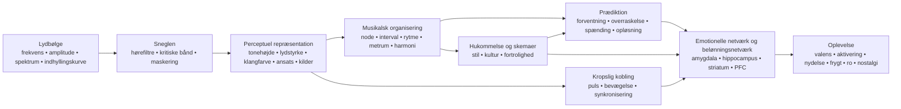

<!-- Translation of: research/sources/author-supplied/sound-expectation-and-emotion.md; source commit: 304d75ed6ff646d311fd9df8b4e2db0d4dee277a -->
# Lyd og følelse: hvordan akustisk struktur bliver til fornemmelse, forventning og affekt

## Resumé

Relationen lyd–følelse **fungerer ikke som en fast ordbog**, hvor en frekvens, et interval eller en akkord nødvendigvis fremkalder en følelse. Det, der findes, er en sandsynlighedsarkitektur: akustiske egenskaber ændrer fysiologisk aktivering, fremtrædende træk, forventning, kildeseparation, følelsen af stabilitet og bevægelse; disse repræsentationer kombineres derefter med kulturel læring, selvbiografisk hukommelse, fortrolighed, stil, kontekst og interpretativ intention. Tværkulturelle studier viser to vigtige fakta på én gang: nogle brede musikalsk-emotionelle signaler krydser kulturer, men specifikke præferencer og betydninger — f.eks. præferencen for konsonans — kan variere betydeligt med kulturel erfaring. citeturn22search10turn5search11

Den vigtigste distinktion er den mellem **fysisk egenskab** og **perception**. Frekvens er ikke tonehøjde; lydtryk er ikke lydstyrke; fysisk stemmemangfoldighed er ikke nødvendigvis det oplevede antal stemmer; spektrum er ikke klangfarve. Et særligt tydeligt tilfælde er den *manglende grundtone*: lytteren kan opleve en tonehøjde, der svarer til en grundfrekvens, som fysisk mangler i spektret, og tonehøjdefølsomme neuroner svarer på harmoniske komplekser med manglende grundtone. citeturn18search2

Emotionelt optræder de mest konsistente effekter i **tempo, intensitet/lydstyrke, modus, harmonisk forventning, dissonans/ruhed, klangfarve og ekspressiv fremførelse**, men disse parametre samvirker. I kontrollerede studier kan tempo og modus udfylde delvist forskellige funktioner: tempoet ændrer stærkt *aktiveringen*, mens modussen ændrer stemnings-/valensvurderinger; manipulationer af tonehøjde, intensitet og temporal hastighed ændrer også affektive dimensioner i både musik og tale. citeturn20search4turn21search7

Musik når også belønningssystemer direkte. Intens musikalsk nydelse har været koblet til dopaminfrigørelse i striatum; i Salimpoors og kollegers klassiske studie var **caudatus** mere associeret med anticipation og **nucleus accumbens** med den nydelsesfulde top. Behagelig og ubehagelig musik rekrutterer også differentielt ventralt striatum, amygdala, hippocampus, gyrus parahippocampalis, insula og kortikale regioner. citeturn18search0turn18search1

Dette bidrager til at forklare, hvorfor **overraskelse ikke bare er »dårlig«**. Musik udnytter et mellemleje mellem forudsigelighed og nyhed: forventning bygger en model; afvigelse producerer information; opløsning eller bekræftelse forvandler en del af den spænding til belønning. Studier af harmoniske progressioner viser, at usikkerhed og overraskelse samvirker ved prædiktion af nydelse og aktivitet i auditiv cortex, amygdala og hippocampus; andre arbejder finder en ikke-lineær relation mellem forudsigelighed og nydelse. citeturn16search24turn16search1

Praktisk set er den afgørende variabel sjældent »hvilken akkord er trist?« men **hvilket sæt af ledetråde der organiseres til hvilken temporal bane**. For at fremkalde tristhed er f.eks. molmodus alene én ledetråd; at kombinere moderat/lavt register, langsomt tempo, lav intensitet, bløde ansatser, legato, lav tæthed, faldende konturer og fleksibel temporal fremførelse gør kommunikationen langt mere robust. Fremførelsesstudier viser netop denne redundans: forskellige udøvere kan kommunikere samme følelse med forskellige kombinationer af tempo, intensitet, artikulation og klangfarve. citeturn22search4turn22search8

En nyttig syntese er:

> **Akustikken sætter muligheder → perceptionen forvandler dem til objekter og mønstre → prædiktion og hukommelse tildeler betydning → autonome, motoriske, limbiske og belønningssystemer producerer aktivering, spænding, nydelse og hukommelse → kultur og kontekst bestemmer meget af den endelige emotionelle betydning.**

Diagrammet bør læses som et **netværk**, ikke som en stiv neural kæde. Der findes tilbagevendende bearbejdning mellem auditiv cortex, motoriske systemer, hukommelse, vurdering og belønning; desuden kan fortrolighed og selvbiografi dybt ændre oplevelsen af samme akustiske signal. citeturn18search0turn18search1turn15search2

## Fra lydbølge til emotionel hjerne

### Fysik: frekvens, spektrum, indhyllingskurve og overtoner

En musikalsk lyd kan groft beskrives gennem sin energifordeling over tid og frekvens. For et periodisk signal svarer grundfrekvensen \(f_0\) til mønstrets repetitionsfrekvens; akustiske instrumenter producerer normalt også deltoner over den. I tilnærmet harmoniske lyde optræder disse deltoner nær heltalsmultipla af \(f_0\). Men **den oplevede tonehøjde er en inferens fra høresystemet**, ikke en enkel aflæsning af den laveste spektralkomponent. Derfor fjerner fjernelsen af \(f_0\) ikke nødvendigvis den tonehøjdeoplevelse. citeturn18search2

**Spektret** bestemmer meget af klangfarven. Klassiske psykofysiske studier af klangfarverum fandt dimensioner relateret til **spektralcentroiden** — stærkt associeret med lyshedsoplevelsen —, til ansatsens temporale struktur og til spektral udvikling over lyden. Senere forskning bekræfter, at flere spektrale og temporale dimensioner er nødvendige for at forklare klangfarvelighed. citeturn21search4turn21search12

**Indhyllingskurven** beskriver, hvordan energien varierer over tid. ADSR-modellen, der bruges i syntese — *attack, decay, sustain, release* — er en nyttig forenkling:

**attack** = initial amplitudestigning;  
**decay** = fald efter toppen;  
**sustain** = tilnærmet opretholdt niveau, mens kilden forbliver eksiteret;  
**release** = udklingning efter at eksitationen er ophørt.

Virkelige instrumenter har ofte mere komplekse indhyllingskurver end et enkelt ADSR, men ansatshastighed og spektro-temporal udvikling påvirker stærkt klangfarveidentitet og perceptuel segmentering. citeturn21search4turn21search23

En brat ansats producerer stor transient energi og ofte mere højfrekvent indhold; langsomme ansatser skjuler det eksakte ansatstidspunkt og kan give en mere kontinuerlig perception. Denne fysiske forskel grunder musikalske kontraster som **perkussiv ↔ blød**, **staccato ↔ legato**, **aggressiv ↔ delikat**, skønt den resulterende følelse afhænger af resten af det musikalske oplæg. citeturn21search12turn22search4

### Kritiske bånd, maskering og ruhed

Sneglen udfører ingen perfekt Fouriertransformation: frekvenser analyseres af hørefiltre med endelig bredde. Det klassiske begreb **kritisk bånd** blev demonstreret eksperimentelt i fænomener som lydstyrkesummering, tærskler og maskering: at sprede energi uden for et givet båndbredde ændrer, hvordan den kombineres perceptuelt. citeturn21search2turn21search25

Dette er nøglen til at forstå sensorisk konsonans og dissonans. Når nærliggende deltoner samvirker inden for overlappende høreregioner, kan hurtige amplitudefluktuationer producere **svævninger/ruhed**. Plomps og Levelts arbejde etablerede en historisk kobling mellem kritisk båndbredde og tonal konsonans, skønt virkelig musikalsk konsonans også afhænger af harmonicitet, fortrolighed og kultur. citeturn21search1turn5search17

**Maskering** betyder, at én komponent kan hæve en andens hørbarhedstærskel. I musikproduktion tilføjer tilført energi derfor ikke nødvendigvis oplevet information: spektralt konkurrerende lag kan skjule artikulations-, overtone- og transientdetaljer. Det er en direkte bro mellem psykoakustik og orkestrering/miksning. citeturn21search2

### Fra auditiv cortex til belønningssystem

Tonehøjde, klangfarve, rytme og musikalsk struktur bearbejdes ikke af ét enkelt »musikcenter«. Et særligt stærkt neurofysiologisk eksempel er identificeringen af tonehøjdefølsomme kortikale neuroner, der svarer på både rene toner og harmoniske komplekser med samme oplevede \(f_0\), selv når grundtonen mangler. citeturn18search2

Når lyd får emotionel betydning, kommer yderligere netværk til. I fMRI producerede vedvarende dissonant ubehagelig musik større aktivitet i amygdala, hippocampus, gyrus parahippocampalis og temporalpoler, mens behagelig musik viste svar, der involverede ventralt striatum, insula, auditiv cortex og frontale/operkulære regioner. Dette betyder ikke, at én region »er« en følelse; det betyder, at den musikalske tilstand modificerer netværk, der også er involveret i vurdering, hukommelse, motivation og handling. citeturn18search1

Belønningskomponenten er særligt tydelig ved intens nydelse. Salimpoor m.fl. kombinerede funktionel neurobilleddannelse og dopaminerge mål og fandt striatal dopaminfrigørelse under intenst nydelsesfuld musik, med temporal differentiering mellem anticipation og hedonisk top. citeturn18search0

**Nostalgi** illustrerer en anden vej. I selvbiografisk relevant musik fandt Janata aktivitet i dorsal medial præfrontal cortex, der fulgte selvbiografisk fremtrædenhed, mens præfrontale og posteriore netværk deltog i genkaldelsen af musikassocierede minder. Således »indeholder« ingen isoleret akustisk egenskab nostalgi; musik fungerer som en adgangsnøgle til et personligt mindenetværk. citeturn15search2turn15search3

Dette forklarer også en væsentlig distinktion: **oplevet følelse** (»denne musik lyder trist«) er ikke identisk med **følt følelse** (»denne musik gør mig trist«). En udøver kan kommunikere tristhed genkendeligt, mens lytteren samtidig oplever æstetisk nydelse. Studier af fremførelseskommunikation og belønning adresserer netop forskellige niveauer af denne proces. citeturn22search4turn18search0

## Tonehøjde, frekvens, noder, intervaller, skalaer, modi og harmoni

### Tonehøjde, frekvens, node og register

| Element | Fysisk/perceptuel mekanisme | Evidensstøttet emotionel tendens | Musikalsk manipulation og anvendelse |
|---|---|---|---|
| **Frekvens** | Fysisk repetitionsfrekvens; relaterer i harmoniske komplekser til \(f_0\), men er ikke identisk med tonehøjde. citeturn18search2 | Der findes ingen generel funktion »X Hz = følelse Y«. Den emotionelle effekt opstår af relationer, spektrum, niveau, kontekst og læring. | Transponering, basdesign, grundtonevalg, syntese og EQ. Arbejd med relationer og bane, ikke »magiske frekvenser«. |
| **Tonehøjde** | Perceptuel repræsentation af periodicitet/grundtone, bevarbar selv med *manglende grundtone*. citeturn18search2 | Hævet tonehøjde tenderer til at hæve *aktiveringen* i kontrollerede manipulationer; valensbetydningen afhænger af klangfarve, kontekst og stil. I isolerede violintoner hævede højere tonehøjde *aktiveringen*. citeturn22search2turn22search6 | Hæv registret for intensivering, hastværk eller lethed; sænk for tyngde, stabilitet eller intimitet, og test altid klangfarvesamspillet. |
| **Node** | Begivenhed, der kombinerer tonehøjde, ansats, duration, intensitet og klangfarve. | Navnet »C«, »Fis« osv. har ingen påvist egenfølelse. Selv en isoleret node ændres emotionelt, når tonehøjde, vibrato og dynamik ændres. citeturn22search2 | Tænk hver node som en multidimensionel begivenhed: stemmeføring, indhyllingskurve, artikulation og melodisk mål betyder lige så meget som dens tonehøjdeklasse. |
| **Register** | Placering af tonehøjder i lave/høje bånd, som også ændrer instrumentspektrum og maskering. | Højere registre hæver ofte aktivering/spænding; lave registre kan give tyngde/kraft, men effekten er hverken universel eller separerbar fra klangfarven. citeturn22search2turn21search7 | Reserver registerekstremer til strukturelle punkter; kontraster en central sektion med en høj klimaks eller subbas for at udvide tilstandsændringen. |

I komposition er det særligt nyttigt at separere **absolut tonehøjde** fra **kontur**. Et opadgående spring, progressiv registerakkumulation eller en faldende linje skaber retningsinformation, selv når tonaliteten forbliver den samme. Affektivt er banen vanligvis mere informativ end en enkelt node.

### Intervaller

Et simultant interval producerer et kombineret spektrum. Når de to toners deltoner interfererer kraftigt inden for samme kritiske regioner, stiger ruheden; når de deler høj harmonicitet, kan den perceptuelle fusion stige. Denne akustiske komponent bidrager til at forklare en del af sensorisk dissonans, men udtømmer ikke den musikalske konsonansoplevelse. citeturn21search1turn5search17

Dissonans har også tidlige neurale og affektive korrelater, og vedvarende dissonant musik kan forstærke svar i strukturer relateret til fremtrædenhed og negativ valens. citeturn18search1

Det er imidlertid en fejl at forvandle dette til reglen:

> lille sekund = frygt; lille terts = tristhed; kvint = kraft.

Disse par kan fungere stilistisk, men et intervals betydning ændres med **register, melodisk retning, duration, metrisk position, klangfarve, tonal kontekst og kultur**. Selve præferencen for konsonans frem for dissonans varierer mellem populationer med forskellige grader af vestlig musikeksponering. citeturn5search11

**Anvendelse:** små kromatiske intervaller skaber effektivt friktion, når de holder deltoner tæt og udfordrer den tonale forventning; vide spring kan fremhæve overraskelse, ekspansion eller instabilitet; udholdte konsonanser tenderer til at sænke sensorisk spænding, men kan forblive harmonisk »svævende«, hvis konteksten kræver opløsning.

### Skalaer og modi

En skala er en tonehøjdesamling; et modus tilføjer **hierarki, centrum og melodisk/harmonisk adfærd**. Dur/mol-effekten er ét af den vestlige tonale traditions mest dokumenterede fænomener: i eksperimenter, der manipulerer modus og tempo, ændrer modussen stemnings-/valensvurderinger, mens tempoet stærkt påvirker aktiveringen. citeturn20search4turn20search13

Dette giver den robuste, men ikke absolutte association:

**dur → relativt mere positiv valens**  
**mol → relativt mere negativ/trist valens**

Det betyder ikke »mol = tristhed«. Et molmodus i 170 BPM, med stærk intensitet, lys klangfarve og motorisk rytme, kan producere ophedning, aggressivitet eller eufori; et langsomt, spredt durmodus med lav dynamik kan lyde kontemplativt eller melankolsk. Den multivariate konfiguration bestemmer udfaldet. citeturn20search4turn21search7

Modi som dorisk, frygisk, lydisk eller mixolydisk får betydning gennem en kombination af **karakteristiske intervaller + tonalt centrum + indlært repertoire**. Der findes langt mindre eksperimentel evidens, der støtter, at »lydisk fremkalder følelse X« tværkulturelt. Tværkulturelle studier indikerer, at lyttere kan genkende nogle følelseskategorier i kulturelt fremmed musik, men viser også, at kulturel læring stærkt modificerer musikalske vurderinger. citeturn22search10turn5search11

**Anvendelse:** i stedet for at vælge et modus efter emotionel etiket, identificer hvilken tone der adskiller det fra forventet dur/mol, og **gør den tone perceptuelt strukturel**. En lydisk ♯4 skjult i en passage producerer ikke samme effekt som en ♯4 udholdt i fremtrædende position mod tonikaen.

### Harmoni, progressioner og kadencer

| Element | Mekanisme | Følelse/perception | Teknikker |
|---|---|---|---|
| **Harmoni** | Simultan tonehøjdekombination → harmonicitet, ruhed, fusion, virtuel bas og indlærte relationer. citeturn21search1turn5search17 | Konsonans tenderer mod større behag hos fortrolige lyttere; udholdt dissonans kan hæve spænding/negativ valens. Præferencen er ikke kulturelt invariant. citeturn18search1turn5search11 | Spacing, omvending, lavt register, ekstensioner, klynger, stemmeføringer og kontrol af forberedelse/opløsning. |
| **Progression** | Sekvensen forvandler akkorder til betingede sandsynligheder: hver begivenhed opdaterer næstes forventning. | Lavere sandsynlighed kan hæve overraskelse og spænding; nydelse kan resultere fra specifikke usikkerheds-overraskelseskombinationer. citeturn16search24turn16search1 | Forbered → afvig → opløs; dominantsubstitut; forlænget subdominant; modulation; pivotakkorder; kromatik. |
| **Kadens** | Afslutningsbegivenhed, der kombinerer basbevægelse, skalatrin, stemmeføring, metrum og indlært forventning. | Forskellige kadencer får distinkte valens- og aktiveringsvurderinger; stærk afslutning reducerer usikkerhed, mens afbrudte kadencer bevarer forventning. citeturn16search2turn16search6 | Autentisk kadence for afslutning; bedragersk for forlængelse; halvkadence for svæven; elision for flow. |

Den videnskabelige nøgle her er **prædiktion**. En progression er ikke emotionel blot gennem sine isolerede akkorder; den bygger et sandsynlighedsrum. En isoleret neutral akkord kan udløse et stort svar, hvis den indtager et punkt, hvor den interne model prædikterede noget andet. Cheung og kolleger viste, at **overraskelse og usikkerhed samvirker** ved prædiktion af musikalsk nydelse og modulerer auditiv cortex, amygdala og hippocampus. citeturn16search24

Dette giver en forklaring fra første principper af harmonisk spænding:

\[
\text{Oplevet spænding}
\approx
f(\text{sensorisk dissonans},
\text{tonal instabilitet},
\text{usandsynlighed},
\text{udsættelse},
\text{energi},
\text{kontekst})
\]

Det er ingen bogstavelig fysiologisk ligning; det er en funktionel dekomposition. To akkorder kan have lignende ruhed, men alligevel forårsage forskellige spændinger, fordi den ene er forventet, og den anden bryder med den indlærte grammatik.

For komposition er det kraftigste princip at kontrollere **mængden og placeringen af uventet information**. Konstant overraskelse ophører med at være overraskelse; total forudsigelighed reducerer informationen. Feltet med størst emotionel interesse tenderer til at ligge mellem ekstremerne, også observeret i nydelses–forudsigelighedsstudier. citeturn16search1turn16search24

## Tempo, duration, rytme, metrum, mikrotiming og groove

### Tempo og duration

**Tempoet** ændrer begivenhedstætheden per tidsenhed og dermed hastigheden, hvormed perceptionssystemet må opdatere prædiktioner. Det er en af de stærkeste emotionelle ledetråde. Eksperimentelle manipulationer viser, at tempoændringer påvirker *aktiveringen*, og hurtigere musik tenderer til at producere større aktivering end langsom, skønt intensitet, rytme og præference kan modificere effekten. citeturn20search4

Effekten optræder også fysiologisk: studier med musik under forskellige tempobetingelser observerede kardiovaskulære, respiratoriske og cerebrovaskulære ændringer, hvilket støtter idéen om, at musikalsk tempo ikke blot er en »energi«-metafor; det kan effektivt modificere den autonome tilstand. citeturn7search1

Grovt set:

| Oplæg | Mest sandsynlige tendens |
|---|---|
| hurtigt + stærkt + lyst + artikuleret | høj aktivering; energisk glæde, hastværk, vrede eller ophedning per valens/kontekst |
| langsomt + svagt + mørkt + legato | lav aktivering; ro, ømhed eller tristhed |
| langsomt + stærkt + lavt + dissonant | trussel, højtidelighed eller tyngde |
| hurtigt + lavt niveau + uregelmæssigt | nervøsitet, instabilitet, uro |

Disse kombinationer er probabilistiske, ikke universelle opskrifter. Evidensen om fremførelseskommunikation viser netop, at flere akustiske ledetråde er redundante og kan erstatte hinanden. citeturn22search4turn22search8

**Durationen** virker på flere niveauer: nodeduration, ansatsinterval, fraseduration og en harmonis opholdstid. Korte noder øger begivenhedsseparationen og kan gøre pulsen mere eksplicit; lange noder øger kontinuiteten og tillader større spektral udvikling, vibrato og indre dynamik. I studier af ekspressiv fremførelse slutter duration og artikulation sig til et større ledetrådssæt, derfor er det farligt at tilskrive »lang node« eller »kort node« en fast følelse. citeturn22search4

I produktion kan en durationsændring radikalt transformere samme MIDI-sekvens uden at ændre tonehøjde: forkort *gate* og release for at hæve definition/transienter; forlæng sustain/release for at fusionere begivenheder og reducere temporal granularitet.

### Rytme og metrum

Rytme er den temporale fordeling af begivenheder; metrum er en struktur af **accentforventninger**. Hjernen hører ikke blot »hvor megen tid der gik«: den bygger regulariteter og prædikterer ansatser. Når en node lander, hvor den metriske model ikke forventede den, får vi forskydning, synkopering eller temporal overraskelse.

Pulsperceptionen er stærkt knyttet til det motoriske system, selv uden eksplicit fysisk bevægelse; neurobilleddannelsesstudier viser rekruttering af motoriske områder under lytning til musikalsk rytme, hvilket giver et neuralt grundlag for koblingen puls–bevægelsesimpuls. citeturn7search25turn7search37

**Metrummet** alene har mindre direkte evidens for »specifik følelse« end tempo eller modus. Dets hovedsagelige affektive kraft virker indirekte: det definerer matricen, som synkopering, anticipation, forsinkelse og accenter vurderes imod. Et stabilt metrum gør afvigelser læsbare; et allerede højgradigt uforudsigeligt metrum ændrer selve prædiktionsreferencen.

Dette implicerer en vigtig kompositionsregel:

> **For at producere rytmisk spænding må der først findes noget temporalt forudsigeligt at spænde.**

### Synkopering og groove

Det mest kendte eksperimentelle grooveresultat er den **inverterede U**-kurve, som Witek m.fl. fandt: intermediære synkoperingsniveauer producerede større nydelse og stærkere impuls til at bevæge kroppen end meget lave eller meget høje niveauer. citeturn20search2

Logikken ligner harmoniens:

**for megen forudsigelighed** → lille udfordring;  
**intermediær afvigelse** → tilstrækkeligt tydelig forventning + ny information;  
**eksessivt kaos** → pulsprediktionen svækkes, hvilket reducerer chancen for at »spille mod« gitteret.

Denne relation er særligt relevant for funk, hiphop, dansemusik og andre stilarter, hvor grooven afhænger af samspillet mellem en stabil temporal reference og forskydende begivenheder. Witek m.fl. fandt relationen for både nydelse og bevægelsesimpuls. citeturn20search2

### Mikrotiming

Mikrotiming er forskydning af begivenheder med titals millisekunder omkring en nominel metrisk position. Musikalsk kan det optræde som *laid-back*, *pushing*, swing, stortromme­asynkroni, lilletrommeforsinkelse eller en udøvers individuelle timing.

En produktionsmyte er, at »kvantiseret = grooveløst« og »imperfekt = menneskeligt = bedre«. Eksperimenter støtter ikke denne generelle regel. Frühauf og kolleger manipulerede mikrotemporale afvigelser i trommepatterns og fandt, at grooven mindskedes, jo større de kunstige afvigelser blev; præcist justeret timing kunne få meget høje vurderinger. citeturn22search5

I en anden tilgang sammenlignede Senn m.fl. professionelle bas/trommefremførelser, kvantiserede versioner og overdrevet mikrotiming. Originalfremførelse og kvantisering kunne give sammenlignelige grooveniveauer, mens overdrevne afvigelser skadede oplevelsen; ekspertlyttere var også mere følsomme over for forskellene. citeturn22search27

Derfor:

\[
\text{effektiv mikrotiming} \neq \text{tilfældig fejl}
\]

Det er **relationel struktur**. Lilletrommeforsinkelsen kan fungere, fordi kick, bas, hi-hat og subdivision danner konsistente referencer. At randomisere hver node ±20 ms ødelægger netop de relationer, der gør en pocket genkendelig.

### Sammenlignende temporalt kort

| Element | Fysik/perception | Mest associerede følelser | Praktiske teknikker |
|---|---|---|---|
| **Tempo** | Global begivenhed/puls-hastighed. | Hurtigt → ↑ aktivering; langsomt → ↓ aktivering, i gennemsnit. citeturn20search4 | BPM-automation, perceptuel halvtid/dobbelttid, ritardando, accelerando. |
| **Duration** | Temporal udstrækning af begivenhed/indhyllingskurve. | Kort kan hæve aktivitet/definition; lang kan favorisere kontinuitet/ro eller udholdt spænding; højgradigt kontekstuel. citeturn22search4 | Gate, nodelængde, sustain, release, fermat. |
| **Rytme** | Ansats- og durationsmønstre. | Regularitet favoriserer prædiktion; forstyrrelse giver forventning/overraskelse. | Ostinat, synkopering, anticipation, stilhed, tæthed. |
| **Metrum** | Hierarki af stærke/svage pulser. | Effekt hovedsageligt via stabilitet og forventningsbrud. | Stabilt 4/4, additive metra, modaccenter, hemiole. |
| **Mikrotiming** | Submetriske ansatsafvigelser. | Kan give pocket/hastværk/afslapning; eksces reducerer grooven. citeturn22search5turn22search27 | Forsink lilletromme, anticipér bas, swing, timing per instrument. |
| **Groove** | Integration af puls, synkopering, pattern og motorisk kobling. | Nydelse + bevægelsesimpuls; intermediær synkopering maksimerer ofte begge. citeturn20search2 | Stabilt lag + kontrollerede afvigelser; interlocking; repetition med mikrovariation. |

## Klangfarve, intensitet, dynamik, artikulation, tekstur, register og orkestrering

### Klangfarve

Klangfarve er ingen enkel dimension. Den opstår af **spektrum, harmonisk og støjfordeling, ansats, afklingning, modulationer, inharmonicitet og temporal udvikling**. Psykofysisk hører spektralcentroid og ansatsegenskaber til hovedakserne, der differentierer instrumentale lyde. citeturn21search4turn21search12

Den emotionelle konsekvens er dybtgående: samme melodiske materiale kan skifte karakter, når instrumentet skiftes. Hailstone m.fl. viste eksperimentelt, at klangfarve påvirker musikalsk-følelsesvurderinger uafhængigt af flere andre kontrollerede musikalske faktorer. citeturn20search5

En nyttig operationel beskrivelse:

**højere spektralcentroid / mere høj energi** → større »lyshed«, penetration, mulig højere aktivering;  
**mere støj, inharmonicitet og ruhed** → større fremtrædenhed, hårdhed, mulig trussel/spænding;  
**brat ansats** → større definition og impulsivitet;  
**langsom ansats** → lavere ansatsfremtrædenhed og større fusion;  
**stærk stabil harmonisk komponent** → tydelig tonehøjde/fusion;  
**diffust/støjet spektrum** → tonehøjdeambiguitet og tekstur.

Disse dimensioner har ingen fast valens. Lyshed kan betyde glæde på en høj fløjte eller aggressivitet på en forvrænget guitar; støj kan repræsentere trussel, energi, ekstase eller blot en stilistisk konvention.

**Synteseanvendelse:** for at hæve spændingen uden at ændre harmonien, hæv progressivt spektralcentroiden, øg støj/inharmonicitet, forkort ansatsen eller introducer spektral modulation. For at opløse spændingen, udfør den omvendte bevægelse.

### Intensitet og dynamik

Fysisk relaterer intensitet til lydenergi/tryk; perceptuelt er korrelatet **lydstyrke**, hvis relation til fysisk niveau afhænger af frekvens, duration, kontekst og spektral fordeling. Begrebet kritisk bånd viser, at høresystemet summerer energi afhængigt af, hvordan den spredes over hørefiltre. citeturn21search2turn21search25

I musik er større intensitet en klassisk ledetråd for **aktivering, kraft og hastværk**, men samvirker igen med andre dimensioner. Ilie og Thompson fandt, at intensitet, tonehøjde og temporal hastighed modificerer affektive dimensioner i musikalske og talestimuli. citeturn21search7

Et nyere studie med isolerede violintoner viser også, hvorfor enkle regler svigter: i det eksperimentelle oplæg havde tonehøjde og vibrato stærkere affektive effekter end dynamik, og dynamikeffekterne fulgte ikke nødvendigvis karikaturen »stærkere = mere aktivering« i alle betingelser. citeturn22search2turn22search6

**Dynamik** er mere end absolut niveau:

- **crescendo** skaber en positiv energiafledt, ofte læst som nærmelse, intensivering eller ankomst;
- **decrescendo** kan producere tilbagetrækning/opløsning;
- **sforzando/accent** hæver fremtrædenhed og overraskelse;
- **subito piano** kan producere stærk kontrast uden at være fysisk intenst;
- **eksessiv kompression** krymper rummet mellem intensitetstilstande og reducerer potentielt en vigtig ekspressiv dimension.

Det emotionelle princip er, at hjernen svarer ikke blot på værdier, men også på **ændringer**.

### Artikulation

Artikulation kontrollerer den temporale og spektrale relation mellem noder: effektiv længde, ansatsklarhed, overlap og mellemstilhed.

**staccato**: korte durationer, større separation, perceptuelt tydelige ansatser;  
**legato**: overlap/forbindelse, energikontinuitet;  
**marcato/accent**: større ansatsfremtrædenhed;  
**tenuto**: opretholdelse af duration/energi.

I Juslins eksperiment kunne professionelle musikere kommunikere vrede, tristhed, glæde og frygt gennem akustiske ledetrådskombinationer, der inkluderede **tempo, niveau, artikulation og klangfarve**; lyttere brugte kompatible ledetråde, og forskellige udøvere kunne nå lignende resultater via distinkte kombinationer. citeturn22search4turn22search8

Dette er meget vigtigt for MIDI-komposition: at programmere blot rigtige noder bevarer en brøkdel af budskabet. **Velocity, nodelængde, overlap, timing, ansats og frasedynamik** kan afgøre, om samme sekvens opleves som mekanisk, øm, aggressiv, nølende eller glad.

### Tekstur

Tekstur tilføjer yderligere en variabel: **hvor mange simultane perceptuelle strømme der findes, og hvordan de forholder sig til hinanden**.

I tre eksperimenter med polyfone uddrag manipulerede/studerede Broze m.fl. stemmemangfoldighed og fandt, at teksturer med flere stemmer blev vurderet **gladere, mindre triste, mindre ensomme og stoltere**. Vurderingerne fulgte tæt stemmernes oplevede numerositet. citeturn17view3

Dette fund er særligt interessant, fordi det viser, at følelse kan opstå af en strukturel dimension, der hverken er »melodi« eller »akkord«. Men mekanismerne selv er kontekstuelle: en masse af hundrede aggressive stemmer behøver åbenlyst ikke lyde gladere end en enslig stemme. Studiet demonstrerer en effekt i specifikke polyfone stimuli, ikke en universel tæthedslov. citeturn17view3

I praksis:

**monofoni** → eksponering, sårbarhed, klarhed, potentiel ensomhed;  
**tæt homofoni** → masse, kraft, fællesskab;  
**polyfoni** → aktivitet, kompleksitet, uafhængighed;  
**bordun** → stabilitet eller svæven;  
**klynge/lydmasse** → fusion, ruhed, kildeambiguitet.

Den emotionelle effekt afhænger hovedsageligt af **tæthed × klangfarve × register × intensitet × indre bevægelse**.

### Orkestrering

Orkestrering manipulerer simultant spektrum, register, kildeantal, placering, ansats, indhyllingskurve og dynamik. Den er således et slags psykoakustisk »makrokontrol«.

Den instrumentale klangfarves emotionelle kraft finder direkte støtte i Hailstone m.fl.; desuden viser eksperimenter, der sammenligner instrumentale versioner, at instrumentering kan ændre aktiveringen, mens relateret musikalsk materiale beholdes. citeturn20search5turn10search10

En praktisk læsning:

| Mål | Akustisk-orkestrale strategier |
|---|---|
| **intimitet** | få kilder, nært register, lavt niveau, bløde ansatser, smal spektral bredde |
| **storhed** | vidt registerspænd, fordoblinger, solid bas, højt mangfold, dynamisk opbygning |
| **trussel** | energirige lave toner + ruhed + støj + stærke ansatser + dissonans + lav forudsigelighed |
| **lethed** | mindre spektral masse, delikate transienter, mellem/højt register, luger mellem begivenheder |
| **mysterium** | delvist ambig tonehøjde, langsomme ansatser, moderat inharmonicitet, borduner, lav begivenhedstæthed |
| **klimaks** | simultan ekspansion af intensitet, register, tæthed, lyshed og begivenhedsfrekvens |

Den effektivste måde at bygge en klimaks på er vanligvis ikke at maksimere alt fra starten; det er at **bevare akustiske frihedsgrader for at åbne dem senere**.

## Ornamentik og fremførelsesteknikker

Menneskelig fremførelse introducerer kontinuerlig bevægelse i parametre, som notation vanligvis repræsenterer diskret. Det er der, vibrato, portamento, glissando, trille, rubato, accent og mikrodynamik forvandler »noden« til ekspressiv adfærd.

### Vibrato

Vibrato er en periodisk modulation — mest af frekvens/tonehøjde, ofte ledsaget af amplitude- og spektrumkomponenter afhængigt af instrument. Dets parametre inkluderer:

\[
\text{hastighed} \quad+\quad \text{dybde} \quad+\quad \text{start} \quad+\quad \text{regularitet}
\]

I et kontrolleret studie med violinlyde, der varierede tonehøjde, dynamik og vibrato, var vibrato den næstmest indflydelsesrige faktor: større vibrato tenderede til at **sænke valensen og hæve aktiveringen**, mens højere tonehøjde også hævede aktiveringen. citeturn22search2turn22search6

Dette implicerer ikke »vibrato = tristhed«. I virkelig fremførelse kan vibrato kommunikere varme, lidenskab, spænding, sårbarhed, sprudlen eller intensitet, fordi dets betydning afhænger af hastighed, bredde, start, strukturel node og stilistisk tradition.

**Anvendelse:** appliker ikke uniformt vibrato på hver node. Kontroller dets **bane**: at begynde uden vibrato og udvide det over en node producerer en anden intensivering end at begynde med bredt vibrato og reducere det.

### Portamento og glissando

**Portamento** forbinder to tonehøjder gennem en perceptuelt ekspressiv kontinuerlig overgang; **glissando** gør vejen mere eksplicit hørbar og kan spænde over et vidt omfang.

Fysisk forvandler begge et diskret frekvensspring til en **kontinuerlig \(f_0\)-bane**. Dette hæver den temporale information inde i noden og kan generere anticipation, nærmelse mod eller afvigelse fra målet.

Isoleret kausal evidens for portamento/glissando, bortset fra alle andre emotionelle parametre, er meget knappere end for tempo, modus eller vibrato. Derfor bør tilskrivninger som »portamento = nostalgi« behandles som stilistiske og fremførelsesmæssige konventioner, ikke psykoakustiske love.

I praksis:

**langsomt opadgående portamento** → betoner akten at ankomme;  
**tonehøjdefald** → kan kommunikere afslapning, klage eller opløsning per kontekst;  
**hurtigt glissando** → overraskelse, gestus, komik eller trussel per klangfarve;  
**selektivt portamento** → hæver ekspressiviteten gennem kontrast mod oglidte noder.

### Trille og andre hurtige ornamenter

Trillen alternerer hurtigt to tonehøjder og hæver dermed temporal tæthed, spektral modulation og lokal usikkerhed. Afhængigt af hastighed oplever lytteren alternerende noder eller en mere fusioneret tekstur.

Fysisk findes en overgang fra et **diskret-begivenhed**-regime til **temporal modulation/ruhed**, når hastigheden vokser. Emotionelt kan dette give ophedning, elegant ornamentik, instabilitet eller spænding, men betydningen er højgradigt stilistisk.

Samme ræsonnement dækker mordenter, tremolo og flutter:

- flere begivenheder per sekund → generelt større perceptuel aktivitet;
- større modulation → større fremtrædenhed;
- regularitet → forudsigelighed;
- irregularitet → instabilitet;
- nærmelse til strukturelt vigtige noder → større forventning.

### Rubato

Rubato omorganiserer mikro- og makrotid uden nødvendigvis at ændre det globale middeltempo. Det modificerer direkte prædiktionsfeltet: at forsinke et ankomstpunkt forlænger forventningen; at komprimere tiden efter forsinkelsen kan skabe driv.

Rubato tænkes bedre som **frasens temporale krumning**, ikke upræcision. Den emotionelle fremførelse, som Juslin studerede, demonstrerer, at timing, artikulation, dynamik og klangfarve danner en redundant kode, som udøvere bruger til at kommunikere genkendelige følelser. citeturn22search4

For ekspressivitet:

\[
\text{nyttigt rubato} = \text{strukturrelateret afvigelse}
\]

og ikke

\[
\text{nyttigt rubato} = \text{tilfældig jitter}
\]

At systematisk forsinke en klimaks, en appoggiatura eller en kadenceopløsning kommunikerer intention; at tilfældigt forskyde hver node degraderer blot forudsigeligheden.

### Sammenlignede fremførelsesteknikker

| Teknik | Hovedsagelig akustisk ændring | Sandsynlig emotionel effekt | Brug |
|---|---|---|---|
| **Vibrato** | tonehøjde/amplitude/spektrum-modulation | ↑ aktivering ved intensere vibrato i violinstudie; kontekstafhængig valens. citeturn22search2 | nodeklimaks, varme, spænding, intensitet |
| **Portamento** | kontinuerlig vej mellem tonehøjder | nærmelse, klage, sensualitet, stilistisk nostalgi; begrænset isoleret evidens | stemmer, strygere, synthlead |
| **Glissando** | vidt tonehøjdesweep | gestus, overraskelse, perceptuel acceleration, trussel/komik per klangfarve | overgange, risers, harpe, strygere, synth |
| **Trille** | hurtig alternering mellem tonehøjder | ophedning/instabilitet/ornament | suspense, kadence, brillans |
| **Tremolo** | hurtig repetition/modulation | aktivering, forventning, udholdt energi | strygere, guitar, perkussion |
| **Rubato** | struktureret tidsdeformation | forventning, tøven, ekspansion, intimitet | melodisk frasering |
| **Accent** | lokal ansats/intensitet | fremtrædenhed, overraskelse, kraft | metrum, groove, klimaks |
| **Legato** | overlap og udjævnede ansatser | kontinuitet; ofte associeret med mindre abrupte tilstande | ro, lyrik, kontekstuel tristhed/ømhed |
| **Staccato** | reduceret duration og separation | større segmentering/aktivitet; kan signalisere lethed eller aggressivitet | dans, humor, hastværk |
| **Indre dynamik** | variabel indhyllingskurve inden i noden | nærmelse/tilbagetrækning og intensivering | blæsere, stemme, strygere, synthautomation |

For portamento, glissando og trille er den specifikke eksperimentelle litteratur betydeligt mindre omfattende end for tempo, lydstyrke, klangfarve, modus, groove eller vibrato; ovenstående anvendelser er derfor akustisk-musikalske inferenser og fremførelseskonventioner, ikke universelle emotionelle modsvarigheder.

## Sammenlignende syntese, anvendelser og nøglestudier

### Fuldstændigt kort element → mekanisme → følelse → teknik

| Element | Dominerende mekanisme | Mest forsvarlige emotionelle effekt | Hvordan udnytte |
|---|---|---|---|
| **Tonehøjde** | oplevet periodicitet | ↑ tonehøjde ofte ↑ aktivering. citeturn22search2 | registerbane, spring, klimaks |
| **Frekvens** | fysisk oscillation | ingen fast følelse per Hz | harmoniske relationer, spektrum, subbas |
| **Klangfarve** | spektrum + indhyllingskurve | ændrer følelse selv med kontrolleret musikalsk materiale. citeturn20search5 | lyshed, støj, ansats, inharmonicitet |
| **Intensitet** | energi/tryk → lydstyrke | ofte aktivering/kraft; interaktiv effekt. citeturn21search7 | niveau, accent, kontrast |
| **Duration** | temporal udstrækning | modulerer aktivitet/kontinuitet; lidt deterministisk alene | gate, sustain, stilhed |
| **Rytme** | ansatsmønstre | prædiktion, overraskelse, motorisk aktivering | synkopering, ostinat, tæthed |
| **Metrum** | pulshierarki | strukturerer forventning | forskydning, hemiole, additivt metrum |
| **Tempo** | global hastighed | stærk aktiveringsdeterminant. citeturn20search4 | BPM, ritardando, accelerando |
| **Node** | tonehøjde + indhyllingskurve + klangfarve + niveau | ingen tonehøjdeklasse har påvist egenfølelse | behandl noden som en multidimensionel begivenhed |
| **Interval** | spektral interaktion + tonal relation | ruhed/dissonans kan hæve spænding; betydningskontekstafhængig. citeturn21search1 | spacing, retning, register |
| **Skala** | tonehøjdesamling/statistik | hovedsageligt relationel/kulturel betydning | karakteristiske toner og hierarki |
| **Modus** | tonal hierarki | dur/mol påvirker valens/stemning hos fortrolige lyttere. citeturn20search4 | modalinterchange, modal blanding |
| **Harmoni** | simultanitet + harmonicitet + tonalt skema | konsonans/dissonans og stabilitet påvirker nydelse/spænding. citeturn18search1turn5search11 | stemmeføringer, ekstensioner, kromatik |
| **Progression** | sekventiel prædiktion | overraskelse + usikkerhed modulerer spænding og nydelse. citeturn16search24 | forberedelse/afvigelse/opløsning |
| **Kadens** | probabilistisk/tonal afslutning | forskellige afslutninger ændrer valens/aktivering og fuldstændighed. citeturn16search2 | autentisk, bedragersk, halvkadence |
| **Artikulation** | ansats + duration + overlap | slutter sig stærkt til ekspressiv kommunikation, med andre ledetråde. citeturn22search4 | legato/staccato/marcato |
| **Dynamik** | lydstyrkebane | crescendo/kontrast modulerer aktivering og fremtrædenhed | automation, swell, subito |
| **Ornamentik** | hurtige lokale modulationer | intensiverer aktivitet, fremtrædenhed og forventning; højgradigt stilafhængig | trille, mordent, tremolo |
| **Tekstur** | antal/separation af strømme | flere stemmer var mere positive og mindre ensomme i kontrollerede stimuli. citeturn17view3 | monofoni ↔ masse/polyfoni |
| **Register** | spektral/tonehøjde-position | ekstremer hæver fremtrædenhed; højt tenderer til at hæve aktivering i tonehøjdemanipulationer | registerekspansion/kontraktion |
| **Orkestrering** | kombination af klangfarve, register og kilder | instrumentering ændrer aktivering og affektiv karakter. citeturn20search5turn10search10 | tæthed, fordobling, klangfarvekontrast |
| **Mikrotiming** | millisekundafvigelser | grooverelationen er strukturel; mere afvigelse er ikke automatisk bedre. citeturn22search5turn22search27 | pocket, laid-back, push |
| **Groove** | puls + synkopering + motorisk prædiktion | nydelse og bevægelsesimpuls; hyppigt maksimum ved intermediær kompleksitet. citeturn20search2 | forudsigelig base + kontrolleret synkopering |
| **Fremførelse** | kontinuerlig kombination af timing, niveau, klangfarve, tonehøjde | udøvere kommunikerer følelser via redundante ledetråde. citeturn22search4 | frasering og ledetrådskoordination |

### Hvordan komponere efter følelse uden at falde i formler

Den robusteste metode arbejder i **vektorer**, ikke enkeltvise elementer.

For **ro**, sænk aktiveringen på flere akser på én gang: moderat/langsomt tempo, lav ansatstæthed, afrundede ansatser, lille ruhed, stabil dynamik, ikke-ekstremt register, tilstrækkelig forudsigelighed og længere release. Litteraturen om tempo, intensitet og udtryk støtter disse relationer som tendenser, ikke garantier. citeturn20search4turn21search7turn22search4

For **tristhed** kan et molmodus forstærke negativ valens, men bliver langt mere effektivt med lav aktivering: langsomt tempo, forbunden artikulation, reduceret intensitet og lavere tæthed. citeturn20search4turn22search4

For **glæde**, hæv valens og ofte aktivering: større metrisk forudsigelighed, livligere tempo, mindre hårde klangfarver, tydelig artikulation, durmodus hvor stilistisk relevant, og socialt »fulde« teksturer. Den positive indflydelse af større stemmemangfoldighed blev demonstreret i et kontrolleret polyfont musiksæt. citeturn17view3turn20search4

For **frygt/trussel**, kombiner høj fremtrædenhed med negativ valens: ruhed, dissonans, lav forudsigelighed, bratte ansatser, registerekstremer, støj, pludselig dynamik og begivenheder, hvis timing bryder forventningen. Associationen af vedvarende dissonans med amygdala/hippocampus-aktivitet og andre affektive strukturer giver eksperimentelt grundlag for en del af denne effekt. citeturn18search1

For **spænding** er det centrale værktøj **udsættelsen**: etabler en forventning og bloker midlertidigt dens opfyldelse. Dette kan ske harmonisk, rytmisk, melodisk, dynamisk eller registralt. Studier af musikalsk overraskelse viser, at forventning og usikkerhed er centrale for affektiv og hedonisk respons. citeturn16search24turn16search1

For **overraskelse**, bevar først vis redundans. Et forventningsbrud er informativt blot, hvis der fandtes en tilstrækkeligt stabil model at bryde. citeturn16search24

For **groove og kropslig nydelse**, maksimer ikke kompleksiteten: hold pulsen genoprettelig og placer nok synkopering til at mobilisere prædiktion og bevægelse. Den eksperimentelle evidens favoriserer en intermediær synkoperingszone. citeturn20search2

For **nostalgi**, søg ikke en specifik frekvens. Fortrolighed og selvbiografisk association betyder langt mere. Musik bundet til personlig historie rekrutterer præfrontale netværk associeret med selvbiografisk hukommelse og personlig fremtrædenhed. citeturn15search2

### Anvendelse i arrangement og produktion

I **arrangementet**, tænk følelsen som perceptuel ressourcehåndtering. En sektion kan gøres større uden at ændre nogen akkord: fordoble oktaver, ekspander register, hæv stemmeantallet, tilføj transienter, hæv lysheden og udvid dynamikken. Hvert skridt modificerer dimensioner med distinkte psykoakustiske korrelater. citeturn21search4turn17view3

I **produktionen** er EQ og syntese ikke blot tekniske processer. At ændre spektralcentroiden ændrer lysheden; en kompressor ændrer indhyllingskurve og kontrast; mætning introducerer overtoner og potentiel ruhed; rumklang forlænger energien og reducerer temporal skarphed; transientformning modificerer ansatsen; kvantisering modificerer temporal forventning; velocity og automation ændrer lydstyrke og klangfarve simultant. De perceptuelle klangfarve- og indhyllingskurvedimensioner, der er demonstreret i psykofysik, grunder disse manipulationer. citeturn21search4turn21search12

**Maskering** introducerer yderligere et princip: et emotionelt »stort« arrangement behøver ikke have flere elementer, men perceptuelt adskillelige. Hvis to lag indtager lignende filtre og gensidigt maskerer deres ansatser/overtoner, kan hævning af begge reducere klarheden i stedet for at hæve effekten. citeturn21search2

I **bassen** fortjener spacings og stemmeføringer særlig opmærksomhed: hørefilterbredde, harmonisk tæthed og svævningsfrekvenser gør, at kompakte strukturer i lave registre ofte producerer mere interaktion/ruhed end samme interval i højere registre. Princippet udledes fra relationen kritisk-båndbredde–sensorisk-konsonans. citeturn21search1

I **elektronisk musik** tillader dette at bygge følelse uden kompleks tonalitet: en enkelt tonehøjde kan gennemløbe helt forskellige tilstande gennem filterautomation, indhyllingskurve, forvrængning, spektral bredde, rytmisk tæthed, mikrotiming og intensitet. Klangfarve, rytme og forventning giver allerede flere uafhængige affektive kanaler. citeturn20search5turn20search2

### Anvendelse i fremførelse

For udøvere er litteraturens største resultat, at følelsen ikke bør »lægges« udelukkende i tempoet eller udelukkende i dynamikken. Studier viser **ledetrådsredundans**: lytteren kombinerer tempo, intensitet, artikulation, klangfarve og andre variabler for at inferere den emotionelle intention. citeturn22search4turn22search8

Dette foreslår en fremførelsesstrategi på tre skalaer:

**Makro:** vælg tempo-, dynamik- og tæthedsbanen for hele sektionen.

**Meso:** giv hver frase et mål — ekspansion, svæven, acceleration, opløsning.

**Mikro:** bestem ansats, duration, intensitet, vibrato, portamento og timing for strukturelle noder.

En effektiv ekspressiv interpretation tenderer til at pege disse skalaer i samme retning. En klimaks, der simultant vinder tonehøjde, intensitet, tæthed, vibrato og temporalt hastværk, indeholder redundante intensiveringsledetråde; redundans hæver emotionel læsbarhed, nøjagtigt som eksperimentelt observeret i fremførelseskommunikation. citeturn22search4

### Hvad evidensen støtter — og hvad den ikke støtter

Forskningen støtter med tiltro, at akustiske og strukturelle egenskaber **systematisk ændrer affektive dimensioner**. Tempo, modus, intensitet, tonehøjde, klangfarve, forventning, konsonans/dissonans, stemmetæthed, synkopering og fremførelse er målbare og eksperimentelt manipulerbare. citeturn20search4turn20search5turn17view3turn20search2

Den støtter ikke at bygge en universel tabel som:

> 440 Hz = følelse A  
> 432 Hz = følelse B  
> lille terts = tristhed  
> D-dorisk = håb  
> 120 BPM = glæde.

Tonehøjde er ikke engang ækvivalent med enkel fysisk frekvens, som den *manglende grundtone* viser; og konsonans- og følelseseffekter varierer med eksponering og kultur. citeturn18search2turn5search11

Det er heller ikke passende at sige »amygdalaen er det musikalske frygtcenter« eller »nucleus accumbens er nydelsescentret«. Studier viser **distribuerede netværk**, hvor auditive, motoriske, mnestiske, evaluative og belønningsregioner dynamisk samvirker. citeturn18search0turn18search1turn15search2

Til sidst bør **nærmelse/undgåelse** bruges mere forsigtigt end valens og aktivering. En højaktiveret lyd kan inducere nærmelse, når den er nydelsesfuld — dans, ekstase, groove — eller vagtsomhed/undgåelse, når den er truende. Samme akustiske energi kan derfor nære modsatte motivationstilstande afhængigt af valens, prædiktion og kontekst. Sameksistensen af belønningssvar på intenst ophedende musik og negative svar på ubehagelig dissonans illustrerer dette punkt. citeturn18search0turn18search1

### Væsentlige primærstudier

For **tonehøjde og neural repræsentation** er Bendor & Wang (2005), *The neuronal representation of pitch in primate auditory cortex*, fundamental for at påvise neuroner, der bevarer tonehøjde selv med *manglende grundtone*. citeturn18search2

For **kritisk-bånd- og konsonanspsykoakustik** forbliver Zwicker, Flottorp & Stevens (1957), *Critical Band Width in Loudness Summation*, og Plomp & Levelt (1965), *Tonal Consonance and Critical Bandwidth*, grundlæggende referencer. citeturn21search2turn21search1

For **klangfarve** etablerer McAdams m.fl. (1995), *Perceptual scaling of synthesized musical timbres*, perceptuelle spektrale og temporale dimensioner; Hailstone m.fl. (2009), *Timbre affects perception of emotion in music*, demonstrerer klangfarvens bidrag til oplevet følelse. citeturn21search4turn20search5

For **tempo, modus, tonehøjde og intensitet** er Husain, Thompson & Schellenberg (2002) og Ilie & Thompson (2006) centrale referencer i kontrollerede manipulationer af akustisk-musikalske ledetråde og affektive dimensioner. citeturn20search4turn21search7

For **emotionel fremførelse** viser Juslin (2000), *Cue Utilization in Communication of Emotion in Music Performance*, empirisk hvordan musikere og lyttere konvergerer i brugen af multiple ekspressive ledetråde. citeturn22search4

For **følelse og hjerne** viser Koelsch m.fl. (2006), *Investigating emotion with music: an fMRI study*, differentielle svar på konsonant/behagelig vs. vedvarende dissonant/ubehagelig musik. citeturn18search1

For **nydelse og dopamin** kobler Salimpoor m.fl. (2011), *Anatomically distinct dopamine release during anticipation and experience of peak emotion to music*, musikalsk nydelse til striatal dopaminerg frigørelse og differentierer anticipation fra hedonisk top. citeturn18search0

For **overraskelse, forventning og belønning** giver Cheung m.fl. (2019), *Uncertainty and Surprise Jointly Predict Musical Pleasure and Amygdala, Hippocampus, and Auditory Cortex Activity*, og Gold m.fl. (2019), *Predictability and Uncertainty in the Pleasure of Music*, evidens for, at musikalsk nydelse afhænger af samspillet mellem prædiktion og ny information. citeturn16search24turn16search1

For **groove** demonstrerer Witek m.fl. (2014), *Syncopation, Body-Movement and Pleasure in Groove Music*, den inverterede U-relation mellem synkoperet kompleksitet, nydelse og bevægelsesimpuls. citeturn20search2

For **mikrotiming** er Frühauf m.fl. (2013), *Music on the Timing Grid*, og Senn m.fl. (2016), *The Effect of Expert Performance Microtiming on Listeners' Experience of Groove*, særligt nyttige, fordi de modsiger den forenklede idé om, at mere temporal afvigelse nødvendigvis betyder mere groove. citeturn22search5turn22search27

For **tekstur** giver Broze m.fl. (2014), *Polyphonic Voice Multiplicity, Numerosity, and Musical Emotion Perception*, sjælden eksperimentel evidens for, at det oplevede stemmeantal ændrer den oplevede følelse. citeturn17view3

For **nostalgi og selvbiografisk hukommelse** viser Janata (2009), *The Neural Architecture of Music-Evoked Autobiographical Memories*, associationen mellem selvbiografisk fremtrædende musik og medial præfrontal cortex. citeturn15search2

For **kultur og universalitet** demonstrerer Fritz m.fl. (2009), *Universal Recognition of Three Basic Emotions in Music*, vis tværkulturel genkendelse af basale følelser; dette resultat bør læses sammen med studier som McDermott m.fl., der viser stærkt kulturel indflydelse på konsonanspræferencen. citeturn22search10turn5search11

Syntesen af al denne litteratur er et perspektivskifte: **musikalsk følelse lever ikke i isolerede noder, frekvenser eller akkorder. Den opstår af den temporale transformation af akustisk energi til perception, prædiktion, bevægelse, hukommelse og værdi.** Komposition kontrollerer sandsynlighederne; fremførelse giver disse sandsynligheder bane; hjernen tolker dem i lyset af en krop, en kultur og en personlig historie.
