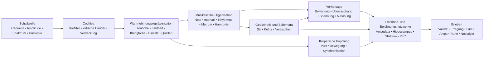

<!-- Translation of: research/sources/author-supplied/sound-expectation-and-emotion.md; source commit: 304d75ed6ff646d311fd9df8b4e2db0d4dee277a -->
# Klang und Emotion: Wie akustische Struktur zu Empfindung, Erwartung und Affekt wird

## Zusammenfassung

Die Klang–Emotions-Beziehung **funktioniert nicht als festes Wörterbuch**, in dem eine Frequenz, ein Intervall oder ein Akkord notwendigerweise eine Emotion erzeugt. Was existiert, ist eine Wahrscheinlichkeitsarchitektur: Akustische Merkmale verändern physiologische Erregung, Salienz, Erwartung, Quellentrennung, das Gefühl von Stabilität und Bewegung; diese Repräsentationen werden dann mit kulturellem Lernen, autobiografischem Gedächtnis, Vertrautheit, Stil, Kontext und interpretatorischer Absicht kombiniert. Kulturvergleichende Studien zeigen zwei wichtige Fakten zugleich: Einige breite musikalisch-emotionale Signale überschreiten Kulturen, aber spezifische Präferenzen und Bedeutungen — z. B. die Präferenz für Konsonanz — können mit kultureller Erfahrung erheblich variieren. citeturn22search10turn5search11

Die wichtigste Unterscheidung ist die zwischen **physikalischer Eigenschaft** und **Wahrnehmung**. Frequenz ist nicht Tonhöhe; Schalldruck ist nicht Lautheit; physikalische Stimmenvielfalt ist nicht notwendigerweise die wahrgenommene Stimmenzahl; Spektrum ist nicht Klangfarbe. Ein besonders klarer Fall ist der *fehlende Grundton*: Der Hörer kann eine Tonhöhe wahrnehmen, die einer im Spektrum physikalisch fehlenden Grundfrequenz entspricht, und tonhöhenempfindliche Neuronen reagieren auf harmonische Komplexe mit fehlendem Grundton. citeturn18search2

Emotional treten die konsistentesten Effekte bei **Tempo, Intensität/Lautheit, Modus, harmonischer Erwartung, Dissonanz/Rauigkeit, Klangfarbe und ausdrucksstarker Interpretation** auf, doch diese Parameter interagieren. In kontrollierten Studien können Tempo und Modus teilweise unterschiedliche Funktionen erfüllen: Das Tempo verändert stark die *Erregung*, während der Modus Stimmungs-/Valenzurteile verändert; Manipulationen von Tonhöhe, Intensität und zeitlicher Rate verändern affektive Dimensionen ebenfalls sowohl in Musik als auch in Sprache. citeturn20search4turn21search7

Musik erreicht auch Belohnungssysteme direkt. Intensive musikalische Lust wurde mit Dopaminausschüttung im Striatum in Verbindung gebracht; in der klassischen Studie von Salimpoor und Kollegen war der **Nucleus caudatus** stärker mit Antizipation und der **Nucleus accumbens** mit dem lustvollen Höhepunkt assoziiert. Angenehme und unangenehme Musik rekrutieren außerdem differenziell ventrales Striatum, Amygdala, Hippocampus, Gyrus parahippocampalis, Insula und kortikale Regionen. citeturn18search0turn18search1

Das hilft zu erklären, warum **Überraschung nicht einfach „schlecht" ist**. Musik nutzt ein intermediäres Regime zwischen Vorhersagbarkeit und Neuheit: Erwartung baut ein Modell auf; Abweichung erzeugt Information; Auflösung oder Bestätigung verwandelt einen Teil dieser Spannung in Belohnung. Studien zu harmonischen Progressionen zeigen, dass Unsicherheit und Überraschung bei der Vorhersage von Lust und Aktivität in auditorischem Kortex, Amygdala und Hippocampus interagieren; andere Arbeiten finden eine nichtlineare Beziehung zwischen Vorhersagbarkeit und Lust. citeturn16search24turn16search1

Praktisch ist die entscheidende Variable selten „welcher Akkord ist traurig?", sondern **welche Hinweisreize zu welcher zeitlichen Trajektorie organisiert werden**. Um etwa Traurigkeit zu erzeugen, ist Moll allein ein Hinweisreiz; die Kombination aus moderatem/tiefem Register, langsamem Tempo, geringer Intensität, weichen Einsätzen, Legato, geringer Dichte, absteigenden Konturen und flexibler zeitlicher Interpretation macht die Kommunikation weit robuster. Interpretationsstudien zeigen genau diese Redundanz: Verschiedene Interpreten können dieselbe Emotion mit unterschiedlichen Kombinationen aus Tempo, Intensität, Artikulation und Klangfarbe kommunizieren. citeturn22search4turn22search8

Eine nützliche Synthese lautet:

> **Akustik setzt Möglichkeiten → Wahrnehmung verwandelt sie in Objekte und Muster → Vorhersage und Gedächtnis weisen Bedeutung zu → autonome, motorische, limbische und Belohnungssysteme erzeugen Erregung, Spannung, Lust und Gedächtnis → Kultur und Kontext bestimmen einen Großteil der endgültigen emotionalen Bedeutung.**

Das Diagramm sollte als **Netzwerk** gelesen werden, nicht als starre neuronale Kette. Es gibt rekurrente Verarbeitung zwischen auditorischem Kortex, motorischen Systemen, Gedächtnis, Bewertung und Belohnung; zudem können Vertrautheit und Autobiografie das Erleben desselben akustischen Signals tiefgreifend verändern. citeturn18search0turn18search1turn15search2

## Von der Schallwelle zum emotionalen Gehirn

### Physik: Frequenz, Spektrum, Hüllkurve und Obertöne

Ein musikalischer Klang lässt sich grob durch seine Energieverteilung über Zeit und Frequenz beschreiben. Bei einem periodischen Signal entspricht die Grundfrequenz \(f_0\) der Wiederholungsrate des Musters; akustische Instrumente erzeugen normalerweise zusätzlich Teiltöne darüber. Bei annähernd harmonischen Klängen erscheinen diese Teiltöne nahe ganzzahliger Vielfacher von \(f_0\). Doch **die wahrgenommene Tonhöhe ist eine Inferenz des Hörsystems**, kein einfaches Ablesen der tiefsten Spektralkomponente. Deshalb entfernt das Entfernen von \(f_0\) nicht notwendigerweise diese Tonhöhenempfindung. citeturn18search2

Das **Spektrum** bestimmt einen Großteil der Klangfarbe. Klassische psychophysikalische Klangfarbenraum-Studien fanden Dimensionen im Zusammenhang mit dem **spektralen Schwerpunkt** — stark assoziiert mit der Helligkeitsempfindung —, mit der zeitlichen Struktur des Einsatzes und mit der spektralen Entwicklung über den Klang hinweg. Spätere Forschung bestätigt, dass mehrere spektrale und zeitliche Dimensionen nötig sind, um klangfarb­liche Ähnlichkeit zu erklären. citeturn21search4turn21search12

Die **Hüllkurve** beschreibt, wie sich die Energie über die Zeit verändert. Das in der Synthese verwendete ADSR-Modell — *Attack, Decay, Sustain, Release* — ist eine nützliche Vereinfachung:

**Attack** = anfänglicher Amplitudenanstieg;  
**Decay** = Abfall nach dem Spitzenwert;  
**Sustain** = annähernd gehaltener Pegel, solange die Quelle erregt bleibt;  
**Release** = Ausklingen nach Ende der Erregung.

Reale Instrumente haben oft komplexere Hüllkurven als ein einfaches ADSR, doch Einsatzgeschwindigkeit und spektro-temporale Entwicklung beeinflussen Klangfarbenidentität und wahrnehmungsmäßige Segmentierung stark. citeturn21search4turn21search23

Ein abrupter Einsatz erzeugt große transiente Energie und oft mehr Hochfrequenzanteil; langsame Einsätze verschleiern den genauen Einsatzzeitpunkt und können eine kontinuierlichere Wahrnehmung ergeben. Dieser physikalische Unterschied begründet musikalische Kontraste wie **perkussiv ↔ weich**, **Staccato ↔ Legato**, **aggressiv ↔ zart**, obwohl die resultierende Emotion vom Rest des musikalischen Gefüges abhängt. citeturn21search12turn22search4

### Kritische Bänder, Verdeckung und Rauigkeit

Die Cochlea führt keine perfekte Fourier-Transformation durch: Frequenzen werden durch Hörfilter endlicher Breite analysiert. Das klassische Konzept des **kritischen Bandes** wurde experimentell in Phänomenen der Lautheitssummation, Schwellen und Verdeckung nachgewiesen: Die Verteilung von Energie über eine gegebene Bandbreite hinaus verändert, wie sie wahrnehmungsmäßig kombiniert wird. citeturn21search2turn21search25

Dies ist der Schlüssel zum Verständnis sensorischer Konsonanz und Dissonanz. Wenn benachbarte Teiltöne innerhalb überlappender Hörregionen interagieren, können schnelle Amplitudenschwankungen **Schwebungen/Rauigkeit** erzeugen. Die Arbeit von Plomp und Levelt stellte eine historische Verbindung zwischen kritischer Bandbreite und tonaler Konsonanz her, obwohl reale musikalische Konsonanz auch von Harmonizität, Vertrautheit und Kultur abhängt. citeturn21search1turn5search17

**Verdeckung** bedeutet, dass eine Komponente die Hörschwelle einer anderen anheben kann. In der Musikproduktion fügt daher das Hinzufügen von Energie nicht notwendigerweise wahrgenommene Information hinzu: spektral konkurrierende Schichten können Artikulations-, Oberton- und Transientendetails verbergen. Das ist eine direkte Brücke zwischen Psychoakustik und Orchestrierung/Mischung. citeturn21search2

### Vom auditorischen Kortex zum Belohnungssystem

Tonhöhe, Klangfarbe, Rhythmus und musikalische Struktur werden nicht von einem einzigen „Musikzentrum" verarbeitet. Ein besonders starkes neurophysiologisches Beispiel ist die Identifikation tonhöhenempfindlicher kortikaler Neuronen, die sowohl auf reine Töne als auch auf harmonische Komplexe desselben wahrgenommenen \(f_0\) reagieren, auch wenn die Grundfrequenz fehlt. citeturn18search2

Wenn Klang emotionale Bedeutung erhält, kommen zusätzliche Netzwerke hinzu. In fMRT erzeugte anhaltend dissonante unangenehme Musik größere Aktivität in Amygdala, Hippocampus, Gyrus parahippocampalis und Temporalpolen, während angenehme Musik Reaktionen unter Beteiligung von ventralem Striatum, Insula, auditorischem Kortex und frontalen/operkularen Regionen zeigte. Das bedeutet nicht, dass eine Region „eine Emotion ist"; es bedeutet, dass der musikalische Zustand Netzwerke modifiziert, die auch an Bewertung, Gedächtnis, Motivation und Handlung beteiligt sind. citeturn18search1

Die Belohnungskomponente ist bei intensiver Lust besonders deutlich. Salimpoor et al. kombinierten funktionelle Bildgebung und dopaminerge Maße und fanden striatale Dopaminausschüttung während intensiv lustvoller Musik, mit zeitlicher Differenzierung zwischen Antizipation und hedonischem Höhepunkt. citeturn18search0

**Nostalgie** illustriert einen anderen Weg. Bei autobiografisch relevanter Musik fand Janata Aktivität des dorsalen medialen präfrontalen Kortex, die autobiografische Salienz abbildete, während präfrontale und posteriore Netzwerke am Abruf musikassoziierter Erinnerungen beteiligt waren. So „enthält" keine isolierte akustische Eigenschaft Nostalgie; Musik wirkt als Zugangsschlüssel zu einem persönlichen Erinnerungsnetzwerk. citeturn15search2turn15search3

Dies erklärt auch eine wesentliche Unterscheidung: **wahrgenommene Emotion** („diese Musik klingt traurig") ist nicht identisch mit **gefühlter Emotion** („diese Musik macht mich traurig"). Ein Interpret kann Traurigkeit erkennbar kommunizieren, während der Hörer gleichzeitig ästhetische Lust erlebt. Studien zur interpretatorischen Kommunikation und zur Belohnung adressieren genau verschiedene Ebenen dieses Prozesses. citeturn22search4turn18search0

## Tonhöhe, Frequenz, Noten, Intervalle, Skalen, Modi und Harmonie

### Tonhöhe, Frequenz, Note und Register

| Element | Physikalischer/wahrnehmungsmäßiger Mechanismus | Evidenzgestützte emotionale Tendenz | Musikalische Manipulation und Anwendung |
|---|---|---|---|
| **Frequenz** | Physikalische Wiederholungsrate; steht bei harmonischen Komplexen in Bezug zu \(f_0\), ist aber nicht identisch mit der Tonhöhe. citeturn18search2 | Es gibt keine allgemeine Funktion „X Hz = Emotion Y". Die emotionale Wirkung entsteht aus Relationen, Spektrum, Pegel, Kontext und Lernen. | Transposition, Bassgestaltung, Grundtonwahl, Synthese und EQ. Relationen und Trajektorie bearbeiten, keine „magischen Frequenzen". |
| **Tonhöhe** | Wahrnehmungsrepräsentation von Periodizität/Grundton, erhaltbar sogar bei *fehlendem Grundton*. citeturn18search2 | Tonhöhenerhöhung tendiert in kontrollierten Manipulationen zu erhöhter *Erregung*; die Valenzbedeutung hängt von Klangfarbe, Kontext und Stil ab. Bei isolierten Violintönen erhöhte höhere Tonlage die *Erregung*. citeturn22search2turn22search6 | Register erhöhen für Intensivierung, Dringlichkeit oder Leichtigkeit; senken für Gewicht, Stabilität oder Intimität, dabei stets die klangfarbliche Interaktion testen. |
| **Note** | Ereignis, das Tonhöhe, Einsatz, Dauer, Intensität und Klangfarbe kombiniert. | Der Name „C", „Fis" usw. hat keine nachgewiesene Eigenemotion. Selbst eine isolierte Note verändert sich emotional, wenn sich Tonhöhe, Vibrato und Dynamik ändern. citeturn22search2 | Jede Note als multidimensionales Ereignis denken: Lage, Hüllkurve, Artikulation und melodisches Ziel sind ebenso wichtig wie ihre Tonhöhenklasse. |
| **Register** | Platzierung der Tonhöhen in tiefen/hohen Bändern, die auch Instrumentspektrum und Verdeckung verändert. | Höhere Register erhöhen oft Aktivierung/Spannung; tiefe Register können Gewicht/Kraft ergeben, doch der Effekt ist weder universell noch von der Klangfarbe trennbar. citeturn22search2turn21search7 | Registerextreme für strukturelle Punkte reservieren; einen zentralen Abschnitt mit einem hohen Höhepunkt oder Subbass kontrastieren, um den Zustandswechsel zu erweitern. |

In der Komposition ist es besonders nützlich, **absolute Tonhöhe** von **Kontur** zu trennen. Ein aufsteigender Sprung, progressive Registerakkumulation oder eine absteigende Linie erzeugt Richtungsinformation, selbst wenn die Tonalität gleich bleibt. Affektiv ist die Trajektorie meist informativer als eine einzelne Note.

### Intervalle

Ein simultanes Intervall erzeugt ein kombiniertes Spektrum. Wenn die Teiltöne der beiden Noten innerhalb derselben kritischen Regionen stark interferieren, steigt die Rauigkeit; wenn sie hohe Harmonizität teilen, kann die wahrnehmungsmäßige Fusion zunehmen. Diese akustische Komponente hilft, einen Teil sensorischer Dissonanz zu erklären, erschöpft aber nicht das musikalische Konsonanzerleben. citeturn21search1turn5search17

Dissonanz hat auch frühe neurale und affektive Korrelate, und anhaltend dissonante Musik kann Reaktionen in Strukturen im Zusammenhang mit Salienz und negativer Valenz verstärken. citeturn18search1

Es ist jedoch ein Fehler, dies in die Regel zu verwandeln:

> kleine Sekunde = Angst; kleine Terz = Traurigkeit; Quinte = Kraft.

Diese Paare können stilistisch funktionieren, doch die Bedeutung eines Intervalls ändert sich mit **Register, melodischer Richtung, Dauer, metrischer Position, Klangfarbe, tonalem Kontext und Kultur**. Schon die Präferenz für Konsonanz gegenüber Dissonanz variiert zwischen Populationen mit unterschiedlichem Grad westlicher Musikexposition. citeturn5search11

**Anwendung:** Kleine chromatische Intervalle erzeugen wirksam Reibung, wenn sie Teiltöne nah beieinander halten und die tonale Erwartung herausfordern; weite Sprünge können Überraschung, Expansion oder Instabilität hervorheben; gehaltene Konsonanzen tendieren dazu, sensorische Spannung zu senken, können aber harmonisch „schwebend" bleiben, wenn der Kontext Auflösung verlangt.

### Skalen und Modi

Eine Skala ist eine Tonhöhensammlung; ein Modus fügt **Hierarchie, Zentrum und melodisch/harmonisches Verhalten** hinzu. Die emotionale Dur/Moll-Wirkung ist eines der am besten dokumentierten Phänomene der westlichen tonalen Tradition: In Experimenten mit Modus- und Tempomanipulation verändert der Modus Stimmungs-/Valenzurteile, während das Tempo die Erregung stark beeinflusst. citeturn20search4turn20search13

Daraus ergibt sich die robuste, aber nicht absolute Assoziation:

**Dur → relativ positivere Valenz**  
**Moll → relativ negativere/traurigere Valenz**

Das bedeutet nicht „Moll = Traurigkeit". Ein Moll-Modus bei 170 BPM, mit starker Intensität, heller Klangfarbe und motorischem Rhythmus, kann Erregung, Aggressivität oder Euphorie erzeugen; ein langsamer, spärlicher Dur-Modus mit geringer Dynamik kann kontemplativ oder melancholisch klingen. Die multivariate Konfiguration bestimmt das Ergebnis. citeturn20search4turn21search7

Modi wie Dorisch, Phrygisch, Lydisch oder Mixolydisch gewinnen Bedeutung durch eine Kombination aus **charakteristischen Intervallen + tonalem Zentrum + gelerntem Repertoire**. Es gibt weit weniger experimentelle Evidenz dafür, dass „Lydisch Emotion X erzeugt", kulturübergreifend. Kulturvergleichende Studien deuten an, dass Hörer einige Emotionskategorien in kulturell fremder Musik erkennen können, zeigen aber auch, dass kulturelles Lernen musikalische Urteile stark modifiziert. citeturn22search10turn5search11

**Anwendung:** Statt einen Modus nach emotionalem Etikett zu wählen, identifizieren Sie, welche Note ihn vom erwarteten Dur/Moll unterscheidet, und **machen Sie diese Note wahrnehmungsmäßig strukturell**. Eine im Satz verborgene lydische ♯4 erzeugt nicht denselben Effekt wie eine ♯4, die in prominenter Position gegen die Tonika gehalten wird.

### Harmonie, Progressionen und Kadenzen

| Element | Mechanismus | Emotion/Wahrnehmung | Techniken |
|---|---|---|---|
| **Harmonie** | Simultane Tonhöhenkombination → Harmonizität, Rauigkeit, Fusion, virtueller Bass und gelernte Relationen. citeturn21search1turn5search17 | Konsonanz tendiert bei familiarisierten Hörern zu größerem Wohlgefallen; gehaltene Dissonanz kann Spannung/negative Valenz erhöhen. Die Präferenz ist nicht kulturinvariant. citeturn18search1turn5search11 | Spacing, Umkehrung, tiefes Register, Extensionen, Cluster, Lagen und Kontrolle von Vorbereitung/Auflösung. |
| **Progression** | Die Sequenz verwandelt Akkorde in bedingte Wahrscheinlichkeiten: Jedes Ereignis aktualisiert die Erwartung des nächsten. | Geringere Wahrscheinlichkeit kann Überraschung und Spannung erhöhen; Lust kann aus spezifischen Unsicherheits-Überraschungs-Kombinationen resultieren. citeturn16search24turn16search1 | Vorbereiten → abweichen → auflösen; Dominantvertreter; Verlängerung der Subdominante; Modulation; Pivotakkorde; Chromatik. |
| **Kadenz** | Schlussereignis, das Bassbewegung, Stufen, Stimmführung, Metrum und gelernte Erwartung kombiniert. | Verschiedene Kadenzen erhalten unterschiedliche Valenz- und Erregungsurteile; starker Schluss reduziert Unsicherheit, während Trugschlüsse Erwartung erhalten. citeturn16search2turn16search6 | Authentische Kadenz für Schluss; Trugschluss für Verlängerung; Halbschluss für Schwebe; Elision für Fluss. |

Der wissenschaftliche Schlüssel hier ist **Vorhersage**. Eine Progression ist nicht nur durch ihre isolierten Akkorde emotional; sie baut einen Wahrscheinlichkeitsraum auf. Ein isoliert neutraler Akkord kann eine große Reaktion auslösen, wenn er einen Punkt besetzt, an dem das interne Modell etwas anderes vorhergesagt hat. Cheung und Kollegen zeigten, dass **Überraschung und Unsicherheit interagieren**, um musikalische Lust vorherzusagen, und auditorischen Kortex, Amygdala und Hippocampus modulieren. citeturn16search24

Dies bietet eine First-Principles-Erklärung harmonischer Spannung:

\[
\text{Wahrgenommene Spannung}
\approx
f(\text{sensorische Dissonanz},
\text{tonale Instabilität},
\text{Unwahrscheinlichkeit},
\text{Aufschub},
\text{Energie},
\text{Kontext})
\]

Es ist keine wörtliche physiologische Gleichung; es ist eine funktionale Zerlegung. Zwei Akkorde können ähnliche Rauigkeit haben und doch unterschiedliche Spannungen verursachen, weil einer erwartet wird und der andere die gelernte Grammatik verletzt.

Für die Komposition ist das mächtigste Prinzip, **Menge und Platzierung unerwarteter Information** zu kontrollieren. Ständige Überraschung hört auf, Überraschung zu sein; totale Vorhersagbarkeit reduziert Information. Das Feld größten emotionalen Interesses liegt tendenziell zwischen den Extremen, was auch in Lust-Vorhersagbarkeits-Studien beobachtet wurde. citeturn16search1turn16search24

## Tempo, Dauer, Rhythmus, Metrum, Microtiming und Groove

### Tempo und Dauer

Das **Tempo** verändert die Ereignisdichte pro Zeiteinheit und damit die Geschwindigkeit, mit der das Wahrnehmungssystem Vorhersagen aktualisieren muss. Es ist einer der stärksten emotionalen Hinweisreize. Experimentelle Manipulationen zeigen, dass Tempoänderungen die *Erregung* beeinflussen, und schnellere Musik tendenziell größere Aktivierung erzeugt als langsame, obwohl Intensität, Rhythmus und Präferenz den Effekt modifizieren können. citeturn20search4

Der Effekt tritt auch physiologisch auf: Studien mit Musik unter verschiedenen Tempobedingungen beobachteten kardiovaskuläre, respiratorische und zerebrovaskuläre Veränderungen, was die Idee stützt, dass musikalisches Tempo nicht bloß eine „Energie"-Metapher ist; es kann den autonomen Zustand effektiv modifizieren. citeturn7search1

Grob gesagt:

| Gefüge | Wahrscheinlichste Tendenz |
|---|---|
| schnell + laut + hell + artikuliert | hohe Erregung; energetische Freude, Dringlichkeit, Zorn oder Erregung je nach Valenz/Kontext |
| langsam + leise + dunkel + legato | geringe Erregung; Ruhe, Zärtlichkeit oder Traurigkeit |
| langsam + laut + tief + dissonant | Bedrohung, Feierlichkeit oder Gewicht |
| schnell + niedriger Pegel + unregelmäßig | Nervosität, Instabilität, Unruhe |

Diese Kombinationen sind probabilistisch, keine universellen Rezepte. Die Evidenz zur interpretatorischen Kommunikation zeigt genau, dass mehrere akustische Hinweisreize redundant sind und einander ersetzen können. citeturn22search4turn22search8

Die **Dauer** operiert auf mehreren Ebenen: Notendauer, Einsatzintervall, Phrasendauer und Verweildauer einer Harmonie. Kurze Noten erhöhen die Ereignistrennung und können den Puls expliziter machen; lange Noten erhöhen Kontinuität und erlauben größere spektrale Entwicklung, Vibrato und Binnendynamik. In Studien zum interpretatorischen Ausdruck schließen sich Dauer und Artikulation einem größeren Hinweisreizesatz an, weshalb es gefährlich ist, „langer Note" oder „kurzer Note" eine feste Emotion zuzuschreiben. citeturn22search4

In der Produktion kann eine Daueränderung dieselbe MIDI-Sequenz radikal transformieren, ohne die Tonhöhe zu ändern: *Gate* und Release verkürzen, um Definition/Transienten zu erhöhen; Sustain/Release verlängern, um Ereignisse zu fusionieren und zeitliche Granularität zu reduzieren.

### Rhythmus und Metrum

Rhythmus ist die zeitliche Verteilung von Ereignissen; Metrum ist eine Struktur von **Akzenterwartungen**. Das Gehirn hört nicht nur „wie viel Zeit vergangen ist": Es baut Regularitäten auf und sagt Einsätze voraus. Wenn eine Note landet, wo das metrische Modell sie nicht erwartet hat, erhalten wir Verschiebung, Synkopierung oder zeitliche Überraschung.

Die Beatwahrnehmung ist stark an das motorische System gebunden, selbst ohne explizite körperliche Bewegung; Bildgebungsstudien zeigen Rekrutierung motorischer Areale beim Hören musikalischen Rhythmus', was eine neuronale Basis für die Beat–Bewegungsdrang-Verbindung liefert. citeturn7search25turn7search37

Das **Metrum** allein hat weniger direkte Evidenz für „spezifische Emotion" als Tempo oder Modus. Seine hauptsächliche affektive Kraft scheint indirekt: Es definiert die Matrix, gegen die Synkopierung, Antizipation, Verzögerung und Akzente beurteilt werden. Ein stabiles Metrum macht Abweichungen lesbar; ein bereits hochgradig unvorhersagbares Metrum verändert die Vorhersagereferenz selbst.

Daraus folgt eine wichtige kompositorische Regel:

> **Um rhythmische Spannung zu erzeugen, muss es zuerst etwas zeitlich Vorhersagbares geben, das man spannt.**

### Synkopierung und Groove

Das bekannteste experimentelle Groove-Ergebnis ist die von Witek et al. gefundene **umgekehrte U**-Kurve: Mittlere Synkopierungsgrade erzeugten größere Lust und stärkeren Bewegungsdrang des Körpers als sehr niedrige oder sehr hohe Grade. citeturn20search2

Die Logik ähnelt der der Harmonie:

**zu viel Vorhersagbarkeit** → wenig Herausforderung;  
**mittlere Abweichung** → hinreichend klare Erwartung + neue Information;  
**exzessives Chaos** → die Beatvorhersage schwächt sich ab, was die Chance reduziert, „gegen" das Raster zu spielen.

Diese Beziehung ist besonders relevant für Funk, Hip-Hop, Tanzmusik und andere Stile, in denen Groove von der Interaktion zwischen einer stabilen zeitlichen Referenz und verschiebenden Ereignissen abhängt. Witek et al. fanden die Beziehung sowohl für Lust als auch für Bewegungsdrang. citeturn20search2

### Microtiming

Microtiming ist die Verschiebung von Ereignissen um Zehntel Millisekunden um eine nominale metrische Position. Musikalisch kann es als *laid-back*, *pushing*, Swing, Bassdrum-Asynchronie, Snare-Verzögerung oder individuelles Timing eines Interpreten erscheinen.

Ein Produktionsmythos besagt, „quantisiert = groovelos" und „unperfekt = menschlich = besser". Experimente stützen diese allgemeine Regel nicht. Frühauf und Kollegen manipulierten mikrotemporale Abweichungen in Drumpatterns und fanden, dass Groove abnahm, je größer die künstlichen Abweichungen wurden; präzise ausgerichtetes Timing konnte sehr hohe Bewertungen erhalten. citeturn22search5

In einem anderen Ansatz verglichen Senn et al. professionelle Bass/Drum-Performances, quantisierte Versionen und übertriebenes Microtiming. Originalperformance und Quantisierung konnten vergleichbare Groove-Niveaus erzielen, während übertriebene Abweichungen das Erleben schädigten; Expertenhörer waren zudem empfindlicher für die Unterschiede. citeturn22search27

Daher:

\[
\text{wirksames Microtiming} \neq \text{Zufallsfehler}
\]

Es ist **relationale Struktur**. Die Snare-Verzögerung kann funktionieren, weil Kick, Bass, Hi-Hat und Subdivision konsistente Referenzen bilden. Jede Note um ±20 ms zu randomisieren zerstört genau die Relationen, die einen Pocket erkennbar machen.

### Vergleichende zeitliche Karte

| Element | Physik/Wahrnehmung | Am ehesten assoziierte Emotionen | Praktische Techniken |
|---|---|---|---|
| **Tempo** | Globale Ereignis/Puls-Rate. | Schnell → ↑ Erregung; langsam → ↓ Erregung, im Durchschnitt. citeturn20search4 | BPM-Automation, wahrgenommener Half-time/Double-time, Ritardando, Accelerando. |
| **Dauer** | Zeitliche Ausdehnung von Ereignis/Hüllkurve. | Kurz kann Aktivität/Definition erhöhen; lang kann Kontinuität/Ruhe oder gehaltene Spannung begünstigen; hochgradig kontextuell. citeturn22search4 | Gate, Notenlänge, Sustain, Release, Fermate. |
| **Rhythmus** | Einsatz- und Dauermuster. | Regularität begünstigt Vorhersage; Störung erzeugt Erwartung/Überraschung. | Ostinato, Synkopierung, Antizipation, Stille, Dichte. |
| **Metrum** | Hierarchie starker/schwacher Pulse. | Wirkung hauptsächlich über Stabilität und Erwartungsverletzung. | Stabiles 4/4, additive Metren, Gegenakzente, Hemiole. |
| **Microtiming** | Submetrische Einsatzabweichungen. | Kann Pocket/Dringlichkeit/Entspannung ergeben; Exzess reduziert Groove. citeturn22search5turn22search27 | Snare verzögern, Bass vorziehen, Swing, Timing pro Instrument. |
| **Groove** | Integration von Beat, Synkopierung, Pattern und motorischer Kopplung. | Lust + Bewegungsdrang; mittlere Synkopierung maximiert oft beides. citeturn20search2 | Stabile Schicht + kontrollierte Abweichungen; Interlocking; Wiederholung mit Mikrovariation. |

## Klangfarbe, Intensität, Dynamik, Artikulation, Textur, Register und Orchestrierung

### Klangfarbe

Klangfarbe ist keine einfache Dimension. Sie entsteht aus **Spektrum, harmonischer und Geräuschverteilung, Einsatz, Abklingen, Modulationen, Inharmonizität und zeitlicher Entwicklung**. Psychophysikalisch gehören spektraler Schwerpunkt und Einsatzeigenschaften zu den Hauptachsen, die Instrumentalklänge differenzieren. citeturn21search4turn21search12

Die emotionale Konsequenz ist tiefgreifend: Dasselbe melodische Material kann seinen Charakter ändern, wenn das Instrument wechselt. Hailstone et al. zeigten experimentell, dass Klangfarbe musikalische Emotionsurteile unabhängig von mehreren anderen kontrollierten musikalischen Faktoren beeinflusst. citeturn20search5

Eine nützliche operationale Beschreibung:

**höherer spektraler Schwerpunkt / mehr Hochenergie** → größere „Helligkeit", Durchdringung, möglich höhere Erregung;  
**mehr Geräusch, Inharmonizität und Rauigkeit** → größere Salienz, Härte, mögliche Bedrohung/Spannung;  
**abrupter Einsatz** → größere Definition und Impulsivität;  
**langsamer Einsatz** → geringere Einsatzsalienz und größere Fusion;  
**starke stabile harmonische Komponente** → klare Tonhöhe/Fusion;  
**diffuses/geräuschhaftes Spektrum** → Tonhöhenambiguität und Textur.

Diese Dimensionen haben keine feste Valenz. Helligkeit kann Freude auf einer hohen Flöte oder Aggressivität auf einer verzerrten Gitarre bedeuten; Geräusch kann Bedrohung, Energie, Ekstase oder schlicht eine stilistische Konvention repräsentieren.

**Syntheseanwendung:** Um Spannung zu erhöhen, ohne die Harmonie zu ändern, den spektralen Schwerpunkt progressiv anheben, Geräusch/Inharmonizität erhöhen, den Einsatz verkürzen oder spektrale Modulation einführen. Um Spannung aufzulösen, die Gegenbewegung ausführen.

### Intensität und Dynamik

Physikalisch bezieht sich Intensität auf Schallenergie/-druck; wahrnehmungsmäßig ist das Korrelat die **Lautheit**, deren Beziehung zum physikalischen Pegel von Frequenz, Dauer, Kontext und spektraler Verteilung abhängt. Das Konzept des kritischen Bandes zeigt, dass das Hörsystem Energie summiert, abhängig davon, wie sie sich über Hörfilter verteilt. citeturn21search2turn21search25

In der Musik ist größere Intensität ein klassischer Hinweisreiz für **Erregung, Kraft und Dringlichkeit**, interagiert aber wiederum mit anderen Dimensionen. Ilie und Thompson fanden, dass Intensität, Tonhöhe und zeitliche Rate affektive Dimensionen in musikalischen und Sprachstimuli modifizieren. citeturn21search7

Eine neuere Studie mit isolierten Violintönen zeigt auch, warum einfache Regeln scheitern: In diesem experimentellen Set hatten Tonhöhe und Vibrato stärkere affektive Effekte als Dynamik, und Dynamikeffekte folgten nicht notwendigerweise der Karikatur „lauter = mehr Erregung" in allen Bedingungen. citeturn22search2turn22search6

**Dynamik** ist mehr als absoluter Pegel:

- **Crescendo** erzeugt eine positive Energieableitung, oft gelesen als Annäherung, Intensivierung oder Ankunft;
- **Decrescendo** kann Rückzug/Auflösung erzeugen;
- **Sforzando/Akzent** erhöht Salienz und Überraschung;
- **Subito piano** kann starken Kontrast erzeugen, ohne physikalisch intensiv zu sein;
- **Exzessive Kompression** schrumpft den Raum zwischen Intensitätszuständen und reduziert potenziell eine wichtige expressive Dimension.

Das emotionale Prinzip lautet, dass das Gehirn nicht nur auf Werte, sondern auch auf **Veränderungen** reagiert.

### Artikulation

Artikulation kontrolliert die zeitliche und spektrale Beziehung zwischen Noten: effektive Länge, Einsatzklarheit, Überlappung und Zwischenstille.

**Staccato**: kurze Dauern, größere Trennung, wahrnehmungsmäßig klare Einsätze;  
**Legato**: Überlappung/Verbindung, Energiekontinuität;  
**Marcato/Akzent**: größere Einsatzsalienz;  
**Tenuto**: Dauer/Energiehaltung.

In Juslins Experiment konnten professionelle Musiker Ärger, Traurigkeit, Freude und Angst durch akustische Hinweisreiskombinationen kommunizieren, die **Tempo, Pegel, Artikulation und Klangfarbe** umfassten; Hörer verwendeten kompatible Hinweisreize, und verschiedene Interpreten konnten ähnliche Ergebnisse über unterschiedliche Kombinationen erreichen. citeturn22search4turn22search8

Das ist für MIDI-Komposition höchst relevant: Nur die richtigen Noten zu programmieren erhält einen Bruchteil der Botschaft. **Velocity, Notenlänge, Überlappung, Timing, Einsatz und Phrasendynamik** können bestimmen, ob dieselbe Sequenz als mechanisch, zart, aggressiv, zögernd oder freudig wahrgenommen wird.

### Textur

Textur fügt eine weitere Variable hinzu: **wie viele simultane Wahrnehmungsströme existieren und wie sie sich zueinander verhalten**.

In drei Experimenten mit polyphonen Exzerpten manipulierten/untersuchten Broze et al. die Stimmenvielfalt und fanden, dass Texturen mit mehr Stimmen **fröhlicher, weniger traurig, weniger einsam und stolzer** bewertet wurden. Die Urteile folgten eng der wahrgenommenen Numerosität der Stimmen. citeturn17view3

Dieser Befund ist besonders interessant, weil er zeigt, dass Emotion aus einer strukturellen Dimension entstehen kann, die weder „Melodie" noch „Akkord" ist. Doch die Mechanismen selbst sind kontextuell: Eine Masse aus hundert aggressiven Stimmen muss offensichtlich nicht fröhlicher klingen als eine einzelne Stimme. Die Studie demonstriert einen Effekt in spezifischen polyphonen Stimuli, kein universelles Dichtegesetz. citeturn17view3

In der Praxis:

**Monophonie** → Exposition, Verletzlichkeit, Klarheit, potenzielle Einsamkeit;  
**dichte Homophonie** → Masse, Kraft, Gemeinschaftlichkeit;  
**Polyphonie** → Aktivität, Komplexität, Unabhängigkeit;  
**Bordun** → Stabilität oder Schwebe;  
**Cluster/Klangmasse** → Fusion, Rauigkeit, Quellenambiguität.

Die emotionale Wirkung hängt hauptsächlich von **Dichte × Klangfarbe × Register × Intensität × innerer Bewegung** ab.

### Orchestrierung

Orchestrierung manipuliert simultan Spektrum, Register, Quellenzahl, Platzierung, Einsatz, Hüllkurve und Dynamik. Sie ist somit eine Art psychoakustische „Makrosteuerung".

Die emotionale Kraft instrumentaler Klangfarbe findet direkte Stützung in Hailstone et al.; zudem zeigen Experimente zum Vergleich instrumentaler Versionen, dass Instrumentierung die Erregung verändern kann, während verwandtes musikalisches Material beibehalten wird. citeturn20search5turn10search10

Eine praktische Lesart:

| Ziel | Akustisch-orchestrale Strategien |
|---|---|
| **Intimität** | wenige Quellen, nahes Register, niedriger Pegel, weiche Einsätze, schmale spektrale Breite |
| **Grandezza** | weite Registerspannweite, Verdopplungen, solider Bass, hohe Vielfalt, dynamischer Aufbau |
| **Bedrohung** | energiereiche Tiefen + Rauigkeit + Geräusch + starke Einsätze + Dissonanz + geringe Vorhersagbarkeit |
| **Leichtigkeit** | geringere spektrale Masse, zarte Transienten, mittleres/hohes Register, Lücken zwischen Ereignissen |
| **Mysterium** | teilweise ambige Tonhöhe, langsame Einsätze, moderate Inharmonizität, Bordune, geringe Ereignisdichte |
| **Höhepunkt** | simultane Expansion von Intensität, Register, Dichte, Helligkeit und Ereignisrate |

Der effizienteste Weg, einen Höhepunkt aufzubauen, ist meist nicht, von Anfang an alles zu maximieren; es ist, **akustische Freiheitsgrade zu bewahren, um sie später zu öffnen**.

## Verzierung und interpretatorische Techniken

Menschliche Interpretation führt kontinuierliche Bewegung in Parameter ein, die Notation gewöhnlich diskret darstellt. Hier verwandeln Vibrato, Portamento, Glissando, Triller, Rubato, Akzent und Mikrodynamik „die Note" in expressives Verhalten.

### Vibrato

Vibrato ist eine periodische Modulation — meist der Frequenz/Tonhöhe, oft begleitet von Amplituden- und Spektrumkomponenten je nach Instrument. Seine Parameter umfassen:

\[
\text{Rate} \quad+\quad \text{Tiefe} \quad+\quad \text{Einsatz} \quad+\quad \text{Regelmäßigkeit}
\]

In einer kontrollierten Studie mit Violinklängen, die Tonhöhe, Dynamik und Vibrato variierten, war Vibrato der zweitwichtigste Faktor: Größeres Vibrato tendierte dazu, **die Valenz zu senken und die Erregung zu erhöhen**, während höhere Tonlage ebenfalls die Erregung erhöhte. citeturn22search2turn22search6

Das impliziert nicht „Vibrato = Traurigkeit". In realer Interpretation kann Vibrato Wärme, Leidenschaft, Spannung, Verletzlichkeit, Überschwang oder Intensität kommunizieren, weil seine Bedeutung von Rate, Breite, Einsatz, struktureller Note und stilistischer Tradition abhängt.

**Anwendung:** Kein uniformes Vibrato auf jede Note anwenden. Seine **Trajektorie** kontrollieren: Ohne Vibrato zu beginnen und es über eine Note hinweg zu erweitern erzeugt eine andere Intensivierung, als mit breitem Vibrato zu beginnen und es zu reduzieren.

### Portamento und Glissando

**Portamento** verbindet zwei Tonhöhen durch einen wahrnehmungsmäßig expressiven kontinuierlichen Übergang; **Glissando** macht den Weg expliziter hörbar und kann einen weiten Umfang umspannen.

Physikalisch verwandeln beide einen diskreten Frequenzsprung in eine **kontinuierliche \(f_0\)-Trajektorie**. Das erhöht die zeitliche Information innerhalb der Note und kann Antizipation, Annäherung an das Ziel oder Abkehr davon erzeugen.

Isolierte kausale Evidenz für Portamento/Glissando, abseits aller anderen emotionalen Parameter, ist weit spärlicher als für Tempo, Modus oder Vibrato. Daher sollten Zuschreibungen wie „Portamento = Nostalgie" als stilistische und interpretatorische Konventionen behandelt werden, nicht als psychoakustische Gesetze.

In der Praxis:

**langsames aufsteigendes Portamento** → betont den Akt des Ankommens;  
**Tonhöhenfall** → kann je nach Kontext Entspannung, Klage oder Auflösung kommunizieren;  
**schnelles Glissando** → Überraschung, Geste, Komik oder Bedrohung je nach Klangfarbe;  
**selektives Portamento** → erhöht Expressivität durch Kontrast zu ungeschleiften Noten.

### Triller und andere schnelle Verzierungen

Der Triller alterniert schnell zwei Tonhöhen und erhöht damit zeitliche Dichte, spektrale Modulation und lokale Unsicherheit. Je nach Geschwindigkeit nimmt der Hörer alternierende Noten oder eine stärker fusionierte Textur wahr.

Physikalisch gibt es einen Übergang von einem **Diskretereignis**-Regime zu **zeitlicher Modulation/Rauigkeit**, wenn die Rate wächst. Emotional kann dies Erregung, elegante Verzierung, Instabilität oder Spannung ergeben, doch die Bedeutung ist hochgradig stilistisch.

Dieselbe Logik gilt für Mordente, Tremolo und Flatterzunge:

- mehr Ereignisse pro Sekunde → generell größere wahrnehmungsmäßige Aktivität;
- größere Modulation → größere Salienz;
- Regularität → Vorhersagbarkeit;
- Irregularität → Instabilität;
- Annäherung an strukturell wichtige Noten → größere Erwartung.

### Rubato

Rubato reorganisiert Mikro- und Makrozeit, ohne notwendigerweise das globale Mitteltempo zu ändern. Es modifiziert direkt das Vorhersagefeld: Das Verzögern eines Ankunftspunkts verlängert die Erwartung; das Komprimieren der Zeit nach der Verzögerung kann Drive erzeugen.

Rubato wird besser als **zeitliche Krümmung der Phrase** gedacht, nicht als Ungenauigkeit. Die von Juslin untersuchte emotionale Interpretation demonstriert, dass Timing, Artikulation, Dynamik und Klangfarbe einen redundanten Code bilden, den Interpreten zur Kommunikation erkennbarer Emotionen nutzen. citeturn22search4

Für Expressivität:

\[
\text{nützliches Rubato} = \text{strukturbezogene Abweichung}
\]

und nicht

\[
\text{nützliches Rubato} = \text{zufälliges Jittern}
\]

Einen Höhepunkt, eine Appoggiatura oder eine Kadenzauflösung systematisch zu verzögern kommuniziert Absicht; jede Note zufällig zu verschieben degradiert schlicht die Vorhersagbarkeit.

### Vergleichende interpretatorische Techniken

| Technik | Hauptsächliche akustische Änderung | Wahrscheinliche emotionale Wirkung | Verwendung |
|---|---|---|---|
| **Vibrato** | Tonhöhen/Amplituden/Spektrums-Modulation | ↑ Erregung bei intensiverem Vibrato in Violinstudie; kontextabhängige Valenz. citeturn22search2 | Notenhöhepunkt, Wärme, Spannung, Intensität |
| **Portamento** | kontinuierlicher Weg zwischen Tonhöhen | Annäherung, Klage, Sinnlichkeit, stilistische Nostalgie; begrenzte isolierte Evidenz | Stimmen, Streicher, Synth-Lead |
| **Glissando** | weites Tonhöhenschweifen | Geste, Überraschung, wahrgenommene Beschleunigung, Bedrohung/Komik je nach Klangfarbe | Übergänge, Riser, Harfe, Streicher, Synth |
| **Triller** | schnelle Alternation zwischen Tonhöhen | Erregung/Instabilität/Verzierung | Suspense, Kadenz, Brillanz |
| **Tremolo** | schnelle Repetition/Modulation | Erregung, Erwartung, gehaltene Energie | Streicher, Gitarre, Perkussion |
| **Rubato** | strukturierte Zeitdeformation | Erwartung, Zögern, Expansion, Intimität | melodische Phrasierung |
| **Akzent** | lokaler Einsatz/Intensität | Salienz, Überraschung, Kraft | Metrum, Groove, Höhepunkt |
| **Legato** | Überlappung und geglättete Einsätze | Kontinuität; oft mit weniger abrupten Zuständen assoziiert | Ruhe, Lyrik, kontextuelle Traurigkeit/Zärtlichkeit |
| **Staccato** | reduzierte Dauer und Trennung | größere Segmentierung/Aktivität; kann Leichtigkeit oder Aggressivität signalisieren | Tanz, Humor, Dringlichkeit |
| **Binnendynamik** | variable Hüllkurve innerhalb der Note | Annäherung/Rückzug und Intensivierung | Bläser, Stimme, Streicher, Synth-Automation |

Für Portamento, Glissando und Triller ist die spezifische experimentelle Literatur beträchtlich weniger umfangreich als für Tempo, Lautheit, Klangfarbe, Modus, Groove oder Vibrato; die obigen Anwendungen sind daher akustisch-musikalische Inferenzen und interpretatorische Konventionen, keine universellen emotionalen Entsprechungen.

## Vergleichende Synthese, Anwendungen und Schlüsselstudien

### Vollständige Karte Element → Mechanismus → Emotion → Technik

| Element | Dominanter Mechanismus | Verteidbarste emotionale Wirkung | Wie zu nutzen |
|---|---|---|---|
| **Tonhöhe** | wahrgenommene Periodizität | ↑ Tonhöhe oft ↑ Erregung. citeturn22search2 | Registertrajektorie, Sprünge, Höhepunkt |
| **Frequenz** | physikalische Oszillation | keine feste Emotion pro Hz | harmonische Relationen, Spektrum, Subbass |
| **Klangfarbe** | Spektrum + Hüllkurve | verändert Emotion sogar bei kontrolliertem musikalischem Material. citeturn20search5 | Helligkeit, Geräusch, Einsatz, Inharmonizität |
| **Intensität** | Energie/Druck → Lautheit | oft Erregung/Kraft; interaktiver Effekt. citeturn21search7 | Pegel, Akzent, Kontrast |
| **Dauer** | zeitliche Ausdehnung | moduliert Aktivität/Kontinuität; allein wenig deterministisch | Gate, Sustain, Stille |
| **Rhythmus** | Einsatzmuster | Vorhersage, Überraschung, motorische Aktivierung | Synkopierung, Ostinato, Dichte |
| **Metrum** | Beathierarchie | strukturiert Erwartung | Verschiebung, Hemiole, additives Metrum |
| **Tempo** | globale Geschwindigkeit | starke Erregungsdeterminante. citeturn20search4 | BPM, Ritardando, Accelerando |
| **Note** | Tonhöhe + Hüllkurve + Klangfarbe + Pegel | keine Tonhöhenklasse hat nachgewiesene Eigenemotion | die Note als multidimensionales Ereignis behandeln |
| **Intervall** | spektrale Interaktion + tonale Relation | Rauigkeit/Dissonanz kann Spannung erhöhen; bedeutungskontextabhängig. citeturn21search1 | Spacing, Richtung, Register |
| **Skala** | Tonhöhensammlung/-statistik | hauptsächlich relationale/kulturelle Bedeutung | charakteristische Noten und Hierarchie |
| **Modus** | tonale Hierarchie | Dur/Moll beeinflusst Valenz/Stimmung bei familiarisierten Hörern. citeturn20search4 | Modalinterchange, modale Mischung |
| **Harmonie** | Simultaneität + Harmonizität + tonales Schema | Konsonanz/Dissonanz und Stabilität beeinflussen Lust/Spannung. citeturn18search1turn5search11 | Lagen, Extensionen, Chromatik |
| **Progression** | sequenzielle Vorhersage | Überraschung + Unsicherheit modulieren Spannung und Lust. citeturn16search24 | Vorbereitung/Abweichung/Auflösung |
| **Kadenz** | probabilistischer/tonaler Schluss | unterschiedliche Schlüsse verändern Valenz/Erregung und Vollständigkeit. citeturn16search2 | authentisch, trügerisch, Halbschluss |
| **Artikulation** | Einsatz + Dauer + Überlappung | schließt sich stark der expressiven Kommunikation an, mit anderen Hinweisreizen. citeturn22search4 | Legato/Staccato/Marcato |
| **Dynamik** | Lautheitstrajektorie | Crescendo/Kontrast modulieren Erregung und Salienz | Automation, Swell, Subito |
| **Verzierung** | schnelle lokale Modulationen | intensiviert Aktivität, Salienz und Erwartung; hochgradig stilabhängig | Triller, Mordent, Tremolo |
| **Textur** | Zahl/Trennung von Strömen | mehr Stimmen waren in kontrollierten Stimuli positiver und weniger einsam. citeturn17view3 | Monophonie ↔ Masse/Polyphonie |
| **Register** | spektrale/Tonhöhen-Position | Extreme erhöhen Salienz; hoch tendiert in Tonhöhenmanipulationen zu erhöhter Erregung | Registerexpansion/-kontraktion |
| **Orchestrierung** | Kombination aus Klangfarbe, Register und Quellen | Instrumentierung verändert Erregung und affektiven Charakter. citeturn20search5turn10search10 | Dichte, Verdopplung, Klangfarbenkontrast |
| **Microtiming** | Millisekundenabweichungen | Groove-Beziehung ist strukturell; mehr Abweichung ist nicht automatisch besser. citeturn22search5turn22search27 | Pocket, Laid-back, Push |
| **Groove** | Beat + Synkopierung + motorische Vorhersage | Lust und Bewegungsdrang; häufiges Maximum bei mittlerer Komplexität. citeturn20search2 | vorhersagbare Basis + kontrollierte Synkopierung |
| **Interpretation** | kontinuierliche Kombination aus Timing, Pegel, Klangfarbe, Tonhöhe | Interpreten kommunizieren Emotionen über redundante Hinweisreize. citeturn22search4 | Phrasierung und Hinweisreizkoordination |

### Wie man nach Emotion komponiert, ohne in Formeln zu verfallen

Die robusteste Methode arbeitet in **Vektoren**, nicht in Einzelelementen.

Für **Ruhe** die Erregung auf mehreren Achsen zugleich senken: moderates/langsames Tempo, geringe Einsatzdichte, gerundete Einsätze, wenig Rauigkeit, stabile Dynamik, nicht-extremes Register, hinreichende Vorhersagbarkeit und längeres Release. Die Tempo-, Intensitäts- und Ausdrucksliteratur stützt diese Beziehungen als Tendenzen, nicht als Garantien. citeturn20search4turn21search7turn22search4

Für **Traurigkeit** kann ein Moll-Modus negative Valenz verstärken, wird aber mit geringer Erregung weit wirksamer: langsames Tempo, verbundene Artikulation, reduzierte Intensität und geringere Dichte. citeturn20search4turn22search4

Für **Freude** Valenz und oft Erregung erhöhen: größere metrische Vorhersagbarkeit, lebhafteres Tempo, weniger raue Klangfarben, klare Artikulation, Dur-Modus wo stilistisch relevant, und sozial „volle" Texturen. Der positive Einfluss größerer Stimmenvielfalt wurde in einem kontrollierten polyphonen Musikset demonstriert. citeturn17view3turn20search4

Für **Angst/Bedrohung** hohe Salienz mit negativer Valenz kombinieren: Rauigkeit, Dissonanz, geringe Vorhersagbarkeit, abrupte Einsätze, Registerextreme, Geräusch, plötzliche Dynamik und Ereignisse, deren Timing die Erwartung bricht. Die Assoziation anhaltender Dissonanz mit Amygdala/Hippocampus-Aktivität und anderen affektiven Strukturen liefert experimentelle Grundlage für einen Teil dieses Effekts. citeturn18search1

Für **Spannung** ist das zentrale Werkzeug der **Aufschub**: eine Erwartung etablieren und ihre Erfüllung vorübergehend blockieren. Das kann harmonisch, rhythmisch, melodisch, dynamisch oder registral geschehen. Studien zur musikalischen Überraschung zeigen, dass Erwartung und Unsicherheit für affektive und hedonische Reaktion zentral sind. citeturn16search24turn16search1

Für **Überraschung** zuerst etwas Redundanz bewahren. Ein Erwartungsbruch ist nur informativ, wenn es ein hinreichend stabiles Modell gab, das man brechen konnte. citeturn16search24

Für **Groove und körperliche Lust** die Komplexität nicht maximieren: den Beat wiederherstellbar halten und genug Synkopierung platzieren, um Vorhersage und Bewegung zu mobilisieren. Die experimentelle Evidenz favorisiert eine intermediäre Synkopierungszone. citeturn20search2

Für **Nostalgie** keine spezifische Frequenz suchen. Vertrautheit und autobiografische Assoziation sind weit wichtiger. Musik, die an die persönliche Geschichte gebunden ist, rekrutiert präfrontale Netzwerke im Zusammenhang mit autobiografischem Gedächtnis und persönlicher Salienz. citeturn15search2

### Anwendungsbereiche Arrangement und Produktion

Im **Arrangement** Emotion als Wahrnehmungsressourcen-Management denken. Eine Sektion kann größer gemacht werden, ohne einen Akkord zu ändern: Oktaven verdoppeln, Register expandieren, Stimmenzahl erhöhen, Transienten hinzufügen, Helligkeit erhöhen und Dynamik erweitern. Jeder Schritt modifiziert Dimensionen mit unterschiedlichen psychoakustischen Korrelaten. citeturn21search4turn17view3

In der **Produktion** sind EQ und Synthese nicht bloß technische Prozesse. Den spektralen Schwerpunkt zu ändern ändert die Helligkeit; ein Kompressor verändert Hüllkurve und Kontrast; Sättigung führt Obertöne und potenzielle Rauigkeit ein; Reverb verlängert Energie und reduziert zeitliche Schärfe; Transient Shaping modifiziert den Einsatz; Quantisierung modifiziert zeitliche Erwartung; Velocity und Automation verändern Lautheit und Klangfarbe simultan. Die in der Psychophysik demonstrierten wahrnehmungsmäßigen Klangfarben- und Hüllkurvendimensionen begründen diese Manipulationen. citeturn21search4turn21search12

**Verdeckung** führt ein weiteres Prinzip ein: Ein emotional „großes" Arrangement braucht nicht mehr Elemente, sondern wahrnehmungsmäßig unterscheidbare. Wenn zwei Schichten ähnliche Filter besetzen und gegenseitig ihre Einsätze/Obertöne verdecken, kann das Anheben beider die Klarheit reduzieren statt die Wirkung zu erhöhen. citeturn21search2

Im **Bass** verdienen Spacings und Lagen besondere Aufmerksamkeit: Hörfilterbreite, harmonische Dichte und Schwebungsfrequenzen bewirken, dass kompakte Strukturen in tiefen Registern oft mehr Interaktion/Rauigkeit erzeugen als dasselbe Intervall in höheren Registern. Das Prinzip leitet sich aus der Kritische-Bandbreite–sensorische-Konsonanz-Beziehung ab. citeturn21search1

In der **elektronischen Musik** erlaubt dies, Emotion ohne komplexe Tonalität aufzubauen: Eine einzelne Tonhöhe kann gänzlich verschiedene Zustände durchlaufen durch Filterautomation, Hüllkurve, Verzerrung, spektrale Breite, rhythmische Dichte, Microtiming und Intensität. Klangfarbe, Rhythmus und Erwartung liefern bereits mehrere unabhängige affektive Kanäle. citeturn20search5turn20search2

### Anwendung in der Interpretation

Für Interpreten ist das größte Ergebnis der Literatur, dass Emotion nicht ausschließlich ins Tempo oder ausschließlich in die Dynamik „gelegt" werden sollte. Studien zeigen **Hinweisreizredundanz**: Der Hörer kombiniert Tempo, Intensität, Artikulation, Klangfarbe und andere Variablen, um die emotionale Absicht zu inferieren. citeturn22search4turn22search8

Das legt eine Interpretationsstrategie auf drei Skalen nahe:

**Makro:** die Tempo-, Dynamik- und Dichtetrajektorie für die ganze Sektion wählen.

**Meso:** jeder Phrase ein Ziel geben — Expansion, Schwebe, Beschleunigung, Auflösung.

**Mikro:** Einsatz, Dauer, Intensität, Vibrato, Portamento und Timing struktureller Noten bestimmen.

Eine wirksame expressive Interpretation tendiert dazu, diese Skalen in dieselbe Richtung zu zeigen. Ein Höhepunkt, der simultan an Tonhöhe, Intensität, Dichte, Vibrato und zeitlicher Dringlichkeit gewinnt, enthält redundante Intensivierungshinweisreize; Redundanz erhöht emotionale Lesbarkeit, genau wie experimentell in interpretatorischer Kommunikation beobachtet. citeturn22search4

### Was die Evidenz stützt — und was nicht

Die Forschung stützt mit Zuversicht, dass akustische und strukturelle Eigenschaften **affektive Dimensionen systematisch verändern**. Tempo, Modus, Intensität, Tonhöhe, Klangfarbe, Erwartung, Konsonanz/Dissonanz, Stimmendichte, Synkopierung und Interpretation sind messbar und experimentell manipulierbar. citeturn20search4turn20search5turn17view3turn20search2

Sie stützt nicht den Aufbau einer universellen Tabelle wie:

> 440 Hz = Emotion A  
> 432 Hz = Emotion B  
> kleine Terz = Traurigkeit  
> D-Dorisch = Hoffnung  
> 120 BPM = Glück.

Tonhöhe ist nicht einmal äquivalent zu einfacher physikalischer Frequenz, wie der *fehlende Grundton* zeigt; und Konsonanz- und Emotionseffekte variieren mit Exposition und Kultur. citeturn18search2turn5search11

Ebenso wenig ist es angemessen zu sagen, „die Amygdala ist das musikalische Angstzentrum" oder „der Nucleus accumbens ist das Lustzentrum". Studien zeigen **verteilte Netzwerke**, in denen auditorische, motorische, mnestische, evaluative und Belohnungsregionen dynamisch interagieren. citeturn18search0turn18search1turn15search2

Schließlich sollte **Annäherung/Vermeidung** vorsichtiger verwendet werden als Valenz und Erregung. Ein hocherregter Klang kann Annäherung induzieren, wenn er lustvoll ist — Tanz, Ekstase, Groove — oder Vigilanz/Vermeidung, wenn er bedrohlich ist. Dieselbe akustische Energie kann daher entgegengesetzte motivationale Zustände speisen, je nach Valenz, Vorhersage und Kontext. Die Koexistenz von Belohnungsreaktionen auf intensiv erregende Musik und negativen Reaktionen auf unangenehme Dissonanz illustriert diesen Punkt. citeturn18search0turn18search1

### Essenzielle Primärstudien

Für **Tonhöhe und neuronale Repräsentation** ist Bendor & Wang (2005), *The neuronal representation of pitch in primate auditory cortex*, fundamental für den Nachweis von Neuronen, die Tonhöhe sogar bei *fehlendem Grundton* erhalten. citeturn18search2

Für **Kritisches-Band- und Konsonanzpsychoakustik** bleiben Zwicker, Flottorp & Stevens (1957), *Critical Band Width in Loudness Summation*, und Plomp & Levelt (1965), *Tonal Consonance and Critical Bandwidth*, grundlegende Referenzen. citeturn21search2turn21search1

Für **Klangfarbe** etabliert McAdams et al. (1995), *Perceptual scaling of synthesized musical timbres*, wahrnehmungsmäßige spektrale und zeitliche Dimensionen; Hailstone et al. (2009), *Timbre affects perception of emotion in music*, demonstriert den Beitrag der Klangfarbe zur wahrgenommenen Emotion. citeturn21search4turn20search5

Für **Tempo, Modus, Tonhöhe und Intensität** sind Husain, Thompson & Schellenberg (2002) und Ilie & Thompson (2006) zentrale Referenzen in kontrollierten Manipulationen akustisch-musikalischer Hinweisreize und affektiver Dimensionen. citeturn20search4turn21search7

Für **emotionale Interpretation** zeigt Juslin (2000), *Cue Utilization in Communication of Emotion in Music Performance*, empirisch, wie Musiker und Hörer in der Nutzung multipler expressiver Hinweisreize konvergieren. citeturn22search4

Für **Emotion und Gehirn** zeigt Koelsch et al. (2006), *Investigating emotion with music: an fMRI study*, differenzielle Reaktionen auf konsonante/angenehme vs. anhaltend dissonante/unangenehme Musik. citeturn18search1

Für **Lust und Dopamin** verbindet Salimpoor et al. (2011), *Anatomically distinct dopamine release during anticipation and experience of peak emotion to music*, musikalische Lust mit striataler dopaminerger Ausschüttung und differenziert Antizipation vom hedonischen Höhepunkt. citeturn18search0

Für **Überraschung, Erwartung und Belohnung** liefern Cheung et al. (2019), *Uncertainty and Surprise Jointly Predict Musical Pleasure and Amygdala, Hippocampus, and Auditory Cortex Activity*, und Gold et al. (2019), *Predictability and Uncertainty in the Pleasure of Music*, Evidenz dafür, dass musikalische Lust von der Interaktion zwischen Vorhersage und neuer Information abhängt. citeturn16search24turn16search1

Für **Groove** demonstriert Witek et al. (2014), *Syncopation, Body-Movement and Pleasure in Groove Music*, die umgekehrte U-Beziehung zwischen synkopierter Komplexität, Lust und Bewegungsdrang. citeturn20search2

Für **Microtiming** sind Frühauf et al. (2013), *Music on the Timing Grid*, und Senn et al. (2016), *The Effect of Expert Performance Microtiming on Listeners' Experience of Groove*, besonders nützlich, weil sie der simplistischen Idee widersprechen, dass mehr zeitliche Abweichung notwendigerweise mehr Groove bedeutet. citeturn22search5turn22search27

Für **Textur** liefert Broze et al. (2014), *Polyphonic Voice Multiplicity, Numerosity, and Musical Emotion Perception*, seltene experimentelle Evidenz dafür, dass die wahrgenommene Stimmenzahl die wahrgenommene Emotion verändert. citeturn17view3

Für **Nostalgie und autobiografisches Gedächtnis** zeigt Janata (2009), *The Neural Architecture of Music-Evoked Autobiographical Memories*, die Assoziation zwischen autobiografisch salienter Musik und medialem präfrontalem Kortex. citeturn15search2

Für **Kultur und Universalität** demonstriert Fritz et al. (2009), *Universal Recognition of Three Basic Emotions in Music*, gewisse kulturübergreifende Erkennung basischer Emotionen; dieses Ergebnis sollte zusammen mit Studien wie McDermott et al. gelesen werden, die starken kulturellen Einfluss auf die Konsonanzpräferenz zeigen. citeturn22search10turn5search11

Die Synthese dieser gesamten Literatur ist ein Perspektivwechsel: **Musikalische Emotion lebt nicht in isolierten Noten, Frequenzen oder Akkorden. Sie entsteht aus der zeitlichen Transformation akustischer Energie in Wahrnehmung, Vorhersage, Bewegung, Gedächtnis und Wert.** Komposition kontrolliert die Wahrscheinlichkeiten; Interpretation gibt diesen Wahrscheinlichkeiten Trajektorie; das Gehirn interpretiert sie im Licht eines Körpers, einer Kultur und einer persönlichen Geschichte.
