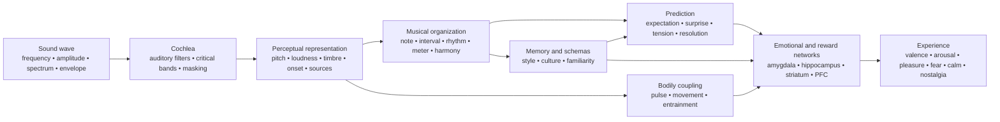

<!-- Translation of: research/sources/author-supplied/sound-expectation-and-emotion.md; source commit: 304d75ed6ff646d311fd9df8b4e2db0d4dee277a -->
# Sound and emotion: how acoustic structure turns into sensation, expectation, and affect

## Executive summary

The sound–emotion relation **does not work as a fixed dictionary** in which a frequency, an interval, or a chord necessarily produces an emotion. What exists is a probability architecture: acoustic features alter physiological arousal, salience, expectation, source segregation, the sense of stability and movement; these representations are then combined with cultural learning, autobiographical memory, familiarity, style, context, and performative intent. Cross-cultural studies show two important facts at once: some broad musical-emotion signals cross cultures, but specific preferences and meanings — e.g., the preference for consonance — can vary substantially with cultural experience. citeturn22search10turn5search11

The most important distinction is between **physical property** and **perception**. Frequency is not pitch; sound pressure is not loudness; physical multiplicity of voices is not necessarily the perceived number of voices; spectrum is not timbre. A particularly clear case is the *missing fundamental*: the listener may perceive a pitch corresponding to a fundamental frequency physically absent from the spectrum, and pitch-sensitive neurons respond to harmonic complexes with the missing fundamental. citeturn18search2

Emotionally, the most consistent effects appear in **tempo, intensity/loudness, mode, harmonic expectation, dissonance/roughness, timbre, and expressive performance**, but these parameters interact. In controlled studies, tempo and mode can serve partially different functions: tempo changes strongly affect *arousal*, while mode alters mood/valence ratings; pitch, intensity, and temporal-rate manipulations also change affective dimensions in both music and speech. citeturn20search4turn21search7

Music also reaches reward systems directly. Intense musical pleasure has been associated with dopamine release in the striatum; in Salimpoor and colleagues' classic study, the **caudate** was more associated with anticipation and the **nucleus accumbens** with the pleasurable peak. Pleasant and unpleasant music also differentially recruits ventral striatum, amygdala, hippocampus, parahippocampal gyrus, insula, and cortical regions. citeturn18search0turn18search1

This helps explain why **surprise is not simply "bad"**. Music exploits an intermediate regime between predictability and novelty: expectation builds a model; deviation produces information; resolution or confirmation turns part of that tension into reward. Harmonic-progression studies show uncertainty and surprise interact in predicting pleasure and activity in auditory cortex, amygdala, and hippocampus; other work finds a non-linear relation between predictability and pleasure. citeturn16search24turn16search1

In practical terms, the decisive variable is rarely "which chord is sad?" but **which set of cues is being organized into which temporal trajectory**. To produce sadness, for instance, minor mode alone is one cue; combining moderate/low register, slow tempo, low intensity, soft attacks, legato, low density, descending contours, and flexible temporal performance makes communication far more robust. Performance studies show precisely this redundancy: different performers can communicate the same emotion using different combinations of tempo, intensity, articulation, and timbre. citeturn22search4turn22search8

A useful synthesis is:

> **Acoustics sets possibilities → perception turns them into objects and patterns → prediction and memory assign meaning → autonomic, motor, limbic, and reward systems produce arousal, tension, pleasure, and memory → culture and context determine much of the final emotional meaning.**

The diagram should be read as a **network**, not a rigid neural chain. There is recurrent processing among auditory cortex, motor systems, memory, appraisal, and reward; moreover, familiarity and autobiography can profoundly alter the experience of the same acoustic signal. citeturn18search0turn18search1turn15search2

## From sound wave to emotional brain

### Physics: frequency, spectrum, envelope, and harmonics

A musical sound can be roughly described by its energy distribution over time and frequency. For a periodic signal, the fundamental frequency \(f_0\) corresponds to the pattern's repetition rate; acoustic instruments normally also produce partials above it. In approximately harmonic sounds, these partials appear near integer multiples of \(f_0\). However, **perceived pitch is an auditory-system inference**, not a simple reading of the lowest spectral component. That is why removing \(f_0\) does not necessarily remove that pitch sensation. citeturn18search2

The **spectrum** determines much of timbre. Classic psychophysical timbre-space studies found dimensions related to the **spectral centroid** — strongly associated with brightness sensation —, to attack temporal structure, and to spectral evolution across the sound. Later research confirms multiple spectral and temporal dimensions are needed to explain timbral similarity. citeturn21search4turn21search12

The **envelope** describes how energy varies over time. The ADSR model used in synthesis — *attack, decay, sustain, release* — is a useful simplification:

**attack** = initial amplitude rise;  
**decay** = fall after the peak;  
**sustain** = approximately sustained level while the source stays excited;  
**release** = dying away after excitation ends.

Real instruments often have more complex envelopes than a simple ADSR, but attack speed and spectro-temporal evolution greatly influence timbral identity and perceptual segmentation. citeturn21search4turn21search23

An abrupt attack produces large transient energy and often more high-frequency content; slow attacks obscure the exact onset instant and can yield a more continuous perception. This physical difference grounds musical contrasts like **percussive ↔ smooth**, **staccato ↔ legato**, **aggressive ↔ delicate**, though the resulting emotion depends on the rest of the musical setup. citeturn21search12turn22search4

### Critical bands, masking, and roughness

The cochlea does not perform a perfect Fourier transform: frequencies are analyzed by finite-width auditory filters. The classical **critical band** concept was experimentally demonstrated in loudness-summation phenomena, thresholds, and masking: spreading energy beyond a given bandwidth changes how it is perceptually combined. citeturn21search2turn21search25

This is key to understanding sensory consonance and dissonance. When nearby partials interact within overlapping auditory regions, fast amplitude fluctuations can produce **beating/roughness**. Plomp and Levelt's work established a historical link between critical bandwidth and tonal consonance, though real musical consonance also depends on harmonicity, familiarity, and culture. citeturn21search1turn5search17

**Masking** means one component can raise another's audibility threshold. In music production, therefore, adding energy does not necessarily add perceived information: spectrally competing layers can hide articulation, harmonic, and transient details. That is a direct bridge between psychoacoustics and orchestration/mixing. citeturn21search2

### From auditory cortex to reward system

Pitch, timbre, rhythm, and musical structure are not processed by a single "music center". One particularly strong neurophysiological example is the identification of pitch-sensitive cortical neurons responding to both pure tones and harmonic complexes of the same perceived \(f_0\), including when the fundamental is absent. citeturn18search2

When sound acquires emotional meaning, additional networks join in. In fMRI, persistently dissonant unpleasant music produced greater activity in amygdala, hippocampus, parahippocampal gyrus, and temporal poles, while pleasant music showed responses involving ventral striatum, insula, auditory cortex, and frontal/opercular regions. This does not mean one region "is" an emotion; it means the musical state modifies networks also involved in appraisal, memory, motivation, and action. citeturn18search1

The reward component is especially clear in intense pleasure. Salimpoor et al. combined functional neuroimaging and dopaminergic measures and found striatal dopamine release during intensely pleasurable music, with temporal differentiation between anticipation and hedonic peak. citeturn18search0

**Nostalgia** illustrates another path. In autobiographically relevant music, Janata found dorsal medial prefrontal cortex activity tracking autobiographical salience, while prefrontal and posterior networks participated in retrieving music-associated memories. Thus, no isolated acoustic property "contains nostalgia"; music works as an access key to a personal-memory network. citeturn15search2turn15search3

This also explains an essential distinction: **perceived emotion** ("this music sounds sad") is not identical to **felt emotion** ("this music makes me sad"). A performer can communicate sadness recognizably while the listener simultaneously experiences aesthetic pleasure. Performative-communication and reward studies address precisely different levels of this process. citeturn22search4turn18search0

## Pitch, frequency, notes, intervals, scales, modes, and harmony

### Pitch, frequency, note, and register

| Element | Physical/perceptual mechanism | Evidence-supported emotional tendency | Musical manipulation and application |
|---|---|---|---|
| **Frequency** | Physical repetition rate; in harmonic complexes relates to \(f_0\) but is not identical to pitch. citeturn18search2 | There is no general "X Hz = emotion Y" function. Emotional effect emerges from relations, spectrum, level, context, and learning. | Transposition, bass design, fundamental choice, synthesis, and EQ. Work relations and trajectory, not "magic frequencies". |
| **Pitch** | Perceptual representation of periodicity/fundamental, preservable even with *missing fundamental*. citeturn18search2 | Raising pitch tends to raise *arousal* in controlled manipulations; valence meaning depends on timbre, context, and style. In isolated violin notes, higher pitch raised *arousal*. citeturn22search2turn22search6 | Raise register for intensification, urgency, or lightness; lower for weight, stability, or intimacy, always testing timbral interaction. |
| **Note** | Event combining pitch, onset, duration, intensity, and timbre. | The name "C", "F♯" etc. has no demonstrated intrinsic emotion. Even an isolated note changes emotionally when pitch, vibrato, and dynamics change. citeturn22search2 | Think of each note as a multidimensional event: voicing, envelope, articulation, and melodic destination matter as much as its pitch class. |
| **Register** | Placement of pitches in low/high bands, also altering instrumental spectrum and masking. | Higher registers often raise activation/tension; low registers can yield weight/power, but the effect is neither universal nor separable from timbre. citeturn22search2turn21search7 | Reserve register extremes for structural points; contrast a central section with an acute climax or sub-bass to widen the state change. |

In composition, it is particularly useful to separate **absolute pitch** from **contour**. An ascending leap, progressive register accumulation, or a descending line creates directional information even when tonality stays the same. Affectively, trajectory is usually more informative than a single note.

### Intervals

A simultaneous interval produces a combined spectrum. When the two notes' partials heavily interfere within the same critical regions, roughness rises; when they share high harmonicity, perceptual fusion may increase. This acoustic component helps explain part of sensory dissonance, but does not exhaust the musical-consonance experience. citeturn21search1turn5search17

Dissonance also has early neural and affective correlates, and persistently dissonant music can heighten responses in structures related to salience and negative valence. citeturn18search1

However, it is a mistake to turn this into the rule:

> minor second = fear; minor third = sadness; fifth = power.

These pairs can work stylistically, but an interval's meaning changes with **register, melodic direction, duration, metric position, timbre, tonal context, and culture**. The very preference for consonance over dissonance varies across populations with different degrees of Western-music exposure. citeturn5search11

**Application:** small chromatic intervals effectively create friction when they keep partials close and challenge tonal expectation; wide leaps can highlight surprise, expansion, or instability; sustained consonances tend to lower sensory tension but may stay harmonically "suspended" if context demands resolution.

### Scales and modes

A scale is a pitch collection; a mode adds **hierarchy, center, and melodic/harmonic behavior**. The major/minor emotional effect is one of the Western tonal tradition's most documented phenomena: in experiments manipulating mode and tempo, mode alters mood/valence ratings, while tempo strongly influences arousal. citeturn20search4turn20search13

This yields the robust but not absolute association:

**major → relatively more positive valence**  
**minor → relatively more negative/sad valence**

It does not mean "minor = sadness". A minor mode at 170 BPM, with strong intensity, bright timbre, and motor rhythm, can produce excitement, aggressiveness, or euphoria; a slow, sparse major mode with low dynamics can sound contemplative or melancholic. The multivariate configuration determines the outcome. citeturn20search4turn21search7

Modes like Dorian, Phrygian, Lydian, or Mixolydian gain meaning through a combination of **characteristic intervals + tonal center + learned repertoire**. There is far less experimental evidence supporting "Lydian produces emotion X" cross-culturally. Cross-cultural studies indicate listeners can recognize some emotional categories in culturally foreign music, but also show cultural learning strongly modifies musical judgments. citeturn22search10turn5search11

**Application:** instead of choosing a mode by emotional label, identify which note distinguishes it from the expected major/minor and **make that note perceptually structural**. A Lydian ♯4 hidden in a passage does not produce the same effect as a ♯4 sustained in a salient position against the tonic.

### Harmony, progressions, and cadences

| Element | Mechanism | Emotion/perception | Techniques |
|---|---|---|---|
| **Harmony** | Simultaneous pitch combination → harmonicity, roughness, fusion, virtual bass, and learned relations. citeturn21search1turn5search17 | Consonance tends toward greater pleasantness in familiarized listeners; sustained dissonance can raise tension/negative valence. Preference is not culturally invariant. citeturn18search1turn5search11 | Spacing, inversion, low register, extensions, clusters, voicings, and preparation/resolution control. |
| **Progression** | Sequence turns chords into conditional probabilities: each event updates the next one's expectation. | Lower probability can raise surprise and tension; pleasure can result from specific uncertainty-surprise combinations. citeturn16search24turn16search1 | Prepare → deviate → resolve; substitute dominant; prolong predominant; modulation; pivot chords; chromaticism. |
| **Cadence** | Closing event combining bass motion, scale degrees, voice leading, meter, and learned expectation. | Different cadences receive distinct valence and arousal ratings; strong closure reduces uncertainty, while interrupted cadences preserve expectation. citeturn16search2turn16search6 | Authentic cadence for closure; deceptive for prolongation; half cadence for suspension; elision to keep flow. |

The scientific key here is **prediction**. A progression is not emotional only through its isolated chords; it builds a probability space. A chord neutral in isolation can trigger a large response if it occupies a point where the internal model predicted something else. Cheung and colleagues showed **surprise and uncertainty interact** in predicting musical pleasure and modulate auditory cortex, amygdala, and hippocampus. citeturn16search24

This offers a first-principles explanation of harmonic tension:

\[
\text{Perceived tension}
\approx
f(\text{sensory dissonance},
\text{tonal instability},
\text{improbability},
\text{postponement},
\text{energy},
\text{context})
\]

It is not a literal physiological equation; it is a functional decomposition. Two chords can have similar roughness yet cause different tensions because one is expected and the other violates learned grammar.

For composition, the most powerful principle is controlling **the amount and placement of unexpected information**. Constant surprise stops being surprise; total predictability reduces information. The field of greatest emotional interest tends to lie between the extremes, also observed in pleasure-predictability studies. citeturn16search1turn16search24

## Tempo, duration, rhythm, meter, microtiming, and groove

### Tempo and duration

**Tempo** alters event density per time unit and hence the speed at which the perceptual system must update predictions. It is one of the strongest emotional cues. Experimental manipulations show tempo changes influence *arousal*, and faster music tends to produce greater activation than slow music, though intensity, rhythm, and preference can modify the effect. citeturn20search4

The effect also appears physiologically: studies with music under different tempo conditions observed cardiovascular, respiratory, and cerebrovascular changes, supporting the idea that musical tempo is not merely an "energy" metaphor; it can effectively modify autonomic state. citeturn7search1

Broadly:

| Setup | Most likely tendency |
|---|---|
| fast + loud + bright + articulated | high arousal; energetic joy, urgency, anger, or excitement per valence/context |
| slow + soft + dark + legato | low arousal; calm, tenderness, or sadness |
| slow + loud + low + dissonant | threat, solemnity, or weight |
| fast + low level + irregular | nervousness, instability, restlessness |

These combinations are probabilistic, not universal recipes. Performative-communication evidence shows precisely that several acoustic cues are redundant and can substitute for one another. citeturn22search4turn22search8

**Duration** operates at several levels: note duration, inter-onset interval, phrase duration, and a harmony's dwell time. Short notes increase event separation and can make pulse more explicit; long notes increase continuity and allow greater spectral development, vibrato, and internal dynamics. In performative-expression studies, duration and articulation join a larger cue set, which is why attributing a fixed emotion to "long note" or "short note" is dangerous. citeturn22search4

In production, a duration change can radically transform the same MIDI sequence without altering pitch: shorten *gate* and release to raise definition/transience; lengthen sustain/release to fuse events and reduce temporal granularity.

### Rhythm and meter

Rhythm is the temporal distribution of events; meter is a structure of **accent expectations**. The brain does not just hear "how much time passed": it builds regularities and predicts onsets. When a note lands where the metric model did not expect it, we get displacement, syncopation, or temporal surprise.

Beat perception is strongly tied to the motor system, even without explicit physical movement; neuroimaging studies show motor-area recruitment during musical-rhythm listening, providing a neural basis for the beat–urge-to-move link. citeturn7search25turn7search37

**Meter** alone has less direct evidence of "specific emotion" than tempo or mode. Its main affective power seems indirect: it defines the matrix against which syncopation, anticipation, delay, and accents are judged. A stable meter makes deviations legible; an already highly unpredictable meter alters the prediction reference itself.

This implies an important compositional rule:

> **To produce rhythmic tension, there must first be something temporally predictable to tension.**

### Syncopation and groove

The best-known experimental groove result is the **inverted-U** curve found by Witek et al.: intermediate syncopation levels produced greater pleasure and stronger urge to move the body than very low or very high levels. citeturn20search2

The logic resembles harmony's:

**too much predictability** → little challenge;  
**intermediate deviation** → sufficiently clear expectation + new information;  
**excessive chaos** → beat prediction weakens, reducing the chance to "play against" the grid.

This relation is particularly relevant to funk, hip-hop, dance music, and other styles where groove depends on the interaction between a stable temporal reference and displacing events. Witek et al. found the relation for both pleasure and movement urge. citeturn20search2

### Microtiming

Microtiming is the displacement of events by tens of milliseconds around a nominal metric position. Musically, it can appear as *laid-back*, *pushing*, swing, bass-drum asynchrony, snare delay, or a performer's individual timing.

A production myth is that "quantized = grooveless" and "imperfect = human = better". Experiments do not support this general rule. Frühauf and colleagues manipulated microtemporal deviations in drum patterns and found groove decreased as artificial deviations grew larger; precisely aligned timing could receive very high ratings. citeturn22search5

In another approach, Senn et al. compared professional bass/drum performances, quantized versions, and exaggerated microtiming. Original performance and quantization could yield comparable groove levels, while exaggerating deviations harmed the experience; expert listeners were also more sensitive to the differences. citeturn22search27

Therefore:

\[
\text{effective microtiming} \neq \text{random error}
\]

It is **relational structure**. The snare delay can work because kick, bass, hi-hat, and subdivision form consistent references. Randomizing every note ±20 ms destroys precisely the relations that make a pocket recognizable.

### Comparative temporal map

| Element | Physics/perception | Most associated emotions | Practical techniques |
|---|---|---|---|
| **Tempo** | Global event/pulse rate. | Fast → ↑ arousal; slow → ↓ arousal, on average. citeturn20search4 | BPM automation, perceptual half-time/double-time, ritardando, accelerando. |
| **Duration** | Temporal extent of event/envelope. | Short can raise activity/definition; long can favor continuity/calm or sustained tension; highly contextual. citeturn22search4 | Gate, note length, sustain, release, fermata. |
| **Rhythm** | Onset and duration patterns. | Regularity favors prediction; disruption yields expectation/surprise. | Ostinato, syncopation, anticipation, silence, density. |
| **Meter** | Strong/weak pulse hierarchy. | Effect mainly via stability and expectation violation. | Stable 4/4, additive meters, cross-accents, hemiola. |
| **Microtiming** | Sub-metric onset deviations. | Can yield pocket/urgency/relaxation; excess reduces groove. citeturn22search5turn22search27 | Delay snare, anticipate bass, swing, per-instrument timing. |
| **Groove** | Integration of beat, syncopation, pattern, and motor coupling. | Pleasure + urge to move; intermediate syncopation often maximizes both. citeturn20search2 | Stable layer + controlled deviations; interlocking; repetition with microvariation. |

## Timbre, intensity, dynamics, articulation, texture, register, and orchestration

### Timbre

Timbre is not a simple dimension. It emerges from **spectrum, harmonic and noise distribution, attack, decay, modulations, inharmonicity, and temporal evolution**. Psychophysically, spectral centroid and attack properties are among the main axes differentiating instrumental sounds. citeturn21search4turn21search12

The emotional consequence is profound: the same melodic material can change character when the instrument changes. Hailstone et al. experimentally showed timbre affects musical-emotion judgments independently of several other controlled musical factors. citeturn20search5

A useful operational description:

**higher spectral centroid / more high energy** → greater "brightness", penetration, possible higher arousal;  
**more noise, inharmonicity, and roughness** → greater salience, harshness, possible threat/tension;  
**abrupt attack** → greater definition and impulsiveness;  
**slow attack** → lower onset salience and greater fusion;  
**strong stable harmonic component** → clear pitch/fusion;  
**diffuse/noisy spectrum** → pitch ambiguity and texture.

These dimensions have no fixed valence. Brightness can mean joy on an acute flute or aggressiveness on a distorted guitar; noise can represent threat, energy, ecstasy, or simply a stylistic convention.

**Synthesis application:** to raise tension without altering harmony, progressively raise spectral centroid, increase noise/inharmonicity, shorten attack, or introduce spectral modulation. To dissolve tension, perform the reverse motion.

### Intensity and dynamics

Physically, intensity relates to sound energy/pressure; perceptually, the correlate is **loudness**, whose relation to physical level depends on frequency, duration, context, and spectral distribution. The critical-band concept shows the auditory system sums energy depending on how it spreads across auditory filters. citeturn21search2turn21search25

In music, greater intensity is a classic cue of **arousal, power, and urgency**, but again interacts with other dimensions. Ilie and Thompson found intensity, pitch, and temporal rate modify affective dimensions in musical and speech stimuli. citeturn21search7

A recent isolated-violin-note study also shows why simple rules fail: in that experimental set, pitch and vibrato had stronger affective effects than dynamics, and dynamics effects did not necessarily follow the "louder = more arousal" caricature in all conditions. citeturn22search2turn22search6

**Dynamics** is more than absolute level:

- **crescendo** creates a positive energy derivative, often read as approach, intensification, or arrival;
- **decrescendo** can produce withdrawal/dissolution;
- **sforzando/accent** raises salience and surprise;
- **subito piano** can produce strong contrast without being physically intense;
- **excessive compression** shrinks the space between intensity states, potentially reducing an important expressive dimension.

The emotional principle is that the brain responds not only to values but also to **changes**.

### Articulation

Articulation controls the temporal and spectral relation between notes: effective length, onset clarity, overlap, and intermediate silence.

**staccato**: short durations, greater separation, perceptually clear onsets;  
**legato**: overlap/connection, energy continuity;  
**marcato/accent**: greater attack salience;  
**tenuto**: duration/energy maintenance.

In Juslin's experiment, professional musicians could communicate anger, sadness, happiness, and fear through acoustic-cue combinations including **tempo, level, articulation, and timbre**; listeners used compatible cues, and different performers could reach similar results via distinct combinations. citeturn22search4turn22search8

This matters greatly for MIDI composition: programming only the right notes preserves a fraction of the message. **Velocity, note length, overlap, timing, attack, and phrase dynamics** can determine whether the same sequence is perceived as mechanical, tender, aggressive, hesitant, or joyful.

### Texture

Texture adds another variable: **how many simultaneous perceptual streams exist and how they relate**.

In three experiments with polyphonic excerpts, Broze et al. manipulated/studied voice multiplicity and found textures with more voices were rated **happier, less sad, less lonely, and prouder**. Judgments closely tracked the voices' perceived numerosity. citeturn17view3

This finding is especially interesting because it shows emotion can emerge from a structural dimension that is neither "melody" nor "chord". Yet the mechanisms themselves are contextual: a mass of a hundred aggressive voices obviously need not sound happier than a lone voice. The study demonstrates an effect in specific polyphonic stimuli, not a universal density law. citeturn17view3

In practice:

**monophony** → exposure, vulnerability, clarity, potential loneliness;  
**dense homophony** → mass, power, communality;  
**polyphony** → activity, complexity, independence;  
**drone** → stability or suspension;  
**cluster/sound mass** → fusion, roughness, source ambiguity.

The emotional effect depends mainly on **density × timbre × register × intensity × internal movement**.

### Orchestration

Orchestration simultaneously manipulates spectrum, register, source count, placement, attack, envelope, and dynamics. It is thus a kind of psychoacoustic "macro-control".

The instrumental-timbre emotional power finds direct support in Hailstone et al.; moreover, experiments comparing instrumental versions show instrumentation can alter arousal while keeping related musical material. citeturn20search5turn10search10

A practical reading:

| Goal | Acoustic-orchestral strategies |
|---|---|
| **intimacy** | few sources, close register, low level, soft attacks, narrow spectral width |
| **grandeur** | wide register span, doublings, solid bass, high multiplicity, dynamic build |
| **threat** | energetic lows + roughness + noise + strong attacks + dissonance + low predictability |
| **lightness** | smaller spectral mass, delicate transients, middle/high register, gaps between events |
| **mystery** | partially ambiguous pitch, slow attacks, moderate inharmonicity, drones, low event density |
| **climax** | simultaneous expansion of intensity, register, density, brightness, and event rate |

The most efficient way to build climax is usually not maximizing everything from the start; it is **preserving acoustic degrees of freedom to open later**.

## Ornamentation and performative techniques

Human performance introduces continuous motion in parameters notation usually represents discretely. That is where vibrato, portamento, glissando, trill, rubato, accent, and microdynamics turn "the note" into expressive behavior.

### Vibrato

Vibrato is a periodic modulation — mostly of frequency/pitch, often accompanied by amplitude and spectrum components depending on instrument. Its parameters include:

\[
\text{rate} \quad+\quad \text{depth} \quad+\quad \text{onset} \quad+\quad \text{regularity}
\]

In a controlled study with violin sounds varying pitch, dynamics, and vibrato, vibrato was the second most influential factor: greater vibrato tended to **lower valence and raise arousal**, while higher pitch also raised arousal. citeturn22search2turn22search6

This does not imply "vibrato = sadness". In real performance, vibrato can communicate warmth, passion, tension, vulnerability, exuberance, or intensity because its meaning depends on rate, width, onset, structural note, and stylistic tradition.

**Application:** do not apply uniform vibrato to every note. Control its **trajectory**: starting without vibrato and widening it across a note produces different intensification than starting with wide vibrato and reducing it.

### Portamento and glissando

**Portamento** connects two pitches through a perceptually expressive continuous transition; **glissando** makes the path more explicitly audible and can span a wide range.

Physically, both turn a discrete frequency leap into a **continuous \(f_0\) trajectory**. This raises temporal information internal to the note and can generate anticipation, approach toward, or departure from the target.

Isolated causal evidence for portamento/glissando, apart from all other emotional parameters, is much scarcer than for tempo, mode, or vibrato. Hence attributions like "portamento = nostalgia" should be treated as stylistic and performative conventions, not psychoacoustic laws.

In practice:

**slow upward portamento** → emphasizes the act of arriving;  
**pitch fall** → can communicate relaxation, lament, or dissolution per context;  
**fast glissando** → surprise, gesture, comedy, or threat per timbre;  
**selective portamento** → raises expressiveness by contrasting with unslid notes.

### Trill and other fast ornaments

Trill rapidly alternates two pitches and thus raises temporal density, spectral modulation, and local uncertainty. Depending on speed, the listener perceives alternating notes or a more fused texture.

Physically, there is a transition from a **discrete-events** regime to **temporal modulation/roughness** as rate grows. Emotionally, this can yield excitement, elegant ornamentation, instability, or tension, but meaning is highly stylistic.

The same reasoning covers mordents, tremolo, and flutter:

- more events per second → generally greater perceptual activity;
- greater modulation → greater salience;
- regularity → predictability;
- irregularity → instability;
- approach to structurally important notes → greater expectation.

### Rubato

Rubato reorganizes micro- and macro-time without necessarily changing global mean tempo. It directly modifies the prediction field: delaying an arrival point prolongs expectation; compressing time after the delay can create drive.

Rubato is better thought of as **phrase temporal curvature**, not imprecision. Juslin-studied emotional performance demonstrates timing, articulation, dynamics, and timbre form a redundant code performers use to communicate recognizable emotions. citeturn22search4

For expressiveness:

\[
\text{useful rubato} = \text{structure-related deviation}
\]

and not

\[
\text{useful rubato} = \text{random jitter}
\]

Systematically delaying a climax, an appoggiatura, or a cadence resolution communicates intent; shifting every note randomly simply degrades predictability.

### Compared performative techniques

| Technique | Main acoustic change | Likely emotional effect | Use |
|---|---|---|---|
| **Vibrato** | pitch/amplitude/spectrum modulation | ↑ arousal when more intense in violin study; context-dependent valence. citeturn22search2 | note climax, warmth, tension, intensity |
| **Portamento** | continuous path between pitches | approach, lament, sensuality, stylistic nostalgia; limited isolated evidence | voices, strings, synth lead |
| **Glissando** | wide pitch sweep | gesture, surprise, perceptual acceleration, threat/comedy per timbre | transitions, risers, harp, strings, synth |
| **Trill** | fast alternation between pitches | excitement/instability/ornament | suspense, cadence, brilliance |
| **Tremolo** | fast repetition/modulation | arousal, expectation, sustained energy | strings, guitar, percussion |
| **Rubato** | structured timing deformation | expectation, hesitation, expansion, intimacy | melodic phrasing |
| **Accent** | local attack/intensity | salience, surprise, force | meter, groove, climax |
| **Legato** | overlap and smoothed attacks | continuity; often associated with less abrupt states | calm, lyricism, contextual sadness/tenderness |
| **Staccato** | reduced duration and separation | greater segmentation/activity; can signal lightness or aggressiveness | dance, humor, urgency |
| **Internal dynamics** | variable envelope within the note | approach/withdrawal and intensification | winds, voice, strings, synth automation |

For portamento, glissando, and trill, the specific experimental literature is considerably less extensive than for tempo, loudness, timbre, mode, groove, or vibrato; the applications above are therefore acoustic-musical inferences and performative conventions, not universal emotional correspondences.

## Comparative synthesis, applications, and key studies

### Full element → mechanism → emotion → technique map

| Element | Dominant mechanism | Most defensible emotional effect | How to exploit |
|---|---|---|---|
| **Pitch** | perceived periodicity | ↑ pitch often ↑ arousal. citeturn22search2 | register trajectory, leaps, climax |
| **Frequency** | physical oscillation | no fixed emotion per Hz | harmonic relations, spectrum, sub-bass |
| **Timbre** | spectrum + envelope | alters emotion even with controlled musical material. citeturn20search5 | brightness, noise, attack, inharmonicity |
| **Intensity** | energy/pressure → loudness | often arousal/power; interactive effect. citeturn21search7 | level, accent, contrast |
| **Duration** | temporal extent | modulates activity/continuity; little deterministic alone | gate, sustain, silence |
| **Rhythm** | onset patterns | prediction, surprise, motor activation | syncopation, ostinato, density |
| **Meter** | beat hierarchy | structures expectation | displacement, hemiola, additive meter |
| **Tempo** | global speed | strong arousal determinant. citeturn20search4 | BPM, ritardando, accelerando |
| **Note** | pitch + envelope + timbre + level | no pitch class has demonstrated intrinsic emotion | treat the note as a multidimensional event |
| **Interval** | spectral interaction + tonal relation | roughness/dissonance can raise tension; meaning context-dependent. citeturn21search1 | spacing, direction, register |
| **Scale** | pitch collection/statistics | mainly relational/cultural meaning | characteristic notes and hierarchy |
| **Mode** | tonal hierarchy | major/minor influences valence/mood in familiarized listeners. citeturn20search4 | modal interchange, modal mixture |
| **Harmony** | simultaneity + harmonicity + tonal schema | consonance/dissonance and stability influence pleasure/tension. citeturn18search1turn5search11 | voicing, extensions, chromaticism |
| **Progression** | sequential prediction | surprise + uncertainty modulate tension and pleasure. citeturn16search24 | preparation/deviation/resolution |
| **Cadence** | probabilistic/tonal closure | different closures alter valence/arousal and completeness. citeturn16search2 | authentic, deceptive, half cadence |
| **Articulation** | onset + duration + overlap | strongly joins expressive communication, with other cues. citeturn22search4 | legato/staccato/marcato |
| **Dynamics** | loudness trajectory | crescendo/contrast modulate arousal and salience | automation, swell, subito |
| **Ornamentation** | fast local modulations | intensifies activity, salience, and expectation; highly style-dependent | trill, mordent, tremolo |
| **Texture** | number/segregation of streams | more voices were more positive and less lonely in controlled stimuli. citeturn17view3 | monophony ↔ mass/polyphony |
| **Register** | spectral/pitch position | extremes raise salience; high tends to raise arousal in pitch manipulations | registral expansion/contraction |
| **Orchestration** | timbre, register, and source combination | instrumentation alters arousal and affective character. citeturn20search5turn10search10 | density, doubling, timbral contrast |
| **Microtiming** | millisecond deviations | groove relation is structural; more deviation is not automatically better. citeturn22search5turn22search27 | pocket, laid-back, push |
| **Groove** | beat + syncopation + motor prediction | pleasure and urge to move; frequent maximum at intermediate complexity. citeturn20search2 | predictable base + controlled syncopation |
| **Performance** | continuous timing, level, timbre, pitch combination | performers communicate emotions via redundant cues. citeturn22search4 | phrasing and cue coordination |

### How to compose by emotion without falling into formulas

The most robust method works in **vectors**, not individual elements.

For **calm**, lower arousal on several axes at once: moderate/slow tempo, low onset density, rounded attacks, little roughness, stable dynamics, non-extreme register, sufficient predictability, and longer release. The tempo, intensity, and expression literature supports these relations as tendencies, not guarantees. citeturn20search4turn21search7turn22search4

For **sadness**, a minor mode can reinforce negative valence, but becomes far more effective with low arousal: slow tempo, connected articulation, reduced intensity, and lower density. citeturn20search4turn22search4

For **joy**, raise valence and often arousal: greater metric predictability, livelier tempo, less harsh timbres, clear articulation, major mode when stylistically relevant, and socially "full" textures. The positive influence of greater voice multiplicity was demonstrated in a controlled polyphonic-music set. citeturn17view3turn20search4

For **fear/threat**, combine high salience with negative valence: roughness, dissonance, low predictability, abrupt attacks, register extremes, noise, sudden dynamics, and events whose timing breaks expectation. The association of persistent dissonance with amygdala/hippocampus activity and other affective structures provides experimental grounding for part of this effect. citeturn18search1

For **tension**, the central tool is **postponement**: establish an expectation and temporarily block its completion. This can happen harmonically, rhythmically, melodically, dynamically, or by register. Musical-surprise studies show expectation and uncertainty are central to affective and hedonic response. citeturn16search24turn16search1

For **surprise**, first preserve some redundancy. An expectation break is informative only if a sufficiently stable model existed to break. citeturn16search24

For **groove and bodily pleasure**, do not maximize complexity: keep the beat recoverable and place enough syncopation to mobilize prediction and movement. Experimental evidence favors an intermediate syncopation zone. citeturn20search2

For **nostalgia**, do not seek a specific frequency. Familiarity and autobiographical association matter far more. Music tied to personal history recruits prefrontal networks associated with autobiographical memory and personal salience. citeturn15search2

### Arrangement and production application

In **arrangement**, think of emotion as perceptual-resource management. A section can be made bigger without changing any chord: double octaves, expand register, raise voice count, add transients, raise brightness, and widen dynamics. Each step modifies dimensions with distinct psychoacoustic correlates. citeturn21search4turn17view3

In **production**, EQ and synthesis are not merely technical processes. Changing spectral centroid changes brightness; a compressor alters envelope and contrast; saturation introduces harmonics and potential roughness; reverb prolongs energy and reduces temporal sharpness; transient shaping modifies attack; quantization modifies temporal expectation; velocity and automation alter loudness and timbre simultaneously. The perceptual timbre and envelope dimensions demonstrated in psychophysics ground these manipulations. citeturn21search4turn21search12

**Masking** introduces another principle: an emotionally "big" arrangement need not have more elements, but perceptually distinguishable ones. If two layers occupy similar filters and mutually mask their attacks/harmonics, raising both can reduce clarity instead of raising impact. citeturn21search2

In the **bass**, spacings and voicings deserve special attention: auditory-filter width, harmonic density, and beating frequencies make compact structures in low registers often produce more interaction/roughness than the same interval in higher registers. The principle derives from the critical-bandwidth–sensory-consonance relation. citeturn21search1

In **electronic music**, this allows building emotion without complex tonality: a single pitch can traverse entirely different states through filter automation, envelope, distortion, spectral width, rhythmic density, microtiming, and intensity. Timbre, rhythm, and expectation already provide several independent affective channels. citeturn20search5turn20search2

### Performance application

For performers, the literature's biggest result is that emotion should not be "placed" exclusively in tempo or exclusively in dynamics. Studies show **cue redundancy**: the listener combines tempo, intensity, articulation, timbre, and other variables to infer emotional intent. citeturn22search4turn22search8

This suggests a three-scale performance strategy:

**Macro:** choose the tempo, dynamics, and density trajectory for the whole section.

**Meso:** give each phrase a destination — expansion, suspension, acceleration, resolution.

**Micro:** determine onset, duration, intensity, vibrato, portamento, and timing of structural notes.

An effective expressive interpretation tends to point these scales in the same direction. A climax simultaneously gaining pitch, intensity, density, vibrato, and temporal urgency contains redundant intensification cues; redundancy raises emotional legibility, exactly as experimentally observed in performative communication. citeturn22search4

### What the evidence supports — and what it does not

Research confidently supports that acoustic and structural properties **systematically alter affective dimensions**. Tempo, mode, intensity, pitch, timbre, expectation, consonance/dissonance, voice density, syncopation, and performance are measurable and experimentally manipulable. citeturn20search4turn20search5turn17view3turn20search2

It does not support building a universal table like:

> 440 Hz = emotion A  
> 432 Hz = emotion B  
> minor third = sadness  
> Dorian D = hope  
> 120 BPM = happiness.

Pitch is not even equivalent to simple physical frequency, as the *missing fundamental* shows; and consonance and emotion effects vary with exposure and culture. citeturn18search2turn5search11

Nor is it appropriate to say "the amygdala is the musical-fear center" or "the nucleus accumbens is the pleasure center". Studies show **distributed networks**, in which auditory, motor, mnemonic, evaluative, and reward regions dynamically interact. citeturn18search0turn18search1turn15search2

Finally, **approach/avoidance** should be used more cautiously than valence and arousal. A high-arousal sound can induce approach when pleasurable — dance, ecstasy, groove — or vigilance/avoidance when threatening. The same acoustic energy can therefore feed opposite motivational states depending on valence, prediction, and context. The coexistence of reward responses to intensely exciting music and negative responses to unpleasant dissonance illustrates this point. citeturn18search0turn18search1

### Essential primary studies

For **pitch and neural representation**, Bendor & Wang (2005), *The neuronal representation of pitch in primate auditory cortex*, is fundamental for demonstrating neurons preserving pitch even with the *missing fundamental*. citeturn18search2

For **critical-band and consonance psychoacoustics**, Zwicker, Flottorp & Stevens (1957), *Critical Band Width in Loudness Summation*, and Plomp & Levelt (1965), *Tonal Consonance and Critical Bandwidth*, remain foundational references. citeturn21search2turn21search1

For **timbre**, McAdams et al. (1995), *Perceptual scaling of synthesized musical timbres*, establishes perceptual spectral and temporal dimensions; Hailstone et al. (2009), *Timbre affects perception of emotion in music*, demonstrates timbre's contribution to perceived emotion. citeturn21search4turn20search5

For **tempo, mode, pitch, and intensity**, Husain, Thompson & Schellenberg (2002) and Ilie & Thompson (2006) are central references in controlled manipulations of acoustic-musical cues and affective dimensions. citeturn20search4turn21search7

For **emotional performance**, Juslin (2000), *Cue Utilization in Communication of Emotion in Music Performance*, empirically shows how musicians and listeners converge in using multiple expressive cues. citeturn22search4

For **emotion and brain**, Koelsch et al. (2006), *Investigating emotion with music: an fMRI study*, shows differential responses to consonant/pleasant vs. persistently dissonant/unpleasant music. citeturn18search1

For **pleasure and dopamine**, Salimpoor et al. (2011), *Anatomically distinct dopamine release during anticipation and experience of peak emotion to music*, links musical pleasure to striatal dopaminergic release and differentiates anticipation from hedonic peak. citeturn18search0

For **surprise, expectation, and reward**, Cheung et al. (2019), *Uncertainty and Surprise Jointly Predict Musical Pleasure and Amygdala, Hippocampus, and Auditory Cortex Activity*, and Gold et al. (2019), *Predictability and Uncertainty in the Pleasure of Music*, provide evidence that musical pleasure depends on the interaction between prediction and new information. citeturn16search24turn16search1

For **groove**, Witek et al. (2014), *Syncopation, Body-Movement and Pleasure in Groove Music*, demonstrates the inverted-U relation between syncopated complexity, pleasure, and urge to move. citeturn20search2

For **microtiming**, Frühauf et al. (2013), *Music on the Timing Grid*, and Senn et al. (2016), *The Effect of Expert Performance Microtiming on Listeners' Experience of Groove*, are particularly useful because they counter the simplistic idea that more temporal deviation necessarily means more groove. citeturn22search5turn22search27

For **texture**, Broze et al. (2014), *Polyphonic Voice Multiplicity, Numerosity, and Musical Emotion Perception*, provides rare experimental evidence that perceived voice count alters perceived emotion. citeturn17view3

For **nostalgia and autobiographical memory**, Janata (2009), *The Neural Architecture of Music-Evoked Autobiographical Memories*, shows the association between autobiographically salient music and medial prefrontal cortex. citeturn15search2

For **culture and universality**, Fritz et al. (2009), *Universal Recognition of Three Basic Emotions in Music*, demonstrates some cross-cultural recognition of basic emotions; this result should be read together with studies like McDermott et al., showing strong cultural influence on consonance preference. citeturn22search10turn5search11

The synthesis of all this literature is a perspective shift: **musical emotion does not live in isolated notes, frequencies, or chords. It emerges from the temporal transformation of acoustic energy into perception, prediction, movement, memory, and value.** Composition controls the probabilities; performance gives those probabilities trajectory; the brain interprets them in light of a body, a culture, and a personal history.
